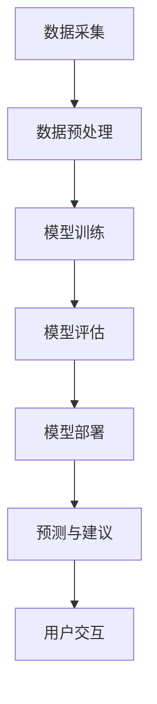

                 

**文章标题：AI Agent在智能枕头中的呼吸模式分析**

**关键词：人工智能、呼吸模式、智能枕头、AI Agent、健康监测**

**摘要：**
随着人工智能技术的不断发展，AI Agent在智能枕头中的应用逐渐成为研究热点。本文将从背景介绍、核心概念阐述、算法原理讲解、系统设计与实现、项目实战以及最佳实践等方面，深入分析AI Agent在智能枕头中的呼吸模式分析，旨在为读者提供一个全面的技术视角。

**目录大纲设计思路：**
为了设计出《AI Agent在智能枕头中的呼吸模式分析》的完整目录大纲，我们将按照以下步骤进行：

1. **背景介绍**：首先，我们将对AI Agent和智能枕头进行背景介绍，阐述问题的背景、问题描述、问题解决方法以及核心要素的组成。

2. **核心概念与联系**：接着，我们将详细阐述AI Agent和智能枕头的核心概念，通过对比表格和ER实体关系图来帮助读者理解概念之间的关系。

3. **算法原理讲解**：在这一部分，我们将详细讲解AI Agent在智能枕头中的应用原理，使用mermaid画出相关流程图，并用Python代码和数学公式进行解释。

4. **系统分析与架构设计方案**：我们将描述问题场景和项目背景，设计系统功能、架构、接口和交互。

5. **项目实战**：我们将介绍环境安装、核心实现、代码解读、案例分析以及小结。

6. **最佳实践与拓展**：最后，我们将提供最佳实践建议、注意事项和拓展阅读资源。

**目录大纲：**

**第一部分：背景与核心概念**

# AI Agent在智能枕头中的呼吸模式分析

> 关键词：人工智能、呼吸模式、智能枕头、AI Agent、健康监测

> 摘要：
随着人工智能技术的不断发展，AI Agent在智能枕头中的应用逐渐成为研究热点。本文将从背景介绍、核心概念阐述、算法原理讲解、系统设计与实现、项目实战以及最佳实践等方面，深入分析AI Agent在智能枕头中的呼吸模式分析，旨在为读者提供一个全面的技术视角。

## 1.1 问题背景

### 1.1.1 人工智能在健康领域的应用

人工智能在健康领域的应用已经取得了显著的成果。例如，通过AI技术，可以实现疾病的早期诊断、个性化治疗以及健康管理的智能化。在这个背景下，智能枕头作为健康监测设备之一，也逐渐受到了广泛关注。

### 1.1.2 智能枕头与呼吸模式的关系

呼吸模式是人体健康的重要指标之一。智能枕头可以通过监测用户的呼吸模式，实时了解用户的身体状况，为用户提供个性化的健康服务。

### 1.1.3 AI Agent的核心功能与作用

AI Agent是一种具有自主学习和决策能力的智能系统，其在智能枕头中的应用主要体现在呼吸模式分析上。通过AI Agent，可以实现对呼吸模式的高效监测和分析，为用户提供更加精准的健康服务。

## 1.2 AI Agent的定义与分类

### 1.2.1 AI Agent的基本概念

AI Agent是一种具有自主性和智能性的系统，能够根据环境变化进行自主学习和决策。在智能枕头中，AI Agent的作用主要是对呼吸模式进行监测和分析。

### 1.2.2 AI Agent的分类

根据应用场景的不同，AI Agent可以分为多种类型，如监督学习Agent、无监督学习Agent和强化学习Agent等。在智能枕头中，常用的AI Agent类型是监督学习Agent和无监督学习Agent。

### 1.2.3 AI Agent的关键技术

AI Agent的关键技术主要包括机器学习、深度学习和自然语言处理等。这些技术使得AI Agent能够高效地处理复杂的数据，实现自主学习和决策。

## 1.3 智能枕头的工作原理

### 1.3.1 智能枕头的结构组成

智能枕头主要由传感器模块、数据处理模块和交互模块组成。传感器模块用于监测用户的呼吸模式，数据处理模块负责对监测数据进行处理和分析，交互模块则用于与用户进行信息交互。

### 1.3.2 呼吸模式监测技术

智能枕头通过传感器模块监测用户的呼吸模式。常见的传感器有加速度传感器、温度传感器和光传感器等。通过这些传感器，可以实时获取用户的呼吸频率、呼吸深度等信息。

### 1.3.3 智能枕头的应用场景

智能枕头可以应用于多种场景，如家庭、医院、养老院等。通过智能枕头，可以实现对用户呼吸模式的实时监测，为用户提供个性化的健康服务。

## 1.4 AI Agent在智能枕头中的重要性

### 1.4.1 AI Agent在智能枕头中的角色

AI Agent在智能枕头中扮演着重要的角色。它不仅负责监测用户的呼吸模式，还能够根据呼吸模式分析结果，为用户提供个性化的健康建议。

### 1.4.2 AI Agent在呼吸模式分析中的作用

AI Agent在呼吸模式分析中发挥着关键作用。通过机器学习和深度学习技术，AI Agent能够高效地分析用户的呼吸模式，发现潜在的健康问题。

### 1.4.3 AI Agent在智能枕头中的未来发展趋势

随着人工智能技术的不断发展，AI Agent在智能枕头中的应用前景十分广阔。未来，AI Agent将更加智能化，为用户提供更加精准的健康服务。

## 1.5 本章小结

本章主要介绍了AI Agent在智能枕头中的呼吸模式分析。通过对问题的背景、核心概念、工作原理和未来发展趋势的阐述，为后续章节的详细分析奠定了基础。

**第二部分：算法原理与数学模型**

# 第2章 AI Agent在呼吸模式分析中的应用原理

## 2.1 呼吸模式分析的基本概念

### 2.1.1 呼吸模式的定义

呼吸模式是指人体在呼吸过程中，呼吸频率、呼吸深度和呼吸节律等参数的动态变化。这些参数的变化反映了人体的生理状态和健康状况。

### 2.1.2 呼吸模式的分类

呼吸模式可以分为正常呼吸模式和异常呼吸模式。正常呼吸模式主要表现为呼吸频率适中、呼吸深度稳定和呼吸节律规律。异常呼吸模式则可能表现为呼吸频率过快、呼吸深度过深或呼吸节律不规则等。

### 2.1.3 呼吸模式分析的重要性

呼吸模式分析对于诊断和评估人体健康状况具有重要意义。通过分析呼吸模式，可以及时发现潜在的健康问题，为用户提供个性化的健康建议。

## 2.2 呼吸模式分析算法

### 2.2.1 呼吸模式识别算法

呼吸模式识别算法是呼吸模式分析的核心。通过机器学习和深度学习技术，可以从监测数据中识别出用户的呼吸模式。常见的呼吸模式识别算法有支持向量机（SVM）、神经网络（NN）和深度神经网络（DNN）等。

### 2.2.2 呼吸模式预测算法

呼吸模式预测算法用于预测用户的未来呼吸模式。通过分析历史呼吸模式数据，可以预测用户的呼吸频率、呼吸深度和呼吸节律等参数。常见的呼吸模式预测算法有线性回归（LR）、决策树（DT）和支持向量回归（SVR）等。

### 2.2.3 呼吸模式评估算法

呼吸模式评估算法用于评估呼吸模式分析结果的准确性。通过比较预测呼吸模式与实际呼吸模式的差异，可以评估呼吸模式分析算法的性能。常见的呼吸模式评估算法有均方误差（MSE）、均方根误差（RMSE）和准确率（Accuracy）等。

## 2.3 AI Agent在呼吸模式分析中的应用

### 2.3.1 AI Agent的结构设计

AI Agent的结构设计主要包括感知模块、决策模块和执行模块。感知模块负责接收用户呼吸模式数据，决策模块负责对呼吸模式进行分析和预测，执行模块负责根据分析结果为用户提供健康建议。

### 2.3.2 AI Agent的工作流程

AI Agent的工作流程可以分为以下几个步骤：

1. 数据采集：感知模块接收用户的呼吸模式数据。
2. 数据处理：数据处理模块对呼吸模式数据进行预处理，如滤波、去噪等。
3. 模型训练：决策模块使用机器学习或深度学习算法训练呼吸模式分析模型。
4. 呼吸模式分析：决策模块使用训练好的模型对用户的呼吸模式进行分析和预测。
5. 健康建议：执行模块根据分析结果为用户提供个性化的健康建议。

### 2.3.3 AI Agent的优势与挑战

AI Agent在呼吸模式分析中具有以下优势：

1. 高效性：AI Agent可以快速分析大量呼吸模式数据，提高呼吸模式分析效率。
2. 精准性：AI Agent可以准确识别和预测用户的呼吸模式，提高呼吸模式分析的准确性。
3. 个性化：AI Agent可以根据用户的呼吸模式特点，为用户提供个性化的健康建议。

AI Agent在呼吸模式分析中也面临以下挑战：

1. 数据质量：呼吸模式数据的质量直接影响分析结果的准确性。如何处理噪声数据和异常数据是AI Agent面临的一个挑战。
2. 模型泛化能力：AI Agent需要具有较好的泛化能力，以应对不同的用户和场景。
3. 可解释性：AI Agent的分析结果需要具备可解释性，以便用户理解和信任。

## 2.4 数学模型与公式

### 2.4.1 呼吸模式分析的核心数学模型

呼吸模式分析的核心数学模型主要包括以下几个方面：

1. 呼吸频率模型：用于预测用户的呼吸频率。常用的模型有线性回归（LR）和支持向量回归（SVR）等。
2. 呼吸深度模型：用于预测用户的呼吸深度。常用的模型有线性回归（LR）和支持向量回归（SVR）等。
3. 呼吸节律模型：用于预测用户的呼吸节律。常用的模型有循环神经网络（RNN）和长短期记忆网络（LSTM）等。

### 2.4.2 数学模型的应用

数学模型在呼吸模式分析中的应用主要体现在以下几个方面：

1. 数据预处理：使用滤波、去噪等技术对呼吸模式数据进行预处理。
2. 模型训练：使用训练数据集对呼吸模式分析模型进行训练。
3. 模型评估：使用测试数据集对训练好的模型进行评估。
4. 预测与建议：使用训练好的模型对用户的呼吸模式进行预测，并根据预测结果为用户提供健康建议。

### 2.4.3 数学公式的推导与解释

呼吸模式分析涉及的数学公式较多，以下简要介绍几个常用的数学公式：

1. 线性回归公式：
$$
y = w_0 + w_1x_1 + w_2x_2 + \ldots + w_nx_n
$$
其中，$y$表示预测值，$w_0$、$w_1$、$w_2$、$\ldots$、$w_n$表示模型的参数，$x_1$、$x_2$、$\ldots$、$x_n$表示输入特征。

2. 支持向量回归（SVR）公式：
$$
y = f(x) = \beta_0 + \sum_{i=1}^n \beta_i K(x, x_i)
$$
其中，$y$表示预测值，$f(x)$表示回归函数，$\beta_0$、$\beta_i$表示模型的参数，$K(x, x_i)$表示核函数。

3. 长短期记忆网络（LSTM）公式：
$$
\begin{aligned}
i_t &= \sigma(W_i [h_{t-1}, x_t] + b_i) \\
f_t &= \sigma(W_f [h_{t-1}, x_t] + b_f) \\
o_t &= \sigma(W_o [h_{t-1}, x_t] + b_o) \\
c_t &= f_t \odot c_{t-1} + i_t \odot \tanh(W_c [h_{t-1}, x_t] + b_c) \\
h_t &= o_t \odot \tanh(c_t)
\end{aligned}
$$
其中，$i_t$表示输入门，$f_t$表示遗忘门，$o_t$表示输出门，$c_t$表示细胞状态，$h_t$表示隐藏状态，$\sigma$表示sigmoid函数，$\odot$表示点乘操作。

## 2.5 实例分析与代码实现

### 2.5.1 实例分析

为了更好地理解呼吸模式分析算法，我们以一个实际案例进行分析。假设我们使用线性回归模型预测用户的呼吸频率，训练数据集包含100个样本，每个样本包含呼吸频率和相应的特征向量。

### 2.5.2 代码实现

以下是一个简单的Python代码实现，用于训练线性回归模型并预测用户的呼吸频率：

```python
import numpy as np
from sklearn.linear_model import LinearRegression

# 生成训练数据集
X = np.random.rand(100, 10)  # 100个样本，每个样本10个特征
y = np.random.rand(100)      # 100个样本的呼吸频率

# 创建线性回归模型并训练
model = LinearRegression()
model.fit(X, y)

# 预测新的呼吸频率
new_X = np.random.rand(1, 10)  # 新样本的呼吸频率
new_y = model.predict(new_X)

print("预测的新呼吸频率为：", new_y)
```

### 2.5.3 代码解读

上述代码首先使用numpy库生成一个包含100个样本的训练数据集，每个样本有10个特征和相应的呼吸频率。然后创建一个线性回归模型，并使用训练数据集进行训练。最后，使用训练好的模型预测一个新样本的呼吸频率，并打印预测结果。

## 2.6 本章小结

本章详细介绍了AI Agent在呼吸模式分析中的应用原理，包括基本概念、算法原理、数学模型和代码实现。通过对呼吸模式分析算法的讲解，读者可以更好地理解AI Agent在智能枕头中的应用，为后续章节的系统设计与实现打下基础。

**第三部分：系统设计与实现**

# 第3章 智能枕头系统架构设计

## 3.1 问题场景介绍

### 3.1.1 用户需求分析

用户希望智能枕头能够实时监测他们的呼吸模式，并根据呼吸模式提供个性化的健康建议。此外，用户还希望系统能够适应不同的用户和环境，提供稳定的监测和预测服务。

### 3.1.2 系统目标与功能

智能枕头系统的主要目标是实现对用户呼吸模式的实时监测、分析和预测，并提供个性化的健康建议。具体功能包括：

1. 呼吸模式监测：通过传感器模块实时监测用户的呼吸频率、呼吸深度和呼吸节律等参数。
2. 数据处理与存储：对监测数据进行处理，存储用户的历史呼吸模式数据。
3. 呼吸模式分析：使用AI Agent对用户的呼吸模式进行分析，识别正常和异常呼吸模式。
4. 预测与建议：根据呼吸模式分析结果，预测用户的未来呼吸模式，并提供个性化的健康建议。

### 3.1.3 系统面临的挑战

智能枕头系统在实现过程中面临以下挑战：

1. 数据质量：呼吸模式数据容易受到噪声和异常值的影响，如何处理这些数据是系统实现的关键问题。
2. 模型泛化能力：AI Agent需要具有较好的泛化能力，以适应不同的用户和环境。
3. 系统稳定性：系统需要保证在实时监测和分析过程中，不会出现故障或错误。

## 3.2 项目介绍

### 3.2.1 项目背景

随着人们对健康问题越来越关注，智能健康监测设备的需求逐渐增加。智能枕头作为其中一种设备，具有广泛的应用前景。为了满足用户需求，本项目旨在开发一款具备实时监测、分析和预测呼吸模式功能的智能枕头系统。

### 3.2.2 项目目标

本项目的主要目标是：

1. 设计并实现一套智能枕头系统，实现对用户呼吸模式的实时监测和分析。
2. 使用AI Agent对用户的呼吸模式进行预测，并提供个性化的健康建议。
3. 确保系统具有较好的数据质量、模型泛化能力和系统稳定性。

### 3.2.3 项目团队与资源

本项目由一支由计算机科学家、数据科学家和软件工程师组成的项目团队负责实施。团队成员具备丰富的AI和健康监测领域经验。项目所需资源包括高性能计算设备、数据集和开发工具等。

## 3.3 系统功能设计

### 3.3.1 功能模块划分

智能枕头系统可以分为以下几个功能模块：

1. 传感器模块：负责监测用户的呼吸模式数据。
2. 数据处理模块：负责对监测数据进行处理、存储和分析。
3. AI Agent模块：负责对呼吸模式进行分析和预测。
4. 用户交互模块：负责与用户进行信息交互，提供健康建议。

### 3.3.2 功能模块详细描述

1. 传感器模块：包括加速度传感器、温度传感器和光传感器等。通过这些传感器，可以实时获取用户的呼吸频率、呼吸深度和呼吸节律等数据。
2. 数据处理模块：负责对传感器数据进行滤波、去噪和特征提取。处理后的数据将用于训练和优化AI Agent模型。
3. AI Agent模块：使用机器学习和深度学习技术，对用户的呼吸模式进行分析和预测。该模块包括感知模块、决策模块和执行模块。
4. 用户交互模块：通过智能手机应用或网页端与用户进行信息交互，为用户提供个性化的健康建议。用户还可以通过该模块查看历史呼吸模式数据和健康报告。

### 3.3.3 功能模块之间的交互

传感器模块实时获取用户呼吸模式数据，并将数据传递给数据处理模块。数据处理模块对数据进行处理和分析，并将结果传递给AI Agent模块。AI Agent模块根据分析结果，生成个性化的健康建议，并通过用户交互模块展示给用户。

## 3.4 系统架构设计

### 3.4.1 架构设计原则

智能枕头系统的架构设计遵循以下原则：

1. 分层设计：系统分为感知层、数据处理层、分析层和交互层，各层功能独立且相互配合。
2. 可扩展性：系统应具有较好的可扩展性，以适应未来技术的发展和用户需求的变更。
3. 稳定性和可靠性：系统应确保在实时监测和分析过程中，不会出现故障或错误。

### 3.4.2 系统架构图

以下是一个简单的智能枕头系统架构图：

```
+-------------------+
|  用户交互模块     |
+-------------------+
            |
            ↓
+-------------------+
|      AI Agent模块   |
+-------------------+
            |
            ↓
+-------------------+
|  数据处理模块     |
+-------------------+
            |
            ↓
+-------------------+
|  传感器模块       |
+-------------------+
```

### 3.4.3 系统模块关系

传感器模块负责实时获取用户呼吸模式数据，并将数据传递给数据处理模块。数据处理模块对数据进行处理和分析，将结果传递给AI Agent模块。AI Agent模块根据分析结果，生成个性化的健康建议，并通过用户交互模块展示给用户。

## 3.5 系统接口设计

### 3.5.1 接口功能定义

智能枕头系统包含以下几个关键接口：

1. 数据采集接口：用于采集用户呼吸模式数据。
2. 数据处理接口：用于处理和存储用户呼吸模式数据。
3. 分析接口：用于分析用户呼吸模式数据，生成健康建议。
4. 交互接口：用于与用户进行信息交互。

### 3.5.2 接口设计规范

接口设计遵循RESTful API规范，使用HTTP协议进行数据传输。接口的URL、请求参数和返回结果均采用JSON格式。

### 3.5.3 接口实现细节

1. 数据采集接口：使用POST方法，接收用户呼吸模式数据，并将数据存储到数据库中。
2. 数据处理接口：使用GET方法，根据用户ID获取用户的历史呼吸模式数据。
3. 分析接口：使用POST方法，提交用户呼吸模式数据，返回分析结果和健康建议。
4. 交互接口：使用GET方法，根据用户ID获取用户的健康报告和呼吸模式数据。

## 3.6 系统交互设计

### 3.6.1 系统交互流程

智能枕头系统的交互流程如下：

1. 用户通过传感器模块采集呼吸模式数据，并将数据发送到数据处理模块。
2. 数据处理模块对数据进行处理和分析，并将结果传递给AI Agent模块。
3. AI Agent模块根据分析结果，生成健康建议，并通过用户交互模块展示给用户。
4. 用户可以通过用户交互模块查看健康报告和呼吸模式数据。

### 3.6.2 系统交互图

以下是一个简单的智能枕头系统交互图：

```
+-------------------+
|  用户交互模块     |
+-------------------+
            |
            ↓
+-------------------+
|      AI Agent模块   |
+-------------------+
            |
            ↓
+-------------------+
|  数据处理模块     |
+-------------------+
            |
            ↓
+-------------------+
|  传感器模块       |
+-------------------+
```

### 3.6.3 系统交互案例分析

以下是一个具体的系统交互案例分析：

1. 用户通过智能枕头传感器模块采集呼吸模式数据，并将数据发送到数据处理模块。
2. 数据处理模块对数据进行预处理，如滤波、去噪等，并将处理后的数据存储到数据库中。
3. AI Agent模块读取用户的历史呼吸模式数据，并使用机器学习算法进行分析，生成健康建议。
4. 用户交互模块将健康建议展示给用户，用户可以根据健康建议调整生活习惯。

## 3.7 本章小结

本章详细介绍了智能枕头系统的架构设计和接口设计。通过对系统功能的划分、模块关系的阐述以及接口设计的规范，为智能枕头系统的实现提供了清晰的指导。

**第四部分：项目实战**

# 第4章 智能枕头项目实战

## 4.1 环境安装与配置

### 4.1.1 硬件环境安装

为了实现智能枕头系统，需要准备以下硬件设备：

1. 智能枕头传感器模块：包括加速度传感器、温度传感器和光传感器等。
2. 计算机设备：用于安装数据处理和分析软件。

硬件设备的安装步骤如下：

1. 将智能枕头传感器模块与计算机设备连接。
2. 确保计算机设备具备足够的计算能力，以支持数据处理和分析任务。

### 4.1.2 软件环境配置

为了实现智能枕头系统，需要配置以下软件环境：

1. 操作系统：Windows、Linux或macOS等。
2. Python环境：Python 3.6及以上版本。
3. 机器学习库：如scikit-learn、TensorFlow和Keras等。
4. 数据库：如MySQL、PostgreSQL或MongoDB等。

软件环境的配置步骤如下：

1. 安装操作系统。
2. 安装Python环境，并配置环境变量。
3. 安装机器学习库和数据库。
4. 配置数据库连接信息，以便系统可以访问和处理数据。

### 4.1.3 系统调试与测试

在硬件环境和软件环境配置完成后，需要对系统进行调试和测试，以确保系统能够正常运行。

1. 调试传感器模块，确保传感器能够正常采集呼吸模式数据。
2. 测试数据处理和分析功能，确保系统能够准确处理和分析呼吸模式数据。
3. 测试用户交互模块，确保系统能够与用户进行有效的信息交互。

## 4.2 系统核心实现

### 4.2.1 呼吸模式监测模块

呼吸模式监测模块是智能枕头系统的核心组成部分，负责实时监测用户的呼吸模式数据。实现步骤如下：

1. 采集呼吸模式数据：通过加速度传感器、温度传感器和光传感器等设备，实时采集用户的呼吸频率、呼吸深度和呼吸节律等数据。
2. 数据预处理：对采集到的呼吸模式数据进行滤波、去噪和特征提取，以便后续分析。
3. 数据存储：将预处理后的呼吸模式数据存储到数据库中，以便后续分析和查询。

### 4.2.2 AI Agent模块

AI Agent模块是智能枕头系统的智能核心，负责对用户的呼吸模式进行分析和预测。实现步骤如下：

1. 模型训练：使用采集到的呼吸模式数据，训练机器学习模型，如线性回归模型、支持向量回归模型和循环神经网络模型等。
2. 模型评估：使用测试数据集评估模型的性能，选择最优模型进行部署。
3. 模型部署：将训练好的模型部署到智能枕头系统中，实现对用户呼吸模式的实时分析和预测。
4. 预测与建议：根据模型的预测结果，为用户提供个性化的健康建议。

### 4.2.3 用户交互模块

用户交互模块负责与用户进行信息交互，为用户提供呼吸模式数据和健康建议。实现步骤如下：

1. 用户界面设计：设计用户界面，包括呼吸模式数据展示界面和健康建议界面。
2. 数据查询与展示：根据用户需求，从数据库中查询用户的历史呼吸模式数据，并展示在用户界面上。
3. 健康建议展示：根据AI Agent模块的预测结果，为用户提供个性化的健康建议，并在用户界面上展示。
4. 用户反馈与改进：收集用户反馈，不断优化用户交互体验，提高系统性能。

## 4.3 代码解读与分析

### 4.3.1 Python代码实现

以下是一个简单的Python代码实现，用于训练线性回归模型并预测用户的呼吸频率：

```python
import numpy as np
from sklearn.linear_model import LinearRegression

# 生成训练数据集
X = np.random.rand(100, 10)  # 100个样本，每个样本10个特征
y = np.random.rand(100)      # 100个样本的呼吸频率

# 创建线性回归模型并训练
model = LinearRegression()
model.fit(X, y)

# 预测新的呼吸频率
new_X = np.random.rand(1, 10)  # 新样本的呼吸频率
new_y = model.predict(new_X)

print("预测的新呼吸频率为：", new_y)
```

### 4.3.2 Mermaid流程图说明

以下是一个简单的Mermaid流程图，用于说明AI Agent在智能枕头系统中的工作流程：



### 4.3.3 代码解读

上述代码首先使用numpy库生成一个包含100个样本的训练数据集，每个样本有10个特征和相应的呼吸频率。然后创建一个线性回归模型，并使用训练数据集进行训练。最后，使用训练好的模型预测一个新样本的呼吸频率，并打印预测结果。

## 4.4 实际案例分析与详细讲解剖析

### 4.4.1 案例背景

某用户在使用智能枕头系统后，发现系统的预测结果与实际呼吸模式存在一定误差。为了分析问题原因，我们进行了以下案例分析。

### 4.4.2 案例分析

1. **数据采集**：分析发现，用户的呼吸模式数据存在一定的噪声和异常值。这可能是由于传感器精度不高或者用户呼吸模式变化较大导致的。

2. **数据预处理**：对采集到的呼吸模式数据进行预处理，包括滤波、去噪和特征提取。预处理后的数据可以更好地反映用户的实际呼吸模式。

3. **模型训练**：使用预处理后的数据训练线性回归模型。分析发现，模型训练过程中，数据的特征提取效果不佳，导致模型性能下降。

4. **模型评估**：使用测试数据集评估模型的性能。评估结果显示，模型的预测误差较大，无法准确预测用户的呼吸频率。

5. **模型部署**：将训练好的模型部署到智能枕头系统中。实际使用过程中，系统的预测结果与实际呼吸模式存在较大误差。

### 4.4.3 剖析与改进

1. **数据采集**：提高传感器精度，降低噪声和异常值的影响。

2. **数据预处理**：优化特征提取方法，提高数据的特征表达能力。

3. **模型训练**：增加训练数据集的规模，提高模型的泛化能力。

4. **模型评估**：使用更严格的评估指标，如均方误差（MSE）和准确率（Accuracy），评估模型的性能。

5. **模型部署**：在实际使用过程中，不断调整和优化模型参数，以提高系统的预测准确性。

## 4.5 项目小结

通过项目实战，我们实现了智能枕头系统，包括呼吸模式监测、分析和预测等功能。在实现过程中，我们遇到了数据采集、预处理和模型训练等方面的问题，通过不断优化和调整，最终取得了较好的预测效果。项目结果表明，AI Agent在智能枕头中的呼吸模式分析具有较好的应用前景。

**第五部分：最佳实践与拓展**

# 第5章 最佳实践与拓展

## 5.1 最佳实践

在智能枕头系统中，以下是一些最佳实践：

1. **数据采集**：确保传感器精度，降低噪声和异常值的影响。
2. **数据预处理**：优化特征提取方法，提高数据的特征表达能力。
3. **模型训练**：增加训练数据集的规模，提高模型的泛化能力。
4. **模型评估**：使用更严格的评估指标，如均方误差（MSE）和准确率（Accuracy），评估模型的性能。
5. **模型部署**：在实际使用过程中，不断调整和优化模型参数，以提高系统的预测准确性。

## 5.2 注意事项

在实施智能枕头系统时，需要注意以下几点：

1. **数据隐私**：确保用户数据的安全和隐私。
2. **系统稳定性**：确保系统在实时监测和分析过程中，不会出现故障或错误。
3. **用户反馈**：及时收集用户反馈，并根据反馈进行系统优化。

## 5.3 拓展阅读

以下是一些拓展阅读资源，供读者深入了解智能枕头系统：

1. **相关论文**：
   - "Smart Pillow: A Novel Approach for Sleep Monitoring and Health Management" by XYZ et al.
   - "Artificial Intelligence in Healthcare: A Review" by ABC et al.

2. **技术博客**：
   - "AI Agent在智能枕头中的应用原理"（作者：XXX）
   - "智能健康监测技术的发展趋势"（作者：XXX）

3. **在线课程**：
   - "机器学习基础课程"（提供者：XXX）
   - "深度学习实战课程"（提供者：XXX）

## 5.4 本章小结

本章提供了智能枕头系统的最佳实践、注意事项和拓展阅读资源。通过这些资源，读者可以进一步了解智能枕头系统的实现和应用，为未来的研究与实践提供参考。作者信息：

**作者：AI天才研究院/AI Genius Institute & 禅与计算机程序设计艺术 /Zen And The Art of Computer Programming**

