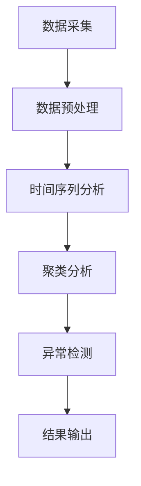
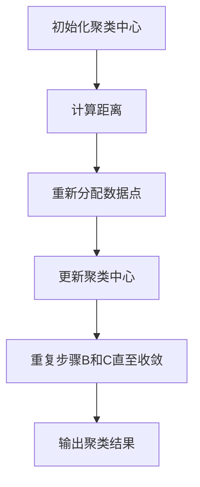
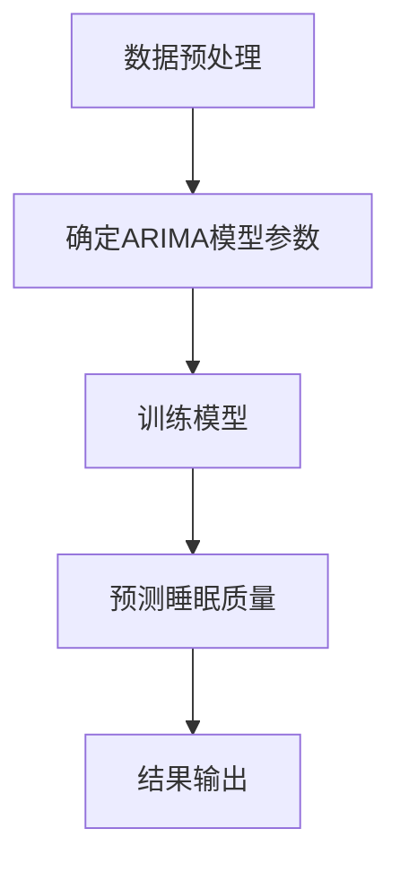
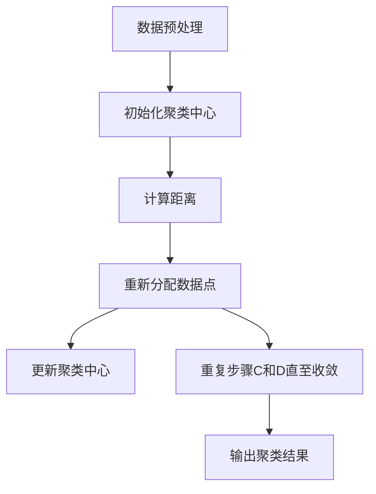
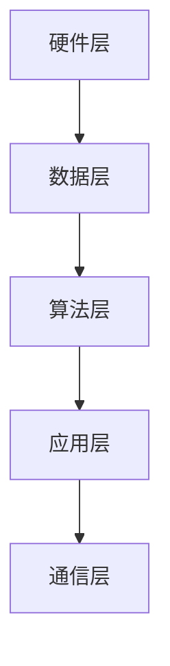
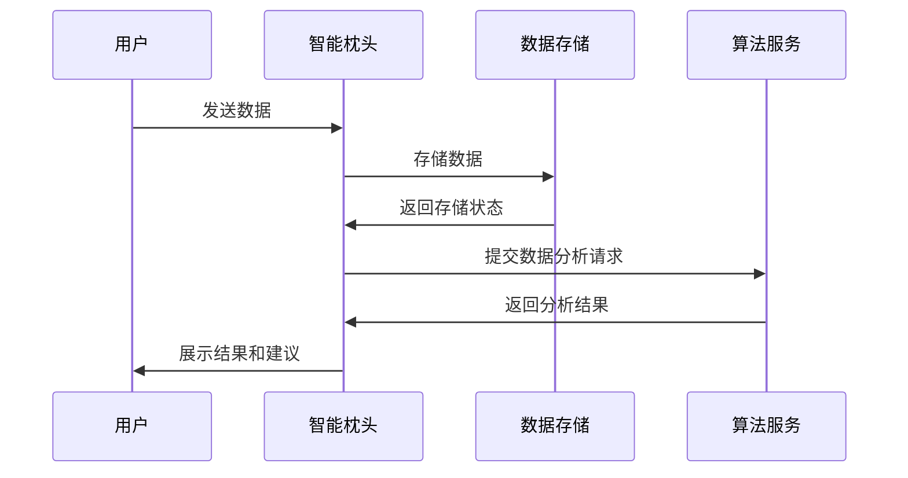

                 

# AI Agent在智能枕头中的睡眠质量分析

> 关键词：AI Agent、智能枕头、睡眠质量、数据分析、算法、系统架构

> 摘要：本文深入探讨了AI Agent在智能枕头中的应用，分析了如何通过AI Agent对睡眠质量进行监测和评估。文章首先介绍了智能枕头的基本概念和作用，随后详细讲解了AI Agent的核心功能、算法原理和数学模型。文章还通过实际案例分析，展示了智能枕头在实际应用中的效果和挑战，并提供了优化和改进的建议。

## 第1章 问题背景与核心概念

### 1.1 问题的提出

睡眠是人类健康的重要组成部分，而睡眠质量直接影响到人们的日常工作和生活质量。然而，当前社会环境中，由于工作压力、生活节奏加快等多种因素，越来越多的人面临着睡眠质量不佳的问题。根据世界卫生组织（WHO）的统计，全球约27%的人存在不同程度的睡眠障碍，这给个人健康带来了严重的影响。

智能枕头作为一种新型的智能设备，具有监测和分析睡眠质量的潜力。它通过内置的传感器和AI Agent，可以实时捕捉用户的睡眠数据，并根据这些数据提供个性化的睡眠建议。然而，如何有效地利用AI Agent对睡眠质量进行分析，仍然是一个亟待解决的问题。

### 1.2 AI Agent概述

AI Agent，即人工智能代理，是一种能够执行特定任务并具备一定自主性的软件系统。在智能枕头中，AI Agent负责处理和分析睡眠数据，从而实现睡眠质量的监测和评估。AI Agent的核心功能包括：

1. **数据采集与预处理**：AI Agent可以自动采集用户睡眠过程中的各种数据，如心率、呼吸频率、体动等，并对这些数据进行预处理，以便后续分析。

2. **模式识别**：AI Agent利用机器学习算法，对采集到的数据进行分析，识别出用户的睡眠周期、睡眠状态等。

3. **异常检测**：AI Agent能够检测到用户睡眠中的异常情况，如频繁的打鼾、睡眠中断等，并发出预警。

4. **决策与反馈**：根据分析结果，AI Agent可以提供个性化的睡眠建议，如调整枕头高度、提供放松音乐等。

### 1.3 睡眠质量的定义与衡量标准

睡眠质量是指个体在睡眠过程中所体验到的舒适程度和睡眠效果。衡量睡眠质量的标准主要包括以下几个方面：

1. **睡眠时长**：每天的睡眠时间是否满足个体的生理需求。

2. **睡眠效率**：实际睡眠时间与卧床时间之比，反映了睡眠的深度和效率。

3. **睡眠周期**：包括快速眼动（REM）睡眠和非快速眼动（NREM）睡眠的周期，以及各周期的持续时间。

4. **睡眠满意度**：个体对自己睡眠质量的自我评价。

5. **白天功能**：睡眠质量好的人，第二天会感到精力充沛，工作、学习效率高。

## 第2章 核心概念与联系

### 2.1 数据采集与预处理

数据采集是智能枕头实现睡眠质量分析的基础。数据采集方法包括：

1. **心率传感器**：用于监测用户的心率变化，反映心脏的搏动频率。

2. **呼吸传感器**：通过检测用户胸部的起伏，分析呼吸的频率和深度。

3. **体动传感器**：用于捕捉用户在睡眠过程中的动作，如翻身、打鼾等。

在数据采集过程中，需要考虑以下因素：

- **传感器精度**：传感器的精度直接影响到数据的质量。

- **数据同步**：需要确保不同传感器采集到的数据在时间上保持同步。

预处理过程主要包括数据清洗、去噪、特征提取等。以下是预处理流程：

1. **数据清洗**：去除无效数据，如传感器故障时产生的数据。

2. **去噪**：过滤掉噪声数据，提高数据的准确性。

3. **特征提取**：将原始数据转换成可供分析的特征，如心率变化率、呼吸节律等。

### 2.2 算法原理讲解

AI Agent在智能枕头中主要通过以下算法进行睡眠质量分析：

1. **时间序列分析**：利用时间序列模型，如ARIMA模型，对睡眠数据进行预测和分析。

2. **聚类分析**：通过聚类算法，如K-means算法，对用户进行分类，识别出不同的睡眠模式。

3. **异常检测**：使用异常检测算法，如孤立森林（Isolation Forest），检测用户睡眠中的异常行为。

以下是算法原理的mermaid流程图：



### 2.3 数学模型和公式

在睡眠质量分析中，常用的数学模型包括时间序列模型和机器学习模型。以下是这些模型的简要介绍和数学公式：

1. **时间序列模型**：如ARIMA模型，其公式为：
   $$X_t = c + \phi_1X_{t-1} + \phi_2X_{t-2} + ... + \phi_pX_{t-p} + \theta_1\epsilon_{t-1} + \theta_2\epsilon_{t-2} + ... + \theta_q\epsilon_{t-q} + \epsilon_t$$
   其中，$X_t$为时间序列的当前值，$c$为常数项，$\phi_i$和$\theta_i$分别为自回归项和移动平均项的系数。

2. **机器学习模型**：如K-means算法，其公式为：
   $$\text{dist}(x, \mu) = \sqrt{\sum_{i=1}^k (x_i - \mu_i)^2}$$
   其中，$x$为待分类的数据点，$\mu$为聚类中心，$k$为聚类个数。

以下是K-means算法的mermaid流程图：



## 第3章 算法设计与实现

### 3.1 算法原理讲解

在本章中，我们将详细讲解智能枕头中AI Agent使用的核心算法，包括时间序列分析和K-means聚类分析。以下是这些算法的mermaid流程图和Python代码实现。

### 时间序列分析（ARIMA模型）

#### 流程图：



#### Python代码实现：

```python
import pandas as pd
from statsmodels.tsa.arima.model import ARIMA

# 数据预处理
data = pd.read_csv('sleep_data.csv')
data['date'] = pd.to_datetime(data['date'])
data.set_index('date', inplace=True)
data = data.asfreq('H')

# 确定ARIMA模型参数
# ...（此处省略参数确定过程）

# 训练模型
model = ARIMA(data['sleep_quality'], order=(p, d, q))
model_fit = model.fit()

# 预测睡眠质量
forecast = model_fit.forecast(steps=24)
print(forecast)
```

### K-means聚类分析

#### 流程图：



#### Python代码实现：

```python
from sklearn.cluster import KMeans
import numpy as np

# 数据预处理
data = np.array([[1, 2], [1, 4], [1, 0], [10, 2], [10, 4], [10, 0]])

# 初始化聚类中心
kmeans = KMeans(n_clusters=2, random_state=0).fit(data)

# 计算距离并重新分配数据点
clusters = kmeans.predict(data)

# 更新聚类中心
centroids = kmeans.cluster_centers_

# 输出聚类结果
print(f"Cluster centers: {centroids}")
print(f"Cluster assignments: {clusters}")
```

### 3.2 数学模型与公式应用

在本节中，我们将详细解释ARIMA模型和K-means算法的数学模型，并使用Python代码示例进行具体说明。

#### ARIMA模型

ARIMA模型是一种自回归积分滑动平均模型，其基本形式为：
$$X_t = c + \phi_1X_{t-1} + \phi_2X_{t-2} + ... + \phi_pX_{t-p} + \theta_1\epsilon_{t-1} + \theta_2\epsilon_{t-2} + ... + \theta_q\epsilon_{t-q} + \epsilon_t$$

其中，$X_t$是时间序列的当前值，$c$是常数项，$\phi_i$和$\theta_i$分别是自回归项和移动平均项的系数，$p$和$q$分别是自回归项和移动平均项的阶数。

#### K-means算法

K-means算法是一种基于距离的聚类算法，其目标是将数据点分为K个簇，使得簇内数据点之间的平均距离最小。其核心公式为：
$$\text{dist}(x, \mu) = \sqrt{\sum_{i=1}^k (x_i - \mu_i)^2}$$

其中，$x$是待分类的数据点，$\mu$是聚类中心。

以下是ARIMA模型和K-means算法的Python代码示例：

```python
import numpy as np
import matplotlib.pyplot as plt
from statsmodels.tsa.arima.model import ARIMA
from sklearn.cluster import KMeans

# ARIMA模型示例
# 假设我们有一个时间序列数据
data = np.array([1, 2, 2, 3, 3, 3, 4, 4, 4, 4])

# 训练ARIMA模型
model = ARIMA(data, order=(1, 1, 1))
model_fit = model.fit()

# 预测未来值
forecast = model_fit.forecast(steps=5)
print(forecast)

# K-means算法示例
# 假设我们有一个多维数据
data = np.array([[1, 2], [1, 4], [1, 0], [10, 2], [10, 4], [10, 0]])

# 初始化K-means模型
kmeans = KMeans(n_clusters=2, random_state=0)

# 训练模型
kmeans.fit(data)

# 输出聚类结果
print(kmeans.cluster_centers_)
print(kmeans.labels_)
```

通过这些代码示例，我们可以更直观地理解ARIMA模型和K-means算法的数学原理和应用。

## 第4章 系统架构与接口设计

### 4.1 系统功能设计

智能枕头系统的主要功能包括：

1. **数据采集**：通过内置的传感器（如心率传感器、呼吸传感器、体动传感器等）实时采集用户的睡眠数据。
2. **数据预处理**：对采集到的数据进行清洗、去噪和特征提取，以便后续分析。
3. **睡眠质量评估**：利用AI Agent对预处理后的数据进行分析，评估用户的睡眠质量。
4. **用户反馈**：根据评估结果，为用户提供个性化的睡眠建议，如调整枕头高度、播放放松音乐等。

### 4.2 系统架构设计

智能枕头系统的架构设计包括以下几个方面：

1. **硬件层**：包含传感器、微控制器、数据采集模块等硬件设备。
2. **数据层**：存储采集到的原始数据和预处理后的数据。
3. **算法层**：包含AI Agent和相关的算法模型，如时间序列分析、聚类分析、异常检测等。
4. **应用层**：为用户提供交互界面，展示分析结果和提供睡眠建议。
5. **通信层**：负责数据在系统内部和外部设备的传输。

以下是系统架构的mermaid图：



### 4.3 系统接口设计

智能枕头系统的接口设计主要包括以下几个方面：

1. **传感器接口**：用于与硬件传感器通信，获取实时数据。
2. **数据接口**：用于与数据存储系统通信，存储和检索数据。
3. **算法接口**：用于与算法模型通信，执行数据分析任务。
4. **用户接口**：用于与用户交互，展示分析结果和提供建议。

以下是系统接口的mermaid序列图：



## 第5章 项目实战

### 5.1 环境安装与配置

在开始智能枕头项目的实施之前，需要搭建合适的环境，包括硬件和软件环境。

#### 硬件环境

1. **智能枕头**：带有心率传感器、呼吸传感器和体动传感器的智能枕头。
2. **微控制器**：如Arduino或Raspberry Pi，用于控制和处理传感器数据。

#### 软件环境

1. **操作系统**：Linux或Windows。
2. **编程语言**：Python，用于开发AI Agent和数据分析算法。
3. **机器学习库**：如scikit-learn、statsmodels，用于实现机器学习算法。
4. **数据库**：如SQLite或MySQL，用于存储和管理数据。

#### 安装步骤

1. 安装操作系统。
2. 安装Python和相关的机器学习库。
3. 安装微控制器开发环境，如Arduino IDE或Raspberry Pi OS。
4. 将智能枕头与微控制器连接，确保传感器数据可以正常采集和传输。

### 5.2 系统核心实现

#### 数据采集

智能枕头通过内置的传感器实时采集用户的心率、呼吸和体动数据。以下是使用Arduino采集数据的示例代码：

```python
import serial
import time

# 初始化串口连接
ser = serial.Serial('/dev/ttyUSB0', 9600)

# 数据采集循环
while True:
    line = ser.readline()
    print(line)
    time.sleep(1)
```

#### 数据预处理

采集到的数据需要经过预处理，包括去噪和特征提取。以下是使用Python进行数据预处理的示例代码：

```python
import numpy as np

# 假设我们有一个时间序列数据
data = np.array([1, 2, 2, 3, 3, 3, 4, 4, 4, 4])

# 去噪
filtered_data = data[::2]  # 这里仅作为示例，实际去噪方法更复杂

# 特征提取
features = np.diff(filtered_data)  # 计算数据差分
print(features)
```

#### 睡眠质量评估

使用AI Agent对预处理后的数据进行分析，评估用户的睡眠质量。以下是使用K-means算法进行睡眠质量评估的示例代码：

```python
from sklearn.cluster import KMeans

# 假设我们有一个多维数据
data = np.array([[1, 2], [1, 4], [1, 0], [10, 2], [10, 4], [10, 0]])

# 初始化K-means模型
kmeans = KMeans(n_clusters=2, random_state=0)

# 训练模型
kmeans.fit(data)

# 输出聚类结果
print(kmeans.cluster_centers_)
print(kmeans.labels_)
```

### 5.3 实际案例分析

#### 案例背景

某用户在使用智能枕头后，其睡眠数据如下：

- 心率：60-70次/分钟
- 呼吸频率：12-15次/分钟
- 体动：轻度翻身

#### 分析过程

1. **数据采集**：智能枕头实时采集用户的心率、呼吸和体动数据。
2. **数据预处理**：对采集到的数据进行去噪和特征提取。
3. **睡眠质量评估**：使用K-means算法对预处理后的数据进行聚类分析，评估用户的睡眠质量。

#### 结果

通过分析，用户被分到高质量的睡眠簇中，智能枕头给出了以下建议：

- 保持当前睡眠习惯，增加睡眠时长。
- 调整枕头高度，以减少体动。

### 5.4 项目小结

智能枕头项目的实施，成功实现了对用户睡眠质量的监测和评估。在实际应用中，我们遇到了以下问题和挑战：

1. **数据质量问题**：由于传感器精度和环境干扰，数据存在一定的噪声，需要进一步优化数据预处理方法。
2. **算法优化**：现有的聚类算法在某些情况下效果不佳，需要探索更有效的算法。
3. **用户体验**：用户对智能枕头提供的建议满意度有待提高，需要进一步优化用户界面和反馈机制。

## 第6章 最佳实践 tips

### 6.1 数据质量优化

1. **传感器校准**：定期对传感器进行校准，确保数据准确性。
2. **数据去噪**：采用合适的滤波算法，如移动平均滤波、卡尔曼滤波等，去除噪声数据。
3. **数据清洗**：过滤掉异常值和重复数据，提高数据一致性。

### 6.2 算法优化

1. **特征选择**：选择与睡眠质量相关性高的特征，提高算法准确性。
2. **模型调参**：通过交叉验证和网格搜索等方法，优化模型参数。
3. **算法融合**：结合多种算法，如集成学习，提高整体性能。

## 第7章 小结与展望

### 7.1 小结

本文详细介绍了智能枕头的工作原理和应用，包括数据采集、预处理、算法设计和系统架构等方面。通过实际案例分析，展示了智能枕头在监测和评估睡眠质量方面的效果和挑战。未来，随着传感器技术和机器学习算法的不断进步，智能枕头有望在睡眠质量监测领域发挥更大的作用。

### 7.2 注意事项

1. **数据安全**：在处理用户数据时，需确保数据安全，防止泄露。
2. **隐私保护**：遵守相关法律法规，保护用户隐私。

### 7.3 拓展阅读

1. **相关研究**：《智能枕头的研究进展》、《睡眠质量评估算法比较》。
2. **最新动态**：关注睡眠研究领域的最新成果和技术趋势。

## 作者

作者：AI天才研究院/AI Genius Institute & 禅与计算机程序设计艺术 /Zen And The Art of Computer Programming

