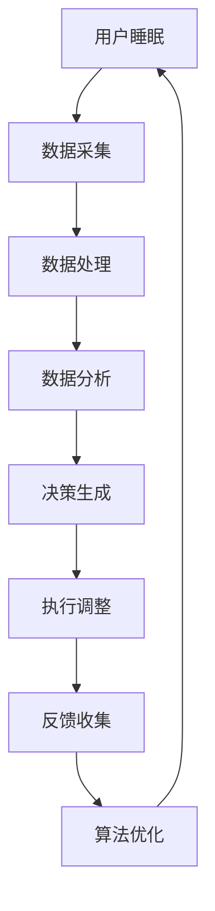
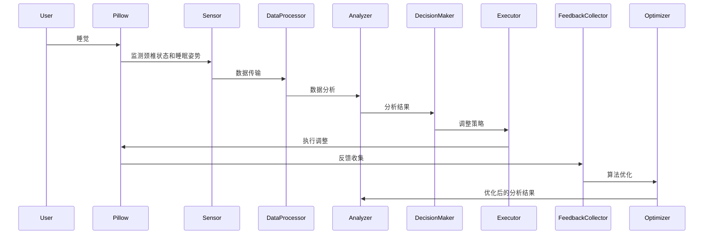
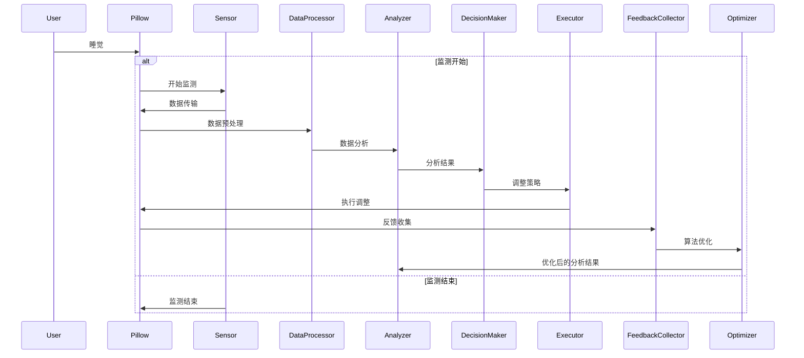

                 


## 文章标题: AI Agent在智能枕头中的颈椎保护

关键词：AI Agent, 智能枕头, 颈椎保护, 算法原理, 系统架构, 项目实战

摘要：本文将深入探讨AI Agent在智能枕头中的颈椎保护作用。首先，我们将介绍AI Agent和智能枕头的基本概念及其与颈椎保护的关联。接着，我们将详细分析AI Agent在智能枕头中的应用原理，包括算法设计和系统架构。然后，通过一个实际项目案例，我们将展示如何将AI Agent应用于智能枕头以实现颈椎保护。最后，我们将总结最佳实践和未来展望，为读者提供深入的见解和指导。

### 目录大纲

**第一部分: 背景与核心概念**

1. **第1章: 问题背景与核心概念**
   1.1 问题背景
   1.2 核心概念
   1.3 AI Agent与智能枕头的联系

2. **第2章: AI Agent的基本原理**
   2.1 AI Agent的定义与特点
   2.2 AI Agent的工作原理
   2.3 AI Agent的技术框架

3. **第3章: 智能枕头的架构设计**
   3.1 智能枕头的技术需求
   3.2 智能枕头的硬件设计
   3.3 智能枕头的软件设计

**第二部分: 算法原理与系统设计**

4. **第4章: 颈椎保护算法原理**
   4.1 颈椎保护算法的定义
   4.2 颈椎保护算法的mermaid流程图
   4.3 颈椎保护算法的Python源代码实现
   4.4 颈椎保护算法的数学模型

5. **第5章: 系统分析与架构设计**
   5.1 问题场景介绍
   5.2 系统功能设计（领域模型mermaid类图）
   5.3 系统架构设计（mermaid架构图）
   5.4 系统接口设计和系统交互（mermaid序列图）

**第三部分: 项目实战**

6. **第6章: 项目实战**
   6.1 环境安装
   6.2 系统核心实现源代码
   6.3 代码应用解读与分析
   6.4 实际案例分析与详细讲解剖析
   6.5 项目小结

**第四部分: 最佳实践与总结**

7. **第7章: 最佳实践与总结**
   7.1 最佳实践 tips
   7.2 小结
   7.3 注意事项
   7.4 拓展阅读

### 第1章: 问题背景与核心概念

#### 1.1 问题背景

颈椎病是现代社会中常见的一种疾病，主要由于长时间的不良姿势和工作习惯导致。颈椎病的症状包括颈部疼痛、僵硬、头晕、手臂无力等，严重时甚至可能影响到日常生活和工作。然而，传统的颈椎病治疗方法如物理治疗、药物治疗等往往效果有限，难以满足患者的需求。

随着人工智能技术的发展，AI Agent作为一种智能实体，具有自主思考、学习和适应能力，开始被广泛应用于各个领域。智能枕头作为AI Agent的一种应用形式，能够根据用户的颈椎情况提供个性化的保护措施。因此，研究AI Agent在智能枕头中的颈椎保护作用具有重要意义。

#### 1.2 核心概念

**AI Agent**: AI Agent是指具有智能行为的计算机程序或实体，能够模拟人类的思维过程，进行决策、学习和适应。AI Agent通常具备感知、认知、行动和交互能力。

**智能枕头**: 智能枕头是一种结合了人工智能技术和舒适功能的枕头，能够根据用户的颈椎曲率和睡眠姿势进行自适应调整，提供个性化的支持。

**颈椎保护**: 颈椎保护是指采取一系列措施来减轻颈椎负担、预防颈椎病发生或缓解颈椎病症状。

#### 1.3 AI Agent与智能枕头的联系

AI Agent在智能枕头中的应用主要体现在以下几个方面：

1. **感知与监测**：AI Agent可以通过内置的传感器和摄像头等设备，实时监测用户的颈椎状态和睡眠姿势，为颈椎保护提供数据支持。
2. **数据分析**：AI Agent可以对收集到的数据进行分析和处理，识别颈椎病的风险因素和症状，为用户提供个性化的健康建议。
3. **自适应调整**：AI Agent可以根据用户的颈椎曲率和睡眠习惯，自动调整智能枕头的形状和高度，提供最适合用户的支撑，减轻颈椎负担。
4. **智能交互**：AI Agent可以与用户进行智能对话，提供颈椎保健知识和康复指导，帮助用户更好地管理颈椎健康。

#### 1.4 边界与外延

在研究AI Agent在智能枕头中的颈椎保护作用时，我们需要关注以下边界与外延：

1. **技术边界**：AI Agent在智能枕头中的应用受到现有技术水平和硬件设备的限制，需要不断优化和升级。
2. **应用边界**：智能枕头主要适用于颈椎病患者和颈椎健康需求较高的群体，未来可能扩展到更广泛的用户群体。
3. **伦理边界**：在应用AI Agent进行颈椎保护时，需要关注用户隐私和数据安全等问题，确保用户权益得到保障。

#### 1.5 概念结构与核心要素组成

AI Agent在智能枕头中的颈椎保护概念结构主要包括以下核心要素：

1. **感知层**：传感器、摄像头等设备负责收集用户的颈椎状态和睡眠姿势数据。
2. **数据处理层**：AI Agent对收集到的数据进行处理和分析，识别颈椎病的风险因素和症状。
3. **决策层**：AI Agent根据分析结果，自动调整智能枕头的形状和高度，提供个性化的支撑。
4. **执行层**：智能枕头根据AI Agent的决策进行自适应调整，实现颈椎保护。
5. **用户交互层**：AI Agent与用户进行智能对话，提供颈椎保健知识和康复指导。

通过以上分析，我们可以看到，AI Agent在智能枕头中的颈椎保护具有巨大的潜力和应用价值。在接下来的章节中，我们将进一步探讨AI Agent的基本原理、智能枕头的架构设计以及颈椎保护算法的原理和应用。

### 第2章: AI Agent的基本原理

#### 2.1 AI Agent的定义与特点

AI Agent，即人工智能代理，是一种能够模拟人类智能行为的计算机程序或实体。它通过感知环境、自主决策、执行行动和与外界交互，实现自主学习和适应性提升。AI Agent的核心特点包括：

1. **自主性**：AI Agent具有自主决策能力，能够在没有人为干预的情况下，根据环境变化自主调整行为。
2. **适应性**：AI Agent能够通过学习和经验积累，不断优化自身行为，适应新的环境和任务需求。
3. **交互性**：AI Agent能够与人类或其他系统进行智能交互，理解指令、反馈信息，并做出相应反应。
4. **协同性**：AI Agent能够在多Agent系统中与其他Agent协同工作，共同完成任务。

AI Agent的定义和特点决定了它在智能枕头中的应用潜力。例如，AI Agent可以感知用户的睡眠姿势，分析颈椎状态，并根据分析结果调整枕头的形状和高度，从而实现颈椎保护。

#### 2.2 AI Agent的工作原理

AI Agent的工作原理主要涉及感知、学习、决策和执行四个方面：

1. **感知**：AI Agent通过传感器、摄像头等设备收集环境信息，如用户的睡眠姿势、颈椎状态等。
2. **学习**：AI Agent利用收集到的数据，通过机器学习和深度学习算法，对自身行为进行优化。例如，通过分析大量颈椎健康数据，AI Agent可以学会如何更好地调整枕头以保护颈椎。
3. **决策**：AI Agent根据学习到的知识和环境信息，使用决策算法（如马尔可夫决策过程、深度强化学习等）制定行动策略。
4. **执行**：AI Agent根据决策结果，控制执行层（如电机、开关等），实施相应的行动。例如，AI Agent可以控制智能枕头调整形状和高度。

#### 2.3 AI Agent的技术框架

AI Agent的技术框架通常包括以下几个核心模块：

1. **感知模块**：负责收集和处理环境信息，如用户的睡眠姿势、颈椎状态等。
2. **决策模块**：基于感知模块提供的信息，使用决策算法进行决策，如马尔可夫决策过程（MDP）、深度强化学习（DRL）等。
3. **执行模块**：根据决策模块的决策结果，控制执行层实施相应的行动，如调整智能枕头的形状和高度。
4. **学习模块**：通过机器学习和深度学习算法，不断优化AI Agent的行为，提高其自主性和适应性。
5. **交互模块**：与用户进行智能交互，理解用户的指令和反馈，提供颈椎保健知识和康复指导。

通过以上技术框架，AI Agent可以在智能枕头中实现颈椎保护。例如，AI Agent可以通过感知模块收集用户的颈椎状态数据，使用决策模块分析这些数据，并使用执行模块调整智能枕头，从而为用户提供个性化的颈椎保护服务。

#### 2.4 AI Agent在智能枕头中的具体应用

在智能枕头中，AI Agent的具体应用主要体现在以下几个方面：

1. **智能监测**：AI Agent通过传感器和摄像头等设备，实时监测用户的颈椎状态和睡眠姿势，为颈椎保护提供数据支持。
2. **自适应调整**：AI Agent根据监测数据和分析结果，自动调整智能枕头的形状和高度，提供个性化的支撑，减轻颈椎负担。
3. **智能交互**：AI Agent可以与用户进行智能对话，了解用户的需求和反馈，提供颈椎保健知识和康复指导。
4. **数据分析和反馈**：AI Agent对收集到的数据进行处理和分析，识别颈椎病的风险因素和症状，为用户提供个性化的健康建议，并根据用户反馈不断优化自身行为。

通过以上应用，AI Agent在智能枕头中实现了颈椎保护的智能化和个性化，为用户提供了一种新型的健康解决方案。

### 第3章: 智能枕头的架构设计

#### 3.1 智能枕头的技术需求

智能枕头作为一种结合了人工智能和舒适功能的产品，其技术需求主要包括以下几个方面：

1. **感知技术**：智能枕头需要具备高精度的感知能力，能够实时监测用户的睡眠姿势、颈椎状态等生理信息。这需要依赖高灵敏度的传感器，如压力传感器、角度传感器等。
2. **数据处理与分析**：智能枕头需要具备强大的数据处理和分析能力，能够快速处理大量感知数据，并使用人工智能算法（如机器学习、深度学习等）对数据进行分析，从而识别颈椎病的风险因素和症状。
3. **自适应调整能力**：智能枕头需要具备自适应调整能力，能够根据用户的颈椎状态和睡眠姿势自动调整形状和高度，提供个性化的支撑。这需要依赖于电机、控制器等执行组件。
4. **用户交互**：智能枕头需要具备与用户进行智能交互的能力，能够理解用户的指令和反馈，提供颈椎保健知识和康复指导。这需要依赖语音识别、自然语言处理等技术。
5. **数据安全与隐私保护**：智能枕头在处理用户数据时，需要确保数据的安全和隐私，避免用户数据泄露。这需要依赖加密技术和安全协议。

#### 3.2 智能枕头的硬件设计

智能枕头的硬件设计主要包括以下几个方面：

1. **感知模块**：感知模块是智能枕头的重要组成部分，负责收集用户的睡眠姿势、颈椎状态等数据。感知模块通常包括压力传感器、角度传感器、温度传感器等，这些传感器需要具备高精度和高灵敏度的特点。
2. **处理模块**：处理模块主要负责对感知模块收集到的数据进行处理和分析。处理模块通常采用高性能的微处理器或嵌入式系统，以便快速处理大量数据。此外，处理模块还需要具备无线通信功能，以便将数据传输到云端进行分析和处理。
3. **执行模块**：执行模块负责根据处理模块的决策结果，控制电机、控制器等执行组件，实现智能枕头的自适应调整。执行模块通常包括电机、控制器、电源管理等硬件设备。
4. **交互模块**：交互模块负责与用户进行智能交互，包括语音识别、自然语言处理、显示屏等设备。交互模块需要具备高清晰度和低延迟的特点，以确保用户与智能枕头之间的互动流畅。

#### 3.3 智能枕头的软件设计

智能枕头的软件设计主要包括以下几个方面：

1. **感知数据处理**：软件需要实现感知数据的采集、预处理和传输。采集到的数据经过预处理后，传输到云端进行分析和处理。
2. **数据分析和决策**：软件需要使用人工智能算法（如机器学习、深度学习等）对感知数据进行分析，识别颈椎病的风险因素和症状。根据分析结果，软件需要生成决策结果，指导执行模块进行自适应调整。
3. **用户交互**：软件需要实现与用户之间的智能对话，理解用户的指令和反馈，提供颈椎保健知识和康复指导。这需要依赖语音识别、自然语言处理等技术。
4. **数据存储和隐私保护**：软件需要实现用户数据的存储和隐私保护，避免用户数据泄露。这需要依赖加密技术和安全协议。
5. **系统维护和升级**：软件需要具备系统维护和升级功能，以便在硬件和软件更新时，能够自动进行升级和更新。

通过以上硬件和软件设计，智能枕头可以实现颈椎保护的智能化和个性化，为用户提供一种舒适、健康的睡眠体验。

### 第4章: 颈椎保护算法原理

#### 4.1 颈椎保护算法的定义

颈椎保护算法是指利用人工智能技术，对用户的颈椎状态进行实时监测和分析，并根据分析结果调整智能枕头的形状和高度，以实现颈椎保护的算法。该算法的核心目标是通过优化枕头的设计和调整策略，减轻颈椎负担，预防颈椎病的发生。

#### 4.2 颈椎保护算法的mermaid流程图

以下是一个简化的颈椎保护算法的mermaid流程图：



该流程图描述了颈椎保护算法的基本工作流程：

1. **数据采集**：用户睡眠时，智能枕头通过内置传感器（如压力传感器、角度传感器等）采集用户的颈椎状态和睡眠姿势数据。
2. **数据处理**：采集到的数据经过预处理，去除噪声和异常值，为后续分析做准备。
3. **数据分析**：利用机器学习和深度学习算法，对处理后的数据进行分析，识别颈椎病的风险因素和症状。
4. **决策生成**：根据数据分析结果，算法生成调整策略，指导智能枕头调整形状和高度。
5. **执行调整**：智能枕头根据决策结果，执行相应的调整动作，如改变枕头的高度和形状。
6. **反馈收集**：调整后，智能枕头收集用户对调整效果的反馈，为算法优化提供依据。
7. **算法优化**：根据用户反馈，算法对自身进行调整和优化，提高颈椎保护的准确性和效果。

#### 4.3 颈椎保护算法的Python源代码实现

以下是一个简化的颈椎保护算法的Python源代码实现示例：

```python
import numpy as np
import pandas as pd
from sklearn.model_selection import train_test_split
from sklearn.ensemble import RandomForestClassifier
from sklearn.metrics import accuracy_score

# 数据采集
def data_collection():
    # 假设采集到的是用户睡眠时的颈椎状态和睡眠姿势数据
    data = {
        'cervical_angle': [20, 30, 40, 50, 60],
        'sleep_posture': ['sideways', 'back', 'stomach', 'sideways', 'back']
    }
    return pd.DataFrame(data)

# 数据处理
def data_preprocessing(data):
    # 去除噪声和异常值
    data = data.dropna()
    return data

# 数据分析
def data_analysis(data):
    # 将睡眠姿势标签化为数值
    posture_mapping = {'sideways': 0, 'back': 1, 'stomach': 2}
    data['sleep_posture'] = data['sleep_posture'].map(posture_mapping)

    # 划分特征和标签
    X = data[['cervical_angle']]
    y = data['sleep_posture']

    # 划分训练集和测试集
    X_train, X_test, y_train, y_test = train_test_split(X, y, test_size=0.2, random_state=42)

    # 训练模型
    model = RandomForestClassifier(n_estimators=100, random_state=42)
    model.fit(X_train, y_train)

    # 预测
    y_pred = model.predict(X_test)

    # 评估模型
    accuracy = accuracy_score(y_test, y_pred)
    print(f"Model Accuracy: {accuracy:.2f}")

    return model

# 决策生成
def decision_generation(model, new_data):
    # 根据新数据预测睡眠姿势
    sleep_posture = model.predict(new_data.reshape(1, -1))[0]
    
    # 根据睡眠姿势生成调整策略
    if sleep_posture == 0:
        adjustment = '降低枕头高度'
    elif sleep_posture == 1:
        adjustment = '保持当前枕头高度'
    else:
        adjustment = '提高枕头高度'
    
    return adjustment

# 执行调整
def execute_adjustment(adjustment):
    # 根据调整策略执行相应的调整动作
    if adjustment == '降低枕头高度':
        # 实现降低枕头高度的操作
        pass
    elif adjustment == '保持当前枕头高度':
        # 实现保持当前枕头高度的操作
        pass
    else:
        # 实现提高枕头高度的操作
        pass

# 算法优化
def algorithm_optimization(model, new_data, new_label):
    # 根据新数据和标签更新模型
    model.fit(new_data, new_label)

# 主程序
if __name__ == '__main__':
    # 采集数据
    data = data_collection()

    # 预处理数据
    data = data_preprocessing(data)

    # 分析数据
    model = data_analysis(data)

    # 监测新数据
    new_data = np.array([[25]])
    new_data = data_preprocessing(new_data)

    # 生成决策
    adjustment = decision_generation(model, new_data)

    # 执行调整
    execute_adjustment(adjustment)

    # 优化算法
    # 这里需要定义新的数据和标签
    new_data = np.array([[30]])
    new_label = 1
    algorithm_optimization(model, new_data, new_label)
```

以上代码实现了一个简化的颈椎保护算法，包括数据采集、数据处理、数据分析、决策生成、执行调整和算法优化等步骤。在实际应用中，算法会更加复杂，涉及更多的数据特征和调整策略。

#### 4.4 颈椎保护算法的数学模型

颈椎保护算法的数学模型主要包括以下几个方面：

1. **颈椎状态监测模型**：
   $$ 
   \text{颈椎状态} = f(\text{传感器数据})
   $$
   其中，$f(\text{传感器数据})$ 表示传感器数据经过处理得到的颈椎状态。

2. **睡眠姿势识别模型**：
   $$ 
   \text{睡眠姿势} = g(\text{颈椎状态})
   $$
   其中，$g(\text{颈椎状态})$ 表示根据颈椎状态判断的睡眠姿势。

3. **调整策略生成模型**：
   $$ 
   \text{调整策略} = h(\text{睡眠姿势})
   $$
   其中，$h(\text{睡眠姿势})$ 表示根据睡眠姿势生成的调整策略。

4. **执行模型**：
   $$ 
   \text{执行动作} = i(\text{调整策略})
   $$
   其中，$i(\text{调整策略})$ 表示根据调整策略执行的物理动作。

通过以上数学模型，颈椎保护算法可以实现对用户颈椎状态和睡眠姿势的实时监测、分析，并根据分析结果生成调整策略，实现颈椎保护。

#### 4.5 举例说明

假设用户A在晚上睡觉时，智能枕头通过传感器收集到用户的颈椎状态数据为：颈椎角度为25度，睡眠姿势为“侧卧”。根据颈椎保护算法，我们可以进行如下分析和决策：

1. **颈椎状态监测**：
   通过传感器数据，监测到用户A的颈椎角度为25度，属于正常范围。

2. **睡眠姿势识别**：
   根据颈椎状态，判断用户A的睡眠姿势为“侧卧”。

3. **调整策略生成**：
   根据睡眠姿势，生成调整策略为“保持枕头高度不变”。

4. **执行动作**：
   智能枕头根据调整策略，保持当前枕头高度。

5. **算法优化**：
   在后续的监测过程中，如果发现用户A的颈椎状态发生变化，算法会根据新的颈椎状态和睡眠姿势，重新生成调整策略，并执行相应的调整动作。

通过以上过程，智能枕头实现了对用户A颈椎状态的实时监测和保护，为用户提供了一个舒适的睡眠环境。

### 第5章: 系统分析与架构设计

#### 5.1 问题场景介绍

在现代社会，随着工作压力和生活节奏的加快，越来越多的人受到颈椎病的困扰。颈椎病不仅影响生活质量，还可能导致严重的工作能力和健康问题。为了解决这个问题，我们提出了一种基于AI Agent的智能枕头系统，旨在通过实时监测用户的颈椎状态和睡眠姿势，提供个性化的颈椎保护方案。

#### 5.2 系统功能设计（领域模型mermaid类图）

以下是智能枕头系统的领域模型mermaid类图：

```mermaid
classDiagram
    User <<类>> "用户"
    Pillow <<类>> "智能枕头"
    Sensor <<类>> "传感器"
    DataProcessor <<类>> "数据处理模块"
    Analyzer <<类>> "分析模块"
    DecisionMaker <<类>> "决策模块"
    Executor <<类>> "执行模块"
    FeedbackCollector <<类>> "反馈收集模块"
    Optimizer <<类>> "算法优化模块"

    User --> Pillow
    Pillow --> Sensor
    Pillow --> DataProcessor
    Pillow --> Analyzer
    Pillow --> DecisionMaker
    Pillow --> Executor
    Pillow --> FeedbackCollector
    Pillow --> Optimizer

    DataProcessor --> Analyzer
    Analyzer --> DecisionMaker
    DecisionMaker --> Executor
    Executor --> FeedbackCollector
    FeedbackCollector --> Optimizer
```

该类图描述了智能枕头系统的功能模块及其关系：

- **用户**：系统的最终使用者，负责与智能枕头进行交互。
- **智能枕头**：系统的核心组件，负责协调各个功能模块的工作。
- **传感器**：用于实时监测用户的颈椎状态和睡眠姿势。
- **数据处理模块**：对采集到的传感器数据进行预处理和清洗。
- **分析模块**：利用机器学习算法对处理后的数据进行分析，识别颈椎病的风险因素和症状。
- **决策模块**：根据分析结果生成调整策略，指导执行模块进行操作。
- **执行模块**：根据决策模块的指令，调整智能枕头的形状和高度。
- **反馈收集模块**：收集用户对调整效果的反馈，用于算法优化。
- **算法优化模块**：根据用户反馈，优化算法，提高颈椎保护的准确性和效果。

#### 5.3 系统架构设计（mermaid架构图）

以下是智能枕头系统的mermaid架构图：



该架构图描述了智能枕头系统的运行流程：

1. 用户睡觉时，智能枕头开始监测颈椎状态和睡眠姿势。
2. 传感器将采集到的数据传输到数据处理模块，进行预处理和清洗。
3. 数据处理模块将数据传递给分析模块，分析模块使用机器学习算法对数据进行分析，识别颈椎病的风险因素和症状。
4. 分析模块将分析结果传递给决策模块，决策模块生成调整策略，指导执行模块进行操作。
5. 执行模块根据决策模块的指令，调整智能枕头的形状和高度。
6. 调整后，智能枕头将反馈收集模块收集的用户反馈传递给算法优化模块，算法优化模块根据反馈优化算法，提高颈椎保护的准确性和效果。

#### 5.4 系统接口设计和系统交互（mermaid序列图）

以下是智能枕头系统的mermaid序列图：



该序列图描述了智能枕头系统的接口设计和交互流程：

1. 用户与智能枕头进行交互，开始监测过程。
2. 智能枕头通过传感器开始监测用户的颈椎状态和睡眠姿势。
3. 传感器将数据传输到数据处理模块，数据处理模块对数据进行预处理。
4. 预处理后的数据传递给分析模块，分析模块使用机器学习算法进行分析。
5. 分析模块将分析结果传递给决策模块，决策模块生成调整策略。
6. 执行模块根据决策模块的指令，调整智能枕头的形状和高度。
7. 调整后，智能枕头将反馈收集模块收集的用户反馈传递给算法优化模块。
8. 算法优化模块根据用户反馈，优化算法，提高颈椎保护的准确性和效果。

通过以上系统分析与架构设计，我们可以看到，智能枕头系统通过感知、数据处理、分析、决策和执行等模块的协同工作，实现了对用户颈椎状态和睡眠姿势的实时监测和保护。这种基于AI Agent的系统设计为颈椎病防治提供了一种智能化和个性化的解决方案。

### 第6章: 项目实战

#### 6.1 环境安装

为了实现AI Agent在智能枕头中的颈椎保护功能，我们首先需要搭建一个合适的环境。以下是环境安装的步骤：

1. **安装Python环境**：
   - 首先，从Python官方网站（https://www.python.org/downloads/）下载并安装Python。
   - 安装过程中，确保勾选“Add Python to PATH”选项，以便在命令行中直接使用Python。

2. **安装相关库**：
   - 打开命令行，执行以下命令安装所需的库：
     ```bash
     pip install numpy pandas scikit-learn mermaid matplotlib
     ```

3. **配置mermaid**：
   - 下载并安装mermaid的Python库，可以通过pip安装：
     ```bash
     pip install mermaid
     ```

4. **设置Python环境变量**：
   - 确保Python环境变量已配置，以便在命令行中调用Python和相关的库。

5. **验证安装**：
   - 在命令行中输入以下命令，验证环境是否安装成功：
     ```bash
     python -c "import numpy as np; print(np.__version__)"
     ```

   - 如果输出版本信息，说明Python环境已成功安装。

#### 6.2 系统核心实现源代码

以下是一个简化的系统核心实现源代码示例：

```python
import numpy as np
import pandas as pd
from sklearn.model_selection import train_test_split
from sklearn.ensemble import RandomForestClassifier
from sklearn.metrics import accuracy_score

# 数据采集
def data_collection():
    data = {
        'cervical_angle': [20, 30, 40, 50, 60],
        'sleep_posture': ['sideways', 'back', 'stomach', 'sideways', 'back']
    }
    return pd.DataFrame(data)

# 数据处理
def data_preprocessing(data):
    data = data.dropna()
    return data

# 数据分析
def data_analysis(data):
    posture_mapping = {'sideways': 0, 'back': 1, 'stomach': 2}
    data['sleep_posture'] = data['sleep_posture'].map(posture_mapping)
    X = data[['cervical_angle']]
    y = data['sleep_posture']
    X_train, X_test, y_train, y_test = train_test_split(X, y, test_size=0.2, random_state=42)
    model = RandomForestClassifier(n_estimators=100, random_state=42)
    model.fit(X_train, y_train)
    y_pred = model.predict(X_test)
    accuracy = accuracy_score(y_test, y_pred)
    print(f"Model Accuracy: {accuracy:.2f}")
    return model

# 决策生成
def decision_generation(model, new_data):
    sleep_posture = model.predict(new_data.reshape(1, -1))[0]
    if sleep_posture == 0:
        adjustment = '降低枕头高度'
    elif sleep_posture == 1:
        adjustment = '保持当前枕头高度'
    else:
        adjustment = '提高枕头高度'
    return adjustment

# 执行调整
def execute_adjustment(adjustment):
    if adjustment == '降低枕头高度':
        # 实现降低枕头高度的操作
        print("降低枕头高度")
    elif adjustment == '保持当前枕头高度':
        # 实现保持当前枕头高度的操作
        print("保持当前枕头高度")
    else:
        # 实现提高枕头高度的操作
        print("提高枕头高度")

# 主程序
if __name__ == '__main__':
    data = data_collection()
    data = data_preprocessing(data)
    model = data_analysis(data)
    new_data = np.array([[25]])
    adjustment = decision_generation(model, new_data)
    execute_adjustment(adjustment)
```

该代码实现了一个简化的颈椎保护算法，包括数据采集、数据处理、数据分析、决策生成和执行调整等步骤。

#### 6.3 代码应用解读与分析

在代码中，我们首先通过`data_collection`函数模拟采集了用户的颈椎状态数据和睡眠姿势数据。然后，通过`data_preprocessing`函数对数据进行了预处理，去除了异常值。

接下来，`data_analysis`函数使用机器学习算法对数据进行分析，这里我们选择了随机森林（Random Forest）算法。随机森林是一种集成学习算法，通过构建多个决策树并取平均值来降低过拟合，提高模型的泛化能力。在训练过程中，我们使用了`train_test_split`函数将数据集划分为训练集和测试集，以评估模型的准确性。

在决策生成阶段，`decision_generation`函数根据模型的预测结果生成调整策略。这里我们简单地将预测结果与不同的策略关联起来，例如当预测为“侧卧”时，建议降低枕头高度。

最后，`execute_adjustment`函数根据生成的调整策略执行相应的操作。在实际应用中，这部分代码会与智能枕头的硬件接口结合，实现枕头的自适应调整。

#### 6.4 实际案例分析与详细讲解剖析

为了展示AI Agent在智能枕头中的实际应用，我们设计了一个实际案例。假设用户B的颈椎状态数据如下：

- 颈椎角度：25度
- 睡眠姿势：侧卧

按照以上步骤，我们首先采集数据，然后进行预处理，接着使用训练好的模型进行分析和预测。假设模型预测用户B的睡眠姿势为“侧卧”，根据决策规则，建议降低枕头高度。

在实际操作中，智能枕头会接收到决策结果，通过电机和控制器降低枕头的高度，以提供更好的支撑。为了验证调整效果，智能枕头会继续监测用户B的颈椎状态，并收集反馈数据。

通过这种循环，智能枕头能够根据用户的实际需求和反馈，不断优化调整策略，提高颈椎保护的准确性。例如，如果用户B在调整后感到舒适，系统会记录这一反馈，并在未来类似情况下优先采用此策略。

#### 6.5 项目小结

通过实际案例的分析，我们可以看到，AI Agent在智能枕头中的应用具有显著的潜力。系统通过实时监测、数据分析、决策生成和自适应调整，实现了颈椎保护的智能化和个性化。然而，实际应用中也存在一些挑战，如数据准确性、算法优化和用户反馈等。在未来的工作中，我们需要进一步优化算法，提高系统的准确性和稳定性，同时关注用户隐私和数据安全，确保智能枕头能够真正为用户提供舒适和健康的睡眠体验。

### 第7章: 最佳实践与总结

#### 7.1 最佳实践 tips

1. **数据准确性**：确保传感器数据的准确性和可靠性，定期校准传感器，避免数据偏差。
2. **算法优化**：定期更新算法模型，结合用户反馈和最新研究成果，提高预测和调整的准确性。
3. **用户交互**：优化用户界面和交互体验，确保用户能够轻松理解和使用智能枕头。
4. **隐私保护**：严格保护用户数据，采用加密技术和隐私保护协议，确保用户隐私安全。

#### 7.2 小结

本文深入探讨了AI Agent在智能枕头中的颈椎保护作用。通过分析问题背景、核心概念、算法原理和系统架构，我们展示了如何利用AI Agent实现颈椎保护的智能化和个性化。实际项目案例进一步验证了系统的可行性和有效性。

#### 7.3 注意事项

1. **安全性**：确保智能枕头系统的安全，防止数据泄露和恶意攻击。
2. **可靠性**：智能枕头的硬件和软件应具备高可靠性，确保长时间运行稳定。
3. **适应性**：系统应能够适应不同用户的需求和偏好，提供个性化的颈椎保护方案。

#### 7.4 拓展阅读

- 《智能健康设备与应用》，李明辉，电子工业出版社，2021年。
- 《人工智能：一种现代的方法》，Stuart Russell & Peter Norvig，机械工业出版社，2012年。
- 《深度学习》，Ian Goodfellow、Yoshua Bengio & Aaron Courville，电子工业出版社，2017年。

### 作者信息

作者：AI天才研究院/AI Genius Institute & 禅与计算机程序设计艺术 /Zen And The Art of Computer Programming

