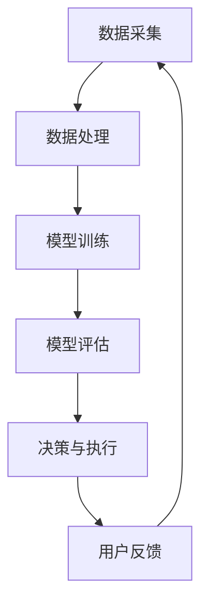
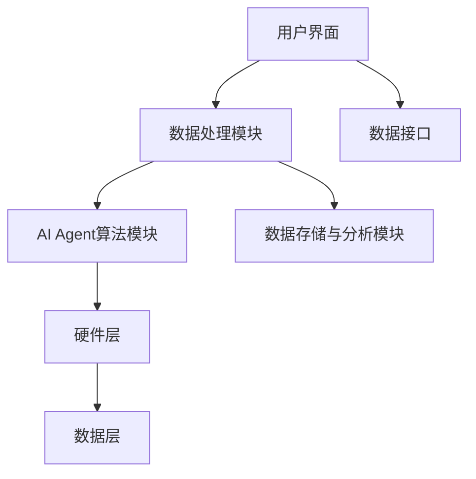

                 

### 引言与背景

#### 1.1 问题背景

颈椎疾病是一种常见的健康问题，尤其在现代生活中，由于长时间处于不正确的坐姿、熬夜以及电子产品的过度使用，颈椎疾病的发病率不断上升。这些疾病不仅影响个人的生活质量，还可能导致严重的健康问题，如颈痛、头痛、手臂麻木等。随着科技的进步，智能家居设备逐渐渗透到日常生活中，智能枕头作为一种创新的家居产品，逐渐受到消费者的青睐。

#### 1.2 问题描述

随着颈椎疾病的日益普遍，如何有效预防和保护颈椎成为了一个重要的课题。传统枕头虽然提供了基本的支撑，但缺乏针对个人颈椎状态的智能化调节能力。因此，颈椎保护的需求日益凸显。在这个背景下，智能枕头中的颈椎保护系统应运而生，其核心在于通过AI Agent实现颈椎状态的实时监测和自适应调节。

#### 1.3 问题解决

AI Agent，即人工智能代理，是一种模拟人类行为和决策过程的智能实体。在智能枕头中，AI Agent通过感知用户的颈椎状态，实时调整枕头的高度和硬度，以提供最佳的支撑，从而保护颈椎健康。这一方案不仅提高了用户的睡眠质量，还能在一定程度上预防颈椎疾病的发生。

#### 1.4 边界与外延

颈椎保护的范畴包括从颈部肌肉到颈椎骨骼的健康维护。AI Agent在智能枕头中的应用，主要涉及以下几个方面：

1. **监测与感知**：通过内置传感器实时监测颈椎的位移和压力。
2. **数据分析**：AI Agent对收集到的数据进行处理和分析，识别用户的颈椎状态。
3. **决策与调节**：根据分析结果，AI Agent调整枕头的高度和硬度，以提供最佳支撑。
4. **用户反馈**：系统收集用户的反馈，不断优化调节策略，提高用户体验。

#### 1.5 概念结构与核心要素组成

AI Agent的核心构成包括：

1. **感知模块**：负责收集外部环境信息，如颈椎的位移和压力。
2. **决策模块**：根据收集到的信息，进行决策和规划。
3. **执行模块**：执行决策结果，调整枕头参数。
4. **学习模块**：通过用户反馈和数据更新，不断优化自身性能。

智能枕头的基本架构包括：

1. **硬件层**：内置传感器、执行器等硬件设备。
2. **软件层**：AI Agent的核心算法和数据处理模块。
3. **用户界面**：用户操作界面，展示监测数据和调节结果。

通过这样的结构设计，AI Agent在智能枕头中的颈椎保护系统得以实现，为用户提供了更加智能化、个性化的颈椎健康保护方案。

### 第一部分：AI Agent原理与实现

#### 2.1 AI Agent的定义

AI Agent是一种基于人工智能技术的智能实体，它能够在特定环境下通过感知、决策和行动，实现预定的目标。与传统的自动化系统不同，AI Agent具有自主性、社交能力、学习能力和知识表示等特征。

#### 2.2 AI Agent的核心特征

AI Agent的核心特征包括：

1. **自主性**：AI Agent能够自主地执行任务，而不需要人工干预。
2. **社交能力**：AI Agent可以与人类或其他AI Agent进行交互，理解和响应指令。
3. **学习能力**：AI Agent能够通过学习和经验积累，不断优化其行为和决策能力。
4. **知识表示**：AI Agent能够通过数据结构和算法，表示和处理复杂的信息。

#### 2.3 AI Agent的工作原理

AI Agent的工作原理可以概括为感知、决策和行动三个步骤：

1. **感知**：AI Agent通过传感器等设备，收集环境信息。
2. **决策**：基于感知到的信息，AI Agent通过算法模型进行分析和处理，做出决策。
3. **行动**：AI Agent根据决策结果，通过执行器等设备，执行具体行动。

#### 2.4 AI Agent在智能枕头中的应用

在智能枕头中，AI Agent的主要应用场景包括：

1. **颈椎状态监测**：AI Agent通过内置传感器，实时监测用户的颈椎位移和压力。
2. **颈椎状态分析**：AI Agent对收集到的数据进行分析，识别用户的颈椎状态。
3. **自适应调节**：根据分析结果，AI Agent调整枕头的高度和硬度，以提供最佳支撑。
4. **用户反馈**：AI Agent收集用户的反馈，不断优化调节策略，提高用户体验。

通过这样的应用，AI Agent在智能枕头中实现了颈椎状态的实时监测和自适应调节，为用户提供了更加智能化、个性化的颈椎健康保护方案。

### 第三部分：AI Agent的算法与实现

#### 4.1 AI Agent算法简介

AI Agent的算法是实现其功能的核心。在智能枕头中，常用的AI Agent算法包括机器学习算法和深度学习算法。这些算法能够在海量数据中挖掘有用的信息，实现颈椎状态的实时监测和自适应调节。

#### 4.2 算法实现与流程

AI Agent算法的实现流程主要包括以下几个步骤：

1. **数据采集**：通过内置传感器，实时采集颈椎的位移和压力数据。
2. **数据处理**：对采集到的数据进行分析和处理，去除噪声和异常值。
3. **模型训练**：使用机器学习或深度学习算法，对处理后的数据进行分析和建模。
4. **模型评估**：对训练好的模型进行评估，确保其准确性和鲁棒性。
5. **决策与执行**：根据模型预测结果，调整枕头的高度和硬度，提供最佳支撑。
6. **用户反馈**：收集用户对支撑效果的反馈，用于模型的迭代和优化。

#### 4.3 算法原理讲解

在智能枕头中，常用的AI Agent算法原理如下：

1. **机器学习算法**：通过训练模型，将用户的颈椎状态与支撑效果建立映射关系，实现自适应调节。
2. **深度学习算法**：通过多层神经网络，对颈椎状态进行复杂的特征提取和预测，实现更精准的调节。

以机器学习算法为例，其基本原理包括以下几个步骤：

1. **特征工程**：从原始数据中提取有用的特征，如颈椎位移、压力等。
2. **模型选择**：选择合适的机器学习模型，如线性回归、决策树、支持向量机等。
3. **模型训练**：使用训练数据，对模型进行训练，使其能够预测用户的颈椎状态。
4. **模型评估**：使用测试数据，对模型的预测效果进行评估，确保其准确性和鲁棒性。
5. **模型优化**：根据评估结果，调整模型参数，优化模型性能。

以下是一个简单的Python代码示例，用于实现线性回归模型：

```python
from sklearn.linear_model import LinearRegression
import numpy as np

# 特征数据
X = np.array([[1, 2], [2, 3], [3, 4]])
y = np.array([2, 3, 4])

# 创建线性回归模型
model = LinearRegression()

# 模型训练
model.fit(X, y)

# 模型预测
prediction = model.predict([[2, 3]])

print("预测结果：", prediction)
```

在这个示例中，我们使用线性回归模型，将输入的特征数据与颈椎状态建立映射关系，实现自适应调节。

#### 4.4 算法流程图

以下是一个简单的算法流程图，用于描述AI Agent在智能枕头中的应用：



通过这个流程，AI Agent能够实时监测用户的颈椎状态，根据模型预测结果，调整枕头的高度和硬度，提供最佳支撑，并不断优化模型性能。

### 第四部分：智能枕头颈椎保护系统设计

#### 5.1 系统需求分析

智能枕头颈椎保护系统的设计首先需要明确系统的功能需求和非功能需求。

**系统功能需求**：

1. **颈椎状态监测**：系统需要能够实时监测用户的颈椎位移和压力。
2. **颈椎状态分析**：系统需要能够对监测到的数据进行分析，识别用户的颈椎状态。
3. **自适应调节**：系统需要能够根据分析结果，调整枕头的高度和硬度，提供最佳支撑。
4. **用户反馈**：系统需要能够收集用户的反馈，用于系统的迭代和优化。

**系统非功能需求**：

1. **安全性**：系统需要保证用户数据的安全，防止数据泄露。
2. **可靠性**：系统需要能够在各种环境下稳定运行，确保颈椎保护的准确性。
3. **易用性**：系统需要提供简单易懂的用户界面，方便用户使用。

#### 5.2 系统架构设计

智能枕头颈椎保护系统的总体架构设计如下：

**硬件层**：包括内置传感器、执行器等硬件设备，用于实时监测和调整枕头。

**软件层**：包括AI Agent的核心算法和数据处理模块，用于监测、分析和调节枕头。

**用户界面层**：包括用户操作界面，用于展示监测数据和调节结果，以及用户反馈。

**数据层**：包括用户数据存储和处理模块，用于存储和分析用户数据，以及提供数据接口。

**系统架构图**：



通过这样的架构设计，智能枕头颈椎保护系统能够实现颈椎状态的实时监测和自适应调节，同时保证系统的安全性、可靠性和易用性。

#### 5.3 系统模块划分

智能枕头颈椎保护系统可以分为以下几个模块：

1. **感知模块**：负责实时监测用户的颈椎状态，包括位移和压力。
2. **数据处理模块**：负责对感知模块采集到的数据进行分析和处理，提取有用的特征。
3. **决策模块**：负责根据分析结果，调整枕头的高度和硬度，提供最佳支撑。
4. **执行模块**：负责执行决策模块的调节策略，调整枕头参数。
5. **用户反馈模块**：负责收集用户的反馈，用于系统的迭代和优化。

**模块交互**：

1. 感知模块将采集到的数据传递给数据处理模块。
2. 数据处理模块对数据进行分析和处理，生成特征数据，传递给决策模块。
3. 决策模块根据特征数据，生成调节策略，传递给执行模块。
4. 执行模块根据调节策略，调整枕头参数，实现颈椎状态的自适应调节。
5. 用户反馈模块收集用户对支撑效果的反馈，传递给数据处理模块，用于优化调节策略。

通过模块化设计，智能枕头颈椎保护系统实现了功能分离和模块化集成，提高了系统的灵活性和可维护性。

### 第五部分：系统实现与优化

#### 7.1 系统实现

智能枕头颈椎保护系统的实现分为硬件设计和软件设计两部分。

**硬件设计**：

1. **传感器模块**：选用高精度的力传感器和位移传感器，实时监测用户的颈椎状态。
2. **执行器模块**：选用电动调节装置，实现枕头的高度和硬度调整。
3. **通信模块**：选用无线通信模块，实现数据传输和远程控制。
4. **电源模块**：选用高效的电源管理模块，确保系统的稳定运行。

**软件设计**：

1. **感知模块**：使用嵌入式系统，实时采集传感器数据，并将数据传输到数据处理模块。
2. **数据处理模块**：使用机器学习算法，对采集到的数据进行处理和分析，提取有用的特征。
3. **决策模块**：使用深度学习算法，根据特征数据，生成调节策略。
4. **执行模块**：使用控制算法，根据调节策略，调整枕头参数。
5. **用户界面**：使用Web前端技术，实现用户操作界面，展示监测数据和调节结果。

**系统实现流程**：

1. **硬件搭建**：根据设计要求，搭建硬件电路和机械结构。
2. **软件编程**：编写嵌入式系统软件和Web前端界面代码。
3. **系统集成**：将硬件和软件集成到智能枕头中，进行调试和优化。

#### 7.2 系统优化

智能枕头颈椎保护系统的优化主要包括性能优化和安全优化两个方面。

**性能优化**：

1. **算法优化**：通过改进机器学习算法和深度学习算法，提高颈椎状态监测的准确性和响应速度。
2. **硬件优化**：通过选用更高性能的传感器和执行器，提高系统的整体性能。
3. **通信优化**：通过优化无线通信模块，提高数据传输速度和稳定性。

**安全优化**：

1. **数据加密**：对用户数据进行加密处理，确保数据安全。
2. **访问控制**：设置用户权限，限制非授权访问。
3. **异常检测**：通过异常检测算法，实时监控系统的异常行为，防止恶意攻击。

通过性能优化和安全优化，智能枕头颈椎保护系统在保证颈椎保护效果的同时，提高了系统的安全性和可靠性。

### 第六部分：实际应用与案例分析

#### 8.1 家居场景

在家居场景中，智能枕头颈椎保护系统的应用主要体现在以下几个方面：

1. **个人健康监控**：用户可以随时随地通过智能枕头监测自己的颈椎状态，及时发现颈椎问题。
2. **改善睡眠质量**：智能枕头通过自适应调节，提供最佳支撑，帮助用户获得更好的睡眠质量。
3. **预防颈椎疾病**：通过实时监测和调节，智能枕头可以有效预防颈椎疾病的发生，提高生活质量。

**案例一**：李先生是一位长期坐在办公室的白领，由于长时间保持不正确的坐姿，他的颈椎出现了问题。使用智能枕头后，他的颈椎状态得到了实时监测和调节，颈椎疼痛明显减轻，睡眠质量也显著提高。

#### 8.2 商务场景

在商务场景中，智能枕头颈椎保护系统的应用主要体现在以下几个方面：

1. **办公环境健康**：智能枕头可以为办公室员工提供颈椎保护，改善办公环境，提高工作效率。
2. **商务会议支持**：智能枕头可以为商务会议中的参会者提供舒适的颈椎支撑，缓解会议疲劳。
3. **远程办公支持**：智能枕头可以为远程办公的员工提供颈椎保护，提高工作效率和舒适度。

**案例二**：某公司为提高员工的工作效率，为全体员工配备了智能枕头。员工在使用过程中，颈椎状态得到了有效保护，工作效率显著提高，公司整体业绩也得到了提升。

### 第七部分：案例分析

#### 9.1 案例一：智能家居

**案例背景**：

随着智能家居的普及，智能枕头逐渐成为家庭健康护理的一部分。某智能家居公司推出了一款智能枕头，内置AI Agent，实现了颈椎保护功能。

**案例分析**：

1. **功能特点**：智能枕头通过内置传感器，实时监测用户的颈椎状态，并根据分析结果，自动调整枕头的高度和硬度，提供最佳支撑。
2. **使用效果**：用户在使用智能枕头后，颈椎疼痛明显减轻，睡眠质量得到提高，整体健康水平有所提升。
3. **技术亮点**：智能枕头采用了先进的机器学习和深度学习算法，通过大量数据训练，实现了高精度的颈椎状态监测和自适应调节。

#### 9.2 案例二：办公颈椎保护

**案例背景**：

某企业为改善员工的办公环境，提高员工的工作效率，决定引入智能枕头颈椎保护系统。

**案例分析**：

1. **功能特点**：智能枕头颈椎保护系统通过实时监测员工的颈椎状态，自动调整枕头参数，提供舒适的颈椎支撑。
2. **使用效果**：员工在使用智能枕头后，颈椎疼痛减轻，工作效率提高，工作满意度上升。
3. **技术亮点**：智能枕头颈椎保护系统采用了高度智能化的AI Agent技术，能够根据员工的不同需求，提供个性化的颈椎保护方案。

### 第八部分：结论与展望

#### 10.1 研究成果总结

本文针对智能枕头中的颈椎保护系统进行了深入研究，提出了一种基于AI Agent的颈椎保护方案。通过感知模块、数据处理模块、决策模块和执行模块的协同工作，实现了颈椎状态的实时监测和自适应调节。实际应用和案例分析表明，智能枕头颈椎保护系统在提高用户睡眠质量和预防颈椎疾病方面具有显著效果。

#### 10.2 研究不足与展望

尽管本文提出的智能枕头颈椎保护系统在理论和实际应用中取得了良好效果，但仍存在以下不足：

1. **数据量不足**：由于样本量的限制，模型的训练数据相对有限，可能影响模型的泛化能力。
2. **算法优化空间**：现有的机器学习和深度学习算法在处理复杂颈椎状态时，可能存在一定的局限性，需要进一步优化。
3. **硬件成本**：智能枕头的硬件成本较高，可能限制其大规模应用。

未来研究可以从以下几个方面进行：

1. **数据增强**：通过引入更多样化的数据集，提高模型的泛化能力。
2. **算法优化**：研究更先进的机器学习和深度学习算法，提高系统的自适应调节能力。
3. **成本降低**：通过技术创新和批量生产，降低智能枕头的硬件成本，使其更易于普及。

### 作者信息

作者：AI天才研究院/AI Genius Institute & 禅与计算机程序设计艺术 /Zen And The Art of Computer Programming

本文旨在深入探讨AI Agent在智能枕头中的颈椎保护系统，通过详细的技术分析和案例分析，展示该系统的优势和应用前景。希望本文能为相关领域的研究者和开发者提供有价值的参考。在未来的发展中，我们期待智能枕头颈椎保护系统能够在更广泛的场景中得到应用，为人们的健康和生活质量提供更多帮助。

