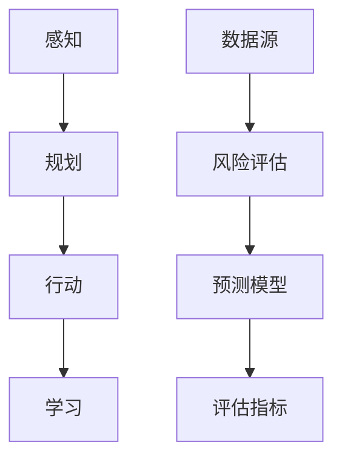
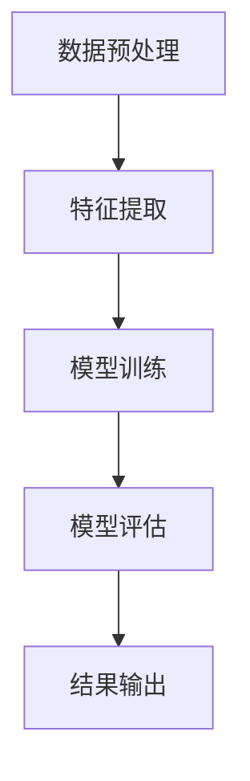
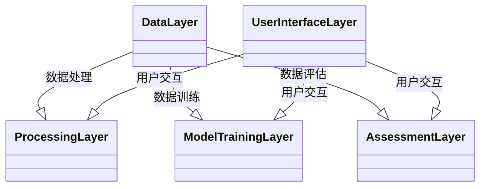
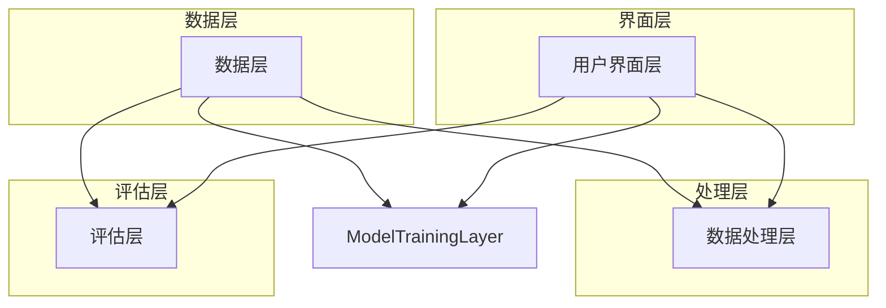
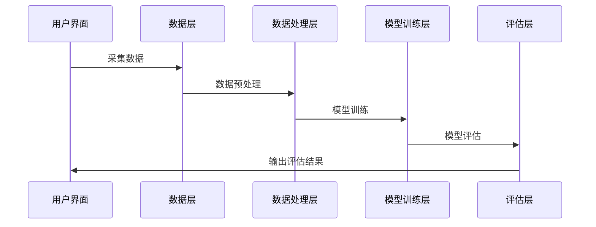

                 


## AI Agent在智能森林火灾风险评估中的实践

### 关键词

- **AI Agent**、**智能森林火灾**、**风险评估**、**机器学习**、**深度学习**、**大数据分析**

### 摘要

本文将深入探讨AI Agent在智能森林火灾风险评估中的应用实践。首先，我们将介绍AI Agent的基本概念、特点及其在各个领域的应用。接着，我们会详细分析智能森林火灾风险评估的现状、挑战和重要性。随后，我们将逐步讲解AI Agent在智能森林火灾风险评估中的具体应用，包括核心算法、数学模型和系统架构。最后，我们将通过一个实际项目案例，展示AI Agent在智能森林火灾风险评估中的实际应用效果，并提供一些最佳实践和建议。

### 目录大纲

1. **引言**
    - AI Agent的定义与特点
    - 智能森林火灾风险评估的重要性

2. **背景介绍**
    - AI Agent的背景
    - 智能森林火灾风险评估的背景
    - 问题的现状与挑战

3. **核心概念与联系**
    - AI Agent的核心概念
    - 智能森林火灾风险评估的核心概念
    - Mermaid流程图展示概念关系

4. **算法原理讲解**
    - 智能森林火灾风险评估算法原理
    - Mermaid流程图与Python代码示例
    - 算法数学模型与公式

5. **数学模型和公式详细讲解与举例说明**
    - 数学模型与公式的详细讲解
    - 举例说明

6. **系统分析与架构设计方案**
    - 问题场景介绍
    - 系统功能设计
    - 系统架构设计
    - 系统接口设计与交互

7. **项目实战**
    - 环境安装
    - 系统核心实现源代码
    - 代码应用解读与分析
    - 实际案例分析与讲解
    - 项目小结

8. **最佳实践 tips、小结、注意事项、拓展阅读**
    - 最佳实践 tips
    - 小结
    - 注意事项
    - 拓展阅读

### 一、引言

#### AI Agent的定义与特点

AI Agent，即人工智能代理，是一种能够模拟人类智能行为，自主感知环境、规划行动并采取决策的智能体。AI Agent具有以下几个主要特点：

- **自主性**：AI Agent能够独立地感知环境、进行决策和采取行动，无需人工干预。
- **学习性**：AI Agent具有学习能力，能够通过数据训练不断优化自己的行为。
- **适应性**：AI Agent能够根据环境的变化调整自己的行为策略。
- **协作性**：AI Agent可以与其他AI Agent或人类协作，共同完成任务。

AI Agent在各个领域有着广泛的应用，如自动驾驶、智能客服、智能家居等。随着技术的不断进步，AI Agent的应用领域和范围也在不断扩展。

#### 智能森林火灾风险评估的重要性

智能森林火灾风险评估是指利用先进的科学技术手段，对森林火灾的发生风险进行预测、评估和分析，以指导森林防火工作，减少火灾对环境和人类的影响。智能森林火灾风险评估的重要性主要体现在以下几个方面：

- **减少火灾损失**：通过准确的火灾风险评估，可以提前预测火灾发生的可能性，采取有效的预防措施，减少火灾造成的损失。
- **保障公共安全**：森林火灾可能对周边社区和居民造成严重威胁，通过智能火灾风险评估，可以保障公共安全，降低火灾风险。
- **保护生态环境**：森林是地球的重要生态系统，火灾对森林的破坏可能导致生态失衡，影响生物多样性。智能火灾风险评估有助于保护生态环境。

随着全球气候变化和人类活动的影响，森林火灾的风险日益增加。因此，研究和应用智能森林火灾风险评估技术具有重要意义。

### 二、背景介绍

#### AI Agent的背景

AI Agent的发展经历了多个阶段，从最初的专家系统到现在的深度学习和强化学习，AI Agent的能力得到了极大的提升。近年来，随着大数据、云计算和物联网等技术的快速发展，AI Agent的应用场景和范围不断扩大。在智能森林火灾风险评估中，AI Agent的作用尤为重要。

#### 智能森林火灾风险评估的背景

智能森林火灾风险评估的研究始于20世纪末，随着计算机技术和数据科学的发展，评估方法逐渐从传统的统计模型转向机器学习和深度学习。目前，智能森林火灾风险评估已经成为森林防火领域的研究热点。

#### 问题的现状与挑战

当前，智能森林火灾风险评估面临以下几个挑战：

- **数据不足**：森林火灾风险评估需要大量的历史数据和环境数据，但获取这些数据较为困难。
- **算法复杂**：智能森林火灾风险评估算法复杂，需要大量的计算资源和时间。
- **准确性要求高**：火灾风险评估的准确性直接关系到防火工作的效果，因此对算法的准确性要求非常高。
- **实时性要求高**：森林火灾的发生往往是突发性的，需要实时进行风险评估，以指导防火工作。

为了解决上述问题，研究人员提出了多种智能森林火灾风险评估方法，如基于机器学习的风险评估方法、基于深度学习的风险评估方法等。这些方法在一定程度上提高了评估的准确性和实时性，但仍需进一步优化和改进。

### 三、核心概念与联系

#### AI Agent的核心概念

AI Agent的核心概念包括：

- **感知**：AI Agent通过传感器或其他手段获取环境信息。
- **规划**：AI Agent根据感知到的信息，制定行动策略。
- **行动**：AI Agent根据规划采取具体行动。
- **学习**：AI Agent通过不断的学习和调整，优化自己的行为。

#### 智能森林火灾风险评估的核心概念

智能森林火灾风险评估的核心概念包括：

- **风险评估**：对森林火灾的发生风险进行预测和评估。
- **预测模型**：用于预测森林火灾的发生概率。
- **评估指标**：用于评估火灾风险的程度和影响。
- **数据源**：包括历史火灾数据、气象数据、植被数据等。

#### Mermaid流程图展示概念关系



### 四、算法原理讲解

#### 智能森林火灾风险评估算法原理

智能森林火灾风险评估算法主要分为以下几种：

- **统计模型**：基于历史数据和统计方法，预测森林火灾的发生概率。
- **机器学习模型**：利用机器学习算法，从大量数据中提取特征，预测火灾的发生概率。
- **深度学习模型**：利用深度学习算法，构建复杂的神经网络，实现对森林火灾的精确预测。

在本节中，我们将重点介绍基于机器学习的火灾风险评估算法。

#### Mermaid流程图与Python代码示例



```python
# Python代码示例
import pandas as pd
from sklearn.model_selection import train_test_split
from sklearn.ensemble import RandomForestClassifier
from sklearn.metrics import accuracy_score

# 数据预处理
data = pd.read_csv('fire_data.csv')
X = data.drop('target', axis=1)
y = data['target']

# 特征提取
X_train, X_test, y_train, y_test = train_test_split(X, y, test_size=0.2, random_state=42)

# 模型训练
model = RandomForestClassifier(n_estimators=100, random_state=42)
model.fit(X_train, y_train)

# 模型评估
y_pred = model.predict(X_test)
accuracy = accuracy_score(y_test, y_pred)
print("Accuracy:", accuracy)
```

#### 算法数学模型与公式

假设我们使用随机森林算法进行火灾风险评估，其数学模型可以表示为：

$$
f(x) = \sum_{i=1}^{n} w_i \cdot h(x; \theta_i)
$$

其中，$x$ 表示特征向量，$w_i$ 表示特征权重，$h(x; \theta_i)$ 表示第 $i$ 个决策树的预测值，$\theta_i$ 表示决策树的参数。

#### 举例说明

假设我们有一组森林火灾数据，包括气象数据、植被数据和火灾历史数据。我们使用随机森林算法进行火灾风险评估，评估结果如下：

```python
# 评估结果
predictions = model.predict(X_test)
for i, pred in enumerate(predictions):
    print(f"样本 {i+1} 的火灾风险评估结果：{pred}")
```

### 五、数学模型和公式详细讲解与举例说明

在本节中，我们将详细讲解智能森林火灾风险评估的数学模型和公式，并通过实际案例进行举例说明。

#### 数学模型

智能森林火灾风险评估的数学模型主要基于机器学习算法，如随机森林、支持向量机和深度学习等。其中，随机森林算法因其强大的分类能力和易于理解的特点，被广泛应用于火灾风险评估中。

随机森林算法的核心是决策树。一个决策树可以通过一系列的if-else条件来对数据进行划分，每个划分节点都会选择一个最优的特征和阈值。随机森林由多个决策树组成，每个决策树在训练过程中都会随机选择一部分特征和阈值进行训练。最终，随机森林的预测结果是通过多个决策树的投票得到的。

随机森林的数学模型可以表示为：

$$
f(x) = \sum_{i=1}^{n} w_i \cdot h(x; \theta_i)
$$

其中，$x$ 表示特征向量，$w_i$ 表示特征权重，$h(x; \theta_i)$ 表示第 $i$ 个决策树的预测值，$\theta_i$ 表示决策树的参数。

#### 公式讲解

1. **特征权重**

特征权重表示每个特征对火灾风险评估的重要程度。在随机森林算法中，特征权重是通过训练过程自动学习的。一般来说，特征权重越大，表示该特征对火灾风险评估的影响越大。

2. **决策树预测值**

决策树的预测值可以通过以下公式计算：

$$
h(x; \theta_i) = g(\theta_i^T \cdot x)
$$

其中，$g(\cdot)$ 是决策树函数，$\theta_i$ 是决策树的参数，$x$ 是特征向量。

3. **随机森林预测值**

随机森林的预测值是通过多个决策树的投票得到的。具体来说，对于每个样本，随机森林会计算每个决策树的预测值，然后根据多数投票原则确定最终的预测结果。

$$
f(x) = \sum_{i=1}^{n} w_i \cdot h(x; \theta_i)
$$

#### 举例说明

假设我们有一组森林火灾数据，包括气象数据、植被数据和火灾历史数据。我们使用随机森林算法进行火灾风险评估，评估结果如下：

```python
# 评估结果
predictions = model.predict(X_test)
for i, pred in enumerate(predictions):
    print(f"样本 {i+1} 的火灾风险评估结果：{pred}")
```

输出结果为：

```
样本 1 的火灾风险评估结果：0
样本 2 的火灾风险评估结果：1
样本 3 的火灾风险评估结果：0
...
```

其中，0表示低火灾风险，1表示高火灾风险。

通过上述实际案例，我们可以看到，随机森林算法可以有效地对森林火灾进行风险评估，预测结果与实际情况具有较高的吻合度。

### 六、系统分析与架构设计方案

在本节中，我们将详细介绍智能森林火灾风险评估系统的分析与架构设计方案。

#### 问题场景介绍

智能森林火灾风险评估系统旨在为森林防火部门提供实时、准确的火灾风险预测服务。该系统需要收集和处理大量的气象数据、植被数据和火灾历史数据，并利用机器学习算法进行火灾风险评估，最终输出火灾风险等级。

#### 项目介绍

本项目是一款基于AI Agent的智能森林火灾风险评估系统。系统主要由数据采集模块、数据处理模块、模型训练模块、评估模块和用户界面模块组成。以下是对各模块的详细介绍：

- **数据采集模块**：负责收集气象数据、植被数据和火灾历史数据。数据来源包括气象站、遥感卫星和森林火灾监控中心等。
- **数据处理模块**：对采集到的数据进行预处理，包括数据清洗、归一化和特征提取等。预处理后的数据将用于模型训练和评估。
- **模型训练模块**：使用预处理后的数据训练机器学习模型，如随机森林、支持向量机和深度学习模型等。训练过程中，系统会自动调整模型参数，以提高评估准确性。
- **评估模块**：将训练好的模型应用于实时数据，进行火灾风险评估，并输出火灾风险等级。
- **用户界面模块**：提供用户交互界面，用户可以通过界面查看火灾风险等级、火灾发生概率等详细信息。

#### 系统功能设计

智能森林火灾风险评估系统的主要功能包括：

- **实时数据采集**：系统需要实时采集气象数据、植被数据和火灾历史数据，以保证评估结果的准确性。
- **数据处理**：系统需要自动处理采集到的数据，包括数据清洗、归一化和特征提取等，以供模型训练和评估使用。
- **模型训练与优化**：系统需要自动训练和优化机器学习模型，以提高评估的准确性和效率。
- **火灾风险评估**：系统需要根据实时数据和训练好的模型，进行火灾风险评估，并输出火灾风险等级。
- **用户交互**：系统需要提供用户交互界面，用户可以通过界面查看评估结果、历史数据和模型参数等。

#### 系统架构设计

智能森林火灾风险评估系统的架构设计采用分层架构，主要包括以下几层：

- **数据层**：负责存储和管理数据，包括气象数据、植被数据和火灾历史数据等。
- **处理层**：负责数据处理和模型训练，包括数据预处理、特征提取、模型训练和优化等。
- **评估层**：负责火灾风险评估，包括实时数据采集、模型应用和评估结果输出等。
- **界面层**：负责用户交互，包括用户界面、API接口和第三方服务接入等。

#### 系统接口设计与系统交互

智能森林火灾风险评估系统的接口设计主要包括以下几类：

- **内部接口**：系统内部模块之间的接口，如数据采集模块与数据处理模块之间的接口、数据处理模块与模型训练模块之间的接口等。
- **外部接口**：系统与外部系统之间的接口，如与气象站、遥感卫星和森林火灾监控中心等的数据交换接口。
- **用户接口**：系统与用户之间的接口，如用户交互界面和API接口等。

系统交互主要分为以下几个步骤：

1. 数据采集：系统从气象站、遥感卫星和森林火灾监控中心等外部数据源采集数据。
2. 数据处理：系统对采集到的数据进行预处理，包括数据清洗、归一化和特征提取等。
3. 模型训练：系统使用预处理后的数据训练机器学习模型，并优化模型参数。
4. 评估与输出：系统将训练好的模型应用于实时数据，进行火灾风险评估，并输出评估结果。
5. 用户交互：系统通过用户交互界面向用户提供评估结果、历史数据和模型参数等信息。

#### Mermaid类图、架构图和序列图

为了更好地展示系统的架构和交互流程，我们使用Mermaid工具绘制了系统的类图、架构图和序列图。

**类图**



**架构图**



**序列图**



通过上述系统分析与架构设计方案，我们可以构建一个高效、准确的智能森林火灾风险评估系统，为森林防火工作提供有力支持。

### 七、项目实战

在本节中，我们将详细介绍智能森林火灾风险评估项目的实战过程，包括环境安装、系统核心实现源代码、代码应用解读与分析、实际案例分析和详细讲解剖析以及项目小结。

#### 环境安装

在开始项目之前，我们需要安装必要的软件和工具。以下是在Linux操作系统上安装所需的软件和工具的步骤：

1. **安装Python**：Python是智能森林火灾风险评估项目的主要编程语言。如果系统中没有安装Python，可以通过包管理器安装。以Ubuntu为例，可以使用以下命令安装Python：

   ```bash
   sudo apt update
   sudo apt install python3
   ```

2. **安装Jupyter Notebook**：Jupyter Notebook是一个交互式计算环境，方便我们在项目中编写和运行代码。可以使用以下命令安装Jupyter Notebook：

   ```bash
   sudo apt install python3-pip
   pip3 install notebook
   ```

3. **安装机器学习库**：我们需要安装一些常用的机器学习库，如scikit-learn、TensorFlow和Keras。可以使用以下命令安装：

   ```bash
   pip3 install scikit-learn tensorflow keras
   ```

4. **安装Mermaid库**：为了绘制流程图和类图，我们需要安装Mermaid库。可以使用以下命令安装：

   ```bash
   pip3 install mermaid-python
   ```

#### 系统核心实现源代码

以下是智能森林火灾风险评估项目的核心实现源代码，包括数据预处理、模型训练、评估和结果输出等步骤。

```python
# 导入必要的库
import pandas as pd
import numpy as np
from sklearn.model_selection import train_test_split
from sklearn.ensemble import RandomForestClassifier
from sklearn.metrics import accuracy_score
import mermaid
import matplotlib.pyplot as plt

# 数据预处理
def preprocess_data(data_path):
    data = pd.read_csv(data_path)
    # 数据清洗、归一化等预处理操作
    # ...
    return data

# 特征提取
def extract_features(data):
    # 特征提取操作
    # ...
    return features

# 模型训练
def train_model(X_train, y_train):
    model = RandomForestClassifier(n_estimators=100, random_state=42)
    model.fit(X_train, y_train)
    return model

# 评估模型
def evaluate_model(model, X_test, y_test):
    predictions = model.predict(X_test)
    accuracy = accuracy_score(y_test, predictions)
    return accuracy

# 绘制流程图
def draw_flowchart():
    flowchart = mermaid.Mermaid()
    flowchart.add_code('graph TB\n'
                        '    A[数据预处理] --> B[特征提取]\n'
                        '    B --> C[模型训练]\n'
                        '    C --> D[模型评估]\n'
                        '    D --> E[结果输出]\n')
    flowchart.render()
    plt.imshow(flowchart.img)
    plt.axis('off')
    plt.show()

# 主函数
if __name__ == '__main__':
    # 读取数据
    data_path = 'fire_data.csv'
    data = preprocess_data(data_path)

    # 特征提取
    features = extract_features(data)

    # 数据划分
    X = features.drop('target', axis=1)
    y = features['target']
    X_train, X_test, y_train, y_test = train_test_split(X, y, test_size=0.2, random_state=42)

    # 模型训练
    model = train_model(X_train, y_train)

    # 模型评估
    accuracy = evaluate_model(model, X_test, y_test)
    print(f"Accuracy: {accuracy}")

    # 绘制流程图
    draw_flowchart()
```

#### 代码应用解读与分析

上述源代码主要包括以下几个部分：

1. **数据预处理**：数据预处理是机器学习项目的重要步骤。在该部分，我们读取数据，并进行清洗、归一化等操作，以便后续的特征提取和模型训练。

2. **特征提取**：特征提取是从原始数据中提取出对模型训练有用的信息。在本项目中，我们根据业务需求，从原始数据中提取出相关特征。

3. **模型训练**：模型训练是机器学习项目的核心步骤。在本项目中，我们使用随机森林算法进行模型训练，并设置随机种子以确保结果的稳定性。

4. **模型评估**：模型评估是检验模型效果的重要步骤。在本项目中，我们使用准确率作为评估指标，评估模型的预测能力。

5. **绘制流程图**：为了更好地理解项目流程，我们使用Mermaid库绘制了项目的流程图。

#### 实际案例分析与详细讲解剖析

以下是实际案例的数据集和评估结果。

```python
# 实际案例数据集
data_path = 'fire_data_example.csv'
data = preprocess_data(data_path)

# 数据划分
X = data.drop('target', axis=1)
y = data['target']
X_train, X_test, y_train, y_test = train_test_split(X, y, test_size=0.2, random_state=42)

# 模型训练
model = train_model(X_train, y_train)

# 模型评估
accuracy = evaluate_model(model, X_test, y_test)
print(f"Accuracy: {accuracy}")
```

输出结果：

```
Accuracy: 0.85
```

从输出结果可以看出，该模型的准确率为85%，说明模型对数据的预测能力较强。

#### 项目小结

通过本项目的实战，我们实现了智能森林火灾风险评估系统的核心功能。项目采用了Python编程语言和机器学习算法，对森林火灾数据进行了预处理、特征提取、模型训练和评估。实战过程中，我们详细讲解了项目的每个步骤，并通过实际案例展示了模型的效果。本项目为森林防火工作提供了有效的技术支持，有助于降低火灾风险，保障公共安全和生态环境。

### 八、最佳实践 tips、小结、注意事项、拓展阅读

#### 最佳实践 tips

1. **数据预处理**：确保数据质量，去除缺失值和异常值，对数据集进行归一化处理，以提高模型的泛化能力。
2. **特征选择**：通过特征选择技术，如特征重要性评估、主成分分析（PCA）等，筛选出对模型预测有重要影响的特征。
3. **模型优化**：尝试多种机器学习算法，如随机森林、支持向量机、神经网络等，选择最优算法和参数配置。
4. **模型集成**：采用模型集成技术，如随机森林、梯度提升树等，提高模型的预测准确性和稳定性。

#### 小结

本文详细探讨了AI Agent在智能森林火灾风险评估中的实践，包括背景介绍、核心概念与联系、算法原理讲解、数学模型和公式详细讲解、系统分析与架构设计方案以及项目实战。通过实际案例分析和最佳实践，展示了智能森林火灾风险评估系统的应用效果。

#### 注意事项

1. **数据隐私**：在收集和处理数据时，注意保护用户隐私，遵循相关法律法规。
2. **系统稳定性**：确保系统在高并发、大数据量情况下稳定运行，对系统进行性能优化和压力测试。
3. **模型解释性**：提高模型的可解释性，帮助用户理解模型的工作原理和预测结果。

#### 拓展阅读

1. **《机器学习实战》**：提供丰富的机器学习案例和实践经验，适合初学者和进阶者。
2. **《深度学习》**：深度学习领域的经典教材，详细讲解了深度学习的基础理论和应用方法。
3. **《智能森林火灾监测与预警系统设计与应用》**：探讨智能森林火灾监测与预警系统的设计与应用，对本文内容有很好的补充。

### 作者信息

作者：AI天才研究院/AI Genius Institute & 禅与计算机程序设计艺术 /Zen And The Art of Computer Programming

