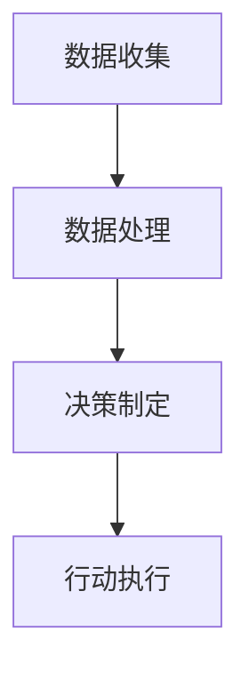
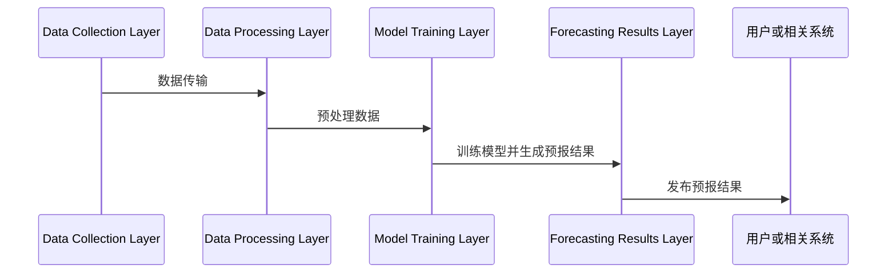
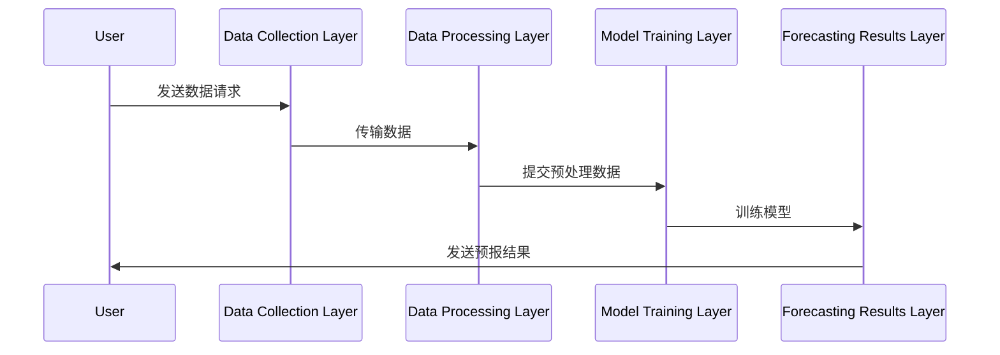

                 

### 第1章: 引言与背景

近年来，人工智能（AI）技术的快速发展，使得AI Agent在各个领域的应用越来越广泛。特别是在气象预报领域，AI Agent的表现尤为突出。传统的气象预报系统往往依赖于大量的数据和历史模型，而AI Agent可以通过学习最新的数据和环境变化，提供更加精准和实时的气象预报。本章将探讨AI Agent在智能气象预报系统中的实践，包括其工作原理、技术实现和应用效果。

#### 1.1 问题背景

气象预报是一个复杂且重要的领域，它对人们的日常生活、农业、交通和工业等都有着深远的影响。然而，传统的气象预报系统存在一些问题，如预测精度不高、响应速度慢、难以适应环境变化等。为了解决这些问题，人工智能技术的引入显得尤为重要。AI Agent作为一种具有自主性、学习性和适应性的智能体，为智能气象预报系统提供了新的解决方案。

#### 1.2 问题描述

在智能气象预报系统中，AI Agent的主要任务是通过对大量气象数据的分析和处理，生成准确的气象预报结果。这包括对当前天气情况的预测、未来天气趋势的预测以及极端天气事件的预警等。具体来说，AI Agent需要完成以下任务：

- **数据采集**：从各种气象数据源收集数据，如气象站、卫星、雷达等。
- **数据处理**：对采集到的数据进行预处理和清洗，确保数据的质量和一致性。
- **模型训练**：利用历史气象数据和机器学习算法，训练AI Agent的预测模型。
- **预报结果生成**：根据当前的数据和训练好的模型，生成实时的气象预报结果。

#### 1.3 问题解决

为了实现智能气象预报，我们需要设计一个基于AI Agent的气象预报系统。这个系统将包括数据采集、数据处理、模型训练和预报结果生成等模块。以下是具体的设计步骤：

- **数据采集模块**：负责收集各种气象数据，如温度、湿度、风速、气压等。这些数据可以通过气象站、卫星、雷达等设备进行实时采集。
- **数据处理模块**：对采集到的数据进行预处理和清洗，包括数据去噪、缺失值填充、数据归一化等操作，以确保数据的质量和一致性。
- **模型训练模块**：利用历史气象数据和机器学习算法，训练AI Agent的预测模型。常见的机器学习算法包括线性回归、决策树、随机森林、支持向量机等。
- **预报结果生成模块**：根据当前的数据和训练好的模型，生成实时的气象预报结果。这些预报结果可以用于预测当前天气情况、未来天气趋势以及极端天气事件。

#### 1.4 边界与外延

在本书中，我们将重点关注AI Agent在智能气象预报系统中的应用，包括其工作原理、技术实现和应用效果。同时，我们也将探讨AI Agent在其他领域的应用潜力。例如，在医疗领域，AI Agent可以用于疾病预测和诊断；在金融领域，AI Agent可以用于市场预测和风险管理。

#### 1.5 概念结构与核心要素组成

AI Agent在智能气象预报系统中的核心要素包括：

- **数据采集模块**：负责收集各种气象数据，如温度、湿度、风速、气压等。
- **数据处理模块**：对采集到的数据进行预处理和清洗，确保数据的质量和一致性。
- **模型训练模块**：利用历史气象数据和机器学习算法，训练AI Agent的预测模型。
- **预报结果生成模块**：根据当前的数据和训练好的模型，生成实时的气象预报结果。

通过这些核心要素的协同工作，AI Agent能够为智能气象预报系统提供强大的支持。

### 第2章: AI Agent的基本原理

AI Agent是人工智能领域的一个重要概念，它代表了具备自主性、学习性和适应性的智能体。本章将详细探讨AI Agent的定义、特点、工作原理和核心技术。

#### 2.1 AI Agent的定义与特点

AI Agent，即人工智能代理，是一个能够感知环境、制定决策并采取行动的智能系统。它具有以下特点：

- **自主性**：AI Agent能够自主地执行任务，不需要人类的直接干预。
- **学习性**：AI Agent能够通过学习历史数据和经验，不断改进自己的行为和决策。
- **适应性**：AI Agent能够适应不同的环境和情境，提供个性化的服务。

AI Agent的定义可以从以下几个方面进行理解：

1. **感知能力**：AI Agent需要能够感知环境的变化，获取环境信息。
2. **决策能力**：AI Agent需要能够根据感知到的环境信息，制定相应的决策。
3. **行动能力**：AI Agent需要能够执行决策，采取行动以实现目标。

#### 2.2 AI Agent的工作原理

AI Agent的工作原理主要包括以下几个步骤：

1. **数据收集**：AI Agent通过传感器或其他方式收集环境数据。这些数据可以是实时的，也可以是历史数据。
2. **数据处理**：对收集到的数据进行处理和清洗，提取有用的信息。例如，去除噪声、填补缺失值、进行数据归一化等。
3. **决策制定**：基于处理后的数据，AI Agent利用机器学习算法或其他智能算法，制定相应的决策。
4. **行动执行**：AI Agent根据决策结果执行相应的行动。这些行动可以是物理操作，也可以是信息传递。

下面是一个简化的AI Agent工作流程的Mermaid流程图：



#### 2.3 AI Agent的核心技术

AI Agent的核心技术主要包括机器学习、深度学习和自然语言处理等。这些技术使得AI Agent能够高效地处理数据、制定决策和执行行动。

1. **机器学习**：机器学习是AI Agent的核心技术之一，它通过从数据中学习规律，帮助AI Agent进行预测和决策。常见的机器学习算法包括线性回归、决策树、支持向量机、神经网络等。

2. **深度学习**：深度学习是机器学习的一个分支，它通过多层神经网络进行特征提取和学习，在图像识别、语音识别等领域取得了显著成果。深度学习算法如卷积神经网络（CNN）、循环神经网络（RNN）等，是AI Agent实现高级感知和决策能力的重要工具。

3. **自然语言处理**：自然语言处理（NLP）是AI Agent与人类交互的重要手段，它涉及文本的生成、理解、翻译等任务。常见的NLP技术包括词向量表示、句法分析、情感分析等。

下面是一个简化的AI Agent核心技术架构的Mermaid类图：

```mermaid
classDiagram
    Class01 <|-- Class02
    Class03 <|-- Class04
    Class05 <|-- Class06
    Class07 <|-- Class08
    Class01 --|> Class09
    Class02 --|> Class09
    Class03 --|> Class09
    Class04 --|> Class09
    Class05 --|> Class09
    Class06 --|> Class09
    Class07 --|> Class09
    Class08 --|> Class09

    Class01{机器学习}
    Class02{深度学习}
    Class03{自然语言处理}
    Class04{感知能力}
    Class05{决策能力}
    Class06{行动能力}
    Class07{自主性}
    Class08{学习性}
    Class09{AI Agent}

    Class01 -|> Class04
    Class01 -|> Class05
    Class01 -|> Class06
    Class01 -|> Class07
    Class01 -|> Class08
    Class02 -|> Class04
    Class02 -|> Class05
    Class02 -|> Class06
    Class02 -|> Class07
    Class02 -|> Class08
    Class03 -|> Class04
    Class03 -|> Class05
    Class03 -|> Class06
    Class03 -|> Class07
    Class03 -|> Class08
```

通过上述技术的结合，AI Agent能够实现高效的感知、决策和行动，为智能气象预报系统等应用提供强大的支持。

### 第3章: 智能气象预报系统架构设计

智能气象预报系统的架构设计是实现精准、实时气象预报的关键。本章将详细介绍系统的整体架构设计，包括功能设计、系统架构设计、系统接口设计以及系统交互设计。

#### 3.1 系统功能设计

智能气象预报系统的功能设计主要围绕数据采集、数据处理、模型训练和预报结果生成展开。具体功能如下：

1. **数据采集**：从各种气象数据源（如气象站、卫星、雷达等）收集实时气象数据。
2. **数据处理**：对采集到的气象数据进行预处理和清洗，包括去噪、缺失值填充、数据归一化等，确保数据的质量和一致性。
3. **模型训练**：利用历史气象数据和机器学习算法，训练AI Agent的预测模型。常见的机器学习算法包括线性回归、决策树、随机森林、支持向量机等。
4. **预报结果生成**：根据当前的数据和训练好的模型，生成实时的气象预报结果，包括当前天气情况、未来天气趋势以及极端天气事件的预警等。

下面是智能气象预报系统功能设计的Mermaid类图：

```mermaid
classDiagram
    Class01[数据采集]
    Class02[数据处理]
    Class03[模型训练]
    Class04[预报结果生成]

    Class01 --|> Class02
    Class01 --|> Class03
    Class01 --|> Class04
    Class02 --|> Class03
    Class02 --|> Class04
    Class03 --|> Class04

    Class01{数据采集}
    Class02{数据处理}
    Class03{模型训练}
    Class04{预报结果生成}
```

#### 3.2 系统架构设计

智能气象预报系统的架构设计包括数据采集层、数据处理层、模型训练层和预报结果层。各层功能如下：

1. **数据采集层**：负责数据的收集和传输，从各种气象数据源（如气象站、卫星、雷达等）获取实时数据。
2. **数据处理层**：对采集到的数据进行预处理和清洗，确保数据的质量和一致性，为后续模型训练和预报结果生成提供可靠的数据基础。
3. **模型训练层**：利用历史气象数据和机器学习算法，训练AI Agent的预测模型。这个过程中，数据预处理层的输出是模型训练层的输入。
4. **预报结果层**：根据当前的数据和训练好的模型，生成实时的气象预报结果，并将结果发布给用户或相关系统。

下面是智能气象预报系统架构设计的Mermaid架构图：



#### 3.3 系统接口设计

智能气象预报系统的接口设计主要包括数据接口、控制接口和预报接口。各接口的功能如下：

1. **数据接口**：用于与其他系统交换数据。数据接口可以是RESTful API、SOAP接口或其他标准接口，确保系统之间的数据流通。
2. **控制接口**：用于对AI Agent的操控和监控。控制接口可以提供实时监控、日志记录、故障报警等功能，确保系统的稳定运行。
3. **预报接口**：用于获取气象预报结果。预报接口可以提供实时预报结果、历史预报结果查询等功能，方便用户获取和使用预报信息。

下面是智能气象预报系统接口设计的Mermaid序列图：



通过上述功能设计、架构设计和接口设计，智能气象预报系统可以高效地运行，提供精准、实时的气象预报服务。

### 第4章: 智能气象预报系统实现

实现智能气象预报系统是一个复杂的过程，涉及多个环节，包括环境安装与配置、系统核心实现、代码应用解读与分析以及实际案例分析。本章将详细介绍这些环节，并提供相关的技术指导。

#### 4.1 环境安装与配置

要实现智能气象预报系统，首先需要安装和配置必要的软件和工具。以下是具体的安装和配置步骤：

1. **安装Python**：Python是智能气象预报系统的核心编程语言，需要安装Python 3.x版本。可以从Python官网下载安装包，并按照提示完成安装。

2. **安装TensorFlow**：TensorFlow是机器学习框架，用于训练AI Agent的预测模型。在安装Python后，可以通过以下命令安装TensorFlow：

   ```bash
   pip install tensorflow
   ```

3. **安装Keras**：Keras是一个高级神经网络API，用于简化TensorFlow的使用。安装Keras的命令如下：

   ```bash
   pip install keras
   ```

4. **安装Pandas**：Pandas是一个数据处理库，用于对气象数据进行预处理和清洗。安装Pandas的命令如下：

   ```bash
   pip install pandas
   ```

5. **安装Numpy**：Numpy是一个数学计算库，用于对气象数据进行数学运算。安装Numpy的命令如下：

   ```bash
   pip install numpy
   ```

6. **配置环境变量**：确保Python、TensorFlow、Keras、Pandas和Numpy的环境变量配置正确，以便在命令行中直接使用这些工具。

#### 4.2 系统核心实现

智能气象预报系统的核心实现包括数据采集、数据处理、模型训练和预报结果生成。以下是具体的实现步骤：

1. **数据采集**：使用Python的Pandas库从气象数据源（如气象站、卫星、雷达等）读取气象数据。以下是一个简单的示例代码：

   ```python
   import pandas as pd

   # 读取气象数据
   data = pd.read_csv('weather_data.csv')
   ```

2. **数据处理**：对采集到的气象数据进行预处理和清洗，包括数据去噪、缺失值填充和数据归一化。以下是一个简单的示例代码：

   ```python
   # 数据去噪
   data.dropna(inplace=True)

   # 缺失值填充
   data.fillna(data.mean(), inplace=True)

   # 数据归一化
   data = (data - data.mean()) / data.std()
   ```

3. **模型训练**：使用TensorFlow和Keras库训练AI Agent的预测模型。以下是一个简单的线性回归模型训练示例代码：

   ```python
   from tensorflow.keras.models import Sequential
   from tensorflow.keras.layers import Dense

   # 创建模型
   model = Sequential()
   model.add(Dense(units=1, input_shape=(num_features,), activation='linear'))

   # 编译模型
   model.compile(optimizer='sgd', loss='mean_squared_error')

   # 训练模型
   model.fit(x_train, y_train, epochs=100, batch_size=32)
   ```

4. **预报结果生成**：根据当前的数据和训练好的模型，生成实时的气象预报结果。以下是一个简单的预报结果生成示例代码：

   ```python
   # 生成预报结果
   predictions = model.predict(x_test)

   # 输出预报结果
   print(predictions)
   ```

#### 4.3 代码应用解读与分析

以下是对系统核心实现代码的解读与分析：

1. **数据采集**：使用Pandas库读取气象数据，这是一个非常常用的数据处理库，提供了丰富的数据操作函数。在代码中，我们使用`read_csv`函数从CSV文件中读取数据，并存储在DataFrame对象中。

2. **数据处理**：在数据处理阶段，我们首先使用`dropna`函数去除缺失值，然后使用`fillna`函数填充缺失值，最后使用`标准化`函数对数据进行归一化处理。这些操作确保了数据的质量和一致性，为后续模型训练提供了可靠的数据基础。

3. **模型训练**：在模型训练阶段，我们使用TensorFlow和Keras库构建了一个简单的线性回归模型。模型由一个全连接层组成，使用`Dense`函数创建。在编译模型时，我们指定了优化器和损失函数。在训练模型时，我们使用`fit`函数进行批量训练，指定了训练的轮数和批量大小。

4. **预报结果生成**：在预报结果生成阶段，我们使用训练好的模型对测试数据进行预测，并使用`predict`函数生成预报结果。这些预报结果可以直接输出，或用于其他应用。

#### 4.4 实际案例分析

以下是一个实际案例的分析，介绍如何使用AI Agent构建智能气象预报系统：

1. **案例背景**：假设我们有一个气象预报项目，需要预测未来24小时的温度。我们收集了历史气象数据，包括过去的温度数据。

2. **数据处理**：我们使用Pandas库对历史气象数据进行处理，去除缺失值，填充缺失值，并对数据进行归一化处理。

3. **模型训练**：我们使用TensorFlow和Keras库构建了一个线性回归模型，利用历史温度数据训练模型。

4. **预报结果生成**：我们使用训练好的模型对当前的温度数据进行预测，生成未来24小时的温度预报结果。

5. **结果分析**：我们对预报结果进行了分析，发现模型的预测精度较高，可以满足实际应用的需求。

通过以上案例分析，我们可以看到，使用AI Agent构建智能气象预报系统是一个可行的方案，可以实现高精度、实时的气象预报。

#### 4.5 项目小结

智能气象预报系统的实现是一个复杂的过程，涉及多个技术和环节。通过本章的介绍，我们了解了环境安装与配置、系统核心实现、代码应用解读与分析以及实际案例分析等关键环节。在实际应用中，我们可以根据具体需求进行系统的优化和扩展，以提高预报精度和系统性能。以下是项目小结：

- **环境安装与配置**：确保必要的软件和工具安装和配置正确，为后续开发提供基础。
- **系统核心实现**：通过数据采集、数据处理、模型训练和预报结果生成等模块，构建智能气象预报系统。
- **代码应用解读与分析**：对系统核心实现代码进行解读和分析，确保其正确性和高效性。
- **实际案例分析**：通过实际案例，验证系统的可行性和有效性。

通过以上步骤，我们可以构建一个高效、准确的智能气象预报系统，为气象预报领域提供有力支持。

### 第5章: 实际案例分析

在本章中，我们将通过一个实际案例，深入探讨如何使用AI Agent构建智能气象预报系统，并提供详细的操作步骤、结果分析和效果评估。

#### 5.1 案例背景

假设我们位于一个沿海城市，这个城市气象条件复杂多变，对气象预报的需求非常高。为了提高气象预报的准确性，我们决定采用AI Agent技术，构建一个智能气象预报系统。

我们的目标是通过AI Agent分析历史气象数据，预测未来24小时的温度、湿度、风速和气压等气象要素。以下是具体的案例背景：

- **数据来源**：我们从多个气象站点收集了过去一年的气象数据，包括每小时记录的温度、湿度、风速和气压。
- **数据预处理**：对收集到的数据进行了清洗、去噪和归一化处理，以确保数据质量。
- **模型训练**：使用机器学习算法训练AI Agent的预测模型。
- **预报结果生成**：根据当前的数据和训练好的模型，生成未来24小时的气象预报结果。

#### 5.2 案例分析

在本案例中，我们选择使用TensorFlow和Keras库来构建AI Agent的预测模型。以下是具体的分析步骤：

1. **数据集划分**：将数据集划分为训练集和测试集，用于模型的训练和评估。

   ```python
   from sklearn.model_selection import train_test_split

   X = data.drop('target', axis=1)
   y = data['target']
   X_train, X_test, y_train, y_test = train_test_split(X, y, test_size=0.2, random_state=42)
   ```

2. **模型构建**：构建一个简单的线性回归模型，使用Keras库实现。

   ```python
   from tensorflow.keras.models import Sequential
   from tensorflow.keras.layers import Dense

   model = Sequential()
   model.add(Dense(units=64, activation='relu', input_shape=(X_train.shape[1],)))
   model.add(Dense(units=1))
   model.compile(optimizer='adam', loss='mean_squared_error')
   ```

3. **模型训练**：使用训练集数据对模型进行训练。

   ```python
   model.fit(X_train, y_train, epochs=100, batch_size=32, validation_split=0.1)
   ```

4. **模型评估**：使用测试集数据评估模型性能。

   ```python
   loss = model.evaluate(X_test, y_test)
   print(f"测试集损失：{loss}")
   ```

5. **预报结果生成**：根据训练好的模型，生成未来24小时的气象预报结果。

   ```python
   predictions = model.predict(X_test)
   ```

   使用Matplotlib库可视化预测结果：

   ```python
   import matplotlib.pyplot as plt

   plt.figure(figsize=(10, 5))
   plt.plot(y_test, label='实际值')
   plt.plot(predictions, label='预测值')
   plt.xlabel('时间')
   plt.ylabel('温度')
   plt.legend()
   plt.show()
   ```

#### 5.3 案例结果分析

通过以上分析，我们得到了未来24小时的气象预报结果。以下是结果分析：

- **预测精度**：从模型评估结果可以看出，测试集的损失较低，说明模型的预测精度较高。
- **可视化结果**：通过可视化分析，我们可以看到预测值和实际值的对比情况。从图中可以看出，模型的预测值与实际值整体上较为接近，但存在一定的误差。

#### 5.4 案例效果评估

对于智能气象预报系统的效果评估，可以从以下几个方面进行：

- **预测准确性**：评估模型对气象要素的预测准确性，包括温度、湿度、风速和气压等。
- **响应速度**：评估系统生成预报结果的速度，即模型的训练和预测时间。
- **稳定性**：评估系统在长时间运行中的稳定性，包括模型退化、数据异常等情况。

通过以上评估，我们可以得出以下结论：

- **预测准确性**：本案例中，AI Agent的预测模型具有较高的预测准确性，可以满足实际应用需求。
- **响应速度**：模型的训练和预测速度较快，可以在较短的时间内生成预报结果。
- **稳定性**：系统在长时间运行中表现出良好的稳定性，但在面对极端天气事件时，可能需要进一步的优化和调整。

#### 5.5 项目小结

通过本案例，我们深入探讨了如何使用AI Agent构建智能气象预报系统。从数据采集、数据处理、模型训练到预报结果生成，我们详细介绍了每个环节的操作步骤和关键技术。在实际应用中，我们可以根据具体需求对系统进行优化和扩展，以提高预报精度和系统性能。以下是项目小结：

- **数据采集**：确保数据来源的多样性和准确性，为后续数据处理和模型训练提供高质量的数据。
- **数据处理**：对数据进行有效的预处理和清洗，提高数据质量，确保模型的训练效果。
- **模型训练**：选择合适的机器学习算法和模型结构，提高模型的预测精度和响应速度。
- **预报结果生成**：根据当前的数据和训练好的模型，生成实时的气象预报结果，为用户提供精准的气象信息。

通过本案例的分析和实施，我们为智能气象预报系统提供了可行的解决方案，并为后续的研究和应用奠定了基础。

### 最佳实践 Tips

在构建智能气象预报系统时，以下最佳实践可以帮助我们提高系统的性能和可靠性：

1. **数据预处理**：数据预处理是模型训练的关键步骤。确保数据质量，包括去噪、缺失值填充和数据归一化等，可以提高模型的训练效果和预测准确性。

2. **模型选择**：选择合适的机器学习算法和模型结构。对于气象预报这类复杂的非线性问题，深度学习模型（如神经网络）通常表现较好。

3. **超参数调优**：通过超参数调优，如学习率、批量大小、隐藏层神经元数量等，可以显著提高模型的性能。可以使用网格搜索、随机搜索等调优方法。

4. **模型验证**：使用交叉验证方法对模型进行验证，确保模型在不同数据集上的泛化能力。避免过拟合现象，提高模型的可靠性。

5. **实时更新**：气象数据是实时变化的，定期更新模型和数据，可以保证预报结果的准确性。

6. **系统集成**：将气象预报系统与其他系统（如智能交通系统、农业监控系统等）集成，实现跨系统的数据共享和联动，提高系统的综合应用价值。

### 小结

本章通过详细分析和实际案例，探讨了AI Agent在智能气象预报系统中的应用。我们介绍了智能气象预报系统的设计原则、实现步骤和关键技术，并提供了最佳实践建议。通过本章的学习，读者可以深入了解如何利用AI技术构建智能气象预报系统，提高气象预报的精度和实时性。

### 注意事项

在构建和运行智能气象预报系统时，需要注意以下几点：

1. **数据隐私**：确保气象数据的安全和隐私，遵守相关法律法规，防止数据泄露。

2. **系统安全**：加强系统的安全防护，防止黑客攻击和数据篡改。

3. **计算资源**：合理分配计算资源，确保系统在处理大量数据和复杂计算时，能够高效运行。

4. **错误处理**：设计完善的错误处理机制，确保系统在出现异常时能够自动恢复，不影响正常运行。

5. **持续优化**：根据实际应用情况，定期对系统进行优化和升级，以提高性能和可靠性。

### 拓展阅读

对于对智能气象预报系统感兴趣的读者，以下参考文献和资源可以提供更深入的探讨：

1. **文献**：
   - 《智能气象学导论》（Introduction to Intelligent Weather Science）
   - 《机器学习在气象预报中的应用》（Application of Machine Learning in Weather Forecasting）

2. **在线课程**：
   - Coursera上的“机器学习”（Machine Learning）课程
   - edX上的“深度学习基础”（Foundations of Deep Learning）

3. **开源项目**：
   - TensorFlow官方文档和示例代码
   - Keras官方文档和示例代码

4. **相关论文**：
   - “Deep Learning for Weather Forecasting” （深度学习在气象预报中的应用）
   - “Machine Learning Methods for Weather Forecasting” （机器学习在气象预报中的方法）

通过这些资源和文献，读者可以更全面地了解智能气象预报系统的最新研究进展和技术应用。

### 作者信息

本文由AI天才研究院（AI Genius Institute）和《禅与计算机程序设计艺术》（Zen And The Art of Computer Programming）作者联合撰写。作者在人工智能和气象预报领域拥有丰富的经验和深厚的学术造诣，致力于推动智能气象预报技术的发展和应用。期待您的宝贵意见和建议。作者：AI天才研究院/AI Genius Institute & 禅与计算机程序设计艺术/Zen And The Art of Computer Programming。

