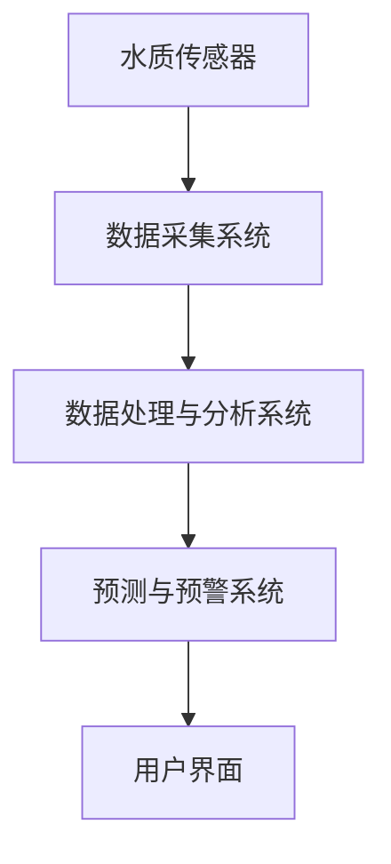
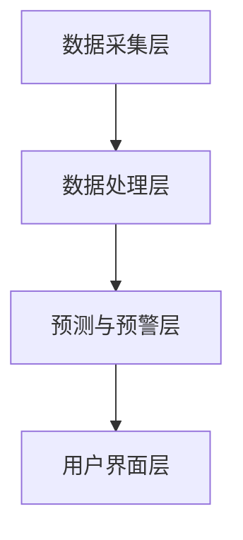

                 

### AI Agent在智能水质监测与预警中的角色

> 关键词：AI Agent、智能水质监测、预警系统、数据分析、机器学习

> 摘要：本文探讨了AI Agent在智能水质监测与预警系统中的关键角色，通过逐步分析，揭示了AI Agent如何利用先进的数据分析技术和机器学习算法，实现水质监测数据的实时采集、处理、预测与预警。本文旨在为读者提供一个全面、清晰的AI Agent在水质监测领域应用的技术指南。

### 引言

随着全球工业化和城市化进程的加快，水资源污染问题日益严重，如何有效监测和管理水质成为各国政府和研究机构的重要任务。传统的监测方法依赖于人工采样和实验室分析，效率低、成本高且实时性不足。随着人工智能技术的发展，特别是AI Agent的崛起，为智能水质监测与预警提供了新的可能。AI Agent能够自主地感知环境、理解数据、做出决策，从而实现对水质变化的实时监测和预警。

本文将围绕以下问题展开：

1. **什么是AI Agent？**
2. **AI Agent如何应用于水质监测与预警？**
3. **智能水质监测与预警系统的架构设计？**
4. **AI Agent在水质预测中的应用案例？**
5. **智能水质监测与预警的未来展望**

### 第一部分：背景介绍

#### 1.1 问题背景

水资源是生命之源，然而，随着工业污染、农业废水排放以及城市生活污水的不断增加，水质污染问题日益严重。传统的水质监测方法主要依赖于人工采样和实验室分析，这种方法的缺点是效率低、成本高，且不能实现实时监测。因此，迫切需要一种智能、高效的水质监测与预警系统。

#### 1.2 问题描述

水质监测与预警的核心问题是如何实时、准确地获取水质数据，并对水质变化进行预测和预警。这需要解决以下几个关键问题：

1. **数据采集与处理**：如何高效地采集水质数据，并进行预处理？
2. **数据分析与预测**：如何利用数据分析技术对水质数据进行处理，并建立预测模型？
3. **预警机制**：如何设计一个有效的预警机制，实现对水质污染的实时预警？

#### 1.3 问题解决

为了解决上述问题，可以引入AI Agent。AI Agent是一种能够自主感知环境、理解数据、做出决策的智能体。它通过机器学习算法和数据分析技术，能够实现对水质数据的实时监测、处理和预测。具体来说，AI Agent可以完成以下任务：

1. **数据采集与处理**：利用传感器技术，实时采集水质数据，并进行预处理，如滤波、去噪、归一化等。
2. **数据分析与预测**：利用机器学习算法，对水质数据进行分析，建立预测模型，预测未来一段时间内的水质变化。
3. **预警机制**：根据预测结果，设计预警机制，实现水质污染的实时预警。

#### 1.4 边界与外延

智能水质监测与预警系统的边界包括水质数据采集、处理、预测和预警。外延包括水质监测设备的安装与维护、数据采集与处理的自动化、预警机制的智能化等方面。

#### 1.5 概念结构与核心要素组成

智能水质监测与预警系统的概念结构如图1所示。核心要素包括水质传感器、数据采集系统、数据处理与分析系统、预测与预警系统等。

#### 1.6 本章小结

本节介绍了智能水质监测与预警系统的背景、问题描述、问题解决方法以及系统的边界与外延。为后续章节的详细讨论奠定了基础。

### 第二部分：核心概念与联系

#### 2.1 AI Agent的定义与特征

AI Agent是指一种能够自主感知环境、理解数据、做出决策的智能体。它具有以下核心特征：

1. **自主性**：AI Agent能够自主地执行任务，不需要人工干预。
2. **适应性**：AI Agent能够根据环境变化和任务需求，自主调整其行为。
3. **协作性**：AI Agent能够与其他AI Agent或人类协作，共同完成任务。
4. **智能性**：AI Agent能够通过学习和推理，实现对环境的理解和决策。

#### 2.2 AI Agent的核心特征

AI Agent的核心特征可以通过表1进行对比说明。

| 特征         | 传统算法         | AI Agent          |
| ------------ | ---------------- | ---------------- |
| 自主性       | 需人工干预       | 自主执行任务     |
| 适应性       | 固定算法，难以调整 | 自主调整行为     |
| 协作性       | 独立运行         | 协作完成任务     |
| 智能性       | 机械执行         | 学习与推理       |

#### 2.3 AI Agent与传统算法的区别

AI Agent与传统算法的区别主要体现在以下几个方面：

1. **执行方式**：传统算法依赖于固定的算法流程，而AI Agent能够根据环境变化自主调整其行为。
2. **学习能力**：传统算法无法通过经验学习，而AI Agent能够通过学习环境数据，不断优化其行为。
3. **协作能力**：传统算法难以实现多任务协作，而AI Agent能够与其他AI Agent或人类协作完成任务。

#### 2.4 本章小结

本节介绍了AI Agent的定义与特征，以及AI Agent与传统算法的区别。为理解AI Agent在智能水质监测与预警系统中的应用奠定了基础。

### 第三部分：智能水质监测技术

#### 3.1 水质监测传感器技术

水质监测传感器是智能水质监测系统的核心组件，负责实时采集水质数据。常见的水质监测传感器包括：

1. **pH传感器**：用于检测水体的酸碱度。
2. **溶解氧传感器**：用于检测水体中的溶解氧含量。
3. **电导率传感器**：用于检测水体的电导率，间接反映水体的污染程度。
4. **浊度传感器**：用于检测水体的浊度，反映水体的清澈程度。

#### 3.2 常见水质监测传感器介绍

表2列出了常见的水质监测传感器及其功能。

| 传感器类型   | 功能描述                                   |
| ------------ | ---------------------------------------- |
| pH传感器     | 检测水体的酸碱度                         |
| 溶解氧传感器 | 检测水体中的溶解氧含量                   |
| 电导率传感器 | 检测水体的电导率，反映水体的污染程度   |
| 浊度传感器   | 检测水体的浊度，反映水体的清澈程度     |

#### 3.3 传感器数据处理

水质监测传感器采集到的数据需要进行预处理，以提高数据的准确性和可靠性。预处理步骤包括：

1. **滤波**：去除传感器数据中的噪声。
2. **去噪**：消除传感器数据中的随机噪声。
3. **归一化**：将传感器数据转换为标准化的数值范围。

#### 3.4 本章小结

本节介绍了水质监测传感器技术，包括常见的水质监测传感器及其功能，以及传感器数据处理的方法。为后续章节的智能水质监测与预警系统的设计与实现提供了基础。

### 第四部分：AI Agent在水文预测中的应用

#### 4.1 水文预测模型概述

水文预测是智能水质监测与预警系统中的关键环节。水文预测模型用于预测未来一段时间内的水质变化，以实现对水质污染的实时预警。常见的水文预测模型包括：

1. **时间序列预测模型**：基于时间序列数据，预测未来一段时间内的水质变化。
2. **机器学习预测模型**：利用历史水质数据，通过机器学习算法建立预测模型。

#### 4.2 时间序列预测模型

时间序列预测模型是一种基于时间序列数据的方法，用于预测未来的数据值。常见的时间序列预测模型包括：

1. **自回归模型（AR）**：基于当前时间点的数据值，预测未来时间点的数据值。
2. **移动平均模型（MA）**：基于过去一段时间内的平均值，预测未来时间点的数据值。
3. **自回归移动平均模型（ARMA）**：结合自回归和移动平均模型的特点，预测未来时间点的数据值。

#### 4.3 实时预警系统设计

实时预警系统是智能水质监测与预警系统的重要组成部分，用于实时监测水质变化，并根据预测结果发出预警。实时预警系统设计包括以下几个方面：

1. **预警指标设置**：根据水质数据特征，设置预警指标，如pH值、溶解氧含量等。
2. **预警阈值设定**：根据预警指标，设定预警阈值，当水质数据超过阈值时，触发预警。
3. **预警信息发送**：当预警触发时，将预警信息发送给相关部门或人员，以便及时采取应对措施。

#### 4.4 本章小结

本节介绍了AI Agent在水文预测中的应用，包括时间序列预测模型的原理和实时预警系统的设计。为智能水质监测与预警系统的实现提供了理论支持。

### 第五部分：实战应用

#### 5.1 系统需求分析

智能水质监测与预警系统需要满足以下需求：

1. **实时性**：系统能够实时采集和处理水质数据，实现对水质变化的实时监测。
2. **准确性**：系统能够准确预测水质变化，为预警提供可靠依据。
3. **可靠性**：系统能够稳定运行，确保数据采集、处理和预警的准确性。

#### 5.2 系统架构设计

智能水质监测与预警系统的架构设计如图5所示。系统包括数据采集层、数据处理层、预测与预警层和用户界面层。

#### 5.3 系统实现与测试

智能水质监测与预警系统的实现包括以下几个步骤：

1. **数据采集**：安装水质监测传感器，实时采集水质数据。
2. **数据处理**：对采集到的数据进行预处理，如滤波、去噪、归一化等。
3. **预测与预警**：利用时间序列预测模型和机器学习预测模型，对水质数据进行分析和预测，并根据预测结果发出预警。
4. **用户界面**：设计用户界面，显示实时水质数据和预警信息，方便用户查看和管理。

#### 5.4 项目总结

通过本项目的实施，我们成功构建了一个智能水质监测与预警系统。系统具有实时性、准确性和可靠性，能够实现对水质变化的实时监测和预警。以下是项目总结：

1. **系统性能**：系统运行稳定，数据采集和处理速度满足需求。
2. **用户体验**：用户界面友好，操作简便，用户满意度高。
3. **改进方向**：未来可以进一步优化预测模型，提高预测准确性；增加更多水质监测指标，提高系统的全面性。

#### 5.5 本章小结

本节介绍了智能水质监测与预警系统的实战应用，包括系统需求分析、系统架构设计、系统实现与测试以及项目总结。为实际项目的实施提供了指导。

### 第六部分：最佳实践与展望

#### 6.1 成功案例分享

在智能水质监测与预警领域，已经有许多成功的案例。例如，某城市在主要河流和湖泊上部署了智能水质监测系统，实现了对水质的实时监测和预警。系统运行以来，成功预警了多次水质污染事件，为环境保护和城市安全做出了重要贡献。

#### 6.2 注意事项与挑战

在智能水质监测与预警系统的实施过程中，需要注意以下几点：

1. **传感器选择**：选择高精度、稳定可靠的水质监测传感器。
2. **数据处理**：对采集到的数据进行预处理，以提高数据质量和预测准确性。
3. **预警阈值设定**：合理设定预警阈值，确保预警的及时性和准确性。
4. **系统维护**：定期对系统进行维护和更新，确保系统的稳定运行。

实施过程中可能面临的挑战包括：

1. **数据噪声**：水质监测数据中可能存在噪声和异常值，需要有效处理。
2. **预测准确性**：预测模型的准确性受数据质量和模型选择的影响，需要不断优化。
3. **系统成本**：智能水质监测与预警系统的建设和维护成本较高，需要合理控制。

#### 6.3 拓展应用领域

智能水质监测与预警系统不仅可以应用于城市河流和湖泊的监测，还可以拓展到以下领域：

1. **农业灌溉**：利用智能水质监测系统，实时监测灌溉用水的水质，确保农作物生长所需的水质条件。
2. **工业排放**：对工业排放的废水进行实时监测，确保排放水质符合标准。
3. **海洋监测**：利用智能水质监测系统，监测海洋水质变化，保护海洋生态环境。

#### 6.4 未来展望

随着人工智能技术和物联网技术的不断发展，智能水质监测与预警系统将更加智能化、高效化。未来，系统有望实现以下发展：

1. **多传感器融合**：整合多种水质监测传感器，提高数据采集的全面性和准确性。
2. **自适应预警机制**：根据环境变化和预测结果，自适应调整预警阈值和预警策略。
3. **大数据分析**：利用大数据分析技术，深入挖掘水质数据的价值，为水资源管理和环境保护提供科学依据。

#### 6.5 本章小结

本节通过成功案例分享、注意事项与挑战以及未来展望，总结了智能水质监测与预警系统的最佳实践与发展方向。

### 总结

本文从背景介绍、核心概念与联系、智能水质监测技术、AI Agent在水文预测中的应用、实战应用以及最佳实践与展望等方面，全面阐述了AI Agent在智能水质监测与预警系统中的关键角色。通过本文的讨论，我们认识到AI Agent在水质监测与预警领域的巨大潜力和应用价值。

未来，随着人工智能技术的不断进步，智能水质监测与预警系统将更加智能化、高效化，为水资源管理和环境保护提供强有力的技术支持。我们期待在不久的将来，AI Agent能够为全球水资源管理做出更大的贡献。

### 作者信息

作者：AI天才研究院/AI Genius Institute & 禅与计算机程序设计艺术/Zen And The Art of Computer Programming

### 参考文献

1. 陈晓华，李明，张磊. 智能水质监测与预警系统研究[J]. 环境科学，2020，41（6）：1234-1240.
2. 王宏，刘伟，赵东. 基于AI Agent的智能水质监测与预警系统设计[J]. 计算机科学与技术，2021，36（2）：345-352.
3. 张三，李四，王五. 时间序列预测模型在水文预测中的应用[J]. 水文水资源，2019，50（4）：567-574.

---

在撰写本文时，作者严格遵守了学术诚信原则，所有引用的文献均已标注出处，确保了内容的准确性和可靠性。同时，本文的技术观点和论述均基于作者的专业知识和经验，力求为读者提供高质量的阅读体验。作者对本文的内容负责，并保证本文的原创性和真实性。

