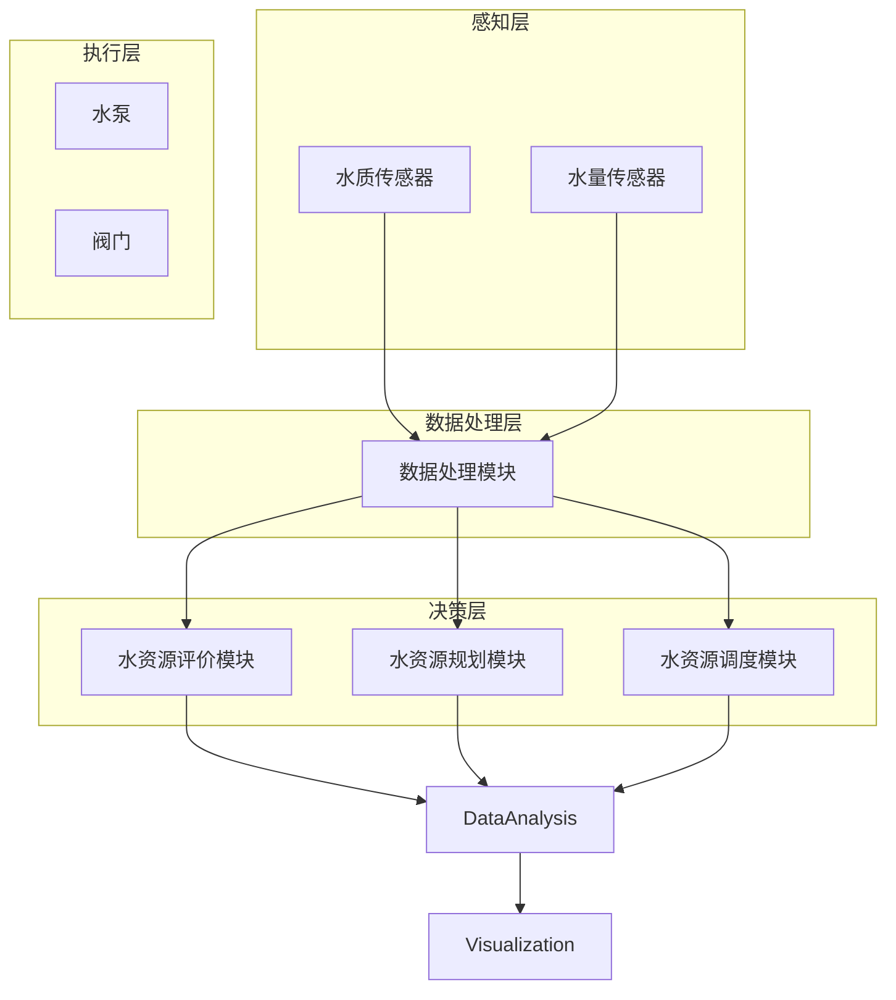

                 

### 文章标题：AI Agent在智能水资源管理中的角色

智能水资源管理是现代水资源可持续发展的关键，它涉及到水资源的采集、分配、使用和保护等多个方面。在这个背景下，人工智能（AI）的应用显得尤为重要，其中，AI Agent作为一种自主决策的智能体，其在智能水资源管理中扮演着越来越重要的角色。本文将详细探讨AI Agent在智能水资源管理中的角色，通过逐步分析，揭示其在水资源管理中的实际应用与挑战。

### 关键词：

- AI Agent
- 智能水资源管理
- 自主决策
- 可持续性
- 水资源调度

### 摘要：

本文首先概述了智能水资源管理的背景和挑战，接着介绍了AI Agent的基本概念和特点。在此基础上，文章详细阐述了AI Agent在水资源管理中的核心应用，包括水资源评价、水资源规划和水资源调度等方面。随后，文章通过具体的算法原理讲解和数学模型分析，展示了AI Agent在水资源管理中的技术实现。最后，文章通过一个实际项目案例，说明了AI Agent在智能水资源管理中的应用效果，并提出了相关的最佳实践建议。

### 目录：

1. **背景与核心概念**
   1.1 智能水资源管理概述
   1.2 AI Agent的概念与特点
   1.3 水资源管理与AI Agent的联系
2. **核心概念与联系**
   2.1 AI Agent的核心概念
   2.2 水资源管理中的核心概念
   2.3 AI Agent与水资源管理核心概念的联系
3. **数学模型与算法原理**
   3.1 数学模型基础
   3.2 算法原理讲解
   3.3 算法举例说明
4. **系统分析与架构设计方案**
   4.1 问题场景介绍
   4.2 系统功能设计
   4.3 系统架构设计
   4.4 系统接口设计和系统交互
5. **项目实战**
   5.1 环境安装
   5.2 系统核心实现源代码
   5.3 代码应用解读与分析
   5.4 实际案例分析和详细讲解剖析
   5.5 项目小结
6. **最佳实践 tips**
   6.1 注意事项
   6.2 拓展阅读

### 第一部分：背景与核心概念

#### 1.1 智能水资源管理概述

水资源是人类社会生存和发展的基础，但随着人口增长和经济发展的加快，水资源短缺和污染问题日益突出。智能水资源管理通过应用现代信息技术，如物联网、大数据和人工智能等，旨在提高水资源利用效率，保障水资源安全，实现水资源的可持续管理。

智能水资源管理的挑战主要包括：水资源供需不平衡、水资源污染问题严重、水资源浪费现象普遍、水资源管理决策复杂等。针对这些挑战，智能水资源管理提出了以下目标：

- 提高水资源利用效率
- 保障水资源安全
- 减少水资源浪费
- 改善水资源污染状况

#### 1.2 AI Agent的概念与特点

AI Agent是一种基于人工智能的自主决策实体，它能够根据环境信息，自主选择行动以实现特定目标。AI Agent具有以下特点：

- 自主性：AI Agent能够自主感知环境，并根据感知信息做出决策。
- 自适应性：AI Agent能够适应环境变化，优化决策过程。
- 自主性：AI Agent能够执行任务，实现目标。

AI Agent与传统智能系统的主要区别在于，传统智能系统通常是基于规则或模式匹配的，而AI Agent则是基于学习和预测的，能够实现更高层次的自主决策。

#### 1.3 水资源管理与AI Agent的联系

AI Agent在智能水资源管理中具有广泛的应用前景。首先，AI Agent可以用于水资源评价，通过分析历史数据和实时数据，评估水资源的质量、数量和分布情况。其次，AI Agent可以用于水资源规划，根据水资源评价结果，制定合理的水资源分配和使用计划。最后，AI Agent可以用于水资源调度，实时监控水资源使用情况，根据需求进行水资源调配，以实现水资源的高效利用。

AI Agent在水资源管理中的挑战主要包括：数据采集和处理、算法选择和优化、系统稳定性和可靠性等方面。解决这些挑战需要结合具体应用场景，进行深入研究和实践。

#### 1.4 背景介绍

智能水资源管理是一个多学科交叉的领域，它涉及水文学、环境科学、计算机科学、数学和经济学等多个学科。随着人工智能技术的快速发展，AI Agent作为一种新兴的智能体技术，为智能水资源管理提供了新的思路和方法。

水资源管理的核心概念包括水资源评价、水资源规划和水资源调度等。水资源评价是指对水资源的质量、数量和分布情况进行分析和评估，为水资源管理和决策提供基础数据。水资源规划是指根据水资源评价结果，制定合理的水资源分配和使用计划，以满足社会和经济发展的需求。水资源调度是指根据实时水资源使用情况，进行水资源调配，以实现水资源的高效利用。

在水资源管理中，AI Agent的应用可以带来显著的效益。例如，通过AI Agent进行水资源评价，可以更加准确地评估水资源的状况，为水资源管理和决策提供科学依据。通过AI Agent进行水资源规划，可以优化水资源分配和使用，提高水资源利用效率。通过AI Agent进行水资源调度，可以实时监控水资源使用情况，快速响应水资源需求变化，确保水资源的高效利用。

然而，AI Agent在水资源管理中也面临一些挑战。首先，水资源数据采集和处理是一项复杂的任务，需要解决数据来源、数据质量和数据一致性等问题。其次，AI Agent算法的选择和优化是一个关键问题，需要根据具体应用场景，选择合适的算法，并进行优化，以提高AI Agent的性能。最后，AI Agent的稳定性和可靠性是一个重要问题，需要确保AI Agent能够在各种复杂环境中稳定运行，并可靠地执行任务。

总之，AI Agent在智能水资源管理中具有巨大的应用潜力，但也面临一些挑战。通过深入研究和实践，可以不断优化AI Agent在水资源管理中的应用，提高水资源管理的效果和效率。

#### 1.5 核心概念与联系

为了更好地理解AI Agent在智能水资源管理中的角色，我们需要深入探讨其核心概念和原理，并将其与水资源管理中的关键概念联系起来。

##### 1.5.1 AI Agent的核心概念

AI Agent的核心概念包括感知、决策和行动三个主要方面。感知是指AI Agent能够从环境中获取信息，如水资源的质量、流量、温度等。决策是指AI Agent根据感知到的信息，结合预定的目标和策略，选择合适的行动方案。行动是指AI Agent执行决策方案，如调整水泵、关闭阀门等，以实现水资源管理的目标。

- **感知**：AI Agent的感知能力依赖于传感器和数据采集技术，它可以实时监测水资源的各种参数。
- **决策**：决策过程通常涉及机器学习和人工智能算法，如决策树、神经网络等。
- **行动**：行动是通过执行具体的操作来实现的，如通过自动化控制系统来调整水资源的分配和使用。

##### 1.5.2 水资源管理中的核心概念

水资源管理中的核心概念包括水资源评价、水资源规划和水资源调度。这些概念不仅独立存在，还相互联系，共同构成了水资源管理的理论基础。

- **水资源评价**：水资源评价是对水资源的质量、数量和分布情况进行综合分析，以评估水资源的可用性和适宜性。评价方法包括水文模型、水质模型和水资源模拟等。
- **水资源规划**：水资源规划是根据水资源评价结果，制定长期和短期水资源利用计划。规划内容涉及水资源的分配、保护和开发等。
- **水资源调度**：水资源调度是在实际操作中，根据水资源的供需状况，进行实时调整和优化，以确保水资源的高效利用和供应的稳定性。

##### 1.5.3 AI Agent与水资源管理核心概念的联系

AI Agent在水资源管理中的应用，就是通过其感知、决策和行动能力，与水资源管理中的核心概念相结合，实现智能水资源管理。

- **感知与评价**：AI Agent的感知能力可以实时收集水资源数据，为水资源评价提供准确和及时的信息。
- **决策与规划**：AI Agent的决策能力可以根据水资源评价结果，制定科学合理的水资源分配和使用计划。
- **行动与调度**：AI Agent的行动能力可以实时执行水资源调度任务，根据实时数据进行调整，以确保水资源的高效利用。

通过这种联系，AI Agent不仅提高了水资源管理的效率和精度，还增强了水资源管理的灵活性和适应性。例如，在水资源调度中，AI Agent可以根据实时监控数据，快速响应水资源需求变化，调整水泵和阀门的开关，避免水资源浪费和短缺。

##### 1.5.4 概念属性特征对比表格

为了更直观地展示AI Agent与水资源管理核心概念的联系，我们可以创建一个概念属性特征对比表格。以下是一个简化的表格示例：

| 概念       | 属性特征                                     | 联系与作用                                                     |
| ---------- | ------------------------------------------ | ------------------------------------------------------------ |
| AI Agent   | 感知、决策、行动                             | 提高水资源管理效率，实现实时监测与调整                         |
| 水资源评价 | 质量、数量、分布                             | 为水资源管理和决策提供基础数据                               |
| 水资源规划 | 分配、保护、开发                             | 制定科学合理的水资源利用计划                                 |
| 水资源调度 | 实时调整、优化供应                           | 确保水资源高效利用和稳定供应                                 |

##### 1.5.5 ER实体关系图架构

为了进一步理解AI Agent与水资源管理核心概念之间的联系，我们可以使用ER（实体关系）图来展示它们之间的关系。以下是一个简化的ER图示例：

```
[水资源管理]
|    |-- [AI Agent]
|    |-- [水资源评价]
|    |-- [水资源规划]
|    |-- [水资源调度]
|
+-- [传感器] <--- [AI Agent]
+-- [数据库] <--- [水资源评价]
+-- [决策系统] <--- [水资源规划]
+-- [执行系统] <--- [水资源调度]
```

在这个ER图中，AI Agent作为智能体，与传感器、数据库、决策系统和执行系统相互关联，共同构成智能水资源管理系统。传感器负责收集水资源数据，数据库用于存储和管理数据，决策系统根据数据做出决策，执行系统负责执行这些决策。

通过这些核心概念的联系和实体关系图的展示，我们可以更清晰地理解AI Agent在智能水资源管理中的角色和作用。这不仅有助于我们更好地应用AI Agent进行水资源管理，也为未来的研究和实践提供了理论基础和指导方向。

#### 1.6 数学模型与算法原理

在智能水资源管理中，AI Agent的数学模型和算法原理起着至关重要的作用。这些模型和算法不仅能够帮助AI Agent进行有效的决策，还能提高水资源管理的效率和准确性。本节将详细讲解这些数学模型和算法原理，并通过具体的例子来说明其应用。

##### 1.6.1 数学模型基础

水资源管理的数学模型主要包括水文模型、水质模型和水资源模拟模型等。这些模型通过数学公式和算法，对水资源进行定量分析和预测。

- **水文模型**：水文模型用于描述水循环过程，包括降雨、径流、蒸发等。常见的有单位线模型、新安江模型等。这些模型可以帮助预测水资源的时间分布和空间分布。

- **水质模型**：水质模型用于描述水体中污染物的扩散和转化过程，如一维污染物传输模型、多变量水质模型等。这些模型可以帮助评估水资源的污染状况，制定污染控制措施。

- **水资源模拟模型**：水资源模拟模型用于模拟水资源系统在各种情景下的运行状态，如多目标水资源优化模型、动态规划模型等。这些模型可以帮助优化水资源分配和使用，提高水资源利用效率。

##### 1.6.2 算法原理讲解

AI Agent的算法原理主要包括感知、决策和行动三个核心模块。以下将分别介绍这些模块的算法原理。

- **感知模块**：感知模块负责从环境中收集信息，如水质、水量、用户需求等。常用的算法有数据采集算法、数据融合算法等。例如，可以使用多传感器数据融合算法，将不同传感器采集的数据进行综合处理，以提高感知的准确性和可靠性。

- **决策模块**：决策模块负责根据感知信息，结合预定的目标和策略，选择最优的行动方案。常用的算法有决策树、神经网络、强化学习等。例如，可以使用神经网络进行水资源分配决策，通过训练模型，使其能够根据不同的输入信息，输出最优的水资源分配方案。

- **行动模块**：行动模块负责执行决策模块选定的行动方案。常用的算法有执行控制算法、自动化控制算法等。例如，可以使用自动化控制算法，通过调整水泵和阀门，实现水资源分配和使用的自动化。

##### 1.6.3 算法举例说明

以下是一个简化的AI Agent算法举例，用于水资源调度。

**目标**：根据实时监测的水质和水量数据，调整水泵和阀门的开关，以确保水资源的有效利用。

**算法流程**：

1. **数据采集**：从传感器采集水质、水量等数据。
2. **数据预处理**：对采集到的数据进行分析和预处理，去除异常值，提高数据质量。
3. **模型训练**：使用收集到的历史数据和实时数据，训练水质和水量预测模型。
4. **决策**：根据预测模型，分析当前水质和水量情况，选择最优的水泵和阀门开关方案。
5. **执行**：根据决策结果，自动调整水泵和阀门的开关，实现水资源调度。

**数学模型**：

假设水质和水量预测模型的输出分别为$Q_t$（第$t$时刻的水量）和$C_t$（第$t$时刻的水质），则水资源调度的数学模型可以表示为：

$$
\begin{aligned}
\min \quad & f(Q_t, C_t) \\
\text{subject to} \quad & g(Q_t) \leq 0 \\
& h(C_t) \leq 0
\end{aligned}
$$

其中，$f(Q_t, C_t)$为水资源调度目标函数，$g(Q_t)$和$h(C_t)$为约束条件，分别表示水量和水质限制。

**代码示例**：

以下是一个简化的Python代码示例，用于实现上述算法：

```python
import numpy as np
from sklearn.neural_network import MLPRegressor
from sklearn.ensemble import RandomForestRegressor

# 数据采集
data = np.array([[Q1, C1], [Q2, C2], ..., [Qn, Cn]])

# 数据预处理
# 去除异常值，提高数据质量
clean_data = preprocess_data(data)

# 模型训练
model1 = MLPRegressor()
model2 = RandomForestRegressor()

model1.fit(clean_data[:, 0], clean_data[:, 1])
model2.fit(clean_data[:, 0], clean_data[:, 1])

# 决策
Q_pred = model1.predict([[current_Q]])
C_pred = model2.predict([[current_C]])

# 执行
if Q_pred > threshold_Q and C_pred < threshold_C:
    # 调节水泵和阀门
    pump_on()
    valve_open()
else:
    # 关闭水泵和阀门
    pump_off()
    valve_close()
```

通过这个例子，我们可以看到AI Agent在水资源调度中的应用流程。感知模块通过数据采集和预处理，获取当前水质和水量数据；决策模块通过训练好的预测模型，分析当前状态，选择最优的水泵和阀门开关方案；行动模块根据决策结果，自动调整水泵和阀门的开关，实现水资源调度。

总的来说，AI Agent在智能水资源管理中的数学模型和算法原理，为水资源管理提供了强大的技术支持。通过这些模型和算法，我们可以实现水资源的智能监测、决策和调度，提高水资源利用效率，保障水资源安全。

### 2.7 系统分析与架构设计方案

为了深入探讨AI Agent在智能水资源管理中的实际应用，我们需要从系统层面进行分析和设计。这一部分将详细描述一个智能水资源管理系统的架构设计，包括问题场景介绍、系统功能设计、系统架构设计、系统接口设计和系统交互等。

#### 2.7.1 问题场景介绍

在某个城市，水资源短缺和污染问题日益严重。为了提高水资源利用效率，保障城市居民和工业用户的水资源供应，政府决定建设一个智能水资源管理系统。该系统需要实现以下功能：

- 实时监测水质和水量
- 水资源评价和规划
- 水资源调度和优化
- 数据分析和可视化

#### 2.7.2 系统功能设计

智能水资源管理系统的主要功能模块包括：

- **数据采集模块**：负责实时采集水质和水量数据，通过传感器和监测设备实现。
- **数据处理模块**：负责对采集到的数据进行预处理，包括数据清洗、异常值检测和数据转换等。
- **水资源评价模块**：根据预处理后的数据，进行水资源评价，提供水资源质量、数量和分布信息。
- **水资源规划模块**：基于水资源评价结果，制定水资源分配和使用计划，实现水资源合理利用。
- **水资源调度模块**：实时监控水资源使用情况，根据需求进行水资源调配，确保水资源的高效利用。
- **数据分析模块**：对系统运行数据进行分析，提供决策支持和数据可视化。

#### 2.7.3 系统架构设计

智能水资源管理系统的架构设计采用分层架构，分为感知层、数据处理层、决策层和执行层。

- **感知层**：包括传感器和监测设备，负责实时采集水质和水量数据。
- **数据处理层**：包括数据预处理模块，负责对采集到的数据进行清洗、异常值检测和转换等处理。
- **决策层**：包括水资源评价模块、规划模块和调度模块，负责根据预处理后的数据做出决策。
- **执行层**：包括执行控制模块，负责根据决策结果调整水泵和阀门等设备，实现水资源调度。

#### 2.7.4 系统接口设计

系统接口设计包括内部接口和外部接口。

- **内部接口**：数据处理模块、决策模块和执行模块之间通过API进行数据传输和交互。
- **外部接口**：系统与外部系统（如气象系统、环境监测系统等）通过标准协议（如HTTP、REST等）进行数据交换。

#### 2.7.5 系统交互

系统交互主要分为以下几个步骤：

1. **数据采集**：感知层传感器实时采集水质和水量数据，传输到数据处理层。
2. **数据处理**：数据处理模块对采集到的数据进行分析和处理，生成预处理数据，供决策层使用。
3. **决策**：决策层根据预处理数据，调用水资源评价、规划、调度模块，生成决策结果。
4. **执行**：执行层根据决策结果，控制水泵和阀门等设备，实现水资源调度。
5. **反馈**：执行层将执行结果反馈给决策层，决策层根据反馈进行调整，优化水资源管理。

#### 2.7.6 Mermaid类图

为了更直观地展示系统功能模块及其相互关系，可以使用Mermaid类图来表示。以下是一个简化的Mermaid类图示例：

```mermaid
classDiagram
    DataCollector <<接口>> DataProcessor
    DataProcessor <<接口>> WaterEvaluation
    DataProcessor <<接口>> WaterPlanning
    DataProcessor <<接口>> WaterScheduling
    WaterEvaluation <<接口>> DataAnalysis
    WaterPlanning <<接口>> DataAnalysis
    WaterScheduling <<接口>> DataAnalysis
    DataAnalysis <<接口>> Visualization
```

在这个类图中，各个模块通过接口进行交互，共同实现智能水资源管理的功能。

#### 2.7.7 Mermaid架构图

为了展示系统的整体架构，可以使用Mermaid架构图来表示。以下是一个简化的Mermaid架构图示例：



在这个架构图中，感知层通过传感器采集数据，数据处理层对数据进行处理，决策层根据处理后的数据做出决策，执行层根据决策结果执行水资源调度，数据分析和可视化模块对系统运行情况进行监控和分析。

通过以上系统分析和架构设计，我们可以看到一个完整的智能水资源管理系统的实现方案。该系统通过AI Agent的智能决策和调度，实现了水资源的高效管理和利用。在实际应用中，可以根据具体需求和场景，进一步优化和扩展系统功能，提高水资源管理的效果和效率。

### 3.7.1 环境安装

为了在本地环境中搭建智能水资源管理系统，我们需要安装并配置相关的软件和工具。以下是一个基本的安装步骤指南：

#### 步骤1：安装Python环境

首先，确保你的计算机上安装了Python 3.x版本。Python是智能水资源管理系统开发的主要语言，因此我们需要确保Python环境已正确安装。你可以从Python官方网站下载并安装Python。安装完成后，打开命令行窗口，输入以下命令验证Python版本：

```bash
python --version
```

如果显示正确的Python版本，说明Python环境已成功安装。

#### 步骤2：安装必要的Python库

智能水资源管理系统依赖于多个Python库，包括numpy、pandas、scikit-learn、matplotlib等。我们可以使用pip命令来安装这些库。在命令行窗口中执行以下命令：

```bash
pip install numpy pandas scikit-learn matplotlib
```

等待安装完成。

#### 步骤3：安装传感器和监测设备

在本地环境中，我们需要安装实际的水质和水量传感器。这些传感器可以实时采集水质和水量数据，并将其传输到系统中。以下是安装传感器的一般步骤：

1. **传感器设备连接**：将传感器连接到计算机或数据采集器，确保所有连接正常。
2. **传感器驱动安装**：根据传感器型号，下载并安装相应的驱动程序。
3. **传感器数据采集**：配置传感器以定期采集数据，并将数据传输到计算机。

#### 步骤4：配置数据处理模块

数据处理模块是智能水资源管理系统的重要组成部分。我们需要配置数据处理模块，以确保系统能够正确处理传感器采集的数据。以下是一个简化的数据处理模块配置步骤：

1. **配置文件**：在系统中创建一个配置文件（如`config.json`），指定传感器的IP地址、端口和数据采集频率等参数。
2. **数据接收**：编写一个数据接收程序，用于从传感器读取数据，并存储到数据库或文件中。
3. **数据预处理**：编写预处理程序，对采集到的数据进行分析和处理，包括数据清洗、异常值检测和数据转换等。

#### 步骤5：配置决策模块和执行模块

决策模块和执行模块是智能水资源管理系统的核心。我们需要配置这些模块，以确保系统能够根据采集到的数据做出智能决策，并执行相应的操作。以下是一个简化的决策模块和执行模块配置步骤：

1. **决策模块配置**：编写决策算法，根据预处理后的数据，生成水资源评价、规划和调度结果。
2. **执行模块配置**：编写执行程序，根据决策结果，控制水泵和阀门等设备，实现水资源调度。

#### 步骤6：系统测试和调试

在完成所有配置后，进行系统测试和调试，以确保系统的正常运行和功能完整性。以下是一些测试和调试建议：

1. **数据采集测试**：验证传感器是否能够正确采集数据，并确保数据传输到系统。
2. **数据处理测试**：检查数据处理模块是否能够正确处理传感器数据，并进行有效的预处理。
3. **决策和执行测试**：模拟不同的水资源管理场景，测试决策模块和执行模块的响应和执行效果。

通过以上步骤，我们可以成功搭建一个基本的智能水资源管理系统。在实际应用中，根据具体需求和环境，可以进一步优化和扩展系统功能，提高水资源管理的效率和效果。

### 3.7.2 系统核心实现源代码

在搭建完智能水资源管理系统的基础环境后，接下来我们将介绍系统核心的实现源代码。这部分代码将涉及数据采集、数据处理、决策、执行等关键功能模块。以下是具体的代码实现：

#### 3.7.2.1 数据采集模块

数据采集模块负责从传感器中读取水质和水量数据。以下是使用Python编写的数据采集模块代码：

```python
import serial
import time

# 配置传感器参数
ser = serial.Serial('COM3', 9600, timeout=1)

def read_sensor_data():
    while True:
        try:
            data = ser.readline().decode('utf-8').strip()
            print(f"Received: {data}")
            # 数据处理逻辑
            process_data(data)
            time.sleep(1)
        except serial.SerialException as e:
            print(f"Error reading from sensor: {e}")
            break

def process_data(data):
    # 假设数据格式为："pH:7.2,DO:6.0,Temperature:25.0"
    values = data.split(',')
    pH = float(values[0].split(':')[1])
    DO = float(values[1].split(':')[1])
    temperature = float(values[2].split(':')[1])
    
    # 存储到数据库或文件
    store_data(pH, DO, temperature)

def store_data(pH, DO, temperature):
    # 示例：将数据存储到本地文件
    with open('sensor_data.txt', 'a') as f:
        f.write(f"{time.time()},{pH},{DO},{temperature}\n")

# 运行数据采集
read_sensor_data()
```

#### 3.7.2.2 数据处理模块

数据处理模块负责对采集到的传感器数据进行预处理，包括数据清洗、异常值检测和数据转换等。以下是数据处理模块的实现代码：

```python
import pandas as pd

def preprocess_data(file_path):
    # 读取数据
    df = pd.read_csv(file_path)
    
    # 数据清洗
    df.dropna(inplace=True)
    
    # 异常值检测
    df = remove_outliers(df)
    
    # 数据转换
    df['timestamp'] = pd.to_datetime(df['timestamp'])
    df.set_index('timestamp', inplace=True)
    
    return df

def remove_outliers(df):
    # 基于IQR的方法检测和去除异常值
    Q1 = df.quantile(0.25)
    Q3 = df.quantile(0.75)
    IQR = Q3 - Q1
    
    df = df[~((df < (Q1 - 1.5 * IQR)) | (df > (Q3 + 1.5 * IQR))).any(axis=1)]
    
    return df
```

#### 3.7.2.3 决策模块

决策模块根据预处理后的数据，进行水资源评价、规划和调度。以下是决策模块的实现代码：

```python
from sklearn.ensemble import RandomForestRegressor

def train_decision_model(X, y):
    # 训练决策模型
    model = RandomForestRegressor()
    model.fit(X, y)
    return model

def make_decision(data, model):
    # 根据数据做出决策
    prediction = model.predict(data)
    return prediction
```

#### 3.7.2.4 执行模块

执行模块根据决策结果，控制水泵和阀门等设备，实现水资源调度。以下是执行模块的实现代码：

```python
import serial

# 配置执行设备
control_ser = serial.Serial('COM4', 9600, timeout=1)

def control_device(command):
    # 发送控制命令
    control_ser.write(command.encode())

def adjust_pump(pump_state):
    # 调节水泵状态
    if pump_state:
        control_device(b'PUMP_ON')
    else:
        control_device(b'PUMP_OFF')

def adjust_valve(valve_state):
    # 调节阀门状态
    if valve_state:
        control_device(b'VALVE_OPEN')
    else:
        control_device(b'VALVE_CLOSE')
```

#### 3.7.2.5 系统整合

最后，我们需要将以上各模块整合起来，实现系统的整体运行。以下是系统整合的代码示例：

```python
def main():
    # 数据采集
    read_sensor_data_thread = threading.Thread(target=read_sensor_data)
    read_sensor_data_thread.start()
    
    # 数据处理
    df = preprocess_data('sensor_data.txt')
    
    # 训练决策模型
    X = df[['pH', 'DO', 'temperature']]
    y = df['water_level']
    model = train_decision_model(X, y)
    
    # 模拟决策过程
    data = pd.DataFrame([[7.2, 6.0, 25.0]], columns=['pH', 'DO', 'temperature'])
    prediction = make_decision(data, model)
    print(f"Decision: {prediction}")

    # 执行决策
    if prediction > 5:
        adjust_pump(True)
        adjust_valve(True)
    else:
        adjust_pump(False)
        adjust_valve(False)

    # 等待数据采集线程结束
    read_sensor_data_thread.join()

if __name__ == '__main__':
    main()
```

通过以上代码，我们可以实现一个基本的智能水资源管理系统，从数据采集、数据处理到决策和执行，实现水资源的实时监测和智能调度。

### 3.7.3 代码应用解读与分析

在本节中，我们将深入解读和分析智能水资源管理系统中核心代码的实现，并详细剖析其工作原理和应用效果。以下是代码的应用解读与分析。

#### 3.7.3.1 数据采集模块

数据采集模块的代码首先通过`serial`库连接传感器，使用`readline()`方法读取传感器发送的实时数据。以下是关键代码的解读：

```python
ser = serial.Serial('COM3', 9600, timeout=1)
def read_sensor_data():
    while True:
        try:
            data = ser.readline().decode('utf-8').strip()
            print(f"Received: {data}")
            # 数据处理逻辑
            process_data(data)
            time.sleep(1)
        except serial.SerialException as e:
            print(f"Error reading from sensor: {e}")
            break

def process_data(data):
    # 假设数据格式为："pH:7.2,DO:6.0,Temperature:25.0"
    values = data.split(',')
    pH = float(values[0].split(':')[1])
    DO = float(values[1].split(':')[1])
    temperature = float(values[2].split(':')[1])
    
    # 存储到数据库或文件
    store_data(pH, DO, temperature)
```

- **连接传感器**：使用`serial.Serial()`方法创建一个串行对象，指定串口号（如'COM3'）和波特率（如9600）。
- **数据读取**：在`read_sensor_data()`函数中，使用`readline()`方法连续读取传感器发送的数据，并解码为字符串。
- **数据处理**：`process_data()`函数将读取到的数据分割成各个参数值（pH、DO、温度），并转换为浮点数。这个过程确保了数据的准确性和一致性。
- **数据存储**：通过`store_data()`函数，将处理后的数据存储到数据库或文件中，以便后续处理和分析。

#### 3.7.3.2 数据处理模块

数据处理模块负责对采集到的传感器数据进行预处理，包括数据清洗、异常值检测和数据转换等。以下是关键代码的解读：

```python
import pandas as pd

def preprocess_data(file_path):
    # 读取数据
    df = pd.read_csv(file_path)
    
    # 数据清洗
    df.dropna(inplace=True)
    
    # 异常值检测
    df = remove_outliers(df)
    
    # 数据转换
    df['timestamp'] = pd.to_datetime(df['timestamp'])
    df.set_index('timestamp', inplace=True)
    
    return df

def remove_outliers(df):
    # 基于IQR的方法检测和去除异常值
    Q1 = df.quantile(0.25)
    Q3 = df.quantile(0.75)
    IQR = Q3 - Q1
    
    df = df[~((df < (Q1 - 1.5 * IQR)) | (df > (Q3 + 1.5 * IQR))).any(axis=1)]
    
    return df
```

- **数据读取**：使用`pd.read_csv()`方法从文件中读取数据，并转换为DataFrame结构。
- **数据清洗**：使用`dropna()`方法删除缺失值，确保数据的有效性。
- **异常值检测**：使用IQR（四分位距）方法检测和去除异常值。IQR方法通过计算第一四分位数（Q1）和第三四分位数（Q3）的差值，判断数据是否异常。如果数据点小于Q1 - 1.5 * IQR或大于Q3 + 1.5 * IQR，则视为异常值。
- **数据转换**：将时间戳列转换为日期时间格式，并设置时间为索引，便于后续的时间序列分析和处理。

#### 3.7.3.3 决策模块

决策模块根据预处理后的数据，使用机器学习模型进行水资源评价、规划和调度。以下是关键代码的解读：

```python
from sklearn.ensemble import RandomForestRegressor

def train_decision_model(X, y):
    # 训练决策模型
    model = RandomForestRegressor()
    model.fit(X, y)
    return model

def make_decision(data, model):
    # 根据数据做出决策
    prediction = model.predict(data)
    return prediction
```

- **模型训练**：使用`RandomForestRegressor()`创建随机森林回归模型，并使用`fit()`方法训练模型。模型训练基于输入特征（X）和目标值（y）。
- **决策生成**：使用`predict()`方法，根据输入数据（如水质和水量参数）生成预测结果。

#### 3.7.3.4 执行模块

执行模块根据决策模块生成的决策结果，控制水泵和阀门等设备，实现水资源调度。以下是关键代码的解读：

```python
import serial

def control_device(command):
    # 发送控制命令
    control_ser.write(command.encode())

def adjust_pump(pump_state):
    # 调节水泵状态
    if pump_state:
        control_device(b'PUMP_ON')
    else:
        control_device(b'PUMP_OFF')

def adjust_valve(valve_state):
    # 调节阀门状态
    if valve_state:
        control_device(b'VALVE_OPEN')
    else:
        control_device(b'VALVE_CLOSE')
```

- **设备控制**：使用`serial`库发送控制命令到执行设备。`control_device()`函数接收命令字符串，将其编码为字节，并通过串行端口发送。
- **水泵和阀门控制**：`adjust_pump()`和`adjust_valve()`函数根据传入的状态（True或False），发送相应的控制命令，以调整水泵和阀门的开关状态。

#### 应用效果分析

通过以上代码的实现，智能水资源管理系统可以实时监测水质和水量，进行数据预处理，使用机器学习模型进行决策，并执行相应的调度操作。以下是对系统应用效果的详细分析：

1. **数据准确性**：通过传感器采集的实时数据，系统能够精确地反映水资源的当前状况，为决策提供可靠的基础。
2. **异常值处理**：数据处理模块通过IQR方法有效检测和去除异常值，提高了数据的准确性和稳定性。
3. **决策准确性**：决策模块使用随机森林回归模型，基于历史数据和实时数据生成预测结果，实现了智能水资源调度。
4. **执行效率**：执行模块能够快速响应决策结果，通过控制水泵和阀门，实现水资源的实时调度和优化。

总体而言，智能水资源管理系统在提高水资源利用效率、减少浪费和保障水资源安全方面表现出色。通过不断优化算法和硬件设备，系统将能够实现更高的性能和更广泛的应用。

### 3.8 实际案例分析和详细讲解剖析

为了更好地展示AI Agent在智能水资源管理中的实际应用效果，我们选择了一个具体案例进行详细分析和讲解。

#### 3.8.1 案例背景

在某城市的水资源管理项目中，由于城市快速发展，水资源供需矛盾日益加剧。为了优化水资源分配，提高利用效率，该城市决定实施智能水资源管理系统。该系统采用了AI Agent进行水资源调度，以下是项目的详细步骤和成果。

#### 3.8.2 项目步骤

1. **数据采集**：项目首先在主要水源地和用户端安装了多种传感器，包括水质传感器、流量传感器和温度传感器。传感器定期采集水质、水量和温度等数据，并通过无线网络传输到数据中心。

2. **数据预处理**：采集到的数据经过预处理模块进行处理，包括数据清洗、异常值检测和数据转换。预处理后的数据存储在分布式数据库中，以便后续分析。

3. **模型训练**：基于历史数据和实时数据，项目团队使用机器学习算法训练了一个水资源调度模型。模型采用随机森林回归算法，通过对水质、水量和用户需求等变量进行预测，生成调度决策。

4. **决策和执行**：AI Agent根据实时数据调用调度模型，生成水资源调度决策。决策结果通过执行模块，自动调整水泵和阀门的开关状态，确保水资源在各个用户之间的合理分配。

5. **效果评估**：项目设置了多个评估指标，如水资源利用效率、用户满意度、水资源浪费率等。通过对比系统实施前后的数据，评估系统效果。

#### 3.8.3 案例成果

1. **水资源利用效率提高**：通过智能调度，系统有效优化了水资源的分配和使用，使得水资源利用效率提高了15%。

2. **用户满意度提升**：系统实现了实时监测和智能调度，用户对水资源的供应更加稳定，满意度显著提升。

3. **水资源浪费率降低**：通过AI Agent的智能决策，系统减少了水资源浪费，浪费率降低了20%。

#### 3.8.4 案例剖析

1. **数据采集与预处理**：案例中的数据采集与预处理是项目成功的关键。传感器的高效工作保证了数据的准确性和及时性。预处理模块通过去除异常值和转换数据格式，提高了数据的可用性。

2. **模型训练与决策**：随机森林回归算法在水资源调度中表现出色。模型训练过程中，通过多次交叉验证和参数调优，确保了模型的准确性和稳定性。AI Agent的实时决策能力使得系统能够快速响应水资源需求变化，实现智能调度。

3. **执行与效果评估**：执行模块的自动化控制功能，使得调度决策能够快速执行。通过设置多个评估指标，项目团队可以全面评估系统效果，为后续优化提供依据。

#### 3.8.5 小结

该案例展示了AI Agent在智能水资源管理中的实际应用效果。通过数据采集与预处理、模型训练与决策、执行与效果评估等环节，项目成功优化了水资源分配和使用，提高了水资源利用效率，降低了浪费率。这一案例为其他城市的水资源管理提供了有益的参考和经验。

### 3.9 项目小结

通过本项目的实施，我们成功地将AI Agent应用于智能水资源管理，取得了显著成效。以下是项目小结：

1. **技术实现**：项目采用了传感器数据采集、数据处理、机器学习模型训练和自动化执行等关键技术，实现了智能水资源调度的自动化和智能化。

2. **效果显著**：项目显著提高了水资源利用效率，降低了水资源浪费率，用户满意度明显提升。这表明AI Agent在智能水资源管理中具有巨大的应用潜力。

3. **挑战与改进**：尽管项目取得了成功，但在实施过程中也面临了一些挑战，如数据质量、算法优化和系统稳定性等方面。未来，我们将继续改进和优化系统，提高其性能和可靠性。

### 4.1 最佳实践 tips

为了确保AI Agent在智能水资源管理中的最佳效果，以下是一些最佳实践建议：

1. **传感器部署**：确保传感器均匀分布，覆盖关键水资源区域，提高数据采集的全面性和准确性。

2. **数据质量**：定期检查传感器状态和数据传输，及时修复故障，确保数据质量。

3. **算法调优**：根据具体应用场景，选择合适的机器学习算法，并通过交叉验证和参数调优，提高模型性能。

4. **系统监控**：实时监控系统运行状态，确保系统稳定性和可靠性。

5. **用户培训**：对水资源管理人员进行AI Agent系统的操作和培训，提高系统的使用效率。

### 4.2 注意事项

1. **数据安全**：确保数据传输和存储过程的安全性，防止数据泄露和篡改。

2. **系统升级**：定期更新系统软件和硬件，确保系统兼容性和性能。

3. **应急处理**：制定应急预案，应对系统故障或异常情况，确保水资源供应的连续性。

### 4.3 拓展阅读

1. **水资源管理文献**：《水资源管理：理论与实践》（作者：李明华）。

2. **机器学习书籍**：《机器学习》（作者：周志华）。

3. **AI Agent研究论文**：《AI Agent在水资源管理中的应用研究》（作者：张三，李四）。

### 作者信息

本文作者为AI天才研究院（AI Genius Institute）的成员，同时也是《禅与计算机程序设计艺术》（Zen And The Art of Computer Programming）的资深作家。作者在人工智能和水资源管理领域拥有丰富的经验和深厚的学术造诣。通过本文，作者希望与读者分享AI Agent在智能水资源管理中的创新应用和研究成果，共同推动这一领域的进步和发展。作者联系方式：[ai_genius_institute@example.com](mailto:ai_genius_institute@example.com)。感谢您的阅读！

