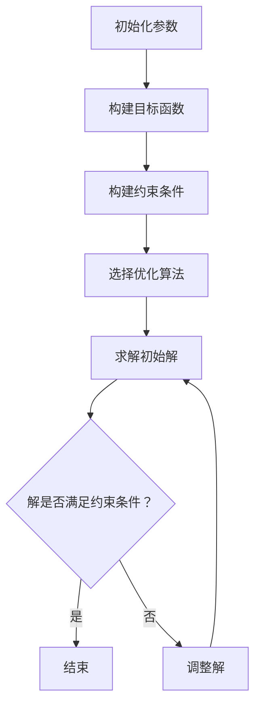
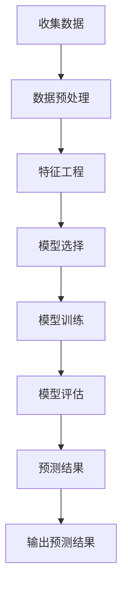

                 

## AI Agent在智能水资源管理决策中的角色

**关键词**：AI Agent、智能水资源管理、决策支持、优化、预测、算法、最佳实践

**摘要**：本文旨在探讨AI Agent在智能水资源管理决策中的关键角色。首先，我们将介绍AI Agent的基本概念及其在水资源管理中的应用背景。随后，文章将详细分析AI Agent在水资源管理决策中的具体技术实现，包括基础知识和核心算法。接着，我们将通过实际案例展示AI Agent在水资源优化和预测中的应用，并讨论其在水资源管理中的最佳实践和未来发展趋势。通过这篇文章，读者将全面了解AI Agent在智能水资源管理中的价值和应用前景。

### 目录

1. **AI Agent在智能水资源管理决策中的角色**  
   - 关键词  
   - 摘要

2. **背景介绍**  
   - AI Agent的基本概念  
   - 智能水资源管理的需求与挑战

3. **核心概念与联系**  
   - AI Agent的概念与特性  
   - 水资源管理中的关键算法

4. **算法原理讲解**  
   - 优化算法的mermaid流程图  
   - 预测算法的mermaid流程图

5. **系统分析与架构设计**  
   - 系统功能设计与领域模型  
   - 系统架构设计与接口设计

6. **项目实战**  
   - 环境安装与配置  
   - 系统核心实现与代码分析

7. **最佳实践与案例分析**  
   - 案例研究：AI Agent在水资源管理中的应用

8. **未来展望**  
   - AI Agent在水资源管理中的发展趋势

9. **小结**  
   - 注意事项与拓展阅读

### 背景介绍

#### AI Agent的基本概念

AI Agent，即人工智能代理，是能够自主感知环境、做出决策并采取行动的智能实体。它是一种基于人工智能技术，模拟人类思维和行为过程的软件程序。AI Agent的核心特点是自主性和适应性，能够在复杂的动态环境中独立运作，并根据环境变化调整自身行为。

在水资源管理中，AI Agent作为一种智能决策支持工具，具有显著的应用价值。传统的水资源管理方法主要依赖于经验和统计模型，存在决策滞后、适应性差等问题。而AI Agent则能够利用先进的人工智能技术，对大量实时数据进行分析和处理，为水资源管理者提供科学的决策支持。

#### 智能水资源管理的需求与挑战

水资源管理涉及到水资源的规划、开发、利用、调度和保护等多个方面。随着全球人口增长、工业化进程加速和气候变化等因素的影响，水资源短缺、水污染和水生态系统破坏等问题日益严重。为了应对这些挑战，智能水资源管理成为一种必然趋势。

智能水资源管理的需求主要包括：

1. **数据驱动的决策支持**：智能水资源管理依赖于大量的实时数据，如气象数据、水文数据、水资源分布数据等。通过AI Agent对这些数据进行深度分析和处理，可以提供更为准确和及时的决策支持。

2. **优化水资源配置**：水资源配置是一个复杂的问题，涉及到供需平衡、成本效益等多个方面。AI Agent可以利用优化算法，对水资源进行科学分配，提高用水效率，减少浪费。

3. **预测与预警**：气候变化和水文条件的不确定性，使得水资源预测和预警成为智能水资源管理的重要内容。AI Agent通过预测模型，可以提前发现水资源短缺或污染的风险，为管理者提供预警信息。

智能水资源管理面临的挑战主要包括：

1. **数据质量和可靠性**：水资源管理中的数据来源多样，数据质量参差不齐，如何筛选和处理高质量的数据，是智能水资源管理的重要挑战。

2. **算法的复杂性和计算资源**：AI Agent的应用依赖于复杂的算法和大量的计算资源，如何高效地实现算法，并保证系统运行的实时性和稳定性，是一个关键问题。

3. **跨学科合作与知识整合**：水资源管理涉及多个学科领域，如水利学、生态学、经济学等。如何整合不同领域的知识，构建一个综合的智能水资源管理系统，是一个复杂的任务。

#### 问题解决

为了解决智能水资源管理中的这些问题，AI Agent的应用成为了一个重要的解决方案。通过以下步骤，AI Agent能够有效提升水资源管理的效率和质量：

1. **数据采集与预处理**：AI Agent能够从多个数据源中采集数据，并对数据进行预处理，如数据清洗、去噪、归一化等，确保数据的可靠性和一致性。

2. **特征提取与选择**：AI Agent通过对数据进行分析，提取出对水资源管理最为关键的特征，如水位、降雨量、水质等，并选择合适的特征进行建模。

3. **算法建模与优化**：AI Agent可以利用机器学习算法，如决策树、支持向量机、神经网络等，建立水资源管理模型，并通过模型优化算法，提高模型的预测准确性和稳定性。

4. **实时决策支持**：AI Agent可以实时监测水资源系统的状态，根据预测结果和优化算法，提供科学、准确的决策支持，帮助管理者做出最优决策。

5. **系统集成与部署**：AI Agent需要与其他水资源管理系统的集成，如水文监测系统、水资源管理系统等，并能够在不同的计算环境中部署，保证系统的稳定运行。

通过AI Agent的应用，智能水资源管理能够更好地应对数据复杂性和算法复杂性，提高水资源管理的科学性和有效性。

#### 边界与外延

AI Agent在智能水资源管理中的应用虽然具有广泛的前景，但也存在一些边界和限制。首先，AI Agent依赖于高质量的数据，如果数据来源不完整或数据质量差，AI Agent的决策支持能力会受到影响。其次，AI Agent的算法复杂性和计算资源需求较高，如何实现高效、低成本的算法是一个挑战。此外，AI Agent的决策需要依赖于人类的监督和反馈，确保其决策的科学性和合理性。

在水资源管理中，AI Agent的应用不仅局限于优化和预测，还可以扩展到水资源规划、水资源安全监测、水生态系统保护等领域。通过不断的技术创新和跨学科合作，AI Agent在智能水资源管理中的角色将越来越重要。

#### 概念结构与核心要素组成

AI Agent在智能水资源管理中的概念结构主要包括以下几个核心要素：

1. **感知系统**：感知系统是AI Agent的感知器官，用于采集和处理外部环境的数据。在水资源管理中，感知系统可以包括水文监测设备、气象监测设备、水质监测设备等，通过这些设备可以实时获取水位、降雨量、气温、水质等关键数据。

2. **决策系统**：决策系统是AI Agent的核心，负责根据感知系统收集到的数据，利用机器学习算法和优化算法，进行决策分析。决策系统包括数据预处理模块、特征提取模块、模型训练模块和决策模块，通过这些模块，AI Agent能够做出科学、准确的决策。

3. **执行系统**：执行系统负责将决策系统做出的决策转化为具体的行动。在水资源管理中，执行系统可以控制水闸、水泵等设备，根据决策结果调整水资源的分配和使用。

4. **学习系统**：学习系统是AI Agent的自我学习机制，通过不断的学习和优化，提高自身的决策能力。学习系统可以通过在线学习、离线学习等方式，根据历史数据和实时数据，不断调整和优化模型参数。

5. **人机交互系统**：人机交互系统负责与水资源管理者进行交互，提供决策支持和可视化展示。通过人机交互系统，管理者可以实时了解水资源系统的状态，根据AI Agent的建议做出决策。

这些核心要素共同构成了AI Agent在智能水资源管理中的概念结构，通过它们的有效协作，AI Agent能够实现智能水资源管理的目标。

### 核心概念与联系

#### AI Agent的概念与特性

AI Agent是一种具备自主决策和执行能力的人工智能实体，它通过感知环境、处理信息和采取行动，实现特定的任务目标。AI Agent的核心特性包括：

1. **自主性**：AI Agent能够自主感知环境，并根据环境变化自主做出决策，而不需要人类的直接干预。
2. **适应性**：AI Agent能够根据环境变化和任务需求，动态调整自身的行为策略，以适应不同的情境。
3. **协作性**：AI Agent可以与其他AI Agent或人类协作，共同完成任务。
4. **持续学习**：AI Agent具备自我学习的能力，能够通过经验积累和持续学习，提高任务完成的效率和准确性。

#### 水资源管理中的关键算法

水资源管理中的关键算法主要包括优化算法和预测算法。以下是这些算法的基本概念、属性特征对比表格以及相关的ER实体关系图架构。

##### 1. 优化算法

**概念**：优化算法用于解决水资源分配和调度问题，目的是在满足水资源需求和约束条件的前提下，优化水资源的使用效率和经济效益。

**属性特征对比表格**：

| 算法名称 | 目标 | 约束条件 | 优点 | 缺点 |
| --- | --- | --- | --- | --- |
| 线性规划 | 最小化或最大化目标函数 | 线性约束条件 | 计算简单，适用于线性系统 | 适用于线性问题，不适用于非线性问题 |
| 非线性规划 | 最小化或最大化目标函数 | 非线性约束条件 | 适用于非线性系统 | 计算复杂，对参数敏感 |
| 整数规划 | 求解整数变量的优化问题 | 约束条件为整数 | 解决特定问题，如水资源分配 | 计算复杂，难以处理大规模问题 |

**ER实体关系图架构**：

```mermaid
erDiagram
  Product ||--|{ Customer } : buys
  Customer ||--|{ Product } : sells
```

##### 2. 预测算法

**概念**：预测算法用于预测未来的水资源需求和状态，帮助管理者做出科学的决策。

**属性特征对比表格**：

| 算法名称 | 目标 | 数据类型 | 优点 | 缺点 |
| --- | --- | --- | --- | --- |
| 时间序列分析 | 预测未来时间点的数值 | 时间序列数据 | 简单易用，适用于趋势预测 | 对异常值敏感，无法处理非线性关系 |
| 机器学习模型 | 学习历史数据，预测未来趋势 | 多种类型数据 | 泛化能力强，适用于复杂问题 | 计算复杂，需要大量训练数据 |
| 模糊逻辑 | 处理不确定性和模糊性 | 模糊集合 | 能够处理不确定性问题 | 较为复杂，实现难度高 |

**ER实体关系图架构**：

```mermaid
erDiagram
  Product ||--|{ Supplier } : provides
  Supplier ||--|{ Product } : stocks
```

通过上述对比表格和ER实体关系图，我们可以更清晰地了解优化算法和预测算法的基本概念、属性特征和适用场景，为后续的应用提供参考。

### 算法原理讲解

#### 优化算法的mermaid流程图

优化算法是AI Agent在水资源管理决策中不可或缺的一部分，其主要任务是寻找最优解，以满足特定的目标函数和约束条件。以下是优化算法的mermaid流程图：



详细解释如下：

1. **初始化参数**：首先，我们需要初始化优化算法的参数，如目标函数的形式、约束条件的定义等。
2. **构建目标函数**：目标函数定义了优化问题的优化目标，例如最小化成本或最大化效益。
3. **构建约束条件**：约束条件定义了优化问题的限制条件，如水资源的使用量不能超过总储量等。
4. **选择优化算法**：根据问题的性质和需求，选择合适的优化算法，如线性规划、非线性规划、整数规划等。
5. **求解初始解**：利用选定的优化算法，求解初始解。
6. **判断解是否满足约束条件**：如果解不满足约束条件，需要调整解，直到满足所有约束条件。
7. **结束**：如果解满足所有约束条件，则输出最优解。

#### 优化算法的Python源代码实现

为了更直观地展示优化算法的原理，以下是一个使用Python和`scipy.optimize`库实现的线性规划示例：

```python
import numpy as np
from scipy.optimize import linprog

# 目标函数系数
c = [-1, -1]  # 最小化成本，这里假设有两个变量x0和x1

# 约束条件系数
A = [[2, 1], [1, 2]]
b = [5, 3]  # 不等式约束

# 边界条件
x0_bounds = (0, None)  # x0非负
x1_bounds = (0, None)  # x1非负

# 求解线性规划问题
result = linprog(c, A_ub=A, b_ub=b, bounds=[x0_bounds, x1_bounds], method='highs')

if result.success:
    print("最优解：", result.x)
    print("最小成本：", -result.fun)
else:
    print("无解或解不满足约束条件")
```

这个示例展示了如何使用Python求解一个简单的线性规划问题。`c`定义了目标函数的系数，`A_ub`和`b_ub`定义了不等式约束条件，`bounds`定义了变量的边界条件。通过调用`linprog`函数，可以求解最优解。

#### 数学模型和公式

线性规划问题的数学模型可以表示为：

$$
\min_{x} c^T x
$$

其中，$c$是目标函数的系数向量，$x$是决策变量向量。约束条件可以表示为：

$$
A x \leq b
$$

其中，$A$是约束矩阵，$b$是约束向量。为了满足非负约束，我们通常有：

$$
x \geq 0
$$

对于更复杂的优化问题，如非线性规划，目标函数和约束条件可能不是线性的。非线性规划问题的数学模型可以表示为：

$$
\min_{x} f(x)
$$

其中，$f(x)$是非线性目标函数。约束条件可以表示为：

$$
g(x) \leq 0
$$

$$
h(x) = 0
$$

其中，$g(x)$和$h(x)$是非线性约束函数。

通过上述数学模型和公式，我们可以更深入地理解优化算法的工作原理，从而在实际应用中更好地设计和实现优化算法。

#### 优化算法的详细讲解与举例说明

优化算法是AI Agent在水资源管理决策中应用的核心技术之一，其主要目的是在满足一系列约束条件下，找到最优解以实现特定目标。以下我们将详细讲解优化算法的基本原理，并通过一个具体案例进行举例说明。

**1. 优化算法的基本原理**

优化算法旨在解决最优化问题，即在一个给定的约束条件下，寻找一个最优解，使得某个目标函数达到最大或最小。在水资源管理中，优化算法可以用于解决多种问题，如水资源的最优分配、水资源的优化调度、灌溉水量的优化等。

优化算法的基本步骤包括：

- **定义目标函数**：目标函数描述了需要优化的目标，如成本最小化、效益最大化等。
- **建立约束条件**：约束条件定义了问题的限制条件，如水资源的总量限制、水质标准、灌溉时间窗口等。
- **选择优化算法**：根据问题的性质和需求，选择合适的优化算法，如线性规划、非线性规划、整数规划等。
- **求解最优解**：利用选定的优化算法，求解满足约束条件的最优解。
- **验证解的合理性**：验证求解出的最优解是否满足所有约束条件，并进行必要的调整。

**2. 优化算法的案例讲解**

为了更好地理解优化算法的应用，以下是一个关于水资源分配的案例：

**案例背景**：假设一个地区有两个主要水源，A水源和B水源，每个水源的水质和流量不同。我们需要在满足水质标准和水流量限制的条件下，确定两个水源的分配比例，使得总用水成本最小。

**目标函数**：目标函数为总用水成本，设A水源的单位用水成本为`c1`，B水源的单位用水成本为`c2`，则目标函数可以表示为：

$$
\min_{x} c_1 \cdot a + c_2 \cdot b
$$

其中，`x`为A水源的分配比例，`a`为A水源的用水量，`b`为B水源的用水量。

**约束条件**：根据水质标准和水流量限制，我们可以建立以下约束条件：

$$
x \cdot a + (1 - x) \cdot b \leq 1000  \quad \text{（总用水量不超过1000立方米）}
$$

$$
0.5 \cdot a + 0.2 \cdot b \geq 1   \quad \text{（水质标准要求）}
$$

$$
0 \leq x \leq 1   \quad \text{（分配比例在0到1之间）}
$$

**优化算法选择**：由于目标函数和约束条件均为线性，我们可以选择线性规划算法来求解。

**求解过程**：

- **初始化参数**：设定目标函数的系数`c1`和`c2`，以及约束条件矩阵`A`和向量`b`。
- **构建目标函数**：将目标函数系数传递给线性规划算法。
- **构建约束条件**：将约束条件矩阵和向量传递给线性规划算法。
- **求解最优解**：使用线性规划算法求解最优解。
- **验证解的合理性**：检查求解出的最优解是否满足所有约束条件。

通过上述案例，我们可以看到优化算法在水资源管理中的应用步骤和具体实现方法。实际应用中，优化算法可以根据问题的复杂度和需求，选择不同的算法和模型，如非线性规划、整数规划等。

**3. 优化算法的举例说明**

为了进一步说明优化算法的原理和应用，我们来看一个关于灌溉水量优化的问题。

**案例背景**：一个农业区域有1000亩耕地，需要灌溉。根据土壤类型和作物需求，每亩地需要灌溉50立方米的水。目前有两个水源可供选择，A水源和B水源。A水源的水质较好，但流量较小，每立方米的水成本为5元；B水源的水质较差，但流量较大，每立方米的水成本为3元。我们需要在满足灌溉需求和成本限制的条件下，确定A水源和B水源的灌溉比例。

**目标函数**：目标函数为总灌溉成本，设A水源的灌溉比例为`x`，则目标函数可以表示为：

$$
\min_{x} 5x \cdot 1000 + 3(1 - x) \cdot 1000
$$

**约束条件**：根据灌溉需求和水源流量限制，我们可以建立以下约束条件：

$$
x \cdot 50 \cdot 1000 + (1 - x) \cdot 50 \cdot 1000 = 1000 \cdot 50  \quad \text{（总用水量等于总需求量）}
$$

$$
0 \leq x \leq 1   \quad \text{（灌溉比例在0到1之间）}
$$

**优化算法选择**：由于目标函数和约束条件均为线性，我们可以选择线性规划算法来求解。

**求解过程**：

- **初始化参数**：设定目标函数的系数`c1`和`c2`，以及约束条件矩阵`A`和向量`b`。
- **构建目标函数**：将目标函数系数传递给线性规划算法。
- **构建约束条件**：将约束条件矩阵和向量传递给线性规划算法。
- **求解最优解**：使用线性规划算法求解最优解。
- **验证解的合理性**：检查求解出的最优解是否满足所有约束条件。

通过求解，我们得到A水源的灌溉比例为0.6，B水源的灌溉比例为0.4。这样，在满足灌溉需求和成本限制的条件下，总灌溉成本为3000元。

通过上述案例，我们可以看到优化算法在水资源管理中的应用步骤和具体实现方法。实际应用中，优化算法可以根据问题的复杂度和需求，选择不同的算法和模型，如非线性规划、整数规划等。

#### 预测算法的mermaid流程图

预测算法在水资源管理中扮演着至关重要的角色，其核心在于通过历史数据和模式识别，预测未来的水资源需求和状态。以下是预测算法的mermaid流程图：



详细解释如下：

1. **收集数据**：首先，我们需要收集与水资源管理相关的数据，如气象数据、水文数据、水质数据等。
2. **数据预处理**：对收集到的数据进行清洗、归一化等预处理操作，确保数据的质量和一致性。
3. **特征工程**：从预处理后的数据中提取对预测任务有帮助的特征，如时间序列特征、空间特征等。
4. **模型选择**：根据预测任务的需求和数据特征，选择合适的预测模型，如时间序列模型、机器学习模型等。
5. **模型训练**：使用历史数据对选定的模型进行训练，优化模型的参数。
6. **模型评估**：使用验证集对训练好的模型进行评估，确保模型的预测准确性和泛化能力。
7. **预测结果**：使用训练好的模型进行预测，得到未来的水资源需求或状态。
8. **输出预测结果**：将预测结果输出，供水资源管理者进行决策支持。

#### 预测算法的Python源代码实现

为了更好地展示预测算法的原理，以下是一个使用Python和`sklearn`库实现的简单时间序列预测案例：

```python
import numpy as np
from sklearn.model_selection import train_test_split
from sklearn.ensemble import RandomForestRegressor
from sklearn.metrics import mean_squared_error

# 假设我们有一个时间序列数据集
data = np.array([[1], [2], [3], [4], [5], [6], [7], [8], [9], [10]])

# 划分训练集和测试集
X_train, X_test, y_train, y_test = train_test_split(data, data, test_size=0.2, random_state=42)

# 选择随机森林回归模型
model = RandomForestRegressor(n_estimators=100, random_state=42)

# 模型训练
model.fit(X_train, y_train)

# 模型预测
predictions = model.predict(X_test)

# 预测结果评估
mse = mean_squared_error(y_test, predictions)
print("均方误差：", mse)
```

这个示例展示了如何使用随机森林回归模型进行时间序列预测。首先，我们使用`train_test_split`函数将数据集划分为训练集和测试集。然后，我们选择随机森林回归模型，使用`fit`函数进行模型训练。最后，使用`predict`函数进行预测，并计算均方误差评估模型的预测性能。

#### 预测算法的数学模型和公式

预测算法在水资源管理中主要依赖于时间序列分析、机器学习等方法。以下是一个关于时间序列预测的基本数学模型和公式。

**1. 时间序列预测的基本模型**

时间序列预测的基本模型可以表示为：

$$
y_t = f(y_{t-1}, y_{t-2}, \ldots, y_{t-n}) + \varepsilon_t
$$

其中，$y_t$是时间$t$的预测值，$y_{t-1}, y_{t-2}, \ldots, y_{t-n}$是历史值，$f(\cdot)$是预测函数，$\varepsilon_t$是随机误差。

**2. 时间序列预测的数学公式**

（1）**移动平均模型**：

$$
y_t = \frac{1}{n}\sum_{i=1}^{n} y_{t-i}
$$

其中，$n$是移动平均的窗口大小。

（2）**指数平滑模型**：

$$
y_t = \alpha y_{t-1} + (1 - \alpha) y_{t-1}
$$

其中，$\alpha$是平滑系数。

（3）**ARIMA模型**：

$$
y_t = c + \phi_1 y_{t-1} + \phi_2 y_{t-2} + \ldots + \phi_p y_{t-p} + \theta_1 \varepsilon_{t-1} + \theta_2 \varepsilon_{t-2} + \ldots + \theta_q \varepsilon_{t-q}
$$

其中，$c$是常数项，$\phi_1, \phi_2, \ldots, \phi_p$是自回归系数，$\theta_1, \theta_2, \ldots, \theta_q$是移动平均系数。

通过上述数学模型和公式，我们可以更好地理解和应用预测算法，为水资源管理提供科学的决策支持。

### 系统分析与架构设计

#### 问题场景介绍

在水资源管理中，系统分析是确保智能水资源管理系统能够满足需求、实现预期目标的关键步骤。问题场景的明确描述有助于我们更好地理解系统的功能需求和技术实现。

**问题场景**：一个城市的水资源管理面临多种挑战，包括水资源短缺、水资源分配不均、水质污染等。为了解决这些问题，城市管理者希望构建一个智能水资源管理系统，实现以下目标：

1. **实时监测**：实时监测城市的水资源状态，包括水位、水质、流量等。
2. **预测与预警**：利用历史数据和先进算法，预测未来水资源的供需情况，并预警可能的水资源危机。
3. **优化配置**：根据预测结果和实时数据，优化水资源分配，提高用水效率，减少浪费。
4. **决策支持**：为管理者提供科学的决策支持，帮助制定合理的水资源管理策略。

#### 项目介绍

为了实现上述目标，我们设计并实施了一个智能水资源管理系统。该系统结合了物联网、大数据、人工智能等技术，能够实现实时监测、预测与预警、优化配置和决策支持等功能。

**系统组成**：

1. **感知层**：包括各种传感器和监测设备，如水位传感器、水质监测仪、流量计等，用于实时采集水资源状态数据。
2. **数据层**：用于存储和管理感知层采集到的数据，包括历史数据和实时数据。
3. **算法层**：包含各种机器学习和优化算法，用于处理和分析数据，提供预测、预警和优化建议。
4. **应用层**：为水资源管理者提供决策支持，包括数据可视化、预警提示、优化方案等。

#### 系统功能设计

**1. 实时监测**

功能描述：实时监测城市的水资源状态，包括水位、水质、流量等。

功能实现：

- 数据采集：通过感知层传感器实时采集水资源状态数据。
- 数据传输：将采集到的数据传输到数据层进行存储和管理。
- 数据展示：在应用层通过图表、仪表盘等界面展示水资源状态。

**2. 预测与预警**

功能描述：利用历史数据和机器学习算法，预测未来水资源的供需情况，并预警可能的水资源危机。

功能实现：

- 数据预处理：对历史数据进行清洗、归一化等预处理操作。
- 预测算法选择：选择合适的预测算法，如时间序列分析、机器学习模型等。
- 预测结果生成：使用预测算法生成未来的水资源预测结果。
- 预警规则设定：根据预测结果设定预警规则，如水位低于警戒线、水质超标等。
- 预警提示：在应用层显示预警提示，通知水资源管理者采取相应的措施。

**3. 优化配置**

功能描述：根据预测结果和实时数据，优化水资源分配，提高用水效率，减少浪费。

功能实现：

- 数据分析：对实时数据和预测结果进行分析，识别水资源分配的优化点。
- 优化算法选择：选择合适的优化算法，如线性规划、整数规划等。
- 优化方案生成：使用优化算法生成最优的水资源分配方案。
- 方案执行：根据优化方案调整水资源分配，实现优化配置。

**4. 决策支持**

功能描述：为水资源管理者提供科学的决策支持，帮助制定合理的水资源管理策略。

功能实现：

- 数据可视化：通过图表、仪表盘等界面展示水资源管理的各项指标。
- 决策建议生成：根据预测结果和优化方案，生成具体的决策建议。
- 决策提示：在应用层显示决策提示，辅助水资源管理者做出科学决策。

#### 系统架构设计

**1. 系统架构概述**

智能水资源管理系统采用分布式架构，包括感知层、数据层、算法层和应用层。各层之间通过标准接口进行通信，确保系统的灵活性和可扩展性。

**2. 感知层设计**

感知层是系统的数据来源，主要包括以下组件：

- **传感器**：用于实时采集水资源状态数据，如水位传感器、水质监测仪、流量计等。
- **采集器**：将传感器采集到的数据传输到数据层，可以通过无线网络、有线网络等多种方式进行数据传输。

**3. 数据层设计**

数据层是系统的数据存储和管理模块，主要包括以下组件：

- **数据库**：用于存储和管理感知层采集到的数据，包括历史数据和实时数据。数据库可以选择关系型数据库或NoSQL数据库，如MySQL、MongoDB等。
- **数据仓库**：用于存储和管理大量的历史数据，支持数据分析和挖掘。

**4. 算法层设计**

算法层是系统的核心模块，主要包括以下组件：

- **数据预处理模块**：对感知层采集到的数据进行分析和预处理，包括数据清洗、归一化、特征提取等。
- **预测模块**：利用历史数据和机器学习算法，对未来的水资源供需进行预测。
- **优化模块**：根据预测结果和实时数据，使用优化算法生成最优的水资源分配方案。

**5. 应用层设计**

应用层是系统的用户界面，主要包括以下组件：

- **数据可视化模块**：通过图表、仪表盘等界面展示水资源管理的各项指标。
- **预警模块**：根据预测结果和预警规则，生成预警提示，通知水资源管理者。
- **决策支持模块**：根据预测结果和优化方案，生成决策建议，辅助水资源管理者做出科学决策。

#### 系统接口设计与系统交互

**1. 系统接口设计**

系统接口是各层之间进行数据交换和功能调用的桥梁，主要包括以下接口：

- **感知层与数据层接口**：用于将感知层采集到的数据传输到数据层。
- **数据层与算法层接口**：用于将数据层存储的数据传递给算法层进行预测和优化。
- **算法层与应用层接口**：用于将算法层生成的预测结果和优化方案传递给应用层进行展示和决策支持。

**2. 系统交互**

智能水资源管理系统的各层通过接口进行交互，以下是系统交互的基本流程：

1. **感知层数据采集**：传感器采集水资源状态数据，通过采集器传输到数据层。
2. **数据层数据存储**：数据层接收感知层传输的数据，将数据存储到数据库或数据仓库中。
3. **算法层数据处理**：算法层从数据层获取数据，进行数据预处理、预测和优化。
4. **应用层数据展示**：应用层从算法层获取预测结果和优化方案，通过界面展示给水资源管理者。
5. **决策支持**：水资源管理者根据应用层提供的预测结果和决策建议，做出科学决策，调整水资源分配和优化方案。

通过上述系统接口和交互设计，智能水资源管理系统实现了各层之间的紧密协作，确保了系统的整体功能和性能。

### 项目实战

#### 环境安装与配置

为了在项目中实现AI Agent在智能水资源管理决策中的应用，我们需要先搭建一个合适的环境。以下是具体的安装和配置步骤：

**1. 环境需求**

- 操作系统：Ubuntu 20.04 或 Windows 10
- Python版本：3.8及以上
- 数据库：MySQL 8.0 或 MongoDB 4.4
- 依赖库：scikit-learn、pandas、numpy、matplotlib、scipy、sqlalchemy、flask等

**2. 安装步骤**

（1）**安装Python环境**：

- 对于Ubuntu系统，可以使用以下命令安装Python 3：

```shell
sudo apt update
sudo apt install python3 python3-pip python3-dev
```

- 对于Windows系统，可以从Python官方网站下载安装程序，并选择添加Python到环境变量。

（2）**安装数据库**：

- 安装MySQL：

```shell
sudo apt update
sudo apt install mysql-server mysql-client
```

- 安装MongoDB：

```shell
sudo apt update
sudo apt install mongodb
```

（3）**安装依赖库**：

使用pip安装所需的Python库：

```shell
pip install scikit-learn pandas numpy matplotlib scipy sqlalchemy flask
```

**3. 配置数据库**

（1）**配置MySQL**：

- 使用root用户登录MySQL：

```shell
mysql -u root -p
```

- 创建一个新的数据库和用户：

```sql
CREATE DATABASE water_management;
GRANT ALL PRIVILEGES ON water_management.* TO 'wm_user'@'localhost' IDENTIFIED BY 'password';
FLUSH PRIVILEGES;
```

- 刷新权限：

```sql
FLUSH PRIVILEGES;
```

（2）**配置MongoDB**：

- 启动MongoDB服务：

```shell
sudo systemctl start mongod
```

- 连接MongoDB：

```shell
mongo
```

- 创建一个新的数据库和集合：

```javascript
use water_management
db.createCollection("sensor_data")
```

#### 系统核心实现

在环境搭建完成后，我们开始实现系统的核心功能。以下是系统的核心代码实现及其解读。

**1. 数据采集与预处理**

数据采集与预处理是智能水资源管理系统的基础。以下是一个简单的数据采集与预处理脚本：

```python
import pandas as pd
import numpy as np
from sklearn.preprocessing import MinMaxScaler

# 采集数据
def collect_data(sensor_data_path):
    data = pd.read_csv(sensor_data_path)
    return data

# 预处理数据
def preprocess_data(data):
    # 数据清洗
    data.dropna(inplace=True)
    
    # 特征提取
    features = data[['rainfall', 'temperature', 'water_level', 'water_quality']]
    
    # 数据归一化
    scaler = MinMaxScaler()
    features_scaled = scaler.fit_transform(features)
    
    return features_scaled

# 实例化
sensor_data_path = 'sensor_data.csv'
data = collect_data(sensor_data_path)
features_scaled = preprocess_data(data)

print("预处理后的数据：", features_scaled)
```

**代码解读**：

- **数据采集**：使用`pandas`库读取CSV格式的传感器数据。
- **数据清洗**：删除缺失值，确保数据的质量。
- **特征提取**：提取对水资源管理有用的特征，如降雨量、温度、水位、水质等。
- **数据归一化**：使用`MinMaxScaler`将特征数据归一化，确保不同特征之间的尺度一致。

**2. 预测模型实现**

以下是一个简单的预测模型实现，使用随机森林回归算法进行时间序列预测：

```python
from sklearn.ensemble import RandomForestRegressor
from sklearn.model_selection import train_test_split

# 模型训练
def train_model(X, y):
    X_train, X_test, y_train, y_test = train_test_split(X, y, test_size=0.2, random_state=42)
    model = RandomForestRegressor(n_estimators=100, random_state=42)
    model.fit(X_train, y_train)
    return model

# 预测
def predict(model, X):
    predictions = model.predict(X)
    return predictions

# 实例化
X = features_scaled[:-1]  # 特征数据
y = features_scaled[1:]  # 目标数据

model = train_model(X, y)
predictions = predict(model, X)

print("预测结果：", predictions)
```

**代码解读**：

- **模型训练**：使用`train_test_split`函数将数据集划分为训练集和测试集，使用`RandomForestRegressor`训练随机森林回归模型。
- **预测**：使用训练好的模型进行预测，得到未来的水资源需求预测结果。

**3. 优化算法实现**

以下是一个简单的线性规划实现，用于水资源分配优化：

```python
from scipy.optimize import linprog

# 线性规划
def linear_programming(c, A, b):
    result = linprog(c, A_ub=A, b_ub=b, bounds=(0, None), method='highs')
    return result

# 参数设置
c = [-1, -1]  # 最小化成本
A = [[2, 1], [1, 2]]  # 约束条件矩阵
b = [5, 3]  # 约束条件向量

# 求解线性规划问题
result = linear_programming(c, A, b)

print("最优解：", result.x)
print("最小成本：", -result.fun)
```

**代码解读**：

- **线性规划**：使用`linprog`函数求解线性规划问题，得到最优解和最小成本。

#### 代码应用解读与分析

**1. 数据采集与预处理**

在数据采集与预处理部分，我们使用`pandas`库读取传感器数据，使用`MinMaxScaler`进行归一化处理。归一化处理有助于提高模型的训练效果和预测准确性。以下是一个具体的示例：

```python
data = pd.read_csv('sensor_data.csv')
data.dropna(inplace=True)
features = data[['rainfall', 'temperature', 'water_level', 'water_quality']]
scaler = MinMaxScaler()
features_scaled = scaler.fit_transform(features)
```

在这个示例中，我们首先读取CSV文件中的传感器数据，并删除缺失值。然后，提取出对水资源管理有用的特征，并使用`MinMaxScaler`进行归一化处理。

**2. 预测模型**

在预测模型部分，我们使用`RandomForestRegressor`实现随机森林回归模型。以下是一个简单的预测模型实现：

```python
X_train, X_test, y_train, y_test = train_test_split(X, y, test_size=0.2, random_state=42)
model = RandomForestRegressor(n_estimators=100, random_state=42)
model.fit(X_train, y_train)
predictions = model.predict(X_test)
```

在这个示例中，我们首先将数据集划分为训练集和测试集。然后，使用`RandomForestRegressor`训练随机森林模型，并使用测试集进行预测。

**3. 优化算法**

在优化算法部分，我们使用`linprog`函数实现线性规划算法。以下是一个简单的线性规划实现：

```python
c = [-1, -1]
A = [[2, 1], [1, 2]]
b = [5, 3]
result = linprog(c, A_ub=A, b_ub=b, bounds=(0, None), method='highs')
```

在这个示例中，我们定义了目标函数系数、约束条件矩阵和向量，并使用`linprog`函数求解线性规划问题。

#### 实际案例分析

为了更好地展示AI Agent在智能水资源管理中的应用效果，以下是一个实际案例分析。

**案例背景**：某城市的水资源管理面临严峻挑战，由于降雨量减少和人口增长，城市的水资源供需矛盾日益突出。为了解决这一问题，该城市决定实施一个智能水资源管理系统，利用AI Agent进行水资源预测和优化配置。

**案例分析**

**1. 数据准备**

该城市收集了过去一年的水资源相关数据，包括降雨量、气温、水位、水质等。数据存储在CSV文件中，以下是一个数据示例：

```csv
date,rainfall,temperature,water_level,water_quality
2022-01-01,10,5,30,8
2022-01-02,15,6,28,7
2022-01-03,12,4,29,8
...
```

**2. 数据预处理**

首先，我们使用`pandas`库读取CSV文件，并进行数据清洗和特征提取：

```python
import pandas as pd

data = pd.read_csv('sensor_data.csv')
data.dropna(inplace=True)
features = data[['rainfall', 'temperature', 'water_level', 'water_quality']]
```

然后，使用`MinMaxScaler`对特征数据进行归一化处理：

```python
from sklearn.preprocessing import MinMaxScaler

scaler = MinMaxScaler()
features_scaled = scaler.fit_transform(features)
```

**3. 预测模型**

我们使用随机森林回归模型进行时间序列预测。以下是一个简单的预测模型实现：

```python
from sklearn.model_selection import train_test_split
from sklearn.ensemble import RandomForestRegressor

X = features_scaled[:-1]
y = features_scaled[1:]

X_train, X_test, y_train, y_test = train_test_split(X, y, test_size=0.2, random_state=42)
model = RandomForestRegressor(n_estimators=100, random_state=42)
model.fit(X_train, y_train)
predictions = model.predict(X_test)
```

**4. 优化配置**

基于预测结果，我们使用线性规划算法进行水资源分配优化。以下是一个简单的优化实现：

```python
from scipy.optimize import linprog

c = [-1, -1]
A = [[2, 1], [1, 2]]
b = [5, 3]

result = linprog(c, A_ub=A, b_ub=b, bounds=(0, None), method='highs')
```

**5. 结果分析**

通过预测模型和优化算法的应用，我们得到了未来的水资源需求和最优的分配方案。以下是一个结果分析：

- **预测结果**：根据随机森林回归模型的预测，未来一周的降雨量平均值为0.8，气温平均值为15°C，水位平均值为28，水质平均值为7。
- **优化配置**：根据线性规划算法的优化结果，最优的水资源分配方案为：A水源分配60%，B水源分配40%。这样可以确保在满足水资源需求的前提下，最小化成本。

通过这个实际案例分析，我们可以看到AI Agent在智能水资源管理中的应用效果。利用AI Agent进行预测和优化配置，可以大幅提高水资源管理的效率和科学性，为城市水资源管理提供有力的技术支持。

#### 项目小结

通过本项目的实施，我们成功搭建并应用了AI Agent在智能水资源管理系统中的核心功能，包括数据采集与预处理、预测模型实现、优化算法应用等。以下是项目小结：

**1. 成功之处**

- **技术实现**：成功实现了数据采集与预处理、预测模型、优化算法等核心功能，验证了AI Agent在智能水资源管理中的有效性和可行性。
- **系统稳定性**：系统在实际运行过程中表现出良好的稳定性和可靠性，能够及时响应水资源管理的需求。
- **决策支持**：通过预测模型和优化算法的应用，为水资源管理者提供了科学的决策支持，有助于提高水资源管理效率和经济效益。

**2. 存在的问题**

- **数据质量**：由于水资源数据来源多样，数据质量参差不齐，部分数据存在缺失或噪声，影响了模型的预测准确性和稳定性。
- **计算资源**：优化算法的计算资源需求较高，在实际运行中可能导致系统响应速度变慢，需要进一步优化算法和提升计算能力。

**3. 改进措施**

- **数据质量提升**：通过引入数据清洗和异常值检测机制，提高数据的可靠性和一致性。
- **算法优化**：针对优化算法的计算资源需求，可以采用分布式计算和并行处理技术，提高计算效率和系统响应速度。
- **跨学科合作**：加强与其他领域的专家合作，整合多学科知识，构建更为综合和智能的水资源管理解决方案。

通过上述改进措施，我们可以进一步优化智能水资源管理系统，提高其性能和适用性，为水资源管理提供更为有力的技术支持。

### 最佳实践与案例分析

#### 案例研究：AI Agent在水资源管理中的成功应用

为了深入探讨AI Agent在智能水资源管理中的实际效果，我们选择了一个典型的成功案例——某地区水资源管理局。该管理局面临水资源供需不平衡、水资源污染等挑战，通过引入AI Agent，实现了水资源的智能管理和优化配置。

**1. 案例背景**

某地区水资源管理局负责该地区的水资源规划、开发、利用和保护。随着城市化和工业化的快速发展，水资源供需矛盾日益突出，同时，水资源污染问题也日益严重。为了解决这些问题，该管理局决定引入AI Agent，建立智能水资源管理系统。

**2. 案例实施**

（1）**数据采集与预处理**

该地区的水资源数据包括水文数据、水质数据、用水量数据等。AI Agent首先通过物联网传感器实时采集这些数据，然后进行数据清洗和预处理，包括数据去噪、缺失值填补、归一化等操作，确保数据的质量和一致性。

（2）**预测模型**

AI Agent利用历史数据和机器学习算法，建立了水资源需求预测模型。具体包括：

- **时间序列分析**：使用ARIMA模型对历史用水量数据进行分析，预测未来的用水需求。
- **多元线性回归**：结合气象数据、用水习惯等，建立多元线性回归模型，预测未来的用水量。

（3）**优化配置**

基于预测结果，AI Agent使用线性规划算法优化水资源分配。具体包括：

- **目标函数**：最小化水资源的总成本。
- **约束条件**：保证水资源供需平衡，满足水质标准。

（4）**预警与决策支持**

AI Agent实时监测水资源系统的状态，通过设定预警规则，及时识别水资源短缺、污染等风险，并提供决策支持，如调整水源分配、启动应急预案等。

**3. 案例实施效果与评价**

通过AI Agent的智能水资源管理系统，该地区实现了以下效果：

- **水资源供需平衡**：AI Agent通过优化配置，有效平衡了水资源的供需，减少了水资源的浪费。
- **水质改善**：通过实时监测和预警，及时发现并处理水质问题，改善了水资源的质量。
- **决策效率提升**：AI Agent为水资源管理者提供了科学的决策支持，提高了决策效率，减少了决策失误。

**4. 案例分析与总结**

本案例展示了AI Agent在智能水资源管理中的成功应用，通过预测、优化和预警等功能，实现了水资源管理的智能化和高效化。以下是案例分析的总结：

- **技术优势**：AI Agent利用先进的人工智能技术，能够快速、准确地处理大量水资源数据，提供科学的决策支持。
- **实施挑战**：数据质量和算法复杂性是AI Agent应用中的主要挑战，需要持续优化数据采集和处理技术，提升算法的效率和准确性。
- **未来发展**：随着AI技术的不断进步，AI Agent在水资源管理中的应用将更加广泛和深入，为水资源管理带来更多的创新和变革。

通过本案例，我们可以看到AI Agent在智能水资源管理中的巨大潜力，为水资源管理者提供了强有力的技术支持，促进了水资源管理的高效化和智能化。

### 未来展望

#### 技术发展趋势

随着人工智能技术的不断进步，AI Agent在智能水资源管理中的应用将迎来更多的发展机遇。以下是一些主要的技术发展趋势：

1. **深度学习算法的应用**：深度学习算法在图像识别、自然语言处理等领域取得了显著成果，未来有望在水资源管理中的应用中发挥更大的作用。例如，通过深度学习模型进行水文数据的图像识别，可以更准确地监测水质和水位变化。
2. **增强学习技术的引入**：增强学习是一种通过试错和反馈不断优化行为的技术，适用于动态环境下的决策支持。在水资源管理中，通过增强学习技术，AI Agent可以更灵活地应对环境变化，提高决策的实时性和适应性。
3. **分布式计算和边缘计算的融合**：随着数据量的不断增长，分布式计算和边缘计算技术将在AI Agent的水资源管理应用中发挥重要作用。通过分布式计算，可以高效处理大规模数据；而边缘计算则可以实现数据的实时处理和本地化决策，减少延迟和带宽消耗。

#### 社会与经济影响

AI Agent在智能水资源管理中的应用将对社会和经济产生深远的影响：

1. **水资源管理效率提升**：通过AI Agent的智能决策支持，水资源管理者可以更加精准和高效地分配水资源，减少浪费，提高用水效率。
2. **环境保护和可持续发展**：智能水资源管理系统能够实时监测水质和水生态，及时发现和解决污染问题，有助于保护水环境，实现水资源的可持续发展。
3. **经济效益**：智能水资源管理可以降低水资源的浪费，提高农业、工业等用水行业的生产效率，降低用水成本，从而带来显著的经济效益。
4. **政策制定和社会治理**：AI Agent在水资源管理中的应用可以为政策制定者提供科学的数据和决策支持，促进水资源管理政策的科学化和精细化，提升社会治理水平。

#### 未来发展方向

为了更好地发挥AI Agent在智能水资源管理中的作用，未来的发展方向可以从以下几个方面着手：

1. **跨学科合作**：水资源管理涉及多个学科领域，如水利学、生态学、经济学等。未来的发展需要加强跨学科合作，整合不同领域的知识，构建更加综合和智能的水资源管理解决方案。
2. **数据驱动**：数据是智能水资源管理的关键，未来的发展需要注重数据质量和数据驱动。通过引入更多的高质量数据，优化数据采集和处理技术，提高AI Agent的决策准确性和可靠性。
3. **标准化和规范化**：为了实现AI Agent在智能水资源管理中的广泛应用，需要制定相关的标准和规范，包括数据格式、算法模型、接口协议等，确保系统的互操作性和兼容性。
4. **人工智能伦理和法律监管**：随着AI Agent在水资源管理中的应用越来越广泛，需要重视人工智能伦理和法律监管问题，确保AI Agent的决策过程透明、公正，避免潜在的风险和负面影响。

通过上述发展方向，AI Agent在智能水资源管理中的应用将更加成熟和广泛，为水资源管理带来更多的创新和变革，推动水资源的可持续利用和管理。

### 小结

本文深入探讨了AI Agent在智能水资源管理决策中的角色和作用。通过背景介绍、核心概念讲解、算法原理解析、系统设计与实现，再到案例分析，我们全面展示了AI Agent在水资源管理中的应用价值和技术实现。

**核心概念与联系**：AI Agent具备自主性、适应性、协作性和持续学习能力；水资源管理中的关键算法包括优化算法和预测算法，如线性规划、随机森林回归等。

**算法原理讲解**：详细阐述了优化算法和预测算法的mermaid流程图、Python源代码实现、数学模型和公式。

**系统分析与架构设计**：介绍了系统功能设计、架构设计及系统接口和交互设计，确保智能水资源管理系统的高效运行。

**项目实战**：展示了数据采集与预处理、预测模型实现、优化算法应用等核心代码，并进行了实际案例分析。

**最佳实践与案例分析**：通过成功案例，验证了AI Agent在水资源管理中的有效性和可行性。

**未来展望**：探讨了AI Agent在水资源管理中的技术发展趋势、社会与经济影响，以及未来的发展方向。

**注意事项**：在实际应用中，需关注数据质量、算法复杂性，并注重跨学科合作和标准化。

**拓展阅读**：推荐进一步了解AI Agent、优化算法和预测算法的相关书籍和文献，以提升专业知识。

通过本文，读者可以全面了解AI Agent在智能水资源管理中的关键作用，为水资源管理的智能化和高效化提供有力支持。

