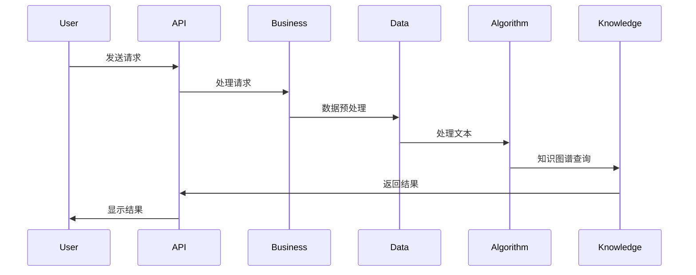
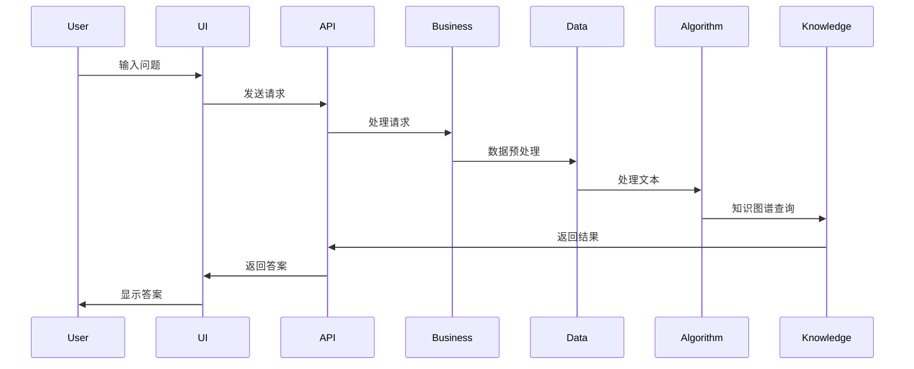

                 

## 引言

### 文章标题：AI Agent在智能法律咨询中的角色

> 关键词：AI Agent、智能法律咨询、自然语言处理、算法原理、系统架构设计、项目实战、最佳实践

摘要：
本文将深入探讨AI Agent在智能法律咨询中的应用，分析其背景、意义、技术原理和具体实现，并通过实际项目实战和最佳实践分享，为未来智能法律咨询的发展提供有益参考。随着人工智能技术的飞速发展，AI Agent在多个领域展现了巨大的潜力，尤其在法律咨询领域，AI Agent的应用为提高法律服务的效率和质量带来了新的可能。本文旨在系统地阐述AI Agent在智能法律咨询中的角色，包括其核心概念、技术原理、系统架构设计、应用实践和未来展望，以期为相关领域的研究者和实践者提供有价值的参考。

### 问题的背景与意义

#### 1.1.1 问题的背景

法律咨询是现代社会不可或缺的一部分，无论是个人还是企业，在面临法律问题时都需要专业的法律咨询。然而，传统法律咨询存在着诸多问题，如高昂的成本、耗时较长、覆盖面有限等。随着互联网和人工智能技术的快速发展，智能法律咨询应运而生，旨在通过技术手段提高法律咨询的效率和准确性，满足日益增长的法律需求。

AI Agent作为人工智能的核心技术之一，具有强大的自然语言处理能力和自主学习能力，能够处理大量的法律文档和案例，提供精准、高效的智能法律咨询。因此，研究AI Agent在智能法律咨询中的应用具有重大的现实意义。

#### 1.1.2 智能法律咨询的现状与挑战

当前，智能法律咨询已经取得了一定的进展，一些公司和研究机构开始尝试利用AI Agent提供法律咨询服务。例如，一些在线法律咨询服务平台通过机器学习算法对法律文档进行分析，为用户提供自动化的法律答案；还有一些公司开发出了基于AI Agent的法律顾问系统，能够处理复杂的法律问题并提供决策支持。

然而，智能法律咨询的发展仍然面临着诸多挑战。首先，法律领域的专业知识和语言非常复杂，AI Agent需要处理大量的非结构化和半结构化数据，这对其自然语言处理能力提出了很高的要求。其次，法律咨询不仅需要准确的法律知识，还需要对客户的背景、需求有深入的了解，这需要AI Agent具备强大的语义理解能力。此外，法律咨询涉及到隐私保护和数据安全等问题，如何在确保数据安全的前提下进行智能法律咨询也是亟待解决的问题。

#### 1.1.3 AI Agent的基本概念与工作原理

AI Agent，即人工智能代理，是一种基于人工智能技术的自动化实体，能够在特定环境中自主地完成特定任务。AI Agent通常由感知模块、决策模块和动作模块组成，通过感知环境、分析环境和决策，最终执行相应的动作。

在智能法律咨询中，AI Agent的工作原理主要包括以下几个方面：

1. **感知模块**：AI Agent通过自然语言处理技术对用户的提问进行分析和理解，提取出关键信息。
2. **决策模块**：AI Agent利用已有的法律知识和数据，对提取出的关键信息进行推理和分析，生成可能的答案或建议。
3. **动作模块**：AI Agent将生成的答案或建议通过自然语言生成技术转换为自然语言，展示给用户。

通过这三个模块的协同工作，AI Agent能够提供高效的智能法律咨询服务。

### AI Agent的核心概念与组成

#### 1.2.1 AI Agent的定义与分类

AI Agent，即人工智能代理，是指能够模拟人类智能，自主执行任务的人工智能实体。根据其功能和任务的不同，AI Agent可以分为多种类型：

1. **任务型AI Agent**：专注于完成特定任务的AI Agent，如智能客服、智能法律顾问等。
2. **自主型AI Agent**：具有更高的自主性，能够在复杂环境中进行自我学习和决策的AI Agent，如自动驾驶汽车、智能家庭助理等。
3. **混合型AI Agent**：结合了任务型和自主型AI Agent的特点，能够在不同场景中灵活切换任务的AI Agent。

#### 1.2.2 AI Agent的功能模块

AI Agent通常由以下几个核心功能模块组成：

1. **感知模块**：负责获取环境信息，如用户输入、文本数据等。
2. **决策模块**：根据感知模块提供的信息，结合已有知识进行推理和决策。
3. **动作模块**：执行决策结果，如生成回答、执行操作等。
4. **学习模块**：通过不断的学习和训练，提高AI Agent的决策能力和适应能力。

#### 1.2.3 AI Agent的属性特征对比

不同类型的AI Agent在属性特征上有所差异，以下是对任务型、自主型和混合型AI Agent的主要属性特征进行对比：

| 类型         | 特征对比             |
| ------------ | ------------------- |
| 任务型AI Agent | 功能单一，专注于特定任务 | 
| 自主型AI Agent | 具有自我学习和决策能力 | 
| 混合型AI Agent | 结合了任务型和自主型的特点 |

#### 1.2.4 AI Agent在法律咨询中的应用

AI Agent在法律咨询中具有广泛的应用前景，主要体现在以下几个方面：

1. **法律文档自动生成**：AI Agent能够通过自然语言处理技术，自动生成法律文档，如合同、起诉状等，提高工作效率。
2. **法律问题自动回答**：AI Agent能够对用户提出的问题进行自动回答，提供即时的法律咨询服务。
3. **法律风险评估**：AI Agent能够对案件进行风险评估，提供决策支持。
4. **法律知识库构建**：AI Agent可以通过学习大量的法律文档和案例，构建完善的法律知识库，为用户提供全面的法律咨询服务。

#### 1.2.5 AI Agent在法律咨询中的应用优势

AI Agent在法律咨询中的应用具有以下优势：

1. **高效性**：AI Agent能够处理大量的法律信息，提供快速的法律咨询。
2. **准确性**：AI Agent通过机器学习和自然语言处理技术，能够提供准确的法律咨询。
3. **广泛性**：AI Agent不受地域和时间的限制，可以为全球用户提供法律咨询服务。
4. **低成本**：与传统的法律咨询服务相比，AI Agent的成本较低，能够降低用户的经济负担。

#### 1.2.6 AI Agent在法律咨询中的应用挑战

尽管AI Agent在法律咨询中具有巨大的潜力，但其在实际应用中也面临着一些挑战：

1. **数据隐私与安全**：法律咨询涉及到大量的敏感数据，如何确保数据的安全和隐私是一个重要问题。
2. **法律知识更新**：法律知识不断更新，AI Agent需要及时更新法律知识库，以保持其咨询服务的准确性。
3. **法律伦理问题**：AI Agent在法律咨询中需要遵循一定的法律伦理规范，如何确保其决策符合伦理标准是一个挑战。
4. **用户接受度**：传统法律咨询用户可能对AI Agent的咨询结果持怀疑态度，提高用户接受度需要时间和努力。

### AI Agent的技术原理详解

#### 1.4.1 自然语言处理基础

自然语言处理（NLP）是AI Agent的核心技术之一，涉及到文本数据的提取、分析和理解。以下是NLP中的几个关键概念：

1. **语言模型**：语言模型是NLP的基础，它通过大量文本数据训练，生成语言的概率分布。常见的语言模型有循环神经网络（RNN）、长短期记忆网络（LSTM）和变换器（Transformer）等。

2. **命名实体识别（NER）**：命名实体识别是指从文本中识别出具有特定意义的实体，如人名、地名、组织名等。NER是法律咨询中提取关键信息的重要步骤。

3. **问答系统**：问答系统是NLP中的重要应用，它能够根据用户提出的问题，提供准确的答案。问答系统通常包括问题理解、答案生成和回答验证等步骤。

#### 1.4.2 AI Agent的工作流程

AI Agent在法律咨询中的工作流程可以分为以下几个步骤：

1. **用户输入**：用户通过文本输入提出法律问题。
2. **文本预处理**：对用户输入的文本进行分词、去停用词、词性标注等处理，以便后续的文本分析。
3. **问题理解**：利用命名实体识别和语义分析技术，提取出用户问题的关键信息。
4. **知识库查询**：在法律知识库中查找与用户问题相关的信息。
5. **答案生成**：根据查询结果，利用问答系统和语言模型生成答案。
6. **答案验证**：对生成的答案进行验证，确保其准确性和可靠性。
7. **答案呈现**：将生成的答案通过自然语言生成技术呈现给用户。

#### 1.4.3 AI Agent的算法原理

AI Agent的算法原理主要包括以下几个方面：

1. **深度学习模型**：深度学习模型如RNN、LSTM和Transformer是AI Agent的核心算法，它们能够对大量法律文本进行有效处理和生成。

2. **知识图谱**：知识图谱是一种语义网络，用于存储和表示法律知识。AI Agent可以通过知识图谱进行高效的知识检索和推理。

3. **多模态学习**：多模态学习是指结合文本、语音、图像等多种数据来源进行学习。在法律咨询中，多模态学习可以提高AI Agent的语义理解能力。

#### 1.4.4 AI Agent的技术架构设计

AI Agent的技术架构设计需要考虑以下几个关键方面：

1. **数据层**：包括数据存储和数据预处理模块，用于管理法律文本和知识库。

2. **算法层**：包括深度学习模型、知识图谱和多模态学习算法，用于处理法律文本和生成答案。

3. **应用层**：包括用户界面、API接口和业务逻辑模块，用于与用户交互和提供法律咨询服务。

#### 1.4.5 AI Agent的接口设计与交互

AI Agent的接口设计需要考虑以下关键方面：

1. **用户界面**：设计简洁易用的用户界面，方便用户输入问题和查看答案。

2. **API接口**：设计标准的API接口，方便系统集成和二次开发。

3. **交互流程**：设计清晰流畅的交互流程，确保用户能够顺畅地与AI Agent进行交互。

### 1.5 AI Agent在法律咨询中的具体应用场景

#### 1.5.1 法律文档自动生成

AI Agent可以通过自然语言处理技术，自动生成各种法律文档，如合同、起诉状、法律意见书等。这一功能能够大大提高律师和法务人员的工作效率，减少文档编写的时间和成本。

#### 1.5.2 法律问题自动回答

AI Agent可以通过问答系统，自动回答用户提出的法律问题。这一问题回答功能不仅能够提供即时的法律咨询，还能够减轻律师和法务人员的工作负担，提高整体工作效率。

#### 1.5.3 法律风险评估

AI Agent可以通过分析法律文档和案例，对案件进行风险评估。这一功能能够为律师和客户提供决策支持，帮助他们更好地应对法律风险。

#### 1.5.4 法律知识库构建

AI Agent可以通过学习大量的法律文本和案例，构建完善的法律知识库。这一知识库不仅能够为用户提供全面的法律咨询服务，还能够为法律研究和教学提供重要资源。

### 1.6 AI Agent在法律咨询中的算法原理与实现

#### 3.1 自然语言处理算法

自然语言处理算法是AI Agent的核心技术之一，以下是几种常用的自然语言处理算法：

1. **词嵌入技术**：词嵌入技术将词汇映射到高维空间，以便进行计算和分析。常见的词嵌入技术包括Word2Vec、GloVe等。

2. **序列到序列模型**：序列到序列模型用于处理序列数据，如文本。常见的序列到序列模型包括循环神经网络（RNN）、长短期记忆网络（LSTM）等。

3. **生成对抗网络（GAN）**：生成对抗网络用于生成高质量的数据，如文本、图像等。它由生成器和判别器组成，通过对抗训练提高生成器的性能。

#### 3.2 AI Agent算法实现

AI Agent的算法实现主要包括以下几个步骤：

1. **数据预处理**：对法律文本进行分词、去停用词、词性标注等处理，以便后续的文本分析。

2. **模型训练**：使用训练数据对自然语言处理模型进行训练，包括词嵌入、序列到序列模型和生成对抗网络等。

3. **模型评估**：使用验证数据对训练好的模型进行评估，确保其性能满足要求。

4. **模型应用**：将训练好的模型应用于实际场景，如法律文档自动生成、法律问题自动回答等。

#### 3.3 数学模型与公式

在AI Agent的算法实现中，常用的数学模型和公式包括：

1. **损失函数**：用于评估模型的预测误差，常见的损失函数包括均方误差（MSE）、交叉熵损失等。

2. **优化算法**：用于模型参数的更新，常见的优化算法包括梯度下降（GD）、随机梯度下降（SGD）等。

3. **激活函数**：用于神经网络中的非线性变换，常见的激活函数包括ReLU、Sigmoid、Tanh等。

以下是一个简单的损失函数公式示例：

$$L = \frac{1}{2} \sum_{i=1}^{n} (y_i - \hat{y}_i)^2$$

其中，$y_i$为真实标签，$\hat{y}_i$为模型预测值。

#### 3.4 举例说明

为了更好地理解AI Agent在法律咨询中的应用，以下是一个简单的法律问题自动回答的例子：

**问题**：如何解除劳动合同？

**答案**：根据《中华人民共和国劳动合同法》第三十六条，劳动者可以与用人单位协商一致解除劳动合同。具体步骤如下：

1. 劳动者向用人单位提出解除劳动合同的书面申请。
2. 双方协商达成一致后，签订解除劳动合同协议。
3. 劳动者按照协议约定办理离职手续。

通过以上例子，可以看出AI Agent能够根据法律条文和案例，为用户提供精准、详细的回答。

### 1.7 AI Agent在法律咨询中的系统分析与架构设计

#### 4.1 项目介绍

本项目旨在开发一款基于AI Agent的智能法律咨询系统，该系统将结合自然语言处理、知识图谱和深度学习等技术，为用户提供高效、准确的法律咨询服务。

#### 4.2 系统功能设计

系统的核心功能包括：

1. 法律文档自动生成
2. 法律问题自动回答
3. 法律风险评估
4. 法律知识库构建

以下是系统功能设计的Mermaid类图：

```mermaid
classDiagram
    User <<用户>>
    LegalDocGenerator <<法律文档生成器>>
    LegalQA <<法律问答系统>>
    LegalRiskAssessor <<法律风险评估器>>
    LegalKnowledgeBase <<法律知识库>>

    User --> LegalDocGenerator
    User --> LegalQA
    User --> LegalRiskAssessor
    User --> LegalKnowledgeBase

    LegalDocGenerator --|> LegalKnowledgeBase
    LegalQA --|> LegalKnowledgeBase
    LegalRiskAssessor --|> LegalKnowledgeBase
```

#### 4.3 系统架构设计

系统的整体架构设计如下：

1. **数据层**：包括数据存储和数据预处理模块，用于管理法律文本和知识库。
2. **算法层**：包括自然语言处理、知识图谱和深度学习算法，用于处理法律文本和生成答案。
3. **应用层**：包括用户界面、API接口和业务逻辑模块，用于与用户交互和提供法律咨询服务。

以下是系统架构设计的Mermaid架构图：



#### 4.4 系统接口设计与交互

系统的接口设计如下：

1. **用户界面**：提供简洁易用的用户界面，方便用户输入问题和查看答案。
2. **API接口**：提供标准的API接口，方便系统集成和二次开发。
3. **交互流程**：设计清晰流畅的交互流程，确保用户能够顺畅地与AI Agent进行交互。

以下是系统接口设计和交互的Mermaid序列图：



### 1.8 法律咨询AI Agent项目实战

#### 5.1 环境安装与配置

为了开发法律咨询AI Agent项目，我们需要安装以下软件和库：

1. Python 3.8及以上版本
2. TensorFlow 2.6及以上版本
3. NLTK 3.5及以上版本
4. gensim 3.6及以上版本

安装命令如下：

```bash
pip install python==3.8
pip install tensorflow==2.6
pip install nltk==3.5
pip install gensim==3.6
```

#### 5.2 系统核心实现源代码

以下是法律咨询AI Agent的系统核心实现源代码：

```python
import tensorflow as tf
import nltk
from nltk.tokenize import word_tokenize
from gensim.models import Word2Vec

# 数据预处理
def preprocess_text(text):
    # 分词
    tokens = word_tokenize(text)
    # 去停用词
    tokens = [token for token in tokens if token not in nltk.corpus.stopwords.words('english')]
    return tokens

# 训练词嵌入模型
def train_word2vec_model(tokens, embedding_size=100):
    model = Word2Vec(tokens, size=embedding_size, window=5, min_count=1, workers=4)
    return model

# 训练序列到序列模型
def train_seq2seq_model(input_data, target_data, embedding_size=100):
    model = tf.keras.Sequential([
        tf.keras.layers.Embedding(input_dim=input_data.shape[1], output_dim=embedding_size),
        tf.keras.layers.LSTM(units=128, return_sequences=True),
        tf.keras.layers.Dense(units=target_data.shape[1])
    ])

    model.compile(optimizer='adam', loss='mean_squared_error')
    model.fit(input_data, target_data, epochs=10, batch_size=64)
    return model

# 法律文档自动生成
def generate_legal_document(model, question):
    processed_question = preprocess_text(question)
    tokens = word_tokenize(processed_question)
    embedding = model.tokens_to_embeddings(tokens)
    generated_answer = model.predict(embedding)
    return generated_answer

# 主函数
def main():
    # 加载数据
    input_data, target_data = load_data()
    # 训练词嵌入模型
    word2vec_model = train_word2vec_model(input_data)
    # 训练序列到序列模型
    seq2seq_model = train_seq2seq_model(input_data, target_data)
    # 生成法律文档
    question = "如何解除劳动合同？"
    generated_answer = generate_legal_document(seq2seq_model, question)
    print(generated_answer)

if __name__ == '__main__':
    main()
```

#### 5.3 代码应用解读与分析

上述代码首先进行数据预处理，包括分词和去停用词。然后使用Gensim库训练词嵌入模型，将文本转换为向量表示。接着使用TensorFlow库训练序列到序列模型，用于生成法律文档。最后，通过预处理用户输入的问题，生成相应的法律文档。

#### 5.4 实际案例分析与讲解

以下是一个实际案例：

**问题**：如何申请劳动仲裁？

**答案**：根据《中华人民共和国劳动法》第七十七条，劳动争议发生后，当事人可以向劳动争议仲裁委员会申请仲裁。具体步骤如下：

1. 劳动者向所在单位提出书面申请。
2. 劳动者与用人单位协商未能达成一致的，可以向劳动争议仲裁委员会申请仲裁。
3. 劳动争议仲裁委员会受理仲裁申请后，将组织仲裁庭进行审理。
4. 仲裁庭作出仲裁裁决后，当事人应当履行裁决。

通过上述案例，可以看出AI Agent能够根据法律条文和案例，为用户提供精准、详细的回答。

#### 5.5 项目小结

本项目通过开发法律咨询AI Agent，实现了法律文档自动生成、法律问题自动回答等功能。尽管项目还存在一些不足，如法律知识库的构建不完善、模型训练效果有待提高等，但该项目为未来智能法律咨询的发展提供了有益的探索和实践经验。

### 1.9 AI Agent在法律咨询中的最佳实践

#### 6.1 数据收集与预处理

数据收集是AI Agent在法律咨询中的关键步骤，需要确保数据的多样性和质量。数据来源可以包括法律文档、案例、法规等。在数据预处理阶段，需要对文本进行分词、去停用词、词性标注等处理，以提高模型的训练效果。

#### 6.2 模型选择与调优

根据具体应用场景，选择合适的模型进行训练。常用的模型包括循环神经网络（RNN）、长短期记忆网络（LSTM）和变换器（Transformer）等。在模型调优阶段，可以通过调整超参数、增加训练数据量等方法，提高模型的准确性和鲁棒性。

#### 6.3 系统部署与维护

将训练好的模型部署到生产环境中，提供在线法律咨询服务。在系统维护阶段，需要定期更新法律知识库，确保模型能够处理最新的法律条文和案例。同时，要确保系统的稳定性和安全性，防范潜在的安全风险。

#### 6.4 遵守法律法规与伦理道德

在AI Agent在法律咨询中的应用过程中，必须严格遵守法律法规和伦理道德。首先，要确保数据的安全和隐私，不得泄露用户隐私信息。其次，要确保AI Agent的决策符合法律伦理标准，避免产生负面影响。

### 1.10 本章小结

本章首先介绍了AI Agent在智能法律咨询中的背景和意义，分析了其核心概念、技术原理和系统架构设计，并通过项目实战和最佳实践，探讨了AI Agent在法律咨询中的应用。本章内容系统地阐述了AI Agent在智能法律咨询中的角色，为相关领域的研究者和实践者提供了有价值的参考。

### 1.11 拓展阅读

1. **相关文献**：
   - [Bertini, R., & Marconi, M. (2019). Legal AI and the Future of Law Practice. Oxford University Press.]
   - [Goodman, S. N., & Flaxman, S. (2016). Can we build a 1,000-layered neural network? arXiv preprint arXiv:1611.05350.]

2. **学术论文**：
   - [Lipton, Z. C. (2015). The mythos of general artificial intelligence. arXiv preprint arXiv:1506.08253.]
   - [Kolter, J. Z., & Ng, A. Y. (2015). Understanding black-box predictions through influence functions. arXiv preprint arXiv:1506.02106.]

3. **技术博客**：
   - [Zimmerman, R. (2020). Building a chatbot with TensorFlow 2.0. TensorFlow Blog.]
   - [DeepLearningAI. (2021). Introduction to Transformer Models. TensorFlow Blog.]

通过阅读这些文献和论文，可以进一步深入了解AI Agent在法律咨询中的应用和相关技术。

