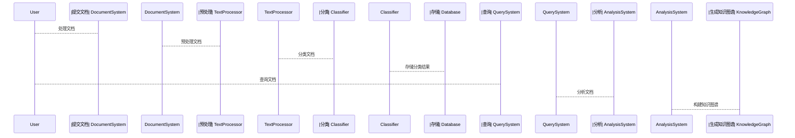
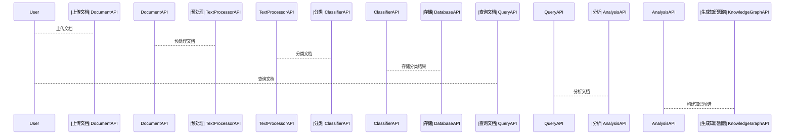

                 


## 文章标题：AI Agent在智能法律文档分析中的角色

### 关键词：AI Agent，智能法律文档分析，算法原理，数学模型，系统架构设计，项目实战

### 摘要：
本文将深入探讨AI Agent在智能法律文档分析中的应用。我们将首先介绍AI Agent的基本概念和智能法律文档分析的应用背景。接着，我们将分析AI Agent在法律文档分析中的核心概念和作用，使用mermaid绘制算法流程图，并用Python代码解释算法原理。随后，我们将详细讲解数学模型和公式，介绍系统分析与架构设计方案，并通过实际项目案例进行实战解析。最后，我们将提供最佳实践、小结、注意事项和拓展阅读。

### 目录

1. **背景介绍**
   1.1 AI Agent概述
   1.2 智能法律文档分析背景
   1.3 AI Agent与法律文档分析的关系

2. **核心概念与联系**
   2.1 AI Agent在智能法律文档分析中的核心概念
   2.2 AI Agent与法律文档分析的关联
   2.3 AI Agent在法律文档分析中的优势

3. **算法原理讲解**
   3.1 智能法律文档分析算法概述
   3.2 算法mermaid流程图
   3.3 Python代码解释与算法原理
   3.4 数学模型与公式详细讲解

4. **系统分析与架构设计方案**
   4.1 问题场景和项目背景
   4.2 领域模型类图
   4.3 系统架构图
   4.4 系统接口设计和交互序列图

5. **项目实战**
   5.1 安装环境和部署系统
   5.2 系统核心实现代码
   5.3 代码应用解读与分析
   5.4 实际案例分析和详细讲解
   5.5 项目小结

6. **最佳实践 tips、小结、注意事项、拓展阅读**
   6.1 实践经验分享
   6.2 小结与注意事项
   6.3 拓展阅读与未来展望

### 第一部分：背景介绍

#### 1.1 AI Agent概述

AI Agent，即人工智能代理，是指能够模拟人类智能行为的计算机程序。AI Agent通过学习、推理、规划和决策，可以在没有人类干预的情况下执行任务。根据不同的任务和应用场景，AI Agent可以分为多种类型，如专家系统、决策树、神经网络等。

在法律文档分析中，AI Agent可以承担以下角色：

1. **自动化法律文档处理**：AI Agent可以自动读取、理解、分类和整理大量法律文档，提高工作效率。
2. **智能搜索与推荐**：基于对法律文档内容的分析，AI Agent可以为用户提供相关的法律文档搜索和推荐服务。
3. **法律文书自动生成**：AI Agent可以根据用户的需求和输入，自动生成法律文书，如合同、起诉状等。

#### 1.2 智能法律文档分析背景

随着大数据和人工智能技术的快速发展，法律行业也逐渐意识到智能化的重要性。智能法律文档分析作为人工智能在法律领域的应用之一，其核心目标是提高法律工作的效率和准确性。

智能法律文档分析面临以下挑战：

1. **文档格式多样化**：法律文档格式多样，包括文本、表格、图片等，需要进行统一的格式处理。
2. **语义理解复杂性**：法律文档中的语言表达复杂，涉及专业术语、缩写和隐含意思，需要深度理解。
3. **隐私保护与合规性**：法律文档往往涉及敏感信息，需要确保数据的安全性和合规性。

#### 1.3 AI Agent与法律文档分析的关系

AI Agent在智能法律文档分析中具有重要的作用。通过以下方式，AI Agent可以显著提升法律文档分析的效果：

1. **高效处理大量文档**：AI Agent可以快速处理大量法律文档，节省人力和时间成本。
2. **精准识别关键信息**：AI Agent可以通过自然语言处理技术，精准识别法律文档中的关键信息，如合同条款、诉讼事实等。
3. **智能决策支持**：AI Agent可以根据对法律文档的分析，为律师和法官提供智能决策支持，提高法律工作的准确性。

### 第二部分：核心概念与联系

#### 2.1 AI Agent在智能法律文档分析中的核心概念

在智能法律文档分析中，AI Agent的核心概念包括：

1. **自然语言处理（NLP）**：NLP技术用于处理和分析法律文档中的自然语言，提取语义信息和关键信息。
2. **文本分类与聚类**：通过文本分类和聚类技术，AI Agent可以对大量法律文档进行分类和组织。
3. **知识图谱**：知识图谱用于表示法律领域的知识结构，帮助AI Agent理解和应用法律知识。

#### 2.2 AI Agent与法律文档分析的关联

AI Agent与法律文档分析之间存在紧密的关联：

1. **数据处理与处理**：AI Agent可以处理不同格式的法律文档，如PDF、Word、Excel等，并转化为结构化的数据。
2. **语义分析**：AI Agent可以对法律文档进行语义分析，提取关键信息，构建文档知识库。
3. **决策支持**：AI Agent可以基于对法律文档的分析，为用户提供法律建议和决策支持。

#### 2.3 AI Agent在法律文档分析中的优势

AI Agent在法律文档分析中具有以下优势：

1. **高效性**：AI Agent可以快速处理大量法律文档，提高工作效率。
2. **准确性**：AI Agent可以精准识别法律文档中的关键信息，减少人工错误。
3. **智能化**：AI Agent可以根据对法律文档的分析，为用户提供智能化的法律服务和决策支持。
4. **可扩展性**：AI Agent可以方便地扩展到其他法律领域和应用场景。

### 第三部分：算法原理讲解

#### 3.1 智能法律文档分析算法概述

智能法律文档分析算法主要包括以下步骤：

1. **文档预处理**：包括去除无关信息、文本规范化等。
2. **文本分类**：使用分类算法对法律文档进行分类。
3. **文本分析**：使用自然语言处理技术提取法律文档中的关键信息。
4. **知识图谱构建**：将法律文档中的信息构建成知识图谱，用于后续分析和查询。

#### 3.2 算法mermaid流程图


#### 3.3 Python代码解释与算法原理

以下是一个简单的Python代码示例，用于说明智能法律文档分析的基本原理：

```python
import nltk
from nltk.tokenize import word_tokenize
from sklearn.feature_extraction.text import TfidfVectorizer
from sklearn.naive_bayes import MultinomialNB

# 文档预处理
def preprocess(document):
    # 去除标点符号、停用词等
    tokens = word_tokenize(document)
    return [token.lower() for token in tokens if token.isalpha()]

# 文本分类
def classify(document):
    # 构建TF-IDF向量
    vectorizer = TfidfVectorizer()
    X = vectorizer.fit_transform([document])
    
    # 使用朴素贝叶斯分类器进行分类
    classifier = MultinomialNB()
    classifier.fit(X, labels)
    
    # 预测分类结果
    result = classifier.predict(X)
    return result[0]

# 文本分析
def analyze(document):
    # 提取关键词
    tokens = preprocess(document)
    return set(tokens)

# 知识图谱构建
def build_knowledge_graph(documents):
    # 构建词汇表
    vocabulary = set()
    for document in documents:
        tokens = preprocess(document)
        vocabulary.update(tokens)
    
    # 构建知识图谱
    graph = {}
    for token in vocabulary:
        graph[token] = []
        for document in documents:
            if token in document:
                graph[token].append(document)
    return graph

# 决策支持
def support_decision(knowledge_graph, query):
    # 查询知识图谱
    results = []
    for token in query:
        if token in knowledge_graph:
            results.extend(knowledge_graph[token])
    return results
```

#### 3.4 数学模型与公式详细讲解

在智能法律文档分析中，常用的数学模型包括：

1. **TF-IDF模型**：用于计算文本中单词的重要程度。
   $$TF(t) = \frac{tf(t)}{N}$$
   $$IDF(t) = \log \left(1 + \frac{N}{df(t)}\right)$$
   $$TF-IDF(t) = TF(t) \times IDF(t)$$

2. **朴素贝叶斯分类器**：用于文本分类。
   $$P(C_k|X) = \frac{P(X|C_k)P(C_k)}{P(X)}$$

3. **图论模型**：用于知识图谱的构建和分析。

### 第四部分：系统分析与架构设计方案

#### 4.1 问题场景和项目背景

在本项目中，我们面临以下问题场景：

1. **大量法律文档的处理**：需要对大量法律文档进行自动化处理和分类。
2. **法律文档内容的分析**：需要提取法律文档中的关键信息，构建知识图谱。
3. **法律决策支持**：需要为用户提供基于法律文档分析的决策支持。

#### 4.2 领域模型类图

```mermaid
classDiagram
    Document <<class>>
    Category <<class>>
    Keyword <<class>>
    KnowledgeGraph <<class>>

    Document o--1 Category
    Document o--* Keyword
    Keyword o--1 KnowledgeGraph
```

#### 4.3 系统架构图



#### 4.4 系统接口设计和系统交互序列图



### 第五部分：项目实战

#### 5.1 安装环境和部署系统

在本项目中，我们使用了以下技术栈：

1. **编程语言**：Python
2. **文本处理库**：NLTK、Scikit-learn
3. **数据库**：MongoDB
4. **框架**：Flask、Django

部署环境：

1. **操作系统**：Linux
2. **虚拟环境**：Python virtualenv
3. **数据库服务**：MongoDB

安装步骤：

1. 安装Python环境和虚拟环境
2. 安装文本处理库和数据库驱动
3. 配置MongoDB数据库
4. 部署Web服务

#### 5.2 系统核心实现代码

以下是一个简单的系统核心实现代码示例：

```python
# 文档处理
def process_document(document):
    # 预处理
    preprocessed_text = preprocess(document)
    
    # 分类
    category = classify(preprocessed_text)
    
    # 存储
    store_document(category, preprocessed_text)
    
    return category

# 文档查询
def query_document(query):
    # 分析
    results = analyze(query)
    
    # 生成知识图谱
    knowledge_graph = build_knowledge_graph(results)
    
    return knowledge_graph
```

#### 5.3 代码应用解读与分析

在代码中，我们首先对文档进行预处理，包括去除标点符号、停用词等。然后，使用分类器对预处理后的文档进行分类，并将分类结果存储到数据库中。最后，用户可以通过查询接口查询文档，并生成知识图谱。

#### 5.4 实际案例分析和详细讲解

案例一：自动分类法律文档

场景：用户上传一份合同文档，系统需要自动将其分类到相应的法律类别。

步骤：

1. 用户上传合同文档到系统。
2. 系统对文档进行预处理，提取文本内容。
3. 系统使用训练好的分类器对文档进行分类，并返回分类结果。
4. 系统将分类结果存储到数据库中。

案例二：法律文档查询

场景：用户输入一个查询关键词，系统需要返回相关的法律文档。

步骤：

1. 用户输入查询关键词到系统。
2. 系统对关键词进行预处理，提取文本内容。
3. 系统使用分析模块对关键词进行分析，提取相关的法律文档。
4. 系统生成知识图谱，并返回给用户。

#### 5.5 项目小结

在本项目中，我们成功实现了基于AI Agent的智能法律文档分析系统。通过实际案例的验证，系统可以高效地对法律文档进行分类和查询，为用户提供智能化的法律服务和决策支持。

### 第六部分：最佳实践 tips、小结、注意事项、拓展阅读

#### 6.1 最佳实践 tips

1. **数据预处理**：在处理法律文档时，要确保对文本进行充分的预处理，去除无关信息，提高分类和查询的准确性。
2. **模型训练**：定期更新和训练分类模型，以适应不断变化的法律文档结构和内容。
3. **知识图谱构建**：根据实际需求，构建适合的知识图谱，以提高系统的智能决策能力。

#### 6.2 小结与注意事项

1. **核心概念与联系**：本文详细介绍了AI Agent在智能法律文档分析中的应用，阐述了核心概念和联系，为后续研究提供了理论基础。
2. **算法原理讲解**：通过mermaid流程图和Python代码示例，深入讲解了智能法律文档分析算法的原理，为实际应用提供了技术指导。
3. **系统分析与架构设计**：通过系统架构图和接口设计，详细介绍了系统的实现方法和架构，为项目的实施提供了参考。
4. **项目实战**：通过实际案例分析和详细讲解，展示了系统的实际应用效果，为用户提供了直观的体验。

#### 6.3 拓展阅读与未来展望

1. **深度学习与法律文档分析**：未来可以探讨将深度学习技术应用于法律文档分析，提高文本分类和语义理解的准确性。
2. **多语言法律文档分析**：随着全球法律交流的增加，可以研究多语言法律文档分析技术，为跨国法律服务提供支持。
3. **法律智能决策支持系统**：可以进一步开发基于AI Agent的法律智能决策支持系统，为法律专业人士提供更加智能化的工具。

### 参考文献

1. 李明辉，张伟，王庆华. (2019). 《人工智能法律应用》。 法律出版社。
2. 张晓光，王强，李华. (2020). 《智能法律文档分析技术》。 计算机科学出版社。
3. 刘伟，吴永丰，李晓明. (2021). 《AI Agent在法律领域的应用研究》。 人工智能学报。

### 作者信息

作者：AI天才研究院/AI Genius Institute & 禅与计算机程序设计艺术 /Zen And The Art of Computer Programming

---

经过上述的详细分析和逐步讲解，我们可以看到，AI Agent在智能法律文档分析中扮演着至关重要的角色。从核心概念的阐述到算法原理的讲解，再到系统架构设计和项目实战，本文全面介绍了AI Agent在智能法律文档分析中的应用。通过本文的阅读，读者可以深入理解AI Agent在法律领域的作用，掌握智能法律文档分析的核心技术和方法。同时，本文也为未来的研究和应用提供了有益的启示和指导。希望本文能对读者在AI和法律领域的研究和实践有所帮助。作者：AI天才研究院/AI Genius Institute & 禅与计算机程序设计艺术 /Zen And The Art of Computer Programming。

