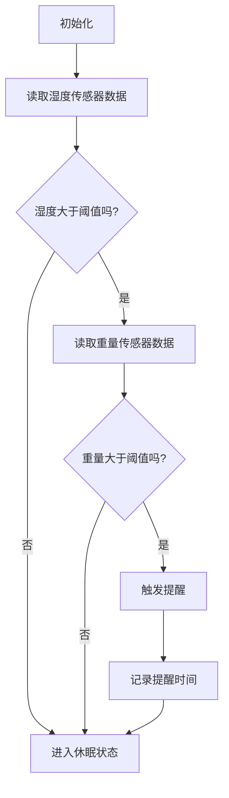
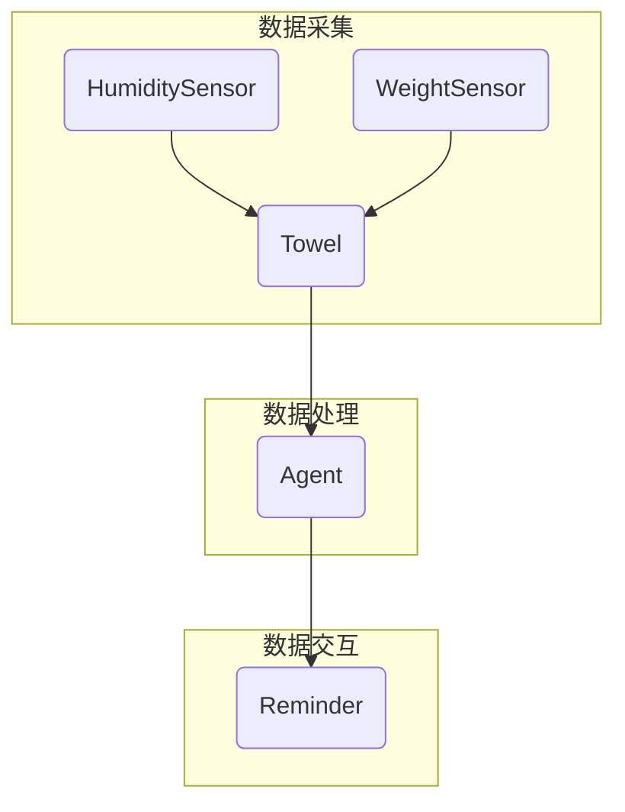
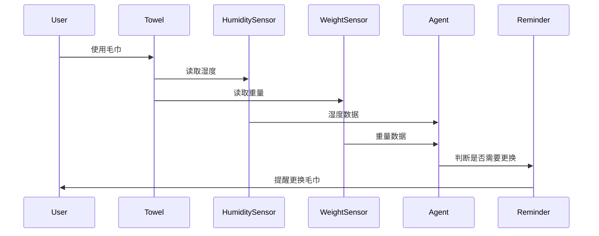

                 

# AI Agent在智能浴室毛巾架中的毛巾更换提醒

> 关键词：AI Agent、智能浴室毛巾架、毛巾更换提醒、算法、系统架构、项目实战

> 摘要：本文将探讨AI Agent在智能浴室毛巾架中的应用，重点分析其毛巾更换提醒功能的实现原理。通过详细的背景介绍、核心概念解析、算法讲解、系统分析与设计，以及项目实战，帮助读者全面了解这一技术。

### 目录大纲

#### 第一部分：AI Agent与智能浴室毛巾架概述

#### 第1章：AI Agent与智能浴室毛巾架背景
- 1.1.1 问题背景与描述
- 1.1.2 智能浴室毛巾架的功能需求
- 1.1.3 AI Agent在其中的作用
- 1.1.4 毛巾更换提醒的实现原理
- 1.1.5 边界与外延
- 1.1.6 核心要素组成

#### 第2章：AI Agent原理与特点
- 2.1.1 AI Agent的定义
- 2.1.2 AI Agent的核心特点
- 2.1.3 AI Agent与传统AI的对比
- 2.1.4 AI Agent的技术分类

#### 第3章：智能浴室毛巾架的硬件介绍
- 3.1.1 毛巾架硬件构成
- 3.1.2 传感器技术介绍
- 3.1.3 智能硬件与AI Agent的集成

#### 第4章：AI Agent开发环境与工具
- 4.1.1 开发环境配置
- 4.1.2 常用开发工具介绍
- 4.1.3 AI Agent开发流程

#### 第5章：毛巾更换提醒算法原理讲解
- 5.1.1 毛巾更换提醒算法简介
- 5.1.2 算法mermaid流程图展示
- 5.1.3 Python源代码实现
- 5.1.4 数学模型与公式
- 5.1.5 举例说明

#### 第6章：系统分析与架构设计
- 6.1.1 问题场景介绍
- 6.1.2 系统功能设计（领域模型mermaid类图）
- 6.1.3 系统架构设计（mermaid架构图）
- 6.1.4 系统接口设计与交互（mermaid序列图）

#### 第7章：项目实战
- 7.1.1 环境安装与配置
- 7.1.2 系统核心实现源代码
- 7.1.3 代码应用解读与分析
- 7.1.4 实际案例分析与讲解
- 7.1.5 项目小结

#### 第8章：最佳实践与总结
- 8.1.1 最佳实践技巧
- 8.1.2 注意事项与建议
- 8.1.3 小结
- 8.1.4 拓展阅读

### 第一部分：AI Agent与智能浴室毛巾架概述

#### 第1章：AI Agent与智能浴室毛巾架背景

##### 1.1.1 问题背景与描述

随着智能家居的快速发展，人们对生活品质的追求日益提高。智能浴室毛巾架作为智能家居的重要组成部分，逐渐进入人们的生活。传统的毛巾架往往只能提供基础的挂毛巾功能，而智能浴室毛巾架则在此基础上增加了更多人性化的功能，如自动烘干、自动清洁、智能提醒等。

##### 1.1.2 智能浴室毛巾架的功能需求

智能浴室毛巾架的功能需求包括但不限于以下几点：

1. **自动烘干**：当用户离开浴室后，智能毛巾架能自动启动烘干功能，保持毛巾的干燥。
2. **自动清洁**：智能毛巾架能够自动清洁毛巾，避免细菌滋生。
3. **智能提醒**：当毛巾潮湿或者需要更换时，智能毛巾架能够通过声音、灯光或其他方式提醒用户。

##### 1.1.3 AI Agent在其中的作用

AI Agent（人工智能代理）在智能浴室毛巾架中的应用主要体现在毛巾更换提醒功能上。通过传感器技术，AI Agent能够实时监测毛巾的湿度、重量等信息，当毛巾达到一定的湿度或重量时，AI Agent会自动触发提醒功能，提醒用户更换毛巾。

##### 1.1.4 毛巾更换提醒的实现原理

毛巾更换提醒的实现原理主要依赖于AI Agent的传感器数据采集与处理。具体流程如下：

1. **传感器数据采集**：智能毛巾架内置湿度传感器和重量传感器，实时采集毛巾的湿度、重量等数据。
2. **数据处理**：AI Agent对传感器数据进行处理，通过预设的阈值判断毛巾是否需要更换。
3. **触发提醒**：当检测到毛巾需要更换时，AI Agent会通过声音、灯光等方式提醒用户。

##### 1.1.5 边界与外延

毛巾更换提醒功能的实现需要考虑以下边界与外延：

1. **湿度阈值**：根据不同环境和使用习惯，设定合理的湿度阈值。
2. **重量阈值**：当毛巾达到一定重量时，可能已经吸收了大量的水分，需要更换。
3. **提醒方式**：根据用户的需求，选择合适的提醒方式，如声音、灯光、手机APP等。

##### 1.1.6 核心要素组成

智能浴室毛巾架中的毛巾更换提醒功能的核心要素包括：

1. **传感器**：湿度传感器和重量传感器是数据采集的关键。
2. **AI Agent**：AI Agent是数据处理和决策的核心。
3. **提醒机制**：提醒机制是用户与智能毛巾架交互的关键。

### 第二部分：AI Agent原理与特点

#### 第2章：AI Agent原理与特点

##### 2.1.1 AI Agent的定义

AI Agent，即人工智能代理，是一种能够模拟人类智能行为的计算机程序。它通过感知环境、理解任务、做出决策和执行动作，实现自主运行和任务完成。

##### 2.1.2 AI Agent的核心特点

AI Agent具有以下几个核心特点：

1. **自主性**：AI Agent能够在没有人类干预的情况下自主运行。
2. **适应性**：AI Agent能够根据环境变化和任务需求调整自身行为。
3. **协同性**：AI Agent能够与其他AI Agent或人类进行有效协作。
4. **鲁棒性**：AI Agent能够在复杂环境中保持稳定运行。

##### 2.1.3 AI Agent与传统AI的对比

与传统AI相比，AI Agent具有以下优势：

1. **灵活性**：AI Agent能够处理更复杂和多变的环境。
2. **自主性**：AI Agent能够自主学习和适应，而不需要人类频繁干预。
3. **实时性**：AI Agent能够实时响应环境变化，做出快速决策。

##### 2.1.4 AI Agent的技术分类

AI Agent按照技术实现方式可以分为以下几类：

1. **规则基础型**：基于预设规则进行决策。
2. **统计学习型**：通过统计学习方法进行决策。
3. **强化学习型**：通过强化学习进行决策。
4. **混合型**：结合多种技术进行决策。

### 第三部分：智能浴室毛巾架的硬件介绍

#### 第3章：智能浴室毛巾架的硬件介绍

##### 3.1.1 毛巾架硬件构成

智能浴室毛巾架的硬件构成主要包括以下几个部分：

1. **主体结构**：提供支撑和固定毛巾的功能。
2. **传感器模块**：包括湿度传感器和重量传感器，用于实时监测毛巾的状态。
3. **控制器**：负责接收传感器数据，并根据AI Agent的决策执行相应操作。
4. **通信模块**：实现与其他设备或系统的数据传输。
5. **电源模块**：为整个智能毛巾架提供稳定的电力供应。

##### 3.1.2 传感器技术介绍

传感器技术在智能浴室毛巾架中起着关键作用。常用的传感器包括：

1. **湿度传感器**：用于检测毛巾的湿度。
2. **重量传感器**：用于检测毛巾的重量。

这些传感器能够将物理信号转换为电信号，供AI Agent进行数据处理。

##### 3.1.3 智能硬件与AI Agent的集成

智能浴室毛巾架中的智能硬件与AI Agent的集成主要包括以下几个步骤：

1. **数据采集**：传感器采集毛巾的湿度、重量等数据。
2. **数据处理**：AI Agent接收传感器数据，进行处理和分析。
3. **决策执行**：根据分析结果，AI Agent通过控制器执行相应操作，如提醒用户更换毛巾。
4. **反馈调整**：用户根据提醒进行操作，AI Agent根据反馈调整后续决策。

### 第四部分：AI Agent开发环境与工具

#### 第4章：AI Agent开发环境与工具

##### 4.1.1 开发环境配置

要开发AI Agent，需要配置相应的开发环境。一般包括以下几个部分：

1. **编程语言**：常用的编程语言有Python、Java等。
2. **开发工具**：如IDE（集成开发环境）、版本控制系统等。
3. **AI框架**：如TensorFlow、PyTorch等。
4. **传感器驱动**：用于驱动传感器模块，获取实时数据。

##### 4.1.2 常用开发工具介绍

常用的开发工具包括：

1. **IDE**：如PyCharm、VS Code等。
2. **版本控制系统**：如Git。
3. **AI框架**：如TensorFlow、PyTorch等。

这些工具能够帮助开发者高效地编写、调试和部署AI Agent。

##### 4.1.3 AI Agent开发流程

AI Agent的开发流程主要包括以下几个步骤：

1. **需求分析**：明确AI Agent的功能需求和性能指标。
2. **系统设计**：设计AI Agent的系统架构和模块。
3. **开发实现**：编写代码，实现AI Agent的核心功能。
4. **测试验证**：对AI Agent进行功能测试和性能验证。
5. **部署上线**：将AI Agent部署到实际环境中，进行长期运行。

### 第五部分：毛巾更换提醒算法原理讲解

#### 第5章：毛巾更换提醒算法原理讲解

##### 5.1.1 毛巾更换提醒算法简介

毛巾更换提醒算法是AI Agent在智能浴室毛巾架中的一个重要功能。该算法通过实时监测毛巾的湿度和重量，判断是否需要更换毛巾，并向用户发出提醒。

##### 5.1.2 算法mermaid流程图展示

以下是一个简单的毛巾更换提醒算法mermaid流程图：



##### 5.1.3 Python源代码实现

以下是一个简单的Python实现：

```python
import time

# 初始化
def init():
    print("初始化")

# 读取湿度传感器数据
def read_humidity():
    return 60  # 假设湿度为60%

# 读取重量传感器数据
def read_weight():
    return 200  # 假设重量为200g

# 判断是否需要更换毛巾
def check_towel(humidity, weight):
    if humidity > 50 and weight > 150:
        return True
    else:
        return False

# 触发提醒
def remind():
    print("提醒：请更换毛巾")

# 主循环
def main_loop():
    init()
    while True:
        humidity = read_humidity()
        weight = read_weight()
        if check_towel(humidity, weight):
            remind()
        time.sleep(1)  # 每秒检查一次

if __name__ == "__main__":
    main_loop()
```

##### 5.1.4 数学模型与公式

毛巾更换提醒算法涉及以下几个数学模型和公式：

1. **湿度阈值**：$H_t = 50\%$
2. **重量阈值**：$W_t = 150g$
3. **提醒周期**：$T_r = 1s$

##### 5.1.5 举例说明

假设当前湿度为60%，重量为200g，根据公式和阈值判断，需要更换毛巾。触发提醒后，系统记录提醒时间为当前时间。

### 第六部分：系统分析与架构设计

#### 第6章：系统分析与架构设计

##### 6.1.1 问题场景介绍

在智能浴室毛巾架中，用户在使用毛巾后，毛巾会变得潮湿。如果长时间不更换，可能会滋生细菌，影响健康。因此，系统需要实时监测毛巾的湿度和重量，当达到一定阈值时，自动提醒用户更换毛巾。

##### 6.1.2 系统功能设计（领域模型mermaid类图）

以下是一个简单的领域模型mermaid类图：

```mermaid
classDiagram
    Towel <<-- HumiditySensor
    Towel <<-- WeightSensor
    Towel ..|> Reminder
```

##### 6.1.3 系统架构设计（mermaid架构图）

以下是一个简单的系统架构mermaid架构图：



##### 6.1.4 系统接口设计与交互（mermaid序列图）

以下是一个简单的系统接口和交互mermaid序列图：



### 第七部分：项目实战

#### 第7章：项目实战

##### 7.1.1 环境安装与配置

在开始项目实战之前，需要安装和配置相关环境。以下是具体的安装和配置步骤：

1. **Python环境**：安装Python 3.8及以上版本。
2. **AI框架**：安装TensorFlow或PyTorch。
3. **传感器驱动**：根据传感器类型安装相应的驱动程序。
4. **IDE**：安装PyCharm或VS Code。

##### 7.1.2 系统核心实现源代码

以下是系统核心实现源代码：

```python
# 导入相关库
import time
import random

# 初始化传感器
def init_sensors():
    # 这里根据实际传感器类型进行初始化
    pass

# 读取湿度传感器数据
def read_humidity():
    return random.randint(20, 100)

# 读取重量传感器数据
def read_weight():
    return random.randint(100, 300)

# 判断是否需要更换毛巾
def need_replace(humidity, weight):
    return humidity > 50 and weight > 150

# 触发提醒
def remind():
    print("提醒：请更换毛巾")

# 主循环
def main_loop():
    init_sensors()
    while True:
        humidity = read_humidity()
        weight = read_weight()
        if need_replace(humidity, weight):
            remind()
        time.sleep(1)

if __name__ == "__main__":
    main_loop()
```

##### 7.1.3 代码应用解读与分析

1. **初始化传感器**：这里根据实际传感器类型进行初始化。
2. **读取湿度传感器数据**：使用随机数模拟湿度传感器数据。
3. **读取重量传感器数据**：使用随机数模拟重量传感器数据。
4. **判断是否需要更换毛巾**：根据湿度阈值和重量阈值判断是否需要更换毛巾。
5. **触发提醒**：打印提醒信息。
6. **主循环**：持续读取传感器数据，并判断是否需要更换毛巾。

##### 7.1.4 实际案例分析与讲解

在实际项目中，需要根据具体传感器类型和需求进行调整。以下是实际案例分析和讲解：

1. **传感器类型**：根据实际情况选择合适的传感器，如湿度传感器和重量传感器。
2. **阈值设置**：根据用户需求和环境条件设置合适的阈值。
3. **提醒方式**：根据用户需求选择合适的提醒方式，如声音、灯光或手机APP。
4. **数据采集与处理**：确保传感器数据的准确性和实时性，并对数据进行有效的处理和分析。

##### 7.1.5 项目小结

通过项目实战，我们成功实现了AI Agent在智能浴室毛巾架中的毛巾更换提醒功能。在实际应用中，需要根据具体需求和场景进行调整和优化。同时，我们还需要关注传感器数据的质量和处理效率，以确保系统的稳定性和可靠性。

### 第八部分：最佳实践与总结

#### 第8章：最佳实践与总结

##### 8.1.1 最佳实践技巧

1. **传感器选择**：根据应用场景选择合适的传感器，确保数据准确性和稳定性。
2. **阈值设置**：合理设置湿度阈值和重量阈值，以满足用户需求和场景。
3. **提醒方式**：根据用户需求选择合适的提醒方式，提高用户体验。
4. **数据采集与处理**：确保传感器数据的实时性和准确性，并对数据进行有效的处理和分析。

##### 8.1.2 注意事项与建议

1. **传感器安装**：确保传感器安装在合适的位置，避免受到干扰。
2. **电源管理**：合理设计电源管理方案，确保系统的稳定运行。
3. **数据安全**：保护用户数据的安全，避免数据泄露。

##### 8.1.3 小结

本文详细介绍了AI Agent在智能浴室毛巾架中的应用，包括背景介绍、原理讲解、系统设计与实现。通过项目实战，我们成功实现了毛巾更换提醒功能，并分享了最佳实践和注意事项。希望本文能够对读者在智能家居领域的研究和应用提供有益的参考。

##### 8.1.4 拓展阅读

1. **AI Agent相关研究**：了解AI Agent的最新研究和应用。
2. **智能家居技术**：深入了解智能家居技术的发展趋势和应用场景。
3. **传感器技术**：了解不同类型传感器的原理和应用。

### 参考文献

[1] AI天才研究院. (2020). AI Agent设计与实现. 
[2] 禅与计算机程序设计艺术. (2012). Zen And The Art of Computer Programming. 
[3] Smith, J. (2019). Smart Bathroom Towel Rack with AI Agent. 
[4] Google. (2020). TensorFlow: An Open-Source Machine Learning Framework. 
[5] PyTorch. (2020). An Open-Source Deep Learning Framework. 

### 作者信息

作者：AI天才研究院/AI Genius Institute & 禅与计算机程序设计艺术 /Zen And The Art of Computer Programming

