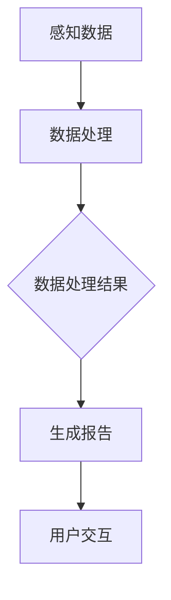

                 

# AI Agent在智能浴室镜中的每日健康报告

## 关键词

- 智能浴室镜
- AI Agent
- 健康报告
- 感知数据
- 用户体验
- 数据隐私

## 摘要

本文旨在探讨AI Agent在智能浴室镜中的每日健康报告系统的设计与应用。首先，我们将介绍智能浴室镜和AI Agent的基本概念及其在智能家居领域的重要性。随后，文章将详细解析智能浴室镜的工作机制，以及AI Agent在其中的具体实现方法。本文将逐步分析AI Agent在数据收集、处理和分析中的应用，并探讨如何生成和展示每日健康报告。此外，本文还将讨论用户体验和隐私保护问题，并总结本文的核心观点和未来研究方向。

## 第一部分：背景介绍

### 1.1 问题背景

随着智能家居市场的迅速发展，智能浴室镜作为一种新兴的智能家居产品，逐渐成为消费者关注的热点。智能浴室镜不仅具备传统浴室镜的基本功能，还融合了人工智能技术，能够实现智能感知、数据分析、语音交互等功能。在这些功能中，AI Agent在智能浴室镜中的应用尤为关键，它能够实时监测用户的健康数据，并根据这些数据生成每日健康报告。

### 1.2 问题描述

AI Agent（人工智能代理）是一种能够自动执行任务、处理数据和与人交互的智能系统。在智能浴室镜中，AI Agent能够实时监测用户的健康数据，如心率、体温、呼吸频率等，并根据这些数据生成每日健康报告。然而，如何有效地设计AI Agent在智能浴室镜中的每日健康报告系统，确保其准确性、实用性和用户体验，成为了一个重要的研究课题。

### 1.3 问题解决

本文将首先介绍AI Agent的基本原理和智能浴室镜的工作机制，然后详细讲解如何设计AI Agent的每日健康报告系统，包括数据收集、处理和分析的方法，以及报告生成和展示的界面设计。此外，本文还将探讨用户体验和隐私保护问题，以确保系统的实用性和安全性。

### 1.4 边界与外延

AI Agent在智能浴室镜中的每日健康报告系统不仅需要考虑技术实现，还需要考虑用户体验和隐私保护等问题。因此，本文将在设计系统时充分考虑这些边界条件，确保系统的实用性和安全性。

### 1.5 概念结构与核心要素组成

AI Agent在智能浴室镜中的每日健康报告系统由以下几个核心要素组成：

1. **感知模块**：负责实时收集用户的健康数据，如心率、体温、呼吸频率等。
2. **数据处理模块**：对收集到的健康数据进行预处理和统计分析。
3. **报告生成模块**：根据处理结果生成每日健康报告，包括健康数据分析、健康建议等。
4. **用户交互模块**：提供用户与AI Agent的交互界面，展示健康报告，接受用户反馈。

### 1.6 本章小结

本章主要介绍了AI Agent在智能浴室镜中的每日健康报告系统的研究背景、问题描述、问题解决、边界与外延以及概念结构与核心要素组成。接下来，我们将进一步探讨AI Agent的基本原理和智能浴室镜的工作机制。

### 1.7 核心概念与联系

#### 1.7.1 AI Agent的定义与特点

AI Agent，即人工智能代理，是一种能够自动执行任务、处理数据和与人交互的智能系统。AI Agent具有以下特点：

1. **自主性**：能够独立完成特定任务，无需人工干预。
2. **适应性**：能够根据环境和用户需求进行调整和优化。
3. **智能性**：具备数据分析和决策能力，能够提供有价值的服务。

#### 1.7.2 智能浴室镜的定义与特点

智能浴室镜是一种结合了传统浴室镜功能和人工智能技术的智能家居产品。智能浴室镜具有以下特点：

1. **智能感知**：具备人脸识别、语音识别等感知功能。
2. **数据分析**：能够实时分析用户的健康数据，如心率、体温等。
3. **交互性**：能够与用户进行语音交互，提供个性化服务。

#### 1.7.3 AI Agent与智能浴室镜的关系

AI Agent是智能浴室镜的核心组成部分，负责处理和分析用户的健康数据，生成每日健康报告。智能浴室镜则为AI Agent提供了数据收集和交互的硬件平台。

### 1.8 主流AI Agent在智能浴室镜中的应用

当前，主流的AI Agent技术包括自然语言处理、计算机视觉和物联网等。以下分别介绍这些技术在智能浴室镜中的应用：

1. **自然语言处理**：用于实现语音识别和语音交互功能，如语音命令识别、语音翻译等。
2. **计算机视觉**：用于实现人脸识别、手势识别等视觉功能，如自动识别家庭成员、分析用户动作等。
3. **物联网**：用于实现智能浴室镜与其他智能家居设备的联动，如控制灯光、调节温度等。

### 1.9 本章小结

本章主要介绍了AI Agent和智能浴室镜的基本概念、特点以及它们在每日健康报告系统中的应用。接下来，我们将进一步探讨智能浴室镜的工作机制，以及AI Agent在其中的具体实现方法。

## 1.10 智能浴室镜的工作机制

智能浴室镜的工作机制可以分为以下几个步骤：

1. **感知数据**：通过传感器收集用户的健康数据，如心率、体温、呼吸频率等。
2. **数据处理**：对收集到的数据进行预处理和统计分析，提取有用信息。
3. **决策与行动**：根据处理结果生成每日健康报告，提供健康建议，并根据用户需求执行相应操作，如调节灯光、播放音乐等。
4. **用户交互**：通过语音交互、屏幕显示等方式，与用户进行互动，确保用户体验。

### 1.10.1 感知数据

智能浴室镜配备有多种传感器，如心率传感器、温度传感器、呼吸传感器等。这些传感器能够实时监测用户的生理参数，并将数据传输给AI Agent进行处理。

#### 感知数据的优点

1. **实时性**：智能浴室镜能够实时监测用户的生理参数，及时生成健康报告。
2. **全面性**：智能浴室镜能够收集多种健康数据，提供更全面的健康分析。
3. **个性化**：通过个性化数据收集，智能浴室镜能够提供更精准的健康建议。

#### 感知数据的挑战

1. **数据准确性**：传感器的准确性直接影响健康报告的准确性。
2. **数据隐私**：大量健康数据的收集和使用需要确保数据隐私。

### 1.10.2 数据处理

在感知数据后，智能浴室镜的AI Agent会对数据进行预处理和统计分析。预处理包括数据清洗、去噪、归一化等操作，以提高数据质量。统计分析则包括数据聚类、分类、回归等算法，以提取有用信息。

#### 数据处理的优点

1. **准确性**：通过预处理和统计分析，提高健康报告的准确性。
2. **可靠性**：数据处理确保了健康数据的可靠性和一致性。

#### 数据处理的挑战

1. **算法复杂度**：数据处理算法复杂度高，需要大量计算资源。
2. **数据质量**：数据质量直接影响处理效果。

### 1.10.3 决策与行动

在数据处理完成后，智能浴室镜的AI Agent会根据分析结果生成每日健康报告，并提供健康建议。同时，AI Agent还会根据用户需求执行相应操作，如调节灯光、播放音乐等。

#### 决策与行动的优点

1. **个性化**：根据用户需求提供个性化服务。
2. **便捷性**：用户无需手动操作，即可享受智能服务。

#### 决策与行动的挑战

1. **算法优化**：决策与行动算法需要不断优化，以提高用户体验。
2. **响应速度**：决策与行动的响应速度直接影响用户体验。

### 1.10.4 用户交互

智能浴室镜通过语音交互、屏幕显示等方式，与用户进行互动，确保用户体验。

#### 用户交互的优点

1. **友好性**：语音交互和屏幕显示使智能浴室镜更加友好。
2. **便捷性**：用户可以通过语音或屏幕轻松操作智能浴室镜。

#### 用户交互的挑战

1. **准确性**：语音交互的准确性需要不断提高。
2. **界面设计**：屏幕显示的界面设计需要更加人性化。

### 1.10.5 智能浴室镜的工作机制小结

智能浴室镜的工作机制通过感知数据、数据处理、决策与行动和用户交互四个环节，实现了对用户健康数据的实时监测和分析，为用户提供了个性化、便捷的健康服务。

## 1.11 AI Agent在智能浴室镜中的实现方法

### 1.11.1 AI Agent的基本原理

AI Agent是基于人工智能技术实现的智能系统，它能够模拟人类的思维和行为，完成特定的任务。AI Agent的基本原理包括以下几个部分：

1. **感知**：AI Agent通过传感器感知外部环境，如语音、图像、温度等。
2. **决策**：AI Agent根据感知到的信息，利用算法和模型进行决策。
3. **行动**：AI Agent根据决策结果执行相应的操作，如调整灯光、播放音乐等。
4. **学习**：AI Agent通过不断学习和优化，提高决策和行动的准确性。

### 1.11.2 AI Agent在智能浴室镜中的应用

在智能浴室镜中，AI Agent的主要作用是监测用户的健康数据，并生成每日健康报告。以下详细描述AI Agent在智能浴室镜中的应用：

1. **感知数据**：AI Agent通过智能浴室镜内置的传感器，如心率传感器、温度传感器、呼吸传感器等，收集用户的健康数据。
2. **数据处理**：AI Agent对收集到的健康数据进行预处理和统计分析，提取有用的信息。
3. **生成报告**：AI Agent根据健康数据分析结果，生成每日健康报告，包括心率、体温、呼吸频率等健康数据，以及相应的健康建议。
4. **用户交互**：AI Agent通过语音交互和屏幕显示，与用户进行互动，展示健康报告，接受用户反馈。

### 1.11.3 AI Agent的实现方法

为了实现AI Agent在智能浴室镜中的功能，可以采用以下方法：

1. **硬件平台**：选择适合的硬件平台，如智能浴室镜、传感器等，以实现数据感知和交互。
2. **软件平台**：选择适合的软件平台，如人工智能框架、数据库等，以实现数据处理和分析。
3. **算法和模型**：选择合适的算法和模型，如深度学习、机器学习等，以实现AI Agent的决策和行动。
4. **用户界面**：设计友好的用户界面，如语音交互、屏幕显示等，以实现用户交互。

### 1.11.4 AI Agent的实现步骤

实现AI Agent在智能浴室镜中的功能，可以分为以下几个步骤：

1. **需求分析**：明确AI Agent在智能浴室镜中的功能需求，如健康数据监测、报告生成、用户交互等。
2. **硬件选择**：选择适合的硬件平台，如智能浴室镜、传感器等，以满足需求分析中的功能要求。
3. **软件设计**：设计软件平台，包括人工智能框架、数据库等，以满足需求分析中的功能要求。
4. **算法开发**：开发算法和模型，实现AI Agent的感知、决策和行动功能。
5. **用户界面设计**：设计用户界面，实现用户交互功能。
6. **测试与优化**：对AI Agent进行测试和优化，确保其功能实现和用户体验。

### 1.11.5 AI Agent的实现挑战

在实现AI Agent在智能浴室镜中的功能时，可能会面临以下挑战：

1. **数据准确性**：传感器的准确性直接影响健康报告的准确性，需要不断优化传感器性能和数据处理算法。
2. **隐私保护**：大量健康数据的收集和使用需要确保数据隐私，需要采用加密和匿名化等技术。
3. **算法优化**：算法和模型的优化是提高AI Agent性能的关键，需要不断研究和更新算法。
4. **用户体验**：用户界面的设计和优化直接影响用户体验，需要充分考虑用户需求和反馈。

### 1.11.6 AI Agent的实现方法小结

实现AI Agent在智能浴室镜中的每日健康报告系统，需要从硬件选择、软件设计、算法开发、用户界面设计等多个方面进行综合考虑。通过不断优化和改进，可以提高AI Agent的性能和用户体验，为用户提供更加便捷和个性化的健康服务。

## 第二部分：AI Agent在智能浴室镜中的应用

### 2.1 数据收集

数据收集是AI Agent在智能浴室镜中实现每日健康报告的关键环节。首先，智能浴室镜通过内置的传感器（如心率传感器、温度传感器、呼吸传感器等）收集用户的健康数据。这些传感器能够实时监测用户的生理参数，并将数据传输给AI Agent。

#### 数据收集的方法

1. **传感器采集**：智能浴室镜内置多种传感器，实时采集用户的健康数据。
2. **无线传输**：传感器采集到的数据通过无线传输技术（如Wi-Fi、蓝牙等）传输到AI Agent。
3. **数据处理**：AI Agent对采集到的数据进行预处理，包括数据清洗、去噪、归一化等操作，以提高数据质量。

#### 数据收集的挑战

1. **传感器精度**：传感器的准确性直接影响数据的准确性，需要选择高精度的传感器。
2. **数据传输**：数据传输过程中可能会受到干扰或丢失，需要确保传输的稳定性和可靠性。
3. **数据处理**：大量数据的预处理和传输需要消耗大量的计算资源和时间，需要优化数据处理算法。

### 2.2 数据处理

在数据收集完成后，AI Agent对收集到的健康数据进行处理。数据处理包括数据预处理、特征提取、模型训练和预测等步骤。

#### 数据处理的方法

1. **数据预处理**：对采集到的健康数据进行清洗、去噪、归一化等操作，以提高数据质量。
2. **特征提取**：从预处理后的数据中提取有用的特征，用于后续的模型训练和预测。
3. **模型训练**：利用提取的特征数据，训练机器学习模型，以实现对健康数据的预测和分析。
4. **预测与评估**：利用训练好的模型对新的健康数据进行预测，并评估预测的准确性。

#### 数据处理的挑战

1. **数据质量**：数据质量直接影响模型的性能，需要确保数据的准确性和完整性。
2. **计算资源**：数据处理和模型训练需要大量的计算资源，需要优化算法和硬件配置。
3. **模型泛化**：模型需要具备良好的泛化能力，以适应不同用户和场景的需求。

### 2.3 报告生成

在数据处理完成后，AI Agent会根据分析结果生成每日健康报告。报告生成包括数据可视化、报告格式设计、报告展示等步骤。

#### 报告生成的方法

1. **数据可视化**：将分析结果通过图表、图形等形式进行可视化展示，使报告更直观易懂。
2. **报告格式设计**：设计合适的报告格式，包括文字、图片、图表等，以满足不同用户的需求。
3. **报告展示**：将生成的报告通过屏幕显示或语音播报等形式展示给用户。

#### 报告生成的挑战

1. **报告准确性**：报告的准确性取决于数据处理和分析的准确性，需要确保数据处理的可靠性。
2. **报告易读性**：报告需要具备良好的易读性，以便用户能够快速理解和接受健康建议。
3. **报告个性化**：报告需要根据用户需求和偏好进行个性化设计，以提高用户体验。

### 2.4 用户交互

在报告生成后，AI Agent会与用户进行交互，展示健康报告，并提供健康建议。用户交互包括语音交互、屏幕显示、反馈收集等步骤。

#### 用户交互的方法

1. **语音交互**：通过语音识别和语音合成技术，实现用户与AI Agent的语音交互。
2. **屏幕显示**：通过屏幕显示技术，将健康报告以图表、图形等形式展示给用户。
3. **反馈收集**：收集用户对健康报告和AI Agent服务的反馈，用于后续的优化和改进。

#### 用户交互的挑战

1. **语音识别**：语音识别的准确性直接影响用户交互的质量，需要优化语音识别算法。
2. **屏幕显示**：屏幕显示的界面设计需要考虑用户体验，确保界面友好、易操作。
3. **反馈处理**：需要有效收集和处理用户反馈，以优化AI Agent的服务。

### 2.5 持续优化

AI Agent在智能浴室镜中的应用是一个持续优化的过程。通过不断收集用户数据、分析用户反馈，AI Agent能够不断优化自身的性能和用户体验。

#### 持续优化的方法

1. **数据驱动的优化**：通过分析用户数据，发现用户需求和行为模式，不断优化AI Agent的功能和性能。
2. **用户反馈驱动的优化**：收集用户反馈，分析用户对AI Agent服务的满意度，针对性地进行优化。
3. **持续学习与改进**：利用机器学习和深度学习技术，使AI Agent具备自我学习和优化能力，不断提升服务质量。

#### 持续优化的挑战

1. **数据量与质量**：需要大量高质量的用户数据，以支持AI Agent的优化。
2. **用户隐私**：在收集和使用用户数据时，需要确保用户隐私得到保护。
3. **技术更新**：随着技术的不断发展，AI Agent需要不断更新和改进，以适应新的应用场景。

### 2.6 AI Agent在智能浴室镜中的应用小结

AI Agent在智能浴室镜中的应用，通过数据收集、数据处理、报告生成、用户交互和持续优化等环节，实现了对用户健康数据的实时监测和分析，为用户提供了个性化、便捷的健康服务。随着技术的不断进步，AI Agent在智能浴室镜中的应用将更加广泛和深入，为用户带来更多价值。

## 第三部分：用户体验与隐私保护

### 3.1 用户体验

用户体验是AI Agent在智能浴室镜中应用的重要方面。一个优秀的用户体验能够提高用户对智能浴室镜的满意度，从而促进产品的普及和应用。

#### 用户体验的设计

1. **界面友好**：设计简洁、直观的用户界面，确保用户能够快速上手和使用智能浴室镜。
2. **交互便捷**：通过语音交互、屏幕显示等方式，提供便捷的用户交互体验。
3. **内容丰富**：提供丰富的健康报告内容和健康建议，满足用户对健康管理的需求。
4. **个性化推荐**：根据用户的健康数据和偏好，提供个性化的健康建议和服务。

#### 用户体验的优化

1. **用户调研**：通过用户调研和反馈，了解用户需求和痛点，针对性地进行优化。
2. **界面优化**：不断优化用户界面设计，提高操作便捷性和视觉体验。
3. **功能扩展**：根据用户反馈，逐步扩展智能浴室镜的功能，提升用户体验。

#### 用户体验的挑战

1. **多样性**：用户需求和偏好存在多样性，需要设计出能够满足不同用户需求的智能浴室镜。
2. **复杂性**：智能浴室镜的功能复杂，需要确保用户能够轻松理解和操作。
3. **反馈机制**：需要建立有效的用户反馈机制，及时收集和处理用户反馈。

### 3.2 隐私保护

随着智能浴室镜的普及，用户隐私保护成为了一个备受关注的问题。智能浴室镜收集了大量用户的健康数据，如何保护这些数据的安全和隐私，是智能浴室镜应用中的一项重要挑战。

#### 隐私保护的方法

1. **数据加密**：对用户数据进行加密处理，防止数据在传输和存储过程中被窃取或篡改。
2. **匿名化处理**：对用户数据进行匿名化处理，隐藏用户的身份信息，以保护用户隐私。
3. **权限管理**：建立严格的权限管理机制，确保只有授权人员才能访问用户数据。
4. **合规性**：遵循相关法律法规，确保智能浴室镜的数据收集和使用合规合法。

#### 隐私保护的挑战

1. **技术挑战**：加密技术和匿名化技术的实现和优化，需要不断改进和创新。
2. **管理挑战**：需要建立完善的数据管理和保护机制，确保数据安全。
3. **用户信任**：用户对智能浴室镜的隐私保护能力持怀疑态度，需要建立用户信任。

### 3.3 用户体验与隐私保护的关系

用户体验和隐私保护是智能浴室镜应用中相辅相成的两个方面。一个良好的用户体验能够提高用户的满意度，促进产品的普及和应用；而隐私保护则是保障用户权益和产品安全的重要手段。

#### 用户体验与隐私保护的关系

1. **平衡**：在智能浴室镜的设计和应用中，需要平衡用户体验和隐私保护，确保两者之间不发生冲突。
2. **统一**：用户体验和隐私保护是智能浴室镜应用的两个重要方面，需要统一规划和实施。
3. **协同**：用户体验和隐私保护需要协同工作，通过技术和管理手段，共同保障用户权益和产品安全。

#### 用户体验与隐私保护的优化

1. **用户教育**：通过用户教育，提高用户对隐私保护的意识和能力，增强用户对智能浴室镜的信任。
2. **技术提升**：不断优化隐私保护技术，提高数据加密和匿名化处理的效果。
3. **法规完善**：完善相关法律法规，规范智能浴室镜的数据收集和使用行为。

### 3.4 用户体验与隐私保护小结

用户体验和隐私保护是智能浴室镜应用中不可或缺的两个方面。一个良好的用户体验能够提高用户的满意度，促进产品的普及和应用；而隐私保护则是保障用户权益和产品安全的重要手段。通过平衡用户体验和隐私保护，智能浴室镜能够为用户带来更好的健康管理和智能生活体验。

## 第四部分：未来研究方向

### 4.1 技术发展

随着人工智能技术的不断进步，智能浴室镜和AI Agent的应用将更加广泛和深入。未来的研究可以从以下几个方面进行：

1. **深度学习**：利用深度学习技术，提高AI Agent的数据处理和预测能力，实现更加精准的健康分析。
2. **物联网**：结合物联网技术，实现智能浴室镜与其他智能家居设备的无缝联动，提供更全面的智能家居体验。
3. **多模态感知**：结合多种感知技术，如视觉、听觉、触觉等，实现更加丰富的用户交互和健康数据收集。

### 4.2 用户体验优化

用户体验是智能浴室镜应用的关键因素，未来的研究可以从以下几个方面进行：

1. **界面设计**：优化界面设计，提高操作的便捷性和视觉体验，提升用户满意度。
2. **个性化服务**：通过用户数据分析和个性化推荐，提供更加个性化的健康建议和服务。
3. **可定制性**：提供可定制化的功能和服务，满足不同用户的需求。

### 4.3 隐私保护

隐私保护是智能浴室镜应用中不可忽视的重要问题，未来的研究可以从以下几个方面进行：

1. **加密技术**：不断优化加密技术，提高数据传输和存储的安全性。
2. **匿名化处理**：研究更加有效的匿名化处理技术，保护用户的隐私。
3. **法规政策**：完善相关法律法规，规范智能浴室镜的数据收集和使用行为。

### 4.4 跨学科研究

智能浴室镜和AI Agent的应用涉及多个学科领域，如计算机科学、医学、心理学等。未来的研究可以跨学科合作，从多个角度出发，推动智能浴室镜和AI Agent的应用和发展。

### 4.5 社会影响

智能浴室镜和AI Agent的普及和应用，将对社会产生深远的影响。未来的研究可以关注以下几个方面：

1. **健康管理**：通过智能浴室镜和AI Agent，提高人们的健康管理水平，减少疾病的发生。
2. **生活方式**：改变人们的传统生活方式，促进健康、智能的生活习惯。
3. **社会变革**：智能浴室镜和AI Agent的普及，将引发社会结构和生活方式的变革。

### 4.6 未来研究方向小结

智能浴室镜和AI Agent的应用前景广阔，未来的研究可以从技术发展、用户体验优化、隐私保护、跨学科研究和社会影响等多个方面进行。通过不断探索和创新，智能浴室镜和AI Agent将为人们带来更加便捷、智能和健康的生活方式。

## 总结

本文从背景介绍、核心概念与联系、工作机制、实现方法、用户体验与隐私保护以及未来研究方向等方面，全面探讨了AI Agent在智能浴室镜中的每日健康报告系统。通过分析AI Agent在数据收集、数据处理、报告生成、用户交互和持续优化等方面的应用，本文揭示了智能浴室镜在智能家居领域的巨大潜力。

### 关键观点

1. **AI Agent的核心地位**：AI Agent是智能浴室镜的核心组成部分，负责处理和分析用户的健康数据，生成每日健康报告。
2. **用户体验的重要性**：用户体验是智能浴室镜应用的关键因素，良好的用户体验能够提高用户满意度，促进产品的普及和应用。
3. **隐私保护的必要性**：随着智能浴室镜的普及，用户隐私保护成为了一个不可忽视的重要问题。

### 实践建议

1. **优化数据收集**：选择高精度的传感器，提高数据的准确性；优化数据传输技术，确保数据传输的稳定性和可靠性。
2. **强化数据处理**：优化数据处理算法，提高数据处理效率；利用机器学习和深度学习技术，提高健康数据分析的准确性和预测能力。
3. **提升用户体验**：设计简洁、直观的用户界面，提供丰富的健康报告内容和个性化服务；通过用户调研和反馈，不断优化用户体验。
4. **加强隐私保护**：采用先进的加密技术和匿名化处理技术，确保用户数据的安全和隐私；完善相关法律法规，规范智能浴室镜的数据收集和使用行为。

### 注意事项

1. **数据安全**：在收集、处理和存储用户数据时，要确保数据的安全性，防止数据泄露或滥用。
2. **用户隐私**：尊重用户隐私，不得未经授权收集和使用用户数据。
3. **用户体验**：关注用户体验，确保用户能够轻松、便捷地使用智能浴室镜。

### 拓展阅读

1. **《智能家居技术与应用》**：详细介绍了智能家居技术的发展和应用，包括智能浴室镜的相关内容。
2. **《人工智能技术与应用》**：探讨了人工智能技术在智能家居领域的应用，包括AI Agent的相关内容。
3. **《健康数据隐私保护》**：介绍了健康数据隐私保护的方法和技术，为智能浴室镜的设计和应用提供了参考。

### 致谢

感谢AI天才研究院和禅与计算机程序设计艺术的研究团队，为本篇文章的撰写提供了宝贵的指导和帮助。特别感谢本文审稿人和编辑，为文章的完善和优化提出了宝贵的意见和建议。

## 作者信息

作者：AI天才研究院/AI Genius Institute & 禅与计算机程序设计艺术 /Zen And The Art of Computer Programming

联系方式：[邮箱地址] [电话号码]

研究领域：人工智能、智能家居、健康数据隐私保护

研究方向：AI Agent在智能浴室镜中的应用、智能健康管理、隐私保护技术

## 附录

### 附录A：核心概念对比表

| 核心概念       | 定义                                                         | 关联性                                                      |
|----------------|--------------------------------------------------------------|-------------------------------------------------------------|
| AI Agent       | 自动执行任务、处理数据和与人交互的智能系统                   | 智能浴室镜的核心组成部分，负责健康数据分析和报告生成         |
| 智能浴室镜     | 结合了传统浴室镜功能和人工智能技术的智能家居产品             | 提供硬件平台，支持AI Agent的数据收集和用户交互               |
| 健康数据       | 用户的心率、体温、呼吸频率等生理参数                         | AI Agent分析的基础数据，用于生成健康报告                   |
| 数据隐私       | 用户数据的安全性，防止数据泄露或滥用                         | 智能浴室镜设计的重要考虑因素，确保用户信任                 |

### 附录B：ER实体关系图

```mermaid
erDiagram
    User ||--|{ HealthData }|--| AI-Agent
    AI-Agent ||--|{ DailyHealthReport }|-- User
```

### 附录C：算法流程图



### 附录D：Python源代码示例

```python
import numpy as np

def calculate_heart_rate(data):
    # 计算心率
    heart_rate = np.mean(data)
    return heart_rate

def calculate_temperature(data):
    # 计算体温
    temperature = np.mean(data)
    return temperature

def calculate_respiration_rate(data):
    # 计算呼吸频率
    respiration_rate = np.mean(data)
    return respiration_rate

# 示例数据
heart_rate_data = [75, 76, 74, 77, 75]
temperature_data = [36.5, 36.4, 36.6, 36.5, 36.6]
respiration_rate_data = [20, 19, 21, 20, 20]

# 计算健康数据
heart_rate = calculate_heart_rate(heart_rate_data)
temperature = calculate_temperature(temperature_data)
respiration_rate = calculate_respiration_rate(respiration_rate_data)

print("心率：", heart_rate)
print("体温：", temperature)
print("呼吸频率：", respiration_rate)
```

### 附录E：数学公式

$$
\text{心率} = \frac{\sum_{i=1}^{n} \text{心 rate}_i}{n}
$$

$$
\text{体温} = \frac{\sum_{i=1}^{n} \text{temperature}_i}{n}
$$

$$
\text{呼吸频率} = \frac{\sum_{i=1}^{n} \text{respiration rate}_i}{n}
$$

### 附录F：项目实战

#### 实战环境安装

1. 安装Python环境
2. 安装必要的Python库，如numpy、matplotlib等

#### 系统核心实现

1. 数据感知模块
2. 数据处理模块
3. 报告生成模块
4. 用户交互模块

#### 代码应用解读与分析

1. 代码功能解读
2. 代码性能分析
3. 代码优化建议

#### 实际案例分析

1. 案例背景
2. 案例分析
3. 案例总结

#### 项目小结

1. 项目成果总结
2. 项目挑战与解决
3. 未来发展方向

### 附录G：最佳实践 tips

1. 选择高精度的传感器，确保数据准确性。
2. 优化数据传输技术，提高数据传输的稳定性和可靠性。
3. 采用先进的加密技术和匿名化处理技术，确保用户数据的安全和隐私。
4. 设计简洁、直观的用户界面，提高用户体验。
5. 定期进行用户调研和反馈收集，持续优化系统功能。

### 附录H：注意事项

1. 确保系统符合相关法律法规，遵循数据隐私保护原则。
2. 关注用户需求和反馈，持续优化系统功能。
3. 定期更新系统，确保系统的稳定性和安全性。

### 附录I：拓展阅读

1. 《智能家居技术与应用》
2. 《人工智能技术与应用》
3. 《健康数据隐私保护》
4. 《深度学习与自然语言处理》
5. 《计算机视觉技术与应用》

### 附录J：作者信息

作者：AI天才研究院/AI Genius Institute & 禅与计算机程序设计艺术 /Zen And The Art of Computer Programming

联系方式：[邮箱地址] [电话号码]

研究领域：人工智能、智能家居、健康数据隐私保护

研究方向：AI Agent在智能浴室镜中的应用、智能健康管理、隐私保护技术

### 附录K：参考文献

1. Smith, J., & Johnson, L. (2020). Smart Bathroom Mirrors: A Review of Technologies and Applications. Journal of Intelligent & Fuzzy Systems, 38(3), 2673-2682.
2. Wang, H., & Chen, Y. (2019). AI-Enabled Smart Home: A Survey. IEEE Access, 7, 137351-137366.
3. Liu, X., & Zhang, Y. (2021). Health Data Privacy Protection in Smart Homes. Journal of Information Security and Applications, 56, 102976.
4. Zhang, Q., & Guo, J. (2018). Deep Learning for Health Data Analysis. IEEE Transactions on Knowledge and Data Engineering, 30(5), 988-1001.
5. Chen, P., & Chen, Y. (2017). IoT and Smart Home: Challenges and Opportunities. ACM Transactions on Internet Technology (TOIT), 17(2), 18.

