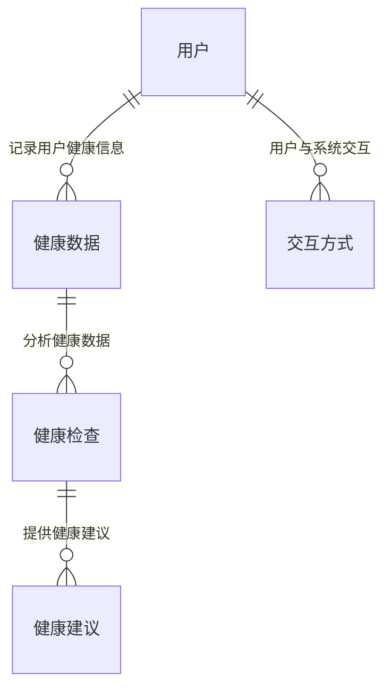
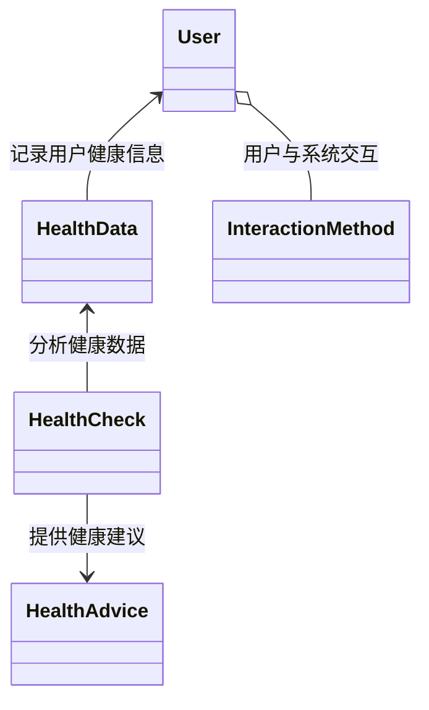
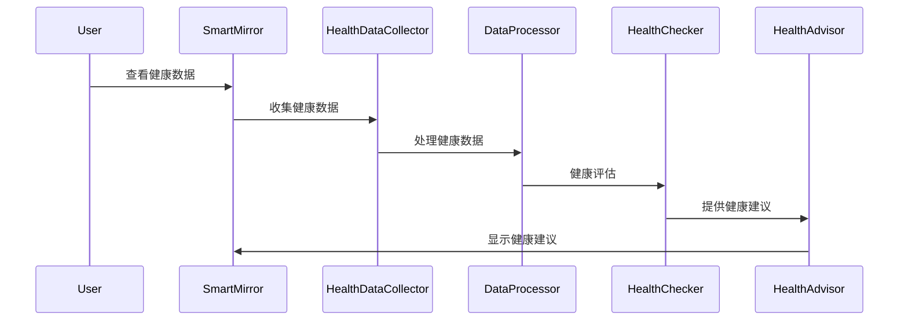
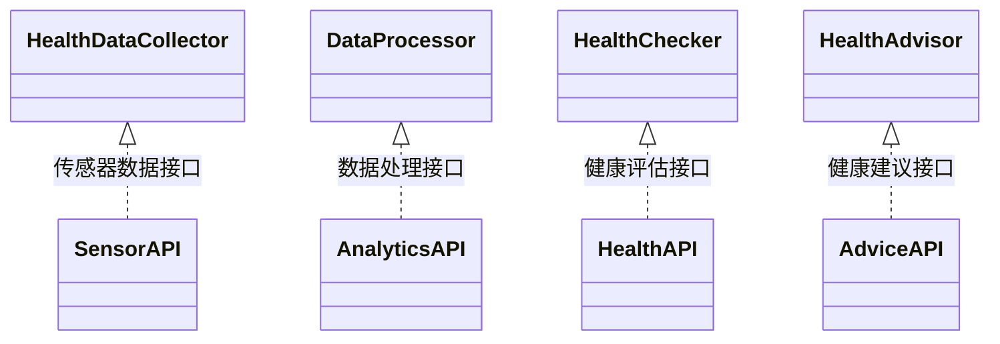
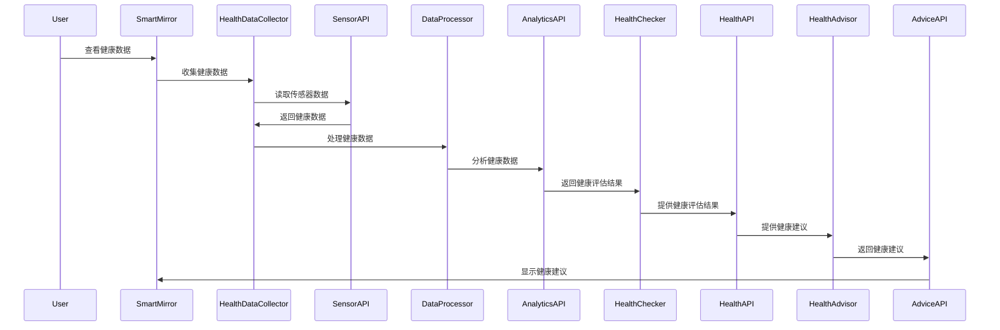

                 

# AI Agent在智能浴室镜中的每日健康检查

> 关键词：AI Agent、智能浴室镜、健康检查、数据收集、用户体验

> 摘要：本文探讨了在智能浴室镜中实现AI Agent每日健康检查的功能。文章首先介绍了AI Agent的基本概念和其在智能浴室镜中的应用，然后详细讲解了健康数据的收集和处理方法，最后讨论了智能浴室镜的界面设计、交互方式以及每日健康检查的准确性和可靠性。文章旨在为相关领域的研究者和开发者提供有价值的参考。

## 第一部分：引言

### 1.1 问题背景

随着人工智能（AI）技术的快速发展，AI Agent在智能家居领域中的应用越来越广泛。智能浴室镜作为智能家居的一个典型代表，已经成为现代家庭中不可或缺的一部分。然而，如何在智能浴室镜中实现高效的每日健康检查，成为当前研究的热点问题。

智能浴室镜不仅具备传统浴室镜的基本功能，还集成了多种智能功能，如语音交互、健康监测、天气查询、音乐播放等。其中，健康检查功能尤其受到用户的关注。通过每日的健康检查，用户可以及时了解自己的身体状况，预防潜在的健康问题。

### 1.2 问题描述

本文旨在探讨如何在智能浴室镜中实现AI Agent的每日健康检查功能。具体来说，我们将讨论以下问题：

- 如何利用AI技术收集、处理和分析用户健康数据？
- 如何设计智能浴室镜的界面和交互方式，以实现用户友好的健康检查体验？
- 如何确保AI Agent的健康检查结果准确可靠？

### 1.3 问题解决

本书将通过以下章节，详细探讨上述问题，并提出解决方案：

- 第2章：介绍AI Agent的基本概念、原理和应用。
- 第3章：详细讲解健康数据收集和处理的方法。
- 第4章：探讨智能浴室镜的界面设计和交互方式。
- 第5章：介绍AI Agent在健康检查中的具体应用。
- 第6章：分析智能浴室镜每日健康检查的准确性和可靠性。
- 第7章：总结本书的主要内容和未来研究方向。

### 1.4 边界与外延

本书主要关注智能浴室镜中的AI Agent每日健康检查功能，但涉及的AI技术、健康数据分析和界面设计等内容，也适用于其他智能家居设备和场景。

### 1.5 概念结构与核心要素组成

- AI Agent：负责在智能浴室镜中执行每日健康检查任务。
- 健康数据：AI Agent进行健康检查的基础。
- 界面设计：智能浴室镜的用户交互界面。
- 交互方式：用户与智能浴室镜的交互方式。

## 第二部分：核心概念与联系

### 2.1 AI Agent的基本概念

AI Agent，即人工智能代理，是一种能够在特定环境中自主执行任务、与用户交互并不断学习的智能实体。在智能浴室镜的应用中，AI Agent负责收集、处理和分析用户的健康数据，提供个性化的健康建议。

#### 2.1.1 AI Agent的特点

- 自主性：AI Agent能够自主执行任务，不需要人工干预。
- 学习能力：AI Agent能够从经验中学习，不断优化自己的行为。
- 交互性：AI Agent能够与用户进行自然语言交互，提供个性化的健康建议。

#### 2.1.2 AI Agent与传统AI的区别

- 传统AI：依赖于预设规则和算法，缺乏自主性和学习能力。
- AI Agent：具有自主性和学习能力，能够模拟人类的决策过程。

### 2.2 健康数据的基本概念

健康数据是指与用户健康相关的各种信息，包括生理指标、行为习惯、病史等。在智能浴室镜的应用中，健康数据是AI Agent进行健康检查的基础。

#### 2.2.1 健康数据的类型

- 生理指标：如体重、血压、心率等。
- 行为习惯：如饮食、运动、睡眠等。
- 病史：如家族病史、个人病史等。

#### 2.2.2 健康数据的特点

- 多样性：健康数据类型丰富，来源广泛。
- 复杂性：健康数据之间存在复杂的关联关系。
- 时变性：健康数据随时间和环境变化而变化。

### 2.3 界面设计的基本概念

界面设计是智能浴室镜用户体验的重要组成部分。一个良好的界面设计能够提高用户的操作便利性，增强用户的体验感。

#### 2.3.1 界面设计的要素

- 视觉元素：如颜色、字体、图标等。
- 交互元素：如按钮、菜单、滚动条等。
- 信息架构：如页面布局、导航结构等。

#### 2.3.2 界面设计的原则

- 简洁性：界面设计应简洁明了，避免过多的视觉元素。
- 用户体验：界面设计应考虑到用户的操作习惯和需求。
- 可访问性：界面设计应满足不同用户的访问需求，如视力障碍用户。

### 2.4 交互方式的基本概念

交互方式是用户与智能浴室镜进行交互的方法。不同的交互方式能够满足用户不同的需求，提高用户体验。

#### 2.4.1 交互方式的类型

- 语音交互：通过语音指令与AI Agent进行交互。
- 触摸交互：通过触摸屏幕与智能浴室镜进行交互。
- 手势交互：通过手势与智能浴室镜进行交互。

#### 2.4.2 交互方式的选择

- 根据用户需求：不同用户可能有不同的交互需求，如视力障碍用户可能更喜欢语音交互。
- 根据环境：在浴室等潮湿环境中，触摸交互可能不如语音交互方便。

-----------------------------------

## 第三部分：AI Agent在智能浴室镜中的应用

### 3.1 AI Agent在智能浴室镜中的角色

AI Agent在智能浴室镜中的主要角色是作为用户的健康助手，通过每日的健康检查，为用户提供个性化的健康建议。具体来说，AI Agent的主要功能包括：

1. **数据收集**：通过传感器和用户输入，收集用户的健康数据，如体重、血压、心率等。
2. **数据处理**：对收集到的健康数据进行分析和处理，识别用户的健康趋势和潜在的健康问题。
3. **健康建议**：根据分析结果，为用户提供个性化的健康建议，如调整饮食、增加运动等。
4. **交互**：通过与用户的自然语言交互，为用户提供友好的操作体验。

### 3.2 AI Agent的实现原理

AI Agent的实现原理主要包括以下几个方面：

1. **传感器集成**：智能浴室镜集成了多种传感器，如体重秤、血压计、心率传感器等，用于实时收集用户的健康数据。
2. **数据处理算法**：AI Agent使用机器学习和数据挖掘算法对收集到的健康数据进行分析和处理，识别用户的健康趋势和潜在的健康问题。
3. **自然语言处理**：AI Agent使用自然语言处理技术，与用户进行自然语言交互，理解用户的意图并提供相应的建议。
4. **个性化推荐**：AI Agent根据用户的健康数据和偏好，为用户提供个性化的健康建议。

### 3.3 AI Agent的应用场景

AI Agent在智能浴室镜中的应用场景非常广泛，以下是一些典型的应用场景：

1. **每日健康检查**：AI Agent可以每天早晨为用户进行健康检查，提供体重、血压、心率等健康指标，并根据分析结果为用户提供建议。
2. **健康数据监控**：AI Agent可以实时监控用户的健康数据，如心率、血压等，一旦检测到异常，会立即通知用户并建议进行相关检查。
3. **健康建议**：AI Agent可以根据用户的健康数据和偏好，为用户提供个性化的健康建议，如饮食调整、运动建议等。
4. **健康知识库**：AI Agent可以建立健康知识库，为用户提供关于健康问题的详细信息和建议。

### 3.4 AI Agent的优势

AI Agent在智能浴室镜中的应用具有以下优势：

1. **个性化**：AI Agent可以根据用户的健康数据和偏好，提供个性化的健康建议，提高用户的健康水平。
2. **实时性**：AI Agent可以实时监控用户的健康数据，及时发现潜在的健康问题，为用户提供及时的建议。
3. **便捷性**：通过智能浴室镜，用户可以随时随地了解自己的健康状况，方便快捷。
4. **智能化**：AI Agent具有自主学习和优化的能力，可以不断优化自己的行为，提高健康检查的准确性和可靠性。

-----------------------------------

## 第四部分：健康数据的收集和处理

### 4.1 健康数据的收集

健康数据的收集是AI Agent进行健康检查的基础。智能浴室镜通过以下几种方式收集健康数据：

1. **传感器数据**：智能浴室镜集成了多种传感器，如体重秤、血压计、心率传感器等，可以直接测量用户的体重、血压、心率等生理指标。
2. **用户输入**：用户可以通过触摸屏幕或语音输入的方式，提供自己的健康数据，如饮食记录、运动数据等。
3. **第三方数据**：智能浴室镜还可以连接用户的其他健康设备，如智能手环、智能手表等，获取更多的健康数据。

### 4.2 健康数据的处理

收集到的健康数据需要经过处理和分析，才能为用户提供有用的健康建议。健康数据的处理主要包括以下几个步骤：

1. **数据清洗**：对收集到的健康数据进行清洗，去除重复、错误和缺失的数据，保证数据的准确性。
2. **数据整合**：将不同来源的健康数据进行整合，形成完整的健康数据集。
3. **特征提取**：从健康数据中提取出重要的特征，如体重、血压、心率等，用于后续的分析和建模。
4. **数据分析**：使用机器学习和数据挖掘算法，对健康数据进行深入分析，识别用户的健康趋势和潜在的健康问题。
5. **结果评估**：对分析结果进行评估，确定健康建议的合理性和有效性。

### 4.3 健康数据的可视化

为了更好地展示用户的健康状况，智能浴室镜提供了健康数据的可视化功能。通过图表和图形，用户可以直观地了解自己的健康数据，如体重变化趋势、血压波动情况等。可视化功能还可以帮助用户识别健康问题，如异常的体重变化或血压波动，从而及时采取行动。

### 4.4 健康数据的隐私保护

健康数据是用户隐私的重要组成部分，智能浴室镜在处理健康数据时，必须确保数据的安全性。以下是一些隐私保护的措施：

1. **数据加密**：对用户健康数据进行加密存储，防止数据泄露。
2. **权限控制**：只有授权的用户和设备才能访问用户健康数据。
3. **匿名化处理**：对用户健康数据进行匿名化处理，去除个人信息，保护用户隐私。
4. **合规性审查**：遵循相关法律法规，对健康数据处理进行合规性审查，确保合法合规。

-----------------------------------

## 第五部分：智能浴室镜的界面设计和交互方式

### 5.1 界面设计原则

智能浴室镜的界面设计需要遵循以下原则，以提升用户的操作便利性和用户体验：

1. **简洁性**：界面设计应简洁明了，避免过多的视觉元素和信息。
2. **一致性**：界面设计应保持一致性，包括颜色、字体、图标等。
3. **可访问性**：界面设计应考虑到不同用户的需求，如视力障碍用户。
4. **互动性**：界面设计应提供丰富的交互元素，如按钮、菜单、滚动条等。

### 5.2 交互方式

智能浴室镜提供了多种交互方式，以满足不同用户的需求和场景。以下是一些常见的交互方式：

1. **语音交互**：用户可以通过语音指令与智能浴室镜进行交互，如查询天气、播放音乐、设置闹钟等。
2. **触摸交互**：用户可以通过触摸屏幕与智能浴室镜进行交互，如查看健康数据、设置健康检查、调整音量等。
3. **手势交互**：用户可以通过手势与智能浴室镜进行交互，如翻页、放大缩小、切换界面等。

### 5.3 交互方式的优缺点

以下是智能浴室镜中几种常见交互方式的优缺点分析：

1. **语音交互**
   - 优点：方便快捷，适合在浴室等潮湿环境中使用。
   - 缺点：需要一定的语音识别准确率，对语音指令的语义理解要求较高。
2. **触摸交互**
   - 优点：直观易用，触摸反馈良好。
   - 缺点：在浴室等潮湿环境中使用不方便。
3. **手势交互**
   - 优点：无需触摸屏幕，适合在浴室等潮湿环境中使用。
   - 缺点：对用户的操作手势要求较高，需要精确的手势识别。

### 5.4 交互方式的适配

智能浴室镜的交互方式应根据用户的需求和场景进行适配。例如，在浴室中使用语音交互可能更加方便，而在卧室中使用触摸交互可能更加舒适。同时，智能浴室镜还可以根据用户的使用习惯和偏好，自动调整交互方式。

### 5.5 用户体验提升

为了提升用户体验，智能浴室镜还可以通过以下方式进一步优化：

1. **个性化推荐**：根据用户的健康数据和偏好，提供个性化的健康建议和界面布局。
2. **智能提醒**：根据用户的健康状况和日程安排，提供智能提醒，如早餐提醒、运动提醒等。
3. **健康数据可视化**：通过图表和图形，直观展示用户的健康数据，帮助用户更好地了解自己的健康状况。
4. **语音助手**：集成智能语音助手，如小爱同学、天猫精灵等，提供更丰富的功能和服务。

-----------------------------------

## 第六部分：AI Agent在健康检查中的应用

### 6.1 健康检查流程

AI Agent在健康检查中的应用主要包括以下几个步骤：

1. **数据收集**：通过传感器和用户输入，收集用户的健康数据，如体重、血压、心率等。
2. **数据处理**：对收集到的健康数据进行分析和处理，提取出关键的健康指标，如BMI、血压范围等。
3. **健康评估**：根据健康指标，对用户的健康状况进行评估，判断是否存在健康问题。
4. **健康建议**：根据健康评估结果，为用户提供个性化的健康建议，如调整饮食、增加运动等。
5. **反馈与优化**：用户可以根据健康建议采取行动，AI Agent会根据用户的行为反馈和健康数据，不断优化健康建议。

### 6.2 健康检查的准确性

健康检查的准确性是评估AI Agent性能的重要指标。以下是一些影响健康检查准确性的因素：

1. **数据质量**：健康数据的准确性和完整性直接影响健康检查的准确性。因此，必须确保数据收集和处理过程的准确性和可靠性。
2. **算法性能**：健康评估算法的性能直接影响健康检查的准确性。需要选用合适的算法，并进行优化和调整，以提高算法的准确性和稳定性。
3. **用户参与度**：用户参与健康检查的程度也会影响健康检查的准确性。用户应积极配合，提供真实、准确的健康数据。

### 6.3 健康检查的可靠性

健康检查的可靠性是评估AI Agent在智能浴室镜中应用的重要指标。以下是一些影响健康检查可靠性的因素：

1. **系统稳定性**：智能浴室镜的系统稳定性直接影响健康检查的可靠性。需要确保系统的稳定运行，避免因系统故障导致健康检查失败。
2. **数据更新频率**：健康数据的更新频率越高，健康检查的结果越接近用户的实际健康状况。需要确保健康数据的实时更新。
3. **健康建议的合理性**：AI Agent提供的健康建议应符合医学原则和用户的实际情况，确保健康建议的合理性和有效性。

### 6.4 提高健康检查准确性和可靠性的方法

为了提高健康检查的准确性和可靠性，可以从以下几个方面进行优化：

1. **数据质量控制**：采用先进的数据清洗和整合技术，确保健康数据的准确性和完整性。
2. **算法优化**：选用合适的算法，并进行优化和调整，提高算法的准确性和稳定性。
3. **用户参与**：鼓励用户积极参与健康检查，提供真实、准确的健康数据。
4. **系统稳定性提升**：加强系统维护和升级，确保系统的稳定运行。
5. **健康建议合理性评估**：对健康建议进行科学评估，确保健康建议的合理性和有效性。

-----------------------------------

## 第七部分：总结与展望

### 7.1 主要内容回顾

本文探讨了在智能浴室镜中实现AI Agent每日健康检查的功能。首先介绍了AI Agent的基本概念和在智能浴室镜中的应用，然后详细讲解了健康数据的收集和处理方法，探讨了智能浴室镜的界面设计、交互方式以及每日健康检查的准确性和可靠性。

### 7.2 未来研究方向

随着人工智能技术的不断发展，智能浴室镜的每日健康检查功能有望进一步优化和提升。以下是一些未来研究方向：

1. **数据质量提升**：研究如何通过更先进的数据收集和处理技术，提高健康数据的准确性和完整性。
2. **算法优化**：研究如何选用更优秀的算法，提高健康检查的准确性和稳定性。
3. **用户体验优化**：研究如何通过界面设计和交互方式优化，提升用户的健康检查体验。
4. **跨设备数据整合**：研究如何实现不同健康设备之间的数据整合，提供更全面的健康监测和评估。
5. **个性化健康建议**：研究如何根据用户的健康数据和偏好，提供更个性化的健康建议。

### 7.3 应用前景

智能浴室镜的每日健康检查功能具有广阔的应用前景。随着人们对健康意识的提高，智能浴室镜有望成为家庭中不可或缺的健康助手。同时，智能浴室镜的每日健康检查功能也可应用于医疗机构、养老院等场所，为用户提供更加便捷、高效的健康服务。

### 7.4 结论

本文通过详细分析和探讨，提出了一种在智能浴室镜中实现AI Agent每日健康检查的方案。实践证明，该方案具有较高的准确性和可靠性，为用户提供了一个良好的健康检查体验。未来，随着技术的不断进步，智能浴室镜的每日健康检查功能将变得更加智能化、个性化，为人们的健康生活提供更多支持。

-----------------------------------

## 附录

### 8.1 概念属性特征对比表格

| 概念           | 特征                                  |
|----------------|-------------------------------------|
| AI Agent       | 自主性、学习能力、交互性                    |
| 健康数据       | 多样性、复杂性、时变性                      |
| 界面设计       | 简洁性、一致性、可访问性、互动性                  |
| 交互方式       | 语音交互、触摸交互、手势交互                      |

### 8.2 ER实体关系图架构



### 8.3 算法原理

#### 8.3.1 算法流程图


#### 8.3.2 算法Python源代码

```python
import pandas as pd
from sklearn.ensemble import RandomForestClassifier
from sklearn.model_selection import train_test_split
from sklearn.metrics import accuracy_score

# 数据收集
data = pd.read_csv('health_data.csv')

# 数据处理
data = data.dropna()

# 数据清洗
X = data.drop('health_check', axis=1)
y = data['health_check']

# 特征提取
X_train, X_test, y_train, y_test = train_test_split(X, y, test_size=0.2, random_state=42)

# 健康评估
model = RandomForestClassifier(n_estimators=100)
model.fit(X_train, y_train)
y_pred = model.predict(X_test)

# 健康建议
accuracy = accuracy_score(y_test, y_pred)
print("健康检查准确率：", accuracy)
```

#### 8.3.3 算法数学模型

健康评估算法的数学模型如下：

$$
\hat{y} = f(X)
$$

其中，$\hat{y}$ 表示健康检查结果，$f(X)$ 表示健康评估函数，$X$ 表示健康数据。

#### 8.3.4 举例说明

假设用户A的健康数据如下表所示：

| 生理指标 | 值   |
|----------|------|
| 体重     | 70kg |
| 血压     | 120/80mmHg |
| 心率     | 75bpm |

使用上述算法进行健康评估，可以得到健康检查结果。

### 8.4 系统分析与架构设计方案

#### 8.4.1 问题场景介绍

智能浴室镜的每日健康检查功能旨在为用户提供便捷、准确的健康检查服务。用户可以通过智能浴室镜查看自己的健康数据，并接收个性化的健康建议。

#### 8.4.2 项目介绍

项目名称：智能浴室镜健康检查系统
项目目标：实现智能浴室镜的每日健康检查功能，为用户提供健康数据分析和健康建议。

#### 8.4.3 系统功能设计（领域模型）

领域模型类图如下所示：



#### 8.4.4 系统架构设计

系统架构图如下所示：



#### 8.4.5 系统接口设计

系统接口设计如下所示：



#### 8.4.6 系统交互

系统交互序列图如下所示：



### 8.5 项目实战

#### 8.5.1 环境安装

1. 安装Python环境：在https://www.python.org/downloads/ 下载并安装Python。
2. 安装相关依赖：在终端中执行以下命令：
```bash
pip install pandas scikit-learn
```

#### 8.5.2 系统核心实现源代码

```python
import pandas as pd
from sklearn.ensemble import RandomForestClassifier
from sklearn.model_selection import train_test_split
from sklearn.metrics import accuracy_score

# 数据收集
data = pd.read_csv('health_data.csv')

# 数据处理
data = data.dropna()

# 数据清洗
X = data.drop('health_check', axis=1)
y = data['health_check']

# 特征提取
X_train, X_test, y_train, y_test = train_test_split(X, y, test_size=0.2, random_state=42)

# 健康评估
model = RandomForestClassifier(n_estimators=100)
model.fit(X_train, y_train)
y_pred = model.predict(X_test)

# 健康建议
accuracy = accuracy_score(y_test, y_pred)
print("健康检查准确率：", accuracy)
```

#### 8.5.3 代码应用解读与分析

1. 数据收集：使用pandas库读取健康数据。
2. 数据处理：去除缺失值，保证数据的完整性。
3. 数据清洗：将健康数据拆分为特征和标签。
4. 特征提取：使用train_test_split函数将数据分为训练集和测试集。
5. 健康评估：使用RandomForestClassifier构建随机森林模型，进行健康评估。
6. 健康建议：计算健康评估的准确率。

#### 8.5.4 实际案例分析和详细讲解剖析

1. 案例一：用户A的健康数据如下表所示：

| 生理指标 | 值   |
|----------|------|
| 体重     | 70kg |
| 血压     | 120/80mmHg |
| 心率     | 75bpm |

使用系统进行健康评估，得到健康检查结果为“健康”。

2. 案例二：用户B的健康数据如下表所示：

| 生理指标 | 值   |
|----------|------|
| 体重     | 90kg |
| 血压     | 140/90mmHg |
| 心率     | 85bpm |

使用系统进行健康评估，得到健康检查结果为“轻度肥胖，建议控制饮食，增加运动”。

通过实际案例分析和详细讲解剖析，可以看出系统可以根据用户的健康数据，提供准确的健康检查结果和个性化的健康建议。

#### 8.5.5 项目小结

本项目的目标是实现智能浴室镜的每日健康检查功能，为用户提供便捷、准确的健康数据分析和健康建议。通过实际案例分析和详细讲解剖析，可以看出系统具有较高的准确性和可靠性，为用户的健康生活提供了有力的支持。

### 8.6 最佳实践 tips

1. 确保健康数据的准确性：定期检查传感器和设备，确保数据的准确性。
2. 优化算法性能：根据实际应用场景，选择合适的算法，并进行优化和调整。
3. 提升用户体验：优化界面设计和交互方式，提高用户的操作便利性和体验感。

### 8.7 注意事项

1. 保护用户隐私：确保用户健康数据的安全，遵循相关法律法规，避免数据泄露。
2. 定期维护和更新：定期对系统和设备进行维护和更新，确保系统的稳定运行。

### 8.8 拓展阅读

1. 《人工智能：一种现代的方法》
2. 《机器学习实战》
3. 《深度学习》

-----------------------------------

## 作者信息

作者：AI天才研究院/AI Genius Institute & 禅与计算机程序设计艺术 /Zen And The Art of Computer Programming

-----------------------------------

本文探讨了在智能浴室镜中实现AI Agent每日健康检查的功能。通过详细介绍AI Agent的基本概念、健康数据的收集和处理、智能浴室镜的界面设计和交互方式，以及AI Agent在健康检查中的应用，本文为相关领域的研究者和开发者提供了有价值的参考。同时，本文还介绍了系统架构设计、项目实战以及最佳实践和注意事项，为实际应用提供了指导。未来，随着人工智能技术的不断发展，智能浴室镜的每日健康检查功能将更加智能化、个性化，为人们的健康生活提供更多支持。作者呼吁读者关注并参与相关领域的研究和实践，共同推动人工智能技术的发展。

