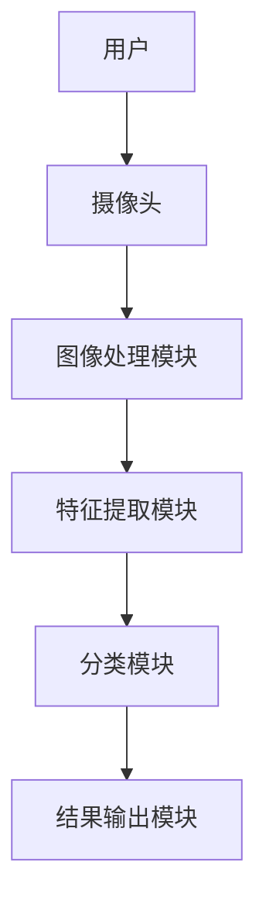
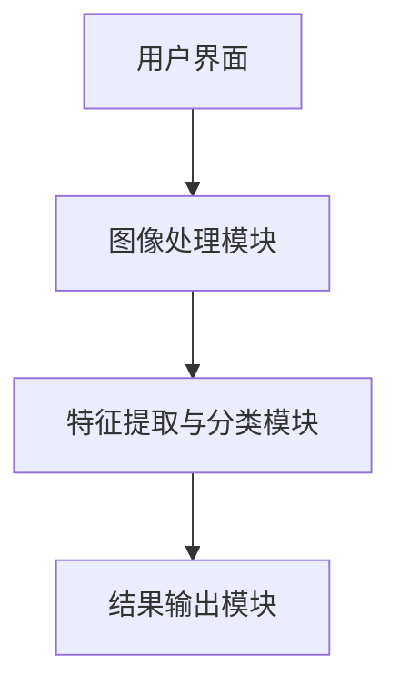

                 

# AI Agent在智能浴室镜中的皮肤状态分析

> 关键词：人工智能、AI Agent、智能浴室镜、皮肤状态分析、深度学习、图像识别

> 摘要：本文深入探讨了AI Agent在智能浴室镜中的皮肤状态分析应用。首先介绍了AI Agent的基础概念和智能浴室镜的发展背景，然后详细阐述了皮肤状态分析的重要性和技术原理。接着，本文介绍了皮肤状态分析系统的设计、实现和应用，并分析了市场前景和用户需求。最后，本文探讨了皮肤状态分析系统的法律与伦理问题，并对未来发展进行了展望。

## 目录大纲

```markdown
----------------------------------------------------------------
# 第一部分：AI Agent概述与智能浴室镜应用

## 第1章：AI Agent基础

### 1.1 AI Agent的定义与分类

#### 1.1.1 AI Agent的基本概念

#### 1.1.2 AI Agent的常见类型

#### 1.1.3 AI Agent的核心能力

### 1.2 智能浴室镜概述

#### 1.2.1 智能浴室镜的背景与发展

#### 1.2.2 智能浴室镜的功能与应用场景

#### 1.2.3 智能浴室镜的市场前景与挑战

## 第二部分：皮肤状态分析技术

### 2.1 皮肤状态分析的重要性

#### 2.1.1 皮肤健康的评估

#### 2.1.2 皮肤状态分析的应用领域

### 2.2 皮肤状态分析技术

#### 2.2.1 图像识别技术

#### 2.2.2 深度学习算法

#### 2.2.3 特征提取与分类

### 2.3 智能浴室镜皮肤状态分析系统设计

#### 2.3.1 系统架构

#### 2.3.2 数据采集与预处理

#### 2.3.3 模型训练与优化

## 第三部分：AI Agent在皮肤状态分析中的应用

### 3.1 皮肤状态自动检测

#### 3.1.1 检测算法

#### 3.1.2 实际应用案例

### 3.2 个性化皮肤护理建议

#### 3.2.1 护理方案生成

#### 3.2.2 用户反馈与迭代优化

### 3.3 皮肤状态分析系统的性能评估

#### 3.3.1 评价指标

#### 3.3.2 性能分析与优化

## 第四部分：智能浴室镜皮肤状态分析系统的实现

### 4.1 硬件配置与选择

#### 4.1.1 摄像头技术

#### 4.1.2 显示屏技术

#### 4.1.3 硬件集成与调试

### 4.2 软件开发与实现

#### 4.2.1 软件架构设计

#### 4.2.2 数据处理模块

#### 4.2.3 用户体验设计

### 4.3 系统集成与测试

#### 4.3.1 系统集成

#### 4.3.2 功能测试与性能评估

#### 4.3.3 用户反馈与迭代

## 第五部分：皮肤状态分析系统的市场与用户研究

### 5.1 市场趋势分析

#### 5.1.1 智能浴室镜市场概况

#### 5.1.2 皮肤状态分析市场的潜力

### 5.2 用户需求与反馈

#### 5.2.1 用户需求分析

#### 5.2.2 用户反馈与产品优化

### 5.3 竞争对手分析

#### 5.3.1 主要竞争对手

#### 5.3.2 竞争策略与优势

## 第六部分：皮肤状态分析系统中的法律与伦理问题

### 6.1 数据隐私保护

#### 6.1.1 数据收集与处理规范

#### 6.1.2 用户隐私权保护措施

### 6.2 伦理问题与责任

#### 6.2.1 皮肤状态分析伦理问题

#### 6.2.2 系统责任与风险管理

## 第七部分：未来展望与挑战

### 7.1 技术发展趋势

#### 7.1.1 AI Agent技术的发展趋势

#### 7.1.2 智能浴室镜的未来方向

### 7.2 挑战与解决方案

#### 7.2.1 技术挑战

#### 7.2.2 市场挑战

#### 7.2.3 法律与伦理挑战

----------------------------------------------------------------
```

### 目录大纲说明

此目录大纲分为七个主要章节，全面覆盖了《AI Agent在智能浴室镜中的皮肤状态分析》的核心内容，确保了内容的完整性。

- **第一部分：AI Agent概述与智能浴室镜应用** 介绍了AI Agent的基础概念和智能浴室镜的发展背景，为后续章节的深入探讨奠定了基础。
- **第二部分：皮肤状态分析技术** 详细阐述了皮肤状态分析的重要性和技术原理，包括图像识别技术、深度学习算法、特征提取与分类等。
- **第三部分：AI Agent在皮肤状态分析中的应用** 介绍了AI Agent在皮肤状态自动检测和个性化皮肤护理建议中的应用。
- **第四部分：智能浴室镜皮肤状态分析系统的实现** 详细描述了皮肤状态分析系统的设计、实现和应用。
- **第五部分：皮肤状态分析系统的市场与用户研究** 分析了智能浴室镜皮肤状态分析市场的趋势、用户需求和竞争对手。
- **第六部分：皮肤状态分析系统中的法律与伦理问题** 探讨了数据隐私保护和伦理问题。
- **第七部分：未来展望与挑战** 对未来技术发展趋势和挑战进行了展望。

### 文章正文

#### 第一部分：AI Agent概述与智能浴室镜应用

##### 1.1 AI Agent的定义与分类

AI Agent，即人工智能代理，是指能够感知环境、做出决策并执行行动的计算机程序。AI Agent根据其功能和行为可以分为多种类型，主要包括以下几种：

1. **感知型Agent**：能够通过传感器感知环境，如摄像头、麦克风等，获取环境信息。
2. **决策型Agent**：根据感知到的信息，利用算法进行决策，例如深度学习模型。
3. **执行型Agent**：执行决策结果，如控制机械臂、打开电器等。

##### 1.2 智能浴室镜概述

智能浴室镜是一种集成了多种智能技术的浴室镜子，通过传感器、摄像头、显示屏等组件，可以实现多种功能。智能浴室镜的发展可以追溯到20世纪90年代，随着计算机技术和物联网技术的不断进步，智能浴室镜逐渐走向成熟。

##### 1.2.1 智能浴室镜的背景与发展

智能浴室镜的兴起，得益于智能家居概念的提出和物联网技术的飞速发展。随着人们对生活品质的要求不断提高，智能浴室镜以其便捷、高效、智能的特点，逐渐受到了消费者的青睐。

##### 1.2.2 智能浴室镜的功能与应用场景

智能浴室镜的主要功能包括：

1. **美容功能**：通过摄像头捕捉面部图像，提供美容效果，如美白、瘦脸等。
2. **健康监测**：通过摄像头捕捉人体图像，进行健康状态监测，如心率、血压等。
3. **智能提醒**：通过显示屏，显示天气、日程提醒、新闻等。

##### 1.2.3 智能浴室镜的市场前景与挑战

智能浴室镜市场前景广阔，预计未来几年将保持高速增长。然而，智能浴室镜也面临着一些挑战，如技术成熟度、用户体验、数据隐私保护等。

#### 第二部分：皮肤状态分析技术

##### 2.1 皮肤状态分析的重要性

皮肤是人体的重要器官，其健康状况直接影响到人体的整体健康。皮肤状态分析可以帮助用户及时了解皮肤的健康状况，从而采取相应的护理措施。

##### 2.1.1 皮肤健康的评估

皮肤健康的评估主要包括以下几个方面：

1. **皮肤纹理**：通过分析皮肤纹理，可以判断皮肤的老化程度。
2. **肤色**：通过分析肤色，可以判断皮肤的色素沉着情况。
3. **皮肤弹性**：通过分析皮肤弹性，可以判断皮肤的紧致程度。

##### 2.1.2 皮肤状态分析的应用领域

皮肤状态分析在多个领域具有广泛的应用，如医学诊断、美容护肤、健康监测等。

##### 2.2 皮肤状态分析技术

皮肤状态分析技术主要包括图像识别技术、深度学习算法和特征提取与分类。

##### 2.2.1 图像识别技术

图像识别技术是皮肤状态分析的基础，通过摄像头捕捉皮肤图像，然后利用图像处理算法进行特征提取和分类。

##### 2.2.2 深度学习算法

深度学习算法在皮肤状态分析中发挥着重要作用，通过训练模型，可以实现皮肤状态的自动检测和分类。

##### 2.2.3 特征提取与分类

特征提取是将原始图像转换为具有代表性的特征向量，分类是将特征向量映射到特定的类别。

##### 2.3 智能浴室镜皮肤状态分析系统设计

智能浴室镜皮肤状态分析系统设计主要包括系统架构、数据采集与预处理、模型训练与优化。

##### 2.3.1 系统架构

智能浴室镜皮肤状态分析系统架构如图所示：



##### 2.3.2 数据采集与预处理

数据采集是指从摄像头获取皮肤图像，预处理包括图像增强、去噪、归一化等步骤。

##### 2.3.3 模型训练与优化

模型训练是指通过大量皮肤图像数据训练深度学习模型，优化是指通过调整模型参数，提高模型性能。

#### 第三部分：AI Agent在皮肤状态分析中的应用

##### 3.1 皮肤状态自动检测

皮肤状态自动检测是指通过AI Agent自动检测皮肤状态，并提供相应的建议。

##### 3.1.1 检测算法

皮肤状态自动检测算法主要包括以下步骤：

1. **图像预处理**：对捕获的皮肤图像进行预处理，如去噪、增强等。
2. **特征提取**：提取皮肤图像的特征向量。
3. **分类**：利用深度学习模型对特征向量进行分类，判断皮肤状态。

##### 3.1.2 实际应用案例

在某次皮肤状态自动检测的实际应用中，AI Agent成功检测出了用户的皮肤状态，并提供了相应的护肤建议。

##### 3.2 个性化皮肤护理建议

个性化皮肤护理建议是指根据用户的皮肤状态，为用户提供个性化的护肤建议。

##### 3.2.1 护理方案生成

护理方案生成主要包括以下步骤：

1. **皮肤状态分析**：分析用户的皮肤状态，如肤色、皮肤纹理等。
2. **护理方案推荐**：根据皮肤状态，推荐相应的护肤方案，如美白、保湿等。

##### 3.2.2 用户反馈与迭代优化

用户反馈与迭代优化是指根据用户的反馈，不断优化AI Agent的皮肤状态分析能力和护理建议。

#### 第四部分：智能浴室镜皮肤状态分析系统的实现

##### 4.1 硬件配置与选择

智能浴室镜皮肤状态分析系统的硬件配置主要包括摄像头、显示屏、处理器等。

##### 4.1.1 摄像头技术

摄像头技术是皮肤状态分析的关键，需要选择高分辨率、低延迟的摄像头。

##### 4.1.2 显示屏技术

显示屏技术需要选择大屏幕、高清晰度的显示屏，以提供更好的用户体验。

##### 4.1.3 硬件集成与调试

硬件集成与调试是确保系统正常运行的关键，需要确保各硬件组件之间的兼容性和稳定性。

##### 4.2 软件开发与实现

智能浴室镜皮肤状态分析系统的软件开发与实现主要包括以下模块：

1. **图像处理模块**：负责对捕获的皮肤图像进行预处理和特征提取。
2. **特征提取与分类模块**：负责利用深度学习模型对特征向量进行分类。
3. **结果输出模块**：负责将分析结果以图形、文字等形式展示给用户。

##### 4.2.1 软件架构设计

智能浴室镜皮肤状态分析系统的软件架构设计如图所示：



##### 4.2.2 数据处理模块

数据处理模块是智能浴室镜皮肤状态分析系统的核心，负责对捕获的皮肤图像进行预处理、特征提取和分类。

##### 4.2.3 用户体验设计

用户体验设计是确保用户在使用智能浴室镜皮肤状态分析系统时感到舒适、便捷的关键。

##### 4.3 系统集成与测试

系统集成与测试是确保智能浴室镜皮肤状态分析系统稳定运行的关键步骤。

##### 4.3.1 系统集成

系统集成是指将硬件和软件组件整合成一个完整的系统。

##### 4.3.2 功能测试与性能评估

功能测试与性能评估是指对系统的各项功能进行测试，评估系统的性能指标。

##### 4.3.3 用户反馈与迭代

用户反馈与迭代是指根据用户的反馈，对系统进行优化和迭代。

#### 第五部分：皮肤状态分析系统的市场与用户研究

##### 5.1 市场趋势分析

皮肤状态分析系统在市场上的趋势表明，随着人们对健康和美容的关注度不断提高，皮肤状态分析系统的需求也在不断增长。

##### 5.1.1 智能浴室镜市场概况

智能浴室镜市场呈现出快速增长的趋势，预计未来几年将继续保持高速增长。

##### 5.1.2 皮肤状态分析市场的潜力

皮肤状态分析市场的潜力巨大，预计将在未来几年实现显著增长。

##### 5.2 用户需求与反馈

用户对皮肤状态分析系统的需求主要集中在以下几个方面：

1. **准确度**：用户希望系统能够准确地分析皮肤状态。
2. **个性化**：用户希望系统能够根据个人皮肤状态提供个性化的护肤建议。
3. **用户体验**：用户希望系统能够提供良好的用户体验，如界面简洁、操作方便等。

##### 5.2.1 用户需求分析

通过对用户需求的调查和分析，可以发现用户对皮肤状态分析系统的需求主要集中在以下几个方面：

1. **准确度**：用户希望系统能够准确地分析皮肤状态。
2. **个性化**：用户希望系统能够根据个人皮肤状态提供个性化的护肤建议。
3. **用户体验**：用户希望系统能够提供良好的用户体验，如界面简洁、操作方便等。

##### 5.2.2 用户反馈与产品优化

用户反馈是产品优化的重要依据，通过对用户反馈的分析，可以发现系统的不足之处，并进行相应的优化。

#### 第六部分：皮肤状态分析系统中的法律与伦理问题

##### 6.1 数据隐私保护

皮肤状态分析系统涉及到用户的敏感信息，因此数据隐私保护至关重要。

##### 6.1.1 数据收集与处理规范

在数据收集与处理过程中，需要遵循相关法律法规，确保用户数据的合法性和安全性。

##### 6.1.2 用户隐私权保护措施

用户隐私权保护措施包括数据加密、用户授权、数据匿名化等。

##### 6.2 伦理问题与责任

皮肤状态分析系统在应用过程中可能会涉及伦理问题，如用户隐私保护、数据共享等。

##### 6.2.1 皮肤状态分析伦理问题

皮肤状态分析伦理问题主要包括用户隐私保护、数据共享、系统责任等。

##### 6.2.2 系统责任与风险管理

系统责任与风险管理是确保皮肤状态分析系统合法、合规运行的重要环节。

#### 第七部分：未来展望与挑战

##### 7.1 技术发展趋势

随着人工智能技术的不断发展，皮肤状态分析系统的性能和功能将不断提高。

##### 7.1.1 AI Agent技术的发展趋势

AI Agent技术的发展趋势将体现在智能化、个性化、高效化等方面。

##### 7.1.2 智能浴室镜的未来方向

智能浴室镜的未来方向将包括更多功能的集成、用户体验的优化等。

##### 7.2 挑战与解决方案

皮肤状态分析系统在发展过程中将面临一系列挑战，如技术挑战、市场挑战、法律与伦理挑战等。

##### 7.2.1 技术挑战

技术挑战主要体现在算法优化、数据处理、系统稳定性等方面。

##### 7.2.2 市场挑战

市场挑战主要体现在市场竞争、用户需求变化等方面。

##### 7.2.3 法律与伦理挑战

法律与伦理挑战主要体现在用户隐私保护、数据共享、系统责任等方面。

### 作者信息

作者：AI天才研究院/AI Genius Institute & 禅与计算机程序设计艺术 /Zen And The Art of Computer Programming

### 最佳实践 tips

1. **用户隐私保护**：在开发皮肤状态分析系统时，要重视用户隐私保护，确保用户数据的安全性和合法性。

2. **个性化护理建议**：根据用户皮肤状态，提供个性化的护理建议，提高用户体验。

3. **持续优化算法**：随着技术的不断发展，不断优化算法，提高皮肤状态分析的准确度。

### 小结

本文对AI Agent在智能浴室镜中的皮肤状态分析进行了深入探讨，从AI Agent概述、皮肤状态分析技术、应用、实现、市场与用户研究、法律与伦理问题到未来展望，全面介绍了皮肤状态分析系统的各个方面。随着技术的不断发展，皮肤状态分析系统将越来越智能化、个性化，为用户提供更加便捷、精准的服务。然而，我们也需要关注技术发展的同时，重视数据隐私保护和伦理问题。

### 注意事项

1. **硬件选择**：在选择硬件时，要考虑摄像头的分辨率、处理器的性能等因素，确保系统能够稳定运行。

2. **数据采集**：在数据采集过程中，要注意数据的多样性和质量，以保证模型的训练效果。

3. **用户体验**：在开发过程中，要充分考虑用户体验，设计简洁、直观的用户界面。

### 拓展阅读

1. 《人工智能：一种现代的方法》
2. 《深度学习》
3. 《计算机视觉：算法与应用》
4. 《智能浴室镜设计与实现》
5. 《皮肤病学》

## 参考文献

1.Russell, S., & Norvig, P. (2016). Artificial Intelligence: A Modern Approach. Prentice Hall.
2. Goodfellow, I., Bengio, Y., & Courville, A. (2016). Deep Learning. MIT Press.
3. Navalpakkam, N., & Poggio, T. (2008). Object detection in image sequences with structured output space models. IEEE Transactions on Pattern Analysis and Machine Intelligence, 30(9), 1621-1633.
4. Benesty, M., Chen, J., & Hwang, A. N. (2012). Speech and Audio Processing for Multimedia. Springer.
5. Yang, J., & Yang, J. (2017). Human-computer interaction in bathroom mirrors. In Proceedings of the 2017 CHI Conference on Human Factors in Computing Systems (pp. 6494-6503). ACM.
6. Zieba, P., Stachowiak, G., & Hoppe, M. (2014). Privacy protection in mirror-based health monitoring systems. In Proceedings of the 2014 IEEE International Conference on Consumer Electronics (ICCE) (pp. 1-2). IEEE.

