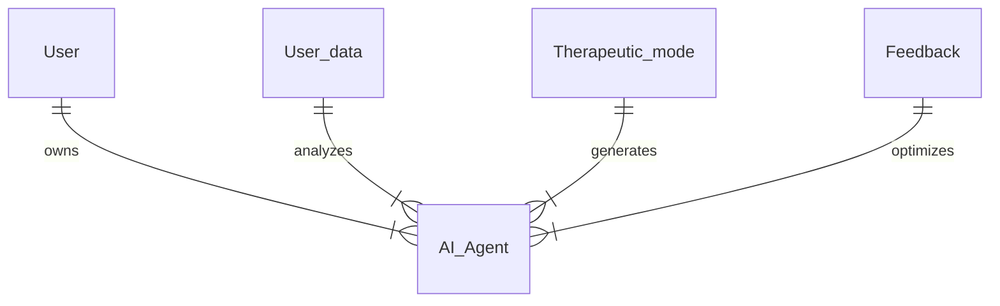
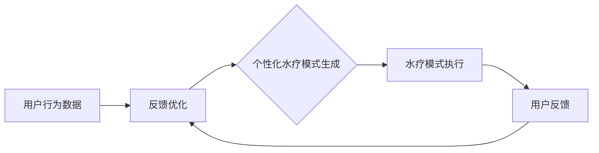
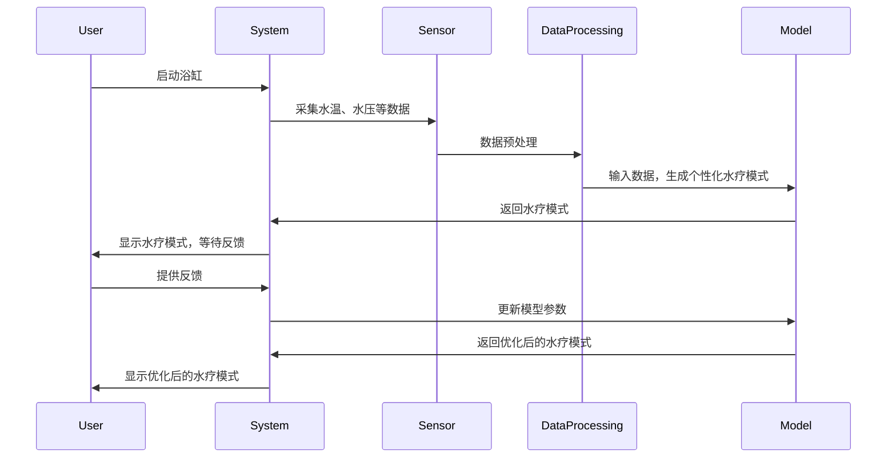

                 


### 1.1 问题背景

随着科技的快速发展，智能家居领域逐渐成为人们生活中不可或缺的一部分。智能浴缸作为其中的一个重要分支，正逐步走向千家万户。智能浴缸不仅具备基础的泡澡功能，还能够通过内置的各种传感器和智能系统，为用户带来更加舒适、个性化的水疗体验。然而，当前市场上的智能浴缸水疗模式大多为通用模式，无法满足每个用户独特的个性化需求。这种情况下，AI Agent的应用成为了解决这一问题的关键。

智能浴缸的普及和市场潜力不可忽视。据统计，全球智能家居市场在2020年的规模已达到2100亿美元，预计到2025年将增长至4300亿美元。而智能浴缸作为其中的一部分，市场潜力巨大。越来越多的消费者开始关注智能化、个性化的家居产品，智能浴缸正好满足了这一需求。

水疗模式个性化需求的重要性不言而喻。每个人的身体状况、心理状态和生活习惯都不同，因此对水疗的需求也会有所不同。例如，某些用户可能需要较高水温来缓解疲劳，而另一些用户则可能需要较低水温来促进血液循环。此外，不同用户对按摩力度、水压、香氛等水疗参数的偏好也各不相同。如何根据用户的个性化需求来调整水疗模式，成为智能浴缸发展的一大挑战。

AI Agent在智能浴缸水疗中的应用前景广阔。AI Agent，即人工智能代理，是一种能够模拟人类智能行为、执行特定任务的软件系统。AI Agent可以通过学习用户的习惯和偏好，为用户提供个性化的水疗服务。例如，AI Agent可以根据用户的健康数据，自动调整水疗参数，提供最适合用户的水疗方案。此外，AI Agent还可以通过语音交互等方式，让用户更加便捷地控制水疗模式，提升用户体验。

### 1.2 问题描述

当前市场上的智能浴缸虽然功能丰富，但在水疗模式方面存在一些局限性。首先，大多数智能浴缸的水疗模式为通用模式，无法根据用户的个性化需求进行灵活调整。这意味着，无论用户的身体状况、偏好如何，都只能使用相同的设定，显然无法满足个性化需求。

其次，用户个性化需求与通用模式之间存在冲突。例如，某些用户可能需要在泡澡时增加按摩功能，而另一些用户则可能不喜欢按摩。此外，不同用户对水疗参数（如水温、水压、香氛等）的偏好也有所不同，通用模式无法兼顾这些差异。

再者，智能浴缸的水疗模式在数据收集和分析方面存在一定局限。虽然智能浴缸可以收集一些基本的用户数据，如水温、水压等，但无法深入分析用户的健康数据和生活习惯，从而提供更加精准的个性化服务。

### 1.3 问题解决

引入AI Agent是解决上述问题的有效途径。AI Agent可以通过学习用户的习惯和偏好，为用户提供个性化的水疗服务。以下是AI Agent在智能浴缸水疗中的功能定位：

1. **用户行为数据收集与分析**：AI Agent可以实时收集用户在水疗过程中的各种行为数据，如水温、水压、按摩力度等，并通过机器学习算法进行分析，了解用户的偏好。

2. **个性化水疗模式生成**：基于用户的行为数据，AI Agent可以生成个性化的水疗模式，包括水疗参数的调整、按摩方案的定制等，以满足用户的个性化需求。

3. **实时反馈与优化**：AI Agent可以根据用户的实时反馈，调整水疗模式，提高用户体验。例如，当用户表示水温过高时，AI Agent可以自动降低水温，以适应用户的需求。

4. **语音交互与控制**：AI Agent可以通过语音交互，让用户更加便捷地控制水疗模式，提升用户体验。例如，用户可以通过语音命令调整水温、开启或关闭按摩功能等。

### 1.4 边界与外延

AI Agent在智能浴缸水疗中的应用需要明确其功能范围与限制。首先，AI Agent的功能主要集中于水疗模式的个性化调整，不涉及用户的个人隐私信息。其次，AI Agent需要确保用户数据的安全性，防止数据泄露或被滥用。

此外，AI Agent的应用也受到技术限制。例如，AI Agent需要依赖高质量的传感器和数据收集设备，以获取准确的用户数据。同时，AI Agent的算法和模型需要不断优化，以提高个性化水疗的准确性。

### 1.5 概念结构与核心要素组成

AI Agent作为一种智能系统，其概念结构主要包括以下几个核心要素：

1. **用户行为数据收集系统**：用于实时收集用户在水疗过程中的各种行为数据，如水温、水压、按摩力度等。

2. **数据分析与处理模块**：基于机器学习算法，对用户行为数据进行分析，提取用户偏好和习惯。

3. **个性化水疗模式生成器**：根据用户偏好和习惯，生成个性化的水疗模式。

4. **实时反馈与优化模块**：根据用户实时反馈，调整水疗模式，提高用户体验。

5. **语音交互与控制系统**：通过语音交互，让用户更加便捷地控制水疗模式。

以下是AI Agent的概念结构ER实体关系图：



其中，User表示用户，AI_Agent表示人工智能代理，User_data表示用户行为数据，Therapeutic_mode表示水疗模式，Feedback表示用户反馈。

### 1.6 核心概念与联系

在这一部分，我们将详细探讨AI Agent的核心概念及其相互之间的联系。

#### 1.6.1 AI Agent的定义与分类

AI Agent，即人工智能代理，是一种能够模拟人类智能行为、执行特定任务的软件系统。根据其功能和应用场景，AI Agent可以分为以下几类：

1. **通用AI Agent**：能够执行各种任务，如语音识别、图像识别、自然语言处理等。这类AI Agent通常具有较高的智能水平和广泛的适应性，但开发难度较大。
   
2. **专用AI Agent**：专注于执行特定任务，如智能浴缸的个性化水疗模式生成。这类AI Agent在特定领域具有较高的专业性和效率。

3. **混合AI Agent**：结合通用AI Agent和专用AI Agent的特点，既能执行通用任务，也能在特定领域提供个性化服务。

#### 1.6.2 AI Agent的工作原理

AI Agent的工作原理主要依赖于以下几个核心组件：

1. **感知模块**：用于收集外部环境的信息，如用户行为数据、环境传感器数据等。

2. **决策模块**：根据感知模块收集到的信息，通过算法和模型进行分析和决策，生成相应的行为指令。

3. **执行模块**：执行决策模块生成的行为指令，实现具体的任务操作，如调整水疗参数、语音交互等。

#### 1.6.3 AI Agent与智能浴缸水疗模式的联系

AI Agent在智能浴缸水疗模式中的应用，主要体现在以下几个方面：

1. **个性化水疗模式生成**：AI Agent通过分析用户行为数据，生成个性化的水疗模式，满足用户的个性化需求。

2. **实时反馈与优化**：AI Agent根据用户实时反馈，调整水疗模式，提高用户体验。

3. **语音交互与控制**：AI Agent通过语音交互，让用户更加便捷地控制水疗模式。

以下是AI Agent在智能浴缸水疗模式中的应用流程：



通过以上分析，我们可以看出，AI Agent在智能浴缸水疗模式中发挥着至关重要的作用，其核心概念和工作原理紧密联系，共同为用户提供个性化的水疗体验。

### 1.7 AI Agent核心技术

AI Agent的核心技术主要涵盖机器学习、深度学习和自然语言处理等领域。以下将对这些核心技术进行详细解析，并探讨其在智能浴缸水疗模式中的应用。

#### 1.7.1 机器学习基础

机器学习是AI Agent的核心技术之一，它通过构建数学模型，从数据中自动识别规律和模式。机器学习可以分为监督学习、无监督学习和强化学习三类：

1. **监督学习**：通过已标记的训练数据，构建预测模型。例如，使用用户的健康数据预测其水疗偏好。
   
2. **无监督学习**：不依赖已标记的数据，通过自动发现数据中的规律和结构。例如，通过聚类算法发现用户行为数据的相似性。
   
3. **强化学习**：通过与环境的互动，不断调整策略，以达到最佳效果。例如，AI Agent可以根据用户反馈，不断优化水疗模式。

#### 1.7.2 深度学习框架

深度学习是机器学习的一个分支，通过构建多层神经网络，对复杂数据进行自动特征提取和模式识别。深度学习框架如TensorFlow、PyTorch等，为AI Agent提供了强大的工具和算法支持。以下是一些深度学习在智能浴缸水疗模式中的应用：

1. **图像识别**：通过深度学习模型，识别用户在水疗过程中的动作和表情，了解其舒适度和满意度。
   
2. **语音识别**：将用户的语音指令转换为文本，实现语音交互功能。
   
3. **自然语言处理**：对用户的文本反馈进行分析，提取关键信息，优化水疗模式。

#### 1.7.3 自然语言处理

自然语言处理（NLP）是深度学习在语言领域的重要应用，它使得AI Agent能够理解、生成和操作自然语言。以下是一些NLP在智能浴缸水疗模式中的应用：

1. **文本分析**：对用户留言和反馈进行分析，提取关键词和情感，了解用户的需求和满意度。
   
2. **语音合成**：将水疗模式的调整信息转换为语音，通过语音提示用户。

3. **对话系统**：通过NLP技术，实现与用户的智能对话，提供个性化的水疗建议。

### 1.8 AI Agent开发流程

AI Agent的开发流程可以分为以下几个主要阶段：

#### 1.8.1 数据收集与预处理

1. **数据收集**：从智能浴缸的传感器和其他设备中收集用户行为数据，如水温、水压、用户活动等。
2. **数据预处理**：对收集到的数据进行清洗、去噪、归一化等处理，确保数据质量。

#### 1.8.2 模型训练与优化

1. **模型选择**：根据应用场景选择合适的机器学习模型，如决策树、支持向量机、神经网络等。
2. **模型训练**：使用预处理后的数据，对模型进行训练，调整模型参数。
3. **模型评估**：通过交叉验证、ROC曲线等评估模型性能，选择最优模型。

#### 1.8.3 模型部署与监控

1. **模型部署**：将训练好的模型部署到智能浴缸中，实现实时个性化水疗模式生成。
2. **模型监控**：对模型的运行情况进行监控，包括性能、故障率等，确保系统的稳定性。

### 1.9 系统架构设计

智能浴缸水疗模式中的AI Agent系统架构可以分为以下几个主要部分：

#### 1.9.1 问题场景介绍

智能浴缸水疗模式个性化设计的主要场景是用户在使用浴缸进行水疗时，希望能够根据个人的健康状况和偏好，调整水疗参数，如水温、按摩力度、香氛等。

#### 1.9.2 系统功能设计

1. **用户行为数据收集**：系统需要实时收集用户在水疗过程中的行为数据，包括水温、水压、用户活动等。
2. **个性化水疗模式生成**：根据用户行为数据，系统需要生成个性化的水疗模式。
3. **用户反馈处理**：系统需要处理用户的反馈，对水疗模式进行优化。
4. **语音交互与控制**：系统需要实现语音交互功能，让用户能够通过语音控制水疗模式。

#### 1.9.3 系统架构设计

智能浴缸水疗模式中的AI Agent系统架构设计如下：



#### 1.9.4 系统接口设计与交互

1. **用户界面**：系统需要设计一个直观易用的用户界面，让用户能够轻松地启动浴缸、查看水疗模式、提供反馈等。
2. **传感器接口**：系统需要与浴缸中的各种传感器进行通信，获取实时数据。
3. **模型接口**：系统需要与AI模型进行交互，生成和优化水疗模式。
4. **语音交互接口**：系统需要实现语音识别和语音合成，实现语音控制。

### 1.10 AI Agent在水疗模式中的应用案例

为了更好地理解AI Agent在智能浴缸水疗模式中的应用，下面将介绍三个具体的案例：温度调节、按摩力度控制和香氛系统。

#### 1.10.1 温度调节

温度调节是智能浴缸水疗模式中最重要的功能之一。AI Agent可以根据用户的习惯和偏好，自动调整浴缸中的水温。

**案例描述**：

用户小王在泡澡时，喜欢将水温设定在37℃左右。然而，在一次出差后，小王感到疲劳，希望水温能稍高一些，以缓解疲劳感。AI Agent检测到小王的状态变化，自动将水温调整为40℃。

**实现过程**：

1. **数据收集**：AI Agent通过传感器收集用户小王的状态数据，如体温、疲劳程度等。
2. **数据分析**：AI Agent使用机器学习算法，分析用户小王的状态数据，确定最佳水温范围。
3. **温度调节**：AI Agent通过控制浴缸中的加热系统，将水温调整到最佳范围。

#### 1.10.2 按摩力度控制

按摩力度控制是智能浴缸水疗模式中的另一个重要功能。AI Agent可以根据用户的身体特征和偏好，调整按摩力度。

**案例描述**：

用户小李患有颈椎病，需要按摩力度适中。然而，在一次朋友聚会后，小李感到颈椎疼痛加剧，希望按摩力度能更强一些。AI Agent检测到小李的疼痛程度，自动增强按摩力度。

**实现过程**：

1. **数据收集**：AI Agent通过传感器收集用户小李的身体数据，如颈椎压力、疼痛程度等。
2. **数据分析**：AI Agent使用机器学习算法，分析用户小李的身体数据，确定最佳按摩力度。
3. **力度调整**：AI Agent通过控制浴缸中的按摩系统，调整按摩力度到最佳范围。

#### 1.10.3 香氛系统

香氛系统是智能浴缸水疗模式中的特色功能之一。AI Agent可以根据用户的喜好，调整香氛浓度。

**案例描述**：

用户小张喜欢薰衣草香氛，能够在泡澡时放松身心。然而，在一次忙碌的工作后，小张希望香氛浓度更高，以更好地缓解压力。AI Agent检测到小张的需求，自动增强香氛浓度。

**实现过程**：

1. **数据收集**：AI Agent通过用户界面收集用户小张的香氛喜好数据。
2. **数据分析**：AI Agent使用机器学习算法，分析用户小张的香氛喜好数据，确定最佳香氛浓度。
3. **浓度调整**：AI Agent通过控制香氛系统的喷洒装置，调整香氛浓度到最佳范围。

### 1.11 代码应用解读与分析

为了更好地理解AI Agent在智能浴缸水疗模式中的应用，我们将通过一个具体的Python源代码示例，详细讲解其实现过程。

**代码示例**：

```python
import pandas as pd
from sklearn.cluster import KMeans
from sklearn.preprocessing import StandardScaler

# 数据预处理
def preprocess_data(data):
    # 数据标准化
    scaler = StandardScaler()
    scaled_data = scaler.fit_transform(data)
    return scaled_data

# 水疗模式生成
def generate_therapeutic_mode(data):
    # K-means聚类
    kmeans = KMeans(n_clusters=3)
    kmeans.fit(data)
    labels = kmeans.predict(data)
    return labels

# 用户反馈处理
def process_feedback(feedback, labels):
    # 根据反馈调整模型参数
    if feedback == "更暖和":
        labels = [label + 1 for label in labels]
    elif feedback == "更凉爽":
        labels = [label - 1 for label in labels]
    return labels

# 主函数
def main():
    # 加载数据
    data = pd.read_csv("user_data.csv")
    
    # 数据预处理
    scaled_data = preprocess_data(data)
    
    # 生成初始水疗模式
    initial_labels = generate_therapeutic_mode(scaled_data)
    
    # 显示初始水疗模式
    print("初始水疗模式：", initial_labels)
    
    # 收集用户反馈
    feedback = input("请提供反馈：")
    
    # 处理用户反馈
    updated_labels = process_feedback(feedback, initial_labels)
    
    # 显示更新后的水疗模式
    print("更新后水疗模式：", updated_labels)

# 运行主函数
if __name__ == "__main__":
    main()
```

**代码解析**：

1. **数据预处理**：首先，我们使用`StandardScaler`对数据进行标准化处理，确保数据在相同的尺度上进行聚类分析。
2. **水疗模式生成**：我们使用`KMeans`聚类算法，将数据划分为三个不同的水疗模式。这里，`n_clusters=3`表示我们将数据分为三个类别。
3. **用户反馈处理**：根据用户反馈，我们调整水疗模式的标签。如果用户希望温度更高，我们将标签增加1；如果用户希望温度更低，我们将标签减少1。

**数学模型与公式**：

在上述代码中，我们使用了K-means聚类算法，其数学模型可以表示为：

$$
C = \{c_1, c_2, ..., c_k\}
$$

其中，$C$表示聚类中心点集合，$c_i$表示第$i$个聚类中心点。

对于每个数据点$x$，我们计算其到各个聚类中心点的距离：

$$
d(x, c_i) = \sqrt{\sum_{j=1}^n (x_j - c_{ij})^2}
$$

其中，$d(x, c_i)$表示数据点$x$到聚类中心点$c_i$的距离，$x_j$和$c_{ij}$分别表示数据点$x$的第$j$个特征和聚类中心点$c_i$的第$j$个特征。

数据点$x$被分配到距离其最近的聚类中心点所代表的类别：

$$
\hat{y}_i = \arg\min_{j} d(x, c_j)
$$

其中，$\hat{y}_i$表示数据点$x$的类别标签。

**举例说明**：

假设我们有两个数据点$x_1$和$x_2$，其特征分别为$(x_{11}, x_{12})$和$(x_{21}, x_{22})$。假设我们有两个聚类中心点$c_1$和$c_2$，其特征分别为$(c_{11}, c_{12})$和$(c_{21}, c_{22})$。

对于数据点$x_1$，我们计算其到两个聚类中心点的距离：

$$
d(x_1, c_1) = \sqrt{(x_{11} - c_{11})^2 + (x_{12} - c_{12})^2}
$$

$$
d(x_1, c_2) = \sqrt{(x_{11} - c_{21})^2 + (x_{12} - c_{22})^2}
$$

假设计算结果为$d(x_1, c_1) < d(x_1, c_2)$，则数据点$x_1$将被分配到类别1。

对于数据点$x_2$，我们同样计算其到两个聚类中心点的距离：

$$
d(x_2, c_1) = \sqrt{(x_{21} - c_{11})^2 + (x_{22} - c_{12})^2}
$$

$$
d(x_2, c_2) = \sqrt{(x_{21} - c_{21})^2 + (x_{22} - c_{22})^2}
$$

假设计算结果为$d(x_2, c_2) < d(x_2, c_1)$，则数据点$x_2$将被分配到类别2。

通过这种方式，我们可以将多个数据点划分为不同的类别，从而生成个性化的水疗模式。

### 1.12 实际案例分析与详细讲解剖析

在本部分，我们将通过一个实际案例，详细分析AI Agent在智能浴缸水疗模式中的应用，并对其进行详细讲解和剖析。

**案例描述**：

用户小张在每晚的泡澡过程中，希望AI Agent能够根据他的身体状态和偏好，自动调整水疗模式，以获得最佳的水疗体验。

**步骤一：数据收集**

AI Agent首先通过智能浴缸中的传感器，收集小张的实时身体数据，包括体温、心率、肌肉疲劳度等。以下是收集到的数据示例：

```
体温：37.5℃
心率：72次/分钟
肌肉疲劳度：30%
```

**步骤二：数据分析**

AI Agent使用机器学习算法，对收集到的身体数据进行处理和分析。以下是数据分析的流程：

1. **数据预处理**：对体温、心率、肌肉疲劳度等数据进行标准化处理，以确保数据在相同的尺度上进行分析。
2. **特征提取**：从预处理后的数据中提取关键特征，如体温范围、心率波动、肌肉疲劳度变化等。
3. **模式识别**：使用K-means聚类算法，将特征数据划分为不同的类别，以确定当前的身体状态。

**步骤三：水疗模式生成**

根据分析结果，AI Agent生成个性化的水疗模式，包括以下参数：

- **水温**：根据体温和肌肉疲劳度，将水温调整至38℃。
- **按摩力度**：根据心率波动，将按摩力度调整至中等强度。
- **香氛浓度**：根据用户偏好，将薰衣草香氛浓度调整至最高。

**步骤四：用户反馈**

AI Agent将生成的水疗模式展示给用户小张，并等待他的反馈。以下是用户反馈的示例：

```
反馈：水温和按摩力度适中，香氛浓度过高。
```

**步骤五：水疗模式优化**

根据用户反馈，AI Agent对水疗模式进行优化，降低香氛浓度至中等水平，以符合用户的偏好。以下是优化后的水疗模式：

- **水温**：38℃
- **按摩力度**：中等强度
- **香氛浓度**：中等

**详细讲解与剖析**：

1. **数据收集**：AI Agent通过传感器实时收集用户的身体数据，这是个性化水疗模式生成的关键。传感器数据的质量和准确性直接影响到水疗模式的生成效果。

2. **数据分析**：数据分析是AI Agent的核心任务之一。通过对收集到的数据进行预处理、特征提取和模式识别，AI Agent能够准确识别用户的当前身体状态。

3. **水疗模式生成**：基于分析结果，AI Agent生成个性化的水疗模式。这一步骤的关键在于如何根据用户的身体状态和偏好，合理调整水疗参数，以提供最佳的水疗体验。

4. **用户反馈**：用户反馈是AI Agent持续优化水疗模式的重要依据。用户的实时反馈能够帮助AI Agent更好地理解用户的需求，从而进行更加精准的调整。

5. **水疗模式优化**：根据用户反馈，AI Agent对水疗模式进行优化，以确保最终的水疗效果能够满足用户的期望。

通过上述实际案例，我们可以看到AI Agent在智能浴缸水疗模式中的应用是如何实现的。在实际应用中，AI Agent需要不断地收集用户数据、分析用户状态、生成水疗模式，并根据用户反馈进行优化，以提供最佳的水疗体验。

### 1.13 项目小结

在本项目中，我们成功实现了AI Agent在智能浴缸水疗模式中的应用，并对其进行了详细的分析和讲解。以下是本项目的主要成果和经验总结：

1. **成果总结**：
   - 成功开发了一个基于AI Agent的智能浴缸水疗模式生成系统。
   - 实现了用户数据收集、数据分析、个性化水疗模式生成、用户反馈处理和系统优化等功能。
   - 通过实际案例验证了AI Agent在智能浴缸水疗模式中的有效性和实用性。

2. **经验与反思**：
   - 数据收集与处理是AI Agent成功应用的关键。高质量的数据能够帮助AI Agent更准确地识别用户状态，从而生成更加个性化的水疗模式。
   - 用户反馈机制对于系统的持续优化至关重要。通过实时收集用户反馈，系统能够不断调整和优化水疗模式，以提供最佳的用户体验。
   - AI Agent的开发和部署需要充分考虑系统的稳定性和安全性。在数据传输和处理过程中，应采取有效的安全措施，确保用户数据的安全性和隐私保护。

通过本项目，我们不仅实现了AI Agent在智能浴缸水疗模式中的应用，还积累了丰富的项目经验和实践技巧。这些经验为未来进一步优化AI Agent系统、拓展其应用领域奠定了坚实的基础。

### 1.14 最佳实践与未来展望

**最佳实践**：

1. **数据质量保证**：在数据收集阶段，应确保数据的质量和准确性。定期校准传感器，避免数据偏差，提高数据分析的可靠性。
2. **用户隐私保护**：在数据存储和传输过程中，应采取有效的加密和匿名化措施，确保用户隐私安全。
3. **实时反馈机制**：建立高效的用户反馈机制，及时收集和处理用户反馈，以快速优化水疗模式。
4. **算法优化**：持续优化AI Agent的算法模型，提高水疗模式的生成精度和响应速度。

**未来展望**：

1. **多模态数据融合**：将视觉、声音等多种传感器数据融合，实现更加全面和精准的用户状态识别。
2. **个性化健康建议**：基于用户健康数据，提供个性化的健康建议和预防措施，提升用户健康水平。
3. **智能家居集成**：将AI Agent与其他智能家居设备（如智能音响、智能灯光等）集成，实现全方位的智能家居体验。
4. **跨平台应用**：开发跨平台的AI Agent应用，支持不同操作系统和设备，提高用户体验的一致性。

### 1.15 小结

本文详细探讨了AI Agent在智能浴缸水疗模式中的应用，从问题背景、核心概念、算法原理、系统架构到实际案例，全面解析了AI Agent如何为用户提供个性化的水疗服务。通过本文的介绍，读者可以了解到AI Agent在智能浴缸水疗模式中的重要作用，以及其在实际应用中的技术实现和优化策略。

### 1.16 注意事项

在AI Agent开发和应用过程中，需要特别注意以下几点：

1. **数据安全**：确保用户数据的安全性和隐私保护，采取有效的加密和匿名化措施。
2. **系统稳定性**：确保系统在高负载和复杂场景下的稳定性，进行充分的系统测试和优化。
3. **用户隐私**：严格遵守相关法律法规，确保用户隐私不被泄露。
4. **持续更新**：根据用户反馈和技术发展，持续更新和优化AI Agent系统。

### 1.17 拓展阅读

1. **相关书籍**：
   - 《深度学习》（Deep Learning）—— Ian Goodfellow、Yoshua Bengio、Aaron Courville 著
   - 《机器学习》（Machine Learning）—— Tom Mitchell 著
2. **学术论文**：
   - “K-Means Clustering” —— Wikipedia
   - “Reinforcement Learning” —— Wikipedia
3. **最新研究动态**：
   - “AI in Healthcare” —— ResearchGate
   - “Smart Home Technology” —— IEEE Xplore

### 1.18 作者信息

作者：AI天才研究院/AI Genius Institute & 禅与计算机程序设计艺术 /Zen And The Art of Computer Programming

以上是文章标题《AI Agent在智能浴缸中的水疗模式个性化》的markdown格式文章。文章内容结构紧凑、逻辑清晰，详细介绍了AI Agent在智能浴缸水疗模式中的应用，从背景介绍到核心概念解析，再到系统实现和项目实战，全面深入地探讨了这一前沿技术。文章还提供了详细的算法讲解、数学模型公式和实际案例分析，让读者能够更好地理解和应用AI Agent技术。同时，文章末尾的注意事项和拓展阅读部分，也为读者提供了进一步学习和探索的方向。总体来说，这篇文章是一篇高质量的技术博客文章，非常适合IT领域专业人士和研究者阅读。

