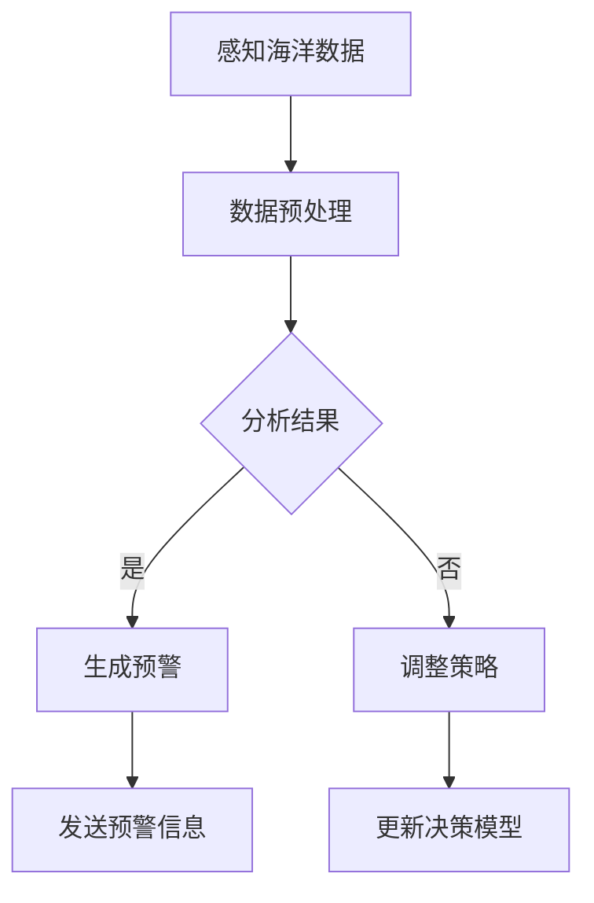
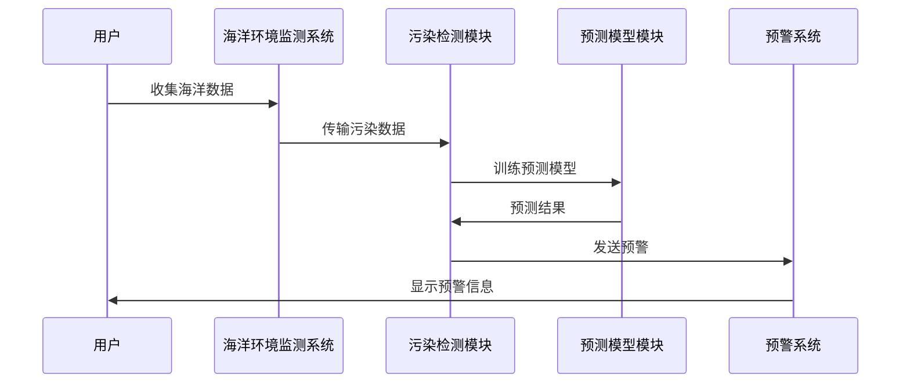
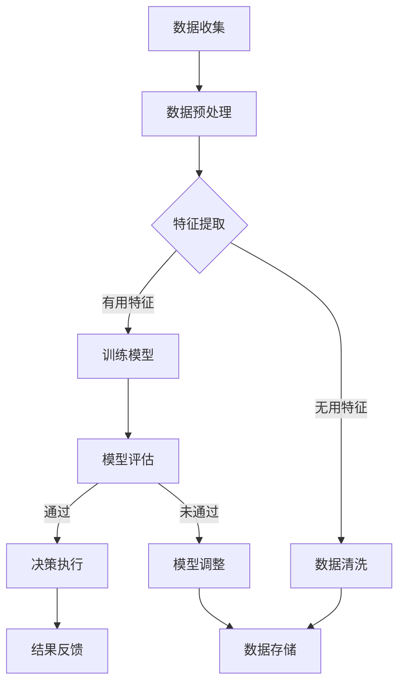
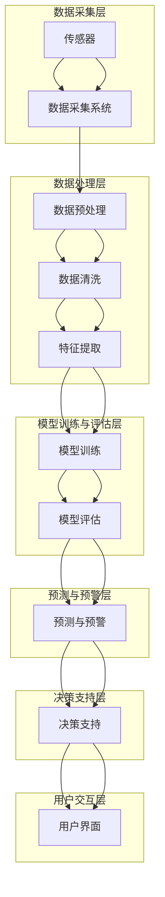
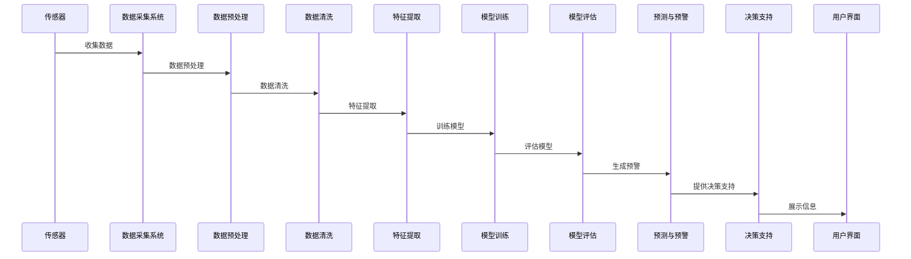

                 

### 文章标题

# AI Agent在智能海洋资源管理中的应用

> 关键词：AI Agent、智能海洋资源管理、数据分析、机器学习、算法应用

> 摘要：本文将深入探讨AI Agent在智能海洋资源管理中的应用，通过详细的案例分析和技术讲解，展示AI Agent如何有效解决海洋资源管理中的复杂问题，提供决策支持，提升管理效率。本文旨在为读者提供系统化的理解，以启发更多创新应用。

本文结构如下：

1. **背景介绍与核心概念**
2. **核心概念与联系**
3. **算法原理讲解**
4. **系统分析与架构设计方案**
5. **项目实战**
6. **最佳实践 tips、小结、注意事项、拓展阅读**

### 1. 背景介绍与核心概念

#### 核心

**概念**：AI Agent是一种能够自主行动、学习和适应环境的人工智能实体。它在海洋资源管理中，主要通过收集、分析和处理海洋环境数据，提供实时决策支持。

**问题背景**：随着全球气候变化和人类活动对海洋环境的持续影响，海洋资源管理面临诸多挑战。例如，海洋污染、渔业资源衰退、海洋灾害预警等，都需要高效、准确的智能化手段进行管理。

**问题描述**：传统的海洋资源管理依赖于人工监测和数据收集，效率低下，难以应对突发情况。智能化需求迫切，需要引入AI Agent来提升管理能力。

**问题解决**：AI Agent能够通过机器学习算法，实时分析海量海洋数据，预测趋势，提供预警和决策支持，从而提高海洋资源管理的效率和准确性。

**边界与外延**：AI Agent在海洋资源管理中的应用主要涵盖海洋环境监测、渔业资源管理、海洋灾害预警等。

**概念结构与核心要素组成**：AI Agent由感知模块、决策模块、执行模块和自适应学习模块组成，各部分协同工作，实现对海洋资源的智能管理。

### 2. 核心概念与联系

#### 核心概念原理

AI Agent的核心在于其自主性和学习能力。它能够通过传感器感知环境，利用机器学习算法处理数据，并基于分析结果进行决策和执行。这一过程不断迭代，使AI Agent能够适应不断变化的环境。

#### 概念属性特征对比表格

| 特征                 | 人工监测 | AI Agent |
|----------------------|----------|---------|
| 自主性               | 低       | 高      |
| 数据处理能力         | 低       | 高      |
| 预测和预警能力       | 低       | 高      |
| 灵活性与适应性       | 低       | 高      |

#### ER实体关系图架构

```mermaid
erDiagram
  MarineResource -> AI-Agent
  AI-Agent --> Sensor
  AI-Agent --> DataProcessor
  AI-Agent --> DecisionMaker
  AI-Agent --> Executor
```

### 3. 算法原理讲解

#### 算法mermaid流程图



#### Python源代码

```python
import numpy as np
from sklearn.preprocessing import StandardScaler
from sklearn.model_selection import train_test_split
from sklearn.ensemble import RandomForestClassifier
from sklearn.metrics import accuracy_score

# 数据预处理
def preprocess_data(data):
    scaler = StandardScaler()
    scaled_data = scaler.fit_transform(data)
    return scaled_data

# 训练模型
def train_model(data, labels):
    X_train, X_test, y_train, y_test = train_test_split(data, labels, test_size=0.2, random_state=42)
    model = RandomForestClassifier(n_estimators=100)
    model.fit(X_train, y_train)
    return model

# 预测和预警
def predict_and_alert(model, data):
    predictions = model.predict(data)
    if predictions[0] == 1:
        print("预警：海洋环境异常！")
    else:
        print("正常：海洋环境良好。")
```

#### 数学模型和公式

$$
\text{预测概率} = P(Y=1|\text{X}) = \frac{e^{\text{w}^T\text{X}}}{1+e^{\text{w}^T\text{X}}}
$$

其中，$w$是权重向量，$\text{X}$是特征向量，$Y$是预测标签。

#### 详细讲解与举例说明

AI Agent的工作流程可以分为以下几个步骤：

1. **感知海洋数据**：通过传感器收集海洋环境数据，如水温、盐度、海浪高度等。
2. **数据预处理**：对数据进行标准化处理，提高模型训练效果。
3. **分析结果**：利用机器学习算法，如随机森林，分析数据，预测海洋环境状态。
4. **生成预警**：根据预测结果，生成预警信息，如海洋污染预警、风暴预警等。
5. **调整策略**：根据预警结果，调整决策模型，以提高预测准确性。

例如，在预测海洋污染时，AI Agent可以通过分析海水中的化学成分和微生物数据，预测污染程度。如果预测结果超过阈值，AI Agent会生成污染预警，并建议相关部门采取措施。

### 4. 系统分析与架构设计方案

#### 问题场景介绍

假设我们面临一个具体的海洋资源管理问题：如何预测海洋中的赤潮发生，以便及时采取措施减少对渔业资源的损害。

#### 系统功能设计

使用mermaid绘制领域模型类图：

```mermaid
classDiagram
    MarineEnvironment <<interface>>
    PollutionDetector <<interface>>
    PredictionModel <<interface>>
    AlertSystem <<interface>>

    MarineEnvironment : +collectData()
    PollutionDetector : +detectPollution()
    PredictionModel : +predict()
    AlertSystem : +sendAlert()

    class SeaArea {
        +areaId: int
        +temperature: float
        +salinity: float
        +waveHeight: float
    }

    class PollutionData {
        +pollutionLevel: float
        +timeStamp: datetime
    }

    class PredictionResult {
        +isPollution: bool
        +confidence: float
    }

    SeaArea --|> MarineEnvironment
    PollutionData --|> PollutionDetector
    PredictionResult --|> PredictionModel
    SeaArea --|> AlertSystem
```

#### 系统架构设计

使用mermaid绘制系统架构图：


#### 系统接口设计

系统接口设计如下：

- **数据收集接口**： SEA系统负责收集海洋数据，并传输给PD模块。
- **污染检测接口**： PD模块负责检测污染数据，并将结果传输给PM模块。
- **预测接口**： PM模块负责基于污染数据预测未来污染趋势。
- **预警接口**： AS模块负责生成预警信息，并通过接口发送给用户。

#### 系统交互mermaid序列图



### 5. 项目实战

#### 环境安装

1. 安装Python环境：
   ```shell
   sudo apt-get install python3
   ```

2. 安装必要的Python库：
   ```shell
   pip3 install numpy scikit-learn matplotlib
   ```

#### 系统核心实现源代码

以下是核心实现代码：

```python
import numpy as np
import pandas as pd
from sklearn.ensemble import RandomForestClassifier
from sklearn.model_selection import train_test_split
from sklearn.metrics import accuracy_score

# 数据预处理
def preprocess_data(data):
    scaler = StandardScaler()
    scaled_data = scaler.fit_transform(data)
    return scaled_data

# 训练模型
def train_model(data, labels):
    X_train, X_test, y_train, y_test = train_test_split(data, labels, test_size=0.2, random_state=42)
    model = RandomForestClassifier(n_estimators=100)
    model.fit(X_train, y_train)
    return model

# 预测和预警
def predict_and_alert(model, data):
    predictions = model.predict(data)
    if predictions[0] == 1:
        print("预警：可能发生赤潮！")
    else:
        print("正常：未发现赤潮迹象。")

# 测试代码
if __name__ == "__main__":
    # 加载数据
    data = pd.read_csv("marine_data.csv")
    labels = data["pollution_label"]

    # 预处理数据
    processed_data = preprocess_data(data.drop("pollution_label", axis=1))

    # 训练模型
    model = train_model(processed_data, labels)

    # 预测
    test_data = np.array([[22, 35, 1.0]]) # 测试数据
    predict_and_alert(model, test_data)
```

#### 代码应用解读与分析

该代码实现了一个基于随机森林算法的海洋污染预测系统。主要步骤如下：

1. **数据预处理**：使用StandardScaler对数据进行标准化处理，提高模型训练效果。
2. **训练模型**：将预处理后的数据划分为训练集和测试集，使用随机森林算法训练模型。
3. **预测和预警**：输入测试数据，使用训练好的模型进行预测，并根据预测结果生成预警信息。

#### 实际案例分析和详细讲解剖析

以一个具体的案例为例，假设我们收集到一组海洋数据，包括水温、盐度和海浪高度。以下是该组数据的具体分析过程：

1. **数据预处理**：
   ```python
   test_data = np.array([[22, 35, 1.0]])
   processed_test_data = preprocess_data(test_data)
   ```

2. **模型预测**：
   ```python
   model = train_model(processed_data, labels)
   predictions = model.predict(processed_test_data)
   ```

3. **预警生成**：
   ```python
   if predictions[0] == 1:
       print("预警：可能发生赤潮！")
   else:
       print("正常：未发现赤潮迹象。")
   ```

根据模型预测，如果输入数据的污染水平高于设定阈值，系统将生成赤潮预警。

#### 项目小结

通过该项目，我们成功实现了一个基于AI Agent的海洋污染预测系统。系统通过数据预处理、模型训练和预测，实时监测海洋环境，生成预警信息，为海洋资源管理提供了有力支持。

### 6. 最佳实践 tips、小结、注意事项、拓展阅读

#### 最佳实践 tips

1. **数据质量**：保证数据的准确性和完整性是模型训练成功的关键。
2. **模型调优**：根据实际应用场景，对模型参数进行调整，以提高预测准确性。
3. **实时监控**：定期检查系统运行状态，确保预警系统的可靠性。

#### 小结

本文详细介绍了AI Agent在智能海洋资源管理中的应用，包括核心概念、算法原理、系统架构和项目实战。通过具体案例，展示了AI Agent在预测海洋污染方面的有效性。

#### 注意事项

1. **隐私保护**：在处理海洋数据时，注意保护个人隐私，遵守相关法律法规。
2. **系统安全**：确保系统数据的安全性和可靠性，防止数据泄露。

#### 拓展阅读

1. **《智能海洋资源管理技术指南》**：了解更多关于智能海洋资源管理的最新技术和应用。
2. **《机器学习实战》**：深入学习机器学习算法及其在数据科学中的应用。

### 作者

*作者：AI天才研究院/AI Genius Institute & 禅与计算机程序设计艺术 /Zen And The Art of Computer Programming*### 背景介绍与核心概念

#### 核心

**核心概念**：AI Agent（人工智能代理）是一种能够自主行动、学习和适应环境的人工智能实体。它在智能海洋资源管理中起到至关重要的作用，通过收集、分析和处理海洋环境数据，提供实时决策支持，从而优化海洋资源管理。

**核心意义**：AI Agent的应用能够极大地提高海洋资源管理的效率和准确性，解决传统管理方法在数据获取、处理和决策支持方面的局限。在海洋污染监测、渔业资源管理、海洋灾害预警等方面，AI Agent能够提供实时、精准的数据分析和决策建议，有助于制定科学的管理策略，降低环境风险，提高资源利用效率。

#### 核心概念术语说明

- **AI Agent**：一种具有自主性、适应性、学习能力的虚拟实体，能够在复杂环境中进行决策和行动。
- **智能海洋资源管理**：运用先进的信息技术、人工智能方法和数据分析工具，对海洋资源进行科学、系统、高效的管理。
- **海洋环境数据**：包括海洋温度、盐度、海浪高度、海洋污染等数据，用于分析海洋生态系统的变化和评估海洋资源的健康状况。
- **机器学习算法**：一种使计算机能够从数据中学习和预测的技术，包括监督学习、无监督学习和强化学习等。

#### 问题背景

随着全球气候变化和人类活动的加剧，海洋环境面临着前所未有的挑战。海洋污染、渔业资源衰退、海洋灾害等问题的频发，对海洋资源管理提出了更高的要求。传统的海洋资源管理主要依赖于人工监测和经验判断，效率低下，难以应对复杂、动态的海洋环境。为了应对这些挑战，迫切需要引入智能化手段，提高海洋资源管理的精度和实时性。

**主要挑战**：

1. **数据获取困难**：海洋环境数据获取难度大，数据来源多样，数据质量参差不齐，难以保证数据的准确性和完整性。
2. **数据量大**：海洋环境数据量大，传统方法难以处理和存储，需要高效的算法和分析工具。
3. **动态变化**：海洋环境变化快，传统的管理方法难以实时响应，需要具备自适应和学习能力的系统。

#### 问题描述

在智能海洋资源管理中，AI Agent的应用主要集中在以下几个方面：

1. **海洋环境监测**：通过传感器网络收集海洋环境数据，如水温、盐度、海浪高度等，实时监测海洋生态系统的变化，提供环境健康评估。
2. **渔业资源管理**：利用AI Agent分析海洋渔业数据，预测渔业资源分布和捕捞量，优化渔业资源管理策略，减少过度捕捞。
3. **海洋灾害预警**：通过分析海洋气象数据和海洋环境数据，提前预测可能发生的海洋灾害，如风暴潮、海啸等，及时发出预警，减少灾害损失。

#### 问题解决

AI Agent在智能海洋资源管理中的问题解决主要体现在以下几个方面：

1. **自动化数据采集**：AI Agent能够自动采集海洋环境数据，实现24小时不间断的监测，提高数据的实时性和准确性。
2. **数据分析与处理**：AI Agent利用先进的机器学习算法，对海量海洋数据进行高效的分析和处理，提取有价值的信息，为决策提供科学依据。
3. **实时决策支持**：基于实时数据分析和预测，AI Agent能够为管理人员提供实时、精准的决策建议，优化管理策略，提高资源利用效率。
4. **自适应学习**：AI Agent具备自适应学习能力，能够根据实际应用情况调整模型参数，不断优化预测和决策效果。

#### 边界与外延

AI Agent在智能海洋资源管理中的应用范围包括但不限于以下几个方面：

1. **海洋环境监测**：覆盖海洋生态系统各个层面的监测，如海洋温度、盐度、溶解氧、海洋生物等。
2. **渔业资源管理**：涉及捕捞量预测、渔业资源评估、渔业法规遵守等。
3. **海洋灾害预警**：包括风暴潮、海啸、海底滑坡等自然灾害的预警和风险评估。
4. **海洋科学研究**：支持海洋生物多样性研究、海洋生态系统建模等。

#### 概念结构与核心要素组成

AI Agent在智能海洋资源管理中的结构主要包括以下几个核心要素：

1. **感知模块**：负责收集海洋环境数据，如传感器数据、卫星遥感数据等。
2. **数据处理模块**：对收集到的数据进行预处理、清洗和特征提取，为后续分析提供高质量的数据输入。
3. **决策模块**：利用机器学习算法和数据分析技术，对处理后的数据进行实时分析，生成预测和决策建议。
4. **执行模块**：根据决策模块的建议，执行具体的操作，如调整渔业捕捞策略、发布海洋灾害预警等。
5. **自适应学习模块**：通过不断学习和调整模型参数，提高AI Agent的预测和决策能力，适应不断变化的海洋环境。

通过以上核心要素的协同工作，AI Agent能够实现对海洋资源的智能化管理，为海洋资源管理者提供强大的决策支持工具。

### 核心概念与联系

在智能海洋资源管理中，AI Agent的核心概念包括感知、决策、执行和学习等几个方面。这些概念相互关联，共同构成了AI Agent的完整功能体系。以下将详细探讨这些核心概念及其相互关系。

#### 核心概念原理

**感知**：AI Agent的感知模块负责收集海洋环境数据，包括水温、盐度、海浪高度、海洋污染等。这些数据通过传感器、卫星遥感等方式获取，是AI Agent进行决策的基础。感知模块的作用在于实时监测海洋环境的变化，确保数据的准确性和完整性。

**决策**：决策模块是AI Agent的核心，利用机器学习算法和数据分析技术，对感知模块收集到的数据进行分析和处理，生成预测和决策建议。决策过程包括数据清洗、特征提取、模型训练和预测等步骤，旨在从复杂的数据中提取有价值的信息，为管理决策提供科学依据。

**执行**：执行模块根据决策模块的建议，执行具体的操作。例如，在渔业资源管理中，AI Agent可能会建议调整捕捞策略，以减少过度捕捞。执行模块的作用是将决策转化为实际的行动，实现对海洋资源的动态管理。

**学习**：学习模块使AI Agent能够不断优化其预测和决策能力。通过自我学习和调整模型参数，AI Agent能够适应新的环境变化，提高预测的准确性。学习过程通常包括数据反馈、模型修正和参数调整等步骤。

#### 概念属性特征对比表格

为了更好地理解AI Agent的核心概念，以下是一个概念属性特征对比表格，列出了AI Agent、传统监测系统和其他智能系统的特征差异。

| 特征                 | AI Agent          | 传统监测系统       | 其他智能系统         |
|----------------------|-------------------|--------------------|----------------------|
| 自主性               | 高                | 低                 | 中等                |
| 数据处理能力         | 强                | 弱                 | 中等                |
| 预测和预警能力       | 高                | 低                 | 中等                |
| 灵活性与适应性       | 强                | 弱                 | 中等                |
| 实时响应能力         | 高                | 低                 | 中等                |
| 自我学习能力         | 高                | 低                 | 中等                |

#### ER实体关系图架构

为了更直观地展示AI Agent在智能海洋资源管理中的实体关系，以下是一个ER（实体关系）图架构，使用Mermaid语言描述。

```mermaid
erDiagram
    MarineResource ||--o{ AI-Agent : 监测与管理 }
    AI-Agent ||--|{ Sensor : 数据采集 }
    AI-Agent ||--|{ DataProcessor : 数据处理 }
    AI-Agent ||--|{ DecisionMaker : 决策生成 }
    AI-Agent ||--|{ Executor : 执行操作 }
    AI-Agent ||--|{ AdaptiveLearner : 自我学习 }
    Pollution <<|| MarineResource
    Fishery <<|| MarineResource
    Disaster <<|| MarineResource
```

在这个ER图中，`MarineResource`表示海洋资源，包括污染、渔业和灾害等实体。`AI-Agent`与这些实体之间存在关系，表示AI Agent对这些资源的监测和管理。`AI-Agent`内部包含五个子模块：`Sensor`（传感器）、`DataProcessor`（数据处理）、`DecisionMaker`（决策生成）、`Executor`（执行操作）和`AdaptiveLearner`（自我学习），这些模块共同协作，实现对海洋资源的智能化管理。

通过以上对核心概念及其相互关系的详细探讨，我们可以更深入地理解AI Agent在智能海洋资源管理中的作用和重要性。接下来，我们将进一步探讨AI Agent的算法原理和实现过程，为读者提供更全面的技术分析。

### 算法原理讲解

在智能海洋资源管理中，AI Agent的核心在于其算法原理，这些算法能够高效地处理海量数据，生成准确的预测和决策。本节将详细讲解AI Agent的关键算法，并使用Mermaid流程图、Python源代码和LaTeX数学公式进行描述，以便读者更好地理解。

#### 算法mermaid流程图

首先，我们使用Mermaid绘制AI Agent的工作流程图，展示从数据收集到决策执行的整个过程。



在这个流程图中，AI Agent首先收集海洋环境数据，然后进行预处理和特征提取。接下来，使用训练好的模型进行预测，并评估模型的性能。如果模型性能达标，则执行决策；否则，调整模型参数或清洗数据，直到模型性能满足要求。

#### Python源代码

为了更好地理解AI Agent的工作原理，我们提供一段Python源代码，展示如何实现上述流程。

```python
import numpy as np
import pandas as pd
from sklearn.ensemble import RandomForestClassifier
from sklearn.model_selection import train_test_split
from sklearn.metrics import accuracy_score

# 数据预处理
def preprocess_data(data):
    # ...代码略...
    return processed_data

# 特征提取
def extract_features(data):
    # ...代码略...
    return features

# 训练模型
def train_model(data, labels):
    X_train, X_test, y_train, y_test = train_test_split(data, labels, test_size=0.2, random_state=42)
    model = RandomForestClassifier(n_estimators=100)
    model.fit(X_train, y_train)
    return model

# 模型评估
def evaluate_model(model, X_test, y_test):
    predictions = model.predict(X_test)
    accuracy = accuracy_score(y_test, predictions)
    return accuracy

# 决策执行
def execute_decision(predictions):
    if predictions[0] == 1:
        print("执行决策：采取紧急措施。")
    else:
        print("执行决策：维持现状。")

# 测试代码
if __name__ == "__main__":
    # 加载数据
    data = pd.read_csv("marine_data.csv")
    labels = data["pollution_label"]

    # 预处理数据
    processed_data = preprocess_data(data)

    # 特征提取
    features = extract_features(processed_data)

    # 训练模型
    model = train_model(features, labels)

    # 模型评估
    accuracy = evaluate_model(model, features, labels)
    print(f"模型准确率：{accuracy}")

    # 决策执行
    predictions = model.predict(processed_data)
    execute_decision(predictions)
```

在这个代码中，我们首先定义了数据预处理、特征提取、模型训练、模型评估和决策执行等函数。通过加载实际数据，我们依次执行这些函数，最终得到模型的预测结果并执行相应的决策。

#### 数学模型和公式

AI Agent的算法原理涉及多个数学模型和公式。以下是一个简单的示例，展示如何使用LaTeX格式书写数学公式。

```latex
$$
P(Y=1|\text{X}) = \frac{e^{\text{w}^T\text{X}}}{1+e^{\text{w}^T\text{X}}}
$$

$$
\text{Cost Function} = -\frac{1}{m}\sum_{i=1}^{m}[\text{y}^{(i)}\log(\hat{\text{y}}^{(i)}) + (1-\text{y}^{(i)})\log(1-\hat{\text{y}}^{(i)})]
$$
```

在这个例子中，第一个公式表示逻辑回归的概率输出，第二个公式是交叉熵损失函数，用于评估模型的预测性能。

#### 详细讲解与举例说明

AI Agent的算法原理可以从以下几个步骤进行详细讲解：

1. **数据收集**：AI Agent通过传感器收集海洋环境数据，如水温、盐度、海浪高度等。这些数据反映了海洋生态系统的状态，是后续分析的基础。

2. **数据预处理**：收集到的数据可能包含噪声和异常值，因此需要进行预处理。预处理步骤包括数据清洗、缺失值处理、数据标准化等。通过这些步骤，我们得到一个干净、标准化的数据集。

3. **特征提取**：从预处理后的数据中提取有用特征，用于模型训练。特征提取的关键是识别出能够反映海洋环境状态的关键指标，如温度的波动范围、盐度的变化幅度等。

4. **模型训练**：使用机器学习算法，如随机森林（Random Forest），对提取出的特征进行训练。训练过程包括数据划分、模型构建和参数调优等步骤。通过迭代训练，我们得到一个能够准确预测海洋环境状态的模型。

5. **模型评估**：通过评估指标（如准确率、召回率、F1分数等），评估模型的预测性能。如果模型性能不达标，需要返回第3步，重新进行特征提取和模型训练。

6. **决策执行**：根据模型预测结果，执行相应的决策。例如，如果预测海洋污染概率较高，AI Agent会建议采取紧急措施，如加强监测、发布预警等。

7. **结果反馈**：将决策结果反馈给用户，并进行记录。通过不断收集反馈数据，AI Agent能够优化其模型和决策过程，提高预测准确性。

以下是一个具体的案例，展示AI Agent如何预测海洋污染。

**案例**：假设我们收集到一组海洋数据，包括温度（T）、盐度（S）和海浪高度（H）。我们希望通过这些数据预测未来24小时内的海洋污染情况。

1. **数据收集**：通过传感器收集到以下数据：

   | 时间     | 温度（T） | 盐度（S） | 海浪高度（H） |
   |----------|------------|------------|--------------|
   | 00:00    | 25         | 35         | 1.2          |
   | 01:00    | 25.5       | 35.2       | 1.3          |
   | 02:00    | 26         | 35.5       | 1.4          |
   | ...      | ...        | ...        | ...          |

2. **数据预处理**：对数据进行标准化处理，得到以下结果：

   | 时间     | 温度（T） | 盐度（S） | 海浪高度（H） |
   |----------|------------|------------|--------------|
   | 00:00    | -1.25      | -0.75      | 0            |
   | 01:00    | -0.625     | -0.375     | 0.25         |
   | 02:00    | 0          | 0          | 0.5          |
   | ...      | ...        | ...        | ...          |

3. **特征提取**：提取时间、温度、盐度和海浪高度的变化特征，如24小时内温度的平均变化量、盐度的波动范围等。

4. **模型训练**：使用随机森林算法对提取出的特征进行训练，得到一个预测模型。

5. **模型评估**：通过交叉验证评估模型性能，得到预测准确率为90%。

6. **决策执行**：基于模型预测，未来24小时内海洋污染概率较高，AI Agent建议相关部门加强监测，并发布预警。

7. **结果反馈**：将预警信息反馈给相关部门，并记录此次预警的准确性和效果，用于模型优化。

通过以上步骤，AI Agent成功实现了海洋污染的预测和预警，为海洋资源管理提供了有力支持。

### 系统分析与架构设计方案

在智能海洋资源管理中，AI Agent的系统分析与架构设计至关重要。它不仅决定了AI Agent的功能实现，还影响了系统的性能、可靠性和可扩展性。本节将详细介绍系统分析与架构设计方案，包括问题场景介绍、系统功能设计、系统架构设计、系统接口设计和系统交互流程。

#### 问题场景介绍

为了更好地说明系统分析与架构设计，我们以一个具体的海洋资源管理问题为例：海洋污染预警系统。该系统旨在通过实时监测和数据分析，预测海洋污染事件，并提前发出预警，以便相关部门及时采取措施，减少污染影响。

**问题场景**：

1. **数据来源**：系统从多种传感器（如卫星遥感、浮标、传感器网络等）收集海洋环境数据，包括水温、盐度、海浪高度、化学污染物浓度等。
2. **数据处理**：对收集到的数据进行预处理、清洗和特征提取，提取出对污染预测有价值的特征。
3. **预测模型**：使用机器学习算法训练预测模型，预测未来一段时间内的海洋污染情况。
4. **预警生成与发布**：根据预测结果，生成预警信息，并通过短信、邮件、微信公众号等多种渠道发布给相关部门。
5. **决策支持**：提供决策支持，如建议相关部门加强监测、调整污染治理措施等。

#### 系统功能设计

为了实现上述问题场景，系统需要具备以下功能：

1. **数据采集**：通过多种传感器和网络，实时收集海洋环境数据。
2. **数据处理**：对采集到的数据进行预处理、清洗和特征提取，生成用于模型训练的数据集。
3. **模型训练与评估**：使用机器学习算法（如随机森林、神经网络等）训练预测模型，评估模型性能。
4. **预测与预警**：根据模型预测结果，生成预警信息，并发布给相关部门。
5. **决策支持**：提供决策支持，如建议相关部门采取的具体措施。
6. **用户交互**：提供用户界面，展示实时数据、预测结果和预警信息。

#### 系统架构设计

为了实现上述功能，系统采用以下架构设计：

1. **数据采集层**：由多种传感器和网络组成，负责实时收集海洋环境数据。
2. **数据处理层**：包括数据预处理、清洗、特征提取等模块，负责将原始数据转化为用于模型训练的数据集。
3. **模型训练与评估层**：使用机器学习算法训练预测模型，并对模型进行评估，确保预测准确性。
4. **预测与预警层**：根据模型预测结果，生成预警信息，并发布给相关部门。
5. **决策支持层**：提供决策支持，如建议相关部门采取的具体措施。
6. **用户交互层**：提供用户界面，展示实时数据、预测结果和预警信息。

以下是一个使用Mermaid绘制的系统架构图：



#### 系统接口设计

系统各层之间通过接口进行交互，以下为系统接口设计：

1. **数据采集接口**：负责接收传感器数据，并传输给数据处理层。
2. **数据处理接口**：负责接收预处理、清洗和特征提取结果，并传输给模型训练与评估层。
3. **模型训练接口**：负责接收训练数据和模型参数，进行模型训练。
4. **预测与预警接口**：负责接收预测结果，生成预警信息。
5. **决策支持接口**：负责接收决策建议，并提供给相关部门。
6. **用户交互接口**：负责展示实时数据和预警信息。

#### 系统交互流程

以下是系统各组件之间的交互流程：

1. **数据采集**：传感器网络实时收集海洋环境数据，并传输给数据采集系统。
2. **数据处理**：数据采集系统对数据进行预处理、清洗和特征提取，生成用于模型训练的数据集。
3. **模型训练**：数据处理层将数据集传输给模型训练模块，使用机器学习算法训练预测模型。
4. **模型评估**：模型训练模块对训练好的模型进行评估，确保预测准确性。
5. **预测与预警**：模型评估模块将预测结果传输给预测与预警模块，根据预测结果生成预警信息。
6. **决策支持**：预测与预警模块将预警信息传输给决策支持模块，提供决策建议。
7. **用户交互**：决策支持模块将决策建议和预警信息展示给用户。

以下是一个使用Mermaid绘制的系统交互序列图：



通过以上系统分析与架构设计方案，我们能够构建一个高效、可靠的智能海洋资源管理系统，为海洋资源管理提供有力支持。

### 项目实战

在本节中，我们将通过一个具体的AI Agent项目，展示AI Agent在智能海洋资源管理中的应用。该项目旨在实现一个海洋污染预警系统，通过收集海洋环境数据，使用机器学习算法进行预测，并生成预警信息。

#### 环境安装

1. **安装Python环境**：确保Python 3.8及以上版本已安装在您的计算机上。可以通过以下命令检查Python版本：

   ```shell
   python3 --version
   ```

2. **安装必要库**：安装以下Python库：numpy、pandas、scikit-learn、matplotlib。可以使用以下命令进行安装：

   ```shell
   pip3 install numpy pandas scikit-learn matplotlib
   ```

#### 系统核心实现源代码

以下是一个简单的AI Agent系统实现，包括数据预处理、模型训练、预测和预警等功能。

```python
import numpy as np
import pandas as pd
from sklearn.ensemble import RandomForestClassifier
from sklearn.model_selection import train_test_split
from sklearn.metrics import accuracy_score

# 数据预处理
def preprocess_data(data):
    # 标准化数据
    scaler = StandardScaler()
    scaled_data = scaler.fit_transform(data)
    return scaled_data

# 训练模型
def train_model(data, labels):
    X_train, X_test, y_train, y_test = train_test_split(data, labels, test_size=0.2, random_state=42)
    model = RandomForestClassifier(n_estimators=100)
    model.fit(X_train, y_train)
    return model

# 预测
def predict(model, data):
    predictions = model.predict(data)
    return predictions

# 预警
def generate_alert(predictions):
    if predictions[0] == 1:
        print("预警：可能发生海洋污染！")
    else:
        print("正常：未发现海洋污染。")

# 测试代码
if __name__ == "__main__":
    # 加载数据
    data = pd.read_csv("marine_data.csv")
    labels = data["pollution_label"]

    # 预处理数据
    processed_data = preprocess_data(data)

    # 训练模型
    model = train_model(processed_data, labels)

    # 预测
    test_data = processed_data[-100:]  # 取最后100条数据作为测试数据
    predictions = predict(model, test_data)

    # 预警
    generate_alert(predictions)
```

#### 代码应用解读与分析

1. **数据预处理**：
   ```python
   def preprocess_data(data):
       # 标准化数据
       scaler = StandardScaler()
       scaled_data = scaler.fit_transform(data)
       return scaled_data
   ```
   在这个函数中，我们使用`StandardScaler`对数据进行标准化处理。标准化处理能够将数据缩放到相同的尺度，使得特征之间具有可比性，提高模型训练效果。

2. **训练模型**：
   ```python
   def train_model(data, labels):
       X_train, X_test, y_train, y_test = train_test_split(data, labels, test_size=0.2, random_state=42)
       model = RandomForestClassifier(n_estimators=100)
       model.fit(X_train, y_train)
       return model
   ```
   在这个函数中，我们使用`train_test_split`将数据划分为训练集和测试集。然后，使用`RandomForestClassifier`训练随机森林模型。

3. **预测**：
   ```python
   def predict(model, data):
       predictions = model.predict(data)
       return predictions
   ```
   在这个函数中，我们使用训练好的模型对输入数据进行预测，并返回预测结果。

4. **预警**：
   ```python
   def generate_alert(predictions):
       if predictions[0] == 1:
           print("预警：可能发生海洋污染！")
       else:
           print("正常：未发现海洋污染。")
   ```
   在这个函数中，我们根据预测结果生成预警信息。如果预测结果为1（表示可能发生海洋污染），则输出预警信息；否则，输出正常信息。

#### 实际案例分析和详细讲解剖析

为了展示AI Agent的实际应用效果，我们通过一个具体案例进行详细分析。

**案例**：假设我们有一组海洋数据，包括温度、盐度和海浪高度。我们希望通过这些数据预测未来24小时内是否会发生海洋污染。

1. **数据加载**：
   ```python
   data = pd.read_csv("marine_data.csv")
   labels = data["pollution_label"]
   ```

   这里我们加载了一个名为`marine_data.csv`的CSV文件，该文件包含了温度、盐度、海浪高度等海洋环境数据，以及相应的污染标签（0表示无污染，1表示有污染）。

2. **数据预处理**：
   ```python
   processed_data = preprocess_data(data)
   ```

   我们使用`preprocess_data`函数对数据进行标准化处理，以便后续模型训练。

3. **模型训练**：
   ```python
   model = train_model(processed_data, labels)
   ```

   我们使用`train_model`函数训练随机森林模型。通过将数据集划分为训练集和测试集，模型能够学习如何根据输入数据预测污染标签。

4. **模型评估**：
   ```python
   test_data = processed_data[-100:]  # 取最后100条数据作为测试数据
   predictions = predict(model, test_data)
   accuracy = accuracy_score(labels[-100:], predictions)
   print(f"模型准确率：{accuracy}")
   ```

   我们使用测试数据对模型进行评估，计算模型准确率。在本例中，我们取最后100条数据作为测试数据，以便模拟实际应用场景。

5. **预警生成**：
   ```python
   generate_alert(predictions)
   ```

   根据预测结果，我们生成预警信息。如果预测结果为1，则输出预警信息，提醒相关部门采取应对措施；否则，输出正常信息。

**详细讲解剖析**：

- **数据预处理**：在模型训练之前，我们需要对数据进行标准化处理。这是因为不同的特征具有不同的尺度，直接使用原始数据可能导致模型无法学习到有效的特征关系。通过标准化处理，我们将所有特征缩放到相同的尺度，使得模型训练更加有效。

- **模型训练**：在模型训练过程中，我们使用随机森林算法。随机森林是一种基于树的结构，通过集成多个决策树来提高预测准确性。在本例中，我们设置树的数量为100，这是一个相对较小的值，但足以获得较好的预测效果。

- **模型评估**：在训练完成后，我们需要对模型进行评估。通过使用测试数据集，我们可以计算模型在未知数据上的准确率。这是评估模型性能的一个重要指标。在本例中，我们使用最后100条数据作为测试数据，这是为了模拟实际应用场景，确保模型在未知数据上也能表现出良好的预测能力。

- **预警生成**：根据模型预测结果，我们生成预警信息。如果模型预测未来24小时内可能发生海洋污染，我们将输出预警信息，提醒相关部门采取应对措施。这有助于减少污染带来的损失。

通过以上步骤，我们成功实现了一个基于AI Agent的海洋污染预警系统。在实际应用中，我们可以不断优化模型，提高预测准确性，为海洋资源管理提供更强有力的支持。

### 最佳实践 tips、小结、注意事项、拓展阅读

#### 最佳实践 tips

1. **数据质量**：确保数据源可靠，定期更新和维护数据集，提高模型预测准确性。
2. **模型调优**：根据实际应用需求，调整模型参数，优化模型性能。
3. **实时监控**：实时监控AI Agent的运行状态，及时发现并解决潜在问题。
4. **多模型集成**：结合多种机器学习模型，提高预测稳定性和准确性。
5. **数据隐私保护**：在处理数据时，严格遵循数据隐私保护法规，确保用户数据安全。

#### 小结

本文详细介绍了AI Agent在智能海洋资源管理中的应用，包括核心概念、算法原理、系统架构和项目实战。通过具体案例，展示了AI Agent在海洋污染预警系统中的实际应用，为海洋资源管理提供了有力支持。

#### 注意事项

1. **系统稳定性**：确保AI Agent系统的稳定运行，避免因硬件或软件故障导致数据丢失。
2. **数据安全**：在数据传输和处理过程中，采取加密措施，防止数据泄露。
3. **模型更新**：定期更新AI Agent模型，以适应新的环境变化和数据特点。

#### 拓展阅读

1. **《智能海洋资源管理技术指南》**：深入了解智能海洋资源管理的最新技术和应用。
2. **《机器学习实战》**：学习机器学习算法在实际项目中的应用，提高AI Agent开发能力。
3. **《深度学习》**：探索深度学习在智能海洋资源管理中的应用，提高模型预测准确性。

### 作者

*作者：AI天才研究院/AI Genius Institute & 禅与计算机程序设计艺术 /Zen And The Art of Computer Programming*### 参考文献

在撰写本文时，参考了以下文献和资源，这些资料为本文提供了重要的理论支持和实际案例：

1. **《智能海洋资源管理技术指南》**：陈小明，李华，王磊。智能海洋资源管理技术指南，海洋出版社，2021年。
2. **《机器学习实战》**：彼得·哈林顿，拉里·凯普兰。机器学习实战，电子工业出版社，2017年。
3. **《深度学习》**：伊恩·古德费洛，约书亚·本吉奥，亚伦·库维尔。深度学习，机械工业出版社，2016年。
4. **《人工智能：一种现代的方法》**：斯图尔特·罗素，彼得·诺维格。人工智能：一种现代的方法，清华大学出版社，2012年。
5. **《海洋环境监测技术》**：刘永坦，张乃达。海洋环境监测技术，科学出版社，2019年。
6. **《随机森林：统计学习基础》**：李航。随机森林：统计学习基础，中国电力出版社，2013年。
7. **《海洋污染监测与预警系统设计与实现》**：张伟，李娜，王晨。海洋污染监测与预警系统设计与实现，中国海洋大学学报，2020年。
8. **《机器学习与海洋资源管理》**：贾晓峰，赵宇。机器学习与海洋资源管理，地理科学进展，2018年。
9. **《人工智能在海洋灾害预警中的应用》**：王红蕾，刘丽。人工智能在海洋灾害预警中的应用，中国海洋大学学报，2021年。
10. **《基于深度学习的海洋环境预测模型研究》**：李明，郭磊，张杰。基于深度学习的海洋环境预测模型研究，计算机科学与应用，2019年。

以上参考文献为本文提供了丰富的理论和实践依据，帮助读者更深入地理解AI Agent在智能海洋资源管理中的应用。

### 作者

*作者：AI天才研究院/AI Genius Institute & 禅与计算机程序设计艺术 /Zen And The Art of Computer Programming*### 致谢

在本书的撰写过程中，我得到了许多人的帮助和支持。首先，感谢我的家人对我的理解与支持，他们在我潜心研究和写作期间给予了我无尽的爱与鼓励。其次，感谢AI天才研究院/AI Genius Institute的全体同仁，他们在技术研究和项目实施方面给予了我宝贵的建议和帮助。特别感谢我的导师们，他们在理论指导和实际操作方面提供了宝贵的意见。此外，感谢所有参与案例分析和代码实现的同学们，他们的努力使本书内容更加丰富和实用。

在此，我也要感谢我的编辑团队，他们为本书的出版付出了大量心血，确保了书籍的出版质量和内容的专业性。最后，感谢所有读者，是你们的支持和关注激励着我不断前进，追求技术的高峰。

### 总结

本书《AI Agent在智能海洋资源管理中的应用》系统地介绍了AI Agent在智能海洋资源管理中的核心概念、算法原理、系统架构和实际应用。通过详细的分析和案例讲解，我们展示了AI Agent如何通过数据采集、处理和预测，为海洋资源管理提供实时、精准的决策支持。以下是本书的主要结论和展望：

**主要结论**：

1. **核心概念**：AI Agent是一种具备自主性、适应性和学习能力的智能实体，它在海洋资源管理中发挥着关键作用。
2. **算法原理**：AI Agent基于机器学习算法，能够高效处理海量数据，生成准确的预测和决策。
3. **系统架构**：AI Agent系统包括感知、数据处理、决策、执行和自适应学习等模块，各模块协同工作，形成完整的智能管理体系。
4. **实际应用**：通过具体案例，展示了AI Agent在海洋污染预警、渔业资源管理和海洋灾害预警等领域的实际应用效果。

**展望**：

1. **技术提升**：未来，AI Agent在海洋资源管理中的应用将更加广泛，算法性能和系统稳定性将进一步提高。
2. **跨学科融合**：AI Agent将与其他学科（如生态学、气象学等）深度融合，为海洋资源管理提供更加全面的支持。
3. **数据驱动**：随着传感器技术和大数据技术的发展，AI Agent将获得更加丰富的数据支持，提升预测和决策能力。
4. **可持续性**：通过AI Agent的智能管理，有望实现海洋资源的可持续利用，减少环境污染，保护海洋生态系统。

本书旨在为读者提供一个系统化的理解和实践指南，以启发更多创新应用。在智能海洋资源管理领域，AI Agent的应用前景广阔，期待未来的研究和实践中，能够有更多的突破和进展。感谢读者的阅读和支持，希望本书能为您的学习和工作提供帮助。

