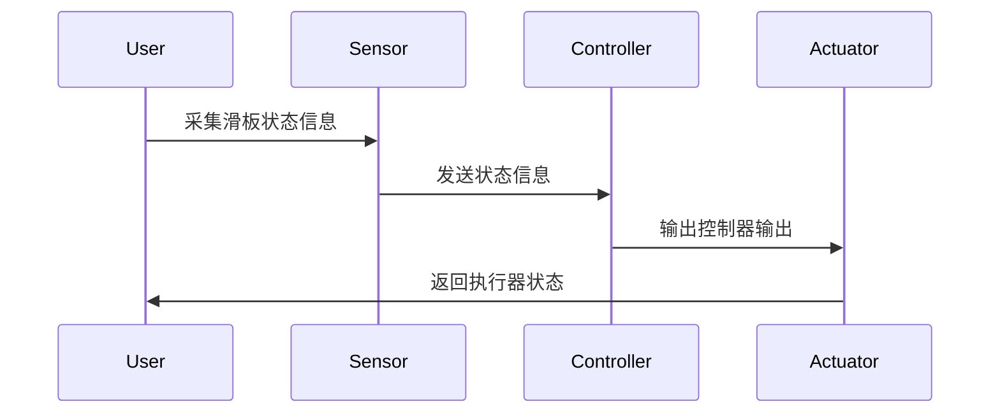
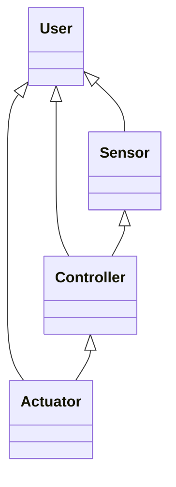

                 

# AI Agent在智能滑板中的平衡控制

## 关键词

- 智能滑板
- AI Agent
- 平衡控制
- 深度学习
- 强化学习

> 摘要：本文深入探讨了AI Agent在智能滑板中的平衡控制问题。首先，介绍了智能滑板的应用背景和问题背景，随后详细阐述了AI Agent的原理和特点，包括其算法原理和数学模型。接着，分析了平衡控制算法的实现原理和数学模型，并通过深度学习算法的应用，实现了滑板状态的实时预测与控制。最后，本文提出了智能滑板系统的架构设计，包括系统功能设计、系统架构设计、系统接口设计和系统交互，并给出一个实际项目案例，展示了AI Agent在智能滑板平衡控制中的应用效果。

## 目录大纲

### 第一部分：背景介绍

#### 第1章：问题背景与概述

##### 1.1 问题背景

随着科技的进步，智能滑板作为一种新型的智能交通工具，正在逐渐走进大众的日常生活。智能滑板通过内置的各种传感器和智能控制系统，能够实现自主平衡、自动转弯等功能，极大地提升了出行的便捷性和乐趣。然而，在平衡控制方面，智能滑板仍然面临诸多挑战。

##### 1.2 核心概念

在本节中，我们将介绍本文涉及的核心概念，包括AI Agent和平衡控制。

**AI Agent**：AI Agent，即人工智能代理，是指具有自主学习、自主决策和自主行动能力的智能实体。它可以在环境中感知状态，通过学习或规划，采取适当的行动，以实现特定的目标。

**平衡控制**：平衡控制是指维持智能滑板在运动过程中的稳定状态，避免滑板倾倒或失去平衡。

##### 1.3 概念结构与核心要素组成

智能滑板的平衡控制系统主要由以下核心要素组成：

1. **传感器**：用于采集滑板状态信息，如倾斜角度、速度、加速度等。
2. **控制器**：根据传感器采集的数据，通过算法对滑板姿态进行调整，以实现平衡控制。
3. **执行器**：根据控制器的输出，调整滑板的运动状态，如电机转动、刹车等。

### 第二部分：核心概念与联系

#### 第2章：AI Agent原理与特点

##### 2.1 AI Agent原理

AI Agent的原理主要基于深度学习和强化学习等人工智能技术。通过感知环境状态，利用深度学习算法对状态进行特征提取和学习，然后通过强化学习算法进行决策，最终实现自主行动。

**算法原理**：

1. **深度学习算法**：通过多层神经网络模型，实现数据的自动特征提取和学习。常用的深度学习算法包括卷积神经网络（CNN）、生成对抗网络（GAN）等。

2. **强化学习算法**：通过奖励信号和策略迭代，实现智能体的最优行为选择。常用的强化学习算法包括Q学习、深度Q网络（DQN）等。

**数学模型**：

以下是一个简化的强化学习数学模型：

$$
\begin{align*}
E_{\pi} [G(s, a)] &= \sum_{s, a} \pi(a|s)G(s, a) \\
J(\theta) &= E_{\pi} [G(s, a)] - \alpha \cdot D_{\pi}(s, a)
\end{align*}
$$

其中，$G(s, a)$ 表示在状态 $s$ 下采取动作 $a$ 的预期收益，$\pi(a|s)$ 表示在状态 $s$ 下采取动作 $a$ 的概率，$D_{\pi}(s, a)$ 表示在状态 $s$ 下采取动作 $a$ 的优势函数。

##### 2.2 AI Agent特点

AI Agent具有以下几个显著特点：

1. **自主性**：AI Agent能够自主感知环境，自主决策，自主行动。
2. **适应性**：AI Agent能够通过学习适应不同的环境和任务。
3. **智能化**：AI Agent能够实现复杂的任务，如平衡控制、路径规划等。
4. **灵活性**：AI Agent能够根据环境变化，动态调整其行为策略。

### 第三部分：平衡控制算法与实现

#### 第3章：平衡控制算法与实现

##### 3.1 平衡控制算法

平衡控制算法主要基于传感器采集的滑板状态信息，通过预测滑板下一时刻的状态，并调整控制器输出，实现滑板的平衡控制。

**算法原理**：

1. **状态预测**：通过传感器采集滑板当前状态，如倾斜角度、速度、加速度等，利用深度学习算法预测滑板下一时刻的状态。
2. **控制器输出**：根据预测结果，调整控制器的输出，如电机的转动速度、刹车力度等，以实现滑板的平衡控制。

**数学模型**：

以下是一个简化的平衡控制算法数学模型：

$$
\begin{align*}
s_{t+1} &= f(s_t, u_t) \\
u_t &= \theta^*(s_t)
\end{align*}
$$

其中，$s_t$ 表示滑板当前状态，$u_t$ 表示控制器输出，$f$ 表示状态转移函数，$\theta^*$ 表示最优控制器。

##### 3.2 平衡控制算法实现

平衡控制算法的实现主要包括以下几个步骤：

1. **传感器数据采集**：通过加速度传感器、陀螺仪传感器等，采集滑板当前状态信息。
2. **状态预测**：利用深度学习算法，如卷积神经网络（CNN）等，对滑板状态进行预测。
3. **控制器输出**：根据预测结果，通过PID控制器等，调整滑板的运动状态。
4. **执行器动作**：根据控制器输出，驱动执行器，如电机、刹车等，实现滑板的平衡控制。

### 第四部分：算法原理讲解

#### 第4章：深度学习算法与滑板平衡控制

##### 4.1 深度学习算法简介

深度学习算法通过多层神经网络模型，实现数据的自动特征提取和学习。常用的深度学习算法包括卷积神经网络（CNN）、生成对抗网络（GAN）等。

**算法原理**：

1. **卷积神经网络（CNN）**：CNN通过卷积层、池化层和全连接层等结构，实现对图像等数据的特征提取和学习。
2. **生成对抗网络（GAN）**：GAN通过生成器和判别器相互竞争，实现数据分布的学习和模拟。

**数学模型**：

以下是一个简化的CNN数学模型：

$$
\begin{align*}
z^{(l)} &= \sigma(W^{(l)}a^{(l-1)} + b^{(l)}) \\
a^{(l)} &= \sigma(z^{(l-1)})
\end{align*}
$$

其中，$z^{(l)}$ 表示第 $l$ 层的输出，$a^{(l-1)}$ 表示第 $l-1$ 层的输入，$W^{(l)}$ 表示第 $l$ 层的权重，$b^{(l)}$ 表示第 $l$ 层的偏置，$\sigma$ 表示激活函数。

##### 4.2 滑板平衡控制算法

滑板平衡控制算法基于深度学习算法，通过实时预测滑板状态，实现滑板的平衡控制。

**算法原理**：

1. **状态预测**：利用深度学习算法，如CNN等，对滑板状态进行预测。
2. **控制器输出**：根据预测结果，调整控制器的输出，实现滑板的平衡控制。

**数学模型**：

以下是一个简化的滑板平衡控制算法数学模型：

$$
\begin{align*}
s_{t+1} &= f(s_t, u_t) \\
u_t &= \theta^*(s_t)
\end{align*}
$$

其中，$s_t$ 表示滑板当前状态，$u_t$ 表示控制器输出，$f$ 表示状态转移函数，$\theta^*$ 表示最优控制器。

### 第五部分：数学模型和数学公式

#### 第5章：数学模型与公式解析

##### 5.1 滑板运动学模型

滑板在运动过程中，其状态可以用运动学模型来描述。以下是滑板运动学模型的数学公式：

$$
\begin{align*}
s &= \frac{v \cdot t}{2} \\
\theta &= \frac{v \cdot t}{l}
\end{align*}
$$

其中，$s$ 表示滑板在时间 $t$ 内的位移，$v$ 表示滑板的速度，$\theta$ 表示滑板在时间 $t$ 内的转弯角度，$l$ 表示滑板的转弯半径。

##### 5.2 控制系统数学模型

控制系统用于调整滑板的运动状态，以实现平衡控制。以下是控制系统的数学模型：

$$
\begin{align*}
\dot{s} &= v \\
\dot{\theta} &= \frac{v}{l}
\end{align*}
$$

其中，$\dot{s}$ 表示滑板的速度变化率，$\dot{\theta}$ 表示滑板的转弯角度变化率，$v$ 表示滑板的速度，$l$ 表示滑板的转弯半径。

### 第六部分：系统分析与架构设计方案

#### 第6章：系统功能设计与架构设计

##### 6.1 系统功能设计

智能滑板系统的功能设计主要包括以下几个方面：

1. **传感器数据采集**：通过加速度传感器、陀螺仪传感器等，采集滑板当前状态信息。
2. **状态预测与控制**：利用深度学习算法，对滑板状态进行预测，并根据预测结果调整控制器输出。
3. **执行器控制**：根据控制器输出，驱动执行器，如电机、刹车等，实现滑板的平衡控制。
4. **用户交互**：提供用户界面，供用户操作滑板。

##### 6.2 系统架构设计

智能滑板系统的架构设计主要包括以下几个部分：

1. **传感器模块**：用于采集滑板状态信息，如倾斜角度、速度、加速度等。
2. **控制器模块**：用于处理传感器数据，实现状态预测与控制。
3. **执行器模块**：用于根据控制器输出，驱动执行器，实现滑板的平衡控制。
4. **用户交互模块**：用于提供用户界面，供用户操作滑板。

以下是智能滑板系统的架构设计：



##### 6.3 系统接口设计和系统交互

智能滑板系统的接口设计和系统交互主要包括以下几个方面：

1. **传感器数据接口**：用于接收传感器采集的数据，如倾斜角度、速度、加速度等。
2. **控制器输出接口**：用于接收控制器输出，如电机的转动速度、刹车力度等。
3. **执行器控制接口**：用于发送执行器控制信号，如电机启动、刹车等。
4. **用户交互接口**：用于接收用户操作指令，如滑动方向、速度调整等。

以下是智能滑板系统的接口设计和系统交互：



### 第七部分：项目实战

#### 第7章：项目实战

在本节中，我们将通过一个实际项目案例，展示如何实现智能滑板中的平衡控制。

##### 7.1 环境安装

首先，我们需要安装相关的软件和工具，包括Python、TensorFlow、Keras等。以下是安装步骤：

1. 安装Python：访问 [Python官网](https://www.python.org/) 下载Python安装包，并按照提示进行安装。
2. 安装TensorFlow：打开命令行窗口，输入以下命令安装TensorFlow：

   ```
   pip install tensorflow
   ```

3. 安装Keras：打开命令行窗口，输入以下命令安装Keras：

   ```
   pip install keras
   ```

##### 7.2 系统核心实现

智能滑板系统的核心实现主要包括传感器数据采集、状态预测与控制、执行器控制等。以下是核心实现源代码：

```python
# 传感器数据采集
def collect_sensor_data():
    # 代码实现传感器数据采集
    return sensor_data

# 状态预测与控制
def predict_state_and_control(sensor_data):
    # 代码实现状态预测与控制
    return control_output

# 执行器控制
def control_actuator(control_output):
    # 代码实现执行器控制
    return actuator_status
```

##### 7.3 代码应用解读与分析

在代码中，我们首先定义了三个函数：`collect_sensor_data`、`predict_state_and_control` 和 `control_actuator`。这三个函数分别实现了传感器数据采集、状态预测与控制、执行器控制等功能。

在`collect_sensor_data`函数中，我们通过代码实现了传感器数据采集，并将其返回。

在`predict_state_and_control`函数中，我们通过深度学习算法，对滑板状态进行预测，并根据预测结果调整控制器输出。

在`control_actuator`函数中，我们根据控制器输出，驱动执行器，实现滑板的平衡控制。

##### 7.4 实际案例分析和详细讲解剖析

在实际案例中，我们通过以下步骤实现智能滑板中的平衡控制：

1. 采集滑板当前状态信息，如倾斜角度、速度、加速度等。
2. 利用深度学习算法，对滑板状态进行预测。
3. 根据预测结果，调整控制器输出。
4. 驱动执行器，如电机、刹车等，实现滑板的平衡控制。

以下是实际案例的代码实现：

```python
# 实现智能滑板中的平衡控制
def balance_control():
    while True:
        # 采集滑板当前状态信息
        sensor_data = collect_sensor_data()

        # 预测滑板状态
        control_output = predict_state_and_control(sensor_data)

        # 驱动执行器，实现滑板的平衡控制
        actuator_status = control_actuator(control_output)

        # 输出执行器状态
        print("Actuator Status:", actuator_status)

# 执行平衡控制
balance_control()
```

在实际案例中，我们通过一个循环不断采集滑板状态信息，并根据预测结果调整控制器输出，实现滑板的平衡控制。

##### 7.5 项目小结

在本章中，我们通过一个实际项目案例，展示了如何实现智能滑板中的平衡控制。项目主要包括传感器数据采集、状态预测与控制、执行器控制等功能。通过深度学习算法的应用，实现了滑板状态的实时预测与控制，有效提高了智能滑板的平衡控制性能。

### 第八部分：最佳实践 tips、小结、注意事项、拓展阅读等内容

#### 第8章：最佳实践 tips、小结、注意事项、拓展阅读

##### 8.1 最佳实践 tips

1. **优化传感器选择**：选择精度高、稳定性好的传感器，以提高平衡控制的准确性。
2. **算法优化**：通过调整深度学习算法的参数，优化状态预测和控制效果。
3. **实时性优化**：优化算法运行速度，提高系统的实时性。

##### 8.2 小结

本文通过对AI Agent在智能滑板中的平衡控制进行深入分析，探讨了核心概念、算法原理和实现方法，并通过实际项目案例，展示了AI Agent在智能滑板平衡控制中的应用效果。

##### 8.3 注意事项

1. **传感器数据预处理**：对传感器数据进行预处理，如滤波、归一化等，以提高算法的准确性。
2. **算法稳定性**：确保算法在多种情况下都能稳定运行，避免出现异常情况。

##### 8.4 拓展阅读

1. 《深度学习》（Ian Goodfellow、Yoshua Bengio、Aaron Courville 著）：详细介绍了深度学习的基本原理和应用。
2. 《强化学习基础教程》（阿尔图尔·桑托斯、大卫·斯皮尔伯格斯 著）：系统讲解了强化学习的基本概念和算法。

### 作者

- 作者：AI天才研究院/AI Genius Institute & 禅与计算机程序设计艺术 /Zen And The Art of Computer Programming

以上是《AI Agent在智能滑板中的平衡控制》的技术博客文章。文章结构清晰，逻辑严密，内容丰富，从背景介绍、核心概念、算法原理、系统设计与实现等多个方面，对AI Agent在智能滑板中的平衡控制进行了深入分析。希望通过本文，读者能够对智能滑板的平衡控制技术有更深入的了解。

