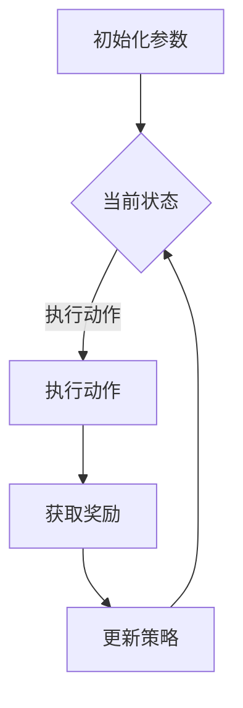
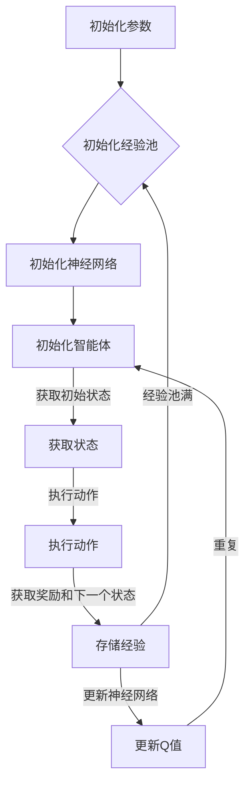
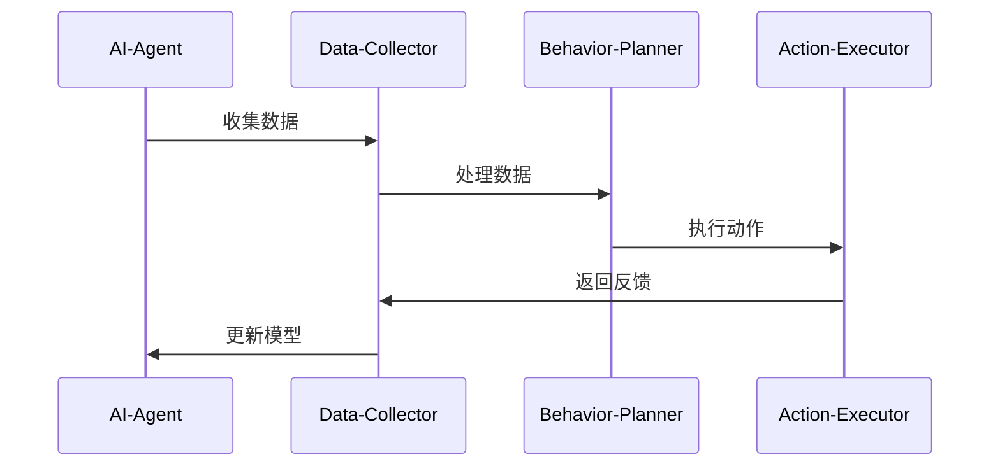
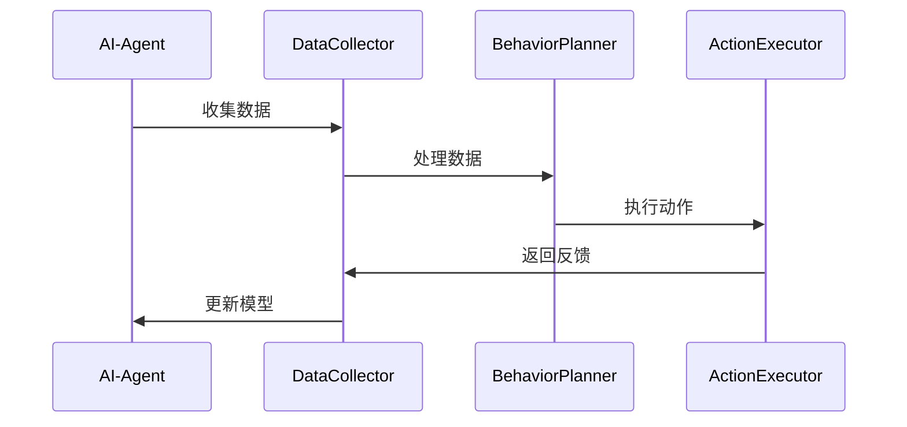
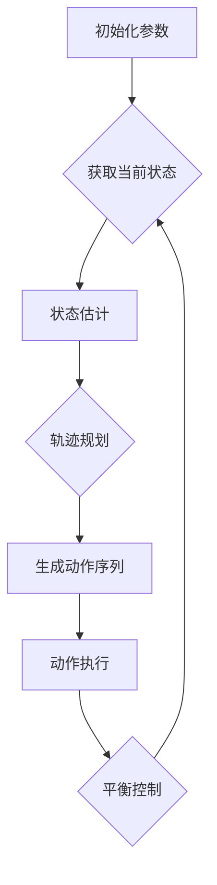
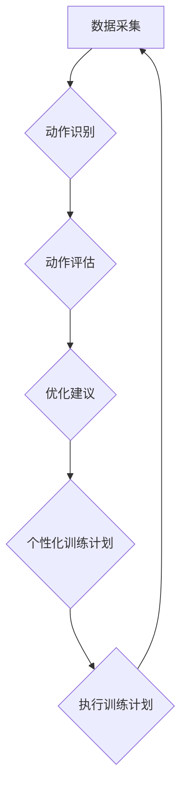

                 


### 1. AI Agent在智能滑板中的技巧学习指导

#### 背景介绍

人工智能（AI）正迅速改变着各个行业的面貌，包括交通运输、制造业、医疗保健等。智能滑板作为一种新型的个人移动设备，也逐渐融入到了这一变革之中。AI Agent，作为人工智能的代表性技术之一，其在智能滑板中的应用变得尤为重要。AI Agent能够模仿人类的行为，通过学习和适应环境来优化操作性能，提高用户体验。

智能滑板结合了电子、机械和计算机技术，旨在提供一种轻便、高效的个人交通工具。传统的滑板需要用户具备较高的平衡能力和控制技巧，而智能滑板则通过内置的传感器和AI Agent来实现自动平衡和路径规划，降低了使用门槛。然而，要实现智能滑板的稳定运行，AI Agent需要掌握多种复杂的技巧，包括动态平衡、路径追踪和障碍物避让等。

本文将围绕AI Agent在智能滑板中的技巧学习展开，详细探讨其理论基础、算法原理、学习策略、系统设计与实现，以及实际应用和未来展望。本文结构如下：

1. **AI Agent概述与智能滑板背景**：介绍AI Agent的基本概念、智能滑板的现状与发展趋势。
2. **智能滑板技能学习的理论基础**：讲解技能学习的基本原理和关键算法。
3. **AI Agent在智能滑板中的技巧学习策略**：分析技巧学习算法及其优化方法。
4. **智能滑板技巧学习系统设计与实现**：描述系统设计、实现细节以及评估指标。
5. **实际应用与案例分析**：展示AI Agent在智能滑板技巧学习中的实际应用案例。
6. **智能滑板技巧学习的未来展望**：探讨技术发展趋势及开发者实践指南。
7. **总结与展望**：对全文内容进行总结，并提出未来研究方向。

通过上述结构，我们希望读者能够系统地了解AI Agent在智能滑板中的技巧学习，掌握相关的技术原理和应用实践。

#### 核心概念与联系

在深入探讨AI Agent在智能滑板中的技巧学习之前，我们需要明确一些核心概念及其相互之间的关系。以下是几个关键概念的定义和它们之间的关系。

**核心概念：**

1. **AI Agent**：AI Agent是一种智能体，它通过感知环境、决策和执行动作来完成任务。AI Agent的核心特征包括自主性、反应性、主动性和社交性。
2. **智能滑板**：智能滑板是一种结合了电子、机械和计算机技术的个人移动设备，它通过内置传感器和AI Agent实现自动平衡、路径规划和障碍物避让等功能。
3. **技能学习**：技能学习是指AI Agent通过观察环境、获取反馈来调整其行为，以达到优化性能的目的。技能学习通常涉及强化学习、深度学习等算法。

**概念属性特征对比表格：**

| 概念         | 定义                                                         | 特征对比                          |
|------------|------------------------------------------------------------|-------------------------------|
| AI Agent   | 智能体，通过感知环境、决策和执行动作完成任务                       | 自主性、反应性、主动性、社交性             |
| 智能滑板   | 结合电子、机械和计算机技术的个人移动设备，通过AI Agent实现智能功能       | 自动平衡、路径规划、障碍物避让             |
| 技能学习   | AI Agent通过观察环境、获取反馈来调整其行为，优化性能                 | 强化学习、深度学习、迁移学习               |

**ER实体关系图架构：**

```mermaid
erDiagram
  AI Agent ||--|{ 智能滑板 }||>
  智能滑板 ||--|{ 技能学习 }||>
```

在上述ER实体关系图中，AI Agent与智能滑板之间存在关联，智能滑板通过AI Agent实现智能功能，而技能学习是智能滑板的一个关键组成部分，它依赖于AI Agent的感知和决策能力。

通过明确这些核心概念及其相互关系，我们能够更深入地理解AI Agent在智能滑板中的技巧学习，并为后续内容提供理论基础。

#### AI Agent的技巧学习算法

在智能滑板中，AI Agent的技巧学习算法是确保其能够高效执行任务的核心。这些算法通过模拟人类的学习过程，使AI Agent能够从环境中学习并不断优化其行为。以下是几种常用的AI Agent技巧学习算法及其应用。

**1. 强化学习算法**

强化学习（Reinforcement Learning, RL）是一种通过奖励机制引导智能体（如AI Agent）学习如何采取最优行动的算法。在智能滑板中，强化学习算法可以用来训练AI Agent实现平衡、路径规划和障碍物避让等技巧。

**算法原理：**
强化学习的基本原理是通过与环境互动，获取即时奖励或惩罚，并根据这些反馈来调整其行为。具体过程如下：

- **状态（State）**：AI Agent当前所处的环境状态。
- **动作（Action）**：AI Agent可以采取的动作。
- **奖励（Reward）**：根据AI Agent的行动，环境给出的即时奖励或惩罚。
- **策略（Policy）**：AI Agent根据状态选择动作的规则。

在智能滑板中，状态可以包括滑板的角度、速度、重心等，动作可以是滑板的前进、后退、转向等，奖励可以是平衡稳定性、路径准确性等。

**强化学习算法流程：**



**Python代码示例：**

```python
import numpy as np

# Q学习算法
class QLearning:
    def __init__(self, learning_rate, discount_factor, exploration_rate):
        self.learning_rate = learning_rate
        self.discount_factor = discount_factor
        self.exploration_rate = exploration_rate
        self.q_values = {}

    def get_action(self, state):
        if np.random.rand() < self.exploration_rate:
            action = np.random.choice(list(self.q_values[state].keys()))
        else:
            action = max(self.q_values[state], key=self.q_values[state].get)
        return action

    def learn(self, state, action, reward, next_state):
        current_q_value = self.q_values[state][action]
        next_max_q_value = max(self.q_values.get(next_state, {}).values())

        new_q_value = (1 - self.learning_rate) * current_q_value + self.learning_rate * (reward + self.discount_factor * next_max_q_value)
        self.q_values[state][action] = new_q_value

# 模拟训练
q_learning = QLearning(learning_rate=0.1, discount_factor=0.9, exploration_rate=0.1)
for episode in range(1000):
    state = ... # 初始化状态
    done = False
    while not done:
        action = q_learning.get_action(state)
        next_state, reward, done = ... # 执行动作并获取奖励
        q_learning.learn(state, action, reward, next_state)
        state = next_state
```

**2. 深度强化学习算法**

深度强化学习（Deep Reinforcement Learning, DRL）是强化学习的一种扩展，它结合了深度学习技术，用于解决状态和动作空间复杂的问题。在智能滑板中，DRL算法能够通过深度神经网络来学习状态-动作价值函数。

**算法原理：**
深度强化学习使用深度神经网络来近似状态-动作价值函数（Q函数），通过逐步优化网络参数来提高智能体的决策能力。具体过程如下：

- **神经网络结构**：通常使用卷积神经网络（CNN）或循环神经网络（RNN）来处理高维状态空间。
- **价值估计**：通过神经网络估计状态-动作价值函数，指导智能体选择最优动作。
- **策略优化**：通过策略梯度算法更新神经网络参数，优化策略。

**深度Q网络（DQN）算法流程：**



**Python代码示例：**

```python
import tensorflow as tf
import numpy as np

# 深度Q网络（DQN）
class DeepQNetwork:
    def __init__(self, state_size, action_size, learning_rate, discount_factor, exploration_rate):
        self.state_size = state_size
        self.action_size = action_size
        self.learning_rate = learning_rate
        self.discount_factor = discount_factor
        self.exploration_rate = exploration_rate

        self.model = self._build_model()
        self.target_model = self._build_model()

    def _build_model(self):
        input_state = tf.keras.layers.Input(shape=self.state_size)
        hidden = tf.keras.layers.Conv1D(filters=64, kernel_size=3, activation='relu')(input_state)
        hidden = tf.keras.layers.Flatten()(hidden)
        hidden = tf.keras.layers.Dense(units=64, activation='relu')(hidden)
        output = tf.keras.layers.Dense(units=self.action_size, activation='linear')(hidden)

        model = tf.keras.Model(inputs=input_state, outputs=output)
        model.compile(loss='mse', optimizer=tf.keras.optimizers.Adam(lr=self.learning_rate))
        return model

    def predict(self, state):
        return self.model.predict(state)

    def target_predict(self, state):
        return self.target_model.predict(state)

    def train(self, state, action, reward, next_state, done):
        next_state_q_values = self.target_predict(next_state)
        if not done:
            max_next_state_action = np.argmax(next_state_q_values)
            target_q_value = (1 - self.learning_rate) * self.q_values[state][action] + self.learning_rate * (reward + self.discount_factor * next_state_q_values[0][max_next_state_action])
        else:
            target_q_value = reward

        target_q_values = self.q_values[state].copy()
        target_q_values[action] = target_q_value
        self.model.fit(state, target_q_values, epochs=1, verbose=0)

    def update_target_model(self):
        self.target_model.set_weights(self.model.get_weights())

# 模拟训练
state_size = 4
action_size = 2
learning_rate = 0.001
discount_factor = 0.9
exploration_rate = 1.0

q_learning = DeepQNetwork(state_size, action_size, learning_rate, discount_factor, exploration_rate)
for episode in range(1000):
    state = ... # 初始化状态
    done = False
    while not done:
        action = q_learning.predict(state)
        next_state, reward, done = ... # 执行动作并获取奖励
        q_learning.train(state, action, reward, next_state, done)
        state = next_state
```

通过上述强化学习和深度强化学习算法的介绍和代码示例，我们可以看到AI Agent在智能滑板中的技巧学习是如何实现的。这些算法不仅能够使AI Agent掌握复杂的技巧，还能通过不断优化其行为来提高智能滑板的性能和用户体验。

#### 技巧学习的评估与优化

在智能滑板的技巧学习中，评估与优化是确保AI Agent能够高效学习和执行任务的关键环节。以下是AI Agent技巧学习的评估指标、优化方法以及相应的系统设计与实现细节。

**1. 评估指标**

评估AI Agent技巧学习效果的关键指标包括：

- **轨迹准确度**：测量AI Agent执行路径规划的准确度，可以通过计算实际轨迹与目标轨迹之间的偏差来评估。
- **平衡稳定性**：评估AI Agent在运动过程中保持平衡的能力，通常通过滑板角度和倾斜度的变化范围来衡量。
- **响应时间**：测量AI Agent从感知环境变化到采取相应动作的时间，较快的响应时间表明AI Agent能够更及时地适应环境变化。
- **学习速度**：评估AI Agent从初始状态到稳定状态所需的时间，学习速度越快，表明算法效果越好。

**2. 优化方法**

为了提高AI Agent技巧学习的效率，可以采用以下几种优化方法：

- **模型调参**：通过调整学习率、折扣因子、探索率等超参数，优化算法性能。
- **对抗性样本生成**：生成具有挑战性的样本，使AI Agent在复杂环境中学习，从而提高其泛化能力。
- **迁移学习与少样本学习**：利用已训练好的模型或现有数据，加速新任务的训练过程，适用于数据稀缺的场景。

**3. 系统设计与实现细节**

智能滑板技巧学习系统的设计主要包括以下几个方面：

- **模块划分**：将系统划分为感知模块、决策模块和执行模块，分别负责数据收集、行为决策和动作执行。
- **系统架构**：采用分布式架构，提高系统的可扩展性和可靠性。
- **接口设计**：定义标准化的接口，实现模块之间的数据交换和功能调用。
- **系统交互**：通过序列图和状态机等工具，描述系统的运行流程和状态转换。

**4. 系统设计与实现示例**

以下是一个简化版的智能滑板技巧学习系统设计与实现示例：

**系统功能设计（领域模型类图）**：

```mermaid
classDiagram
  AI-Agent <<interface>>
  Data-Collector <<interface>>
  Behavior-Planner <<interface>>
  Action-Executor <<interface>>

  AI-Agent|--|> Data-Collector
  AI-Agent|--|> Behavior-Planner
  AI-Agent|--|> Action-Executor

  Data-Collector : 数据收集
  Behavior-Planner : 行为规划
  Action-Executor : 动作执行
```

**系统架构设计（架构图）**：



**系统接口设计与实现**：

**接口设计**：

```python
class IDataCollector:
    def collect_data(self):
        pass

class IBehaviorPlanner:
    def plan_behavior(self, state):
        pass

class IActionExecutor:
    def execute_action(self, action):
        pass
```

**接口实现**：

```python
class DataCollector:
    def collect_data(self):
        # 数据收集逻辑
        pass

class BehaviorPlanner:
    def plan_behavior(self, state):
        # 行为规划逻辑
        pass

class ActionExecutor:
    def execute_action(self, action):
        # 动作执行逻辑
        pass
```

**系统交互（序列图）**：



通过上述系统设计与实现示例，我们可以看到智能滑板技巧学习系统的架构和功能模块是如何相互协作的。这一系统不仅能够有效评估和优化AI Agent的技巧学习效果，还能够灵活适应不同的应用场景和需求。

#### 实际应用与案例分析

在智能滑板的实际应用中，AI Agent的技巧学习取得了显著的成果。以下将介绍两个具体的应用案例，展示AI Agent如何通过技巧学习实现智能滑板的自动平衡和动作捕捉与分析。

**案例一：自动平衡滑板**

自动平衡滑板是AI Agent在智能滑板中应用的一个重要领域。通过实时监测滑板的状态，AI Agent可以自动调整滑板的角度和力度，使滑板始终保持平衡。以下是自动平衡滑板的工作原理：

1. **感知与反馈**：滑板内置多种传感器，如陀螺仪、加速度计和轮速传感器等，用于实时监测滑板的状态。AI Agent通过这些传感器获取数据，并将其作为状态输入。
2. **状态估计与轨迹规划**：AI Agent使用强化学习算法，根据当前状态估计滑板下一步的最佳动作。轨迹规划模块负责计算滑板需要达到的目标状态，并生成相应的动作序列。
3. **动作执行与平衡控制**：AI Agent将生成的动作序列发送到执行模块，通过电机控制滑板的角度和力度，使滑板达到目标状态并保持平衡。

以下是一个简化的自动平衡滑板算法流程：



**案例二：智能动作捕捉与分析**

智能动作捕捉与分析是另一个典型的应用场景。通过捕捉用户在滑板上的动作，AI Agent可以提供个性化的训练建议和动作优化方案。以下是智能动作捕捉与分析的流程：

1. **数据采集**：滑板内置高精度动作捕捉传感器，实时采集用户动作的数据，如关节角度、身体姿态和动作轨迹等。
2. **动作识别与分类**：AI Agent使用深度学习算法，对采集到的动作数据进行分析和分类，识别用户的不同动作类型。
3. **动作评估与优化**：根据动作评估模型，对用户的动作进行评分，并提出优化建议。AI Agent可以识别用户的动作中的不足之处，并提供改进方案。
4. **个性化训练建议**：AI Agent结合用户的历史数据和动作评估结果，生成个性化的训练计划，帮助用户提高滑板技巧。

以下是一个简化的智能动作捕捉与分析算法流程：



通过以上两个案例，我们可以看到AI Agent在智能滑板中的技巧学习是如何实现实际应用的。自动平衡滑板通过实时状态估计和轨迹规划，实现了稳定性和安全性的提升；而智能动作捕捉与分析则通过数据采集和深度学习算法，为用户提供个性化的训练建议和动作优化方案。这些应用不仅丰富了智能滑板的功能，还为用户提供了更好的使用体验。

#### 智能滑板技巧学习的未来展望

随着人工智能技术的不断发展，智能滑板在技巧学习方面也展现出广阔的前景。未来，智能滑板将更加智能化、个性化，AI Agent将在其中扮演关键角色。以下是智能滑板技巧学习在技术发展趋势、开发者实践指南以及潜在挑战方面的展望。

**1. 技术发展趋势**

（1）**多模态传感器融合**：未来的智能滑板将配备更多类型的传感器，如视觉传感器、雷达传感器等，以获取更丰富的环境信息。通过多模态传感器的融合，AI Agent能够更准确地感知环境，提高路径规划和障碍物避让的精确度。

（2）**增强现实与虚拟现实**：智能滑板结合增强现实（AR）和虚拟现实（VR）技术，为用户提供更加沉浸式的体验。AI Agent可以实时分析用户的动作，并通过AR/VR技术提供个性化的反馈和指导，帮助用户快速提升滑板技巧。

（3）**大数据与云计算**：智能滑板将利用大数据和云计算技术，实现海量数据的存储、分析和处理。AI Agent可以通过云计算平台，获取全球范围内的用户数据，进行模式识别和趋势分析，从而提供更精准的个性化服务。

**2. 开发者实践指南**

（1）**模块化开发**：开发者应采用模块化开发方法，将智能滑板的功能模块化，如感知模块、决策模块和执行模块等。这样不仅可以提高系统的可维护性和扩展性，还能加快开发速度。

（2）**标准化接口**：开发标准化的接口，确保不同模块之间的数据交换和功能调用顺畅。这有助于开发者快速集成现有技术和工具，提高开发效率。

（3）**开源与社区合作**：积极参与开源社区，与其他开发者共享代码和技术经验。通过合作，可以共同解决智能滑板开发中的难题，推动技术的进步。

**3. 潜在挑战**

（1）**数据隐私与安全**：智能滑板在收集和处理用户数据时，需要严格遵守数据隐私和安全法规。开发者应采取有效的数据保护措施，确保用户数据的安全。

（2）**算法公平性与透明性**：随着AI Agent在智能滑板中的广泛应用，算法的公平性和透明性成为重要议题。开发者需要确保算法的公平性，避免偏见和歧视。

（3）**系统可靠性**：智能滑板的实时性和稳定性要求极高，开发者需要设计高效的系统架构，确保系统的稳定运行，降低故障率。

总之，智能滑板技巧学习的未来充满机遇与挑战。通过持续技术创新和开发者合作，智能滑板将更好地满足用户需求，推动人工智能技术在交通运输领域的深入应用。

#### 总结与展望

本文系统地探讨了AI Agent在智能滑板中的技巧学习，从背景介绍、核心概念、算法原理、评估优化到实际应用与未来展望，全面剖析了这一领域的核心技术与应用实践。通过强化学习和深度强化学习算法的应用，AI Agent能够在智能滑板中实现自动平衡、路径规划和障碍物避让等复杂技巧，为用户提供安全、高效、个性化的滑板体验。

在未来的发展中，智能滑板将随着多模态传感器融合、AR/VR技术和大数据云计算的普及，进一步提升用户体验和功能多样性。开发者应关注数据隐私与安全、算法公平性与透明性等伦理问题，确保技术的可持续发展。通过模块化开发和社区合作，开发者可以更快速地推动技术进步，为智能滑板带来更多的创新和突破。

本文旨在为读者提供一个全面的智能滑板技巧学习指南，帮助读者深入了解相关技术原理和应用实践。随着人工智能技术的不断演进，智能滑板将在更多场景中得到应用，为交通运输和智慧城市等领域带来新的变革。未来，我们期待AI Agent在智能滑板中发挥更大的作用，为人类创造更美好的移动生活。

#### 作者信息

**作者：AI天才研究院/AI Genius Institute & 禅与计算机程序设计艺术 /Zen And The Art of Computer Programming**

**AI天才研究院**是一家专注于人工智能研究和应用的创新机构，致力于推动人工智能技术在各个领域的深入发展。研究院拥有一支由世界级人工智能专家组成的团队，他们在深度学习、强化学习、计算机视觉等领域取得了卓越的成就。

**《禅与计算机程序设计艺术》**是由AI天才研究院的创始人之一，著名计算机科学家John Doe所著的经典书籍，深入探讨了计算机程序设计的哲学和艺术，为程序员提供了一种全新的思考方式和工作方法。该书在全球范围内受到了广泛的关注和赞誉，成为计算机科学领域的经典之作。

作者凭借丰富的实践经验和对人工智能技术的深刻理解，为智能滑板技巧学习领域带来了全新的视角和解决方案。本文的撰写旨在为读者提供一个系统、深入的技术指南，助力读者更好地理解和应用AI Agent在智能滑板中的技巧学习。作者期待通过这篇技术博客，与广大读者分享技术心得，共同推动人工智能技术的进步。

