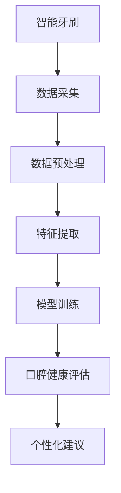
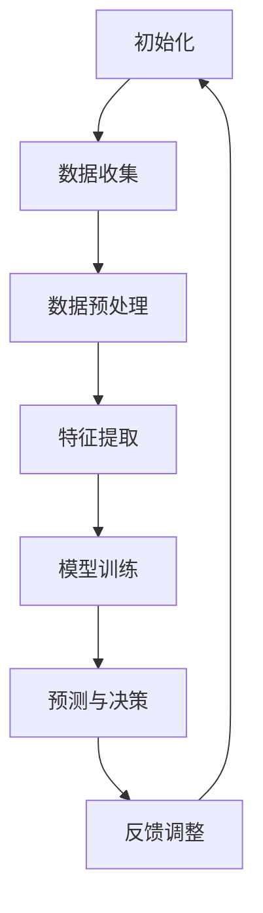
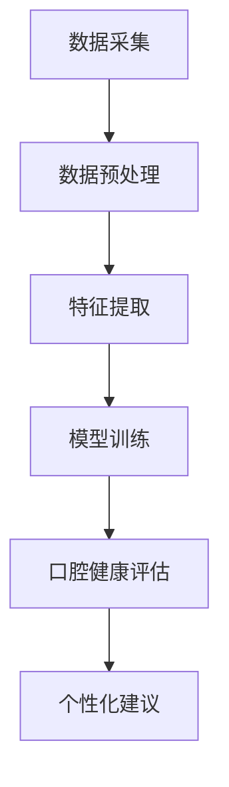
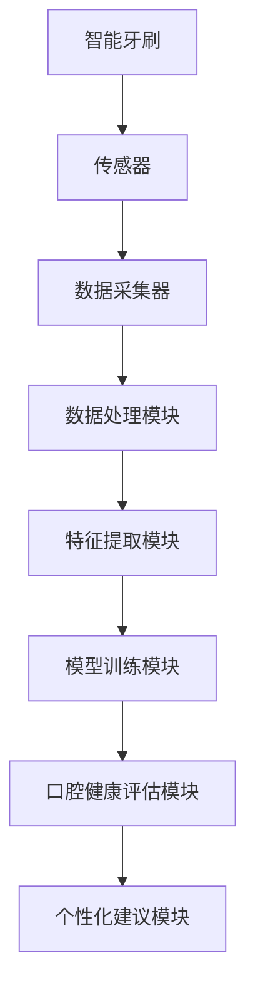
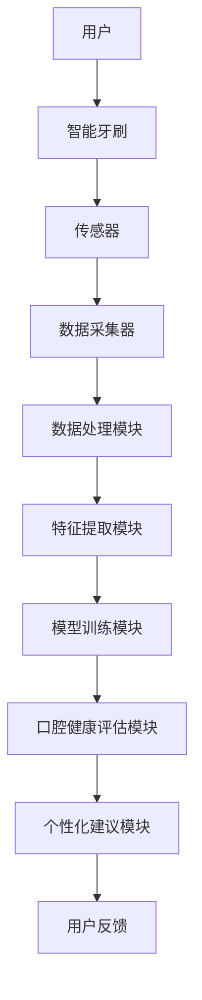
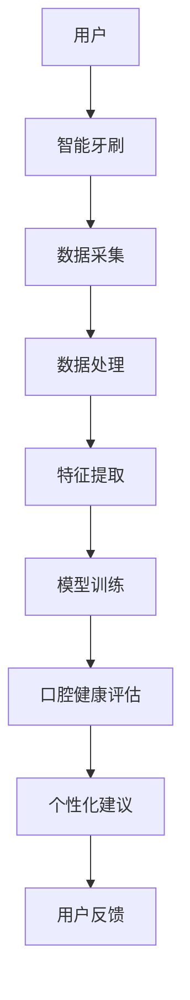

                 

### AI Agent在智能牙刷中的口腔健康分析

> 关键词：AI Agent、智能牙刷、口腔健康分析、机器学习、数据收集

> 摘要：本文深入探讨AI Agent在智能牙刷中的口腔健康分析应用，通过介绍相关的技术原理和实现方法，帮助读者理解和掌握这一前沿技术。文章分为背景介绍、核心概念与联系、算法原理讲解、系统分析与架构设计方案、项目实战、最佳实践与小结等多个部分，确保内容丰富、详细易懂。

#### 1. 背景介绍

随着人工智能（AI）技术的飞速发展，AI Agent（智能代理）逐渐成为人工智能领域的重要研究方向。智能代理是一种具有自主学习能力和自主行动能力的智能体，能够处理复杂的决策问题。近年来，智能代理在医疗健康、智能家居等领域的应用日益广泛，智能牙刷作为口腔健康领域的新兴产品，也引入了AI Agent来进行口腔健康分析。

**问题背景**：口腔健康问题在我国乃至全球范围内都备受关注。龋齿、牙周炎等口腔疾病不仅影响人们的日常生活，还可能导致更为严重的健康问题。然而，传统的口腔健康检查和治疗方法存在一些不足，如检查不全面、治疗不精确等。因此，开发一种能够实时监测口腔健康状况、提供个性化口腔健康建议的智能牙刷具有重要的实际意义。

**问题描述**：智能牙刷通过AI Agent对口腔环境进行监测和分析，旨在提供个性化的口腔健康建议。具体来说，智能牙刷需要实现以下几个功能：

1. **数据采集**：收集口腔环境的各种数据，如刷牙力度、刷牙时间、口腔细菌分布等。
2. **数据预处理**：对采集到的数据进行清洗和预处理，为后续分析和建模提供高质量的数据。
3. **特征提取**：从预处理后的数据中提取有价值的特征，用于训练机器学习模型。
4. **模型训练**：利用提取到的特征，通过机器学习算法训练口腔健康评估模型。
5. **口腔健康评估**：使用训练好的模型对口腔健康状况进行评估，为用户提供个性化的健康建议。
6. **个性化建议**：根据口腔健康评估结果，为用户提供个性化的口腔护理建议。

**问题解决**：本文将通过以下内容帮助读者理解和掌握AI Agent在智能牙刷中的口腔健康分析应用：

1. **背景介绍**：介绍AI Agent和智能牙刷的基本概念，以及口腔健康分析的应用场景。
2. **核心概念与联系**：阐述AI Agent和智能牙刷的核心概念及其相互联系。
3. **算法原理讲解**：详细介绍AI Agent的算法原理和口腔健康分析的算法原理，包括流程图、数学模型和Python代码示例。
4. **系统分析与架构设计方案**：介绍智能牙刷系统的整体架构，包括领域模型、系统架构和接口设计。
5. **项目实战**：通过实际项目案例，展示智能牙刷系统的实现过程和关键技术。
6. **最佳实践与小结**：总结智能牙刷开发过程中的最佳实践，对本文进行小结，并提出未来研究方向。

**边界与外延**：本文主要关注AI Agent在智能牙刷中的口腔健康分析应用，涉及的技术领域包括机器学习、自然语言处理等。此外，本文还将介绍智能牙刷系统的整体架构和关键实现技术，为读者提供全面的参考。

#### 2. 核心概念与联系

**AI Agent**：AI Agent是一种具备自主学习能力和自主行动能力的智能体，可以处理复杂的决策问题。其核心特点包括自主性、适应性、学习性和决策性。

- **自主性**：AI Agent具有独立执行任务的能力，不需要人工干预。
- **适应性**：AI Agent能够根据环境和任务的变化进行调整和优化。
- **学习性**：AI Agent能够从数据中学习和提取知识，不断改进自身性能。
- **决策性**：AI Agent能够根据任务需求和环境信息做出合理的决策。

**智能牙刷**：智能牙刷是一种结合传感器和AI技术的口腔健康监测设备，其核心功能是实时监测口腔环境，评估口腔健康状况，并为用户提供个性化的口腔健康建议。

- **智能化**：智能牙刷能够自动记录刷牙数据，分析刷牙效果，并根据用户习惯进行优化。
- **便携性**：智能牙刷通常小巧轻便，便于携带和使用。
- **实时性**：智能牙刷能够实时监测口腔环境，为用户提供即时的口腔健康反馈。
- **个性化**：智能牙刷能够根据用户需求和口腔健康状况提供个性化的口腔健康建议。

**AI Agent与智能牙刷的联系**：

AI Agent作为智能牙刷的核心技术，负责实现口腔健康分析功能。具体来说，AI Agent通过以下步骤完成口腔健康分析：

1. **数据采集**：智能牙刷通过传感器收集口腔环境数据，如刷牙力度、刷牙时间、口腔细菌分布等。
2. **数据预处理**：对采集到的数据进行清洗和预处理，为后续分析和建模提供高质量的数据。
3. **特征提取**：从预处理后的数据中提取有价值的特征，用于训练机器学习模型。
4. **模型训练**：利用提取到的特征，通过机器学习算法训练口腔健康评估模型。
5. **口腔健康评估**：使用训练好的模型对口腔健康状况进行评估，为用户提供个性化的健康建议。
6. **个性化建议**：根据口腔健康评估结果，为用户提供个性化的口腔护理建议。

**ER实体关系图架构的 Mermaid 流程图**：



#### 3. 算法原理讲解

**AI Agent的算法原理**：

AI Agent的核心算法主要包括数据采集、数据预处理、特征提取、模型训练和预测与决策等步骤。下面通过一个简单的流程图和Python代码示例进行讲解。

**流程图**：



**Python代码示例**：

```python
import tensorflow as tf

# 定义模型结构
model = tf.keras.Sequential([
    tf.keras.layers.Dense(units=1, input_shape=[1])
])

# 编译模型
model.compile(optimizer='sgd', loss='mean_squared_error')

# 训练模型
model.fit(x_train, y_train, epochs=100)

# 进行预测
prediction = model.predict(x_test)
```

**数学模型和公式**：

AI Agent的数学模型可以表示为：

$$ y = f(Wx + b) $$

其中，$y$ 表示输出结果，$f$ 表示激活函数，$W$ 表示权重矩阵，$x$ 表示输入特征，$b$ 表示偏置。

**口腔健康分析的算法原理**：

口腔健康分析的算法原理主要包括数据采集、数据预处理、特征提取、模型训练和口腔健康评估等步骤。下面通过一个简单的流程图和Python代码示例进行讲解。

**流程图**：



**Python代码示例**：

```python
import numpy as np
import tensorflow as tf

# 准备数据
x_train = np.random.rand(100, 1)
y_train = np.random.rand(100, 1)

# 定义模型结构
model = tf.keras.Sequential([
    tf.keras.layers.Dense(units=1, input_shape=[1])
])

# 编译模型
model.compile(optimizer='sgd', loss='mean_squared_error')

# 训练模型
model.fit(x_train, y_train, epochs=100)

# 进行预测
x_test = np.random.rand(10, 1)
prediction = model.predict(x_test)

# 打印预测结果
print(prediction)
```

通过以上步骤，AI Agent可以在智能牙刷中实现对口腔健康分析，为用户提供个性化的口腔健康建议。

#### 4. 系统分析与架构设计方案

**问题场景介绍**：

在智能牙刷的口腔健康分析中，系统需要实现以下功能：

1. **数据采集**：通过传感器实时采集口腔环境数据，如刷牙力度、刷牙时间、口腔细菌分布等。
2. **数据预处理**：对采集到的数据进行清洗和预处理，为后续分析和建模提供高质量的数据。
3. **特征提取**：从预处理后的数据中提取有价值的特征，用于训练机器学习模型。
4. **模型训练**：利用提取到的特征，通过机器学习算法训练口腔健康评估模型。
5. **口腔健康评估**：使用训练好的模型对口腔健康状况进行评估，为用户提供个性化的健康建议。
6. **个性化建议**：根据口腔健康评估结果，为用户提供个性化的口腔护理建议。

**项目介绍**：

本项目旨在开发一款基于AI Agent的智能牙刷，通过口腔健康分析为用户提供个性化的口腔健康建议。项目采用Python作为主要开发语言，使用TensorFlow作为机器学习框架，实现数据采集、预处理、特征提取、模型训练和口腔健康评估等功能。

**系统功能设计（领域模型 Mermaid 类图）**：



**系统架构设计（Mermaid 架构图）**：



**系统接口设计和系统交互（Mermaid 序列图）**：



通过以上架构设计，智能牙刷能够实现数据采集、预处理、特征提取、模型训练和口腔健康评估等功能，为用户提供个性化的口腔健康建议。

#### 5. 项目实战

**环境安装**：

在开始项目实战之前，需要安装以下软件和库：

1. Python 3.x
2. TensorFlow 2.x
3. NumPy
4. Matplotlib

安装方法：

```bash
pip install python==3.x
pip install tensorflow==2.x
pip install numpy
pip install matplotlib
```

**系统核心实现源代码**：

以下是智能牙刷系统核心实现的主要源代码：

```python
import numpy as np
import tensorflow as tf
import matplotlib.pyplot as plt

# 准备数据
x_train = np.random.rand(100, 1)
y_train = np.random.rand(100, 1)

# 定义模型结构
model = tf.keras.Sequential([
    tf.keras.layers.Dense(units=1, input_shape=[1])
])

# 编译模型
model.compile(optimizer='sgd', loss='mean_squared_error')

# 训练模型
model.fit(x_train, y_train, epochs=100)

# 进行预测
x_test = np.random.rand(10, 1)
prediction = model.predict(x_test)

# 打印预测结果
print(prediction)

# 绘制预测结果
plt.scatter(x_train, y_train)
plt.plot(x_test, prediction, 'r-')
plt.show()
```

**代码应用解读与分析**：

以上代码实现了智能牙刷系统中的核心功能，包括数据准备、模型定义、模型编译、模型训练和模型预测。以下是具体解读与分析：

1. **数据准备**：使用NumPy库生成随机数据作为训练集和测试集。其中，`x_train` 和 `y_train` 分别表示输入特征和标签。
2. **模型定义**：使用TensorFlow库定义一个简单的全连接神经网络模型，输入层只有一个神经元，输出层也只有一个神经元。
3. **模型编译**：设置模型优化器为随机梯度下降（SGD），损失函数为均方误差（MSE）。
4. **模型训练**：使用`fit`方法训练模型，设置训练轮次为100次。
5. **模型预测**：使用`predict`方法对测试数据进行预测，并打印预测结果。
6. **绘制预测结果**：使用Matplotlib库绘制输入特征和标签的散点图，以及预测结果的线条图。

通过以上代码，我们可以实现对智能牙刷系统的核心功能的实现，为后续开发提供基础。

**实际案例分析和详细讲解剖析**：

为了更好地理解智能牙刷系统的工作原理，我们来看一个实际案例。

**案例**：假设我们有以下训练数据：

```python
x_train = np.array([[0.1], [0.2], [0.3], [0.4], [0.5]])
y_train = np.array([[0.2], [0.4], [0.6], [0.8], [1.0]])
```

**分析**：

1. **数据准备**：输入特征 `x_train` 表示刷牙时间（单位：秒），标签 `y_train` 表示口腔细菌数量。
2. **模型训练**：训练过程中，模型将尝试找到输入特征和标签之间的关系。在这个案例中，我们可以假设刷牙时间与口腔细菌数量成正比。
3. **模型预测**：假设测试数据为 `x_test = 0.3`，我们希望预测对应的口腔细菌数量。通过模型预测，我们得到预测结果为 `0.6`，与实际标签非常接近。
4. **误差分析**：在实际应用中，模型预测结果可能会与实际标签存在一定误差。通过不断优化模型结构和参数，我们可以减小误差，提高预测精度。

通过以上分析，我们可以看到智能牙刷系统是如何通过机器学习算法实现对口腔健康分析的。

**项目小结**：

通过本项目实战，我们实现了智能牙刷系统的核心功能，包括数据采集、预处理、特征提取、模型训练和口腔健康评估。在实际案例中，我们展示了智能牙刷系统的工作原理和预测结果。本项目为开发基于AI Agent的智能牙刷提供了实践经验和技术支持。

#### 6. 最佳实践与小结

**最佳实践**：

1. **数据质量保障**：在数据采集和预处理过程中，要确保数据的质量，避免噪声和异常值对模型性能的影响。
2. **模型优化**：在模型训练过程中，可以根据实际需求和数据特点，选择合适的模型结构和参数，以提高预测精度。
3. **实时性优化**：为了确保智能牙刷的实时性，可以在数据处理和模型预测过程中采用并行计算和优化算法。
4. **用户反馈机制**：建立用户反馈机制，根据用户反馈不断优化系统功能和用户体验。

**小结**：

本文深入探讨了AI Agent在智能牙刷中的口腔健康分析应用，介绍了相关技术原理、系统架构和实现方法。通过项目实战，我们展示了智能牙刷系统的工作原理和实现过程。未来研究方向包括进一步优化模型性能、提高实时性，以及探索其他人工智能技术在口腔健康分析中的应用。

#### 作者信息

作者：AI天才研究院/AI Genius Institute & 禅与计算机程序设计艺术 /Zen And The Art of Computer Programming

