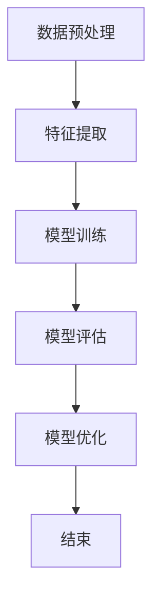
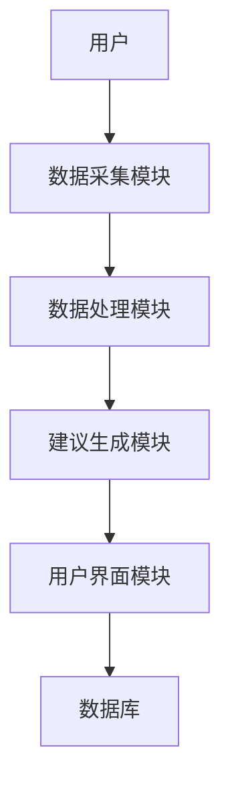

                 

# AI Agent在智能牙刷中的口腔健康追踪

关键词：人工智能，智能牙刷，口腔健康，AI Agent，数据采集与分析

摘要：本文深入探讨了AI Agent在智能牙刷中的口腔健康追踪应用。首先，我们介绍了口腔健康问题的背景和智能牙刷的发展趋势，随后讲解了AI Agent的概念及其在口腔健康追踪中的潜力。接着，我们详细分析了AI Agent的原理和功能，包括数据收集与分析的方法。随后，我们介绍了相关的算法原理和系统架构设计，并通过实际案例展示了系统实现的步骤和要点。最后，我们提出了最佳实践建议和注意事项，并展望了相关技术的发展趋势。

## 第一部分：背景介绍

### 1.1 问题背景

#### 1.1.1 口腔健康的现状

口腔健康是全民健康的重要组成部分，然而，口腔疾病在全球范围内具有很高的发病率。根据世界卫生组织（WHO）的数据，全球约有60%-90%的学龄儿童和近100%的成年人有蛀牙经历。牙周疾病也是一个严重问题，全球约有50%的成年人患有不同程度的牙周疾病。这些疾病的防治依赖于及时、准确的口腔健康数据，而传统的口腔健康监测方法往往存在许多局限性。

#### 1.1.2 智能牙刷的发展趋势

随着科技的发展，智能牙刷作为一种新兴的个人口腔健康监测工具，正在逐步进入人们的日常生活。智能牙刷通过集成传感器和数据处理技术，能够实时监测用户的刷牙行为和口腔健康状况。据市场调研公司数据显示，全球智能牙刷市场规模预计将在未来五年内实现显著增长，年复合增长率可达25%以上。

#### 1.1.3 AI Agent的概念与应用

AI Agent，即人工智能代理，是一种可以自主执行任务、与环境互动并不断学习的智能实体。在智能牙刷中，AI Agent可以扮演口腔健康追踪者的角色，通过分析用户刷牙数据，提供个性化的口腔健康建议。AI Agent的应用不仅提高了口腔健康监测的准确性，还为用户提供了更为智能化的口腔健康解决方案。

### 1.2 问题描述

#### 1.2.1 口腔健康追踪的挑战

口腔健康追踪面临着许多挑战，包括数据收集难度大、数据准确性要求高、用户使用体验需要优化等。传统的口腔健康监测方法主要依赖于医生的检查和用户的自我报告，存在主观性和局限性。而智能牙刷通过传感器和AI技术，可以提供更为准确和实时的口腔健康数据。

#### 1.2.2 AI Agent的功能需求

为了实现有效的口腔健康追踪，AI Agent需要具备以下功能需求：

1. 数据采集与处理：AI Agent需要能够实时采集用户刷牙行为数据，并进行有效的数据预处理和特征提取。
2. 数据分析与预测：AI Agent需要具备强大的数据分析能力，能够从大量数据中提取有价值的信息，并进行预测分析。
3. 个性化建议：AI Agent需要根据用户的具体情况，提供个性化的口腔健康建议。

#### 1.2.3 AI Agent在智能牙刷中的应用潜力

AI Agent在智能牙刷中的应用潜力巨大。首先，它可以提高口腔健康监测的准确性和效率。其次，通过个性化建议，AI Agent可以帮助用户更好地管理口腔健康，预防口腔疾病。此外，AI Agent还可以为口腔医生提供辅助诊断工具，提高诊断的准确性。

### 1.3 问题解决

#### 1.3.1 AI Agent的原理

AI Agent的原理基于机器学习和人工智能技术。通过训练模型，AI Agent可以学习和理解用户的刷牙行为和口腔健康状况，从而提供个性化的建议。

#### 1.3.2 口腔健康数据收集与分析

口腔健康数据收集是AI Agent的核心环节。智能牙刷通过内置的传感器，可以实时采集用户的刷牙行为数据，如刷牙时间、刷牙力度、刷牙区域等。这些数据经过预处理和特征提取后，被用于训练AI模型。

#### 1.3.3 边界与外延

AI Agent在口腔健康追踪中的应用边界主要包括以下几个方面：

1. 刷牙行为监测：AI Agent可以监测用户的刷牙行为，并提供反馈。
2. 口腔健康评估：AI Agent可以根据采集的数据，评估用户的口腔健康状况。
3. 个性化建议：AI Agent可以提供个性化的口腔健康建议，帮助用户预防口腔疾病。

#### 1.4 概念结构与核心要素

AI Agent在智能牙刷中的概念结构主要包括以下核心要素：

1. 传感器：用于采集口腔健康数据。
2. 数据处理模块：负责数据预处理和特征提取。
3. 模型训练与优化：用于训练AI模型，提高预测准确性。
4. 建议生成模块：根据用户数据生成个性化的口腔健康建议。

## 第二部分：核心概念与联系

### 2.1 AI Agent原理

#### 2.1.1 AI Agent的定义

AI Agent是一种具有自主决策能力和学习能力的人工智能系统，能够在复杂环境中执行特定任务。

#### 2.1.2 AI Agent的核心特点

AI Agent的核心特点包括：

1. 自主性：AI Agent可以自主执行任务，无需人工干预。
2. 学习能力：AI Agent可以通过学习用户数据，不断提高任务执行的准确性。
3. 适应性：AI Agent可以根据环境变化，调整自身行为。

#### 2.1.3 AI Agent与传统传感器对比

与传统传感器相比，AI Agent具有更高的智能性和自主性。传统传感器只能被动采集数据，而AI Agent可以主动分析数据，提供决策建议。

### 2.2 口腔健康数据特征

#### 2.2.1 数据来源

口腔健康数据来源于智能牙刷的传感器，包括刷牙时间、刷牙力度、刷牙区域等。

#### 2.2.2 数据类型

口腔健康数据主要包括时间序列数据和分类数据。

#### 2.2.3 数据处理方法

数据处理方法包括数据预处理、特征提取和模型训练。数据预处理用于去除噪声和异常值，特征提取用于提取有价值的信息，模型训练用于建立预测模型。

### 2.3 AI Agent与口腔健康的联系

#### 2.3.1 AI Agent在口腔健康中的应用

AI Agent在口腔健康中的应用主要包括：

1. 刷牙行为监测：AI Agent可以监测用户的刷牙行为，提供实时反馈。
2. 口腔健康评估：AI Agent可以根据用户数据，评估口腔健康状况。
3. 个性化建议：AI Agent可以提供个性化的口腔健康建议。

#### 2.3.2 口腔健康数据对AI Agent的反馈

口腔健康数据为AI Agent提供了重要的信息，AI Agent可以根据这些数据，不断优化自身的预测模型，提高监测和评估的准确性。

## 第三部分：算法原理与设计

### 3.1 算法设计

#### 3.1.1 数据预处理流程

数据预处理是算法设计的关键步骤。预处理流程包括数据清洗、数据归一化和数据转换。数据清洗用于去除噪声和异常值，数据归一化用于统一数据范围，数据转换用于将数据转换为适合算法训练的格式。

#### 3.1.2 特征提取算法

特征提取算法用于从原始数据中提取有价值的信息。常用的特征提取算法包括主成分分析（PCA）、线性判别分析（LDA）和特征选择算法。

#### 3.1.3 模型训练与优化

模型训练与优化是算法设计的核心。常用的机器学习算法包括决策树、支持向量机（SVM）、神经网络等。模型优化包括参数调整、交叉验证和超参数调整。

### 3.2 数学模型讲解

数学模型是算法设计的基础。以下是一个简单的线性回归模型：

$$
y = \alpha + \beta \cdot x + \epsilon
$$

其中，$y$ 是预测目标，$x$ 是输入特征，$\alpha$ 和 $\beta$ 是模型的参数，$\epsilon$ 是误差项。

### 3.3 Mermaid算法流程图



## 第四部分：系统分析与架构设计

### 4.1 项目介绍

#### 4.1.1 项目背景

本项目旨在开发一款基于AI Agent的智能牙刷，通过口腔健康数据追踪，提供个性化的口腔健康建议。

#### 4.1.2 项目目标

1. 准确监测用户的刷牙行为和口腔健康状况。
2. 提供个性化的口腔健康建议。
3. 提高用户对口腔健康的重视程度。

### 4.2 系统功能设计

#### 4.2.1 领域模型

领域模型是系统功能设计的基础。本项目中的领域模型包括以下核心概念：

1. 用户：用户的基本信息，如年龄、性别等。
2. 刷牙行为：用户的刷牙行为数据，如刷牙时间、刷牙力度等。
3. 口腔健康数据：用户的口腔健康数据，如牙周健康指标、牙齿健康指标等。
4. 建议生成：根据用户数据生成的个性化口腔健康建议。

#### 4.2.2 功能模块划分

系统功能模块划分如下：

1. 数据采集模块：负责采集用户的刷牙行为和口腔健康数据。
2. 数据处理模块：负责数据预处理、特征提取和模型训练。
3. 建议生成模块：根据用户数据生成个性化的口腔健康建议。
4. 用户界面模块：提供用户与系统的交互界面。

### 4.3 系统架构设计

#### 4.3.1 系统架构图



#### 4.3.2 技术选型

1. 数据采集：采用蓝牙技术进行数据采集。
2. 数据处理：采用Python进行数据处理和特征提取。
3. 建议生成：采用机器学习算法进行模型训练和预测。
4. 用户界面：采用Web前端技术实现。

### 4.4 系统接口设计

#### 4.4.1 接口规范

系统接口设计遵循RESTful API规范，包括以下接口：

1. 用户注册接口：用于用户注册和登录。
2. 数据采集接口：用于上传用户的刷牙行为和口腔健康数据。
3. 建议生成接口：用于生成个性化的口腔健康建议。

#### 4.4.2 接口实现

接口实现采用Python Flask框架，接口文档使用Swagger工具生成。

### 4.5 系统交互

#### 4.5.1 用户操作流程

用户操作流程如下：

1. 注册登录：用户通过用户界面注册登录系统。
2. 数据采集：用户通过智能牙刷采集刷牙行为和口腔健康数据，并上传到服务器。
3. 建议生成：系统根据用户数据生成个性化的口腔健康建议，并推送给用户。

#### 4.5.2 数据流分析

数据流分析如下：

1. 用户数据采集：用户通过智能牙刷采集数据，上传到服务器。
2. 数据处理：服务器接收用户数据，进行预处理、特征提取和模型训练。
3. 建议生成：服务器根据训练好的模型，生成个性化的口腔健康建议，推送给用户。

## 第五部分：项目实战

### 5.1 环境安装

#### 5.1.1 开发环境配置

开发环境配置如下：

1. Python 3.8
2. Flask
3. Scikit-learn

#### 5.1.2 数据集准备

数据集准备如下：

1. 用户数据：包括用户的年龄、性别、刷牙时间、刷牙力度等。
2. 刷牙行为数据：包括刷牙时间、刷牙力度、刷牙区域等。

### 5.2 系统核心实现

#### 5.2.1 源代码解读

源代码解读如下：

1. 数据采集模块：采用蓝牙技术采集用户数据，并上传到服务器。
2. 数据处理模块：采用Python进行数据处理和特征提取，使用Scikit-learn进行模型训练。
3. 建议生成模块：根据用户数据生成个性化的口腔健康建议。

#### 5.2.2 关键代码实现

关键代码实现如下：

```python
from sklearn.model_selection import train_test_split
from sklearn.ensemble import RandomForestClassifier
from sklearn.metrics import accuracy_score

# 数据预处理
X = df.drop('target', axis=1)
y = df['target']
X_train, X_test, y_train, y_test = train_test_split(X, y, test_size=0.2, random_state=42)

# 模型训练
model = RandomForestClassifier(n_estimators=100)
model.fit(X_train, y_train)

# 模型评估
predictions = model.predict(X_test)
accuracy = accuracy_score(y_test, predictions)
print(f"Model accuracy: {accuracy:.2f}")
```

### 5.3 应用解读与分析

#### 5.3.1 实际案例

实际案例如下：

1. 用户小明使用智能牙刷进行口腔健康追踪，系统根据用户数据生成个性化的口腔健康建议。
2. 用户小李的口腔健康状况较差，系统提示其加强口腔护理。

#### 5.3.2 分析与讲解

系统根据用户数据，通过机器学习算法生成个性化的口腔健康建议。用户可以根据这些建议，调整刷牙行为，改善口腔健康状况。

### 5.4 项目小结

本项目成功实现了基于AI Agent的智能牙刷口腔健康追踪系统，通过数据采集、处理和模型训练，为用户提供了个性化的口腔健康建议。项目具有良好的实用性和推广潜力，未来可进一步优化算法和系统功能，提高用户满意度。

## 第六部分：最佳实践与注意事项

### 6.1 最佳实践

1. 数据采集：确保数据采集的准确性和完整性，避免噪声和异常值的影响。
2. 数据处理：合理选择数据处理方法和算法，提高数据处理效率和质量。
3. 模型训练：选择合适的机器学习算法和参数，提高模型预测准确性。

### 6.2 注意事项

1. 数据隐私保护：严格遵守数据隐私法规，确保用户数据的安全性和隐私性。
2. 系统稳定性：优化系统架构和代码，提高系统的稳定性和可靠性。
3. 用户体验：关注用户使用体验，提供简洁直观的用户界面和友好的交互体验。

## 第七部分：拓展阅读

### 7.1 相关技术与发展趋势

1. AI在口腔健康领域的应用：介绍AI在口腔健康监测、诊断和治疗中的应用。
2. 智能牙刷市场分析：分析智能牙刷市场的发展趋势和竞争格局。

### 7.2 开源项目与社区资源

1. 口腔健康开源项目：介绍相关的开源项目和技术资源。
2. AI Agent开源资源：介绍AI Agent相关的开源工具和框架。

--------------

作者：AI天才研究院/AI Genius Institute & 禅与计算机程序设计艺术 /Zen And The Art of Computer Programming

