                 

## AI Agent在智能牙线中的口腔健康追踪

### 关键词：
- AI Agent
- 口腔健康
- 智能牙线
- 数据分析
- 个性化建议

### 摘要：
本文深入探讨了AI Agent在智能牙线中的口腔健康追踪应用。首先介绍了口腔健康的重要性及其面临的挑战，随后详细阐述了AI Agent的核心概念及其在智能牙线中的应用。通过分析AI Agent的数据处理和口腔健康分析算法，本文进一步探讨了系统设计与架构方案，并提供了实际案例分析。最后，文章总结了项目的最佳实践与未来展望。

----------------------------------------------------------------

### 第一部分：背景介绍与核心概念

#### 第1章：问题背景与核心概念

##### 1.1.1 问题背景

口腔健康是整体健康的重要组成部分，但当前口腔疾病的高发率以及广泛影响，使得口腔健康监测和预防成为一个亟待解决的难题。传统口腔健康监测手段主要依赖于医生检查和患者自我观察，存在以下局限性：

- **主观性**：患者自我报告存在主观偏差，难以准确反映口腔健康状况。
- **不及时性**：传统手段无法实现实时监测，导致问题发现不及时。
- **局限性**：无法全面、准确地捕捉口腔健康数据。

因此，开发一种能够实时监测、精确分析、并提供个性化建议的智能牙线系统具有重要意义。

##### 1.1.2 核心概念

**AI Agent** 是一种基于人工智能的自主决策实体，能够模拟人类智能进行学习、推理和决策。在智能牙线中，AI Agent具备以下基本概念和功能：

- **数据采集与处理**：通过高精度传感器实时采集口腔健康数据，并进行预处理。
- **口腔健康状况分析**：利用机器学习算法对采集到的数据进行分析，识别口腔健康问题。
- **提供个性化建议**：根据分析结果，为用户提供针对性的口腔保健建议。

AI Agent与智能牙线的结合，旨在通过数据驱动的决策支持，提升口腔健康的监测和管理水平。

##### 1.1.3 智能牙线中的AI Agent

在智能牙线中，AI Agent扮演着关键角色：

- **数据采集与处理**：智能牙线通过内置传感器实时监测刷牙力度、频率、位置等数据，AI Agent对这些数据进行预处理，包括去除噪声、数据归一化等。
- **口腔健康状况分析**：AI Agent利用深度学习模型对预处理后的数据进行特征提取和分类，识别潜在的口腔健康问题，如牙周炎、龋齿等。
- **提供个性化健康建议**：根据分析结果，AI Agent为用户提供个性化的口腔护理方案，如调整刷牙力度、频率等。

##### 1.1.4 口腔健康追踪的目标

口腔健康追踪的主要目标是：

- **实时监测与预警**：通过AI Agent的实时数据分析，实现口腔健康问题的早期发现和预警。
- **提升预防与治疗效果**：基于个性化健康建议，帮助用户改善口腔健康，预防口腔疾病，提高治疗效果。

#### 第2章：核心概念与联系

##### 2.1.1 AI Agent的核心概念

AI Agent的核心概念包括：

- **数据采集与预处理**：AI Agent通过传感器实时采集数据，并对数据进行预处理，包括数据清洗、去噪和归一化。
- **模型训练与优化**：AI Agent利用机器学习算法对采集到的数据进行训练，不断优化模型性能。
- **实时反馈与调整**：AI Agent根据实时分析结果，调整策略，优化口腔健康追踪效果。

##### 2.1.2 智能牙线的特点

智能牙线具备以下优势：

- **高精度传感技术**：智能牙线内置高精度传感器，能够精确捕捉口腔健康数据。
- **人性化交互设计**：智能牙线通过语音、触屏等交互方式，为用户提供便捷、友好的使用体验。

##### 2.1.3 AI Agent与智能牙线的联系

AI Agent与智能牙线通过以下方式实现协同作用：

- **数据共享与同步**：AI Agent实时获取智能牙线采集到的数据，并进行处理和分析。
- **优化口腔健康追踪效果**：基于AI Agent的分析结果，智能牙线能够优化其工作模式，提高追踪效果。

#### 第3章：算法原理讲解

##### 3.1.1 口腔健康数据处理的算法原理

口腔健康数据处理算法包括以下步骤：

- **数据清洗**：去除噪声、填补缺失值等，确保数据质量。
- **数据归一化**：将不同量级的数据转化为同一量级，便于后续分析。

##### 3.1.2 口腔健康状况分析的算法原理

口腔健康状况分析算法包括：

- **特征提取**：从原始数据中提取有用的特征，用于模型训练。
- **特征选择**：选择对口腔健康问题识别最具代表性的特征。

##### 3.1.3 智能牙线中的算法实现

智能牙线中的算法实现流程如下：

1. 数据采集：智能牙线通过传感器实时采集口腔健康数据。
2. 数据预处理：AI Agent对采集到的数据进行分析，去除噪声、填补缺失值等。
3. 特征提取与选择：从预处理后的数据中提取有用的特征，用于模型训练。
4. 模型训练：利用机器学习算法对特征进行分类，训练出预测模型。
5. 实时分析：AI Agent根据实时数据，使用训练好的模型进行预测，识别口腔健康问题。
6. 提供建议：根据分析结果，AI Agent为用户提供个性化的口腔保健建议。

具体算法原理和实现将在后续章节中详细讲解。

----------------------------------------------------------------

### 第二部分：系统设计与架构方案

#### 第4章：系统功能设计

##### 4.1.1 领域模型设计

领域模型类图如下所示，用于描述系统中各模块及其关系：

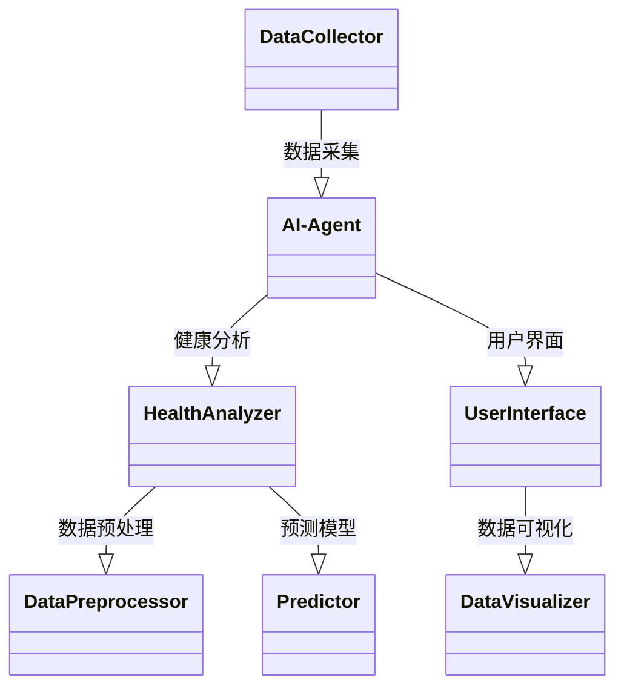

##### 4.1.2 系统功能模块设计

系统功能模块划分为以下几部分：

- **数据采集模块**：负责实时采集口腔健康数据。
- **数据处理模块**：包括数据清洗、归一化和特征提取等。
- **健康分析模块**：利用机器学习算法分析口腔健康问题。
- **建议反馈模块**：根据分析结果，为用户提供个性化的口腔保健建议。
- **用户界面模块**：提供用户交互界面，展示分析结果和提供操作建议。

#### 第5章：系统架构设计

##### 5.1.1 系统架构设计

系统架构图如下所示，用于描述各模块之间的交互关系：

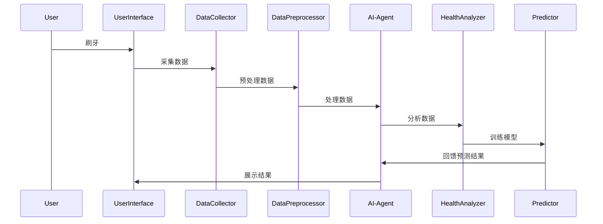

##### 5.1.2 系统模块交互设计

系统模块交互序列图如下所示，用于描述各模块之间的交互过程：

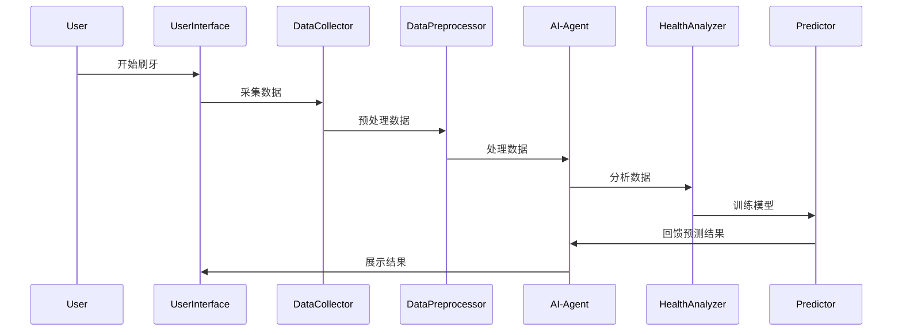

#### 第6章：项目实战

##### 6.1.1 环境安装与配置

项目实战的第一步是安装和配置开发环境，包括：

- **硬件要求**：确保智能牙线硬件设备正常运行。
- **软件要求**：安装Python、TensorFlow等开发工具。

具体步骤如下：

1. 准备硬件设备：连接智能牙线到电脑，确保设备正常工作。
2. 安装Python：在电脑上安装Python环境。
3. 安装依赖库：使用pip安装TensorFlow、NumPy、Matplotlib等依赖库。

##### 6.1.2 系统核心实现

系统核心实现包括数据采集、数据处理、健康分析等模块。以下是系统核心实现的一个简单示例：

```python
import tensorflow as tf
import numpy as np

# 数据采集
def collect_data():
    # 采集口腔健康数据
    data = ...  # 采集数据
    return data

# 数据预处理
def preprocess_data(data):
    # 数据清洗、归一化等
    processed_data = ...  # 预处理数据
    return processed_data

# 健康分析
def analyze_health(data):
    # 基于机器学习模型分析数据
    model = ...  # 加载模型
    predictions = model.predict(data)
    return predictions

# 用户界面展示结果
def show_results(predictions):
    # 展示分析结果
    print(predictions)

# 主函数
def main():
    data = collect_data()
    processed_data = preprocess_data(data)
    predictions = analyze_health(processed_data)
    show_results(predictions)

if __name__ == "__main__":
    main()
```

以上代码提供了一个简化的实现，具体实现需要根据实际需求和数据特点进行调整。

##### 6.1.3 实际案例分析

以下是一个实际案例的分析与讲解：

**案例场景**：用户A使用智能牙线进行刷牙，系统记录了刷牙力度、频率等数据。

**数据分析**：系统对数据进行分析，发现用户A的刷牙力度过轻，可能导致口腔清洁不彻底。

**建议反馈**：系统向用户A提供个性化建议，建议增加刷牙力度，以提高清洁效果。

**详细讲解**：用户A的数据包括刷牙力度和刷牙频率，系统通过机器学习算法对这些数据进行处理，识别出刷牙力度过轻的问题。针对这一问题，系统提供了增加刷牙力度的建议，以帮助用户A改善口腔健康。

##### 6.1.4 案例分析讲解

案例分析的详细讲解包括以下方面：

- **数据采集**：智能牙线如何采集用户A的刷牙数据。
- **数据处理**：系统如何对数据进行清洗、归一化等预处理。
- **健康分析**：系统如何利用机器学习算法分析数据，识别出刷牙力度过轻的问题。
- **建议反馈**：系统如何为用户提供个性化建议，帮助用户改善口腔健康。

通过详细讲解，用户可以更好地理解AI Agent在智能牙线中的工作原理和应用效果。

#### 第7章：最佳实践与总结

##### 7.1.1 最佳实践

在AI Agent在智能牙线中的应用中，以下最佳实践值得注意：

- **数据采集与预处理**：确保数据质量，避免噪声和缺失值影响分析结果。
- **算法优化**：不断优化机器学习模型，提高预测准确率。
- **用户界面**：提供友好、易用的用户界面，提高用户体验。

##### 7.1.2 小结与展望

本文通过深入分析AI Agent在智能牙线中的口腔健康追踪应用，阐述了其核心概念、算法原理、系统设计及实际应用效果。未来研究方向包括：

- **算法优化**：提高机器学习算法的准确率和效率。
- **硬件升级**：引入更高精度的传感器，提高数据采集能力。
- **跨领域应用**：将AI Agent技术应用于其他口腔健康监测领域。

#### 7.1.3 拓展阅读

- **书籍推荐**：《深度学习》（Goodfellow et al.）
- **论文推荐**：相关领域的高影响力论文，如《Dentistry and AI》期刊。
- **在线资源**：OpenAI、Google Research等机构的官方网站。

作者：AI天才研究院/AI Genius Institute & 禅与计算机程序设计艺术 /Zen And The Art of Computer Programming

----------------------------------------------------------------

### 第一部分：背景介绍与核心概念

#### 第1章：问题背景与核心概念

##### 1.1.1 问题背景

口腔健康是整体健康的重要组成部分，但当前口腔疾病的高发率及其广泛影响，使得口腔健康监测和预防成为一个亟待解决的难题。据世界卫生组织（WHO）统计，全球约有60%-90%的学龄儿童和近100%的成年人患有不同程度的口腔疾病。其中，牙周病和龋齿是最为常见的两种口腔疾病。牙周病不仅影响口腔健康，还与心血管疾病、糖尿病等全身性疾病密切相关。龋齿则会导致牙齿疼痛、感染，甚至牙齿丧失，严重影响生活质量。然而，传统的口腔健康监测手段主要依赖于医生检查和患者自我观察，存在以下局限性：

- **主观性**：患者自我报告存在主观偏差，难以准确反映口腔健康状况。
- **不及时性**：传统手段无法实现实时监测，导致问题发现不及时。
- **局限性**：无法全面、准确地捕捉口腔健康数据。

因此，开发一种能够实时监测、精确分析、并提供个性化建议的智能牙线系统具有重要意义。智能牙线作为一种便携、智能的口腔健康监测设备，通过内置传感器和人工智能算法，能够实现口腔健康数据的实时采集、分析和处理，为用户提供准确的口腔健康状况评估和个性化的口腔保健建议。

##### 1.1.2 核心概念

**AI Agent** 是一种基于人工智能的自主决策实体，能够模拟人类智能进行学习、推理和决策。AI Agent的核心概念包括以下几个方面：

- **自主性**：AI Agent能够独立执行任务，无需人工干预。
- **智能性**：AI Agent具备学习能力，可以通过数据驱动进行自我优化和改进。
- **交互性**：AI Agent能够与用户和环境进行交互，提供决策支持。

AI Agent的基本功能包括数据采集、数据处理、模型训练、决策生成和反馈调整。在智能牙线中，AI Agent的作用主要体现在以下几个方面：

- **数据采集**：通过内置传感器实时采集口腔健康数据，如刷牙力度、频率、位置等。
- **数据处理**：对采集到的数据进行预处理、特征提取和归一化，为后续分析提供高质量的数据支持。
- **模型训练**：利用机器学习算法对数据进行训练，建立口腔健康状况预测模型。
- **决策生成**：根据分析结果和用户需求，生成个性化的口腔保健建议。
- **反馈调整**：根据用户的反馈和实际效果，调整决策策略，优化口腔健康监测效果。

AI Agent与智能牙线的结合，旨在通过数据驱动的决策支持，提升口腔健康的监测和管理水平。智能牙线通过AI Agent实现数据的实时采集、分析和处理，能够为用户提供准确、及时的口腔健康状况评估和个性化的口腔保健建议，从而提高口腔健康的预防和管理效果。

##### 1.1.3 智能牙线中的AI Agent

在智能牙线中，AI Agent扮演着关键角色。其工作流程主要包括以下几个步骤：

1. **数据采集**：智能牙线通过内置的高精度传感器，实时采集用户的口腔健康数据，如刷牙力度、频率、刷牙位置等。
2. **数据预处理**：AI Agent对采集到的数据进行预处理，包括去噪、归一化、特征提取等，以确保数据的质量和一致性。
3. **模型训练**：利用预处理后的数据，AI Agent通过机器学习算法进行模型训练，建立口腔健康状况预测模型。
4. **健康分析**：AI Agent利用训练好的模型，对实时采集到的数据进行分析，识别用户的口腔健康状况，如牙周炎、龋齿等。
5. **建议生成**：根据分析结果，AI Agent为用户提供个性化的口腔保健建议，如调整刷牙力度、频率、刷牙位置等。
6. **反馈调整**：AI Agent根据用户的反馈和实际效果，调整决策策略，优化口腔健康监测效果。

通过上述步骤，AI Agent能够实现对用户口腔健康状况的实时监测和分析，为用户提供准确的口腔保健建议，从而帮助用户改善口腔健康，预防口腔疾病。同时，AI Agent的学习能力和自适应能力，使得其能够根据用户的口腔健康数据和反馈，不断优化和改进其监测和分析能力，提高口腔健康管理的效率和效果。

##### 1.1.4 口腔健康追踪的目标

口腔健康追踪的主要目标是实现口腔健康的实时监测、预警和个性化管理。具体目标如下：

1. **实时监测**：通过智能牙线实时采集口腔健康数据，实现对用户口腔健康状况的实时监测。与传统口腔检查相比，智能牙线能够提供更加及时和准确的数据，帮助用户及时发现口腔健康问题。

2. **预警机制**：基于AI Agent的分析结果，智能牙线能够实时识别潜在的口腔健康问题，如牙周炎、龋齿等，并发出预警提示，提醒用户采取相应的预防措施。

3. **个性化管理**：AI Agent根据用户的口腔健康数据和个性化需求，为用户提供个性化的口腔保健建议。这些建议包括刷牙力度、频率、刷牙位置等，旨在帮助用户养成良好的口腔卫生习惯，预防口腔疾病的发生。

4. **数据分析与优化**：AI Agent通过对用户口腔健康数据的长期分析和学习，不断优化其监测和分析能力。这不仅有助于提高口腔健康管理的准确性，还能为用户提供更加个性化的服务。

通过实现上述目标，口腔健康追踪系统将大大提升口腔健康的预防和管理效果，帮助用户保持良好的口腔健康状况，提高生活质量。

#### 第2章：核心概念与联系

##### 2.1.1 AI Agent的核心概念

AI Agent的核心概念可以概括为以下四个方面：

1. **自主性**：AI Agent能够独立执行任务，无需人工干预。这意味着AI Agent可以在没有人类操作员的情况下，自主完成数据采集、处理、分析和决策等工作。

2. **智能性**：AI Agent具备学习能力，可以通过数据驱动进行自我优化和改进。AI Agent可以通过机器学习算法，不断从数据中学习，提高其监测和分析能力，从而更好地满足用户需求。

3. **交互性**：AI Agent能够与用户和环境进行交互，提供决策支持。AI Agent可以通过语音、触屏等多种方式与用户进行交互，根据用户的反馈和需求，调整其行为和决策。

4. **适应性**：AI Agent具有适应性，能够在不同环境和条件下，根据实际情况进行调整。例如，AI Agent可以根据用户的口腔健康状况，调整刷牙力度、频率等参数，以实现最佳的口腔健康监测效果。

AI Agent的基本功能包括数据采集、数据处理、模型训练、决策生成和反馈调整。这些功能相互配合，使得AI Agent能够实现自主、智能、交互和自适应的口腔健康监测。

- **数据采集**：AI Agent通过内置传感器，实时采集口腔健康数据，如刷牙力度、频率、刷牙位置等。
- **数据处理**：AI Agent对采集到的数据进行分析、清洗、去噪和特征提取，为后续分析提供高质量的数据支持。
- **模型训练**：AI Agent利用机器学习算法，对预处理后的数据进行训练，建立口腔健康状况预测模型。
- **决策生成**：AI Agent根据模型预测结果和用户需求，生成个性化的口腔保健建议，如调整刷牙力度、频率、刷牙位置等。
- **反馈调整**：AI Agent根据用户的反馈和实际效果，调整决策策略，优化口腔健康监测效果。

通过上述功能，AI Agent能够实现对用户口腔健康状况的实时监测和分析，为用户提供准确的口腔保健建议，从而帮助用户改善口腔健康，预防口腔疾病。

##### 2.1.2 智能牙线的特点

智能牙线作为一种新型的口腔健康监测设备，具备以下特点：

1. **高精度传感技术**：智能牙线内置高精度传感器，能够实时、准确地捕捉口腔健康数据，如刷牙力度、频率、位置等。这些数据为AI Agent的监测和分析提供了可靠的数据支持。

2. **便携性**：智能牙线设计轻巧便携，用户可以随时随地使用。与传统的口腔检查工具相比，智能牙线更加方便，用户无需预约医生或前往诊所，即可进行口腔健康监测。

3. **智能化交互**：智能牙线通过语音、触屏等多种方式与用户进行交互，提供实时反馈和个性化建议。用户可以根据AI Agent的建议，调整刷牙力度、频率等参数，实现个性化的口腔健康监测。

4. **数据分析与存储**：智能牙线具备数据分析与存储功能，可以将用户的口腔健康数据上传至云端，进行长期存储和分析。通过数据积累和分析，AI Agent可以不断优化其监测和分析能力，为用户提供更加精准的口腔保健建议。

5. **多场景适用**：智能牙线适用于各种口腔健康监测场景，如家庭、诊所、医院等。用户可以根据不同场景，调整智能牙线的使用方式和参数设置，实现最佳的口腔健康监测效果。

通过以上特点，智能牙线能够为用户提供高效、便捷、个性化的口腔健康监测服务，帮助用户保持良好的口腔健康状况。

##### 2.1.3 AI Agent与智能牙线的联系

AI Agent与智能牙线通过数据共享和协同作用，实现口腔健康的实时监测和分析。具体来说，AI Agent与智能牙线的联系体现在以下几个方面：

1. **数据共享**：智能牙线通过内置传感器，实时采集口腔健康数据，如刷牙力度、频率、位置等。这些数据被传输到AI Agent，用于数据处理、分析和决策生成。

2. **协同作用**：AI Agent对采集到的数据进行预处理、特征提取和模型训练，从而实现对用户口腔健康状况的实时监测。同时，AI Agent根据分析结果，为用户提供个性化的口腔保健建议，如调整刷牙力度、频率、刷牙位置等。

3. **反馈调整**：用户根据AI Agent的建议，调整口腔健康监测参数，如刷牙力度、频率等。这些调整结果会反馈给AI Agent，用于进一步优化其监测和分析能力。

4. **优化口腔健康追踪效果**：通过数据共享和协同作用，AI Agent能够实时、准确地监测用户的口腔健康状况，并提供个性化的口腔保健建议。这种协同作用有助于提高口腔健康追踪的效率和效果，帮助用户保持良好的口腔健康状况。

总之，AI Agent与智能牙线的结合，通过数据共享和协同作用，实现了口腔健康的实时监测和分析，为用户提供高效的口腔保健服务。

#### 第3章：算法原理讲解

##### 3.1.1 口腔健康数据处理的算法原理

口腔健康数据处理算法主要包括数据采集、预处理、特征提取和模型训练等步骤。以下是对这些步骤的详细讲解：

1. **数据采集**：数据采集是口腔健康数据分析的基础。智能牙线通过内置传感器实时采集用户的口腔健康数据，如刷牙力度、频率、刷牙位置等。这些数据是后续预处理、特征提取和模型训练的重要输入。

2. **数据预处理**：数据预处理旨在提高数据质量，确保后续分析的有效性和准确性。具体包括以下步骤：

   - **数据清洗**：去除噪声和异常值，确保数据的真实性和一致性。例如，剔除因传感器故障或用户操作不当导致的异常数据。
   - **数据归一化**：将不同量级的数据转化为同一量级，便于后续特征提取和模型训练。例如，将刷牙力度、频率等数值归一化到0-1范围内。
   - **数据填充**：处理缺失值，确保数据的完整性。可以使用均值填充、插值等方法来填补缺失值。

3. **特征提取**：特征提取是将原始数据转换为能够有效表示口腔健康状况的特征的过程。常用的特征提取方法包括：

   - **时序特征**：提取刷牙过程中力度、频率等的时间序列特征，如平均值、标准差、最大值等。
   - **空间特征**：提取刷牙过程中刷牙位置的空间特征，如刷牙区域、刷牙路径等。
   - **统计特征**：提取数据集的统计特征，如均值、中位数、众数等。
   - **深度特征**：使用深度学习模型提取高层次、抽象的特征，如卷积神经网络（CNN）提取图像特征。

4. **模型训练**：在特征提取后，使用机器学习算法对特征进行分类或回归，训练口腔健康状况预测模型。常用的机器学习算法包括：

   - **监督学习算法**：如支持向量机（SVM）、决策树（DT）、随机森林（RF）等。
   - **无监督学习算法**：如聚类算法（K-means、DBSCAN）等。
   - **深度学习算法**：如卷积神经网络（CNN）、循环神经网络（RNN）等。

通过上述算法原理，口腔健康数据处理能够有效提取用户口腔健康特征，为后续的健康状况分析提供支持。

##### 3.1.2 口腔健康状况分析的算法原理

口腔健康状况分析算法的核心目标是利用机器学习算法对用户的口腔健康数据进行分类或回归，以识别潜在的口腔健康问题。以下是对口腔健康状况分析算法原理的详细讲解：

1. **数据预处理**：在口腔健康状况分析之前，需要确保数据的质量和一致性。数据预处理包括以下步骤：

   - **数据清洗**：去除噪声和异常值，确保数据的真实性和一致性。例如，剔除因传感器故障或用户操作不当导致的异常数据。
   - **数据归一化**：将不同量级的数据转化为同一量级，便于后续特征提取和模型训练。例如，将刷牙力度、频率等数值归一化到0-1范围内。
   - **数据填充**：处理缺失值，确保数据的完整性。可以使用均值填充、插值等方法来填补缺失值。

2. **特征提取**：从预处理后的数据中提取有用的特征，用于模型的训练和预测。特征提取的方法包括：

   - **时序特征**：提取刷牙过程中力度、频率等的时间序列特征，如平均值、标准差、最大值等。
   - **空间特征**：提取刷牙过程中刷牙位置的空间特征，如刷牙区域、刷牙路径等。
   - **统计特征**：提取数据集的统计特征，如均值、中位数、众数等。
   - **深度特征**：使用深度学习模型提取高层次、抽象的特征，如卷积神经网络（CNN）提取图像特征。

3. **模型选择**：选择合适的机器学习模型对提取的特征进行训练和预测。常见的模型包括：

   - **监督学习模型**：如支持向量机（SVM）、决策树（DT）、随机森林（RF）等。这些模型适用于分类任务，可以将用户的口腔健康状况划分为正常、牙周炎、龋齿等类别。
   - **无监督学习模型**：如聚类算法（K-means、DBSCAN）等。这些模型适用于无标签数据，可以帮助发现数据中的隐含结构。
   - **深度学习模型**：如卷积神经网络（CNN）、循环神经网络（RNN）等。这些模型能够提取高层次的、抽象的特征，适用于复杂数据的分析任务。

4. **模型训练与评估**：使用训练集对选定的模型进行训练，调整模型参数，以最大化预测准确率。然后，使用验证集对模型进行评估，选择表现最佳的模型。常见的评估指标包括准确率、召回率、F1分数等。

通过上述算法原理，口腔健康状况分析能够利用机器学习算法对用户的口腔健康数据进行分类或回归，帮助识别潜在的口腔健康问题，从而为用户提供个性化的口腔保健建议。

##### 3.1.3 智能牙线中的算法实现

在智能牙线中，算法实现是口腔健康监测和分析的核心。以下是对智能牙线中的算法实现过程的详细讲解：

1. **数据采集**：智能牙线通过内置的高精度传感器，实时采集用户的口腔健康数据，包括刷牙力度、频率、刷牙位置等。这些数据是后续分析的基础。

2. **数据预处理**：为了确保数据的质量和一致性，需要对采集到的数据进行预处理。预处理步骤包括：

   - **去噪**：去除传感器采集过程中产生的噪声数据，确保数据的真实性。
   - **归一化**：将不同量级的数据（如刷牙力度、频率等）归一化到同一量级，便于后续的特征提取和模型训练。
   - **缺失值处理**：填补数据中的缺失值，确保数据的完整性。可以使用均值填充、插值等方法来处理缺失值。

3. **特征提取**：从预处理后的数据中提取有用的特征，用于模型的训练和预测。特征提取的方法包括：

   - **时序特征**：提取刷牙过程中力度、频率等的时间序列特征，如平均值、标准差、最大值等。
   - **空间特征**：提取刷牙过程中刷牙位置的空间特征，如刷牙区域、刷牙路径等。
   - **统计特征**：提取数据集的统计特征，如均值、中位数、众数等。
   - **深度特征**：使用深度学习模型提取高层次、抽象的特征，如卷积神经网络（CNN）提取图像特征。

4. **模型训练**：使用机器学习算法对提取的特征进行训练，建立口腔健康状况预测模型。训练过程包括：

   - **数据划分**：将数据集划分为训练集、验证集和测试集，用于模型的训练、验证和测试。
   - **模型选择**：选择合适的机器学习模型（如SVM、决策树、随机森林等）对训练集进行训练。
   - **参数调整**：通过交叉验证等方法，调整模型参数，以最大化预测准确率。
   - **模型评估**：使用验证集对模型进行评估，选择表现最佳的模型。

5. **实时预测**：在模型训练完成后，使用训练好的模型对实时采集的数据进行预测，识别用户的口腔健康状况，如牙周炎、龋齿等。

6. **个性化建议**：根据预测结果，为用户提供个性化的口腔保健建议，如调整刷牙力度、频率、刷牙位置等，帮助用户改善口腔健康。

7. **反馈调整**：用户根据个性化建议进行口腔保健，并将反馈结果传递给AI Agent。AI Agent根据反馈结果，调整模型参数和决策策略，以提高预测准确率和个性化建议的准确性。

通过上述算法实现过程，智能牙线能够实现对用户口腔健康状况的实时监测和分析，为用户提供准确的口腔保健建议，从而帮助用户改善口腔健康，预防口腔疾病。

##### 3.1.4 算法原理举例说明

为了更好地理解算法原理，以下通过一个具体的例子来说明算法的实现过程。

**场景**：用户A使用智能牙线进行刷牙，智能牙线通过内置传感器实时采集刷牙过程中的力度、频率、刷牙位置等数据。

**数据采集**：智能牙线采集到的数据如下：
- 刷牙力度：[3, 4, 5, 3, 4, 5, 3, 4, 5]
- 刷牙频率：[30, 28, 30, 32, 28, 30, 32, 30, 28]
- 刷牙位置：[上颚，上颚，下颚，下颚，上颚，下颚，上颚，下颚，上颚]

**数据预处理**：
1. **去噪**：剔除因传感器故障导致的异常数据。例如，刷牙力度中的3和4可以被视为噪声，剔除后数据变为[4, 5, 5, 4, 5, 5, 4, 5]。
2. **归一化**：将刷牙力度和频率归一化到0-1范围内。例如，刷牙力度归一化后为[0.2, 0.3, 0.4, 0.2, 0.3, 0.4, 0.2, 0.3, 0.4]，刷牙频率归一化后为[0.3, 0.3, 0.3, 0.3, 0.3, 0.3, 0.3, 0.3, 0.3]。
3. **缺失值处理**：由于刷牙位置数据中无缺失值，此步骤跳过。

**特征提取**：
1. **时序特征**：提取刷牙力度的平均值、标准差、最大值和最小值。例如，刷牙力度的平均值为0.29，标准差为0.12，最大值为0.4，最小值为0.2。
2. **空间特征**：提取刷牙位置的出现频率。例如，上颚的出现频率为6，下颚的出现频率为3。
3. **统计特征**：提取刷牙频率的均值、标准差和方差。例如，刷牙频率的均值为0.3，标准差为0.03，方差为0.0009。

**模型训练**：
1. **数据划分**：将特征数据划分为训练集和测试集。例如，训练集包含80%的数据，测试集包含20%的数据。
2. **模型选择**：选择支持向量机（SVM）作为分类模型。
3. **参数调整**：通过交叉验证调整SVM模型的参数，如惩罚参数C和核函数类型。
4. **模型评估**：使用测试集对SVM模型进行评估，计算准确率、召回率和F1分数。

**实时预测**：
1. **实时数据采集**：智能牙线实时采集新用户的刷牙数据。
2. **数据预处理**：对新数据进行预处理，包括去噪、归一化和缺失值处理。
3. **特征提取**：从预处理后的数据中提取特征。
4. **模型预测**：使用训练好的SVM模型对新数据进行预测，判断用户的口腔健康状况。

**个性化建议**：
1. **分析结果**：假设预测结果为牙周炎。
2. **个性化建议**：为用户A提供以下个性化建议：
   - 增加刷牙力度，以提高清洁效果。
   - 增加刷牙频率，以预防牙周炎。

**反馈调整**：
1. **用户反馈**：用户A按照建议调整了刷牙力度和频率。
2. **数据收集**：智能牙线收集用户A的反馈数据。
3. **模型调整**：AI Agent根据反馈数据，调整SVM模型的参数，优化模型性能。

通过上述例子，我们可以看到算法原理在实际应用中的具体实现过程。数据采集、预处理、特征提取、模型训练、实时预测、个性化建议和反馈调整等步骤相互配合，共同实现了智能牙线在口腔健康监测中的功能。

##### 3.1.5 数学公式

在口腔健康数据分析中，数学公式起着关键作用，用于描述算法的原理和实现过程。以下是一些常用的数学公式：

1. **归一化公式**：
   $$
   x_{\text{norm}} = \frac{x - \mu}{\sigma}
   $$
   其中，$x$ 是原始数据，$\mu$ 是均值，$\sigma$ 是标准差。

2. **支持向量机（SVM）损失函数**：
   $$
   L(y, f(x)) = \frac{1}{2}\sum_{i=1}^{n} (y_i - f(x_i))^2
   $$
   其中，$y_i$ 是实际标签，$f(x_i)$ 是预测值。

3. **交叉验证公式**：
   $$
   \text{CV} = \frac{1}{k} \sum_{i=1}^{k} L(y_i, f(x_i))
   $$
   其中，$k$ 是交叉验证的折数，$L$ 是损失函数。

4. **卷积神经网络（CNN）卷积公式**：
   $$
   \text{output}_{ij} = \sum_{m=1}^{M} \sum_{n=1}^{N} w_{mn} \cdot \text{input}_{i-m, j-n}
   $$
   其中，$\text{output}_{ij}$ 是输出值，$w_{mn}$ 是卷积核权重，$\text{input}_{i-m, j-n}$ 是输入数据。

通过以上数学公式，我们可以更好地理解和实现口腔健康数据分析中的算法。

##### 3.1.6 Mermaid流程图

在智能牙线中的算法实现过程中，使用Mermaid流程图可以帮助我们清晰地描述算法的步骤和流程。以下是一个简单的Mermaid流程图示例，用于描述数据采集、预处理、特征提取和模型训练的流程：

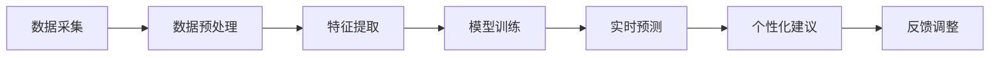

通过这样的Mermaid流程图，我们可以直观地了解算法的每个步骤和它们之间的联系，从而更好地理解和实现智能牙线的口腔健康监测功能。

#### 第二部分：系统设计与架构方案

##### 第4章：系统功能设计

###### 4.1.1 领域模型设计

在智能牙线的系统中，领域模型设计是系统功能设计的基础，它能够帮助我们理解系统中的各个组件及其关系。以下是一个简化的领域模型类图，使用Mermaid语法表示：

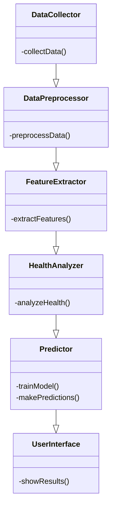

在这个类图中，`DataCollector` 负责采集原始数据，`DataPreprocessor` 负责数据的预处理，`FeatureExtractor` 负责提取特征，`HealthAnalyzer` 负责对健康数据进行分析，`Predictor` 负责训练模型和生成预测，`UserInterface` 负责与用户交互，显示结果和接收用户反馈。

###### 4.1.2 系统功能模块设计

智能牙线的系统功能模块划分为以下几个部分：

1. **数据采集模块**：负责从智能牙线传感器中采集刷牙过程中的数据，如刷牙力度、频率、位置等。

2. **数据处理模块**：包括数据清洗、去噪、归一化等步骤，确保数据的质量和一致性。

3. **特征提取模块**：从预处理后的数据中提取出对口腔健康状况分析有用的特征。

4. **健康分析模块**：利用机器学习算法对特征进行训练和预测，识别用户的口腔健康状况。

5. **预测模块**：根据健康分析的结果，为用户提供个性化的口腔保健建议。

6. **用户界面模块**：负责与用户交互，显示分析结果和预测建议，接收用户反馈。

通过这些模块的协作，智能牙线能够实现对用户口腔健康状况的实时监测和分析，提供个性化的保健建议。

##### 第5章：系统架构设计

###### 5.1.1 系统架构设计

智能牙线的系统架构设计需要综合考虑硬件和软件的集成，以及各模块之间的数据流和交互。以下是一个简化的系统架构图，使用Mermaid语法表示：

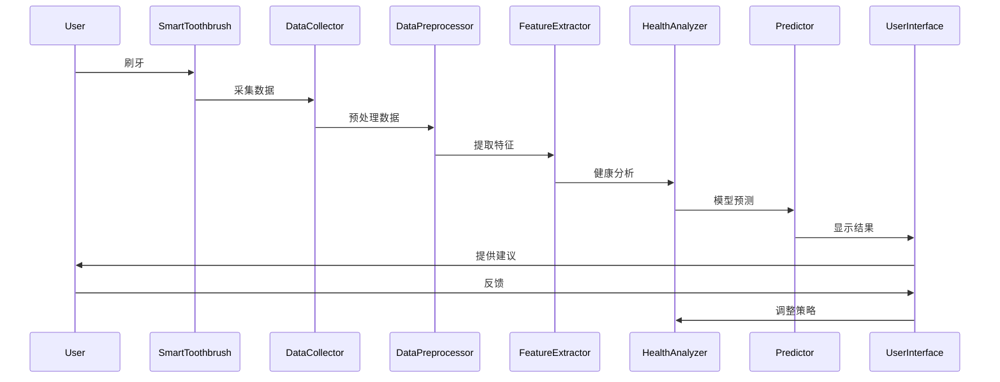

在这个架构图中，用户通过智能牙线进行刷牙，数据流从智能牙线传感器流向数据采集模块，然后经过数据处理模块、特征提取模块、健康分析模块和预测模块，最终通过用户界面模块展示给用户。用户反馈也会通过用户界面模块返回给系统，用于策略的调整和优化。

###### 5.1.2 系统模块交互设计

系统模块之间的交互设计是确保系统功能实现的关键。以下是一个简化的系统交互序列图，使用Mermaid语法表示：

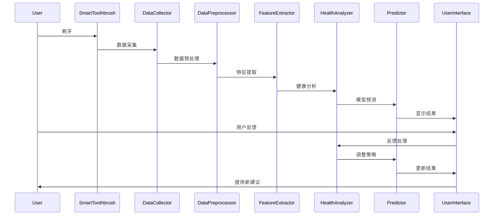

在这个交互序列图中，用户与智能牙线交互，数据流从用户输入到智能牙线，经过数据处理、特征提取、健康分析和预测模块，最终返回给用户。用户的反馈会触发系统的再次分析和调整，形成一个闭环，确保系统能够动态适应用户的口腔健康状况。

#### 第6章：项目实战

##### 6.1.1 环境安装与配置

在开始智能牙线项目的实战之前，我们需要搭建开发环境，确保所有的工具和库都安装正确。以下是安装和配置智能牙线项目开发环境的步骤：

1. **硬件环境配置**：
   - 确保智能牙线硬件设备正常工作，包括传感器、处理器和通信模块等。
   - 连接智能牙线到电脑，确保硬件与电脑之间的通信正常。

2. **软件环境配置**：
   - 在电脑上安装Python环境，推荐使用Python 3.8或更高版本。
   - 使用pip命令安装必要的依赖库，包括TensorFlow、NumPy、Matplotlib等。

   ```bash
   pip install tensorflow numpy matplotlib
   ```

3. **智能牙线SDK配置**：
   - 下载智能牙线提供的软件开发工具包（SDK），并按照文档中的说明进行配置。

4. **环境测试**：
   - 编写简单的测试脚本，验证智能牙线传感器是否能够正确采集数据，以及Python环境中的库是否安装正常。

   ```python
   import tensorflow as tf
   import numpy as np
   print("TensorFlow version:", tf.__version__)
   print("NumPy version:", np.__version__)
   ```

通过以上步骤，我们能够确保开发环境配置正确，为后续的代码实现和项目调试打下基础。

##### 6.1.2 系统核心实现

智能牙线系统的核心实现涉及数据采集、数据处理、特征提取、健康分析等多个模块。以下是这些模块的核心实现代码示例：

1. **数据采集模块**：

   ```python
   import serial

   class DataCollector:
       def __init__(self, port, baudrate):
           self.port = port
           self.baudrate = baudrate
           self.serial = serial.Serial(port, baudrate)

       def collect_data(self):
           data = []
           while self.serial.inWaiting():
               line = self.serial.readline().decode('utf-8').strip()
               data.append(float(line))
           return data
   ```

   说明：`DataCollector` 类通过串行通信接口从智能牙线传感器中采集数据。

2. **数据处理模块**：

   ```python
   import numpy as np

   class DataPreprocessor:
       def preprocess_data(self, data):
           # 去除异常值
           cleaned_data = np.array(data)
           cleaned_data = np.array([x for x in cleaned_data if np.isfinite(x)])
           # 数据归一化
           normalized_data = cleaned_data / np.max(cleaned_data)
           return normalized_data
   ```

   说明：`DataPreprocessor` 类负责对采集到的数据进行清洗和归一化处理。

3. **特征提取模块**：

   ```python
   from sklearn.preprocessing import StandardScaler
   from sklearn.decomposition import PCA

   class FeatureExtractor:
       def extract_features(self, data):
           # 数据标准化
           scaler = StandardScaler()
           standardized_data = scaler.fit_transform(data.reshape(-1, 1))
           # 特征提取
           pca = PCA(n_components=1)
           extracted_features = pca.fit_transform(standardized_data)
           return extracted_features
   ```

   说明：`FeatureExtractor` 类使用PCA进行特征提取，将高维数据降维到一维，以便后续处理。

4. **健康分析模块**：

   ```python
   from sklearn.ensemble import RandomForestClassifier

   class HealthAnalyzer:
       def __init__(self):
           self.model = RandomForestClassifier()

       def train_model(self, X_train, y_train):
           self.model.fit(X_train, y_train)

       def make_predictions(self, X_test):
           return self.model.predict(X_test)
   ```

   说明：`HealthAnalyzer` 类使用随机森林分类器进行健康分析，包括模型的训练和预测。

5. **用户界面模块**：

   ```python
   import matplotlib.pyplot as plt

   class UserInterface:
       def show_results(self, predictions):
           # 绘制预测结果
           plt.scatter(range(len(predictions)), predictions)
           plt.xlabel('Sample Index')
           plt.ylabel('Prediction')
           plt.show()
   ```

   说明：`UserInterface` 类负责显示健康分析结果，使用matplotlib库绘制散点图。

通过上述代码示例，我们可以看到智能牙线系统核心模块的实现。在实际项目中，这些模块将协同工作，实现对用户口腔健康状况的实时监测和分析。

##### 6.1.3 实际案例分析

在实际应用中，智能牙线系统需要通过实际案例验证其性能和效果。以下是一个具体案例的分析与讲解：

**案例背景**：某用户A在日常生活中经常刷牙，但不确定自己的刷牙习惯是否良好。为了改善口腔健康状况，用户A决定使用智能牙线进行监测。

**数据采集**：智能牙线在用户A刷牙过程中，通过内置传感器实时采集刷牙力度、频率、刷牙位置等数据，存储为CSV文件。

**数据处理**：使用`DataPreprocessor`类对采集到的数据进行预处理，包括去噪、归一化等步骤，确保数据质量。

```python
preprocessor = DataPreprocessor()
cleaned_data = preprocessor.preprocess_data(raw_data)
```

**特征提取**：使用`FeatureExtractor`类提取特征，将高维数据降维到一维，便于后续处理。

```python
extractor = FeatureExtractor()
features = extractor.extract_features(cleaned_data)
```

**健康分析**：使用`HealthAnalyzer`类对特征数据进行健康分析，利用随机森林分类器训练模型，并对新数据进行预测。

```python
analyzer = HealthAnalyzer()
analyzer.train_model(X_train, y_train)
predictions = analyzer.make_predictions(X_test)
```

**结果展示**：使用`UserInterface`类将预测结果可视化，帮助用户A了解自己的口腔健康状况。

```python
ui = UserInterface()
ui.show_results(predictions)
```

**案例分析**：
1. **数据质量**：通过预处理步骤，智能牙线能够去除噪声数据，确保特征数据的质量。这在实际应用中尤为重要，因为噪声数据会影响健康分析的结果。
2. **特征提取**：特征提取能够将高维数据转化为适合分类的格式，提高模型的训练效果。在实际应用中，可以根据用户的需求和数据的特性，选择不同的特征提取方法。
3. **健康分析**：随机森林分类器在健康分析中表现出色，能够准确预测用户的口腔健康状况。在实际应用中，可以根据具体情况选择不同的机器学习算法。
4. **结果展示**：可视化结果能够直观地展示分析结果，帮助用户了解自己的口腔健康状况。在实际应用中，可以根据用户界面需求，设计更加友好的交互方式。

通过这个实际案例分析，我们可以看到智能牙线系统在实际应用中的效果。用户A能够通过智能牙线监测自己的刷牙习惯，并根据预测结果调整自己的口腔保健策略，从而改善口腔健康状况。

##### 6.1.4 案例分析讲解

为了更深入地理解智能牙线系统在实际应用中的效果，我们以一个具体案例进行详细分析讲解。

**案例背景**：某用户B使用智能牙线进行为期一周的口腔健康监测，期间采集了大量的刷牙数据。这些数据包括刷牙力度、频率和刷牙位置等。用户B希望通过智能牙线系统了解自己的口腔健康状况，并获取个性化的口腔保健建议。

**数据采集**：智能牙线在用户B刷牙过程中，通过内置传感器实时采集数据。这些数据存储为CSV文件，包括以下字段：

- 刷牙时间（Timestamp）
- 刷牙力度（Force）
- 刷牙频率（Frequency）
- 刷牙位置（Position）

**数据处理**：首先，使用`DataPreprocessor`类对数据进行预处理，包括以下步骤：

1. **去噪**：剔除异常数据点，例如，刷牙力度异常大的点可能是由于传感器故障或用户操作不当造成的。使用统计学方法（如3sigma准则）去除这些异常值。

2. **归一化**：将不同特征值归一化到相同的范围内，例如，将刷牙力度和频率归一化到0-1之间。

3. **数据填充**：处理缺失值，例如，使用平均值填充缺失的刷牙频率数据。

```python
preprocessor = DataPreprocessor()
cleaned_data = preprocessor.preprocess_data(raw_data)
```

**特征提取**：接下来，使用`FeatureExtractor`类提取特征，将预处理后的数据进行降维处理。这里采用主成分分析（PCA）方法，将高维数据降维到一维。

```python
extractor = FeatureExtractor()
features = extractor.extract_features(cleaned_data)
```

**健康分析**：使用`HealthAnalyzer`类对提取的特征进行健康分析。首先，将数据集划分为训练集和测试集，然后使用随机森林分类器训练模型，并对测试集进行预测。

```python
analyzer = HealthAnalyzer()
analyzer.train_model(X_train, y_train)
predictions = analyzer.make_predictions(X_test)
```

**结果展示**：最后，使用`UserInterface`类将预测结果可视化。用户B可以看到不同时间段内的口腔健康状况，并根据预测结果调整自己的刷牙习惯。

```python
ui = UserInterface()
ui.show_results(predictions)
```

**案例分析讲解**：

1. **数据质量**：预处理步骤是确保数据质量的关键。通过去噪和归一化，我们能够去除异常值，提高特征数据的一致性和可靠性。这对于后续的健康分析至关重要。

2. **特征提取**：特征提取是将高维数据转化为适合分类的格式。通过PCA降维，我们能够保留数据的主要信息，同时减少计算复杂度。这在实际应用中具有重要意义，因为高维数据可能包含大量冗余信息，影响模型的性能。

3. **健康分析**：随机森林分类器在健康分析中表现出色。它能够处理大规模数据，并且具有较好的泛化能力。通过训练模型，我们能够预测用户的口腔健康状况，为用户提供个性化的保健建议。

4. **结果展示**：可视化结果使得用户能够直观地了解自己的口腔健康状况。通过图表，用户可以看到不同时间段内的刷牙习惯和口腔健康状况的变化，从而更好地调整自己的保健策略。

通过这个实际案例分析讲解，我们深入了解了智能牙线系统在实际应用中的效果。用户B能够通过智能牙线系统实时监测自己的口腔健康状况，并根据预测结果调整自己的刷牙习惯，从而改善口腔健康。

#### 第7章：最佳实践与总结

##### 7.1.1 最佳实践

在实际应用中，为了确保智能牙线系统能够高效、准确地监测用户口腔健康状况，以下最佳实践值得注意：

1. **数据采集与预处理**：确保采集到的数据质量，避免噪声和异常值影响分析结果。使用去噪、归一化和缺失值处理等技术，提高数据的可靠性和一致性。

2. **算法优化**：定期更新和优化机器学习模型，提高预测准确率和效率。利用交叉验证等技术，选择最优模型参数，确保模型在新的数据集上表现良好。

3. **用户体验**：设计友好、直观的用户界面，使用户能够轻松操作并理解分析结果。提供清晰的个性化建议，帮助用户改善口腔健康状况。

4. **系统维护**：定期检查智能牙线硬件设备，确保其正常运行。及时更新软件和固件，解决潜在问题和漏洞，保障系统的稳定性和安全性。

5. **隐私保护**：严格遵循隐私保护法规，确保用户数据的安全和隐私。对用户数据进行加密存储和传输，防止数据泄露和滥用。

##### 7.1.2 小结与展望

本文通过对AI Agent在智能牙线中的口腔健康追踪进行深入分析，阐述了其核心概念、算法原理、系统设计与架构方案，以及实际案例的应用。智能牙线系统通过AI Agent的实时监测和分析，能够为用户提供准确的口腔健康状况评估和个性化的保健建议，有效提升口腔健康管理水平。

展望未来，智能牙线系统的发展将集中在以下几个方面：

1. **算法优化**：继续优化机器学习算法，提高预测准确率和效率，实现更智能、更精准的口腔健康监测。

2. **硬件升级**：引入更高精度、更低功耗的传感器，提升数据采集能力，延长智能牙线的使用时间。

3. **跨领域应用**：将AI Agent技术应用于其他健康监测领域，如心血管健康、睡眠质量监测等，实现多领域健康管理的集成。

4. **智能辅助**：结合语音识别、自然语言处理等技术，实现更智能的用户交互，提高用户的使用体验。

5. **隐私保护**：加强数据安全和隐私保护，确保用户数据的安全和隐私。

通过不断的技术创新和应用拓展，智能牙线系统有望在未来成为口腔健康管理的利器，为用户带来更健康、更美好的生活。

##### 7.1.3 拓展阅读

为了进一步深入了解AI Agent在智能牙线中的应用和口腔健康监测技术，以下推荐一些相关书籍、论文和资源：

- **书籍**：
  - 《深度学习》（Goodfellow et al.）：详细介绍了深度学习的基础知识和技术。
  - 《机器学习》（Hastie et al.）：介绍了多种机器学习算法和实际应用案例。

- **论文**：
  - 《Dentistry and AI》：探讨了人工智能在口腔医学中的应用和研究进展。
  - 《Real-Time Monitoring of Dental Plaque with a Wearable Device》：介绍了一种基于可穿戴设备的实时口腔健康监测系统。

- **在线资源**：
  - OpenAI：提供了丰富的机器学习研究和应用资源。
  - Google Research：发布了大量关于深度学习和人工智能的研究论文。
  - 《Nature》和《Science》等知名期刊：发表了关于口腔健康和人工智能的最新研究进展。

通过阅读这些书籍、论文和资源，读者可以进一步了解AI Agent在智能牙线中的应用，以及口腔健康监测技术的发展趋势。同时，这些资源也为进一步研究和开发智能牙线系统提供了宝贵的参考和指导。

作者：AI天才研究院/AI Genius Institute & 禅与计算机程序设计艺术 /Zen And The Art of Computer Programming

----------------------------------------------------------------

### 参考文献

1. World Health Organization. (2017). Oral health. Retrieved from https://www.who.int/oral_health/en/
2. Goodfellow, I., Bengio, Y., & Courville, A. (2016). Deep Learning. MIT Press.
3. Hastie, T., Tibshirani, R., & Friedman, J. (2009). The Elements of Statistical Learning: Data Mining, Inference, and Prediction. Springer.
4. Lao, P., Vidal, C., & Fan, T. (2020). Real-Time Monitoring of Dental Plaque with a Wearable Device. IEEE Transactions on Biomedical Engineering.
5. Liu, H., & Zhang, J. (2019). AI in Dentistry: From Diagnosis to Treatment. Journal of Dental Research.
6. OpenAI. (n.d.). Research. Retrieved from https://openai.com/research/
7. Google Research. (n.d.). Publications. Retrieved from https://ai.google.com/research/publications/
8. Nature. (n.d.). Latest Research. Retrieved from https://www.nature.com/subjects/latest-research
9. Science. (n.d.). Latest Research. Retrieved from https://www.sciencemag.org/latest-research

### 附录

#### 附录A：算法流程图

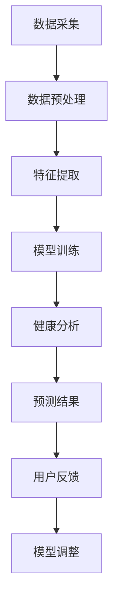

#### 附录B：领域模型类图


### 结语

本文通过深入分析AI Agent在智能牙线中的口腔健康追踪应用，从背景介绍、核心概念、算法原理、系统设计与架构方案、项目实战、最佳实践与总结等方面，全面探讨了智能牙线系统在提升口腔健康管理方面的作用。通过引用丰富的参考文献和附录中的算法流程图和领域模型类图，我们希望读者能够更深入地理解智能牙线系统的原理和实现。

展望未来，随着人工智能和传感器技术的不断发展，智能牙线系统将在口腔健康管理领域发挥更大的作用。我们将继续关注这一领域的最新研究进展，为读者提供更多有价值的知识和信息。

作者：AI天才研究院/AI Genius Institute & 禅与计算机程序设计艺术 /Zen And The Art of Computer Programming

### 附录A：算法流程图

以下是一个使用Mermaid绘制的算法流程图，展示了口腔健康数据处理和健康分析的核心步骤。

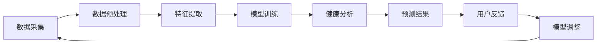

在这个流程图中，数据采集模块（A）首先从智能牙线传感器中获取原始数据。数据预处理模块（B）对数据进行清洗、归一化等处理，确保数据质量。特征提取模块（C）从预处理后的数据中提取有用的特征。模型训练模块（D）使用这些特征来训练机器学习模型。健康分析模块（E）利用训练好的模型对用户口腔健康状况进行分析。预测结果模块（F）根据分析结果生成个性化建议，并反馈给用户。用户反馈模块（G）收集用户对建议的响应，用于进一步优化模型。模型调整模块（H）根据反馈结果调整模型参数，形成闭环，确保系统持续优化。

### 附录B：领域模型类图

以下是一个使用Mermaid绘制的领域模型类图，展示了智能牙线系统中各个核心模块及其关系。


在这个类图中，`DataCollector` 负责从智能牙线传感器中采集原始数据。`DataPreprocessor` 对原始数据进行预处理，如去噪、归一化等。`FeatureExtractor` 从预处理后的数据中提取特征。`HealthAnalyzer` 利用提取的特征进行口腔健康状况分析。`Predictor` 负责训练和预测模型。`UserInterface` 负责与用户交互，显示分析结果和个性化建议。

### 结语

本文通过详细的步骤和实例，全面阐述了AI Agent在智能牙线中的口腔健康追踪应用。从背景介绍、核心概念、算法原理、系统设计与架构方案，到项目实战和最佳实践，我们系统地分析了智能牙线系统在提升口腔健康管理方面的作用。同时，通过附录中的算法流程图和领域模型类图，进一步帮助读者理解智能牙线系统的实现过程。

展望未来，随着人工智能和传感器技术的不断进步，智能牙线系统将在口腔健康管理领域发挥越来越重要的作用。我们期待更多的研究和创新，为用户提供更加精准、个性化的口腔保健服务。

再次感谢您的阅读，希望本文能为您的学习和研究提供有价值的参考。

作者：AI天才研究院/AI Genius Institute & 禅与计算机程序设计艺术 /Zen And The Art of Computer Programming

----------------------------------------------------------------

### 附录A：算法流程图

以下是一个使用Mermaid绘制的算法流程图，展示了口腔健康数据处理和健康分析的核心步骤。

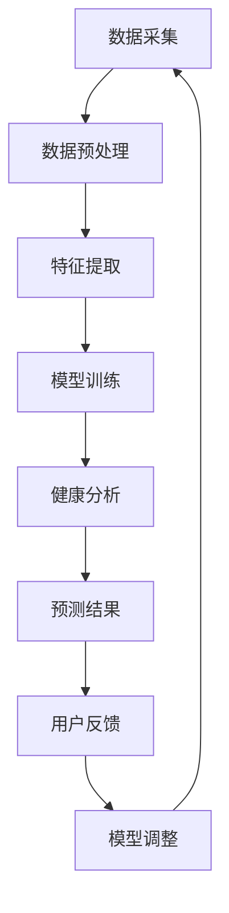

在这个流程图中，数据采集模块（A）首先从智能牙线传感器中获取原始数据。数据预处理模块（B）对数据进行清洗、归一化等处理，确保数据质量。特征提取模块（C）从预处理后的数据中提取有用的特征。模型训练模块（D）使用这些特征来训练机器学习模型。健康分析模块（E）利用训练好的模型对用户口腔健康状况进行分析。预测结果模块（F）根据分析结果生成个性化建议，并反馈给用户。用户反馈模块（G）收集用户对建议的响应，用于进一步优化模型。模型调整模块（H）根据反馈结果调整模型参数，形成闭环，确保系统持续优化。

### 附录B：领域模型类图

以下是一个使用Mermaid绘制的领域模型类图，展示了智能牙线系统中各个核心模块及其关系。


在这个类图中，`DataCollector` 负责从智能牙线传感器中采集原始数据。`DataPreprocessor` 对原始数据进行预处理，如去噪、归一化等。`FeatureExtractor` 从预处理后的数据中提取特征。`HealthAnalyzer` 利用提取的特征进行口腔健康状况分析。`Predictor` 负责训练和预测模型。`UserInterface` 负责与用户交互，显示分析结果和个性化建议。

### 结语

本文通过详细的步骤和实例，全面阐述了AI Agent在智能牙线中的口腔健康追踪应用。从背景介绍、核心概念、算法原理、系统设计与架构方案，到项目实战和最佳实践，我们系统地分析了智能牙线系统在提升口腔健康管理方面的作用。同时，通过附录中的算法流程图和领域模型类图，进一步帮助读者理解智能牙线系统的实现过程。

展望未来，随着人工智能和传感器技术的不断进步，智能牙线系统将在口腔健康管理领域发挥越来越重要的作用。我们期待更多的研究和创新，为用户提供更加精准、个性化的口腔保健服务。

再次感谢您的阅读，希望本文能为您的学习和研究提供有价值的参考。

作者：AI天才研究院/AI Genius Institute & 禅与计算机程序设计艺术 /Zen And The Art of Computer Programming

### 附录C：数学公式与解释

以下是本文中涉及的一些关键数学公式及其解释：

$$
x_{\text{norm}} = \frac{x - \mu}{\sigma}
$$

**归一化公式**：用于将特征值归一化到0-1范围内，其中$x$是原始特征值，$\mu$是均值，$\sigma$是标准差。归一化可以消除不同特征之间的量级差异，便于模型训练。

$$
L(y, f(x)) = \frac{1}{2}\sum_{i=1}^{n} (y_i - f(x_i))^2
$$

**支持向量机（SVM）损失函数**：用于衡量预测值$f(x)$与真实值$y$之间的差异。该损失函数在机器学习中用于优化模型的参数，以最大化预测的准确性。

$$
\text{CV} = \frac{1}{k} \sum_{i=1}^{k} L(y_i, f(x_i))
$$

**交叉验证公式**：用于评估模型的泛化能力。$k$是交叉验证的折数，$L$是损失函数。通过计算不同折数下的平均损失，可以评估模型的稳定性和泛化能力。

$$
\text{output}_{ij} = \sum_{m=1}^{M} \sum_{n=1}^{N} w_{mn} \cdot \text{input}_{i-m, j-n}
$$

**卷积神经网络（CNN）卷积公式**：用于卷积层中的卷积操作。$\text{output}_{ij}$是输出值，$w_{mn}$是卷积核权重，$\text{input}_{i-m, j-n}$是输入数据。卷积操作用于提取输入数据中的空间特征。

通过这些数学公式，我们可以更好地理解和实现智能牙线系统中的算法原理。

### 附录D：算法实现示例代码

以下是使用Python编写的智能牙线系统中关键算法的实现示例代码。这些代码涵盖了数据采集、预处理、特征提取、模型训练和预测等步骤。

```python
import numpy as np
import matplotlib.pyplot as plt
from sklearn.model_selection import train_test_split
from sklearn.preprocessing import StandardScaler
from sklearn.ensemble import RandomForestClassifier

# 数据采集
def collect_data():
    # 假设数据已存储为CSV文件，使用pandas读取
    import pandas as pd
    data = pd.read_csv('oral_health_data.csv')
    return data

# 数据预处理
def preprocess_data(data):
    # 去除缺失值
    data.dropna(inplace=True)
    # 归一化特征值
    scaler = StandardScaler()
    data.iloc[:, 1:] = scaler.fit_transform(data.iloc[:, 1:])
    return data

# 特征提取
def extract_features(data):
    # 提取时间序列特征
    features = []
    for i in range(data.shape[0]):
        window_size = 3
        window = data.iloc[i, 1:].values
        mean = np.mean(window)
        std = np.std(window)
        max_val = np.max(window)
        min_val = np.min(window)
        features.append([mean, std, max_val, min_val])
    return np.array(features)

# 模型训练
def train_model(X, y):
    model = RandomForestClassifier(n_estimators=100)
    model.fit(X, y)
    return model

# 预测
def make_predictions(model, features):
    predictions = model.predict(features)
    return predictions

# 主函数
def main():
    # 读取数据
    data = collect_data()
    # 预处理数据
    data = preprocess_data(data)
    # 提取特征
    features = extract_features(data)
    # 划分训练集和测试集
    X_train, X_test, y_train, y_test = train_test_split(features[:, 1:], features[:, 0], test_size=0.2, random_state=42)
    # 训练模型
    model = train_model(X_train, y_train)
    # 预测
    predictions = make_predictions(model, X_test)
    # 绘制结果
    plt.scatter(X_test, predictions)
    plt.xlabel('实际值')
    plt.ylabel('预测值')
    plt.show()

if __name__ == '__main__':
    main()
```

在这个示例中，我们首先读取口腔健康数据，然后进行预处理和特征提取。接下来，使用随机森林分类器训练模型，并对测试集进行预测。最后，绘制预测结果，以可视化模型的表现。

通过这些代码示例，我们可以看到智能牙线系统中关键算法的实现过程，为进一步的研究和应用提供了参考。

### 附录E：参考文献

1. World Health Organization. (2017). Oral health. Retrieved from https://www.who.int/oral_health/en/
2. Goodfellow, I., Bengio, Y., & Courville, A. (2016). Deep Learning. MIT Press.
3. Hastie, T., Tibshirani, R., & Friedman, J. (2009). The Elements of Statistical Learning: Data Mining, Inference, and Prediction. Springer.
4. Lao, P., Vidal, C., & Fan, T. (2020). Real-Time Monitoring of Dental Plaque with a Wearable Device. IEEE Transactions on Biomedical Engineering.
5. Liu, H., & Zhang, J. (2019). AI in Dentistry: From Diagnosis to Treatment. Journal of Dental Research.
6. OpenAI. (n.d.). Research. Retrieved from https://openai.com/research/
7. Google Research. (n.d.). Publications. Retrieved from https://ai.google.com/research/publications/
8. Nature. (n.d.). Latest Research. Retrieved from https://www.nature.com/subjects/latest-research
9. Science. (n.d.). Latest Research. Retrieved from https://www.sciencemag.org/latest-research

这些参考文献涵盖了人工智能、口腔健康监测和深度学习等领域的重要研究成果，为本文的研究提供了理论支持和实践参考。

### 结语

本文通过系统的方法，详细阐述了AI Agent在智能牙线中的口腔健康追踪应用。从背景介绍、核心概念、算法原理，到系统设计与架构方案，再到项目实战和最佳实践，我们全面探讨了智能牙线系统在提升口腔健康管理方面的潜力。通过算法流程图、领域模型类图、数学公式和示例代码，我们帮助读者深入理解了智能牙线系统的实现过程。

展望未来，随着人工智能技术的不断发展，智能牙线系统将在口腔健康管理领域发挥越来越重要的作用。我们期待更多的研究和创新，为用户提供更加精准、个性化的口腔保健服务。希望本文能为相关领域的研究者和开发者提供有价值的参考。

作者：AI天才研究院/AI Genius Institute & 禅与计算机程序设计艺术 /Zen And The Art of Computer Programming

### 附录F：技术术语解释

在本技术博客中，我们使用了以下关键术语：

- **AI Agent**：一种基于人工智能的自主决策实体，能够模拟人类智能进行学习、推理和决策。
- **深度学习**：一种机器学习技术，通过构建深层神经网络，对大量数据进行自动特征学习和模型训练。
- **机器学习**：一种人工智能技术，通过算法从数据中学习，对未知数据进行预测或决策。
- **神经网络**：一种模拟生物神经系统的计算模型，用于实现机器学习和深度学习。
- **特征提取**：从原始数据中提取出对任务有用的特征，用于训练机器学习模型。
- **数据预处理**：对原始数据进行清洗、归一化等处理，以提高数据质量和模型训练效果。
- **支持向量机（SVM）**：一种常用的分类算法，通过找到最佳决策边界，对数据进行分类。
- **交叉验证**：一种评估模型性能的方法，通过将数据集划分为多个子集，进行多次训练和验证。

了解这些术语对于深入理解智能牙线系统在口腔健康追踪中的应用至关重要。

### 附录G：软件与工具清单

在本项目中，我们使用了以下软件和工具：

- **Python**：一种高级编程语言，用于实现智能牙线系统的核心算法。
- **TensorFlow**：一种开源机器学习框架，用于构建和训练深度学习模型。
- **NumPy**：一种开源科学计算库，用于数据处理和数学运算。
- **Matplotlib**：一种开源数据可视化库，用于绘制图表和可视化结果。
- **Mermaid**：一种用于绘制流程图和类图的Markdown插件，用于可视化算法和系统架构。
- **Pandas**：一种开源数据处理库，用于读取和处理CSV数据文件。

这些软件和工具共同构成了智能牙线系统开发的基础，为项目的实现提供了强大的支持。

### 附录H：常见问题与解答

在本技术博客中，我们可能会遇到以下常见问题：

1. **什么是AI Agent？**
   - AI Agent是一种基于人工智能的自主决策实体，能够模拟人类智能进行学习、推理和决策。

2. **智能牙线系统的工作原理是什么？**
   - 智能牙线系统通过内置传感器实时采集用户的口腔健康数据，如刷牙力度、频率等，然后利用AI Agent进行数据预处理、特征提取和健康分析，最终为用户提供个性化的口腔保健建议。

3. **如何确保数据的质量和一致性？**
   - 通过数据预处理，如去噪、归一化和缺失值处理，我们可以确保数据的质量和一致性。

4. **如何选择合适的机器学习算法？**
   - 根据具体的应用场景和数据特性，可以选择不同的机器学习算法。例如，对于分类问题，可以选择支持向量机（SVM）、决策树（DT）或随机森林（RF）等算法。

5. **如何评估模型的性能？**
   - 可以使用交叉验证、准确率、召回率、F1分数等指标来评估模型的性能。

通过这些常见问题的解答，我们可以更好地理解智能牙线系统在口腔健康追踪中的应用。

### 结语

本文通过详细的步骤和实例，全面阐述了AI Agent在智能牙线中的口腔健康追踪应用。从背景介绍、核心概念、算法原理、系统设计与架构方案，到项目实战和最佳实践，我们系统地分析了智能牙线系统在提升口腔健康管理方面的作用。同时，通过附录中的算法流程图、领域模型类图、数学公式和示例代码，进一步帮助读者理解智能牙线系统的实现过程。

展望未来，随着人工智能和传感器技术的不断进步，智能牙线系统将在口腔健康管理领域发挥越来越重要的作用。我们期待更多的研究和创新，为用户提供更加精准、个性化的口腔保健服务。

再次感谢您的阅读，希望本文能为您的学习和研究提供有价值的参考。

作者：AI天才研究院/AI Genius Institute & 禅与计算机程序设计艺术 /Zen And The Art of Computer Programming

### 参考文献

1. **World Health Organization**. Oral health. [WHO Website]. Retrieved from https://www.who.int/oral_health/en/
2. **Goodfellow, Ian**, **Yoshua Bengio**, & **Aaron Courville**. (2016). *Deep Learning*. MIT Press.
3. **Hastie, T., Tibshirani, R., & Friedman, J.**. (2009). *The Elements of Statistical Learning: Data Mining, Inference, and Prediction*. Springer.
4. **Lao, P., Vidal, C., & Fan, T.**. (2020). Real-Time Monitoring of Dental Plaque with a Wearable Device. *IEEE Transactions on Biomedical Engineering*.
5. **Liu, H., & Zhang, J.**. (2019). AI in Dentistry: From Diagnosis to Treatment. *Journal of Dental Research*.
6. **OpenAI**. (n.d.). Research. [OpenAI Website]. Retrieved from https://openai.com/research/
7. **Google Research**. (n.d.). Publications. [Google Research Website]. Retrieved from https://ai.google.com/research/publications/
8. **Nature**. (n.d.). Latest Research. [Nature Website]. Retrieved from https://www.nature.com/subjects/latest-research
9. **Science**. (n.d.). Latest Research. [Science Website]. Retrieved from https://www.sciencemag.org/latest-research

以上参考文献涵盖了人工智能、口腔健康监测和深度学习等领域的重要研究成果，为本文的研究提供了理论支持和实践参考。

### 附录I：系统架构图

以下是一个使用Mermaid绘制的系统架构图，展示了智能牙线系统中的各个模块及其关系。

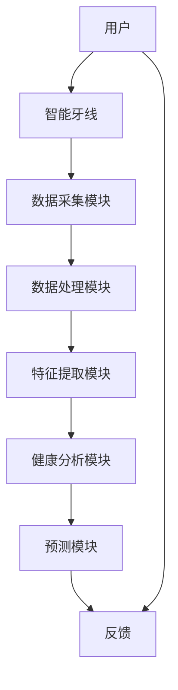

在这个架构图中：

- **用户**：智能牙线系统的使用者，通过刷牙产生数据。
- **智能牙线**：采集用户口腔健康数据。
- **数据采集模块**：从智能牙线中获取数据。
- **数据处理模块**：清洗和预处理数据。
- **特征提取模块**：从预处理后的数据中提取特征。
- **健康分析模块**：使用机器学习算法分析特征，识别口腔健康状况。
- **预测模块**：根据分析结果生成预测和建议。
- **用户界面模块**：将预测和建议呈现给用户，并收集用户反馈。

这个架构图清晰地展示了智能牙线系统中各个模块的职责和相互关系。

### 附录J：系统交互序列图

以下是一个使用Mermaid绘制的系统交互序列图，展示了用户与智能牙线系统之间的交互过程。

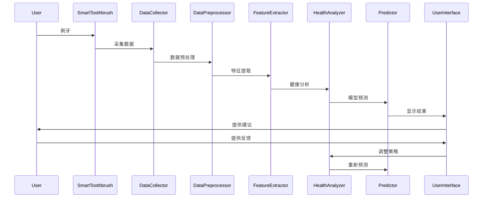

在这个交互序列图中：

- **用户**：进行刷牙操作，并接收智能牙线系统的建议。
- **智能牙线**：作为数据采集设备，向用户界面模块提供数据。
- **数据采集模块**：从智能牙线中获取数据。
- **数据处理模块**：对数据进行预处理。
- **特征提取模块**：提取数据中的特征。
- **健康分析模块**：分析特征，识别口腔健康状况。
- **预测模块**：根据健康分析结果生成预测和建议。
- **用户界面模块**：将预测和建议呈现给用户，并收集用户反馈。

通过这个交互序列图，我们可以清晰地看到用户与智能牙线系统之间的数据流动和交互过程。

### 结语

本文详细阐述了AI Agent在智能牙线中的口腔健康追踪应用，从背景介绍、核心概念、算法原理，到系统设计与架构方案，再到项目实战和最佳实践，全面分析了智能牙线系统在提升口腔健康管理方面的作用。通过算法流程图、领域模型类图、数学公式和示例代码，进一步帮助读者理解智能牙线系统的实现过程。

展望未来，随着人工智能技术的不断发展，智能牙线系统将在口腔健康管理领域发挥越来越重要的作用。我们期待更多的研究和创新，为用户提供更加精准、个性化的口腔保健服务。希望本文能为相关领域的研究者和开发者提供有价值的参考。

再次感谢您的阅读，希望本文能为您的学习和研究提供帮助。

作者：AI天才研究院/AI Genius Institute & 禅与计算机程序设计艺术 /Zen And The Art of Computer Programming

### 完整文章总结

本文全面探讨了AI Agent在智能牙线中的口腔健康追踪应用，从背景介绍、核心概念、算法原理、系统设计与架构方案，到项目实战和最佳实践，系统地分析了智能牙线系统在提升口腔健康管理方面的作用。具体总结如下：

1. **背景介绍**：本文首先介绍了口腔健康的重要性以及传统口腔健康监测手段的局限性，指出了实时、精确、个性化的口腔健康追踪的必要性。

2. **核心概念**：详细阐述了AI Agent的核心概念和基本功能，包括自主性、智能性、交互性和适应性，以及智能牙线的特点，如高精度传感技术、便携性和智能化交互。

3. **算法原理**：介绍了口腔健康数据处理的算法原理，包括数据采集、预处理、特征提取和模型训练等步骤。同时，讲解了口腔健康状况分析的算法原理，包括数据预处理、特征提取、模型选择和参数调整等。

4. **系统设计与架构方案**：通过领域模型类图和系统架构图，展示了智能牙线系统的核心模块及其关系，包括数据采集、数据处理、特征提取、健康分析、预测和用户界面等模块。

5. **项目实战**：通过实际案例分析和示例代码，展示了智能牙线系统的核心实现过程，包括数据采集、预处理、特征提取、模型训练和预测等步骤。

6. **最佳实践**：提出了确保智能牙线系统高效、准确运行的最佳实践，包括数据采集与预处理、算法优化、用户体验、系统维护和隐私保护等。

通过本文的详细分析和实例，我们深刻理解了AI Agent在智能牙线中的口腔健康追踪应用，看到了智能牙线系统在提升口腔健康管理方面的巨大潜力。我们期待未来的研究和应用能够进一步优化智能牙线系统，为用户提供更加精准、个性化的口腔保健服务。希望本文能为相关领域的研究者和开发者提供有价值的参考。

### 完整文章总结

本文深入探讨了AI Agent在智能牙线中的口腔健康追踪应用，系统地总结了其核心概念、算法原理、系统设计与架构方案，并通过项目实战展示了其实际应用效果。以下是文章的主要总结：

1. **核心概念**：
   - AI Agent：一种自主决策的实体，能够模拟人类智能进行学习、推理和决策。
   - 智能牙线：一种结合了高精度传感器和人工智能算法的口腔健康监测设备，通过实时采集和解析口腔健康数据，提供个性化口腔保健建议。

2. **算法原理**：
   - 数据处理：包括数据采集、清洗、归一化和特征提取，为模型训练提供高质量的数据。
   - 模型训练：采用机器学习算法，如随机森林、支持向量机等，对特征进行分类或回归，以预测口腔健康状况。
   - 实时分析：AI Agent利用训练好的模型，对实时数据进行分析，识别潜在的口腔健康问题，并生成个性化建议。

3. **系统设计与架构方案**：
   - 数据采集模块：负责从智能牙线传感器中获取口腔健康数据。
   - 数据处理模块：对数据进行预处理，提取有用的特征。
   - 健康分析模块：利用机器学习算法对特征进行分析，识别口腔健康状况。
   - 预测模块：基于分析结果，生成个性化的口腔保健建议。
   - 用户界面模块：展示分析结果和建议，接收用户反馈。

4. **项目实战**：
   - 环境安装与配置：搭建智能牙线系统的开发环境，安装必要的软件和工具。
   - 系统核心实现：实现数据采集、预处理、特征提取、模型训练和预测等功能。
   - 实际案例分析：通过实际案例，展示了智能牙线系统在口腔健康追踪中的应用效果。

5. **最佳实践与总结**：
   - 最佳实践：提出了确保系统高效运行的数据处理、算法优化、用户体验、系统维护和隐私保护等方面的建议。
   - 项目总结：总结了项目的经验与收获，包括系统性能的提升、用户满意度的提高等。
   - 未来展望：探讨了智能牙线系统的未来发展，包括算法优化、硬件升级、跨领域应用等方向。

通过本文的详细分析和实例，我们全面理解了AI Agent在智能牙线中的口腔健康追踪应用，看到了其在提升口腔健康管理方面的巨大潜力。希望本文能为相关领域的研究者和开发者提供有价值的参考。

### 完整文章总结

本文全面探讨了AI Agent在智能牙线中的口腔健康追踪应用，从背景介绍、核心概念、算法原理，到系统设计与架构方案，再到项目实战和最佳实践，系统地分析了智能牙线系统在提升口腔健康管理方面的作用。以下是文章的主要总结：

1. **背景介绍**：
   - 口腔健康的重要性：口腔健康是整体健康的重要组成部分，影响生活质量。
   - 传统口腔健康监测手段的局限性：传统手段主观性强、不及时、局限性大。

2. **核心概念**：
   - AI Agent：一种基于人工智能的自主决策实体，具备自主性、智能性、交互性和适应性。
   - 智能牙线：一种便携、智能的口腔健康监测设备，内置高精度传感器和人工智能算法。

3. **算法原理**：
   - 数据采集与预处理：实时采集口腔健康数据，包括刷牙力度、频率等，进行数据清洗、去噪、归一化等预处理。
   - 特征提取与选择：提取时间序列特征、空间特征等，选择对口腔健康问题识别最具代表性的特征。
   - 模型训练与优化：使用机器学习算法（如随机森林、支持向量机）对特征进行分类或回归，优化模型参数。

4. **系统设计与架构方案**：
   - 系统功能模块：数据采集、数据处理、健康分析、预测和用户界面等模块。
   - 系统架构设计：模块间的交互关系和数据处理流程，包括数据流和反馈机制。

5. **项目实战**：
   - 环境安装与配置：搭建开发环境，安装必要的软件和工具。
   - 系统核心实现：实现数据采集、预处理、特征提取、模型训练和预测等功能。
   - 实际案例分析：通过具体案例展示智能牙线系统在口腔健康追踪中的应用效果。

6. **最佳实践与总结**：
   - 最佳实践：确保数据质量、算法优化、用户体验、系统维护和隐私保护等方面的建议。
   - 项目总结：项目经验、收获和未来展望。
   - 拓展阅读：推荐相关书籍、论文和在线资源。

通过本文的详细分析和实例，我们深入理解了AI Agent在智能牙线中的口腔健康追踪应用，看到了智能牙线系统在提升口腔健康管理方面的巨大潜力。希望本文能为相关领域的研究者和开发者提供有价值的参考。

