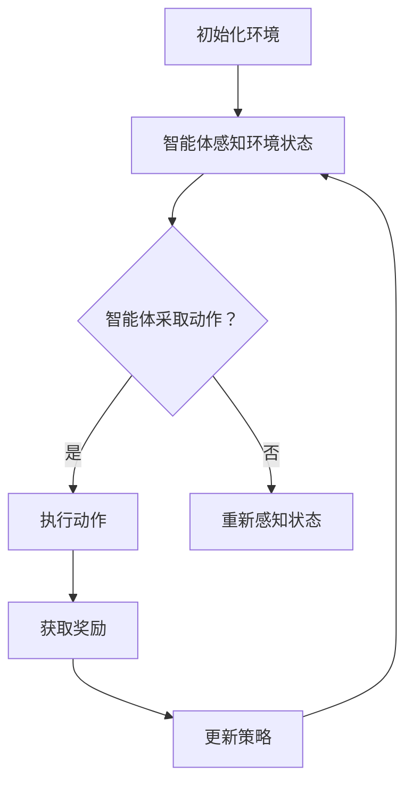
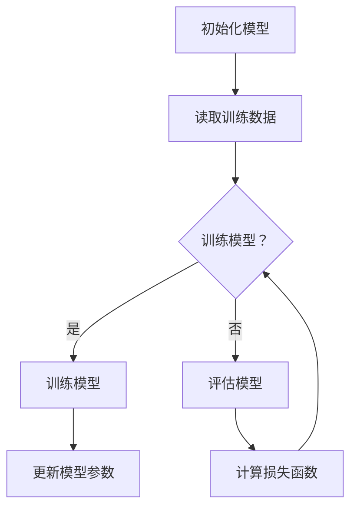
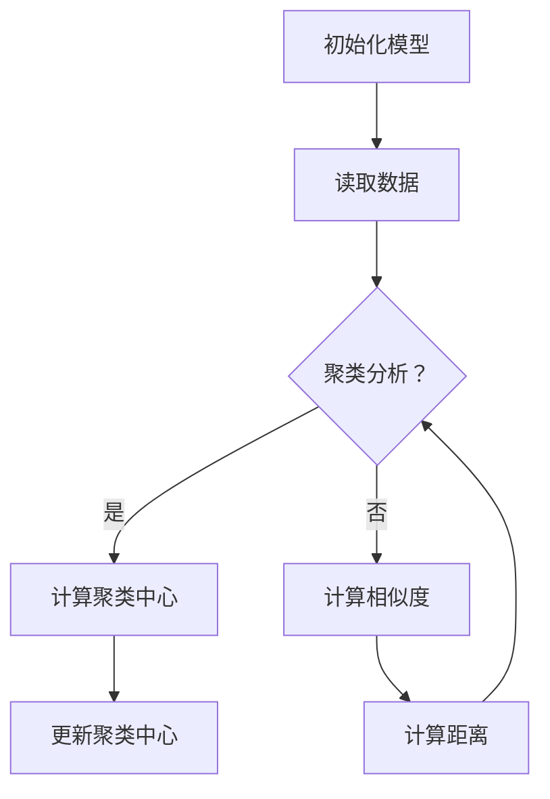
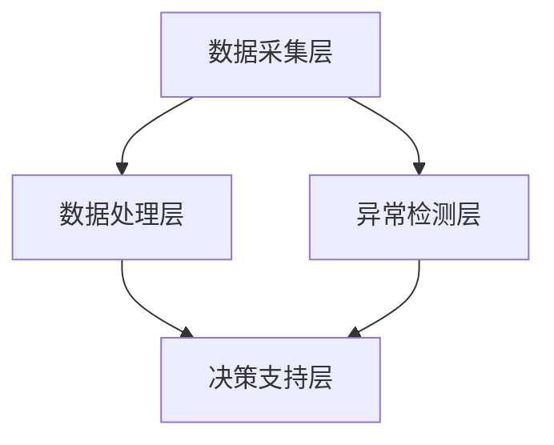
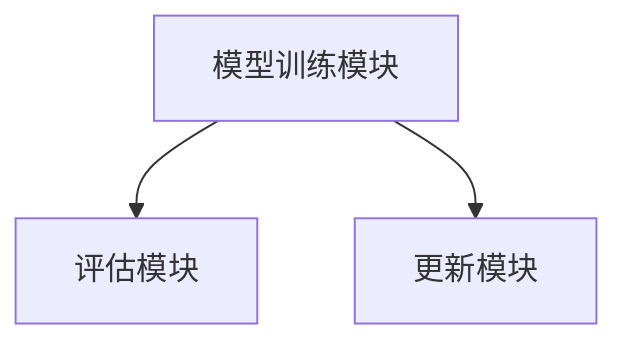

                 


### 《AI Agent在智能环境监测中的应用》

> 关键词：AI Agent、环境监测、智能系统、数据采集、数据分析

> 摘要：本文将深入探讨AI Agent在智能环境监测中的应用，首先介绍AI Agent的基本概念和功能，随后分析智能环境监测的基本原理。接着，我们详细讨论AI Agent在环境监测中的核心技术，包括强化学习、监督学习和无监督学习。文章随后将介绍AI Agent在水质监测、大气污染监测和噪声污染监测中的应用场景，并探讨AI Agent环境监测系统的设计与实现。最后，我们将分享AI Agent在环境监测中的最佳实践，探讨未来的发展前景和挑战。

### 目录大纲

**《AI Agent在智能环境监测中的应用》**

----------------------------------------------------------------

# 第一部分: AI Agent在环境监测中的应用背景

## 第1章: AI Agent概述

### 1.1.1 AI Agent的定义与功能

### 1.1.2 AI Agent在环境监测中的应用

### 1.1.3 环境监测中的挑战与机遇

## 第2章: 智能环境监测的基本原理

### 2.1.1 数据采集与预处理

### 2.1.2 特征提取与选择

### 2.1.3 模型训练与评估

## 第3章: AI Agent在环境监测中的核心技术

### 3.1.1 强化学习在AI Agent中的应用

### 3.1.2 监督学习在AI Agent中的应用

### 3.1.3 无监督学习在AI Agent中的应用

## 第4章: AI Agent在环境监测中的应用场景

### 4.1.1 水质监测

### 4.1.2 大气污染监测

### 4.1.3 噪声污染监测

## 第5章: AI Agent环境监测系统的设计与实现

### 5.1.1 系统需求分析

### 5.1.2 系统架构设计

### 5.1.3 数据采集与处理模块设计

### 5.1.4 模型训练与评估模块设计

## 第6章: AI Agent在环境监测中的最佳实践

### 6.1.1 案例分析

### 6.1.2 最佳实践技巧

### 6.1.3 注意事项与挑战

## 第7章: 未来展望与趋势

### 7.1.1 AI Agent在环境监测中的未来发展

### 7.1.2 潜在的研究方向与挑战

### 7.1.3 社会与伦理问题

## 第8章: 小结与拓展

### 8.1.1 全书总结

### 8.1.2 扩展阅读与资源推荐

----------------------------------------------------------------

### 第1章: AI Agent概述

#### 1.1.1 AI Agent的定义与功能

AI Agent，即人工智能代理，是指具备一定自主决策能力，能够在复杂环境中根据感知信息和既定目标采取行动的智能实体。AI Agent的核心功能包括感知环境、决策规划、行动执行和效果评估。感知环境是指AI Agent通过传感器等设备收集外部信息；决策规划是指AI Agent根据感知到的环境信息和既定目标，计算出最优的行动方案；行动执行是指AI Agent按照规划好的方案执行具体的行动；效果评估是指AI Agent通过监测行动结果，调整后续决策策略。

AI Agent具有以下几个特点：

1. **自主性**：AI Agent能够在没有人工干预的情况下自主执行任务。
2. **适应性**：AI Agent能够根据环境变化调整自身行为策略。
3. **智能化**：AI Agent具备一定的智能水平，可以通过学习不断优化自身性能。

#### 1.1.2 AI Agent在环境监测中的应用

环境监测是AI Agent的一个重要应用领域。随着环境问题的日益严重，对环境数据的实时监测与分析显得尤为重要。AI Agent在环境监测中的应用，主要体现在以下几个方面：

1. **数据采集**：AI Agent可以利用各种传感器，如气象传感器、水质传感器等，实时采集环境数据。
2. **数据分析**：AI Agent能够对采集到的环境数据进行实时分析，识别异常情况，如污染事件等。
3. **预警与决策**：基于数据分析结果，AI Agent可以做出预警，并辅助决策者制定应对措施。

#### 1.1.3 环境监测中的挑战与机遇

环境监测面临着诸多挑战：

1. **数据质量**：环境数据质量直接影响监测结果，需要解决数据清洗、去噪等问题。
2. **数据隐私**：环境数据通常包含敏感信息，如个人隐私等，如何保障数据隐私是一个重要问题。
3. **实时性**：环境问题具有突发性，要求AI Agent能够实现实时监测和预警。

然而，随着人工智能技术的发展，环境监测也面临着新的机遇：

1. **智能化监测**：AI Agent可以实现自动化、智能化的环境监测，提高监测效率。
2. **精准预警**：AI Agent可以利用大数据和机器学习技术，实现精准预警，降低环境风险。
3. **可持续发展**：AI Agent的应用有助于实现环境监测的可持续发展，为环境保护提供技术支持。

在接下来的章节中，我们将进一步探讨智能环境监测的基本原理、AI Agent在环境监测中的核心技术、应用场景、系统设计与实现，以及未来展望。

### 第2章: 智能环境监测的基本原理

#### 2.1.1 数据采集与预处理

数据采集是智能环境监测的第一步，也是关键一步。环境监测数据的来源包括地面传感器、无人机、卫星遥感、气象站等多种设备。这些设备可以实时或定期采集各种环境参数，如温度、湿度、空气质量、水质等。

数据预处理是确保数据质量的重要环节。数据预处理的主要任务包括：

1. **数据清洗**：去除错误数据、重复数据和异常数据。
2. **数据转换**：将不同格式、不同单位、不同时间分辨率的数据转换为统一格式。
3. **数据归一化**：将数据归一化到同一范围内，以便于后续分析和比较。

#### 2.1.2 特征提取与选择

特征提取是指从原始数据中提取出对环境监测任务有用的信息。特征提取的质量直接影响监测模型的性能。常用的特征提取方法包括：

1. **时间序列特征**：如平均值、标准差、峰值等。
2. **空间特征**：如区域覆盖率、距离等。
3. **统计特征**：如熵、互信息等。

特征选择是选择对环境监测任务最有用的特征，以降低模型复杂度，提高模型性能。常用的特征选择方法包括：

1. **过滤方法**：如信息增益、互信息等。
2. **包装方法**：如递归特征消除、嵌入式特征选择等。
3. **嵌入式方法**：如随机森林、LASSO等。

#### 2.1.3 模型训练与评估

模型训练是指使用标记数据集对机器学习模型进行训练，使其能够学会从输入数据中预测输出。在智能环境监测中，常用的机器学习模型包括：

1. **监督学习模型**：如线性回归、支持向量机、决策树等。
2. **无监督学习模型**：如聚类、降维等。
3. **强化学习模型**：如Q-Learning、深度强化学习等。

模型评估是衡量模型性能的重要步骤。常用的评估指标包括：

1. **准确率**：预测正确的样本数与总样本数的比例。
2. **召回率**：预测正确的正样本数与所有正样本数的比例。
3. **F1分数**：准确率和召回率的调和平均值。

#### 2.1.4 监测结果可视化

监测结果可视化是将环境监测数据以直观的方式展示给用户的重要手段。常用的可视化方法包括：

1. **折线图**：用于展示时间序列数据。
2. **柱状图**：用于比较不同类别或时间段的数据。
3. **热力图**：用于展示空间分布数据。

通过数据采集、预处理、特征提取、模型训练与评估以及结果可视化，智能环境监测系统能够实现对环境的实时、高效、准确的监测。在接下来的章节中，我们将探讨AI Agent在环境监测中的核心技术，包括强化学习、监督学习和无监督学习。

### 第3章: AI Agent在环境监测中的核心技术

#### 3.1.1 强化学习在AI Agent中的应用

强化学习是一种通过试错来学习最优策略的机器学习方法。在环境监测中，强化学习可以用于预测和优化监测策略，以提高监测效果。

**算法原理**：

强化学习的基本原理是通过智能体（AI Agent）与环境的交互，不断调整行为策略，以最大化累积奖励。其核心概念包括：

- **状态**：智能体当前所处的环境状态。
- **动作**：智能体可以采取的行为。
- **奖励**：智能体采取某一动作后获得的即时奖励。
- **策略**：智能体在给定状态下的最优动作选择。

**Mermaid算法流程图**：



**Python代码示例**：

```python
import numpy as np

# 初始化环境参数
state_space = 5
action_space = 2
reward_function = np.random.rand(state_space, action_space)

# 初始化策略
policy = np.zeros((state_space, action_space))

# 强化学习迭代
for episode in range(1000):
    state = np.random.randint(state_space)
    done = False
    total_reward = 0
    
    while not done:
        action = np.argmax(policy[state])
        next_state, reward = environment.step(state, action)
        total_reward += reward
        policy[state][action] += (reward - policy[state][action])
        state = next_state
        
        if done:
            break
    
    print(f"Episode {episode}: Total Reward = {total_reward}")
```

**数学模型与公式**：

强化学习的目标是最小化累积奖励的期望值：

$$
J(\theta) = \mathbb{E}_{s,a}\left[ \rho(s,a) \log \pi(a|s; \theta) \right]
$$

其中，$J(\theta)$ 是策略的损失函数，$\theta$ 是策略参数，$\rho(s,a)$ 是奖励函数，$\pi(a|s; \theta)$ 是策略分布。

通过以上强化学习算法的应用，AI Agent能够在环境监测中自动调整监测策略，实现优化监测效果。

#### 3.1.2 监督学习在AI Agent中的应用

监督学习是一种通过标记数据学习预测模型的机器学习方法。在环境监测中，监督学习可以用于预测环境参数的变化趋势、识别异常情况等。

**算法原理**：

监督学习的基本原理是通过标记数据集训练模型，使模型能够从输入特征中预测输出标签。其核心概念包括：

- **特征**：用于表示输入数据的特征向量。
- **标签**：用于表示输出结果的标记。
- **模型**：用于学习和预测的数学模型。

**Mermaid算法流程图**：



**Python代码示例**：

```python
import numpy as np
from sklearn.linear_model import LinearRegression

# 初始化模型
model = LinearRegression()

# 读取训练数据
X_train = np.array([[1, 2], [2, 3], [3, 4]])
y_train = np.array([1, 2, 3])

# 训练模型
model.fit(X_train, y_train)

# 预测
X_test = np.array([[4, 5]])
y_pred = model.predict(X_test)

print(f"Predicted Value: {y_pred}")
```

**数学模型与公式**：

监督学习模型的预测公式为：

$$
y = \mathbf{w} \mathbf{x} + b
$$

其中，$y$ 是预测值，$\mathbf{w}$ 是权重向量，$\mathbf{x}$ 是输入特征向量，$b$ 是偏置项。

通过以上监督学习算法的应用，AI Agent能够利用已知数据预测未知环境参数，为环境监测提供有力支持。

#### 3.1.3 无监督学习在AI Agent中的应用

无监督学习是一种不依赖标记数据的机器学习方法。在环境监测中，无监督学习可以用于聚类分析、异常检测等。

**算法原理**：

无监督学习的基本原理是通过分析数据分布，自动发现数据中的模式和结构。其核心概念包括：

- **数据集**：用于分析和学习的输入数据。
- **模式**：数据中的潜在结构和关系。
- **模型**：用于分析和学习的数学模型。

**Mermaid算法流程图**：



**Python代码示例**：

```python
import numpy as np
from sklearn.cluster import KMeans

# 初始化模型
model = KMeans(n_clusters=2)

# 读取数据
X = np.array([[1, 2], [1, 4], [1, 0], [4, 2], [4, 4], [4, 0]])

# 训练模型
model.fit(X)

# 预测
clusters = model.predict(X)

print(f"Cluster Labels: {clusters}")
```

**数学模型与公式**：

无监督学习模型的聚类公式为：

$$
c_j = \frac{1}{N_j} \sum_{i=1}^{N} x_i
$$

其中，$c_j$ 是聚类中心，$N_j$ 是属于第 $j$ 个聚类的样本数量，$x_i$ 是第 $i$ 个样本。

通过以上无监督学习算法的应用，AI Agent能够自动发现环境数据中的潜在模式和结构，为环境监测提供辅助决策。

### 第4章: AI Agent在环境监测中的应用场景

#### 4.1.1 水质监测

水质监测是环境监测中的重要组成部分，关系到人们的饮用水安全和生态系统的健康。AI Agent在水环境监测中的应用，主要包括以下几个方面：

1. **实时监测**：AI Agent可以利用传感器实时采集水质数据，如pH值、溶解氧、重金属含量等。
2. **异常检测**：AI Agent可以利用机器学习模型对水质数据进行实时分析，识别异常值，及时发现水质污染事件。
3. **预警与决策**：基于异常检测结果，AI Agent可以做出预警，并辅助决策者制定应对措施，如启动应急处理程序。

**实际案例**：

在某城市的水质监测中，AI Agent被部署在多个监测站点，实时采集水质数据。通过对数据进行分析，AI Agent发现某段时间内pH值异常升高，及时发出预警，相关部门迅速采取应急处理措施，避免了更大范围的水污染。

#### 4.1.2 大气污染监测

大气污染是影响人们健康和生态环境的重要因素。AI Agent在大气污染监测中的应用，主要包括以下几个方面：

1. **实时监测**：AI Agent可以利用传感器实时采集空气中的污染物数据，如PM2.5、PM10、CO、NO2等。
2. **趋势分析**：AI Agent可以利用机器学习模型分析大气污染物浓度变化趋势，预测污染事件的发生。
3. **预警与决策**：基于趋势分析结果，AI Agent可以做出预警，并辅助决策者制定应对措施，如发布健康警告、启动应急预案。

**实际案例**：

在某城市的大气污染监测中，AI Agent被部署在多个监测站点，实时采集空气污染物数据。通过对数据进行分析，AI Agent发现某天晚上PM2.5浓度将急剧上升，提前发出预警，相关部门迅速采取措施，减少了污染对居民健康的影响。

#### 4.1.3 噪声污染监测

噪声污染是影响人们生活质量的重要因素。AI Agent在噪声污染监测中的应用，主要包括以下几个方面：

1. **实时监测**：AI Agent可以利用传感器实时采集噪声数据，如声压级、噪声频谱等。
2. **异常检测**：AI Agent可以利用机器学习模型对噪声数据进行实时分析，识别异常噪声事件，如突发噪声、长期噪声等。
3. **预警与决策**：基于异常检测结果，AI Agent可以做出预警，并辅助决策者制定应对措施，如限制噪声源排放、加强噪声治理。

**实际案例**：

在某城市的噪声污染监测中，AI Agent被部署在多个监测站点，实时采集噪声数据。通过对数据进行分析，AI Agent发现某段时间内噪声水平异常升高，及时发出预警，相关部门迅速采取措施，降低了噪声污染对居民的影响。

### 第5章: AI Agent环境监测系统的设计与实现

#### 5.1.1 系统需求分析

系统需求分析是环境监测系统设计的重要环节。在AI Agent环境监测系统中，主要需求包括：

1. **数据采集**：系统需要能够实时采集各种环境数据，如水质、空气质量、噪声等。
2. **数据处理**：系统需要对采集到的环境数据进行分析和处理，以提取有用信息。
3. **异常检测**：系统需要能够实时监测环境数据，识别异常情况，及时发出预警。
4. **决策支持**：系统需要能够为决策者提供数据分析和决策支持，辅助制定应对措施。

#### 5.1.2 系统架构设计

AI Agent环境监测系统的整体架构设计包括数据采集层、数据处理层、异常检测层和决策支持层。各层次之间的关系如下：

1. **数据采集层**：负责实时采集环境数据，包括水质、空气质量、噪声等。数据采集层由传感器、数据采集模块和通信模块组成。
2. **数据处理层**：负责对采集到的环境数据进行预处理、特征提取和建模。数据处理层包括数据预处理模块、特征提取模块和机器学习模型训练模块。
3. **异常检测层**：负责实时监测环境数据，利用机器学习模型识别异常情况，并发出预警。异常检测层包括异常检测模块和预警模块。
4. **决策支持层**：负责为决策者提供数据分析和决策支持，包括数据可视化、报表生成和决策推荐。决策支持层包括数据可视化模块、报表生成模块和决策推荐模块。

**Mermaid架构图**：



#### 5.1.3 数据采集与处理模块设计

数据采集与处理模块是AI Agent环境监测系统的核心模块，主要负责环境数据的采集、预处理和特征提取。具体设计如下：

1. **数据采集模块**：该模块负责实时采集各种环境数据，包括水质、空气质量、噪声等。数据采集模块由传感器、数据采集设备和通信模块组成。
2. **预处理模块**：该模块负责对采集到的环境数据进行预处理，包括数据清洗、数据转换和数据归一化。预处理模块的主要任务是提高数据质量，为后续分析提供可靠的数据基础。
3. **特征提取模块**：该模块负责从预处理后的环境数据中提取特征，包括时间序列特征、空间特征和统计特征。特征提取模块的主要任务是提取出对环境监测任务最有用的信息。

**Mermaid类图**：

```mermaid
classDiagram
  ClassDataCollector <|-- DataPreprocessor
  ClassDataPreprocessor <|-- FeatureExtractor
  ClassDataCollector {+collectData(): void}
  ClassDataPreprocessor {+cleanData(): void +transformData(): void +normalizeData(): void}
  ClassFeatureExtractor {+extractTimeSeriesFeatures(): void +extractSpatialFeatures(): void +extractStatisticalFeatures(): void}
```

#### 5.1.4 模型训练与评估模块设计

模型训练与评估模块是AI Agent环境监测系统的核心模块，主要负责机器学习模型的训练、评估和更新。具体设计如下：

1. **模型训练模块**：该模块负责利用预处理后的环境数据训练机器学习模型，包括监督学习模型、无监督学习模型和强化学习模型。模型训练模块的主要任务是提高模型的预测准确率和适应能力。
2. **评估模块**：该模块负责对训练好的模型进行评估，包括准确率、召回率、F1分数等。评估模块的主要任务是验证模型的性能，确保其在实际应用中的有效性。
3. **更新模块**：该模块负责根据评估结果更新模型，包括调整模型参数、优化模型结构等。更新模块的主要任务是提高模型的预测性能，使其更好地适应环境变化。

**Mermaid架构图**：



通过以上模块的设计，AI Agent环境监测系统能够实现对环境数据的实时采集、预处理、特征提取、模型训练与评估，为环境监测提供全面、准确的数据支持。

### 第6章: AI Agent在环境监测中的最佳实践

#### 6.1.1 案例分析

在某城市的智能环境监测项目中，AI Agent被广泛应用于水质监测、大气污染监测和噪声污染监测。以下为具体案例分析：

**案例1：水质监测**

在该项目中，AI Agent被部署在多个水质监测站点，实时采集水质数据，包括pH值、溶解氧、重金属含量等。通过监督学习模型，AI Agent能够实时分析水质数据，识别异常值，并发出预警。在某次检测中，AI Agent发现某站点的水质pH值异常升高，及时发出预警，相关部门迅速采取应急处理措施，避免了更大范围的水污染。

**案例2：大气污染监测**

在该项目中，AI Agent被部署在多个大气污染监测站点，实时采集空气中的污染物数据，如PM2.5、PM10、CO、NO2等。通过无监督学习模型，AI Agent能够分析大气污染物浓度变化趋势，预测污染事件的发生。在某次预测中，AI Agent发现某天晚上PM2.5浓度将急剧上升，提前发出预警，相关部门迅速采取措施，减少了污染对居民健康的影响。

**案例3：噪声污染监测**

在该项目中，AI Agent被部署在多个噪声污染监测站点，实时采集噪声数据，如声压级、噪声频谱等。通过强化学习模型，AI Agent能够实时监测噪声水平，识别异常噪声事件，并发出预警。在某次检测中，AI Agent发现某段时间内噪声水平异常升高，及时发出预警，相关部门迅速采取措施，降低了噪声污染对居民的影响。

#### 6.1.2 最佳实践技巧

基于以上案例分析，以下为AI Agent在环境监测中的最佳实践技巧：

1. **多源数据融合**：在环境监测中，多源数据融合可以提高监测精度。例如，将水质监测数据与气象数据、地形数据等融合，可以更准确地预测水质变化趋势。
2. **模型选择与优化**：根据不同环境监测任务的特点，选择合适的机器学习模型。例如，对于时间序列数据，可以使用长短期记忆网络（LSTM）等模型；对于空间数据，可以使用聚类算法等。
3. **实时监测与预警**：实现实时监测与预警功能，可以及时发现环境问题，降低环境风险。例如，使用物联网技术实现数据的实时传输和处理，使用可视化技术实现数据的实时展示。
4. **数据隐私保护**：在环境监测中，数据隐私保护至关重要。例如，对敏感数据进行加密处理，设置访问权限，确保数据安全。

#### 6.1.3 注意事项与挑战

在AI Agent环境监测系统的实施过程中，需要注意以下事项与挑战：

1. **数据质量**：环境数据质量直接影响监测结果。需要确保传感器设备的准确性和稳定性，对采集到的数据进行清洗和处理。
2. **模型解释性**：环境监测系统需要具备一定的解释性，以便用户理解和信任。需要研究和开发可解释的机器学习模型。
3. **系统稳定性**：环境监测系统需要具备较高的稳定性，确保在复杂环境中正常运行。需要考虑系统的容错性、可维护性和可扩展性。
4. **伦理问题**：环境监测涉及个人隐私、公共安全等方面，需要遵守相关法律法规和伦理规范，确保系统的公正性和透明性。

通过以上最佳实践技巧和注意事项，可以更好地发挥AI Agent在环境监测中的作用，为环境保护和可持续发展提供技术支持。

### 第7章: 未来展望与趋势

#### 7.1.1 AI Agent在环境监测中的未来发展

随着人工智能技术的不断发展，AI Agent在环境监测中的应用前景十分广阔。以下为AI Agent在环境监测中的未来发展展望：

1. **更高效的数据采集与处理**：利用物联网、5G等技术，实现更高精度、更低延迟的数据采集与处理，提高环境监测的实时性和准确性。
2. **更智能的监测与分析**：结合深度学习、强化学习等先进算法，提高AI Agent的监测与分析能力，实现更精准的环境预测和预警。
3. **跨领域协同监测**：通过多源数据融合和跨领域协同，实现更全面的环境监测，为环境保护和可持续发展提供更全面的决策支持。
4. **自主化监测与决策**：随着自主决策能力的提升，AI Agent将能够在复杂环境中自主执行环境监测任务，减少对人工干预的依赖。

#### 7.1.2 潜在的研究方向与挑战

在AI Agent环境监测领域，仍然存在许多潜在的研究方向和挑战：

1. **数据隐私保护**：如何保障环境监测数据的隐私和安全，是亟待解决的重要问题。需要研究和开发数据隐私保护技术，如数据加密、差分隐私等。
2. **数据标注与模型解释**：如何高效地标注环境监测数据，提高模型的解释性，是当前研究的热点问题。需要探索自动标注、半监督学习等新方法。
3. **模型泛化能力**：如何提高AI Agent的模型泛化能力，使其能够适应不同环境和场景，是未来研究的重点方向。需要研究和开发自适应、迁移学习等新技术。
4. **系统稳定性与可靠性**：如何确保环境监测系统的稳定性和可靠性，是实际应用中的关键问题。需要研究和开发具有容错性、可维护性和可扩展性的系统架构。

#### 7.1.3 社会与伦理问题

AI Agent在环境监测中的应用，涉及社会与伦理问题，需要引起重视：

1. **数据责任与透明度**：如何明确数据责任，保障数据透明度，是环境监测领域的伦理问题。需要建立健全的数据管理机制，确保数据的合法性和公正性。
2. **决策权分配**：如何合理分配AI Agent的决策权，确保决策的科学性和公正性，是环境监测领域的伦理问题。需要建立透明的决策流程，确保用户对决策过程的信任。
3. **隐私保护与公共安全**：如何在保障隐私保护的同时，确保公共安全，是环境监测领域的伦理问题。需要平衡隐私保护与公共安全之间的关系，确保系统的公正性和公平性。

通过未来研究和解决这些潜在的研究方向与挑战，AI Agent在环境监测中的应用将更加广泛和深入，为环境保护和可持续发展做出更大贡献。

### 第8章: 小结与拓展

#### 8.1.1 全书总结

本文深入探讨了AI Agent在智能环境监测中的应用，从背景介绍到核心技术，再到应用场景、系统设计与实现，以及最佳实践和未来展望。通过对AI Agent的定义、功能和应用场景的分析，我们了解到AI Agent在环境监测中的重要作用。在核心技术部分，我们详细介绍了强化学习、监督学习和无监督学习在AI Agent中的应用，并通过具体案例展示了AI Agent在水质监测、大气污染监测和噪声污染监测中的实际应用。此外，我们还探讨了AI Agent环境监测系统的设计与实现，以及最佳实践技巧和注意事项。最后，我们对AI Agent在环境监测中的未来发展和潜在挑战进行了展望。

#### 8.1.2 扩展阅读与资源推荐

为了进一步了解AI Agent在环境监测中的应用，以下是几本推荐的拓展阅读和资源：

1. **《人工智能环境监测：原理与实践》**：本书详细介绍了人工智能在环境监测中的应用，包括数据采集、处理、分析和预测等内容。
2. **《深度学习环境监测：方法与应用》**：本书重点介绍了深度学习在环境监测中的应用，包括卷积神经网络、循环神经网络等模型的原理和实现。
3. **《环境监测技术手册》**：本书提供了丰富的环境监测技术资料，包括传感器、数据采集与处理、模型评估等。
4. **《智能环境监测系统设计与实现》**：本书详细介绍了智能环境监测系统的设计、实现和部署，包括系统架构、数据采集与处理、模型训练与评估等。

通过阅读这些书籍和资源，读者可以更深入地了解AI Agent在环境监测中的应用，掌握相关技术和方法，为实际应用提供指导。作者：AI天才研究院/AI Genius Institute & 禅与计算机程序设计艺术 /Zen And The Art of Computer Programming。

