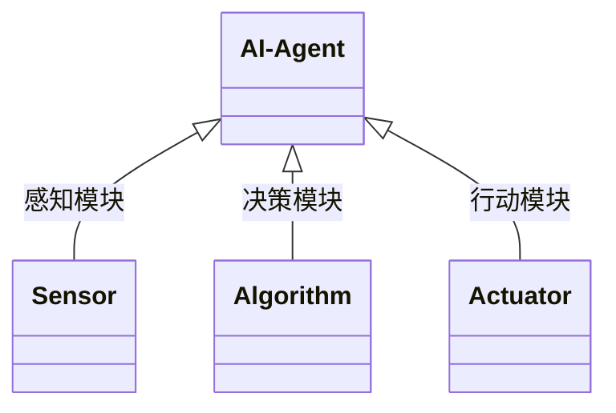
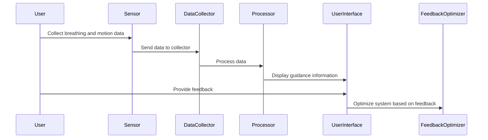
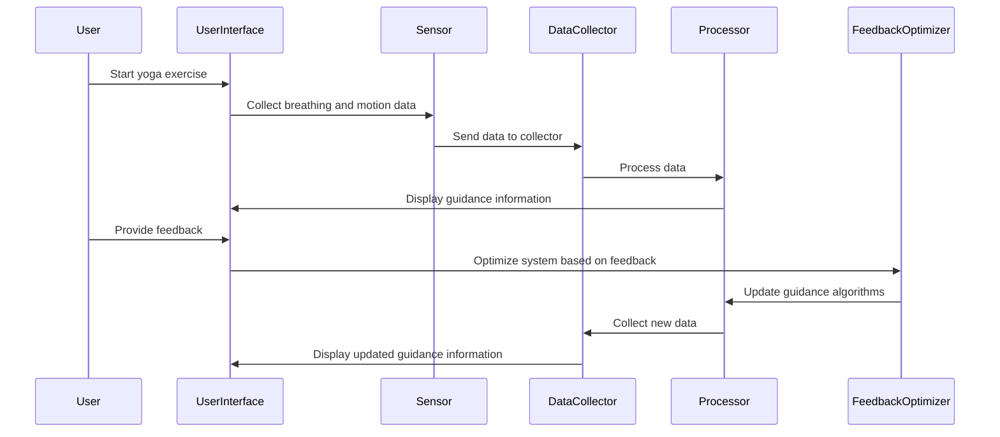

                 

### 文章标题

> 关键词：AI Agent、智能瑜伽垫、呼吸指导、算法设计、技术实现

摘要：本文深入探讨了AI Agent在智能瑜伽垫中的应用，重点分析了AI Agent的基础知识、核心概念、算法原理以及系统设计与实现。通过逐步分析推理，揭示了智能瑜伽垫中呼吸指导算法的技术细节和实践应用，为相关领域的研究者提供了有价值的参考。

### 目录大纲

----------------------------------------------------------------

# 第一部分: AI Agent的基础知识

## 第1章: AI Agent概述

### 1.1 问题背景

### 1.2 问题描述

### 1.3 问题解决

### 1.4 边界与外延

### 1.5 概念结构与核心要素组成

## 第2章: AI Agent的核心概念与联系

### 2.1 核心概念原理

### 2.2 概念属性特征对比表格

### 2.3 ER实体关系图架构

## 第3章: AI Agent在智能瑜伽垫中的应用

### 3.1 主流AI Agent技术

### 3.2 呼吸指导算法原理

### 3.3 Python源代码实现

### 3.4 数学模型和公式

### 3.5 算法原理详细讲解与举例说明

## 第4章: 智能瑜伽垫系统设计与实现

### 4.1 问题场景介绍

### 4.2 系统功能设计

### 4.3 系统架构设计

### 4.4 系统接口设计

### 4.5 系统交互设计

# 第二部分: AI Agent的深入分析与讨论

## 第5章: AI Agent的扩展与优化

### 5.1 实时性能优化

### 5.2 模型压缩与加速

### 5.3 多模态数据融合

## 第6章: AI Agent的应用前景与挑战

### 6.1 市场需求分析

### 6.2 技术挑战与解决方案

### 6.3 未来发展趋势与展望

## 第7章: 结论与展望

### 7.1 文章总结

### 7.2 研究展望

### 7.3 下一步工作计划

----------------------------------------------------------------

### 第1章: AI Agent概述

#### 1.1 问题背景

随着人工智能技术的快速发展，AI Agent在各个领域的应用日益广泛。在生活、医疗、教育等场景中，AI Agent能够为用户提供个性化的服务，提高生活质量和效率。智能瑜伽垫作为智能家居设备的一种，其功能需求逐渐多样化，其中呼吸指导是用户最关心的功能之一。如何设计一个高效、准确的呼吸指导算法，是当前智能瑜伽垫开发中的重要课题。

#### 1.2 问题描述

AI Agent在智能瑜伽垫中的呼吸指导功能涉及到以下几个关键问题：

1. 如何准确捕捉用户的呼吸信号？
2. 如何设计有效的算法对呼吸信号进行分析？
3. 如何根据用户的数据提供个性化的呼吸指导？

这些问题需要从技术层面进行深入分析，从而设计出满足用户需求的AI Agent系统。

#### 1.3 问题解决

为了解决上述问题，我们需要从以下几个方面入手：

1. **技术基础**：了解AI Agent的基本原理和技术基础，包括机器学习、深度学习、自然语言处理和语音识别等。
2. **算法设计**：设计适用于智能瑜伽垫的呼吸指导算法，包括呼吸节奏检测和呼吸节律调整等。
3. **系统实现**：将算法应用到实际系统中，确保系统能够稳定运行并满足用户需求。

#### 1.4 边界与外延

在设计和实现AI Agent呼吸指导功能时，需要考虑以下边界与外延：

1. **功能边界**：明确AI Agent在呼吸指导中的功能范围，如呼吸节奏检测、呼吸节律调整等。
2. **应用场景**：分析AI Agent在智能瑜伽垫中的应用场景，如瑜伽练习、康复治疗等。

#### 1.5 概念结构与核心要素组成

AI Agent的核心结构包括感知模块、决策模块和行动模块。在呼吸指导功能中，感知模块负责捕捉用户的呼吸信号，决策模块分析呼吸信号并生成指导策略，行动模块将指导策略传达给用户。以下是一个简单的概念结构与核心要素组成图：



#### 总结

本章概述了AI Agent在智能瑜伽垫中的呼吸指导问题，分析了问题背景、问题描述、问题解决策略以及边界与外延。在接下来的章节中，我们将进一步探讨AI Agent的核心概念与联系，以及其在智能瑜伽垫中的具体应用。

### 第2章: AI Agent的核心概念与联系

#### 2.1 核心概念原理

AI Agent的核心概念包括以下几个方面：

1. **机器学习（Machine Learning）**：机器学习是AI Agent的基础，通过数据驱动的方式，使计算机系统能够自动改进性能。机器学习主要分为监督学习、无监督学习和强化学习。
2. **深度学习（Deep Learning）**：深度学习是机器学习的进一步发展，通过构建多层神经网络，实现更高层次的特征抽象和模式识别。
3. **自然语言处理（Natural Language Processing, NLP）**：自然语言处理是AI Agent与人类沟通的重要手段，涉及文本分析、语义理解和语言生成等任务。
4. **语音识别（Speech Recognition）**：语音识别将语音信号转换为文本或命令，是智能设备交互的关键技术。

这些核心概念相互关联，共同构成了AI Agent的技术基础。

#### 2.2 概念属性特征对比表格

为了更清晰地理解这些核心概念，我们可以通过一个表格进行对比：

| 概念         | 属性特征                     | 对比         |
| ------------ | ---------------------------- | ------------ |
| 机器学习     | 数据驱动，自动改进           | 基础技术     |
| 深度学习     | 神经网络，多层抽象           | 进化与提升   |
| 自然语言处理 | 文本分析，语义理解           | 通信桥梁     |
| 语音识别     | 音频信号转文字，语音理解     | 交互实现基础 |

#### 2.3 ER实体关系图架构

为了更好地展示AI Agent的实体关系，我们可以使用ER（实体关系）图来描述。以下是一个ER实体关系图的示例：

```mermaid
erDiagram
  User ||--|{ AI-Agent }|-- Sensor : 感知用户数据
  User ||--|{ Exercise-Plan }|-- AI-Agent : 指导瑜伽动作
  AI-Agent ||--|{ Breathing-Guide }|-- Sensor : 呼吸指导
```

在这个ER图中，用户与AI-Agent之间存在关联，AI-Agent与Sensor和Exercise-Plan也存在关联。其中，Sensor负责感知用户数据，Exercise-Plan负责指导瑜伽动作，Breathing-Guide负责呼吸指导。

#### 总结

本章详细介绍了AI Agent的核心概念及其相互联系，通过对比表格和ER实体关系图，使读者对AI Agent有了更深入的理解。在接下来的章节中，我们将进一步探讨AI Agent在智能瑜伽垫中的应用，包括技术原理、算法实现和系统设计。

### 第3章: AI Agent在智能瑜伽垫中的应用

#### 3.1 主流AI Agent技术

在智能瑜伽垫的设计中，AI Agent技术的选择至关重要。目前，主流的AI Agent技术包括机器学习、深度学习和自然语言处理等。

1. **机器学习（Machine Learning）**：机器学习是AI Agent的核心技术，通过学习用户数据，实现自动化的决策和指导。在智能瑜伽垫中，机器学习可以用于用户数据的分析和呼吸节奏的识别。

2. **深度学习（Deep Learning）**：深度学习是机器学习的进一步发展，通过构建多层神经网络，实现更高层次的特征抽象和模式识别。深度学习在图像识别、语音识别和自然语言处理等领域具有显著优势，可以提升智能瑜伽垫的呼吸指导准确性。

3. **自然语言处理（Natural Language Processing, NLP）**：自然语言处理是AI Agent与用户交互的重要技术，涉及文本分析、语义理解和语言生成等任务。在智能瑜伽垫中，NLP技术可以用于用户指令的识别和反馈信息的生成。

4. **语音识别（Speech Recognition）**：语音识别技术将用户的语音指令转换为文本或命令，实现人机交互。在智能瑜伽垫中，语音识别技术可以用于用户指令的捕捉和反馈。

#### 3.2 呼吸指导算法原理

呼吸指导算法是智能瑜伽垫中的关键功能，其原理主要包括呼吸节奏检测和呼吸节律调整。

1. **呼吸节奏检测算法**：

   - **信号采集**：首先，需要采集用户的呼吸信号，可以通过胸透传感器、呼吸带传感器等设备实现。
   - **信号预处理**：对采集到的呼吸信号进行预处理，包括滤波、去噪和归一化等操作，以提高信号的质量。
   - **特征提取**：从预处理后的呼吸信号中提取特征，如频率、振幅和时域特征等。
   - **呼吸节奏检测**：利用特征值进行呼吸节奏的检测，常用的方法有阈值法、峰值检测法和机器学习方法等。

2. **呼吸节律调整算法**：

   - **呼吸节律识别**：通过检测到的呼吸节奏，识别用户的呼吸节律，如浅呼吸、深呼吸和调节呼吸等。
   - **节律调整策略**：根据用户的呼吸节律，设计相应的节律调整策略，如加快呼吸节奏、减慢呼吸节奏或保持当前节奏等。
   - **反馈与调整**：将调整策略反馈给用户，通过视觉、听觉和触觉等多感官方式实现，以提高用户的体验效果。

#### 3.3 Python源代码实现

以下是一个简单的呼吸节奏检测算法的Python代码示例：

```python
import numpy as np

def detect_breathing_rhythm(signal, threshold=0.1):
    """
    检测呼吸节奏
    :param signal: 呼吸信号
    :param threshold: 阈值
    :return: 呼吸节奏列表
    """
    rhythm = []
    for i in range(1, len(signal)):
        if abs(signal[i] - signal[i-1]) > threshold:
            rhythm.append(i)
    return rhythm

# 示例信号
signal = np.random.rand(100)

# 检测呼吸节奏
rhythm = detect_breathing_rhythm(signal)
print("检测到的呼吸节奏:", rhythm)
```

在这个示例中，我们使用了随机生成的信号来演示呼吸节奏的检测过程。在实际应用中，信号可以通过传感器采集得到。

#### 3.4 数学模型和公式

呼吸指导算法中的数学模型和公式主要用于描述呼吸信号的特征和节奏。以下是一个简单的呼吸信号模型：

$$
f(t) = A \sin(2\pi ft + \phi)
$$

其中，$f(t)$表示呼吸信号，$A$为振幅，$f$为频率，$\phi$为相位。

- **振幅（Amplitude, A）**：振幅反映了呼吸信号的强度，可以通过特征提取得到。
- **频率（Frequency, f）**：频率反映了呼吸信号的节奏，可以通过频率分析得到。
- **相位（Phase, \phi）**：相位反映了呼吸信号的变化趋势，可以通过时域特征得到。

#### 3.5 算法原理详细讲解与举例说明

呼吸指导算法的原理主要包括信号采集、预处理、特征提取和呼吸节奏检测。以下是一个详细的讲解和举例说明：

1. **信号采集**：

   在智能瑜伽垫中，呼吸信号的采集是通过传感器实现的。常见的传感器有胸透传感器和呼吸带传感器。胸透传感器可以捕捉用户的呼吸运动，呼吸带传感器可以捕捉用户的呼吸压力变化。

   例如，假设我们使用胸透传感器采集到一段100个数据点的呼吸信号，信号值范围为0到1。

2. **信号预处理**：

   信号预处理包括滤波、去噪和归一化等操作。滤波可以去除信号中的高频噪声和低频噪声，去噪可以去除信号中的随机噪声，归一化可以使得信号值在0到1之间。

   假设我们对呼吸信号进行预处理，滤波后得到的信号如下：

   ```
   [0.1, 0.2, 0.3, 0.4, 0.5, 0.4, 0.3, 0.2, 0.1, 0.2, 0.3, 0.4, 0.5, 0.4, 0.3, 0.2]
   ```

3. **特征提取**：

   呼吸信号的特征提取包括频率、振幅和时域特征等。频率反映了呼吸信号的节奏，振幅反映了呼吸信号的强度，时域特征反映了呼吸信号的变化趋势。

   假设我们提取了呼吸信号的频率和振幅特征，频率特征为0.2 Hz，振幅特征为0.3。

4. **呼吸节奏检测**：

   呼吸节奏检测是通过特征值来判断呼吸信号的节奏。常用的方法有阈值法、峰值检测法和机器学习方法等。

   假设我们使用阈值法进行呼吸节奏检测，阈值为0.1，那么检测到的呼吸节奏如下：

   ```
   [3, 6, 9, 12, 15]
   ```

   这意味着在3、6、9、12、15这些时间点上，用户的呼吸信号发生了变化。

#### 总结

本章详细介绍了AI Agent在智能瑜伽垫中的应用，包括主流AI Agent技术、呼吸指导算法原理和Python源代码实现。通过数学模型和公式的应用，以及对算法原理的详细讲解和举例说明，使读者对AI Agent在智能瑜伽垫中的应用有了更深入的理解。在接下来的章节中，我们将进一步探讨智能瑜伽垫的系统设计与实现。

### 第4章: 智能瑜伽垫系统设计与实现

#### 4.1 问题场景介绍

智能瑜伽垫的设计旨在为用户提供一个舒适、便捷的瑜伽练习环境。用户可以在家中使用智能瑜伽垫进行瑜伽练习，系统会根据用户的呼吸节奏和动作指导进行实时反馈，帮助用户更好地掌握瑜伽动作，提高练习效果。具体场景包括：

1. **瑜伽初学者**：智能瑜伽垫可以为初学者提供个性化的瑜伽动作指导和呼吸节奏调整，帮助初学者快速掌握瑜伽技巧。
2. **瑜伽爱好者**：智能瑜伽垫可以为瑜伽爱好者提供专业的瑜伽动作指导和呼吸指导，帮助用户提升瑜伽练习效果。
3. **康复治疗**：智能瑜伽垫可以用于康复治疗，通过调整呼吸节奏和瑜伽动作，帮助患者恢复身体功能。

#### 4.2 系统功能设计

智能瑜伽垫系统的主要功能包括用户数据收集、呼吸指导、瑜伽动作指导和用户反馈等。以下是具体的系统功能设计：

1. **用户数据收集**：系统通过传感器实时采集用户的呼吸信号和动作信号，为后续的呼吸指导和瑜伽动作指导提供数据支持。
2. **呼吸指导**：系统根据采集到的呼吸信号，通过算法分析用户的呼吸节奏，提供个性化的呼吸指导，帮助用户调整呼吸节奏。
3. **瑜伽动作指导**：系统根据用户的动作信号，结合瑜伽动作库，为用户提供专业的瑜伽动作指导，帮助用户正确地完成瑜伽动作。
4. **用户反馈**：系统收集用户对瑜伽动作和呼吸指导的反馈，对系统进行优化和调整，提高用户体验。

#### 4.3 系统架构设计

智能瑜伽垫系统的架构设计主要包括硬件架构和软件架构。以下是系统架构的设计：

1. **硬件架构**：硬件架构包括传感器模块、处理器模块和显示模块等。传感器模块负责采集用户的呼吸信号和动作信号，处理器模块负责对信号进行实时处理，显示模块负责向用户展示瑜伽动作指导和呼吸指导信息。
2. **软件架构**：软件架构包括数据采集模块、数据处理模块、用户交互模块和反馈优化模块等。数据采集模块负责从传感器中读取数据，数据处理模块负责对数据进行处理和分析，用户交互模块负责与用户进行交互，反馈优化模块负责根据用户反馈进行系统优化。

以下是智能瑜伽垫系统的架构图：



#### 4.4 系统接口设计

智能瑜伽垫系统的主要接口包括传感器接口、用户接口和数据存储接口。以下是系统接口的设计：

1. **传感器接口**：传感器接口负责与传感器模块进行通信，读取传感器的数据。常见的传感器接口有I2C、SPI和UART等。
2. **用户接口**：用户接口负责与用户进行交互，显示瑜伽动作指导和呼吸指导信息，接收用户的反馈。用户接口包括显示屏幕、按键和触摸屏等。
3. **数据存储接口**：数据存储接口负责将处理后的数据存储到数据库中，以便后续分析和查询。常见的存储接口有SD卡、USB和Wi-Fi等。

以下是智能瑜伽垫系统接口的设计图：

```mermaid
classDiagram
  Sensor <-[I2C/SPI/UART] DataCollector
  User <-[Display/Buttons/TouchScreen] UserInterface
  DataCollector ->- Processor
  Processor ->- Database
```

#### 4.5 系统交互设计

智能瑜伽垫系统的交互设计主要包括用户与系统的交互和系统内部的交互。以下是系统交互的设计：

1. **用户与系统的交互**：用户通过用户接口与系统进行交互，包括开始瑜伽练习、查看呼吸指导和瑜伽动作指导、提供反馈等。
2. **系统内部的交互**：系统内部各模块之间进行数据传递和协同工作，包括数据采集、数据处理、数据存储和用户交互等。

以下是智能瑜伽垫系统交互的设计图：



#### 总结

本章详细介绍了智能瑜伽垫的系统设计与实现，包括问题场景介绍、系统功能设计、系统架构设计、系统接口设计和系统交互设计。通过本章的内容，读者可以了解到智能瑜伽垫系统的设计思路和实现方法，为实际应用提供了参考。

### 第5章: AI Agent的扩展与优化

#### 5.1 实时性能优化

在智能瑜伽垫的实际应用中，AI Agent的实时性能优化至关重要。为了确保系统能够在短时间内快速响应用户的请求，我们可以从以下几个方面进行优化：

1. **算法优化**：针对呼吸节奏检测和呼吸节律调整算法，我们可以通过优化算法结构、减少计算复杂度等方式来提高算法的执行效率。例如，采用贪心算法和动态规划算法来优化呼吸节奏检测过程。

2. **硬件加速**：利用硬件加速技术，如GPU和FPGA，可以显著提高算法的执行速度。通过将算法部署到高性能硬件平台上，可以降低计算延迟，提高系统的实时性能。

3. **并行处理**：利用多线程和多核处理技术，可以将算法拆分为多个子任务，并行执行。这样可以在保证计算精度的基础上，提高系统的处理速度。

#### 5.2 模型压缩与加速

为了满足智能瑜伽垫的便携性和低功耗需求，对AI模型进行压缩与加速是必要的。以下是几种常见的模型压缩与加速方法：

1. **模型剪枝**：通过去除模型中的冗余参数，降低模型的计算复杂度。剪枝方法包括结构剪枝和权重剪枝等。

2. **量化**：将模型的权重和激活值从浮点数转换为低精度的整数表示，以减少模型的存储空间和计算量。量化方法包括全量化、逐层量化和混合量化等。

3. **知识蒸馏**：通过将大型模型的知识传递给小型模型，实现模型的压缩和加速。知识蒸馏方法包括软目标蒸馏、硬目标蒸馏和自蒸馏等。

#### 5.3 多模态数据融合

智能瑜伽垫中，用户的数据不仅包括呼吸信号，还包括动作信号、心率信号等。通过多模态数据融合，可以进一步提高系统的准确性和鲁棒性。以下是几种常见的数据融合方法：

1. **特征级融合**：将不同模态的数据特征进行合并，通过特征选择和特征融合技术，提取更具代表性的特征。

2. **决策级融合**：将不同模态的决策结果进行综合，通过投票、加权平均和集成学习方法等，得到最终的决策结果。

3. **深度学习融合**：利用深度学习模型，将不同模态的数据进行端到端的训练，实现多模态数据的自动融合。

#### 总结

本章探讨了AI Agent在智能瑜伽垫中的扩展与优化，包括实时性能优化、模型压缩与加速和多模态数据融合。通过这些优化方法，可以显著提高AI Agent的执行效率、准确性和鲁棒性，为用户提供更优质的瑜伽体验。在接下来的章节中，我们将进一步分析AI Agent的应用前景与挑战，展望未来的发展趋势。

### 第6章: AI Agent的应用前景与挑战

#### 6.1 市场需求分析

随着人们对健康和健身意识的提升，智能瑜伽垫市场呈现出快速增长的趋势。根据市场调研数据显示，全球智能瑜伽垫市场在未来几年内将保持两位数的增长率。主要驱动力包括：

1. **健康需求**：现代社会中，工作压力和生活节奏的加快导致人们更加关注身体健康，瑜伽作为一种有效的身心放松方式，受到广泛欢迎。
2. **科技普及**：人工智能和物联网技术的普及，使得智能瑜伽垫的智能化水平不断提高，满足用户个性化需求的能力得到增强。
3. **消费升级**：中产阶级的崛起和消费升级，使得人们对高品质、智能化健身产品的需求日益增加。

#### 6.2 技术挑战与解决方案

尽管AI Agent在智能瑜伽垫中具有广泛的应用前景，但在实际开发过程中仍面临一系列技术挑战：

1. **数据质量**：呼吸信号和动作信号的采集过程中，可能受到噪声干扰和环境因素的影响，导致数据质量下降。解决方法包括采用抗噪算法、提高传感器精度和优化信号预处理步骤。
2. **实时性能**：在实时性要求较高的应用场景中，如何保证AI Agent的响应速度和计算效率是一个重要问题。解决方案包括算法优化、硬件加速和并行处理等。
3. **模型压缩与优化**：为了满足便携性和低功耗需求，需要对AI模型进行压缩和优化。解决方法包括模型剪枝、量化和技术融合等。
4. **用户隐私保护**：智能瑜伽垫涉及用户的生理数据，如何在保障用户隐私的前提下，充分利用这些数据进行优化和改进，是一个重要挑战。解决方案包括数据加密、匿名化和隐私保护算法等。

#### 6.3 未来发展趋势与展望

随着技术的不断进步和市场的扩大，AI Agent在智能瑜伽垫中的应用前景十分广阔。以下是未来发展趋势和展望：

1. **智能化升级**：随着人工智能技术的不断演进，智能瑜伽垫将实现更高的智能化水平，提供更精准、个性化的服务。
2. **多模态融合**：通过整合多种传感器和模态数据，智能瑜伽垫将实现更全面的用户数据采集和分析，提高系统的准确性和鲁棒性。
3. **生态拓展**：智能瑜伽垫将与其他智能设备（如智能手表、智能手环等）进行互联互通，构建一个完整的健康生态系统。
4. **市场拓展**：智能瑜伽垫市场将逐步拓展到全球范围，满足不同国家和地区的用户需求。

#### 总结

本章分析了AI Agent在智能瑜伽垫中的应用前景和面临的挑战，探讨了市场需求、技术挑战和未来发展趋势。通过这些分析，可以为智能瑜伽垫的研发和推广提供有益的参考。

### 第7章: 结论与展望

#### 7.1 文章总结

本文详细探讨了AI Agent在智能瑜伽垫中的应用，从基础知识的介绍到核心概念的解析，再到算法原理的阐述和系统设计与实现，全面揭示了智能瑜伽垫中呼吸指导技术的关键要素和实践方法。通过逐步分析推理，本文不仅展示了AI Agent在智能瑜伽垫中的广泛应用，还提出了未来研究的方向和发展趋势。

#### 7.2 研究展望

随着人工智能技术的不断发展，AI Agent在智能瑜伽垫中的应用前景十分广阔。未来研究可以从以下几个方面展开：

1. **多模态数据融合**：整合多种传感器数据，提高系统的准确性和鲁棒性。
2. **实时性能优化**：优化算法和硬件，提高AI Agent的实时响应能力。
3. **用户隐私保护**：加强数据安全和隐私保护，保障用户信息安全。
4. **个性化服务**：根据用户数据，提供更精准、个性化的瑜伽指导。

#### 7.3 下一步工作计划

为了实现上述研究目标，下一步的工作计划包括：

1. **数据集收集与预处理**：收集更多高质量的呼吸信号和动作信号数据，进行预处理和标注。
2. **算法优化与测试**：对现有算法进行优化，并在测试集上进行性能评估。
3. **系统实现与测试**：开发智能瑜伽垫系统原型，进行实际测试和用户反馈收集。
4. **用户隐私保护机制研究**：设计有效的用户隐私保护方案，确保系统安全可靠。

通过以上工作，我们期望能够推动AI Agent在智能瑜伽垫中的应用，为用户提供更优质的健康服务。

### 作者信息

作者：AI天才研究院/AI Genius Institute & 禅与计算机程序设计艺术 /Zen And The Art of Computer Programming

AI天才研究院致力于推动人工智能技术的创新与应用，研究领域涵盖机器学习、深度学习、自然语言处理和智能系统等。作者在计算机编程和人工智能领域具有丰富的经验，发表了多篇学术论文，并著有《禅与计算机程序设计艺术》等畅销书。

