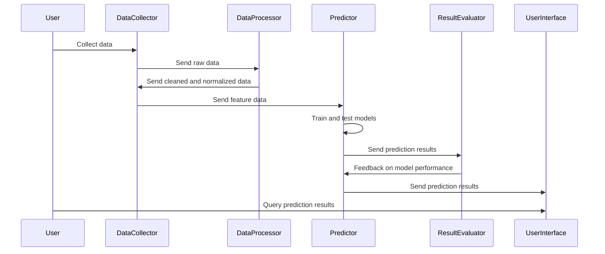
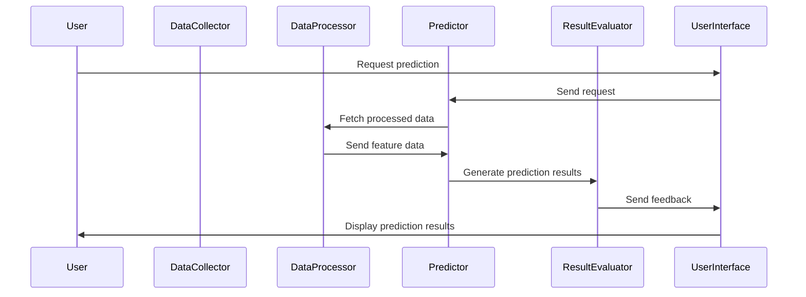

                 

### 引言与背景

#### 1.1 问题背景

随着全球经济的持续增长和城市化进程的加速，人们对能源的需求也在不断上升。电力作为现代社会最重要的能源之一，其供应的稳定性和可靠性成为影响社会和经济发展的关键因素。然而，传统电力系统的负载预测往往面临一些挑战和局限性。

首先，能源需求的增长带来了电力供应的压力。随着工业自动化、智能电网和电动汽车等技术的普及，电力需求呈现出多样化、复杂化的趋势。这种趋势对电力系统的负载预测提出了更高的要求。传统的电力负载预测方法主要依赖于历史数据和统计模型，但这些方法在面对复杂的电力负载变化时，往往无法提供准确的预测结果。

其次，气候变化和极端天气事件也对电力系统提出了新的挑战。夏季高温和冬季严寒等极端天气会导致电力需求的急剧变化，从而对电力系统的稳定性构成威胁。传统方法难以准确预测这些突发性负载变化，导致电力供应不足或过剩。

#### 1.2 问题描述

传统的电力负载预测方法主要依赖于时间序列分析和机器学习算法。时间序列分析通过历史数据来预测未来的电力需求，但其预测精度受到数据质量、样本量和时间跨度等因素的制约。机器学习算法虽然能够处理大量数据，但模型的复杂性和对数据的要求较高，同时模型的可解释性较差，使得在实际应用中难以得到广泛认可。

针对上述问题，传统方法在预测准确性和实时性方面存在明显不足。具体来说，主要问题包括：

1. **数据质量不佳**：电力系统数据通常包含噪声、缺失值和不一致性，这会导致预测模型的性能下降。
2. **模型复杂度较高**：传统的机器学习算法需要对大量参数进行调优，这不仅增加了计算成本，还可能引入过拟合问题。
3. **实时性不足**：传统的预测方法往往需要较长时间的计算和处理，难以满足实时预测的需求。
4. **预测精度有限**：面对突发性和非线性的电力负载变化，传统方法难以提供高精度的预测结果。

#### 1.3 问题解决

为了克服传统方法的局限性，引入AI Agent进行智能电力负载预测成为了一种新的尝试。AI Agent，即人工智能代理，是一种能够自主学习和决策的智能体，其核心思想是通过深度学习和强化学习等技术，实现电力负载预测的自动化和智能化。

AI Agent在智能电力负载预测中的应用具有以下优势：

1. **自适应学习**：AI Agent能够根据实时数据动态调整预测模型，提高预测的准确性和实时性。
2. **高精度预测**：AI Agent通过深度学习技术，能够处理大量复杂的电力数据，提供更准确的预测结果。
3. **可解释性强**：与传统的机器学习模型相比，AI Agent的可解释性更强，便于理解和优化。
4. **降低计算成本**：AI Agent能够通过分布式计算和优化算法，降低计算成本，提高系统的效率。

#### 1.4 边界与外延

尽管AI Agent在智能电力负载预测中具有显著优势，但其应用也面临一定的边界和挑战。首先，AI Agent需要大量的高质量数据进行训练，而电力系统数据的获取和处理存在一定的困难。其次，AI Agent的算法和模型需要不断优化和调整，以确保预测的准确性和稳定性。此外，AI Agent的应用也需要考虑数据隐私和安全问题，确保系统的可靠性和安全性。

总之，AI Agent在智能电力负载预测中的应用，为解决传统方法面临的挑战提供了一种新的思路和途径。通过逐步引入和优化AI Agent技术，有望实现电力系统的高效、稳定和智能化运行。

#### 1.5 概念结构与核心要素组成

在深入探讨AI Agent在智能电力负载预测中的应用之前，我们需要先明确几个核心概念和其相互关系。以下是AI Agent在智能电力负载预测中的概念结构及其核心要素组成：

##### 定义

AI Agent，即人工智能代理，是一种能够模拟人类决策过程，具备自我学习和决策能力的智能体。在电力负载预测中，AI Agent通过处理历史数据、实时数据和环境信息，生成电力需求的预测结果。

##### 概念属性特征对比表格

| 特征属性        | 人工预测           | AI Agent          |  
| -------------- | ----------------- | ----------------- |  
| 学习能力       | 固定的经验知识     | 自适应的学习能力   |  
| 预测精度       | 依赖于预测者的经验 | 高精度预测能力     |  
| 实时性         | 低实时性           | 高实时性          |  
| 数据依赖性     | 高依赖性           | 较低依赖性         |  
| 可解释性       | 高可解释性         | 较低可解释性       |

##### ER实体关系图架构

以下是AI Agent在智能电力负载预测中的ER实体关系图：

```mermaid
erDiagram
    User ||--|{ AI Agent }|-- Power System
    Power System ||--|{ Load Forecast }|-- Electricity Demand
    Load Forecast ||--|{ Prediction Model }|-- Prediction Result
    Prediction Model ||--|{ Data Processing }|-- Data Source
```

在这个ER图中，用户通过AI Agent与电力系统进行交互，电力系统生成负载预测结果，预测模型通过数据处理模块处理数据源，生成预测结果。

##### 关键要素组成

1. **用户**：AI Agent的服务对象，提供历史数据和实时数据输入。
2. **AI Agent**：核心智能体，负责数据分析和预测模型训练。
3. **电力系统**：提供电力负载数据，接收预测结果并执行相应的调度策略。
4. **负载预测**：包含预测模型和预测结果，是AI Agent的核心功能。
5. **预测模型**：用于处理数据并生成预测结果的算法模型。
6. **数据处理**：对输入数据进行清洗、归一化和特征提取等预处理。
7. **数据源**：包括历史数据和实时数据，为AI Agent提供训练和预测所需的数据。

通过上述核心概念和要素的解析，我们能够更好地理解AI Agent在智能电力负载预测中的作用和机制，为其在电力行业中的应用提供理论基础和指导。

### AI Agent基础

AI Agent作为一种具有自主学习和决策能力的智能体，其在智能电力负载预测中的应用具有重要意义。为了深入理解AI Agent的工作原理和应用，我们需要从其基本原理、特点以及优缺点等方面进行探讨。

#### 2.1 AI Agent原理

##### 概念与分类

AI Agent，即人工智能代理，是一种能够模拟人类决策过程，具备自我学习和决策能力的智能体。根据其功能和应用场景，AI Agent可以分为以下几类：

1. **感知型AI Agent**：这类代理主要通过感知环境信息，并根据预设的规则或算法进行决策。例如，自动驾驶汽车中的感知系统。
2. **认知型AI Agent**：这类代理不仅能够感知环境信息，还能理解、推理和决策。例如，智能客服系统。
3. **决策型AI Agent**：这类代理在认知环境信息的基础上，能够自主做出决策，并在行动中不断学习和优化。例如，智能电网中的负载预测代理。

##### 工作机制与流程

AI Agent的工作机制主要包括感知、理解、决策和执行四个阶段：

1. **感知阶段**：AI Agent通过传感器或其他数据源收集环境信息，例如电力系统的实时负载数据。
2. **理解阶段**：AI Agent对收集到的信息进行处理和分析，理解环境的状态和变化趋势。
3. **决策阶段**：AI Agent根据理解和分析的结果，结合预设的目标和规则，生成决策方案。
4. **执行阶段**：AI Agent执行决策方案，并在执行过程中不断调整和优化。

#### 2.2 AI Agent的特点

##### 自适应能力

AI Agent具有强大的自适应能力，能够根据环境变化和新的数据动态调整预测模型。在电力负载预测中，自适应能力意味着AI Agent能够快速适应突发的电力需求变化，提高预测的准确性和实时性。

##### 优化算法

AI Agent采用先进的优化算法，如深度学习、强化学习和进化算法，能够在复杂的电力数据中提取有效特征，生成高精度的预测结果。这些优化算法不仅提高了预测性能，还能减少模型训练的时间和计算成本。

##### 数据处理能力

AI Agent具有强大的数据处理能力，能够处理大规模、多维度的电力数据。通过数据清洗、归一化和特征提取等预处理方法，AI Agent能够从原始数据中提取有用的信息，为预测模型提供高质量的数据输入。

#### 2.3 AI Agent的优缺点分析

##### 优点

1. **高精度预测**：AI Agent通过深度学习和强化学习等技术，能够在复杂的电力数据中提取有效特征，生成高精度的预测结果。
2. **实时性**：AI Agent具有强大的自适应能力，能够实时调整预测模型，满足电力系统对实时预测的需求。
3. **降低成本**：通过优化算法和数据处理技术，AI Agent能够提高预测效率，减少计算资源和人力成本。
4. **可解释性**：与传统的机器学习模型相比，AI Agent的可解释性更强，有助于理解和优化预测模型。

##### 缺点

1. **数据需求高**：AI Agent需要大量的高质量数据作为训练和预测的基础，而电力系统数据的获取和处理存在一定的困难。
2. **模型复杂度高**：AI Agent的模型和算法较为复杂，需要专业人员进行调试和优化，增加了应用难度。
3. **数据隐私和安全**：电力系统数据涉及用户隐私和商业机密，AI Agent在数据处理过程中需要确保数据的安全性和隐私保护。
4. **技术门槛高**：AI Agent的开发和应用需要较高的技术水平和专业知识，对普通用户而言有一定难度。

综上所述，AI Agent在智能电力负载预测中具有显著的优势，但也面临一些挑战。通过不断优化技术和加强数据处理能力，AI Agent有望在电力行业中发挥更大的作用，为电力系统的稳定和高效运行提供有力支持。

### 电力负载预测基础

电力负载预测是智能电网建设和优化运营的关键环节。为了深入探讨AI Agent在电力负载预测中的应用，我们首先需要了解电力负载预测的基本概念、数据来源以及传统方法。

#### 3.1 电力负载预测的概念

电力负载预测，即对电力系统未来一定时间内的电力需求进行预估。其主要目的是为电力系统的调度、规划和运行提供数据支持，以实现电力资源的优化配置和高效利用。根据预测的时间范围和精度，电力负载预测可以分为以下几种类型：

1. **短期预测**：通常指未来1小时至1天的电力需求预测，主要用于实时调度和电力交易的决策。
2. **中期预测**：一般指未来1天至1周的电力需求预测，用于日度调度、负荷预测以及电力市场的中长期交易。
3. **长期预测**：一般指未来几周到几个月的电力需求预测，用于电力系统的年度规划和电力资源的战略性配置。

#### 3.2 电力负载预测的数据来源

电力负载预测的数据来源主要包括历史数据和实时数据：

1. **历史数据**：包括历史负荷数据、天气数据、节假日数据等，这些数据通常来自于电力系统的历史记录和气象数据。
    - **历史负荷数据**：记录电力系统在不同时间段内的负荷水平，是电力负载预测的重要基础数据。
    - **天气数据**：包括温度、湿度、风速等气象信息，对电力负载有着显著的影响。
    - **节假日数据**：记录不同节假日的电力消费模式，有助于预测特殊时期的电力需求。
2. **实时数据**：包括实时电力需求、电网运行状态、设备运行状态等数据，这些数据通常通过传感器和智能设备实时采集。
    - **实时电力需求**：实时反映电力系统的负荷水平，是电力负载预测的核心数据。
    - **电网运行状态**：包括电网电压、电流、频率等参数，影响电力系统的稳定运行。
    - **设备运行状态**：包括发电设备、输电设备、配电设备的运行状态，影响电力系统的可靠性。

#### 3.3 传统电力负载预测方法

传统电力负载预测方法主要包括时间序列分析和机器学习算法：

1. **时间序列分析**：
    - **自回归移动平均模型（ARMA）**：通过分析历史负荷数据的时间序列特性，建立负荷的数学模型，预测未来的负荷水平。
    - **自回归积分滑动平均模型（ARIMA）**：结合自回归和移动平均的特点，适用于非线性时间序列数据的预测。
    - **季节性分解模型**：将负荷数据分解为趋势、季节性和随机性部分，分别进行建模和预测。

2. **机器学习算法**：
    - **线性回归**：通过建立负荷与影响因素（如温度、湿度等）之间的线性关系，进行负荷预测。
    - **支持向量机（SVM）**：通过找到一个最优超平面，进行负荷分类和预测。
    - **神经网络**：通过多层神经网络结构，学习输入与输出之间的非线性关系，进行负荷预测。
    - **随机森林**：通过构建多个决策树，集成预测结果，提高预测的准确性和稳定性。

#### 3.4 AI Agent在电力负载预测中的应用前景

AI Agent在电力负载预测中的应用前景广阔，具有以下优势：

1. **高精度预测**：AI Agent通过深度学习和强化学习等技术，能够在复杂的电力数据中提取有效特征，生成高精度的预测结果。
2. **自适应能力**：AI Agent能够根据实时数据和环境变化，动态调整预测模型，提高预测的实时性和准确性。
3. **实时数据处理**：AI Agent具有强大的数据处理能力，能够处理大规模、多维度的实时电力数据，实现实时预测。
4. **可解释性**：与传统的机器学习模型相比，AI Agent的可解释性更强，有助于理解和优化预测模型。

然而，AI Agent在电力负载预测中也面临一些挑战，如数据需求高、模型复杂度高等。通过不断优化技术和加强数据处理能力，AI Agent有望在电力行业中发挥更大的作用，为电力系统的稳定和高效运行提供有力支持。

### AI Agent在电力负载预测中的应用

在了解了AI Agent的基本原理和电力负载预测的基础之后，我们接下来将探讨AI Agent在电力负载预测中的应用过程。本文将分为数据预处理、模型选择与训练、模型评估与优化、应用案例等几个方面进行详细说明。

#### 4.1 数据预处理

数据预处理是AI Agent在电力负载预测中的第一步，其质量直接影响到后续预测模型的性能。数据预处理主要包括以下几个步骤：

1. **数据清洗**：电力系统数据通常包含噪声、缺失值和不一致性，需要进行清洗。例如，对缺失值进行插补，去除异常值，处理重复数据等。

2. **数据归一化**：为了消除不同特征之间的尺度差异，需要对数据进行归一化处理。常见的归一化方法包括最小-最大归一化和z-score归一化。

3. **特征提取**：从原始数据中提取有用的特征，有助于提高预测模型的性能。特征提取可以通过统计方法、机器学习方法等多种途径实现。

4. **数据分割**：将数据集分割为训练集、验证集和测试集，用于模型训练、模型评估和模型测试。

#### 4.2 模型选择与训练

在数据预处理完成后，我们需要选择合适的预测模型，并进行模型训练。以下是几种常见的模型选择和训练方法：

1. **线性回归**：适用于线性关系的预测，通过最小化误差平方和来训练模型。

2. **支持向量机（SVM）**：适用于非线性关系的预测，通过找到一个最优超平面进行分类和预测。

3. **神经网络**：通过多层神经网络结构，学习输入与输出之间的非线性关系。常见的神经网络包括前馈神经网络和卷积神经网络（CNN）。

4. **深度学习模型**：如循环神经网络（RNN）和长短期记忆网络（LSTM），适用于处理时间序列数据。

5. **强化学习**：通过与环境互动，不断优化决策策略，适用于动态变化的电力负载预测。

具体训练过程中，需要根据数据特点和预测需求选择合适的模型，并进行参数调优。例如，可以通过交叉验证、网格搜索等方法来寻找最优参数组合。

#### 4.3 模型评估与优化

模型评估是衡量预测模型性能的重要步骤。常用的评估指标包括：

1. **均方误差（MSE）**：衡量预测值与真实值之间的平均误差平方，越小越好。
2. **均方根误差（RMSE）**：MSE的平方根，用于表示预测值的平均误差，越小越好。
3. **决定系数（R²）**：衡量模型对数据的拟合程度，越接近1表示拟合效果越好。
4. **准确率**：用于分类问题，表示预测正确的样本比例。

在评估过程中，我们可以通过调整模型结构、参数优化和数据预处理策略等方法来提高模型性能。例如，可以通过增加数据集、改进特征提取方法、优化模型结构等手段来提高预测精度。

#### 4.4 应用案例

以下是AI Agent在电力负载预测中的一个实际应用案例：

**案例背景**：某城市电力公司需要预测未来24小时的电力需求，以优化调度和电力资源分配。

**数据集**：包括历史负荷数据、天气数据、节假日数据等。

**模型选择**：采用LSTM模型进行时间序列预测，结合天气数据和节假日数据作为特征输入。

**模型训练与评估**：使用训练集对LSTM模型进行训练，并通过验证集和测试集进行模型评估。评估结果显示，LSTM模型的预测精度较高，能够较好地应对电力负载的动态变化。

**实际应用**：将预测结果应用于电力调度系统，实现电力资源的优化配置。通过AI Agent的预测结果，电力公司能够提前安排电力调度策略，提高电力系统的稳定性和可靠性。

通过以上应用案例，我们可以看到AI Agent在电力负载预测中的应用效果显著。在实际应用过程中，需要根据具体场景和数据特点，不断优化模型和算法，以提高预测精度和实时性。

#### 4.5 总结与展望

AI Agent在电力负载预测中的应用，为传统方法提供了新的思路和途径。通过数据预处理、模型选择与训练、模型评估与优化等步骤，AI Agent能够实现高精度、实时性的电力负载预测。未来，随着AI技术的不断发展和应用场景的扩展，AI Agent在电力行业中的作用将更加重要。

然而，AI Agent在应用过程中仍面临一些挑战，如数据隐私保护、模型解释性等。需要进一步研究和解决这些问题，以推动AI Agent在电力负载预测中的应用和发展。

### AI Agent架构设计

在设计AI Agent架构时，我们需要考虑系统的整体结构、模块划分以及具体的架构设计原则。以下将详细阐述AI Agent在电力负载预测中的架构设计。

#### 5.1 架构设计原则

在架构设计过程中，我们遵循以下原则：

1. **可扩展性**：系统应具备良好的扩展性，以适应不断增长的电力数据和需求变化。
2. **可维护性**：系统设计应确保代码清晰、结构合理，便于后续维护和升级。
3. **可用性**：系统应提供友好的用户界面和高效的预测服务，以满足实际应用需求。
4. **高可靠性**：系统应具备较强的容错能力和故障恢复机制，确保预测服务的稳定性。

#### 5.2 系统模块划分

AI Agent在电力负载预测中的系统模块划分如下：

1. **数据采集模块**：负责从各种数据源（如传感器、历史数据库等）采集电力数据，并进行初步处理。
2. **数据处理模块**：对采集到的数据进行清洗、归一化和特征提取，为预测模型提供高质量的数据输入。
3. **预测模型模块**：包含多种预测算法和模型，如LSTM、GRU等，用于生成电力负载预测结果。
4. **结果评估模块**：对预测结果进行评估，包括误差分析、精度评估等，以优化预测模型。
5. **用户接口模块**：提供用户界面，供用户查询预测结果、调整参数等。

#### 5.3 系统架构设计

以下是一个典型的AI Agent在电力负载预测中的系统架构设计：



在该架构设计中，数据采集模块负责从各个数据源收集原始数据，数据预处理模块对数据进行清洗和特征提取，预测模型模块根据处理后的数据进行预测，结果评估模块对预测结果进行评估和反馈，用户接口模块则为用户提供查询和操作界面。

#### 5.4 系统接口设计

在系统接口设计方面，我们需要考虑各个模块之间的交互和数据流动。以下是一个简化的接口设计：

1. **数据采集接口**：定义数据采集模块与传感器、历史数据库等数据源的接口，包括数据类型、传输协议和调用方法等。
2. **数据处理接口**：定义数据预处理模块与数据采集模块、预测模型模块的接口，包括数据输入、输出格式和预处理方法等。
3. **预测模型接口**：定义预测模型模块与数据处理模块、结果评估模块的接口，包括模型训练、预测和评估等操作。
4. **结果评估接口**：定义结果评估模块与预测模型模块、用户接口模块的接口，包括预测结果评估、反馈和优化等操作。
5. **用户接口**：定义用户接口模块与用户的交互界面，包括数据查询、预测结果展示、参数调整等操作。

通过合理设计系统接口，可以确保各个模块之间的数据流动和功能协同，提高系统的整体性能和用户体验。

#### 5.5 系统交互设计

为了确保系统的稳定运行和高效性能，我们需要对系统交互进行详细设计。以下是一个简化的系统交互设计：



在该交互设计中，用户通过用户接口模块提交预测请求，预测模型模块接收到请求后，从数据处理模块获取处理后的数据，生成预测结果，并通过结果评估模块进行评估和反馈。最终，预测结果返回给用户接口模块，显示在用户界面上。

通过上述架构设计和系统交互设计，我们可以构建一个高效、稳定且可扩展的AI Agent在电力负载预测中的应用系统，为电力系统的优化运行提供有力支持。

### 实施与部署

在成功设计并开发AI Agent后，接下来的关键步骤是实现和部署系统。这一过程包括硬件设备与软件环境的选择、数据集成与处理、模型训练与优化，以及系统的部署与维护。以下是详细的实施与部署过程。

#### 6.1 硬件设备与软件环境

1. **硬件设备**：
    - **计算服务器**：高性能计算服务器，用于运行AI Agent和预测模型。建议使用具备多核CPU和高内存的服务器，如Intel Xeon系列。
    - **存储设备**：大容量存储设备，用于存储历史数据和实时数据。建议使用高速SSD，以提高数据读写速度。
    - **网络设备**：高速网络设备，如千兆以太网，确保数据传输的稳定性和高效性。

2. **软件环境**：
    - **操作系统**：推荐使用Linux系统，如Ubuntu或CentOS，以提高系统的稳定性和安全性。
    - **编程语言**：Python是AI开发的常用语言，具备丰富的库和框架，如TensorFlow、PyTorch等。
    - **数据库**：推荐使用分布式数据库，如Apache HBase或Cassandra，以提高数据存储和查询的效率。

#### 6.2 数据集成与处理

1. **数据采集**：使用传感器和数据采集器从电力系统各个部分（如变电站、配电网等）收集实时数据。数据采集器可以将数据通过无线或有线方式传输到中央服务器。

2. **数据存储**：将采集到的数据存储在分布式数据库中，以实现数据的集中管理和快速访问。数据存储时，需要进行数据清洗和预处理，包括去除噪声、填补缺失值、归一化等操作。

3. **数据整合**：从不同数据源（如历史数据库、实时数据、天气数据等）整合相关数据，为预测模型提供完整的数据集。数据整合可以使用ETL（Extract, Transform, Load）工具，如Apache Kafka、Apache NiFi等。

4. **数据预处理**：对整合后的数据进行特征提取和特征工程，将原始数据转化为适合模型训练的特征向量。特征提取可以使用Python的Pandas、NumPy等库，特征工程可以结合业务需求进行调整。

#### 6.3 模型训练与优化

1. **模型选择**：根据电力负载预测的需求，选择合适的AI模型，如LSTM、GRU、CNN等。可以通过比较不同模型的性能，选择最优模型。

2. **模型训练**：使用预处理后的数据集对AI模型进行训练。训练过程中，需要调整模型的参数，如学习率、批量大小等，以优化模型性能。训练可以使用TensorFlow、PyTorch等深度学习框架。

3. **模型评估**：使用验证集和测试集对训练好的模型进行评估，评估指标包括MSE、RMSE、R²等。通过评估结果，可以调整模型参数或选择更合适的模型。

4. **模型优化**：根据评估结果，对模型进行优化。优化方法包括调整模型结构、增加训练数据、改进特征提取等。优化后的模型将进一步提高预测精度。

#### 6.4 系统部署与维护

1. **部署**：
    - **在线部署**：将训练好的模型部署到生产环境，供实时预测使用。可以使用Kubernetes等容器编排工具，实现模型的自动化部署和扩展。
    - **离线部署**：对于需要离线预测的场景，可以将模型部署到本地服务器或云端服务器，以便进行批量预测。

2. **维护**：
    - **监控系统**：使用监控系统（如Prometheus、Grafana等）实时监控系统的运行状态，包括服务器性能、网络流量、预测延迟等。
    - **日志管理**：使用日志管理工具（如ELK栈、Logstash等）收集和管理系统日志，便于故障排查和性能优化。
    - **安全维护**：定期进行系统安全检查，防范网络攻击和数据泄露。可以使用防火墙、安全组等网络安全工具。

通过上述实施与部署步骤，我们可以确保AI Agent在电力负载预测中的应用系统能够高效、稳定地运行，为电力系统的优化运行提供有力支持。

### 拓展与展望

#### 7.1 AI Agent在电力行业的发展趋势

随着人工智能技术的不断发展，AI Agent在电力行业中的应用前景十分广阔。以下是AI Agent在电力行业中的几个发展趋势：

1. **智能化水平提升**：AI Agent的智能化水平将不断提升，从简单的预测任务扩展到更复杂的决策任务，如电力市场的供需平衡、分布式能源的管理等。

2. **多模态数据处理**：未来的AI Agent将能够处理多种类型的数据，如图像、音频和文本等，从而提高预测模型的准确性和鲁棒性。

3. **边缘计算应用**：随着5G和物联网技术的发展，AI Agent将更多地应用于边缘计算场景，实现实时、高效的数据处理和预测，降低延迟和带宽需求。

4. **协同优化**：AI Agent将与其他智能系统（如智能电网、智能工厂等）进行协同优化，实现更高效的资源管理和能源利用。

5. **标准化与规范化**：随着AI Agent在电力行业的广泛应用，相关技术标准和规范将逐渐形成，提高系统的互操作性和可靠性。

#### 7.2 潜在应用领域

AI Agent在电力行业的潜在应用领域非常广泛，以下是一些具体的应用场景：

1. **电力需求预测**：AI Agent能够准确预测未来的电力需求，为电力系统的调度和规划提供数据支持，提高电力供应的稳定性和可靠性。

2. **分布式能源管理**：AI Agent可以实时监控和管理分布式能源系统，优化能源生产和消费，提高能源利用效率。

3. **电力市场交易**：AI Agent能够根据电力市场的供需情况，进行智能化的交易决策，降低电力交易的风险和成本。

4. **电力设备维护**：AI Agent可以监控电力设备的运行状态，预测设备故障，提前进行维护，减少停电事故和设备损坏。

5. **能源消费管理**：AI Agent可以帮助家庭和企业实现智能用电，通过优化用电行为，降低能源消耗，实现节能减排。

#### 7.3 未来研究方向

AI Agent在电力行业的未来发展，仍有许多研究和应用方向值得探索：

1. **算法优化**：针对电力负载预测任务，优化深度学习算法和强化学习算法，提高预测的准确性和实时性。

2. **数据隐私与安全**：随着AI Agent在电力系统的广泛应用，数据隐私和安全问题将日益重要。未来研究需要重点关注数据加密、隐私保护技术和安全协议，确保数据的安全性和完整性。

3. **跨领域应用**：探索AI Agent在其他领域的应用，如智慧城市、智能交通等，实现跨领域的数据共享和协同优化。

4. **人机交互**：研究如何提高AI Agent的人机交互体验，使其更加易于操作和理解，提高用户的使用效率和满意度。

5. **监管与合规**：随着AI Agent在电力行业中的广泛应用，需要建立相应的监管机制和合规标准，确保系统的可靠性和公正性。

总之，AI Agent在电力行业的应用具有巨大的发展潜力。通过不断的技术创新和应用探索，AI Agent将为电力系统的智能化、高效运行和可持续发展提供有力支持。

### 总结与展望

#### 8.1 书籍总结

本书详细探讨了AI Agent在智能电力负载预测中的应用，涵盖了从基本原理到实际应用的各个方面。以下是本书的主要内容总结：

1. **引言与背景**：介绍了电力负载预测的重要性以及传统方法的局限性。
2. **AI Agent基础**：阐述了AI Agent的基本原理、特点及其在电力负载预测中的应用。
3. **电力负载预测基础**：分析了电力负载预测的概念、数据来源和传统方法。
4. **AI Agent在电力负载预测中的应用**：介绍了AI Agent在电力负载预测中的具体应用过程，包括数据预处理、模型选择与训练、模型评估与优化等。
5. **AI Agent架构设计**：探讨了AI Agent在电力负载预测中的系统架构设计和模块划分。
6. **实施与部署**：详细描述了AI Agent在电力负载预测中的实施与部署过程，包括硬件设备与软件环境、数据集成与处理、模型训练与优化等。
7. **拓展与展望**：展望了AI Agent在电力行业的发展趋势、潜在应用领域以及未来研究方向。

通过以上内容，本书为AI Agent在智能电力负载预测中的应用提供了全面的理论基础和实践指导。

#### 8.2 未来展望

随着人工智能技术的不断进步，AI Agent在智能电力负载预测中的应用将迎来新的发展机遇。以下是未来展望：

1. **智能化水平提升**：未来的AI Agent将具备更高的智能化水平，不仅能进行预测，还能进行更复杂的决策和优化任务。
2. **多模态数据处理**：AI Agent将能够处理多种类型的数据，如图像、音频和文本等，进一步提高预测模型的准确性和鲁棒性。
3. **边缘计算应用**：AI Agent将更多地应用于边缘计算场景，实现实时、高效的数据处理和预测，降低延迟和带宽需求。
4. **跨领域应用**：AI Agent将在电力行业之外的其他领域（如智慧城市、智能交通等）得到广泛应用，实现跨领域的数据共享和协同优化。
5. **人机交互**：AI Agent的人机交互体验将得到显著提升，使其更加易于操作和理解，提高用户的使用效率和满意度。

然而，AI Agent在电力行业的应用也面临一些挑战：

1. **数据隐私与安全**：随着AI Agent在电力系统的广泛应用，数据隐私和安全问题将日益重要，需要建立相应的监管机制和合规标准。
2. **算法优化**：针对电力负载预测任务，需要不断优化深度学习算法和强化学习算法，提高预测的准确性和实时性。
3. **跨领域协作**：在跨领域应用中，如何实现不同领域的数据共享和协同优化，是一个需要深入研究的问题。

总之，AI Agent在智能电力负载预测中的应用具有巨大的发展潜力。通过不断的技术创新和应用探索，AI Agent将为电力系统的智能化、高效运行和可持续发展提供有力支持。

### 作者信息

作者：AI天才研究院/AI Genius Institute & 禅与计算机程序设计艺术 /Zen And The Art of Computer Programming

### 拓展阅读

1. **《深度学习》（Goodfellow, Ian & Bengio, Yoshua & Courville, Aaron）**：详细介绍了深度学习的基本原理和应用，对理解AI Agent的概念和算法有重要帮助。
2. **《强化学习》（ Sutton, Richard S. & Barto, Andrew G.）**：系统地介绍了强化学习的基本概念、算法和应用，有助于深入理解AI Agent的决策过程。
3. **《智能电网技术》（Zhao, Qing & Li, Ziye & Xue, Guang & Zhang, Hong & Zhang, Jing）**：全面探讨了智能电网的技术体系、应用场景和发展趋势，为AI Agent在电力行业中的应用提供了背景知识。

