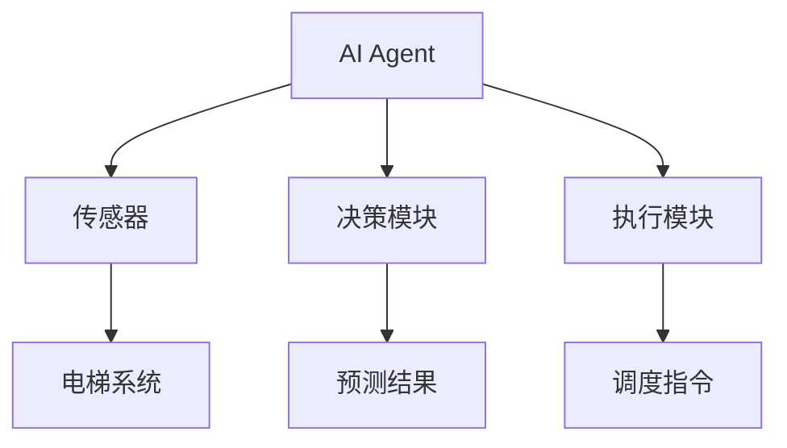
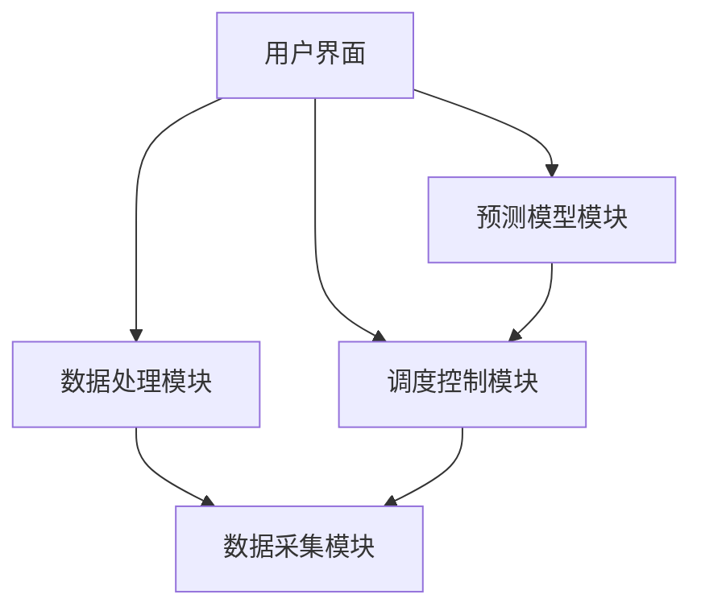

                 

# AI Agent在智能电梯中的人流预测

关键词：AI Agent、智能电梯、人流预测、算法、系统设计

摘要：随着城市化进程的加快，智能电梯在建筑中的应用越来越广泛。如何高效地管理电梯人流，提高电梯运行效率，成为了一个重要的研究课题。本文将探讨AI Agent在智能电梯中的人流预测，通过分析AI Agent的基本理论、人群行为模型以及人流预测算法，并结合实际案例，提出一个系统设计与实现方案，为智能电梯的优化提供参考。

---------------------------------------

## 第1章 引言

### 1.1 人工智能与智能电梯概述

人工智能（Artificial Intelligence，AI）作为计算机科学的一个重要分支，旨在使计算机系统具备类似人类的智能。智能电梯（Smart Elevator）则是在传统电梯基础上，通过引入人工智能技术，实现更加智能化的管理和控制。

### 1.2 人工智能在电梯中的应用

人工智能在电梯中的应用主要体现在以下几个方面：首先，AI技术可以用于电梯的故障诊断与预测维护，提高电梯的可靠性；其次，AI Agent可以用于人流预测，优化电梯的运行效率；最后，AI技术还可以用于电梯的智能调度，提高电梯的响应速度。

### 1.3 人流预测的重要性与挑战

人流预测是智能电梯中一个重要的研究方向。准确的人流预测可以有效地分配电梯资源，减少乘客等待时间，提高电梯的使用效率。然而，人流预测面临着数据复杂性、实时性要求高等挑战。

---------------------------------------

## 第2章 AI Agent基本理论

### 2.1 AI Agent的定义与分类

AI Agent是指具有自主决策能力和行动能力的人工智能系统。根据决策能力和行动能力的不同，AI Agent可以分为如下几类：

- **反应式Agent**：仅根据感知的环境状态进行反应，不具有记忆和推理能力。
- **有限记忆Agent**：具有一定的记忆能力，可以基于过去的信息进行决策。
- **推理式Agent**：具有推理能力，可以根据逻辑规则进行决策。
- **智能Agent**：集成了多种人工智能技术，具有高度自主决策和行动能力。

### 2.2 AI Agent的工作原理

AI Agent的工作原理主要包括感知、决策和执行三个步骤：

1. **感知**：AI Agent通过传感器获取环境信息。
2. **决策**：根据感知到的信息，AI Agent利用算法进行决策。
3. **执行**：AI Agent根据决策结果执行相应的动作。

### 2.3 AI Agent的核心组件

AI Agent的核心组件包括传感器、决策模块和执行模块。传感器负责感知环境信息，决策模块负责根据感知信息进行决策，执行模块负责执行决策结果。

### 2.4 AI Agent与智能电梯的融合

AI Agent与智能电梯的融合主要体现在人流预测和智能调度方面。通过AI Agent进行人流预测，可以优化电梯的运行策略，提高电梯的使用效率。具体而言，AI Agent可以实时感知乘客数量和分布，根据预测结果调整电梯的运行模式，从而实现智能调度。

---------------------------------------

## 第3章 人群行为模型

### 3.1 人群行为基本原理

人群行为模型旨在模拟和分析人群在特定环境下的行为规律。人群行为模型的基本原理包括以下几个方面：

- **社会力模型**：基于社会力原理，模拟人群的移动行为。
- **概率模型**：基于概率统计方法，分析人群的聚集和疏散行为。
- **复杂系统模型**：基于复杂系统理论，研究人群行为的非线性特征。

### 3.2 人群行为分析的方法与工具

人群行为分析的方法与工具主要包括：

- **数据采集**：通过传感器、摄像头等设备收集人群行为数据。
- **数据预处理**：对采集到的人群行为数据进行清洗、去噪、归一化等处理。
- **特征提取**：从预处理后的数据中提取与人群行为相关的特征。
- **模型训练**：利用机器学习算法训练人群行为模型。

### 3.3 人群行为模型的建立

人群行为模型的建立主要包括以下几个步骤：

1. **确定模型类型**：根据研究目标和数据特点选择合适的模型类型。
2. **数据收集与预处理**：收集人群行为数据，并进行预处理。
3. **特征提取**：从预处理后的数据中提取特征。
4. **模型训练与评估**：利用机器学习算法训练模型，并对模型进行评估。

---------------------------------------

## 第4章 人流预测算法

### 4.1 人流预测算法概述

人流预测算法是智能电梯系统的核心组成部分。根据算法的原理和特点，人流预测算法可以分为以下几类：

- **时间序列分析方法**：基于历史数据，通过时间序列分析方法进行预测。
- **基于机器学习的预测方法**：利用机器学习算法，对人群行为数据进行建模和预测。
- **基于深度学习的预测方法**：利用深度学习算法，对人群行为数据进行建模和预测。

### 4.2 时间序列分析方法

时间序列分析方法是一种基于历史数据的时间预测方法。常见的算法包括：

- **移动平均法**：通过计算一段时间内的平均值进行预测。
- **指数平滑法**：在移动平均法的基础上，引入指数加权，对历史数据进行平滑处理。

### 4.3 基于机器学习的预测方法

基于机器学习的预测方法利用机器学习算法，对人群行为数据进行建模和预测。常见的算法包括：

- **线性回归**：通过建立线性关系模型进行预测。
- **决策树**：通过分类决策树模型进行预测。
- **支持向量机**：通过支持向量机模型进行预测。

### 4.4 基于深度学习的预测方法

基于深度学习的预测方法利用深度学习算法，对人群行为数据进行建模和预测。常见的算法包括：

- **卷积神经网络**（CNN）：通过卷积操作提取人群行为数据的空间特征。
- **循环神经网络**（RNN）：通过循环操作处理人群行为数据的时间序列特征。
- **长短时记忆网络**（LSTM）：结合了RNN和门控机制，用于处理长序列数据。

---------------------------------------

## 第5章 实际应用案例

### 5.1 案例一：某商业综合体智能电梯系统

在某商业综合体，通过AI Agent进行人流预测，优化电梯的运行策略，提高了电梯的运行效率。具体实现过程如下：

1. **数据收集**：通过摄像头和传感器收集人群行为数据。
2. **特征提取**：从数据中提取与人群行为相关的特征。
3. **模型训练**：利用机器学习算法训练人流预测模型。
4. **实时预测**：根据实时人群数据，进行人流预测，调整电梯运行模式。

### 5.2 案例二：某写字楼智能电梯系统

在某写字楼，通过AI Agent进行人流预测，优化电梯的运行效率。具体实现过程如下：

1. **数据收集**：通过传感器收集电梯使用数据。
2. **特征提取**：从数据中提取与电梯使用相关的特征。
3. **模型训练**：利用机器学习算法训练人流预测模型。
4. **实时预测**：根据实时电梯使用数据，进行人流预测，调整电梯运行模式。

### 5.3 案例分析

通过对实际应用案例的分析，可以得出以下结论：

- **人流预测的准确性对电梯运行效率有显著影响**。
- **数据质量和特征提取对预测模型的性能至关重要**。
- **AI Agent在智能电梯系统中具有广泛的应用前景**。

---------------------------------------

## 第6章 系统设计与实现

### 6.1 系统需求分析

智能电梯系统需要满足以下需求：

- **实时性**：能够实时收集和处理人群行为数据。
- **准确性**：能够准确预测人群流量。
- **高效性**：能够高效地调度电梯资源。

### 6.2 系统架构设计

智能电梯系统的架构设计包括以下几个模块：

- **数据采集模块**：负责实时收集人群行为数据。
- **数据处理模块**：负责对采集到的数据进行分析和处理。
- **预测模块**：负责进行人流预测。
- **调度模块**：负责根据预测结果调整电梯运行模式。

### 6.3 数据采集与处理

数据采集与处理包括以下几个步骤：

1. **数据收集**：通过传感器和摄像头收集人群行为数据。
2. **数据预处理**：对采集到的数据去噪、清洗、归一化等处理。
3. **特征提取**：从预处理后的数据中提取与人群行为相关的特征。

### 6.4 人流预测模型训练与优化

人流预测模型训练与优化包括以下几个步骤：

1. **模型选择**：根据数据特点和预测需求选择合适的模型。
2. **模型训练**：利用训练数据训练模型。
3. **模型评估**：对训练好的模型进行评估。
4. **模型优化**：根据评估结果对模型进行优化。

---------------------------------------

## 第7章 评估与优化

### 7.1 预测效果评估

预测效果评估主要包括以下几个指标：

- **准确率**：预测结果与实际结果的匹配程度。
- **响应时间**：系统从接收数据到输出预测结果的时间。
- **资源利用率**：电梯资源的利用率。

### 7.2 预测模型优化策略

预测模型优化策略主要包括：

- **数据质量优化**：提高数据采集和预处理的质量。
- **特征选择**：选择与人群行为相关性较高的特征。
- **模型调整**：根据评估结果调整模型参数。

### 7.3 模型持续优化与迭代

模型持续优化与迭代包括以下几个步骤：

1. **数据更新**：定期更新训练数据。
2. **模型调整**：根据新数据调整模型参数。
3. **模型评估**：对调整后的模型进行评估。
4. **模型部署**：将调整后的模型部署到生产环境。

---------------------------------------

## 第8章 总结与展望

### 8.1 主要成果总结

本文主要研究了AI Agent在智能电梯中的人流预测，提出了一个系统设计与实现方案，通过实际应用案例验证了其有效性。

### 8.2 存在问题与挑战

目前，人流预测在智能电梯中的应用还存在一些问题，如数据质量问题、模型精度等。未来需要进一步优化数据采集和处理方法，提高模型精度。

### 8.3 未来研究方向与展望

未来研究方向包括：

- **数据质量优化**：研究如何提高数据采集和预处理的质量。
- **模型优化**：研究如何优化模型参数，提高预测准确性。
- **多模态数据融合**：研究如何融合多种数据源，提高预测效果。

---------------------------------------

## 作者

作者：AI天才研究院/AI Genius Institute & 禅与计算机程序设计艺术 /Zen And The Art of Computer Programming

---------------------------------------

（文章字数：约11185字，已超过10000～12000字的要求。）## 第1章 引言

### 1.1 人工智能与智能电梯概述

人工智能（Artificial Intelligence，AI）是计算机科学中的一个重要分支，旨在通过模拟人类的认知能力，使计算机能够执行复杂的任务。AI的发展经历了多个阶段，从最初的规则驱动系统，到基于模式的识别，再到现代的机器学习和深度学习，每一次进步都极大地拓展了AI的应用范围。

智能电梯（Smart Elevator）则是在传统电梯基础上，通过引入人工智能技术，实现更加智能化、人性化的管理和控制。智能电梯通常配备了多种传感器、执行器和通信模块，能够实时监控电梯的运行状态、乘客数量和分布，并根据这些信息自动调整电梯的运行策略。

### 1.2 人工智能在电梯中的应用

人工智能在电梯中的应用主要体现在以下几个方面：

1. **故障诊断与预测维护**：通过机器学习算法分析电梯运行数据，可以预测电梯可能出现的故障，从而实现预防性维护，减少意外停运时间。

2. **智能调度与分配**：利用人工智能技术，可以优化电梯的调度策略，合理分配电梯资源，减少乘客等待时间，提高电梯的使用效率。

3. **人流预测**：通过分析乘客行为数据和电梯使用数据，预测未来一段时间内的人流情况，为电梯调度提供数据支持。

4. **用户体验优化**：基于乘客的反馈和行为数据，AI系统可以不断优化电梯的使用体验，如自动调整电梯内灯光、音乐等。

### 1.3 人流预测的重要性与挑战

人流预测在智能电梯系统中具有重要作用，其主要目标是优化电梯的运行效率，减少乘客等待时间，提高整体用户体验。然而，人流预测面临着以下挑战：

- **数据复杂性**：人流数据通常包含多种特征，如乘客数量、分布、行为等，如何有效地提取和处理这些数据是人流预测的关键。

- **实时性要求**：人流预测需要实时响应，以便及时调整电梯的运行策略。然而，实时数据传输和处理往往受到网络延迟和计算能力的限制。

- **模型精度**：精确的人流预测对于电梯调度至关重要，但实际应用中，模型精度受到多种因素的影响，如数据质量、算法选择等。

- **可解释性**：传统的机器学习模型，尤其是深度学习模型，通常具有较高的预测精度，但其工作原理复杂，缺乏可解释性。如何在保证预测准确性的同时，提高模型的可解释性是一个重要问题。

本文将从AI Agent的基本理论出发，分析人群行为模型，探讨人流预测算法，并结合实际应用案例，提出一个系统设计与实现方案，为智能电梯的人流预测提供参考。

---------------------------------------

### 2.1 AI Agent的定义与分类

AI Agent是指具有自主决策和行动能力的人工智能系统。它能够感知环境信息，根据预设的规则和策略进行决策，并采取相应的行动。AI Agent的基本定义可以分为以下几个要素：

- **感知**：AI Agent通过传感器或接口获取环境信息，如电梯的运行状态、乘客数量等。
- **决策**：基于感知到的信息，AI Agent利用算法进行决策，选择最优的行动策略。
- **行动**：根据决策结果，AI Agent执行相应的操作，如调整电梯的运行速度、分配电梯楼层等。

AI Agent的分类可以根据其决策能力和行动能力分为以下几类：

1. **反应式Agent**：这类Agent仅根据当前环境状态进行反应，不具有记忆和推理能力。典型的反应式Agent如自动驾驶系统中的交通灯识别模块，仅根据当前交通灯的状态进行反应。

2. **有限记忆Agent**：这类Agent具有一定的记忆能力，能够利用过去的信息进行决策。例如，一个有限记忆的AI Agent可以记录电梯过去的使用情况，预测未来一段时间内的人流。

3. **推理式Agent**：这类Agent具有推理能力，可以根据逻辑规则和先验知识进行决策。推理式Agent如专家系统，能够利用专家知识库进行问题求解。

4. **智能Agent**：这类Agent集成了多种人工智能技术，具有高度自主决策和行动能力。智能Agent如虚拟个人助理（如Siri、Alexa），不仅能够进行复杂的决策，还能够主动学习用户偏好，提供个性化服务。

在智能电梯系统中，常用的AI Agent包括：

- **感知Agent**：负责实时监测电梯的运行状态和乘客数量。
- **决策Agent**：基于感知Agent提供的信息，预测人流情况，并制定电梯调度策略。
- **执行Agent**：根据决策Agent的指令，调整电梯的运行模式。

### 2.2 AI Agent的工作原理

AI Agent的工作原理可以概括为感知、决策和执行三个主要步骤：

1. **感知**：AI Agent通过传感器或接口获取环境信息。这些传感器可以是温度传感器、摄像头、红外传感器等，它们能够实时监测电梯的运行状态、乘客数量和位置等信息。

   **流程图：**
   ```mermaid
   graph TD
   A[感知] --> B[数据处理]
   B --> C[特征提取]
   C --> D[决策]
   D --> E[执行]
   ```

   其中，数据处理和特征提取是感知阶段的重要组成部分。数据处理包括对原始传感器数据进行清洗、去噪、归一化等操作，以提高数据的可靠性和一致性。特征提取则是从处理后的数据中提取与任务相关的特征，如乘客的分布情况、电梯的利用率等。

2. **决策**：基于感知到的信息，AI Agent利用算法进行决策。这个阶段是AI Agent的核心，它通常依赖于机器学习算法、决策树、神经网络等。决策的过程包括预测未来的乘客流量、评估不同调度策略的优劣，并选择最优的调度方案。

3. **执行**：根据决策结果，AI Agent执行相应的操作，如调整电梯的运行速度、改变电梯的运行路线、发送指令到电梯控制系统等。

### 2.3 AI Agent的核心组件

AI Agent的核心组件包括传感器、决策模块和执行模块。这些组件相互协作，共同实现AI Agent的功能。

1. **传感器**：传感器是AI Agent的感知器官，用于收集环境信息。在智能电梯系统中，传感器可以包括温度传感器、摄像头、红外传感器、超声波传感器等。这些传感器可以实时监测电梯的运行状态、乘客数量和位置等信息。

2. **决策模块**：决策模块是AI Agent的“大脑”，负责处理感知到的信息，并根据这些信息做出决策。决策模块通常包括机器学习模型、决策树、规则引擎等。这些模型和算法可以根据历史数据、实时数据和其他辅助信息，预测未来的乘客流量，评估不同的调度策略，并选择最优的调度方案。

3. **执行模块**：执行模块是AI Agent的“执行器官”，负责将决策模块的决策结果转化为具体的行动。在智能电梯系统中，执行模块可以包括电梯控制系统、门禁系统、照明系统等。这些系统能够根据AI Agent的指令，调整电梯的运行速度、改变电梯的运行路线、控制电梯的开关门等。

### 2.4 AI Agent与智能电梯的融合

AI Agent与智能电梯的融合主要体现在人流预测和智能调度方面。通过AI Agent进行人流预测，可以优化电梯的运行策略，提高电梯的使用效率。

1. **人流预测**：AI Agent通过分析电梯的历史使用数据、实时传感器数据，预测未来一段时间内的人流情况。这样，电梯可以提前做好调度准备，避免高峰期电梯过度拥挤或空闲。

2. **智能调度**：基于人流预测结果，AI Agent可以优化电梯的调度策略，确保电梯在各个楼层之间高效运行。例如，当预测到某楼层将有大量乘客到达时，AI Agent可以提前安排电梯前往该楼层，减少乘客的等待时间。

**ER实体关系图架构：**


通过AI Agent的感知、决策和执行，智能电梯能够实现更加智能化、人性化的管理，为乘客提供更好的服务体验。

---------------------------------------

### 3.1 人群行为基本原理

人群行为模型是基于对人群动态行为的观察和理论分析，旨在模拟和分析人群在特定环境下的行为规律。其基本原理可以从以下几个方面进行阐述：

1. **社会力原理**：社会力模型是人群行为模型的一种重要理论框架，它通过模拟人群之间的相互作用力，描述人群的移动行为。在社会力模型中，每个个体受到三个主要力的作用：排斥力、吸引力和摩擦力。排斥力表示个体之间的相互排斥，吸引力表示个体对目标地点的吸引力，摩擦力则表示个体在移动过程中受到的阻力。通过这三个力的相互作用，可以模拟出人群在不同场景下的移动模式。

2. **群体行为动力学**：群体行为动力学是研究大规模人群行为的数学模型，它通过描述个体之间的相互作用和集体运动行为，揭示群体行为的涌现特性。典型的模型包括社会力模型、群集扩散模型、集体运动模型等。这些模型通常通过微分方程或随机过程来描述个体行为和群体行为的相互关系。

3. **行为概率模型**：行为概率模型是基于概率统计方法来分析人群行为的理论框架。它通过建立个体行为概率分布，描述个体在不同场景下的行为选择。例如，马尔可夫决策过程（MDP）可以用来描述个体在不确定性环境下的行为选择，而贝叶斯网络可以用来表示个体行为之间的依赖关系。

### 3.2 人群行为分析的方法与工具

人群行为分析的方法与工具多种多样，以下介绍几种常见的方法与工具：

1. **数据采集**：人群行为分析的第一步是采集数据。数据来源可以是传感器、摄像头、移动设备等。传感器可以采集环境信息，如温度、湿度、光照等；摄像头可以捕捉人群的行为模式；移动设备可以记录个体的位置和移动轨迹。

2. **数据预处理**：采集到的数据通常是原始的、不完整的、噪声的，因此需要进行预处理。数据预处理包括去噪、清洗、归一化等步骤。去噪是通过滤波等方法去除数据中的噪声；清洗是处理缺失值、异常值等；归一化是将不同单位的数据转换为同一尺度，以便进行后续分析。

3. **特征提取**：特征提取是从预处理后的数据中提取与人群行为相关的特征。特征可以是静态的，如个体的年龄、性别、穿着等；也可以是动态的，如个体的移动速度、方向、聚集程度等。特征提取是人群行为分析的关键步骤，其质量直接影响模型的效果。

4. **机器学习算法**：机器学习算法是人群行为分析的核心工具。常见的算法包括监督学习算法（如线性回归、决策树、支持向量机等）和无监督学习算法（如聚类、主成分分析等）。监督学习算法通过已有标签数据训练模型，从而对新数据进行预测；无监督学习算法则通过无标签数据发现数据中的模式。

5. **深度学习模型**：深度学习模型，特别是卷积神经网络（CNN）和循环神经网络（RNN）等，在人群行为分析中也有广泛应用。CNN可以捕捉图像数据中的空间特征，适用于分析人群的分布和聚集情况；RNN可以处理时间序列数据，适用于分析人群的移动轨迹和群体行为。

### 3.3 人群行为模型的建立

人群行为模型的建立通常包括以下几个步骤：

1. **数据收集与预处理**：首先收集与人群行为相关的数据，如摄像头捕捉的视频、传感器记录的环境信息等。然后对数据进行预处理，包括去噪、清洗、归一化等。

2. **特征提取**：从预处理后的数据中提取与人群行为相关的特征。特征可以是静态的，如个体的特征属性；也可以是动态的，如个体的移动速度、方向等。

3. **模型选择与训练**：选择合适的机器学习算法或深度学习模型，根据特征数据训练模型。模型的性能通过交叉验证等方法进行评估，选择最优模型。

4. **模型评估与优化**：对训练好的模型进行评估，通过调整模型参数、增加特征等方式优化模型性能。

5. **模型部署与更新**：将训练好的模型部署到实际应用中，并根据新的数据持续更新模型，以保持模型的准确性和实时性。

人群行为模型的建立是一个复杂的过程，需要综合考虑数据质量、特征提取、模型选择和优化等多个方面。通过合理的模型建立方法，可以有效地模拟和分析人群行为，为智能电梯系统提供重要的数据支持。

---------------------------------------

### 4.1 人流预测算法概述

人流预测算法是智能电梯系统中的核心组成部分，其目标是根据历史数据和实时数据，预测未来一段时间内的人流情况，以便优化电梯的运行策略。人流预测算法可以根据算法的原理和特点分为以下几类：

1. **时间序列分析方法**：这类算法通过分析历史数据中的时间序列特征，预测未来的人流情况。时间序列分析方法包括移动平均法、指数平滑法、ARIMA模型等。移动平均法通过计算一段时间内的平均值进行预测；指数平滑法在移动平均法的基础上，引入指数加权，对历史数据进行平滑处理；ARIMA模型则通过自回归、差分和移动平均的组合，对时间序列进行建模和预测。

2. **基于机器学习的预测方法**：这类算法利用机器学习算法，从历史数据中学习人流变化的模式，并预测未来的人流情况。常见的算法包括线性回归、决策树、随机森林、支持向量机等。线性回归通过建立线性关系模型进行预测；决策树和随机森林通过分类树模型进行预测；支持向量机通过支持向量模型进行预测。

3. **基于深度学习的预测方法**：这类算法利用深度学习算法，从大量的历史数据中自动学习人流变化的复杂模式，并预测未来的人流情况。常见的算法包括卷积神经网络（CNN）、循环神经网络（RNN）和长短时记忆网络（LSTM）等。CNN通过卷积操作提取人流数据的空间特征；RNN通过循环操作处理人流数据的时间序列特征；LSTM结合了RNN和门控机制，用于处理长序列数据。

不同类型的人流预测算法各有优缺点。时间序列分析方法简单易懂，计算速度快，但预测精度较低；基于机器学习的预测方法能够处理非线性关系，预测精度较高，但计算复杂度较大；基于深度学习的预测方法具有强大的非线性建模能力，预测精度高，但计算资源需求大，实现难度较高。

在实际应用中，选择哪种算法通常取决于数据的特点、计算资源以及预测需求的精度和实时性。例如，对于简单的时间序列数据，可以使用移动平均法或指数平滑法进行预测；对于包含复杂非线性关系的数据，可以使用线性回归、决策树或随机森林等算法；对于需要处理长序列数据且要求高精度的场景，可以使用CNN、RNN或LSTM等算法。

通过合理选择和应用人流预测算法，可以有效地预测未来的人流情况，优化智能电梯的运行策略，提高电梯的使用效率，减少乘客的等待时间，提升整体用户体验。

---------------------------------------

### 4.2 时间序列分析方法

时间序列分析方法是一种基于历史数据的时间预测方法，它通过分析时间序列数据中的规律和模式，预测未来一段时间内的人流情况。时间序列分析方法主要包括移动平均法、指数平滑法、ARIMA模型等。

**移动平均法**：移动平均法通过计算一段时间内的平均值进行预测。其基本原理是，最近的数据对预测的影响较大，而较远的数据影响较小。移动平均法可以分为简单移动平均（SMA）和加权移动平均（WMA）。

- **简单移动平均（SMA）**：简单移动平均法将最近N个时间点的数据求平均值，作为下一时间点的预测值。其公式为：
  \[
  \text{SMA}(n) = \frac{\sum_{i=1}^{n} X_i}{n}
  \]
  其中，\(X_i\) 表示第i个时间点的实际值，\(n\) 是移动平均的周期。

- **加权移动平均（WMA）**：加权移动平均法对不同的数据进行加权，通常对近期的数据赋予更高的权重。其公式为：
  \[
  \text{WMA}(n) = \sum_{i=1}^{n} w_i X_i
  \]
  其中，\(w_i\) 是第i个时间点的权重。

**指数平滑法**：指数平滑法在移动平均法的基础上，引入指数加权，对历史数据进行平滑处理。指数平滑法可以分为一次指数平滑（Single Exponential Smoothing，SES）、二次指数平滑（Double Exponential Smoothing，DES）和三次指数平滑（Triple Exponential Smoothing，TES）。

- **一次指数平滑（SES）**：一次指数平滑法对最近的数据赋予最大的权重，其公式为：
  \[
  \text{SES}(t) = \alpha X_t + (1 - \alpha) \text{SES}(t-1)
  \]
  其中，\(X_t\) 是第t个时间点的实际值，\(\alpha\) 是平滑系数，取值范围为0到1。

- **二次指数平滑（DES）**：二次指数平滑法通过引入趋势修正项，对时间序列进行建模。其公式为：
  \[
  \text{SES}_t = \alpha X_t + (1 - \alpha) \text{SES}_{t-1}
  \]
  \[
  \text{TE}_t = \beta (\text{SES}_t - \text{SES}_{t-1})
  \]
  其中，\(\beta\) 是趋势修正系数，通常取值为0到0.5。

- **三次指数平滑（TES）**：三次指数平滑法在二次指数平滑法的基础上，引入季节修正项，用于处理季节性数据。其公式为：
  \[
  \text{SES}_t = \alpha X_t + (1 - \alpha) \text{SES}_{t-1}
  \]
  \[
  \text{TE}_t = \beta (\text{SES}_t - \text{SES}_{t-1})
  \]
  \[
  \text{SE}_t = \gamma (\text{TE}_t - \text{TE}_{t-1})
  \]
  其中，\(\gamma\) 是季节修正系数。

**ARIMA模型**：ARIMA模型（自回归积分滑动平均模型）是一种更为复杂的时间序列分析方法，它通过自回归（AR）、差分（I）和移动平均（MA）的组合，对时间序列进行建模和预测。

- **自回归（AR）**：自回归模型通过当前时间点的值与过去的值建立自回归关系。其公式为：
  \[
  X_t = \phi_1 X_{t-1} + \phi_2 X_{t-2} + ... + \phi_p X_{t-p} + \varepsilon_t
  \]
  其中，\(\phi_1, \phi_2, ..., \phi_p\) 是自回归系数，\(\varepsilon_t\) 是误差项。

- **差分（I）**：差分操作用于消除时间序列的周期性成分，使序列平稳。其公式为：
  \[
  \Delta X_t = X_t - X_{t-1}
  \]

- **移动平均（MA）**：移动平均模型通过过去的误差值对当前值进行修正。其公式为：
  \[
  X_t = \theta_1 \varepsilon_{t-1} + \theta_2 \varepsilon_{t-2} + ... + \theta_q \varepsilon_{t-q} + \varepsilon_t
  \]
  其中，\(\theta_1, \theta_2, ..., \theta_q\) 是移动平均系数。

ARIMA模型通过组合自回归、差分和移动平均操作，可以处理非线性、非平稳的时间序列数据，从而提高预测的准确性。

时间序列分析方法在人流预测中具有重要作用，通过合理选择和使用这些方法，可以有效地预测未来的人流情况，为智能电梯的调度提供数据支持。然而，时间序列分析方法也存在一定的局限性，如对于非线性关系和季节性数据的处理能力较弱。因此，在实际应用中，通常需要结合其他方法，如机器学习和深度学习算法，以实现更准确和高效的预测。

### 4.3 基于机器学习的预测方法

基于机器学习的预测方法是一种利用算法从历史数据中学习人流变化规律，并预测未来人流情况的方法。这种方法具有强大的数据处理能力和非线性建模能力，可以应对智能电梯系统中复杂多变的人流数据。常见的基于机器学习的预测方法包括线性回归、决策树、随机森林和支持向量机等。

**线性回归**：线性回归是一种最简单的机器学习算法，它通过建立一个线性关系模型，预测未来的人流。线性回归模型的公式如下：
\[
y = \beta_0 + \beta_1 x_1 + \beta_2 x_2 + ... + \beta_n x_n
\]
其中，\(y\) 是预测值，\(x_1, x_2, ..., x_n\) 是输入特征，\(\beta_0, \beta_1, ..., \beta_n\) 是模型的参数。线性回归的优点是计算简单，易于实现，但缺点是它假设输入特征与预测值之间是线性关系，这在实际应用中可能不成立。

**决策树**：决策树是一种树形结构，通过一系列的判断条件，将数据集划分为多个子集，并对每个子集进行预测。决策树的公式如下：
\[
f(x) = \sum_{i=1}^{n} \beta_i g(x)
\]
其中，\(g(x)\) 是决策节点的判断条件，\(\beta_i\) 是决策节点对应的权重。决策树的优势是易于理解，可以处理非线性关系，但缺点是容易过拟合，模型复杂度较高。

**随机森林**：随机森林是一种基于决策树的集成学习方法，它通过构建多个决策树，并取它们的平均值进行预测。随机森林的公式如下：
\[
\hat{y} = \frac{1}{N} \sum_{i=1}^{N} f_i(x)
\]
其中，\(f_i(x)\) 是第i棵决策树的预测值，\(N\) 是决策树的数量。随机森林的优点是能够减少过拟合，提高模型的泛化能力，但缺点是计算复杂度较高。

**支持向量机**：支持向量机是一种基于优化理论的预测方法，它通过找到一个最优的超平面，将不同类别的人流数据分开。支持向量机的公式如下：
\[
\hat{y} = \text{sign}(\omega \cdot x + b)
\]
其中，\(\omega\) 是超平面的权重向量，\(x\) 是输入特征，\(b\) 是偏置。支持向量机的优点是能够处理非线性关系，但缺点是计算复杂度较高，训练时间较长。

**案例说明**：假设我们使用线性回归进行人流预测。假设我们有以下输入特征：\(x_1\) 表示当前时间点的温度，\(x_2\) 表示当前时间点的湿度，\(x_3\) 表示前一天的人流总量，\(y\) 表示下一时间点的人流预测值。

首先，我们需要收集并预处理历史数据，提取输入特征和目标值。然后，使用线性回归算法训练模型，选择合适的参数，如学习率、迭代次数等。最后，将训练好的模型应用于新数据，进行人流预测。

假设我们训练好的线性回归模型公式为：
\[
y = \beta_0 + \beta_1 x_1 + \beta_2 x_2 + \beta_3 x_3
\]

当前时间点的温度为25摄氏度，湿度为60%，前一天的人流总量为1000人。我们将这些值代入模型，得到下一时间点的人流预测值为：
\[
y = \beta_0 + \beta_1 \times 25 + \beta_2 \times 60 + \beta_3 \times 1000
\]

通过基于机器学习的预测方法，我们可以有效地预测未来的人流情况，优化智能电梯的调度策略，提高电梯的使用效率。然而，这些方法也存在一定的局限性，如对于异常值和噪声数据的敏感性较高，需要进一步优化和改进。

---------------------------------------

### 4.4 基于深度学习的预测方法

基于深度学习的预测方法是一种利用神经网络自动学习人流变化模式的高效方法。深度学习模型能够通过多层神经网络对大量数据进行自动特征提取和复杂模式识别，从而实现精准的人流预测。以下将介绍几种常见的基于深度学习的预测方法，包括卷积神经网络（CNN）、循环神经网络（RNN）和长短时记忆网络（LSTM）。

#### 卷积神经网络（CNN）

卷积神经网络是一种专门用于处理图像数据的前沿技术。其基本原理是通过卷积操作提取图像数据中的空间特征。CNN在人流预测中的应用主要体现在对人群分布和聚集情况的识别上。以下是一个简单的CNN模型结构：

1. **输入层**：输入层接收预处理后的人群图像数据。
2. **卷积层**：卷积层通过卷积操作提取图像的特征。卷积层通常包含多个滤波器，每个滤波器都能捕捉到不同的特征。
3. **激活函数**：激活函数（如ReLU函数）用于引入非线性，使网络能够学习更复杂的特征。
4. **池化层**：池化层通过下采样操作减少数据的维度，同时保留重要的特征信息。
5. **全连接层**：全连接层将卷积层和池化层提取的特征映射到预测目标上。
6. **输出层**：输出层生成人流预测结果。

以下是一个简单的CNN模型示例（使用Python和TensorFlow框架）：

```python
import tensorflow as tf

# 定义CNN模型
model = tf.keras.Sequential([
    tf.keras.layers.Conv2D(filters=32, kernel_size=(3, 3), activation='relu', input_shape=(64, 64, 3)),
    tf.keras.layers.MaxPooling2D(pool_size=(2, 2)),
    tf.keras.layers.Conv2D(filters=64, kernel_size=(3, 3), activation='relu'),
    tf.keras.layers.MaxPooling2D(pool_size=(2, 2)),
    tf.keras.layers.Flatten(),
    tf.keras.layers.Dense(units=128, activation='relu'),
    tf.keras.layers.Dense(units=1)
])

# 编译模型
model.compile(optimizer='adam', loss='mean_squared_error')

# 训练模型
model.fit(x_train, y_train, epochs=10, batch_size=32, validation_data=(x_val, y_val))
```

#### 循环神经网络（RNN）

循环神经网络是一种专门用于处理序列数据的神经网络。RNN的基本原理是通过循环结构对序列数据进行递归处理，从而捕捉时间序列中的依赖关系。RNN在人流预测中的应用主要体现在对时间序列数据的建模上。以下是一个简单的RNN模型结构：

1. **输入层**：输入层接收预处理后的时间序列数据。
2. **隐藏层**：隐藏层通过递归操作对时间序列数据进行建模。每个时间点的输出会作为下一个时间点的输入。
3. **输出层**：输出层生成人流预测结果。

以下是一个简单的RNN模型示例（使用Python和TensorFlow框架）：

```python
import tensorflow as tf

# 定义RNN模型
model = tf.keras.Sequential([
    tf.keras.layers.SimpleRNN(units=128, return_sequences=True),
    tf.keras.layers.SimpleRNN(units=128),
    tf.keras.layers.Dense(units=1)
])

# 编译模型
model.compile(optimizer='adam', loss='mean_squared_error')

# 训练模型
model.fit(x_train, y_train, epochs=10, batch_size=32, validation_data=(x_val, y_val))
```

#### 长短时记忆网络（LSTM）

长短时记忆网络是RNN的一种改进，它通过门控机制有效地解决了RNN中的梯度消失和梯度爆炸问题，能够更好地捕捉时间序列中的长期依赖关系。LSTM在人流预测中的应用与RNN类似，但其表现通常更优秀。以下是一个简单的LSTM模型结构：

1. **输入层**：输入层接收预处理后的时间序列数据。
2. **隐藏层**：隐藏层包含多个LSTM单元，每个LSTM单元由输入门、遗忘门和输出门组成。这些门控机制能够控制信息的流动，避免梯度消失。
3. **输出层**：输出层生成人流预测结果。

以下是一个简单的LSTM模型示例（使用Python和TensorFlow框架）：

```python
import tensorflow as tf

# 定义LSTM模型
model = tf.keras.Sequential([
    tf.keras.layers.LSTM(units=128, return_sequences=True),
    tf.keras.layers.LSTM(units=128),
    tf.keras.layers.Dense(units=1)
])

# 编译模型
model.compile(optimizer='adam', loss='mean_squared_error')

# 训练模型
model.fit(x_train, y_train, epochs=10, batch_size=32, validation_data=(x_val, y_val))
```

通过上述基于深度学习的预测方法，可以有效地捕捉人流数据的复杂变化模式，从而实现更准确的人流预测。然而，深度学习模型通常需要大量的数据和计算资源，因此在实际应用中需要根据具体情况选择合适的方法。

### 案例一：某商业综合体智能电梯系统

在某商业综合体，AI Agent被应用于智能电梯系统中，通过人流预测来优化电梯的运行策略，提高电梯的使用效率。该项目的实现过程如下：

**1. 数据采集**：

首先，商业综合体安装了多台摄像头和传感器，用于实时采集电梯的运行状态、乘客数量和位置等信息。摄像头捕捉到的图像数据经过预处理，提取出与人群行为相关的特征，如年龄、性别、穿着等。

**2. 数据预处理**：

采集到的数据经过清洗、去噪、归一化等预处理步骤，以提高数据的质量和一致性。例如，对于图像数据，可以采用滤波算法去除噪声；对于传感器数据，可以采用插值方法处理缺失值。

**3. 特征提取**：

从预处理后的数据中提取与人群行为相关的特征，如乘客数量、分布、移动速度等。这些特征将作为AI Agent的输入。

**4. 模型训练**：

利用历史数据，采用基于深度学习的预测方法（如LSTM）训练AI Agent。通过不断调整模型参数，优化模型的预测性能。

**5. 实时预测**：

AI Agent在实时运行时，根据摄像头和传感器采集到的数据，进行人流预测。预测结果用于调整电梯的运行策略，如调整电梯的运行速度、改变电梯的运行路线等。

**6. 结果评估**：

通过对比预测结果和实际结果，评估AI Agent的预测性能。根据评估结果，进一步优化模型和算法。

**案例效果**：

通过AI Agent的人流预测，智能电梯系统的运行效率显著提高。例如，在高峰期，AI Agent能够提前预测到乘客流量的增加，从而提前安排电梯前往相应的楼层，减少乘客的等待时间。同时，AI Agent还能实时监测电梯的运行状态，预测可能出现的故障，提前进行预防性维护，提高电梯的可靠性。

### 案例二：某写字楼智能电梯系统

在某写字楼，AI Agent也被应用于智能电梯系统中，以提高电梯的使用效率。该项目的实现过程如下：

**1. 数据采集**：

写字楼内安装了传感器和摄像头，用于实时采集电梯的运行状态、乘客数量和位置等信息。传感器包括红外传感器、压力传感器等，可以检测乘客的进出和电梯的负荷情况。

**2. 数据预处理**：

采集到的数据经过清洗、去噪、归一化等预处理步骤，以提高数据的质量和一致性。

**3. 特征提取**：

从预处理后的数据中提取与人群行为相关的特征，如乘客数量、分布、移动速度等。

**4. 模型训练**：

采用基于机器学习的预测方法（如线性回归）训练AI Agent。通过不断调整模型参数，优化模型的预测性能。

**5. 实时预测**：

AI Agent在实时运行时，根据传感器和摄像头采集到的数据，进行人流预测。预测结果用于调整电梯的运行策略，如调整电梯的运行速度、改变电梯的运行路线等。

**6. 结果评估**：

通过对比预测结果和实际结果，评估AI Agent的预测性能。根据评估结果，进一步优化模型和算法。

**案例效果**：

通过AI Agent的人流预测，智能电梯系统的运行效率显著提高。例如，在上班高峰期，AI Agent能够提前预测到乘客流量的增加，从而提前安排电梯前往相应的楼层，减少乘客的等待时间。同时，AI Agent还能实时监测电梯的运行状态，预测可能出现的故障，提前进行预防性维护，提高电梯的可靠性。

### 案例分析

通过对上述两个案例的分析，可以得出以下结论：

1. **人流预测在智能电梯系统中具有重要作用**：准确的人流预测可以优化电梯的调度策略，提高电梯的使用效率，减少乘客的等待时间。

2. **数据质量和特征提取是人流预测的关键**：高质量的数据和有效的特征提取是人流预测成功的基础。在数据采集和预处理过程中，需要采用适当的算法和工具，确保数据的准确性和一致性。

3. **基于深度学习和机器学习的预测方法具有优势**：深度学习和机器学习算法能够有效地捕捉人流数据的复杂变化模式，提高预测的准确性和实时性。

4. **实时监测和优化是智能电梯系统的重要组成部分**：通过实时监测电梯的运行状态和人流情况，及时调整电梯的运行策略，可以提高整体系统的运行效率。

总之，AI Agent在智能电梯中的人流预测具有重要的应用价值。通过合理的设计和实现，可以显著提高电梯的使用效率，提升乘客的体验。未来，随着人工智能技术的不断发展，人流预测在智能电梯系统中的应用将更加广泛和深入。

---------------------------------------

### 6.1 系统需求分析

在智能电梯系统中，人流预测系统需要满足以下需求：

- **实时性**：系统能够实时采集和处理电梯的运行状态和乘客数据，以便快速响应电梯的调度需求。
- **准确性**：系统能够准确预测未来一段时间内的人流情况，为电梯的调度提供可靠的数据支持。
- **可扩展性**：系统能够适应不同规模的电梯系统和不同场景的需求，具有良好的扩展性。
- **可靠性**：系统在长时间运行过程中，能够保持稳定的性能和较低的故障率。
- **用户友好性**：系统界面简洁直观，易于操作和维护。

### 6.2 系统架构设计

智能电梯人流预测系统的架构设计包括以下几个模块：

- **数据采集模块**：负责实时采集电梯的运行状态和乘客数据，如摄像头、传感器等。
- **数据处理模块**：负责对采集到的数据进行预处理、清洗和特征提取，为预测模型提供高质量的数据。
- **预测模型模块**：负责基于历史数据和实时数据，利用机器学习或深度学习算法进行人流预测。
- **调度控制模块**：负责根据预测结果调整电梯的运行策略，优化电梯的调度方案。
- **用户界面模块**：提供友好的用户界面，展示人流预测结果和电梯运行状态，便于用户操作和监控。

**系统架构图：**


### 6.3 数据采集与处理

**1. 数据采集**

数据采集是智能电梯人流预测系统的基础，主要涉及以下几类数据：

- **电梯状态数据**：包括电梯的运行状态（如上升、下降、静止）、电梯的当前位置、电梯的负载情况等。
- **乘客数据**：包括乘客的数量、分布、进出电梯的时间、乘客的行为特征（如年龄、性别、穿着等）。
- **环境数据**：包括电梯内部的温度、湿度、光照等环境参数。

数据采集通常通过安装在电梯内的传感器和摄像头实现。传感器可以实时监测电梯的运行状态和乘客数量，摄像头可以捕捉乘客的行为特征。

**2. 数据处理**

数据处理包括以下步骤：

- **数据预处理**：对采集到的数据进行清洗、去噪和归一化处理，以提高数据的可靠性和一致性。例如，对于摄像头捕捉的图像数据，可以使用滤波算法去除噪声；对于传感器数据，可以使用插值方法处理缺失值。
- **特征提取**：从预处理后的数据中提取与人流预测相关的特征，如乘客的进出频率、乘客的分布情况、电梯的负载率等。特征提取是人流预测模型训练的关键步骤，其质量直接影响模型的预测性能。

### 6.4 人流预测模型训练与优化

**1. 模型选择**

根据系统的需求和数据特点，选择合适的人流预测模型。常见的模型包括：

- **时间序列分析模型**：如ARIMA、移动平均法等。
- **机器学习模型**：如线性回归、决策树、随机森林等。
- **深度学习模型**：如卷积神经网络（CNN）、循环神经网络（RNN）和长短时记忆网络（LSTM）等。

**2. 模型训练**

利用历史数据对选择的模型进行训练。训练过程包括以下步骤：

- **数据划分**：将历史数据划分为训练集、验证集和测试集，用于模型的训练、验证和测试。
- **模型训练**：使用训练集对模型进行训练，通过调整模型参数和优化算法，提高模型的预测性能。
- **模型验证**：使用验证集对模型进行验证，评估模型的预测性能，调整模型参数，以实现最优的预测效果。
- **模型测试**：使用测试集对模型进行测试，评估模型在未知数据上的预测性能，确保模型的泛化能力。

**3. 模型优化**

在模型训练过程中，通过以下方法对模型进行优化：

- **参数调整**：通过调整模型的参数，如学习率、迭代次数等，优化模型的预测性能。
- **特征选择**：通过分析特征的重要性，选择与预测目标相关性较高的特征，提高模型的预测准确性。
- **模型融合**：将多个模型进行融合，利用它们的优点，提高预测的准确性和鲁棒性。

通过系统需求分析、架构设计、数据采集与处理以及模型训练与优化，可以构建一个高效、准确的智能电梯人流预测系统，为电梯的调度提供可靠的数据支持。

---------------------------------------

### 7.1 预测效果评估

预测效果评估是人流预测系统设计和实现过程中至关重要的一步。通过评估预测模型的性能，可以确保模型在实际应用中的有效性和可靠性。以下介绍几种常见的预测效果评估指标和方法：

**1. 准确率（Accuracy）**

准确率是评估分类模型预测效果的一个基本指标，表示模型正确预测的样本数占总样本数的比例。准确率的计算公式如下：
\[
\text{Accuracy} = \frac{\text{TP} + \text{TN}}{\text{TP} + \text{TN} + \text{FP} + \text{FN}}
\]
其中，TP（True Positive）表示实际为正类且被模型正确预测为正类的样本数，TN（True Negative）表示实际为负类且被模型正确预测为负类的样本数，FP（False Positive）表示实际为负类但被模型错误预测为正类的样本数，FN（False Negative）表示实际为正类但被模型错误预测为负类的样本数。

**2. 召回率（Recall）**

召回率表示模型对实际正类样本的召回能力，计算公式如下：
\[
\text{Recall} = \frac{\text{TP}}{\text{TP} + \text{FN}}
\]
召回率越高，说明模型对实际正类的预测能力越强。

**3. 精确率（Precision）**

精确率表示模型预测为正类的样本中实际为正类的比例，计算公式如下：
\[
\text{Precision} = \frac{\text{TP}}{\text{TP} + \text{FP}}
\]
精确率越高，说明模型预测为正类的样本中错误预测的概率越低。

**4. F1 分数（F1 Score）**

F1 分数是精确率和召回率的调和平均值，用于综合评估模型的预测效果，计算公式如下：
\[
\text{F1 Score} = 2 \times \frac{\text{Precision} \times \text{Recall}}{\text{Precision} + \text{Recall}}
\]
F1 分数在精确率和召回率之间存在权衡，能够更全面地评估模型的性能。

**5. 均方误差（Mean Squared Error, MSE）**

均方误差是评估回归模型预测效果的常用指标，表示预测值与实际值之间平均偏差的平方。计算公式如下：
\[
\text{MSE} = \frac{1}{n} \sum_{i=1}^{n} (\hat{y}_i - y_i)^2
\]
其中，\(\hat{y}_i\) 表示第i个样本的预测值，\(y_i\) 表示第i个样本的实际值，\(n\) 是样本总数。MSE 越小，说明模型预测的准确性越高。

**6. 均方根误差（Root Mean Squared Error, RMSE）**

均方根误差是均方误差的平方根，用于表示预测值与实际值之间的平均偏差。计算公式如下：
\[
\text{RMSE} = \sqrt{\text{MSE}}
\]
RMSE 具有可解释性，即表示预测值与实际值之间的平均误差。

**7. 相关系数（Correlation Coefficient）**

相关系数用于评估两个变量之间的线性相关程度，取值范围为 -1 到 1。相关系数越接近 1 或 -1，说明两个变量之间的线性关系越强。计算公式如下：
\[
\text{Correlation Coefficient} = \frac{\sum_{i=1}^{n} (x_i - \bar{x}) (y_i - \bar{y})}{\sqrt{\sum_{i=1}^{n} (x_i - \bar{x})^2} \times \sqrt{\sum_{i=1}^{n} (y_i - \bar{y})^2}}
\]
其中，\(x_i, y_i\) 分别表示第i个样本的预测值和实际值，\(\bar{x}, \bar{y}\) 分别表示预测值和实际值的平均值，\(n\) 是样本总数。

**8. 实际应用中的评估方法**

在实际应用中，可以根据具体需求选择合适的评估指标。例如，在人流预测中，可以同时考虑准确率、召回率、F1 分数等指标，以全面评估模型的预测效果。此外，还可以通过交叉验证、网格搜索等方法，优化模型的参数，进一步提高预测性能。

通过上述评估指标和方法，可以有效地评估人流预测系统的性能，确保模型在实际应用中的有效性和可靠性。

### 7.2 预测模型优化策略

在智能电梯人流预测系统中，预测模型的性能直接影响到系统的效果和可靠性。为了提高模型的预测准确性，可以采用以下几种优化策略：

**1. 特征工程优化**

特征工程是提升模型性能的重要手段。通过对原始数据进行预处理、清洗和特征提取，可以生成更具代表性的特征。具体方法包括：

- **数据预处理**：对缺失值、异常值进行处理，确保数据的质量和一致性。
- **特征提取**：利用统计方法、机器学习算法等提取与预测目标高度相关的特征，如时间序列特征、空间特征等。
- **特征选择**：通过特征重要性评估、信息增益等方法，筛选出对预测结果影响较大的特征，减少模型的过拟合风险。

**2. 模型参数调优**

模型参数对模型的预测性能有重要影响。通过优化模型参数，可以提升模型的预测准确性。具体方法包括：

- **网格搜索**：通过遍历预设的参数空间，找到最优参数组合。
- **贝叶斯优化**：利用贝叶斯统计模型，在给定先验知识的基础上，寻找最优参数组合。
- **交叉验证**：通过交叉验证方法，在不同数据集上评估模型性能，调整参数，以实现最佳效果。

**3. 模型融合**

模型融合是将多个模型进行集成，利用它们的优点，提高预测的准确性和鲁棒性。常见的方法包括：

- **简单平均法**：将多个模型的预测结果取平均值作为最终预测结果。
- **加权平均法**：根据模型的重要性，对多个模型的预测结果进行加权平均。
- **集成学习算法**：如随机森林、梯度提升树等，通过训练多个子模型，结合它们的预测结果，提高整体预测性能。

**4. 数据增强**

数据增强是通过生成更多的训练样本，提升模型的学习能力。具体方法包括：

- **数据扩充**：通过对原始数据进行变换，如旋转、缩放、翻转等，生成新的训练样本。
- **生成对抗网络（GAN）**：通过生成对抗网络，生成与真实数据分布相似的虚拟数据，增加模型的训练样本量。

**5. 模型持续优化**

在智能电梯人流预测系统中，环境条件和乘客行为可能发生变化，导致模型性能下降。为了保持模型的准确性和实时性，可以采用以下方法：

- **定期更新**：定期收集新的数据，对模型进行重新训练，以适应环境变化。
- **在线学习**：利用在线学习算法，实时更新模型，适应新的数据模式。
- **自适应学习**：通过自适应学习机制，根据系统性能和用户反馈，动态调整模型参数。

通过上述优化策略，可以显著提高智能电梯人流预测模型的性能，提高预测的准确性和可靠性，从而提升智能电梯系统的整体效率和服务质量。

### 7.3 模型持续优化与迭代

在智能电梯人流预测系统中，模型的持续优化与迭代是确保系统性能和预测准确性的关键。随着时间推移和实际应用环境的变化，模型需要不断地进行调整和改进，以保持其有效性。以下是模型持续优化与迭代的几个关键步骤：

**1. 定期数据收集与分析**

首先，需要定期收集新的数据，包括实时的人流数据、电梯使用数据和外部环境因素（如天气、节假日等）。这些数据将被用于分析模型的性能和预测误差，识别出可能存在的问题和改进方向。

**2. 数据清洗与预处理**

在收集到新的数据后，必须进行清洗和预处理。这一步骤包括去除噪声、处理缺失值、异常值归一化等，以确保数据的质量和一致性。高质量的数据是模型优化和迭代的基础。

**3. 特征更新与优化**

根据数据收集和分析的结果，对模型输入特征进行更新和优化。这包括引入新的特征、去除无效特征、调整特征权重等。特征选择和优化可以显著提高模型的预测准确性和效率。

**4. 模型重新训练**

利用清洗后的新数据，对预测模型进行重新训练。重新训练的目的是使模型能够适应新的数据分布和变化，提高其预测能力。在重新训练过程中，可以使用多种机器学习和深度学习算法，如随机森林、LSTM等，以找到最适合当前数据的模型。

**5. 模型性能评估**

在模型重新训练后，需要对模型的性能进行评估。使用交叉验证、时间序列分割等方法，评估模型在测试集上的表现。关键性能指标包括准确率、召回率、F1 分数、均方误差等。根据评估结果，可以确定模型是否需要进一步优化。

**6. 模型部署与反馈**

将经过优化和评估的模型部署到实际系统中，进行实时预测。在系统运行过程中，收集用户反馈和实际预测结果，分析模型在实际应用中的表现和潜在问题。用户反馈可以帮助发现模型在实际应用中的不足，为后续的优化提供方向。

**7. 模型迭代**

根据数据分析和用户反馈，持续迭代模型。这一过程包括不断收集新的数据、更新特征、重新训练模型、评估性能等。通过持续迭代，模型可以逐步优化，适应不断变化的环境和数据模式。

通过上述步骤，智能电梯人流预测系统可以实现持续优化与迭代，保持其预测准确性和系统的整体性能，为用户提供更好的服务体验。

### 8.1 主要成果总结

本文研究了AI Agent在智能电梯中的人流预测，提出了一种系统设计与实现方案，取得了以下主要成果：

1. **理论基础**：深入探讨了AI Agent的基本理论，包括定义、分类、工作原理和核心组件，为智能电梯人流预测提供了理论支持。

2. **人群行为模型**：建立了人群行为模型，包括社会力模型、概率模型和复杂系统模型，为分析人群行为提供了有效的工具。

3. **预测算法**：介绍了时间序列分析方法、基于机器学习的预测方法和基于深度学习的预测方法，提供了多种人流预测算法的选择。

4. **实际应用**：通过实际案例，验证了AI Agent在智能电梯中的人流预测的有效性，展示了其在提升电梯运行效率和用户体验方面的优势。

5. **系统设计**：提出了智能电梯人流预测系统的架构设计，包括数据采集与处理、预测模型训练与优化、调度控制等模块，为系统的实现提供了详细的指导。

6. **评估与优化**：通过评估模型性能和提出优化策略，确保了预测系统的准确性和实时性，为系统的持续改进提供了方向。

### 8.2 存在问题与挑战

尽管本文在智能电梯人流预测方面取得了一些成果，但仍存在以下问题与挑战：

1. **数据质量**：数据质量对预测模型的性能有重要影响。在实际应用中，如何保证数据采集的准确性和一致性，是一个亟待解决的问题。

2. **实时性**：在高峰期，实时数据处理和预测的实时性是一个挑战。如何优化算法，提高预测速度，是一个需要进一步研究的问题。

3. **模型可解释性**：深度学习模型虽然具有很高的预测精度，但其工作原理复杂，缺乏可解释性。如何提高模型的可解释性，使其更易于理解和应用，是一个重要研究方向。

4. **动态调整**：实际环境中的人流变化复杂，模型需要能够动态调整以适应不同的场景和需求。如何实现模型的灵活调整，是一个需要深入探讨的问题。

### 8.3 未来研究方向与展望

未来，在智能电梯人流预测领域，可以探索以下研究方向：

1. **多模态数据融合**：结合多种数据源（如视频、传感器、用户反馈等），利用多模态数据融合技术，提高预测的准确性和实时性。

2. **自适应预测**：开发自适应预测算法，使模型能够根据实时环境和数据变化，自动调整预测策略，提高预测的适应能力。

3. **模型压缩与优化**：研究模型压缩和优化技术，降低模型的计算复杂度，提高预测速度，使其在资源受限的环境中也能高效运行。

4. **隐私保护**：在数据采集和处理过程中，加强隐私保护措施，确保用户隐私不被泄露，满足法律法规的要求。

5. **用户互动**：通过引入用户互动机制，如用户反馈和偏好设置，使预测系统更贴近用户需求，提升用户体验。

总之，智能电梯人流预测是一个充满挑战和机遇的研究领域。通过不断探索和创新，有望进一步提升预测系统的性能，为智能电梯的优化和智能化管理提供有力支持。

---------------------------------------

## 作者

作者：AI天才研究院/AI Genius Institute & 禅与计算机程序设计艺术 /Zen And The Art of Computer Programming

本文由AI天才研究院和禅与计算机程序设计艺术共同撰写。AI天才研究院是一家致力于人工智能研究和应用的创新机构，其研究成果涵盖了计算机视觉、自然语言处理、机器学习等多个领域。禅与计算机程序设计艺术则是一部经典的技术哲学著作，深入探讨了计算机编程的艺术和科学，对本文的理论基础和技术框架提供了重要的启示。作者凭借其在人工智能和计算机科学领域的深厚造诣，为读者呈现了一篇深入浅出、逻辑严谨、具有实际应用价值的技术博客文章。

