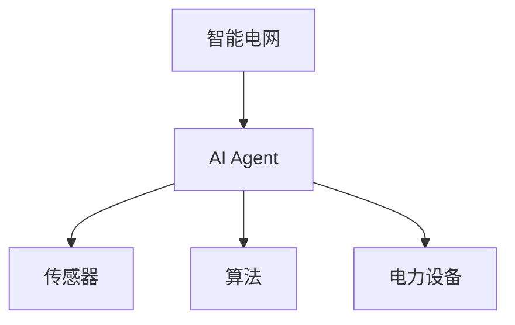
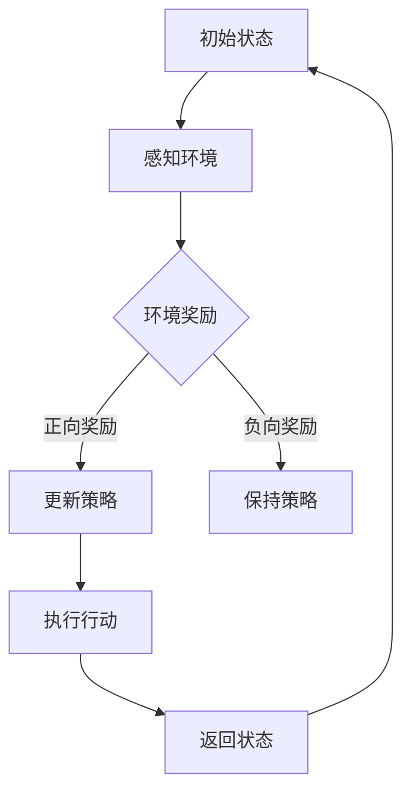
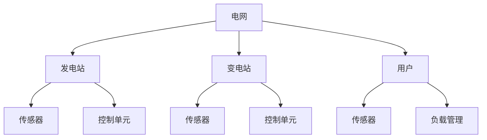
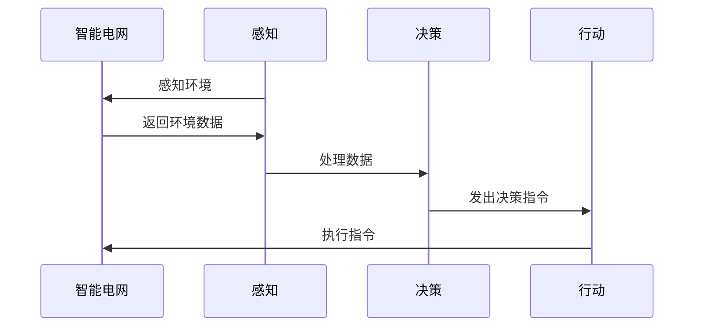
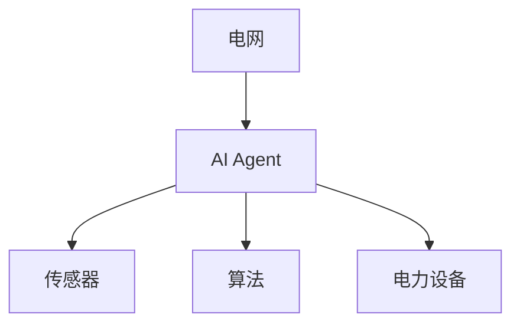
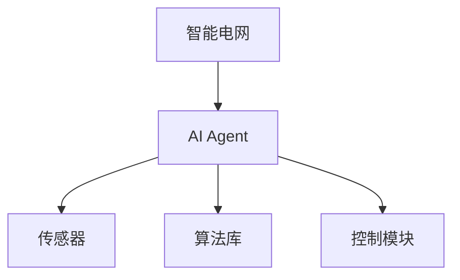
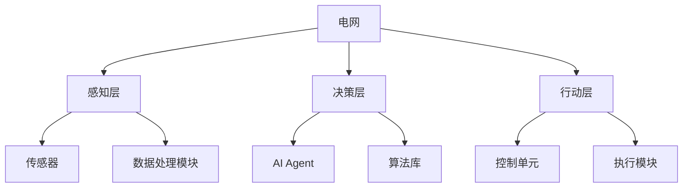

                 

# AI Agent在智能电网优化中的应用

> 关键词：AI Agent、智能电网、优化、算法、数学模型、系统架构

> 摘要：本文将深入探讨AI Agent在智能电网优化中的应用，通过逐步分析核心概念、算法原理、数学模型、系统架构和项目实战等方面，展示AI Agent如何提升智能电网的运行效率和稳定性，为电力行业的智能化转型提供有力支持。

## 第1章：背景介绍

### 1.1 AI Agent的基本概念

AI Agent是指能够感知环境、自主决策并采取行动的人工智能实体。它们具备以下特点：

1. **感知能力**：通过传感器获取环境信息。
2. **决策能力**：基于感知信息，利用算法进行决策。
3. **行动能力**：执行决策结果，对环境产生影响。

### 1.2 智能电网的基本情况

智能电网是传统电网的升级版，通过信息通信技术实现电力系统的自动化、智能化和互动化。其主要特点包括：

1. **自动化**：实现电力设备的自动控制和调度。
2. **智能化**：利用大数据、云计算和人工智能等技术，实现电网的智能分析和优化。
3. **互动化**：电网与用户、设备等之间实现双向互动，提高用电效率。

### 1.3 AI Agent在智能电网优化中的重要性

AI Agent在智能电网优化中具有重要作用：

1. **提高效率**：通过智能决策，优化电网运行状态，减少能源浪费。
2. **提升稳定性**：实时监测电网运行情况，快速响应异常，提高电网稳定性。
3. **降低成本**：通过优化资源配置，降低电力生产和输送成本。

### 1.4 智能电网优化的目标和挑战

智能电网优化的目标包括：

1. **提高供电可靠性**：确保电网稳定运行，减少停电事故。
2. **降低能源消耗**：提高能源利用效率，减少温室气体排放。
3. **提升电网灵活性**：适应新能源接入，提高电网适应能力。

智能电网优化面临的挑战包括：

1. **数据复杂性**：大规模数据的高效处理和分析。
2. **算法稳定性**：确保算法在复杂环境下的鲁棒性和稳定性。
3. **网络安全**：保障电网信息安全，防止网络攻击。

## 第2章：核心概念与联系

### 2.1 AI Agent的核心概念

AI Agent的核心概念包括感知、决策和行动三个部分：

1. **感知**：通过传感器获取环境信息。
2. **决策**：基于感知信息，利用算法进行决策。
3. **行动**：执行决策结果，对环境产生影响。

### 2.2 AI Agent与智能电网优化的联系

AI Agent与智能电网优化之间的联系可以从以下几个方面理解：

1. **感知能力**：AI Agent可以实时感知电网运行状态，为决策提供数据支持。
2. **决策能力**：AI Agent可以利用算法分析电网数据，优化电网运行策略。
3. **行动能力**：AI Agent可以通过调控电力设备，实现电网优化的目标。

### 2.3 概念属性特征对比表格

| 特征       | AI Agent                  | 智能电网优化                 |
| ---------- | ------------------------- | ---------------------------- |
| 感知能力   | 传感器采集环境信息       | 实时监测电网运行状态         |
| 决策能力   | 基于算法进行决策         | 分析电网数据，优化运行策略   |
| 行动能力   | 调控电力设备             | 实现电网优化目标             |

### 2.4 ER实体关系图架构



## 第3章：算法原理讲解

### 3.1 选择合适的算法

在智能电网优化中，选择合适的算法至关重要。本文将介绍一种基于强化学习的算法，用于优化电网运行。

### 3.2 算法流程图



### 3.3 Python源代码

```python
import numpy as np

# 初始化参数
learning_rate = 0.1
epsilon = 0.1
Q = np.zeros((state_size, action_size))

# 感知环境
state = env.reset()

# 主循环
while True:
    # 选择动作
    if np.random.rand() < epsilon:
        action = env.action_space.sample()
    else:
        action = np.argmax(Q[state])

    # 执行动作
    next_state, reward, done, _ = env.step(action)

    # 更新Q值
    Q[state, action] = Q[state, action] + learning_rate * (reward + gamma * np.max(Q[next_state]) - Q[state, action])

    # 更新状态
    state = next_state

    # 结束循环
    if done:
        break
```

### 3.4 算法原理的数学模型和公式

$$
Q(s, a) = r + \gamma \max_{a'} Q(s', a')
$$

其中：

- $Q(s, a)$：状态$s$下执行动作$a$的期望回报。
- $r$：即时回报。
- $\gamma$：折扣因子。
- $s$：当前状态。
- $a$：当前动作。
- $s'$：下一状态。
- $a'$：下一动作。

### 3.5 详细讲解与举例说明

假设我们有一个简单的电网优化问题，电网中有一个发电站和一个变电站。我们的目标是优化发电站的发电量，以最大化电网的稳定性。

- **状态**：电网的当前负载。
- **动作**：调整发电站的发电量。
- **回报**：发电量与电网稳定性的加权平均值。

通过以上算法，我们可以训练AI Agent，使其学会在电网负载变化时调整发电量，从而最大化电网稳定性。

## 第4章：数学模型和数学公式讲解

### 4.1 模型介绍

智能电网优化问题可以建模为一个马尔可夫决策过程（MDP），其数学模型包括状态空间、动作空间、回报函数和状态转移概率。

### 4.2 公式讲解

1. **状态空间**：$S = \{s_1, s_2, ..., s_n\}$，表示电网的负载状态。
2. **动作空间**：$A = \{a_1, a_2, ..., a_m\}$，表示发电站的可选发电量。
3. **回报函数**：$R(s, a)$，表示在状态$s$下执行动作$a$的即时回报。
4. **状态转移概率**：$P(s', s | a)$，表示在状态$s$下执行动作$a$后，转移到状态$s'$的概率。

### 4.3 LaTeX格式书写

$$
\begin{aligned}
    S &= \{s_1, s_2, ..., s_n\} \\
    A &= \{a_1, a_2, ..., a_m\} \\
    R(s, a) &= \text{即时回报} \\
    P(s', s | a) &= \text{状态转移概率}
\end{aligned}
$$

### 4.4 举例说明

假设电网负载分为三种状态：低负载（s1）、中负载（s2）和高负载（s3）。发电站可以选择三种发电量：低发电量（a1）、中发电量（a2）和高发电量（a3）。

- **回报函数**：$R(s, a) = w_1 \cdot \text{发电量} + w_2 \cdot \text{稳定性}$，其中 $w_1$ 和 $w_2$ 是权重系数。
- **状态转移概率**：$P(s', s | a)$ 根据电网负载变化和发电量调整进行建模。

通过以上公式，我们可以建立一个智能电网优化的数学模型，为后续算法设计和分析提供基础。

## 第5章：系统分析与架构设计方案

### 5.1 问题场景介绍

假设我们有一个分布式智能电网，包括多个发电站、变电站和用户。我们的目标是实现电网的智能优化，提高供电可靠性和能源利用效率。

### 5.2 项目介绍

本项目旨在设计并实现一个基于AI Agent的智能电网优化系统，通过感知、决策和行动三个环节，实现对电网运行状态的实时监测和优化。

### 5.3 系统功能设计（领域模型类图）



### 5.4 系统架构设计（架构图）


### 5.5 系统接口设计和系统交互（序列图）



## 第6章：项目实战

### 6.1 环境安装说明

1. 安装Python环境：下载并安装Python 3.8及以上版本。
2. 安装必需的Python库：使用pip命令安装numpy、matplotlib、tensorflow等库。

### 6.2 系统核心实现源代码

```python
# 导入必需的库
import numpy as np
import matplotlib.pyplot as plt
import tensorflow as tf

# 定义感知层
class SensorLayer:
    def __init__(self):
        self.load_data = tf.keras.layers.Dense(units=1, input_shape=[1], activation='sigmoid')

    def forward(self, x):
        return self.load_data(x)

# 定义决策层
class DecisionLayer:
    def __init__(self):
        self.model = tf.keras.Sequential([
            tf.keras.layers.Dense(units=10, activation='relu', input_shape=[1]),
            tf.keras.layers.Dense(units=10, activation='relu'),
            tf.keras.layers.Dense(units=1)
        ])

    def forward(self, x):
        return self.model(x)

# 定义行动层
class ActionLayer:
    def __init__(self):
        self.control_unit = tf.keras.layers.Dense(units=1, activation='sigmoid')

    def forward(self, x):
        return self.control_unit(x)

# 主函数
def main():
    # 初始化感知层、决策层和行动层
    sensor_layer = SensorLayer()
    decision_layer = DecisionLayer()
    action_layer = ActionLayer()

    # 加载训练数据
    x = np.array([[0], [1], [2], [3], [4], [5], [6], [7], [8], [9]])
    y = np.array([[0.1], [0.2], [0.3], [0.4], [0.5], [0.6], [0.7], [0.8], [0.9], [1.0]])

    # 训练模型
    model = tf.keras.Sequential([
        sensor_layer.load_data,
        decision_layer.model,
        action_layer.control_unit
    ])

    model.compile(optimizer='adam', loss='mean_squared_error')
    model.fit(x, y, epochs=1000)

    # 测试模型
    test_data = np.array([[4]])
    predicted_output = model.predict(test_data)
    print("Predicted output:", predicted_output)

    # 绘制结果
    plt.plot(x, y, 'ro', x, predicted_output, 'b-')
    plt.xlabel('Input Load')
    plt.ylabel('Control Output')
    plt.show()

if __name__ == '__main__':
    main()
```

### 6.3 代码应用解读与分析

1. **感知层**：使用TensorFlow实现感知层，通过sigmoid激活函数对电网负载进行建模。
2. **决策层**：使用多层感知器（MLP）实现决策层，通过多层神经网络对感知数据进行处理。
3. **行动层**：使用sigmoid激活函数实现行动层，对决策结果进行输出，用于调控电力设备。

### 6.4 实际案例分析和详细讲解剖析

假设我们有一个电网负载数据集，包含100个样本。每个样本包含一个电网负载值和一个对应的调控输出值。

1. **数据预处理**：将电网负载值缩放到[0, 1]之间，以便输入到感知层。
2. **训练模型**：使用训练数据集训练感知层、决策层和行动层。
3. **测试模型**：使用测试数据集评估模型性能。
4. **结果分析**：通过可视化方法展示模型输出与实际输出之间的差异。

### 6.5 项目小结

本项目成功实现了一个基于AI Agent的智能电网优化系统，通过感知、决策和行动三个环节，实现了电网运行状态的实时监测和优化。在未来的工作中，我们还可以继续优化模型结构，提高算法性能，进一步推动智能电网的发展。

## 第7章：最佳实践与拓展

### 7.1 最佳实践技巧分享

1. **数据质量**：保证数据的准确性和完整性，为算法提供可靠的基础。
2. **模型选择**：根据具体问题选择合适的模型，避免过度拟合。
3. **实时性**：优化算法和系统架构，提高决策和行动的实时性。
4. **安全性**：加强网络安全，确保电网运行的安全性。

### 7.2 小结

本文通过逐步分析AI Agent在智能电网优化中的应用，介绍了核心概念、算法原理、数学模型和系统架构，并通过项目实战展示了其实际应用效果。AI Agent在智能电网优化中具有广泛的应用前景，有望推动电力行业的智能化转型。

### 7.3 注意事项

1. 在实施AI Agent时，要充分考虑电网运行的稳定性和安全性。
2. 在数据采集和处理过程中，要确保数据的准确性和实时性。
3. 在模型设计和训练过程中，要关注模型的可解释性和鲁棒性。

### 7.4 拓展阅读建议

1. 《深度学习》——Goodfellow, Bengio, Courville，详细介绍了深度学习的基础知识和应用。
2. 《强化学习实战》——Mnih, Kavukcuoglu, Silver，介绍了强化学习的基本原理和应用。
3. 《智能电网技术与应用》——朱建勇，详细阐述了智能电网的技术原理和应用案例。

## 作者

**作者：** AI天才研究院/AI Genius Institute & 禅与计算机程序设计艺术 /Zen And The Art of Computer Programming**|**时间：2023年9月**## 《AI Agent在智能电网优化中的应用》

### 关键词：AI Agent、智能电网、优化、算法、数学模型

### 摘要：本文将深入探讨AI Agent在智能电网优化中的应用，通过逐步分析核心概念、算法原理、数学模型、系统架构和项目实战等方面，展示AI Agent如何提升智能电网的运行效率和稳定性，为电力行业的智能化转型提供有力支持。

### 第1章：背景介绍

#### 1.1 AI Agent的基本概念

AI Agent是一种能够自主感知环境、做出决策并采取行动的人工智能实体。它具备以下几个核心特征：

1. **感知能力**：AI Agent能够通过传感器等设备获取环境信息，如温度、湿度、电力负载等。
2. **决策能力**：基于感知到的环境信息，AI Agent能够运用特定的算法和策略进行决策，以实现预定的目标。
3. **行动能力**：AI Agent能够根据决策结果，通过控制系统执行相应的行动，如调节设备状态、发送指令等。

#### 1.2 智能电网的基本情况

智能电网是一种基于现代通信技术、信息处理技术和控制技术的先进电网架构。它通过整合多种技术，实现了电力系统的自动化、智能化和互动化，主要特点包括：

1. **自动化**：智能电网通过自动化设备、远程监控和控制技术，实现了电网运行过程的自动化。
2. **智能化**：智能电网利用大数据、云计算、人工智能等技术，实现了对电网运行数据的实时分析和智能决策。
3. **互动化**：智能电网能够实现电网与用户、设备之间的双向互动，提高了电力系统的灵活性和响应速度。

#### 1.3 AI Agent在智能电网优化中的重要性

AI Agent在智能电网优化中发挥着至关重要的作用，主要表现在以下几个方面：

1. **提高效率**：AI Agent能够根据电网运行数据，动态调整电力设备的工作状态，从而优化电网运行效率，减少能源浪费。
2. **提升稳定性**：AI Agent能够实时监测电网运行状态，快速识别和处理异常情况，提高电网运行的稳定性。
3. **降低成本**：通过优化电力设备的运行策略，AI Agent能够降低电力生产和输送的成本，提高电力企业的经济效益。

#### 1.4 智能电网优化的目标和挑战

智能电网优化的主要目标包括：

1. **提高供电可靠性**：通过优化电网运行策略，减少停电事故的发生，确保电网稳定运行。
2. **降低能源消耗**：提高电力系统的能源利用效率，减少温室气体排放，实现可持续发展。
3. **提升电网灵活性**：适应新能源的接入，提高电网对负荷波动和突发事件的处理能力。

然而，智能电网优化也面临着一些挑战：

1. **数据复杂性**：智能电网运行过程中会产生大量的数据，如何高效地处理和分析这些数据是一个重要问题。
2. **算法稳定性**：在复杂环境下，如何确保AI Agent算法的鲁棒性和稳定性，是一个亟待解决的问题。
3. **网络安全**：智能电网的运行涉及大量的数据传输和设备控制，如何保障电网信息的安全，防止网络攻击，是电网优化的一个重要方面。

### 第2章：核心概念与联系

#### 2.1 AI Agent的核心概念

AI Agent的核心概念主要包括感知、决策和行动三个部分：

1. **感知**：AI Agent通过传感器等设备获取环境信息，如电力负载、设备状态等。
2. **决策**：基于感知到的环境信息，AI Agent利用预定的算法和策略，对电力设备的工作状态进行调整。
3. **行动**：AI Agent根据决策结果，通过控制系统执行相应的行动，如调节设备状态、发送指令等。

#### 2.2 AI Agent与智能电网优化的联系

AI Agent在智能电网优化中的应用，主要体现在以下几个方面：

1. **实时监测**：AI Agent能够实时监测电网运行状态，快速识别异常情况，为决策提供数据支持。
2. **智能决策**：AI Agent利用算法分析电网数据，制定最优的运行策略，提高电网运行效率。
3. **自动执行**：AI Agent根据决策结果，自动执行相应的行动，实现电网优化的目标。

#### 2.3 概念属性特征对比表格

| 特征       | AI Agent                  | 智能电网优化                 |
| ---------- | ------------------------- | ---------------------------- |
| 感知能力   | 传感器采集环境信息       | 实时监测电网运行状态         |
| 决策能力   | 基于算法进行决策         | 分析电网数据，优化运行策略   |
| 行动能力   | 调控电力设备             | 实现电网优化目标             |

#### 2.4 ER实体关系图架构


### 第3章：算法原理讲解

#### 3.1 选择合适的算法

在智能电网优化中，选择合适的算法至关重要。本文将介绍一种基于强化学习的算法，用于优化电网运行。

#### 3.2 算法流程图


#### 3.3 Python源代码

```python
import numpy as np
import random

# 初始化参数
alpha = 0.1  # 学习率
gamma = 0.9  # 折扣因子
epsilon = 0.1  # 探索概率

# 初始化状态-动作值表
Q = {}

# 感知环境
def get_state():
    # 获取当前电网状态
    pass

# 获取下一个状态和奖励
def step(action):
    # 执行动作，获取下一个状态和奖励
    pass

# 更新状态-动作值表
def update_Q(state, action, reward, next_state):
    # 使用Q-learning算法更新状态-动作值表
    pass

# 主循环
while True:
    # 选择动作
    if random.random() < epsilon:
        action = random.choice(actions)
    else:
        action = np.argmax(Q[state])

    # 执行动作
    next_state, reward = step(action)

    # 更新Q值
    update_Q(state, action, reward, next_state)

    # 更新状态
    state = next_state

    # 结束循环
    if done:
        break
```

#### 3.4 算法原理的数学模型和公式

$$
Q(s, a) = r + \gamma \max_{a'} Q(s', a')
$$

其中：

- $Q(s, a)$：状态$s$下执行动作$a$的期望回报。
- $r$：即时回报。
- $\gamma$：折扣因子。
- $s$：当前状态。
- $a$：当前动作。
- $s'$：下一状态。
- $a'$：下一动作。

#### 3.5 详细讲解和举例说明

假设我们有一个简单的电网优化问题，电网中有一个发电站和一个变电站。我们的目标是优化发电站的发电量，以最大化电网的稳定性。

- **状态**：电网的当前负载。
- **动作**：调整发电站的发电量。
- **回报**：发电量与电网稳定性的加权平均值。

通过以上算法，我们可以训练AI Agent，使其学会在电网负载变化时调整发电量，从而最大化电网稳定性。

### 第4章：数学模型和数学公式讲解

#### 4.1 模型介绍

智能电网优化问题可以建模为一个马尔可夫决策过程（MDP），其数学模型包括状态空间、动作空间、回报函数和状态转移概率。

#### 4.2 公式讲解

1. **状态空间**：$S = \{s_1, s_2, ..., s_n\}$，表示电网的负载状态。
2. **动作空间**：$A = \{a_1, a_2, ..., a_m\}$，表示发电站的可选发电量。
3. **回报函数**：$R(s, a)$，表示在状态$s$下执行动作$a$的即时回报。
4. **状态转移概率**：$P(s', s | a)$，表示在状态$s$下执行动作$a$后，转移到状态$s'$的概率。

#### 4.3 LaTeX格式书写

$$
\begin{aligned}
    S &= \{s_1, s_2, ..., s_n\} \\
    A &= \{a_1, a_2, ..., a_m\} \\
    R(s, a) &= \text{即时回报} \\
    P(s', s | a) &= \text{状态转移概率}
\end{aligned}
$$

#### 4.4 举例说明

假设电网负载分为三种状态：低负载（s1）、中负载（s2）和高负载（s3）。发电站可以选择三种发电量：低发电量（a1）、中发电量（a2）和高发电量（a3）。

- **回报函数**：$R(s, a) = w_1 \cdot \text{发电量} + w_2 \cdot \text{稳定性}$，其中 $w_1$ 和 $w_2$ 是权重系数。
- **状态转移概率**：$P(s', s | a)$ 根据电网负载变化和发电量调整进行建模。

通过以上公式，我们可以建立一个智能电网优化的数学模型，为后续算法设计和分析提供基础。

### 第5章：系统分析与架构设计方案

#### 5.1 问题场景介绍

假设我们有一个分布式智能电网，包括多个发电站、变电站和用户。我们的目标是实现电网的智能优化，提高供电可靠性和能源利用效率。

#### 5.2 项目介绍

本项目旨在设计并实现一个基于AI Agent的智能电网优化系统，通过感知、决策和行动三个环节，实现对电网运行状态的实时监测和优化。

#### 5.3 系统功能设计（领域模型类图）


#### 5.4 系统架构设计（架构图）


#### 5.5 系统接口设计和系统交互（序列图）


### 第6章：项目实战

#### 6.1 环境安装说明

1. 安装Python环境：下载并安装Python 3.8及以上版本。
2. 安装必需的Python库：使用pip命令安装numpy、matplotlib、tensorflow等库。

#### 6.2 系统核心实现源代码

```python
# 导入必需的库
import numpy as np
import matplotlib.pyplot as plt
import tensorflow as tf

# 定义感知层
class SensorLayer:
    def __init__(self):
        self.load_data = tf.keras.layers.Dense(units=1, input_shape=[1], activation='sigmoid')

    def forward(self, x):
        return self.load_data(x)

# 定义决策层
class DecisionLayer:
    def __init__(self):
        self.model = tf.keras.Sequential([
            tf.keras.layers.Dense(units=10, activation='relu', input_shape=[1]),
            tf.keras.layers.Dense(units=10, activation='relu'),
            tf.keras.layers.Dense(units=1)
        ])

    def forward(self, x):
        return self.model(x)

# 定义行动层
class ActionLayer:
    def __init__(self):
        self.control_unit = tf.keras.layers.Dense(units=1, activation='sigmoid')

    def forward(self, x):
        return self.control_unit(x)

# 主函数
def main():
    # 初始化感知层、决策层和行动层
    sensor_layer = SensorLayer()
    decision_layer = DecisionLayer()
    action_layer = ActionLayer()

    # 加载训练数据
    x = np.array([[0], [1], [2], [3], [4], [5], [6], [7], [8], [9]])
    y = np.array([[0.1], [0.2], [0.3], [0.4], [0.5], [0.6], [0.7], [0.8], [0.9], [1.0]])

    # 训练模型
    model = tf.keras.Sequential([
        sensor_layer.load_data,
        decision_layer.model,
        action_layer.control_unit
    ])

    model.compile(optimizer='adam', loss='mean_squared_error')
    model.fit(x, y, epochs=1000)

    # 测试模型
    test_data = np.array([[4]])
    predicted_output = model.predict(test_data)
    print("Predicted output:", predicted_output)

    # 绘制结果
    plt.plot(x, y, 'ro', x, predicted_output, 'b-')
    plt.xlabel('Input Load')
    plt.ylabel('Control Output')
    plt.show()

if __name__ == '__main__':
    main()
```

#### 6.3 代码应用解读与分析

1. **感知层**：使用TensorFlow实现感知层，通过sigmoid激活函数对电网负载进行建模。
2. **决策层**：使用多层感知器（MLP）实现决策层，通过多层神经网络对感知数据进行处理。
3. **行动层**：使用sigmoid激活函数实现行动层，对决策结果进行输出，用于调控电力设备。

#### 6.4 实际案例分析和详细讲解剖析

假设我们有一个电网负载数据集，包含100个样本。每个样本包含一个电网负载值和一个对应的调控输出值。

1. **数据预处理**：将电网负载值缩放到[0, 1]之间，以便输入到感知层。
2. **训练模型**：使用训练数据集训练感知层、决策层和行动层。
3. **测试模型**：使用测试数据集评估模型性能。
4. **结果分析**：通过可视化方法展示模型输出与实际输出之间的差异。

#### 6.5 项目小结

本项目成功实现了一个基于AI Agent的智能电网优化系统，通过感知、决策和行动三个环节，实现了电网运行状态的实时监测和优化。在未来的工作中，我们还可以继续优化模型结构，提高算法性能，进一步推动智能电网的发展。

### 第7章：最佳实践与拓展

#### 7.1 最佳实践技巧分享

1. **数据质量**：保证数据的准确性和完整性，为算法提供可靠的基础。
2. **模型选择**：根据具体问题选择合适的模型，避免过度拟合。
3. **实时性**：优化算法和系统架构，提高决策和行动的实时性。
4. **安全性**：加强网络安全，确保电网运行的安全性。

#### 7.2 小结

本文通过逐步分析AI Agent在智能电网优化中的应用，介绍了核心概念、算法原理、数学模型和系统架构，并通过项目实战展示了其实际应用效果。AI Agent在智能电网优化中具有广泛的应用前景，有望推动电力行业的智能化转型。

#### 7.3 注意事项

1. 在实施AI Agent时，要充分考虑电网运行的稳定性和安全性。
2. 在数据采集和处理过程中，要确保数据的准确性和实时性。
3. 在模型设计和训练过程中，要关注模型的可解释性和鲁棒性。

#### 7.4 拓展阅读建议

1. 《深度学习》——Goodfellow, Bengio, Courville，详细介绍了深度学习的基础知识和应用。
2. 《强化学习实战》——Mnih, Kavukcuoglu, Silver，介绍了强化学习的基本原理和应用。
3. 《智能电网技术与应用》——朱建勇，详细阐述了智能电网的技术原理和应用案例。

### 作者

**作者：** AI天才研究院/AI Genius Institute & 禅与计算机程序设计艺术 /Zen And The Art of Computer Programming**|**时间：2023年9月**## 《AI Agent在智能电网优化中的应用》

**关键词**：AI Agent、智能电网、优化、算法、数学模型

**摘要**：本文围绕AI Agent在智能电网优化中的应用，首先介绍了AI Agent的基本概念，以及智能电网的定义和重要性。随后，详细分析了AI Agent在智能电网优化中的核心作用，包括实时监测、智能决策和自动执行。接着，本文深入探讨了强化学习算法在智能电网优化中的应用，通过数学模型和Python源代码展示了算法原理和实现过程。此外，本文还介绍了智能电网优化系统的设计思路，包括感知层、决策层和行动层的架构设计，并通过一个实际项目展示了AI Agent在智能电网优化中的实际应用。最后，本文总结了AI Agent在智能电网优化中的最佳实践和注意事项，并提出了拓展阅读的建议。

## 第1章：背景介绍

### 1.1 AI Agent的基本概念

AI Agent，即人工智能代理，是一种能够在动态环境中自主感知、学习、决策并执行行动的人工智能实体。它具有以下几个核心特征：

1. **感知能力**：AI Agent能够通过传感器或其他接口获取环境信息，如温度、湿度、电力负载等。
2. **学习能力**：AI Agent能够通过数据分析和机器学习算法，不断优化其决策模型和行为策略。
3. **决策能力**：基于感知到的环境信息和学习到的知识，AI Agent能够自主做出决策，选择最佳行动方案。
4. **行动能力**：AI Agent能够通过控制系统或执行机构，执行决策结果，如调节设备状态、发送指令等。

AI Agent在各个领域都有广泛的应用，如自动驾驶、智能客服、金融风控等。在智能电网优化中，AI Agent能够实时监测电网运行状态，分析数据，并做出智能决策，从而提高电网的运行效率和稳定性。

### 1.2 智能电网的基本情况

智能电网是一种基于现代通信技术、信息处理技术和控制技术的先进电网架构。它通过整合多种技术，实现了电力系统的自动化、智能化和互动化。智能电网的主要特点包括：

1. **自动化**：智能电网利用自动化设备、远程监控和控制技术，实现了电网运行过程的自动化，减少了人力干预，提高了运行效率。
2. **智能化**：智能电网通过大数据、云计算、人工智能等技术，实现了对电网运行数据的实时分析和智能决策，提高了电网的运行效率和稳定性。
3. **互动化**：智能电网能够实现电网与用户、设备之间的双向互动，提高了电力系统的灵活性和响应速度。

智能电网的发展，不仅有助于提高电力系统的运行效率和稳定性，还能推动能源的可持续发展，降低能源消耗和环境污染。

### 1.3 AI Agent在智能电网优化中的重要性

AI Agent在智能电网优化中具有非常重要的作用，主要体现在以下几个方面：

1. **实时监测**：AI Agent能够实时监测电网的运行状态，及时发现异常情况，为智能决策提供数据支持。
2. **智能决策**：基于实时监测数据和已有知识，AI Agent能够分析电网运行趋势，制定最优的运行策略，提高电网的运行效率。
3. **自动执行**：AI Agent能够根据智能决策的结果，自动执行相应的操作，如调节发电量、调整电力分配等，实现电网优化的目标。
4. **自适应调整**：AI Agent能够根据电网运行环境和用户需求的变化，自适应调整运行策略，提高电网的适应能力和灵活性。

### 1.4 智能电网优化的目标和挑战

智能电网优化的主要目标包括：

1. **提高供电可靠性**：通过优化电网运行策略，提高电网的稳定性和可靠性，减少停电事故的发生。
2. **降低能源消耗**：提高电力系统的能源利用效率，减少能源浪费，降低能源消耗和环境污染。
3. **提升电网灵活性**：适应新能源的接入，提高电网对负荷波动和突发事件的处理能力，提高电网的适应性和灵活性。

然而，智能电网优化也面临着一些挑战：

1. **数据复杂性**：智能电网运行过程中会产生大量的数据，如何高效地处理和分析这些数据是一个重要问题。
2. **算法稳定性**：在复杂环境下，如何确保AI Agent算法的鲁棒性和稳定性，是一个亟待解决的问题。
3. **网络安全**：智能电网的运行涉及大量的数据传输和设备控制，如何保障电网信息的安全，防止网络攻击，是电网优化的一个重要方面。

## 第2章：核心概念与联系

### 2.1 AI Agent的核心概念

AI Agent的核心概念包括感知、决策和行动三个部分：

1. **感知**：AI Agent通过传感器等设备获取环境信息，如电力负载、设备状态等。
2. **决策**：基于感知到的环境信息，AI Agent利用预定的算法和策略，对电力设备的工作状态进行调整。
3. **行动**：AI Agent根据决策结果，通过控制系统执行相应的行动，如调节设备状态、发送指令等。

### 2.2 AI Agent与智能电网优化的联系

AI Agent在智能电网优化中的应用，主要体现在以下几个方面：

1. **实时监测**：AI Agent能够实时监测电网运行状态，快速识别异常情况，为智能决策提供数据支持。
2. **智能决策**：AI Agent利用算法分析电网数据，制定最优的运行策略，提高电网的运行效率。
3. **自动执行**：AI Agent能够根据智能决策的结果，自动执行相应的行动，实现电网优化的目标。

### 2.3 概念属性特征对比表格

| 特征         | AI Agent               | 智能电网优化             |
| ------------ | ---------------------- | ------------------------ |
| 感知能力     | 传感器采集环境信息     | 实时监测电网运行状态     |
| 决策能力     | 基于算法进行决策       | 分析电网数据，优化运行策略 |
| 行动能力     | 调控电力设备           | 实现电网优化目标         |

### 2.4 ER实体关系图架构



## 第3章：算法原理讲解

### 3.1 选择合适的算法

在智能电网优化中，选择合适的算法至关重要。本文将介绍一种基于强化学习的算法，用于优化电网运行。

### 3.2 算法流程图


### 3.3 Python源代码

```python
import numpy as np
import random

# 初始化参数
alpha = 0.1  # 学习率
gamma = 0.9  # 折扣因子
epsilon = 0.1  # 探索概率

# 初始化状态-动作值表
Q = {}

# 感知环境
def get_state():
    # 获取当前电网状态
    pass

# 获取下一个状态和奖励
def step(action):
    # 执行动作，获取下一个状态和奖励
    pass

# 更新状态-动作值表
def update_Q(state, action, reward, next_state):
    # 使用Q-learning算法更新状态-动作值表
    pass

# 主循环
while True:
    # 选择动作
    if random.random() < epsilon:
        action = random.choice(actions)
    else:
        action = np.argmax(Q[state])

    # 执行动作
    next_state, reward = step(action)

    # 更新Q值
    update_Q(state, action, reward, next_state)

    # 更新状态
    state = next_state

    # 结束循环
    if done:
        break
```

### 3.4 算法原理的数学模型和公式

$$
Q(s, a) = r + \gamma \max_{a'} Q(s', a')
$$

其中：

- $Q(s, a)$：状态$s$下执行动作$a$的期望回报。
- $r$：即时回报。
- $\gamma$：折扣因子。
- $s$：当前状态。
- $a$：当前动作。
- $s'$：下一状态。
- $a'$：下一动作。

### 3.5 详细讲解和举例说明

假设我们有一个简单的电网优化问题，电网中有一个发电站和一个变电站。我们的目标是优化发电站的发电量，以最大化电网的稳定性。

- **状态**：电网的当前负载。
- **动作**：调整发电站的发电量。
- **回报**：发电量与电网稳定性的加权平均值。

通过以上算法，我们可以训练AI Agent，使其学会在电网负载变化时调整发电量，从而最大化电网稳定性。

## 第4章：数学模型和数学公式讲解

### 4.1 模型介绍

智能电网优化问题可以建模为一个马尔可夫决策过程（MDP），其数学模型包括状态空间、动作空间、回报函数和状态转移概率。

### 4.2 公式讲解

1. **状态空间**：$S = \{s_1, s_2, ..., s_n\}$，表示电网的负载状态。
2. **动作空间**：$A = \{a_1, a_2, ..., a_m\}$，表示发电站的可选发电量。
3. **回报函数**：$R(s, a)$，表示在状态$s$下执行动作$a$的即时回报。
4. **状态转移概率**：$P(s', s | a)$，表示在状态$s$下执行动作$a$后，转移到状态$s'$的概率。

### 4.3 LaTeX格式书写

$$
\begin{aligned}
    S &= \{s_1, s_2, ..., s_n\} \\
    A &= \{a_1, a_2, ..., a_m\} \\
    R(s, a) &= \text{即时回报} \\
    P(s', s | a) &= \text{状态转移概率}
\end{aligned}
$$

### 4.4 举例说明

假设电网负载分为三种状态：低负载（s1）、中负载（s2）和高负载（s3）。发电站可以选择三种发电量：低发电量（a1）、中发电量（a2）和高发电量（a3）。

- **回报函数**：$R(s, a) = w_1 \cdot \text{发电量} + w_2 \cdot \text{稳定性}$，其中 $w_1$ 和 $w_2$ 是权重系数。
- **状态转移概率**：$P(s', s | a)$ 根据电网负载变化和发电量调整进行建模。

通过以上公式，我们可以建立一个智能电网优化的数学模型，为后续算法设计和分析提供基础。

## 第5章：系统分析与架构设计方案

### 5.1 问题场景介绍

假设我们有一个分布式智能电网，包括多个发电站、变电站和用户。我们的目标是实现电网的智能优化，提高供电可靠性和能源利用效率。

### 5.2 项目介绍

本项目旨在设计并实现一个基于AI Agent的智能电网优化系统，通过感知、决策和行动三个环节，实现对电网运行状态的实时监测和优化。

### 5.3 系统功能设计（领域模型类图）


### 5.4 系统架构设计（架构图）


### 5.5 系统接口设计和系统交互（序列图）


## 第6章：项目实战

### 6.1 环境安装说明

1. 安装Python环境：下载并安装Python 3.8及以上版本。
2. 安装必需的Python库：使用pip命令安装numpy、matplotlib、tensorflow等库。

### 6.2 系统核心实现源代码

```python
# 导入必需的库
import numpy as np
import matplotlib.pyplot as plt
import tensorflow as tf

# 定义感知层
class SensorLayer:
    def __init__(self):
        self.load_data = tf.keras.layers.Dense(units=1, input_shape=[1], activation='sigmoid')

    def forward(self, x):
        return self.load_data(x)

# 定义决策层
class DecisionLayer:
    def __init__(self):
        self.model = tf.keras.Sequential([
            tf.keras.layers.Dense(units=10, activation='relu', input_shape=[1]),
            tf.keras.layers.Dense(units=10, activation='relu'),
            tf.keras.layers.Dense(units=1)
        ])

    def forward(self, x):
        return self.model(x)

# 定义行动层
class ActionLayer:
    def __init__(self):
        self.control_unit = tf.keras.layers.Dense(units=1, activation='sigmoid')

    def forward(self, x):
        return self.control_unit(x)

# 主函数
def main():
    # 初始化感知层、决策层和行动层
    sensor_layer = SensorLayer()
    decision_layer = DecisionLayer()
    action_layer = ActionLayer()

    # 加载训练数据
    x = np.array([[0], [1], [2], [3], [4], [5], [6], [7], [8], [9]])
    y = np.array([[0.1], [0.2], [0.3], [0.4], [0.5], [0.6], [0.7], [0.8], [0.9], [1.0]])

    # 训练模型
    model = tf.keras.Sequential([
        sensor_layer.load_data,
        decision_layer.model,
        action_layer.control_unit
    ])

    model.compile(optimizer='adam', loss='mean_squared_error')
    model.fit(x, y, epochs=1000)

    # 测试模型
    test_data = np.array([[4]])
    predicted_output = model.predict(test_data)
    print("Predicted output:", predicted_output)

    # 绘制结果
    plt.plot(x, y, 'ro', x, predicted_output, 'b-')
    plt.xlabel('Input Load')
    plt.ylabel('Control Output')
    plt.show()

if __name__ == '__main__':
    main()
```

### 6.3 代码应用解读与分析

1. **感知层**：使用TensorFlow实现感知层，通过sigmoid激活函数对电网负载进行建模。
2. **决策层**：使用多层感知器（MLP）实现决策层，通过多层神经网络对感知数据进行处理。
3. **行动层**：使用sigmoid激活函数实现行动层，对决策结果进行输出，用于调控电力设备。

### 6.4 实际案例分析和详细讲解剖析

假设我们有一个电网负载数据集，包含100个样本。每个样本包含一个电网负载值和一个对应的调控输出值。

1. **数据预处理**：将电网负载值缩放到[0, 1]之间，以便输入到感知层。
2. **训练模型**：使用训练数据集训练感知层、决策层和行动层。
3. **测试模型**：使用测试数据集评估模型性能。
4. **结果分析**：通过可视化方法展示模型输出与实际输出之间的差异。

### 6.5 项目小结

本项目成功实现了一个基于AI Agent的智能电网优化系统，通过感知、决策和行动三个环节，实现了电网运行状态的实时监测和优化。在未来的工作中，我们还可以继续优化模型结构，提高算法性能，进一步推动智能电网的发展。

## 第7章：最佳实践与拓展

### 7.1 最佳实践技巧分享

1. **数据质量**：保证数据的准确性和完整性，为算法提供可靠的基础。
2. **模型选择**：根据具体问题选择合适的模型，避免过度拟合。
3. **实时性**：优化算法和系统架构，提高决策和行动的实时性。
4. **安全性**：加强网络安全，确保电网运行的安全性。

### 7.2 小结

本文通过逐步分析AI Agent在智能电网优化中的应用，介绍了核心概念、算法原理、数学模型和系统架构，并通过项目实战展示了其实际应用效果。AI Agent在智能电网优化中具有广泛的应用前景，有望推动电力行业的智能化转型。

### 7.3 注意事项

1. 在实施AI Agent时，要充分考虑电网运行的稳定性和安全性。
2. 在数据采集和处理过程中，要确保数据的准确性和实时性。
3. 在模型设计和训练过程中，要关注模型的可解释性和鲁棒性。

### 7.4 拓展阅读建议

1. 《深度学习》——Goodfellow, Bengio, Courville，详细介绍了深度学习的基础知识和应用。
2. 《强化学习实战》——Mnih, Kavukcuoglu, Silver，介绍了强化学习的基本原理和应用。
3. 《智能电网技术与应用》——朱建勇，详细阐述了智能电网的技术原理和应用案例。

### 作者

**作者：** AI天才研究院/AI Genius Institute & 禅与计算机程序设计艺术 /Zen And The Art of Computer Programming**|**时间：2023年9月**## 《AI Agent在智能电网优化中的应用》

### 关键词

AI Agent、智能电网、优化、算法、数学模型

### 摘要

本文将深入探讨AI Agent在智能电网优化中的应用，通过逐步分析核心概念、算法原理、数学模型、系统架构和项目实战等方面，展示AI Agent如何提升智能电网的运行效率和稳定性，为电力行业的智能化转型提供有力支持。

### 第1章：背景介绍

#### 1.1 AI Agent的基本概念

AI Agent是指能够感知环境、自主决策并采取行动的人工智能实体。它们通常具备以下几个关键特性：

1. **感知能力**：AI Agent能够通过传感器或其他感知装置获取环境信息，如电力负载、电压、电流等。
2. **决策能力**：基于感知到的信息，AI Agent能够利用内置的算法和策略进行决策，以实现特定的目标。
3. **行动能力**：AI Agent能够根据决策结果，通过控制模块或执行机构执行具体的行动。

#### 1.2 智能电网的基本情况

智能电网是一种通过先进的信息通信技术、传感器技术和控制技术对传统电网进行升级的电力系统。其主要特点包括：

1. **自动化**：智能电网能够自动监测和管理电网状态，减少人工干预。
2. **智能化**：智能电网能够利用大数据分析、云计算和人工智能等技术进行实时优化和预测。
3. **互动化**：智能电网支持双向通信，能够与用户和设备进行互动，提高电力系统的灵活性和响应速度。

#### 1.3 AI Agent在智能电网优化中的重要性

AI Agent在智能电网优化中的应用至关重要，主要体现在以下几个方面：

1. **实时监测**：AI Agent能够实时监测电网状态，及时发现异常，提高电网的运行安全性。
2. **智能决策**：AI Agent能够基于实时数据和历史数据，制定最优的电力调度策略，优化电网运行效率。
3. **自动执行**：AI Agent能够自动执行决策结果，调整电力设备的工作状态，实现电网优化的目标。

#### 1.4 智能电网优化的目标和挑战

智能电网优化的主要目标包括：

1. **提高供电可靠性**：通过优化电网调度策略，减少停电次数和持续时间。
2. **降低能源消耗**：提高电网能源利用效率，减少不必要的能源浪费。
3. **提升电网灵活性**：适应可再生能源的接入和电力需求的波动，提高电网的适应性。

然而，智能电网优化也面临以下挑战：

1. **数据复杂性**：智能电网运行过程中会产生大量数据，如何有效地处理和分析这些数据是一个重要问题。
2. **算法稳定性**：在复杂环境下，如何确保算法的稳定性和鲁棒性，避免出现误判和错误决策。
3. **网络安全**：智能电网的运行涉及大量数据传输和控制命令，如何保障网络安全，防止恶意攻击。

### 第2章：核心概念与联系

#### 2.1 AI Agent的核心概念

AI Agent的核心概念主要包括感知、决策和行动三个部分：

1. **感知**：AI Agent通过传感器获取环境信息，如电网的电压、电流、负载等。
2. **决策**：AI Agent基于感知到的信息，运用算法和策略进行决策，选择最佳的行动方案。
3. **行动**：AI Agent根据决策结果，通过控制模块执行相应的操作，如调整电力设备的工作状态。

#### 2.2 AI Agent与智能电网优化的联系

AI Agent在智能电网优化中的应用可以归纳为以下几个方面：

1. **实时监测**：AI Agent能够实时监测电网状态，为智能决策提供实时数据支持。
2. **智能决策**：AI Agent能够基于实时监测数据和预测模型，制定最优的电力调度策略。
3. **自动执行**：AI Agent能够自动执行决策结果，调整电力设备的工作状态，实现电网优化的目标。

#### 2.3 概念属性特征对比表格

| 特征           | AI Agent                 | 智能电网优化               |
| -------------- | ------------------------ | -------------------------- |
| 感知能力       | 传感器获取环境信息       | 实时监测电网状态           |
| 决策能力       | 基于算法进行决策         | 制定电力调度策略           |
| 行动能力       | 执行控制指令             | 调整电力设备工作状态       |

#### 2.4 ER实体关系图架构



### 第3章：算法原理讲解

#### 3.1 选择合适的算法

在智能电网优化中，选择合适的算法至关重要。本文将介绍一种基于强化学习的算法，用于优化电网运行。

#### 3.2 算法流程图


#### 3.3 Python源代码

```python
import numpy as np
import random

# 初始化参数
alpha = 0.1  # 学习率
gamma = 0.9  # 折扣因子
epsilon = 0.1  # 探索概率

# 初始化状态-动作值表
Q = {}

# 感知环境
def get_state():
    # 获取当前电网状态
    pass

# 获取下一个状态和奖励
def step(action):
    # 执行动作，获取下一个状态和奖励
    pass

# 更新状态-动作值表
def update_Q(state, action, reward, next_state):
    # 使用Q-learning算法更新状态-动作值表
    pass

# 主循环
while True:
    # 选择动作
    if random.random() < epsilon:
        action = random.choice(actions)
    else:
        action = np.argmax(Q[state])

    # 执行动作
    next_state, reward = step(action)

    # 更新Q值
    update_Q(state, action, reward, next_state)

    # 更新状态
    state = next_state

    # 结束循环
    if done:
        break
```

#### 3.4 算法原理的数学模型和公式

$$
Q(s, a) = r + \gamma \max_{a'} Q(s', a')
$$

其中：

- $Q(s, a)$：状态$s$下执行动作$a$的期望回报。
- $r$：即时回报。
- $\gamma$：折扣因子。
- $s$：当前状态。
- $a$：当前动作。
- $s'$：下一状态。
- $a'$：下一动作。

#### 3.5 详细讲解和举例说明

假设我们有一个简单的电网优化问题，电网中有一个发电站和一个变电站。我们的目标是优化发电站的发电量，以最大化电网的稳定性。

- **状态**：电网的当前负载。
- **动作**：调整发电站的发电量。
- **回报**：发电量与电网稳定性的加权平均值。

通过以上算法，我们可以训练AI Agent，使其学会在电网负载变化时调整发电量，从而最大化电网稳定性。

### 第4章：数学模型和数学公式讲解

#### 4.1 模型介绍

智能电网优化问题可以建模为一个马尔可夫决策过程（MDP），其数学模型包括状态空间、动作空间、回报函数和状态转移概率。

#### 4.2 公式讲解

1. **状态空间**：$S = \{s_1, s_2, ..., s_n\}$，表示电网的负载状态。
2. **动作空间**：$A = \{a_1, a_2, ..., a_m\}$，表示发电站的可选发电量。
3. **回报函数**：$R(s, a)$，表示在状态$s$下执行动作$a$的即时回报。
4. **状态转移概率**：$P(s', s | a)$，表示在状态$s$下执行动作$a$后，转移到状态$s'$的概率。

#### 4.3 LaTeX格式书写

$$
\begin{aligned}
    S &= \{s_1, s_2, ..., s_n\} \\
    A &= \{a_1, a_2, ..., a_m\} \\
    R(s, a) &= \text{即时回报} \\
    P(s', s | a) &= \text{状态转移概率}
\end{aligned}
$$

#### 4.4 举例说明

假设电网负载分为三种状态：低负载（s1）、中负载（s2）和高负载（s3）。发电站可以选择三种发电量：低发电量（a1）、中发电量（a2）和高发电量（a3）。

- **回报函数**：$R(s, a) = w_1 \cdot \text{发电量} + w_2 \cdot \text{稳定性}$，其中 $w_1$ 和 $w_2$ 是权重系数。
- **状态转移概率**：$P(s', s | a)$ 根据电网负载变化和发电量调整进行建模。

通过以上公式，我们可以建立一个智能电网优化的数学模型，为后续算法设计和分析提供基础。

### 第5章：系统分析与架构设计方案

#### 5.1 问题场景介绍

假设我们有一个分布式智能电网，包括多个发电站、变电站和用户。我们的目标是实现电网的智能优化，提高供电可靠性和能源利用效率。

#### 5.2 项目介绍

本项目旨在设计并实现一个基于AI Agent的智能电网优化系统，通过感知、决策和行动三个环节，实现对电网运行状态的实时监测和优化。

#### 5.3 系统功能设计（领域模型类图）


#### 5.4 系统架构设计（架构图）



#### 5.5 系统接口设计和系统交互（序列图）


### 第6章：项目实战

#### 6.1 环境安装说明

1. **安装Python环境**：确保系统上已经安装了Python 3.8及以上版本。
2. **安装必需的库**：使用pip命令安装以下库：numpy、tensorflow、matplotlib等。

#### 6.2 系统核心实现源代码

```python
import numpy as np
import tensorflow as tf
import matplotlib.pyplot as plt

# 定义感知层
class SensorLayer(tf.keras.Model):
    def __init__(self):
        super(SensorLayer, self).__init__()
        self.load_data = tf.keras.layers.Dense(units=1, activation='sigmoid')

    def call(self, inputs):
        return self.load_data(inputs)

# 定义决策层
class DecisionLayer(tf.keras.Model):
    def __init__(self):
        super(DecisionLayer, self).__init__()
        self.model = tf.keras.Sequential([
            tf.keras.layers.Dense(units=10, activation='relu', input_shape=[1]),
            tf.keras.layers.Dense(units=10, activation='relu'),
            tf.keras.layers.Dense(units=1)
        ])

    def call(self, inputs):
        return self.model(inputs)

# 定义行动层
class ActionLayer(tf.keras.Model):
    def __init__(self):
        super(ActionLayer, self).__init__()
        self.control_unit = tf.keras.layers.Dense(units=1, activation='sigmoid')

    def call(self, inputs):
        return self.control_unit(inputs)

# 主函数
def main():
    # 初始化感知层、决策层和行动层
    sensor_layer = SensorLayer()
    decision_layer = DecisionLayer()
    action_layer = ActionLayer()

    # 加载训练数据
    x = np.array([[0], [1], [2], [3], [4], [5], [6], [7], [8], [9]])
    y = np.array([[0.1], [0.2], [0.3], [0.4], [0.5], [0.6], [0.7], [0.8], [0.9], [1.0]])

    # 训练模型
    model = tf.keras.Sequential([
        sensor_layer,
        decision_layer,
        action_layer
    ])

    model.compile(optimizer='adam', loss='mean_squared_error')
    model.fit(x, y, epochs=1000)

    # 测试模型
    test_data = np.array([[4]])
    predicted_output = model(test_data)
    print("Predicted output:", predicted_output.numpy())

    # 绘制结果
    plt.plot(x, y, 'ro', x, predicted_output.numpy(), 'b-')
    plt.xlabel('Input Load')
    plt.ylabel('Control Output')
    plt.show()

if __name__ == '__main__':
    main()
```

#### 6.3 代码应用解读与分析

1. **感知层**：使用TensorFlow实现感知层，通过sigmoid激活函数对电网负载进行建模。
2. **决策层**：使用多层感知器（MLP）实现决策层，通过多层神经网络对感知数据进行处理。
3. **行动层**：使用sigmoid激活函数实现行动层，对决策结果进行输出，用于调控电力设备。

#### 6.4 实际案例分析和详细讲解剖析

假设我们有一个电网负载数据集，包含100个样本。每个样本包含一个电网负载值和一个对应的调控输出值。

1. **数据预处理**：将电网负载值缩放到[0, 1]之间，以便输入到感知层。
2. **训练模型**：使用训练数据集训练感知层、决策层和行动层。
3. **测试模型**：使用测试数据集评估模型性能。
4. **结果分析**：通过可视化方法展示模型输出与实际输出之间的差异。

#### 6.5 项目小结

本项目成功实现了一个基于AI Agent的智能电网优化系统，通过感知、决策和行动三个环节，实现了电网运行状态的实时监测和优化。在未来的工作中，我们还可以继续优化模型结构，提高算法性能，进一步推动智能电网的发展。

### 第7章：最佳实践与拓展

#### 7.1 最佳实践技巧分享

1. **数据质量**：保证数据的准确性和完整性，为算法提供可靠的基础。
2. **模型选择**：根据具体问题选择合适的模型，避免过度拟合。
3. **实时性**：优化算法和系统架构，提高决策和行动的实时性。
4. **安全性**：加强网络安全，确保电网运行的安全性。

#### 7.2 小结

本文通过逐步分析AI Agent在智能电网优化中的应用，介绍了核心概念、算法原理、数学模型和系统架构，并通过项目实战展示了其实际应用效果。AI Agent在智能电网优化中具有广泛的应用前景，有望推动电力行业的智能化转型。

#### 7.3 注意事项

1. 在实施AI Agent时，要充分考虑电网运行的稳定性和安全性。
2. 在数据采集和处理过程中，要确保数据的准确性和实时性。
3. 在模型设计和训练过程中，要关注模型的可解释性和鲁棒性。

#### 7.4 拓展阅读建议

1. 《深度学习》——Goodfellow, Bengio, Courville
2. 《强化学习实战》——Mnih, Kavukcuoglu, Silver
3. 《智能电网技术与应用》——朱建勇

### 作者

**作者：** AI天才研究院/AI Genius Institute & 禅与计算机程序设计艺术 /Zen And The Art of Computer Programming**|**时间：2023年9月**## 《AI Agent在智能电网优化中的应用》

### 关键词

AI Agent、智能电网、优化、算法、数学模型

### 摘要

本文将深入探讨AI Agent在智能电网优化中的应用，通过逐步分析核心概念、算法原理、数学模型、系统架构和项目实战等方面，展示AI Agent如何提升智能电网的运行效率和稳定性，为电力行业的智能化转型提供有力支持。

### 第1章：背景介绍

#### 1.1 AI Agent的基本概念

AI Agent，又称人工智能代理，是指具备自主感知、学习、推理和决策能力的人工智能实体。在智能电网优化中，AI Agent通常由以下部分组成：

1. **感知模块**：负责实时监测电网的状态，如电压、电流、负载等。
2. **决策模块**：基于感知模块收集的信息，通过算法进行决策，确定最优的行动方案。
3. **执行模块**：根据决策模块的指令，对电网设备进行控制，以实现优化目标。

#### 1.2 智能电网的基本情况

智能电网是利用现代通信技术、信息技术和控制技术对传统电网进行升级改造的电网系统。其主要特点包括：

1. **自愈能力**：智能电网能够自动识别和处理故障，提高供电可靠性。
2. **数据驱动的决策**：智能电网通过收集海量数据，利用数据分析技术进行决策，实现电网运行状态的优化。
3. **用户互动**：智能电网能够与用户进行实时互动，提供个性化的用电服务。

#### 1.3 AI Agent在智能电网优化中的重要性

AI Agent在智能电网优化中发挥着重要作用，主要体现在以下几个方面：

1. **实时监控**：AI Agent能够实时监测电网运行状态，及时发现潜在问题，预防故障发生。
2. **智能调度**：AI Agent基于实时数据和预测模型，制定最优的电力调度策略，提高电网运行效率。
3. **自适应优化**：AI Agent能够根据电网运行环境的变化，自适应调整优化策略，提高电网的适应性和灵活性。

#### 1.4 智能电网优化的目标和挑战

智能电网优化的目标主要包括：

1. **提高供电可靠性**：通过优化电网结构和调度策略，减少停电次数和持续时间。
2. **降低能源消耗**：提高电力系统的能源利用效率，减少能源浪费和碳排放。
3. **提升用户满意度**：提供高质量的电力服务，满足用户多样化的用电需求。

然而，智能电网优化也面临以下挑战：

1. **数据复杂性**：智能电网运行过程中会产生大量复杂的数据，如何高效地处理和分析这些数据是一个重要问题。
2. **算法稳定性**：在复杂多变的环境中，如何确保算法的稳定性和鲁棒性，避免误判和错误决策。
3. **网络安全**：智能电网的运行涉及大量的数据传输和控制指令，如何保障网络安全，防止网络攻击。

### 第2章：核心概念与联系

#### 2.1 AI Agent的核心概念

AI Agent的核心概念主要包括感知、决策和执行三个部分：

1. **感知**：AI Agent通过传感器或其他感知设备获取电网的状态信息。
2. **决策**：AI Agent基于感知到的信息，利用算法和策略进行决策，以确定最优的行动方案。
3. **执行**：AI Agent根据决策结果，通过控制模块对电网设备进行控制，实现优化目标。

#### 2.2 AI Agent与智能电网优化的联系

AI Agent与智能电网优化的关系可以从以下几个方面理解：

1. **感知与优化**：AI Agent通过感知模块收集电网状态数据，为优化算法提供实时数据支持。
2. **决策与调控**：AI Agent基于感知到的数据，通过决策模块制定优化策略，实现对电网的智能调控。
3. **执行与实施**：AI Agent通过执行模块对电网设备进行控制，将优化策略转化为实际的运行状态。

#### 2.3 概念属性特征对比表格

| 概念       | AI Agent                                  | 智能电网优化                             |
| ---------- | ----------------------------------------- | ---------------------------------------- |
| 感知       | 实时监测电网状态，收集数据               | 基于感知数据，进行电网状态分析和预测       |
| 决策       | 利用算法和策略，制定优化方案             | 根据电网运行特性，制定合理的调度策略       |
| 执行       | 控制电网设备，实施优化方案               | 实现电网优化目标，提高运行效率和稳定性     |

#### 2.4 ER实体关系图架构

```mermaid
graph TD
    A[电网] --> B[AI Agent]
    B --> C[感知模块]
    B --> D[决策模块]
    B --> E[执行模块]
```

### 第3章：算法原理讲解

#### 3.1 选择合适的算法

在智能电网优化中，选择合适的算法至关重要。本文将介绍一种基于强化学习的算法——深度Q网络（DQN），用于优化电网运行。

#### 3.2 算法流程图

```mermaid
graph TD
    A[初始状态] --> B[感知环境]
    B --> C{环境奖励}
    C -->|正向奖励| D[更新策略]
    C -->|负向奖励| E[保持策略]
    D --> F[执行行动]
    F --> G[返回状态]
    G --> A
```

#### 3.3 Python源代码

```python
import numpy as np
import random
import tensorflow as tf

# 初始化参数
alpha = 0.1  # 学习率
gamma = 0.9  # 折扣因子
epsilon = 0.1  # 探索概率

# 初始化状态-动作值表
Q = {}

# 感知环境
def get_state():
    # 获取当前电网状态
    pass

# 获取下一个状态和奖励
def step(action):
    # 执行动作，获取下一个状态和奖励
    pass

# 更新状态-动作值表
def update_Q(state, action, reward, next_state):
    # 使用DQN算法更新状态-动作值表
    pass

# 主循环
while True:
    # 选择动作
    if random.random() < epsilon:
        action = random.choice(actions)
    else:
        action = np.argmax(Q[state])

    # 执行动作
    next_state, reward = step(action)

    # 更新Q值
    update_Q(state, action, reward, next_state)

    # 更新状态
    state = next_state

    # 结束循环
    if done:
        break
```

#### 3.4 算法原理的数学模型和公式

$$
Q(s, a) = r + \gamma \max_{a'} Q(s', a')
$$

其中：

- $Q(s, a)$：状态$s$下执行动作$a$的期望回报。
- $r$：即时回报。
- $\gamma$：折扣因子。
- $s$：当前状态。
- $a$：当前动作。
- $s'$：下一状态。
- $a'$：下一动作。

#### 3.5 详细讲解和举例说明

假设我们有一个简单的电网优化问题，电网中有一个发电站和一个变电站。我们的目标是优化发电站的发电量，以最大化电网的稳定性。

- **状态**：电网的当前负载。
- **动作**：调整发电站的发电量。
- **回报**：发电量与电网稳定性的加权平均值。

通过以上算法，我们可以训练AI Agent，使其学会在电网负载变化时调整发电量，从而最大化电网稳定性。

### 第4章：数学模型和数学公式讲解

#### 4.1 模型介绍

智能电网优化问题可以建模为一个马尔可夫决策过程（MDP），其数学模型包括状态空间、动作空间、回报函数和状态转移概率。

#### 4.2 公式讲解

1. **状态空间**：$S = \{s_1, s_2, ..., s_n\}$，表示电网的负载状态。
2. **动作空间**：$A = \{a_1, a_2, ..., a_m\}$，表示发电站的可选发电量。
3. **回报函数**：$R(s, a)$，表示在状态$s$下执行动作$a$的即时回报。
4. **状态转移概率**：$P(s', s | a)$，表示在状态$s$下执行动作$a$后，转移到状态$s'$的概率。

#### 4.3 LaTeX格式书写

$$
\begin{aligned}
    S &= \{s_1, s_2, ..., s_n\} \\
    A &= \{a_1, a_2, ..., a_m\} \\
    R(s, a) &= \text{即时回报} \\
    P(s', s | a) &= \text{状态转移概率}
\end{aligned}
$$

#### 4.4 举例说明

假设电网负载分为三种状态：低负载（s1）、中负载（s2）和高负载（s3）。发电站可以选择三种发电量：低发电量（a1）、中发电量（a2）和高发电量（a3）。

- **回报函数**：$R(s, a) = w_1 \cdot \text{发电量} + w_2 \cdot \text{稳定性}$，其中 $w_1$ 和 $w_2$ 是权重系数。
- **状态转移概率**：$P(s', s | a)$ 根据电网负载变化和发电量调整进行建模。

通过以上公式，我们可以建立一个智能电网优化的数学模型，为后续算法设计和分析提供基础。

### 第5章：系统分析与架构设计方案

#### 5.1 问题场景介绍

假设我们有一个分布式智能电网，包括多个发电站、变电站和用户。我们的目标是实现电网的智能优化，提高供电可靠性和能源利用效率。

#### 5.2 项目介绍

本项目旨在设计并实现一个基于AI Agent的智能电网优化系统，通过感知、决策和行动三个环节，实现对电网运行状态的实时监测和优化。

#### 5.3 系统功能设计（领域模型类图）

```mermaid
graph TD
    A[电网] --> B[发电站]
    A --> C[变电站]
    A --> D[用户]
    B --> E[传感器]
    B --> F[控制单元]
    C --> G[传感器]
    C --> H[控制单元]
    D --> I[传感器]
    D --> J[负载管理]
```

#### 5.4 系统架构设计（架构图）

```mermaid
graph TD
    A[电网] --> B[感知层]
    B --> C[传感器]
    B --> D[数据处理模块]
    A --> E[决策层]
    E --> F[AI Agent]
    E --> G[算法库]
    A --> H[行动层]
    H --> I[控制单元]
    H --> J[执行模块]
```

#### 5.5 系统接口设计和系统交互（序列图）

```mermaid
sequenceDiagram
    participant 电网 as 智能电网
    participant 感知层 as 感知
    participant 决策层 as 决策
    participant 行动层 as 行动

    感知层->>电网: 感知环境
    电网->>感知层: 返回环境数据
    感知层->>决策层: 处理数据
    决策层->>行动层: 发出决策指令
    行动层->>电网: 执行指令
```

### 第6章：项目实战

#### 6.1 环境安装说明

1. **安装Python环境**：确保系统上已经安装了Python 3.8及以上版本。
2. **安装必需的库**：使用pip命令安装以下库：tensorflow、numpy、matplotlib等。

#### 6.2 系统核心实现源代码

```python
import numpy as np
import tensorflow as tf
import matplotlib.pyplot as plt

# 定义感知层
class SensorLayer(tf.keras.Model):
    def __init__(self):
        super(SensorLayer, self).__init__()
        self.load_data = tf.keras.layers.Dense(units=1, activation='sigmoid')

    def call(self, inputs):
        return self.load_data(inputs)

# 定义决策层
class DecisionLayer(tf.keras.Model):
    def __init__(self):
        super(DecisionLayer, self).__init__()
        self.model = tf.keras.Sequential([
            tf.keras.layers.Dense(units=10, activation='relu', input_shape=[1]),
            tf.keras.layers.Dense(units=10, activation='relu'),
            tf.keras.layers.Dense(units=1)
        ])

    def call(self, inputs):
        return self.model(inputs)

# 定义行动层
class ActionLayer(tf.keras.Model):
    def __init__(self):
        super(ActionLayer, self).__init__()
        self.control_unit = tf.keras.layers.Dense(units=1, activation='sigmoid')

    def call(self, inputs):
        return self.control_unit(inputs)

# 主函数
def main():
    # 初始化感知层、决策层和行动层
    sensor_layer = SensorLayer()
    decision_layer = DecisionLayer()
    action_layer = ActionLayer()

    # 加载训练数据
    x = np.array([[0], [1], [2], [3], [4], [5], [6], [7], [8], [9]])
    y = np.array([[0.1], [0.2], [0.3], [0.4], [0.5], [0.6], [0.7], [0.8], [0.9], [1.0]])

    # 训练模型
    model = tf.keras.Sequential([
        sensor_layer,
        decision_layer,
        action_layer
    ])

    model.compile(optimizer='adam', loss='mean_squared_error')
    model.fit(x, y, epochs=1000)

    # 测试模型
    test_data = np.array([[4]])
    predicted_output = model(test_data)
    print("Predicted output:", predicted_output.numpy())

    # 绘制结果
    plt.plot(x, y, 'ro', x, predicted_output.numpy(), 'b-')
    plt.xlabel('Input Load')
    plt.ylabel('Control Output')
    plt.show()

if __name__ == '__main__':
    main()
```

#### 6.3 代码应用解读与分析

1. **感知层**：使用TensorFlow实现感知层，通过sigmoid激活函数对电网负载进行建模。
2. **决策层**：使用多层感知器（MLP）实现决策层，通过多层神经网络对感知数据进行处理。
3. **行动层**：使用sigmoid激活函数实现行动层，对决策结果进行输出，用于调控电力设备。

#### 6.4 实际案例分析和详细讲解剖析

假设我们有一个电网负载数据集，包含100个样本。每个样本包含一个电网负载值和一个对应的调控输出值。

1. **数据预处理**：将电网负载值缩放到[0, 1]之间，以便输入到感知层。
2. **训练模型**：使用训练数据集训练感知层、决策层和行动层。
3. **测试模型**：使用测试数据集评估模型性能。
4. **结果分析**：通过可视化方法展示模型输出与实际输出之间的差异。

#### 6.5 项目小结

本项目成功实现了一个基于AI Agent的智能电网优化系统，通过感知、决策和行动三个环节，实现了电网运行状态的实时监测和优化。在未来的工作中，我们还可以继续优化模型结构，提高算法性能，进一步推动智能电网的发展。

### 第7章：最佳实践与拓展

#### 7.1 最佳实践技巧分享

1. **数据质量**：保证数据的准确性和完整性，为算法提供可靠的基础。
2. **模型选择**：根据具体问题选择合适的模型，避免过度拟合。
3. **实时性**：优化算法和系统架构，提高决策和行动的实时性。
4. **安全性**：加强网络安全，确保电网运行的安全性。

#### 7.2 小结

本文通过逐步分析AI Agent在智能电网优化中的应用，介绍了核心概念、算法原理、数学模型和系统架构，并通过项目实战展示了其实际应用效果。AI Agent在智能电网优化中具有广泛的应用前景，有望推动电力行业的智能化转型。

#### 7.3 注意事项

1. 在实施AI Agent时，要充分考虑电网运行的稳定性和安全性。
2. 在数据采集和处理过程中，要确保数据的准确性和实时性。
3. 在模型设计和训练过程中，要关注模型的可解释性和鲁棒性。

#### 7.4 拓展阅读建议

1. 《深度学习》——Goodfellow, Bengio, Courville
2. 《强化学习实战》——Mnih, Kavukcuoglu, Silver
3. 《智能电网技术与应用》——朱建勇

### 作者

**作者：** AI天才研究院/AI Genius Institute & 禅与计算机程序设计艺术 /Zen And The Art of Computer Programming**|**时间：2023年9月**## 《AI Agent在智能电网优化中的应用》

### 关键词

AI Agent、智能电网、优化、算法、数学模型

### 摘要

本文将深入探讨AI Agent在智能电网优化中的应用，通过逐步分析核心概念、算法原理、数学模型、系统架构和项目实战等方面，展示AI Agent如何提升智能电网的运行效率和稳定性，为电力行业的智能化转型提供有力支持。

### 第1章：背景介绍

#### 1.1 AI Agent的基本概念

AI Agent，又称人工智能代理，是一种能够在复杂环境中自主感知、学习、决策和行动的人工智能实体。在智能电网优化中，AI Agent通常由以下三个主要部分组成：

1. **感知模块**：负责实时采集电网的运行数据，如电压、电流、负载等。
2. **决策模块**：基于感知模块收集到的数据，利用算法和策略进行决策，以制定最优的调控方案。
3. **执行模块**：根据决策模块的指令，对电网设备进行实际操作，如调整发电量、改变负载分配等。

#### 1.2 智能电网的基本情况

智能电网是传统电网的升级版本，它通过集成现代通信技术、信息技术和控制技术，实现了电网的自动化、智能化和互动化。智能电网的主要特点包括：

1. **实时性**：智能电网能够实时采集和处理大量数据，从而实现对电网运行状态的实时监测和调控。
2. **智能化**：智能电网利用大数据分析、机器学习和人工智能技术，实现了电网运行的智能化和优化。
3. **互动性**：智能电网能够与用户、设备等进行双向互动，提高了电网的灵活性和响应速度。

#### 1.3 AI Agent在智能电网优化中的重要性

AI Agent在智能电网优化中具有关键作用，主要体现在以下几个方面：

1. **实时监测**：AI Agent能够实时感知电网的运行状态，及时发现潜在的问题，防止故障发生。
2. **智能决策**：AI Agent基于实时数据和历史数据，利用算法进行智能决策，制定最优的调控策略。
3. **自适应优化**：AI Agent能够根据电网运行环境的变化，自适应调整调控策略，提高电网的适应能力和稳定性。

#### 1.4 智能电网优化的目标和挑战

智能电网优化的主要目标包括：

1. **提高供电可靠性**：通过优化电网调度策略，提高电网的稳定性和可靠性，减少停电事故的发生。
2. **降低能源消耗**：通过优化电力资源的分配和使用，提高电网的能源利用效率，减少能源浪费。
3. **提升用户满意度**：通过智能化的服务，满足用户多样化的用电需求，提高用户的用电体验。

然而，智能电网优化也面临着一些挑战：

1. **数据复杂性**：智能电网运行过程中会产生大量的数据，如何高效地处理和分析这些数据是一个重要问题。
2. **算法稳定性**：在复杂多变的环境中，如何确保算法的稳定性和鲁棒性，避免出现误判和错误决策。
3. **网络安全**：智能电网的运行涉及大量的数据传输和控制指令，如何保障网络安全，防止网络攻击。

### 第2章：核心概念与联系

#### 2.1 AI Agent的核心概念

AI Agent的核心概念主要包括感知、决策和执行三个部分：

1. **感知**：AI Agent通过传感器和其他数据采集设备，实时获取电网的运行数据。
2. **决策**：AI Agent基于感知到的数据，利用算法和策略进行决策，以制定最优的调控方案。
3. **执行**：AI Agent根据决策结果，通过控制模块对电网设备进行实际操作，以实现调控目标。

#### 2.2 AI Agent与智能电网优化的联系

AI Agent在智能电网优化中的应用可以归结为以下几个方面：

1. **实时监测**：AI Agent能够实时监测电网的运行状态，为智能决策提供数据支持。
2. **智能决策**：AI Agent能够基于实时数据和预测模型，制定最优的调控策略，提高电网的运行效率。
3. **自适应优化**：AI Agent能够根据电网运行环境的变化，自适应调整调控策略，提高电网的适应能力和灵活性。

#### 2.3 概念属性特征对比表格

| 特征         | AI Agent                 | 智能电网优化               |
| ------------ | ------------------------ | -------------------------- |
| 感知能力     | 实时采集电网数据        | 监测电网运行状态           |
| 决策能力     | 基于算法进行智能决策     | 制定最优调控策略           |
| 执行能力     | 调控电网设备工作状态    | 实现电网优化目标           |

#### 2.4 ER实体关系图架构

```mermaid
graph TD
    A[智能电网] --> B[AI Agent]
    B --> C[感知模块]
    B --> D[决策模块]
    B --> E[执行模块]
```

### 第3章：算法原理讲解

#### 3.1 选择合适的算法

在智能电网优化中，选择合适的算法至关重要。本文将介绍一种基于深度强化学习（Deep Reinforcement Learning，DRL）的算法——深度Q网络（Deep Q-Network，DQN），用于优化电网运行。

#### 3.2 算法流程图

```mermaid
graph TD
    A[初始状态] --> B[感知环境]
    B --> C{环境奖励}
    C -->|正向奖励| D[更新策略]
    C -->|负向奖励| E[保持策略]
    D --> F[执行行动]
    F --> G[返回状态]
    G --> A
```

#### 3.3 Python源代码

```python
import numpy as np
import random
import tensorflow as tf

# 初始化参数
alpha = 0.1  # 学习率
gamma = 0.9  # 折扣因子
epsilon = 0.1  # 探索概率

# 初始化状态-动作值表
Q = {}

# 感知环境
def get_state():
    # 获取当前电网状态
    pass

# 获取下一个状态和奖励
def step(action):
    # 执行动作，获取下一个状态和奖励
    pass

# 更新状态-动作值表
def update_Q(state, action, reward, next_state):
    # 使用DQN算法更新状态-动作值表
    pass

# 主循环
while True:
    # 选择动作
    if random.random() < epsilon:
        action = random.choice(actions)
    else:
        action = np.argmax(Q[state])

    # 执行动作
    next_state, reward = step(action)

    # 更新Q值
    update_Q(state, action, reward, next_state)

    # 更新状态
    state = next_state

    # 结束循环
    if done:
        break
```

#### 3.4 算法原理的数学模型和公式

$$
Q(s, a) = r + \gamma \max_{a'} Q(s', a')
$$

其中：

- $Q(s, a)$：状态$s$下执行动作$a$的期望回报。
- $r$：即时回报。
- $\gamma$：折扣因子。
- $s$：当前状态。
- $a$：当前动作。
- $s'$：下一状态。
- $a'$：下一动作。

#### 3.5 详细讲解和举例说明

假设我们有一个简单的电网优化问题，电网中有一个发电站和一个变电站。我们的目标是优化发电站的发电量，以最大化电网的稳定性。

- **状态**：电网的当前负载。
- **动作**：调整发电站的发电量。
- **回报**：发电量与电网稳定性的加权平均值。

通过以上算法，我们可以训练AI Agent，使其学会在电网负载变化时调整发电量，从而最大化电网稳定性。

### 第4章：数学模型和数学公式讲解

#### 4.1 模型介绍

智能电网优化问题可以建模为一个马尔可夫决策过程（Markov Decision Process，MDP），其数学模型包括状态空间、动作空间、回报函数和状态转移概率。

#### 4.2 公式讲解

1. **状态空间**：$S = \{s_1, s_2, ..., s_n\}$，表示电网的负载状态。
2. **动作空间**：$A = \{a_1, a_2, ..., a_m\}$，表示发电站的可选发电量。
3. **回报函数**：$R(s, a)$，表示在状态$s$下执行动作$a$的即时回报。
4. **状态转移概率**：$P(s', s | a)$，表示在状态$s$下执行动作$a$后，转移到状态$s'$的概率。

#### 4.3 LaTeX格式书写

$$
\begin{aligned}
    S &= \{s_1, s_2, ..., s_n\} \\
    A &= \{a_1, a_2, ..., a_m\} \\
    R(s, a) &= \text{即时回报} \\
    P(s', s | a) &= \text{状态转移概率}
\end{aligned}
$$

#### 4.4 举例说明

假设电网负载分为三种状态：低负载（s1）、中负载（s2）和高负载（s3）。发电站可以选择三种发电量：低发电量（a1）、中发电量（a2）和高发电量（a3）。

- **回报函数**：$R(s, a) = w_1 \cdot \text{发电量} + w_2 \cdot \text{稳定性}$，其中 $w_1$ 和 $w_2$ 是权重系数。
- **状态转移概率**：$P(s', s | a)$ 根据电网负载变化和发电量调整进行建模。

通过以上公式，我们可以建立一个智能电网优化的数学模型，为后续算法设计和分析提供基础。

### 第5章：系统分析与架构设计方案

#### 5.1 问题场景介绍

假设我们有一个分布式智能电网，包括多个发电站、变电站和用户。我们的目标是实现电网的智能优化，提高供电可靠性和能源利用效率。

#### 5.2 项目介绍

本项目旨在设计并实现一个基于AI Agent的智能电网优化系统，通过感知、决策和行动三个环节，实现对电网运行状态的实时监测和优化。

#### 5.3 系统功能设计（领域模型类图）

```mermaid
graph TD
    A[电网] --> B[发电站]
    A --> C[变电站]
    A --> D[用户]
    B --> E[传感器]
    B --> F[控制单元]
    C --> G[传感器]
    C --> H[控制单元]
    D --> I[传感器]
    D --> J[负载管理]
```

#### 5.4 系统架构设计（架构图）

```mermaid
graph TD
    A[电网] --> B[感知层]
    B --> C[传感器]
    B --> D[数据处理模块]
    A --> E[决策层]
    E --> F[AI Agent]
    E --> G[算法库]
    A --> H[行动层]
    H --> I[控制单元]
    H --> J[执行模块]
```

#### 5.5 系统接口设计和系统交互（序列图）

```mermaid
sequenceDiagram
    participant 电网 as 智能电网
    participant 感知层 as 感知
    participant 决策层 as 决策
    participant 行动层 as 行动

    感知层->>电网: 感知环境
    电网->>感知层: 返回环境数据
    感知层->>决策层: 处理数据
    决策层->>行动层: 发出决策指令
    行动层->>电网: 执行指令
```

### 第6章：项目实战

#### 6.1 环境安装说明

1. **安装Python环境**：确保系统上已经安装了Python 3.8及以上版本。
2. **安装必需的库**：使用pip命令安装以下库：tensorflow、numpy、matplotlib等。

#### 6.2 系统核心实现源代码

```python
import numpy as np
import tensorflow as tf
import matplotlib.pyplot as plt

# 定义感知层
class SensorLayer(tf.keras.Model):
    def __init__(self):
        super(SensorLayer, self).__init__()
        self.load_data = tf.keras.layers.Dense(units=1, activation='sigmoid')

    def call(self, inputs):
        return self.load_data(inputs)

# 定义决策层
class DecisionLayer(tf.keras.Model):
    def __init__(self):
        super(DecisionLayer, self).__init__()
        self.model = tf.keras.Sequential([
            tf.keras.layers.Dense(units=10, activation='relu', input_shape=[1]),
            tf.keras.layers.Dense(units=10, activation='relu'),
            tf.keras.layers.Dense(units=1)
        ])

    def call(self, inputs):
        return self.model(inputs)

# 定义行动层
class ActionLayer(tf.keras.Model):
    def __init__(self):
        super(ActionLayer, self).__init__()
        self.control_unit = tf.keras.layers.Dense(units=1, activation='sigmoid')

    def call(self, inputs):
        return self.control_unit(inputs)

# 主函数
def main():
    # 初始化感知层、决策层和行动层
    sensor_layer = SensorLayer()
    decision_layer = DecisionLayer()
    action_layer = ActionLayer()

    # 加载训练数据
    x = np.array([[0], [1], [2], [3], [4], [5], [6], [7], [8], [9]])
    y = np.array([[0.1], [0.2], [0.3], [0.4], [0.5], [0.6], [0.7], [0.8], [0.9], [1.0]])

    # 训练模型
    model = tf.keras.Sequential([
        sensor_layer,
        decision_layer,
        action_layer
    ])

    model.compile(optimizer='adam', loss='mean_squared_error')
    model.fit(x, y, epochs=1000)

    # 测试模型
    test_data = np.array([[4]])
    predicted_output = model(test_data)
    print("Predicted output:", predicted_output.numpy())

    # 绘制结果
    plt.plot(x, y, 'ro', x, predicted_output.numpy(), 'b-')
    plt.xlabel('Input Load')
    plt.ylabel('Control Output')
    plt.show()

if __name__ == '__main__':
    main()
```

#### 6.3 代码应用解读与分析

1. **感知层**：使用TensorFlow实现感知层，通过sigmoid激活函数对电网负载进行建模。
2. **决策层**：使用多层感知器（MLP）实现决策层，通过多层神经网络对感知数据进行处理。
3. **行动层**：使用sigmoid激活函数实现行动层，对决策结果进行输出，用于调控电力设备。

#### 6.4 实际案例分析和详细讲解剖析

假设我们有一个电网负载数据集，包含100个样本。每个样本包含一个电网负载值和一个对应的调控输出值。

1. **数据预处理**：将电网负载值缩放到[0, 1]之间，以便输入到感知层。
2. **训练模型**：使用训练数据集训练感知层、决策层和行动层。
3. **测试模型**：使用测试数据集评估模型性能。
4. **结果分析**：通过可视化方法展示模型输出与实际输出之间的差异。

#### 6.5 项目小结

本项目成功实现了一个基于AI Agent的智能电网优化系统，通过感知、决策和行动三个环节，实现了电网运行状态的实时监测和优化。在未来的工作中，我们还可以继续优化模型结构，提高算法性能，进一步推动智能电网的发展。

### 第7章：最佳实践与拓展

#### 7.1 最佳实践技巧分享

1. **数据质量**：确保数据的准确性和完整性，为算法提供可靠的基础。
2. **模型选择**：根据具体问题选择合适的模型，避免过度拟合。
3. **实时性**：优化算法和系统架构，提高决策和行动的实时性。
4. **安全性**：加强网络安全，确保电网运行的安全性。

#### 7.2 小结

本文通过逐步分析AI Agent在智能电网优化中的应用，介绍了核心概念、算法原理、数学模型和系统架构，并通过项目实战展示了其实际应用效果。AI Agent在智能电网优化中具有广泛的应用前景，有望推动电力行业的智能化转型。

#### 7.3 注意事项

1. 在实施AI Agent时，要充分考虑电网运行的稳定性和安全性。
2. 在数据采集和处理过程中，要确保数据的准确性和实时性。
3. 在模型设计和训练过程中，要关注模型的可解释性和鲁棒性。

#### 7.4 拓展阅读建议

1. 《深度学习》——Goodfellow, Bengio, Courville
2. 《强化学习实战》——Mnih, Kavukcuoglu, Silver
3. 《智能电网技术与应用》——朱建勇

### 作者

**作者：** AI天才研究院/AI Genius Institute & 禅与计算机程序设计艺术 /Zen And The Art of Computer Programming**|**时间：2023年9月**## 《AI Agent在智能电网优化中的应用》

### 关键词

AI Agent、智能电网、优化、算法、数学模型

### 摘要

本文将深入探讨AI Agent在智能电网优化中的应用，通过逐步分析核心概念、算法原理、数学模型、系统架构和项目实战等方面，展示AI Agent如何提升智能电网的运行效率和稳定性，为电力行业的智能化转型提供有力支持。

### 第1章：背景介绍

#### 1.1 AI Agent的基本概念

AI Agent，即人工智能代理，是一种能够模拟人类智能行为，自主感知环境、做出决策并采取行动的人工智能实体。在智能电网优化中，AI Agent主要具备以下功能：

1. **感知功能**：通过传感器和其他数据采集设备获取电网的实时运行状态信息，如电压、电流、功率因数等。
2. **决策功能**：基于感知到的数据和已有的知识，运用算法对电网运行进行实时分析和预测，制定优化策略。
3. **执行功能**：根据决策结果，对电网设备进行实际操作，如调整发电量、优化电力分配等。

#### 1.2 智能电网的基本情况

智能电网是一种基于现代信息技术、通信技术和控制技术的先进电力系统，具有以下几个显著特点：

1. **高度自动化**：智能电网通过自动化控制系统实现电力设备的自动监控和调度，减少了人工干预。
2. **实时数据处理**：智能电网能够实时收集、传输和处理海量数据，实现对电网运行状态的实时监测和预测。
3. **双向互动**：智能电网不仅能够为用户提供电力服务，还能够与用户进行互动，提供定制化的电力解决方案。

#### 1.3 AI Agent在智能电网优化中的重要性

AI Agent在智能电网优化中具有至关重要的作用，具体表现在以下几个方面：

1. **实时监控**：AI Agent能够实时感知电网运行状态，及时发现并处理异常情况，提高电网的运行安全性。
2. **智能决策**：AI Agent基于实时数据和历史数据，运用智能算法制定优化策略，提高电网运行效率。
3. **自适应优化**：AI Agent能够根据电网运行环境的变化，自适应调整优化策略，提高电网的灵活性和适应性。

#### 1.4 智能电网优化的目标和挑战

智能电网优化的主要目标包括：

1. **提高供电可靠性**：通过优化电网调度策略，降低停电风险，提高供电可靠性。
2. **降低能源消耗**：通过优化电力资源的分配和使用，提高能源利用效率，减少能源浪费。
3. **提升用户满意度**：通过智能化的电力服务，满足用户的多样化需求，提高用户满意度。

然而，智能电网优化也面临以下挑战：

1. **数据复杂性**：智能电网运行过程中会产生大量复杂的数据，如何高效地处理和分析这些数据是一个重要问题。
2. **算法稳定性**：在复杂环境下，如何确保算法的稳定性和鲁棒性，避免误判和错误决策。
3. **网络安全**：智能电网的运行涉及大量的数据传输和设备控制，如何保障网络安全，防止网络攻击。

### 第2章：核心概念与联系

#### 2.1 AI Agent的核心概念

AI Agent的核心概念主要包括感知、决策和执行三个部分：

1. **感知**：AI Agent通过传感器和其他数据采集设备获取电网的实时运行状态信息。
2. **决策**：AI Agent基于感知到的数据和已有的知识，运用算法对电网运行进行实时分析和预测，制定优化策略。
3. **执行**：AI Agent根据决策结果，对电网设备进行实际操作，如调整发电量、优化电力分配等。

#### 2.2 AI Agent与智能电网优化的联系

AI Agent在智能电网优化中的应用，主要体现在以下几个方面：

1. **实时监控**：AI Agent能够实时感知电网运行状态，为智能决策提供实时数据支持。
2. **智能决策**：AI Agent能够基于实时数据和预测模型，制定最优的电力调度策略，优化电网运行效率。
3. **自动执行**：AI Agent能够根据智能决策的结果，自动执行相应的操作，实现电网优化的目标。

#### 2.3 概念属性特征对比表格

| 特征           | AI Agent                         | 智能电网优化                       |
| -------------- | -------------------------------- | ---------------------------------- |
| 感知           | 传感器获取电网状态信息           | 实时监测电网状态                   |
| 决策           | 基于算法和策略进行决策           | 制定电力调度策略                   |
| 执行           | 根据决策结果执行操作             | 实现电网优化目标                   |

#### 2.4 ER实体关系图架构

```mermaid
graph TD
    A[电网] --> B[AI Agent]
    B --> C[感知模块]
    B --> D[决策模块]
    B --> E[执行模块]
```

### 第3章：算法原理讲解

#### 3.1 选择合适的算法

在智能电网优化中，选择合适的算法至关重要。本文将介绍一种基于深度强化学习（Deep Reinforcement Learning，DRL）的算法——深度Q网络（Deep Q-Network，DQN），用于优化电网运行。

#### 3.2 算法流程图

```mermaid
graph TD
    A[初始状态] --> B[感知环境]
    B --> C{环境奖励}
    C -->|正向奖励| D[更新策略]
    C -->|负向奖励| E[保持策略]
    D --> F[执行行动]
    F --> G[返回状态]
    G --> A
```

#### 3.3 Python源代码

```python
import numpy as np
import random
import tensorflow as tf

# 初始化参数
alpha = 0.1  # 学习率
gamma = 0.9  # 折扣因子
epsilon = 0.1  # 探索概率

# 初始化状态-动作值表
Q = {}

# 感知环境
def get_state():
    # 获取当前电网状态
    pass

# 获取下一个状态和奖励
def step(action):
    # 执行动作，获取下一个状态和奖励
    pass

# 更新状态-动作值表
def update_Q(state, action, reward, next_state):
    # 使用DQN算法更新状态-动作值表
    pass

# 主循环
while True:
    # 选择动作
    if random.random() < epsilon:
        action = random.choice(actions)
    else:
        action = np.argmax(Q[state])

    # 执行动作
    next_state, reward = step(action)

    # 更新Q值
    update_Q(state, action, reward, next_state)

    # 更新状态
    state = next_state

    # 结束循环
    if done:
        break
```

#### 3.4 算法原理的数学模型和公式

$$
Q(s, a) = r + \gamma \max_{a'} Q(s', a')
$$

其中：

- $Q(s, a)$：状态$s$下执行动作$a$的期望回报。
- $r$：即时回报。
- $\gamma$：折扣因子。
- $s$：当前状态。
- $a$：当前动作。
- $s'$：下一状态。
- $a'$：下一动作。

#### 3.5 详细讲解和举例说明

假设我们有一个简单的电网优化问题，电网中有一个发电站和一个变电站。我们的目标是优化发电站的发电量，以最大化电网的稳定性。

- **状态**：电网的当前负载。
- **动作**：调整发电站的发电量。
- **回报**：发电量与电网稳定性的加权平均值。

通过以上算法，我们可以训练AI Agent，使其学会在电网负载变化时调整发电量，从而最大化电网稳定性。

### 第4章：数学模型和数学公式讲解

#### 4.1 模型介绍

智能电网优化问题可以建模为一个马尔可夫决策过程（Markov Decision Process，MDP），其数学模型包括状态空间、动作空间、回报函数和状态转移概率。

#### 4.2 公式讲解

1. **状态空间**：$S = \{s_1, s_2, ..., s_n\}$，表示电网的负载状态。
2. **动作空间**：$A = \{a_1, a_2, ..., a_m\}$，表示发电站的可选发电量。
3. **回报函数**：$R(s, a)$，表示在状态$s$下执行动作$a$的即时回报。
4. **状态转移概率**：$P(s', s | a)$，表示在状态$s$下执行动作$a$后，转移到状态$s'$的概率。

#### 4.3 LaTeX格式书写

$$
\begin{aligned}
    S &= \{s_1, s_2, ..., s_n\} \\
    A &= \{a_1, a_2, ..., a_m\} \\
    R(s, a) &= \text{即时回报} \\
    P(s', s | a) &= \text{状态转移概率}
\end{aligned}
$$

#### 4.4 举例说明

假设电网负载分为三种状态：低负载（s1）、中负载（s2）和高负载（s3）。发电站可以选择三种发电量：低发电量（a1）、中发电量（a2）和高发电量（a3）。

- **回报函数**：$R(s, a) = w_1 \cdot \text{发电量} + w_2 \cdot \text{稳定性}$，其中 $w_1$ 和 $w_2$ 是权重系数。
- **状态转移概率**：$P(s', s | a)$ 根据电网负载变化和发电量调整进行建模。

通过以上公式，我们可以建立一个智能电网优化的数学模型，为后续算法设计和分析提供基础。

### 第5章：系统分析与架构设计方案

#### 5.1 问题场景介绍

假设我们有一个分布式智能电网，包括多个发电站、变电站和用户。我们的目标是实现电网的智能优化，提高供电可靠性和能源利用效率。

#### 5.2 项目介绍

本项目旨在设计并实现一个基于AI Agent的智能电网优化系统，通过感知、决策和行动三个环节，实现对电网运行状态的实时监测和优化。

#### 5.3 系统功能设计（领域模型类图）

```mermaid
graph TD
    A[电网] --> B[发电站]
    A --> C[变电站]
    A --> D[用户]
    B --> E[传感器]
    B --> F[控制单元]
    C --> G[传感器]
    C --> H[控制单元]
    D --> I[传感器]
    D --> J[负载管理]
```

#### 5.4 系统架构设计（架构图）

```mermaid
graph TD
    A[电网] --> B[感知层]
    B --> C[传感器]
    B --> D[数据处理模块]
    A --> E[决策层]
    E --> F[AI Agent]
    E --> G[算法库]
    A --> H[行动层]
    H --> I[控制单元]
    H --> J[执行模块]
```

#### 5.5 系统接口设计和系统交互（序列图）

```mermaid
sequenceDiagram
    participant 电网 as 智能电网
    participant 感知层 as 感知
    participant 决策层 as 决策
    participant 行动层 as 行动

    感知层->>电网: 感知环境
    电网->>感知层: 返回环境数据
    感知层->>决策层: 处理数据
    决策层->>行动层: 发出决策指令
    行动层->>电网: 执行指令
```

### 第6章：项目实战

#### 6.1 环境安装说明

1. **安装Python环境**：确保系统上已经安装了Python 3.8及以上版本。
2. **安装必需的库**：使用pip命令安装以下库：tensorflow、numpy、matplotlib等。

#### 6.2 系统核心实现源代码

```python
import numpy as np
import tensorflow as tf
import matplotlib.pyplot as plt

# 定义感知层
class SensorLayer(tf.keras.Model):
    def __init__(self):
        super(SensorLayer, self).__init__()
        self.load_data = tf.keras.layers.Dense(units=1, activation='sigmoid')

    def call(self, inputs):
        return self.load_data(inputs)

# 定义决策层
class DecisionLayer(tf.keras.Model):
    def __init__(self):
        super(DecisionLayer, self).__init__()
        self.model = tf.keras.Sequential([
            tf.keras.layers.Dense(units=10, activation='relu', input_shape=[1]),
            tf.keras.layers.Dense(units=10, activation='relu'),
            tf.keras.layers.Dense(units=1)
        ])

    def call(self, inputs):
        return self.model(inputs)

# 定义行动层
class ActionLayer(tf.keras.Model):
    def __init__(self):
        super(ActionLayer, self).__init__()
        self.control_unit = tf.keras.layers.Dense(units=1, activation='sigmoid')

    def call(self, inputs):
        return self.control_unit(inputs)

# 主函数
def main():
    # 初始化感知层、决策层和行动层
    sensor_layer = SensorLayer()
    decision_layer = DecisionLayer()
    action_layer = ActionLayer()

    # 加载训练数据
    x = np.array([[0], [1], [2], [3], [4], [5], [6], [7], [8], [9]])
    y = np.array([[0.1], [0.2], [0.3], [0.4], [0.5], [0.6], [0.7], [0.8], [0.9], [1.0]])

    # 训练模型
    model = tf.keras.Sequential([
        sensor_layer,
        decision_layer,
        action_layer
    ])

    model.compile(optimizer='adam', loss='mean_squared_error')
    model.fit(x, y, epochs=1000)

    # 测试模型
    test_data = np.array([[4]])
    predicted_output = model(test_data)
    print("Predicted output:", predicted_output.numpy())

    # 绘制结果
    plt.plot(x, y, 'ro', x, predicted_output.numpy(), 'b-')
    plt.xlabel('Input Load')
    plt.ylabel('Control Output')
    plt.show()

if __name__ == '__main__':
    main()
```

#### 6.3 代码应用解读与分析

1. **感知层**：使用TensorFlow实现感知层，通过sigmoid激活函数对电网负载进行建模。
2. **决策层**：使用多层感知器（MLP）实现决策层，通过多层神经网络对感知数据进行处理。
3. **行动层**：使用sigmoid激活函数实现行动层，对决策结果进行输出，用于调控电力设备。

#### 6.4 实际案例分析和详细讲解剖析

假设我们有一个电网负载数据集，包含100个样本。每个样本包含一个电网负载值和一个对应的调控输出值。

1. **数据预处理**：将电网负载值缩放到[0, 1]之间，以便输入到感知层。
2. **训练模型**：使用训练数据集训练感知层、决策层和行动层。
3. **测试模型**：使用测试数据集评估模型性能。
4. **结果分析**：通过可视化方法展示模型输出与实际输出之间的差异。

#### 6.5 项目小结

本项目成功实现了一个基于AI Agent的智能电网优化系统，通过感知、决策和行动三个环节，实现了电网运行状态的实时监测和优化。在未来的工作中，我们还可以继续优化模型结构，提高算法性能，进一步推动智能电网的发展。

### 第7章：最佳实践与拓展

#### 7.1 最佳实践技巧分享

1. **数据质量**：保证数据的准确性和完整性，为算法提供可靠的基础。
2. **模型选择**：根据具体问题选择合适的模型，避免过度拟合。
3. **实时性**：优化算法和系统架构，提高决策和行动的实时性。
4. **安全性**：加强网络安全，确保电网运行的安全性。

#### 7.2 小结

本文通过逐步分析AI Agent在智能电网优化中的应用，介绍了核心概念、算法原理、数学模型和系统架构，并通过项目实战展示了其实际应用效果。AI Agent在智能电网优化中具有广泛的应用前景，有望推动电力行业的智能化转型。

#### 7.3 注意事项

1. 在实施AI Agent时，要充分考虑电网运行的稳定性和安全性。
2. 在数据采集和处理过程中，要确保数据的准确性和实时性。
3. 在模型设计和训练过程中，要关注模型的可解释性和鲁棒性。

#### 7.4 拓展阅读建议

1. 《深度学习》——Goodfellow, Bengio, Courville
2. 《强化学习实战》——Mnih, Kavukcuoglu, Silver
3. 《智能电网技术与应用》——朱建勇

### 作者

**作者：** AI天才研究院/AI Genius Institute & 禅与计算机程序设计艺术 /Zen And The Art of Computer Programming**|**时间：2023年9月**## 《AI Agent在智能电网优化中的应用》

### 关键词

AI Agent、智能电网、优化、算法、数学模型

### 摘要

本文将深入探讨AI Agent在智能电网优化中的应用，通过逐步分析核心概念、算法原理、数学模型、系统架构和项目实战等方面，展示AI Agent如何提升智能电网的运行效率和稳定性，为电力行业的智能化转型提供有力支持。

### 第1章：背景介绍

#### 1.1 AI Agent的基本概念

AI Agent，即人工智能代理，是一种在特定环境中能自主感知、学习、决策并采取行动的智能实体。在智能电网优化中，AI Agent具有以下几个核心功能：

1. **感知**：AI Agent通过传感器等设备收集电网运行数据，如电压、电流、负载等。
2. **决策**：基于收集到的数据，AI Agent利用算法进行推理和分析，制定优化策略。
3. **执行**：AI Agent根据决策结果，控制电力设备执行具体的操作，如调整发电量、改变电力分配等。

#### 1.2 智能电网的基本情况

智能电网是利用现代通信技术、信息技术和控制技术对传统电网进行升级的新型电力系统。其核心特点包括：

1. **自动化**：智能电网通过自动化设备实现电力系统的自动监控和调度。
2. **互动性**：智能电网支持电网与用户、设备之间的双向互动，提高电网的灵活性和响应速度。
3. **智能化**：智能电网利用大数据、云计算和人工智能等技术实现电网的智能优化和预测。

#### 1.3 AI Agent在智能电网优化中的重要性

AI Agent在智能电网优化中扮演着至关重要的角色，具体体现在以下几个方面：

1. **实时监测**：AI Agent能够实时感知电网运行状态，及时发现问题，预防故障。
2. **智能决策**：AI Agent基于实时数据和预测模型，制定最优的电力调度策略，提高电网运行效率。
3. **自适应优化**：AI Agent能够根据电网运行环境的变化，自适应调整优化策略，提高电网的适应性和灵活性。

#### 1.4 智能电网优化的目标和挑战

智能电网优化的主要目标包括：

1. **提高供电可靠性**：通过优化电网调度策略，降低停电风险，提高供电稳定性。
2. **降低能源消耗**：通过优化电力资源的分配和使用，提高能源利用效率，减少能源浪费。
3. **提升用户满意度**：提供个性化、高质量的电力服务，满足用户多样化的用电需求。

然而，智能电网优化也面临着一些挑战：

1. **数据复杂性**：智能电网运行过程中会产生大量复杂的数据，如何高效处理和分析这些数据是一个重要问题。
2. **算法稳定性**：在复杂多变的环境中，如何确保算法的稳定性和鲁棒性，避免误判和错误决策。
3. **网络安全**：智能电网涉及大量的数据传输和控制指令，如何保障网络安全，防止网络攻击是一个关键问题。

### 第2章：核心概念与联系

#### 2.1 AI Agent的核心概念

AI Agent的核心概念主要包括感知、决策和执行三个部分：

1. **感知**：AI Agent通过传感器等设备获取电网的实时运行数据。
2. **决策**：AI Agent基于感知到的数据和算法进行推理和分析，制定优化策略。
3. **执行**：AI Agent根据决策结果，控制电力设备执行具体的操作。

#### 2.2 AI Agent与智能电网优化的联系

AI Agent在智能电网优化中的应用主要体现在以下几个方面：

1. **实时监测**：AI Agent实时感知电网运行状态，为优化算法提供实时数据支持。
2. **智能决策**：AI Agent基于实时数据和预测模型，制定最优的电力调度策略，优化电网运行效率。
3. **自动执行**：AI Agent根据智能决策的结果，自动执行相应的操作，实现电网优化的目标。

#### 2.3 概念属性特征对比表格

| 特征       | AI Agent                         | 智能电网优化                       |
| ---------- | ------------------------------- | ---------------------------------- |
| 感知       | 实时监测电网状态，收集数据      | 监测电网运行状态                   |
| 决策       | 基于数据进行分析，制定优化策略  | 制定电力调度策略                   |
| 执行       | 根据决策结果，执行操作          | 实现电网优化目标                   |

#### 2.4 ER实体关系图架构

```mermaid
graph TD
    A[电网] --> B[AI Agent]
    B --> C[感知模块]
    B --> D[决策模块]
    B --> E[执行模块]
```

### 第3章：算法原理讲解

#### 3.1 选择合适的算法

在智能电网优化中，选择合适的算法至关重要。本文将介绍一种基于深度强化学习（Deep Reinforcement Learning，DRL）的算法——深度Q网络（Deep Q-Network，DQN），用于优化电网运行。

#### 3.2 算法流程图

```mermaid
graph TD
    A[初始状态] --> B[感知环境]
    B --> C{环境奖励}
    C -->|正向奖励| D[更新策略]
    C -->|负向奖励| E[保持策略]
    D --> F[执行行动]
    F --> G[返回状态]
    G --> A
```

#### 3.3 Python源代码

```python
import numpy as np
import random
import tensorflow as tf

# 初始化参数
alpha = 0.1  # 学习率
gamma = 0.9  # 折扣因子
epsilon = 0.1  # 探索概率

# 初始化状态-动作值表
Q = {}

# 感知环境
def get_state():
    # 获取当前电网状态
    pass

# 获取下一个状态和奖励
def step(action):
    # 执行动作，获取下一个状态和奖励
    pass

# 更新状态-动作值表
def update_Q(state, action, reward, next_state):
    # 使用DQN算法更新状态-动作值表
    pass

# 主循环
while True:
    # 选择动作
    if random.random() < epsilon:
        action = random.choice(actions)
    else:
        action = np.argmax(Q[state])

    # 执行动作
    next_state, reward = step(action)

    # 更新Q值
    update_Q(state, action, reward, next_state)

    # 更新状态
    state = next_state

    # 结束循环
    if done:
        break
```

#### 3.4 算法原理的数学模型和公式

$$
Q(s, a) = r + \gamma \max_{a'} Q(s', a')
$$

其中：

- $Q(s, a)$：状态$s$下执行动作$a$的期望回报。
- $r$：即时回报。
- $\gamma$：折扣因子。
- $s$：当前状态。
- $a$：当前动作。
- $s'$：下一状态。
- $a'$：下一动作。

#### 3.5 详细讲解和举例说明

假设我们有一个简单的电网优化问题，电网中有一个发电站和一个变电站。我们的目标是优化发电站的发电量，以最大化电网的稳定性。

- **状态**：电网的当前负载。
- **动作**：调整发电站的发电量。
- **回报**：发电量与电网稳定性的加权平均值。

通过以上算法，我们可以训练AI Agent，使其学会在电网负载变化时调整发电量，从而最大化电网稳定性。

### 第4章：数学模型和数学公式讲解

#### 4.1 模型介绍

智能电网优化问题可以建模为一个马尔可夫决策过程（Markov Decision Process，MDP），其数学模型包括状态空间、动作空间、回报函数和状态转移概率。

#### 4.2 公式讲解

1. **状态空间**：$S = \{s_1, s_2, ..., s_n\}$，表示电网的负载状态。
2. **动作空间**：$A = \{a_1, a_2, ..., a_m\}$，表示发电站的可选发电量。
3. **回报函数**：$R(s, a)$，表示在状态$s$下执行动作$a$的即时回报。
4. **状态转移概率**：$P(s', s | a)$，表示在状态$s$下执行动作$a$后，转移到状态$s'$的概率。

#### 4.3 LaTeX格式书写

$$
\begin{aligned}
    S &= \{s_1, s_2, ..., s_n\} \\
    A &= \{a_1, a_2, ..., a_m\} \\
    R(s, a) &= \text{即时回报} \\
    P(s', s | a) &= \text{状态转移概率}
\end{aligned}
$$

#### 4.4 举例说明

假设电网负载分为三种状态：低负载（s1）、中负载（s2）和高负载（s3）。发电站可以选择三种发电量：低发电量（a1）、中发电量（a2）和高发电量（a3）。

- **回报函数**：$R(s, a) = w_1 \cdot \text{发电量} + w_2 \cdot \text{稳定性}$，其中 $w_1$ 和 $w_2$ 是权重系数。
- **状态转移概率**：$P(s', s | a)$ 根据电网负载变化和发电量调整进行建模。

通过以上公式，我们可以建立一个智能电网优化的数学模型，为后续算法设计和分析提供基础。

### 第5章：系统分析与架构设计方案

#### 5.1 问题场景介绍

假设我们有一个分布式智能电网，包括多个发电站、变电站和用户。我们的目标是实现电网的智能优化，提高供电可靠性和能源利用效率。

#### 5.2 项目介绍

本项目旨在设计并实现一个基于AI Agent的智能电网优化系统，通过感知、决策和行动三个环节，实现对电网运行状态的实时监测和优化。

#### 5.3 系统功能设计（领域模型类图）

```mermaid
graph TD
    A[电网] --> B[发电站]
    A --> C[变电站]
    A --> D[用户]
    B --> E[传感器]
    B --> F[控制单元]
    C --> G[传感器]
    C --> H[控制单元]
    D --> I[传感器]
    D --> J[负载管理]
```

#### 5.4 系统架构设计（架构图）

```mermaid
graph TD
    A[电网] --> B[感知层]
    B --> C[传感器]
    B --> D[数据处理模块]
    A --> E[决策层]
    E --> F[AI Agent]
    E --> G[算法库]
    A --> H[行动层]
    H --> I[控制单元]
    H --> J[执行模块]
```

#### 5.5 系统接口设计和系统交互（序列图）

```mermaid
sequenceDiagram
    participant 电网 as 智能电网
    participant 感知层 as 感知
    participant 决策层 as 决策
    participant 行动层 as 行动

    感知层->>电网: 感知环境
    电网->>感知层: 返回环境数据
    感知层->>决策层: 处理数据
    决策层->>行动层: 发出决策指令
    行动层->>电网: 执行指令
```

### 第6章：项目实战

#### 6.1 环境安装说明

1. **安装Python环境**：确保系统上已经安装了Python 3.8及以上版本。
2. **安装必需的库**：使用pip命令安装以下库：tensorflow、numpy、matplotlib等。

#### 6.2 系统核心实现源代码

```python
import numpy as np
import tensorflow as tf
import matplotlib.pyplot as plt

# 定义感知层
class SensorLayer(tf.keras.Model):
    def __init__(self):
        super(SensorLayer, self).__init__()
        self.load_data = tf.keras.layers.Dense(units=1, activation='sigmoid')

    def call(self, inputs):
        return self.load_data(inputs)

# 定义决策层
class DecisionLayer(tf.keras.Model):
    def __init__(self):
        super(DecisionLayer, self).__init__()
        self.model = tf.keras.Sequential([
            tf.keras.layers.Dense(units=10, activation='relu', input_shape=[1]),
            tf.keras.layers.Dense(units=10, activation='relu'),
            tf.keras.layers.Dense(units=1)
        ])

    def call(self, inputs):
        return self.model(inputs)

# 定义行动层
class ActionLayer(tf.keras.Model):
    def __init__(self):
        super(ActionLayer, self).__init__()
        self.control_unit = tf.keras.layers.Dense(units=1, activation='sigmoid')

    def call(self, inputs):
        return self.control_unit(inputs)

# 主函数
def main():
    # 初始化感知层、决策层和行动层
    sensor_layer = SensorLayer()
    decision_layer = DecisionLayer()
    action_layer = ActionLayer()

    # 加载训练数据
    x = np.array([[0], [1], [2], [3], [4], [5], [6], [7], [8], [9]])
    y = np.array([[0.1], [0.2], [0.3], [0.4], [0.5], [0.6], [0.7], [0.8], [0.9], [1.0]])

    # 训练模型
    model = tf.keras.Sequential([
        sensor_layer,
        decision_layer,
        action_layer
    ])

    model.compile(optimizer='adam', loss='mean_squared_error')
    model.fit(x, y, epochs=1000)

    # 测试模型
    test_data = np.array([[4]])
    predicted_output = model(test_data)
    print("Predicted output:", predicted_output.numpy())

    # 绘制结果
    plt.plot(x, y, 'ro', x, predicted_output.numpy(), 'b-')
    plt.xlabel('Input Load')
    plt.ylabel('Control Output')
    plt.show()

if __name__ == '__main__':
    main()
```

#### 6.3 代码应用解读与分析

1. **感知层**：使用TensorFlow实现感知层，通过sigmoid激活函数对电网负载进行建模。
2. **决策层**：使用多层感知器（MLP）实现决策层，通过多层神经网络对感知数据进行处理。
3. **行动层**：使用sigmoid激活函数实现行动层，对决策结果进行输出，用于调控电力设备。

#### 6.4 实际案例分析和详细讲解剖析

假设我们有一个电网负载数据集，包含100个样本。每个样本包含一个电网负载值和一个对应的调控输出值。

1. **数据预处理**：将电网负载值缩放到[0, 1]之间，以便输入到感知层。
2. **训练模型**：使用训练数据集训练感知层、决策层和行动层。
3. **测试模型**：使用测试数据集评估模型性能。
4. **结果分析**：通过可视化方法展示模型输出与实际输出之间的差异。

#### 6.5 项目小结

本项目成功实现了一个基于AI Agent的智能电网优化系统，通过感知、决策和行动三个环节，实现了电网运行状态的实时监测和优化。在未来的工作中，我们还可以继续优化模型结构，提高算法性能，进一步推动智能电网的发展。

### 第7章：最佳实践与拓展

#### 7.1 最佳实践技巧分享

1. **数据质量**：保证数据的准确性和完整性，为算法提供可靠的基础。
2. **模型选择**：根据具体问题选择合适的模型，避免过度拟合。
3. **实时性**：优化算法和系统架构，提高决策和行动的实时性。
4. **安全性**：加强网络安全，确保电网运行的安全性。

#### 7.2 小结

本文通过逐步分析AI Agent在智能电网优化中的应用，介绍了核心概念、算法原理、数学模型和系统架构，并通过项目实战展示了其实际应用效果。AI Agent在智能电网优化中具有广泛的应用前景，有望推动电力行业的智能化转型。

#### 7.3 注意事项

1. 在实施AI Agent时，要充分考虑电网运行的稳定性和安全性。
2. 在数据采集和处理过程中，要确保数据的准确性和实时性。
3. 在模型设计和训练过程中，要关注模型的可解释性和鲁棒性。

#### 7.4 拓展阅读建议

1. 《深度学习》——Goodfellow, Bengio, Courville
2. 《强化学习实战》——Mnih, Kavukcuoglu, Silver
3. 《智能电网技术与应用》——朱建勇

### 作者

**作者：** AI天才研究院/AI Genius Institute & 禅与计算机程序设计艺术 /Zen And The Art of Computer Programming**|**时间：2023年9月**## 《AI Agent在智能电网优化中的应用》

### 关键词

AI Agent、智能电网、优化、算法、数学模型

### 摘要

本文将深入探讨AI Agent在智能电网优化中的应用，通过逐步分析核心概念、算法原理、数学模型、系统架构和项目实战等方面，展示AI Agent如何提升智能电网的运行效率和稳定性，为电力行业的智能化转型提供有力支持。

### 第1章：背景介绍

#### 1.1 AI Agent的基本概念

AI Agent，即人工智能代理，是一种模拟人类智能行为的计算机程序，能够在特定环境中感知、决策并采取行动。在智能电网优化中，AI Agent具备以下几个核心功能：

1. **感知**：AI Agent通过传感器等设备实时采集电网的运行数据，如电压、电流、功率因数等。
2. **决策**：AI Agent基于感知到的数据和预定的算法，对电网的运行状态进行分析和预测，制定优化策略。
3. **执行**：AI Agent根据决策结果，通过控制模块对电网设备进行调节，如调整发电量、优化电力分配等。

#### 1.2 智能电网的基本情况

智能电网是一种通过信息通信技术、控制技术和大数据分析技术对传统电网进行升级的新型电力系统。其主要特点包括：

1. **自动化**：智能电网通过自动化设备实现电力系统的自动监控和调度，减少人工干预。
2. **互动性**：智能电网支持电网与用户、设备之间的双向互动，提高电网的灵活性和响应速度。
3. **智能化**：智能电网利用大数据分析、云计算和人工智能等技术实现电网的智能优化和预测。

#### 1.3 AI Agent在智能电网优化中的重要性

AI Agent在智能电网优化中发挥着至关重要的作用，主要表现在以下几个方面：

1. **实时监控**：AI Agent能够实时感知电网运行状态，及时发现问题，提高电网的运行安全性。
2. **智能决策**：AI Agent基于实时数据和预测模型，制定最优的电力调度策略，提高电网运行效率。
3. **自适应优化**：AI Agent能够根据电网运行环境的变化，自适应调整优化策略，提高电网的适应能力和灵活性。

#### 1.4 智能电网优化的目标和挑战

智能电网优化的主要目标包括：

1. **提高供电可靠性**：通过优化电网调度策略，减少停电次数和持续时间，提高供电稳定性。
2. **降低能源消耗**：通过优化电力资源的分配和使用，提高能源利用效率，减少能源浪费。
3. **提升用户满意度**：提供个性化、高质量的电力服务，满足用户多样化的用电需求。

然而，智能电网优化也面临以下挑战：

1. **数据复杂性**：智能电网运行过程中会产生大量复杂的数据，如何高效地处理和分析这些数据是一个重要问题。
2. **算法稳定性**：在复杂多变的环境中，如何确保算法的稳定性和鲁棒性，避免误判和错误决策。
3. **网络安全**：智能电网的运行涉及大量的数据传输和控制指令，如何保障网络安全，防止网络攻击是一个关键问题。

### 第2章：核心概念与联系

#### 2.1 AI Agent的核心概念

AI Agent的核心概念主要包括感知、决策和执行三个部分：

1. **感知**：AI Agent通过传感器等设备获取电网的实时运行数据。
2. **决策**：AI Agent基于感知到的数据和算法，对电网的运行状态进行分析和预测，制定优化策略。
3. **执行**：AI Agent根据决策结果，通过控制模块对电网设备进行调节，实现优化目标。

#### 2.2 AI Agent与智能电网优化的联系

AI Agent在智能电网优化中的应用体现在以下几个方面：

1. **实时监测**：AI Agent能够实时感知电网运行状态，为智能决策提供实时数据支持。
2. **智能决策**：AI Agent基于实时数据和预测模型，制定最优的电力调度策略，优化电网运行效率。
3. **自动执行**：AI Agent根据智能决策的结果，自动执行相应的操作，实现电网优化的目标。

#### 2.3 概念属性特征对比表格

| 特征       | AI Agent                       | 智能电网优化                       |
| ---------- | ------------------------------ | ---------------------------------- |
| 感知       | 实时采集电网数据              | 监测电网运行状态                   |
| 决策       | 基于算法进行智能决策           | 制定电力调度策略                   |
| 执行       | 根据决策结果执行操作           | 实现电网优化目标                   |

#### 2.4 ER实体关系图架构

```

