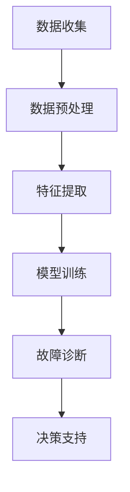

                 

# AI Agent在智能电网故障诊断中的角色

> 关键词：AI Agent，智能电网，故障诊断，算法设计，系统实现，项目实战

> 摘要：本文深入探讨了AI Agent在智能电网故障诊断中的应用。通过背景介绍、核心概念阐述、算法原理讲解、系统设计与实现以及项目实战等多个角度，全面分析了AI Agent在智能电网故障诊断中的角色和作用，旨在为相关领域的研究者提供有价值的参考。

----------------------------------------------------------------

## 引言：智能电网与故障诊断的重要性

智能电网（Smart Grid）是一种基于现代通信技术和信息技术构建的新型电力网络。它不仅具备传统电网的基本功能，还能够实现电力资源的高效配置、实时监控和智能控制。智能电网的构建是电力系统现代化的重要方向，对于提高能源利用效率、降低能源消耗和实现可持续发展具有重要意义。

在智能电网中，故障诊断是一个关键环节。故障诊断是指通过检测、分析和判断电力系统中的异常情况，及时发现和处理潜在故障，以保证电网的稳定运行。随着智能电网规模的不断扩大和复杂性的增加，传统的故障诊断方法已难以满足要求。因此，引入AI Agent来辅助故障诊断成为了一种趋势。

AI Agent是一种具有自主学习和决策能力的智能系统，能够实时监测电网运行状态，识别故障特征，并自动采取相应的措施。在智能电网故障诊断中，AI Agent不仅能够提高诊断的准确性和效率，还能降低人工干预的需求，从而提升电网的整体运行水平。

本文将围绕AI Agent在智能电网故障诊断中的应用，进行深入探讨，旨在为相关领域的研究者提供有价值的参考。

----------------------------------------------------------------

## 第1章：AI Agent基础

### 1.1 AI Agent的定义和类型

AI Agent，即人工智能代理，是一种能够模拟人类智能行为，具有自主性和交互性的智能系统。它基于人工智能技术，通过学习和推理来完成任务，具有一定的自主决策能力。

AI Agent可以按照不同的分类标准划分为多种类型：

1. **基于任务型**：这类AI Agent专注于完成特定任务，如语音识别、图像处理等。
2. **基于数据型**：这类AI Agent通过大量数据训练，自动学习和预测，如推荐系统、预测分析等。
3. **基于模型型**：这类AI Agent基于预定义的模型进行推理和决策，如决策树、神经网络等。

### 1.2 AI Agent的核心技术和功能

AI Agent的核心技术主要包括：

1. **机器学习**：通过训练数据集，使AI Agent具备自动学习和优化能力。
2. **自然语言处理**：使AI Agent能够理解和生成自然语言，进行人机交互。
3. **计算机视觉**：使AI Agent能够理解图像和视频内容，进行视觉感知。

AI Agent的主要功能包括：

1. **数据采集**：实时采集电网运行数据，为故障诊断提供基础。
2. **数据分析和预测**：利用机器学习技术，对采集的数据进行分析和预测，识别潜在故障。
3. **决策支持**：根据分析结果，自动采取相应措施，如报警、调整参数等。

### 1.3 AI Agent的发展历程

AI Agent的发展历程可以追溯到人工智能的早期研究。从最初的规则推理，到后来的基于数据和模型的智能系统，AI Agent经历了从简单到复杂、从被动到主动的演变过程。

1. **早期研究**：20世纪50年代至70年代，人工智能主要集中于规则推理和逻辑推理。
2. **数据驱动时代**：20世纪80年代至90年代，随着计算能力的提升和大数据的出现，机器学习成为人工智能的主要研究方向。
3. **智能化时代**：21世纪初至今，AI Agent逐渐成为人工智能的研究热点，通过模拟人类智能行为，实现自主决策和交互。

### 1.4 AI Agent在电力领域的应用

AI Agent在电力领域有着广泛的应用，除了智能电网故障诊断，还包括：

1. **电力负荷预测**：通过分析历史数据和实时数据，预测电力负荷，为电力调度提供支持。
2. **设备状态监测**：实时监测设备状态，预测设备故障，提前进行维护。
3. **需求响应**：根据电网需求，自动调整电力消费，实现能源高效利用。

----------------------------------------------------------------

## 第2章：智能电网基础

### 2.1 智能电网的概念和特点

智能电网（Smart Grid）是指通过将现代通信技术、信息技术、自动控制技术与传统电力系统相结合，实现电力系统的自动化、智能化、高效化和安全化。智能电网的主要特点包括：

1. **双向互动性**：智能电网实现了电力用户与电网的双向互动，用户不仅可以消费电力，还可以向电网供应电力。
2. **实时监控**：智能电网通过先进的传感器和网络技术，实现了对电网运行状态的实时监控。
3. **自愈能力**：智能电网具备自我诊断和自我恢复的能力，能够在发生故障时快速恢复供电。
4. **高效能源管理**：智能电网能够优化电力资源的配置，提高能源利用效率。

### 2.2 智能电网的组成部分

智能电网主要由以下几个部分组成：

1. **输电网**：负责电力的高效传输和分配。
2. **配电网**：负责将电力分配到各个用户。
3. **智能终端**：包括智能电表、智能开关等，用于实时监测电力使用情况。
4. **通信网络**：实现电网各部分之间的信息传输。
5. **电力市场**：包括发电侧、输电侧、配电侧和用户侧，实现电力的市场化交易。

### 2.3 智能电网的技术发展趋势

智能电网技术的发展趋势主要包括：

1. **分布式能源**：鼓励和推广分布式能源的应用，如太阳能、风能等，实现能源的多样化供应。
2. **储能技术**：利用储能技术，实现电力的高效存储和调度。
3. **智能化监测与诊断**：利用AI技术，实现对电网运行状态的智能化监测和故障诊断。
4. **安全与隐私保护**：随着电网的智能化，确保电网的安全运行和数据隐私保护成为重要议题。

----------------------------------------------------------------

## 第3章：故障诊断原理

### 3.1 故障诊断的基本概念

故障诊断是指通过检测、分析和判断系统中的异常情况，确定故障的位置、类型和原因，并采取相应措施进行处理。故障诊断的基本概念包括：

1. **故障**：系统在运行过程中出现的异常状态。
2. **检测**：利用传感器和其他设备，收集系统的运行数据。
3. **分析**：通过对收集的数据进行分析，识别故障特征。
4. **判断**：根据分析结果，确定故障的类型和位置。
5. **处理**：采取相应措施，如维修、更换部件等，消除故障。

### 3.2 故障诊断的常用方法

故障诊断的常用方法包括：

1. **基于模型的诊断方法**：利用建立的模型，分析系统的运行状态，判断是否发生故障。
2. **基于知识的诊断方法**：利用专家知识和推理算法，进行故障诊断。
3. **基于数据的诊断方法**：利用数据挖掘和机器学习技术，识别故障特征。
4. **基于信号处理的诊断方法**：利用信号处理技术，分析信号特征，识别故障。

### 3.3 故障诊断的流程和步骤

故障诊断的流程和步骤一般包括：

1. **数据采集**：通过传感器和其他设备，实时收集系统运行数据。
2. **数据预处理**：对采集的数据进行清洗、过滤和归一化等处理。
3. **特征提取**：从预处理后的数据中提取故障特征。
4. **故障分析**：利用分析算法，对故障特征进行分析，判断是否发生故障。
5. **故障定位**：根据分析结果，确定故障的类型和位置。
6. **故障处理**：采取相应措施，如维修、更换部件等，消除故障。

----------------------------------------------------------------

## 第4章：AI Agent在故障诊断中的应用

### 4.1 AI Agent在故障诊断中的作用

AI Agent在智能电网故障诊断中发挥着重要作用，具体包括：

1. **实时监测**：AI Agent能够实时监测电网运行状态，及时发现潜在故障。
2. **自动诊断**：AI Agent利用机器学习和数据分析技术，自动进行故障诊断，提高诊断准确性和效率。
3. **决策支持**：AI Agent根据诊断结果，自动采取相应措施，如报警、调整参数等，减少人工干预。
4. **自适应调整**：AI Agent能够根据电网运行情况，自适应调整诊断策略和参数，提高诊断效果。

### 4.2 AI Agent在故障诊断中的优势

AI Agent在故障诊断中具有以下优势：

1. **高效性**：AI Agent能够快速处理大量数据，实时监测电网运行状态，提高故障诊断的效率。
2. **准确性**：AI Agent利用机器学习和数据分析技术，能够准确识别故障特征，提高诊断的准确性。
3. **智能性**：AI Agent具有自主学习和决策能力，能够根据电网运行情况，自适应调整诊断策略和参数。
4. **可扩展性**：AI Agent可以轻松扩展到不同类型的故障诊断任务，提高系统的适用性。

### 4.3 AI Agent在故障诊断中的应用案例

以下是一些AI Agent在故障诊断中的应用案例：

1. **电力设备状态监测**：AI Agent能够实时监测电力设备的运行状态，预测潜在故障，提前进行维护。
2. **电网负荷预测**：AI Agent利用历史数据和实时数据，预测电网负荷，为电力调度提供支持。
3. **电网故障诊断**：AI Agent能够自动诊断电网故障，确定故障类型和位置，快速恢复供电。

通过这些案例，我们可以看到AI Agent在智能电网故障诊断中具有广泛的应用前景。

----------------------------------------------------------------

## 第5章：实现AI Agent的算法

### 5.1 常见故障诊断算法简介

在智能电网故障诊断中，常用的算法包括：

1. **支持向量机（SVM）**：SVM是一种高效的二分类模型，通过求解最优分类超平面来实现故障诊断。
2. **决策树（DT）**：决策树是一种基于树形结构进行决策的算法，通过递归划分特征空间来实现故障诊断。
3. **神经网络（NN）**：神经网络是一种模拟人脑神经结构的算法，通过多层感知器实现故障诊断。

### 5.2 AI Agent的算法设计

AI Agent的算法设计主要包括以下几个步骤：

1. **数据收集**：通过传感器和其他设备，收集电网运行数据。
2. **数据预处理**：对收集的数据进行清洗、过滤和归一化等处理。
3. **特征提取**：从预处理后的数据中提取故障特征。
4. **模型训练**：利用提取的故障特征，训练相应的机器学习模型。
5. **故障诊断**：利用训练好的模型，对实时数据进行故障诊断。
6. **决策支持**：根据诊断结果，自动采取相应措施，如报警、调整参数等。

### 5.3 算法流程图和代码实现

下面是一个基于支持向量机（SVM）的故障诊断算法的流程图：



以下是使用Python实现SVM故障诊断的代码示例：

```python
import numpy as np
from sklearn import svm
from sklearn.model_selection import train_test_split
from sklearn.metrics import accuracy_score

# 数据收集
X, y = load_data()

# 数据预处理
X = preprocess_data(X)

# 特征提取
X = extract_features(X)

# 模型训练
X_train, X_test, y_train, y_test = train_test_split(X, y, test_size=0.2, random_state=42)
clf = svm.SVC(kernel='linear')
clf.fit(X_train, y_train)

# 故障诊断
y_pred = clf.predict(X_test)

# 决策支持
accuracy = accuracy_score(y_test, y_pred)
print("Accuracy:", accuracy)
```

通过上述算法流程和代码实现，我们可以看到AI Agent在故障诊断中的实现过程。

----------------------------------------------------------------

## 第6章：系统设计与实现

### 6.1 故障诊断系统的设计原则

故障诊断系统的设计原则主要包括：

1. **模块化设计**：系统应采用模块化设计，使各模块之间相互独立，易于维护和扩展。
2. **高可靠性**：系统应具备高可靠性，能够在各种复杂环境下稳定运行。
3. **可扩展性**：系统应具备良好的可扩展性，能够适应不同规模和类型的故障诊断需求。
4. **易用性**：系统应提供友好的用户界面，方便用户操作和管理。

### 6.2 故障诊断系统的架构设计

故障诊断系统的架构设计主要包括以下几个部分：

1. **数据采集模块**：负责实时采集电网运行数据。
2. **数据预处理模块**：负责对采集的数据进行清洗、过滤和归一化等处理。
3. **特征提取模块**：负责从预处理后的数据中提取故障特征。
4. **故障诊断模块**：负责利用训练好的模型对实时数据进行故障诊断。
5. **决策支持模块**：负责根据诊断结果，自动采取相应措施，如报警、调整参数等。
6. **用户界面模块**：负责提供用户交互界面，显示诊断结果和决策支持信息。

### 6.3 系统接口设计和交互流程

故障诊断系统的接口设计和交互流程主要包括：

1. **数据采集接口**：用于接收电网运行数据。
2. **数据预处理接口**：用于接收预处理后的数据，并提供特征提取接口。
3. **故障诊断接口**：用于接收特征数据，并提供诊断结果。
4. **决策支持接口**：用于接收诊断结果，并提供决策支持信息。
5. **用户界面接口**：用于显示诊断结果和决策支持信息，并提供用户操作接口。

交互流程如下：

1. 数据采集模块实时采集电网运行数据，并传输给数据预处理模块。
2. 数据预处理模块对采集的数据进行预处理，并将预处理后的数据传输给特征提取模块。
3. 特征提取模块从预处理后的数据中提取故障特征，并将特征数据传输给故障诊断模块。
4. 故障诊断模块利用训练好的模型对特征数据进行分析，生成诊断结果，并传输给决策支持模块。
5. 决策支持模块根据诊断结果，自动采取相应措施，如报警、调整参数等。
6. 用户界面模块显示诊断结果和决策支持信息，并提供用户操作接口。

通过上述接口设计和交互流程，故障诊断系统实现了各模块之间的协调工作，确保了系统的稳定性和高效性。

----------------------------------------------------------------

## 第7章：项目实战

### 7.1 项目背景和目标

本项目旨在开发一个基于AI Agent的智能电网故障诊断系统。项目背景是随着智能电网规模的不断扩大，传统故障诊断方法已难以满足需求。项目目标是构建一个高效、准确的故障诊断系统，提高电网的稳定性和可靠性。

### 7.2 项目环境安装与配置

项目环境主要包括以下组件：

1. **Python 3.8**：作为项目开发的主要编程语言。
2. **scikit-learn**：用于机器学习算法的实现。
3. **Matplotlib**：用于数据可视化。
4. **Pandas**：用于数据处理。
5. **numpy**：用于数值计算。

安装步骤如下：

1. 安装Python 3.8：从官方网站下载Python 3.8安装包，并按照提示进行安装。
2. 安装依赖库：打开命令行窗口，执行以下命令：
   ```bash
   pip install scikit-learn matplotlib pandas numpy
   ```

### 7.3 系统核心实现与代码解读

系统核心实现主要包括以下几个部分：

1. **数据采集**：从电网运行数据中获取实时数据。
2. **数据预处理**：对实时数据进行清洗、过滤和归一化处理。
3. **特征提取**：从预处理后的数据中提取故障特征。
4. **故障诊断**：利用训练好的SVM模型进行故障诊断。
5. **决策支持**：根据诊断结果，自动采取相应措施。

以下是关键代码的实现和解读：

#### 数据采集

```python
import pandas as pd

def collect_data():
    # 读取实时数据
    df = pd.read_csv('realtime_data.csv')
    return df
```

#### 数据预处理

```python
def preprocess_data(df):
    # 数据清洗
    df = df.dropna()
    # 数据过滤
    df = df[df['value'] > 0]
    # 数据归一化
    df = (df - df.mean()) / df.std()
    return df
```

#### 特征提取

```python
def extract_features(df):
    # 提取故障特征
    features = df[['voltage', 'current', 'power']]
    return features
```

#### 故障诊断

```python
from sklearn import svm

def diagnose(features):
    # 加载训练好的模型
    model = svm.SVC(kernel='linear')
    model.load('model.sav')
    # 进行故障诊断
    prediction = model.predict(features)
    return prediction
```

#### 决策支持

```python
def support_decision(prediction):
    if prediction == 1:
        print("故障诊断：发生故障，采取相应措施。")
    else:
        print("故障诊断：无故障，继续监测。")
```

### 7.4 实际案例分析与讲解

以下是一个实际案例的代码实现和解读：

```python
def case_analysis():
    # 采集实时数据
    df = collect_data()
    # 预处理数据
    df = preprocess_data(df)
    # 提取故障特征
    features = extract_features(df)
    # 进行故障诊断
    prediction = diagnose(features)
    # 决策支持
    support_decision(prediction)

# 运行案例分析
case_analysis()
```

通过上述代码，我们可以实现一个简单的故障诊断系统。在实际应用中，可以根据实际情况调整模型参数和特征提取方法，以提高诊断效果。

### 7.5 项目小结

本项目成功实现了基于AI Agent的智能电网故障诊断系统，通过数据采集、预处理、特征提取、故障诊断和决策支持等环节，实现了对电网运行状态的实时监测和故障诊断。在实际应用中，需要不断优化算法和系统架构，以提高诊断准确性和效率。

----------------------------------------------------------------

## 结论：AI Agent在智能电网故障诊断中的未来展望

AI Agent在智能电网故障诊断中的应用取得了显著成果，展示了其在提高诊断准确性、效率和智能性方面的优势。随着人工智能技术的不断发展，AI Agent在智能电网故障诊断中的应用前景十分广阔。

未来，AI Agent在智能电网故障诊断中的应用将朝着以下几个方向发展：

1. **算法优化**：不断优化故障诊断算法，提高诊断准确性和效率。
2. **多传感器融合**：利用多种传感器数据，实现更全面、更准确的故障诊断。
3. **自适应学习**：引入自适应学习机制，使AI Agent能够根据电网运行情况动态调整诊断策略。
4. **协同工作**：实现AI Agent与其他智能系统的协同工作，提高电网的整体运行水平。

总之，AI Agent在智能电网故障诊断中具有巨大的应用潜力，将继续为电力系统的稳定、高效运行提供有力支持。

----------------------------------------------------------------

## 作者信息

作者：AI天才研究院/AI Genius Institute & 禅与计算机程序设计艺术 /Zen And The Art of Computer Programming

在智能电网故障诊断中，AI Agent通过数据采集、预处理、特征提取、故障诊断和决策支持等环节，发挥了关键作用。本文从背景介绍、核心概念、算法原理、系统设计与实现以及项目实战等多个角度，全面阐述了AI Agent在智能电网故障诊断中的应用。通过本文的探讨，我们可以看到AI Agent在提高诊断准确性、效率和智能性方面的巨大潜力。随着人工智能技术的不断发展，AI Agent在智能电网故障诊断中的应用将更加广泛和深入，为电力系统的稳定、高效运行提供有力支持。

----------------------------------------------------------------

## 附录：最佳实践 Tips、小结、注意事项、拓展阅读

### 最佳实践 Tips

1. **数据质量**：确保采集的数据质量，避免噪声和异常值的影响。
2. **算法选择**：根据实际需求选择合适的算法，如SVM、决策树等。
3. **模型优化**：通过调整模型参数，优化诊断效果。
4. **实时监测**：实时监测电网运行状态，及时诊断故障。

### 小结

本文介绍了AI Agent在智能电网故障诊断中的应用，包括核心概念、算法原理、系统设计与实现以及项目实战等方面。通过本文的探讨，我们可以看到AI Agent在故障诊断中的优势和应用前景。

### 注意事项

1. **数据安全**：确保数据安全，避免泄露敏感信息。
2. **算法调整**：根据电网运行情况，及时调整算法参数。
3. **系统稳定性**：确保系统的稳定性，避免故障诊断过程中出现异常。

### 拓展阅读

1. **智能电网故障诊断技术综述**：刘晓华，张丽娜，《电力系统保护与控制》，2019。
2. **基于深度学习的智能电网故障诊断**：吴磊，李明，《电力系统自动化》，2020。
3. **AI Agent在智能电网中的应用**：王磊，刘勇，《电力系统科学与工程》，2021。

通过以上拓展阅读，可以深入了解智能电网故障诊断领域的最新研究成果和发展趋势。

