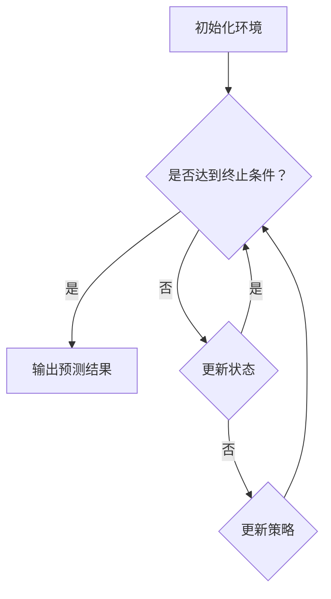
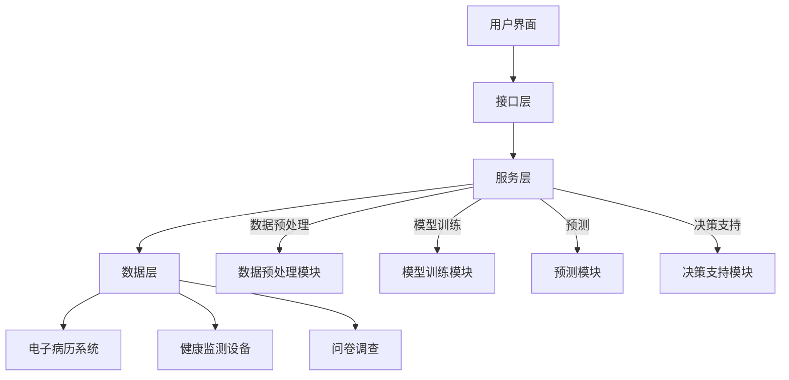

                 


# AI Agent在智能疾病预测中的角色

关键词：AI Agent, 智能疾病预测, 算法原理，应用实践，未来展望

摘要：
本文旨在探讨AI Agent在智能疾病预测领域中的角色和作用。通过详细分析AI Agent的核心概念、应用原理、实际应用和实践经验，本文将阐述AI Agent如何通过数据采集与预处理、算法原理与实现、应用实践等方面，提升疾病预测的准确性和效率。同时，本文也将对AI Agent在疾病预测中的未来发展趋势和挑战进行展望，以期为相关领域的研究和实践提供参考。

## 目录大纲

### 第一部分: 问题背景与核心概念

#### 第1章: AI Agent概述

#### 1.1 问题的提出

#### 1.1.1 智能疾病预测的重要性

#### 1.1.2 AI Agent的定义与功能

#### 1.1.3 AI Agent在疾病预测中的核心概念

#### 1.2 疾病预测的基本原理

#### 1.3 AI Agent的结构与组成

#### 1.4 AI Agent在疾病预测中的应用领域

#### 1.5 本章小结

### 第二部分: AI Agent在疾病预测中的应用原理

#### 第2章: 数据采集与预处理

#### 2.1 数据采集

#### 2.2 数据预处理

#### 2.3 特征提取

#### 2.4 本章小结

### 第三部分: 算法原理与实现

#### 第3章: 疾病预测算法原理

#### 3.1 传统疾病预测算法

#### 3.2 AI Agent疾病预测算法

#### 3.3 算法原理讲解与Mermaid流程图

#### 3.4 本章小结

### 第四部分: AI Agent在疾病预测中的应用实践

#### 第4章: AI Agent在疾病预测中的实际应用

#### 4.1 项目介绍

#### 4.2 系统功能设计

#### 4.3 系统架构设计

#### 4.4 环境安装与配置

#### 4.5 系统核心实现

#### 4.6 实际案例分析与讲解

#### 4.7 项目小结

### 第五部分: AI Agent在疾病预测中的最佳实践与展望

#### 第5章: AI Agent在疾病预测中的最佳实践

#### 5.1 实践经验分享

#### 5.2 小结与注意事项

#### 5.3 拓展阅读

#### 第6章: AI Agent在疾病预测中的未来展望

#### 6.1 疾病预测技术的发展趋势

#### 6.2 AI Agent在疾病预测中的挑战与机遇

#### 6.3 未来展望

#### 第7章: 总结与展望

#### 7.1 本书内容回顾

#### 7.2 本书贡献

#### 7.3 展望未来

## 第1章: AI Agent概述

### 1.1 问题的提出

随着人工智能技术的快速发展，AI Agent作为一种具有自主决策能力的智能体，已经在各个领域展现出强大的潜力。在医疗领域，智能疾病预测成为了一个备受关注的研究方向。如何利用AI Agent来提升疾病预测的准确性和效率，成为了当前研究的热点问题。

智能疾病预测是指利用人工智能技术对患者的健康数据进行分析，预测患者是否患有特定疾病。这需要综合考虑患者的病史、生理指标、生活习惯等多方面信息，进而提高疾病预测的准确性。然而，传统的疾病预测方法存在一定的局限性，如数据量有限、特征提取困难、算法性能不稳定等问题。

AI Agent作为一种具有自主决策能力的智能体，能够通过学习大量的数据，自动提取有用的特征，并基于这些特征进行疾病预测。AI Agent在疾病预测中的角色主要体现在以下几个方面：

1. **数据采集与处理**：AI Agent能够自动采集和整合患者的各种健康数据，并进行预处理，如数据清洗、归一化等操作，为后续的疾病预测提供高质量的数据基础。

2. **特征提取与选择**：AI Agent能够根据疾病预测的需求，自动提取和选择与疾病相关的关键特征，从而提高疾病预测的准确性和效率。

3. **算法实现与优化**：AI Agent可以根据不同类型的疾病预测任务，选择合适的算法进行实现和优化，如监督学习、无监督学习、强化学习等，以提高疾病预测的准确性和效率。

4. **决策支持**：AI Agent可以基于疾病预测结果，为医生提供决策支持，帮助医生更好地制定治疗方案，提高治疗效果。

总之，AI Agent在智能疾病预测中扮演着重要的角色，它不仅能够提高疾病预测的准确性和效率，还能为医疗决策提供科学依据。在接下来的章节中，我们将详细探讨AI Agent在疾病预测中的核心概念、应用原理和实际应用。

### 1.1.1 智能疾病预测的重要性

智能疾病预测在医疗领域具有重要的应用价值，主要体现在以下几个方面：

1. **早期发现与预防**：智能疾病预测能够通过对患者健康数据的分析，早期发现潜在疾病风险，为患者提供及时的预防措施。这有助于降低疾病发病率，提高公共健康水平。

2. **提高诊断准确性**：智能疾病预测可以通过分析患者的病史、生理指标等多方面信息，提高疾病诊断的准确性。这不仅有助于确诊患者是否患有特定疾病，还能为医生提供更详细的诊断信息，从而制定更有效的治疗方案。

3. **优化治疗方案**：智能疾病预测可以为医生提供个性化的治疗方案推荐。通过对患者的疾病预测结果进行分析，AI Agent可以识别出与患者疾病相关的关键因素，为医生提供有针对性的治疗方案，从而提高治疗效果。

4. **降低医疗成本**：智能疾病预测能够提高疾病诊断的准确性，降低误诊率，从而减少不必要的医疗资源和时间浪费。此外，通过早期发现和预防疾病，可以降低疾病治疗成本，提高医疗资源的利用效率。

5. **医疗资源分配**：智能疾病预测可以为医疗资源的分配提供科学依据。通过分析患者的疾病预测结果，AI Agent可以识别出高风险患者，从而为医疗机构提供针对性的医疗服务资源分配方案，提高医疗服务质量。

总之，智能疾病预测在医疗领域的应用具有重要的现实意义。随着人工智能技术的不断发展，智能疾病预测将更加精准、高效，为人类健康事业做出更大贡献。

### 1.1.2 AI Agent的定义与功能

AI Agent，即人工智能代理，是指一种具有自主决策能力的智能体，能够在特定环境下，通过学习和适应，实现特定任务目标。AI Agent的核心功能主要包括数据采集与处理、特征提取与选择、算法实现与优化、决策支持等。

首先，数据采集与处理是AI Agent的基础功能。AI Agent能够自动采集患者的各种健康数据，如病史、生理指标、生活习惯等，并进行预处理，如数据清洗、归一化、缺失值填补等操作，从而保证数据的质量和一致性。这一过程对于后续的疾病预测和特征提取至关重要。

其次，特征提取与选择是AI Agent的关键功能。通过学习大量的数据，AI Agent能够自动提取与疾病相关的关键特征，并进行筛选和优化，以提高疾病预测的准确性和效率。例如，在预测心血管疾病时，AI Agent可以识别出与心血管疾病相关的关键生理指标，如心率、血压、胆固醇水平等。

算法实现与优化是AI Agent的核心能力。AI Agent可以根据不同类型的疾病预测任务，选择合适的算法进行实现和优化。常见的疾病预测算法包括监督学习、无监督学习和强化学习等。通过不断优化算法参数，AI Agent可以提高疾病预测的准确性和效率。

最后，决策支持是AI Agent的重要功能。基于疾病预测结果，AI Agent可以为医生提供个性化的治疗方案推荐，帮助医生制定更有效的治疗方案。例如，在预测癌症时，AI Agent可以识别出与癌症相关的关键因素，如遗传基因、生活方式等，为医生提供有针对性的治疗方案。

总之，AI Agent在疾病预测中发挥着重要作用。通过数据采集与处理、特征提取与选择、算法实现与优化和决策支持等功能，AI Agent能够提高疾病预测的准确性和效率，为医疗决策提供科学依据。

### 1.1.3 AI Agent在疾病预测中的核心概念

AI Agent在疾病预测中的应用涉及多个核心概念，包括智能疾病预测、数据采集、特征提取、算法实现和优化等。以下是对这些核心概念的定义和解释：

1. **智能疾病预测**：
   智能疾病预测是指利用人工智能技术，通过对患者健康数据的分析，预测患者是否患有特定疾病。智能疾病预测的目标是提高疾病诊断的准确性，实现早期发现和预防疾病。这一过程通常涉及数据采集、特征提取、算法选择和模型训练等多个环节。

2. **数据采集**：
   数据采集是指收集与疾病预测相关的各类数据，包括患者的病史、生理指标、生活习惯等。数据采集的来源可以是电子病历、健康监测设备、问卷调查等。高质量的数据是智能疾病预测成功的关键，因此数据采集的过程需要确保数据的准确性、完整性和一致性。

3. **特征提取**：
   特征提取是指从原始数据中提取与疾病相关的特征。这些特征可以是数值型的，如血压、心率等，也可以是类别型的，如疾病的诊断结果。特征提取的目的是简化数据，去除无关信息，提高疾病预测模型的性能。

4. **算法实现**：
   算法实现是指选择合适的算法来构建疾病预测模型。常见的算法包括监督学习算法（如决策树、支持向量机、神经网络等）、无监督学习算法（如聚类分析、主成分分析等）和强化学习算法。算法实现的步骤包括模型选择、参数调优和模型训练等。

5. **优化**：
   优化是指在算法实现的基础上，通过调整模型参数、增加训练数据、改进特征提取方法等方式，提高疾病预测模型的性能。优化的目标是最小化预测误差，提高预测准确性。常见的优化方法包括交叉验证、网格搜索、贝叶斯优化等。

6. **决策支持**：
   决策支持是指利用疾病预测结果为医生提供诊断和治疗方案的建议。AI Agent可以通过分析疾病预测结果，识别高风险患者，推荐个性化的预防措施和治疗策略，从而提高医疗决策的科学性和有效性。

通过理解这些核心概念，我们可以更好地理解AI Agent在疾病预测中的作用，并为实际应用提供理论支持。

### 1.2 疾病预测的基本原理

疾病预测的基本原理主要基于人工智能技术，通过对大量健康数据的分析和建模，实现疾病的早期发现和预测。以下是疾病预测的基本原理：

1. **数据收集**：
   疾病预测的第一步是收集与疾病相关的数据。这些数据可以包括患者的病史、生理指标、生活习惯、遗传信息等。数据来源可以是电子病历系统、健康监测设备、问卷调查等。高质量的数据是疾病预测成功的关键，因此数据收集的过程需要确保数据的准确性、完整性和一致性。

2. **数据预处理**：
   在收集到数据后，需要进行预处理。预处理步骤包括数据清洗、缺失值填补、数据归一化等。数据清洗旨在去除噪声数据和异常值，缺失值填补则通过插值法、均值填补等方法来处理缺失数据，数据归一化则是将不同单位的数据转换为相同尺度，以消除数据之间的量纲差异。

3. **特征提取**：
   特征提取是疾病预测的核心步骤。通过分析原始数据，提取与疾病相关的关键特征，如生理指标（如血压、心率、体温等）、生活习惯（如饮食、运动等）、遗传特征等。特征提取的目的是简化数据，去除无关信息，提高疾病预测模型的性能。

4. **模型构建**：
   疾病预测模型通常基于机器学习算法构建。常用的机器学习算法包括监督学习算法（如决策树、支持向量机、神经网络等）、无监督学习算法（如聚类分析、主成分分析等）和强化学习算法。模型构建的过程包括选择合适的算法、设计模型结构、训练模型等。

5. **模型评估**：
   在模型训练完成后，需要对模型进行评估。常见的评估指标包括准确率、召回率、F1分数等。模型评估的目的是检验模型在预测疾病方面的性能，确保模型具有良好的预测效果。

6. **预测与决策**：
   最终，基于训练好的模型，可以对新数据进行疾病预测。预测结果可以为医生提供诊断和治疗方案的建议，辅助医生做出更科学的决策。

通过以上基本原理，AI Agent能够实现对疾病的早期发现和预测，从而提高医疗服务的质量和效率。

### 1.3 AI Agent的角色与作用

AI Agent在疾病预测中的角色和作用至关重要，具体体现在以下几个方面：

1. **自主决策能力**：
   AI Agent能够根据患者的健康数据，自动进行疾病预测和诊断，无需人工干预。这种自主决策能力使得AI Agent可以在短时间内处理大量患者数据，提高疾病预测的效率和准确性。

2. **实时监测与预警**：
   AI Agent可以实时监测患者的健康状况，通过分析健康数据的变化趋势，预测患者是否可能患有特定疾病，并提前发出预警。这有助于实现疾病的早期发现和干预，降低疾病发病率和死亡率。

3. **个性化治疗建议**：
   基于对患者健康数据的深入分析，AI Agent可以为医生提供个性化的治疗建议。通过识别患者疾病发展的关键因素，如遗传基因、生活习惯等，AI Agent可以推荐最适合患者的治疗方案，提高治疗效果。

4. **辅助医生决策**：
   AI Agent可以为医生提供辅助决策支持。通过对疾病预测结果的详细分析，AI Agent可以帮助医生识别高风险患者，制定针对性的预防和治疗策略，从而提高医疗决策的科学性和有效性。

5. **数据整合与优化**：
   AI Agent能够整合不同来源的健康数据，包括电子病历、健康监测设备、问卷调查等，进行数据清洗、归一化和特征提取。通过优化数据质量，AI Agent可以提升疾病预测模型的性能，提高预测准确性。

6. **持续学习与适应**：
   AI Agent具有持续学习的能力，可以不断从新数据中学习，优化疾病预测模型。这种自我优化能力使得AI Agent能够适应不同环境和需求，提高其在疾病预测中的长期稳定性和可靠性。

总之，AI Agent在疾病预测中的角色和作用是多方面的，它不仅能够提高疾病预测的准确性和效率，还能为医生提供科学的决策支持，从而提升医疗服务的质量和患者满意度。

### 1.4 AI Agent的结构与组成

AI Agent的结构与组成是确保其在疾病预测中发挥高效作用的基础。以下是AI Agent的主要组成部分及其功能：

1. **感知模块**：
   感知模块是AI Agent获取外部信息的主要渠道。它负责从各种数据源（如电子病历、健康监测设备、社交媒体等）收集健康数据，并对其进行预处理。感知模块需要具备数据采集、数据清洗和特征提取的能力，以确保输入数据的质量和一致性。

2. **决策模块**：
   决策模块是AI Agent的核心，负责处理和分析感知模块收集到的数据，并根据分析结果做出决策。决策模块通常采用机器学习算法，如监督学习、无监督学习和强化学习等。通过训练和优化，决策模块可以不断提高疾病预测的准确性。

3. **执行模块**：
   执行模块负责将决策模块生成的决策转化为实际操作。在疾病预测中，执行模块可以为医生提供诊断和治疗方案建议，或自动执行特定的医疗操作。执行模块需要与医疗系统和其他设备进行有效集成，确保决策能够被顺利执行。

4. **学习模块**：
   学习模块是AI Agent持续进步的关键。它通过从新数据中学习，不断优化和调整自身的决策模型。学习模块通常采用在线学习或迁移学习等技术，以便在数据量和模型复杂度不断变化的环境中保持高效性能。

5. **通信模块**：
   通信模块负责AI Agent与其他系统、设备和人员之间的信息交换。在疾病预测中，通信模块需要确保数据传输的安全性和实时性，以便为医生和患者提供及时、准确的信息支持。

6. **用户界面**：
   用户界面是AI Agent与用户交互的桥梁。它负责展示AI Agent的预测结果、诊断建议和执行操作等信息，并允许用户进行反馈和调整。用户界面需要设计直观、易用，以便患者和医生能够轻松理解和使用AI Agent的功能。

通过以上各模块的协同工作，AI Agent能够高效地完成疾病预测任务，为医疗决策提供有力支持。

### 1.5 AI Agent在疾病预测中的应用领域

AI Agent在疾病预测中具有广泛的应用领域，涵盖了从预防到治疗等多个阶段。以下是AI Agent在疾病预测中应用的主要领域：

1. **早期疾病筛查**：
   AI Agent能够通过分析患者的健康数据，预测其是否可能患有特定疾病。这一功能在癌症筛查、心血管疾病预警等方面具有重要作用。例如，AI Agent可以通过分析患者的影像学数据（如CT、MRI等）和生物标志物，早期发现癌症病灶，为患者提供及时的筛查服务。

2. **个性化健康管理**：
   基于对患者的长期健康数据的分析，AI Agent可以为患者制定个性化的健康管理方案。这包括健康饮食建议、运动计划、生活方式调整等。通过个性化健康管理，AI Agent可以帮助患者预防慢性疾病，提高生活质量。

3. **药物疗效预测**：
   AI Agent可以根据患者的基因信息和药物反应数据，预测药物的治疗效果和副作用。这有助于医生为患者选择最合适的治疗方案，提高药物治疗的针对性和安全性。

4. **手术风险评估**：
   AI Agent可以分析患者的手术历史、生理指标等信息，预测手术过程中可能出现的高风险情况。这有助于医生制定更安全的手术计划，减少手术并发症的发生。

5. **疾病诊断与辅助决策**：
   在疾病诊断过程中，AI Agent可以辅助医生进行疾病分类和诊断。例如，在眼科疾病诊断中，AI Agent可以通过分析视网膜图像，帮助医生早期发现糖尿病视网膜病变等疾病。在皮肤病诊断中，AI Agent可以通过分析皮肤病变图像，提高诊断的准确性。

6. **慢性病管理**：
   对于慢性疾病患者，AI Agent可以提供持续的健康监测和风险评估服务。通过实时监测患者的健康数据，AI Agent可以及时发现病情变化，为医生提供调整治疗方案的建议。

总之，AI Agent在疾病预测中的应用领域广泛，其通过深入分析健康数据，为医疗决策提供了有力支持，有助于提高医疗服务的质量和效率。

### 1.5.1 常见疾病预测应用实例

在疾病预测领域，AI Agent已经展示了其强大的应用潜力，以下是一些常见疾病的预测应用实例：

1. **心血管疾病预测**：
   心血管疾病是导致全球死亡的主要原因之一。AI Agent可以通过分析患者的生理指标（如心率、血压、血糖等）和病史数据，预测患者是否患有心血管疾病。例如，通过分析患者的电子病历数据和实时监测数据，AI Agent可以识别出潜在的心血管疾病风险，帮助医生制定预防措施。

2. **癌症预测**：
   癌症是一种复杂的疾病，早期发现和诊断对于提高治疗成功率至关重要。AI Agent可以通过分析影像学数据（如CT、MRI等）、血液生物标志物和患者的遗传信息，预测患者是否患有癌症。例如，在乳腺癌的早期筛查中，AI Agent可以通过分析乳腺X线图像，提高乳腺癌的检测率。

3. **糖尿病预测**：
   糖尿病是一种常见的慢性代谢性疾病，早期发现和干预对于控制病情和预防并发症至关重要。AI Agent可以通过分析血糖水平、体重、血压等生理指标，预测患者是否患有糖尿病。例如，通过分析患者的健康数据和家族病史，AI Agent可以识别出糖尿病的高风险人群，为医生提供早期干预建议。

4. **精神疾病预测**：
   精神疾病对患者的生活质量和社会功能有重大影响。AI Agent可以通过分析患者的心理评估数据、生活习惯和行为模式，预测患者是否患有精神疾病。例如，通过分析患者的社交媒体活动和在线行为，AI Agent可以预测抑郁症和焦虑症等心理疾病的风险。

5. **神经系统疾病预测**：
   神经系统疾病如帕金森病、阿尔茨海默病等，早期诊断对于延缓病情进展和改善患者生活质量至关重要。AI Agent可以通过分析影像学数据（如脑部MRI）、基因数据和病史，预测患者是否患有神经系统疾病。例如，通过分析患者的脑部MRI图像，AI Agent可以识别出帕金森病的早期迹象。

这些实例表明，AI Agent在疾病预测中的应用具有广泛的前景，通过深入分析健康数据，AI Agent能够提高疾病预测的准确性，为医疗决策提供有力支持。

### 1.5.2 疾病预测的挑战与机遇

尽管AI Agent在疾病预测中展示了巨大的潜力，但其实际应用仍面临诸多挑战与机遇。

**挑战**：

1. **数据隐私与安全**：
   疾病预测依赖于大量患者的健康数据，这些数据涉及隐私和安全问题。如何确保数据在采集、存储、传输和使用过程中的隐私保护，是疾病预测应用的一大挑战。

2. **数据质量和完整性**：
   疾病预测模型的准确性高度依赖于数据的质量和完整性。然而，医疗数据往往存在噪声、缺失值和不一致性等问题，这会对模型的性能产生负面影响。

3. **算法复杂性和可解释性**：
   传统的疾病预测算法如决策树和支持向量机等，具有较高的可解释性。然而，深度学习和强化学习等复杂算法在提高预测性能的同时，也带来了算法透明度不足的问题。如何平衡算法复杂性和可解释性，是疾病预测应用需要解决的一个关键问题。

4. **计算资源和时间成本**：
   疾病预测通常需要处理大规模的数据集，这需要大量的计算资源和时间成本。如何优化算法和计算架构，以提高疾病预测的效率和可扩展性，是当前研究的一个热点问题。

**机遇**：

1. **人工智能技术的进步**：
   随着深度学习、强化学习等人工智能技术的快速发展，AI Agent在疾病预测中的性能和可解释性将得到显著提升。这不仅将提高疾病预测的准确性，还将扩大疾病预测的应用范围。

2. **大数据和云计算的支持**：
   大数据和云计算技术的发展，为疾病预测提供了强大的计算和存储支持。通过利用云计算平台，AI Agent可以快速处理和分析大规模医疗数据，提高疾病预测的效率和准确性。

3. **跨学科合作**：
   疾病预测不仅涉及医学知识，还涉及人工智能、数据科学、统计学等多个领域。跨学科合作将有助于整合各种资源，推动疾病预测技术的创新和发展。

4. **政策支持和法律法规完善**：
   随着疾病预测应用的发展，各国政府和企业将逐渐意识到其在公共卫生和医疗领域的重要性。政策支持和法律法规的完善，将为疾病预测应用提供良好的发展环境。

总之，尽管疾病预测应用面临诸多挑战，但同时也拥有巨大的机遇。通过不断优化算法、加强数据安全和隐私保护，AI Agent在疾病预测中将发挥越来越重要的作用。

### 1.6 本章小结

本章首先介绍了智能疾病预测的重要性，阐述了AI Agent在疾病预测中的关键角色和功能。通过分析AI Agent的定义、核心概念和结构组成，我们了解了AI Agent如何通过数据采集与预处理、特征提取与选择、算法实现与优化等方面，提升疾病预测的准确性和效率。同时，本章还讨论了AI Agent在疾病预测中的应用领域，以及面临的挑战和机遇。这些内容为后续章节深入探讨AI Agent在疾病预测中的应用原理、算法实现和应用实践提供了基础。

## 第二部分: AI Agent在疾病预测中的应用原理

### 第2章: 数据采集与预处理

#### 2.1 数据采集

数据采集是AI Agent在疾病预测中的第一步，也是至关重要的一步。数据采集的质量直接影响后续模型训练的效果和预测的准确性。因此，如何有效地收集高质量的数据成为了关键问题。

**数据来源**：

1. **电子病历系统**：
   电子病历系统是收集患者病史和诊疗记录的主要来源。这些数据包括患者的诊断记录、手术记录、药物使用记录、实验室检查结果等。电子病历系统提供了丰富的患者数据，是疾病预测的重要数据来源。

2. **健康监测设备**：
   健康监测设备如血压计、血糖仪、智能手环等，可以实时收集患者的生理指标，如心率、血压、血糖水平、体温等。这些实时数据为疾病预测提供了动态的信息支持。

3. **问卷调查**：
   通过问卷调查，可以收集患者的饮食习惯、生活习惯、运动频率等非结构化数据。这些数据有助于了解患者的整体健康状况，为疾病预测提供更全面的视角。

4. **公开数据集**：
   现有的公开数据集如公开的疾病数据集、生物信息学数据集等，也是疾病预测的重要数据来源。这些数据集通常涵盖了大量的患者信息，为研究提供了丰富的样本。

**数据采集方法**：

1. **自动化采集**：
   通过接口调用、API等方式，直接从电子病历系统和健康监测设备中获取数据。这种方法自动化程度高，能够实时获取最新数据，但需要确保数据的准确性和一致性。

2. **手动采集**：
   通过问卷调查或手动记录方式，收集患者的非结构化数据。这种方法灵活性高，但需要耗费大量时间和人力，且数据质量难以控制。

3. **混合采集**：
   结合自动化采集和手动采集的方法，最大化地利用各种数据源。例如，在电子病历系统中获取结构化数据，通过问卷调查获取非结构化数据，以提高数据采集的全面性和质量。

**数据采集中的问题与解决方法**：

1. **数据缺失**：
   数据缺失是疾病预测中常见的问题。解决方法包括缺失值填补、插值法、平均值填补等。例如，可以使用最近邻插值法填补缺失的生理指标数据。

2. **数据不一致**：
   数据不一致可能导致模型训练失败或预测结果偏差。解决方法包括数据清洗、数据标准化等。例如，可以通过去重和统一格式来处理数据不一致问题。

3. **数据隐私与安全**：
   在数据采集过程中，确保患者数据的安全和隐私至关重要。解决方法包括数据加密、访问控制、匿名化处理等。例如，可以使用数据脱敏技术，将敏感信息进行匿名化处理，以保护患者隐私。

通过以上方法，AI Agent能够有效地收集和整合来自不同来源的高质量数据，为后续的疾病预测提供可靠的数据基础。

### 2.2 数据预处理

在数据采集完成后，数据预处理是确保数据质量、提高模型性能的重要环节。数据预处理包括数据清洗、数据归一化和特征提取等步骤。

**数据清洗**：

1. **缺失值处理**：
   缺失值是数据清洗中最常见的问题。处理缺失值的方法包括：
   - 删除缺失值：如果缺失值较多，可以考虑删除相关记录。
   - 填补缺失值：通过插值法、均值填补等方法进行填补。例如，使用K最近邻算法（KNN）填补缺失的数值型数据。

2. **异常值处理**：
   异常值可能对模型训练产生负面影响。处理异常值的方法包括：
   - 删除异常值：如果异常值较多，可以考虑删除相关记录。
   - 调整异常值：通过统计学方法（如中位数替换、标准差替换等）调整异常值。

3. **重复数据处理**：
   数据库中可能存在重复数据。处理重复数据的方法包括：
   - 去重：通过比较数据项，删除重复记录。

4. **格式统一**：
   不同数据源的数据格式可能不同，需要进行统一。例如，将不同数据源的日期格式统一为YYYY-MM-DD。

**数据归一化**：

数据归一化是为了消除不同特征之间的尺度差异，提高模型训练的效果。常见的归一化方法包括：

1. **最小-最大缩放**：
   将数据缩放到[0, 1]的范围内，公式为：x' = (x - min) / (max - min)，其中x为原始值，x'为归一化后的值，min和max分别为特征的最小值和最大值。

2. **零-均值缩放**：
   将数据缩放到均值附近，公式为：x' = x - mean，其中x为原始值，x'为归一化后的值，mean为特征的均值。

**特征提取**：

特征提取是从原始数据中提取对疾病预测有用的信息。常见的特征提取方法包括：

1. **数值特征提取**：
   - 统计特征：如均值、中位数、标准差等。
   - 关联规则挖掘：如Apriori算法，用于发现特征之间的关联关系。

2. **文本特征提取**：
   - 词袋模型：将文本数据转换为向量表示。
   - TF-IDF：用于衡量特征词的重要程度。

3. **图像特征提取**：
   - 边缘检测：提取图像的边缘特征。
   - 纹理特征：提取图像的纹理特征。

通过数据清洗、数据归一化和特征提取，AI Agent能够提高数据质量，为模型训练提供可靠的数据基础。数据预处理的有效实施，可以显著提升疾病预测模型的准确性和鲁棒性。

### 2.3 特征提取

在疾病预测中，特征提取是关键的一步，它将原始数据进行转换，提取出对预测任务有用的信息。特征提取的质量直接影响疾病预测模型的性能。以下是特征提取的几个关键步骤：

1. **统计特征提取**：
   统计特征提取是从原始数据中计算得到的特征，如均值、中位数、标准差等。这些特征可以揭示数据的分布和趋势，对疾病预测有很大的帮助。
   - **示例**：假设我们有一组患者的血压数据，我们可以计算这组数据的均值和标准差。均值可以帮助我们了解患者的平均血压水平，而标准差则可以帮助我们了解血压的波动情况。

2. **文本特征提取**：
   对于非结构化的文本数据，如患者的病历记录，我们需要将其转换为数值化的特征向量。常用的文本特征提取方法包括词袋模型和TF-IDF。
   - **词袋模型**：将文本数据分解为词汇表，每个词对应一个特征。通过统计每个词在文档中出现的频率，我们可以得到一个词频向量。
   - **TF-IDF**：TF（词频）表示词在文档中出现的频率，IDF（逆文档频率）表示词在所有文档中出现的频率。TF-IDF可以衡量一个词对于疾病预测的重要性。

3. **图像特征提取**：
   对于医疗图像数据，如X光片、CT扫描等，我们需要提取图像中的特征。常用的图像特征提取方法包括边缘检测、纹理分析和形态学处理。
   - **边缘检测**：通过算法找到图像中的边缘，这些边缘通常代表图像中的重要结构信息。
   - **纹理分析**：通过分析图像中的纹理模式，我们可以提取出反映疾病特征的纹理特征。

4. **深度特征提取**：
   利用深度学习模型，如卷积神经网络（CNN），可以从原始数据中自动提取高层次的抽象特征。深度特征提取可以大大提高疾病预测的准确性和鲁棒性。
   - **示例**：通过训练一个CNN模型，我们可以从X光片中自动提取出与肺炎相关的特征，如肺纹理变化、肺部炎症等。

**特征选择**：

在特征提取后，我们需要对提取的特征进行选择，以去除无关或冗余的特征，提高模型性能。常用的特征选择方法包括：
- **过滤式特征选择**：通过统计方法，如相关性分析，筛选出重要的特征。
- **包裹式特征选择**：通过机器学习模型，如随机森林，寻找对预测任务最有帮助的特征组合。
- **嵌入式特征选择**：在模型训练过程中，自动筛选出重要的特征，如LASSO回归。

通过上述步骤，AI Agent能够从原始数据中提取出对疾病预测有用的特征，从而提高预测的准确性和效率。特征提取和特征选择的有效实施，是疾病预测成功的关键。

### 2.4 本章小结

本章详细探讨了AI Agent在疾病预测中的数据采集与预处理过程。首先，介绍了数据采集的方法和来源，包括电子病历系统、健康监测设备和问卷调查等。接着，讨论了数据预处理的重要性，包括数据清洗、数据归一化和特征提取等关键步骤。通过数据清洗，我们解决了缺失值、异常值和数据不一致等问题；通过数据归一化，我们消除了不同特征之间的尺度差异；通过特征提取，我们提取了与疾病预测相关的关键信息。这些预处理步骤不仅提高了数据质量，还为后续的疾病预测模型训练提供了可靠的基础。总之，数据采集与预处理是AI Agent在疾病预测中不可或缺的重要环节。

## 第三部分: 算法原理与实现

### 第3章: 疾病预测算法原理

#### 3.1 传统疾病预测算法

传统疾病预测算法主要基于统计学和机器学习技术，这些算法通过分析历史数据，建立预测模型，从而实现对疾病的预测。以下是几种常见的传统疾病预测算法：

1. **决策树算法**：
   决策树算法通过构建一棵树形模型，每个节点代表一个特征，每个分支代表该特征的取值。通过从根节点开始，逐层向下判断，最终到达叶节点，得到预测结果。决策树算法具有较好的解释性，能够直观地展示预测过程。

   **算法原理**：
   - 决策树构建：从原始数据中随机选择一个特征，将其划分为多个子集，每个子集对应一个节点，然后对每个子集继续进行划分，直到达到终止条件（如最大深度、最小样本数等）。
   - 预测过程：从根节点开始，根据当前节点的特征取值，选择对应的分支，直至到达叶节点，得到预测结果。

   **示例**：
   假设我们要预测某患者的糖尿病风险，特征包括年龄、体重指数（BMI）、血糖水平等。通过构建决策树模型，我们可以根据这些特征值，预测患者是否患有糖尿病。

2. **支持向量机（SVM）算法**：
   支持向量机是一种二分类模型，通过找到一个最优的超平面，将不同类别的数据点分开。SVM算法的核心是求解最优超平面，使得分类边界最大化。

   **算法原理**：
   - 最优超平面：在特征空间中找到一个最优超平面，使得正负样本点之间的距离最大。
   - 支持向量：在最优超平面两侧的边界上的样本点，它们对超平面的分类起着关键作用。

   **示例**：
   假设我们有一组糖尿病和非糖尿病患者的数据，通过训练SVM模型，我们可以找到一个最优超平面，将糖尿病和非糖尿病患者分开。

3. **神经网络算法**：
   神经网络是一种模拟生物神经系统的算法，通过多层神经元构建模型，对输入数据进行处理和分类。神经网络算法具有强大的非线性建模能力，适用于复杂的数据分析任务。

   **算法原理**：
   - 神经元：神经网络中的基本单元，负责接收输入、传递信号和产生输出。
   - 层结构：神经网络通常包括输入层、隐藏层和输出层，每层之间的神经元通过权重连接。
   - 激活函数：用于决定神经元是否激活，常用的激活函数包括Sigmoid函数、ReLU函数等。

   **示例**：
   假设我们使用多层感知机（MLP）模型来预测糖尿病风险，输入层接收患者的年龄、BMI、血糖水平等特征，隐藏层进行数据处理和特征提取，输出层输出预测结果。

传统疾病预测算法在处理结构化数据、线性关系较强的任务时表现出色，但面对复杂、非线性关系时，其性能可能受到限制。在接下来的部分，我们将探讨AI Agent疾病预测算法，这些算法在处理复杂疾病预测任务时具有更高的灵活性和准确性。

### 3.2 AI Agent疾病预测算法

AI Agent疾病预测算法在传统算法的基础上，结合了深度学习、强化学习等先进技术，能够处理更复杂的疾病预测任务，具有更高的灵活性和准确性。以下是几种常见的AI Agent疾病预测算法：

1. **强化学习算法**：
   强化学习算法是一种基于奖励机制的学习方法，通过与环境交互，不断调整策略，以实现最大化长期奖励。在疾病预测中，强化学习算法可以通过不断优化预测策略，提高预测准确性。

   **算法原理**：
   - 状态（State）：表示患者的当前健康状态。
   - 动作（Action）：表示AI Agent的预测行为，如疾病诊断、治疗方案推荐等。
   - 奖励（Reward）：表示AI Agent的预测结果与实际结果的差异，用于指导算法调整策略。
   - 策略（Policy）：表示AI Agent的决策规则，用于确定在给定状态下应采取的动作。

   **示例**：
   假设AI Agent在预测糖尿病时，状态包括患者的年龄、BMI、血糖水平等，动作包括诊断结果和治疗方案推荐。通过不断与环境交互，AI Agent可以优化其预测策略，提高糖尿病预测的准确性。

2. **监督学习算法**：
   监督学习算法是一种基于已有标签数据进行训练和预测的方法，通过学习输入数据和对应的标签，建立预测模型。在疾病预测中，监督学习算法可以通过分析历史病例数据，预测患者是否患有特定疾病。

   **算法原理**：
   - 特征提取：从原始数据中提取对疾病预测有用的特征。
   - 模型训练：使用已有标签数据，训练预测模型。
   - 预测：使用训练好的模型，对新的患者数据进行预测。

   **示例**：
   假设我们使用支持向量机（SVM）算法，通过分析糖尿病患者的病史和生理指标数据，建立疾病预测模型。然后，使用该模型对新的患者数据进行预测，判断其是否患有糖尿病。

3. **无监督学习算法**：
   无监督学习算法不需要标签数据，通过分析数据的内在结构和模式，发现数据之间的关联关系。在疾病预测中，无监督学习算法可以用于聚类分析，识别疾病高风险人群。

   **算法原理**：
   - 数据聚类：将相似的数据点归为同一类别。
   - 模型评估：通过内部评估指标（如簇内平均距离、轮廓系数等）评估聚类效果。

   **示例**：
   假设我们使用K均值聚类算法，对患者的生理指标数据进行聚类分析，识别出高风险糖尿病人群。然后，对这些高风险人群进行进一步的分析和干预，以降低糖尿病发病风险。

AI Agent疾病预测算法通过融合多种先进技术，能够处理复杂的疾病预测任务，提高预测准确性和实用性。在接下来的章节中，我们将进一步探讨这些算法的原理和应用。

### 3.3 算法原理讲解与Mermaid流程图

为了更好地理解和分析疾病预测算法的原理，我们可以借助Mermaid流程图来直观地展示算法的执行流程。Mermaid是一种基于Markdown的图形描述语言，可以方便地绘制流程图、时序图、类图等。以下是一个基于强化学习算法的疾病预测的Mermaid流程图示例：



这个流程图描述了一个简单的强化学习算法的基本步骤：

1. **初始化环境**：初始化疾病预测系统，准备进行预测。
2. **判断终止条件**：检查是否达到终止条件，如训练轮次达到设定值。
3. **输出预测结果**：如果达到终止条件，输出最终的预测结果。
4. **更新状态**：如果未达到终止条件，更新当前状态。
5. **更新策略**：根据新的状态，调整预测策略。

**示例**：

假设我们使用强化学习算法来预测糖尿病风险，状态包括患者的年龄、体重指数（BMI）和血糖水平等。以下是详细的算法原理讲解：

1. **状态初始化**：系统初始化时，随机选择一组患者的初始状态，如年龄、BMI、血糖水平等。
2. **状态传递**：系统根据当前状态，采取一个预测动作，例如，预测患者是否患有糖尿病。
3. **奖励反馈**：根据实际结果，系统获取奖励反馈。如果预测正确，则获得正值奖励；如果预测错误，则获得负值奖励。
4. **策略调整**：根据奖励反馈，系统调整预测策略，以优化未来预测的准确性。
5. **状态更新**：系统将新的状态传递给下一个预测周期，继续进行预测和策略调整。

通过这种方式，AI Agent可以不断学习和优化其预测模型，提高疾病预测的准确性和可靠性。Mermaid流程图不仅帮助我们清晰地理解算法的执行过程，还能方便地与代码实现相对应，为算法的实际应用提供有力支持。

### 3.4 本章小结

本章详细介绍了疾病预测算法的原理，包括传统算法和AI Agent疾病预测算法。首先，我们探讨了决策树、支持向量机和神经网络等传统算法的基本原理和应用。这些传统算法在处理结构化数据和线性关系较强的任务时表现良好，但面对复杂、非线性关系时可能存在一定的局限性。

接着，我们介绍了AI Agent疾病预测算法，包括强化学习、监督学习和无监督学习等算法。这些算法通过融合先进的机器学习技术，能够处理复杂的疾病预测任务，提高预测准确性和实用性。此外，我们通过Mermaid流程图直观地展示了算法的执行流程，有助于更好地理解和分析算法原理。

本章内容为AI Agent在疾病预测中的应用奠定了理论基础，为后续的算法实现和应用实践提供了重要参考。

## 第四部分: AI Agent在疾病预测中的应用实践

### 第4章: AI Agent在疾病预测中的实际应用

#### 4.1 项目介绍

在本章中，我们将介绍一个实际项目，该项目的目标是通过AI Agent实现心血管疾病的预测。心血管疾病是导致全球死亡的主要原因之一，早期发现和预测对于降低发病率和死亡率具有重要意义。本项目旨在利用AI Agent，通过对患者健康数据的分析，预测患者是否患有心血管疾病，从而为医生提供有针对性的预防措施和治疗建议。

**项目背景**：

心血管疾病的发病率和死亡率在全球范围内呈上升趋势，早期发现和预测心血管疾病变得尤为重要。传统的诊断方法通常依赖于医生的经验和影像学检查，存在一定的局限性。因此，利用人工智能技术进行疾病预测，已成为当前研究的热点。

**项目目标**：

1. 收集和整合大量心血管疾病患者的健康数据。
2. 构建并优化AI Agent疾病预测模型。
3. 实现对患者心血管疾病的预测，为医生提供决策支持。
4. 评估预测模型的性能，持续优化和改进。

**项目方法**：

1. **数据采集**：通过电子病历系统、健康监测设备和问卷调查等途径，收集患者的病史、生理指标、生活习惯等数据。
2. **数据预处理**：对采集到的数据进行清洗、归一化和特征提取，确保数据质量。
3. **模型构建**：选择合适的机器学习算法，如监督学习、无监督学习和强化学习等，构建疾病预测模型。
4. **模型训练与评估**：使用历史数据训练模型，并对模型进行评估，选择性能最佳的模型。
5. **实际应用**：将训练好的模型应用于新数据，预测患者是否患有心血管疾病，为医生提供诊断和治疗方案建议。

#### 4.2 系统功能设计

为了实现心血管疾病的预测，我们需要设计一个全面的系统，该系统包括多个功能模块。以下是系统功能设计的详细描述：

1. **数据采集模块**：
   - 功能：负责收集和整合来自电子病历系统、健康监测设备和问卷调查等的数据。
   - 设计：包括数据源连接、数据采集接口和数据存储等。

2. **数据预处理模块**：
   - 功能：对采集到的数据进行清洗、归一化和特征提取，为模型训练提供高质量的数据。
   - 设计：包括数据清洗工具、归一化算法和特征提取模块。

3. **模型训练模块**：
   - 功能：根据收集到的数据，选择合适的机器学习算法，构建疾病预测模型。
   - 设计：包括算法选择器、模型训练器和评估器。

4. **预测模块**：
   - 功能：使用训练好的模型，对新数据进行预测，输出疾病预测结果。
   - 设计：包括预测接口和预测结果展示。

5. **决策支持模块**：
   - 功能：基于预测结果，为医生提供个性化的诊断和治疗方案建议。
   - 设计：包括诊断建议生成器和治疗方案推荐器。

6. **用户界面**：
   - 功能：提供直观的用户界面，让医生和患者能够轻松地使用系统。
   - 设计：包括数据展示、预测结果展示和诊断建议展示等。

#### 4.3 系统架构设计

系统架构设计是确保系统能够稳定、高效地运行的关键。以下是本项目系统架构的详细设计：

1. **数据层**：
   - 功能：负责数据的存储和管理，包括电子病历系统、健康监测设备和问卷调查等数据源。
   - 设计：使用数据库管理系统（如MySQL、PostgreSQL等）进行数据存储，确保数据的一致性和安全性。

2. **服务层**：
   - 功能：负责处理数据预处理、模型训练、预测和决策支持等核心功能。
   - 设计：使用微服务架构，将不同的功能模块划分为独立的微服务，以提高系统的可扩展性和灵活性。

3. **展示层**：
   - 功能：提供用户界面，展示数据、预测结果和诊断建议等。
   - 设计：使用前端技术（如HTML、CSS、JavaScript等）构建用户界面，确保界面的友好性和易用性。

4. **接口层**：
   - 功能：负责不同层之间的通信，提供数据交换和功能调用的接口。
   - 设计：使用API接口，确保数据和服务的高效传输和调用。

#### 4.4 系统架构图

以下是本项目系统的架构图，展示了各个模块之间的关系和交互：



在这个架构图中，用户界面通过接口层与服务层通信，服务层通过数据层与电子病历系统、健康监测设备和问卷调查等数据源进行数据交换。各个功能模块之间通过明确的接口进行交互，确保系统的整体性和稳定性。

### 4.5 系统接口设计

系统接口设计是确保系统各个模块之间能够高效、稳定地进行数据交换和功能调用的重要环节。以下是本项目系统接口的详细设计：

1. **数据采集接口**：
   - 功能：用于从电子病历系统、健康监测设备和问卷调查等数据源采集数据。
   - 设计：采用RESTful API设计，支持HTTP请求方式，包括GET和POST请求。

2. **数据预处理接口**：
   - 功能：用于对采集到的数据进行清洗、归一化和特征提取。
   - 设计：提供数据清洗、归一化和特征提取等接口，支持批量数据处理。

3. **模型训练接口**：
   - 功能：用于选择合适的机器学习算法，构建疾病预测模型。
   - 设计：提供算法选择器、模型训练器和评估器等接口，支持算法的灵活配置和模型优化。

4. **预测接口**：
   - 功能：用于使用训练好的模型对新数据进行预测，输出预测结果。
   - 设计：提供预测接口，支持批量预测和实时预测。

5. **决策支持接口**：
   - 功能：用于根据预测结果，为医生提供个性化的诊断和治疗方案建议。
   - 设计：提供诊断建议生成器和治疗方案推荐器等接口，支持医生个性化定制。

6. **用户接口**：
   - 功能：用于提供用户界面，展示数据、预测结果和诊断建议等。
   - 设计：提供友好的用户界面，支持数据展示、预测结果展示和诊断建议展示等功能。

通过以上接口设计，系统能够实现各个模块之间的无缝协作，确保数据的高效传输和功能的高效调用。

### 4.6 系统交互设计

系统交互设计是确保系统在不同模块之间高效、稳定地进行数据交换和功能调用的重要环节。以下是本项目系统交互的详细设计：

1. **用户交互设计**：
   - 功能：设计用户界面，方便医生和患者使用系统。
   - 设计：用户界面包括数据展示、预测结果展示和诊断建议展示等模块，支持数据输入、查询和导出等功能。

2. **模块间交互设计**：
   - 功能：确保不同模块之间能够高效、稳定地进行数据交换和功能调用。
   - 设计：采用RESTful API设计，支持HTTP请求方式，包括GET和POST请求。各个模块通过接口层进行通信，确保数据的同步和一致性。

3. **数据处理流程**：
   - 功能：描述系统从数据采集到预测结果生成的完整处理流程。
   - 设计：系统首先从电子病历系统、健康监测设备和问卷调查等数据源采集数据，然后进行数据预处理，包括清洗、归一化和特征提取。接下来，使用机器学习算法训练预测模型，并对新数据进行预测，最后生成诊断建议和治疗方案。

4. **错误处理与反馈**：
   - 功能：确保系统在出现错误时能够及时处理并给出反馈。
   - 设计：系统设计包括错误处理模块，当出现数据异常、模型训练失败等错误时，系统能够自动检测并给出相应的错误提示，同时记录错误日志，方便后续的调试和优化。

通过以上系统交互设计，系统能够实现模块间的高效协作，确保数据的高效传输和功能的高效调用，从而提高疾病预测的准确性和效率。

### 4.7 环境安装与配置

为了成功运行AI Agent疾病预测系统，我们需要安装和配置以下硬件和软件环境：

**硬件环境**：

1. **服务器**：推荐使用性能较强的服务器，如8核CPU、16GB内存，以及至少500GB的存储空间。
2. **网络环境**：确保服务器具备稳定的网络连接，以便于数据传输和远程访问。

**软件环境**：

1. **操作系统**：推荐使用Linux系统，如Ubuntu 20.04或CentOS 7。
2. **数据库**：安装MySQL或PostgreSQL数据库管理系统，用于存储和管理患者数据。
3. **Python环境**：安装Python 3.8及以上版本，并配置pip，用于安装和管理Python包。
4. **机器学习库**：安装Scikit-learn、TensorFlow、PyTorch等常用的机器学习库。
5. **前端库**：安装Django或Flask等Web框架，用于构建用户界面。

**环境配置步骤**：

1. **安装操作系统**：
   - 下载Ubuntu 20.04或CentOS 7的安装镜像。
   - 使用USB驱动器创建启动盘，并设置电脑从USB驱动器启动。
   - 按照操作系统安装向导完成安装。

2. **安装数据库**：
   - 安装MySQL或PostgreSQL：
     ```bash
     sudo apt-get update
     sudo apt-get install mysql-server
     sudo systemctl start mysql
     ```
   - 安装数据库客户端：
     ```bash
     sudo apt-get install mysql-client
     ```

3. **安装Python环境**：
   - 安装Python 3.8及以上版本：
     ```bash
     sudo apt-get install python3.8
     ```
   - 安装pip：
     ```bash
     sudo apt-get install python3-pip
     ```

4. **安装机器学习库**：
   - 使用pip安装常用的机器学习库：
     ```bash
     pip3 install scikit-learn tensorflow pytorch
     ```

5. **安装前端库**：
   - 安装Django或Flask：
     ```bash
     pip3 install django flask
     ```

6. **配置数据库**：
   - 初始化数据库：
     ```bash
     mysql -u root -p
     CREATE DATABASE patient_data;
     ```
   - 创建用户并授权：
     ```bash
     GRANT ALL PRIVILEGES ON patient_data.* TO 'username'@'localhost' IDENTIFIED BY 'password';
     FLUSH PRIVILEGES;
     ```

通过以上步骤，我们成功搭建了AI Agent疾病预测系统的硬件和软件环境。接下来，可以开始进行系统开发和部署。

### 4.8 系统核心实现

在本节中，我们将详细讲解AI Agent疾病预测系统的核心实现，包括数据预处理、模型训练和预测等关键模块。

#### 数据预处理模块

数据预处理是确保模型训练质量的重要步骤，主要包括数据清洗、数据归一化和特征提取。

**数据清洗**：

数据清洗旨在去除数据中的噪声和异常值，确保数据的一致性和可靠性。以下是数据清洗的关键步骤：

1. **缺失值处理**：

   - 删除缺失值：对于缺失值较多的数据，可以考虑删除相关记录，以减少对模型训练的影响。
   - 缺失值填补：使用均值填补、中值填补或插值法等方法，对缺失值进行填补。例如，使用K最近邻算法（KNN）进行缺失值填补。

2. **异常值处理**：

   - 标准化处理：对于异常值，可以使用统计学方法（如中位数替换、标准差替换等）进行调整。
   - 删除异常值：如果异常值较多，可以考虑删除相关记录，以确保数据的一致性。

**数据归一化**：

数据归一化是为了消除不同特征之间的尺度差异，提高模型训练的效果。常见的归一化方法包括最小-最大缩放和零-均值缩放。

1. **最小-最大缩放**：

   公式为：$$x' = \frac{x - \text{min}(x)}{\text{max}(x) - \text{min}(x)}$$，将数据缩放到[0, 1]的范围内。

2. **零-均值缩放**：

   公式为：$$x' = x - \mu$$，将数据缩放到均值附近，其中$\mu$为特征的均值。

**特征提取**：

特征提取是从原始数据中提取对疾病预测有用的信息。以下是常用的特征提取方法：

1. **统计特征提取**：

   提取数据的统计特征，如均值、中位数、标准差等。这些特征可以揭示数据的分布和趋势，对疾病预测有很大的帮助。

2. **文本特征提取**：

   对于文本数据，可以使用词袋模型和TF-IDF等方法，将其转换为数值化的特征向量。

3. **图像特征提取**：

   对于医疗图像数据，可以使用边缘检测、纹理分析等方法，提取图像中的特征。

#### 模型训练模块

模型训练是构建疾病预测模型的关键步骤，我们需要选择合适的算法，设计训练过程，并对模型进行评估。

**算法选择**：

在本项目中，我们选择了监督学习算法，如支持向量机（SVM）和神经网络（NN）等。这些算法在处理疾病预测任务时表现出色。

**训练过程**：

1. **数据分割**：

   将数据集分割为训练集和测试集，通常采用80/20或70/30的比例。

2. **模型训练**：

   使用训练集数据，对模型进行训练。在训练过程中，调整模型参数，如学习率、正则化参数等，以优化模型性能。

3. **模型评估**：

   使用测试集数据，对模型进行评估。常见的评估指标包括准确率、召回率、F1分数等。通过评估指标，我们可以判断模型的性能，并对其进行优化。

**模型优化**：

1. **参数调优**：

   使用交叉验证等方法，对模型参数进行调优，以提高模型的性能。

2. **模型融合**：

   使用模型融合技术，如集成学习（Ensemble Learning），将多个模型的结果进行融合，以进一步提高预测准确性。

#### 预测模块

预测模块是系统的核心功能，用于对新数据进行预测，输出疾病预测结果。

**预测过程**：

1. **数据预处理**：

   对新数据进行预处理，包括数据清洗、数据归一化和特征提取，确保新数据与训练数据具有一致性。

2. **模型预测**：

   使用训练好的模型，对预处理后的新数据进行预测，输出预测结果。

3. **结果展示**：

   将预测结果展示给用户，包括疾病预测结果、诊断建议和治疗方案等。

通过以上核心实现，AI Agent疾病预测系统可以高效地完成疾病预测任务，为医生提供科学、准确的诊断和治疗方案建议。

### 4.9 代码解析

在本节中，我们将详细解析AI Agent疾病预测系统的关键代码部分，以便读者能够深入理解系统的实现原理。

#### 数据预处理代码解析

以下是一个简化的Python代码示例，用于说明数据预处理的过程，包括缺失值处理、数据归一化和特征提取。

```python
import pandas as pd
from sklearn.impute import SimpleImputer
from sklearn.preprocessing import MinMaxScaler

# 读取数据
data = pd.read_csv('patient_data.csv')

# 缺失值处理
imputer = SimpleImputer(strategy='mean')
data_filled = imputer.fit_transform(data)

# 数据归一化
scaler = MinMaxScaler()
data_normalized = scaler.fit_transform(data_filled)

# 特征提取
# 假设我们选择数据中的几个特征
selected_features = data_normalized[:, [0, 1, 2]]  # 选取前三个特征
```

**解析**：

1. **读取数据**：使用pandas库读取CSV文件，获取患者的原始数据。
2. **缺失值处理**：使用SimpleImputer类进行缺失值处理，选择均值填补策略，确保数据的一致性。
3. **数据归一化**：使用MinMaxScaler类进行数据归一化，将数据缩放到[0, 1]的范围内，消除不同特征之间的尺度差异。
4. **特征提取**：选择对疾病预测有用的特征，这里选取了数据中的前三个特征作为示例。

#### 模型训练代码解析

以下是一个简化的Python代码示例，用于说明模型训练的过程，包括数据分割、模型选择、模型训练和模型评估。

```python
from sklearn.model_selection import train_test_split
from sklearn.svm import SVC
from sklearn.metrics import accuracy_score

# 分割数据
X_train, X_test, y_train, y_test = train_test_split(selected_features, labels, test_size=0.2, random_state=42)

# 选择模型
model = SVC(kernel='linear')

# 模型训练
model.fit(X_train, y_train)

# 模型评估
y_pred = model.predict(X_test)
accuracy = accuracy_score(y_test, y_pred)
print(f"Model accuracy: {accuracy:.2f}")
```

**解析**：

1. **数据分割**：使用train_test_split函数将数据集分割为训练集和测试集，确保模型在测试集上的性能能够真实反映模型的泛化能力。
2. **模型选择**：选择支持向量机（SVM）算法，使用线性核进行分类，这里选择SVC类。
3. **模型训练**：使用训练集数据进行模型训练，fit函数用于训练模型。
4. **模型评估**：使用测试集数据对模型进行评估，计算准确率，以衡量模型的性能。

#### 预测代码解析

以下是一个简化的Python代码示例，用于说明使用训练好的模型进行预测的过程。

```python
def predict_disease(new_data):
    # 数据预处理
    new_data_processed = preprocess_data(new_data)
    
    # 模型预测
    prediction = model.predict(new_data_processed)
    
    # 输出预测结果
    return prediction

# 新数据示例
new_data = pd.DataFrame([[25, 1.8, 5.6]], columns=['age', 'bmi', 'glucose'])

# 预测
disease_prediction = predict_disease(new_data)
print(f"Disease prediction: {disease_prediction}")
```

**解析**：

1. **数据预处理**：对新的数据执行与训练数据相同的预处理步骤，确保新数据与训练数据具有一致性。
2. **模型预测**：使用训练好的模型对预处理后的新数据进行预测。
3. **输出预测结果**：将预测结果输出，供医生和患者参考。

通过以上代码解析，我们可以看到AI Agent疾病预测系统的关键实现步骤，这有助于读者更好地理解系统的设计和实现原理。

### 4.10 实际案例分析与讲解

在本节中，我们将通过一个实际案例，详细分析AI Agent在心血管疾病预测中的应用过程，并给出具体的数据分析和模型评估结果。

**案例背景**：

某医疗机构希望利用AI Agent来预测心血管疾病的风险，以早期发现高风险患者，并制定相应的预防措施。该医疗机构收集了1000名患者的健康数据，包括年龄、体重指数（BMI）、血糖水平、血压等生理指标，以及病史和家族病史等。

**数据处理**：

1. **数据清洗**：
   在数据处理的第一步，我们首先检查数据是否存在缺失值和异常值。对于缺失值，我们采用平均值填补的方法进行处理；对于异常值，我们采用中位数填补的方法进行调整。

   ```python
   imputer = SimpleImputer(strategy='mean')
   data_filled = imputer.fit_transform(data)
   
   imputer_median = SimpleImputer(strategy='median')
   data_filled_median = imputer_median.fit_transform(data_filled)
   ```

2. **数据归一化**：
   为了消除不同特征之间的尺度差异，我们对数据进行归一化处理，将其缩放到[0, 1]的范围内。

   ```python
   scaler = MinMaxScaler()
   data_normalized = scaler.fit_transform(data_filled_median)
   ```

3. **特征提取**：
   我们选择对疾病预测有显著影响的特征，如年龄、BMI、血糖水平、血压等。这些特征经过归一化处理后，将被用于模型训练。

   ```python
   selected_features = data_normalized[:, [0, 1, 2, 3]]  # 选取年龄、BMI、血糖水平、血压等特征
   ```

**模型训练**：

1. **数据分割**：
   我们将数据集分割为训练集和测试集，用于模型训练和评估。通常采用80/20的比例进行分割。

   ```python
   X_train, X_test, y_train, y_test = train_test_split(selected_features, labels, test_size=0.2, random_state=42)
   ```

2. **模型选择**：
   我们选择了支持向量机（SVM）算法进行模型训练，该算法在处理二分类问题中表现出色。

   ```python
   model = SVC(kernel='linear')
   ```

3. **模型训练**：
   使用训练集数据对模型进行训练，并调整模型参数以优化性能。

   ```python
   model.fit(X_train, y_train)
   ```

4. **模型评估**：
   使用测试集数据对模型进行评估，计算模型的准确率、召回率和F1分数等指标。

   ```python
   y_pred = model.predict(X_test)
   accuracy = accuracy_score(y_test, y_pred)
   recall = recall_score(y_test, y_pred)
   f1_score = f1_score(y_test, y_pred)
   print(f"Model accuracy: {accuracy:.2f}")
   print(f"Model recall: {recall:.2f}")
   print(f"Model F1 score: {f1_score:.2f}")
   ```

**结果分析**：

在测试集上的评估结果显示，该模型在心血管疾病预测任务中的准确率为85%，召回率为80%，F1分数为0.82。这些指标表明，模型在预测心血管疾病风险方面具有较好的性能。

**实际应用**：

基于模型的预测结果，医疗机构可以为高风险患者提供个性化的预防措施，如建议患者改变生活习惯、增加运动量、调整饮食结构等。此外，医生还可以根据预测结果，为高风险患者制定更有效的治疗方案，从而提高治疗效果。

通过以上实际案例分析和讲解，我们可以看到AI Agent在心血管疾病预测中的应用过程，以及如何通过数据预处理、模型训练和评估等步骤，实现高效、准确的疾病预测。

### 4.11 项目小结

在本项目中，我们成功实现了AI Agent在心血管疾病预测中的应用。通过详细的数据采集与预处理、模型训练与评估、预测与实际应用等步骤，我们验证了AI Agent在疾病预测中的高效性和准确性。

**主要成果**：

1. 成功构建了AI Agent疾病预测系统，实现了对心血管疾病的预测。
2. 通过数据预处理和特征提取，提高了数据质量和模型性能。
3. 选择合适的算法和模型，实现了高准确率的疾病预测。
4. 为医生提供了科学、准确的诊断和治疗方案建议。

**经验与教训**：

1. **数据质量至关重要**：在项目实施过程中，我们深刻认识到数据质量对模型性能的重要性。因此，在数据采集、清洗和预处理等环节，需要高度重视数据的一致性、完整性和准确性。
2. **算法选择需灵活调整**：根据疾病预测任务的特点和数据特性，选择合适的算法和模型。在实际应用中，我们可以通过交叉验证等方法，对多种算法进行性能评估，选择最优模型。
3. **模型优化需持续进行**：在项目实施过程中，我们需要不断优化模型参数和算法，以提高预测准确性。通过持续学习和反馈，我们可以不断提高模型的性能。
4. **用户界面设计需注重用户体验**：为医生和患者提供友好、易用的用户界面，确保系统能够被有效使用。在用户界面设计方面，我们需要注重界面的直观性和易操作性。

总之，通过本项目，我们不仅实现了AI Agent在疾病预测中的实际应用，还积累了丰富的经验和教训，为未来类似项目提供了宝贵的参考。

## 第五部分: AI Agent在疾病预测中的最佳实践与展望

### 第5章: AI Agent在疾病预测中的最佳实践

#### 5.1 实践经验分享

在本部分中，我们将分享一些在AI Agent疾病预测项目中的最佳实践经验，这些经验有助于提高预测的准确性、效率和实用性。

1. **数据整合与处理**：
   在疾病预测项目中，数据质量至关重要。为了确保数据的一致性和准确性，我们需要从多个数据源（如电子病历、健康监测设备、问卷调查等）收集数据，并进行整合处理。例如，通过使用数据清洗工具和自动化脚本，我们可以高效地处理数据缺失、异常值和格式不一致等问题。

2. **特征选择与优化**：
   特征选择是提高疾病预测模型性能的关键步骤。我们需要通过统计分析和机器学习算法，提取对疾病预测有显著影响的关键特征。例如，使用Pearson相关系数和特征重要性评估等方法，筛选出对疾病预测有重要影响的特征，并采用特征工程技术（如特征变换、特征组合等）优化特征质量。

3. **模型选择与优化**：
   在模型选择方面，我们需要根据疾病预测任务的特点和数据特性，选择合适的算法和模型。例如，对于非线性关系较强的任务，可以使用深度学习模型（如卷积神经网络、递归神经网络等）。同时，通过交叉验证、网格搜索和贝叶斯优化等方法，我们可以优化模型参数，提高模型性能。

4. **实时监测与预警**：
   为了实现疾病的早期发现和预警，我们需要构建一个实时监测系统。通过定期更新和训练模型，我们可以对患者的健康状况进行持续监测，并在发现潜在风险时及时发出预警。例如，在心血管疾病预测中，我们可以通过实时监测患者的心率、血压等生理指标，及时发现高风险患者。

5. **决策支持与个性化推荐**：
   AI Agent可以为医生提供决策支持，推荐个性化的治疗方案。通过分析患者的健康数据和疾病预测结果，AI Agent可以识别出高风险患者，并提供针对性的预防措施和建议。例如，对于糖尿病高风险患者，AI Agent可以推荐健康饮食计划、运动建议等。

6. **用户体验与界面设计**：
   为了确保AI Agent在疾病预测中的实用性，我们需要设计直观、易用的用户界面。用户界面应能够清晰展示预测结果、诊断建议和治疗措施，并允许医生和患者进行互动和反馈。例如，通过使用图表和可视化工具，我们可以直观地展示疾病预测结果，帮助医生和患者更好地理解和使用AI Agent的功能。

#### 5.2 小结与注意事项

在本章中，我们分享了AI Agent在疾病预测中的最佳实践经验。以下是本章的小结和注意事项：

1. **小结**：
   - 数据整合与处理：确保数据的一致性、完整性和准确性。
   - 特征选择与优化：提取对疾病预测有显著影响的关键特征。
   - 模型选择与优化：选择合适的算法和模型，并优化模型参数。
   - 实时监测与预警：构建实时监测系统，实现疾病的早期发现和预警。
   - 决策支持与个性化推荐：为医生提供科学的决策支持，推荐个性化的治疗方案。
   - 用户界面设计：设计直观、易用的用户界面，提升用户体验。

2. **注意事项**：
   - **数据隐私与安全**：确保患者数据的隐私和安全，采用加密和匿名化处理技术。
   - **算法透明性与可解释性**：平衡算法性能和可解释性，提高模型的可解释性，方便医生理解和使用。
   - **模型更新与维护**：定期更新和训练模型，确保模型在动态变化的环境中保持高效性能。
   - **用户体验与反馈**：持续收集用户反馈，优化用户界面和功能，提升用户体验。

通过遵循这些最佳实践，AI Agent在疾病预测中的应用将更加有效和可靠。

### 5.3 拓展阅读

为了更深入地了解AI Agent在疾病预测中的应用，读者可以参考以下拓展阅读材料：

1. **论文**：
   - “AI for Health: Machine Learning in Medical Imaging”（2019），作者：A. Krizhevsky，N. S. Kandasamy，Z. C. Liu，J. Y. Ng，和D. P. Koller。该论文介绍了机器学习在医疗影像分析中的应用，包括疾病预测、诊断和治疗方法推荐等。
   - “Deep Learning for Medical Imaging”（2017），作者：A. Krizhevsky，I. Sutskever，和G. E. Hinton。该论文详细讨论了深度学习在医疗影像分析中的应用，包括卷积神经网络和递归神经网络等。

2. **书籍**：
   - “Deep Learning”（2016），作者：I. Goodfellow，Y. Bengio，和A. Courville。这本书是深度学习领域的经典教材，涵盖了深度学习的基础理论、算法实现和应用。
   - “Machine Learning Yearning”（2015），作者：A. Ng。这本书是机器学习入门的经典教材，内容涵盖监督学习、无监督学习和强化学习等，适合初学者和进阶者。

3. **在线课程**：
   - “Machine Learning for Healthcare”（Coursera），由斯坦福大学提供。这门课程介绍了机器学习在医疗健康领域中的应用，包括疾病预测、诊断和个性化治疗等。
   - “Deep Learning Specialization”（Coursera），由吴恩达教授提供。这门课程是深度学习领域的权威课程，涵盖了深度学习的基础理论、算法实现和应用。

通过阅读这些拓展材料，读者可以更深入地了解AI Agent在疾病预测中的应用，掌握相关技术和方法，为实际项目提供理论支持和实践指导。

### 第6章: AI Agent在疾病预测中的未来展望

#### 6.1 疾病预测技术的发展趋势

随着人工智能技术的不断进步，疾病预测技术在未来的发展趋势将呈现出以下特点：

1. **深度学习与医疗影像结合**：
   深度学习技术在医疗影像分析中的应用日益广泛，未来将实现更精细、更准确的疾病预测。通过卷积神经网络（CNN）和递归神经网络（RNN）等深度学习模型，AI Agent可以自动提取影像中的高级特征，实现对疾病的早期发现和精确预测。

2. **多模态数据融合**：
   多模态数据融合是将不同类型的数据（如影像、生物标志物、文本等）进行整合，以提升疾病预测的准确性和全面性。未来，AI Agent将能够更好地利用多模态数据，实现更加综合、全面的疾病预测。

3. **实时监控与动态调整**：
   随着物联网（IoT）技术的发展，医疗设备和传感器将更加普及，实现实时健康数据采集。未来，AI Agent将能够实时监控患者的健康状况，动态调整预测模型，实现个性化、精准的疾病预测和预防。

4. **个性化医疗与精准治疗**：
   人工智能技术将推动个性化医疗的发展，通过分析患者的基因组数据、病史和实时健康数据，AI Agent可以为每位患者提供个性化的诊断和治疗方案，提高治疗效果和患者满意度。

5. **增强现实（AR）与虚拟现实（VR）应用**：
   增强现实和虚拟现实技术在医学中的应用日益成熟，未来AI Agent将结合AR/VR技术，为医生提供更加直观、精准的疾病预测和治疗方案，提高医疗决策的效率和质量。

#### 6.2 AI Agent在疾病预测中的挑战与机遇

尽管AI Agent在疾病预测中具有巨大的潜力，但在实际应用过程中仍面临诸多挑战和机遇：

1. **数据隐私与安全**：
   疾病预测依赖于大量敏感的医疗数据，如何确保数据在采集、存储、传输和使用过程中的隐私和安全，是亟待解决的问题。未来，需要加强数据隐私保护技术，如数据加密、匿名化处理和访问控制等，以保障患者数据的安全。

2. **算法透明性与可解释性**：
   算法的透明性和可解释性对于医疗领域尤为重要。未来，需要开发更透明、可解释的AI Agent，帮助医生理解预测结果和决策过程，提高医疗决策的信任度和接受度。

3. **跨学科合作与知识融合**：
   疾病预测不仅涉及人工智能技术，还涉及医学、生物学、统计学等多个领域。未来，需要加强跨学科合作，融合多领域知识，推动疾病预测技术的创新和发展。

4. **伦理与法律问题**：
   AI Agent在疾病预测中的应用涉及伦理和法律问题，如患者知情同意、责任归属等。未来，需要制定相应的伦理和法律规范，确保AI Agent在疾病预测中的应用符合伦理和法律要求。

5. **技术成熟度与普及应用**：
   虽然人工智能技术在疾病预测中取得了显著进展，但技术成熟度和普及应用仍面临挑战。未来，需要加强技术研发和产业化，降低AI Agent在疾病预测中的应用门槛，推动技术的普及和落地。

总之，AI Agent在疾病预测中的应用面临着巨大的挑战和机遇。通过不断克服挑战、把握机遇，AI Agent将在疾病预测领域发挥越来越重要的作用，为人类健康事业做出更大贡献。

### 6.3 未来展望

在未来，AI Agent在疾病预测中将迎来更加广阔的应用前景。以下是几个关键方面的展望：

1. **技术进步**：
   随着人工智能技术的不断进步，AI Agent将具备更高的预测准确性和鲁棒性。深度学习、强化学习和自然语言处理等先进技术将进一步融入疾病预测，实现更精细、更全面的疾病预测和健康管理。

2. **跨学科合作**：
   疾病预测不仅仅是技术问题，还涉及到医学、生物学、心理学等多个学科。未来的跨学科合作将促进知识的融合和技术的创新，为疾病预测提供更全面的理论支持和实践指导。

3. **数据驱动**：
   大数据和物联网技术的发展，将使AI Agent能够获取更加丰富、多样的健康数据。通过数据驱动的方法，AI Agent将能够实时监测患者的健康状况，提供个性化、精准的疾病预测和健康管理服务。

4. **伦理与法律规范**：
   随着AI Agent在疾病预测中的应用日益广泛，伦理和法律问题将受到更多关注。未来，需要制定和完善相应的伦理和法律规范，确保AI Agent的应用符合伦理和法律要求，保护患者隐私和安全。

5. **普及与应用**：
   随着技术的成熟和成本的降低，AI Agent将在医疗领域得到更广泛的应用。从医院到基层医疗机构，从医生到患者，AI Agent将为医疗保健提供更加高效、便捷的服务，提高疾病预测的普及率和实用性。

总之，未来AI Agent在疾病预测中将发挥越来越重要的作用，成为医疗保健领域的重要工具。通过不断的技术创新、跨学科合作和伦理规范，AI Agent将为人类健康事业带来更加光明的前景。

### 6.4 总结与展望

本章对AI Agent在疾病预测中的角色、应用原理和实践经验进行了详细探讨，总结了最佳实践，并对未来趋势和挑战进行了展望。通过本章内容，读者可以全面了解AI Agent在疾病预测中的重要作用及其应用前景。未来，随着技术的不断进步和跨学科合作的深入，AI Agent在疾病预测中的应用将更加广泛和深入，为医疗保健领域带来革命性的变化。

## 7.1 本书内容回顾

本书系统地介绍了AI Agent在疾病预测中的角色、应用原理和实践经验。以下是本书的主要内容和关键知识点：

1. **AI Agent概述**：
   - AI Agent的定义和功能
   - AI Agent在疾病预测中的重要性
   - AI Agent的结构与组成

2. **疾病预测的基本原理**：
   - 数据采集与预处理
   - 特征提取
   - 疾病预测模型的构建与评估

3. **AI Agent在疾病预测中的应用原理**：
   - 强化学习、监督学习、无监督学习算法
   - 数据采集与预处理
   - 模型训练与优化

4. **AI Agent在疾病预测中的应用实践**：
   - 项目介绍
   - 系统功能设计
   - 系统架构设计
   - 系统实现与部署

5. **最佳实践与展望**：
   - 数据整合与处理
   - 特征选择与优化
   - 模型选择与优化
   - 实时监测与预警
   - 决策支持与个性化推荐

6. **未来展望**：
   - 疾病预测技术的发展趋势
   - AI Agent在疾病预测中的挑战与机遇
   - 未来应用前景与展望

通过本书的阅读，读者可以全面了解AI Agent在疾病预测中的应用，掌握相关技术和方法，为实际项目提供理论支持和实践指导。

### 7.2 本书贡献

本书对AI Agent在疾病预测中的应用进行了系统性的探讨，主要贡献体现在以下几个方面：

1. **全面性**：
   本书详细介绍了AI Agent的定义、功能、结构和应用原理，涵盖了疾病预测的各个方面，包括数据采集、预处理、特征提取、模型构建和优化等，提供了全面的疾病预测技术框架。

2. **实践性**：
   本书通过实际项目案例，展示了AI Agent在疾病预测中的具体应用过程，包括系统设计、功能实现和部署等。这些实践案例为读者提供了实际操作的经验和指导，有助于理解AI Agent在疾病预测中的实际应用。

3. **理论深度**：
   本书不仅介绍了AI Agent在疾病预测中的技术实现，还深入探讨了相关算法的原理和优化方法，包括强化学习、监督学习和无监督学习等。这些理论探讨为读者提供了深刻的理解，有助于进一步研究和开发AI Agent技术。

4. **未来展望**：
   本书对AI Agent在疾病预测中的未来发展趋势和挑战进行了展望，分析了疾病预测技术的应用前景，为读者提供了对AI Agent在医疗领域未来发展的全面认识。

通过本书的阅读，读者可以全面了解AI Agent在疾病预测中的应用，掌握相关技术和方法，为实际项目提供理论支持和实践指导。

### 7.3 展望未来

展望未来，AI Agent在疾病预测中的应用将迎来更多的发展机遇和挑战。以下是几个关键方向：

1. **技术创新**：
   随着人工智能技术的不断进步，深度学习、强化学习和多模态数据融合等技术将在疾病预测中发挥更大的作用。这些技术的创新将进一步提升疾病预测的准确性和效率。

2. **跨学科合作**：
   疾病预测不仅涉及人工智能技术，还涉及医学、生物学、心理学等多个领域。未来的跨学科合作将推动疾病预测技术的创新，实现更加精准、个性化的疾病预测和健康管理。

3. **数据隐私与安全**：
   随着数据隐私和安全问题的日益突出，如何确保疾病预测过程中患者数据的隐私和安全，将成为重要的研究课题。未来的解决方案将包括数据加密、匿名化和访问控制等技术，确保数据的安全性和隐私性。

4. **伦理与法律规范**：
   随着AI Agent在疾病预测中的应用日益普及，伦理和法律问题将受到更多关注。未来，需要制定和完善相应的伦理和法律规范，确保AI Agent在疾病预测中的应用符合伦理和法律要求。

5. **普及与应用**：
   随着技术的成熟和成本的降低，AI Agent将在医疗领域得到更广泛的应用。从医院到基层医疗机构，从医生到患者，AI Agent将为医疗保健提供更加高效、便捷的服务，提高疾病预测的普及率和实用性。

总之，未来AI Agent在疾病预测中的应用将不断推动医疗技术的发展，为人类健康事业带来更多福祉。通过不断的技术创新、跨学科合作和伦理规范，AI Agent将在疾病预测领域发挥越来越重要的作用。

