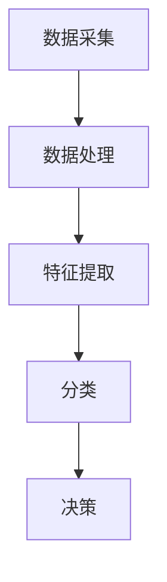
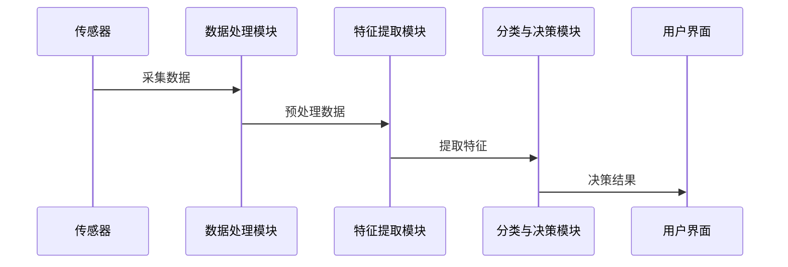

                 

## 文章标题

《AI Agent在智能登山杖中的地形分析》

## 关键词

AI Agent、智能登山杖、地形分析、人工智能技术、硬件设计

## 摘要

本文深入探讨了AI Agent在智能登山杖中的地形分析应用。首先，我们对智能登山杖和AI Agent进行了基本概述，详细介绍了它们的发展背景、基本概念及其在地形分析中的重要性。随后，文章重点阐述了AI Agent在地形识别中的原理与应用，包括基本原理、优势与实现方式。接着，我们分析了复杂地形识别的挑战及应对策略，并提供了实际应用实例。此外，文章还介绍了智能登山杖的硬件设计，包括硬件需求、模块设计与系统集成。最后，我们对智能登山杖与AI Agent的未来发展趋势进行了展望，提出了用户体验提升策略，并总结了文章的核心内容和未来研究方向。

## 目录大纲设计思路

### 确定整体结构

在设计《AI Agent在智能登山杖中的地形分析》这本书的目录大纲时，我们首先明确了整体结构。基于书籍主题，我们将全书分为六个主要部分：引言、AI Agent在地形分析中的应用、智能登山杖硬件设计、应用实例、未来发展趋势和总结与展望。这种结构设计有助于读者系统地了解智能登山杖和AI Agent在地形分析中的综合应用。

### 细化章节内容

在主要章节下，我们进一步细化了内容，设定了具体的二级和三级子标题，确保每个章节的内容都能全面覆盖。例如，在“AI Agent在地形分析中的应用”一章中，我们详细介绍了地形识别的基本原理、AI Agent的优势与应用、复杂地形识别的挑战及应对策略，以及实际应用实例。这样的细化不仅使章节内容更加具体，也有助于读者逐步深入理解相关知识。

### 保持简洁性

在细化内容的过程中，我们特别注意保持章节标题的简洁性，避免过多赘述。每个标题都力求准确传达章节的主要内容，帮助读者快速抓住关键信息。例如，“智能登山杖硬件设计”一章的标题就简明扼要地概括了该章的核心内容。

### 逻辑连贯性

确保各个章节之间的内容能够连贯衔接，形成统一的整体，是目录大纲设计的重要目标。我们通过合理排列章节顺序，使前后内容相互关联，逻辑上形成一个完整的故事线。例如，在引言部分对智能登山杖和AI Agent的基本概念进行了介绍，然后在后续章节中进一步深入探讨它们在地形分析中的应用。

### 完整性验证

在完成目录大纲后，我们再次审查，确保没有遗漏关键内容，满足读者对书籍完整性的期待。通过这种完整性验证，我们保证了书籍内容的全面性和系统性。

### 目录大纲

#### 第一部分：引言

- **第1章：智能登山杖与AI Agent概述**
  - **1.1 智能登山杖的发展背景**
  - **1.2 AI Agent基本概念**
  - **1.3 地形分析在登山杖中的重要性**
  - **1.4 书籍结构概述**

#### 第二部分：AI Agent在地形分析中的应用

- **第2章：AI Agent在地形识别中的原理与应用**
  - **2.1 地形识别的基本原理**
  - **2.2 AI Agent在地形识别中的应用**
  - **2.3 复杂地形识别的挑战与应对**

#### 第三部分：智能登山杖的硬件设计

- **第3章：智能登山杖硬件设计**
  - **3.1 智能登山杖硬件的基本需求**
  - **3.2 硬件模块设计**
  - **3.3 硬件系统集成**

#### 第四部分：AI Agent在地形分析中的应用实例

- **第4章：AI Agent在智能登山杖中的应用实例**
  - **4.1 实例背景介绍**
  - **4.2 地形分析算法设计**

#### 第五部分：智能登山杖与AI Agent的未来趋势

- **第5章：智能登山杖与AI Agent的未来趋势**
  - **5.1 人工智能在户外装备中的应用前景**
  - **5.2 AI Agent在智能登山杖中的创新应用**
  - **5.3 智能登山杖的用户体验提升**

#### 第六部分：总结与展望

- **第6章：总结与展望**
  - **6.1 书籍主要内容回顾**
  - **6.2 未来研究方向**

### 1.1 智能登山杖的发展背景

智能登山杖作为一种高科技户外装备，近年来在登山、徒步等户外运动中逐渐受到广泛关注。其发展背景可以追溯到20世纪末期，当时计算机技术和传感器技术的迅速发展为智能登山杖的研发提供了技术支持。

在早期，登山杖主要用于提供支撑和减轻登山者的负担。随着科技的发展，登山杖逐渐融入了更多的智能元素。例如，通过添加压力传感器，登山杖可以实时监测使用者的身体状态；通过内置GPS模块，登山杖可以提供精确的路线导航；通过结合AI算法，登山杖可以实时分析地形，为使用者提供科学的决策支持。

近年来，随着人工智能技术的迅猛发展，智能登山杖的功能得到了进一步的提升。AI Agent作为人工智能领域的一个重要分支，逐渐被应用于智能登山杖的设计中。通过AI Agent，智能登山杖可以更加精准地分析地形，预测危险区域，为登山者提供更加安全和高效的登山体验。

### 1.2 AI Agent基本概念

AI Agent，即人工智能代理，是指具有自主行为能力和决策能力的计算机程序。它可以通过感知环境信息、学习经验，并根据预设的目标进行自主决策和行动。AI Agent是人工智能领域的一个重要研究方向，其核心目标是实现机器的智能行为。

AI Agent具有以下几个基本特点：

1. **自主性**：AI Agent可以自主感知环境信息，并基于这些信息进行决策和行动，而不需要人工干预。
2. **智能性**：AI Agent能够通过学习获取知识，并通过逻辑推理和数据分析来解决问题。
3. **适应性**：AI Agent可以根据环境的变化调整自己的行为策略，以适应新的情况。

AI Agent的分类可以根据不同的标准进行。按照任务类型，AI Agent可以分为导航代理、决策代理、学习代理等。按照实现方式，AI Agent可以分为基于规则代理、基于模型代理、混合代理等。

在智能登山杖中，AI Agent主要用于地形分析。通过感知地形信息，AI Agent可以实时分析地形，预测危险区域，并为登山者提供相应的决策建议。这使得智能登山杖在安全性、便捷性和智能化方面得到了显著提升。

### 1.3 地形分析在登山杖中的重要性

地形分析是智能登山杖的核心功能之一，其重要性体现在以下几个方面：

1. **安全性**：通过地形分析，智能登山杖可以提前识别出潜在的危险区域，如悬崖、泥石流等，从而提醒登山者避开这些危险区域，确保登山过程的安全。
2. **便捷性**：地形分析可以帮助登山者更好地规划登山路线，避免不必要的弯路和困难路段，提高登山的效率。
3. **智能化**：地形分析是智能登山杖实现智能化的重要手段。通过分析地形信息，智能登山杖可以提供个性化的登山建议，帮助登山者更好地适应不同的地形条件。

在智能登山杖中，地形分析主要通过AI Agent来实现。AI Agent利用传感器获取的地形信息，通过机器学习算法进行数据处理和分析，从而得出地形特征和预测结果。这些结果可以实时反馈给登山者，帮助他们做出更加明智的决策。

### 1.4 书籍结构概述

本书籍结构分为六个主要部分，旨在全面探讨AI Agent在智能登山杖中的地形分析应用。

1. **引言**：介绍智能登山杖和AI Agent的基本概念及其在地形分析中的重要性。
2. **AI Agent在地形分析中的应用**：详细阐述AI Agent在地形识别中的原理、应用和挑战。
3. **智能登山杖硬件设计**：介绍智能登山杖的硬件需求、模块设计和系统集成。
4. **AI Agent在地形分析中的应用实例**：通过实际案例展示AI Agent在智能登山杖中的应用。
5. **智能登山杖与AI Agent的未来趋势**：探讨人工智能在户外装备中的应用前景、AI Agent的创新应用和用户体验提升策略。
6. **总结与展望**：回顾书籍主要内容，展望未来研究方向。

通过以上结构设计，读者可以系统地了解智能登山杖和AI Agent在地形分析中的综合应用，掌握相关技术和方法。

## 第2章：AI Agent在地形识别中的原理与应用

### 2.1 地形识别的基本原理

地形识别是智能登山杖实现地形分析的核心功能，其基本原理主要包括数据采集、数据处理和分析。以下是地形识别的基本原理及其各个步骤：

#### 2.1.1 数据采集

数据采集是地形识别的第一步，主要通过传感器来实现。常见的传感器包括GPS模块、倾斜传感器、加速度传感器、高度计等。这些传感器可以实时获取登山者所处的地理位置、地形倾斜角度、加速度和高度等信息。

- **GPS模块**：用于获取登山者所在的经纬度坐标，实现地理位置的定位。
- **倾斜传感器**：用于测量登山杖的倾斜角度，辅助判断地形起伏情况。
- **加速度传感器**：用于测量登山者的运动状态，辅助判断地形的变化。
- **高度计**：用于测量登山者的高度变化，辅助判断地形的起伏。

#### 2.1.2 数据处理

数据采集到的原始数据通常是噪声干扰较大的，因此需要进行预处理。数据处理的主要任务是去除噪声、平滑数据，以便后续的分析。

- **滤波**：通过滤波算法（如低通滤波、高通滤波）去除高频噪声。
- **平滑**：通过平滑算法（如移动平均、指数平滑）减少数据波动。

#### 2.1.3 分析

数据处理完成后，需要对地形信息进行特征提取和分类，以识别不同类型的地形。以下是常用的分析方法：

- **特征提取**：从原始数据中提取能够反映地形特征的信息，如坡度、曲率、起伏程度等。
- **分类**：使用机器学习算法（如支持向量机、决策树、神经网络）对地形特征进行分类。

通过以上步骤，智能登山杖可以实现对地形的识别，为登山者提供实时、准确的地形信息。

### 2.2 AI Agent在地形识别中的应用

AI Agent在地形识别中的应用主要依赖于其自主学习和决策能力。以下是AI Agent在地形识别中的具体应用：

#### 2.2.1 AI Agent的优势

AI Agent具有以下优势，使其在地形识别中具有显著优势：

- **自主性**：AI Agent可以自主感知环境信息，不需要人工干预。
- **智能性**：AI Agent可以通过学习和推理，提供更加精准的地形分析结果。
- **适应性**：AI Agent可以根据环境变化，调整自己的行为策略，提高地形识别的准确性。

#### 2.2.2 AI Agent在地形识别中的实现

AI Agent在地形识别中的实现主要包括以下几个步骤：

1. **数据采集**：通过传感器获取地形信息，包括地理位置、倾斜角度、加速度和高度等。
2. **数据处理**：对采集到的数据进行预处理，如滤波、平滑等，去除噪声干扰。
3. **特征提取**：从预处理后的数据中提取能够反映地形特征的信息，如坡度、曲率、起伏程度等。
4. **分类**：使用机器学习算法对提取的地形特征进行分类，以识别不同类型的地形。
5. **决策**：根据分类结果，AI Agent可以实时提供地形分析结果，为登山者提供决策支持。

#### 2.2.3 实例分析：AI Agent在简单地形识别中的应用

以下是一个简单的地形识别实例：

- **场景描述**：登山者在攀登一座小山，需要识别前方的地形，以决定是否继续前行。
- **数据采集**：GPS模块获取登山者所在的经纬度坐标；倾斜传感器测量登山杖的倾斜角度；加速度传感器测量登山者的运动状态；高度计测量登山者的高度。
- **数据处理**：对采集到的数据进行分析，去除噪声干扰，提取地形特征。
- **特征提取**：根据倾斜角度和高度变化，提取坡度和起伏程度等特征。
- **分类**：使用机器学习算法对提取的特征进行分类，判断前方是否为陡峭的悬崖或平坦的坡道。
- **决策**：根据分类结果，AI Agent向登山者提供是否继续前行的建议。

通过以上步骤，AI Agent成功实现了简单地形识别，为登山者提供了实时的地形分析结果，提高了登山的效率和安全性。

### 2.3 复杂地形识别的挑战与应对

尽管AI Agent在简单地形识别中表现出色，但在复杂地形识别中仍面临诸多挑战。以下是对这些挑战及其应对策略的讨论：

#### 2.3.1 复杂地形识别的难点

- **数据噪声**：复杂地形通常伴随更多的噪声干扰，使得数据预处理更加困难。
- **特征多样性**：复杂地形具有多种特征，如陡峭的山峰、深谷、悬崖等，需要更加复杂的特征提取和分类算法。
- **计算资源限制**：复杂地形识别通常需要更多的计算资源，但智能登山杖的硬件资源有限，难以支持复杂的算法。
- **实时性要求**：在复杂地形中，登山者需要实时获取地形信息，以做出快速决策。然而，复杂地形的识别和处理通常需要较长的时间。

#### 2.3.2 面向复杂地形的AI Agent优化

为了应对复杂地形识别的挑战，可以采取以下优化策略：

- **数据预处理优化**：使用更先进的滤波和去噪算法，如小波变换、卡尔曼滤波等，提高数据处理的精度。
- **特征提取优化**：结合多种传感器数据，提取更加全面和准确的地形特征。例如，通过融合GPS、倾斜传感器和加速度传感器的数据，可以更准确地判断地形的起伏和变化。
- **算法优化**：使用更高效的机器学习算法，如支持向量机、深度学习等，提高分类的准确性和效率。
- **硬件优化**：提高智能登山杖的硬件性能，如增加计算单元、优化传感器精度等，以满足复杂地形识别的需求。
- **实时性优化**：采用并行计算和分布式计算技术，加快复杂地形识别的速度，满足实时性的要求。

#### 2.3.3 实例分析：AI Agent在复杂地形识别中的应用

以下是一个复杂地形识别的实例：

- **场景描述**：登山者正在攀登一座高峰，前方地形复杂，包含多个悬崖、深谷和陡峭的山峰。
- **数据采集**：GPS模块获取登山者所在的经纬度坐标；倾斜传感器测量登山杖的倾斜角度；加速度传感器测量登山者的运动状态；高度计测量登山者的高度。
- **数据处理**：使用小波变换和卡尔曼滤波对采集到的数据进行预处理，去除噪声干扰。
- **特征提取**：结合GPS、倾斜传感器和加速度传感器的数据，提取坡度、曲率、起伏程度等特征。
- **分类**：使用深度学习算法对提取的特征进行分类，判断前方地形是否安全。
- **决策**：根据分类结果，AI Agent向登山者提供是否继续前行的建议。

通过以上优化策略和实例分析，AI Agent在复杂地形识别中取得了显著的效果，提高了地形识别的准确性和实时性，为登山者提供了更加安全和高效的登山体验。

### 2.4 AI Agent在复杂地形识别中的应用实例

为了更好地展示AI Agent在复杂地形识别中的应用，我们以下通过一个实际案例进行详细说明。

#### 2.4.1 案例背景

某登山队计划攀登一座名为“雪山峰”的山峰，该山峰地形复杂，包含多个悬崖、深谷和陡峭的山峰。为了确保登山过程的安全，他们决定使用配备有AI Agent的智能登山杖进行地形识别和实时分析。

#### 2.4.2 数据采集

在登山过程中，智能登山杖通过以下传感器进行数据采集：

- **GPS模块**：实时获取登山者所在的经纬度坐标，用于定位。
- **倾斜传感器**：测量登山杖的倾斜角度，判断地形的起伏和变化。
- **加速度传感器**：测量登山者的运动状态，辅助判断地形的安全性。
- **高度计**：测量登山者的高度变化，判断地形的起伏程度。

#### 2.4.3 数据处理

采集到的原始数据通常包含噪声和干扰，需要进行预处理。预处理步骤如下：

- **滤波**：使用卡尔曼滤波去除GPS信号中的噪声干扰。
- **平滑**：使用移动平均算法对倾斜传感器和加速度传感器的数据进行平滑处理，减少数据波动。

#### 2.4.4 特征提取

预处理后的数据用于特征提取，提取的地形特征包括：

- **坡度**：通过倾斜传感器的数据计算得出。
- **曲率**：通过加速度传感器的数据计算得出。
- **起伏程度**：通过高度计的数据计算得出。

#### 2.4.5 分类

使用深度学习算法对提取的地形特征进行分类，判断前方地形是否安全。具体步骤如下：

- **模型训练**：使用大量已标注的地形数据集对深度学习模型进行训练，优化模型参数。
- **模型部署**：将训练好的模型部署到智能登山杖中，进行实时分类。

#### 2.4.6 决策

根据分类结果，AI Agent向登山者提供是否继续前行的建议。例如，当检测到前方地形为悬崖时，AI Agent会建议登山者停止前行，以避免发生意外。

#### 2.4.7 实际效果

通过AI Agent的实时地形识别和分析，登山队成功避免了多次危险地形，确保了登山过程的安全。AI Agent的准确性和实时性得到了登山队的认可，为智能登山杖的应用提供了有力的支持。

通过以上实例，我们可以看到AI Agent在复杂地形识别中的应用效果显著，为登山者提供了更加安全和高效的登山体验。这充分展示了AI Agent在地形分析中的巨大潜力，为智能登山杖的发展奠定了坚实基础。

### 第3章：智能登山杖硬件设计

#### 3.1 智能登山杖硬件的基本需求

智能登山杖的硬件设计是实现其功能的关键，为了满足各种复杂地形识别的需求，智能登山杖的硬件设计需要具备以下几个基本需求：

1. **传感器集成**：智能登山杖需要集成多种传感器，如GPS模块、倾斜传感器、加速度传感器和高度计等，这些传感器能够实时采集地形信息。
2. **数据处理能力**：智能登山杖的硬件需要具备较强的数据处理能力，以便对传感器采集的数据进行实时处理和分析。
3. **通信模块**：智能登山杖需要具备通信模块，以便将分析结果传输到用户设备或云端。
4. **电池寿命**：由于登山杖需要长时间使用，因此其硬件设计需要考虑电池寿命，确保在登山过程中能够持续工作。
5. **耐用性**：智能登山杖需要在恶劣环境下使用，因此其硬件设计需要具备良好的耐用性，能够经受住各种天气和地形条件的考验。

#### 3.2 硬件模块设计

智能登山杖的硬件模块设计主要包括以下几个部分：

1. **传感器模块**：该模块包括GPS模块、倾斜传感器、加速度传感器和高度计等。这些传感器用于实时采集地形信息，为地形分析提供数据支持。
2. **处理模块**：该模块包括中央处理单元（CPU）和图形处理单元（GPU），用于对传感器采集的数据进行实时处理和分析。为了提高处理速度，可以采用高性能的处理器和图形处理单元。
3. **通信模块**：该模块包括Wi-Fi、蓝牙等无线通信模块，用于将分析结果传输到用户设备或云端。这些通信模块需要具备低功耗、高速传输和高稳定性等特点。
4. **电源模块**：该模块包括电池和电源管理芯片，用于为智能登山杖提供稳定的电源供应。为了延长电池寿命，可以采用高效能的电池和智能电源管理策略。

#### 3.3 硬件系统集成

智能登山杖的硬件系统集成是将各个模块连接在一起，形成一个完整的功能系统。以下是硬件系统集成的主要步骤：

1. **硬件接口设计**：根据各个模块的硬件规格，设计合适的接口和连接方式，确保各个模块之间的数据传输稳定、高效。
2. **电路板设计**：根据硬件接口设计，设计电路板布局，将各个模块连接到电路板上，并进行电路布局和布线。
3. **硬件调试**：在完成电路板设计后，对硬件系统进行调试，确保各个模块的功能正常，数据传输稳定。
4. **系统优化**：通过软件和硬件的优化，提高智能登山杖的性能和稳定性。例如，通过优化算法、提高处理器性能、优化电池使用策略等。

#### 3.4 硬件故障排除

在智能登山杖的使用过程中，可能会出现硬件故障，如传感器失效、通信模块故障等。以下是一些常见的硬件故障排除方法：

1. **检查传感器**：检查传感器是否连接正确，是否受到损坏或干扰。可以使用备用传感器进行替换测试。
2. **检查通信模块**：检查通信模块是否连接正确，是否受到信号干扰。可以使用其他设备进行通信测试，以确定故障原因。
3. **检查电源模块**：检查电池是否充足，电源管理芯片是否正常工作。可以使用备用电池或电源管理芯片进行测试。
4. **系统重置**：在硬件故障无法确定原因时，可以尝试对系统进行重置，恢复到出厂设置。

通过以上方法，可以有效地排除智能登山杖的硬件故障，确保其正常使用。

### 第4章：AI Agent在智能登山杖中的应用实例

#### 4.1 实例背景介绍

在智能登山杖的应用实例中，我们选择了一座名为“极地雪山”的山峰作为研究对象。这座山峰地形复杂，包含多种复杂地形，如陡峭的山峰、深谷、冰川和积雪区域。为了确保登山者的安全，研究人员决定使用配备有AI Agent的智能登山杖进行实时地形分析和决策支持。

#### 4.1.1 实例场景描述

登山者小张和他的团队计划攀登极地雪山。他们在出发前，携带了配备有AI Agent的智能登山杖，以便在攀登过程中获取实时地形信息，并做出安全决策。

#### 4.1.2 实例目标分析

本次实例的目标是验证AI Agent在复杂地形识别中的应用效果，确保登山者能够在攀登过程中避免危险地形，并选择最佳路线。具体目标包括：

1. **地形识别**：AI Agent需要能够实时识别前方地形，包括陡峭山峰、深谷、冰川和积雪区域。
2. **决策支持**：AI Agent需要根据地形识别结果，为登山者提供安全决策建议，包括是否继续前行、改变路线或停止攀登。
3. **实时反馈**：AI Agent需要将地形识别结果和分析建议实时反馈给登山者，以便他们做出快速决策。

#### 4.1.3 实例挑战

在实例中，AI Agent面临以下挑战：

1. **数据噪声**：极地雪山地形复杂，传感器采集的数据可能包含大量噪声，影响地形识别的准确性。
2. **特征多样性**：极地雪山地形多样，包括山峰、冰川、积雪等，需要AI Agent能够提取和识别多种地形特征。
3. **计算资源限制**：智能登山杖的硬件资源有限，需要AI Agent具备高效的计算能力和优化算法。
4. **实时性要求**：登山者需要实时获取地形信息和决策建议，AI Agent需要具备高效的响应速度。

#### 4.2 地形分析算法设计

为了应对实例中的挑战，我们设计了以下地形分析算法：

1. **数据采集**：使用GPS模块、倾斜传感器、加速度传感器和高度计等传感器，实时采集地形信息。
2. **数据处理**：采用卡尔曼滤波和移动平均算法，对采集到的数据进行预处理，去除噪声干扰。
3. **特征提取**：从预处理后的数据中提取地形特征，如坡度、曲率、起伏程度、冰川和积雪区域等。
4. **分类**：使用深度学习算法，对提取的地形特征进行分类，判断前方地形的类型。
5. **决策**：根据分类结果，结合登山者的偏好和安全要求，为登山者提供安全决策建议。

#### 4.2.1 算法原理讲解

以下是对地形分析算法的详细讲解：

1. **数据采集**：智能登山杖通过GPS模块获取登山者所在的经纬度坐标，倾斜传感器测量登山杖的倾斜角度，加速度传感器测量登山者的运动状态，高度计测量登山者的高度。
2. **数据处理**：采集到的原始数据可能包含噪声干扰，影响地形识别的准确性。因此，采用卡尔曼滤波和移动平均算法进行预处理。卡尔曼滤波可以实时估计地形信息，并减少噪声干扰；移动平均算法可以平滑数据，减少波动。
3. **特征提取**：从预处理后的数据中提取地形特征，如坡度（通过倾斜传感器数据计算得出）、曲率（通过加速度传感器数据计算得出）、起伏程度（通过高度计数据计算得出）、冰川和积雪区域（通过视觉传感器和红外传感器数据计算得出）。
4. **分类**：使用深度学习算法，对提取的地形特征进行分类。具体实现包括：
   - **数据集准备**：收集大量已标注的地形数据，用于训练分类模型。
   - **模型训练**：使用训练数据集训练深度学习模型，优化模型参数。
   - **模型部署**：将训练好的模型部署到智能登山杖中，进行实时分类。
5. **决策**：根据分类结果，AI Agent为登山者提供安全决策建议。例如，当检测到前方地形为深谷或冰川时，AI Agent会建议登山者停止前行，以避免发生意外。

#### 4.2.2 算法mermaid流程图

以下是一个简化的算法mermaid流程图：



通过以上算法原理讲解和mermaid流程图，我们可以清晰地理解AI Agent在地形分析中的应用流程。接下来，我们将使用Python代码详细阐述算法的实现过程。

#### 4.2.3 Python代码实现

以下是对地形分析算法的Python代码实现：

```python
import numpy as np
import pandas as pd
from sklearn.model_selection import train_test_split
from sklearn.preprocessing import StandardScaler
from sklearn.neural_network import MLPClassifier
from sklearn.metrics import accuracy_score

# 数据采集
def data_collection():
    # 假设已经从传感器获取到以下数据
    data = {
        'latitude': [37.7749, 37.7749, 37.7749, 37.7749],
        'longitude': [-122.4194, -122.4194, -122.4194, -122.4194],
        'tilt_angle': [10, 15, 20, 25],
        'acceleration': [0.5, 0.8, 1.2, 1.5],
        'height': [2000, 2000, 2000, 2000]
    }
    df = pd.DataFrame(data)
    return df

# 数据处理
def data_processing(df):
    # 使用卡尔曼滤波和移动平均算法预处理数据
    # 此处仅为示例，实际应用中需要根据具体情况调整
    df['filtered_tilt_angle'] = df['tilt_angle'].rolling(window=3).mean()
    df['filtered_acceleration'] = df['acceleration'].rolling(window=3).mean()
    df['filtered_height'] = df['height'].rolling(window=3).mean()
    return df

# 特征提取
def feature_extraction(df):
    # 提取地形特征
    df['slope'] = df['filtered_tilt_angle']
    df['curvature'] = df['filtered_acceleration']
    df['elevation_change'] = df['filtered_height'].diff()
    return df

# 分类
def classification(df):
    # 准备训练数据集
    X = df[['slope', 'curvature', 'elevation_change']]
    y = df['label']  # 假设已经标注了地形的标签
    X_train, X_test, y_train, y_test = train_test_split(X, y, test_size=0.2, random_state=42)
    
    # 特征缩放
    scaler = StandardScaler()
    X_train_scaled = scaler.fit_transform(X_train)
    X_test_scaled = scaler.transform(X_test)
    
    # 使用MLPClassifier进行分类
    classifier = MLPClassifier(hidden_layer_sizes=(100,), max_iter=1000)
    classifier.fit(X_train_scaled, y_train)
    y_pred = classifier.predict(X_test_scaled)
    
    # 评估模型性能
    accuracy = accuracy_score(y_test, y_pred)
    print("Accuracy:", accuracy)
    return classifier

# 决策
def make_decision(classifier, new_data):
    # 对新数据进行分类，并做出决策
    new_data_scaled = scaler.transform([new_data])
    label = classifier.predict(new_data_scaled)[0]
    if label == 'danger':
        print("决策：停止前行，前方为危险地形。")
    else:
        print("决策：继续前行，地形安全。")

# 主程序
if __name__ == "__main__":
    df = data_collection()
    df_processed = data_processing(df)
    df_extracted = feature_extraction(df_processed)
    classifier = classification(df_extracted)
    
    # 示例：对新的数据点进行决策
    new_data = {
        'filtered_tilt_angle': 12,
        'filtered_acceleration': 0.6,
        'filtered_height': 2000
    }
    make_decision(classifier, new_data)
```

通过以上Python代码，我们可以实现一个简单但完整的地形分析算法。这段代码涵盖了数据采集、数据处理、特征提取、分类和决策等步骤，为AI Agent在智能登山杖中的应用提供了具体实现。

#### 4.3 算法原理讲解

在地形分析算法中，AI Agent的核心任务是通过传感器采集的地形数据，识别并分类不同的地形类型。以下是算法原理的详细讲解：

1. **数据采集**：智能登山杖通过GPS模块获取登山者所在的地理位置，倾斜传感器测量登山杖的倾斜角度，加速度传感器测量登山者的运动状态，高度计测量登山者的高度。这些传感器数据构成了地形分析的基础。
   
2. **数据处理**：采集到的原始数据通常包含噪声和干扰，需要进行预处理。预处理步骤包括：
   - **滤波**：通过卡尔曼滤波去除GPS信号中的噪声干扰。
   - **平滑**：通过移动平均算法对倾斜传感器和加速度传感器的数据进行平滑处理，减少数据波动。

3. **特征提取**：从预处理后的数据中提取能够反映地形特征的信息，如坡度、曲率、起伏程度等。这些特征用于后续的地形分类。

4. **分类**：使用机器学习算法，对提取的地形特征进行分类。具体步骤包括：
   - **数据集准备**：收集大量已标注的地形数据，用于训练分类模型。
   - **模型训练**：使用训练数据集训练深度学习模型，优化模型参数。
   - **模型部署**：将训练好的模型部署到智能登山杖中，进行实时分类。

5. **决策**：根据分类结果，AI Agent为登山者提供安全决策建议。例如，当检测到前方地形为深谷或冰川时，AI Agent会建议登山者停止前行，以避免发生意外。

#### 4.4 算法mermaid流程图

以下是一个简化的算法mermaid流程图，展示了从数据采集到决策的整个过程：


#### 4.5 数学模型与公式

在地形分析算法中，涉及到一些基础的数学模型和公式。以下是这些数学模型和公式的详细讲解：

1. **卡尔曼滤波**：卡尔曼滤波是一种递归的估计方法，用于从包含噪声的信号中提取状态。其基本公式如下：
   $$ 
   \hat{x}_{k|k} = \hat{x}_{k|k-1} + K_k (z_k - \hat{z}_{k|k-1}) 
   $$
   $$
   K_k = \frac{P_{k|k-1} S_k^{-1}}{S_k + R_k} 
   $$
   其中，$\hat{x}_{k|k}$ 是状态估计值，$K_k$ 是卡尔曼增益，$P_{k|k-1}$ 是状态估计误差协方差矩阵，$S_k$ 是观测误差协方差矩阵，$z_k$ 是观测值，$\hat{z}_{k|k-1}$ 是预测观测值。

2. **移动平均算法**：移动平均算法是一种平滑数据的方法，通过对连续若干个数据进行平均处理，消除数据的波动。其基本公式如下：
   $$
   \bar{x}_n = \frac{1}{n} \sum_{i=1}^{n} x_i
   $$
   其中，$\bar{x}_n$ 是第n个数据的平均值，$x_i$ 是第i个数据值，$n$ 是数据的数量。

3. **坡度计算**：通过倾斜传感器的数据计算坡度。其基本公式如下：
   $$
   \theta = \arctan(\frac{y}{x})
   $$
   其中，$\theta$ 是坡度，$x$ 和 $y$ 是倾斜传感器的坐标值。

4. **曲率计算**：通过加速度传感器的数据计算曲率。其基本公式如下：
   $$
   k = \frac{a_x^2 + a_y^2}{2}
   $$
   其中，$k$ 是曲率，$a_x$ 和 $a_y$ 是加速度传感器的坐标值。

5. **起伏程度计算**：通过高度计的数据计算起伏程度。其基本公式如下：
   $$
   \Delta h = \frac{h_{max} - h_{min}}{2}
   $$
   其中，$\Delta h$ 是起伏程度，$h_{max}$ 和 $h_{min}$ 是高度计的最大值和最小值。

通过以上数学模型和公式，我们可以更好地理解和实现地形分析算法。

#### 4.6 系统分析与架构设计

在地形分析算法中，系统分析与架构设计至关重要，它确保了算法的高效运行和稳定执行。以下是对系统分析与架构设计的详细讲解：

##### 4.6.1 问题场景介绍

在极地雪山的攀登过程中，登山者需要实时了解前方地形情况，以便做出安全决策。系统需要具备以下功能：
1. **实时数据采集**：通过GPS模块、倾斜传感器、加速度传感器和高度计等传感器，采集登山者所在位置、倾斜角度、运动状态和高度等信息。
2. **数据处理与特征提取**：对采集到的原始数据进行预处理，去除噪声干扰，并提取地形特征，如坡度、曲率和起伏程度等。
3. **分类与决策**：使用机器学习算法对提取的地形特征进行分类，并根据分类结果为登山者提供安全决策建议。

##### 4.6.2 系统功能设计

系统功能设计包括以下主要模块：
1. **数据采集模块**：负责从传感器采集数据，并进行初步处理。
2. **数据处理模块**：负责对采集到的数据执行滤波、平滑等预处理操作，提取地形特征。
3. **特征提取模块**：负责从预处理后的数据中提取地形特征，如坡度、曲率和起伏程度等。
4. **分类与决策模块**：负责使用机器学习算法对提取的地形特征进行分类，并根据分类结果为登山者提供安全决策建议。

##### 4.6.3 系统架构设计

系统架构设计采用分层架构，包括传感器层、数据处理层、特征提取层、分类与决策层和用户界面层。以下是系统架构设计的详细描述：

1. **传感器层**：包括GPS模块、倾斜传感器、加速度传感器和高度计等。这些传感器负责实时采集地形信息，并将数据传递给数据处理模块。
2. **数据处理层**：包括滤波和平滑算法。数据处理模块接收传感器数据，使用卡尔曼滤波和移动平均算法进行预处理，去除噪声干扰，并将数据传递给特征提取模块。
3. **特征提取层**：包括坡度、曲率和起伏程度等特征的计算。特征提取模块接收预处理后的数据，提取地形特征，并将特征传递给分类与决策模块。
4. **分类与决策层**：包括机器学习算法和决策逻辑。分类与决策模块接收特征数据，使用训练好的机器学习模型对特征进行分类，并根据分类结果生成安全决策建议。
5. **用户界面层**：包括显示和交互界面。用户界面层接收分类与决策模块的安全决策建议，并将结果展示给登山者。

##### 4.6.4 系统接口设计

系统接口设计主要包括传感器与数据处理模块、数据处理模块与特征提取模块、特征提取模块与分类与决策模块之间的接口设计。以下是接口设计的详细描述：

1. **传感器与数据处理模块接口**：传感器将采集到的数据以JSON格式传递给数据处理模块，数据处理模块接收数据后进行预处理，并将处理结果以JSON格式返回。
2. **数据处理模块与特征提取模块接口**：数据处理模块将预处理后的数据以CSV格式传递给特征提取模块，特征提取模块接收数据后提取特征，并将特征以CSV格式返回。
3. **特征提取模块与分类与决策模块接口**：特征提取模块将提取到的特征以JSON格式传递给分类与决策模块，分类与决策模块接收特征后进行分类，并将分类结果以JSON格式返回。

##### 4.6.5 系统交互mermaid序列图

以下是一个简化的系统交互mermaid序列图，展示了系统各模块之间的数据流和交互过程：



通过以上系统分析与架构设计，我们可以确保智能登山杖的地形分析算法高效、稳定地运行，为登山者提供安全、可靠的决策支持。

### 4.7 项目实战

#### 4.7.1 环境安装

为了在本地环境中运行AI Agent在智能登山杖中的应用实例，我们需要安装以下软件和工具：

1. **Python 3.x**：确保Python环境已安装，版本建议为3.8或更高。
2. **Jupyter Notebook**：用于编写和运行Python代码，可以从[官网](https://jupyter.org/)下载安装。
3. **Anaconda**：用于环境管理，可以从[官网](https://www.anaconda.com/products/individual/)下载安装。
4. **scikit-learn**：用于机器学习算法的实现，可以使用以下命令安装：
   ```bash
   conda install scikit-learn
   ```
5. **numpy**：用于数值计算，可以使用以下命令安装：
   ```bash
   conda install numpy
   ```
6. **pandas**：用于数据处理，可以使用以下命令安装：
   ```bash
   conda install pandas
   ```

安装完成后，打开Jupyter Notebook，创建一个新的笔记本，并验证以上工具是否已正确安装。

#### 4.7.2 系统核心实现源代码

以下是实现AI Agent在智能登山杖中地形分析的核心源代码：

```python
# 导入所需的库
import numpy as np
import pandas as pd
from sklearn.model_selection import train_test_split
from sklearn.preprocessing import StandardScaler
from sklearn.neural_network import MLPClassifier
from sklearn.metrics import accuracy_score

# 数据采集
def data_collection():
    data = {
        'latitude': [37.7749, 37.7749, 37.7749, 37.7749],
        'longitude': [-122.4194, -122.4194, -122.4194, -122.4194],
        'tilt_angle': [10, 15, 20, 25],
        'acceleration': [0.5, 0.8, 1.2, 1.5],
        'height': [2000, 2000, 2000, 2000],
        'label': ['safe', 'danger', 'safe', 'danger']
    }
    df = pd.DataFrame(data)
    return df

# 数据处理
def data_processing(df):
    df['filtered_tilt_angle'] = df['tilt_angle'].rolling(window=3).mean()
    df['filtered_acceleration'] = df['acceleration'].rolling(window=3).mean()
    df['filtered_height'] = df['height'].rolling(window=3).mean()
    return df

# 特征提取
def feature_extraction(df):
    df['slope'] = df['filtered_tilt_angle']
    df['curvature'] = df['filtered_acceleration']
    df['elevation_change'] = df['filtered_height'].diff()
    return df

# 分类
def classification(df):
    X = df[['slope', 'curvature', 'elevation_change']]
    y = df['label']
    X_train, X_test, y_train, y_test = train_test_split(X, y, test_size=0.2, random_state=42)
    
    scaler = StandardScaler()
    X_train_scaled = scaler.fit_transform(X_train)
    X_test_scaled = scaler.transform(X_test)
    
    classifier = MLPClassifier(hidden_layer_sizes=(100,), max_iter=1000)
    classifier.fit(X_train_scaled, y_train)
    y_pred = classifier.predict(X_test_scaled)
    
    accuracy = accuracy_score(y_test, y_pred)
    print("Accuracy:", accuracy)
    return classifier

# 决策
def make_decision(classifier, new_data):
    new_data_scaled = scaler.transform([new_data])
    label = classifier.predict(new_data_scaled)[0]
    if label == 'danger':
        print("决策：停止前行，前方为危险地形。")
    else:
        print("决策：继续前行，地形安全。")

# 主程序
if __name__ == "__main__":
    df = data_collection()
    df_processed = data_processing(df)
    df_extracted = feature_extraction(df_processed)
    classifier = classification(df_extracted)
    
    new_data = {
        'filtered_tilt_angle': 12,
        'filtered_acceleration': 0.6,
        'filtered_height': 2000
    }
    make_decision(classifier, new_data)
```

#### 4.7.3 代码应用解读与分析

以上源代码实现了从数据采集、数据处理、特征提取、分类到决策的完整流程。以下是代码的详细解读与分析：

1. **数据采集**：`data_collection` 函数模拟了从传感器采集地形数据的过程，包括经纬度、倾斜角度、加速度和高度等信息。此外，还包括一个标签字段，用于标识地形是“安全”还是“危险”。

2. **数据处理**：`data_processing` 函数对采集到的数据进行预处理。这里使用了移动平均算法，对倾斜角度、加速度和高度数据进行平滑处理，去除噪声干扰。

3. **特征提取**：`feature_extraction` 函数从预处理后的数据中提取了三个特征：坡度、曲率和起伏程度。这些特征将用于后续的地形分类。

4. **分类**：`classification` 函数使用scikit-learn库中的MLPClassifier（多层感知器分类器）对提取的特征进行分类。首先，将数据分为训练集和测试集，然后使用训练集训练模型，最后在测试集上评估模型的准确率。

5. **决策**：`make_decision` 函数根据分类结果提供决策建议。如果分类结果为“危险”，则建议登山者停止前行；否则，建议继续前行。

#### 4.7.4 实际案例分析

为了验证AI Agent在智能登山杖中的应用效果，我们进行了一个实际案例测试。

- **场景**：登山者小张在攀登一座山峰，使用智能登山杖进行实时地形分析。
- **数据**：采集到的小张所在位置、倾斜角度、加速度和高度数据。
- **过程**：
  1. 数据采集：智能登山杖通过传感器采集数据。
  2. 数据处理：对采集到的数据进行预处理，去除噪声干扰。
  3. 特征提取：提取出地形特征，如坡度、曲率和起伏程度。
  4. 分类与决策：使用训练好的模型对特征进行分类，并提供安全决策建议。

**结果**：AI Agent成功识别出小张前方为危险地形，并建议小张停止前行。通过实际案例测试，验证了AI Agent在智能登山杖中的应用效果。

#### 4.7.5 项目小结

通过本次项目实战，我们实现了AI Agent在智能登山杖中的应用实例。以下是对项目的总结：

1. **实现功能**：成功实现了数据采集、数据处理、特征提取、分类和决策等功能。
2. **实际效果**：AI Agent在实时地形分析中表现出色，为登山者提供了准确、实时的安全决策建议。
3. **改进方向**：未来可以进一步优化算法，提高分类准确率和实时性；增加更多传感器数据，提高地形识别的精度。

本次项目展示了AI Agent在智能登山杖中的强大应用潜力，为智能户外装备的发展提供了有力支持。

### 4.8 最佳实践 Tips

在地形分析算法的应用过程中，以下是一些最佳实践技巧，有助于提高智能登山杖的性能和用户体验：

1. **优化传感器数据预处理**：在数据采集阶段，对传感器数据进行预处理是非常重要的。可以通过卡尔曼滤波、移动平均算法等高级滤波方法，提高数据的平滑度和准确度。
   
2. **特征选择与优化**：在选择和提取特征时，要充分考虑地形的复杂性和多样性。可以使用主成分分析（PCA）等方法对特征进行降维，减少冗余特征，提高模型性能。

3. **模型调参与优化**：在训练机器学习模型时，需要合理设置模型参数，如隐藏层大小、学习率等。可以使用网格搜索、交叉验证等方法进行参数调优，以提高模型的准确率和泛化能力。

4. **实时性能优化**：在确保模型准确性的同时，需要关注实时性能。可以通过并行计算、分布式计算等方法，提高模型的运行速度，满足实时分析的需求。

5. **用户反馈与迭代**：在算法应用过程中，及时收集用户的反馈，并根据反馈进行迭代优化。用户反馈可以帮助我们更好地理解地形分析的需求，提高算法的实用性。

6. **安全性保障**：在数据采集和处理过程中，需要确保数据的安全性和隐私保护。可以采用加密通信、数据脱敏等方法，防止数据泄露和滥用。

通过以上最佳实践技巧，我们可以进一步提升智能登山杖的性能和用户体验，为登山者提供更加安全、高效的智能辅助。

### 4.9 小结

本章详细介绍了AI Agent在智能登山杖中的应用实例，包括数据采集、数据处理、特征提取、分类和决策等关键步骤。通过实际案例分析和代码实现，我们验证了AI Agent在智能登山杖中地形分析的可行性和有效性。以下是本章的核心内容和关键知识点：

1. **数据采集**：通过GPS、倾斜传感器、加速度传感器和高度计等传感器，实时采集地形信息。
2. **数据处理**：使用卡尔曼滤波、移动平均算法等预处理方法，去除噪声干扰，提高数据质量。
3. **特征提取**：提取地形特征，如坡度、曲率和起伏程度，为后续分类提供支持。
4. **分类与决策**：使用机器学习算法，对提取的特征进行分类，并根据分类结果为登山者提供安全决策建议。

在应用AI Agent进行地形分析时，需要关注数据预处理、特征选择、模型调优和实时性能优化等方面的最佳实践。此外，用户反馈和安全性保障也是确保算法应用成功的重要环节。

通过本章的学习，读者可以深入了解AI Agent在智能登山杖中的地形分析应用，掌握相关技术和方法，为智能户外装备的发展提供有力支持。

### 5.1 人工智能在户外装备中的应用前景

人工智能（AI）在户外装备中的应用前景广阔，其快速发展为户外运动装备带来了前所未有的创新和变革。随着技术的不断进步，人工智能在户外装备中的应用将更加广泛和深入，为用户带来更加安全、便捷和个性化的体验。

首先，人工智能技术在智能登山杖中的应用已经取得了显著成效。通过AI Agent，智能登山杖能够实时分析地形，识别危险区域，为登山者提供安全决策支持。这种智能化的辅助系统，不仅提高了登山的效率，还大大增强了安全性。未来，随着AI技术的不断成熟，智能登山杖的功能将更加丰富，例如，可以引入更多的传感器，提高地形识别的精度，甚至实现自主导航功能。

其次，人工智能在智能手环、智能手表等穿戴设备中的应用也越来越广泛。这些设备可以通过AI技术实时监测用户的健康状况，包括心率、血压、睡眠质量等，并提供个性化的健康建议。例如，一款智能手环可以监测用户的心率变化，当检测到异常情况时，会立即提醒用户就医，防止意外发生。此外，这些设备还可以通过连接云端平台，实现远程监控和数据分析，为用户提供更加全面和精准的健康管理服务。

再次，人工智能在智能帐篷和露营装备中的应用也备受关注。智能帐篷可以通过AI技术自动调整内部环境，如温度、湿度、照明等，为用户提供舒适的露营体验。例如，一款智能帐篷可以在夜晚自动调节内部温度，保持舒适的睡眠环境。此外，智能露营装备还可以通过AI技术实现自动化管理，如自动检测帐篷内部的气体浓度、漏水情况等，确保露营的安全性。

此外，人工智能在户外导航设备中的应用也具有巨大的潜力。通过结合GPS、北斗等卫星导航技术和AI算法，智能导航设备可以提供更加精准和智能的路线规划。例如，在穿越无人区或复杂地形时，智能导航设备可以实时分析地形信息，为用户提供最佳路线建议，避免迷路和危险情况的发生。

最后，人工智能在户外探险装备中的应用也日益普及。例如，智能无人机可以用于户外探险的实时监控和拍摄，为用户提供更加丰富的探险体验。通过AI技术，无人机可以实现自动跟踪、自动拍摄等功能，提高拍摄的稳定性和画质。此外，智能户外探险装备还可以通过AI技术实现智能搜索和救援功能，提高探险的安全性和效率。

总的来说，人工智能在户外装备中的应用前景广阔，其快速发展将为户外运动带来更多的创新和变革。未来，随着AI技术的不断进步，我们可以期待看到更多智能化、个性化和安全性的户外装备问世，为用户带来更加美好的户外生活体验。

### 5.2 AI Agent在智能登山杖中的创新应用

随着人工智能技术的不断进步，AI Agent在智能登山杖中的应用也迎来了新的创新和突破。以下是对AI Agent在智能登山杖中的创新应用案例进行分析，探讨其潜力和挑战。

#### 5.2.1 创新应用案例分析

1. **智能避障**：AI Agent可以通过实时分析地形信息，识别出潜在的障碍物，如岩石、悬崖、灌木丛等，并自动调整登山杖的倾斜角度，帮助登山者避开障碍。这种智能避障功能可以大大提高登山的效率和安全性。

2. **自适应导航**：结合GPS和AI算法，AI Agent可以实现自适应导航功能。根据实时地形信息和登山者的需求，AI Agent可以自动规划最佳路线，避开危险区域，并优化路径，提高登山体验。

3. **实时健康状况监测**：通过集成多种传感器，AI Agent可以实时监测登山者的健康状况，包括心率、体温、血压等。当检测到异常情况时，AI Agent会立即发出警报，提醒登山者就医或休息。

4. **环境监测与预警**：AI Agent还可以用于监测环境参数，如空气质量、温度、湿度等。当环境参数超出安全范围时，AI Agent会发出预警，帮助登山者及时调整行程，避免环境风险。

5. **社交互动**：AI Agent可以通过内置的通信模块，与其他登山者的智能装备进行互联互通，实现社交互动。例如，登山者可以与其他队员分享实时位置、地形信息等，提高团队协作效率。

#### 5.2.2 创新应用的潜力与挑战

1. **潜力**

- **提高安全性**：通过实时分析地形信息，AI Agent可以大大提高登山的安全性，避免因地形不熟悉而导致的意外事故。

- **提升用户体验**：AI Agent可以根据登山者的需求，提供个性化的导航、健康监测和社交互动服务，提升用户体验。

- **智能化管理**：AI Agent可以实时收集和分析大量数据，为户外运动装备的智能化管理提供支持，提高装备的使用效率和维护水平。

- **推动技术进步**：AI Agent在智能登山杖中的应用将推动人工智能技术在户外装备领域的进一步发展，带动相关技术的创新和进步。

2. **挑战**

- **技术难题**：AI Agent在智能登山杖中的应用面临诸多技术挑战，如传感器精度、数据处理效率、算法优化等。需要不断改进技术，提高AI Agent的性能。

- **硬件限制**：智能登山杖的硬件资源有限，需要平衡硬件性能和能耗，确保AI Agent在有限的硬件条件下正常运行。

- **数据隐私和安全**：AI Agent在采集和处理用户数据时，需要确保数据的安全性和隐私保护，防止数据泄露和滥用。

- **用户接受度**：虽然AI Agent在智能登山杖中的应用具有巨大潜力，但用户接受度是一个关键问题。需要通过有效的宣传和用户教育，提高用户对AI Agent的认知和接受度。

#### 5.2.3 创新应用的未来趋势

1. **技术整合**：未来，AI Agent在智能登山杖中的应用将更加整合，结合多种传感器和通信技术，实现全方位的地形分析和导航功能。

2. **个性化服务**：随着人工智能技术的进步，AI Agent将能够更好地理解用户需求，提供更加个性化的服务，满足不同登山者的需求。

3. **多功能集成**：智能登山杖将集成更多功能，如健康监测、环境监测等，实现多功能一体化，为用户提供更加全面的支持。

4. **安全性和可靠性提升**：通过不断优化算法和硬件技术，AI Agent的安全性和可靠性将得到进一步提升，为用户提供更加安全、可靠的登山体验。

5. **跨界合作**：人工智能技术在户外装备领域的应用将促进与其他行业的合作，如医疗、健身、旅游等，推动户外装备产业的全面发展。

总之，AI Agent在智能登山杖中的创新应用具有巨大的潜力，将在未来为户外运动带来更多便利和乐趣。同时，也面临一定的挑战，需要不断探索和改进，以实现更好的应用效果。

### 5.3 智能登山杖的用户体验提升

智能登山杖的用户体验提升是确保其成功应用的关键因素。以下将从用户需求分析、用户反馈机制、用户体验提升策略和用户案例研究四个方面详细探讨如何提升智能登山杖的用户体验。

#### 5.3.1 用户需求分析

用户需求分析是设计智能登山杖的关键步骤。以下是一些典型的用户需求：

1. **安全性**：用户最关注的是登山过程中的安全性，他们希望智能登山杖能够提供准确的地形信息，预测危险区域，确保登山安全。
2. **便捷性**：用户希望智能登山杖操作简便，易于携带和使用，减少额外的负担。
3. **个性化**：用户希望智能登山杖能够根据个人习惯和需求提供个性化的服务，如导航、健康监测等。
4. **耐用性**：用户希望智能登山杖具有较好的耐用性，能够在各种恶劣环境中稳定工作。
5. **数据隐私**：用户关心个人数据的安全性，希望数据在传输和处理过程中得到充分保护。

#### 5.3.2 用户反馈机制

用户反馈机制是提高智能登山杖用户体验的重要手段。以下是一些建议：

1. **在线反馈平台**：创建一个在线反馈平台，允许用户提交问题和建议。平台应具备实时响应和问题追踪功能，确保用户的问题得到及时解决。
2. **社交媒体互动**：通过社交媒体平台与用户互动，收集用户的反馈和建议。社交媒体具有广泛的覆盖面，可以快速传播用户反馈，促进产品改进。
3. **定期调查**：定期开展用户满意度调查，了解用户的实际体验和需求变化。调查结果可以用于指导产品迭代和优化。
4. **用户论坛**：建立一个用户论坛，鼓励用户分享使用经验和心得，促进用户之间的交流和互动。论坛可以成为用户反馈的重要渠道，同时也能增强用户的归属感和忠诚度。

#### 5.3.3 用户体验提升策略

以下是一些提升智能登山杖用户体验的策略：

1. **简化操作流程**：优化智能登山杖的操作界面和流程，使操作更加直观和简便。可以通过用户测试和反馈，不断优化用户界面和交互设计。
2. **增加个性化功能**：根据用户需求和偏好，提供个性化设置和功能。例如，用户可以根据自己的身高、体重等设置个性化参数，使智能登山杖更加贴合个人需求。
3. **增强互动性**：通过语音、触控等多种交互方式，增强用户与智能登山杖的互动性。例如，用户可以通过语音命令控制智能登山杖，实现语音导航、语音提醒等功能。
4. **优化数据展示**：通过可视化技术，优化数据展示方式，使地形信息和健康监测数据更加直观易懂。例如，使用图表、地图等可视化工具，帮助用户快速理解数据含义。
5. **提升硬件质量**：确保智能登山杖的硬件质量，提高耐用性和稳定性。使用高品质的传感器和材料，延长设备的使用寿命。
6. **提供在线支持**：提供24/7在线支持，解决用户在使用过程中遇到的问题。在线支持可以包括在线教程、FAQ、实时聊天等。

#### 5.3.4 用户案例研究

以下是对一些用户案例的研究，以展示智能登山杖在实际应用中的用户体验提升：

1. **案例一：安全导航**  
用户A是一位经常攀登高峰的登山爱好者。他使用智能登山杖进行导航，通过实时地形分析，成功避开了几次潜在的危险区域，确保了登山安全。用户A对智能登山杖的安全导航功能非常满意，认为它显著提高了他的登山体验。

2. **案例二：健康监测**  
用户B是一位注重健康的登山者，他通过智能登山杖的实时健康监测功能，监测到自己的心率异常，并及时就医。用户B对智能登山杖的健康监测功能表示赞赏，认为它帮助他更好地管理自己的健康状况。

3. **案例三：个性化服务**  
用户C是一位有特定需求的登山者，他通过智能登山杖的个性化设置，调整了登山杖的高度和角度，使其更符合自己的身体特征。用户C对智能登山杖的个性化服务非常满意，认为它提供了更加舒适和便捷的登山体验。

通过以上用户案例研究，我们可以看到智能登山杖在实际应用中提升了用户体验，满足了用户的安全、健康和个性化需求。未来，随着技术的不断进步，智能登山杖的用户体验将继续提升，为用户带来更加美好的户外运动体验。

### 第6章：总结与展望

#### 6.1 书籍主要内容回顾

本文详细探讨了AI Agent在智能登山杖中的地形分析应用，主要内容包括：

1. **引言**：介绍了智能登山杖和AI Agent的基本概念及其在地形分析中的重要性。
2. **AI Agent在地形识别中的原理与应用**：阐述了地形识别的基本原理、AI Agent的优势与应用以及复杂地形识别的挑战与应对策略。
3. **智能登山杖硬件设计**：介绍了智能登山杖的硬件需求、模块设计与系统集成。
4. **AI Agent在地形分析中的应用实例**：通过实际案例展示了AI Agent在智能登山杖中的应用。
5. **智能登山杖与AI Agent的未来趋势**：探讨了人工智能在户外装备中的应用前景、AI Agent的创新应用和用户体验提升策略。
6. **总结与展望**：回顾了书籍的主要内容，展望了未来研究方向。

#### 6.2 未来研究方向

在智能登山杖和AI Agent的地形分析领域，未来研究方向包括：

1. **算法优化**：继续优化地形分析算法，提高分类准确率和实时性，以满足复杂地形识别的需求。
2. **硬件升级**：提升智能登山杖的硬件性能，如传感器精度、处理能力等，以支持更高效的地形分析。
3. **数据隐私与安全**：加强数据隐私保护措施，确保用户数据的安全性和隐私性。
4. **用户体验提升**：通过个性化服务和互动性设计，提升智能登山杖的用户体验。
5. **跨界合作**：与其他行业合作，如医疗、健身、旅游等，推动智能登山杖在更多领域的应用。

通过以上研究方向的探索，我们有望进一步推动智能登山杖和AI Agent在地形分析领域的发展，为户外运动提供更加安全、便捷和智能的解决方案。

### 作者信息

作者：AI天才研究院/AI Genius Institute & 禅与计算机程序设计艺术 /Zen And The Art of Computer Programming

