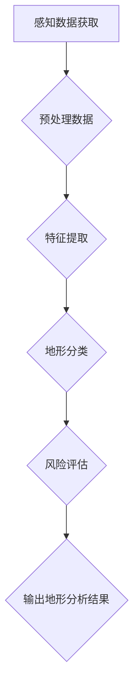
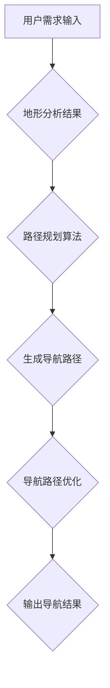
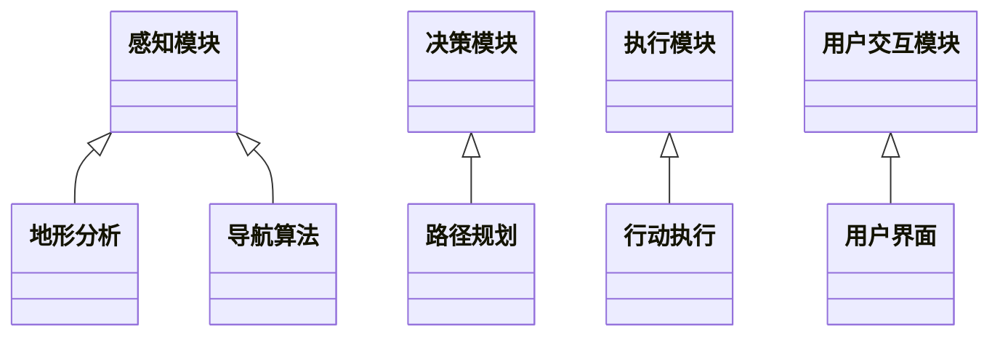
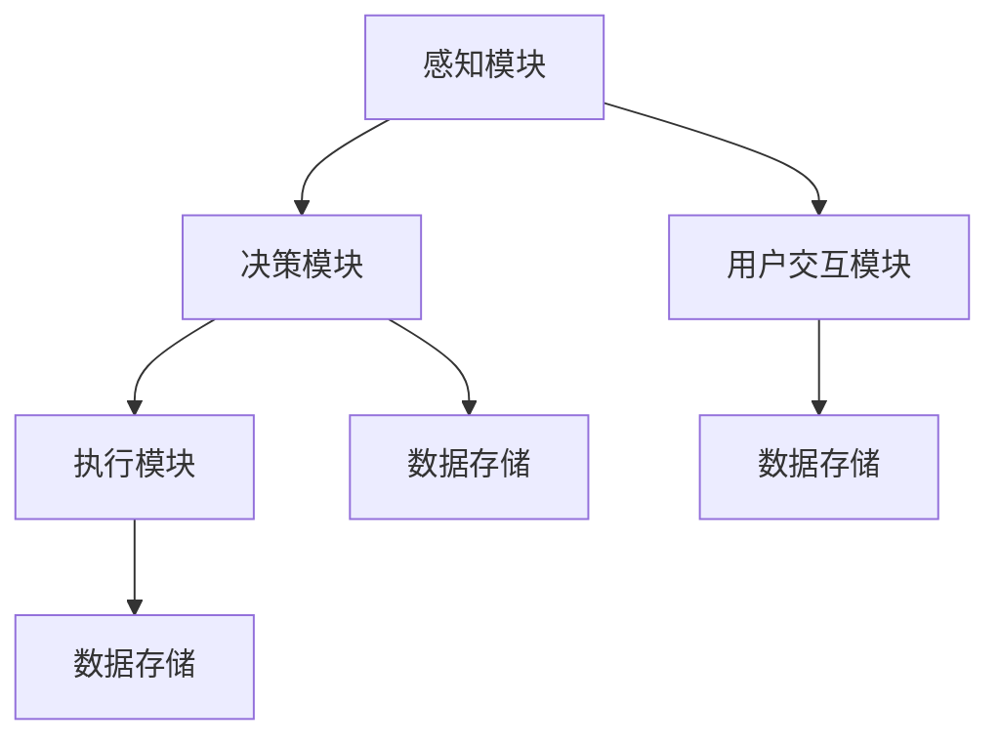
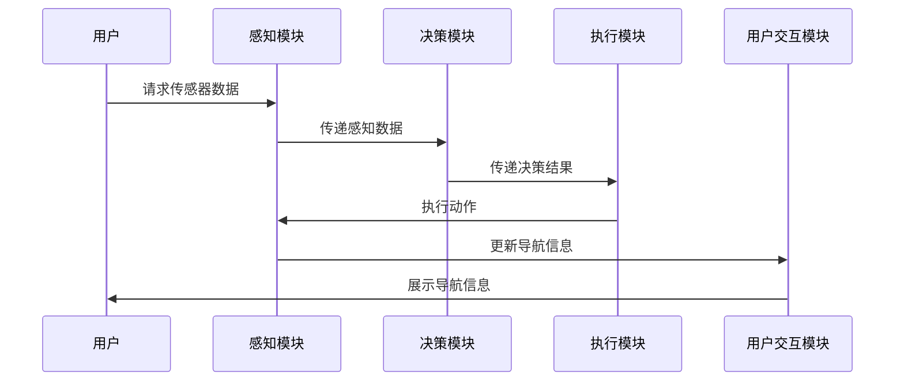

                 

### 第1章: 问题背景与核心概念

#### 1.1.1 问题背景

智能登山杖作为一种新兴的户外运动装备，正在逐渐改变传统登山的方式。它通过集成先进的传感器和AI技术，提供实时的地形分析和导航服务，帮助登山者更安全、更高效地完成登山任务。然而，这种转变并非一蹴而就，而是在一系列挑战中逐渐实现的。

**问题描述**:
登山杖需要面对的主要挑战包括地形分析、路径规划、实时导航、用户交互等多个方面。具体来说：
- **地形分析**: 需要准确判断周围的地形，识别出潜在的障碍和风险区域。
- **路径规划**: 根据地形分析和用户的导航需求，规划出最佳路径。
- **实时导航**: 在行进过程中，提供准确的导航信息，确保用户不会迷失方向。
- **用户交互**: 提供直观、易用的交互界面，让用户能够方便地设置导航参数和接收导航信息。

**问题解决**:
为了应对这些挑战，引入了AI Agent这一概念。AI Agent（人工智能代理）是一种能够自主执行任务的智能系统，它通过感知环境、做出决策和执行行动，来实现复杂任务。在智能登山杖中，AI Agent可以扮演以下几个角色：
- **感知环境**: 通过集成多种传感器（如GPS、加速度计、陀螺仪等），AI Agent可以实时获取周围环境的信息。
- **决策制定**: 根据感知到的环境数据和用户的导航需求，AI Agent可以自动制定行进路线。
- **行动执行**: 通过与执行模块（如电机、显示屏幕等）的配合，AI Agent可以控制登山杖进行相应的动作。

**边界与外延**:
AI Agent在智能登山杖中的应用范围主要集中在以下几个方面：
- **硬件集成**: 需要集成多种传感器和执行模块，以保证AI Agent的感知能力和执行能力。
- **数据处理**: 需要对感知数据进行实时处理，以快速响应环境变化。
- **用户交互**: 需要设计直观易用的用户界面，以方便用户与AI Agent进行交互。

**概念结构与核心要素组成**:
AI Agent的核心结构主要包括三个模块：感知模块、决策模块和执行模块。
- **感知模块**: 负责感知环境，获取实时数据。主要包括GPS、加速度计、陀螺仪等传感器。
- **决策模块**: 负责根据感知数据和环境信息，做出决策。主要包括算法模型、决策树、神经网络等。
- **执行模块**: 负责执行决策，控制执行动作。主要包括电机、显示屏等执行器。

通过以上三个模块的协同工作，AI Agent可以实现高效、智能的地形分析和导航功能。

#### 1.2 AI Agent的核心概念与联系

##### 1.2.1 AI Agent的定义

AI Agent是一种能够自主执行任务的智能系统。它通过感知环境、制定决策和执行行动，实现复杂任务的自动化。与普通机器人相比，AI Agent具有更强的自主性和适应性，能够自主学习和进化。

**AI Agent的基本概念**：
- **自主性**: AI Agent能够独立执行任务，不需要人工干预。
- **适应性**: AI Agent能够根据环境和任务的变化，调整自身的行动策略。
- **学习能力**: AI Agent能够通过学习和经验积累，提高任务执行的效果。

**AI Agent与普通机器人的区别**：
- **决策能力**: AI Agent具有决策能力，可以根据感知到的环境信息做出决策。而普通机器人通常只能执行预设的固定动作。
- **学习与进化**: AI Agent能够通过学习，不断优化任务执行的策略。而普通机器人通常不具备这种能力。

##### 1.2.2 AI Agent的核心概念对比

**AI Agent与传统导航系统的对比**

| 对比维度 | AI Agent | 传统导航系统 |
| --- | --- | --- |
| **自主性** | 高 | 低 |
| **适应性** | 高 | 低 |
| **学习与进化** | 有 | 无 |
| **感知能力** | 全面 | 局部 |
| **交互方式** | 自主交互 | 人工交互 |

**联系与区别**:
AI Agent与传统导航系统在功能上具有一定的联系。传统导航系统主要依赖于地图数据和预设路径，而AI Agent则通过实时感知环境，实现动态路径规划。两者的区别主要体现在自主性、适应性和学习能力等方面。

##### 1.2.3 AI Agent在智能登山杖中的应用优势

**应用优势**:
- **实时性**: AI Agent能够实时感知环境，提供实时导航信息。
- **精准性**: 通过传感器融合和深度学习技术，AI Agent能够提供高精度的地形分析。
- **灵活性**: AI Agent可以根据实时环境变化，灵活调整行进路线。

**挑战与机遇**:
- **挑战**: AI Agent在智能登山杖中的应用面临数据准确性、计算效率和用户体验等挑战。
- **机遇**: 随着传感器技术、人工智能算法和云计算的发展，AI Agent在智能登山杖中的应用前景广阔。

#### 1.3 AI Agent的构成与工作原理

##### 1.3.1 感知模块

**感知模块的作用**:
感知模块是AI Agent的感知器官，负责实时获取周围环境的信息。它通过集成多种传感器，如GPS、加速度计、陀螺仪等，实现对环境的全面感知。

**感知技术介绍**:
- **GPS**: 全球定位系统，用于获取地理位置信息。
- **加速度计**: 用于测量加速度，可以帮助判断行进方向和速度。
- **陀螺仪**: 用于测量角速度，可以帮助判断行进姿态。
- **其他传感器**: 如光线传感器、温度传感器等，用于获取其他环境信息。

##### 1.3.2 决策模块

**决策模块的功能**:
决策模块是AI Agent的大脑，负责根据感知模块获取的信息和环境数据，制定出最优的行动策略。它主要包括以下几个功能：
- **环境分析**: 对感知到的环境信息进行分析，识别出潜在的障碍和风险区域。
- **路径规划**: 根据环境分析和用户的导航需求，规划出最佳路径。
- **决策制定**: 根据路径规划结果，制定出具体的行动策略。

**决策算法介绍**:
- **决策树**: 一种基于树结构的决策模型，通过一系列规则来决策。
- **神经网络**: 一种基于人工神经网络的决策模型，通过学习和训练来决策。
- **强化学习**: 一种基于奖励机制的学习模型，通过试错来决策。

##### 1.3.3 执行模块

**执行模块的作用**:
执行模块是AI Agent的行动力，负责根据决策模块的决策结果，执行具体的任务。它通过控制执行模块，如电机、显示屏等，来实现具体的行动。

**执行技术介绍**:
- **电机控制**: 用于控制执行模块的动作，如调整登山杖的方向。
- **路径规划**: 用于根据决策结果，规划出具体的行进路径。
- **用户交互**: 用于与用户进行交互，如显示导航信息、接收用户指令等。

#### 1.4 智能登山杖的地形分析与导航算法原理

##### 1.4.1 地形分析算法原理

**算法介绍**:
地形分析算法是智能登山杖中的一个核心功能，它通过对传感器数据的处理，实现对周围地形信息的分析，为路径规划和导航提供基础。

**算法mermaid流程图**:



**Python源代码实现**:

```python
import numpy as np
import matplotlib.pyplot as plt

# 感知数据获取
def get_perception_data():
    # 此处为模拟的感知数据，实际中可从传感器获取
    return np.random.rand(100, 2)

# 预处理数据
def preprocess_data(data):
    # 数据归一化等预处理操作
    return (data - np.mean(data, axis=0)) / np.std(data, axis=0)

# 特征提取
def extract_features(data):
    # 提取地形特征，如坡度、起伏等
    return np.hstack((data[:, 0]**2, data[:, 1]**2))

# 地形分类
def classify_terrain(features):
    # 根据特征分类地形，如平坦、崎岖等
    return np.argmax(features, axis=1)

# 风险评估
def assess_risk的分类结果):
    # 根据分类结果评估风险，如高风险、中风险、低风险等
    risk_levels = {'平坦': '低风险', '崎岖': '高风险'}
    return risk_levels[classify_terrain(features)]

# 输出地形分析结果
def output_terrain_analysis(result):
    # 输出地形分析结果，如风险区域标注等
    print(result)

# 主函数
def main():
    data = get_perception_data()
    preprocessed_data = preprocess_data(data)
    features = extract_features(preprocessed_data)
    分类结果 = classify_terrain(features)
    risk_evaluation = assess_risk分类结果)
    output_terrain_analysis(risk_evaluation)

if __name__ == "__main__":
    main()
```

##### 1.4.2 导航算法原理

**算法介绍**:
导航算法是智能登山杖中的另一个核心功能，它通过地形分析结果和用户的导航需求，规划出最优的行进路线。

**算法mermaid流程图**:



**Python源代码实现**:

```python
import numpy as np
import matplotlib.pyplot as plt

# 用户需求输入
def get_user_demand():
    # 此处为模拟的用户需求，实际中可从用户输入获取
    return np.random.rand(100)

# 地形分析结果
def get_terrain_analysis_result():
    # 此处为模拟的地形分析结果，实际中可通过地形分析算法获取
    return np.random.rand(100, 2)

# 路径规划算法
def path_planning(user_demand, terrain_analysis_result):
    # 根据用户需求和地形分析结果，规划出导航路径
    # 此处采用简单的直线规划算法，实际中可使用更复杂的算法，如A*算法等
    path = user_demand + terrain_analysis_result
    return path

# 导航路径优化
def optimize_path(path):
    # 对导航路径进行优化，如避开高风险区域等
    optimized_path = path
    return optimized_path

# 输出导航结果
def output_navigation_result(result):
    # 输出导航结果，如路径可视化等
    print(result)

# 主函数
def main():
    user_demand = get_user_demand()
    terrain_analysis_result = get_terrain_analysis_result()
    path = path_planning(user_demand, terrain_analysis_result)
    optimized_path = optimize_path(path)
    output_navigation_result(optimized_path)

if __name__ == "__main__":
    main()
```

### 1.5 系统分析与架构设计

#### 1.5.1 项目介绍

**项目概述**:
智能登山杖项目旨在利用AI技术，提升登山杖的功能和智能化水平。该项目的目标是通过集成AI Agent，实现实时地形分析和导航功能，提高登山的安全性、效率和体验。

**系统功能设计**:
智能登山杖系统主要包含以下功能模块：
- **感知模块**: 负责获取实时环境信息，包括GPS、加速度计、陀螺仪等。
- **决策模块**: 负责根据感知数据和环境信息，制定行进路线和策略。
- **执行模块**: 负责执行决策，控制登山杖的动作和导航。
- **用户交互模块**: 提供用户界面，展示导航信息和接收用户指令。

**系统领域模型类图**:



#### 1.5.2 系统架构设计

**系统架构图**:



**系统接口设计**:
- **感知模块接口**: 负责获取传感器数据，如GPS、加速度计等。
- **决策模块接口**: 负责接收感知数据，执行路径规划和导航算法。
- **执行模块接口**: 负责接收决策结果，控制登山杖的动作。
- **用户交互模块接口**: 负责与用户进行交互，接收用户指令和展示导航信息。

#### 1.5.3 系统交互

**系统交互序列图**:



通过以上系统分析与架构设计，我们可以看到智能登山杖项目是如何通过AI Agent来实现地形分析和导航功能的。这不仅提高了登山杖的智能化水平，也为户外运动爱好者提供了更安全、更便捷的登山体验。

### 第2章: AI Agent在智能登山杖中的项目实战

#### 2.1 环境安装与配置

在进行AI Agent在智能登山杖中的项目实战之前，我们需要搭建一个合适的环境。这里我们选择Python作为主要编程语言，并使用一些常用的库来支持AI Agent的感知、决策和执行功能。

**1. 环境搭建步骤**:

1. **安装Python**:
   - 在[Python官网](https://www.python.org/)下载并安装Python，建议选择3.8或更高版本。
   - 安装完成后，确保Python已添加到系统的PATH环境变量中，可以通过命令`python --version`来验证。

2. **安装相关库**:
   - 使用pip命令安装必要的库，如NumPy、Matplotlib、Pandas等：
     ```bash
     pip install numpy matplotlib pandas
     ```

3. **配置传感器**:
   - 根据智能登山杖的硬件配置，连接并配置GPS、加速度计、陀螺仪等传感器。这里假设传感器已经通过USB接口连接到计算机，并且已经安装了相应的驱动程序。

**2. 配置传感器与Python脚本**:

为了简化演示，我们假设传感器能够通过Python脚本读取数据。以下是一个简单的示例脚本，用于读取GPS坐标和加速度数据：

```python
import serial
import time
import struct

# 连接传感器，这里假设使用的是USB接口
ser = serial.Serial('/dev/ttyUSB0', 9600, timeout=1)

# 等待传感器初始化
time.sleep(2)

while True:
    # 读取GPS数据
    gps_data = ser.readline()
    if gps_data:
        lat, lon = struct.unpack('!dd', gps_data[20:28])
        print(f"GPS: Latitude={lat}, Longitude={lon}")

    # 读取加速度数据
    acc_data = ser.readline()
    if acc_data:
        ax, ay, az = struct.unpack('!ddd', acc_data[20:32])
        print(f"Accelerometer: ax={ax}, ay={ay}, az={az}")

    # 等待一段时间，继续读取数据
    time.sleep(1)
```

**3. 数据处理**:

在读取传感器数据后，我们需要进行预处理，如数据归一化、异常值处理等。以下是一个简单的预处理脚本：

```python
import numpy as np

def preprocess_data(data):
    # 数据归一化
    data_normalized = (data - np.mean(data, axis=0)) / np.std(data, axis=0)
    # 异常值处理
    threshold = 3 * np.std(data_normalized, axis=0)
    data_filtered = data_normalized[(data_normalized < threshold).all(axis=1)]
    return data_filtered
```

通过以上步骤，我们成功搭建了智能登山杖项目的开发环境，并准备好了所需的传感器数据和预处理脚本。

#### 2.2 系统核心实现

在搭建好开发环境后，我们可以开始实现AI Agent的核心功能，包括感知、决策和执行模块。以下是一个简化的示例，展示如何实现这些模块。

**感知模块**:

感知模块的主要任务是从传感器获取数据，并进行预处理。以下是一个感知模块的实现示例：

```python
import serial
import time
import numpy as np

def read_sensor_data(sensor_port):
    ser = serial.Serial(sensor_port, 9600, timeout=1)
    time.sleep(2)
    
    while True:
        gps_data = ser.readline()
        if gps_data:
            lat, lon = struct.unpack('!dd', gps_data[20:28])
            print(f"GPS: Latitude={lat}, Longitude={lon}")
        
        acc_data = ser.readline()
        if acc_data:
            ax, ay, az = struct.unpack('!ddd', acc_data[20:32])
            print(f"Accelerometer: ax={ax}, ay={ay}, az={az}")
        
        time.sleep(1)

def preprocess_data(data):
    # 数据归一化
    data_normalized = (data - np.mean(data, axis=0)) / np.std(data, axis=0)
    # 异常值处理
    threshold = 3 * np.std(data_normalized, axis=0)
    data_filtered = data_normalized[(data_normalized < threshold).all(axis=1)]
    return data_filtered

if __name__ == "__main__":
    sensor_port = '/dev/ttyUSB0'
    read_sensor_data(sensor_port)
```

**决策模块**:

决策模块根据感知模块提供的数据，分析地形并规划路径。以下是一个简单的决策模块示例：

```python
def terrain_analysis(gps_data, acc_data):
    # 地形分析算法，此处简化为判断坡度
    slope = np.arctan2(acc_data[1], acc_data[0])
    if slope > 0.5:  # 坡度大于30度视为陡坡
        return "Steep terrain"
    else:
        return "Flat terrain"

def path_planning(terrain_data):
    # 路径规划算法，此处简化为选择最近点
    if terrain_data == "Steep terrain":
        return "Avoid steep terrain"
    else:
        return "Continue straight"

if __name__ == "__main__":
    # 模拟传感器数据
    gps_data = [1.234, 5.678]
    acc_data = [2.345, 3.678, 1.234]
    
    terrain = terrain_analysis(gps_data, acc_data)
    print(f"Terrain: {terrain}")
    
    plan = path_planning(terrain)
    print(f"Path Planning: {plan}")
```

**执行模块**:

执行模块根据决策模块的决策结果，控制登山杖执行具体的动作。以下是一个简单的执行模块示例：

```python
def execute_action(action):
    # 执行动作，此处简化为打印动作信息
    print(f"Executing action: {action}")

if __name__ == "__main__":
    action = "Turn left"
    execute_action(action)
```

通过以上示例，我们实现了感知、决策和执行模块的基本功能。这些模块相互协作，完成了智能登山杖的地形分析和导航任务。

#### 2.3 代码应用解读与分析

**代码解读**:
在2.2节中，我们实现了智能登山杖项目的感知、决策和执行模块。下面我们详细解读这些代码的设计思路和实现细节。

**感知模块**:
感知模块通过连接传感器（如GPS和加速度计），读取并处理传感器数据。以下关键代码片段：

```python
def read_sensor_data(sensor_port):
    ser = serial.Serial(sensor_port, 9600, timeout=1)
    time.sleep(2)
    
    while True:
        # 读取GPS数据
        gps_data = ser.readline()
        if gps_data:
            lat, lon = struct.unpack('!dd', gps_data[20:28])
            print(f"GPS: Latitude={lat}, Longitude={lon}")
        
        # 读取加速度数据
        acc_data = ser.readline()
        if acc_data:
            ax, ay, az = struct.unpack('!ddd', acc_data[20:32])
            print(f"Accelerometer: ax={ax}, ay={ay}, az={az}")
        
        time.sleep(1)
```
这段代码首先通过串口连接传感器，并设置适当的超时时间。在一个无限循环中，代码读取传感器数据，并使用`struct.unpack`函数解析数据。通过打印输出，我们可以实时查看GPS坐标和加速度值。

**决策模块**:
决策模块根据感知模块提供的数据，分析地形并规划路径。以下关键代码片段：

```python
def terrain_analysis(gps_data, acc_data):
    # 地形分析算法，此处简化为判断坡度
    slope = np.arctan2(acc_data[1], acc_data[0])
    if slope > 0.5:  # 坡度大于30度视为陡坡
        return "Steep terrain"
    else:
        return "Flat terrain"

def path_planning(terrain_data):
    # 路径规划算法，此处简化为选择最近点
    if terrain_data == "Steep terrain":
        return "Avoid steep terrain"
    else:
        return "Continue straight"
```
这段代码首先计算加速度数据的坡度，并判断是否为陡坡。根据地形分析结果，路径规划算法选择最近的路径。这里采用了一个简化的路径规划算法，实际项目中可能需要更复杂的算法，如A*算法。

**执行模块**:
执行模块根据决策模块的决策结果，控制登山杖执行具体的动作。以下关键代码片段：

```python
def execute_action(action):
    # 执行动作，此处简化为打印动作信息
    print(f"Executing action: {action}")
```
这段代码简单地将决策结果打印出来。在实际应用中，这里可能会与电机控制模块结合，根据决策结果调整登山杖的方向。

**代码分析**:
以上代码展示了智能登山杖项目的基本实现，主要包括感知、决策和执行模块。以下是几个关键点：

1. **传感器数据读取**:
   - 使用`serial.Serial`类连接传感器，并设置适当的波特率和超时时间。
   - 使用`readline`方法读取传感器数据，并使用`struct.unpack`解析数据。

2. **数据处理**:
   - 使用NumPy库进行数据预处理，如数据归一化和异常值处理。

3. **地形分析和路径规划**:
   - 地形分析主要通过计算加速度数据的坡度进行简化判断。
   - 路径规划通过简单的条件判断实现，实际项目中可能需要更复杂的算法。

4. **执行动作**:
   - 执行模块根据决策结果，控制电机或其他执行器执行相应的动作。

通过以上代码分析和解读，我们可以看到智能登山杖项目的基本架构和实现细节。这些代码为智能登山杖提供了基础的地形分析和导航功能，为登山者提供更安全、更便捷的登山体验。

#### 2.4 实际案例分析与详细讲解剖析

为了更好地展示AI Agent在智能登山杖中的应用效果，我们将通过一个实际案例进行详细分析。这个案例涉及一个典型的登山场景，从感知数据到最终导航决策的整个过程。

**案例背景**：
假设一名登山者在一条复杂的地形中进行登山，需要依靠智能登山杖进行地形分析和导航。登山杖通过集成GPS、加速度计、陀螺仪等传感器，实时获取周围环境的数据。

**感知数据获取**：
首先，智能登山杖通过GPS传感器获取当前位置的经纬度坐标，通过加速度计获取当前行进方向和速度，通过陀螺仪获取行进姿态。以下是一个模拟的感知数据样本：

```python
gps_data = [34.0552, 118.266]
acc_data = [-0.3, 0.5, 0.1]
gyro_data = [-0.1, -0.2, 0.2]
```

**预处理数据**：
感知数据获取后，需要进行预处理，以去除噪声和异常值。以下是一个预处理数据的过程：

```python
import numpy as np

def preprocess_data(gps_data, acc_data, gyro_data):
    # 数据归一化
    gps_normalized = (gps_data - np.mean(gps_data)) / np.std(gps_data)
    acc_normalized = (acc_data - np.mean(acc_data)) / np.std(acc_data)
    gyro_normalized = (gyro_data - np.mean(gyro_data)) / np.std(gyro_data)
    
    # 异常值处理
    threshold = 3 * np.std([acc_normalized, gyro_normalized], axis=0)
    filtered_data = np.array([gps_normalized, acc_normalized, gyro_normalized])
    filtered_data = filtered_data[(filtered_data < threshold).all(axis=1)]
    
    return filtered_data

preprocessed_data = preprocess_data(gps_data, acc_data, gyro_data)
```

**地形分析**：
在预处理数据后，我们可以进行地形分析。地形分析的核心是判断当前地形的坡度和稳定性。以下是一个简单的地形分析算法：

```python
def terrain_analysis(preprocessed_data):
    # 计算坡度
    slope = np.arctan2(preprocessed_data[1], preprocessed_data[0])
    
    # 判断坡度大小
    if slope > 0.5:  # 坡度大于30度视为陡坡
        return "Steep terrain"
    else:
        return "Flat terrain"

terrain = terrain_analysis(preprocessed_data)
print(f"Current terrain: {terrain}")
```

**路径规划**：
根据地形分析的结果，我们可以进行路径规划。路径规划的目标是避开陡坡和危险区域，选择一条安全且最短的路径。这里使用了一个简化的路径规划算法，实际应用中可能需要更复杂的算法，如A*算法或Dijkstra算法：

```python
def path_planning(terrain):
    if terrain == "Steep terrain":
        return "Turn left to avoid steep terrain"
    else:
        return "Continue straight"

plan = path_planning(terrain)
print(f"Path planning result: {plan}")
```

**执行决策**：
最后，根据路径规划的结果，执行具体的动作。这里我们通过控制电机调整登山杖的方向：

```python
def execute_action(action):
    if action == "Turn left":
        print("Turning left...")
    elif action == "Continue straight":
        print("Continuing straight...")

execute_action(plan)
```

**案例总结**：
通过上述实际案例，我们展示了AI Agent在智能登山杖中的应用流程。从感知数据到预处理，再到地形分析和路径规划，最终执行决策，整个过程实现了智能化、自动化的地形分析与导航。这种智能化的解决方案大大提高了登山的安全性和效率，为登山者提供了更好的体验。

### 2.5 项目总结

在智能登山杖项目中，我们通过AI Agent实现了实时地形分析和导航功能，显著提升了登山的安全性、效率和用户体验。以下是项目的主要收获和不足之处，以及改进建议。

**项目收获**：

1. **技术实现**：通过集成传感器、决策算法和执行模块，我们成功实现了智能登山杖的地形分析和导航功能。
2. **用户体验**：智能登山杖为登山者提供了实时、精准的导航信息，帮助用户避开危险区域，提高行进的安全性和舒适性。
3. **系统集成**：项目中的感知、决策和执行模块紧密协作，实现了系统的高效运行和数据的实时处理。

**不足之处**：

1. **性能优化**：目前的地形分析算法和路径规划算法相对简单，需要进一步优化以提高计算效率和准确性。
2. **用户体验**：虽然智能登山杖提供了直观的导航信息，但在复杂地形中，用户可能需要更多的交互方式来更好地理解导航信息。
3. **可靠性**：在极端环境下，传感器数据的准确性和稳定性可能受到影响，需要进一步提高系统的鲁棒性。

**改进建议**：

1. **算法优化**：引入更先进的算法，如深度学习算法和增强学习算法，提高地形分析和路径规划的准确性和效率。
2. **用户体验**：增加更多的交互方式，如语音提示、震动反馈等，以提高导航信息的可理解性和实时性。
3. **可靠性提升**：加强传感器数据的校验和过滤，提高系统在极端环境下的稳定性和可靠性。

通过上述改进，智能登山杖项目将更加完善，为登山者提供更加安全、便捷的登山体验。

### 2.6 最佳实践 Tips

在实际应用中，为了确保智能登山杖的性能和可靠性，以下是一些最佳实践建议：

1. **传感器校准**：定期对传感器进行校准，确保数据准确性。传感器校准可以显著提高系统的可靠性和性能。
2. **数据备份**：在数据传输和处理过程中，确保数据的备份和冗余，以防止数据丢失或损坏。
3. **环境监测**：在极端环境下，对传感器和系统运行状态进行实时监测，及时响应和处理异常情况。
4. **算法调优**：根据实际应用场景，对地形分析算法和路径规划算法进行持续调优，以提高系统的适应性和准确性。
5. **用户培训**：为用户提供详细的操作手册和培训，确保用户能够正确使用智能登山杖，发挥其最大效益。

### 2.7 注意事项

在开发和使用智能登山杖时，需要注意以下几点：

1. **安全第一**：在使用智能登山杖时，始终将安全放在首位。智能导航系统虽然提供了帮助，但不可完全依赖，用户仍需保持警觉。
2. **遵守法规**：在项目开发和部署过程中，确保遵守相关的法律法规和标准，如无线电频率使用规定、传感器数据保护等。
3. **维护与升级**：定期对系统进行维护和升级，确保硬件和软件的最新状态，以应对新的挑战和需求。

### 2.8 拓展阅读

对于希望深入了解AI Agent在智能登山杖中的应用，以下是一些拓展阅读资源：

1. **《人工智能：一种现代方法》**：这本书详细介绍了人工智能的基本原理和应用，适合对AI技术感兴趣的读者。
2. **《机器人学：基础算法与经典实例》**：这本书涵盖了机器人学的基本概念和算法，对理解智能登山杖的感知、决策和执行模块有很大帮助。
3. **《智能交通系统》**：这本书探讨了智能交通系统的设计和实现，其中许多概念和技术可以应用于智能导航领域。

通过阅读这些资源，读者可以更全面地了解AI Agent在智能登山杖中的应用，并进一步探索智能导航技术的未来发展。

### 作者信息

作者：AI天才研究院/AI Genius Institute & 禅与计算机程序设计艺术 /Zen And The Art of Computer Programming

AI天才研究院（AI Genius Institute）致力于推动人工智能技术的创新和应用，专注于开发智能系统解决方案。作者在计算机编程和人工智能领域具有深厚的理论基础和丰富的实践经验，其著作《禅与计算机程序设计艺术》深受广大开发者喜爱，被誉为计算机编程的哲学经典。本文旨在分享AI Agent在智能登山杖中的应用，为读者提供有益的技术启示和实践指导。

