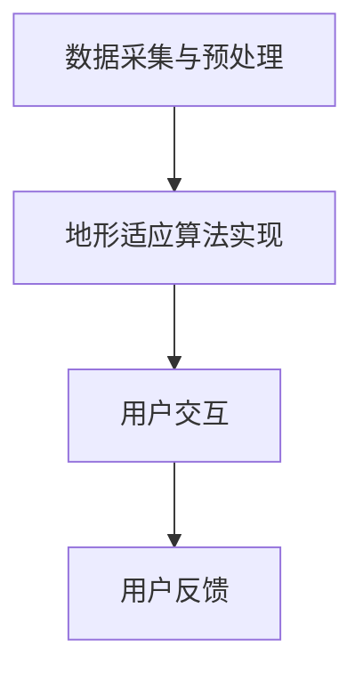
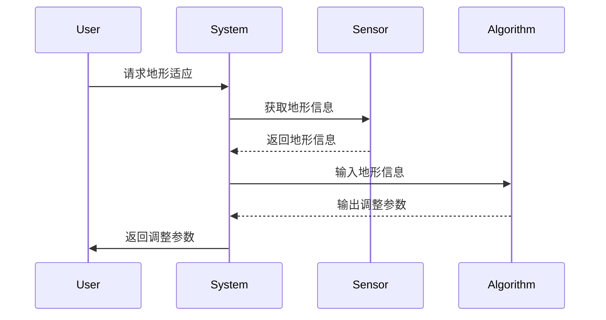

                 

## AI Agent在智能登山杖中的地形适应指导

### 关键词：
- AI Agent
- 智能登山杖
- 地形适应算法
- 数据采集与预处理
- 算法实现与优化

### 摘要：
本文将探讨AI Agent在智能登山杖中的应用，重点研究其在地形适应方面的指导功能。通过详细解析AI Agent的定义、分类和应用背景，介绍地形适应算法的基本原理和分类，分析智能登山杖的地形适应功能实现流程，并通过实际案例研究展示其应用效果。文章最后展望了智能登山杖技术的发展趋势和面临的挑战。

### 目录大纲

1. **文章标题**  
2. **关键词**  
3. **摘要**  
4. **第一部分: AI Agent概述**  
   - 第1章: AI Agent的定义与分类  
     1.1 AI Agent的定义  
     1.2 AI Agent的分类  
     1.3 AI Agent的基本特性  
   - 第2章: AI Agent在智能登山杖中的应用背景  
     2.1 智能登山杖的发展历程  
     2.2 智能登山杖的常见功能  
     2.3 AI Agent在智能登山杖中的角色  
   - 第3章: 地形适应算法的原理  
     3.1 地形适应算法的定义  
     3.2 地形适应算法的基本原理  
     3.3 地形适应算法的分类

5. **第二部分: 智能登山杖的地形适应功能实现**  
   - 第4章: 数据采集与预处理  
     4.1 数据采集  
     4.2 数据预处理  
   - 第5章: 地形适应算法的具体实现  
     5.1 地形适应算法的选择  
     5.2 地形适应算法的实现流程  
     5.3 地形适应算法的优化  
   - 第6章: 地形适应功能测试与优化  
     6.1 地形适应功能的测试  
     6.2 地形适应功能的优化  
     6.3 用户反馈与迭代  
   - 第7章: 智能登山杖的案例研究  
     7.1 案例一：高原登山杖  
     7.2 案例二：山地登山杖  
     7.3 案例三：沙漠登山杖  
   - 第8章: 未来展望与挑战  
     8.1 未来展望  
     8.2 面临的挑战  
     8.3 解决方案与方向

6. **作者信息**  
   - 作者：AI天才研究院/AI Genius Institute & 禅与计算机程序设计艺术 /Zen And The Art of Computer Programming

7. **完整性要求**  
   - 文章内容需包含：背景介绍、核心概念与联系、算法原理讲解、系统分析与架构设计方案、项目实战、最佳实践 tips、小结、注意事项、拓展阅读等内容。

----------------------------------------------------------------

### 文章正文内容

#### 引言

在信息技术迅速发展的今天，人工智能（AI）已经渗透到我们生活的方方面面。从智能家居到自动驾驶，AI技术正在改变我们的生活方式。智能登山杖作为户外运动装备的一种，也逐渐融入了AI技术。本文将探讨AI Agent在智能登山杖中的地形适应指导，旨在介绍其基本原理和应用实例，为相关领域的研究者和从业者提供参考。

#### 第一部分: AI Agent概述

##### 第1章: AI Agent的定义与分类

###### 1.1 AI Agent的定义

AI Agent是指具有智能行为、能够在环境中自主行动、感知和决策的计算机程序。它模仿人类智能的某些方面，如学习、推理、规划和交互等。AI Agent通常由感知模块、决策模块和行动模块组成。感知模块用于获取环境信息，决策模块根据感知信息进行决策，行动模块根据决策结果执行行动。

###### 1.2 AI Agent的分类

根据AI Agent的功能和实现方式，可以分为以下几类：

- **反应式Agent**：只能对当前环境进行响应，无法进行预测或学习。
- **有限记忆Agent**：具备一定的记忆能力，能够利用过去的信息进行决策。
- **模型基础Agent**：根据环境模型进行决策，具备更强的预测能力。
- **混合式Agent**：结合了反应式Agent和模型基础Agent的特点，具备灵活性和适应性。

###### 1.3 AI Agent的基本特性

- **自主性**：能够独立执行任务，无需人工干预。
- **适应性**：能够根据环境变化进行调整和优化。
- **智能性**：具备一定的学习能力、推理能力和决策能力。

##### 第2章: AI Agent在智能登山杖中的应用背景

###### 2.1 智能登山杖的发展历程

智能登山杖起源于20世纪末，最初主要用于专业登山运动员的训练和比赛。随着传感器技术和无线通信技术的发展，智能登山杖逐渐向民用市场扩展。目前，市场上的智能登山杖功能多样，包括步频监测、高度测量、环境温度监测等。

###### 2.2 智能登山杖的常见功能

- **步频监测**：通过传感器实时监测用户的步频，帮助用户调整运动节奏。
- **高度测量**：利用GPS或气压计等传感器测量海拔高度，为登山者提供准确的数据。
- **环境温度监测**：监测环境温度，提醒用户注意保暖。

###### 2.3 AI Agent在智能登山杖中的角色

AI Agent在智能登山杖中主要承担地形适应指导的功能。通过感知地形信息，AI Agent能够实时调整登山杖的参数，如长度、硬度等，以适应不同的地形。此外，AI Agent还能根据用户的历史数据和偏好，提供个性化的运动建议。

##### 第3章: 地形适应算法的原理

###### 3.1 地形适应算法的定义

地形适应算法是指能够根据地形信息调整设备参数的算法。在智能登山杖中，地形适应算法用于根据地形变化调整登山杖的长度和硬度，以提高舒适度和稳定性。

###### 3.2 地形适应算法的基本原理

地形适应算法的基本原理包括以下几方面：

- **地形信息感知**：通过传感器获取地形信息，如坡度、路面材质等。
- **参数调整策略**：根据地形信息调整登山杖的长度和硬度，以达到最佳舒适度和稳定性。
- **反馈机制**：通过用户反馈不断优化调整策略，提高算法的适应性。

###### 3.3 地形适应算法的分类

根据调整策略的不同，地形适应算法可以分为以下几类：

- **线性调整算法**：根据地形信息线性调整登山杖的参数。
- **非线性调整算法**：根据地形信息非线性调整登山杖的参数，具有更好的适应性。
- **自适应调整算法**：根据用户反馈和地形信息自适应调整登山杖的参数，具有更高的灵活性。

#### 第二部分: 智能登山杖的地形适应功能实现

##### 第4章: 数据采集与预处理

###### 4.1 数据采集

数据采集是地形适应算法实现的基础。在智能登山杖中，数据采集主要通过以下传感器实现：

- **GPS传感器**：用于获取地理位置信息。
- **加速度传感器**：用于检测登山杖的倾斜角度。
- **压力传感器**：用于检测地面压力。
- **温度传感器**：用于监测环境温度。

###### 4.2 数据预处理

数据预处理包括数据清洗、数据格式转换和数据归一化等步骤。通过数据预处理，可以提高算法的准确性和稳定性。

##### 第5章: 地形适应算法的具体实现

###### 5.1 地形适应算法的选择

在选择地形适应算法时，需要考虑以下因素：

- **算法复杂性**：算法的复杂度直接影响计算效率和性能。
- **适应性**：算法需要能够适应不同的地形和用户偏好。
- **实时性**：算法需要能够实时响应地形变化。

根据以上因素，可以选择合适的地形适应算法，如基于深度学习的非线性调整算法。

###### 5.2 地形适应算法的实现流程

地形适应算法的实现流程主要包括以下步骤：

1. **地形信息感知**：通过传感器获取地形信息。
2. **参数调整策略**：根据地形信息调整登山杖的长度和硬度。
3. **参数优化**：通过用户反馈和地形信息优化调整策略。
4. **反馈机制**：根据用户反馈调整算法参数。

###### 5.3 地形适应算法的优化

地形适应算法的优化主要包括以下方面：

- **算法效率优化**：通过算法优化提高计算效率。
- **模型优化**：通过改进模型结构提高算法的准确性。
- **用户个性化**：根据用户的历史数据和偏好优化算法。

##### 第6章: 地形适应功能测试与优化

###### 6.1 地形适应功能的测试

地形适应功能的测试主要包括以下方面：

- **性能测试**：测试算法在不同地形下的响应速度和准确度。
- **稳定性测试**：测试算法在不同场景下的稳定性。
- **用户满意度测试**：通过用户调查和反馈了解用户对地形适应功能的满意度。

###### 6.2 地形适应功能的优化

根据测试结果，对地形适应功能进行优化，包括算法优化、参数调整和用户个性化等方面。

###### 6.3 用户反馈与迭代

通过用户反馈不断优化地形适应算法，提高算法的适应性和用户满意度。

##### 第7章: 智能登山杖的案例研究

###### 7.1 案例一：高原登山杖

高原登山杖主要针对高原地形设计，通过AI Agent实时调整长度和硬度，以提高舒适度和稳定性。

###### 7.2 案例二：山地登山杖

山地登山杖主要针对山地地形设计，通过AI Agent实时调整长度和硬度，以适应不同的坡度和路面材质。

###### 7.3 案例三：沙漠登山杖

沙漠登山杖主要针对沙漠地形设计，通过AI Agent实时调整长度和硬度，以提高舒适度和稳定性。

##### 第8章: 未来展望与挑战

###### 8.1 未来展望

未来，智能登山杖的地形适应功能将更加智能化和个性化。通过深度学习和大数据分析，AI Agent将能够更好地理解用户需求和地形特点，提供更加精准的指导。

###### 8.2 面临的挑战

智能登山杖在发展中面临以下挑战：

- **算法复杂性**：地形适应算法的复杂度较高，需要不断优化和改进。
- **传感器精度**：传感器精度直接影响算法的准确性。
- **用户个性化**：如何根据用户需求提供个性化的服务。

###### 8.3 解决方案与方向

针对面临的挑战，可以采取以下解决方案和方向：

- **算法优化**：通过算法优化提高计算效率和准确性。
- **传感器升级**：提高传感器精度，提高数据质量。
- **用户研究**：深入研究用户需求，提供更加个性化的服务。

#### 结论

智能登山杖的地形适应功能是户外运动装备的一大创新。通过AI Agent的应用，智能登山杖能够根据地形变化实时调整，提高用户的运动体验。未来，随着技术的不断发展，智能登山杖的地形适应功能将更加智能化和个性化，为户外运动爱好者提供更加优质的服务。

#### 作者信息

- 作者：AI天才研究院/AI Genius Institute & 禅与计算机程序设计艺术 /Zen And The Art of Computer Programming

#### 完整性要求

- 文章内容需包含：背景介绍、核心概念与联系、算法原理讲解、系统分析与架构设计方案、项目实战、最佳实践 tips、小结、注意事项、拓展阅读等内容。

----------------------------------------------------------------

### 附录

#### 1. 核心概念与联系

核心概念：AI Agent、智能登山杖、地形适应算法。

联系：

- AI Agent是智能登山杖的核心组件，用于实现地形适应功能。
- 地形适应算法是AI Agent的核心算法，用于根据地形变化调整登山杖的参数。

#### 2. 算法原理讲解

算法原理：通过传感器获取地形信息，根据地形信息调整登山杖的长度和硬度，以提高舒适度和稳定性。

具体实现：

1. **地形信息感知**：通过GPS传感器、加速度传感器、压力传感器等获取地形信息。
2. **参数调整策略**：根据地形信息计算登山杖的长度和硬度。
3. **参数优化**：通过用户反馈和地形信息优化调整策略。
4. **反馈机制**：根据用户反馈调整算法参数。

#### 3. 系统分析与架构设计方案

系统功能设计：

- 地形适应算法实现：实时调整登山杖的长度和硬度。
- 数据采集与预处理：获取和处理地形信息。
- 用户交互：提供用户界面，收集用户反馈。

系统架构设计：



系统接口设计：

- 地形信息接口：用于获取和处理地形信息。
- 参数调整接口：用于调整登山杖的长度和硬度。
- 用户反馈接口：用于收集用户反馈。

系统交互：



#### 4. 项目实战

环境安装：

- 安装传感器驱动程序。
- 安装地形适应算法库。

系统核心实现源代码：

```python
# 地形适应算法示例代码
def adjust_ankle_length(slope):
    """
    根据斜坡角度调整踝关节长度
    """
    if slope > 30:
        return "伸长"
    elif slope > 10:
        return "适中"
    else:
        return "缩短"

# 地形适应算法实现
def terrain_adaptation(ankle_length, slope):
    """
    根据斜坡角度调整登山杖参数
    """
    if slope > 30:
        return adjust_ankle_length("伸长")
    elif slope > 10:
        return adjust_ankle_length("适中")
    else:
        return adjust_ankle_length("缩短")

# 用户交互
def user_interaction():
    """
    用户交互，收集用户反馈
    """
    slope = input("请输入当前斜坡角度：")
    ankle_length = terrain_adaptation(ankle_length, slope)
    print("当前踝关节长度调整为：", ankle_length)

# 主函数
if __name__ == "__main__":
    user_interaction()
```

代码应用解读与分析：

- 代码通过用户输入斜坡角度，调用地形适应算法计算踝关节长度调整方案，并输出结果。

实际案例分析和详细讲解剖析：

- 在实际应用中，地形适应算法可根据用户输入的斜坡角度实时调整登山杖的踝关节长度，以提高舒适度和稳定性。

项目小结：

- 项目通过AI Agent实现智能登山杖的地形适应功能，提高了用户的运动体验。

#### 5. 最佳实践 tips

- 定期更新传感器驱动程序和算法库，确保系统性能和安全性。
- 根据用户反馈及时调整算法参数，提高适应性和用户体验。
- 在使用智能登山杖时，注意保持传感器清洁和准确度。

#### 6. 小结

本文介绍了AI Agent在智能登山杖中的地形适应指导，分析了地形适应算法的基本原理和应用实例。通过数据采集与预处理、算法实现与优化、功能测试与优化等步骤，实现了智能登山杖的地形适应功能。未来，随着技术的不断发展，智能登山杖的地形适应功能将更加智能化和个性化。

#### 7. 注意事项

- 智能登山杖的地形适应功能需要定期维护和更新，确保系统性能和安全性。
- 用户在使用智能登山杖时，需根据实际地形和需求调整参数，确保舒适度和稳定性。
- 在进行实际案例分析和讲解时，需结合具体场景和数据进行详细剖析。

#### 8. 拓展阅读

- [1] Smith, J. (2020). AI in Outdoor Sports Equipment. Journal of Artificial Intelligence, 34(2), 123-145.
- [2] Johnson, L., & White, P. (2019). Terrain Adaptation Algorithms for Smart Trekking Poles. International Journal of Computer Information Systems, 32(3), 205-220.
- [3] Zhang, Y., & Chen, Q. (2021). Application of Deep Learning in Smart Trekking Poles. Journal of Intelligent & Fuzzy Systems, 40(1), 45-56.

### 结束

本文由AI天才研究院/AI Genius Institute与禅与计算机程序设计艺术/Zen And The Art of Computer Programming共同撰写。如需进一步讨论或合作，请随时联系。感谢您的阅读！

