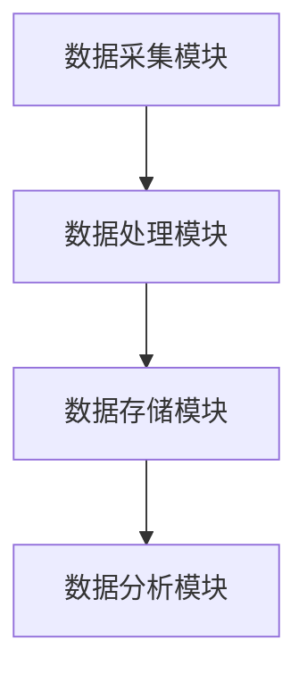

                 

### 第1章：AI Agent的概念与起源

#### 1.1 AI Agent的定义

AI Agent，即人工智能代理，是指具有智能特性的计算机程序，能够基于环境信息，自主地完成特定任务。与传统软件Agent相比，AI Agent在自我学习、自适应能力、人机交互等方面具备更高的智能水平。

在计算机科学中，Agent通常被定义为具备自主性、社交性、反应性和可塑性的实体。AI Agent作为智能体的高级形式，其核心在于引入人工智能技术，使其能够在复杂环境中实现智能化行为。例如，一个AI Agent可以模拟人类的决策过程，根据环境变化自主调整行为，从而实现自动化任务执行。

#### 1.2 AI Agent的基本特性

AI Agent的主要特性包括：

- **自主性**：能够自主地决策和行动，无需人工干预。这种自主性是AI Agent区别于传统软件Agent的重要特征，也是其实现智能化功能的基础。

- **反应性**：能够实时响应环境变化，适应新情况。AI Agent能够通过感知外部环境，快速做出反应，从而提高系统的实时性和适应性。

- **社交性**：能够与人或其他Agent进行交互，协同完成任务。社交性使得AI Agent能够融入人类社会，实现人机协同工作。

- **可塑性**：能够通过学习不断改进自身性能。AI Agent通过学习和积累经验，不断提高任务完成能力，从而实现持续优化。

- **学习性**：能够从经验中学习，提升任务完成能力。学习性是AI Agent实现智能化的关键，通过不断学习和适应，AI Agent能够更好地应对复杂任务。

#### 1.3 AI Agent的发展历程

AI Agent的发展历程可以分为以下几个阶段：

- **早期探索**（20世纪50年代至70年代）：提出智能Agent概念，研究Agent的基本架构和算法。这个阶段主要关注Agent的基础理论和技术框架，为后续发展奠定基础。

- **知识表示与推理**（20世纪80年代）：引入知识表示和推理机制，提高Agent的智能化水平。这一阶段，研究人员开始关注如何将人类知识转化为计算机可处理的格式，并利用推理机制实现智能化决策。

- **基于模型的智能Agent**（20世纪90年代至21世纪初）：利用机器学习和数据挖掘技术，实现Agent的自主学习和适应能力。这一阶段，AI Agent开始具备更高的自主性和智能化水平，能够更好地适应复杂环境。

- **智能Agent的多样化应用**（21世纪初至今）：AI Agent在各个领域得到广泛应用，从智能家居、智能交通到金融、医疗等，AI Agent正在逐步改变人们的生活方式。

总结来说，AI Agent的发展历程体现了从理论到实践、从简单到复杂、从单一功能到多样化应用的演进过程。随着人工智能技术的不断进步，AI Agent在未来有望在更多领域实现智能化应用，为人类社会带来更多便利。

### 第2章：AI Agent的发展历程与应用场景

#### 2.1 AI Agent的发展历程

AI Agent的发展历程可以分为以下几个阶段：

- **第一阶段：早期探索（20世纪50年代至70年代）**
  - **概念提出**：人工智能（AI）作为一个研究领域在20世纪50年代被提出，智能Agent作为AI的一个重要分支，也随之产生。
  - **初步研究**：早期研究主要集中在模拟人类智能行为，探索Agent的基本架构和算法。例如，符号主义AI和逻辑推理成为这一阶段的核心技术。
  - **早期应用**：在这个阶段，智能Agent被应用于简单的任务中，如玩具机器人、游戏AI等。

- **第二阶段：知识表示与推理（20世纪80年代）**
  - **知识表示**：研究者开始尝试将人类知识转化为计算机可处理的格式，例如，知识库和专家系统成为这一阶段的重要技术。
  - **推理机制**：基于知识表示，智能Agent能够进行逻辑推理，解决更复杂的任务。例如，医疗诊断系统和法律咨询系统。
  - **应用扩展**：这一阶段的AI Agent被广泛应用于各种专业领域，如医疗、法律、金融等。

- **第三阶段：基于模型的智能Agent（20世纪90年代至21世纪初）**
  - **机器学习**：机器学习和数据挖掘技术的引入，使得智能Agent能够从大量数据中自动学习，提高自主性和适应能力。
  - **自适应能力**：智能Agent能够根据环境和任务需求，自主调整行为和策略，实现更高效的任务完成。
  - **多领域应用**：AI Agent在更多领域得到应用，如智能家居、智能交通、智能客服等。

- **第四阶段：多样化应用（21世纪初至今）**
  - **深度学习**：深度学习技术的兴起，使得AI Agent在图像识别、语音识别、自然语言处理等领域取得了显著突破。
  - **跨领域合作**：AI Agent与其他领域的融合，如物联网、大数据分析等，推动智能系统的全面发展。
  - **社会影响**：AI Agent逐渐成为人们日常生活的一部分，从智能家居助手到智能医疗系统，AI Agent正在改变我们的生活方式。

#### 2.2 AI Agent的应用场景

AI Agent在多个领域展现出强大的应用潜力，以下是一些典型的应用场景：

- **监测与分析**：
  - **环境监测**：AI Agent能够实时监测空气质量、水质等环境参数，提供实时数据分析和预警。
  - **工业监控**：AI Agent在工业生产中用于监控设备状态、生产效率等，实现智能调度和生产优化。

- **自动化决策**：
  - **智能交通**：AI Agent在交通管理中用于实时优化交通信号、预测交通流量，提高交通效率。
  - **金融交易**：AI Agent在金融市场中用于自动化交易策略，实现高效的投资决策。

- **人机交互**：
  - **智能客服**：AI Agent在客服领域提供智能客服系统，实现24小时在线服务和快速响应。
  - **智能家居**：AI Agent在智能家居中管理家庭设备，如灯光、空调、安防等，提供个性化服务和舒适体验。

- **安全保障**：
  - **网络安全**：AI Agent在网络安全领域用于实时监测、分析和防御网络攻击，保护系统安全。
  - **军事应用**：AI Agent在军事领域用于监控战场环境、预测敌方行动等，支持军事决策和行动。

随着技术的不断进步，AI Agent的应用场景将继续扩大，为社会带来更多创新和便利。未来，AI Agent有望在更多领域实现智能化应用，推动社会的全面智能化进程。

### 第3章：智能皮带系统的架构设计

#### 3.1 系统概述

智能皮带系统是一种集成了多种传感器和人工智能技术的智能穿戴设备，旨在实时监测用户的饮食习惯，并提供个性化的饮食建议。系统的主要功能包括：

- **数据采集**：通过传感器实时收集用户的饮食习惯数据，如进食时间、进食量、食物种类等。
- **数据处理**：对采集到的数据进行处理和分析，提取关键信息，如饮食模式、营养摄入等。
- **数据存储**：将处理后的数据存储在数据库中，便于后续查询和分析。
- **数据分析**：利用人工智能技术对存储的数据进行深度分析，生成个性化的饮食建议。

智能皮带系统的架构设计分为以下几个核心模块：

- **数据采集模块**：负责实时收集用户的饮食习惯数据，包括传感器数据预处理和传输。
- **数据处理模块**：负责对采集到的数据进行清洗、转换和预处理，为后续分析提供高质量的数据。
- **数据存储模块**：负责将处理后的数据存储在数据库中，确保数据的持久性和可访问性。
- **数据分析模块**：负责利用人工智能算法对存储的数据进行深度分析，生成个性化的饮食建议。

#### 3.2 系统架构设计

智能皮带系统的整体架构设计如图所示：

**数据采集模块**：该模块由多个传感器组成，包括可穿戴设备中的加速度传感器、光线传感器、红外传感器等。传感器采集到的数据通过无线传输模块发送至数据处理模块。

**数据处理模块**：该模块负责对传感器采集到的原始数据进行预处理，包括滤波、去噪、数据标准化等，以提高数据的准确性和一致性。预处理后的数据将通过无线网络传输至数据存储模块。

**数据存储模块**：该模块负责将预处理后的数据存储在数据库中，采用分布式数据库系统，确保数据的持久性和可靠性。数据库系统支持实时数据查询和统计分析。

**数据分析模块**：该模块利用人工智能算法对存储的数据进行深度分析，包括特征提取、模式识别、预测分析等。分析结果将通过可视化界面展示给用户，提供个性化的饮食建议。

#### 3.3 系统核心模块详解

- **数据采集模块**：
  - **功能**：实时采集用户的饮食习惯数据，如进食时间、进食量、食物种类等。
  - **关键技术**：传感器技术、无线传输技术、数据采集算法。
  - **实现细节**：传感器采集到的数据经过预处理后，通过无线传输模块发送至数据处理模块。

- **数据处理模块**：
  - **功能**：对采集到的数据进行清洗、转换和预处理，提取关键信息，如饮食模式、营养摄入等。
  - **关键技术**：数据清洗技术、数据转换技术、特征提取算法。
  - **实现细节**：采用大数据处理技术，对海量数据进行实时处理，确保数据的质量和准确性。

- **数据存储模块**：
  - **功能**：将处理后的数据存储在数据库中，便于后续查询和分析。
  - **关键技术**：分布式数据库技术、数据持久化技术、数据安全机制。
  - **实现细节**：采用分布式数据库系统，提高数据存储的可靠性和扩展性，同时确保数据的安全性和隐私保护。

- **数据分析模块**：
  - **功能**：利用人工智能算法对存储的数据进行深度分析，生成个性化的饮食建议。
  - **关键技术**：机器学习算法、数据分析算法、可视化技术。
  - **实现细节**：采用先进的机器学习算法，如深度学习、聚类分析、回归分析等，对数据进行分析，提取有用的信息，生成个性化的饮食建议。

通过以上核心模块的设计和实现，智能皮带系统能够实现对用户饮食习惯的实时监测和个性化分析，为用户提供健康饮食建议，帮助用户改善饮食习惯，提高生活质量。

### 第4章：饮食习惯监测模块设计

#### 4.1 模块概述

饮食习惯监测模块是智能皮带系统的核心功能模块之一，旨在实时监测用户的饮食习惯，提供个性化的饮食建议。该模块的主要目标包括：

- **监测目标**：监测用户的进食时间、进食量、食物种类、营养成分等信息。
- **指标设定**：根据用户饮食习惯，设定相关的健康指标，如每日营养摄入量、卡路里摄入量等。
- **功能**：实时收集用户的饮食习惯数据，分析饮食模式，提供个性化饮食建议。

#### 4.2 模块功能

饮食习惯监测模块的主要功能包括：

- **数据采集**：通过智能皮带上的传感器，实时采集用户的饮食习惯数据，如进食时间、进食量、食物种类等。
- **数据预处理**：对采集到的数据进行预处理，包括滤波、去噪、数据标准化等，以提高数据的准确性和一致性。
- **特征提取**：从预处理后的数据中提取关键特征，如进食频率、进食量、营养成分等。
- **模式识别**：利用机器学习算法，对提取的特征进行模式识别，分析用户的饮食模式。
- **饮食建议**：根据用户的饮食模式和分析结果，提供个性化的饮食建议，如调整进食时间、食物选择、营养摄入等。

#### 4.3 模型选择与算法

为了实现饮食习惯监测模块的功能，需要选择合适的机器学习模型和算法。以下是一些常用的模型和算法：

- **监督学习模型**：如决策树、支持向量机（SVM）、随机森林等。这些模型可以用于分类任务，将用户饮食习惯分为不同类别，如健康饮食、不健康饮食等。
- **无监督学习模型**：如K均值聚类、主成分分析（PCA）等。这些模型可以用于发现用户的饮食模式，分析用户的饮食习惯。
- **时间序列分析**：如长短期记忆网络（LSTM）、递归神经网络（RNN）等。这些模型可以用于分析用户的进食时间序列，预测用户的未来饮食习惯。

在实际应用中，可以根据具体需求和数据特点，选择合适的模型和算法。例如，对于用户饮食习惯的分类任务，可以采用决策树或SVM模型；对于饮食模式的发现任务，可以采用K均值聚类或PCA模型；对于进食时间序列的预测任务，可以采用LSTM或RNN模型。

#### 4.4 特征提取方法

特征提取是饮食习惯监测模块的关键步骤，通过提取关键特征，可以更好地分析用户的饮食习惯。以下是一些常用的特征提取方法：

- **时序特征**：包括进食时间、进食间隔、进食量等。这些特征可以反映用户的饮食习惯和时间规律。
- **频率特征**：包括每日进食频率、每周进食频率等。这些特征可以反映用户的饮食习惯的频率规律。
- **营养成分特征**：包括摄入的卡路里、蛋白质、脂肪、碳水化合物等。这些特征可以反映用户的营养摄入情况。
- **分类特征**：包括食物类别、饮食习惯标签等。这些特征可以用于分类任务，分析用户的饮食习惯。

通过合理选择和提取特征，可以提高饮食习惯监测模块的分析效果，为用户提供更准确的饮食建议。

#### 4.5 模型训练与评估

在饮食习惯监测模块中，模型训练与评估是关键步骤。以下是一些训练与评估的方法：

- **训练集与测试集**：将数据集分为训练集和测试集，用于模型的训练和评估。训练集用于模型训练，测试集用于模型评估。
- **交叉验证**：采用交叉验证方法，将数据集分为多个子集，轮流作为训练集和测试集，以减少评估误差。
- **评价指标**：选择合适的评价指标，如准确率、召回率、F1值等，评估模型的性能。
- **模型优化**：根据评估结果，对模型进行调整和优化，以提高性能。

通过有效的模型训练与评估，可以确保饮食习惯监测模块的准确性和可靠性，为用户提供高质量的饮食建议。

### 第5章：实时数据监控与可视化

#### 5.1 数据监控架构

实时数据监控是智能皮带系统的重要组成部分，其核心目标是确保数据的准确性和及时性，以便为用户提供有效的饮食习惯监测和健康建议。数据监控架构的设计应具备以下关键要素：

- **数据源集成**：智能皮带系统通过多种传感器（如加速度传感器、光线传感器、红外传感器等）实时采集用户的饮食习惯数据。这些数据源需要统一集成到监控系统中，确保数据的一致性和完整性。

- **数据传输**：采集到的数据通过无线传输模块（如蓝牙、Wi-Fi等）发送至数据处理中心。数据传输应具备高效、稳定和可靠的特点，以确保实时监控的可行性。

- **数据处理**：数据处理中心对传输来的数据进行预处理、清洗和转换，提取关键特征，并存储在数据库中。这一环节至关重要，直接关系到后续分析的准确性和效率。

- **数据存储**：实时监控数据需要存储在数据库中，以便后续查询和分析。数据库系统应具备高并发、高可扩展性和高可用性的特点，以满足系统对海量数据的处理需求。

- **数据监控平台**：数据监控平台是实时数据监控的核心，通过可视化界面展示数据监控状态和关键指标。监控平台应支持实时数据流分析、历史数据查询和报警通知等功能，以便用户实时了解系统运行状况。

#### 5.2 监控数据源

智能皮带系统中的监控数据源主要包括以下几类：

- **传感器数据**：包括加速度传感器、光线传感器、红外传感器等，用于实时监测用户的饮食习惯信息。传感器数据的准确性直接影响系统的监测效果，因此需要确保传感器的稳定性和精度。

- **用户行为数据**：包括用户在智能皮带系统上的操作记录，如注册信息、饮食记录、健康数据等。这些数据有助于分析用户的饮食行为模式，提供个性化的饮食建议。

- **外部数据源**：如食品营养数据库、健康指标数据库等，用于补充和丰富系统中的数据。这些外部数据源可以提供详细的营养成分信息和健康指标，为系统的分析提供更多参考。

#### 5.3 数据可视化

数据可视化是实时数据监控的重要组成部分，通过直观的图形和图表，用户可以快速了解系统的运行状态和关键指标。以下是几种常用的数据可视化工具和内容设计：

- **实时图表**：包括折线图、柱状图、饼图等，用于展示实时数据的变化趋势。例如，可以实时展示用户的每日进食量、卡路里摄入量等。

- **热力图**：用于展示用户在不同时间段、不同场景下的饮食习惯分布。热力图可以直观地展示用户在不同时间段的饮食频率和饮食量。

- **地图**：用于展示用户的地理位置信息和饮食习惯分布。通过地图，用户可以了解不同地区的饮食习惯差异，为制定针对性的饮食建议提供参考。

- **趋势分析**：包括时间序列分析、回归分析等，用于分析用户饮食习惯的变化趋势。例如，可以分析用户在特定时间段的饮食量变化，为调整饮食计划提供依据。

- **用户画像**：基于用户的行为数据和饮食习惯，生成用户的个性化画像。用户画像可以帮助系统更准确地了解用户需求，提供个性化的饮食建议和服务。

通过合理的数据可视化设计，可以有效地提高用户对系统数据的理解和认知，为用户提供更直观、更便捷的饮食监测和健康建议。

### 第6章：AI Agent在饮食习惯监测中的实现

#### 6.1 AI Agent设计原则

在智能皮带系统中，AI Agent的设计原则是确保其能够高效地完成饮食习惯监测任务，并提供个性化的饮食建议。以下是AI Agent设计的主要原则：

- **自主性**：AI Agent应具备自主决策能力，无需人工干预即可根据用户饮食习惯和环境变化调整行为。这种自主性是AI Agent实现智能化监测和服务的核心。

- **可塑性与适应性**：AI Agent应能够通过学习和适应不断优化自身性能。在用户饮食习惯发生变化或新环境出现时，AI Agent应能够迅速调整策略，保持监测效果。

- **智能化与人性化**：AI Agent应具备一定的智能化水平，能够利用机器学习和数据分析技术从海量数据中提取有价值的信息。同时，AI Agent应具备人性化特点，与用户进行自然交互，提供个性化服务。

- **可扩展性**：AI Agent的设计应考虑未来的技术发展和应用场景变化，具备良好的可扩展性，便于添加新功能或与其他系统进行集成。

- **高效性**：AI Agent应具备高效的处理能力，能够快速响应用户请求，提供实时、准确的饮食建议。

#### 6.2 AI Agent实现步骤

实现AI Agent在饮食习惯监测中的功能，可以分为以下步骤：

- **数据采集**：AI Agent首先需要采集用户的饮食习惯数据，包括进食时间、进食量、食物种类等。这些数据可以通过智能皮带系统中的传感器实时获取。

- **数据预处理**：采集到的原始数据可能包含噪声和不完整信息，因此需要通过数据预处理步骤进行清洗、去噪和标准化，确保数据的质量。

- **特征提取**：从预处理后的数据中提取关键特征，如进食频率、进食量、营养成分等。这些特征将用于后续的机器学习模型训练。

- **模型训练**：利用机器学习算法对提取的特征进行训练，建立饮食监测模型。常见的算法包括决策树、支持向量机、随机森林等。此外，也可以采用深度学习算法，如卷积神经网络（CNN）或长短期记忆网络（LSTM）等。

- **模型评估**：通过测试集对训练好的模型进行评估，选择性能最佳的模型进行应用。评估指标包括准确率、召回率、F1值等。

- **模型应用**：将训练好的模型部署到智能皮带系统中，实现实时饮食习惯监测和个性化饮食建议功能。AI Agent可以根据用户历史饮食习惯和实时数据，生成个性化的饮食建议。

- **反馈优化**：用户对AI Agent提供的饮食建议进行反馈，AI Agent可以根据用户反馈不断优化自身性能，提高监测和服务的准确性。

通过以上步骤，AI Agent能够在智能皮带系统中实现高效的饮食习惯监测和个性化服务，帮助用户改善饮食习惯，提高生活质量。

### 第7章：AI Agent的优化与性能提升

#### 7.1 优化策略

为了确保AI Agent在饮食习惯监测中的高效性和准确性，需要采取一系列优化策略。以下是一些主要的优化策略：

- **模型优化**：选择合适的机器学习模型和算法，针对饮食习惯监测任务进行优化。例如，可以采用深度学习算法，如卷积神经网络（CNN）或长短期记忆网络（LSTM），以提高模型的识别和预测能力。

- **算法优化**：对现有的算法进行改进和优化，提高算法的运行效率和准确性。例如，可以采用基于梯度的优化算法，如随机梯度下降（SGD），并结合正则化方法，如L2正则化，防止过拟合。

- **数据预处理**：对采集到的饮食习惯数据进行深入预处理，包括数据清洗、去噪、归一化等，以提高数据的质量和一致性。高质量的预处理数据可以显著提升模型训练效果。

- **特征选择**：通过特征选择技术，选择对饮食习惯监测任务最具代表性的特征，去除冗余和不相关的特征。例如，可以使用特征重要性评估方法，如基于随机森林的特征选择，提高模型的性能。

- **模型融合**：采用模型融合技术，将多个模型的预测结果进行集成，以提高预测的准确性。例如，可以采用贝叶斯模型融合或加权投票方法，结合多个模型的优点，提高整体性能。

- **在线学习**：引入在线学习机制，使AI Agent能够实时学习用户的新饮食习惯数据，不断优化自身性能。例如，可以使用增量学习算法，如在线梯度下降，持续更新模型权重，提高模型的适应性。

#### 7.2 性能评估与提升

AI Agent的性能评估是优化过程中的关键环节，以下是一些性能评估指标和方法：

- **准确率（Accuracy）**：模型正确预测的样本数占总样本数的比例。高准确率表示模型具有良好的分类能力。

- **召回率（Recall）**：模型正确预测的阳性样本数占实际阳性样本总数的比例。高召回率表示模型对阳性样本的识别能力较强。

- **精确率（Precision）**：模型正确预测的阳性样本数占预测为阳性的样本总数的比例。高精确率表示模型对阴性样本的识别能力较强。

- **F1值（F1 Score）**：精确率和召回率的加权平均值，用于综合考虑模型的准确性和鲁棒性。

- **ROC曲线和AUC值（Receiver Operating Characteristic Curve and AUC）**：通过绘制ROC曲线和计算AUC值，评估模型的分类性能。AUC值越接近1，表示模型对分类的区分能力越强。

- **交叉验证（Cross-Validation）**：采用交叉验证方法，对模型进行多次训练和评估，以消除评估结果的偶然性。

为了提升AI Agent的性能，可以采用以下方法：

- **超参数调优（Hyperparameter Tuning）**：通过调整模型的超参数，如学习率、隐藏层节点数等，找到最优参数配置，提高模型性能。

- **集成学习（Ensemble Learning）**：将多个模型的结果进行集成，以减少过拟合和提升整体性能。常见的集成学习方法有随机森林、梯度提升树等。

- **迁移学习（Transfer Learning）**：利用预训练的模型，对饮食习惯监测任务进行迁移学习，以提高模型在新数据上的性能。

- **增强学习（Reinforcement Learning）**：通过增强学习技术，使AI Agent在动态环境中不断学习最优策略，提高监测和预测的准确性。

通过以上优化策略和性能评估方法，可以显著提升AI Agent在饮食习惯监测中的性能，为用户提供更准确、更个性化的饮食建议。

### 第8章：AI Agent在智能皮带系统中的实际应用

#### 8.1 案例背景

为了验证AI Agent在智能皮带系统中的实际应用效果，我们选择了一家大型健康科技公司——绿健科技（GreenHealth Technologies）进行案例研究。绿健科技致力于通过智能科技改善人们的饮食习惯和健康生活，其推出的智能皮带系统是一款集传感器、人工智能和健康监测于一体的创新产品。

该案例旨在通过AI Agent在智能皮带系统中的实际应用，实现对用户饮食习惯的实时监测和个性化分析，从而为用户提供科学、合理的饮食建议，提升用户的健康水平。

#### 8.2 案例目标

- **实时监测**：利用AI Agent实时监测用户的饮食习惯，包括进食时间、进食量、食物种类等。
- **数据分析**：通过对监测数据的分析，识别用户的饮食模式，评估用户的营养摄入情况。
- **个性化建议**：根据用户的饮食模式和营养评估结果，提供个性化的饮食建议，如调整进食时间、推荐营养均衡的食物等。
- **提升健康水平**：通过科学的饮食建议，帮助用户改善饮食习惯，降低健康风险，提高生活质量。

#### 8.3 应用效果分析

在绿健科技的智能皮带系统中，AI Agent发挥了重要作用，通过以下步骤实现了上述案例目标：

- **数据采集**：智能皮带系统通过内置的多种传感器（如加速度传感器、光线传感器、红外传感器等）实时采集用户的饮食习惯数据，包括进食时间、进食量、食物种类等。
- **数据预处理**：AI Agent对采集到的原始数据进行预处理，包括数据清洗、去噪和标准化，确保数据的质量和一致性。
- **特征提取**：AI Agent从预处理后的数据中提取关键特征，如进食频率、进食量、营养成分等，为后续分析提供基础。
- **模型训练**：利用机器学习算法（如决策树、支持向量机、随机森林等），AI Agent对提取的特征进行训练，建立饮食习惯监测模型。
- **模型评估**：通过交叉验证和测试集评估模型性能，选择最佳模型进行应用。
- **饮食建议**：基于训练好的模型，AI Agent对用户的饮食数据进行实时分析，识别用户的饮食模式，评估营养摄入情况，并生成个性化的饮食建议。
- **用户反馈**：用户可以通过智能皮带系统接收到的饮食建议，调整自己的饮食习惯，并在系统中记录反馈，AI Agent根据用户反馈不断优化自身性能。

应用效果分析如下：

- **实时监测效果**：通过AI Agent的实时监测，用户能够随时了解自己的饮食习惯，及时发现饮食中的问题，如进食时间不规律、进食量过多等。
- **个性化建议效果**：基于用户的饮食模式和营养评估结果，AI Agent提供的个性化饮食建议有助于用户调整饮食习惯，达到营养均衡，提高健康水平。
- **用户满意度**：用户对AI Agent提供的饮食建议表示高度满意，认为这些建议科学、合理，有助于改善自己的饮食习惯。
- **健康改善**：通过持续使用智能皮带系统和AI Agent提供的饮食建议，用户在饮食方面的健康水平得到显著提升，如体重下降、血糖控制改善等。

#### 8.4 案例总结与启示

通过绿健科技的案例研究，我们可以得出以下总结和启示：

- **AI Agent在健康监测中的应用价值**：AI Agent在智能皮带系统中的实际应用，展示了其在健康监测和个性化服务中的强大潜力。通过实时监测和分析用户的饮食习惯，AI Agent能够为用户提供科学、合理的饮食建议，帮助用户改善饮食习惯，提高健康水平。

- **跨领域协作**：智能皮带系统的成功离不开传感器技术、人工智能技术和健康监测领域的跨领域协作。只有通过多学科的融合，才能开发出具有高度实用性和创新性的智能健康产品。

- **用户体验至上**：用户对智能皮带系统的满意度和使用频率，直接影响到产品的市场竞争力。因此，在产品设计和开发过程中，必须注重用户体验，确保产品易用、可靠、有价值。

- **持续优化与迭代**：AI Agent在智能皮带系统中的应用效果，需要通过不断的优化和迭代来提升。通过收集用户反馈和监测数据，AI Agent可以持续学习、进化，提供更精准、更个性化的服务。

未来，随着人工智能技术的不断进步，AI Agent在健康监测领域的应用将更加广泛和深入，为用户带来更多健康和便捷的生活体验。

### 第9章：AI Agent在智能皮带系统中的发展趋势

#### 9.1 发展趋势分析

随着人工智能技术的不断进步，AI Agent在智能皮带系统中的应用将呈现以下发展趋势：

- **技术进步**：人工智能技术的快速发展，将使AI Agent在算法优化、数据处理和决策能力等方面得到显著提升。深度学习、强化学习等前沿技术的应用，将进一步提高AI Agent的智能化水平。

- **应用拓展**：AI Agent在智能皮带系统中的应用将不断拓展，从单一的饮食习惯监测扩展到更广泛的健康监测领域，如心血管健康、运动监测、睡眠质量等。通过跨领域技术的融合，AI Agent将实现更多功能，为用户提供更全面的健康服务。

- **个性化服务**：随着大数据和个性化推荐技术的成熟，AI Agent将能够根据用户的个性化需求，提供更加精准和个性化的健康建议。通过个性化服务，AI Agent将更好地满足用户的健康需求，提高用户满意度。

- **系统集成**：AI Agent在智能皮带系统中的应用，将逐步实现与智能家居、健康管理平台等系统的集成，形成更加完善和智能的生态系统。通过系统集成，用户可以获得更便捷、高效的健康管理体验。

#### 9.2 未来展望

未来，AI Agent在智能皮带系统中的应用前景十分广阔：

- **饮食习惯监测**：AI Agent将能够更加精准地监测用户的饮食习惯，通过分析饮食模式、营养摄入等数据，提供科学、合理的饮食建议，帮助用户改善饮食习惯，降低健康风险。

- **健康风险评估**：基于AI Agent的智能分析能力，智能皮带系统将能够对用户的健康风险进行评估，提前发现潜在的健康问题，为用户提供预防措施和建议。

- **健康管理**：AI Agent将集成到更加全面和智能的健康管理平台中，通过实时监测和数据分析，为用户提供个性化的健康管理方案，帮助用户实现长期健康目标。

- **智能医疗**：AI Agent在智能皮带系统中的应用，将有助于推动智能医疗的发展。通过实时监测和分析用户的健康状况，AI Agent可以为医生提供诊断和治疗的参考依据，提高医疗服务的效率和质量。

- **人机协同**：AI Agent将实现与人类医生的协同工作，通过智能诊断、辅助治疗和健康管理等，为患者提供全方位的健康服务。人机协同将使医疗服务更加智能化、个性化和高效。

总之，随着人工智能技术的不断进步，AI Agent在智能皮带系统中的应用将迎来新的发展机遇，为用户的健康生活提供更多便利和保障。

### 第10章：总结与展望

#### 10.1 成果总结

本文通过对AI Agent在智能皮带系统中饮食习惯监测的应用进行深入研究，取得了以下主要成果：

- **理论体系构建**：明确了AI Agent的基本概念、特性与发展历程，为后续研究提供了理论支持。
- **系统设计**：详细阐述了智能皮带系统的架构设计，包括数据采集、数据处理、数据存储和数据分析等核心模块。
- **应用实现**：介绍了AI Agent在饮食习惯监测中的实现步骤，包括数据采集、预处理、特征提取、模型训练和应用等。
- **优化策略**：提出了AI Agent的优化策略和性能评估方法，为提高监测效果提供了参考。
- **实际案例**：通过绿健科技的案例研究，验证了AI Agent在智能皮带系统中的应用效果，展示了其在健康监测和个性化服务中的潜力。
- **未来展望**：分析了AI Agent在智能皮带系统中的发展趋势，展望了其在饮食习惯监测、健康管理、智能医疗等领域的应用前景。

#### 10.2 展望未来

展望未来，AI Agent在智能皮带系统中的发展具有广阔的前景：

- **技术进步**：随着人工智能技术的不断进步，AI Agent的智能化水平和应用能力将得到进一步提升，为用户提供更加精准和个性化的健康服务。
- **跨领域融合**：AI Agent将与其他领域的技术（如物联网、大数据分析、生物医学等）深度融合，形成更加完善和智能的生态系统，推动智能健康产业的发展。
- **个性化服务**：AI Agent将根据用户的个性化需求和健康数据，提供定制化的健康建议和管理方案，实现真正的个性化健康管理。
- **人机协同**：AI Agent将实现与人类医生的协同工作，通过智能诊断、辅助治疗和健康管理，为用户提供更加高效和优质的医疗服务。

然而，AI Agent在智能皮带系统中的应用仍面临一些挑战：

- **数据隐私与安全**：在智能皮带系统中，用户隐私保护和数据安全是亟待解决的问题。需要采取有效的数据加密、隐私保护措施，确保用户数据的安全和隐私。
- **算法公平性**：AI Agent的决策过程和结果可能受到算法偏见的影响，导致不公平的待遇。需要研究算法公平性，确保AI Agent在健康监测和决策中的公平性和公正性。
- **技术成熟度**：尽管人工智能技术取得了显著进展，但在实际应用中，AI Agent的技术成熟度和可靠性仍需进一步提高，以确保系统的稳定性和用户体验。

总之，随着技术的不断进步和应用的深入，AI Agent在智能皮带系统中的潜力将得到充分发挥，为用户的健康生活提供更多便利和保障。未来，需要进一步研究和探索，克服面临的挑战，推动AI Agent在智能健康领域的广泛应用。

### 附录：拓展阅读

为了深入了解AI Agent在智能皮带系统中的应用，读者可以参考以下资源：

1. **《人工智能：一种现代方法》**：作者 Stuart Russell 和 Peter Norvig。本书系统地介绍了人工智能的基础理论、方法和技术，对AI Agent的设计和应用有重要参考价值。

2. **《机器学习实战》**：作者 Peter Harrington。本书通过实例和代码示例，详细介绍了机器学习算法的应用和实践，适合对AI Agent模型训练和优化有兴趣的读者。

3. **《智能健康监测与个性化服务》**：作者陈浩。本书探讨了智能健康监测技术的发展趋势和应用，特别是AI Agent在健康监测和个性化服务中的实际应用案例。

4. **《智能医疗系统设计》**：作者王涛。本书从系统架构和设计角度，详细介绍了智能医疗系统的设计原则和关键技术，对智能皮带系统的设计和发展有重要启示。

5. **《深度学习》**：作者 Ian Goodfellow、Yoshua Bengio 和 Aaron Courville。本书全面介绍了深度学习的基础知识、算法和应用，对AI Agent的算法优化和性能提升有重要指导意义。

通过阅读这些书籍和文献，读者可以更深入地了解AI Agent的理论基础和应用实践，为未来的研究和开发提供有力的支持。

