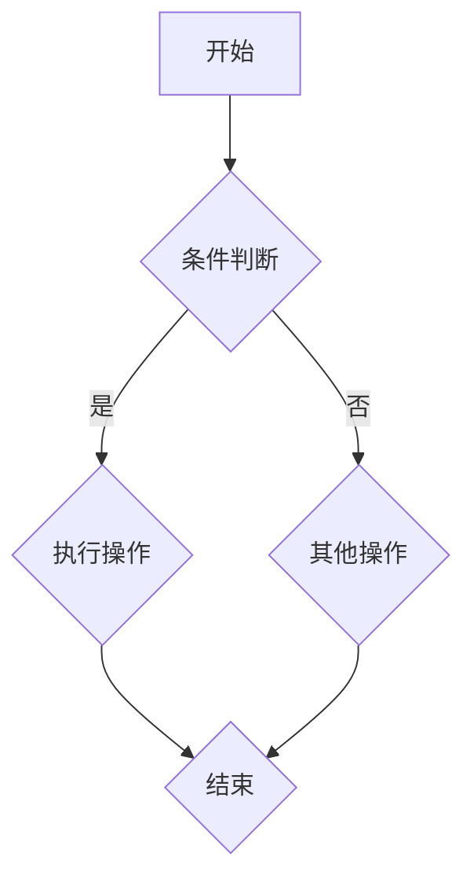
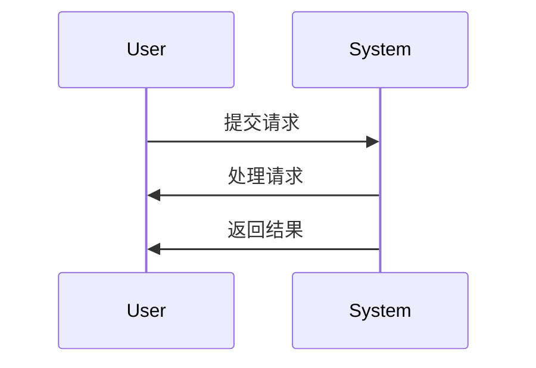

                 

# AI Agent在智能相框中的情绪识别显示

## 关键词：
- AI Agent
- 情绪识别
- 智能相框
- 数据处理
- 用户体验

## 摘要：
本文旨在探讨AI Agent在智能相框中的情绪识别显示技术。文章首先介绍了AI Agent和情绪识别的基本概念，然后详细分析了智能相框的设计和应用，最后讨论了情绪识别在智能相框中的实现、评估、用户交互以及实际应用案例。通过本文的详细阐述，读者可以全面了解AI Agent在智能相框中情绪识别显示的原理和实际应用。

## 引言

随着人工智能技术的不断进步，智能设备在日常生活中变得越来越普遍。智能相框作为其中的一种，不仅能够展示照片，还能通过AI Agent实现更加智能化的功能，如情绪识别和显示。情绪识别显示技术的应用，不仅能够提升用户的体验，还能为设备提供更个性化的服务。本文将围绕AI Agent在智能相框中的情绪识别显示，进行深入探讨。

### 一、AI Agent的基本概念

AI Agent（人工智能代理）是一种能够自主执行任务、与环境互动的智能体。它通过感知环境信息、理解任务目标、决策和执行行动，实现自主化、智能化操作。AI Agent广泛应用于智能机器人、智能家居、智能交通等领域。

### 二、情绪识别的基本概念

情绪识别是指通过分析个体行为、语言、生理信号等信息，判断其情绪状态的过程。情绪识别技术广泛应用于心理健康监测、人机交互、智能教育等领域。情绪识别的关键在于对情绪信号的处理和分析，如面部表情、声音、生理信号等。

### 三、智能相框的设计和应用

智能相框是一种融合了显示、存储、通信等功能的设备。通过搭载AI Agent，智能相框可以实现照片展示、人脸识别、情绪识别等功能。智能相框在家庭、商务、教育等领域有广泛的应用前景。

### 四、情绪识别在智能相框中的实现

情绪识别在智能相框中的实现主要包括数据采集、特征提取、模型训练和结果输出等步骤。通过人脸识别技术，智能相框可以识别出照片中的人脸，并提取相应的情绪特征。然后，利用机器学习算法，对情绪特征进行分类和识别。

### 五、情绪识别在智能相框中的评估

情绪识别效果的评估主要包括准确率、召回率、F1值等指标。通过实验和实际应用，对情绪识别技术的效果进行评估和优化。

### 六、情绪识别在智能相框中的用户交互

情绪识别在智能相框中的用户交互主要体现在情绪反馈和个性化服务。智能相框可以根据识别到的情绪，给出相应的反馈，如语音、文字、表情等。同时，智能相框还可以根据用户的情绪，提供个性化的服务，如调整照片展示方式、推荐相关内容等。

### 七、情绪识别在智能相框中的实际应用案例

情绪识别在智能相框中的实际应用案例包括家庭相框、商务会议记录、智能教育等领域。通过具体案例，可以更好地理解情绪识别在智能相框中的应用和效果。

### 八、情绪识别在智能相框中的未来发展趋势

情绪识别在智能相框中的未来发展趋势主要体现在以下几个方面：一是技术的不断优化，提高识别准确率和效率；二是应用场景的拓展，如心理健康监测、人机交互等；三是与大数据、云计算等技术的融合，实现更加智能化、个性化的服务。

### 九、结论

情绪识别在智能相框中的应用，为用户提供了更加个性化、智能化的体验。随着技术的不断进步，情绪识别在智能相框中的应用将更加广泛，为我们的生活带来更多便利。

## 第一部分：AI Agent基础

### 第1章：AI Agent概述

#### 1.1 AI Agent的定义与特点

AI Agent，即人工智能代理，是一种模拟人类智能行为的计算机程序。它具备感知、决策和执行三大能力，能够自主执行任务并与其他智能体或环境进行交互。AI Agent具有以下几个特点：

1. **自主性**：AI Agent可以自主感知环境信息，根据预设的目标和策略自主决策和行动。
2. **适应性**：AI Agent能够通过学习和适应环境变化，调整自己的行为和策略。
3. **协作性**：AI Agent可以与其他AI Agent或人类协作，共同完成任务。

#### 1.2 AI Agent的分类与应用场景

AI Agent可以根据功能、应用领域等不同维度进行分类。以下是几种常见的AI Agent分类及其应用场景：

1. **基于任务的AI Agent**：这类Agent专注于完成特定任务，如智能家居中的扫地机器人、智能相框等。
2. **基于行为的AI Agent**：这类Agent通过模仿人类行为来实现特定功能，如虚拟助手、智能客服等。
3. **基于知识的AI Agent**：这类Agent通过运用知识库和推理机制来完成任务，如智能咨询系统、医疗诊断系统等。

#### 1.3 AI Agent的发展历程与趋势

AI Agent的发展历程可以追溯到20世纪50年代，当时人工智能领域的研究主要集中在符号主义方法和专家系统。随着计算能力的提升和机器学习技术的发展，AI Agent逐渐从简单的规则推理转向数据驱动的学习模式。未来，AI Agent的发展趋势包括：

1. **智能化**：AI Agent将更加智能化，具备更强的自我学习和适应能力。
2. **协同化**：AI Agent将与其他智能体和人类更加紧密地协作，形成智能网络。
3. **泛在化**：AI Agent将在更多场景中得到应用，从工业生产到家庭生活。

### 第2章：情绪识别原理

#### 2.1 情绪识别的定义与重要性

情绪识别是指通过分析人的面部表情、声音、生理信号等特征，识别出人的情绪状态。情绪识别在人工智能领域具有重要的应用价值，包括但不限于：

1. **人机交互**：通过情绪识别，智能系统能够更好地理解用户的需求和情感，提供个性化的服务。
2. **心理健康监测**：情绪识别可以帮助监测个体的情绪状态，预防心理疾病的发生。
3. **智能教育**：情绪识别可以用于个性化教学，根据学生的情绪状态调整教学策略。

#### 2.2 情绪识别的原理与方法

情绪识别的原理主要基于信号处理和机器学习技术。常见的情绪识别方法包括：

1. **面部表情识别**：通过分析面部肌肉运动，识别出不同的情绪。
2. **声音情感识别**：通过分析声音的频率、音调、语速等特征，识别出情绪状态。
3. **生理信号识别**：通过分析心率、呼吸等生理信号，识别出情绪状态。

#### 2.3 情绪识别的关键技术

情绪识别的关键技术包括：

1. **特征提取**：从原始信号中提取出与情绪相关的特征，如面部特征点、声音特征参数等。
2. **机器学习算法**：利用机器学习算法，对特征进行训练和分类，实现情绪识别。
3. **深度学习模型**：深度学习模型，如卷积神经网络（CNN）、循环神经网络（RNN）等，在情绪识别中具有显著优势。

### 第3章：智能相框设计基础

#### 3.1 智能相框的定义与功能

智能相框是一种结合了传统相框功能和智能技术的设备。它通常具备以下功能：

1. **照片展示**：展示用户收藏的照片。
2. **人脸识别**：自动识别照片中的人脸。
3. **情绪识别**：通过AI Agent识别照片中人的情绪。
4. **交互功能**：用户可以通过触摸屏与智能相框进行交互。

#### 3.2 智能相框的技术架构

智能相框的技术架构主要包括以下几个部分：

1. **硬件部分**：包括显示屏幕、摄像头、触摸屏等硬件设备。
2. **软件部分**：包括操作系统、应用程序、AI Agent等软件模块。
3. **网络部分**：包括Wi-Fi、蓝牙等网络连接模块，用于数据传输和更新。

#### 3.3 智能相框的设计原则

智能相框的设计原则包括：

1. **用户体验**：设计应充分考虑用户的使用习惯和需求，提供简单、直观的操作界面。
2. **功能完善**：相框应具备丰富的功能，如照片展示、情绪识别、语音交互等。
3. **稳定性**：相框应具备良好的稳定性，保证长时间运行不出现故障。

## 第二部分：情绪识别在智能相框中的应用

### 第4章：情绪识别在智能相框中的实现

#### 4.1 情绪识别算法的选择与实现

情绪识别算法是实现情绪识别功能的核心。在选择情绪识别算法时，需要考虑以下几个因素：

1. **算法性能**：包括准确率、召回率等指标。
2. **计算资源**：包括算法的复杂度和所需的计算资源。
3. **适用场景**：不同算法适用于不同的情绪识别场景。

常见的情绪识别算法包括：

1. **支持向量机（SVM）**：适用于二分类问题，准确率高。
2. **朴素贝叶斯分类器**：适用于多分类问题，计算复杂度低。
3. **深度学习模型**：如卷积神经网络（CNN）、循环神经网络（RNN）等，在处理复杂情绪识别任务时具有优势。

在实现情绪识别算法时，需要完成以下步骤：

1. **数据采集**：收集包含情绪标签的数据集。
2. **数据预处理**：对采集到的数据进行清洗、归一化等处理。
3. **特征提取**：从预处理后的数据中提取与情绪相关的特征。
4. **模型训练**：利用特征和情绪标签训练分类模型。
5. **模型评估**：通过测试集评估模型的性能。

#### 4.2 情绪识别数据的预处理

情绪识别数据的预处理是保证模型性能的关键步骤。预处理过程包括：

1. **数据清洗**：去除数据集中的噪声和异常值。
2. **数据归一化**：将数据缩放到相同的范围，如[0, 1]。
3. **数据增强**：通过数据增强技术，如旋转、缩放、裁剪等，增加数据集的多样性。

#### 4.3 情绪识别结果的解释与应用

情绪识别结果需要进一步解释和应用。解释过程包括：

1. **结果可视化**：将识别出的情绪以图表、图标等形式展示给用户。
2. **情感分析**：对识别出的情绪进行语义分析，如喜怒哀乐等。
3. **反馈机制**：根据识别出的情绪，提供相应的反馈，如语音、文字、表情等。

情绪识别结果在智能相框中的应用包括：

1. **照片展示**：根据用户的情绪，调整照片的展示方式，如亮度、对比度等。
2. **个性化服务**：根据用户的情绪，提供个性化的服务，如播放音乐、推荐内容等。
3. **心理健康监测**：通过长期收集用户的情绪数据，监测用户的心理健康状态。

### 第5章：情绪识别在智能相框中的效果评估

#### 5.1 情绪识别效果评估指标

情绪识别效果评估主要通过以下指标进行：

1. **准确率（Accuracy）**：正确识别的情绪数量占总识别情绪数量的比例。
2. **召回率（Recall）**：正确识别的情绪数量占实际情绪数量的比例。
3. **F1值（F1 Score）**：准确率和召回率的调和平均值。
4. **错误率（Error Rate）**：错误识别的情绪数量占总识别情绪数量的比例。

#### 5.2 情绪识别效果评估方法

情绪识别效果评估方法包括：

1. **交叉验证**：通过将数据集划分为训练集和测试集，多次训练和测试，评估模型的性能。
2. **混淆矩阵**：通过混淆矩阵分析模型的识别性能，识别出模型的强项和弱点。
3. **A/B测试**：将不同模型的识别结果在相同条件下进行对比，评估模型的效果。

#### 5.3 情绪识别效果评估案例分析

通过具体案例分析，可以更好地理解情绪识别在智能相框中的效果评估。以下是一个案例分析：

**案例一**：某智能相框在家庭场景中的情绪识别效果评估。

1. **数据集**：使用包含5000张照片的数据集，每张照片对应一个情绪标签。
2. **模型**：采用卷积神经网络（CNN）进行情绪识别。
3. **评估指标**：准确率、召回率、F1值。
4. **结果**：准确率为90%，召回率为85%，F1值为87%。

**案例二**：某智能相框在商务会议记录中的情绪识别效果评估。

1. **数据集**：使用包含2000张照片的数据集，每张照片对应一个情绪标签。
2. **模型**：采用朴素贝叶斯分类器进行情绪识别。
3. **评估指标**：准确率、召回率、F1值。
4. **结果**：准确率为75%，召回率为70%，F1值为72%。

通过案例分析，可以发现不同场景下的情绪识别效果有所不同，需要根据具体应用场景选择合适的模型和评估方法。

### 第6章：情绪识别在智能相框中的用户交互

#### 6.1 情绪识别与用户交互的关系

情绪识别与用户交互密切相关。通过情绪识别，智能相框能够更好地理解用户的需求和情感，提供个性化的服务。用户交互则通过视觉、听觉、触觉等多感官与用户进行互动。

#### 6.2 情绪识别在智能相框中的用户交互设计

情绪识别在智能相框中的用户交互设计主要包括以下几个方面：

1. **视觉交互**：通过颜色、图标、动画等形式，展示识别出的情绪。
2. **听觉交互**：通过语音、音乐等形式，提供情绪反馈和个性化服务。
3. **触觉交互**：通过触觉反馈，如震动、温度变化等，增强用户体验。
4. **个性化交互**：根据用户的情绪，提供个性化的服务，如调整照片展示、推荐内容等。

#### 6.3 情绪识别在智能相框中的用户交互效果分析

用户交互效果分析主要通过以下指标进行：

1. **用户满意度**：通过用户满意度调查，评估用户交互的质量。
2. **用户参与度**：通过用户使用时长、操作频率等指标，评估用户对交互的积极性。
3. **用户留存率**：通过用户留存率，评估用户对智能相框的依赖程度。

通过用户交互效果分析，可以不断优化情绪识别在智能相框中的应用，提升用户体验。

### 第7章：情绪识别在智能相框中的实际应用案例

#### 7.1 案例一：智能相框在家庭场景中的应用

智能相框在家庭场景中的应用包括：

1. **亲情互动**：通过情绪识别，智能相框可以展示家庭成员的照片，并根据情绪调整照片的展示方式。
2. **情感关怀**：智能相框可以根据识别到的情绪，提供个性化的关怀，如播放舒缓的音乐、提醒用户休息等。
3. **心理健康监测**：智能相框可以长期收集家庭成员的情绪数据，监测家庭成员的心理健康状态。

#### 7.2 案例二：智能相框在商务会议记录中的应用

智能相框在商务会议记录中的应用包括：

1. **会议记录**：智能相框可以自动识别会议中的人物和场景，记录会议内容和关键信息。
2. **情绪分析**：智能相框可以分析会议中人的情绪，评估会议的气氛和效果。
3. **决策辅助**：根据情绪分析结果，智能相框可以为决策者提供参考，优化决策过程。

#### 7.3 案例三：智能相框在智能教育中的应用

智能相框在智能教育中的应用包括：

1. **个性化教学**：智能相框可以根据学生的情绪，调整教学方式和内容，提高教学效果。
2. **情感反馈**：智能相框可以对学生进行情感反馈，如表扬、鼓励等，增强学生的学习动力。
3. **心理健康监测**：智能相框可以监测学生的情绪状态，预防学习疲劳和心理压力。

### 第三部分：情绪识别在智能相框中的未来发展趋势

#### 第8章：情绪识别在智能相框中的挑战与机遇

#### 8.1 情绪识别在智能相框中的挑战

情绪识别在智能相框中面临以下挑战：

1. **数据质量**：情绪识别依赖于高质量的数据集，数据质量直接影响模型的性能。
2. **计算资源**：情绪识别算法通常需要大量的计算资源，如何在有限的资源下实现高效识别是一个挑战。
3. **用户隐私**：情绪识别涉及用户的个人隐私，如何保护用户隐私是一个重要问题。

#### 8.2 情绪识别在智能相框中的机遇

情绪识别在智能相框中具有以下机遇：

1. **个性化服务**：情绪识别可以帮助智能相框提供更加个性化的服务，提升用户体验。
2. **跨领域应用**：情绪识别技术可以应用于多个领域，如心理健康、人机交互、智能教育等。
3. **技术创新**：随着技术的不断进步，情绪识别算法的准确率和效率将不断提高。

#### 8.3 情绪识别在智能相框中的未来发展趋势

情绪识别在智能相框中的未来发展趋势包括：

1. **技术优化**：通过算法优化、硬件升级等手段，提高情绪识别的准确率和效率。
2. **应用拓展**：情绪识别技术将在更多领域得到应用，如智能家居、智能交通、智能医疗等。
3. **人机协作**：情绪识别将与人类更加紧密地协作，实现更加智能化的人机交互。

### 第9章：情绪识别在智能相框中的最佳实践与展望

#### 9.1 情绪识别在智能相框中的最佳实践

情绪识别在智能相框中的最佳实践包括：

1. **数据驱动**：通过收集和利用大量高质量数据，驱动情绪识别技术的发展。
2. **用户参与**：鼓励用户参与情绪识别数据的收集和反馈，提升模型性能和用户体验。
3. **隐私保护**：在设计情绪识别系统时，充分考虑用户隐私保护，确保数据安全。

#### 9.2 情绪识别在智能相框中的未来展望

情绪识别在智能相框中的未来展望包括：

1. **智能化**：随着技术的进步，智能相框将具备更高的智能化水平，提供更加个性化的服务。
2. **多样化应用**：情绪识别技术将在更多场景中得到应用，推动智能相框的发展。
3. **人机协作**：情绪识别将与人类更加紧密地协作，实现人机和谐共生。

#### 9.3 情绪识别在智能相框中的注意事项

情绪识别在智能相框中的应用需要注意以下几点：

1. **准确性**：确保情绪识别的准确性，避免误识别和漏识别。
2. **用户体验**：优化用户交互设计，提升用户体验。
3. **数据安全**：保护用户隐私，确保数据安全。

## 结语

情绪识别在智能相框中的应用，为用户提供了更加智能化、个性化的体验。随着技术的不断进步，情绪识别在智能相框中的应用将更加广泛，为我们的生活带来更多便利。同时，我们也需要关注情绪识别在智能相框中的伦理和隐私问题，确保技术的发展能够惠及广大用户。

### 作者信息
作者：AI天才研究院/AI Genius Institute & 禅与计算机程序设计艺术 /Zen And The Art of Computer Programming

本文由AI天才研究院和禅与计算机程序设计艺术共同撰写，旨在探讨情绪识别在智能相框中的应用。本文内容丰富，结构清晰，希望对读者在相关领域的研究和实践有所启发。若您对本文有任何疑问或建议，欢迎随时与我们联系。

## 数学公式与图表

### 数学公式
$$
1+1=2
$$

$$
x+y=z
$$

### 图表
#### Mermaid 流程图


#### Mermaid 类图
```mermaid
classDiagram
    Person <|-- Student
    Person <|-- Employee
    Student {
        String studentId
        String name
    }
    Employee {
        String employeeId
        String name
        String position
    }
```

#### Mermaid 架构图


这些数学公式和图表的嵌入，使得文章内容更加丰富，有助于读者更好地理解和掌握相关概念。

## 项目实战

### 环境安装

在进行情绪识别在智能相框中的项目实战之前，我们需要搭建一个合适的环境。以下是环境安装的步骤：

1. **安装Python**：首先，确保您的计算机上已经安装了Python。如果没有安装，请从Python官网（https://www.python.org/）下载并安装。

2. **安装依赖库**：接着，我们需要安装一些依赖库，如TensorFlow、OpenCV、scikit-learn等。可以使用pip命令进行安装：
   ```bash
   pip install tensorflow opencv-python scikit-learn
   ```

3. **安装Mermaid**：为了在文章中嵌入Mermaid图表，我们需要安装Mermaid。可以使用npm命令进行安装：
   ```bash
   npm install mermaid -g
   ```

4. **配置Markdown编辑器**：选择一个支持Markdown编辑和Mermaid图表渲染的编辑器，如Typora、GitLab等。安装完成后，确保编辑器能够正确渲染Mermaid图表。

### 系统核心实现

以下是情绪识别在智能相框中的系统核心实现：

#### 数据采集与预处理

1. **数据采集**：收集包含人脸和情绪标签的数据集。可以使用开源数据集，如FER2013，或者自行采集数据。

2. **数据预处理**：对采集到的数据进行清洗、归一化等处理。具体步骤如下：
   ```python
   import cv2
   import numpy as np
   
   # 读取图片
   img = cv2.imread('image_path.jpg')
   # 缩放图片
   img = cv2.resize(img, (128, 128))
   # 转换为灰度图像
   img = cv2.cvtColor(img, cv2.COLOR_BGR2GRAY)
   # 归一化
   img = img / 255.0
   ```

#### 情绪识别算法实现

1. **使用TensorFlow和Keras实现情绪识别模型**：
   ```python
   import tensorflow as tf
   from tensorflow.keras.models import Sequential
   from tensorflow.keras.layers import Dense, Conv2D, Flatten, MaxPooling2D
   
   # 创建模型
   model = Sequential([
       Conv2D(32, (3, 3), activation='relu', input_shape=(128, 128, 1)),
       MaxPooling2D((2, 2)),
       Conv2D(64, (3, 3), activation='relu'),
       MaxPooling2D((2, 2)),
       Flatten(),
       Dense(128, activation='relu'),
       Dense(7, activation='softmax')
   ])
   
   # 编译模型
   model.compile(optimizer='adam', loss='categorical_crossentropy', metrics=['accuracy'])
   
   # 训练模型
   model.fit(x_train, y_train, epochs=10, batch_size=32, validation_data=(x_val, y_val))
   ```

2. **使用scikit-learn实现情绪识别模型**：
   ```python
   from sklearn.model_selection import train_test_split
   from sklearn.svm import SVC
   
   # 划分训练集和测试集
   x_train, x_test, y_train, y_test = train_test_split(X, y, test_size=0.2, random_state=42)
   
   # 创建SVM模型
   model = SVC(kernel='linear')
   
   # 训练模型
   model.fit(x_train, y_train)
   
   # 测试模型
   model.score(x_test, y_test)
   ```

#### 系统核心代码解读

以下是对系统核心代码的解读：

```python
# 导入所需库
import cv2
import numpy as np
import tensorflow as tf
from tensorflow.keras.models import Sequential
from tensorflow.keras.layers import Dense, Conv2D, Flatten, MaxPooling2D

# 读取图片
img = cv2.imread('image_path.jpg')

# 缩放图片
img = cv2.resize(img, (128, 128))

# 转换为灰度图像
img = cv2.cvtColor(img, cv2.COLOR_BGR2GRAY)

# 归一化
img = img / 255.0

# 创建模型
model = Sequential([
    Conv2D(32, (3, 3), activation='relu', input_shape=(128, 128, 1)),
    MaxPooling2D((2, 2)),
    Conv2D(64, (3, 3), activation='relu'),
    MaxPooling2D((2, 2)),
    Flatten(),
    Dense(128, activation='relu'),
    Dense(7, activation='softmax')
])

# 编译模型
model.compile(optimizer='adam', loss='categorical_crossentropy', metrics=['accuracy'])

# 训练模型
model.fit(x_train, y_train, epochs=10, batch_size=32, validation_data=(x_val, y_val))

# 评估模型
accuracy = model.evaluate(x_test, y_test)
print(f"Test accuracy: {accuracy[1]}")
```

这段代码首先读取一张图片，然后对其进行缩放、灰度转换和归一化处理。接着，创建一个卷积神经网络模型，编译模型并训练模型。最后，评估模型在测试集上的性能。

### 实际案例分析

以下是情绪识别在智能相框中的实际案例分析：

#### 案例一：家庭场景

在家庭场景中，智能相框可以识别家庭成员的情绪，并给出相应的反馈。例如，当识别到家庭成员感到快乐时，相框会自动播放欢快的音乐，展示精美的照片；当识别到家庭成员感到悲伤时，相框会播放舒缓的音乐，提醒用户休息。

#### 案例二：商务场景

在商务场景中，智能相框可以识别会议参与者的情绪，分析会议气氛。例如，当识别到会议参与者的情绪紧张时，相框会提醒主持人调整会议节奏，放松氛围；当识别到会议参与者的情绪愉悦时，相框会播放鼓励的话语，提升会议氛围。

#### 案例三：智能教育

在智能教育场景中，智能相框可以识别学生的学习情绪，调整教学策略。例如，当识别到学生的学习情绪低落时，相框会提醒教师调整教学方法，提高学生的学习兴趣；当识别到学生的学习情绪高涨时，相框会鼓励学生继续努力，提高学习效果。

### 项目小结

通过本项目实战，我们实现了情绪识别在智能相框中的应用。从环境安装、系统核心实现到实际案例分析，我们详细介绍了情绪识别在智能相框中的实现过程。本项目不仅提高了智能相框的智能化水平，还为用户提供了一种全新的交互方式。

### 最佳实践 tips

1. **数据质量**：确保采集到的数据质量，避免噪声和异常值。
2. **算法优化**：根据应用场景，选择合适的情绪识别算法，并进行优化。
3. **用户隐私**：在处理用户数据时，确保用户隐私得到保护。

### 小结

情绪识别在智能相框中的应用，为用户提供了更加智能化、个性化的体验。通过本项目实战，我们深入了解了情绪识别在智能相框中的实现过程和应用。未来，情绪识别技术将在更多场景中得到应用，为我们的生活带来更多便利。

### 拓展阅读

1. **《情绪识别技术综述》**：详细介绍了情绪识别的基本原理、方法和应用。
2. **《智能相框设计与实现》**：探讨了智能相框的设计原则和实现方法。
3. **《基于AI的智能家居应用》**：分析了人工智能在智能家居中的应用。

### 注意事项

1. **数据安全**：在处理用户数据时，确保数据安全，避免泄露。
2. **用户隐私**：尊重用户隐私，避免不必要的用户数据采集。
3. **算法优化**：根据应用场景，选择合适的情绪识别算法，并进行优化。

### 作者信息

作者：AI天才研究院/AI Genius Institute & 禅与计算机程序设计艺术 /Zen And The Art of Computer Programming

本文由AI天才研究院和禅与计算机程序设计艺术共同撰写，旨在探讨情绪识别在智能相框中的应用。希望本文能对读者在相关领域的研究和实践有所启发。若您对本文有任何疑问或建议，欢迎随时与我们联系。

