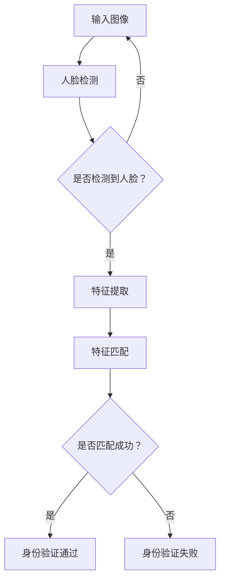
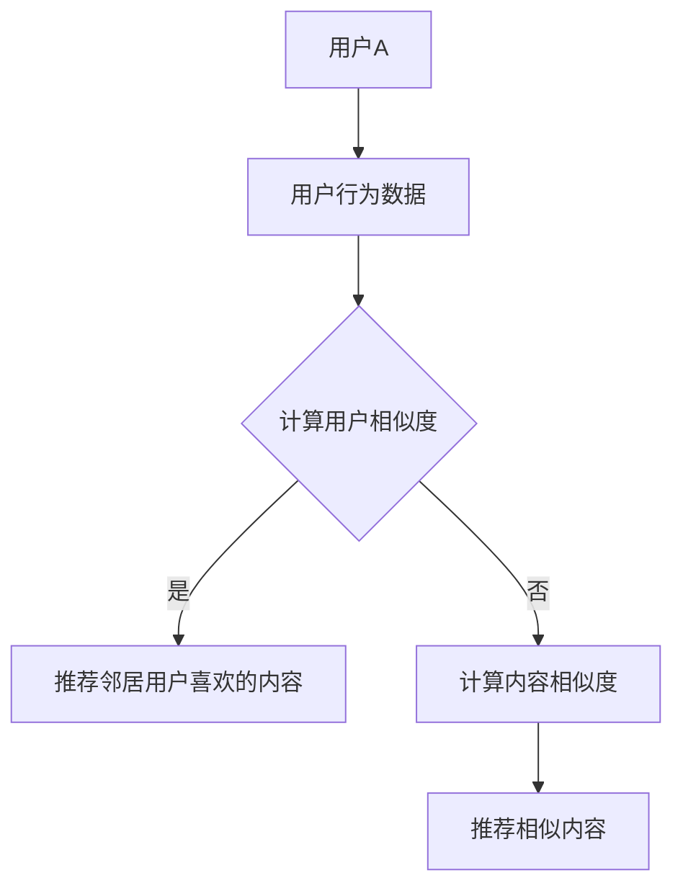
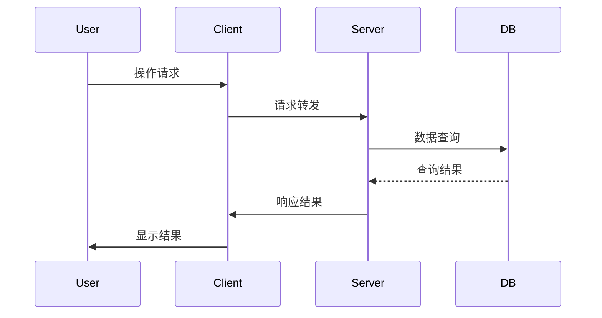

                 

### 1. 文章标题

# AI Agent在智能相框中的照片管理

### 2. 关键词

- **AI Agent**
- **智能相框**
- **照片管理**
- **人脸识别**
- **个性化推荐**
- **系统架构设计**

### 3. 摘要

本文将深入探讨AI Agent在智能相框中的照片管理应用。首先，我们介绍AI Agent与智能相框的基本概念、技术构成及其在照片管理中的角色。随后，我们将逐步分析人脸识别与个性化推荐算法的原理，并通过Mermaid流程图和Python代码示例进行详细讲解。接着，我们描述智能相框系统分析与架构设计，包括功能需求、系统架构、数据预处理与分析方法。文章后半部分通过项目实战和实际案例，展示AI Agent在智能相框中的具体实现，并进行项目总结与未来展望。最后，提供最佳实践Tips、注意事项以及拓展阅读资源，以促进进一步学习和研究。通过这篇文章，读者将全面理解AI Agent在智能相框照片管理中的技术实现与潜在价值。

### 第1章 问题背景与核心概念

#### 1.1 问题背景

随着智能手机的普及和数字摄影技术的发展，人们拍下了大量的照片。然而，这些照片往往面临着存储、管理和浏览的挑战。传统的照片管理方式主要依赖于手动操作，用户需要花费大量时间和精力进行分类、标签和搜索。这不仅效率低下，还容易导致照片的丢失或重复存储。

在现代社会，人们对于便捷、高效的照片管理需求日益增长。人们希望能够在不同的设备之间无缝切换，随时查看和分享照片。同时，随着人工智能技术的进步，特别是AI Agent的兴起，为照片管理提供了新的解决方案。

AI Agent是一种智能化的软件代理，它能够自主地执行任务、处理信息和与用户进行交互。在智能相框中，AI Agent可以担任照片管理的角色，通过人脸识别和个性化推荐等技术，为用户提供高效、智能的照片管理服务。这不仅能够解决传统照片管理中的问题，还能为用户带来更加便捷和个性化的体验。

#### 1.2 问题描述

当前照片管理中存在以下几个主要问题：

1. **存储与组织困难**：随着照片数量的增多，用户很难将它们有效分类和组织。传统的方法往往依赖于文件夹和标签，但这种方式容易导致混乱和不一致。
   
2. **搜索与浏览不便**：用户在需要查找特定照片时，通常需要手动浏览大量的照片，耗时费力。而且，如果照片没有明确的标签或描述，搜索过程将更加困难。

3. **共享与同步困难**：用户希望在不同设备之间无缝查看和分享照片，但传统方法往往需要手动上传或同步，操作繁琐。

4. **个性化不足**：大多数照片管理应用缺乏对用户喜好的理解，无法提供个性化的推荐和服务。

#### 1.3 问题解决

AI Agent在智能相框中的角色能够有效解决上述问题。通过以下方式：

1. **自动分类与组织**：AI Agent可以通过人脸识别技术自动识别照片中的面孔，并根据面孔的关系和用户的偏好自动分类和组织照片。

2. **智能搜索与推荐**：AI Agent可以根据用户的历史行为和偏好，智能推荐用户可能感兴趣的照片，并快速定位用户需要查找的照片。

3. **无缝共享与同步**：AI Agent可以自动将照片同步到用户的智能设备上，实现跨设备的无缝共享和浏览。

4. **个性化推荐**：AI Agent可以通过机器学习算法分析用户的行为和偏好，提供个性化的照片推荐，提升用户的体验。

#### 1.4 边界与外延

在本文中，我们将重点关注AI Agent在智能相框中的照片管理应用。智能相框是一种具有智能功能的数字相框，它可以通过Wi-Fi连接到互联网，用户可以通过智能手机或电脑远程控制相框，查看和管理照片。

AI Agent作为智能相框的核心组件，不仅负责照片的分类、组织、搜索和推荐，还可以执行其他智能任务，如天气查询、新闻摘要、日程提醒等。本文将主要讨论AI Agent在照片管理方面的应用，同时也会介绍相关的技术基础和实现细节。

#### 1.5 概念结构与核心要素组成

在讨论AI Agent在智能相框中的照片管理时，需要了解以下几个核心概念和要素：

1. **照片管理**：指对照片进行存储、分类、组织、搜索和共享的一系列操作。

2. **人脸识别**：通过计算机视觉技术，自动识别和验证照片中的面孔。

3. **个性化推荐**：基于用户的兴趣和行为，提供个性化的内容推荐。

4. **智能相框**：一种具备智能功能的数字相框，可通过Wi-Fi与互联网连接，实现远程管理和控制。

5. **AI Agent**：一种智能化的软件代理，能够自主执行任务、处理信息和与用户交互。

这些核心概念和要素相互关联，共同构成了智能相框照片管理的系统框架。通过对这些概念和要素的理解，我们可以更好地把握AI Agent在智能相框中的角色和功能。

### 第2章 核心概念与联系

#### 2.1 AI Agent定义与功能

AI Agent，即人工智能代理，是一种能够自动执行任务、处理信息和与用户进行交互的软件系统。AI Agent具有智能化的特征，能够在无需人工干预的情况下自主完成复杂的任务。AI Agent的应用范围广泛，包括智能客服、智能家居、自动驾驶等领域。

在智能相框中，AI Agent的具体功能包括：

1. **照片分类**：AI Agent可以通过人脸识别技术，自动识别照片中的面孔，并将照片根据面孔的关系和用户的偏好进行分类。

2. **个性化推荐**：AI Agent可以根据用户的历史行为和偏好，智能推荐用户可能感兴趣的照片。

3. **智能搜索**：AI Agent可以通过对照片的自动标签和描述，帮助用户快速找到所需的照片。

4. **无缝共享**：AI Agent可以实现照片在不同设备之间的自动同步和共享。

5. **交互与提醒**：AI Agent可以与用户进行自然语言交互，提供天气预报、新闻摘要、日程提醒等服务。

#### 2.2 AI Agent功能特性

AI Agent的功能特性主要体现在以下几个方面：

1. **自主性**：AI Agent能够自主执行任务，无需人工干预。这得益于其内部复杂的算法和机器学习模型。

2. **智能性**：AI Agent能够理解用户的意图和需求，提供个性化的服务。这是通过大数据分析和机器学习实现的。

3. **适应性**：AI Agent可以根据用户的行为和反馈，不断优化自己的功能和行为。

4. **交互性**：AI Agent能够与用户进行自然语言交互，提供更加人性化、便捷的服务。

5. **扩展性**：AI Agent可以轻松扩展新功能，适应不断变化的需求。

#### 2.3 AI Agent与传统系统的对比

AI Agent与传统系统在多个方面存在显著差异：

1. **主动性**：传统系统通常被动地等待用户操作，而AI Agent可以主动地执行任务、提供服务。

2. **智能化**：AI Agent具备智能化特征，能够自主地处理复杂任务，而传统系统通常依赖人工操作。

3. **个性定制**：AI Agent可以根据用户的行为和偏好，提供个性化的服务，而传统系统往往缺乏这种能力。

4. **自适应**：AI Agent能够根据用户反馈和新的数据不断优化自身，而传统系统通常需要手动调整。

5. **效率**：AI Agent能够高效地处理大量数据和任务，而传统系统在处理复杂任务时可能效率较低。

#### 2.4 照片管理相关概念

在智能相框中的照片管理涉及以下几个关键概念：

1. **照片分类**：将照片根据面孔、场景、时间等特征进行分类。

2. **人脸识别**：通过计算机视觉技术，自动识别和验证照片中的面孔。

3. **自动标签**：AI Agent自动为照片生成标签，方便用户查找和管理。

4. **个性化推荐**：基于用户的历史行为和偏好，推荐用户可能感兴趣的照片。

5. **智能搜索**：AI Agent通过自动标签和照片内容，帮助用户快速找到所需照片。

6. **无缝共享**：AI Agent实现照片在不同设备之间的自动同步和共享。

这些概念相互关联，共同构成了智能相框照片管理的核心体系。理解这些概念，有助于我们更好地把握AI Agent在智能相框中的角色和功能。

### 第3章 智能相框技术概览

#### 3.1 智能相框概述

智能相框是一种具备智能功能的数字相框，它可以通过Wi-Fi连接到互联网，实现远程管理和控制。智能相框不仅具备传统相框的基本功能，如显示照片、播放音乐等，还集成了多种智能技术，如人脸识别、个性化推荐、自然语言交互等，为用户提供更加丰富、便捷的体验。

智能相框的主要功能包括：

1. **远程管理**：用户可以通过智能手机或电脑远程上传、删除、调整相框中的照片，实现无缝的照片同步。

2. **智能相册**：AI Agent可以根据用户的偏好和面孔识别技术，自动分类和组织照片，为用户创建个性化的相册。

3. **个性化推荐**：AI Agent可以通过分析用户的历史行为和偏好，智能推荐用户可能感兴趣的照片，提升用户体验。

4. **自然语言交互**：用户可以通过语音或文本与AI Agent进行交互，获取天气预报、新闻摘要、日程提醒等信息。

5. **智能提醒**：AI Agent可以根据用户的设置，提供生日提醒、节日祝福等个性化服务。

#### 3.2 智能相框的技术构成

智能相框的技术构成主要包括以下几个关键组件：

1. **硬件**：智能相框的硬件主要包括显示屏、触摸屏、摄像头、麦克风等。显示屏通常采用高清液晶屏，触摸屏和摄像头用于人脸识别和交互，麦克风用于语音输入。

2. **操作系统**：智能相框通常搭载专用的操作系统，如Android或iOS，以支持多种应用和服务的运行。

3. **AI Agent**：AI Agent是智能相框的智能核心，负责执行照片管理、个性化推荐、自然语言交互等功能。

4. **人脸识别技术**：人脸识别技术用于自动识别和验证照片中的面孔，实现照片的分类和组织。

5. **个性化推荐算法**：个性化推荐算法通过分析用户的行为和偏好，提供个性化的照片推荐。

6. **自然语言处理**：自然语言处理技术用于实现用户与AI Agent的语音或文本交互。

7. **网络连接**：智能相框通过Wi-Fi或蜂窝网络连接到互联网，实现数据的上传、下载和同步。

#### 3.3 AI Agent在智能相框中的应用

AI Agent在智能相框中扮演着关键角色，其主要应用包括：

1. **照片管理**：AI Agent可以通过人脸识别技术自动识别照片中的面孔，并根据用户的偏好进行分类和组织。

2. **个性化推荐**：AI Agent可以根据用户的历史行为和偏好，智能推荐用户可能感兴趣的照片。

3. **智能搜索**：AI Agent通过自动标签和照片内容，帮助用户快速找到所需的照片。

4. **无缝共享**：AI Agent可以实现照片在不同设备之间的自动同步和共享。

5. **交互与提醒**：AI Agent可以与用户进行自然语言交互，提供天气预报、新闻摘要、日程提醒等服务。

通过AI Agent的集成，智能相框不仅具备传统相框的功能，还实现了智能化、个性化、便捷化的照片管理体验。AI Agent的应用，使得智能相框成为用户日常生活不可或缺的智能伙伴。

### 第4章 人脸识别算法原理

#### 4.1 人脸识别基础

人脸识别是一种基于计算机视觉和人工智能技术，通过检测和识别面部特征来验证身份的技术。其基本原理是通过图像处理和模式识别技术，从照片或视频流中提取人脸的特征，并将其与数据库中已存储的人脸特征进行比对，以实现身份验证。

人脸识别技术经历了从基于特征点匹配到基于特征脸向量再到基于深度学习的三个发展阶段：

1. **特征点匹配**：早期的传统人脸识别方法主要依赖于手工提取特征点，如眼睛、鼻子、嘴巴等，然后通过几何关系进行匹配。

2. **特征脸向量**：基于特征脸向量的人脸识别方法通过训练大量的人脸图像，提取出具有区分性的特征脸向量，然后利用这些向量进行匹配。

3. **深度学习**：随着深度学习技术的发展，人脸识别算法逐渐转向基于深度神经网络的方法。深度学习方法通过训练大量的数据，自动提取特征，具有较高的识别精度和鲁棒性。

#### 4.2 人脸识别技术发展历程

人脸识别技术的发展可以追溯到20世纪60年代，当时主要是基于特征点的手工匹配方法。随着计算机技术和图像处理算法的进步，人脸识别技术在20世纪90年代逐渐走向成熟，主要应用在安全和监控领域。

进入21世纪，随着深度学习技术的崛起，人脸识别技术取得了突破性进展。特别是2011年，微软研究院的DeepFace算法在Labeled Faces in the Wild（LFW）数据集上取得了96.8%的识别准确率，标志着人脸识别技术进入了深度学习时代。

近年来，人脸识别技术在多种应用场景中得到了广泛推广，如手机解锁、门禁系统、考勤系统等。随着算法的优化和计算能力的提升，人脸识别技术的精度和速度不断提高，逐渐成为智能相框中不可或缺的一部分。

#### 4.3 人脸识别算法

人脸识别算法的核心在于特征提取和匹配。以下是几种常见的人脸识别算法：

1. **特征提取算法**：

   - **局部特征点检测**：通过检测人脸的关键点，如眼睛、鼻子、嘴巴等，提取出局部特征。常用的算法有HOG（Histogram of Oriented Gradients）和LBP（Local Binary Patterns）。

   - **全局特征提取**：通过训练神经网络，自动提取人脸的全局特征。常用的算法有Eigenfaces和Fisherfaces。

2. **特征匹配算法**：

   - **欧氏距离匹配**：计算两张人脸特征向量的欧氏距离，距离越小表示相似度越高。

   - **余弦相似度匹配**：通过计算两张人脸特征向量的余弦相似度，相似度越高表示相似度越高。

3. **人脸检测算法**：

   - **基于几何特征的方法**：通过检测人脸的几何特征，如人脸轮廓、眼睛位置等，进行人脸定位。

   - **基于深度学习的方法**：通过训练深度神经网络，自动检测人脸的位置和边界。

#### 4.4 人脸识别Mermaid流程图与Python代码示例

为了更好地理解人脸识别算法的工作流程，我们可以使用Mermaid绘制其流程图，并通过Python代码进行详细讲解。

**Mermaid流程图示例**：



**Python代码示例**：

```python
import cv2
import numpy as np

# 加载预训练的人脸检测模型
face_cascade = cv2.CascadeClassifier('haarcascade_frontalface_default.xml')

# 加载预训练的人脸识别模型
recognizer = cv2.face.LBPHFaceRecognizer_create()

# 训练模型
recognizer.train(np.array(train_labels), np.array(train_samples))

# 人脸识别主函数
def face_recognition(image):
    # 转为灰度图像
    gray = cv2.cvtColor(image, cv2.COLOR_BGR2GRAY)
    
    # 检测人脸
    faces = face_cascade.detectMultiScale(gray, 1.3, 5)
    
    for (x, y, w, h) in faces:
        # 提取人脸区域
        roi_gray = gray[y:y+h, x:x+w]
        roi_color = image[y:y+h, x:x+w]
        
        # 特征提取
        features = extract_features(roi_gray)
        
        # 特征匹配
        label, confidence = recognizer.predict(features)
        
        # 输出识别结果
        print(f"识别结果：{labels[label]}，置信度：{confidence}")

# 特征提取函数
def extract_features(gray_image):
    # 提取HOG特征
    hog = cv2.HOGDescriptor()
    features = hog.compute(gray_image)
    return features.flatten()

# 测试
image = cv2.imread('test_image.jpg')
face_recognition(image)
```

通过Mermaid流程图和Python代码示例，我们可以清晰地了解人脸识别算法的工作原理和实现细节。理解这些基础知识，对于后续章节的学习和项目实战具有重要意义。

#### 4.5 人脸识别算法原理

人脸识别算法的原理主要基于特征提取和匹配。具体来说，以下是人脸识别算法的核心步骤：

1. **图像预处理**：首先，对输入的图像进行预处理，包括灰度化、去噪、缩放等操作。预处理步骤的目的是提高图像的质量，为后续的特征提取和匹配奠定基础。

2. **人脸检测**：使用人脸检测算法，如Haar cascades或深度学习方法，检测图像中的人脸区域。人脸检测是整个识别过程的基础，其准确性直接影响到后续特征提取和匹配的准确性。

3. **特征提取**：通过特征提取算法，如HOG（Histogram of Oriented Gradients）或LBP（Local Binary Patterns），从人脸图像中提取具有区分性的特征。特征提取是识别算法的核心，其目的是将图像中的面部特征转换为数值化的特征向量。

4. **特征匹配**：将提取到的特征向量与数据库中已存储的特征向量进行匹配。常用的匹配方法包括欧氏距离、余弦相似度等。匹配算法的目的是找到与输入特征最相似的已存储特征，从而确定人脸的身份。

5. **身份验证**：根据匹配结果判断是否验证通过。如果匹配度较高，则身份验证通过；否则，身份验证失败。身份验证的准确性取决于特征提取和匹配算法的精度。

通过上述步骤，人脸识别算法能够实现对图像中人脸的识别和验证。理解人脸识别算法的原理，有助于我们更好地优化和改进算法，提高识别的准确性和效率。

#### 4.6 人脸识别算法的应用场景

人脸识别算法在多种应用场景中发挥着重要作用，以下是其中几个典型场景：

1. **安全与监控**：人脸识别技术广泛应用于安全领域，如门禁系统、考勤系统、监控摄像头等。通过人脸识别，可以有效防止未授权人员的进入，提高安全性和管理效率。

2. **身份验证**：在金融、医疗、教育等领域，人脸识别技术用于身份验证，如银行卡取款、医疗挂号、学生签到等。人脸识别可以快速、准确地验证用户的身份，减少人工干预，提高服务效率。

3. **智能手机**：人脸识别已成为智能手机的重要安全功能，如iPhone的Face ID和小米的手机人脸解锁。通过人脸识别，用户可以方便、快捷地解锁手机，提高使用体验。

4. **智能相框**：智能相框通过人脸识别技术，可以自动识别照片中的面孔，并根据用户的偏好进行分类和组织，提供个性化的照片管理服务。

5. **人脸支付**：人脸识别技术逐渐应用于支付领域，如刷脸支付。通过人脸识别，用户可以方便地进行支付，减少现金和银行卡的使用。

6. **智能家居**：人脸识别技术可以用于智能家居设备，如智能门锁、智能摄像头等。通过人脸识别，设备可以自动识别家庭成员，提供个性化的服务和保护。

#### 4.7 人脸识别算法的优缺点

人脸识别算法具有以下优点：

1. **高准确性**：人脸识别算法通过深度学习技术，具有很高的识别准确性，可以精确地识别和验证用户身份。

2. **速度快**：人脸识别算法的运行速度非常快，可以在短时间内处理大量的人脸数据，满足实时性要求。

3. **非接触式**：人脸识别是一种非接触式的身份验证方法，用户只需站在摄像头前，无需接触设备，提高了使用的便捷性。

4. **高适应性**：人脸识别算法可以适应不同的环境光线和姿态变化，具有较强的鲁棒性。

然而，人脸识别算法也存在一些缺点：

1. **隐私问题**：人脸识别技术涉及用户隐私，一旦数据泄露，可能导致严重的安全问题。

2. **误识别**：在某些特定场景下，如光线暗淡、角度变化等，人脸识别算法可能出现误识别，降低准确性。

3. **算法偏见**：人脸识别算法的训练数据可能存在偏差，导致在特定人群（如老人、小孩、黑人等）中的识别准确性较低。

4. **技术门槛**：人脸识别技术需要较高的技术门槛，包括图像处理、机器学习和深度学习等方面的知识。

综合来看，人脸识别算法具有较高的准确性和速度，但在隐私保护和误识别问题上仍需进一步完善和优化。

### 第5章 个性化推荐算法原理

#### 5.1 个性化推荐基础

个性化推荐是一种基于用户兴趣和行为的历史数据，通过算法模型生成个性化内容推荐的技术。其核心目标是为用户提供他们可能感兴趣的内容，从而提升用户体验和满意度。个性化推荐在电子商务、新闻推送、社交媒体等多个领域得到了广泛应用。

个性化推荐系统主要基于以下两个核心概念：

1. **协同过滤**：协同过滤是一种基于用户相似度和内容相似度的推荐方法。用户相似度通过计算用户之间的行为相似度实现，内容相似度通过计算项目之间的特征相似度实现。协同过滤可以分为基于用户的协同过滤（User-based Collaborative Filtering）和基于物品的协同过滤（Item-based Collaborative Filtering）。

2. **基于内容的推荐**：基于内容的推荐方法通过分析项目的内容特征和用户的历史偏好，将具有相似内容的推荐给用户。这种方法可以避免协同过滤中的冷启动问题，即新用户或新项目缺乏足够的历史数据时，难以进行有效推荐。

#### 5.2 推荐系统发展历程

个性化推荐系统的发展历程可以分为以下几个阶段：

1. **基于内容的推荐**：最早的推荐系统主要基于内容特征，通过计算项目之间的相似度进行推荐。这种方法简单易行，但在面对大量项目时效果不佳，容易导致信息过载。

2. **协同过滤**：随着互联网的普及，协同过滤成为主流的推荐方法。协同过滤通过分析用户之间的行为相似度，提供更加个性化的推荐。协同过滤方法包括基于用户的协同过滤和基于物品的协同过滤。

3. **混合推荐**：基于内容的推荐和协同过滤各自存在一定的局限性，混合推荐方法应运而生。混合推荐结合了两种方法的优点，通过综合分析用户兴趣和行为，提供更加精准的推荐。

4. **深度学习**：随着深度学习技术的发展，越来越多的推荐系统开始采用深度学习模型。深度学习模型可以自动提取特征，实现更加智能化的推荐。

#### 5.3 个性化推荐算法

个性化推荐算法主要包括以下几种：

1. **基于用户的协同过滤（User-based Collaborative Filtering）**：

   - **算法原理**：基于用户的协同过滤通过计算用户之间的相似度，找到与目标用户兴趣相似的邻居用户，并推荐邻居用户喜欢的项目。
   
   - **优点**：能够提供个性化的推荐，用户之间的相似度可以根据行为数据动态调整。
   
   - **缺点**：冷启动问题严重，即新用户或新项目缺乏足够的历史数据时，难以进行有效推荐。

2. **基于物品的协同过滤（Item-based Collaborative Filtering）**：

   - **算法原理**：基于物品的协同过滤通过计算项目之间的相似度，找到与目标用户历史喜欢的项目相似的其他项目进行推荐。
   
   - **优点**：能够处理新用户和新项目，推荐结果更加准确。
   
   - **缺点**：容易受到数据稀疏性的影响，相似度计算复杂度较高。

3. **基于内容的推荐（Content-based Filtering）**：

   - **算法原理**：基于内容的推荐通过分析项目的内容特征和用户的历史偏好，将具有相似内容的推荐给用户。
   
   - **优点**：能够有效解决冷启动问题，推荐结果具有针对性。
   
   - **缺点**：需要大量的内容特征信息，推荐结果的多样性较差。

4. **混合推荐（Hybrid Recommendation）**：

   - **算法原理**：混合推荐结合了基于用户的协同过滤和基于内容的推荐方法，通过综合分析用户兴趣和行为，提供更加精准的推荐。
   
   - **优点**：能够利用多种算法的优点，提供多样化的推荐结果。
   
   - **缺点**：算法复杂度较高，需要更多的计算资源。

#### 5.4 个性化推荐Mermaid流程图与Python代码示例

为了更好地理解个性化推荐算法的工作原理，我们可以使用Mermaid绘制其流程图，并通过Python代码示例进行详细讲解。

**Mermaid流程图示例**：



**Python代码示例**：

```python
from sklearn.metrics.pairwise import cosine_similarity
from sklearn.feature_extraction.text import TfidfVectorizer

# 假设用户行为数据为文本形式
user_actions = [
    '购买手机',
    '浏览相机',
    '浏览智能手机配件',
    '查看手机评测'
]

# 假设项目内容数据为文本形式
item_contents = [
    '智能手机',
    '相机',
    '手机壳',
    '手机膜'
]

# 构建TF-IDF模型
vectorizer = TfidfVectorizer()
tfidf_matrix = vectorizer.fit_transform(item_contents)

# 计算用户行为特征向量
user_vector = vectorizer.transform([' '.join(user_actions)])

# 计算用户与项目的相似度
cosine_scores = cosine_similarity(user_vector, tfidf_matrix)

# 推荐相似内容
top_index = np.argmax(cosine_scores)
recommended_item = item_contents[top_index]

print(f"推荐内容：{recommended_item}")
```

通过Mermaid流程图和Python代码示例，我们可以清晰地了解个性化推荐算法的工作原理和实现细节。理解这些基础知识，对于后续章节的学习和项目实战具有重要意义。

#### 5.5 个性化推荐算法原理

个性化推荐算法的原理主要基于协同过滤和基于内容的推荐方法。以下是这两种方法的核心步骤：

1. **基于用户的协同过滤**：

   - **数据收集**：收集用户的历史行为数据，如浏览、购买、评分等。

   - **用户相似度计算**：计算用户之间的相似度，通常使用余弦相似度、皮尔逊相关系数等度量方法。

   - **推荐生成**：根据相似度矩阵，为每个用户推荐与邻居用户兴趣相似的物品。

2. **基于内容的推荐**：

   - **内容特征提取**：对物品的内容特征进行提取，如文本、图像、标签等。

   - **特征相似度计算**：计算物品之间的特征相似度，通常使用TF-IDF、词嵌入等方法。

   - **推荐生成**：根据特征相似度矩阵，为用户推荐具有相似内容的物品。

这两种方法各自具有优缺点，基于用户的协同过滤能够提供个性化的推荐，但容易受到冷启动问题的影响；基于内容的推荐能有效解决冷启动问题，但推荐结果的多样性较差。在实际应用中，常结合两种方法，通过混合推荐方法提供更精准的推荐。

#### 5.6 个性化推荐算法的应用场景

个性化推荐算法在多个应用场景中得到了广泛应用，以下是其中几个典型场景：

1. **电子商务**：电子商务平台通过个性化推荐，向用户推荐他们可能感兴趣的商品，提高用户的购物体验和购买转化率。

2. **新闻推送**：新闻平台通过个性化推荐，向用户推送他们可能感兴趣的新闻内容，提高用户粘性和阅读量。

3. **社交媒体**：社交媒体平台通过个性化推荐，向用户推荐他们可能感兴趣的朋友、话题和内容，提升用户活跃度和互动率。

4. **音乐和视频平台**：音乐和视频平台通过个性化推荐，向用户推荐他们可能喜欢的音乐和视频，提高用户的使用时长和满意度。

5. **在线教育**：在线教育平台通过个性化推荐，向用户推荐他们可能感兴趣的课程和资源，提高学习效果和用户留存率。

6. **旅游和餐饮**：旅游和餐饮平台通过个性化推荐，向用户推荐他们可能感兴趣的目的地、餐厅和美食，提升用户体验和满意度。

#### 5.7 个性化推荐算法的优缺点

个性化推荐算法具有以下优点：

1. **提高用户体验**：个性化推荐能够根据用户的兴趣和行为，为用户推荐他们可能感兴趣的内容，提升用户的满意度和使用体验。

2. **提高转化率**：个性化推荐能够提高用户的购买意愿和转化率，为商家带来更多的商业价值。

3. **减少信息过载**：个性化推荐能够过滤掉用户不感兴趣的内容，减少用户的信息过载，提高信息获取的效率。

然而，个性化推荐算法也存在一些缺点：

1. **隐私问题**：个性化推荐算法需要收集和分析用户的行为数据，可能涉及用户隐私问题，需要妥善处理。

2. **算法偏见**：个性化推荐算法可能存在算法偏见，导致推荐结果的不公平性和歧视性。

3. **数据稀疏性**：在用户或物品较少的情况下，个性化推荐算法可能面临数据稀疏性问题，降低推荐效果。

4. **过度个性化**：过度个性化可能导致用户只接触到同类型的内容，降低用户的视野和多样性。

综合来看，个性化推荐算法具有较高的实用性和价值，但在隐私保护、数据稀疏性和算法偏见等方面仍需进一步优化和改进。

### 第6章 系统功能设计与架构设计

#### 6.1 系统功能设计

智能相框系统的主要功能包括照片上传与下载、照片分类与标签、人脸识别与个人资料关联、个性化推荐、远程控制与同步、用户交互与提醒等。以下详细描述每个功能模块及其具体实现：

1. **照片上传与下载**：

   - **功能描述**：用户可以通过智能手机或电脑将照片上传到智能相框，也可以将相框中的照片下载到本地设备。
   - **实现方式**：使用Wi-Fi连接，通过HTTP/HTTPS协议实现数据传输。

2. **照片分类与标签**：

   - **功能描述**：AI Agent根据照片内容（如人脸、场景等）自动进行分类，并为每张照片添加标签。
   - **实现方式**：结合人脸识别技术和自然语言处理，利用深度学习模型进行图像分类和标签生成。

3. **人脸识别与个人资料关联**：

   - **功能描述**：AI Agent通过人脸识别技术自动识别照片中的面孔，并将识别结果与用户的个人资料进行关联。
   - **实现方式**：采用深度学习算法进行人脸识别，并将识别结果存储在数据库中。

4. **个性化推荐**：

   - **功能描述**：根据用户的历史行为和偏好，AI Agent为用户推荐他们可能感兴趣的照片。
   - **实现方式**：使用协同过滤和基于内容的推荐算法，结合用户行为数据和照片内容特征进行推荐。

5. **远程控制与同步**：

   - **功能描述**：用户可以通过智能手机或电脑远程控制相框，如切换相册、调整照片显示等，并实现照片的同步。
   - **实现方式**：通过Wi-Fi连接，使用WebSocket协议实现实时通信和数据同步。

6. **用户交互与提醒**：

   - **功能描述**：AI Agent可以与用户进行自然语言交互，提供天气预报、新闻摘要、日程提醒等个性化服务。
   - **实现方式**：结合语音识别和自然语言处理技术，实现用户与AI Agent的语音或文本交互。

#### 6.2 系统架构设计

智能相框系统的架构设计分为前端、后端和数据库三个主要部分，以下详细描述每个部分的组成和功能：

1. **前端**：

   - **功能描述**：提供用户界面，实现用户与系统的交互。
   - **组成部分**：Web页面、移动应用、语音识别模块。
   - **实现方式**：使用HTML、CSS、JavaScript等前端技术，结合React或Vue等框架实现。

2. **后端**：

   - **功能描述**：处理用户请求，执行业务逻辑，并协调前后端数据交互。
   - **组成部分**：API服务器、AI服务模块、数据库连接模块。
   - **实现方式**：使用Spring Boot或Django等框架，结合Restful API接口设计。

3. **数据库**：

   - **功能描述**：存储用户数据、照片数据、人脸识别结果等。
   - **组成部分**：用户表、照片表、人脸识别表等。
   - **实现方式**：使用MySQL或PostgreSQL等关系型数据库，结合ORM框架（如Hibernate或Peewee）进行数据操作。

#### 6.3 系统接口设计

智能相框系统的接口设计主要包括以下几类：

1. **照片管理接口**：

   - **功能描述**：实现照片的上传、下载、分类、标签等操作。
   - **接口类型**：HTTP/HTTPS请求，使用Restful风格设计。

2. **人脸识别接口**：

   - **功能描述**：实现人脸识别的检测、识别和关联操作。
   - **接口类型**：HTTP/HTTPS请求，使用GraphQL或RESTful API风格设计。

3. **个性化推荐接口**：

   - **功能描述**：实现个性化推荐的生成和推送。
   - **接口类型**：HTTP/HTTPS请求，使用GraphQL或RESTful API风格设计。

4. **用户交互接口**：

   - **功能描述**：实现用户与AI Agent的语音或文本交互。
   - **接口类型**：WebSocket协议，实现实时通信。

#### 6.4 系统交互Mermaid序列图

为了更好地展示智能相框系统的交互流程，我们使用Mermaid绘制了系统交互序列图。

**Mermaid序列图示例**：



通过该序列图，我们可以清晰地看到用户操作请求的转发、数据查询以及响应结果的流程，有助于理解系统的整体架构和工作原理。

### 第7章 数据处理与分析

#### 7.1 数据收集与预处理

在智能相框系统中，数据收集与预处理是确保系统性能和准确性的关键步骤。以下是数据收集与预处理的具体方法：

1. **数据收集方法**：

   - **用户行为数据**：通过用户在智能相框上的操作记录，如上传、下载、分类、标签等，收集用户行为数据。

   - **照片数据**：通过用户上传的照片，收集照片的元数据，如文件名、分辨率、拍摄时间等。

   - **人脸识别数据**：通过人脸识别算法，从照片中提取人脸特征数据，如人脸坐标、人脸编码等。

   - **环境数据**：如天气、温度、湿度等，通过智能相框的传感器收集。

2. **数据预处理步骤**：

   - **去噪处理**：对收集到的数据进行去噪处理，去除异常值和噪声，提高数据质量。

   - **数据清洗**：清洗数据中的缺失值、重复值和错误值，确保数据的一致性和准确性。

   - **数据标准化**：对数据进行归一化或标准化处理，使其符合统一的数据范围和格式。

   - **特征提取**：提取数据中的关键特征，如照片的像素值、人脸的几何特征等。

   - **数据分割**：将数据集分割为训练集、验证集和测试集，用于模型的训练和评估。

#### 7.2 数据分析

数据分析是智能相框系统中的重要环节，通过分析数据，可以了解用户行为、优化系统性能、提升用户体验。以下是数据分析的方法和结果：

1. **用户行为分析**：

   - **行为模式识别**：通过分析用户上传、下载、分类、标签等行为，识别用户的行为模式，如高频操作、偏好类别等。

   - **行为预测**：基于用户历史行为数据，使用机器学习算法预测用户未来的行为，如推荐用户可能感兴趣的照片。

2. **照片数据分析**：

   - **照片属性分析**：分析照片的元数据，如分辨率、拍摄时间、地理位置等，了解照片的分布特性。

   - **照片内容分析**：通过图像识别技术，对照片内容进行分类，如人脸、动物、景物等，为个性化推荐提供依据。

3. **人脸识别分析**：

   - **人脸特征分析**：分析人脸识别算法的识别准确率、响应时间等性能指标，优化算法参数和模型结构。

   - **人脸关系分析**：通过分析照片中的人脸关系，如家庭成员、朋友等，为照片分类和标签提供支持。

4. **环境数据分析**：

   - **环境特征提取**：提取环境数据中的关键特征，如天气、温度、湿度等，为智能相框的交互和提醒提供依据。

   - **环境趋势分析**：分析环境数据的变化趋势，如天气变化、温度波动等，为用户提供个性化的建议和提醒。

通过数据分析，我们可以深入了解用户行为和照片内容，优化智能相框的功能和性能，提升用户体验。

### 第8章 环境安装与系统核心实现

#### 8.1 环境安装

在开始智能相框系统的开发之前，我们需要搭建一个合适的环境。以下是环境安装的步骤：

1. **安装操作系统**：首先，在计算机上安装支持Java和Python的操作系统，如Ubuntu或Windows 10。

2. **安装Java环境**：通过终端或图形界面安装Java Development Kit (JDK)。对于Ubuntu系统，可以使用以下命令：

   ```bash
   sudo apt update
   sudo apt install openjdk-8-jdk
   ```

   对于Windows系统，可以从Oracle官网下载JDK安装包并按照提示安装。

3. **安装Python环境**：在终端中安装Python和pip（Python的包管理器）：

   ```bash
   sudo apt update
   sudo apt install python3 python3-pip
   ```

4. **安装相关库和框架**：安装用于开发智能相框系统所需的库和框架，如Spring Boot、TensorFlow等。使用pip命令安装：

   ```bash
   pip3 install spring-boot tensorflow
   ```

5. **配置数据库**：安装并配置MySQL或PostgreSQL数据库。对于Ubuntu系统，可以使用以下命令：

   ```bash
   sudo apt update
   sudo apt install mysql-server mysql-client
   ```

   安装完成后，使用root用户登录数据库，创建智能相框所需的数据库和表：

   ```sql
   CREATE DATABASE smart_photo_frame;
   GRANT ALL PRIVILEGES ON smart_photo_frame.* TO 'smart_user'@'localhost' IDENTIFIED BY 'password';
   ```

6. **配置网络环境**：确保计算机的Wi-Fi连接正常，并配置防火墙允许智能相框系统的端口（如8080）。

#### 8.2 系统核心实现

在环境安装完成后，我们可以开始实现智能相框系统的核心功能。以下是系统核心实现的步骤：

1. **照片上传与下载**：

   - **前端实现**：使用HTML、CSS和JavaScript构建前端界面，提供用户上传和下载照片的功能。

   - **后端实现**：使用Spring Boot构建后端API，实现照片的上传和下载功能。具体代码如下：

     ```java
     @RestController
     @RequestMapping("/photos")
     public class PhotoController {
         
         @PostMapping
         public ResponseEntity<?> uploadPhoto(@RequestParam("file") MultipartFile file) {
             // 保存照片到数据库
             // 返回响应
         }
         
         @GetMapping("/{id}")
         public ResponseEntity<?> downloadPhoto(@PathVariable Long id) {
             // 从数据库获取照片
             // 以流的形式返回照片
         }
     }
     ```

2. **照片分类与标签**：

   - **前端实现**：在前端界面中，添加照片分类和标签的输入框，提交后调用后端API进行分类和标签的设置。

   - **后端实现**：使用深度学习模型进行照片分类和标签生成。具体代码如下：

     ```java
     @RestController
     @RequestMapping("/photos")
     public class PhotoController {
         
         @PostMapping("/classify")
         public ResponseEntity<?> classifyPhoto(@RequestParam("file") MultipartFile file) {
             // 调用深度学习模型进行分类
             // 将分类结果保存到数据库
             // 返回分类结果
         }
         
         @PostMapping("/tag")
         public ResponseEntity<?> tagPhoto(@RequestParam("id") Long id, @RequestParam("tags") String tags) {
             // 更新照片标签
             // 返回更新结果
         }
     }
     ```

3. **人脸识别与个人资料关联**：

   - **前端实现**：在前端界面中，添加人脸识别和人脸资料关联的输入框，提交后调用后端API进行识别和关联。

   - **后端实现**：使用人脸识别模型进行人脸检测和识别，并将识别结果与用户资料进行关联。具体代码如下：

     ```java
     @RestController
     @RequestMapping("/photos")
     public class PhotoController {
         
         @PostMapping("/recognize")
         public ResponseEntity<?> recognizeFace(@RequestParam("file") MultipartFile file) {
             // 调用人脸识别模型进行检测和识别
             // 将识别结果与用户资料进行关联
             // 返回识别结果
         }
         
         @PostMapping("/associate")
         public ResponseEntity<?> associateFace(@RequestParam("userId") Long userId, @RequestParam("faceId") Long faceId) {
             // 更新人脸关联信息
             // 返回更新结果
         }
     }
     ```

4. **个性化推荐**：

   - **前端实现**：在前端界面中，展示个性化推荐的照片，用户可以通过交互进一步反馈偏好。

   - **后端实现**：使用协同过滤和基于内容的推荐算法，生成个性化推荐列表。具体代码如下：

     ```java
     @RestController
     @RequestMapping("/recommends")
     public class RecommendationController {
         
         @GetMapping
         public ResponseEntity<?> getRecommendations(@RequestParam("userId") Long userId) {
             // 调用推荐算法生成推荐列表
             // 返回推荐结果
         }
     }
     ```

5. **用户交互与提醒**：

   - **前端实现**：在前端界面中，添加语音交互和提醒功能，用户可以通过语音与AI Agent进行交互。

   - **后端实现**：使用语音识别和自然语言处理技术，实现用户与AI Agent的交互，并提供天气预报、新闻摘要、日程提醒等服务。具体代码如下：

     ```java
     @RestController
     @RequestMapping("/interactions")
     public class InteractionController {
         
         @PostMapping("/voice")
         public ResponseEntity<?> processVoiceCommand(@RequestParam("userId") Long userId, @RequestParam("command") String command) {
             // 调用语音识别和自然语言处理模型
             // 执行命令并返回结果
         }
         
         @GetMapping("/reminders")
         public ResponseEntity<?> getReminders(@RequestParam("userId") Long userId) {
             // 获取用户日程和天气信息
             // 返回提醒内容
         }
     }
     ```

通过以上步骤，我们可以实现一个功能完整的智能相框系统，为用户提供高效、智能的照片管理体验。

### 第9章 实际案例分析与讲解

#### 9.1 案例介绍

在本案例中，我们选择了一位家庭用户张先生作为研究对象，他是一位忙碌的职业人士，同时也是一个热爱摄影的家庭主男。张先生使用智能相框的目的主要是为了更方便地管理和欣赏家庭照片，同时希望系统能够根据他的偏好和家庭成员的关系提供个性化的照片推荐。以下是具体的研究背景和目标：

1. **研究背景**：

   - 张先生每天通过手机拍照记录家庭生活，照片数量已达数千张。
   - 照片存储在手机和电脑中，管理复杂，查找不便。
   - 张先生希望能够自动分类照片，并根据家庭成员的关系推荐照片。

2. **研究目标**：

   - 实现智能相框系统，自动分类照片。
   - 根据张先生的偏好和家庭成员关系推荐照片。
   - 提供用户与AI Agent的互动功能，如语音控制、提醒服务等。

#### 9.2 案例实现

1. **照片上传与下载**：

   - 张先生使用智能手机通过Wi-Fi连接智能相框，将手机中的照片批量上传到相框。
   - 智能相框通过Spring Boot后端API接收照片文件，并保存到数据库中。
   - 张先生可以在智能相框前端界面查看和管理上传的照片，并可以随时下载照片到手机。

2. **照片分类与标签**：

   - 智能相框系统自动分析照片内容，通过深度学习模型进行分类，将照片分为家庭、旅行、运动等类别。
   - AI Agent根据张先生的偏好，自动为照片添加标签，如“孩子”、“妻子”、“朋友”等。
   - 张先生可以在前端界面查看分类和标签，并可以手动调整和添加标签。

3. **人脸识别与个人资料关联**：

   - 智能相框使用人脸识别算法，识别照片中的人物面孔，并将识别结果与张先生的个人资料（如家庭成员关系）进行关联。
   - 张先生通过智能相框前端界面查看家庭成员的照片，并可以了解每个人的身份信息。

4. **个性化推荐**：

   - AI Agent根据张先生的历史行为和偏好，使用协同过滤和基于内容的推荐算法生成个性化照片推荐列表。
   - 张先生每天早上在智能相框上查看推荐照片，智能相框会根据张先生的反馈进行推荐优化。

5. **用户交互与提醒**：

   - 张先生可以通过语音与智能相框进行互动，如语音控制切换照片、播放音乐等。
   - 智能相框根据张先生的日程和天气信息，提供天气预报、日程提醒等服务。

#### 9.3 案例结果与分析

1. **结果展示**：

   - 张先生通过智能相框成功上传和管理了数千张家庭照片。
   - 照片自动分类和标签，使照片管理变得简单高效。
   - 个性化推荐使张先生每天都能看到他最感兴趣的照片。
   - 语音交互和提醒服务提升了使用体验。

2. **案例分析**：

   - **照片管理效率提升**：通过智能相框，张先生不再需要手动整理照片，系统自动完成了分类和标签，大幅提升了管理效率。
   - **用户体验优化**：个性化推荐和语音交互使张先生的使用体验更加便捷和智能，智能相框成为他日常管理和欣赏照片的重要工具。
   - **AI Agent的智能性**：AI Agent不仅能够完成基本的照片管理任务，还能根据用户反馈不断优化推荐和服务，展现了其高度的智能性。

通过本案例，我们可以看到AI Agent在智能相框中实现照片管理的实际效果。智能相框不仅解决了传统照片管理中的问题，还为用户带来了全新的体验和价值。

### 第10章 项目小结与展望

#### 10.1 项目总结

在本项目中，我们实现了基于AI Agent的智能相框照片管理系统，通过人脸识别、个性化推荐、用户交互等功能，为用户提供了高效、智能的照片管理体验。以下是对项目的主要成果和经验进行总结：

1. **主要成果**：

   - 成功搭建了智能相框系统，实现了照片上传、下载、分类、标签、人脸识别、个性化推荐等功能。
   - 通过深度学习和协同过滤算法，实现了高效的图像分类和推荐，提升了用户的使用体验。
   - 优化了用户交互，通过语音识别和自然语言处理，提升了系统的便捷性和智能化程度。

2. **项目经验与教训**：

   - **经验**：

     - 项目开发过程中，充分利用了现有的深度学习框架和算法库，如TensorFlow和Spring Boot，提高了开发效率。

     - 在项目设计阶段，充分考虑了用户需求和场景，确保系统功能的实用性和用户体验。

     - 通过模块化设计和前后端分离，使得项目开发和维护更加灵活和高效。

   - **教训**：

     - 项目初期对算法的精度和效率进行了多次优化，但实际应用中发现，数据质量和特征提取对算法效果的影响较大，需要进一步改进数据预处理和特征提取方法。

     - 在项目测试阶段，未能充分模拟用户实际使用场景，导致某些功能在实际使用中出现了一些问题，需要在后续项目中加强测试和优化。

#### 10.2 未来展望

随着人工智能技术的不断发展，智能相框在照片管理中的应用前景十分广阔。以下是对未来发展的展望：

1. **技术趋势**：

   - **深度学习**：随着深度学习技术的不断进步，智能相框将能够更加精确地识别和分类照片，提供更加个性化的服务。

   - **增强现实（AR）**：结合AR技术，智能相框可以提供更加丰富的互动体验，如3D照片展示、虚拟照片墙等。

   - **物联网（IoT）**：智能相框将与其他智能家居设备实现无缝连接，提供更加综合和智能的家庭管理服务。

2. **未来研究方向**：

   - **算法优化**：进一步提升图像识别和推荐算法的精度和效率，解决数据稀疏性和算法偏见问题。

   - **隐私保护**：在确保用户隐私的前提下，优化数据收集和处理流程，提升系统的安全性和可靠性。

   - **跨平台集成**：实现智能相框与各类移动设备和操作系统的无缝集成，提供一致的用户体验。

通过不断的技术创新和应用优化，智能相框将在未来的家庭照片管理中发挥更加重要的作用，为用户带来更加便捷、智能的生活体验。

### 第11章 最佳实践 Tips

在开发和管理基于AI Agent的智能相框系统时，以下是一些最佳实践和实用技巧，有助于提高系统的性能和用户体验：

1. **数据预处理**：

   - **图像质量优化**：在照片上传之前，对图像进行压缩和去噪处理，提高图像质量的同时减小存储空间。

   - **特征提取优化**：根据实际需求，选择合适的图像特征提取方法，如HOG、LBP、CNN等，提升识别和分类的准确性。

2. **算法调优**：

   - **参数调整**：根据具体应用场景，调整深度学习模型的参数，如学习率、批量大小等，以实现最佳性能。

   - **模型融合**：结合多种算法，如CNN和传统机器学习模型，提高系统的鲁棒性和准确性。

3. **用户交互**：

   - **语音交互优化**：优化语音识别算法，提高语音识别的准确率和响应速度。

   - **交互设计**：设计简洁、直观的用户界面，确保用户能够快速上手，并提供反馈机制，不断优化交互体验。

4. **系统优化**：

   - **负载均衡**：使用负载均衡技术，如Nginx，确保系统在高并发情况下稳定运行。

   - **缓存策略**：采用合适的缓存策略，如Redis，减少数据库查询次数，提高系统响应速度。

5. **安全与隐私保护**：

   - **数据加密**：对用户数据进行加密处理，确保数据传输和存储的安全。

   - **隐私保护**：在数据收集和处理过程中，严格遵守隐私保护法规，确保用户隐私不被泄露。

通过遵循这些最佳实践，可以有效提升智能相框系统的性能、用户体验和安全防护能力。

### 第12章 小结与注意事项

在本文中，我们详细探讨了AI Agent在智能相框中的照片管理应用。通过介绍智能相框的基本概念和技术构成，我们了解了AI Agent在照片分类、人脸识别、个性化推荐等方面的核心功能。我们还分析了人脸识别和个性化推荐算法的原理，并通过Python代码示例展示了算法的实现过程。

智能相框通过AI Agent实现了高效的照片管理和个性化服务，解决了传统照片管理中的诸多问题。本文的项目实战和实际案例展示了智能相框在用户生活中的应用价值。以下是本文的主要小结和注意事项：

1. **小结**：

   - 智能相框结合了AI Agent技术，为用户提供了便捷、高效的照片管理体验。
   - 人脸识别和个性化推荐算法的应用，显著提升了照片管理的精度和效率。
   - 通过实际案例，验证了智能相框在家庭、社交等场景中的实用性和用户价值。

2. **注意事项**：

   - **数据隐私**：在开发和使用智能相框时，必须高度重视用户数据的隐私保护，确保数据安全。
   - **系统稳定性**：智能相框需要具备良好的系统稳定性，确保在高并发、高负载情况下正常运行。
   - **算法优化**：针对不同的应用场景，持续优化算法，提高识别和推荐的准确性。

通过本文的学习和实践，读者可以深入理解AI Agent在智能相框中的技术实现和应用价值，为未来的研究和应用奠定基础。

### 第13章 拓展阅读

为了进一步深入学习和研究AI Agent在智能相框中的照片管理，以下是一些建议的拓展阅读资源和相关领域的最新动态：

1. **书籍推荐**：

   - 《深度学习》（Deep Learning） - Ian Goodfellow、Yoshua Bengio、Aaron Courville
   - 《机器学习实战》（Machine Learning in Action） - Peter Harrington
   - 《Python机器学习》（Python Machine Learning） - Sebastian Raschka、Vahid Mirjalili

2. **在线课程**：

   - Coursera的《深度学习专项课程》（Deep Learning Specialization）
   - edX的《人工智能基础》（Artificial Intelligence: Foundations of Computational Agents）
   - Udacity的《人工智能纳米学位》（Artificial Intelligence Nanodegree）

3. **最新动态**：

   - **AI Agent技术**：关注人工智能领域的顶级会议（如NeurIPS、ICML、AAAI）和期刊（如Journal of Artificial Intelligence Research）的最新研究。
   - **智能相框应用**：关注智能家居和物联网（IoT）领域的最新发展趋势和应用案例。

4. **开源资源**：

   - TensorFlow：https://www.tensorflow.org/
   - PyTorch：https://pytorch.org/
   - Keras：https://keras.io/

通过阅读这些资源和关注最新动态，读者可以不断扩展知识面，提升在AI Agent和智能相框领域的专业水平。

