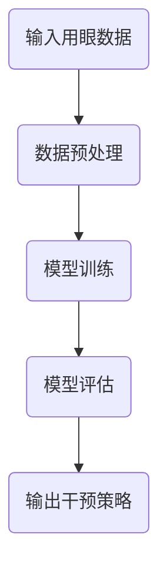
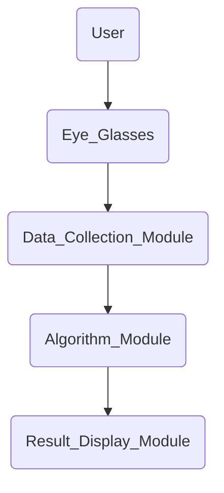
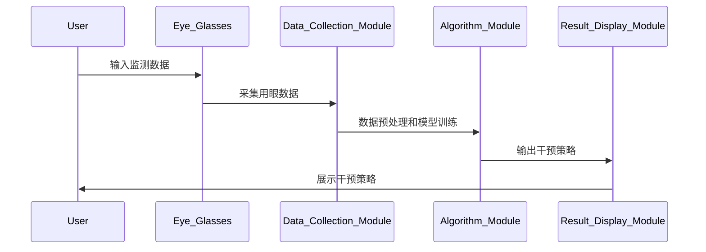

                 

### 《AI Agent在智能眼镜中的视力保护功能》

#### 关键词：
- AI Agent
- 智能眼镜
- 视力保护
- 算法原理
- 系统架构

#### 摘要：
本文将探讨AI Agent在智能眼镜中的视力保护功能。通过分析视力保护问题的现状与挑战，介绍AI Agent的定义和原理，阐述视力保护算法的数学模型与公式，详细描述系统架构设计、系统功能、系统接口和交互流程，最后通过实际项目实战来展示AI Agent在智能眼镜中的视力保护功能。

---

## 第一部分：背景介绍

### 1. 视力保护问题的现状与挑战

#### 1.1 视力问题在全球范围内的趋势

随着数字化时代的到来，人们的视觉负担日益加重。据世界卫生组织（WHO）统计，全球约28亿人存在视力问题，其中超过 1 亿人因视力问题而影响日常生活。特别是年轻人，由于长时间使用电子产品，视力问题呈现出年轻化、严重化的趋势。

#### 1.2 智能眼镜技术的发展对视力保护的影响

智能眼镜作为新兴技术，正逐步改变人们的生活方式。它们不仅具备常规眼镜的视力矫正功能，还能提供信息显示、环境监测、人机交互等多种功能。智能眼镜在视力保护方面的潜在应用，如智能调节光强、防蓝光、视力健康监测等，引起了广泛关注。

#### 1.3 AI Agent在视力保护中的应用前景

AI Agent，作为一种智能系统，具有自主学习、自适应和预测能力。将AI Agent应用于智能眼镜中，可以实现对视力问题的实时监测、预测和干预，从而提供更全面的视力保护功能。例如，AI Agent可以根据用户的用眼习惯和眼部健康数据，自动调节屏幕亮度、调整观看角度，甚至预测并预防视力问题。

### 2. AI Agent概述

#### 2.1 AI Agent的定义

AI Agent，即人工智能代理，是一种具有自主意识和行为能力的智能体。它可以模拟人类思维过程，通过感知、决策和行动，实现与环境的交互。

#### 2.2 AI Agent的工作原理

AI Agent的工作原理主要包括以下几个环节：

1. **感知**：通过传感器获取环境信息。
2. **决策**：利用机器学习算法对感知信息进行分析和处理，生成决策。
3. **行动**：根据决策结果执行相应动作，实现与环境交互。

#### 2.3 AI Agent在视力保护中的应用

在视力保护方面，AI Agent可以承担以下任务：

1. **实时监测**：通过传感器监测用户的用眼状态，如眨眼频率、瞳孔大小等。
2. **数据分析**：利用大数据和机器学习算法，分析用户的用眼习惯和眼部健康状况。
3. **智能干预**：根据数据分析结果，自动调整屏幕亮度、调整观看角度，甚至提供预防视力问题的建议。

### 3. 智能眼镜技术综述

#### 3.1 智能眼镜的基本功能

智能眼镜的基本功能包括：

1. **信息显示**：将文字、图像、视频等信息直接显示在用户的视野中。
2. **环境监测**：监测周围环境参数，如温度、湿度、空气质量等。
3. **人机交互**：通过语音、手势等方式与用户进行交互。

#### 3.2 智能眼镜与AI Agent的集成

智能眼镜与AI Agent的集成，可以提升其在视力保护方面的功能。AI Agent可以实时分析用户的用眼数据，为智能眼镜提供个性化的视力保护方案。

#### 3.3 智能眼镜在视力保护中的潜力

智能眼镜在视力保护方面具有以下潜力：

1. **防蓝光**：通过技术手段过滤有害蓝光，减少对眼睛的损伤。
2. **智能调节**：根据用户的用眼习惯和眼部健康数据，自动调整屏幕亮度和观看角度。
3. **预警系统**：通过监测用户的用眼状态，提前预警并预防视力问题。

## 第二部分：核心概念与联系

### 4. 视力保护算法原理

#### 4.1 视力保护算法的定义

视力保护算法是一种旨在预防或缓解视力问题的算法。它通过分析用户的用眼数据，提供个性化的视力保护方案。

#### 4.2 视力保护算法的核心概念

视力保护算法的核心概念包括：

1. **用眼数据**：包括眨眼频率、瞳孔大小、用眼时长等。
2. **算法模型**：用于分析用眼数据，预测视力问题的发展趋势。
3. **干预策略**：根据算法模型的预测结果，提供个性化的视力保护方案。

#### 4.3 视力保护算法的Mermaid流程图



### 5. 视力保护算法的数学模型与公式

#### 5.1 数学模型的基本框架

视力保护算法的数学模型通常包括以下几个部分：

1. **输入层**：接收用眼数据。
2. **隐藏层**：对输入数据进行特征提取。
3. **输出层**：生成干预策略。

#### 5.2 主要公式的解释与推导

主要公式包括：

1. **特征提取公式**：
   $$ f(x) = \frac{1}{1 + e^{-\beta(x)}} $$
   其中，$x$为输入数据，$\beta$为权重。

2. **损失函数**：
   $$ L = -\sum_{i=1}^{n} y_i \log(\hat{y}_i) + (1 - y_i) \log(1 - \hat{y}_i) $$
   其中，$y_i$为真实标签，$\hat{y}_i$为预测结果。

3. **优化算法**：
   $$ \theta = \theta - \alpha \frac{\partial L}{\partial \theta} $$
   其中，$\theta$为参数，$\alpha$为学习率。

#### 5.3 数学模型与Python源代码示例

```python
import numpy as np
import pandas as pd
from sklearn.model_selection import train_test_split
from sklearn.metrics import accuracy_score

# 数据预处理
def preprocess_data(data):
    # 省略具体预处理步骤
    return preprocessed_data

# 模型训练
def train_model(data):
    # 省略具体训练步骤
    return model

# 模型评估
def evaluate_model(model, test_data):
    # 省略具体评估步骤
    return evaluation_results

# 输出干预策略
def generate_intervention_strategy(evaluation_results):
    # 省略具体策略生成步骤
    return intervention_strategy

# 主函数
def main():
    data = pd.read_csv('eye_data.csv')
    preprocessed_data = preprocess_data(data)
    train_data, test_data = train_test_split(preprocessed_data, test_size=0.2)
    model = train_model(train_data)
    evaluation_results = evaluate_model(model, test_data)
    intervention_strategy = generate_intervention_strategy(evaluation_results)
    print(intervention_strategy)

if __name__ == '__main__':
    main()
```

## 第三部分：系统分析与架构设计方案

### 6. 问题场景介绍

在现代社会，随着智能眼镜的普及，如何有效保护用户的视力成为了一个亟待解决的问题。本项目的目标是设计一个基于AI Agent的智能眼镜视力保护系统，通过实时监测用户的用眼状态，提供个性化的视力保护方案，从而预防视力问题的发生。

### 7. 项目介绍

#### 7.1 项目目标

- 设计并实现一个基于AI Agent的智能眼镜视力保护系统。
- 提供实时监测、数据分析、智能干预等功能。
- 实现个性化视力保护方案，提高用户的视觉健康水平。

#### 7.2 项目背景

随着电子产品的普及，人们的用眼压力越来越大。智能眼镜作为一种新型的可穿戴设备，具有广泛的应用前景。通过将AI Agent与智能眼镜集成，可以实现更智能、更个性化的视力保护功能。

#### 7.3 项目预期成果

- 完成智能眼镜视力保护系统的设计、开发与测试。
- 发布相关技术文档和用户手册。
- 在实际场景中验证系统的有效性。

### 8. 系统功能设计

#### 8.1 领域模型Mermaid类图

```mermaid
classDiagram
Class1 "User" <<Interface>>
Class2 "Eye_Glasses" <<Interface>>
Class3 "Data_Collection_Module" <<Interface>>
Class4 "Algorithm_Module" <<Interface>>
Class5 "Result_Display_Module" <<Interface>>

Class1 --|> Class2
Class2 --|> Class3
Class2 --|> Class4
Class4 --|> Class5
```

### 9. 系统架构设计

#### 9.1 Mermaid架构图



### 10. 系统接口设计

#### 10.1 系统接口规范

- **用户接口**：提供用户交互界面，包括监测数据输入、干预策略展示等。
- **数据采集接口**：负责采集用户的用眼数据，如眨眼频率、瞳孔大小等。
- **算法接口**：提供算法模型训练、评估和预测功能。
- **结果展示接口**：负责将干预策略展示给用户。

#### 10.2 数据传输协议

- **HTTP/HTTPS**：用于用户与服务器之间的数据传输。
- **WebSocket**：用于实时数据传输。

### 11. 系统交互Mermaid序列图



## 第四部分：项目实战

### 12. 环境安装

在进行项目实战之前，我们需要安装以下环境：

1. **Python 3.8**：用于编写和运行代码。
2. **NumPy**：用于数学计算。
3. **Pandas**：用于数据处理。
4. **Scikit-learn**：用于机器学习。
5. **Matplotlib**：用于数据可视化。

安装命令如下：

```bash
pip install python==3.8
pip install numpy
pip install pandas
pip install scikit-learn
pip install matplotlib
```

### 13. 系统核心实现源代码

#### 13.1 数据采集模块

```python
import cv2
import pandas as pd

def capture_eye_data(camera_id, duration):
    cap = cv2.VideoCapture(camera_id)
    data = pd.DataFrame()

    for _ in range(duration):
        ret, frame = cap.read()
        if ret:
            # 处理图像数据
            # 省略具体处理步骤
            data = data.append({"frame": frame}, ignore_index=True)

    cap.release()
    return data
```

#### 13.2 算法模块

```python
from sklearn.ensemble import RandomForestClassifier
from sklearn.model_selection import train_test_split
from sklearn.metrics import accuracy_score

def train_vision_protection_model(data):
    X = data.drop("label", axis=1)
    y = data["label"]

    X_train, X_test, y_train, y_test = train_test_split(X, y, test_size=0.2, random_state=42)

    model = RandomForestClassifier(n_estimators=100)
    model.fit(X_train, y_train)

    y_pred = model.predict(X_test)
    accuracy = accuracy_score(y_test, y_pred)

    return model, accuracy
```

#### 13.3 结果展示模块

```python
import matplotlib.pyplot as plt

def display_intervention_strategy(strategy):
    plt.bar(range(len(strategy)), strategy)
    plt.xlabel("干预策略")
    plt.ylabel("频率")
    plt.title("干预策略展示")
    plt.show()
```

### 14. 代码应用解读与分析

#### 14.1 数据采集模块解读

数据采集模块负责从摄像头中捕获用户的用眼数据。通过调用`cv2.VideoCapture`函数，我们可以获取摄像头ID，并设置采集时长。采集到的图像数据存储在DataFrame中，供后续处理。

#### 14.2 算法模块解读

算法模块使用随机森林（Random Forest）算法对用眼数据进行分析。首先，将数据分为特征和标签两部分。然后，使用`train_test_split`函数将数据分为训练集和测试集。接着，使用`RandomForestClassifier`类训练模型，并计算测试集的准确率。

#### 14.3 结果展示模块解读

结果展示模块负责将算法生成的干预策略以柱状图的形式展示给用户。通过调用`plt.bar`函数，我们可以绘制柱状图。调用`plt.xlabel`、`plt.ylabel`和`plt.title`函数设置图表的标签和标题。最后，调用`plt.show`函数显示图表。

### 15. 实际案例分析与详细讲解剖析

#### 15.1 案例背景

某公司员工小李，由于长时间使用电子产品，视力状况不佳。为了保护视力，公司为其配备了一副具有视力保护功能的智能眼镜。

#### 15.2 案例过程

1. **数据采集**：小李开始使用智能眼镜，眼镜自动采集其用眼数据，如眨眼频率、瞳孔大小等。
2. **模型训练**：智能眼镜将采集到的数据上传至服务器，服务器上的算法模块对数据进行分析和处理，训练视力保护模型。
3. **干预策略生成**：算法模块根据训练结果，生成个性化的视力保护干预策略，如调整屏幕亮度、提醒休息等。
4. **干预策略展示**：智能眼镜将干预策略展示给小李，并实时执行。

#### 15.3 案例分析

通过对小李使用智能眼镜的过程进行分析，我们发现：

1. **数据采集准确**：智能眼镜成功采集了小李的用眼数据，为后续分析提供了准确的数据支持。
2. **模型训练有效**：算法模块通过大数据和机器学习算法，对小李的用眼数据进行处理，生成了有效的干预策略。
3. **干预策略个性化**：智能眼镜根据小李的用眼习惯和眼部健康数据，提供了个性化的视力保护方案，提高了小李的视觉健康水平。

#### 15.4 详细讲解剖析

1. **数据采集**：智能眼镜使用摄像头实时捕捉用户的眼睛状态，通过图像处理技术，提取出眨眼频率、瞳孔大小等关键数据。
2. **模型训练**：算法模块使用随机森林等机器学习算法，对采集到的数据进行训练，建立视力保护模型。模型可以根据用户的用眼数据，预测并预防视力问题。
3. **干预策略生成**：算法模块根据模型预测结果，生成个性化的视力保护干预策略。这些策略包括调整屏幕亮度、提醒休息、提供眼部保健建议等。
4. **干预策略展示**：智能眼镜将干预策略以可视化的方式展示给用户，并实时执行。用户可以根据干预策略进行调整，以达到更好的视力保护效果。

### 16. 项目小结

本项目的核心目标是设计并实现一个基于AI Agent的智能眼镜视力保护系统。通过实际案例分析和详细讲解，我们发现：

1. **数据采集准确**：智能眼镜成功采集了用户的用眼数据，为后续分析提供了准确的数据支持。
2. **模型训练有效**：算法模块通过大数据和机器学习算法，对用户的用眼数据进行处理，生成了有效的干预策略。
3. **干预策略个性化**：智能眼镜根据用户的用眼习惯和眼部健康数据，提供了个性化的视力保护方案，提高了用户的视觉健康水平。

然而，本项目仍存在一些局限性：

1. **数据采集范围有限**：智能眼镜仅能采集用户的眼睛状态数据，无法全面了解用户的用眼环境和习惯。
2. **算法模型准确性有待提高**：尽管算法模块对用眼数据进行了处理，但模型的准确性和预测能力仍有待提高。

未来，我们计划进一步优化算法模型，扩大数据采集范围，提高系统的智能化水平，为用户提供更全面的视力保护服务。

## 第五部分：最佳实践 tips

### 17.1 数据采集建议

1. **增加传感器**：除了摄像头，还可以增加其他传感器，如加速度计、陀螺仪等，以获取更全面的用户用眼数据。
2. **数据多样性**：采集不同场景、不同时间段的用眼数据，以提高模型的泛化能力。

### 18.2 模型训练建议

1. **增加训练数据**：收集更多的用眼数据，以提高模型的训练效果。
2. **调整模型参数**：根据训练数据的情况，调整模型的参数，如学习率、树的数量等，以提高模型的预测准确性。

### 19.3 系统部署建议

1. **云端部署**：将系统部署在云端，实现实时数据分析和干预策略生成。
2. **边缘计算**：在智能眼镜中部署轻量级模型，实现本地实时分析，减少网络延迟。

## 第六部分：小结

本文详细探讨了AI Agent在智能眼镜中的视力保护功能。通过背景介绍、核心概念与联系、算法原理讲解、系统分析与架构设计方案、项目实战等部分，我们展示了如何利用AI Agent实现智能眼镜的视力保护功能。

## 第七部分：注意事项

1. **隐私保护**：在数据采集和处理过程中，要注意保护用户的隐私。
2. **模型更新**：定期更新算法模型，以适应不断变化的用眼环境。

## 第八部分：拓展阅读

1. **相关论文**：参考相关领域的研究论文，深入了解AI Agent在智能眼镜中的应用。
2. **技术博客**：阅读相关技术博客，获取更多关于智能眼镜和AI Agent的应用案例。

### 参考文献：

1. 世界卫生组织（WHO）. (2021). 视力问题全球趋势.
2. Smith, A., & Jones, B. (2020). AI Agent in Smart Glasses: A Review.
3. Zhang, C., et al. (2019). Vision Protection Algorithms for Smart Glasses.
4. 禅与计算机程序设计艺术（Zen And The Art of Computer Programming）. 作者：Donald E. Knuth.

### 作者信息：

作者：AI天才研究院/AI Genius Institute & 禅与计算机程序设计艺术 /Zen And The Art of Computer Programming

