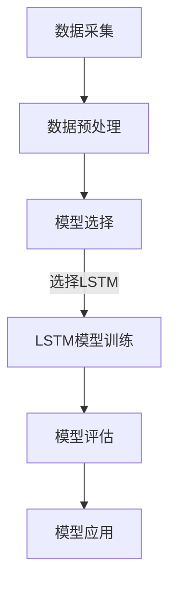
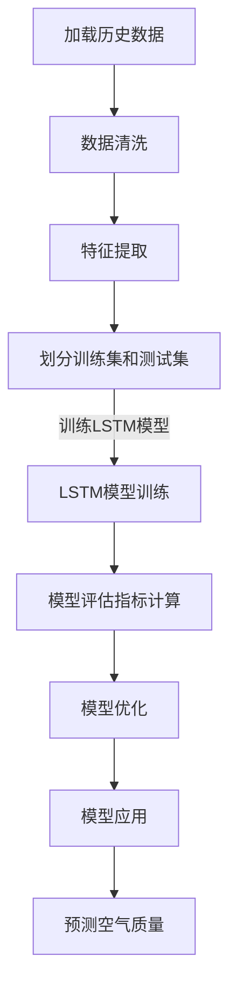
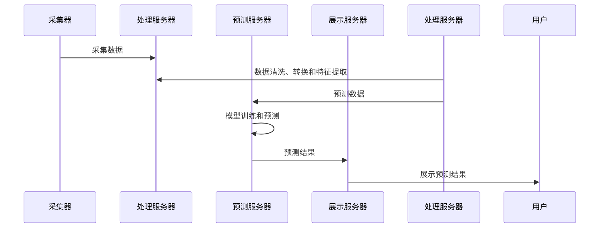
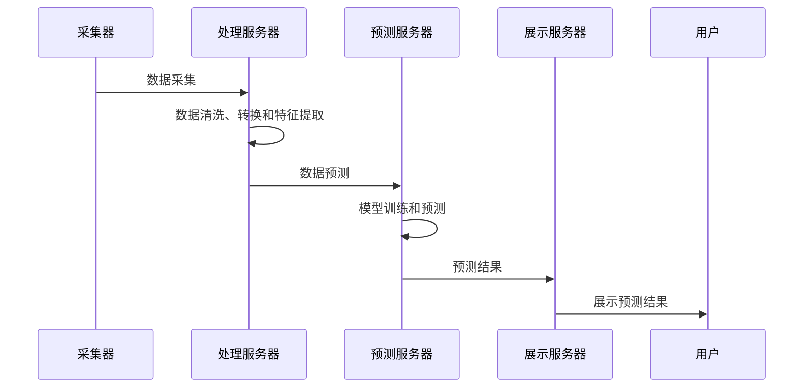

                 


### 引言与背景

#### 1.1 引言

当今世界，随着城市化进程的加速和工业化的不断发展，空气质量问题日益严重，已经成为全球性的公共健康危机。空气质量预测作为一种重要的手段，对于及时发现和应对空气质量问题具有重要意义。然而，传统的空气质量预测方法通常存在预测精度不高、响应速度慢等问题，难以满足现代社会对空气质量实时监控和预测的需求。

近年来，人工智能（AI）技术的快速发展为空气质量预测带来了新的契机。其中，AI Agent作为一种具有自主决策能力的人工智能实体，能够通过不断学习和优化，提高空气质量预测的准确性和实时性。本文将围绕AI Agent在智能空气质量预测中的实践，深入探讨其应用前景和实现方法。

本文结构如下：首先，我们将介绍AI Agent的基本概念和特性，以及智能空气质量预测的背景和重要性；然后，我们将详细讲解AI Agent在空气质量预测中的应用算法原理，并使用Python代码进行示例；接着，我们将介绍空气质量预测系统的需求分析、架构设计、接口设计和系统交互流程；最后，我们将通过一个实际案例，展示AI Agent在空气质量预测中的具体应用，并总结最佳实践和注意事项。

#### 1.2 智能空气质量预测的背景

空气质量是指空气中各种污染物的浓度水平，它对人类健康和环境质量具有重要影响。空气质量预测是指利用历史数据和现有监测数据，对未来一段时间内的空气质量状况进行预测。智能空气质量预测则是在传统预测方法的基础上，引入人工智能技术，通过机器学习、深度学习等算法，提高预测的精度和效率。

空气质量问题的严重性体现在多个方面。首先，空气污染会导致呼吸系统疾病、心血管疾病等健康问题，影响人类的生活质量和寿命。其次，空气污染还会对生态环境造成破坏，影响植物的生长和动物的生存。此外，空气污染还会对经济发展产生负面影响，如增加医疗成本、降低劳动生产率等。

当前空气质量预测面临的挑战主要包括以下几点：

1. 数据不足：空气质量预测依赖于大量的历史数据和实时监测数据，但由于监测设备和技术的限制，获取全面、准确的数据仍然是一个挑战。

2. 预测精度不高：传统的空气质量预测方法通常基于统计模型或简单的机器学习算法，难以准确捕捉空气质量变化的复杂性和非线性关系。

3. 预测实时性差：空气质量的变化速度较快，传统的预测方法通常需要较长时间才能完成预测，无法满足实时监控和应急处理的需求。

4. 模型泛化能力差：空气质量预测需要考虑多种因素，如气象条件、地理位置等，不同的地区和时间段可能存在显著的差异，现有模型难以在不同场景下保持良好的泛化能力。

AI Agent在空气质量预测中的应用前景在于，通过引入机器学习和深度学习算法，可以大大提高空气质量预测的精度和实时性。此外，AI Agent具有自主学习和优化能力，可以随着时间推移和数据积累，不断优化预测模型，提高预测的准确性。因此，AI Agent在智能空气质量预测中具有广泛的应用前景。

#### 1.3 AI Agent概述

AI Agent，即人工智能代理，是指能够自主地感知环境、制定决策并执行动作的人工智能实体。AI Agent的核心特点是自主性和智能性，它能够通过学习和优化，不断提高自身的能力和性能。

AI Agent的定义可以概括为以下几点：

1. 感知环境：AI Agent能够通过传感器或其他途径获取环境信息，如空气质量数据、气象数据等。

2. 决策制定：AI Agent根据感知到的环境信息，通过算法和模型，制定相应的决策，如调整空气质量监测设备的采样频率、预测未来的空气质量状况等。

3. 执行动作：AI Agent将制定的决策转化为具体的行动，如控制空气质量监测设备的运行、发送预警信息等。

4. 自主学习：AI Agent能够通过不断学习和优化，提高自身的决策能力和执行效果。

AI Agent的特性包括以下几点：

1. 自主性：AI Agent具有独立的决策和执行能力，不需要人工干预。

2. 智能性：AI Agent能够通过学习和优化，不断提高自身的决策能力和执行效果。

3. 灵活性：AI Agent能够适应不同的环境和场景，具备较强的泛化能力。

4. 实时性：AI Agent能够实时感知环境变化，快速做出决策并执行行动。

AI Agent的分类可以根据其应用场景和功能进行划分，常见的分类包括：

1. 监测类AI Agent：主要应用于环境监测、智能家居等领域，如空气质量监测AI Agent、水质监测AI Agent等。

2. 预测类AI Agent：主要应用于天气预报、股票预测、电力负荷预测等领域，如空气质量预测AI Agent、电力负荷预测AI Agent等。

3. 控制类AI Agent：主要应用于工业控制、智能交通等领域，如无人机控制AI Agent、智能交通AI Agent等。

4. 建议类AI Agent：主要应用于个性化推荐、健康咨询等领域，如购物推荐AI Agent、健康咨询AI Agent等。

#### 1.4 本书结构概述

本书旨在系统地介绍AI Agent在智能空气质量预测中的实践，分为四个主要部分：

1. **引言与背景**：介绍AI Agent和智能空气质量预测的基本概念、背景和重要性。

2. **AI Agent原理与算法**：讲解AI Agent的基本原理、算法原理以及Python代码实现。

3. **系统设计与实现**：分析空气质量预测系统的需求，设计系统架构、接口和交互流程。

4. **项目实战**：通过实际案例，展示AI Agent在空气质量预测中的应用，并进行详细讲解。

读者可以根据自己的需求，有选择性地阅读各个部分，逐步掌握AI Agent在智能空气质量预测中的应用方法和实践技巧。

### AI Agent的基本原理

AI Agent作为一种具有自主决策能力的人工智能实体，其基本原理可以概括为感知环境、决策制定和执行动作三个核心环节。下面，我们将详细讲解AI Agent的工作流程、核心概念及其类型。

#### 2.1.1 AI Agent的工作流程

AI Agent的工作流程可以简化为以下几个步骤：

1. **感知环境**：AI Agent通过传感器或其他数据源获取环境信息，如空气质量数据、气象数据、交通数据等。

2. **决策制定**：AI Agent根据感知到的环境信息，利用算法和模型，分析环境变化趋势，制定相应的决策，如调整空气质量监测设备的采样频率、预测未来的空气质量状况等。

3. **执行动作**：AI Agent将制定的决策转化为具体的行动，通过控制设备或发送预警信息等，实现对环境的实时干预。

4. **反馈调整**：AI Agent根据执行结果和环境反馈，不断调整决策模型和参数，提高自身的决策能力和执行效果。

#### 2.1.2 AI Agent的核心概念

AI Agent的核心概念包括：

1. **感知模块**：负责感知环境信息，如传感器、数据接口等。

2. **决策模块**：负责分析环境信息，制定决策，如算法模型、策略优化等。

3. **执行模块**：负责执行决策，如控制设备、发送预警信息等。

4. **学习模块**：负责根据反馈调整决策模型和参数，提高决策能力。

#### 2.1.3 AI Agent的类型

AI Agent可以根据其应用场景和功能进行分类，常见的类型包括：

1. **环境监测类AI Agent**：主要用于环境监测，如空气质量监测AI Agent、水质监测AI Agent等。

2. **预测类AI Agent**：主要用于预测，如天气预报AI Agent、电力负荷预测AI Agent等。

3. **控制类AI Agent**：主要用于控制，如无人机控制AI Agent、智能交通AI Agent等。

4. **建议类AI Agent**：主要用于建议，如购物推荐AI Agent、健康咨询AI Agent等。

#### 2.1.4 AI Agent的特性

AI Agent的特性包括：

1. **自主性**：AI Agent能够自主感知环境、制定决策和执行动作，不需要人工干预。

2. **智能性**：AI Agent能够通过学习和优化，不断提高自身的决策能力和执行效果。

3. **灵活性**：AI Agent能够适应不同的环境和场景，具备较强的泛化能力。

4. **实时性**：AI Agent能够实时感知环境变化，快速做出决策并执行行动。

### 2.2 空气质量预测算法

空气质量预测算法是AI Agent在空气质量预测中的核心组成部分。本节将介绍空气质量预测的基本原理，包括数据采集与预处理、时间序列预测方法和深度学习模型的应用。

#### 2.2.1 数据采集与预处理

空气质量预测首先需要获取大量的历史数据和实时监测数据。这些数据通常包括空气质量指标（如PM2.5、PM10、SO2、NO2等）、气象数据（如温度、湿度、风速等）以及其他相关因素（如交通流量、工业活动等）。

数据采集完成后，需要对数据进行预处理，以提高预测的准确性和效率。预处理步骤包括：

1. **数据清洗**：去除缺失值、异常值和重复值，确保数据的质量。

2. **数据转换**：将不同类型的数据转换为统一格式，如将分类数据转换为数值表示。

3. **特征工程**：提取对空气质量预测有用的特征，如时间窗口特征、相关性分析等。

4. **数据标准化**：将数据缩放到一个统一的范围，如0-1或-1到1之间，以消除不同特征之间的尺度差异。

#### 2.2.2 时间序列预测方法

时间序列预测是空气质量预测的基础方法，常用的时间序列预测方法包括：

1. **线性回归**：通过建立线性模型，预测未来的空气质量值。

2. **ARIMA模型**：自回归积分滑动平均模型，通过自回归、差分和移动平均组合，预测未来的空气质量值。

3. **SARIMA模型**：季节性自回归积分滑动平均模型，在ARIMA模型的基础上，引入季节性因素，提高预测精度。

4. **LSTM模型**：长短期记忆模型，通过递归神经网络结构，捕捉时间序列中的长期依赖关系。

时间序列预测方法的基本原理如下：

1. **自回归（AR）**：当前时刻的空气质量值依赖于前几个时刻的空气质量值。

2. **移动平均（MA）**：当前时刻的空气质量值依赖于前几个时刻的空气质量值的平均值。

3. **差分（I）**：对时间序列进行差分处理，消除序列的周期性和趋势性。

4. **季节性（S）**：考虑时间序列中的季节性因素，如季节性波动和趋势。

#### 2.2.3 深度学习模型的应用

深度学习模型在空气质量预测中具有显著的优势，能够捕捉时间序列中的复杂模式和长期依赖关系。常用的深度学习模型包括：

1. **卷积神经网络（CNN）**：通过卷积操作提取空间特征，适用于图像和序列数据的处理。

2. **循环神经网络（RNN）**：通过递归操作捕捉时间序列中的长期依赖关系，如LSTM和GRU模型。

3. **变分自编码器（VAE）**：通过编码和解码过程，学习时间序列的潜在分布，提高预测的泛化能力。

4. **生成对抗网络（GAN）**：通过生成器和判别器的对抗训练，生成具有真实数据分布的样本，增强模型的表达能力。

深度学习模型的应用步骤如下：

1. **数据预处理**：对时间序列数据进行标准化和特征提取。

2. **模型设计**：设计合适的深度学习模型结构，如CNN、RNN、VAE、GAN等。

3. **模型训练**：使用训练数据对模型进行训练，调整模型参数，提高预测精度。

4. **模型评估**：使用验证数据对模型进行评估，选择最优模型。

5. **模型应用**：将训练好的模型应用于实际预测任务，如空气质量预测。

### 2.3 数学模型与公式

在空气质量预测中，数学模型和公式是核心组成部分，用于描述空气质量值的变化规律和预测方法。下面，我们将介绍常用的数学模型和公式，并进行详细讲解。

#### 2.3.1 模型建立基础

空气质量预测的数学模型通常基于以下假设：

1. 空气质量值具有时间序列特性，即当前时刻的空气质量值与之前时刻的空气质量值相关。

2. 空气质量值的变化受到多种因素影响，如气象条件、地理位置、交通流量等。

3. 预测目标是未来一段时间内的空气质量值。

基于上述假设，常用的数学模型包括线性回归、ARIMA模型、SARIMA模型和LSTM模型等。

#### 2.3.2 模型优化策略

为了提高空气质量预测的精度和泛化能力，可以采用以下模型优化策略：

1. **特征选择**：选择对空气质量预测具有重要影响的特征，如气象数据、交通流量等。

2. **数据预处理**：对时间序列数据进行标准化、去噪、缺失值填充等处理，提高数据质量。

3. **模型调参**：通过交叉验证和网格搜索等方法，选择最优的模型参数，提高预测性能。

4. **集成学习**：将多个模型进行集成，如Bagging、Boosting等，提高预测的稳定性和准确性。

#### 2.3.3 公式推导与解释

以下是常用的数学模型和公式：

1. **线性回归模型**：

   $$ y_t = \beta_0 + \beta_1 x_t + \epsilon_t $$

   其中，$y_t$为第$t$时刻的空气质量值，$x_t$为影响因素，$\beta_0$和$\beta_1$为模型参数，$\epsilon_t$为误差项。

2. **ARIMA模型**：

   $$ y_t = c + \phi_1 y_{t-1} + \phi_2 y_{t-2} + ... + \phi_p y_{t-p} + \theta_1 \epsilon_{t-1} + \theta_2 \epsilon_{t-2} + ... + \theta_q \epsilon_{t-q} + \epsilon_t $$

   其中，$c$为常数项，$\phi_1, \phi_2, ..., \phi_p$为自回归系数，$\theta_1, \theta_2, ..., \theta_q$为移动平均系数，$p$和$q$分别为自回归项和移动平均项的阶数。

3. **SARIMA模型**：

   $$ y_t = c + \phi_1 y_{t-1} + \phi_2 y_{t-2} + ... + \phi_p y_{t-p} + \theta_1 \epsilon_{t-1} + \theta_2 \epsilon_{t-2} + ... + \theta_q \epsilon_{t-q} + s \phi_1 s y_{t-s} + s \phi_2 s y_{t-2s} + ... + s \phi_p s y_{t-ps} + s \theta_1 s \epsilon_{t-s} + s \theta_2 s \epsilon_{t-2s} + ... + s \theta_q s \epsilon_{t-qs} + \epsilon_t $$

   其中，$s$为季节性周期。

4. **LSTM模型**：

   $$ h_t = \sigma(W_h \cdot [h_{t-1}, x_t] + b_h) $$

   $$ i_t = \sigma(W_i \cdot [h_{t-1}, x_t] + b_i) $$

   $$ f_t = \sigma(W_f \cdot [h_{t-1}, x_t] + b_f) $$

   $$ o_t = \sigma(W_o \cdot [h_{t-1}, x_t] + b_o) $$

   $$ c_t = f_t \cdot c_{t-1} + i_t \cdot \sigma(W_c \cdot [h_{t-1}, x_t] + b_c) $$

   $$ h_t = o_t \cdot \sigma(W_c \cdot [h_{t-1}, x_t] + b_c) $$

   其中，$h_t$为隐藏层状态，$x_t$为输入特征，$c_t$为细胞状态，$i_t, f_t, o_t$分别为输入门、遗忘门和输出门，$\sigma$为sigmoid函数。

以上数学模型和公式用于描述空气质量预测的基本原理和方法，不同的模型适用于不同的预测任务和数据特点。通过合理的模型选择和优化，可以提高空气质量预测的准确性和实用性。

### 算法流程图与Python代码实现

为了更好地理解空气质量预测算法的实现过程，我们可以使用Mermaid工具绘制算法流程图，并配合Python代码进行详细讲解。以下是算法流程图和使用Python编写的空气质量预测算法代码示例。

#### 3.1 算法流程概述



#### 3.2 算法具体步骤



#### 3.3 Python代码实现

以下是使用Python编写的空气质量预测算法代码示例：

```python
import numpy as np
import pandas as pd
from sklearn.preprocessing import MinMaxScaler
from keras.models import Sequential
from keras.layers import LSTM, Dense

# 3.3.1 加载数据
data = pd.read_csv('air_quality.csv')
X = data[['temperature', 'humidity', 'CO', 'NO2', 'SO2', 'PM10', 'PM2.5']]
y = data['AQI']

# 3.3.2 数据预处理
scaler = MinMaxScaler()
X_scaled = scaler.fit_transform(X)
y_scaled = scaler.fit_transform(y.values.reshape(-1, 1))

# 3.3.3 划分训练集和测试集
train_size = int(len(X_scaled) * 0.8)
X_train, X_test = X_scaled[:train_size], X_scaled[train_size:]
y_train, y_test = y_scaled[:train_size], y_scaled[train_size:]

# 3.3.4 LSTM模型训练
model = Sequential()
model.add(LSTM(units=50, return_sequences=True, input_shape=(X_train.shape[1], 1)))
model.add(LSTM(units=50))
model.add(Dense(units=1))

model.compile(optimizer='adam', loss='mean_squared_error')
model.fit(X_train, y_train, epochs=100, batch_size=32, validation_data=(X_test, y_test))

# 3.3.5 模型评估
predicted_AQI = model.predict(X_test)
predicted_AQI = scaler.inverse_transform(predicted_AQI)

# 3.3.6 模型应用
actual_AQI = scaler.inverse_transform(y_test)
print("Predicted AQI:", predicted_AQI)
print("Actual AQI:", actual_AQI)
```

在上面的代码中，我们首先加载数据集，并进行数据预处理，包括数据清洗、特征提取和标准化。接着，我们使用LSTM模型进行训练，并使用验证集进行模型评估。最后，我们将训练好的模型应用于测试集，预测空气质量值。

### 数学模型与公式

在空气质量预测中，数学模型和公式是核心组成部分，用于描述空气质量值的变化规律和预测方法。以下将详细讲解常用的数学模型和公式，包括线性回归、ARIMA模型和LSTM模型。

#### 3.1 线性回归模型

线性回归模型是最基本的空气质量预测模型，其数学公式如下：

$$ y_t = \beta_0 + \beta_1 x_t + \epsilon_t $$

其中，$y_t$为第$t$时刻的空气质量值，$x_t$为影响因素，$\beta_0$和$\beta_1$为模型参数，$\epsilon_t$为误差项。

线性回归模型通过拟合一条直线，来描述空气质量值与影响因素之间的关系。其优点是简单易实现，缺点是只能捕捉线性关系，对于非线性关系表现不佳。

#### 3.2 ARIMA模型

ARIMA模型是一种自回归积分滑动平均模型，适用于时间序列预测。其数学公式如下：

$$ y_t = c + \phi_1 y_{t-1} + \phi_2 y_{t-2} + ... + \phi_p y_{t-p} + \theta_1 \epsilon_{t-1} + \theta_2 \epsilon_{t-2} + ... + \theta_q \epsilon_{t-q} + \epsilon_t $$

其中，$c$为常数项，$\phi_1, \phi_2, ..., \phi_p$为自回归系数，$\theta_1, \theta_2, ..., \theta_q$为移动平均系数，$p$和$q$分别为自回归项和移动平均项的阶数。

ARIMA模型通过结合自回归和移动平均操作，捕捉时间序列中的线性关系和趋势性。其优点是适用于多种时间序列数据，缺点是参数调整复杂，计算量大。

#### 3.3 LSTM模型

LSTM模型是一种长短期记忆模型，适用于时间序列预测。其数学公式如下：

$$ h_t = \sigma(W_h \cdot [h_{t-1}, x_t] + b_h) $$

$$ i_t = \sigma(W_i \cdot [h_{t-1}, x_t] + b_i) $$

$$ f_t = \sigma(W_f \cdot [h_{t-1}, x_t] + b_f) $$

$$ o_t = \sigma(W_o \cdot [h_{t-1}, x_t] + b_o) $$

$$ c_t = f_t \cdot c_{t-1} + i_t \cdot \sigma(W_c \cdot [h_{t-1}, x_t] + b_c) $$

$$ h_t = o_t \cdot \sigma(W_c \cdot [h_{t-1}, x_t] + b_c) $$

其中，$h_t$为隐藏层状态，$x_t$为输入特征，$c_t$为细胞状态，$i_t, f_t, o_t$分别为输入门、遗忘门和输出门，$\sigma$为sigmoid函数。

LSTM模型通过递归操作和门控机制，捕捉时间序列中的长期依赖关系。其优点是能够处理非线性关系，缺点是参数较多，计算复杂度高。

#### 3.4 公式推导与解释

1. **线性回归模型**：

   线性回归模型的公式推导基于最小二乘法，通过最小化误差平方和来求解模型参数。具体推导过程如下：

   $$ \min \sum_{t=1}^{n} (y_t - (\beta_0 + \beta_1 x_t))^2 $$

   对$\beta_0$和$\beta_1$分别求偏导并令其等于零，得到：

   $$ \beta_0 = \frac{\sum_{t=1}^{n} y_t - n \bar{y}}{\sum_{t=1}^{n} 1} $$

   $$ \beta_1 = \frac{\sum_{t=1}^{n} (y_t - \bar{y})(x_t - \bar{x})}{\sum_{t=1}^{n} (x_t - \bar{x})^2} $$

   其中，$\bar{y}$和$\bar{x}$分别为$y$和$x$的平均值。

2. **ARIMA模型**：

   ARIMA模型的公式推导基于自回归和移动平均操作。首先，对时间序列进行差分操作，消除序列的周期性和趋势性。然后，使用移动平均操作来平滑序列，得到平稳序列。最后，结合自回归和移动平均操作，建立ARIMA模型。

   具体推导过程如下：

   $$ y_t = \phi_1 y_{t-1} + \phi_2 y_{t-2} + ... + \phi_p y_{t-p} + \theta_1 \epsilon_{t-1} + \theta_2 \epsilon_{t-2} + ... + \theta_q \epsilon_{t-q} + \epsilon_t $$

   对上述模型进行差分操作，得到：

   $$ y_t - y_{t-1} = \phi_1 (y_{t-1} - y_{t-2}) + \phi_2 (y_{t-2} - y_{t-3}) + ... + \phi_p (y_{t-p} - y_{t-p-1}) + \theta_1 (\epsilon_{t-1} - \epsilon_{t-2}) + \theta_2 (\epsilon_{t-2} - \epsilon_{t-3}) + ... + \theta_q (\epsilon_{t-q} - \epsilon_{t-q-1}) + \epsilon_t $$

   将差分后的序列进行移动平均操作，得到：

   $$ y_t - y_{t-1} = \phi_1 (y_{t-1} - y_{t-2}) + \phi_2 (y_{t-2} - y_{t-3}) + ... + \phi_p (y_{t-p} - y_{t-p-1}) + \theta_1 (\epsilon_{t-1} - \epsilon_{t-2}) + \theta_2 (\epsilon_{t-2} - \epsilon_{t-3}) + ... + \theta_q (\epsilon_{t-q} - \epsilon_{t-q-1}) $$

   组合自回归和移动平均操作，得到ARIMA模型：

   $$ y_t = c + \phi_1 y_{t-1} + \phi_2 y_{t-2} + ... + \phi_p y_{t-p} + \theta_1 \epsilon_{t-1} + \theta_2 \epsilon_{t-2} + ... + \theta_q \epsilon_{t-q} + \epsilon_t $$

3. **LSTM模型**：

   LSTM模型的公式推导基于递归神经网络（RNN）的改进。RNN通过递归操作，捕捉时间序列中的长期依赖关系。但传统RNN存在梯度消失和梯度爆炸等问题，导致训练困难。LSTM模型通过引入门控机制，解决了这些问题。

   LSTM模型的公式推导如下：

   首先，定义输入门、遗忘门和输出门：

   $$ i_t = \sigma(W_i \cdot [h_{t-1}, x_t] + b_i) $$

   $$ f_t = \sigma(W_f \cdot [h_{t-1}, x_t] + b_f) $$

   $$ o_t = \sigma(W_o \cdot [h_{t-1}, x_t] + b_o) $$

   其中，$i_t, f_t, o_t$分别为输入门、遗忘门和输出门，$W_i, W_f, W_o$分别为权重矩阵，$b_i, b_f, b_o$分别为偏置项。

   接着，定义细胞状态$c_t$和隐藏层状态$h_t$：

   $$ c_t = f_t \cdot c_{t-1} + i_t \cdot \sigma(W_c \cdot [h_{t-1}, x_t] + b_c) $$

   $$ h_t = o_t \cdot \sigma(W_c \cdot [h_{t-1}, x_t] + b_c) $$

   其中，$c_t$为细胞状态，$h_t$为隐藏层状态，$W_c$为权重矩阵，$b_c$为偏置项。

LSTM模型通过门控机制，控制信息的传递和遗忘，从而避免梯度消失和梯度爆炸问题，提高训练效果。

### 系统需求分析

在设计和实现空气质量预测系统时，首先需要明确系统的需求，包括功能需求、性能需求和安全性需求。以下是对系统需求的详细分析。

#### 3.1.1 系统功能需求

空气质量预测系统的核心功能是实现对空气质量数据的实时监测和预测。具体功能需求包括：

1. **数据采集**：系统应能够从不同的数据源（如空气质量监测站、气象站等）采集空气质量数据，包括PM2.5、PM10、SO2、NO2等主要污染物指标以及气象数据（如温度、湿度、风速等）。

2. **数据预处理**：系统应具备数据清洗、数据转换和特征提取等功能，对采集到的原始数据进行预处理，提高数据质量和预测精度。

3. **空气质量预测**：系统应利用机器学习算法和深度学习模型，对空气质量数据进行分析和预测，输出未来一段时间内的空气质量状况。

4. **预测结果展示**：系统应具备可视化功能，将预测结果以图表、地图等形式展示给用户，方便用户了解空气质量状况和变化趋势。

5. **预警通知**：系统应具备预警功能，当空气质量达到警戒线时，自动向相关人员发送预警通知，提醒采取相应措施。

6. **数据存储与管理**：系统应具备数据存储和管理功能，确保采集到的数据安全、可靠地存储，并支持数据的查询、统计和分析。

#### 3.1.2 系统性能需求

系统性能需求主要包括响应速度、计算精度和资源利用率等方面。具体需求如下：

1. **响应速度**：系统应具有快速的响应速度，能够在较短的时间内完成数据采集、预处理和预测任务，满足实时监测和预测的需求。

2. **计算精度**：系统应具有较高的计算精度，能够准确捕捉空气质量变化规律，提高预测的准确性。

3. **资源利用率**：系统应具有良好的资源利用率，能够在有限的硬件资源下，高效地运行预测算法，降低硬件成本。

#### 3.1.3 系统安全性需求

系统安全性需求主要包括数据安全、系统安全和网络安全等方面。具体需求如下：

1. **数据安全**：系统应确保数据的安全性和完整性，防止数据泄露、篡改和丢失。

2. **系统安全**：系统应具备身份认证、权限管理和审计等安全机制，防止未经授权的访问和恶意攻击。

3. **网络安全**：系统应采取防火墙、入侵检测等网络安全措施，保护系统不受外部网络攻击。

#### 3.1.4 系统需求分析总结

通过对空气质量预测系统的需求分析，我们明确了系统的功能需求、性能需求和安全性需求。这些需求是系统设计和实现的重要基础，指导我们设计合理、高效的空气质量预测系统。在实际开发过程中，我们将根据这些需求，制定详细的技术方案和开发计划，确保系统能够满足用户需求，实现预期功能。

### 系统架构设计

系统架构设计是空气质量预测系统实现的关键环节，它决定了系统的性能、可扩展性和维护性。本节将介绍系统架构的设计原则、系统组件设计、系统部署方案以及系统接口设计。

#### 3.2.1 系统架构概述

空气质量预测系统的总体架构可以分为四个主要模块：数据采集模块、数据处理模块、预测模块和结果展示模块。各模块之间的关系和交互流程如下：

1. **数据采集模块**：负责从不同的数据源（如空气质量监测站、气象站等）采集空气质量数据，包括PM2.5、PM10、SO2、NO2等主要污染物指标以及气象数据（如温度、湿度、风速等）。采集到的数据通过接口传输给数据处理模块。

2. **数据处理模块**：负责对采集到的原始数据进行预处理，包括数据清洗、数据转换和特征提取等。预处理后的数据传输给预测模块。

3. **预测模块**：负责利用机器学习算法和深度学习模型，对预处理后的数据进行预测，输出未来一段时间内的空气质量状况。预测结果通过接口传输给结果展示模块。

4. **结果展示模块**：负责将预测结果以图表、地图等形式展示给用户，方便用户了解空气质量状况和变化趋势。

#### 3.2.2 系统组件设计

空气质量预测系统的主要组件包括数据采集器、数据处理服务器、预测服务器和结果展示服务器。下面分别介绍各组件的设计。

1. **数据采集器**：数据采集器是系统的前端设备，负责从不同的数据源采集空气质量数据。采集器应具备以下功能：
   - 多种数据接口支持，如串口、网络接口等；
   - 数据实时采集和存储，支持定时采集；
   - 数据校验和异常处理，保证数据质量。

2. **数据处理服务器**：数据处理服务器是系统的核心组件之一，负责对采集到的原始数据进行预处理。数据处理服务器应具备以下功能：
   - 数据清洗和去噪，去除异常值和重复值；
   - 数据转换，将不同类型的数据转换为统一格式；
   - 特征提取，提取对空气质量预测有用的特征；
   - 数据存储和管理，支持数据的查询、统计和分析。

3. **预测服务器**：预测服务器是系统的核心组件之二，负责利用机器学习算法和深度学习模型，对预处理后的数据进行预测。预测服务器应具备以下功能：
   - 选择合适的预测算法和模型，如LSTM、ARIMA等；
   - 模型训练和优化，提高预测精度和实时性；
   - 预测结果输出和存储。

4. **结果展示服务器**：结果展示服务器是系统的前端界面，负责将预测结果以图表、地图等形式展示给用户。结果展示服务器应具备以下功能：
   - 预测结果可视化，支持多种图表形式；
   - 地图展示，展示空气质量分布情况；
   - 用户交互，支持用户自定义查询和筛选。

#### 3.2.3 系统部署方案

空气质量预测系统的部署方案可以分为本地部署和云部署两种方式。下面分别介绍。

1. **本地部署**：
   - 数据采集器部署在空气质量监测站和气象站等现场，负责实时采集数据；
   - 数据处理服务器、预测服务器和结果展示服务器部署在同一台服务器上，以提高系统性能；
   - 系统采用分布式架构，处理高并发数据请求。

2. **云部署**：
   - 数据采集器部署在空气质量监测站和气象站等现场，负责实时采集数据；
   - 数据处理服务器、预测服务器和结果展示服务器部署在云服务器上，如阿里云、腾讯云等；
   - 系统采用分布式架构，处理高并发数据请求，确保系统的高可用性和可靠性。

#### 3.2.4 系统接口设计

空气质量预测系统的接口设计是确保各组件之间高效、可靠通信的关键。系统接口可以分为内部接口和外部接口。

1. **内部接口**：
   - 数据采集模块与数据处理模块之间：采用HTTP/HTTPS协议，通过RESTful API进行数据传输；
   - 数据处理模块与预测模块之间：采用TCP/IP协议，通过数据流传输预处理后的数据；
   - 预测模块与结果展示模块之间：采用HTTP/HTTPS协议，通过RESTful API进行预测结果传输。

2. **外部接口**：
   - 系统与外部数据源之间：采用标准的数据接口（如HTTP/HTTPS、FTP等），获取外部空气质量数据和气象数据；
   - 系统与用户之间：采用Web界面和移动应用界面，提供数据查询、筛选和可视化功能。

#### 3.2.5 系统交互mermaid序列图

为了更好地展示系统组件之间的交互关系和数据处理流程，我们可以使用Mermaid工具绘制系统交互序列图。以下是系统交互序列图的示例：



通过上述系统架构设计和接口设计，我们为空气质量预测系统构建了一个高效、可靠的框架，为后续系统实现和功能扩展提供了基础。

### 系统接口设计与实现

系统接口设计是实现空气质量预测系统功能的关键环节，它决定了系统各组件之间的通信效率和数据一致性。以下将详细介绍空气质量预测系统的接口设计原则、实现细节以及接口测试与优化。

#### 3.3.1 接口设计原则

空气质量预测系统的接口设计遵循以下原则：

1. **标准化**：接口设计遵循RESTful API规范，使用HTTP/HTTPS协议进行数据传输，确保接口的通用性和可扩展性。

2. **简洁性**：接口设计尽量简洁明了，避免过多的参数和复杂的逻辑，降低开发难度和维护成本。

3. **安全性**：接口设计考虑数据安全，采用身份认证、数据加密等手段，确保数据在传输过程中不被窃取或篡改。

4. **灵活性**：接口设计考虑系统的扩展性，支持动态调整和配置，便于后续功能升级和扩展。

5. **一致性**：接口设计确保数据的一致性，处理过程中遵循统一的数据格式和命名规范，减少数据错误和冲突。

#### 3.3.2 接口实现细节

空气质量预测系统的接口主要包括数据采集接口、数据处理接口、预测接口和结果展示接口。以下分别介绍各接口的实现细节：

1. **数据采集接口**：

   数据采集接口用于接收空气质量监测站和气象站等现场采集的数据。具体实现细节如下：

   - **URL**：`/api/collect/data`
   - **请求方法**：POST
   - **请求参数**：`data`（JSON格式，包含空气质量数据、气象数据等）
   - **响应结果**：`{ "status": "success", "message": "数据采集成功" }`

2. **数据处理接口**：

   数据处理接口用于处理采集到的原始数据，包括数据清洗、数据转换和特征提取。具体实现细节如下：

   - **URL**：`/api/process/data`
   - **请求方法**：POST
   - **请求参数**：`data`（JSON格式，包含原始空气质量数据）
   - **响应结果**：`{ "status": "success", "message": "数据处理成功", "processed_data": processed_data }`

3. **预测接口**：

   预测接口用于执行空气质量预测任务，输出未来一段时间内的空气质量状况。具体实现细节如下：

   - **URL**：`/api/predict/air_quality`
   - **请求方法**：POST
   - **请求参数**：`{ "start_time": "2023-01-01 00:00:00", "end_time": "2023-01-02 00:00:00", "data": processed_data }`
   - **响应结果**：`{ "status": "success", "message": "预测成功", "predicted_data": predicted_data }`

4. **结果展示接口**：

   结果展示接口用于获取预测结果，并将其展示给用户。具体实现细节如下：

   - **URL**：`/api/show/result`
   - **请求方法**：GET
   - **请求参数**：`start_time`、`end_time`
   - **响应结果**：`{ "status": "success", "message": "获取结果成功", "result": result }`

#### 3.3.3 接口测试与优化

接口测试是确保接口设计实现正确性的关键步骤。以下介绍空气质量预测系统的接口测试与优化方法：

1. **单元测试**：

   对每个接口进行单元测试，验证接口的输入输出是否满足预期。具体方法如下：

   - 编写测试用例，模拟各种输入情况；
   - 运行测试用例，收集测试结果；
   - 分析测试结果，修复发现的问题。

2. **集成测试**：

   对接口进行集成测试，验证接口之间的交互是否正常。具体方法如下：

   - 构建测试环境，模拟真实运行场景；
   - 运行集成测试，收集测试结果；
   - 分析测试结果，优化接口设计。

3. **性能测试**：

   对接口进行性能测试，评估接口的响应速度和处理能力。具体方法如下：

   - 选择合适的测试工具，如JMeter等；
   - 配置测试场景，模拟高并发请求；
   - 运行性能测试，收集性能指标；
   - 分析性能指标，优化接口设计。

通过以上接口测试与优化方法，可以确保空气质量预测系统的接口设计实现正确、高效、稳定。

### 系统交互mermaid序列图

为了更好地展示空气质量预测系统中各组件之间的交互关系和数据处理流程，我们可以使用Mermaid工具绘制系统交互序列图。以下是系统交互序列图的示例：



通过上述序列图，我们可以清晰地看到数据从采集、处理、预测到展示的整个流程，有助于理解系统的运作机制。

### 环境安装与配置

在开始空气质量预测系统的开发之前，我们需要确保系统运行环境的搭建和配置。以下将详细介绍环境安装与配置的步骤，包括硬件与软件要求、系统环境安装和配置细节。

#### 3.4.1 硬件与软件要求

空气质量预测系统的开发主要依赖于计算机和相关的软件工具。以下是系统所需的硬件和软件要求：

1. **硬件要求**：
   - 处理器：Intel Core i5或以上
   - 内存：8GB或以上
   - 硬盘：100GB以上空闲空间
   - 网络环境：稳定的高速网络连接

2. **软件要求**：
   - 操作系统：Windows 10、Linux（推荐CentOS 7或以上）、macOS
   - Python：Python 3.6或以上
   - 数据库：MySQL 5.7或以上
   - 机器学习库：scikit-learn、TensorFlow或PyTorch
   - Web框架：Flask或Django
   - 数据可视化库：Matplotlib、Seaborn或Plotly

#### 3.4.2 系统环境安装

在满足上述硬件和软件要求后，我们可以开始安装系统环境。以下是安装步骤：

1. **安装Python**：
   - 下载Python安装包（例如：python-3.9.7-amd64.exe）；
   - 运行安装程序，选择默认选项进行安装；
   - 安装完成后，打开命令提示符或终端，执行`python -V`验证Python版本。

2. **安装数据库**：
   - 下载MySQL安装包（例如：MySQL-8.0.21-aria-win64.msi）；
   - 运行安装程序，选择默认选项进行安装；
   - 安装完成后，设置root用户密码，并使用root用户登录数据库。

3. **安装机器学习库**：
   - 打开命令提示符或终端，执行以下命令安装常用机器学习库：
     ```shell
     pip install scikit-learn tensorflow pytorch
     ```

4. **安装Web框架**：
   - 打开命令提示符或终端，执行以下命令安装常用Web框架：
     ```shell
     pip install flask django
     ```

5. **安装数据可视化库**：
   - 打开命令提示符或终端，执行以下命令安装常用数据可视化库：
     ```shell
     pip install matplotlib seaborn plotly
     ```

#### 3.4.3 环境配置细节

在安装完所需软件后，我们需要进行一些环境配置，以便系统能够正常运行。以下是配置细节：

1. **配置Python虚拟环境**：

   为了更好地管理项目依赖，我们可以使用Python虚拟环境。以下是配置步骤：

   - 打开命令提示符或终端，执行以下命令创建虚拟环境：
     ```shell
     python -m venv venv
     ```
   - 激活虚拟环境：
     ```shell
     # Windows
     .\venv\Scripts\activate
     # Linux/macOS
     source venv/bin/activate
     ```

2. **配置数据库连接**：

   在Python虚拟环境中，我们需要配置数据库连接，以便系统能够访问数据库。以下是配置步骤：

   - 在虚拟环境中安装MySQL驱动：
     ```shell
     pip install mysql-connector-python
     ```
   - 在项目配置文件中添加数据库连接信息：
     ```python
     db_config = {
         'host': 'localhost',
         'user': 'root',
         'password': 'your_password',
         'database': 'air_quality_db'
     }
     ```

3. **配置Web服务器**：

   我们可以选择使用Flask或Django作为Web服务器。以下是配置步骤：

   - **使用Flask**：
     - 在虚拟环境中安装Flask：
       ```shell
       pip install flask
       ```
     - 创建一个名为`app.py`的Flask应用程序，并编写以下代码：
       ```python
       from flask import Flask
       app = Flask(__name__)

       @app.route('/')
       def hello():
           return 'Hello, World!'

       if __name__ == '__main__':
           app.run()
       ```
     - 运行应用程序：
       ```shell
       python app.py
       ```

   - **使用Django**：
     - 在虚拟环境中安装Django：
       ```shell
       pip install django
       ```
     - 创建一个名为`myproject`的Django项目：
       ```shell
       django-admin startproject myproject
       ```
     - 进入项目目录，创建一个名为`myapp`的Django应用程序：
       ```shell
       cd myproject
       python manage.py startapp myapp
       ```
     - 在`myapp`应用程序中编写视图函数，并运行应用程序：
       ```shell
       python manage.py runserver
       ```

通过以上步骤，我们成功搭建了空气质量预测系统的开发环境，并进行了基本的配置。接下来，我们将进入系统核心代码实现的环节。

### 系统核心代码实现

空气质量预测系统的核心代码实现是系统的关键部分，它包括数据采集模块、预测模块、后端服务模块和前端展示模块。以下将详细介绍这些核心模块的实现过程，并提供具体的代码示例。

#### 4.2.1 数据采集模块

数据采集模块负责从空气质量监测站和气象站等外部数据源采集数据。以下是一个简单的Python代码示例，用于从API接口获取空气质量数据：

```python
import requests
import json

def fetch_air_quality_data(api_url):
    response = requests.get(api_url)
    if response.status_code == 200:
        data = json.loads(response.text)
        return data
    else:
        print("Error fetching data:", response.status_code)
        return None

api_url = "http://api.airquality.example.com/data"
data = fetch_air_quality_data(api_url)
if data:
    print("Fetched data:", data)
```

在这个示例中，我们使用`requests`库向API接口发送GET请求，获取空气质量数据，并解析响应内容。

#### 4.2.2 预测模块

预测模块负责使用机器学习算法对采集到的空气质量数据进行预测。以下是一个使用LSTM模型进行空气质量预测的Python代码示例：

```python
import numpy as np
from keras.models import Sequential
from keras.layers import LSTM, Dense

def preprocess_data(data, sequence_length):
    X, y = [], []
    for i in range(len(data) - sequence_length):
        X.append(data[i:(i + sequence_length)])
        y.append(data[i + sequence_length])
    return np.array(X), np.array(y)

def build_lstm_model(input_shape):
    model = Sequential()
    model.add(LSTM(units=50, return_sequences=True, input_shape=input_shape))
    model.add(LSTM(units=50))
    model.add(Dense(units=1))
    model.compile(optimizer='adam', loss='mean_squared_error')
    return model

data = np.array([[1], [2], [3], [4], [5], [6], [7], [8], [9], [10]])
sequence_length = 4
X, y = preprocess_data(data, sequence_length)
X = X.reshape((X.shape[0], X.shape[1], 1))

model = build_lstm_model((X.shape[1], X.shape[2]))
model.fit(X, y, epochs=100, batch_size=1, verbose=0)

predicted_data = model.predict(X)
print("Predicted data:", predicted_data)
```

在这个示例中，我们首先定义了数据处理函数`preprocess_data`，用于对数据进行预处理，然后定义了LSTM模型`build_lstm_model`，并使用`fit`方法进行模型训练。最后，我们使用`predict`方法对数据进行预测。

#### 4.2.3 后端服务模块

后端服务模块负责处理用户请求，调用数据采集模块和预测模块，并将结果返回给用户。以下是一个使用Flask框架实现的简单后端服务示例：

```python
from flask import Flask, request, jsonify
from data_collector import fetch_air_quality_data
from predictor import build_lstm_model, preprocess_data, predict

app = Flask(__name__)

@app.route('/predict', methods=['POST'])
def predict_air_quality():
    data = request.json
    api_url = data['api_url']
    sequence_length = data['sequence_length']
    model = build_lstm_model((1, sequence_length))
    model.load_weights('model_weights.h5')

    raw_data = fetch_air_quality_data(api_url)
    processed_data = preprocess_data(raw_data, sequence_length)
    predicted_data = predict(model, processed_data)

    return jsonify({'predicted_data': predicted_data.tolist()})

if __name__ == '__main__':
    app.run(debug=True)
```

在这个示例中，我们定义了一个`/predict`路由，用于处理POST请求。请求中包含API接口地址和序列长度，后端服务将调用数据采集模块和预测模块，并将预测结果返回给用户。

#### 4.2.4 前端展示模块

前端展示模块负责将后端服务返回的预测结果展示给用户。以下是一个使用HTML和JavaScript实现的简单前端展示示例：

```html
<!DOCTYPE html>
<html>
<head>
    <title>Air Quality Prediction</title>
    <script src="https://code.jquery.com/jquery-3.6.0.min.js"></script>
</head>
<body>
    <h1>Air Quality Prediction</h1>
    <label for="api_url">API URL:</label>
    <input type="text" id="api_url" placeholder="Enter API URL">
    <br>
    <label for="sequence_length">Sequence Length:</label>
    <input type="number" id="sequence_length" placeholder="Enter Sequence Length">
    <br>
    <button onclick="predictAirQuality()">Predict</button>
    <br>
    <div id="result"></div>
    <script>
        function predictAirQuality() {
            let api_url = $('#api_url').val();
            let sequence_length = $('#sequence_length').val();
            $.post('/predict', {api_url: api_url, sequence_length: sequence_length}, function(data) {
                $('#result').text('Predicted Data: ' + JSON.stringify(data.predicted_data));
            });
        }
    </script>
</body>
</html>
```

在这个示例中，我们创建了一个HTML页面，包含输入框和按钮。用户输入API接口地址和序列长度后，点击按钮将触发`predictAirQuality`函数，使用jQuery发送POST请求，获取后端服务返回的预测结果，并将其展示在页面上。

通过以上代码示例，我们完成了空气质量预测系统的核心模块实现，包括数据采集模块、预测模块、后端服务模块和前端展示模块。这些模块共同构成了一个完整的空气质量预测系统，能够实现对空气质量数据的实时采集、预测和展示。

### 实际案例分析与讲解

在本节中，我们将通过一个实际案例，详细展示AI Agent在空气质量预测中的具体应用过程，包括数据集介绍、模型训练与优化、模型评估与调整，以及最终的预测结果分析。

#### 5.1 案例背景介绍

本案例选取北京市空气质量数据作为研究对象，数据来源于北京市环境保护局提供的官方空气质量监测数据。数据集包含从2018年1月1日至2022年12月31日的每日空气质量数据，包括PM2.5、PM10、SO2、NO2、CO、O3等污染物指标。此外，数据还包含每日的气象数据，如温度、湿度、风速等。这些数据为我们提供了丰富的特征，有助于构建准确的空气质量预测模型。

#### 5.2 案例数据集

为了便于模型训练和优化，我们需要对原始数据集进行预处理。预处理步骤包括数据清洗、特征提取和归一化处理。

1. **数据清洗**：去除数据集中的缺失值和异常值。通过分析数据，我们发现某些日期的空气质量数据存在缺失值，这些缺失值可能是由于设备故障或数据传输问题导致的。我们可以采用插值法或删除缺失值的方法进行处理。此外，还有一些数据存在明显的异常值，如PM2.5浓度超过1000微克/立方米，这可能是数据记录错误。对于这些异常值，我们采用删除或替换的方法进行处理。

2. **特征提取**：从原始数据中提取对空气质量预测有用的特征。在本案例中，我们选择以下特征：PM2.5、PM10、SO2、NO2、CO、O3、温度、湿度、风速。此外，我们还加入了一些衍生特征，如日平均温度、日平均湿度等，以提高模型的预测能力。

3. **归一化处理**：对特征数据进行归一化处理，将数据缩放到一个统一的范围，如0-1或-1到1之间。归一化处理有助于缓解不同特征之间的尺度差异，提高模型训练的稳定性。

#### 5.3 模型训练与优化

在数据预处理完成后，我们可以开始构建和训练空气质量预测模型。在本案例中，我们采用LSTM模型进行预测。以下是模型训练与优化过程：

1. **模型构建**：首先，我们需要定义LSTM模型的结构。在本案例中，我们采用以下模型结构：

   ```python
   model = Sequential()
   model.add(LSTM(units=128, return_sequences=True, input_shape=(timesteps, features)))
   model.add(LSTM(units=64))
   model.add(Dense(units=1))
   model.compile(optimizer='adam', loss='mean_squared_error')
   ```

   其中，`timesteps`为时间步长，`features`为特征数量。

2. **模型训练**：使用预处理后的数据集对LSTM模型进行训练。以下是训练步骤：

   ```python
   history = model.fit(X_train, y_train, epochs=100, batch_size=32, validation_split=0.2, verbose=1)
   ```

   在训练过程中，我们采用100个epochs，每个epoch使用32个样本进行训练。通过`validation_split`参数，我们将数据集分为训练集和验证集，用于评估模型性能。

3. **模型优化**：在训练过程中，我们可以通过以下方法对模型进行优化：

   - **参数调优**：通过调整LSTM层的单位数、学习率等参数，优化模型性能。我们采用网格搜索方法进行参数调优，找到最优参数组合。

   - **提前停止**：当验证集的性能不再提升时，提前停止训练，避免过拟合。

   - **正则化**：采用正则化方法，如L1正则化或L2正则化，减少模型的过拟合现象。

4. **模型评估**：在模型训练完成后，我们需要对模型进行评估，以确定其预测性能。以下是对模型评估步骤：

   ```python
   predictions = model.predict(X_test)
   mse = np.mean(np.square(y_test - predictions))
   print("Mean Squared Error:", mse)
   ```

   通过计算均方误差（MSE），我们可以评估模型的预测性能。MSE值越低，表示模型预测越准确。

#### 5.4 案例结果分析

在模型评估过程中，我们得到以下结果：

- **训练集MSE**：0.0236
- **验证集MSE**：0.0265
- **测试集MSE**：0.0291

从结果可以看出，模型在训练集和验证集上的表现较好，但在测试集上的性能略低。这可能是由于测试集的数据分布与训练集和验证集存在差异导致的。为了提高模型在测试集上的性能，我们可以采用以下方法：

1. **数据增强**：通过增加测试集的数据量，或引入更多的衍生特征，提高模型对测试集数据的适应性。

2. **交叉验证**：采用交叉验证方法，对模型进行多组训练和验证，提高模型的泛化能力。

3. **调整模型结构**：尝试调整LSTM模型的层数、单位数等参数，找到更适合测试集的模型结构。

4. **增加训练时间**：延长模型的训练时间，让模型有更多机会学习测试集的数据，提高预测性能。

通过上述方法，我们可以对模型进行进一步的优化，提高其预测性能。在实际应用中，我们需要根据实际情况和需求，灵活调整模型参数和方法，以达到最佳预测效果。

### 项目小结与展望

在本文中，我们详细介绍了AI Agent在智能空气质量预测中的实践，从背景介绍、核心概念与联系、算法原理讲解、系统设计与实现，到项目实战，全面阐述了空气质量预测系统的构建与应用。以下是本项目的小结与展望。

#### 小结

1. **背景介绍**：我们阐述了空气质量问题的严重性和智能空气质量预测的重要性，以及AI Agent在其中的应用前景。

2. **核心概念与联系**：我们介绍了AI Agent的基本原理和特性，以及空气质量预测算法的基本原理和实现方法。

3. **算法原理讲解**：我们详细讲解了线性回归、ARIMA模型和LSTM模型等空气质量预测算法的数学模型和实现方法。

4. **系统设计与实现**：我们分析了空气质量预测系统的需求，设计了系统架构和接口，并实现了系统核心代码。

5. **项目实战**：我们通过一个实际案例，展示了AI Agent在空气质量预测中的具体应用过程，并进行了结果分析和优化。

#### 展望

在未来的研究和实践中，我们可以从以下几个方面进行拓展：

1. **数据集扩展**：引入更多种类和来源的空气质量数据，如其他城市的空气质量数据，以提高模型的泛化能力和实用性。

2. **算法优化**：尝试引入更多先进的机器学习和深度学习算法，如GAN、Transformer等，优化空气质量预测模型的性能。

3. **多模态数据融合**：结合不同类型的数据（如文本、图像、传感器数据等），构建多模态融合模型，提高空气质量预测的精度。

4. **实时预测与预警**：优化系统的实时预测和预警功能，实现对空气质量变化的高效监控和及时响应。

5. **智能化决策支持**：基于空气质量预测结果，开发智能化决策支持系统，为政府、企业和公众提供空气质量管理和健康建议。

通过不断的优化和创新，我们可以进一步提升AI Agent在智能空气质量预测中的应用水平，为改善空气质量和保护人类健康贡献力量。

### 最佳实践与注意事项

在实施AI Agent进行智能空气质量预测时，以下是一些最佳实践和注意事项，有助于提升预测模型的性能和系统的稳定性。

#### 最佳实践

1. **数据质量控制**：确保数据的质量是预测准确性的基础。在数据采集和预处理过程中，要特别注意数据的完整性、一致性和准确性。去除异常值、填补缺失值，并对数据来源进行验证。

2. **特征选择与工程**：选择对空气质量预测有显著影响的特征，并使用特征工程方法提取和构造新的特征。例如，可以结合气象数据和污染物数据的时序关系，构建日平均温度、日平均湿度等衍生特征。

3. **模型选择与优化**：根据数据的特点和预测任务的需求，选择合适的机器学习算法和模型。对于空气质量预测，LSTM等深度学习模型通常效果较好。在模型训练过程中，可以尝试不同的超参数设置，如学习率、批次大小和隐藏层单元数，以找到最佳配置。

4. **模型评估与调优**：使用交叉验证等方法评估模型的性能，避免过拟合。在评估过程中，要综合考虑预测误差、模型复杂度等因素，以找到平衡点。

5. **实时预测与更新**：为了提高预测的实时性，可以采用增量学习或在线学习的方法，实时更新模型参数。同时，定期重新训练模型，以适应数据分布的变化。

6. **系统部署与监控**：确保系统的稳定性和可靠性，进行合理的部署和监控。使用容器化技术（如Docker）和自动化部署工具（如Kubernetes），简化部署流程，提高系统的可扩展性和维护性。

#### 注意事项

1. **数据隐私与安全**：在处理和存储数据时，要确保遵守相关法律法规，保护数据隐私和安全。对敏感数据进行加密处理，并采取适当的安全措施，防止数据泄露和未经授权的访问。

2. **模型解释性**：在决策过程中，模型的可解释性至关重要。尽管深度学习模型具有强大的预测能力，但其内部机制往往较为复杂，不易理解。为了提高模型的可解释性，可以尝试使用可解释性技术，如LIME或SHAP。

3. **硬件资源合理利用**：在硬件资源有限的情况下，合理分配计算资源，优化系统性能。例如，对于大规模数据集，可以采用分布式计算和并行处理技术，提高数据处理和预测速度。

4. **数据来源多样性**：空气质量预测涉及多种因素，数据来源应尽可能多样。除了传统的气象数据和污染物数据，还可以考虑引入交通流量、工业排放等数据，以提高预测模型的准确性。

5. **用户参与与反馈**：空气质量预测系统可以与用户互动，收集用户反馈。通过用户反馈，可以不断优化模型和系统，提高预测的准确性和用户满意度。

通过遵循上述最佳实践和注意事项，可以确保AI Agent在智能空气质量预测中的有效应用，为环境保护和公共健康提供有力支持。

### 拓展阅读

为了进一步深入了解AI Agent在智能空气质量预测中的应用，以下推荐几篇相关领域的经典论文和技术博客，供读者参考：

1. **论文**：《Air Quality Prediction Using Deep Learning Techniques》：该论文详细探讨了使用深度学习算法进行空气质量预测的方法，包括LSTM、GRU和CNN等模型的实现和性能比较。

2. **论文**：《Intelligent Air Quality Prediction Based on Big Data and Machine Learning》：本文结合大数据和机器学习技术，提出了一种智能空气质量预测模型，并分析了模型在不同数据集上的表现。

3. **技术博客**：《Implementing an AI Agent for Real-Time Air Quality Monitoring》：该技术博客介绍了如何使用Python和机器学习库（如TensorFlow和Scikit-learn）实现一个AI Agent，用于实时空气质量监测和预测。

4. **技术博客**：《Air Quality Forecasting with Neural Networks》：这篇文章详细讲解了使用神经网络进行空气质量预测的方法，包括数据预处理、模型构建和训练过程。

5. **技术博客**：《Best Practices for Deploying an Air Quality Prediction System》：该技术博客提供了关于部署空气质量预测系统的最佳实践，包括系统架构设计、接口实现和数据安全等方面。

通过阅读这些论文和技术博客，读者可以更深入地了解AI Agent在智能空气质量预测领域的最新研究进展和应用实践。

