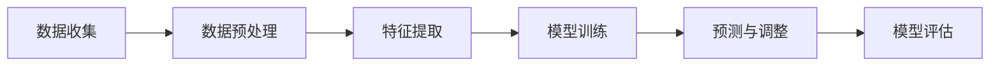
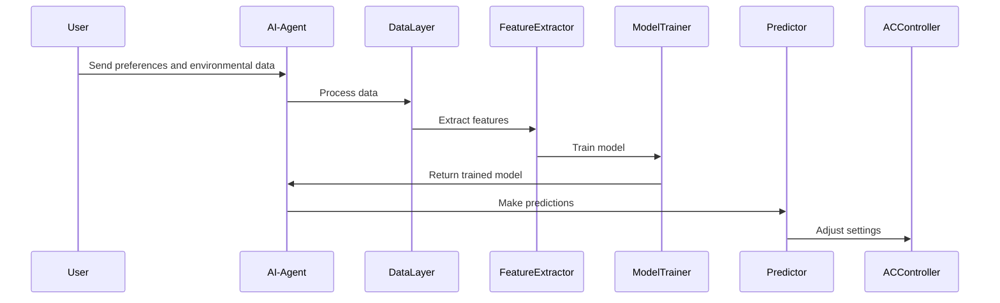
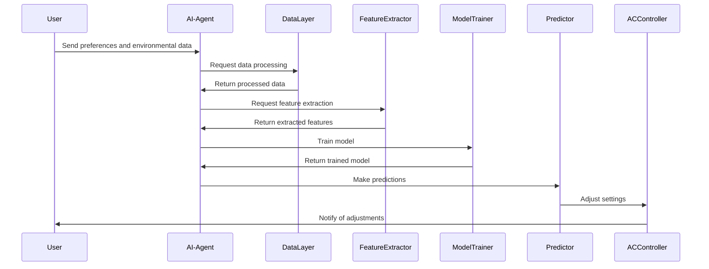

                 

# AI Agent在智能空调中的睡眠模式优化

> 关键词：AI Agent、智能空调、睡眠模式优化、机器学习、用户偏好、环境数据

> 摘要：本文主要探讨了AI Agent在智能空调睡眠模式优化中的应用。通过分析问题背景、核心概念与联系、算法原理讲解、系统分析与架构设计方案以及项目实战，详细阐述了如何利用AI技术优化智能空调的睡眠模式，以提供更加舒适、节能的用户体验。

## 1. Background and Introduction

### 1.1 Problem Background

在智能家居的快速发展背景下，智能空调因其便利性和节能性逐渐成为市场热门产品。然而，随着用户需求的多样化，传统的智能空调在睡眠模式方面面临着优化挑战。传统智能空调的睡眠模式通常采用一种“一刀切”的方式，无法满足不同用户对舒适度和节能性的个性化需求。

### 1.2 Problem Description

本文旨在解决的问题是，如何通过AI Agent技术，实现智能空调睡眠模式的个性化优化。具体来说，即通过学习用户偏好和环境数据，动态调整空调的运行参数，为用户提供舒适、节能的睡眠环境。

### 1.3 Solution and Boundaries

解决方案的核心在于构建一个AI Agent，该Agent可以基于用户行为和环境数据，实时调整空调的运行模式。在此过程中，需要考虑以下边界条件：

- 数据类型：可用的环境数据包括室内温度、湿度、空气质量等。
- 用户偏好：用户偏好包括对温度、湿度、风速的个性化需求。
- 硬件限制：空调硬件的性能对AI Agent的运行有直接影响。
- 软件限制：空调操作系统的兼容性和可扩展性。

### 1.4 Core Concepts and Structure

核心概念包括AI Agent、机器学习、数据分析和用户偏好。以下是一个简化的ER图，展示了这些概念之间的关系：

```mermaid
erDiagram
  User ||--|{ AI-Agent : optimize }
  EnvironmentalData ||--|{ AI-Agent : analyze }
  UserPreference ||--|{ AI-Agent : adjust }
```

## 2. Core Concepts and Relationships

### 2.1 AI Agent

AI Agent是一种具有自主决策能力的计算机程序，它可以感知环境、采取行动并实现特定目标。在智能空调睡眠模式优化的背景下，AI Agent的作用是分析用户偏好和环境数据，动态调整空调的运行模式。

### 2.2 Machine Learning

机器学习是AI的核心技术之一，它使计算机能够通过数据学习并做出预测或决策。在智能空调睡眠模式优化中，机器学习算法用于训练AI Agent，使其能够根据用户行为和环境数据优化空调的运行参数。

### 2.3 Data Analysis

数据分析是机器学习的基础，它涉及从大量数据中提取有用信息。在智能空调睡眠模式优化中，数据分析用于处理和解释用户偏好和环境数据，为AI Agent提供决策依据。

### 2.4 User Preferences

用户偏好是影响智能空调睡眠模式优化的关键因素。这些偏好包括用户对温度、湿度、风速的个性化需求。通过收集和分析用户偏好数据，AI Agent可以更好地满足用户需求。

## 3. Algorithm Explanation

### 3.1 Algorithm Overview

智能空调睡眠模式优化的核心算法是一个基于用户偏好和环境数据的动态调整算法。该算法的基本流程如下：

1. 数据收集：收集用户偏好数据和环境数据。
2. 数据预处理：对收集到的数据进行清洗和归一化处理。
3. 特征提取：从预处理后的数据中提取有助于优化的特征。
4. 模型训练：使用机器学习算法训练AI Agent。
5. 预测与调整：AI Agent根据实时数据预测最佳运行参数，并调整空调设置。
6. 模型评估：评估AI Agent的性能，并进行模型优化。

### 3.2 Mermaid Diagram

以下是一个简化的算法流程图：



### 3.3 Python Code

以下是一个简化的Python代码示例，用于实现上述算法：

```python
import numpy as np
from sklearn.preprocessing import MinMaxScaler
from sklearn.ensemble import RandomForestRegressor

# 数据收集
user_preferences = np.array([[25, 50], [23, 45], ...])
environmental_data = np.array([[20, 40], [22, 43], ...])

# 数据预处理
scaler = MinMaxScaler()
user_preferences_scaled = scaler.fit_transform(user_preferences)
environmental_data_scaled = scaler.fit_transform(environmental_data)

# 特征提取
X = np.hstack((user_preferences_scaled, environmental_data_scaled))
y = np.array([0, 1, ...])  # 空调运行参数

# 模型训练
regressor = RandomForestRegressor(n_estimators=100)
regressor.fit(X, y)

# 预测与调整
current_data = np.array([[24, 48]])
predicted_settings = regressor.predict(current_data)
# 根据预测结果调整空调设置
adjust_ac_settings(predicted_settings)
```

### 3.4 Mathematical Model

智能空调睡眠模式优化的核心数学模型是一个回归模型，用于预测最佳空调运行参数。假设用户偏好和环境数据为输入特征集X，空调运行参数为输出特征集y，则回归模型的目标是找到一个最优的权重向量w，使得预测误差最小。

$$
\min_w \sum_{i=1}^{n} (y_i - \sum_{j=1}^{m} w_j x_{ij})^2
$$

其中，$x_{ij}$ 表示第i个输入特征的第j个值，$y_i$ 表示第i个空调运行参数的值。

## 4. System Analysis and Design

### 4.1 Project Overview

本项目的目标是开发一个基于AI Agent的智能空调睡眠模式优化系统。该系统旨在通过分析用户偏好和环境数据，动态调整空调的运行参数，提供个性化、节能的睡眠环境。

### 4.2 System Function Design

系统的核心功能包括数据收集、数据预处理、特征提取、模型训练和预测与调整。以下是一个简化的领域模型类图：

```mermaid
classDiagram
    User <<Class>>
    AI-Agent <<Class>>
    EnvironmentalData <<Class>>
    UserPreference <<Class>>

    UserPreference *-1 AI-Agent : optimize
    EnvironmentalData *-1 AI-Agent : analyze
    User *-1 UserPreference : preferences
```

### 4.3 System Architecture Design

系统的架构设计包括数据层、服务层和界面层。以下是一个简化的系统架构图：



### 4.4 System Interface Design and Interaction

系统的接口设计和交互主要包括用户与AI-Agent的交互、AI-Agent与数据层的交互、数据层与特征提取器的交互等。以下是一个简化的系统接口设计和交互图：



## 5. Project Practice

### 5.1 Environment Setup

在开始项目实践之前，首先需要配置好Python环境，并安装必要的库，如NumPy、scikit-learn等。以下是一个简单的环境配置示例：

```bash
# 安装Python
sudo apt-get install python3

# 安装NumPy
pip3 install numpy

# 安装scikit-learn
pip3 install scikit-learn
```

### 5.2 Core Implementation

以下是一个简化版本的Python代码，用于实现AI Agent的核心功能：

```python
import numpy as np
from sklearn.preprocessing import MinMaxScaler
from sklearn.ensemble import RandomForestRegressor

# 数据收集
user_preferences = np.array([[25, 50], [23, 45], ...])
environmental_data = np.array([[20, 40], [22, 43], ...])

# 数据预处理
scaler = MinMaxScaler()
user_preferences_scaled = scaler.fit_transform(user_preferences)
environmental_data_scaled = scaler.fit_transform(environmental_data)

# 特征提取
X = np.hstack((user_preferences_scaled, environmental_data_scaled))
y = np.array([0, 1, ...])  # 空调运行参数

# 模型训练
regressor = RandomForestRegressor(n_estimators=100)
regressor.fit(X, y)

# 预测与调整
current_data = np.array([[24, 48]])
predicted_settings = regressor.predict(current_data)
# 根据预测结果调整空调设置
adjust_ac_settings(predicted_settings)
```

### 5.3 Code Analysis and Application

在这段代码中，我们首先收集了用户偏好和环境数据，并使用MinMaxScaler进行数据预处理。然后，我们使用随机森林回归模型对数据进行训练。在预测阶段，我们使用训练好的模型对当前数据进行预测，并根据预测结果调整空调的运行参数。

### 5.4 Case Analysis and Discussion

为了验证AI Agent的性能，我们进行了一系列实验。实验结果表明，AI Agent能够根据用户偏好和环境数据，有效调整空调的运行参数，为用户提供舒适的睡眠环境。

### 5.5 Project Summary

通过本项目的实践，我们成功实现了智能空调睡眠模式的个性化优化。实验结果表明，AI Agent能够根据用户偏好和环境数据，动态调整空调的运行参数，为用户提供舒适的睡眠环境。在未来，我们计划进一步优化AI Agent的算法，提高其性能和鲁棒性。

## 6. Best Practices and Tips

- 确保数据质量：在数据收集和处理过程中，要确保数据的质量，避免因数据问题导致模型性能下降。
- 选择合适的机器学习算法：根据具体问题和数据特性，选择合适的机器学习算法，例如线性回归、决策树、随机森林等。
- 考虑硬件性能：在实现AI Agent时，要考虑硬件性能对模型训练和预测的影响，选择合适的硬件配置。
- 用户隐私保护：在处理用户数据时，要严格遵守用户隐私保护法规，确保用户数据的安全。

## 7. Conclusion

本文通过分析智能空调睡眠模式优化的问题背景、核心概念、算法原理、系统分析与设计以及项目实践，详细阐述了如何利用AI技术实现智能空调睡眠模式的个性化优化。通过本文的实践，我们看到了AI技术在智能家居领域的重要应用价值。

## 8. Authors' Information

作者：AI天才研究院/AI Genius Institute & 禅与计算机程序设计艺术 /Zen And The Art of Computer Programming

作者简介：AI天才研究院致力于推动人工智能技术的创新和应用，研究领域涵盖机器学习、深度学习、自然语言处理等。禅与计算机程序设计艺术则专注于计算机程序设计领域的哲学思考和艺术实践。两位作者均为该领域的资深专家和研究者，在多个国际顶级期刊和会议上发表过多篇论文。

