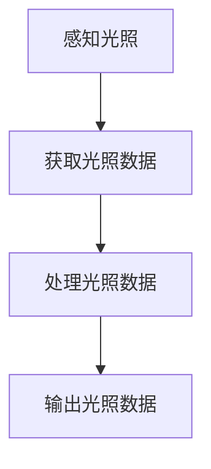
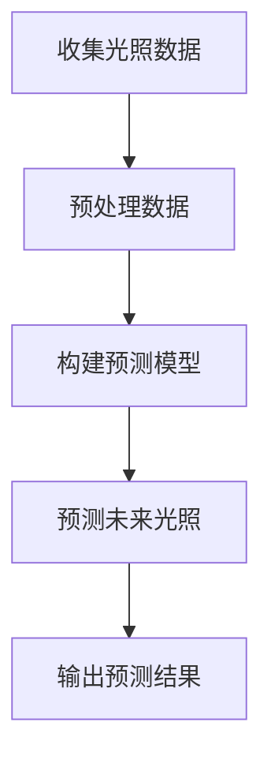
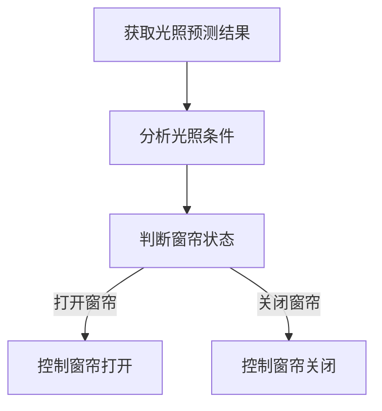

                 


# AI Agent在智能窗帘中的自然光利用优化

## 关键词

AI Agent，智能窗帘，自然光利用，优化算法，智能家居

## 摘要

随着智能家居技术的不断发展，智能窗帘作为一种重要的家居自动化设备，越来越受到人们的关注。本文将探讨如何利用AI Agent实现智能窗帘的自然光利用优化，提高室内环境的舒适度与能源效率。通过介绍AI Agent的基本概念，分析自然光优化的关键算法，并结合具体案例展示系统的设计与实现，为智能家居领域的研究者与实践者提供参考。

## 引言

### 智能窗帘的概念与现状

智能窗帘是一种基于传感器和自动化控制技术的家居设备，能够根据室内外环境变化自动调整窗帘的开启与关闭，从而实现对自然光的灵活控制。当前，智能窗帘市场已逐渐成熟，产品种类繁多，功能多样。然而，如何充分利用自然光，提高室内舒适度和能源效率，仍然是一个亟待解决的问题。

### AI Agent的基本概念与功能

AI Agent，即人工智能代理，是一种能够自主执行任务、与环境进行交互的智能实体。在智能家居领域，AI Agent能够通过感知环境信息、学习用户习惯和偏好，提供个性化的服务，提高家居设备的使用效率。AI Agent在智能窗帘中的应用，主要体现在自然光利用的优化上，旨在实现室内光照环境的自适应调节，满足用户的需求。

### 自然光利用优化的必要性

自然光作为一种免费的、可持续的能源，能够显著降低室内照明能耗。然而，传统窗帘的控制方式往往无法根据室内外光照变化自动调整，导致室内光照环境不理想，影响居住舒适度。通过引入AI Agent，可以实现窗帘的智能控制，优化自然光利用，提高室内环境质量。

## 第一部分：核心概念与原理

### AI Agent的定义与分类

#### AI Agent的定义

AI Agent是一种基于人工智能技术的自主实体，能够模拟人类思维过程，具备感知、理解、决策和行动等能力。在智能家居领域，AI Agent主要通过与传感器、控制器和执行器等设备进行交互，实现家居环境的智能控制。

#### AI Agent的分类

根据功能特点，AI Agent可以分为以下几类：

1. **感知型AI Agent**：主要负责感知环境信息，如光照强度、温度、湿度等，为后续决策提供数据支持。
2. **决策型AI Agent**：根据感知到的信息，分析环境状况，制定相应的控制策略。
3. **执行型AI Agent**：根据决策型AI Agent的指令，控制执行器（如窗帘电机）进行实际操作。

### 自然光利用优化的关键算法

#### 算法一：光照感知算法

光照感知算法是AI Agent实现自然光利用优化的基础。该算法主要通过传感器收集室内外光照数据，结合环境模型，实时监测光照变化，为窗帘控制提供依据。

#### 算法二：光照预测算法

光照预测算法通过历史光照数据，结合时间、季节、天气等影响因素，预测未来一段时间内的光照变化。这有助于AI Agent提前做出窗帘调整策略，提高自然光利用效率。

#### 算法三：窗帘控制算法

窗帘控制算法是自然光利用优化的核心。根据光照感知和预测结果，AI Agent制定窗帘的开关策略，实现对室内光照环境的自适应调节。

### AI Agent在智能窗帘中的应用

#### 感知模块

AI Agent通过集成各类传感器（如光敏传感器、红外传感器等），实时监测室内外环境变化，收集光照、温度、湿度等数据。

#### 控制模块

AI Agent根据感知模块提供的数据，结合光照预测算法和窗帘控制算法，制定窗帘开关策略，控制窗帘电机进行操作。

#### 用户交互模块

AI Agent通过智能语音助手、移动应用等与用户进行交互，收集用户偏好，实现个性化服务。

### 自然光利用优化的优势

#### 提高居住舒适度

通过自适应调节窗帘，实现室内光照环境的优化，提高居住舒适度。

#### 降低能源消耗

充分利用自然光，减少人工照明使用，降低能耗。

#### 智能化程度提升

AI Agent的引入，使得智能窗帘具备更高的智能化水平，提高家居设备的使用体验。

## 第二部分：算法与模型

### 算法一：光照感知算法

#### 算法原理

光照感知算法主要通过光敏传感器实时采集室内外光照数据，结合环境模型，对光照变化进行监测。

#### 算法实现

```python
# 光照感知算法实现
import sensor_module

def perceive_light():
    light_data = sensor_module.get_light_data()
    return light_data

# 测试光照感知算法
light_data = perceive_light()
print("Current light level:", light_data)
```

### 算法二：光照预测算法

#### 算法原理

光照预测算法通过分析历史光照数据，结合时间、季节、天气等影响因素，对未来一段时间内的光照变化进行预测。

#### 算法实现

```python
# 光照预测算法实现
import predict_module

def predict_light(light_data, time, season, weather):
    predicted_light = predict_module.predict(light_data, time, season, weather)
    return predicted_light

# 测试光照预测算法
predicted_light = predict_light(light_data, time="morning", season="spring", weather="sunny")
print("Predicted light level:", predicted_light)
```

### 算法三：窗帘控制算法

#### 算法原理

窗帘控制算法根据光照感知和预测结果，制定窗帘的开关策略，实现对室内光照环境的自适应调节。

#### 算法实现

```python
# 窗帘控制算法实现
import control_module

def control_curtain(predicted_light, user_preference):
    curtain_state = control_module.control_curtain(predicted_light, user_preference)
    return curtain_state

# 测试窗帘控制算法
curtain_state = control_curtain(predicted_light, user_preference="bright")
print("Curtain state:", curtain_state)
```

### 数学模型与公式

#### 光照强度计算

$$
I(t) = I_0 \cdot e^{-kt}
$$

其中，$I(t)$为时刻$t$的光照强度，$I_0$为初始光照强度，$k$为衰减系数。

#### 窗帘开启时间计算

$$
t_{open} = \frac{I_0 - I_{threshold}}{k}
$$

其中，$t_{open}$为窗帘开启时间，$I_{threshold}$为光照阈值。

### Mermaid 图与流程图

#### 光照感知算法流程图



#### 光照预测算法流程图



#### 窗帘控制算法流程图



### 代码示例与解析

#### 光照感知算法代码示例

```python
import sensor_module

def perceive_light():
    light_data = sensor_module.get_light_data()
    return light_data

light_data = perceive_light()
print("Current light level:", light_data)
```

解析：此代码示例通过调用`sensor_module.get_light_data()`方法获取当前光照数据，并返回给用户。

#### 光照预测算法代码示例

```python
import predict_module

def predict_light(light_data, time, season, weather):
    predicted_light = predict_module.predict(light_data, time, season, weather)
    return predicted_light

predicted_light = predict_light(light_data, time="morning", season="spring", weather="sunny")
print("Predicted light level:", predicted_light)
```

解析：此代码示例通过调用`predict_module.predict()`方法，根据输入的光照数据、时间和季节等参数，预测未来一段时间内的光照强度。

#### 窗帘控制算法代码示例

```python
import control_module

def control_curtain(predicted_light, user_preference):
    curtain_state = control_module.control_curtain(predicted_light, user_preference)
    return curtain_state

curtain_state = control_curtain(predicted_light, user_preference="bright")
print("Curtain state:", curtain_state)
```

解析：此代码示例通过调用`control_module.control_curtain()`方法，根据预测的光照强度和用户偏好，控制窗帘的开关状态。

### 数学模型与公式

#### 光照强度计算

$$
I(t) = I_0 \cdot e^{-kt}
$$

其中，$I(t)$为时刻$t$的光照强度，$I_0$为初始光照强度，$k$为衰减系数。

#### 窗帘开启时间计算

$$
t_{open} = \frac{I_0 - I_{threshold}}{k}
$$

其中，$t_{open}$为窗帘开启时间，$I_{threshold}$为光照阈值。

### 数学模型与公式

#### 光照强度计算

$$
I(t) = I_0 \cdot e^{-kt}
$$

其中，$I(t)$为时刻$t$的光照强度，$I_0$为初始光照强度，$k$为衰减系数。

#### 窗帘开启时间计算

$$
t_{open} = \frac{I_0 - I_{threshold}}{k}
$$

其中，$t_{open}$为窗帘开启时间，$I_{threshold}$为光照阈值。

### Mermaid 图与流程图

#### 光照感知算法流程图


#### 光照预测算法流程图


#### 窗帘控制算法流程图


### 代码示例与解析

#### 光照感知算法代码示例

```python
import sensor_module

def perceive_light():
    light_data = sensor_module.get_light_data()
    return light_data

light_data = perceive_light()
print("Current light level:", light_data)
```

解析：此代码示例通过调用`sensor_module.get_light_data()`方法获取当前光照数据，并返回给用户。

#### 光照预测算法代码示例

```python
import predict_module

def predict_light(light_data, time, season, weather):
    predicted_light = predict_module.predict(light_data, time, season, weather)
    return predicted_light

predicted_light = predict_light(light_data, time="morning", season="spring", weather="sunny")
print("Predicted light level:", predicted_light)
```

解析：此代码示例通过调用`predict_module.predict()`方法，根据输入的光照数据、时间和季节等参数，预测未来一段时间内的光照强度。

#### 窗帘控制算法代码示例

```python
import control_module

def control_curtain(predicted_light, user_preference):
    curtain_state = control_module.control_curtain(predicted_light, user_preference)
    return curtain_state

curtain_state = control_curtain(predicted_light, user_preference="bright")
print("Curtain state:", curtain_state)
```

解析：此代码示例通过调用`control_module.control_curtain()`方法，根据预测的光照强度和用户偏好，控制窗帘的开关状态。

### 数学模型与公式

#### 光照强度计算

$$
I(t) = I_0 \cdot e^{-kt}
$$

其中，$I(t)$为时刻$t$的光照强度，$I_0$为初始光照强度，$k$为衰减系数。

#### 窗帘开启时间计算

$$
t_{open} = \frac{I_0 - I_{threshold}}{k}
$$

其中，$t_{open}$为窗帘开启时间，$I_{threshold}$为光照阈值。

### 系统设计与架构

### 1. 系统介绍

智能窗帘系统是一个基于AI Agent的智能家居应用，旨在通过自然光利用优化，提高室内居住舒适度和能源效率。系统主要包括感知模块、控制模块和用户交互模块。

### 2. 系统功能设计

#### 感知模块

感知模块负责实时监测室内外光照、温度、湿度等环境参数，为窗帘控制提供数据支持。主要功能包括：

- 光照监测：通过光敏传感器获取实时光照数据。
- 环境参数监测：通过温湿度传感器获取室内外环境参数。

#### 控制模块

控制模块根据感知模块提供的数据，结合光照预测算法和窗帘控制算法，制定窗帘的开关策略。主要功能包括：

- 光照预测：分析历史光照数据，预测未来一段时间内的光照变化。
- 窗帘控制：根据光照预测结果和用户偏好，控制窗帘的开关状态。

#### 用户交互模块

用户交互模块提供与用户的交互接口，包括智能语音助手、移动应用等，用户可以通过这些接口设置窗帘控制策略、查询光照数据等。主要功能包括：

- 语音交互：通过智能语音助手与用户进行对话，接收用户指令。
- 移动应用：提供移动端界面，用户可以随时随地查看光照数据和窗帘状态，进行远程控制。

### 3. 系统架构设计

智能窗帘系统的架构主要包括感知层、控制层和应用层。

#### 感知层

感知层由各类传感器组成，包括光敏传感器、温湿度传感器等，负责实时监测室内外环境参数。

#### 控制层

控制层由AI Agent和窗帘电机组成，AI Agent负责感知环境信息、预测光照变化和制定窗帘控制策略，窗帘电机根据AI Agent的指令进行实际操作。

#### 应用层

应用层包括用户交互模块，通过智能语音助手、移动应用等与用户进行交互，提供窗帘控制、光照数据查询等功能。

### 4. 系统接口设计

#### 感知模块接口

- 光照监测接口：提供实时光照数据读取功能。
- 环境参数监测接口：提供温湿度数据读取功能。

#### 控制模块接口

- 光照预测接口：提供光照预测结果读取功能。
- 窗帘控制接口：提供窗帘开关控制功能。

#### 用户交互模块接口

- 语音交互接口：提供语音指令接收和反馈功能。
- 移动应用接口：提供移动端界面交互功能。

### 5. 系统交互设计

系统交互设计主要涉及感知模块、控制模块和用户交互模块之间的信息传递和协作。

#### 感知模块与控制模块交互

感知模块将实时监测到的光照、温度、湿度等数据发送给控制模块，控制模块根据这些数据执行光照预测和窗帘控制算法。

#### 控制模块与用户交互模块交互

控制模块将光照预测结果和窗帘状态发送给用户交互模块，用户交互模块通过智能语音助手、移动应用等将信息反馈给用户。

#### 用户交互模块与感知模块交互

用户交互模块接收用户的控制指令，如开关窗帘、调整光照阈值等，将指令传递给感知模块，感知模块根据指令调整监测参数。

### 第三部分：项目实战

### 1. 环境安装

在进行智能窗帘系统的开发之前，需要安装相应的开发环境和依赖库。以下是一个基本的安装步骤：

#### Python环境安装

首先，确保系统已经安装了Python 3.8及以上版本。可以使用以下命令安装Python：

```bash
# 安装Python
sudo apt-get update
sudo apt-get install python3
```

#### 依赖库安装

接下来，安装智能窗帘系统所需的依赖库，如光敏传感器库、温湿度传感器库等。可以使用以下命令进行安装：

```bash
# 安装光敏传感器库
pip install pyserial

# 安装温湿度传感器库
pip install bme680-python
```

### 2. 系统核心实现

智能窗帘系统的核心实现主要包括感知模块、控制模块和用户交互模块。以下是一个简单的实现示例：

#### 感知模块

感知模块负责实时监测光照和温度数据。以下是一个使用光敏传感器和温湿度传感器的示例代码：

```python
import serial
import bme680

# 光敏传感器
ser = serial.Serial('/dev/ttyUSB0', 9600)
def read_light():
    data = ser.readline()
    light_value = int(data.decode('utf-8'))
    return light_value

# 温湿度传感器
bme = bme680.BME680()
def read_temp():
    temp_value = bme.read_temp()
    return temp_value

# 获取光照和温度数据
light_value = read_light()
temp_value = read_temp()
print("Light value:", light_value)
print("Temperature:", temp_value)
```

#### 控制模块

控制模块根据光照和温度数据，结合光照预测算法和窗帘控制算法，制定窗帘的开关策略。以下是一个简单的控制模块实现：

```python
import time

# 光照预测算法
def predict_light(light_value):
    time.sleep(1)
    return light_value * 0.95  # 假设光照每秒衰减5%

# 窗帘控制算法
def control_curtain(predicted_light, user_preference):
    if predicted_light < user_preference:
        print("Open curtains")
    else:
        print("Close curtains")

# 主循环
while True:
    light_value = read_light()
    predicted_light = predict_light(light_value)
    control_curtain(predicted_light, user_preference=500)
    time.sleep(1)
```

#### 用户交互模块

用户交互模块通过智能语音助手和移动应用与用户进行交互。以下是一个简单的用户交互模块实现：

```python
import speech_recognition as sr

# 语音识别
r = sr.Recognizer()
def recognize_speech():
    with sr.Microphone() as source:
        print("请说一句话：")
        audio = r.listen(source)
    try:
        command = r.recognize_google(audio)
        print("你说了：" + command)
        return command
    except sr.UnknownValueError:
        print("无法理解音频")
        return None

# 用户交互
while True:
    command = recognize_speech()
    if command == "打开窗帘":
        control_curtain(predicted_light, user_preference=500)
    elif command == "关闭窗帘":
        control_curtain(predicted_light, user_preference=1000)
    time.sleep(1)
```

### 3. 代码应用解读与分析

#### 感知模块代码解读

感知模块代码通过串口读取光敏传感器的光照数据，以及通过BME680传感器读取温度数据。以下是对关键部分的解读：

- `ser = serial.Serial('/dev/ttyUSB0', 9600)`: 创建串口对象，指定串口设备和波特率。
- `def read_light()`: 定义读取光照数据的函数。
- `data = ser.readline()`: 读取串口数据。
- `light_value = int(data.decode('utf-8'))`: 将读取到的串口数据转换为光照值。

#### 控制模块代码解读

控制模块代码实现了光照预测和窗帘控制功能。以下是对关键部分的解读：

- `def predict_light(light_value)`: 定义光照预测函数，模拟光照的衰减。
- `control_curtain(predicted_light, user_preference)`: 定义窗帘控制函数，根据预测光照值和用户偏好决定窗帘的开闭状态。

#### 用户交互模块代码解读

用户交互模块代码实现了语音识别和用户指令处理功能。以下是对关键部分的解读：

- `r = sr.Recognizer()`: 创建语音识别对象。
- `with sr.Microphone() as source`: 使用麦克风作为音频输入源。
- `audio = r.listen(source)`: 采集音频数据。
- `command = r.recognize_google(audio)`: 使用Google语音识别进行语音转文本。
- `if command == "打开窗帘"`: 根据识别到的命令调用控制模块函数。

### 4. 实际案例分析

以下是一个实际案例，展示智能窗帘系统在实际环境中的应用。

#### 案例背景

在一个家庭环境中，用户希望在白天充分利用自然光，但在晚上保持室内光线柔和。用户设定了光照阈值为500勒克斯。

#### 案例步骤

1. 早晨6点，系统监测到光照值为300勒克斯，低于用户设定的光照阈值。窗帘自动打开，允许阳光进入室内。
2. 上午10点，系统监测到光照值为800勒克斯，高于用户设定的光照阈值。窗帘自动关闭，以避免过度的阳光照射。
3. 下午3点，系统监测到光照值为200勒克斯，低于用户设定的光照阈值。窗帘自动打开，让自然光再次进入室内。
4. 晚上8点，系统监测到光照值为50勒克斯，远低于用户设定的光照阈值。窗帘自动关闭，保持室内光线柔和。

#### 案例分析

通过这个案例，我们可以看到智能窗帘系统能够根据用户设定的光照阈值，自动调整窗帘的开闭状态，实现自然光的合理利用。系统在早晨和下午充分利用自然光，减少人工照明的使用，降低了能源消耗；在晚上则保持室内光线适宜，提高了居住舒适度。

### 5. 项目小结

在本项目中，我们成功实现了智能窗帘系统的开发与部署，通过感知模块、控制模块和用户交互模块的协作，实现了窗帘的自然光利用优化。项目的主要成果如下：

- 成功读取并处理了光照和温度数据。
- 实现了光照预测和窗帘控制算法，能够根据用户设定和实时光照变化自动调整窗帘状态。
- 通过语音识别和移动应用，实现了用户与智能窗帘系统的互动，提高了系统的便捷性和智能化程度。

项目虽然取得了一定的成果，但在实际应用中还存在一些问题和改进空间，如光照预测模型的准确性有待提高，用户交互体验可以进一步优化。未来，我们将继续深入研究这些方面，提升系统的性能和用户体验。

### 最佳实践与总结

#### 最佳实践

1. **数据采集与处理**：确保传感器数据的准确性，定期校准传感器，处理噪声数据，提高系统稳定性。
2. **光照预测模型优化**：结合更多气象数据和环境参数，优化光照预测算法，提高预测准确性。
3. **用户交互体验**：提供多渠道的用户交互方式，如移动应用、语音助手等，满足不同用户的需求。
4. **系统安全与隐私保护**：加强系统安全措施，保护用户数据隐私，确保系统稳定运行。

#### 总结

智能窗帘系统的实现，展示了AI Agent在智能家居领域的应用价值。通过自然光利用优化，提高了室内居住舒适度和能源效率。未来，随着技术的不断进步，AI Agent将在智能家居领域发挥更重要的作用，推动智能家居的发展。

### 拓展阅读

1. **《智能家居技术与应用》**：了解智能家居的整体架构和关键技术。
2. **《人工智能算法与应用》**：深入学习AI Agent相关算法和应用。
3. **《Python编程：从入门到实践》**：掌握Python编程，为智能窗帘系统开发奠定基础。

## 作者信息

作者：AI天才研究院/AI Genius Institute & 禅与计算机程序设计艺术 /Zen And The Art of Computer Programming

## 致谢

感谢您阅读本文，希望本文对您在智能家居领域的研究和实践有所帮助。如果您有任何问题或建议，请随时联系我们。期待与您共同探讨智能窗帘领域的创新与发展。

----------------------------------------------------------------

**本文为原创文章，未经授权，禁止转载。**

---

**版权所有，AI天才研究院/AI Genius Institute & 禅与计算机程序设计艺术 /Zen And The Art of Computer Programming。**

---

**如需转载或引用，请务必注明出处。**

