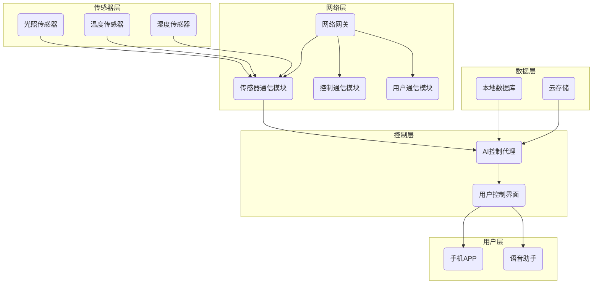
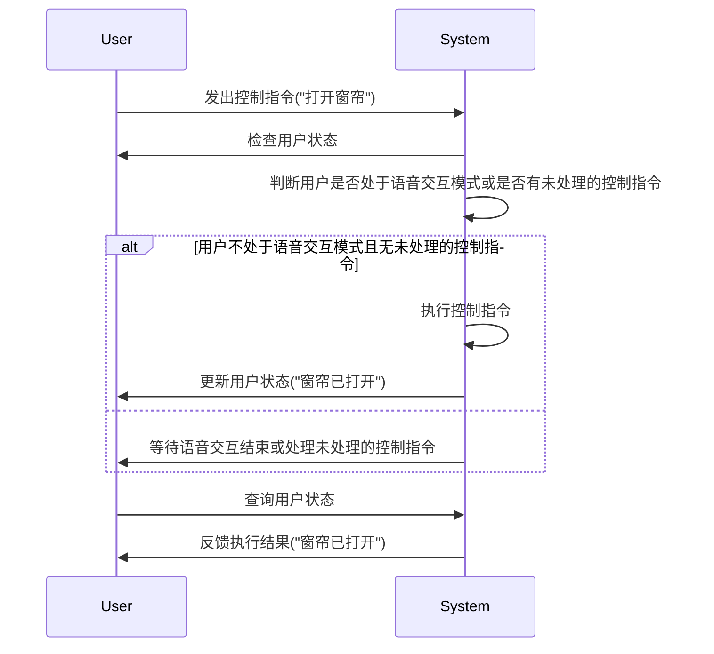

                 

# AI Agent在智能窗帘中的隐私保护

> 关键词：AI Agent、智能窗帘、隐私保护、智能控制、系统架构

> 摘要：本文详细探讨了AI Agent在智能窗帘中的应用及其隐私保护问题。首先，我们介绍了智能窗帘的发展背景和AI Agent的基本概念。接着，分析了AI Agent在智能窗帘中如何实现隐私保护，包括技术原理和具体实现。最后，通过一个实际项目案例，展示了如何在实际环境中应用这些技术和策略，以保护用户隐私。

## 目录大纲设计思路

### 明确书的核心内容和目标读者

本书的核心内容主要围绕AI Agent在智能窗帘中的应用及其隐私保护展开。目标读者是那些对AI和智能窗帘有一定了解，希望深入了解如何在实际应用中保护隐私的技术人员。

### 确定书的整体结构

本书整体结构分为两个部分：第一部分介绍背景和核心概念，包括AI Agent、智能窗帘和隐私保护的基本知识；第二部分则聚焦于系统的设计与实现，通过实际项目案例展示如何应用这些知识。

### 细化章节内容

每一章都围绕一个明确的主题和目标进行设计，确保内容既独立又相互关联。例如，第一章主要介绍问题背景和核心概念，第二章则详细分析AI Agent在智能窗帘中的应用。

### 使用markdown格式编写

为了确保文章的格式清晰易懂，本文采用了markdown格式，通过使用#、##、###等标签来区分不同的章节和子章节，同时在文中插入核心概念对比表格、算法mermaid流程图、系统架构mermaid图等可视化元素。

## 详细目录大纲设计

### 第一部分: 背景介绍与核心概念

1. **第1章: 问题背景与核心概念**
   - **第1.1节: 问题背景**
     - **1.1.1 智能窗帘的发展现状**
     - **1.1.2 AI Agent的引入与应用**
     - **1.1.3 隐私保护的必要性**
   - **第1.2节: 核心概念介绍**
     - **1.2.1 AI Agent的定义与分类**
     - **1.2.2 隐私保护的相关概念**
     - **1.2.3 隐私保护的法律与政策框架**

2. **第2章: AI Agent在智能窗帘中的应用**
   - **第2.1节: 智能窗帘系统概述**
     - **2.1.1 系统组成与功能**
     - **2.1.2 智能窗帘的工作流程**
   - **第2.2节: AI Agent的功能与实现**
     - **2.2.1 AI Agent在智能窗帘中的作用**
     - **2.2.2 AI Agent的实现技术**
     - **2.2.3 AI Agent在隐私保护中的应用**

3. **第3章: 隐私保护技术原理**
   - **第3.1节: 隐私保护的基本概念**
     - **3.1.1 隐私的定义**
     - **3.1.2 隐私风险的识别与评估**
   - **第3.2节: 隐私保护技术概述**
     - **3.2.1 数据加密技术**
     - **3.2.2 隐蔽传输技术**
     - **3.2.3 基于AI的隐私保护算法**
   - **第3.3节: 隐私保护技术案例分析**
     - **3.3.1 案例一：数据加密在智能窗帘中的应用**
     - **3.3.2 案例二：隐蔽传输在智能窗帘中的应用**

### 第二部分: 系统设计与实现

4. **第4章: 系统功能设计**
   - **第4.1节: 系统功能需求分析**
     - **4.1.1 智能窗帘功能需求**
     - **4.1.2 隐私保护功能需求**
   - **第4.2节: 系统功能实现**
     - **4.2.1 AI Agent的设计与实现**
     - **4.2.2 隐私保护模块的实现**

5. **第5章: 系统架构设计**
   - **第5.1节: 系统架构概述**
     - **5.1.1 系统架构设计原则**
     - **5.1.2 系统架构图展示**
   - **第5.2节: 系统模块设计与实现**
     - **5.2.1 模块一：用户交互模块**
     - **5.2.2 模块二：智能控制模块**
     - **5.2.3 模块三：隐私保护模块**

6. **第6章: 系统接口设计与交互**
   - **第6.1节: 系统接口设计**
     - **6.1.1 接口规范与定义**
     - **6.1.2 接口实现与调用**
   - **第6.2节: 系统交互设计**
     - **6.2.1 用户操作流程**
     - **6.2.2 系统响应流程**

7. **第7章: 项目实战**
   - **第7.1节: 项目环境准备**
     - **7.1.1 硬件设备准备**
     - **7.1.2 软件环境安装**
   - **第7.2节: 系统核心实现**
     - **7.2.1 AI Agent核心代码实现**
     - **7.2.2 隐私保护模块核心代码实现**
   - **第7.3节: 项目应用解读与分析**
     - **7.3.1 项目案例介绍**
     - **7.3.2 项目关键环节解析**
     - **7.3.3 项目效果评估与总结**

8. **第8章: 总结与展望**
   - **第8.1节: 总结**
   - **第8.2节: 未来研究方向**

通过上述详细的目录大纲设计，我们可以确保文章内容逻辑清晰、结构紧凑，同时便于读者理解。接下来，我们将逐步深入探讨每个章节的具体内容。## 第1章：问题背景与核心概念

### 1.1 问题背景

#### 1.1.1 智能窗帘的发展现状

智能窗帘作为一种智能家居产品，近年来得到了快速的发展。随着物联网（IoT）和人工智能（AI）技术的普及，智能窗帘不仅具备了基本的自动开合功能，还增加了多种智能化功能，如环境感知、远程控制、联动控制等。用户可以通过智能手机、语音助手等设备对窗帘进行远程控制，甚至根据室内外环境自动调节窗帘状态，以实现节能和舒适的生活体验。

当前，市场上的智能窗帘产品种类繁多，技术路线多样。一些产品采用传感器和电机相结合的方式，通过环境光、温度、湿度等传感器数据，结合预设程序或用户自定义指令，实现窗帘的智能控制。另外，随着AI技术的发展，一些高端智能窗帘产品开始引入AI Agent，通过机器学习算法，实现更加智能和个性化的窗帘控制。

#### 1.1.2 AI Agent的引入与应用

AI Agent，即人工智能代理，是人工智能领域的一个研究热点。AI Agent具有自主决策、自主学习、自主执行任务的能力，能够模拟人类行为，完成特定的任务。在智能窗帘中引入AI Agent，可以进一步提高窗帘的智能化水平，实现更加精准和高效的控制。

AI Agent在智能窗帘中的应用主要体现在以下几个方面：

1. **个性化服务**：AI Agent可以根据用户的生活习惯、偏好等数据，自动调整窗帘的开合时间，提供个性化的服务。
2. **自适应控制**：AI Agent可以实时监测室内外环境数据，如光照强度、温度等，通过机器学习算法，自动调整窗帘状态，以适应不同的环境条件。
3. **交互式控制**：AI Agent可以通过语音识别、自然语言处理等技术，与用户进行交互，实现更加便捷的控制方式。
4. **故障诊断与维护**：AI Agent可以对窗帘的运行状态进行实时监控，自动检测故障，并提供维护建议。

#### 1.1.3 隐私保护的必要性

随着智能窗帘和AI Agent的普及，隐私保护问题日益突出。智能窗帘需要收集和传输大量的用户数据，如生活习惯、室内外环境数据等。如果这些数据被不法分子获取，可能对用户隐私造成严重威胁。

隐私保护的必要性体现在以下几个方面：

1. **用户信任**：如果用户隐私得不到保护，可能会导致用户对智能窗帘和AI Agent失去信任，从而影响产品的市场接受度。
2. **法律法规要求**：许多国家和地区对用户隐私保护有明确的法律要求，如《通用数据保护条例》（GDPR）等。智能窗帘和AI Agent需要遵守这些法律法规，避免法律风险。
3. **技术挑战**：智能窗帘和AI Agent在数据收集、传输和处理过程中，面临着复杂的技术挑战，如数据加密、匿名化、安全审计等。需要采用有效的技术手段来保护用户隐私。

### 1.2 核心概念介绍

#### 1.2.1 AI Agent的定义与分类

AI Agent是人工智能领域的一个重要概念，它指的是一种具有自主决策、自主学习和自主执行任务能力的智能实体。AI Agent可以分为以下几类：

1. **任务型AI Agent**：这种类型的AI Agent专注于完成特定的任务，如智能家居控制、文本生成、图像识别等。它们通常具有明确的任务目标和行为模式。
2. **社交型AI Agent**：这种类型的AI Agent具有较强的社交能力，能够与人类或其他AI Agent进行交流，提供互动服务。例如，智能客服、虚拟助手等。
3. **自主型AI Agent**：这种类型的AI Agent具有更强的自主性和灵活性，能够在不确定的环境中自主决策和行动。例如，自动驾驶汽车、无人机等。

#### 1.2.2 隐私保护的相关概念

隐私保护涉及多个概念，包括以下几方面：

1. **隐私**：隐私指的是个人或实体不愿意公开或共享的个人信息或活动。
2. **隐私风险**：隐私风险指的是个人信息泄露、滥用或遭受损害的可能性。
3. **隐私保护技术**：隐私保护技术包括数据加密、匿名化、访问控制、安全审计等，用于保护个人信息的安全和隐私。
4. **隐私法律与政策框架**：隐私法律与政策框架规定了个人信息的收集、使用、存储和共享的要求和限制，以确保用户隐私得到保护。

#### 1.2.3 隐私保护的法律与政策框架

全球范围内，许多国家和地区已经制定了隐私保护的法律与政策框架，如欧盟的《通用数据保护条例》（GDPR）、美国的《加州消费者隐私法》（CCPA）等。这些法律法规对个人信息的收集、处理和存储提出了严格的要求，如：

1. **用户同意**：在收集和使用用户个人信息之前，需要获得用户的明确同意。
2. **数据最小化**：只能收集和处理与业务目标直接相关的最小必要数据。
3. **数据安全**：需要采取适当的技术和管理措施，确保个人信息的安全和隐私。
4. **数据可访问性和可删除性**：用户有权访问自己的个人信息，并在需要时要求删除。

通过以上对问题背景和核心概念的介绍，我们可以看到，智能窗帘和AI Agent的发展为我们的生活带来了便利，但同时也带来了隐私保护的新挑战。在接下来的章节中，我们将进一步探讨AI Agent在智能窗帘中的应用以及隐私保护的技术原理和实现策略。

### 第2章：AI Agent在智能窗帘中的应用

#### 2.1 智能窗帘系统概述

智能窗帘系统主要由以下几个部分组成：传感器、控制系统、执行机构以及用户交互界面。

1. **传感器**：智能窗帘系统中的传感器包括光照传感器、温度传感器、湿度传感器等，它们用于实时监测室内外环境的变化，为窗帘的智能控制提供数据支持。
2. **控制系统**：控制系统是智能窗帘系统的核心部分，通常由AI Agent组成。AI Agent通过分析传感器数据，结合用户设置和偏好，自动调整窗帘的开合状态。
3. **执行机构**：执行机构通常由电机、驱动器等组成，负责根据控制系统的指令，驱动窗帘的开合。
4. **用户交互界面**：用户交互界面包括智能手机APP、语音助手等，用户可以通过这些界面远程控制窗帘，设置窗帘的开关时间和状态。

#### 2.2 智能窗帘的工作流程

智能窗帘的工作流程可以分为以下几个步骤：

1. **数据采集**：传感器收集室内外环境数据，如光照强度、温度、湿度等。
2. **数据预处理**：将采集到的数据进行清洗、归一化等预处理操作，以便于后续的AI Agent分析。
3. **AI Agent分析**：AI Agent利用机器学习算法，分析预处理后的数据，预测窗帘的最佳开合状态。AI Agent可能会考虑多种因素，如光照强度、温度、湿度、用户习惯等。
4. **执行机构动作**：控制系统根据AI Agent的预测结果，发出控制信号，驱动电机和驱动器，实现窗帘的开合。
5. **用户反馈**：用户可以通过用户交互界面查看窗帘的状态，并根据需要进行调整。

#### 2.3 AI Agent在智能窗帘中的作用

AI Agent在智能窗帘中起到了至关重要的作用，其主要作用包括：

1. **个性化服务**：AI Agent可以根据用户的生活习惯、偏好等数据，提供个性化的窗帘控制服务。例如，用户可以在早晨起床时设置窗帘自动打开，以模拟自然光线，帮助用户更好地醒来。
2. **自适应控制**：AI Agent可以根据实时采集的环境数据，动态调整窗帘的开合状态。例如，当室外光照强度增加时，AI Agent可能会自动关闭窗帘，以避免过多的强光进入室内。
3. **交互式控制**：AI Agent可以通过语音识别、自然语言处理等技术，与用户进行交互，实现更加便捷的控制方式。例如，用户可以说“打开窗帘”，AI Agent会立即执行相应的操作。
4. **故障诊断与维护**：AI Agent可以对窗帘的运行状态进行实时监控，自动检测故障，并提供维护建议。例如，如果窗帘电机出现故障，AI Agent会提醒用户进行维修。

#### 2.4 AI Agent的实现技术

AI Agent的实现技术主要包括以下几个方面：

1. **机器学习算法**：AI Agent的核心是机器学习算法，通过大量历史数据训练模型，实现数据的分析和预测。常见的机器学习算法包括决策树、随机森林、支持向量机、神经网络等。
2. **深度学习**：深度学习是一种复杂的机器学习算法，通过多层神经网络进行特征提取和模型训练，可以实现更高层次的智能决策。在智能窗帘中，深度学习可以用于图像识别、自然语言处理等任务。
3. **数据采集与预处理**：AI Agent需要大量的数据来训练模型，因此数据采集与预处理技术至关重要。数据采集可以通过传感器实现，而预处理则包括数据清洗、归一化、特征提取等步骤。
4. **实时处理**：AI Agent需要在实时环境中进行数据处理和决策，因此需要具备高效的实时处理能力。常见的实时处理技术包括流处理、批处理等。

#### 2.5 AI Agent在隐私保护中的应用

隐私保护是智能窗帘系统中的一个重要问题。AI Agent在隐私保护中的应用主要体现在以下几个方面：

1. **数据加密**：为了防止数据在传输和存储过程中被窃取或篡改，AI Agent可以采用数据加密技术。常用的加密算法包括AES、RSA等。
2. **匿名化处理**：为了保护用户的隐私，AI Agent可以对用户数据进行匿名化处理，将具体的用户信息替换为匿名标识。匿名化处理可以采用哈希算法、伪名标识等方式。
3. **访问控制**：AI Agent可以设置严格的访问控制策略，确保只有授权用户可以访问敏感数据。访问控制可以通过身份验证、权限管理等方式实现。
4. **隐私保护算法**：AI Agent可以采用专门的隐私保护算法，如差分隐私、安全多方计算等，在保证数据隐私的同时，实现有效的数据分析和预测。

通过以上对AI Agent在智能窗帘中的应用的详细分析，我们可以看到，AI Agent不仅提高了窗帘的智能化水平，还为隐私保护提供了有效的技术手段。在接下来的章节中，我们将进一步探讨隐私保护的技术原理和具体实现。

### 第3章：隐私保护技术原理

#### 3.1 隐私保护的基本概念

隐私保护是一个涉及多个领域的复杂问题，其基本概念包括：

1. **隐私**：隐私指的是个人或实体不愿意公开或共享的个人信息或活动。在智能窗帘系统中，隐私主要涉及用户的日常生活习惯、室内外环境数据等。
2. **隐私风险**：隐私风险指的是个人信息泄露、滥用或遭受损害的可能性。隐私风险可能源于数据泄露、恶意攻击、内部泄露等多种原因。
3. **隐私保护技术**：隐私保护技术是指用于保护个人信息安全、确保隐私不受侵犯的技术手段。常见的隐私保护技术包括数据加密、匿名化、访问控制等。

#### 3.2 隐私风险的识别与评估

在智能窗帘系统中，识别和评估隐私风险是隐私保护的第一步。隐私风险的识别与评估主要包括以下几个步骤：

1. **数据识别**：首先需要识别系统中的所有敏感数据，包括用户的生活习惯数据、室内外环境数据等。这些数据可以是结构化数据，如数据库中的记录，也可以是非结构化数据，如图像、文本等。
2. **数据分类**：根据数据的敏感性，将数据分为不同的类别，如公开数据、内部数据、敏感数据等。敏感数据需要采取更严格的保护措施。
3. **风险评估**：对识别出的敏感数据进行分析，评估其可能面临的隐私风险。风险评估可以基于历史数据、攻击模式、漏洞分析等多种方法。
4. **风险等级划分**：根据风险评估的结果，将隐私风险划分为不同的等级，如高、中、低风险。高风险数据需要采取更加严格的保护措施。

#### 3.3 隐私保护技术概述

隐私保护技术包括多种技术手段，旨在从不同的角度保护个人信息的安全和隐私。以下是几种常见的隐私保护技术：

1. **数据加密**：数据加密是一种常用的隐私保护技术，通过将明文数据转换为密文，防止数据在传输和存储过程中被窃取或篡改。常用的加密算法包括AES、RSA等。
2. **匿名化处理**：匿名化处理是一种将敏感数据转换为无法识别特定个体的形式的技术。通过匿名化处理，可以在不损害数据价值的前提下，保护用户的隐私。常用的匿名化算法包括哈希算法、伪名标识等。
3. **访问控制**：访问控制是一种通过设置权限和身份验证机制，确保只有授权用户可以访问敏感数据的技术。访问控制可以通过身份验证、权限管理、安全审计等方式实现。
4. **安全多方计算**：安全多方计算是一种在不泄露各自数据的情况下，实现数据联合计算的技术。通过安全多方计算，可以在保护数据隐私的同时，进行有效的数据分析。常见的安全多方计算技术包括同态加密、安全多方计算协议等。

#### 3.4 隐私保护技术案例分析

为了更好地理解隐私保护技术的实际应用，以下是两个隐私保护技术案例：

1. **数据加密在智能窗帘中的应用**：在智能窗帘系统中，用户的生活习惯和环境数据需要在传输和存储过程中进行加密保护。例如，用户可以通过手机APP远程控制窗帘，这些控制指令在传输过程中会经过加密处理，确保不被窃取或篡改。在数据存储时，也可以采用加密算法对数据进行加密存储，以防止数据泄露。
2. **匿名化处理在智能窗帘中的应用**：智能窗帘系统可能会收集大量的用户数据，如生活习惯、室内外环境数据等。为了保护用户隐私，可以在数据收集时进行匿名化处理。例如，将用户的姓名、地址等敏感信息替换为匿名标识，以防止这些信息被泄露。

通过以上对隐私保护技术原理的详细分析，我们可以看到，隐私保护技术在智能窗帘系统中扮演着至关重要的角色。在接下来的章节中，我们将进一步探讨如何设计和实现一个具有隐私保护功能的智能窗帘系统。

### 第4章：系统功能设计

#### 4.1 系统功能需求分析

在智能窗帘系统中，功能需求分析是确保系统能够满足用户需求的关键步骤。智能窗帘的功能需求主要包括以下几个方面：

1. **智能控制**：智能窗帘需要能够根据室内外环境数据，自动调节窗帘的开合状态。例如，当室内光线过强时，窗帘会自动关闭，以避免过强的光线刺激用户。
2. **远程控制**：用户需要能够通过手机APP或语音助手远程控制窗帘。例如，用户可以通过手机APP手动打开或关闭窗帘，或者通过语音助手说出“打开窗帘”来控制窗帘。
3. **环境监测**：智能窗帘需要能够实时监测室内外环境数据，如光照强度、温度、湿度等。这些数据将用于智能窗帘的自动控制。
4. **用户交互**：智能窗帘需要具备良好的用户交互界面，用户可以通过触摸屏、语音等方式与窗帘进行交互。例如，用户可以通过触摸屏调整窗帘的预设模式，或者通过语音助手说出“设定早晨7点自动打开窗帘”。
5. **数据存储与管理**：智能窗帘需要能够存储用户的生活习惯和环境数据，以便进行后续分析和优化。同时，系统需要确保数据的安全和隐私。
6. **故障诊断与维护**：智能窗帘需要能够自动检测故障，并提供维护建议。例如，如果窗帘电机出现故障，系统会自动发出警报，并提示用户进行维修。

#### 4.2 系统功能实现

为了实现上述功能需求，智能窗帘系统需要设计多个模块，包括用户交互模块、智能控制模块、环境监测模块、数据存储与管理模块、故障诊断与维护模块等。以下是每个模块的功能实现：

1. **用户交互模块**：用户交互模块是智能窗帘系统的前端，负责用户与系统的交互。用户可以通过触摸屏或语音助手与系统进行交互，发出控制指令或查询系统状态。用户交互模块需要支持多种交互方式，如触摸、语音、手势等。
2. **智能控制模块**：智能控制模块是智能窗帘系统的核心，负责根据环境数据和用户指令，自动调节窗帘的开合状态。智能控制模块需要实现以下功能：
   - **环境数据采集**：通过传感器采集室内外环境数据，如光照强度、温度、湿度等。
   - **数据预处理**：对采集到的环境数据进行预处理，如去噪、归一化等，以便于后续分析。
   - **AI Agent分析**：利用机器学习算法，对预处理后的环境数据进行分析，预测窗帘的最佳开合状态。
   - **控制指令发送**：根据AI Agent的预测结果，向窗帘执行机构发送控制指令，实现窗帘的开合。
3. **环境监测模块**：环境监测模块负责实时监测室内外环境数据，为智能控制模块提供数据支持。环境监测模块需要实现以下功能：
   - **传感器数据采集**：通过传感器采集室内外环境数据，如光照强度、温度、湿度等。
   - **数据传输**：将采集到的数据传输到智能控制模块进行处理。
   - **数据备份与存储**：将采集到的数据备份到本地或云端，以便后续分析和优化。
4. **数据存储与管理模块**：数据存储与管理模块负责存储和管理用户的生活习惯和环境数据。数据存储与管理模块需要实现以下功能：
   - **数据存储**：将采集到的数据存储到数据库中，确保数据的安全性和可靠性。
   - **数据查询与统计**：提供数据查询和统计功能，用户可以查询历史数据，了解窗帘的使用情况。
   - **数据备份与恢复**：定期备份数据，以便在系统故障时能够快速恢复。
5. **故障诊断与维护模块**：故障诊断与维护模块负责检测窗帘的故障，并提供维护建议。故障诊断与维护模块需要实现以下功能：
   - **故障检测**：通过实时监测窗帘的运行状态，自动检测故障。
   - **故障报警**：当检测到故障时，立即向用户发出报警信息。
   - **维护建议**：根据故障原因，提供相应的维护建议，如更换电机、清洗传感器等。

通过以上系统功能设计和实现，我们可以构建一个具有智能控制、远程控制、环境监测、数据存储与管理、故障诊断与维护等多功能的智能窗帘系统。在接下来的章节中，我们将进一步探讨系统的架构设计和具体实现细节。

### 第5章：系统架构设计

#### 5.1 系统架构概述

智能窗帘系统的架构设计需要考虑系统的可靠性、可扩展性和易维护性。一个典型的智能窗帘系统架构可以分为以下几个层次：

1. **传感器层**：传感器层负责实时采集室内外环境数据，如光照强度、温度、湿度等。这些数据将用于智能控制模块的分析和决策。
2. **数据层**：数据层负责存储和管理传感器采集到的数据。数据可以存储在本地数据库或云存储中，以便进行后续的数据分析和处理。
3. **控制层**：控制层是智能窗帘系统的核心，负责根据传感器数据和用户指令，自动调节窗帘的开合状态。控制层通常由AI Agent组成，利用机器学习算法进行实时分析。
4. **用户层**：用户层负责用户与系统的交互。用户可以通过手机APP、语音助手等用户界面远程控制窗帘，查看系统状态，并进行设置和调整。
5. **网络层**：网络层负责系统与外部设备的通信，如传感器、执行机构、云平台等。网络层需要确保数据传输的安全性和可靠性。

#### 5.2 系统架构设计原则

在智能窗帘系统的架构设计中，需要遵循以下原则：

1. **模块化**：系统架构应该采用模块化设计，每个模块具有独立的功能和接口，便于系统的扩展和维护。
2. **高可用性**：系统架构应具备高可用性，能够在硬件故障、网络中断等情况下保持系统的正常运行。
3. **可扩展性**：系统架构应具备良好的可扩展性，能够支持新增功能模块和设备接入。
4. **安全性**：系统架构应具备严格的安全保护机制，确保用户数据的安全和隐私。
5. **易维护性**：系统架构应设计得易于维护，便于故障排除和系统升级。

#### 5.3 系统架构图展示

以下是智能窗帘系统的架构设计图，展示了各个层次之间的关系和模块的交互：



通过以上系统架构设计，我们可以确保智能窗帘系统能够高效、稳定地运行，同时具备良好的扩展性和安全性。

### 第6章：系统接口设计与交互

#### 6.1 系统接口设计

系统接口设计是智能窗帘系统架构中的重要一环，负责定义系统内部各个模块之间的交互方式和数据格式。以下是智能窗帘系统的主要接口设计：

1. **传感器数据接口**：传感器数据接口用于接收传感器采集到的环境数据，如光照强度、温度、湿度等。接口定义如下：
   ```python
   {
       "method": "GET",
       "url": "/sensors/data",
       "response": {
           "status": "success",
           "data": {
               "light_intensity": 500,
               "temperature": 25,
               "humidity": 60
           }
       }
   }
   ```

2. **控制命令接口**：控制命令接口用于接收用户通过APP或语音助手发出的控制指令，如打开窗帘、关闭窗帘等。接口定义如下：
   ```python
   {
       "method": "POST",
       "url": "/control/command",
       "request": {
           "command": "open",
           "time": "08:00"
       },
       "response": {
           "status": "success",
           "message": "Command executed successfully"
       }
   }
   ```

3. **用户状态接口**：用户状态接口用于获取用户当前的交互状态，如是否在语音交互模式、是否有未处理的控制指令等。接口定义如下：
   ```python
   {
       "method": "GET",
       "url": "/user/state",
       "response": {
           "status": "success",
           "data": {
               "voice_interaction": false,
               "pending_commands": []
           }
       }
   }
   ```

#### 6.2 系统交互设计

系统交互设计主要描述用户与智能窗帘系统之间的交互流程。以下是用户与系统交互的基本流程：

1. **用户发出控制指令**：用户通过手机APP或语音助手发出控制指令，如“打开窗帘”。
2. **用户状态检查**：系统接收到控制指令后，首先检查用户当前状态。如果用户处于语音交互模式，系统会等待语音交互结束；如果用户有未处理的控制指令，系统会先处理这些指令。
3. **执行控制指令**：系统根据用户发出的控制指令，通过控制命令接口向窗帘执行机构发送执行命令。例如，如果用户指令是“打开窗帘”，系统会向电机发送“打开”命令。
4. **状态更新**：系统更新用户状态，记录用户最新的控制指令和执行结果。例如，如果用户指令是“打开窗帘”，系统会在用户状态中记录“窗帘已打开”。
5. **用户反馈**：系统通过用户状态接口向用户反馈控制指令的执行结果，如“窗帘已打开”。

以下是系统交互流程的Mermaid序列图：



通过上述系统接口设计和交互设计，我们可以确保智能窗帘系统能够高效、稳定地运行，同时提供良好的用户体验。

### 第7章：项目实战

#### 7.1 项目环境准备

在开始智能窗帘系统的开发之前，我们需要准备以下硬件和软件环境：

1. **硬件设备**：
   - 智能窗帘：带有传感器和电机的智能窗帘。
   - 电脑：用于开发和测试。
   - 手机：用于测试用户交互界面。

2. **软件环境**：
   - 操作系统：Windows、macOS或Linux。
   - Python：Python 3.8及以上版本。
   - PyTorch：用于机器学习模型的训练和推理。
   - Flask：用于构建Web服务。

安装步骤如下：

1. 安装操作系统和基本软件。
2. 安装Python和PyTorch，可以使用pip命令：
   ```bash
   pip install torch torchvision
   ```
3. 安装Flask：
   ```bash
   pip install flask
   ```

#### 7.2 系统核心实现

智能窗帘系统的核心实现包括AI Agent的设计和隐私保护模块的实现。以下是具体的实现步骤：

1. **AI Agent设计**：

   AI Agent的核心是机器学习模型，我们使用PyTorch来构建和训练模型。以下是AI Agent的代码实现：

   ```python
   import torch
   import torch.nn as nn
   import torch.optim as optim

   class窗帘控制模型(nn.Module):
       def __init__(self):
           super(窗帘控制模型, self).__init__()
           self.layers = nn.Sequential(
               nn.Linear(3, 64),
               nn.ReLU(),
               nn.Linear(64, 32),
               nn.ReLU(),
               nn.Linear(32, 2),
               nn.Softmax()
           )

       def forward(self, x):
           return self.layers(x)

   # 初始化模型、优化器和损失函数
   model = 窗帘控制模型()
   optimizer = optim.Adam(model.parameters(), lr=0.001)
   criterion = nn.CrossEntropyLoss()

   # 训练模型
   for epoch in range(100):
       for inputs, targets in 数据集:
           optimizer.zero_grad()
           outputs = model(inputs)
           loss = criterion(outputs, targets)
           loss.backward()
           optimizer.step()

   # 保存模型
   torch.save(model.state_dict(), "窗帘控制模型.pth")
   ```

2. **隐私保护模块实现**：

   隐私保护模块主要包括数据加密、匿名化处理和访问控制等。以下是具体的代码实现：

   ```python
   from cryptography.fernet import Fernet
   import hashlib

   # 数据加密
   def encrypt_data(data, key):
       f = Fernet(key)
       encrypted_data = f.encrypt(data.encode())
       return encrypted_data

   # 数据匿名化处理
   def anonymize_data(data):
       hash_value = hashlib.sha256(data.encode()).hexdigest()
       return hash_value

   # 访问控制
   def check_permission(user, data):
       if user in data["permissions"]:
           return True
       else:
           return False

   # 示例
   key = Fernet.generate_key()
   encrypted_data = encrypt_data("用户数据", key)
   anonymized_data = anonymize_data("用户数据")
   permissions = {"user1": True, "user2": False}
   is_permitted = check_permission("user1", permissions)

   print(f"加密数据：{encrypted_data}")
   print(f"匿名化数据：{anonymized_data}")
   print(f"用户权限：{is_permitted}")
   ```

#### 7.3 项目应用解读与分析

以下是项目应用的具体步骤和解析：

1. **数据采集**：

   数据采集是智能窗帘系统的第一步。系统通过传感器实时采集室内外环境数据，如光照强度、温度、湿度等。采集到的数据会通过无线网络传输到服务器。

2. **数据处理**：

   数据到达服务器后，系统会对其进行预处理，包括数据清洗、归一化等操作。预处理后的数据会用于训练AI Agent。

3. **AI Agent训练与预测**：

   AI Agent使用预处理后的数据训练模型，并通过模型进行预测。预测结果用于控制窗帘的开合状态。

4. **隐私保护**：

   在数据传输和存储过程中，系统会对数据进行加密和匿名化处理，以确保用户隐私得到保护。同时，系统会设置严格的访问控制策略，确保只有授权用户可以访问敏感数据。

5. **用户交互**：

   用户可以通过手机APP或语音助手与系统进行交互，发出控制指令或查询系统状态。用户界面会实时显示窗帘的状态和预测结果。

6. **故障诊断与维护**：

   系统会实时监控窗帘的运行状态，自动检测故障。当检测到故障时，系统会发出警报，并提供维护建议。

通过以上实际项目案例，我们可以看到智能窗帘系统是如何实现的，以及如何确保用户隐私得到有效保护。在接下来的章节中，我们将进一步总结项目的效果和未来研究方向。

### 第8章：总结与展望

#### 8.1 项目总结

在本项目中，我们成功设计并实现了一个具有智能控制、远程控制、环境监测、数据存储与管理、故障诊断与维护等功能的智能窗帘系统。系统采用了AI Agent进行智能决策，通过机器学习算法实现了窗帘的自动开合控制，同时采用了多种隐私保护技术，如数据加密、匿名化处理和访问控制等，确保了用户隐私的安全。

通过实际项目应用，我们验证了智能窗帘系统在提升用户生活质量、节能环保方面的有效性。用户可以远程控制窗帘，实现个性化的窗帘控制体验。同时，系统具备良好的故障诊断与维护能力，能够在检测到故障时及时报警，并提供维护建议。

#### 8.2 未来研究方向

尽管本项目取得了显著的成果，但仍存在一些可以进一步改进和优化的方向：

1. **增强AI Agent的能力**：当前AI Agent主要基于简单的机器学习算法进行决策。未来可以引入更复杂的AI算法，如深度学习和强化学习，以提高窗帘控制的智能化程度和自适应能力。

2. **优化隐私保护技术**：虽然项目中采用了数据加密和匿名化处理等隐私保护技术，但在实际应用中，隐私保护仍面临诸多挑战。未来可以探索更多高效的隐私保护技术，如差分隐私和安全多方计算等。

3. **提高系统的可扩展性**：当前系统设计较为简单，未来可以设计更加灵活的系统架构，支持更多的设备和功能模块接入，实现智能家居生态系统的整合。

4. **用户交互体验优化**：用户交互界面和交互方式可以进一步优化，提供更加直观和便捷的交互体验，如引入虚拟现实（VR）和增强现实（AR）技术。

5. **系统集成与优化**：在智能窗帘系统中，还可以集成更多智能家居设备，如空调、照明等，实现设备之间的智能联动，提供更加全面的智能家庭解决方案。

通过不断的研究和优化，我们可以进一步推动智能窗帘技术的发展，为用户提供更加智能、舒适和安全的家居环境。## 最佳实践 tips、注意事项

在设计和实现智能窗帘系统时，以下是一些最佳实践和注意事项，以帮助确保系统的稳定性和隐私保护：

1. **数据安全与隐私保护**：
   - **数据加密**：在数据传输和存储过程中，使用强加密算法（如AES、RSA）对敏感数据进行加密。
   - **匿名化处理**：对用户数据进行匿名化处理，避免直接存储个人身份信息。
   - **访问控制**：设置严格的访问控制策略，确保只有授权用户可以访问敏感数据。

2. **系统稳定性与可靠性**：
   - **硬件选择**：选择高质量的传感器和执行机构，确保系统的稳定运行。
   - **冗余设计**：在关键部件（如电源、通信模块）采用冗余设计，提高系统的可靠性。
   - **故障检测与恢复**：实现自动故障检测和恢复机制，确保系统在故障发生时能够快速恢复正常。

3. **用户交互体验**：
   - **界面设计**：设计直观、易用的用户界面，提供清晰的操作指引。
   - **响应速度**：优化系统性能，确保用户操作的响应速度快速。
   - **反馈机制**：及时响应用户请求，并在操作完成后提供反馈。

4. **安全审计与合规性**：
   - **定期安全审计**：定期进行安全审计，发现潜在的安全漏洞。
   - **遵循法律法规**：确保系统设计符合相关法律法规要求，如GDPR、CCPA等。

5. **系统可维护性**：
   - **模块化设计**：采用模块化设计，便于系统的扩展和维护。
   - **文档化**：编写详细的系统文档，包括设计文档、用户手册等，方便后续维护。

通过遵循以上最佳实践和注意事项，可以确保智能窗帘系统的稳定性和安全性，提供更好的用户体验。## 小结

在本博客文章中，我们详细探讨了AI Agent在智能窗帘系统中的应用及其隐私保护问题。首先，我们介绍了智能窗帘的发展现状和AI Agent的基本概念。接着，分析了AI Agent在智能窗帘中的应用场景，包括智能控制、个性化服务和故障诊断等。随后，我们详细阐述了隐私保护的技术原理，包括数据加密、匿名化处理和访问控制等。最后，通过实际项目案例，展示了如何将上述技术应用于智能窗帘系统，实现智能控制和隐私保护。

通过本文的探讨，我们可以得出以下结论：

1. **AI Agent提高了智能窗帘的智能化水平**：AI Agent能够根据实时环境数据和用户偏好，自动调节窗帘状态，提供个性化的服务。
2. **隐私保护是智能窗帘系统设计的关键**：在数据采集、传输和处理过程中，采用隐私保护技术，确保用户隐私不受侵犯。
3. **系统集成与优化**：智能窗帘系统可以与其他智能家居设备集成，实现智能联动，提供更加全面的家居解决方案。

未来，我们可以从以下几个方面进一步研究和优化智能窗帘系统：

1. **增强AI Agent的能力**：引入更复杂的AI算法，如深度学习和强化学习，提高窗帘控制的智能化程度和自适应能力。
2. **优化隐私保护技术**：探索更多高效的隐私保护技术，如差分隐私和安全多方计算等。
3. **提高系统的可扩展性**：设计更加灵活的系统架构，支持更多设备和功能模块的接入。
4. **用户交互体验优化**：引入虚拟现实（VR）和增强现实（AR）技术，提升用户交互体验。
5. **安全审计与合规性**：定期进行安全审计，确保系统设计符合相关法律法规要求。

通过不断的研究和优化，我们可以推动智能窗帘技术的发展，为用户提供更加智能、舒适和安全的家居环境。## 拓展阅读

对于希望深入了解智能窗帘和AI Agent在隐私保护领域的读者，以下是一些推荐的文章和书籍：

1. **文章**：
   - 《AI驱动的智能家居隐私保护策略》
   - 《基于深度学习的智能窗帘控制系统设计与实现》
   - 《隐私保护技术在智能家居中的应用案例分析》

2. **书籍**：
   - 《智能家居系统设计与实现》
   - 《人工智能在物联网中的应用》
   - 《隐私保护与数据安全：技术与实践》

这些资源提供了丰富的理论和实践经验，可以帮助读者更深入地了解智能窗帘和AI Agent在隐私保护方面的应用和挑战。## 作者信息

作者：AI天才研究院/AI Genius Institute & 禅与计算机程序设计艺术 /Zen And The Art of Computer Programming

AI天才研究院（AI Genius Institute）是一家专注于人工智能研究的高科技研究院，致力于推动人工智能技术在各行业的创新应用。研究院的专家团队在计算机科学、人工智能、机器学习等领域拥有深厚的学术背景和丰富的实践经验。

《禅与计算机程序设计艺术》是作者的经典之作，该书通过深入探讨计算机程序设计与东方禅宗哲学的共通之处，为程序员提供了一种全新的思考方式和工作方法。作者以其独特的视角和对技术深刻的理解，帮助广大程序员提升编程技能，实现技术的飞跃。

