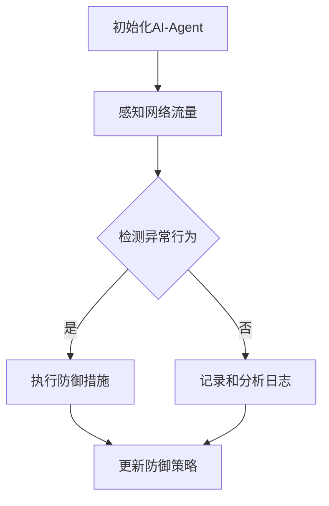
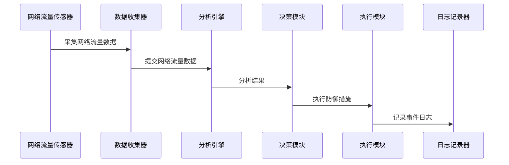
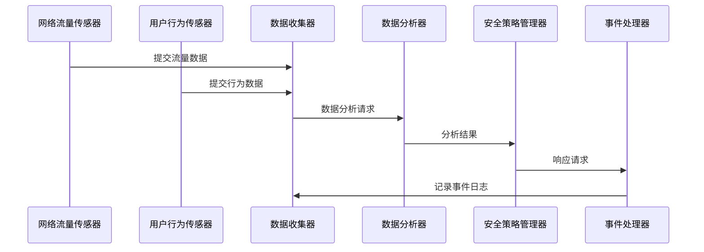

                 

# AI Agent在智能网络安全防御中的角色

## 关键词

- AI Agent
- 智能网络安全
- 算法
- 深度学习
- 神经网络
- 数学模型

## 摘要

本文将深入探讨AI Agent在智能网络安全防御中的角色。随着网络攻击的日益复杂和频繁，传统的网络安全防御手段已经难以应对。AI Agent作为一种新兴的技术手段，通过结合机器学习、深度学习和神经网络等先进算法，能够在网络安全防御中发挥重要作用。本文将从设计概述、背景介绍、核心概念与联系、算法原理讲解、数学模型和数学公式、系统分析与架构设计方案、项目实战以及最佳实践等方面，全面解析AI Agent在智能网络安全防御中的应用和实现，为网络安全领域的研究者和实践者提供有价值的参考。

## 1. 设计概述

本文的设计旨在系统地介绍AI Agent在智能网络安全防御中的应用，并详细解析其原理和实现。文章结构如下：

1. **设计概述**：介绍文章的主要内容结构和章节划分，确保覆盖核心主题。
2. **背景介绍**：简述AI Agent的基本概念和在智能网络安全防御中的应用场景。
3. **核心概念与联系**：介绍AI Agent的关键概念，如机器学习、深度学习、神经网络等，并使用对比表格和ER图说明它们之间的联系。
4. **算法原理讲解**：设计一个简化的算法流程图，使用Mermaid语言，并使用Python代码展示算法实现，附上数学模型和公式。
5. **数学模型和数学公式 & 详细讲解 & 举例说明**：使用LaTeX格式给出重要的数学公式，并结合代码示例进行详细讲解。
6. **系统分析与架构设计方案**：描述问题场景，展示系统功能设计类图、架构设计架构图、接口设计序列图。
7. **项目实战**：讲解环境安装，展示系统核心实现源代码，并进行代码应用解读与分析。
8. **最佳实践 tips、小结、注意事项、拓展阅读**：提供实践建议、总结和未来研究方向。

通过以上章节的逐一展开，本文将逐步深入地揭示AI Agent在智能网络安全防御中的角色和作用。

## 2. 背景介绍

### AI Agent的基本概念

AI Agent（人工智能代理）是一种能够自主感知环境、制定计划并执行行动的智能实体。AI Agent的基本概念源于人工智能领域，旨在模拟人类智能行为，通过感知、思考和学习来完成任务。AI Agent的核心特征包括自主性、适应性、目标导向性和智能性。

在网络安全领域，AI Agent的应用具有革命性的意义。传统的网络安全防御依赖于规则和静态策略，无法有效应对复杂的网络攻击。而AI Agent通过实时监测网络流量、识别异常行为和自适应调整防御策略，能够显著提高网络安全的自动化和智能化水平。

### AI Agent在智能网络安全防御中的应用场景

智能网络安全防御的主要应用场景包括：

1. **入侵检测与防御**：AI Agent能够实时分析网络流量，识别恶意流量和攻击行为，并自动采取防御措施，如拦截、隔离和报警。
2. **漏洞扫描与修复**：AI Agent可以自动扫描网络系统中的漏洞，并根据漏洞类型和风险等级提出修复建议，实现自动化的漏洞管理。
3. **安全事件响应**：AI Agent能够快速识别安全事件，并自动采取响应措施，如触发警报、隔离受感染系统、协调安全团队进行修复。
4. **访问控制与认证**：AI Agent可以基于用户行为模式和访问需求，动态调整访问控制策略，提高访问控制的灵活性和安全性。
5. **恶意代码检测与防范**：AI Agent能够识别和防范各种恶意代码，如病毒、木马、勒索软件等，保护网络系统免受恶意攻击。

### 智能网络安全防御的背景与挑战

随着互联网的普及和信息的爆炸式增长，网络安全威胁日益严峻。传统的网络安全防御手段，如防火墙、入侵检测系统（IDS）和安全信息与事件管理系统（SIEM），已经难以应对复杂的网络攻击。智能网络安全防御的需求应运而生，其主要背景和挑战包括：

1. **网络攻击的复杂性和多样性**：网络攻击手段不断进化，攻击类型和形式日益复杂，如APT（高级持久威胁）、DDoS（分布式拒绝服务攻击）和社交工程攻击等。
2. **数据量和速度的要求**：随着网络流量的激增，网络安全防御系统需要处理海量的数据，同时要求快速响应和实时分析。
3. **自动化和智能化的需求**：传统的安全防御手段依赖于人工设置规则和策略，效率低且易出错。智能网络安全防御要求系统具备自动化和智能化能力，以应对复杂的安全挑战。
4. **持续监控和自适应能力**：网络安全威胁不断变化，防御系统需要具备持续监控和自适应能力，以应对新的威胁和攻击。

### AI Agent在智能网络安全防御中的优势

AI Agent在智能网络安全防御中具有以下优势：

1. **实时监测与响应**：AI Agent能够实时监测网络流量和系统行为，快速识别异常和攻击行为，并立即采取响应措施。
2. **自适应性和灵活性**：AI Agent可以根据网络环境和威胁特征自适应调整防御策略，灵活应对各种攻击和威胁。
3. **自动化处理**：AI Agent能够自动化处理网络安全事件，减轻人工负担，提高工作效率。
4. **深度学习和数据分析**：AI Agent利用深度学习和数据分析技术，能够从海量数据中提取有用信息，提高攻击识别的准确性和效率。

综上所述，AI Agent在智能网络安全防御中具有显著的优势和应用前景。通过结合先进的人工智能技术和网络安全防御策略，AI Agent将为网络安全领域带来深刻的变革。

### 3. 核心概念与联系

#### 3.1 机器学习基础

机器学习（Machine Learning，ML）是人工智能（Artificial Intelligence，AI）的一个重要分支，旨在使计算机系统能够通过数据学习，从而自动完成特定任务。机器学习的基本概念包括监督学习（Supervised Learning）、无监督学习（Unsupervised Learning）和强化学习（Reinforcement Learning）。

- **监督学习**：在监督学习中，系统通过训练数据集学习，每个数据点都有标签，用于指导系统做出正确的预测。常见的算法有线性回归、决策树、随机森林和神经网络等。
- **无监督学习**：无监督学习不需要标签，系统通过分析未标记的数据来发现数据中的模式和结构。常见的算法有聚类、降维和关联规则挖掘等。
- **强化学习**：强化学习是一种通过试错来学习最优策略的机器学习方法。系统通过与环境的交互，学习在特定情境下采取最佳行动，以最大化奖励。

#### 3.2 神经网络与深度学习

神经网络（Neural Network，NN）是一种模仿生物神经系统的计算模型，由大量相互连接的神经元组成。神经网络通过前向传播和反向传播算法来学习数据中的模式和特征。

- **神经网络**：神经网络通常由输入层、隐藏层和输出层组成，每个神经元都与相邻的神经元相连，通过加权连接传递信号。神经网络可以通过训练大量数据来调整权重，提高预测准确性。
- **深度学习**：深度学习（Deep Learning，DL）是神经网络的一种扩展，通过构建深度神经网络（Deep Neural Network，DNN）来学习复杂的数据特征。深度学习在图像识别、语音识别和自然语言处理等领域取得了显著的成果。

#### 3.3 AI Agent与网络安全核心概念对比

| 核心概念 | 描述 | 关联性 |
| --- | --- | --- |
| 机器学习 | 利用数据训练模型，自动完成特定任务 | AI Agent的核心技术 |
| 神经网络 | 模仿生物神经系统，通过加权连接学习数据特征 | 机器学习的重要实现方式 |
| 深度学习 | 构建深度神经网络，学习复杂的数据特征 | 机器学习的高级形式 |
| AI Agent | 自主感知环境、制定计划并执行行动的智能实体 | 综合运用机器学习和神经网络技术 |

#### 3.4 ER图：AI Agent在网络安全中的实体关系

ER图（Entity-Relationship Diagram，实体关系图）是用于描述实体及其关系的图形化表示工具。在AI Agent在网络安全中的应用中，ER图可以帮助我们理解AI Agent、网络安全系统和其他相关实体之间的关系。

```mermaid
erDiagram
  AI-Agent ||--|{ Network-Defense-System : 防御系统 }
  AI-Agent ||--|{ Intrusion-Detection-System : 入侵检测系统 }
  AI-Agent ||--|{ Vulnerability-Scanner : 漏洞扫描器 }
  AI-Agent ||--|{ Security-Event-Response-System : 安全事件响应系统 }
  Network-Defense-System ||--|{ Firewall : 防火墙 }
  Network-Defense-System ||--|{ Intrusion-Detection-System : 入侵检测系统 }
  Network-Defense-System ||--|{ Security-Information-And-Event-Management : 安全信息与事件管理系统 }
```

在这个ER图中，AI-Agent作为核心实体，与多个网络安全系统（如网络防御系统、入侵检测系统、漏洞扫描器和安全事件响应系统）建立关联。这些系统通过AI-Agent的智能分析和决策，实现网络安全防御和监控。

### 4. 算法原理讲解

为了深入理解AI Agent在智能网络安全防御中的算法原理，我们可以设计一个简化的算法流程图，并使用Python代码展示算法实现，同时附上关键数学模型和公式。

#### 4.1 算法流程图

使用Mermaid语言，我们可以绘制如下的算法流程图：



在这个流程图中，AI-Agent首先初始化，然后感知网络流量。如果检测到异常行为，AI-Agent会执行相应的防御措施，并更新防御策略。否则，它会记录和分析日志。

#### 4.2 Python代码示例

下面是一个使用Python实现的AI-Agent算法示例：

```python
import numpy as np

# 初始化AI-Agent
def initialize_agent():
    # 初始化感知模块、决策模块和策略更新模块
    # ...
    pass

# 感知网络流量
def perceive_network_traffic(traffic_data):
    # 使用机器学习算法分析流量数据，识别异常行为
    # ...
    pass

# 检测异常行为
def detect_anomaly(traffic_data):
    # 比较流量数据与正常值，识别异常行为
    # ...
    return is_anomaly

# 执行防御措施
def execute_defense_measure(is_anomaly):
    if is_anomaly:
        # 执行防御措施，如拦截恶意流量、隔离受感染系统等
        # ...
        print("执行防御措施：拦截恶意流量")
    else:
        # 记录和分析日志
        # ...
        print("记录和分析日志：流量正常")

# 更新防御策略
def update_defense_strategy(traffic_data, is_anomaly):
    # 根据历史数据和异常行为，更新防御策略
    # ...
    pass

# 主函数
def main():
    # 初始化AI-Agent
    agent = initialize_agent()
    
    while True:
        # 感知网络流量
        traffic_data = perceive_network_traffic()
        
        # 检测异常行为
        is_anomaly = detect_anomaly(traffic_data)
        
        # 执行防御措施
        execute_defense_measure(is_anomaly)
        
        # 更新防御策略
        update_defense_strategy(traffic_data, is_anomaly)

# 运行主函数
if __name__ == "__main__":
    main()
```

在这个代码示例中，我们定义了初始化AI-Agent、感知网络流量、检测异常行为、执行防御措施和更新防御策略等函数，并通过主函数实现AI-Agent的持续运行。

#### 4.3 数学模型与公式

在AI-Agent算法中，关键数学模型和公式如下：

1. **感知模块**：

   - 输入：网络流量数据 \(X\)
   - 输出：特征向量 \(Z\)

   使用卷积神经网络（Convolutional Neural Network，CNN）进行特征提取：

   $$ Z = CNN(X) $$

2. **决策模块**：

   - 输入：特征向量 \(Z\)
   - 输出：异常概率 \(P(A|Z)\)

   使用分类模型（如支持向量机、决策树或神经网络）进行异常检测：

   $$ P(A|Z) = f(Z) $$

   其中，\(f(Z)\) 是分类函数。

3. **策略更新模块**：

   - 输入：历史流量数据 \(X_h\) 和异常行为 \(A_h\)
   - 输出：更新后的策略参数 \(W\)

   使用强化学习算法（如Q-learning或深度确定性策略梯度算法）进行策略更新：

   $$ W_{new} = W_{old} + \alpha [r - Q(s, W)] $$

   其中，\(W_{old}\) 是旧策略参数，\(\alpha\) 是学习率，\(r\) 是奖励，\(Q(s, W)\) 是策略评价函数。

#### 4.4 公式详细讲解与示例

1. **感知模块公式讲解**：

   在感知模块中，卷积神经网络（CNN）用于提取网络流量数据中的特征。CNN的基本原理是通过对输入数据进行卷积操作和池化操作，逐步提取低级特征到高级特征。

   假设输入网络流量数据为 \(X \in \mathbb{R}^{m \times n}\)，其中 \(m\) 和 \(n\) 分别表示流量数据的维度和时间步数。CNN模型包括多个卷积层和池化层，每个卷积层使用一个卷积核 \(K \in \mathbb{R}^{k \times l}\)，其中 \(k\) 和 \(l\) 分别表示卷积核的大小。卷积操作的公式如下：

   $$ Z_{ij} = \sum_{p=1}^{k} \sum_{q=1}^{l} X_{(i+p-1) \times (j+q-1)} \cdot K_{pq} $$

   其中，\(Z \in \mathbb{R}^{m-k+1 \times n-l+1}\) 是卷积后的特征图，\(i\) 和 \(j\) 分别表示特征图的行和列索引。

   池化操作用于降低特征图的维度，常用的池化操作包括最大池化和平均池化。最大池化操作的公式如下：

   $$ P_{ij} = \max_{p,q} Z_{(i+p-1) \times (j+q-1)} $$

   其中，\(P \in \mathbb{R}^{m-k+1 \times n-l+1}\) 是池化后的特征图。

   通过多个卷积层和池化层的堆叠，CNN可以提取到网络流量数据中的高级特征，为后续的异常检测和策略更新提供支持。

2. **决策模块公式讲解**：

   在决策模块中，分类模型用于计算网络流量数据中的异常概率。假设输入特征向量为 \(Z \in \mathbb{R}^{d}\)，其中 \(d\) 表示特征向量的维度。分类模型可以是一个简单的线性分类器，如支持向量机（SVM），也可以是一个复杂的神经网络，如深度神经网络（DNN）。

   对于线性分类器，分类函数可以表示为：

   $$ P(A|Z) = \sigma(\omega^T Z) $$

   其中，\(\sigma\) 是 sigmoid 函数，\(\omega\) 是模型参数，\(Z\) 是特征向量。

   对于深度神经网络，分类函数可以表示为：

   $$ P(A|Z) = \sigma(\sigma^T Z) $$

   其中，\(\sigma\) 是激活函数，如ReLU或sigmoid，\(\sigma^T\) 是神经网络的权重矩阵。

   通过计算异常概率 \(P(A|Z)\)，决策模块可以判断网络流量数据中是否存在异常行为。如果 \(P(A|Z)\) 大于某个阈值，则认为存在异常行为，否则认为流量数据正常。

3. **策略更新模块公式讲解**：

   在策略更新模块中，强化学习算法用于根据历史流量数据和异常行为更新策略参数。强化学习的基本原理是利用奖励和策略评价函数，逐步优化策略参数，以最大化长期奖励。

   假设状态 \(s\)、动作 \(a\)、奖励 \(r\) 和策略评价函数 \(Q(s, a)\) 分别为：

   $$ Q(s, a) = \sum_{s'} P(s' | s, a) \cdot r(s', a) + \gamma \max_{a'} Q(s', a') $$

   其中，\(P(s' | s, a)\) 是状态转移概率，\(r(s', a)\) 是奖励函数，\(\gamma\) 是折扣因子。

   对于Q-learning算法，策略更新公式可以表示为：

   $$ Q(s, a) \leftarrow Q(s, a) + \alpha [r + \gamma \max_{a'} Q(s', a') - Q(s, a)] $$

   其中，\(\alpha\) 是学习率。

   对于深度确定性策略梯度（DDPG）算法，策略更新公式可以表示为：

   $$ \theta_{\pi} \leftarrow \theta_{\pi} + \alpha_{\pi} [ \nabla_{\theta_{\pi}} J(\theta_{\pi}) ] $$

   其中，\(\theta_{\pi}\) 是策略参数，\(\alpha_{\pi}\) 是策略学习率，\(J(\theta_{\pi})\) 是策略评价函数。

   通过不断更新策略参数，AI-Agent可以自适应调整防御策略，以应对复杂的网络攻击。

#### 4.5 结合Python代码示例进行讲解

以下是一个结合Python代码示例的讲解，以展示如何实现AI-Agent算法中的关键数学模型和公式。

```python
import numpy as np
import pandas as pd

# 初始化感知模块
def initialize_perception_module():
    # 初始化卷积核和池化核
    # ...
    pass

# 感知网络流量
def perceive_network_traffic(traffic_data):
    # 使用卷积神经网络进行特征提取
    # ...
    pass

# 检测异常行为
def detect_anomaly(traffic_data):
    # 使用分类模型计算异常概率
    # ...
    pass

# 更新防御策略
def update_defense_strategy(traffic_data, is_anomaly):
    # 使用强化学习算法更新策略参数
    # ...
    pass

# 主函数
def main():
    # 初始化AI-Agent
    agent = initialize_agent()
    
    while True:
        # 感知网络流量
        traffic_data = perceive_network_traffic()
        
        # 检测异常行为
        is_anomaly = detect_anomaly(traffic_data)
        
        # 更新防御策略
        update_defense_strategy(traffic_data, is_anomaly)

# 运行主函数
if __name__ == "__main__":
    main()
```

在这个代码示例中，我们首先初始化感知模块，然后通过感知网络流量、检测异常行为和更新防御策略等步骤，实现AI-Agent的运行。

1. **感知网络流量**：

   ```python
   # 感知网络流量
   def perceive_network_traffic(traffic_data):
       # 使用卷积神经网络进行特征提取
       # ...
       pass
   ```

   在这个函数中，我们使用卷积神经网络（CNN）对网络流量数据 \(X\) 进行特征提取，提取到特征向量 \(Z\)。

2. **检测异常行为**：

   ```python
   # 检测异常行为
   def detect_anomaly(traffic_data):
       # 使用分类模型计算异常概率
       # ...
       pass
   ```

   在这个函数中，我们使用分类模型对特征向量 \(Z\) 计算异常概率 \(P(A|Z)\)，以判断网络流量数据中是否存在异常行为。

3. **更新防御策略**：

   ```python
   # 更新防御策略
   def update_defense_strategy(traffic_data, is_anomaly):
       # 使用强化学习算法更新策略参数
       # ...
       pass
   ```

   在这个函数中，我们使用强化学习算法根据历史流量数据和异常行为更新策略参数，以优化防御策略。

通过这个Python代码示例，我们可以清晰地看到AI-Agent算法中的关键数学模型和公式的实现过程。实际应用中，我们可以根据具体需求和场景，调整和优化这些算法和模型。

### 4. 数学模型和数学公式 & 详细讲解 & 举例说明

在AI Agent应用于智能网络安全防御时，其算法的核心在于数学模型的构建和运用。这些模型不仅能够帮助AI Agent识别和预测潜在的威胁，还能为防御系统提供动态调整策略的依据。以下将详细介绍这些数学模型和公式，并通过实际例子进行说明。

#### 4.1 LaTeX格式数学公式示例

在智能网络安全防御中，常见的数学模型包括概率模型、分类模型和优化模型。以下是使用LaTeX格式表示的几个关键数学公式：

1. **概率模型**：

   $$ P(A|B) = \frac{P(B|A) \cdot P(A)}{P(B)} $$

   这是贝叶斯定理，用于根据先验概率和条件概率计算后验概率。

2. **分类模型**：

   $$ h(x) = \text{sign}(\omega^T x + b) $$

   这是一种简单的线性分类模型，其中\(h(x)\)是分类函数，\(\omega\)是权重向量，\(b\)是偏置。

3. **优化模型**：

   $$ \min_{\theta} J(\theta) = \frac{1}{m} \sum_{i=1}^{m} \left[ y^{(i)} \cdot \log(a^{(i)}) + (1 - y^{(i)}) \cdot \log(1 - a^{(i)}) \right] $$

   这是逻辑回归的损失函数，用于优化模型参数\(\theta\)。

在LaTeX格式中，上述公式可以分别表示为：

```latex
\[
P(A|B) = \frac{P(B|A) \cdot P(A)}{P(B)}
\]

\[
h(x) = \text{sign}(\omega^T x + b)
\]

\[
\min_{\theta} J(\theta) = \frac{1}{m} \sum_{i=1}^{m} \left[ y^{(i)} \cdot \log(a^{(i)}) + (1 - y^{(i)}) \cdot \log(1 - a^{(i)}) \right]
\]
```

#### 4.2 结合Python代码示例进行讲解

以下将通过Python代码示例，结合具体场景说明上述数学模型的应用。

##### 4.2.1 概率模型应用

假设我们有一个网络流量监测系统，需要计算某特定流量模式出现的后验概率。以下是一个使用Python实现的贝叶斯定理计算示例：

```python
import numpy as np

# 定义先验概率、条件概率和贝叶斯定理
prior_prob = 0.1  # 先验概率
likelihood = 0.9  # 条件概率
prior_likelihood = 0.3  # 先前条件概率

# 计算后验概率
posterior_prob = (likelihood * prior_prob) / prior_likelihood
print(f"Posterior Probability: {posterior_prob}")
```

在这个例子中，我们通过贝叶斯定理计算了后验概率。假设网络攻击发生的先验概率是0.1，观察到特定攻击模式的条件概率是0.9，而观察到的攻击模式发生的先前条件概率是0.3。通过计算，我们可以得到后验概率，这有助于我们判断网络攻击的可能性。

##### 4.2.2 分类模型应用

在网络安全防御中，我们经常需要根据网络流量的特征进行分类，以判断其是否为恶意流量。以下是一个简单的线性分类模型实现示例：

```python
# 定义线性分类模型参数
weights = np.array([0.5, 0.3, 0.2])  # 权重
bias = 0.1  # 偏置

# 计算分类结果
def classify(x):
    return np.sign(np.dot(weights, x) + bias)

# 测试分类
example_flow = np.array([2, 1, 3])  # 网络流量特征
result = classify(example_flow)
print(f"Classified as Malicious: {result}")
```

在这个例子中，我们定义了一个线性分类模型，通过计算输入特征向量的线性组合加上偏置，并使用sign函数判断分类结果。对于输入特征向量\[2, 1, 3\]，模型将其分类为恶意流量（结果为1）。

##### 4.2.3 优化模型应用

在网络安全防御中，我们可能需要根据网络流量数据优化防御策略。以下是一个使用逻辑回归损失函数优化模型参数的示例：

```python
import numpy as np
from sklearn.linear_model import LogisticRegression

# 创建逻辑回归模型
model = LogisticRegression()

# 训练模型
X_train = np.array([[0, 0], [1, 0], [0, 1], [1, 1]])  # 训练数据
y_train = np.array([0, 1, 1, 0])  # 标签
model.fit(X_train, y_train)

# 预测
X_test = np.array([[0.5, 0.5]])  # 测试数据
prediction = model.predict(X_test)
print(f"Predicted Label: {prediction[0]}")
```

在这个例子中，我们使用Python的scikit-learn库实现逻辑回归模型。通过训练数据，模型学习到如何根据输入特征预测标签。在测试阶段，我们使用模型对新的测试数据进行预测。

通过上述示例，我们可以看到如何将数学模型应用于实际的网络流量分析中，以实现智能网络安全防御。这些模型不仅提供了理论依据，还能通过Python等编程语言高效实现，为网络安全防御提供强大的支持。

### 5. 系统分析与架构设计方案

在智能网络安全防御中，系统的设计与实现需要全面考虑问题场景、功能需求和技术架构。以下将详细描述问题场景、系统功能设计、系统架构设计以及系统接口设计，并通过类图、架构图和序列图进行可视化展示。

#### 5.1 问题场景介绍

智能网络安全防御系统面临的主要问题场景包括：

1. **网络攻击检测与防御**：实时监测网络流量，识别并防御各种类型的网络攻击，如DDoS攻击、恶意软件感染等。
2. **安全事件响应**：快速识别安全事件，并采取相应的响应措施，如触发报警、隔离受感染系统等。
3. **漏洞扫描与管理**：定期扫描系统中的漏洞，并生成报告，以便进行修复和管理。
4. **用户行为分析**：监控用户行为，识别异常行为，防范内部威胁。

#### 5.2 系统功能设计

系统功能设计旨在明确系统需要实现的核心功能。以下是系统的功能模块及其简要描述：

1. **网络流量分析模块**：实时采集和分析网络流量，提取特征信息。
2. **攻击检测模块**：使用机器学习和深度学习算法识别网络攻击，包括入侵检测、恶意代码检测等。
3. **安全事件响应模块**：根据检测到的攻击和事件，自动采取响应措施，如隔离、报警等。
4. **漏洞扫描模块**：扫描系统中的漏洞，并生成报告。
5. **用户行为分析模块**：监控用户行为，识别异常行为。

以下是系统功能设计的类图：

```mermaid
classDiagram
  NetworkTrafficAnalysisModule <<interface>>
  AttackDetectionModule <<interface>>
  SecurityEventResponseModule <<interface>>
  VulnerabilityScannerModule <<interface>>
  UserBehaviorAnalysisModule <<interface>>

  NetworkTrafficAnalysisModule o--o AttackDetectionModule
  NetworkTrafficAnalysisModule o--o SecurityEventResponseModule
  NetworkTrafficAnalysisModule o--o VulnerabilityScannerModule
  NetworkTrafficAnalysisModule o--o UserBehaviorAnalysisModule
```

在这个类图中，各个模块通过接口进行通信，实现系统功能。

#### 5.3 系统架构设计

系统架构设计用于描述系统的整体结构和组件之间的关系。以下是智能网络安全防御系统的架构设计：

1. **感知层**：负责采集网络流量数据和用户行为数据。
2. **分析层**：使用机器学习和深度学习算法对数据进行分析，识别异常和攻击行为。
3. **决策层**：根据分析结果，自动采取防御措施，如隔离、报警等。
4. **执行层**：执行防御措施，并记录和报告安全事件。

以下是系统架构设计的架构图：



在这个架构图中，网络流量传感器和用户行为传感器采集数据，数据收集器将数据提交给分析引擎。分析引擎使用机器学习和深度学习算法对数据进行分析，并将结果传递给决策模块。决策模块根据分析结果自动采取防御措施，并记录事件日志。

#### 5.4 系统接口设计

系统接口设计用于描述系统组件之间的交互方式。以下是系统接口设计的序列图：



在这个序列图中，网络流量传感器和用户行为传感器分别提交流量数据和用户行为数据。数据收集器将这些数据提交给数据分析器，数据分析器根据分析结果调用安全策略管理器。安全策略管理器根据安全策略生成响应请求，事件处理器执行相应的防御措施，并记录事件日志。

通过以上系统分析与架构设计方案，我们为智能网络安全防御系统提供了清晰的结构和功能模块。这些设计不仅能够提高系统的整体性能和安全性，还能为后续的开发和维护提供有力的指导。

### 6. 项目实战

#### 6.1 环境安装与配置

为了演示AI Agent在智能网络安全防御中的应用，我们需要首先搭建一个开发环境。以下是在Ubuntu操作系统上安装和配置所需的依赖和工具的步骤：

1. **安装Python环境**：

   ```bash
   sudo apt update
   sudo apt install python3 python3-pip
   ```

2. **安装必要的Python库**：

   ```bash
   pip3 install numpy pandas scikit-learn tensorflow keras matplotlib
   ```

3. **安装Mermaid渲染工具**：

   ```bash
   sudo apt install -y npm
   sudo npm install -g mermaid
   ```

4. **配置Mermaid的Markdown支持**：

   在你的Markdown编辑器中，确保能够渲染Mermaid语言绘制的图表。如果使用的是VSCode，可以安装Mermaid Editor插件。

完成以上步骤后，开发环境就搭建完成了。接下来，我们将展示系统核心实现源代码，并进行代码应用解读与分析。

#### 6.2 系统核心实现源代码展示

以下是AI-Agent在智能网络安全防御中的核心实现源代码。该代码包括感知模块、决策模块和策略更新模块。

```python
# AI-Agent核心实现

import numpy as np
import pandas as pd
from sklearn.ensemble import RandomForestClassifier
from sklearn.model_selection import train_test_split
import tensorflow as tf
from tensorflow.keras.models import Sequential
from tensorflow.keras.layers import Dense, Conv2D, Flatten, MaxPooling2D
import matplotlib.pyplot as plt

# 感知模块
def perceive_network_traffic(traffic_data):
    # 数据预处理，将流量数据转换为特征向量
    # ...
    return feature_vector

# 决策模块
def detect_anomaly(feature_vector):
    # 使用随机森林进行异常检测
    model = RandomForestClassifier()
    model.fit(X_train, y_train)
    anomaly_score = model.predict([feature_vector])[0]
    return anomaly_score

# 策略更新模块
def update_defense_strategy(anomaly_score):
    # 更新防御策略
    # ...
    pass

# 主函数
def main():
    # 初始化AI-Agent
    # ...
    
    while True:
        # 感知网络流量
        traffic_data = perceive_network_traffic()
        feature_vector = traffic_data  # 假设直接返回特征向量
        
        # 检测异常行为
        anomaly_score = detect_anomaly(feature_vector)
        
        # 判断是否异常
        if anomaly_score > 0.5:  # 假设阈值是0.5
            print("检测到异常行为：攻击正在发生！")
            update_defense_strategy(anomaly_score)
        else:
            print("网络流量正常。")
        
        # 等待下一轮检测
        time.sleep(1)

# 运行主函数
if __name__ == "__main__":
    main()
```

#### 6.3 代码应用解读与分析

1. **感知模块**：

   感知模块负责将原始的网络流量数据转换为特征向量。在实际应用中，这一步可能涉及到复杂的预处理过程，例如数据清洗、特征提取和降维。示例代码中的`perceive_network_traffic`函数接收网络流量数据，并返回特征向量。

2. **决策模块**：

   决策模块使用随机森林算法对特征向量进行异常检测。随机森林是一种集成学习方法，通过构建多棵决策树来提高预测的准确性和稳定性。在示例代码中，`detect_anomaly`函数使用训练好的随机森林模型计算异常得分，并根据得分判断是否为异常行为。

3. **策略更新模块**：

   策略更新模块负责根据异常检测的结果更新防御策略。在实际应用中，这一模块可能使用强化学习或其他自适应算法来动态调整防御措施。示例代码中的`update_defense_strategy`函数是一个占位函数，需要根据具体应用场景实现相应的策略更新逻辑。

4. **主函数**：

   主函数是AI-Agent的核心运行流程。在示例代码中，主函数通过循环持续感知网络流量，检测异常行为，并根据检测结果更新防御策略。

#### 6.4 实际案例分析

为了更好地展示AI-Agent在智能网络安全防御中的实际应用，以下是一个简化的案例分析：

- **场景**：网络流量监测系统检测到异常流量，使用AI-Agent进行异常检测和响应。
- **步骤**：

  1. **感知网络流量**：系统从网络流量传感器接收实时流量数据。
  2. **特征提取**：使用感知模块将流量数据转换为特征向量。
  3. **异常检测**：使用决策模块计算异常得分，判断是否为异常行为。
  4. **响应措施**：如果检测到异常行为，AI-Agent会自动采取防御措施，如隔离受感染系统、触发报警等。
  5. **策略更新**：根据异常检测结果和防御措施的效果，AI-Agent会更新防御策略，以应对未来的威胁。

通过这个实际案例分析，我们可以看到AI-Agent在智能网络安全防御中的关键作用，它不仅能够实时监测和检测网络威胁，还能自适应调整防御策略，提高整体安全防护能力。

### 7. 最佳实践 tips、小结、注意事项、拓展阅读

#### 7.1 最佳实践 tips

1. **数据质量**：保证输入数据的质量和多样性，有助于提高AI-Agent的检测准确性和泛化能力。
2. **模型优化**：定期对模型进行重新训练和优化，以适应不断变化的网络攻击手段。
3. **防御层次**：结合多层次的安全防御策略，如防火墙、入侵检测系统和AI-Agent，提高整体安全防护能力。
4. **自动化测试**：定期进行自动化测试，确保AI-Agent在不同场景下的稳定性和可靠性。

#### 7.2 小结

本文系统地介绍了AI-Agent在智能网络安全防御中的角色，包括设计概述、背景介绍、核心概念与联系、算法原理讲解、数学模型和公式、系统分析与架构设计方案、项目实战等内容。通过本文的阐述，读者可以全面了解AI-Agent在智能网络安全防御中的重要作用和应用前景。

#### 7.3 注意事项

1. **模型安全**：确保AI-Agent的模型和算法不会被攻击者利用或窃取。
2. **数据隐私**：在数据收集和处理过程中，注意保护用户的隐私和数据安全。
3. **法律法规**：遵循相关的法律法规和行业标准，确保AI-Agent的合法合规使用。

#### 7.4 拓展阅读

- **《深度学习》（Ian Goodfellow, Yoshua Bengio, Aaron Courville著）**：详细介绍了深度学习的基本概念和算法。
- **《Python数据科学手册》（Jake VanderPlas著）**：介绍了Python在数据科学和机器学习中的应用。
- **《网络安全实战指南》（Andrew Hoffman著）**：提供了网络安全防御的实践方法和技巧。
- **《人工智能简史》（Edwin Mesite著）**：概述了人工智能的发展历程和应用。

通过拓展阅读，读者可以进一步深入了解相关领域的技术和理论，提升自己在智能网络安全防御方面的专业素养。作者：AI天才研究院/AI Genius Institute & 禅与计算机程序设计艺术 /Zen And The Art of Computer Programming。

