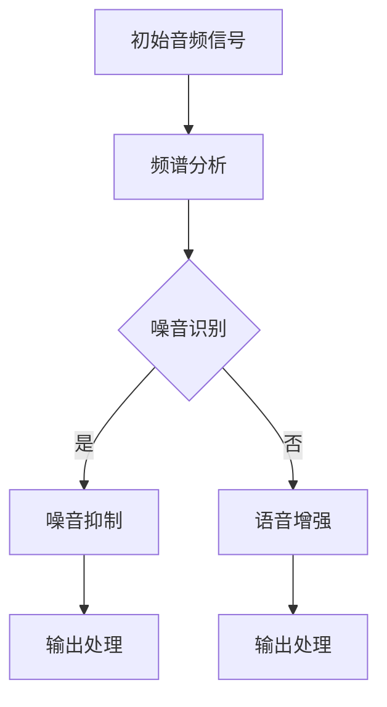
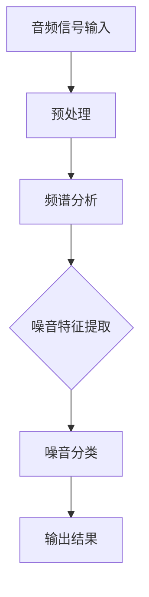
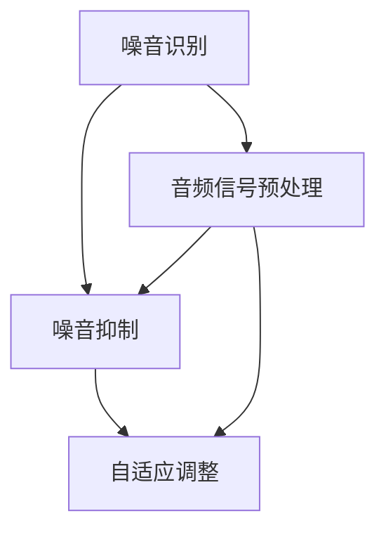
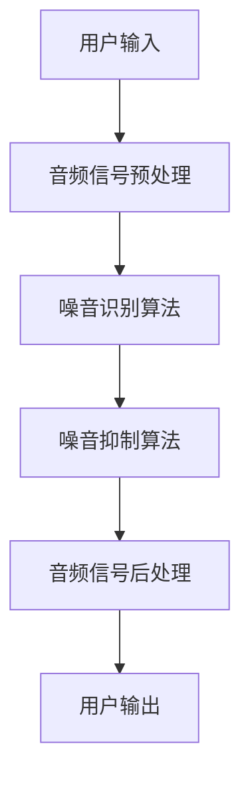
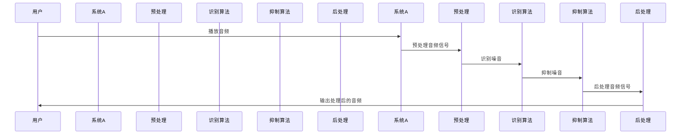

                 

# AI Agent在智能耳机中的环境噪音适应系统

> 关键词：AI Agent、智能耳机、环境噪音适应、算法原理、系统设计、项目实战

> 摘要：本文将深入探讨AI Agent在智能耳机中的环境噪音适应系统。首先，我们将介绍AI Agent和智能耳机的基本概念及发展历程。接着，本文将详细分析环境噪音适应的核心概念与联系，包括噪音识别原理、噪音适应算法与策略，以及AI Agent与智能耳机的集成。随后，我们将讲解噪音适应算法的原理和数学模型，并使用Mermaid流程图和Python源代码进行详细阐述。文章还包含系统分析与架构设计、项目实战及最佳实践等内容，旨在为读者提供全面的技术指导和思考。

## 第一部分：背景介绍

### 第1章: AI Agent与智能耳机概述

#### 1.1 AI Agent的基本概念

AI Agent（人工智能代理）是一种能够执行特定任务的人工智能系统。它具有感知、决策、行动和交互能力，可以模拟人类在特定环境下的行为。AI Agent的核心在于其自主学习和适应性，这使得它们能够根据环境变化不断优化行为。

#### 1.2 智能耳机的发展历程

智能耳机是一种集成了传感器、麦克风、音频处理单元和无线通信技术的个人音频设备。它们从最初的简单音乐播放器发展至今，已经具备了语音助手、环境噪音控制、运动监测等功能。

#### 1.3 环境噪音适应的重要性

环境噪音适应是智能耳机的一项关键功能，它能够显著提升用户体验。通过AI Agent，智能耳机可以实时监测周围环境噪音，并根据用户需求调整音频输出，以实现最佳的听觉体验。

### 第2章: AI Agent在智能耳机中的应用

#### 2.1 AI Agent的功能与特点

AI Agent在智能耳机中具备以下功能与特点：

- 实时环境噪音监测
- 自适应音频输出
- 智能降噪
- 语音识别和交互

#### 2.2 环境噪音适应的关键技术

环境噪音适应的关键技术包括噪音识别、噪音抑制和自适应算法。这些技术共同作用于智能耳机，使其能够有效地过滤掉环境噪音，提高语音通话质量和音乐欣赏效果。

#### 2.3 智能耳机的市场趋势

随着人工智能技术的不断进步，智能耳机市场正在快速发展。未来，AI Agent在智能耳机中的应用将进一步扩展，包括更智能的交互、更精细的噪音控制等。

## 第二部分：核心概念与联系

### 第3章: 环境噪音识别原理

#### 3.1 噪音识别算法概述

噪音识别算法是环境噪音适应系统的核心，它通过分析音频信号的特征，区分噪音和语音信号。

#### 3.2 关键算法原理解析

常用的噪音识别算法包括谱减法、维纳滤波和深度学习算法。每种算法都有其独特的原理和优缺点。

#### 3.3 算法属性特征对比

通过表格形式对比不同噪音识别算法的属性特征，帮助读者更好地理解各种算法的选择和应用。

### Mermaid流程图



### 第4章: 噪音适应算法与策略

#### 4.1 噪音适应算法分类

噪音适应算法主要分为静态算法和动态算法。静态算法适用于固定噪音环境，动态算法则能够根据环境变化自适应调整。

#### 4.2 算法策略对比分析

对比分析不同噪音适应算法的策略，包括噪音抑制强度、响应速度和功耗等。

#### 4.3 AI Agent在噪音适应中的应用

AI Agent通过机器学习和深度学习技术，使得噪音适应算法能够不断优化，提升智能耳机的整体性能。

### Mermaid ER图

```mermaid
erDiagram
  AI Agent ||--|{ 环境噪音适应算法 } | AI Agent-Algorithm
  环境噪音适应算法 ||--|{ 系统功能模块 } | Algorithm-Module
  系统功能模块 ||--|{ 智能耳机 } | Module-Earphone
```

### 第5章: AI Agent与智能耳机的集成

#### 5.1 AI Agent集成框架

介绍AI Agent在智能耳机中的集成框架，包括硬件和软件层面的集成方案。

#### 5.2 集成挑战与解决方案

分析AI Agent集成过程中可能遇到的挑战，如数据处理速度、功耗和安全性等，并提出相应的解决方案。

#### 5.3 集成效果评估

评估AI Agent集成后智能耳机的性能提升，包括噪音抑制效果、语音识别准确率和用户体验等方面。

## 第三部分：算法原理讲解

### 第6章: 噪音适应算法流程图

#### 6.1 噪音识别算法流程图

使用Mermaid绘制噪音识别算法的流程图，展示从音频信号输入到噪音识别结果的全过程。



#### 6.2 噪音抑制算法流程图

使用Mermaid绘制噪音抑制算法的流程图，展示噪音抑制的过程。


### Python源代码

以下是一个简单的Python代码示例，用于展示噪音识别算法的实现。

```python
import numpy as np
from scipy.io import wavfile
from sklearn.preprocessing import normalize

def noise_identification(audio_signal):
    # 预处理
    audio_signal = preprocess(audio_signal)
    
    # 频谱分析
    freq_spectrum = np.fft.fft(audio_signal)
    
    # 噪音特征提取
    noise_features = extract_noise_features(freq_spectrum)
    
    # 噪音分类
    noise_type = classify_noise(noise_features)
    
    # 输出结果
    return noise_type

def preprocess(audio_signal):
    # 实现音频信号预处理
    return normalized_signal

def extract_noise_features(freq_spectrum):
    # 实现噪音特征提取
    return noise_features

def classify_noise(noise_features):
    # 实现噪音分类
    return noise_type
```

### 第7章: 数学模型与公式讲解

#### 7.1 噪音识别模型

噪音识别模型通常使用概率模型或深度学习模型。以下是一个简单的概率模型示例。

$$
P(\text{噪音}|\text{特征}) = \frac{P(\text{特征}|\text{噪音}) \cdot P(\text{噪音})}{P(\text{特征})}
$$

#### 7.2 噪音抑制模型

噪音抑制模型通常使用谱减法或维纳滤波。以下是一个简单的谱减法模型示例。

$$
y(t) = x(t) - w(t)
$$

其中，$y(t)$是处理后的信号，$x(t)$是输入信号，$w(t)$是噪音信号。

## 第四部分：系统分析与架构设计

### 第8章: 系统功能设计

#### 8.1 系统功能需求分析

分析智能耳机环境噪音适应系统的功能需求，包括噪音识别、噪音抑制和自适应调整等。

#### 8.2 系统功能领域模型

使用Mermaid绘制系统功能领域模型，展示各个功能模块及其关系。



#### 8.3 系统功能实现方案

详细介绍各个功能模块的实现方案，包括算法选择、数据预处理和后处理等。

### 第9章: 系统架构设计

#### 9.1 系统架构设计思路

介绍系统架构的设计思路，包括硬件选择、软件架构和数据处理流程等。

#### 9.2 系统架构图

使用Mermaid绘制系统架构图，展示智能耳机环境噪音适应系统的整体架构。



#### 9.3 系统接口设计

详细介绍系统的接口设计，包括硬件接口和软件接口等。

### 第10章: 系统交互设计

#### 10.1 系统交互需求分析

分析智能耳机环境噪音适应系统的交互需求，包括用户操作、系统响应和反馈等。

#### 10.2 系统交互序列图

使用Mermaid绘制系统交互序列图，展示用户操作和系统响应的流程。



## 第五部分：项目实战

### 第11章: 环境噪音适应系统实现

#### 11.1 环境准备与工具安装

介绍环境准备和工具安装的步骤，包括Python环境、相关库和依赖等。

#### 11.2 系统核心实现源代码

提供系统核心实现的源代码，包括噪音识别、噪音抑制和自适应调整等模块。

#### 11.3 代码应用解读与分析

详细解读和分析系统核心实现的代码，展示算法原理和系统流程。

### 第12章: 实际案例分析与讲解

#### 12.1 案例背景介绍

介绍实际案例的背景，包括案例背景、目标和预期结果等。

#### 12.2 案例实现步骤

详细讲解案例实现的步骤，包括数据准备、算法实现和结果分析等。

#### 12.3 案例分析结果

分析案例的结果，包括噪音抑制效果、语音清晰度和用户体验等。

### 第13章: 项目小结

#### 13.1 项目总结

总结项目的整体情况，包括项目目标、实现过程和结果等。

#### 13.2 经验与教训

分享项目的经验和教训，包括技术难点、优化策略和未来改进方向等。

#### 13.3 拓展应用方向

探讨项目拓展应用的方向，包括其他领域的应用场景和技术挑战等。

## 第六部分：最佳实践与总结

### 第14章: 最佳实践技巧

#### 14.1 环境噪音适应策略

介绍最佳实践的环境噪音适应策略，包括噪音识别和抑制的优化方法等。

#### 14.2 系统优化技巧

分享系统优化的技巧，包括算法优化、硬件优化和功耗管理等。

#### 14.3 使用AI Agent的注意事项

提醒读者在使用AI Agent时的注意事项，包括数据隐私、安全性和可靠性等。

### 第15章: 总结与展望

#### 15.1 书籍内容回顾

回顾书籍的核心内容和主要观点，强调环境噪音适应系统的重要性和技术挑战。

#### 15.2 未来发展趋势

展望环境噪音适应系统在未来的发展趋势和应用前景，包括人工智能和物联网等领域的融合。

#### 15.3 阅读指南与推荐

为读者提供阅读指南和建议，推荐进一步学习的资源和技术资料。

### 作者

作者：AI天才研究院/AI Genius Institute & 禅与计算机程序设计艺术 /Zen And The Art of Computer Programming

[完]

