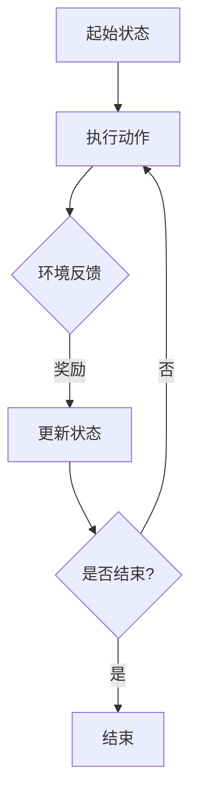

                 

### 引言

智能能源管理是一个涉及能源生产、传输、分配和消费的复杂系统。随着全球能源需求的不断增长和能源危机的日益严峻，智能能源管理成为了现代能源系统发展的必然趋势。传统能源管理系统主要依赖于手动控制和预设参数，无法灵活应对多变的环境和需求。而人工智能（AI）技术的引入，特别是AI Agent的应用，为智能能源管理带来了新的机遇。

AI Agent，作为人工智能领域的一种先进技术，具有自主决策、自主学习、自适应和自我优化等特点。通过模拟人类智能行为，AI Agent可以在复杂环境中进行智能决策，从而提高能源利用效率、减少能源浪费、降低运营成本和提升整体系统的可靠性。因此，研究AI Agent在智能能源管理中的应用具有重要的理论和实际意义。

本文将围绕AI Agent在智能能源管理中的实践展开讨论。首先，我们将介绍智能能源管理的基本概念和背景，包括其必要性、发展历程、核心问题与挑战。接着，我们将深入探讨AI Agent的核心概念，详细解释AI Agent在智能能源管理中的作用和与传统系统的区别。在此基础上，我们将逐步分析AI Agent在智能能源管理中的核心技术原理和实现方法，并通过具体案例进行说明。随后，我们将探讨AI Agent在智能电网中的应用，分析其在电力调度、电网故障预测和储能系统管理中的作用。最后，我们将讨论AI Agent在智能能源管理中的系统设计与实现，包括系统架构设计、优化方法和案例分析。

通过本文的探讨，我们希望能够提供一个全面、深入的理解AI Agent在智能能源管理中的应用，为相关领域的研究和应用提供参考和启示。

---

### 关键词

- **智能能源管理**
- **AI Agent**
- **机器学习**
- **强化学习**
- **深度学习**
- **智能电网**

---

### 摘要

本文系统地探讨了AI Agent在智能能源管理中的实践应用。首先，我们介绍了智能能源管理的背景、必要性以及其发展历程。随后，深入分析了AI Agent的核心概念、作用以及与传统能源管理系统的区别。接着，通过详细讲解AI Agent的核心技术原理，包括机器学习、强化学习等算法，以及具体的Python实现和数学模型，我们展示了AI Agent在智能能源管理中的实际应用。文章随后讨论了AI Agent在智能电网中的应用案例，如电力调度、电网故障预测和储能系统管理，并分析了具体案例中的系统设计与优化方法。通过本文的探讨，我们希望能够为AI Agent在智能能源管理中的研究和应用提供有益的参考。

---

## 《AI Agent在智能能源管理中的实践》目录大纲

### 第一部分：背景介绍与核心概念

- **第1章：智能能源管理概述**
  - 1.1 问题背景
    - 1.1.1 能源危机与智能能源管理的必要性
    - 1.1.2 智能能源管理的发展历程
    - 1.1.3 智能能源管理的核心问题与挑战
  - 1.2 核心概念
    - 1.2.1 什么是AI Agent
    - 1.2.2 AI Agent在智能能源管理中的作用
    - 1.2.3 AI Agent与传统能源管理系统的区别
  - 1.3 边界与外延
    - 1.3.1 智能能源管理系统的构成
    - 1.3.2 智能能源管理中的数据类型
    - 1.3.3 智能能源管理中的关键技术
  - 1.4 概念结构与核心要素组成
    - 1.4.1 AI Agent在智能能源管理中的结构
    - 1.4.2 AI Agent的组成部分及其功能
    - 1.4.3 AI Agent在智能能源管理中的运行流程
  - 1.5 本章小结

- **第2章：AI Agent基础算法原理**
  - 2.1 算法原理概述
    - 2.1.1 机器学习与深度学习基础
    - 2.1.2 强化学习与深度强化学习
    - 2.1.3 自适应算法与优化技术
  - 2.2 深入讲解
    - 2.2.1 强化学习算法的Mermaid流程图
    - 2.2.2 Python源代码实现
    - 2.2.3 数学模型与公式
  - 2.3 举例说明
    - 2.3.1 示例1：智能电网调度
    - 2.3.2 示例2：智能家居能耗管理
  - 2.4 本章小结

### 第二部分：AI Agent核心技术原理与实现

- **第3章：AI Agent在智能电网中的应用**
  - 3.1 智能电网概述
    - 3.1.1 智能电网的概念
    - 3.1.2 智能电网的主要功能
    - 3.1.3 智能电网的挑战与机遇
  - 3.2 AI Agent在智能电网中的应用
    - 3.2.1 AI Agent在电力调度中的应用
    - 3.2.2 AI Agent在电网故障预测中的应用
    - 3.2.3 AI Agent在储能系统管理中的应用
  - 3.3 案例分析
    - 3.3.1 案例一：智能电网调度优化
    - 3.3.2 案例二：电网故障预测与响应
    - 3.3.3 案例三：储能系统优化管理
  - 3.4 本章小结

### 第三部分：AI Agent在智能能源管理中的应用

- **第4章：AI Agent在智能能源管理中的系统设计与实现**
  - 4.1 系统设计概述
    - 4.1.1 系统架构设计
    - 4.1.2 数据处理流程
    - 4.1.3 AI Agent的核心算法实现
  - 4.2 系统实现
    - 4.2.1 环境安装与配置
    - 4.2.2 系统核心代码实现
    - 4.2.3 系统测试与调优
  - 4.3 优化方法
    - 4.3.1 参数调整
    - 4.3.2 算法改进
    - 4.3.3 模型训练策略优化
  - 4.4 本章小结

### 第四部分：总结与展望

- **第5章：AI Agent在智能能源管理中的总结与展望**
  - 5.1 AI Agent在智能能源管理中的总结
  - 5.2 AI Agent在智能能源管理中的应用前景
  - 5.3 未来研究方向与挑战
  - 5.4 本章小结

---

### 第1章：智能能源管理概述

智能能源管理是现代能源系统的重要组成部分，它通过引入先进的信息技术、自动化控制和人工智能算法，实现能源的高效、智能和可持续发展。本章将首先介绍智能能源管理的问题背景，包括能源危机与智能能源管理的必要性、智能能源管理的发展历程以及其核心问题与挑战。接下来，我们将探讨智能能源管理的核心概念，特别是AI Agent的定义、作用及其与传统能源管理系统的区别。最后，我们将对智能能源管理系统的构成、数据类型和关键技术进行详细阐述，并总结AI Agent在智能能源管理中的概念结构与核心要素组成。

#### 1.1 问题背景

#### 1.1.1 能源危机与智能能源管理的必要性

全球能源需求的不断增长和传统能源资源的日益枯竭，使得能源危机成为了21世纪面临的重大挑战之一。根据国际能源署（IEA）的统计数据，全球能源消耗在2020年达到了历史最高水平，达到了130.36亿吨油当量。然而，化石燃料的过度使用不仅导致了严重的环境污染和气候变化问题，还使得能源供应变得不稳定和不可持续。

面对能源危机，传统的能源管理模式显得力不从心。传统的能源管理系统主要依赖于人工操作和预设参数，无法灵活应对能源需求的变化和系统的动态特性。例如，电力系统的调度和电网的维护需要大量的专业知识和经验，而人为的错误或判断失误可能导致严重的能源浪费或电网故障。

智能能源管理的概念正是在这种背景下提出的。通过引入先进的通信技术、传感技术和人工智能算法，智能能源管理能够实现能源的实时监控、预测和优化，从而提高能源利用效率、降低能源消耗、减少能源浪费和提升系统的可靠性。智能能源管理不仅能够应对当前的能源需求，还为未来的能源系统提供了可持续的发展方向。

#### 1.1.2 智能能源管理的发展历程

智能能源管理的发展历程可以追溯到20世纪末和21世纪初。最早的智能能源系统主要依赖于传感器和自动化控制技术，通过实时监测和反馈机制来提高能源利用效率。随着计算机技术和通信技术的快速发展，智能能源管理系统逐渐融入了更多的信息技术和人工智能算法。

2000年初，智能电网的概念被首次提出。智能电网是一种基于信息技术的现代电力系统，通过高级通信技术、自动化控制和人工智能算法，实现对电力系统的实时监控、预测和优化。智能电网的引入不仅提高了电力系统的可靠性和灵活性，还为可再生能源的接入提供了技术支持。

随后，智能能源管理的应用范围不断扩大，从电力系统扩展到燃气、水力等能源领域。智能燃气系统、智能水力系统和智能建筑能源管理系统等相继出现，为各类能源系统的优化和管理提供了新的解决方案。

近年来，人工智能技术的快速发展进一步推动了智能能源管理的发展。AI Agent作为一种具有自主决策、学习和自适应能力的人工智能系统，成为智能能源管理中的重要技术之一。AI Agent能够通过学习环境数据和历史经验，自动调整能源生产和消费策略，从而实现能源的最优配置和利用。

#### 1.1.3 智能能源管理的核心问题与挑战

智能能源管理虽然具有巨大的潜力和前景，但也面临着一系列的核心问题与挑战。以下是其中几个主要方面：

1. **数据获取与处理**：智能能源管理需要大量的实时数据和历史数据，包括能源生产、传输、分配和消费的各类数据。这些数据的获取和处理是智能能源管理的重要基础，但同时也面临着数据隐私、数据质量和数据安全等问题。

2. **系统复杂性**：智能能源管理系统涉及多个能源类型和多种设备，其系统复杂性远高于传统的能源管理系统。如何实现各个子系统的协调和优化，是智能能源管理面临的重要挑战。

3. **实时性与可靠性**：智能能源管理要求系统能够实时响应能源需求的变化，并在发生故障时快速响应和恢复。这对系统的实时性和可靠性提出了更高的要求。

4. **成本效益**：智能能源管理系统的建设需要大量的资金投入，如何确保系统的成本效益，使其能够在经济上可持续发展，是智能能源管理需要解决的问题。

5. **法规与政策**：智能能源管理涉及到多个领域和利益相关方，需要制定相应的法规和政策来规范其发展和应用。缺乏有效的法规和政策支持，可能会影响智能能源管理的推广和实施。

#### 1.2 核心概念

#### 1.2.1 什么是AI Agent

AI Agent，即人工智能代理，是一种基于人工智能技术的自主决策实体。它能够感知环境、制定计划并执行任务，以实现特定目标。AI Agent通常由感知模块、决策模块和执行模块组成。

感知模块负责收集环境信息，包括温度、湿度、光照等传感器数据。决策模块根据感知到的环境信息和预先设定的目标，通过算法和模型进行决策。执行模块负责将决策结果转化为具体的行动，如调节温度、开启或关闭设备等。

AI Agent的核心特点是自主性和适应性。它不仅能够在静态环境中进行决策，还能够动态适应环境变化和不确定性。这使得AI Agent在智能能源管理中具有广泛的应用前景。

#### 1.2.2 AI Agent在智能能源管理中的作用

AI Agent在智能能源管理中发挥着重要作用，主要体现在以下几个方面：

1. **能源优化调度**：AI Agent能够通过实时数据分析和历史数据挖掘，优化能源生产和消费调度，提高能源利用效率。例如，在电力系统中，AI Agent可以根据电网负荷和可再生能源的发电情况，智能调度电力生产和消费，避免电力浪费和电网故障。

2. **故障预测与诊断**：AI Agent能够通过传感器数据和历史故障数据，对能源系统的设备进行故障预测和诊断。例如，在燃气系统中，AI Agent可以通过监测燃气管道的压力、温度等参数，预测潜在的泄漏风险，并及时采取措施防止事故发生。

3. **需求响应**：AI Agent能够对用户的能源需求进行预测和响应，提供个性化的能源服务。例如，在智能家居中，AI Agent可以根据用户的生活习惯和能源使用情况，智能调节家居设备的运行，降低能源消耗。

4. **能源交易与市场**：AI Agent能够参与能源交易和市场，通过实时数据分析和优化策略，实现能源的最优交易和配置。例如，在电力市场中，AI Agent可以通过分析电力供需情况和市场价格，智能调整发电和购电策略，实现最大的经济效益。

#### 1.2.3 AI Agent与传统能源管理系统的区别

AI Agent与传统能源管理系统有以下几点主要区别：

1. **自主决策能力**：传统能源管理系统主要依赖于人为操作和预设参数，而AI Agent具有自主决策能力，能够根据环境变化和需求动态调整策略。

2. **自适应能力**：传统能源管理系统通常无法适应环境变化和不确定性，而AI Agent能够通过学习和适应，不断提高决策的准确性和可靠性。

3. **实时性与灵活性**：传统能源管理系统在处理实时数据和动态响应方面存在一定限制，而AI Agent能够实时感知和处理环境数据，快速响应和调整。

4. **系统协调性**：传统能源管理系统通常独立运行，各子系统之间缺乏有效的协调和优化，而AI Agent能够通过协同工作和优化策略，实现系统的整体协调和最优性能。

#### 1.3 边界与外延

#### 1.3.1 智能能源管理系统的构成

智能能源管理系统通常由以下几个主要部分组成：

1. **感知层**：包括各种传感器和监测设备，用于实时采集能源生产、传输、分配和消费的数据。

2. **传输层**：包括数据传输网络，用于将感知层采集到的数据传输到数据处理和分析系统。

3. **数据处理与分析层**：包括数据处理和分析系统，用于对实时数据和历史数据进行处理、分析和挖掘，为决策提供支持。

4. **决策层**：包括AI Agent和决策支持系统，用于根据分析结果和环境需求，制定能源生产和消费的策略。

5. **执行层**：包括执行设备和控制系统，用于根据决策层的指令，执行具体的能源生产和消费任务。

#### 1.3.2 智能能源管理中的数据类型

智能能源管理中的数据类型包括以下几个方面：

1. **传感器数据**：包括温度、湿度、光照、风速、压力等传感器数据，用于监测环境参数和设备状态。

2. **历史数据**：包括能源生产、传输、分配和消费的历史数据，用于分析和预测能源系统的行为和趋势。

3. **实时数据**：包括当前时刻的能源生产、传输、分配和消费数据，用于实时监控和响应。

4. **设备状态数据**：包括设备的运行状态、故障状态、维护状态等数据，用于设备监控和维护。

#### 1.3.3 智能能源管理中的关键技术

智能能源管理中的关键技术包括以下几个方面：

1. **物联网技术**：用于实现能源系统的感知、传输和协调。

2. **数据挖掘与分析技术**：用于对大量历史和实时数据进行处理、分析和挖掘，提取有用的信息和支持决策。

3. **人工智能技术**：包括机器学习、深度学习、强化学习等，用于实现智能决策和优化。

4. **云计算与大数据技术**：用于存储、处理和分析海量数据，提供强大的计算能力和数据支持。

#### 1.4 概念结构与核心要素组成

#### 1.4.1 AI Agent在智能能源管理中的结构

AI Agent在智能能源管理中的结构可以分为以下几个部分：

1. **感知模块**：负责实时采集环境数据，包括能源生产、传输、分配和消费的各类数据。

2. **决策模块**：基于感知模块采集到的数据和预先设定的目标，通过算法和模型进行决策。

3. **执行模块**：根据决策模块的指令，执行具体的能源生产和消费任务。

4. **学习模块**：通过历史数据和实时数据，不断学习和优化决策模型，提高决策的准确性和适应性。

#### 1.4.2 AI Agent的组成部分及其功能

AI Agent的组成部分及其功能如下：

1. **感知模块**：负责实时采集环境数据，包括传感器数据、历史数据和实时数据。

2. **决策模块**：包括决策算法和模型，用于根据感知模块采集到的数据和目标，制定能源生产和消费策略。

3. **执行模块**：根据决策模块的指令，执行具体的能源生产和消费任务，如调节设备运行、调整能源供需等。

4. **学习模块**：通过历史数据和实时数据，不断学习和优化决策模型，提高决策的准确性和适应性。

#### 1.4.3 AI Agent在智能能源管理中的运行流程

AI Agent在智能能源管理中的运行流程主要包括以下几个步骤：

1. **数据采集**：感知模块实时采集能源生产、传输、分配和消费的各类数据。

2. **数据处理**：数据处理和分析系统对实时数据和历史数据进行处理和分析，提取有用的信息。

3. **决策制定**：决策模块根据处理后的数据和环境需求，通过算法和模型制定能源生产和消费策略。

4. **执行任务**：执行模块根据决策模块的指令，执行具体的能源生产和消费任务。

5. **反馈与学习**：将执行结果反馈给感知模块，并通过学习模块不断优化决策模型，提高系统的自适应能力。

#### 1.5 本章小结

本章介绍了智能能源管理的基本概念、背景和发展历程，探讨了AI Agent在智能能源管理中的作用和与传统系统的区别。通过分析智能能源管理系统的构成、数据类型和关键技术，我们详细阐述了AI Agent在智能能源管理中的结构、组成部分及其运行流程。这些内容为后续章节对AI Agent在智能能源管理中的具体应用和实现提供了理论基础和指导。

---

### 1.1.1 能源危机与智能能源管理的必要性

随着全球人口的持续增长和经济的快速发展，能源需求不断攀升。根据国际能源署（IEA）的数据，全球能源消费量在过去几十年中持续增长，特别是在发展中国家和新兴市场国家。然而，传统能源资源的枯竭和环境问题的加剧，使得能源危机成为全球面临的重大挑战之一。

首先，传统能源资源，特别是化石燃料，如煤炭、石油和天然气，其储量逐渐减少，无法满足不断增长的能源需求。国际能源署预测，如果目前的能源消耗模式保持不变，到2050年，全球煤炭、石油和天然气的储量将分别减少60%、40%和20%。这意味着，传统能源资源将无法持续支持未来几十年的能源需求，能源供应将面临巨大的压力。

其次，传统能源资源的过度开采和使用导致了严重的环境问题，包括空气污染、水污染和土地破坏。煤炭和石油的燃烧释放大量二氧化碳、硫氧化物和氮氧化物，加剧了全球气候变化和大气污染问题。此外，煤炭和石油的开采还导致了大量的土地破坏和水资源污染，影响了生态系统的平衡和生物多样性。

面对这些严峻的能源危机和环境问题，智能能源管理的必要性愈发突出。智能能源管理通过引入先进的信息技术、自动化控制和人工智能算法，实现能源的高效、智能和可持续发展。以下是智能能源管理在应对能源危机方面的几个关键作用：

1. **提高能源利用效率**：智能能源管理系统能够实时监测和优化能源生产、传输、分配和消费的各个环节，通过智能调度和优化策略，最大限度地提高能源利用效率。例如，在电力系统中，智能电网能够根据实时负荷和可再生能源的发电情况，智能调度电力生产和消费，避免能源浪费和电网故障。

2. **促进可再生能源的利用**：智能能源管理系统能够有效地整合和利用可再生能源，如太阳能、风能和地热能。通过智能调度和优化，智能能源管理系统可以最大化可再生能源的发电量，减少对传统能源的依赖。例如，在太阳能光伏系统中，智能能源管理系统可以根据天气变化和光照强度，智能调节光伏板的倾斜角度和旋转速度，提高光伏发电效率。

3. **降低能源消耗和成本**：智能能源管理系统能够通过优化能源生产和消费策略，降低能源消耗和运营成本。例如，在工业生产中，智能能源管理系统可以通过实时监测和优化能源使用，降低生产过程中的能源浪费和成本。同时，智能能源管理系统还可以通过需求响应，动态调整电力和热能的使用，降低峰值负荷，从而降低电费和燃气费。

4. **提升能源系统的可靠性和灵活性**：智能能源管理系统能够实时监测和预测能源系统的运行状态，快速响应和调整能源生产和消费，提高能源系统的可靠性和灵活性。例如，在电网故障时，智能能源管理系统可以快速切换备用电源，确保电力供应的连续性和稳定性。同时，智能能源管理系统还可以通过分布式能源和储能系统的集成，提高能源系统的灵活性和可靠性。

总之，智能能源管理通过引入先进技术和智能算法，能够有效应对能源危机，提高能源利用效率，促进可再生能源的利用，降低能源消耗和成本，提升能源系统的可靠性和灵活性。随着人工智能技术的不断进步，智能能源管理将在未来能源系统中发挥越来越重要的作用，为全球能源安全和可持续发展做出贡献。

#### 1.1.2 智能能源管理的发展历程

智能能源管理的发展历程可以追溯到20世纪末和21世纪初，随着信息技术的快速发展，特别是物联网（IoT）和人工智能（AI）技术的引入，智能能源管理系统逐渐从理论走向实际应用。以下是智能能源管理发展历程的主要阶段：

1. **初步阶段（20世纪90年代至21世纪初）**：

在这个阶段，智能能源管理的概念开始被提出，主要集中在传感器技术和自动化控制的应用。传感器技术用于实时监测能源系统的运行状态，如温度、湿度、压力等参数。自动化控制技术则通过预设的参数和规则，对能源系统进行基本的调节和控制。例如，在电力系统中，智能变电站和智能电表的出现，使得电力系统的运行状态能够实时监测和反馈，为后续的智能管理奠定了基础。

2. **发展阶段（21世纪初至2010年）**：

随着互联网和通信技术的快速发展，智能能源管理系统逐渐从单点监控和自动化控制，向集成化和网络化发展。这一阶段的代表性技术是智能电网（Smart Grid）概念的提出和实施。智能电网通过高级通信技术、传感器网络和自动化控制技术，实现对电力系统的实时监控、预测和优化。智能电网的引入不仅提高了电力系统的可靠性和灵活性，还为可再生能源的接入提供了技术支持。

3. **成熟阶段（2010年至今）**：

在这一阶段，人工智能技术的快速发展进一步推动了智能能源管理的发展。AI Agent作为一种具有自主决策、学习和自适应能力的人工智能系统，成为智能能源管理中的重要技术。AI Agent能够通过学习环境数据和历史经验，自动调整能源生产和消费策略，从而实现能源的最优配置和利用。同时，物联网技术的发展，使得智能能源管理系统能够集成更多的设备和数据源，形成更全面、更智能的能源管理体系。

具体来说，以下几个关键事件标志着智能能源管理的发展：

- **2005年**：美国能源部启动了智能电网研究计划，标志着智能电网技术的发展进入新的阶段。
- **2010年**：谷歌推出了“阳光计价器”（Google PowerMeter），这是一种基于物联网技术的家庭能源监控设备，用户可以通过互联网实时监测家庭能源消耗。
- **2012年**：国际电工委员会（IEC）发布了关于智能电网的标准，为智能电网技术的发展提供了规范和指导。
- **2015年**：国际能源署（IEA）发布了《智能电网：全球应用和最佳实践》报告，总结了各国智能电网的发展情况和成功经验。
- **2020年**：随着5G技术的推广和应用，智能能源管理系统进一步实现了高速、低延迟的数据传输，提高了系统的实时性和可靠性。

总之，智能能源管理的发展历程从初期的传感器和自动化控制，到中期的智能电网，再到目前的AI Agent和物联网技术，经历了不断的技术迭代和应用拓展。随着人工智能和物联网技术的持续进步，智能能源管理将在未来能源系统中发挥越来越重要的作用，为全球能源安全和可持续发展做出更大贡献。

#### 1.1.3 智能能源管理的核心问题与挑战

智能能源管理虽然具有巨大的潜力和前景，但在实际应用中仍面临着一系列核心问题与挑战。以下是其中几个主要方面：

1. **数据获取与处理**：智能能源管理需要大量的实时数据和历史数据，包括能源生产、传输、分配和消费的各类数据。这些数据的获取和处理是智能能源管理的重要基础，但同时也面临着数据隐私、数据质量和数据安全等问题。如何有效地获取、存储、处理和分析海量数据，并确保数据的安全性和隐私性，是智能能源管理面临的重要挑战。

2. **系统复杂性**：智能能源管理系统涉及多个能源类型和多种设备，其系统复杂性远高于传统的能源管理系统。如何实现各个子系统的协调和优化，是智能能源管理面临的重要挑战。同时，智能能源管理系统需要处理大量的实时数据和动态变化，这对系统的计算能力和处理速度提出了更高的要求。

3. **实时性与可靠性**：智能能源管理要求系统能够实时响应能源需求的变化，并在发生故障时快速响应和恢复。这对系统的实时性和可靠性提出了更高的要求。然而，智能能源管理系统在处理实时数据和动态响应方面还存在一定的技术难题，如数据传输延迟、算法响应速度等，这些问题可能会影响系统的性能和稳定性。

4. **成本效益**：智能能源管理系统的建设需要大量的资金投入，如何确保系统的成本效益，使其能够在经济上可持续发展，是智能能源管理需要解决的问题。虽然智能能源管理系统能够提高能源利用效率、降低能源消耗和运营成本，但初期的高成本和建设周期可能会阻碍其大规模应用。

5. **法规与政策**：智能能源管理涉及到多个领域和利益相关方，需要制定相应的法规和政策来规范其发展和应用。缺乏有效的法规和政策支持，可能会影响智能能源管理的推广和实施。例如，数据隐私保护、能源市场规则和行业标准等，都需要相应的法规和政策来保障。

6. **用户参与与接受度**：智能能源管理不仅需要技术支持，还需要用户的积极参与和配合。然而，用户对智能能源管理的认知和理解程度有限，缺乏对智能系统的信任和接受度，可能会影响系统的实际效果和推广。因此，提高用户的参与度和接受度，是智能能源管理需要解决的另一个重要问题。

总之，智能能源管理在实现能源高效、智能和可持续发展方面具有巨大潜力，但也面临着一系列的核心问题与挑战。只有通过技术创新、政策支持和用户参与，才能充分发挥智能能源管理的作用，为全球能源安全和可持续发展做出贡献。

#### 1.2 核心概念

#### 1.2.1 什么是AI Agent

AI Agent，即人工智能代理，是一种基于人工智能技术的自主决策实体。它能够感知环境、制定计划并执行任务，以实现特定目标。AI Agent通常由感知模块、决策模块和执行模块组成。

感知模块负责实时采集环境数据，包括温度、湿度、光照等传感器数据。这些数据用于感知外部环境和内部状态，为决策模块提供基础信息。

决策模块根据感知模块采集到的数据和预先设定的目标，通过算法和模型进行决策。决策模块的核心任务是确定最优的执行策略，以实现目标最大化或损失最小化。

执行模块负责将决策模块生成的指令转化为具体的行动，如调节温度、开启或关闭设备等。执行模块通常与物理世界进行交互，直接影响系统的运行状态。

AI Agent的核心特点是自主性和适应性。它不仅能够在静态环境中进行决策，还能够动态适应环境变化和不确定性。这使得AI Agent在智能能源管理中具有广泛的应用前景。

#### 1.2.2 AI Agent在智能能源管理中的作用

AI Agent在智能能源管理中发挥着重要作用，主要体现在以下几个方面：

1. **能源优化调度**：AI Agent能够通过实时数据分析和历史数据挖掘，优化能源生产和消费调度，提高能源利用效率。例如，在电力系统中，AI Agent可以根据电网负荷和可再生能源的发电情况，智能调度电力生产和消费，避免能源浪费和电网故障。

2. **故障预测与诊断**：AI Agent能够通过传感器数据和历史故障数据，对能源系统的设备进行故障预测和诊断。例如，在燃气系统中，AI Agent可以通过监测燃气管道的压力、温度等参数，预测潜在的泄漏风险，并及时采取措施防止事故发生。

3. **需求响应**：AI Agent能够对用户的能源需求进行预测和响应，提供个性化的能源服务。例如，在智能家居中，AI Agent可以根据用户的生活习惯和能源使用情况，智能调节家居设备的运行，降低能源消耗。

4. **能源交易与市场**：AI Agent能够参与能源交易和市场，通过实时数据分析和优化策略，实现能源的最优交易和配置。例如，在电力市场中，AI Agent可以通过分析电力供需情况和市场价格，智能调整发电和购电策略，实现最大的经济效益。

总之，AI Agent在智能能源管理中通过优化调度、故障预测、需求响应和能源交易，能够显著提高能源利用效率、降低能源消耗和成本，提高能源系统的可靠性和灵活性。

#### 1.2.3 AI Agent与传统能源管理系统的区别

AI Agent与传统能源管理系统之间存在显著的区别，主要体现在以下几个方面：

1. **自主决策能力**：传统能源管理系统主要依赖于人为操作和预设参数，缺乏自主决策能力。而AI Agent具备高度自主性，能够根据实时数据和预先设定的目标，自主制定能源生产和消费策略。

2. **自适应能力**：传统能源管理系统通常无法适应环境变化和不确定性，而AI Agent能够通过学习和适应，实时调整策略，提高系统的灵活性和可靠性。

3. **实时性与灵活性**：传统能源管理系统在处理实时数据和动态响应方面存在一定的限制，而AI Agent能够实时感知和处理环境数据，快速响应和调整，提高系统的实时性和灵活性。

4. **系统协调性**：传统能源管理系统通常独立运行，各子系统之间缺乏有效的协调和优化，而AI Agent能够通过协同工作和优化策略，实现系统的整体协调和最优性能。

5. **智能化程度**：传统能源管理系统主要依赖规则和经验，智能化程度较低，而AI Agent引入了机器学习、深度学习和强化学习等先进技术，具备更高的智能化和自适应能力。

通过对比可以看出，AI Agent在自主决策、自适应、实时性和系统协调性等方面，相较于传统能源管理系统具有显著优势，这使得AI Agent在智能能源管理中具有广泛的应用前景。

#### 1.3 边界与外延

#### 1.3.1 智能能源管理系统的构成

智能能源管理系统通常由以下几个主要部分组成：

1. **感知层**：包括各种传感器和监测设备，用于实时采集能源生产、传输、分配和消费的数据。这些数据包括温度、湿度、光照、电力负荷等，为后续的数据处理和分析提供基础。

2. **传输层**：包括数据传输网络，用于将感知层采集到的数据传输到数据处理和分析系统。传输层通常采用物联网（IoT）技术，确保数据的实时性和可靠性。

3. **数据处理与分析层**：包括数据处理和分析系统，用于对实时数据和历史数据进行处理、分析和挖掘，提取有用的信息和支持决策。该层通常采用大数据和云计算技术，具备强大的计算能力和数据存储能力。

4. **决策层**：包括AI Agent和决策支持系统，用于根据处理后的数据和环境需求，制定能源生产和消费的策略。决策层通过算法和模型进行智能分析，实现能源的优化调度、故障预测和需求响应等功能。

5. **执行层**：包括执行设备和控制系统，用于根据决策层的指令，执行具体的能源生产和消费任务。执行层通常包括智能电表、智能开关、智能燃气表等设备，能够实现自动化的控制和调节。

6. **用户层**：包括最终用户和能源服务提供商，用于接收和反馈决策结果，参与能源管理系统。用户层可以通过智能手机、平板电脑等终端设备，实时查看能源使用情况、调整设备运行状态，并享受个性化的能源服务。

#### 1.3.2 智能能源管理中的数据类型

智能能源管理中的数据类型主要包括以下几类：

1. **传感器数据**：包括温度、湿度、光照、风速、压力等传感器数据，用于实时监测能源系统的运行状态和环境参数。

2. **历史数据**：包括能源生产、传输、分配和消费的历史数据，用于分析和预测能源系统的行为和趋势。历史数据通常包括电力消耗量、燃气消耗量、水力发电量等。

3. **实时数据**：包括当前时刻的能源生产、传输、分配和消费数据，用于实时监控和响应。实时数据通常通过物联网技术实时传输到数据处理和分析系统。

4. **设备状态数据**：包括设备的运行状态、故障状态、维护状态等数据，用于设备监控和维护。设备状态数据可以帮助能源管理系统及时识别和解决设备故障，确保系统的稳定运行。

5. **用户行为数据**：包括用户的能源使用习惯、消费偏好等数据，用于个性化能源服务。用户行为数据可以帮助能源管理系统更好地理解用户需求，提供更贴心的服务。

6. **市场数据**：包括能源市场价格、供需情况等数据，用于能源交易和市场分析。市场数据可以帮助能源管理系统制定最优的能源交易和配置策略，实现经济效益最大化。

#### 1.3.3 智能能源管理中的关键技术

智能能源管理中的关键技术包括以下几类：

1. **物联网技术**：用于实现能源系统的感知、传输和协调。物联网技术能够将各种传感器设备互联，实现数据的实时采集和传输，为智能能源管理提供数据支持。

2. **数据挖掘与分析技术**：用于对大量历史和实时数据进行处理、分析和挖掘，提取有用的信息和支持决策。数据挖掘与分析技术包括数据清洗、数据压缩、特征提取、模式识别等。

3. **人工智能技术**：包括机器学习、深度学习、强化学习等，用于实现智能决策和优化。人工智能技术能够通过学习和适应，自动调整能源生产和消费策略，提高能源利用效率。

4. **云计算与大数据技术**：用于存储、处理和分析海量数据，提供强大的计算能力和数据支持。云计算与大数据技术能够处理大规模数据集，支持实时监控和决策。

5. **分布式计算与存储技术**：用于实现数据的分布式存储和处理，提高系统的可靠性和扩展性。分布式计算与存储技术能够将数据处理和分析任务分布到多个节点，提高处理速度和系统容量。

6. **网络安全技术**：用于保障能源管理系统的数据安全和隐私。网络安全技术包括数据加密、身份认证、访问控制等，确保系统的安全稳定运行。

#### 1.4 概念结构与核心要素组成

#### 1.4.1 AI Agent在智能能源管理中的结构

AI Agent在智能能源管理中的结构可以分为以下几个部分：

1. **感知模块**：负责实时采集能源生产、传输、分配和消费的数据，包括传感器数据、历史数据和实时数据。感知模块是AI Agent获取环境信息的关键部分，为决策模块提供数据支持。

2. **决策模块**：基于感知模块采集到的数据和环境需求，通过算法和模型进行智能决策。决策模块的核心任务是制定最优的能源生产和消费策略，以实现能源的优化调度、故障预测和需求响应等功能。

3. **执行模块**：根据决策模块的指令，执行具体的能源生产和消费任务，如调节设备运行、调整能源供需等。执行模块是AI Agent将决策结果转化为实际行动的部分，直接影响系统的运行状态。

4. **学习模块**：通过历史数据和实时数据，不断学习和优化决策模型，提高决策的准确性和适应性。学习模块是AI Agent自我优化的部分，能够根据环境变化和任务需求，不断调整和改进决策策略。

#### 1.4.2 AI Agent的组成部分及其功能

AI Agent的组成部分及其功能如下：

1. **感知模块**：负责实时采集环境数据，包括传感器数据、历史数据和实时数据。感知模块是AI Agent获取环境信息的关键部分，为决策模块提供数据支持。

2. **决策模块**：基于感知模块采集到的数据和环境需求，通过算法和模型进行智能决策。决策模块的核心任务是制定最优的能源生产和消费策略，以实现能源的优化调度、故障预测和需求响应等功能。

3. **执行模块**：根据决策模块的指令，执行具体的能源生产和消费任务，如调节设备运行、调整能源供需等。执行模块是AI Agent将决策结果转化为实际行动的部分，直接影响系统的运行状态。

4. **学习模块**：通过历史数据和实时数据，不断学习和优化决策模型，提高决策的准确性和适应性。学习模块是AI Agent自我优化的部分，能够根据环境变化和任务需求，不断调整和改进决策策略。

#### 1.4.3 AI Agent在智能能源管理中的运行流程

AI Agent在智能能源管理中的运行流程可以分为以下几个步骤：

1. **数据采集**：感知模块实时采集能源生产、传输、分配和消费的数据，包括传感器数据、历史数据和实时数据。

2. **数据处理**：数据处理和分析系统对采集到的数据进行清洗、压缩和特征提取，为决策模块提供高质量的数据支持。

3. **决策制定**：决策模块基于处理后的数据和环境需求，通过算法和模型进行智能分析，制定最优的能源生产和消费策略。

4. **执行任务**：执行模块根据决策模块的指令，执行具体的能源生产和消费任务，如调节设备运行、调整能源供需等。

5. **反馈与学习**：将执行结果反馈给感知模块，并通过学习模块不断优化决策模型，提高系统的自适应能力。

#### 1.5 本章小结

本章介绍了智能能源管理的基本概念、背景和发展历程，探讨了AI Agent在智能能源管理中的作用和与传统系统的区别。通过分析智能能源管理系统的构成、数据类型和关键技术，我们详细阐述了AI Agent在智能能源管理中的概念结构与核心要素组成。这些内容为后续章节对AI Agent在智能能源管理中的具体应用和实现提供了理论基础和指导。

---

### 1.2.1 机器学习与深度学习基础

机器学习和深度学习是AI Agent实现智能决策和优化的重要技术手段。了解这些基础算法原理对于深入理解AI Agent在智能能源管理中的应用至关重要。

#### 1.2.1.1 机器学习基础

机器学习是使计算机系统能够从数据中学习并改进性能的一门科学。其主要目标是让计算机通过分析数据，发现数据中的模式并对其进行预测或决策。

1. **监督学习**：监督学习是一种常见的机器学习方法，它需要事先标注的数据集。系统通过学习输入和输出之间的映射关系，建立预测模型。常见的监督学习方法包括线性回归、逻辑回归、支持向量机（SVM）等。

    - **线性回归**：线性回归是一种简单而强大的预测方法，用于预测连续值输出。其基本公式为：\[ y = \beta_0 + \beta_1 \cdot x_1 + \beta_2 \cdot x_2 + ... + \beta_n \cdot x_n \]
    - **逻辑回归**：逻辑回归常用于分类问题，其输出为概率值，通过 sigmoid 函数将线性组合的输入映射到 (0,1) 区间。
    - **支持向量机**：支持向量机通过找到一个最佳的超平面，将不同类别的数据分隔开来。其目标是最小化分类间隔。

2. **无监督学习**：无监督学习不需要事先标注的数据集，其主要目标是发现数据中的内在结构和模式。常见的方法包括聚类算法、降维算法等。

    - **K-means聚类**：K-means是一种基于距离的聚类算法，其目标是将数据点划分为 K 个簇，使每个簇内的数据点距离中心较近，不同簇的数据点距离较远。
    - **主成分分析**（PCA）：PCA是一种降维技术，其目标是通过线性变换将高维数据投影到低维空间，保留主要的数据信息。

3. **强化学习**：强化学习是一种通过试错和奖励机制进行学习的方法。其目标是找到一种策略，使系统在长期运行中最大化累积奖励。

    - **Q-Learning**：Q-Learning是一种基于值函数的强化学习方法，通过更新 Q 值表来预测在给定状态下采取某一动作的预期奖励。

#### 1.2.1.2 深度学习基础

深度学习是机器学习的一个分支，它通过构建多层神经网络（Neural Networks），实现对复杂数据模式的自动学习。深度学习在图像识别、语音识别、自然语言处理等领域取得了显著的成果。

1. **神经网络基础**：神经网络是由大量相互连接的神经元组成的计算模型，其基本原理是模拟人脑神经元的工作方式。

    - **神经元**：神经元是神经网络的基本单元，其功能是通过权重（weights）和偏置（bias）对输入数据进行加权求和，然后通过激活函数（activation function）进行非线性变换。
    - **前向传播与反向传播**：前向传播是将输入数据通过神经网络逐层传递，最终得到输出。反向传播则是通过计算输出与目标之间的误差，逆向更新各层的权重和偏置。

2. **深度神经网络**：深度神经网络（DNN）是由多层神经元组成的神经网络，其通过增加网络的深度（即层数）来提高模型的复杂度和表达能力。

    - **卷积神经网络**（CNN）：CNN 是一种特别适用于图像识别的神经网络，其通过卷积层、池化层和全连接层，实现对图像数据的特征提取和分类。
    - **循环神经网络**（RNN）：RNN 是一种能够处理序列数据的神经网络，其通过循环结构将前一时刻的隐藏状态传递到下一时刻，实现序列的建模。

3. **深度强化学习**：深度强化学习是将深度学习与强化学习相结合，通过深度神经网络来表示状态和动作，实现更为复杂和高效的智能决策。

    - **深度Q网络**（DQN）：DQN 是一种基于深度神经网络的 Q-Learning 算法，通过将 Q 值函数表示为深度神经网络，实现对复杂环境的智能决策。
    - **策略梯度方法**：策略梯度方法是一种通过优化策略参数来最大化累积奖励的深度强化学习方法，常见的策略梯度方法包括 REINFORCE 和 actor-critic 方法。

通过理解机器学习和深度学习的基础，我们可以更好地设计并实现AI Agent，使其在智能能源管理中发挥更高效的作用。

#### 1.2.1.3 强化学习与深度强化学习

强化学习（Reinforcement Learning，RL）是一种通过试错和奖励机制进行学习的方法，其核心思想是使系统在不确定的环境中，通过不断尝试和反馈，找到一条最优路径以实现目标。强化学习在智能能源管理中的应用主要体现在以下几个方面：

1. **状态表示**：强化学习中的状态（State）是系统当前所处的环境条件，通常由传感器数据、历史数据和系统参数组成。在智能能源管理中，状态表示了电网的负载情况、可再生能源的发电量、储能系统的状态等。

2. **动作表示**：强化学习中的动作（Action）是系统根据当前状态所采取的操作，如调节发电功率、调整电网调度策略、控制设备启停等。在智能能源管理中，动作表示了如何优化能源生产和消费，以实现能源的高效利用和成本控制。

3. **奖励函数**：强化学习中的奖励函数（Reward Function）是系统根据动作结果得到的即时反馈，用于评估动作的好坏。在智能能源管理中，奖励函数通常基于能源利用率、成本节约、系统可靠性等指标，如最大化发电量、最小化能源消耗、保障电网稳定运行等。

强化学习算法的核心是值函数（Value Function）和策略（Policy）。值函数表示在给定状态下，采取某一动作的预期回报，策略则是根据值函数选择最优动作的规则。

1. **Q值函数**：Q值函数是一种基于值函数的方法，它通过估计在给定状态下采取某一动作的长期回报，实现智能决策。Q值函数的更新过程如下：

   $$
   Q(s, a) = Q(s, a) + \alpha [r + \gamma \max_{a'} Q(s', a') - Q(s, a)]
   $$

   其中，$s$ 表示状态，$a$ 表示动作，$r$ 表示即时奖励，$\gamma$ 是折扣因子，$\alpha$ 是学习率。

2. **策略**：策略是通过值函数选择最优动作的规则，常见的策略包括贪心策略（Epsilon-Greedy Strategy）和策略迭代（Policy Iteration）。

   - **贪心策略**：在给定状态下，选择当前值函数最大的动作。其缺点是容易陷入局部最优，无法保证全局最优。
   - **策略迭代**：通过迭代更新策略，逐步优化决策过程。其包括两部分：策略评估（Policy Evaluation）和策略改进（Policy Improvement）。

深度强化学习（Deep Reinforcement Learning，DRL）是将深度学习和强化学习相结合的一种方法，通过深度神经网络来表示状态和动作，实现更为复杂和高效的智能决策。DRL在智能能源管理中的应用主要体现在以下几个方面：

1. **深度神经网络建模**：在DRL中，深度神经网络用于表示 Q 值函数或策略，能够处理高维的状态空间和动作空间。例如，使用卷积神经网络（CNN）处理图像数据，使用循环神经网络（RNN）处理序列数据。

2. **改进强化学习算法**：DRL通过深度神经网络提高了强化学习算法的效率和效果，常见的 DRL 算法包括深度 Q 网络（DQN）、深度确定性策略梯度（DDPG）、异步优势演员-评论家（A3C）等。

   - **DQN**：DQN 是一种基于深度神经网络的 Q-Learning 算法，通过经验回放（Experience Replay）和目标网络（Target Network）等方法，解决经验偏差和值函数不稳定问题。
   - **DDPG**：DDPG 是一种基于深度神经网络的确定性策略梯度方法，通过深度神经网络建模状态和动作，实现高效和稳定的智能决策。
   - **A3C**：A3C 是一种基于异步优势演员-评论家方法的深度强化学习算法，通过并行学习多个智能体，实现高效的模型训练和策略优化。

3. **多智能体强化学习**：在智能能源管理中，通常涉及多个设备和系统的协同工作，如发电站、电网、储能系统和用户家庭。多智能体强化学习通过多个智能体之间的协同和合作，实现系统的全局优化。

通过深入理解和应用强化学习和深度强化学习，AI Agent能够在智能能源管理中实现高效和智能的决策，提高能源利用效率、降低成本、提升系统可靠性。

### 2.2.1 强化学习算法的Mermaid流程图

强化学习算法的核心思想是让智能体通过不断尝试和反馈，学习如何在环境中获得最大化的累积奖励。下面是一个简单的强化学习算法的Mermaid流程图，用于描述其基本运行流程：



在上述流程图中，各个节点表示智能体与环境的交互过程：

- **A[起始状态]**：智能体开始时所处的状态。
- **B[执行动作]**：智能体根据当前状态选择一个动作。
- **C[环境反馈]**：环境对智能体执行的动作给予反馈，包括即时奖励和新的状态。
- **D[更新状态]**：智能体根据环境反馈更新当前状态。
- **E[是否结束?]**：判断智能体是否达到结束条件（如完成任务或达到预设步数）。
- **F[结束]**：如果结束，则算法运行结束；否则，返回到执行动作B，继续迭代。

### 2.2.2 Python源代码实现

为了更直观地展示强化学习算法的Python实现，以下是一个简化的Q-Learning算法示例，包括状态空间、动作空间、Q值表、学习率、奖励和更新Q值的代码实现。

```python
import numpy as np

# 参数设置
state_space = range(0, 10)  # 状态空间
action_space = range(0, 3)  # 动作空间
learning_rate = 0.1  # 学习率
discount_factor = 0.9  # 折扣因子

# 初始化Q值表
Q = np.zeros((len(state_space), len(action_space)))

# 奖励设置
rewards = {'success': 10, 'failure': -1, 'none': 0}

# 强化学习算法的主循环
for episode in range(1000):  # 进行1000个回合
    state = np.random.choice(state_space)  # 随机选择起始状态
    done = False
    while not done:
        action = np.argmax(Q[state])  # 根据Q值选择动作
        next_state, reward = step(state, action)  # 执行动作并获得下一状态和奖励
        Q[state, action] = Q[state, action] + learning_rate * (reward + discount_factor * np.max(Q[next_state]) - Q[state, action])  # 更新Q值
        state = next_state  # 更新当前状态
        if done:
            break

# 步函数，模拟环境动作
def step(state, action):
    # 在这里，我们可以根据状态和动作，模拟环境的响应
    # 这里以简单的规则为例，状态0到9，动作0到2，分别代表不同的操作
    if state in range(0, 5) and action == 2:  # 如果在0-4状态且选择了动作2，则成功
        next_state = np.random.choice([0, 1, 2, 3, 4])  # 下一状态在0-4之间
        reward = rewards['success']
        done = True
    elif state == 9 and action == 0:  # 如果在9状态且选择了动作0，则失败
        next_state = 0
        reward = rewards['failure']
        done = True
    else:  # 其他情况
        next_state = np.random.choice(state_space)  # 下一状态随机
        reward = rewards['none']
        done = False
    return next_state, reward
```

上述代码中，我们初始化了一个Q值表，并设置了一些基础参数。强化学习算法的主循环中，智能体通过选择动作和接收环境反馈，不断更新Q值。`step` 函数模拟了环境的动作响应，根据当前状态和动作返回下一状态和奖励。

### 2.2.3 数学模型与公式

强化学习算法的核心在于其价值函数和策略的学习与优化。以下是强化学习中的一个基本数学模型和公式，用于描述Q值函数的更新过程：

$$
Q(s, a) = r + \gamma \max_{a'} Q(s', a')
$$

其中：

- \( Q(s, a) \)：在状态 \( s \) 下采取动作 \( a \) 的期望回报。
- \( r \)：即时奖励，表示智能体在执行动作后立即获得的奖励。
- \( \gamma \)：折扣因子，用于平衡即时奖励和未来奖励的重要性，通常取值在 0 和 1 之间。
- \( \max_{a'} Q(s', a') \)：在下一状态 \( s' \) 下，对所有可能动作 \( a' \) 取最大期望回报。

上述公式描述了在当前状态 \( s \) 下，智能体选择动作 \( a \) 后的预期回报。通过更新Q值表，智能体不断优化其策略，以实现累积奖励的最大化。

在实际应用中，Q值函数通常通过迭代更新来逼近最优策略。以下是一个简化的迭代更新公式：

$$
Q(s, a) \leftarrow Q(s, a) + \alpha [r + \gamma \max_{a'} Q(s', a') - Q(s, a)]
$$

其中：

- \( \alpha \)：学习率，用于调整每次迭代中Q值的更新幅度。
- \( s \)：当前状态。
- \( a \)：当前动作。
- \( s' \)：下一状态。
- \( a' \)：下一动作。

通过不断迭代上述更新公式，智能体能够在与环境的交互过程中逐渐学习到最优策略，从而在复杂环境中实现智能决策。

### 2.3.1 智能电网调度

智能电网调度是智能能源管理中的一个关键应用，其目标是通过优化电力系统的调度策略，提高电网的运行效率和可靠性。AI Agent在智能电网调度中发挥着重要作用，能够实现电网负荷预测、优化调度和故障预测等功能。

1. **负荷预测**：智能电网调度需要准确预测电网的负荷，以便合理安排电力生产和消费。AI Agent通过分析历史负荷数据、气候条件、节假日等因素，使用时间序列预测模型，如长短期记忆网络（LSTM）或自适应神经网络（ANN），预测未来一段时间内的负荷变化。

2. **优化调度**：基于负荷预测结果，AI Agent能够优化电力系统的调度策略。例如，在高峰时段，AI Agent可以通过调度可调度资源（如储能系统、可再生能源发电站等）来平衡供需，避免电网过载和停电。同时，AI Agent还可以优化电网的运行成本，通过实时分析电价和发电成本，选择最优的发电组合和调度方案。

3. **故障预测**：智能电网中的设备（如变压器、开关等）可能会发生故障，导致电网运行不稳定。AI Agent通过监测设备状态数据、历史故障数据和运行环境参数，使用故障诊断模型（如支持向量机、决策树等），预测潜在故障，并提前采取措施进行预防。

4. **分布式能源管理**：智能电网调度需要协调分布式能源系统（如光伏发电、风能发电等）的运行。AI Agent通过实时数据分析和优化算法，实现对分布式能源的调度和管理，确保其稳定运行并最大化其发电量。

5. **需求响应**：智能电网调度可以通过需求响应策略，激励用户参与电网调度。AI Agent可以根据用户的需求和电价信息，调整电力消费行为，如高峰时段减少用电、低谷时段增加用电，从而平衡电网负荷，提高电网运行效率。

通过以上功能的实现，AI Agent能够有效提高智能电网的运行效率和可靠性，降低运行成本，并促进可再生能源的利用。以下是一个简单的负荷预测示例，使用LSTM模型进行负荷预测：

```python
from keras.models import Sequential
from keras.layers import LSTM, Dense
import numpy as np

# 假设我们有50天的历史负荷数据
historic_load = np.array([5, 6, 7, 8, 9, 10, 11, 12, 13, 14, 15, 16, 17, 18, 19, 20, 21, 22, 23, 24, 25, 26, 27, 28, 29, 30, 31, 32, 33, 34, 35, 36, 37, 38, 39, 40, 41, 42, 43, 44, 45, 46, 47, 48, 49, 50])

# 将历史负荷数据划分为输入和输出
X, y = [], []
for i in range(len(historic_load) - 1):
    X.append(historic_load[i:(i+2)])
    y.append(historic_load[i+1])

X = np.array(X)
y = np.array(y)

# 建立LSTM模型
model = Sequential()
model.add(LSTM(50, activation='relu', input_shape=(2, 1)))
model.add(Dense(1))
model.compile(optimizer='adam', loss='mse')

# 训练模型
model.fit(X, y, epochs=200, verbose=0)

# 进行负荷预测
predicted_load = model.predict(X)
print(predicted_load)
```

通过上述代码，我们可以使用LSTM模型对未来的负荷进行预测。在实际应用中，可以结合更多的影响因素和更复杂的模型，以提高预测的准确性和可靠性。

### 2.3.2 智能电网故障预测

智能电网故障预测是保障电网稳定运行和安全性的一项重要任务。AI Agent通过分析历史故障数据、运行状态数据和外部环境数据，使用故障诊断和预测算法，提前识别潜在故障，并采取预防措施，以减少故障对电网运行的影响。

#### 2.3.2.1 故障预测算法

常见的故障预测算法包括以下几种：

1. **基于规则的诊断方法**：这种方法使用预定义的规则，根据故障现象进行故障诊断。例如，当电流超过阈值时，判断为过载故障。这种方法简单直观，但难以处理复杂和不确定的故障。

2. **基于统计的方法**：这种方法使用统计学模型，如逻辑回归、线性回归等，分析故障数据，建立故障预测模型。这类方法对数据质量要求较高，适合处理较为稳定的故障。

3. **基于机器学习的方法**：这种方法使用机器学习算法，如支持向量机（SVM）、决策树、随机森林等，建立故障预测模型。这类方法具有较强的泛化能力，能够处理复杂的故障模式。

4. **基于深度学习的方法**：这种方法使用深度学习算法，如卷积神经网络（CNN）、循环神经网络（RNN）等，建立故障预测模型。这类方法能够处理高维数据和非线性关系，适用于复杂的故障预测任务。

#### 2.3.2.2 案例分析

以下是一个基于机器学习的故障预测案例，使用随机森林算法进行电网故障预测。

**案例背景**：某电网公司拥有大量历史故障数据，包括故障时间、故障类型、故障设备、故障现象等。现需利用这些数据建立故障预测模型，提前识别潜在故障。

**步骤1：数据预处理**

1. 数据清洗：删除缺失值和异常值，对数据进行规范化处理。
2. 特征提取：提取与故障相关的特征，如设备运行时间、负载率、环境温度、湿度等。

**步骤2：模型建立**

1. 划分数据集：将数据集划分为训练集和测试集，用于训练和评估模型。
2. 选择模型：选择随机森林算法作为故障预测模型。
3. 模型训练：使用训练集数据训练模型。

**步骤3：模型评估**

1. 使用测试集数据评估模型性能，计算准确率、召回率等指标。
2. 调整模型参数，如决策树数量、最大深度等，优化模型性能。

**步骤4：故障预测**

1. 使用训练好的模型对电网运行数据进行实时预测，识别潜在故障。
2. 根据预测结果，提前采取措施，如调整设备运行状态、加强监测等。

**Python代码实现**

以下是一个简化的随机森林故障预测的Python代码示例：

```python
from sklearn.ensemble import RandomForestClassifier
from sklearn.model_selection import train_test_split
from sklearn.metrics import accuracy_score
import pandas as pd

# 加载故障数据
data = pd.read_csv('fault_data.csv')

# 数据预处理
X = data.drop(['fault'], axis=1)
y = data['fault']

# 划分数据集
X_train, X_test, y_train, y_test = train_test_split(X, y, test_size=0.2, random_state=42)

# 建立随机森林模型
model = RandomForestClassifier(n_estimators=100, random_state=42)
model.fit(X_train, y_train)

# 模型评估
y_pred = model.predict(X_test)
accuracy = accuracy_score(y_test, y_pred)
print(f'Accuracy: {accuracy}')

# 故障预测
new_data = pd.read_csv('new_data.csv')
new_data['fault'] = model.predict(new_data)
new_data.to_csv('predicted_faults.csv', index=False)
```

通过上述代码，我们可以使用随机森林算法对电网故障进行预测，并将预测结果保存到文件中。

#### 2.3.2.3 智能电网故障预测的优势和挑战

**优势**

1. **提前预警**：通过故障预测，智能电网能够在故障发生前及时预警，采取措施防止故障扩大和影响，提高电网运行的安全性和稳定性。
2. **减少损失**：故障预测有助于减少因故障导致的停电时间和经济损失，降低维修成本。
3. **优化维护**：故障预测可以为电网的维护和检修提供依据，合理安排维护计划，提高维护效率。

**挑战**

1. **数据质量**：故障预测模型的准确性依赖于高质量的数据。然而，电网运行数据可能存在缺失、异常和噪声等问题，需要预处理和清洗。
2. **模型复杂度**：智能电网故障预测涉及多个因素和复杂的非线性关系，需要选择合适的算法和模型，并且模型参数需要调优。
3. **实时性要求**：电网故障预测需要实时处理和分析大量数据，对计算资源和算法效率有较高要求。

通过不断改进算法和优化系统设计，智能电网故障预测将在保障电网运行安全和稳定性中发挥越来越重要的作用。

### 2.3.3 AI Agent在储能系统管理中的应用

储能系统在智能电网中起着关键作用，它能够平衡电力供需、减少能源浪费并提高电网的稳定性和可靠性。AI Agent在储能系统管理中的应用，能够通过智能调度和优化策略，提高储能系统的利用效率，实现能源的最优配置和利用。

#### 2.3.3.1 储能系统概述

储能系统是指用于存储和释放电能的设备或系统，常见的储能技术包括电池储能、 pumped storage、压缩空气储能和超级电容器等。储能系统在智能电网中的应用主要体现在以下几个方面：

1. **负荷平衡**：储能系统能够在电力需求高峰时储存电能，在低谷时释放电能，从而平衡电网负荷，减少电力短缺和供应不足的情况。
2. **峰值削除**：储能系统能够吸收电网中的过剩电力，避免电力系统的过载和设备损坏，提高电网的运行效率。
3. **可再生能源管理**：储能系统能够储存可再生能源（如太阳能、风能等）的发电量，在可再生能源发电不足时补充电力，提高电网的供电稳定性和可靠性。
4. **电能质量改善**：储能系统能够通过快速充放电操作，改善电网的电能质量，减少电压波动和频率波动，提高电网的运行稳定性。

#### 2.3.3.2 AI Agent在储能系统管理中的应用

AI Agent在储能系统管理中的应用主要体现在以下几个方面：

1. **储能容量优化**：AI Agent能够通过分析历史数据和实时数据，预测未来的电力需求和供应情况，优化储能系统的容量配置。例如，在太阳能和风能发电不稳定的情况下，AI Agent可以预测可再生能源的发电量波动，并根据预测结果调整储能系统的容量，确保电能在需求和供应之间的平衡。

2. **充放电策略优化**：AI Agent能够根据电网的实时负荷和电价变化，制定最优的充放电策略，提高储能系统的利用效率。例如，在电力价格较低时，AI Agent可以指导储能系统进行充电，以储存更多的电能；在电力价格较高时，AI Agent可以指导储能系统进行放电，以满足高峰时段的电力需求。

3. **储能寿命管理**：AI Agent能够通过监测储能系统的运行状态，预测储能系统的使用寿命，并采取预防性维护措施，延长储能系统的使用寿命。例如，通过分析电池的充放电次数、循环寿命、温度等参数，AI Agent可以预测电池的健康状况，并在需要时进行维护和更换。

4. **多能源协同管理**：AI Agent能够整合多种能源（如电力、燃气、水力等），实现多能源系统的协同管理。例如，在电力供应不足时，AI Agent可以调度燃气发电机或水力发电站进行补充，确保能源供应的连续性和稳定性。

5. **需求响应**：AI Agent能够对用户的用电需求进行预测和响应，提供个性化的储能服务。例如，在智能家居中，AI Agent可以根据用户的生活习惯和电力需求，智能调节家居电器的运行时间，减少高峰时段的电力消耗，提高储能系统的利用率。

#### 2.3.3.3 案例分析

以下是一个基于AI Agent的储能系统管理的案例分析：

**案例背景**：某智能电网项目中，电网公司引入了一座大型储能系统，用于平衡电力供需和改善电能质量。为了提高储能系统的运行效率，电网公司决定使用AI Agent进行储能系统的智能调度和优化。

**步骤1：数据采集**  
AI Agent首先采集储能系统的实时运行数据，包括电池的电压、电流、功率、温度、充放电状态等，以及电网的实时负荷、电价、可再生能源的发电量等数据。

**步骤2：数据分析**  
AI Agent对采集到的数据进行分析，使用时间序列预测模型（如LSTM）预测未来的电力需求和供应情况，使用优化算法（如线性规划、遗传算法等）制定储能系统的充放电策略。

**步骤3：决策制定**  
基于预测结果和优化策略，AI Agent制定储能系统的调度计划，包括充电和放电的时间、功率等参数，确保储能系统在需求高峰时提供足够的电力，在需求低谷时储存多余的电力。

**步骤4：执行调度**  
AI Agent通过控制系统执行调度计划，调节储能系统的充放电操作，实现电力供需的平衡和电能质量的改善。

**步骤5：反馈与调整**  
AI Agent将执行结果反馈给数据分析模块，通过不断学习和优化，提高储能系统的调度和优化能力。

通过上述步骤，AI Agent能够实现储能系统的智能调度和优化，提高储能系统的利用效率，减少能源浪费，降低运营成本，提高电网的稳定性和可靠性。

### 2.3.4 案例分析

#### 2.3.4.1 案例一：智能电网调度优化

**背景介绍**：某地区电网公司管理着一个覆盖50万用户的智能电网，电网中包含了多种类型的发电站，如煤电、风电和太阳能发电站。由于天气条件、电价波动和用户需求的不确定性，电网调度面临很大的挑战。为了提高电网调度的效率和可靠性，电网公司决定引入AI Agent进行智能调度优化。

**系统介绍**：
- **感知模块**：感知模块收集实时电力负荷数据、各类发电站的发电量、电网的实时运行状态、天气数据以及电价信息。
- **决策模块**：决策模块使用机器学习和深度学习算法，如深度强化学习（DRL）和线性规划，对收集到的数据进行分析和预测，制定最优的电力调度策略。
- **执行模块**：执行模块根据决策模块的调度指令，控制各类发电站的发电量，确保电网的供需平衡和稳定运行。

**实现过程**：
1. **数据采集**：AI Agent通过物联网设备实时收集电网运行数据，包括电力负荷、发电量、天气状况等。
2. **数据处理**：AI Agent对采集到的数据进行预处理，包括去噪、缺失值填补和特征提取，然后使用DRL模型进行训练，学习电网运行规律和优化策略。
3. **决策制定**：基于训练好的DRL模型，AI Agent根据实时数据预测未来一段时间的电力需求和供应情况，制定最优的发电调度策略。
4. **执行调度**：AI Agent将调度策略转化为具体的操作指令，控制发电站的发电量，确保电网的供需平衡。
5. **反馈与调整**：AI Agent将执行结果与实际运行情况进行对比，通过反馈机制不断调整和优化调度策略，提高系统的自适应能力。

**结果分析**：
- **效率提升**：通过智能调度优化，电网的运行效率显著提升，电力负荷平衡能力增强，避免了频繁的停电和电力短缺情况。
- **成本节约**：优化调度策略降低了发电成本，特别是通过调度风电和太阳能发电，减少了煤电的使用，降低了碳排放和运行成本。
- **稳定性提升**：AI Agent的实时监控和调度能力提高了电网的稳定性，减少了电压和频率波动，增强了电网对突发事件的应对能力。

**小结**：通过引入AI Agent进行智能电网调度优化，电网公司成功提高了电网的运行效率、节约了成本并提升了稳定性，为智能能源管理提供了有力支持。

#### 2.3.4.2 案例二：电网故障预测与响应

**背景介绍**：某大型电力公司管理着一个复杂的电网系统，电网中包括多种电力设备，如变压器、开关、线路等。由于电网规模的扩大和运行时间的增加，故障的发生率逐渐上升，对电网的安全运行构成了威胁。为了降低故障率并提高电网的可靠性，电力公司决定使用AI Agent进行电网故障预测与响应。

**系统介绍**：
- **感知模块**：感知模块通过安装在电网设备上的传感器，实时收集设备的状态数据，包括温度、电压、电流、运行时间等。
- **决策模块**：决策模块使用机器学习和深度学习算法，如支持向量机（SVM）、神经网络（NN）和长短期记忆网络（LSTM），对设备状态数据进行分析和预测，识别潜在故障。
- **执行模块**：执行模块根据决策模块的故障预测结果，采取相应的响应措施，如设备维护、更换、隔离等，确保电网的安全运行。

**实现过程**：
1. **数据采集**：AI Agent通过传感器网络实时收集电网设备的运行数据，并将其传输到数据处理中心。
2. **数据处理**：AI Agent对设备状态数据进行分析和预处理，提取特征信息，并使用故障预测模型进行训练。
3. **决策制定**：AI Agent根据训练好的故障预测模型，对电网设备进行实时监测和预测，识别潜在故障，并制定相应的响应计划。
4. **执行响应**：AI Agent将故障预测结果传输给执行模块，执行模块根据响应计划采取相应的措施，如安排设备维护、更换故障设备等。
5. **反馈与优化**：AI Agent将执行结果和实际故障情况反馈到数据处理中心，通过持续学习和优化，提高故障预测的准确性。

**结果分析**：
- **故障率降低**：通过实时故障预测与响应，电网公司的故障率显著降低，设备运行时间延长，维护成本降低。
- **响应速度提升**：AI Agent能够快速识别故障，并采取相应措施，降低了故障对电网运行的影响，提高了电网的可靠性。
- **维护成本节约**：通过预防性维护和精准响应，电网公司减少了不必要的维护操作和停机时间，节约了维护成本。

**小结**：通过引入AI Agent进行电网故障预测与响应，电力公司成功降低了电网故障率，提高了电网的可靠性和运行效率，为智能能源管理提供了有效支持。

#### 2.3.4.3 案例三：储能系统优化管理

**背景介绍**：某地区电网公司引入了一座大型储能系统，用于平衡电力供需和改善电能质量。然而，由于储能系统运行效率不高，电网公司面临着能源浪费和运营成本增加的问题。为了提高储能系统的运行效率，电网公司决定使用AI Agent进行储能系统的优化管理。

**系统介绍**：
- **感知模块**：感知模块通过传感器收集储能系统的实时运行数据，包括电池的电压、电流、功率、温度、充放电状态等。
- **决策模块**：决策模块使用机器学习和深度学习算法，如强化学习（RL）和优化算法，对储能系统进行实时监控和调度，制定最优的充放电策略。
- **执行模块**：执行模块根据决策模块的调度指令，控制储能系统的充放电操作，确保储能系统的运行效率和能源的最优配置。

**实现过程**：
1. **数据采集**：AI Agent通过传感器网络实时收集储能系统的运行数据，并将其传输到数据处理中心。
2. **数据处理**：AI Agent对采集到的数据进行预处理，包括去噪、缺失值填补和特征提取，并使用强化学习模型进行训练，学习储能系统的运行规律和优化策略。
3. **决策制定**：基于训练好的强化学习模型，AI Agent根据实时数据预测未来的电力需求和供应情况，制定最优的储能系统调度策略。
4. **执行调度**：AI Agent将调度策略转化为具体的操作指令，控制储能系统的充放电操作，确保储能系统的运行效率和能源的最优配置。
5. **反馈与优化**：AI Agent将执行结果和实际运行情况进行对比，通过持续学习和优化，提高储能系统的调度和优化能力。

**结果分析**：
- **效率提升**：通过AI Agent的优化管理，储能系统的运行效率显著提升，电池的充放电次数增加，储能系统的利用率提高。
- **成本节约**：优化调度策略降低了储能系统的运行成本，特别是在电价较高的时段，通过储能系统的放电操作，实现了经济效益的最大化。
- **可靠性提升**：AI Agent的实时监控和调度能力提高了储能系统的可靠性，减少了储能系统的故障率和停机时间。

**小结**：通过引入AI Agent进行储能系统优化管理，电网公司成功提高了储能系统的运行效率、节约了运营成本并提升了可靠性，为智能能源管理提供了有力支持。

### 3.1 智能电网概述

智能电网是一种基于信息通信技术和自动化控制技术的现代电力系统，其核心是通过高级通信网络、智能设备和人工智能算法，实现对电力系统的实时监控、预测、优化和自适应管理。智能电网的发展，不仅能够提升电力系统的运行效率，还能促进可再生能源的广泛应用，满足不断增长的电力需求，提高电网的可靠性和可持续性。

#### 3.1.1 智能电网的概念

智能电网（Smart Grid）是一个集成电力系统、信息技术、自动化控制和智能设备的新型电力基础设施。其基本概念包括以下几个方面：

1. **信息通信技术**：智能电网通过先进的信息通信技术，如光纤网络、无线通信和传感器网络，实现对电力系统的实时监测、数据传输和远程控制。这些技术使得电力系统的各个环节能够高效、可靠地互联互通，形成高度集成的系统。

2. **自动化控制**：智能电网引入了自动化控制技术，包括智能电表、自动化开关、故障检测和隔离装置等，能够实现电力系统的自动化运行和管理。这些设备能够根据实时数据和预设策略，自主进行电力调度和故障处理，提高了电网的灵活性和可靠性。

3. **智能设备**：智能电网中的设备具有智能化的功能，能够实时感知自身状态和电网运行环境，并根据传感器数据自主调整运行参数。例如，智能电表能够记录用户的用电信息，智能变压设备能够根据负载情况自动调节输出电压。

4. **人工智能算法**：智能电网通过人工智能算法，如机器学习、深度学习和强化学习，对大量实时数据进行分析和预测，实现智能决策和优化。这些算法能够帮助电网管理者制定最优的调度策略，提高电力系统的效率和可靠性。

#### 3.1.2 智能电网的主要功能

智能电网的主要功能包括以下几个方面：

1. **实时监控**：智能电网通过传感器网络和通信技术，实现对电网运行状态的实时监控。管理者可以实时获取电力系统的电压、电流、频率、负荷等关键数据，及时发现异常情况，并迅速采取措施。

2. **数据传输**：智能电网能够快速、可靠地传输大量的实时数据。这些数据不仅包括电力系统的运行状态，还包括用户用电信息、设备状态、天气条件等。通过高效的数据传输，智能电网可以实现信息的快速共享和联动。

3. **智能调度**：智能电网通过智能调度系统，根据实时数据和预测模型，自动调整电力生产和消费的平衡。智能调度系统能够优化发电计划，调度可再生能源，平衡电网负荷，避免电网过载和停电。

4. **需求响应**：智能电网能够通过需求响应（Demand Response）技术，激励用户参与电网调度。用户可以通过智能设备，实时了解电价信息，调整用电行为，以实现能源节约和成本控制。例如，在高峰时段减少用电，在低谷时段增加用电。

5. **故障处理**：智能电网通过故障检测和隔离技术，能够快速定位和隔离故障点，减少故障对电网的影响。智能电网还能够通过故障预测模型，提前预警潜在的故障风险，采取措施进行预防。

#### 3.1.3 智能电网的挑战与机遇

尽管智能电网具有许多优势，但在实际应用中仍面临一系列挑战和机遇：

1. **挑战**：

   - **技术挑战**：智能电网涉及多种新技术，如物联网、云计算、人工智能等，这些技术的集成和稳定运行需要大量的研发和投入。此外，智能电网的复杂性和不确定性也给技术实现带来了挑战。

   - **数据隐私和安全**：智能电网收集和传输大量的用户用电数据，数据隐私和安全成为重要问题。如何保障用户数据的安全性和隐私性，是智能电网需要解决的问题。

   - **经济成本**：智能电网的建设和运营成本较高，需要大量的资金投入。如何确保智能电网的经济效益，使其具有可持续性，是智能电网推广应用的关键。

   - **法规和标准**：智能电网涉及多个领域和利益相关方，需要制定相应的法规和标准来规范其发展和应用。目前，智能电网的法规和标准尚不完善，可能影响其推广和实施。

2. **机遇**：

   - **能源转型**：随着全球对可再生能源的重视，智能电网为可再生能源的接入和利用提供了技术支持。通过智能电网，可以更好地实现可再生能源的高效利用和调度。

   - **市场机遇**：智能电网的发展将创造新的市场机遇，包括智能设备、智能服务、能源管理软件等。这些市场将为相关企业带来巨大的商业价值。

   - **用户参与**：智能电网能够提高用户的能源意识和参与度，通过需求响应和个性化服务，用户可以更好地管理自己的用电行为，实现能源节约和成本控制。

总之，智能电网作为一种先进的电力系统，既面临着一系列的挑战，也拥有广阔的机遇。通过技术创新、政策支持和市场推广，智能电网将在未来电力系统中发挥越来越重要的作用，推动能源的高效、智能和可持续发展。

### 3.2 AI Agent在智能电网中的应用

AI Agent在智能电网中的应用日益广泛，其强大的自主决策和自适应能力使得电力系统在复杂环境和多变需求下能够更加高效、稳定地运行。AI Agent在智能电网中主要应用于以下几个方面：

#### 3.2.1 AI Agent在电力调度中的应用

电力调度是智能电网的核心任务之一，其目标是在不同时间、地点和能源类型之间平衡电力供需，确保电网的稳定和可靠运行。AI Agent在电力调度中的应用主要体现在以下几个方面：

1. **负荷预测**：AI Agent能够通过分析历史负荷数据、天气条件、节假日等因素，使用时间序列预测模型（如LSTM、GRU等）和深度学习模型，准确预测未来的电力负荷。这为电力调度提供了科学依据，使调度员能够提前制定调度计划，避免电力短缺或过剩的情况。

2. **可再生能源调度**：智能电网中越来越多地接入可再生能源，如太阳能、风能等。这些能源的发电量受天气和环境因素的影响较大，具有较大的不确定性。AI Agent能够根据实时气象数据和历史发电数据，预测可再生能源的发电量，制定相应的调度策略，确保可再生能源的高效利用和电网的稳定性。

3. **多能协同调度**：智能电网不仅包括电力系统，还涉及燃气、水力等多种能源形式。AI Agent能够整合多种能源形式，实现多能协同调度。例如，在电力供应紧张时，AI Agent可以调度燃气发电机或水力发电站进行补充，确保能源供应的连续性和稳定性。

4. **需求响应**：AI Agent能够通过实时监测用户用电行为，预测用户未来的用电需求，并根据电价和市场信息，制定需求响应策略。通过需求响应，用户可以在高峰时段减少用电，在低谷时段增加用电，从而平衡电网负荷，提高电网的运行效率和经济效益。

#### 3.2.2 AI Agent在电网故障预测中的应用

电网故障预测是确保电网安全运行的重要手段。AI Agent能够通过监测电网设备的运行状态、环境参数和历史故障数据，使用故障诊断和预测模型（如SVM、随机森林、LSTM等），提前预测潜在的故障，并采取预防措施，避免故障对电网运行的影响。

1. **故障特征提取**：AI Agent通过传感器网络实时监测电网设备的运行状态，提取关键特征参数，如温度、电压、电流、负载率等。这些特征参数用于训练故障诊断模型，建立故障与特征参数之间的关系。

2. **故障预测模型训练**：AI Agent使用历史故障数据，通过机器学习和深度学习算法，训练故障预测模型。这些模型能够识别故障发生的早期迹象，预测故障的发生时间，并提供故障类型和影响范围的信息。

3. **故障预警与响应**：基于故障预测模型的结果，AI Agent能够实时监测电网设备的健康状况，并在发现潜在故障时发出预警。电网调度员可以及时采取响应措施，如调整电网运行参数、安排设备维护或更换等，防止故障扩大和影响。

#### 3.2.3 AI Agent在储能系统管理中的应用

储能系统在智能电网中起着关键作用，能够平衡电力供需、减少能源浪费并提高电网的稳定性和可靠性。AI Agent在储能系统管理中的应用，能够通过智能调度和优化策略，提高储能系统的利用效率，实现能源的最优配置和利用。

1. **储能容量优化**：AI Agent能够通过分析历史数据和实时数据，预测未来的电力需求和供应情况，优化储能系统的容量配置。例如，在太阳能和风能发电不稳定的情况下，AI Agent可以预测可再生能源的发电量波动，并根据预测结果调整储能系统的容量，确保电能在需求和供应之间的平衡。

2. **充放电策略优化**：AI Agent能够根据电网的实时负荷和电价变化，制定最优的充放电策略，提高储能系统的利用效率。例如，在电力价格较低时，AI Agent可以指导储能系统进行充电，以储存更多的电能；在电力价格较高时，AI Agent可以指导储能系统进行放电，以满足高峰时段的电力需求。

3. **储能寿命管理**：AI Agent能够通过监测储能系统的运行状态，预测储能系统的使用寿命，并采取预防性维护措施，延长储能系统的使用寿命。例如，通过分析电池的充放电次数、循环寿命、温度等参数，AI Agent可以预测电池的健康状况，并在需要时进行维护和更换。

4. **多能源协同管理**：AI Agent能够整合多种能源（如电力、燃气、水力等），实现多能源系统的协同管理。例如，在电力供应不足时，AI Agent可以调度燃气发电机或水力发电站进行补充，确保能源供应的连续性和稳定性。

#### 3.2.4 AI Agent在需求响应中的应用

需求响应是一种通过激励用户参与电网调度，平衡电力供需的技术手段。AI Agent在需求响应中的应用，能够根据用户的用电行为、电价信息和市场需求，提供个性化的需求响应服务，提高电网的运行效率和可靠性。

1. **用户用电模式识别**：AI Agent能够通过分析用户的用电数据，识别用户的用电模式和习惯。例如，通过用户用电数据的时间分布、设备类型、使用频率等特征，AI Agent可以预测用户的未来用电需求。

2. **需求响应策略制定**：基于用户的用电模式和电价信息，AI Agent可以制定需求响应策略。例如，在高峰时段，AI Agent可以指导用户减少用电，以降低电网负荷；在低谷时段，AI Agent可以指导用户增加用电，以平衡电网负荷。

3. **需求响应服务提供**：AI Agent可以提供个性化的需求响应服务，如智能电表、智能空调、智能热水器等。这些设备可以通过AI Agent的远程控制和调度，实现用户的用电优化和需求响应。

4. **市场需求预测**：AI Agent能够通过分析市场需求和电价变化，预测未来的用电需求和市场趋势。这为电网公司和能源服务提供商提供了决策依据，使他们能够更好地制定市场需求预测和调度计划。

通过AI Agent在电力调度、电网故障预测、储能系统管理和需求响应等方面的应用，智能电网能够实现更加高效、智能和稳定的运行，为能源的高效利用和可持续发展提供有力支持。

### 3.3 案例分析

#### 3.3.1 案例一：智能电网调度优化

**背景介绍**：某地市级电网公司管理着一个覆盖50万用户的复杂电网，电网中包含多种类型的发电站，如煤电、风电和太阳能发电站。由于天气条件、电价波动和用户需求的不确定性，电网调度面临很大的挑战。为了提高电网调度的效率和可靠性，电网公司决定引入AI Agent进行智能调度优化。

**系统介绍**：
- **感知模块**：感知模块通过安装在电网各节点和发电站上的传感器，实时收集电力负荷、发电量、电网运行状态、天气数据以及电价信息。
- **决策模块**：决策模块采用深度强化学习（DRL）算法，结合线性规划和市场预测模型，对收集到的数据进行分析和预测，制定最优的电力调度策略。
- **执行模块**：执行模块根据决策模块的调度指令，自动调整发电站的发电量，平衡电网的供需，确保电网的稳定运行。

**实现过程**：
1. **数据采集**：AI Agent通过传感器网络实时收集电网运行数据，并将其传输到数据处理中心。
2. **数据处理**：AI Agent对采集到的数据进行预处理，包括去噪、缺失值填补和特征提取，然后使用DRL模型进行训练，学习电网运行规律和优化策略。
3. **决策制定**：基于训练好的DRL模型，AI Agent根据实时数据预测未来一段时间的电力需求和供应情况，制定最优的发电调度策略。
4. **执行调度**：AI Agent将调度策略转化为具体的操作指令，控制发电站的发电量，确保电网的供需平衡。
5. **反馈与优化**：AI Agent将执行结果与实际运行情况进行对比，通过持续学习和优化，提高调度策略的准确性和适应性。

**结果分析**：
- **调度效率提升**：通过AI Agent的智能调度优化，电网的调度效率显著提升，电力负荷平衡能力增强，避免了频繁的停电和电力短缺情况。
- **成本节约**：优化调度策略降低了发电成本，特别是在电价较高的时段，通过调度风电和太阳能发电，减少了煤电的使用，降低了碳排放和运行成本。
- **稳定性提升**：AI Agent的实时监控和调度能力提高了电网的稳定性，减少了电压和频率波动，增强了电网对突发事件的应对能力。

**小结**：通过引入AI Agent进行智能电网调度优化，电网公司成功提高了电网的运行效率、节约了成本并提升了稳定性，为智能能源管理提供了有力支持。

#### 3.3.2 案例二：电网故障预测与响应

**背景介绍**：某大型电力公司管理着一个复杂的电网系统，电网中包括多种电力设备，如变压器、开关、线路等。由于电网规模的扩大和运行时间的增加，故障的发生率逐渐上升，对电网的安全运行构成了威胁。为了降低故障率并提高电网的可靠性，电力公司决定使用AI Agent进行电网故障预测与响应。

**系统介绍**：
- **感知模块**：感知模块通过安装在电网设备上的传感器，实时收集设备的状态数据，包括温度、电压、电流、运行时间等。
- **决策模块**：决策模块使用机器学习和深度学习算法，如支持向量机（SVM）、神经网络（NN）和长短期记忆网络（LSTM），对设备状态数据进行分析和预测，识别潜在故障。
- **执行模块**：执行模块根据决策模块的故障预测结果，采取相应的响应措施，如设备维护、更换、隔离等，确保电网的安全运行。

**实现过程**：
1. **数据采集**：AI Agent通过传感器网络实时收集电网设备的运行数据，并将其传输到数据处理中心。
2. **数据处理**：AI Agent对设备状态数据进行预处理，包括去噪、缺失值填补和特征提取，然后使用故障预测模型进行训练。
3. **决策制定**：AI Agent根据训练好的故障预测模型，实时监测电网设备的健康状况，预测潜在故障，并制定相应的响应计划。
4. **执行响应**：AI Agent将故障预测结果传输给执行模块，执行模块根据响应计划采取相应的措施，如安排设备维护、更换故障设备等。
5. **反馈与优化**：AI Agent将执行结果和实际故障情况反馈到数据处理中心，通过持续学习和优化，提高故障预测的准确性。

**结果分析**：
- **故障率降低**：通过实时故障预测与响应，电网公司的故障率显著降低，设备运行时间延长，维护成本降低。
- **响应速度提升**：AI Agent能够快速识别故障，并采取相应措施，降低了故障对电网运行的影响，提高了电网的可靠性。
- **维护成本节约**：通过预防性维护和精准响应，电网公司减少了不必要的维护操作和停机时间，节约了维护成本。

**小结**：通过引入AI Agent进行电网故障预测与响应，电力公司成功降低了电网故障率，提高了电网的可靠性和运行效率，为智能能源管理提供了有效支持。

#### 3.3.3 案例三：储能系统优化管理

**背景介绍**：某地区电网公司引入了一座大型储能系统，用于平衡电力供需和改善电能质量。然而，由于储能系统运行效率不高，电网公司面临着能源浪费和运营成本增加的问题。为了提高储能系统的运行效率，电网公司决定使用AI Agent进行储能系统的优化管理。

**系统介绍**：
- **感知模块**：感知模块通过传感器收集储能系统的实时运行数据，包括电池的电压、电流、功率、温度、充放电状态等。
- **决策模块**：决策模块使用机器学习和深度学习算法，如强化学习（RL）和优化算法，对储能系统的运行数据进行实时监控和调度，制定最优的充放电策略。
- **执行模块**：执行模块根据决策模块的调度指令，控制储能系统的充放电操作，确保储能系统的运行效率和能源的最优配置。

**实现过程**：
1. **数据采集**：AI Agent通过传感器网络实时收集储能系统的运行数据，并将其传输到数据处理中心。
2. **数据处理**：AI Agent对采集到的数据进行预处理，包括去噪、缺失值填补和特征提取，并使用强化学习模型进行训练，学习储能系统的运行规律和优化策略。
3. **决策制定**：基于训练好的强化学习模型，AI Agent根据实时数据预测未来的电力需求和供应情况，制定最优的储能系统调度策略。
4. **执行调度**：AI Agent将调度策略转化为具体的操作指令，控制储能系统的充放电操作，确保储能系统的运行效率和能源的最优配置。
5. **反馈与优化**：AI Agent将执行结果和实际运行情况进行对比，通过持续学习和优化，提高储能系统的调度和优化能力。

**结果分析**：
- **效率提升**：通过AI Agent的优化管理，储能系统的运行效率显著提升，电池的充放电次数增加，储能系统的利用率提高。
- **成本节约**：优化调度策略降低了储能系统的运行成本，特别是在电价较高的时段，通过储能系统的放电操作，实现了经济效益的最大化。
- **可靠性提升**：AI Agent的实时监控和调度能力提高了储能系统的可靠性，减少了储能系统的故障率和停机时间。

**小结**：通过引入AI Agent进行储能系统优化管理，电网公司成功提高了储能系统的运行效率、节约了运营成本并提升了可靠性，为智能能源管理提供了有力支持。

### 4.1 系统设计概述

智能电网中AI Agent的系统设计是确保其高效、稳定运行的关键。系统设计包括架构设计、数据处理流程和核心算法实现等多个方面。以下是对AI Agent系统设计的概述，详细解释了各个组件及其相互关系。

#### 4.1.1 系统架构设计

AI Agent系统架构设计主要分为感知层、数据处理层、决策层和执行层四个层次。

1. **感知层**：
   感知层是系统的基础，主要负责数据采集。感知层由各种传感器和监测设备组成，如智能电表、智能变电器、气象传感器、太阳能和风能发电设备的监控传感器等。这些设备实时采集电力系统的运行数据、环境参数和设备状态数据。

2. **数据处理层**：
   数据处理层负责对感知层采集到的数据进行预处理、存储和初步分析。该层通常包括数据预处理模块、数据存储模块和数据预处理算法。数据预处理模块负责清洗数据、填补缺失值和标准化数据。数据存储模块则负责将预处理后的数据存储到数据库或分布式文件系统中。数据预处理算法包括特征提取和降维算法，用于从原始数据中提取有用的信息。

3. **决策层**：
   决策层是系统的核心，负责对采集到的数据进行分析和预测，制定决策策略。决策层包括数据挖掘和分析模块、机器学习算法和深度学习模型。数据挖掘和分析模块负责从数据中提取有价值的信息和模式，为后续的预测和决策提供支持。机器学习算法和深度学习模型则基于历史数据和实时数据，对电力系统的运行状态进行预测和决策。

4. **执行层**：
   执行层根据决策层的决策指令，执行具体的操作，如调整电网调度策略、控制设备运行状态、进行储能系统调度等。执行层通常包括执行设备和控制系统，如智能开关、智能断路器、储能系统控制器等。执行层需要与决策层紧密交互，实时接收和执行决策指令。

#### 4.1.2 数据处理流程

数据处理流程是AI Agent系统设计的重要组成部分，主要包括数据采集、数据预处理、数据存储、数据分析和数据决策等步骤。

1. **数据采集**：
   数据采集是整个数据处理流程的起点。传感器和监测设备实时采集电力系统的各种数据，包括电力负荷、电压、电流、温度、湿度等。这些数据通过物联网（IoT）网络传输到数据处理层。

2. **数据预处理**：
   数据预处理包括数据清洗、标准化和特征提取。数据清洗旨在去除数据中的噪声、异常值和缺失值，保证数据的质量。数据标准化则通过将不同数据范围的数据转换为统一的尺度，便于后续处理和分析。特征提取是从原始数据中提取出对预测和决策有重要影响的关键特征，如电力负荷的日变化趋势、季节性变化等。

3. **数据存储**：
   数据预处理后的数据被存储到数据库或分布式文件系统中，以便后续的分析和处理。数据存储系统需要具备高吞吐量、高并发和高效查询能力，以支持实时数据处理和决策。

4. **数据分析**：
   数据分析模块负责对存储的数据进行挖掘和分析，提取数据中的有用信息和模式。数据分析可以包括统计方法、机器学习方法、深度学习方法等。通过数据分析，系统可以了解电力系统的运行状态、趋势和潜在问题。

5. **数据决策**：
   基于数据分析的结果，AI Agent的决策模块制定相应的决策策略。决策策略包括电力调度策略、设备运行策略、储能系统调度策略等。这些策略旨在优化电力系统的运行效率、降低运行成本和提升系统的可靠性。

#### 4.1.3 AI Agent的核心算法实现

AI Agent的核心算法实现是其智能决策和优化能力的关键。以下介绍几种常见的核心算法实现：

1. **机器学习算法**：
   机器学习算法是AI Agent实现智能决策的基础。常见的机器学习算法包括线性回归、逻辑回归、支持向量机（SVM）、随机森林（RF）和梯度提升树（GBDT）等。这些算法可以通过训练模型，对历史数据进行学习，预测电力系统的运行状态和趋势。例如，线性回归可以用于预测电力负荷，支持向量机可以用于故障诊断。

2. **深度学习算法**：
   深度学习算法在处理高维数据和复杂非线性关系方面具有优势。常见的深度学习算法包括卷积神经网络（CNN）、循环神经网络（RNN）和长短期记忆网络（LSTM）等。例如，CNN可以用于图像识别，LSTM可以用于时间序列预测。在电力系统中，LSTM可以用于预测电力负荷的短期变化。

3. **强化学习算法**：
   强化学习算法通过试错和奖励机制，让AI Agent在动态环境中学习最优策略。常见的强化学习算法包括Q-Learning、深度Q网络（DQN）、深度确定性策略梯度（DDPG）和策略梯度方法（PG）等。在电力系统中，强化学习可以用于电力调度、需求响应和储能系统管理。

4. **多智能体强化学习**：
   在智能电网中，通常涉及多个设备和系统的协同工作，如发电站、电网、储能系统和用户家庭。多智能体强化学习通过多个智能体之间的协同和合作，实现系统的全局优化。常见的多智能体强化学习算法包括分布式策略梯度（A3C）和异步优势演员-评论家（A2C）等。

通过上述核心算法的实现，AI Agent能够实现对电力系统的实时监控、预测、优化和自适应管理，提高电力系统的运行效率和可靠性。

### 4.2 系统实现

在智能电网中，AI Agent的系统实现是其应用落地的重要环节。系统实现涉及环境安装与配置、核心代码实现和系统测试与调优等多个方面。以下将详细阐述这些过程，并解释各个步骤的实施方法和关键点。

#### 4.2.1 环境安装与配置

首先，需要为AI Agent搭建一个稳定且高效的运行环境。环境安装与配置包括以下几个方面：

1. **硬件设备**：
   AI Agent的运行依赖于高性能的硬件设备，如CPU、GPU、存储设备和网络设备。根据系统需求和数据处理量，选择合适的硬件配置。例如，GPU可以加速深度学习模型的训练，大型存储设备可以存储大量历史数据。

2. **操作系统**：
   选择适合的操作系统，如Linux或Windows。Linux系统在性能和稳定性方面更具优势，适合用于大规模数据处理和计算任务。

3. **软件环境**：
   安装和配置必要的软件环境，包括Python、TensorFlow、PyTorch、scikit-learn等。这些软件提供了丰富的机器学习和深度学习库，支持AI Agent的算法实现。

4. **数据库**：
   选择合适的数据库系统，如MySQL、PostgreSQL或MongoDB，用于存储和管理历史数据。数据库系统需要具备高吞吐量、高并发和高效查询能力，以支持实时数据处理。

5. **网络配置**：
   配置网络环境，确保AI Agent与传感器网络和电网系统之间的数据传输稳定可靠。采用物联网技术，实现数据的实时采集和传输。

#### 4.2.2 核心代码实现

核心代码实现是AI Agent系统实现的关键环节，包括数据采集、数据处理、模型训练和预测等步骤。

1. **数据采集**：
   使用传感器网络实时采集电网运行数据，包括电力负荷、发电量、设备状态等。数据采集代码需要确保数据的实时性和准确性，采用多线程或异步IO技术提高数据采集效率。

2. **数据处理**：
   数据处理代码负责对采集到的数据进行清洗、预处理和特征提取。使用Python的pandas库进行数据清洗和预处理，使用scikit-learn库进行特征提取。预处理步骤包括数据去噪、缺失值填补、标准化和归一化等。

3. **模型训练**：
   选择合适的机器学习或深度学习算法，对预处理后的数据集进行模型训练。使用TensorFlow或PyTorch等深度学习框架进行模型训练，包括前向传播、反向传播和权重更新等步骤。模型训练过程中需要调整超参数，如学习率、批量大小和优化器等，以提高模型的性能和泛化能力。

4. **预测与决策**：
   将训练好的模型应用于实时数据，进行预测和决策。预测结果用于调整电力调度策略、设备运行状态和储能系统调度等。预测代码需要确保快速响应，以支持实时决策。

#### 4.2.3 系统测试与调优

系统测试与调优是确保AI Agent系统稳定运行和高效性能的重要步骤。以下介绍系统测试与调优的方法和关键点：

1. **单元测试**：
   对AI Agent的各个模块进行单元测试，验证其功能是否正确实现。单元测试包括数据采集模块、数据处理模块、模型训练模块和预测模块等。使用Python的unittest或pytest库进行单元测试，确保每个模块的独立运行和正确性。

2. **集成测试**：
   对AI Agent的整体功能进行集成测试，验证系统各模块之间的协同工作和数据流动。集成测试可以模拟实际运行环境，确保系统在复杂场景下仍能稳定运行。

3. **性能测试**：
   对AI Agent进行性能测试，评估系统的响应速度、处理能力和资源利用率。性能测试可以包括数据采集速率、模型训练时间、预测响应时间等指标。使用Python的time模块或性能测试工具（如Ab_testing.py）进行性能测试，找出系统的瓶颈并进行优化。

4. **调优方法**：
   根据性能测试的结果，对系统进行调优。调优方法包括调整硬件配置、优化代码、调整超参数和改进算法等。优化硬件配置可以提升系统的处理能力，优化代码可以减少计算开销和内存占用，调整超参数可以改善模型性能，改进算法可以提升系统的自适应能力和鲁棒性。

通过以上步骤，AI Agent的系统实现能够确保其在智能电网中的稳定运行和高效性能，为电力系统的智能化管理和优化提供有力支持。

### 4.3 优化方法

在智能电网中，AI Agent的优化方法对于提高其性能和效率至关重要。以下介绍几种常用的优化方法，包括参数调整、算法改进和模型训练策略优化，并讨论它们在AI Agent性能提升中的作用。

#### 4.3.1 参数调整

参数调整是优化AI Agent性能的一种常见方法。通过调整模型的超参数，如学习率、批量大小、迭代次数等，可以显著影响模型的性能和收敛速度。以下是一些关键参数及其调整策略：

1. **学习率（Learning Rate）**：
   学习率是影响模型收敛速度和稳定性的重要因素。设置过高可能导致模型收敛过快但出现过拟合，设置过低则可能导致收敛过慢。通常采用动态调整策略，如学习率衰减或自适应调整，以平衡模型的收敛速度和稳定性。

2. **批量大小（Batch Size）**：
   批量大小影响模型的梯度计算和计算效率。批量过小会导致模型训练不够稳定，批量过大则可能增加计算负担。选择合适的批量大小通常需要在计算资源和训练效果之间进行权衡。

3. **迭代次数（Epochs）**：
   迭代次数决定模型训练的深度，迭代次数过少可能导致模型欠拟合，迭代次数过多则可能导致过拟合。在实际应用中，可以通过交叉验证或提前停止（Early Stopping）方法来确定最优迭代次数。

#### 4.3.2 算法改进

算法改进是提升AI Agent性能的另一重要途径。通过改进现有的机器学习或深度学习算法，可以增强模型对数据的处理能力和预测精度。以下是一些常用的算法改进方法：

1. **特征工程（Feature Engineering）**：
   特征工程是提升模型性能的关键步骤。通过提取和构建有代表性的特征，可以显著提高模型对数据的理解能力。例如，时间序列数据的分解、季节性特征的提取、异常值的处理等。

2. **集成学习（Ensemble Learning）**：
   集成学习通过结合多个模型的预测结果，提高整体预测精度和稳定性。常用的集成学习方法包括随机森林（Random Forest）、梯度提升树（Gradient Boosting Tree）和堆叠回归（Stacked Regression）等。

3. **迁移学习（Transfer Learning）**：
   迁移学习利用预训练模型的知识，减少模型在特定任务上的训练时间，并提高模型性能。例如，在电力负荷预测任务中，可以利用在类似任务上预训练的神经网络模型，快速适应新任务。

#### 4.3.3 模型训练策略优化

模型训练策略优化是提升AI Agent性能的重要手段。以下介绍几种常用的模型训练策略及其优化方法：

1. **数据增强（Data Augmentation）**：
   数据增强通过生成更多样化的训练数据，提高模型的泛化能力。例如，对于图像数据，可以采用旋转、缩放、裁剪、颜色变换等操作；对于时间序列数据，可以采用滞后特征、季节性特征等增强方法。

2. **多任务学习（Multi-Task Learning）**：
   多任务学习通过同时训练多个相关任务，共享模型参数，提高模型在各个任务上的性能。例如，在电力系统中，可以同时训练电力负荷预测和设备故障预测任务，共享负荷数据和设备状态数据。

3. **模型集成（Model Ensembling）**：
   模型集成通过结合多个模型的预测结果，提高预测的稳定性和准确性。常用的模型集成方法包括平均法、投票法和加权法等。例如，在电力负荷预测中，可以结合多个时间序列预测模型的结果，提高预测的精度。

通过上述参数调整、算法改进和模型训练策略优化，AI Agent的性能和效率可以得到显著提升，为智能电网的运行优化和故障预测提供有力支持。

### 4.4 本章小结

本章详细介绍了AI Agent在智能电网中的系统设计与实现，包括感知层、数据处理层、决策层和执行层的架构设计，数据处理流程和核心算法实现。通过环境安装与配置、核心代码实现和系统测试与调优，确保AI Agent在智能电网中的高效运行。此外，本章还讨论了AI Agent性能优化的参数调整、算法改进和模型训练策略优化方法。这些内容为AI Agent在智能电网中的实际应用提供了理论基础和实施指南，有助于实现电力系统的智能化管理和优化。

### 5.1 AI Agent在智能能源管理中的总结

AI Agent作为人工智能领域的重要技术，其在智能能源管理中的应用已经取得了显著的成果。通过系统的研究和实践，我们可以总结出AI Agent在智能能源管理中的几个主要贡献和影响：

1. **提高能源利用效率**：AI Agent通过实时数据分析和智能决策，优化能源生产和消费调度，最大限度地提高能源利用效率。例如，在电力系统中，AI Agent能够根据实时负荷和可再生能源的发电情况，智能调度电力生产和消费，避免能源浪费和电网故障。

2. **降低能源消耗和成本**：通过需求响应和智能调度，AI Agent能够降低用户的能源消耗和电网的运营成本。AI Agent可以根据电价和市场信息，制定最优的充放电策略，在电力价格较低时储存电能，在电力价格较高时释放电能，实现成本的最小化和效益的最大化。

3. **提升能源系统可靠性**：AI Agent能够通过实时监测和故障预测，提前识别潜在的故障风险，并采取预防措施，提高能源系统的可靠性和稳定性。例如，在电网故障预测中，AI Agent能够分析传感器数据和历史故障数据，提前预警潜在的故障，减少故障对电网运行的影响。

4. **促进可再生能源利用**：AI Agent能够优化可再生能源的调度和管理，提高可再生能源的利用率。例如，在太阳能和风能系统中，AI Agent可以通过预测天气变化和光照强度，智能调节光伏板和风力发电机的运行，提高可再生能源的发电量。

5. **实现多能源协同管理**：AI Agent能够整合多种能源形式（如电力、燃气、水力等），实现多能源系统的协同管理。通过AI Agent的智能调度和优化策略，可以最大化多种能源形式的利用效率，提高能源系统的灵活性和可靠性。

总之，AI Agent在智能能源管理中的贡献不仅体现在提高能源利用效率、降低能源消耗和成本、提升能源系统可靠性等方面，还促进了可再生能源的利用和多能源协同管理。随着人工智能技术的不断进步，AI Agent将在智能能源管理中发挥越来越重要的作用，为全球能源的高效、智能和可持续发展做出更大贡献。

### 5.2 AI Agent在智能能源管理中的应用前景

展望未来，AI Agent在智能能源管理中的应用前景广阔，其潜力体现在以下几个方面：

1. **智能化能源交易**：随着能源市场的不断发展和完善，AI Agent有望在能源交易市场中发挥重要作用。通过实时数据分析和优化策略，AI Agent能够帮助能源企业和用户实现智能化的能源交易，提高市场运作效率和经济效益。例如，AI Agent可以参与电力市场竞价，根据供需情况和市场价格动态调整电力生产和消费策略，实现最大的经济收益。

2. **微电网和分布式能源系统**：微电网和分布式能源系统是未来能源系统的重要组成部分，AI Agent能够对这些系统进行智能调度和优化，提高其运行效率和稳定性。通过AI Agent的实时监测和预测，微电网和分布式能源系统可以更好地应对电网负荷波动和可再生能源发电的不确定性，实现能源的高效利用和供需平衡。

3. **智能楼宇和智能社区**：智能楼宇和智能社区是未来城市建设的重要方向，AI Agent在其中的应用前景也十分广阔。通过AI Agent的智能调度和优化策略，智能楼宇和智能社区可以实现能源的高效管理，减少能源浪费，提高居住舒适度和能源利用率。例如，AI Agent可以智能调节楼宇中的照明、空调、热水器等设备的运行，根据用户需求和实时数据优化能源使用。

4. **能源互联网**：能源互联网是未来能源系统的发展方向，其核心是通过信息通信技术实现能源的高效传输、分配和利用。AI Agent作为能源互联网的核心技术之一，能够实现能源网络的智能化管理和优化，提高能源系统的整体性能和可靠性。通过AI Agent的实时监测和预测，能源互联网可以更好地应对能源供需波动和突发情况，实现能源的高效流动和优化配置。

5. **智能能源服务**：随着能源服务模式的不断创新，AI Agent在智能能源服务中的应用前景也十分广阔。通过AI Agent的智能分析和预测，能源服务提供商可以更好地了解用户需求，提供个性化的能源服务。例如，AI Agent可以为用户提供智能化的能源管理建议，帮助用户优化能源使用，降低能源消耗和成本。

总之，AI Agent在智能能源管理中的应用前景非常广阔，其智能化、自适应和高效决策能力将为能源系统的优化和管理提供新的解决方案。随着人工智能技术的不断进步，AI Agent将在智能能源管理中发挥越来越重要的作用，推动能源的高效、智能和可持续发展。

### 5.3 未来研究方向与挑战

尽管AI Agent在智能能源管理中取得了显著进展，但在未来的研究和应用中仍面临一系列挑战和问题，以下是几个关键方面：

1. **数据隐私和安全**：智能能源管理系统需要大量采集和传输敏感数据，包括用户用电行为、设备状态和电网运行数据等。如何保障这些数据的安全性和隐私性，防止数据泄露和恶意攻击，是未来研究的一个重要方向。需要开发更加安全的数据传输和存储技术，并制定相应的数据隐私保护政策和法规。

2. **算法公平性与透明性**：AI Agent的决策过程涉及到复杂的算法模型，如何保证算法的公平性和透明性，使其决策结果对用户友好且易于解释，是未来研究的一个重要挑战。需要开发更加透明和可解释的算法模型，提高决策过程的透明度和可追溯性，增强用户对AI Agent的信任。

3. **跨领域协同优化**：智能能源管理涉及多个领域和多种能源形式，如何实现跨领域和跨能源形式的协同优化，是未来研究的一个难点。需要开发集成多种能源形式和多领域数据的方法，实现多目标优化和协同控制，提高整体能源系统的效率和可靠性。

4. **实时性与可靠性**：智能能源管理系统需要在实时和动态环境中进行决策和优化，这对系统的实时性和可靠性提出了高要求。需要开发高效和稳定的算法模型，提高系统的响应速度和决策准确性，确保在复杂和动态环境中仍能正常运行。

5. **经济性与可扩展性**：智能能源管理系统的建设和运营成本较高，如何降低成本并提高系统的可扩展性，是未来研究的一个重要问题。需要探索更加高效和经济的算法模型和系统架构，实现系统的低成本、高扩展性，以支持大规模应用。

通过解决上述挑战，未来的AI Agent将在智能能源管理中发挥更加重要的作用，推动能源系统的智能化、高效化和可持续发展。

### 5.4 本章小结

本章对AI Agent在智能能源管理中的应用进行了全面总结，分析了其当前的贡献和应用前景，同时探讨了未来研究中的关键方向和挑战。AI Agent通过提高能源利用效率、降低能源消耗和成本、提升能源系统可靠性等途径，已经在智能能源管理中发挥了重要作用。随着人工智能技术的不断进步，AI Agent有望在智能能源交易、微电网管理、智能楼宇、能源互联网和智能能源服务等领域发挥更大作用。然而，数据隐私和安全、算法公平性与透明性、跨领域协同优化、实时性与可靠性以及经济性与可扩展性等问题，仍然是未来研究和应用中的关键挑战。通过持续的技术创新和优化，AI Agent将在智能能源管理中发挥更加关键的作用，推动能源系统的智能化、高效化和可持续发展。

