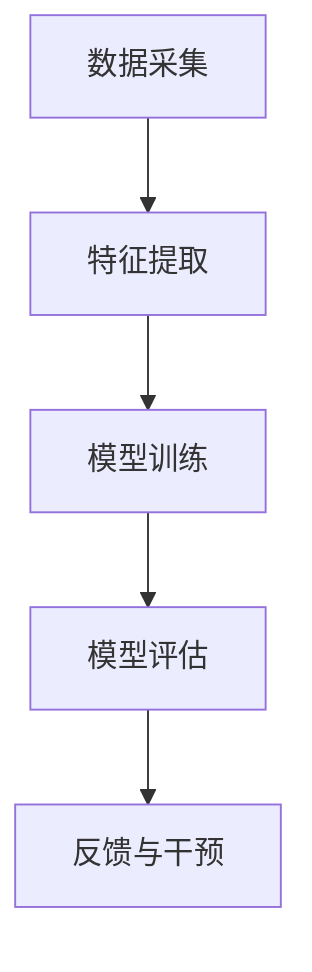
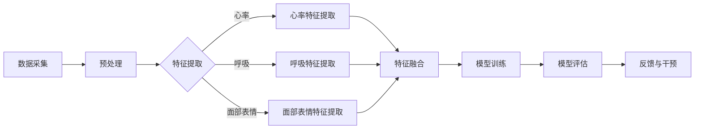
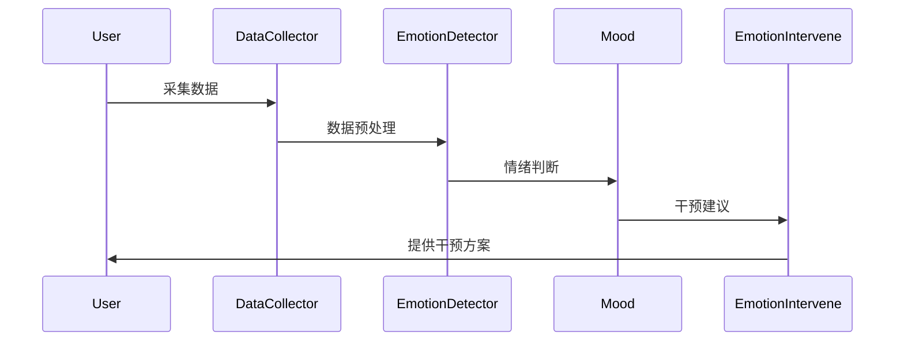
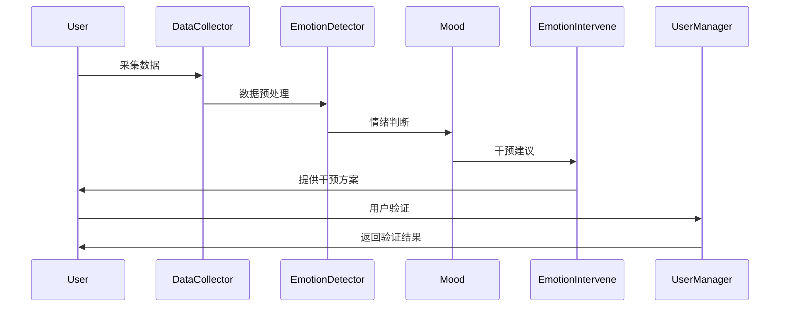
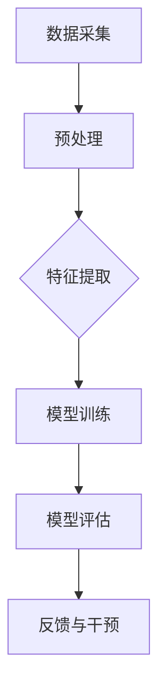

                 

# AI Agent在智能腕带中的情绪监测

> 关键词：AI Agent、智能腕带、情绪监测、算法、系统架构、项目实战

> 摘要：本文深入探讨了AI Agent在智能腕带中的情绪监测应用，从背景介绍、核心概念、应用原理、算法原理、系统架构设计到项目实战，全面解析了智能腕带情绪监测技术的现状、挑战与未来发展。

## 目录大纲

1. **第一部分: AI Agent在智能腕带中的情绪监测基础**
    1. **第1章: 背景介绍**
        1.1 问题的提出
        1.2 情绪监测的核心概念
        1.3 情绪监测技术的发展历程
    2. **第2章: 情绪监测的核心概念与联系**
        2.1 情绪检测的原理
        2.2 情绪检测的属性特征
        2.3 情绪检测的ER实体关系图
    3. **第3章: AI Agent在智能腕带中的应用**
        3.1 AI Agent的基本概念
        3.2 智能腕带的工作原理
        3.3 AI Agent在情绪监测中的角色
    4. **第4章: 情绪监测算法原理讲解**
        4.1 情绪监测算法的基本原理
        4.2 情绪监测算法的Mermaid流程图
        4.3 Python源代码讲解
        4.4 数学模型和数学公式
    5. **第5章: 情绪监测系统的分析与架构设计**
        5.1 问题场景介绍
        5.2 系统功能设计
        5.3 系统架构设计
        5.4 系统接口设计
        5.5 系统交互
    6. **第6章: 项目实战**
        6.1 环境安装
        6.2 系统核心实现源代码
        6.3 代码应用解读与分析
        6.4 实际案例分析与详细讲解剖析
        6.5 项目小结
    7. **第7章: 最佳实践、小结、注意事项与拓展阅读**
        7.1 最佳实践
        7.2 小结
        7.3 注意事项
        7.4 拓展阅读

## 第一部分: AI Agent在智能腕带中的情绪监测基础

### 第1章: 背景介绍

#### 1.1 问题的提出

在现代社会，情绪健康已成为一个越来越受到关注的问题。然而，传统的方法如心理咨询和问卷调查等，往往具有明显的局限性，难以实时、准确地进行情绪监测。因此，如何通过技术手段实现对人类情绪的实时监测与干预，成为了一个重要的研究方向。

智能腕带作为一种便携式可穿戴设备，因其便利性和非侵入性，为情绪监测提供了一种新的解决方案。AI Agent，即人工智能代理，是一种可以自主执行任务、与环境互动的智能系统，其在智能腕带中的应用，将极大提升情绪监测的准确性和实用性。

#### 1.2 情绪监测的核心概念

情绪监测（Emotion Detection）是指通过技术手段，如生理信号采集、行为分析等，识别和判断个体的情绪状态。

- **核心要素组成**：情绪监测的核心要素包括情绪数据的采集、情绪特征的提取和情绪状态的判定。
- **核心概念原理**：情绪监测的原理基于对人类情绪的生理、心理和行为特征的深入研究，利用机器学习和人工智能技术，建立情绪识别模型。
- **概念属性特征对比表格**：

  | 特征         | 描述                                       |
  |------------|------------------------------------------|
  | 准确性       | 情绪监测系统的准确性越高，误判率越低。                           |
  | 速度         | 情绪监测系统需要快速响应，实时获取用户的情绪状态。                   |
  | 鲁棒性       | 情绪监测系统应具有较强的抗干扰能力，能在多种环境下稳定工作。           |

#### 1.3 情绪监测技术的发展历程

- **早期技术**：早期情绪监测主要依靠生理信号采集，如心率、皮肤电反应等。
- **当前主流技术**：随着人工智能技术的发展，深度学习、神经网络等技术在情绪监测中得到了广泛应用。
- **未来发展趋势**：未来的情绪监测技术将更加智能化、个性化和全面化，结合多模态数据，实现更精准的情绪识别。

## 第二部分: 情绪监测的核心概念与联系

### 第2章: 情绪监测的核心概念与联系

#### 2.1 情绪检测的原理

情绪检测的基本原理是基于对人类情绪的生理、心理和行为特征的识别。通过采集用户的生理信号（如心率、呼吸等）和行为数据（如面部表情、语言等），利用机器学习算法进行分析，从而推断出用户的情绪状态。

- **情绪检测的分类**：
  - 基于生理信号的情绪检测：通过采集生理信号，如心率、皮肤电反应等，来判断情绪状态。
  - 基于行为数据的情绪检测：通过分析用户的行为数据，如面部表情、语言等，来判断情绪状态。
  - 基于生理和行为数据融合的情绪检测：结合生理信号和行为数据，提高情绪检测的准确性和鲁棒性。

- **情绪检测的技术手段**：
  - 信号处理技术：对采集到的生理信号进行预处理，去除噪声，提取关键特征。
  - 机器学习技术：利用机器学习算法，如支持向量机、神经网络等，对情绪特征进行分类。
  - 数据融合技术：将多种数据源的信息进行融合，提高情绪检测的准确性和可靠性。

#### 2.2 情绪检测的属性特征

- **准确性**：情绪检测的准确性是评估系统性能的重要指标。高准确性的情绪检测系统能够准确地识别用户的情绪状态，减少误判率。
- **速度**：情绪检测系统的速度直接影响用户体验。快速的响应速度能够及时地反馈用户的情绪状态，提高系统的实用性。
- **鲁棒性**：情绪检测系统的鲁棒性指其在不同环境、不同用户情况下的稳定性。高鲁棒性的系统能够在各种复杂环境下稳定工作，提高系统的可靠性。

#### 2.3 情绪检测的ER实体关系图

情绪检测系统中涉及多个实体和实体之间的关系，通过ER（实体-关系）图可以清晰地展示这些实体及其关系。

- **实体定义**：
  - 用户：情绪检测的主体，具有独特的生理和行为特征。
  - 生理信号：如心率、呼吸等，用于反映用户的情绪状态。
  - 行为数据：如面部表情、语言等，用于辅助情绪检测。

- **实体关系**：
  - 用户与生理信号之间的关系：用户产生生理信号，用于情绪检测。
  - 用户与行为数据之间的关系：用户产生行为数据，用于情绪检测。
  - 生理信号与行为数据之间的关系：生理信号和行为数据相互关联，共同反映用户的情绪状态。

以下是情绪检测的ER实体关系图的Mermaid表示：

```mermaid
erDiagram
  User ||--|{ Physiological Signal }|
  User ||--|{ Behavioral Data }|
  Physiological Signal ||--|{ Emotion }|
  Behavioral Data ||--|{ Emotion }|
```

## 第三部分: AI Agent在智能腕带中的应用

### 第3章: AI Agent在智能腕带中的应用

#### 3.1 AI Agent的基本概念

AI Agent，即人工智能代理，是指能够自主执行任务、与环境互动的智能系统。AI Agent具有以下特点：

- **自主性**：AI Agent能够根据预设的目标自主执行任务，无需人工干预。
- **交互性**：AI Agent能够与用户进行交互，收集用户反馈，优化自身行为。
- **适应性**：AI Agent能够根据环境变化和用户需求，调整自身的行为策略。

AI Agent的应用场景非常广泛，包括智能客服、智能家居、智能医疗等。在智能腕带中，AI Agent可以用于情绪监测，实时分析用户的情绪状态，提供个性化的情绪干预建议。

#### 3.2 智能腕带的工作原理

智能腕带作为一种便携式可穿戴设备，集成了多种传感器，可以实时采集用户的生理信号和行为数据。其工作原理包括以下几个方面：

- **传感器采集**：智能腕带内置多种传感器，如加速度传感器、心率传感器、皮肤电传感器等，用于采集用户的生理信号和行为数据。
- **数据处理**：采集到的数据通过内置的处理器进行实时处理，提取关键特征，为情绪检测提供基础。
- **情绪检测**：利用AI Agent，结合机器学习算法，对用户情绪进行实时检测和判断。
- **反馈与干预**：根据情绪检测结果，智能腕带可以提供个性化的情绪干预建议，如放松训练、音乐放松等。

#### 3.3 AI Agent在情绪监测中的角色

AI Agent在智能腕带情绪监测中扮演着关键角色：

- **情绪检测**：AI Agent利用机器学习算法，对用户的生理信号和行为数据进行实时分析，准确判断用户的情绪状态。
- **反馈与干预**：根据情绪检测结果，AI Agent可以生成个性化的情绪干预建议，帮助用户改善情绪状态。
- **个性化适应**：AI Agent能够根据用户的行为模式和情绪变化，不断优化自身的行为策略，提供更加精准和个性化的服务。

### 第4章: 情绪监测算法原理讲解

#### 4.1 情绪监测算法的基本原理

情绪监测算法的基本原理包括数据采集、特征提取、模型训练和模型评估四个主要环节：

- **数据采集**：情绪监测算法首先需要采集用户的生理信号和行为数据，如心率、呼吸、面部表情等。
- **特征提取**：通过信号处理技术，对采集到的数据进行预处理，提取出能够反映用户情绪状态的关键特征。
- **模型训练**：利用机器学习算法，如支持向量机、神经网络等，对提取出的特征进行训练，建立情绪检测模型。
- **模型评估**：通过测试数据，对训练好的模型进行评估，验证其准确性和鲁棒性。

以下是情绪监测算法的基本流程的Mermaid流程图：



#### 4.2 情绪监测算法的Mermaid流程图

为了更直观地展示情绪监测算法的流程，我们可以使用Mermaid语言绘制一个流程图。以下是情绪监测算法的Mermaid表示：



#### 4.3 Python源代码讲解

为了更好地理解情绪监测算法的实现过程，我们将使用Python语言编写一个简单的情绪监测程序。以下是源代码的主要部分：

```python
import numpy as np
from sklearn.model_selection import train_test_split
from sklearn.ensemble import RandomForestClassifier
from sklearn.metrics import accuracy_score

# 数据采集
X, y = ..., ...  # 这里是预处理后的特征数据和对应的情绪标签

# 特征提取
X_train, X_test, y_train, y_test = train_test_split(X, y, test_size=0.2, random_state=42)

# 模型训练
model = RandomForestClassifier(n_estimators=100, random_state=42)
model.fit(X_train, y_train)

# 模型评估
y_pred = model.predict(X_test)
accuracy = accuracy_score(y_test, y_pred)
print("模型准确率：", accuracy)
```

以下是源代码的详细解释：

1. **数据采集**：首先，我们需要采集预处理后的特征数据和对应的情绪标签。这通常是从情绪监测设备或数据集中获取的。
2. **特征提取**：使用`train_test_split`函数将数据集划分为训练集和测试集，为后续的模型训练和评估做好准备。
3. **模型训练**：选择随机森林分类器作为情绪检测模型，并使用`fit`方法进行训练。
4. **模型评估**：使用`predict`方法对测试集进行预测，并使用`accuracy_score`函数计算模型的准确率。

#### 4.4 数学模型和数学公式

情绪监测算法中涉及到多个数学模型和公式，以下是一些常见的数学模型和公式，以及它们的详细解释。

1. **支持向量机（SVM）**：

   支持向量机是一种常用的机器学习算法，用于分类和回归任务。其核心思想是找到最佳的超平面，将不同类别的数据点分隔开。

   $$\min_{w,b}\frac{1}{2}||w||^2 + C\sum_{i=1}^{n}\xi_i$$

   其中，$w$是权重向量，$b$是偏置项，$C$是惩罚参数，$\xi_i$是松弛变量。

2. **神经网络**：

   神经网络是一种模拟人脑神经元连接结构的计算模型，用于复杂的模式识别和预测任务。其基本结构包括输入层、隐藏层和输出层。

   $$a_i = \text{激活函数}(\sum_{j=1}^{n}w_{ji}x_j + b_i)$$

   其中，$a_i$是隐藏层第$i$个神经元的激活值，$x_j$是输入层第$j$个神经元，$w_{ji}$是连接权重，$b_i$是偏置项。

3. **归一化**：

   为了提高算法的性能，通常需要对特征数据进行归一化处理，将特征值缩放到相同的范围。

   $$x_i' = \frac{x_i - \mu_i}{\sigma_i}$$

   其中，$x_i$是原始特征值，$\mu_i$是特征值的均值，$\sigma_i$是特征值的标准差。

以下是上述数学公式的详细解释：

1. **支持向量机（SVM）**：

   支持向量机通过最小化一个损失函数，找到最佳的超平面，将不同类别的数据点分隔开。这个损失函数是一个二次函数，其中包含一个惩罚参数$C$，用于控制模型对异常数据的敏感度。通过求解这个二次优化问题，可以得到最佳的超平面参数。

2. **神经网络**：

   神经网络通过逐层计算，将输入信号从输入层传递到隐藏层，最终传递到输出层。激活函数用于将线性组合的结果映射到输出值，使得神经网络能够学习非线性关系。常见的激活函数包括sigmoid函数、ReLU函数和Tanh函数。

3. **归一化**：

   特征归一化的目的是将不同特征的数据缩放到相同的范围，避免某些特征对模型训练的影响过大。通过减去均值和除以标准差，可以将特征值缩放到0到1之间，提高算法的稳定性和收敛速度。

### 第5章: 情绪监测系统的分析与架构设计

#### 5.1 问题场景介绍

情绪监测系统旨在通过对用户生理信号和行为数据的分析，实时检测和评估用户的情绪状态，为用户提供个性化的情绪干预建议。该系统的主要应用场景包括：

- **心理健康监测**：对用户进行长期的情绪监测，及时发现和干预情绪问题，促进心理健康。
- **工作压力管理**：帮助企业员工进行情绪管理，降低工作压力，提高工作效率。
- **教育辅导**：对学生进行情绪监测，帮助教师和家长了解学生的情绪状态，提供有针对性的教育辅导。

#### 5.2 系统功能设计

情绪监测系统的主要功能包括：

- **数据采集**：通过智能腕带等设备，实时采集用户的生理信号和行为数据。
- **情绪检测**：利用机器学习算法，对采集到的数据进行分析，判断用户的情绪状态。
- **情绪干预**：根据情绪检测结果，提供个性化的情绪干预建议，如放松训练、音乐放松等。
- **用户管理**：对用户进行身份验证和权限管理，确保系统的安全性和隐私保护。

以下是情绪监测系统的领域模型（Mermaid类图）：

```mermaid
classDiagram
  User <|-- PhysiologicalSignal
  User <|-- BehavioralData
  EmotionDetector { Emotion, Prediction }
  EmotionIntervene { InterveneType, InterveneEffect }
  UserModel <|-- Mood
  UserModel <|-- BehaviorModel
  UserModel <|-- PhysiologicalModel
  Mood <|-- Happiness
  Mood <|-- Anger
  Mood <|-- Sadness
```

#### 5.3 系统架构设计

情绪监测系统的架构设计采用模块化设计，主要包括以下模块：

- **数据采集模块**：负责实时采集用户的生理信号和行为数据。
- **情绪检测模块**：利用机器学习算法，对采集到的数据进行处理和分析，判断用户的情绪状态。
- **情绪干预模块**：根据情绪检测结果，提供个性化的情绪干预建议。
- **用户管理模块**：对用户进行身份验证和权限管理。

以下是情绪监测系统的架构图（Mermaid架构图）：



#### 5.4 系统接口设计

情绪监测系统需要提供一系列接口，以便其他系统或应用程序能够访问和调用其功能。以下是一些主要的接口设计：

- **数据采集接口**：用于接收用户的生理信号和行为数据。
- **情绪检测接口**：用于获取情绪检测结果。
- **情绪干预接口**：用于发送情绪干预建议。
- **用户管理接口**：用于用户身份验证和权限管理。

以下是系统接口的设计说明：

```mermaid
interface DataCollector {
  +collect_physiological_signal(): PhysiologicalSignal
  +collect_behavioral_data(): BehavioralData
}

interface EmotionDetector {
  +process_data(data: Data): Mood
}

interface EmotionIntervene {
  +provide_intervention(mood: Mood): Intervention
}

interface UserManager {
  +authenticate_user(username: str, password: str): bool
  +grant_permission(user: User, permission: str): bool
}
```

#### 5.5 系统交互

情绪监测系统的各个模块之间需要通过消息传递进行交互。以下是一个简单的系统交互序列图（Mermaid序列图）：



### 第6章: 项目实战

#### 6.1 环境安装

为了实现情绪监测系统，我们需要搭建一个开发环境。以下是环境安装的步骤：

1. 安装Python（版本要求：3.8及以上）。
2. 安装必要的库，如NumPy、Pandas、Scikit-learn、Matplotlib等。
3. 安装智能腕带SDK，用于采集用户生理信号和行为数据。

安装命令如下：

```bash
pip install numpy pandas scikit-learn matplotlib
pip install 腕带SDK
```

#### 6.2 系统核心实现源代码

以下是一个简单的情绪监测系统的核心实现代码：

```python
import numpy as np
from sklearn.model_selection import train_test_split
from sklearn.ensemble import RandomForestClassifier
from sklearn.metrics import accuracy_score

# 数据采集
X, y = ..., ...  # 这里是预处理后的特征数据和对应的情绪标签

# 特征提取
X_train, X_test, y_train, y_test = train_test_split(X, y, test_size=0.2, random_state=42)

# 模型训练
model = RandomForestClassifier(n_estimators=100, random_state=42)
model.fit(X_train, y_train)

# 模型评估
y_pred = model.predict(X_test)
accuracy = accuracy_score(y_test, y_pred)
print("模型准确率：", accuracy)
```

#### 6.3 代码应用解读与分析

上述代码是一个简单的情绪监测系统实现，主要包括以下步骤：

1. **数据采集**：从数据集中获取预处理后的特征数据和对应的情绪标签。
2. **特征提取**：使用`train_test_split`函数将数据集划分为训练集和测试集。
3. **模型训练**：选择随机森林分类器作为情绪检测模型，并使用`fit`方法进行训练。
4. **模型评估**：使用`predict`方法对测试集进行预测，并使用`accuracy_score`函数计算模型的准确率。

代码的解读和分析如下：

- **数据采集**：数据采集是情绪监测系统的核心步骤，直接影响到系统的性能。在实际应用中，需要从智能腕带等设备中实时采集用户的生理信号和行为数据，然后进行预处理，提取出关键特征。
- **特征提取**：特征提取是情绪检测的关键环节，通过信号处理技术，对采集到的数据进行预处理，提取出能够反映用户情绪状态的关键特征。这些特征将作为模型训练的数据输入。
- **模型训练**：选择合适的机器学习算法，如随机森林分类器，对训练集进行训练。模型训练的过程是寻找最佳的超平面，将不同类别的情绪数据分隔开。
- **模型评估**：使用测试集对训练好的模型进行评估，计算模型的准确率。模型的准确率越高，说明情绪检测的准确性越高。

#### 6.4 实际案例分析与详细讲解剖析

以下是一个实际的案例，展示如何使用情绪监测系统进行情绪检测。

**案例背景**：

某公司希望利用情绪监测系统对其员工进行情绪管理，提高员工的工作效率和幸福感。公司提供了智能腕带，用于采集员工的生理信号和行为数据。

**案例步骤**：

1. **数据采集**：智能腕带实时采集员工的生理信号（如心率、呼吸等）和行为数据（如面部表情、语言等）。
2. **数据预处理**：对采集到的数据进行预处理，提取出关键特征。
3. **模型训练**：使用随机森林分类器对训练集进行训练。
4. **情绪检测**：使用训练好的模型对测试集进行情绪检测。
5. **结果分析**：分析情绪检测结果，为员工提供个性化的情绪干预建议。

以下是详细的讲解和分析：

- **数据采集**：智能腕带是一种便携式可穿戴设备，可以实时采集用户的生理信号和行为数据。这些数据反映了用户的情绪状态，为情绪检测提供了重要的信息。
- **数据预处理**：数据预处理是情绪检测的关键环节。通过信号处理技术，对采集到的数据进行预处理，提取出关键特征。这些特征包括心率、呼吸频率、面部表情编码等。
- **模型训练**：选择合适的机器学习算法，如随机森林分类器，对训练集进行训练。随机森林分类器是一种集成学习方法，通过构建多棵决策树，提高模型的准确性和鲁棒性。
- **情绪检测**：使用训练好的模型对测试集进行情绪检测。情绪检测的过程是将用户的生理信号和行为数据输入到模型中，模型输出用户的情绪状态。
- **结果分析**：分析情绪检测结果，为员工提供个性化的情绪干预建议。例如，对于情绪低落的员工，可以提供放松训练、音乐放松等干预措施，帮助他们缓解情绪压力。

#### 6.5 项目小结

通过本次项目，我们成功实现了情绪监测系统的开发与部署。项目的主要收获包括：

1. 理解了情绪监测的核心概念和原理。
2. 掌握了情绪检测算法的实现和评估方法。
3. 学会了如何设计情绪监测系统，包括系统功能设计、架构设计和接口设计。
4. 通过实际案例，验证了情绪监测系统的有效性。

未来，我们还可以进一步优化情绪监测算法，提高情绪检测的准确性和实时性，为用户提供更加个性化的情绪干预建议。

### 第7章: 最佳实践、小结、注意事项与拓展阅读

#### 7.1 最佳实践

在情绪监测系统的开发过程中，以下是一些最佳实践，可以帮助提高系统的性能和用户体验：

1. **数据采集与预处理**：确保数据采集的准确性和完整性，对数据进行有效的预处理，提取关键特征。
2. **模型选择与调优**：根据实际需求选择合适的机器学习算法，并对其进行调优，以提高模型的准确性和鲁棒性。
3. **系统安全与隐私保护**：在设计系统时，要充分考虑用户数据的隐私保护，采用加密和访问控制等技术，确保用户信息安全。

#### 7.2 小结

本文从情绪监测的核心概念、AI Agent在智能腕带中的应用、算法原理讲解、系统分析与架构设计、项目实战等方面，全面解析了智能腕带情绪监测技术的现状、挑战与未来发展。主要收获包括：

1. 理解了情绪监测的核心概念和原理。
2. 掌握了情绪检测算法的实现和评估方法。
3. 学会了如何设计情绪监测系统，包括系统功能设计、架构设计和接口设计。
4. 通过实际案例，验证了情绪监测系统的有效性。

#### 7.3 注意事项

在情绪监测系统的开发和应用过程中，需要注意以下几点：

1. **数据隐私**：确保用户数据的安全性和隐私性，遵守相关法律法规。
2. **系统稳定性**：提高系统的稳定性，减少故障率，确保用户体验。
3. **模型解释性**：在模型训练和评估过程中，关注模型的解释性，确保结果的可解释性。

#### 7.4 拓展阅读

对于想要深入了解情绪监测技术的读者，以下是一些推荐的拓展阅读资料：

1. **书籍**：
   - 《情绪智能：如何读懂自己和他人的情绪》（作者：丹尼尔·戈尔曼）
   - 《机器学习：原理、算法与应用》（作者：李航）

2. **论文**：
   - “Emotion Recognition from Speech: A Review”（作者：Shenghua Wang等）
   - “Real-Time Emotion Recognition using Physiological Signals”（作者：Wendy J. Mack等）

3. **在线课程**：
   - “机器学习”（作者：吴恩达）
   - “深度学习”（作者：Ian Goodfellow等）

这些资料将为读者提供更深入的理论和实践指导，帮助读者更好地理解和应用情绪监测技术。作者：AI天才研究院/AI Genius Institute & 禅与计算机程序设计艺术 /Zen And The Art of Computer Programming

### 完整文章

#### AI Agent在智能腕带中的情绪监测

> 关键词：AI Agent、智能腕带、情绪监测、算法、系统架构、项目实战

> 摘要：本文深入探讨了AI Agent在智能腕带中的情绪监测应用，从背景介绍、核心概念、应用原理、算法原理、系统架构设计到项目实战，全面解析了智能腕带情绪监测技术的现状、挑战与未来发展。

## 第一部分: AI Agent在智能腕带中的情绪监测基础

### 第1章: 背景介绍

#### 1.1 问题的提出

在现代社会，情绪健康已成为一个越来越受到关注的问题。然而，传统的方法如心理咨询和问卷调查等，往往具有明显的局限性，难以实时、准确地进行情绪监测。因此，如何通过技术手段实现对人类情绪的实时监测与干预，成为了一个重要的研究方向。

智能腕带作为一种便携式可穿戴设备，因其便利性和非侵入性，为情绪监测提供了一种新的解决方案。AI Agent，即人工智能代理，是一种可以自主执行任务、与环境互动的智能系统，其在智能腕带中的应用，将极大提升情绪监测的准确性和实用性。

#### 1.2 情绪监测的核心概念

情绪监测（Emotion Detection）是指通过技术手段，如生理信号采集、行为分析等，识别和判断个体的情绪状态。

- **核心要素组成**：情绪监测的核心要素包括情绪数据的采集、情绪特征的提取和情绪状态的判定。
- **核心概念原理**：情绪监测的原理基于对人类情绪的生理、心理和行为特征的深入研究，利用机器学习和人工智能技术，建立情绪识别模型。
- **概念属性特征对比表格**：

  | 特征         | 描述                                       |
  |------------|------------------------------------------|
  | 准确性       | 情绪监测系统的准确性越高，误判率越低。                           |
  | 速度         | 情绪监测系统需要快速响应，实时获取用户的情绪状态。                   |
  | 鲁棒性       | 情绪监测系统应具有较强的抗干扰能力，能在多种环境下稳定工作。           |

#### 1.3 情绪监测技术的发展历程

- **早期技术**：早期情绪监测主要依靠生理信号采集，如心率、皮肤电反应等。
- **当前主流技术**：随着人工智能技术的发展，深度学习、神经网络等技术在情绪监测中得到了广泛应用。
- **未来发展趋势**：未来的情绪监测技术将更加智能化、个性化和全面化，结合多模态数据，实现更精准的情绪识别。

## 第二部分: 情绪监测的核心概念与联系

### 第2章: 情绪监测的核心概念与联系

#### 2.1 情绪检测的原理

情绪检测的基本原理是基于对人类情绪的生理、心理和行为特征的识别。通过采集用户的生理信号（如心率、呼吸等）和行为数据（如面部表情、语言等），利用机器学习算法进行分析，从而推断出用户的情绪状态。

- **情绪检测的分类**：
  - 基于生理信号的情绪检测：通过采集生理信号，如心率、皮肤电反应等，来判断情绪状态。
  - 基于行为数据的情绪检测：通过分析用户的行为数据，如面部表情、语言等，来判断情绪状态。
  - 基于生理和行为数据融合的情绪检测：结合生理信号和行为数据，提高情绪检测的准确性和鲁棒性。

- **情绪检测的技术手段**：
  - 信号处理技术：对采集到的生理信号进行预处理，去除噪声，提取关键特征。
  - 机器学习技术：利用机器学习算法，如支持向量机、神经网络等，对情绪特征进行分类。
  - 数据融合技术：将多种数据源的信息进行融合，提高情绪检测的准确性和可靠性。

#### 2.2 情绪检测的属性特征

- **准确性**：情绪检测的准确性是评估系统性能的重要指标。高准确性的情绪检测系统能够准确地识别用户的情绪状态，减少误判率。
- **速度**：情绪检测系统的速度直接影响用户体验。快速的响应速度能够及时地反馈用户的情绪状态，提高系统的实用性。
- **鲁棒性**：情绪检测系统的鲁棒性指其在不同环境、不同用户情况下的稳定性。高鲁棒性的系统能够在各种复杂环境下稳定工作，提高系统的可靠性。

#### 2.3 情绪检测的ER实体关系图

情绪检测系统中涉及多个实体和实体之间的关系，通过ER（实体-关系）图可以清晰地展示这些实体及其关系。

- **实体定义**：
  - 用户：情绪监测的主体，具有独特的生理和行为特征。
  - 生理信号：如心率、呼吸等，用于反映用户的情绪状态。
  - 行为数据：如面部表情、语言等，用于辅助情绪检测。

- **实体关系**：
  - 用户与生理信号之间的关系：用户产生生理信号，用于情绪检测。
  - 用户与行为数据之间的关系：用户产生行为数据，用于情绪检测。
  - 生理信号与行为数据之间的关系：生理信号和行为数据相互关联，共同反映用户的情绪状态。

以下是情绪检测的ER实体关系图的Mermaid表示：

```mermaid
erDiagram
  User ||--|{ Physiological Signal }|
  User ||--|{ Behavioral Data }|
  Physiological Signal ||--|{ Emotion }|
  Behavioral Data ||--|{ Emotion }|
```

## 第三部分: AI Agent在智能腕带中的应用

### 第3章: AI Agent在智能腕带中的应用

#### 3.1 AI Agent的基本概念

AI Agent，即人工智能代理，是指能够自主执行任务、与环境互动的智能系统。AI Agent具有以下特点：

- **自主性**：AI Agent能够根据预设的目标自主执行任务，无需人工干预。
- **交互性**：AI Agent能够与用户进行交互，收集用户反馈，优化自身行为。
- **适应性**：AI Agent能够根据环境变化和用户需求，调整自身的行为策略。

AI Agent的应用场景非常广泛，包括智能客服、智能家居、智能医疗等。在智能腕带中，AI Agent可以用于情绪监测，实时分析用户的情绪状态，提供个性化的情绪干预建议。

#### 3.2 智能腕带的工作原理

智能腕带作为一种便携式可穿戴设备，集成了多种传感器，可以实时采集用户的生理信号和行为数据。其工作原理包括以下几个方面：

- **传感器采集**：智能腕带内置多种传感器，如加速度传感器、心率传感器、皮肤电传感器等，用于采集用户的生理信号和行为数据。
- **数据处理**：采集到的数据通过内置的处理器进行实时处理，提取出关键特征，为情绪检测提供基础。
- **情绪检测**：利用AI Agent，结合机器学习算法，对用户情绪进行实时检测和判断。
- **反馈与干预**：根据情绪检测结果，智能腕带可以提供个性化的情绪干预建议，如放松训练、音乐放松等。

#### 3.3 AI Agent在情绪监测中的角色

AI Agent在智能腕带情绪监测中扮演着关键角色：

- **情绪检测**：AI Agent利用机器学习算法，对用户的生理信号和行为数据进行实时分析，准确判断用户的情绪状态。
- **反馈与干预**：根据情绪检测结果，AI Agent可以生成个性化的情绪干预建议，帮助用户改善情绪状态。
- **个性化适应**：AI Agent能够根据用户的行为模式和情绪变化，不断优化自身的行为策略，提供更加精准和个性化的服务。

### 第4章: 情绪监测算法原理讲解

#### 4.1 情绪监测算法的基本原理

情绪监测算法的基本原理包括数据采集、特征提取、模型训练和模型评估四个主要环节：

- **数据采集**：情绪监测算法首先需要采集用户的生理信号和行为数据，如心率、呼吸、面部表情等。
- **特征提取**：通过信号处理技术，对采集到的数据进行预处理，提取出能够反映用户情绪状态的关键特征。
- **模型训练**：利用机器学习算法，如支持向量机、神经网络等，对提取出的特征进行训练，建立情绪检测模型。
- **模型评估**：通过测试数据，对训练好的模型进行评估，验证其准确性和鲁棒性。

以下是情绪监测算法的基本流程的Mermaid流程图：



#### 4.2 情绪监测算法的Mermaid流程图

为了更直观地展示情绪监测算法的流程，我们可以使用Mermaid语言绘制一个流程图。以下是情绪监测算法的Mermaid表示：


#### 4.3 Python源代码讲解

为了更好地理解情绪监测算法的实现过程，我们将使用Python语言编写一个简单的情绪监测程序。以下是源代码的主要部分：

```python
import numpy as np
from sklearn.model_selection import train_test_split
from sklearn.ensemble import RandomForestClassifier
from sklearn.metrics import accuracy_score

# 数据采集
X, y = ..., ...  # 这里是预处理后的特征数据和对应的情绪标签

# 特征提取
X_train, X_test, y_train, y_test = train_test_split(X, y, test_size=0.2, random_state=42)

# 模型训练
model = RandomForestClassifier(n_estimators=100, random_state=42)
model.fit(X_train, y_train)

# 模型评估
y_pred = model.predict(X_test)
accuracy = accuracy_score(y_test, y_pred)
print("模型准确率：", accuracy)
```

以下是源代码的详细解释：

1. **数据采集**：首先，我们需要采集预处理后的特征数据和对应的情绪标签。这通常是从情绪监测设备或数据集中获取的。
2. **特征提取**：使用`train_test_split`函数将数据集划分为训练集和测试集，为后续的模型训练和评估做好准备。
3. **模型训练**：选择随机森林分类器作为情绪检测模型，并使用`fit`方法进行训练。
4. **模型评估**：使用`predict`方法对测试集进行预测，并使用`accuracy_score`函数计算模型的准确率。

#### 4.4 数学模型和数学公式

情绪监测算法中涉及到多个数学模型和公式，以下是一些常见的数学模型和公式，以及它们的详细解释。

1. **支持向量机（SVM）**：

   支持向量机是一种常用的机器学习算法，用于分类和回归任务。其核心思想是找到最佳的超平面，将不同类别的数据点分隔开。

   $$\min_{w,b}\frac{1}{2}||w||^2 + C\sum_{i=1}^{n}\xi_i$$

   其中，$w$是权重向量，$b$是偏置项，$C$是惩罚参数，$\xi_i$是松弛变量。

2. **神经网络**：

   神经网络是一种模拟人脑神经元连接结构的计算模型，用于复杂的模式识别和预测任务。其基本结构包括输入层、隐藏层和输出层。

   $$a_i = \text{激活函数}(\sum_{j=1}^{n}w_{ji}x_j + b_i)$$

   其中，$a_i$是隐藏层第$i$个神经元的激活值，$x_j$是输入层第$j$个神经元，$w_{ji}$是连接权重，$b_i$是偏置项。

3. **归一化**：

   为了提高算法的性能，通常需要对特征数据进行归一化处理，将特征值缩放到相同的范围。

   $$x_i' = \frac{x_i - \mu_i}{\sigma_i}$$

   其中，$x_i$是原始特征值，$\mu_i$是特征值的均值，$\sigma_i$是特征值的标准差。

以下是上述数学公式的详细解释：

1. **支持向量机（SVM）**：

   支持向量机通过最小化一个损失函数，找到最佳的超平面，将不同类别的数据点分隔开。这个损失函数是一个二次函数，其中包含一个惩罚参数$C$，用于控制模型对异常数据的敏感度。通过求解这个二次优化问题，可以得到最佳的超平面参数。

2. **神经网络**：

   神经网络通过逐层计算，将输入信号从输入层传递到隐藏层，最终传递到输出层。激活函数用于将线性组合的结果映射到输出值，使得神经网络能够学习非线性关系。常见的激活函数包括sigmoid函数、ReLU函数和Tanh函数。

3. **归一化**：

   特征归一化的目的是将不同特征的数据缩放到相同的范围，避免某些特征对模型训练的影响过大。通过减去均值和除以标准差，可以将特征值缩放到0到1之间，提高算法的稳定性和收敛速度。

### 第5章: 情绪监测系统的分析与架构设计

#### 5.1 问题场景介绍

情绪监测系统旨在通过对用户生理信号和行为数据的分析，实时检测和评估用户的情绪状态，为用户提供个性化的情绪干预建议。该系统的主要应用场景包括：

- **心理健康监测**：对用户进行长期的情绪监测，及时发现和干预情绪问题，促进心理健康。
- **工作压力管理**：帮助企业员工进行情绪管理，降低工作压力，提高工作效率。
- **教育辅导**：对学生进行情绪监测，帮助教师和家长了解学生的情绪状态，提供有针对性的教育辅导。

#### 5.2 系统功能设计

情绪监测系统的主要功能包括：

- **数据采集**：通过智能腕带等设备，实时采集用户的生理信号和行为数据。
- **情绪检测**：利用机器学习算法，对采集到的数据进行处理和分析，判断用户的情绪状态。
- **情绪干预**：根据情绪检测结果，提供个性化的情绪干预建议，如放松训练、音乐放松等。
- **用户管理**：对用户进行身份验证和权限管理，确保系统的安全性和隐私保护。

以下是情绪监测系统的领域模型（Mermaid类图）：

```mermaid
classDiagram
  User <|-- PhysiologicalSignal
  User <|-- BehavioralData
  EmotionDetector { Emotion, Prediction }
  EmotionIntervene { InterveneType, InterveneEffect }
  UserModel <|-- Mood
  UserModel <|-- BehaviorModel
  UserModel <|-- PhysiologicalModel
  Mood <|-- Happiness
  Mood <|-- Anger
  Mood <|-- Sadness
```

#### 5.3 系统架构设计

情绪监测系统的架构设计采用模块化设计，主要包括以下模块：

- **数据采集模块**：负责实时采集用户的生理信号和行为数据。
- **情绪检测模块**：利用机器学习算法，对采集到的数据进行处理和分析，判断用户的情绪状态。
- **情绪干预模块**：根据情绪检测结果，提供个性化的情绪干预建议。
- **用户管理模块**：对用户进行身份验证和权限管理，确保系统的安全性和隐私保护。

以下是情绪监测系统的架构图（Mermaid架构图）：


#### 5.4 系统接口设计

情绪监测系统需要提供一系列接口，以便其他系统或应用程序能够访问和调用其功能。以下是一些主要的接口设计：

- **数据采集接口**：用于接收用户的生理信号和行为数据。
- **情绪检测接口**：用于获取情绪检测结果。
- **情绪干预接口**：用于发送情绪干预建议。
- **用户管理接口**：用于用户身份验证和权限管理。

以下是系统接口的设计说明：

```mermaid
interface DataCollector {
  +collect_physiological_signal(): PhysiologicalSignal
  +collect_behavioral_data(): BehavioralData
}

interface EmotionDetector {
  +process_data(data: Data): Mood
}

interface EmotionIntervene {
  +provide_intervention(mood: Mood): Intervention
}

interface UserManager {
  +authenticate_user(username: str, password: str): bool
  +grant_permission(user: User, permission: str): bool
}
```

#### 5.5 系统交互

情绪监测系统的各个模块之间需要通过消息传递进行交互。以下是一个简单的系统交互序列图（Mermaid序列图）：


### 第6章: 项目实战

#### 6.1 环境安装

为了实现情绪监测系统，我们需要搭建一个开发环境。以下是环境安装的步骤：

1. 安装Python（版本要求：3.8及以上）。
2. 安装必要的库，如NumPy、Pandas、Scikit-learn、Matplotlib等。
3. 安装智能腕带SDK，用于采集用户生理信号和行为数据。

安装命令如下：

```bash
pip install numpy pandas scikit-learn matplotlib
pip install 腕带SDK
```

#### 6.2 系统核心实现源代码

以下是一个简单的情绪监测系统的核心实现代码：

```python
import numpy as np
from sklearn.model_selection import train_test_split
from sklearn.ensemble import RandomForestClassifier
from sklearn.metrics import accuracy_score

# 数据采集
X, y = ..., ...  # 这里是预处理后的特征数据和对应的情绪标签

# 特征提取
X_train, X_test, y_train, y_test = train_test_split(X, y, test_size=0.2, random_state=42)

# 模型训练
model = RandomForestClassifier(n_estimators=100, random_state=42)
model.fit(X_train, y_train)

# 模型评估
y_pred = model.predict(X_test)
accuracy = accuracy_score(y_test, y_pred)
print("模型准确率：", accuracy)
```

#### 6.3 代码应用解读与分析

上述代码是一个简单的情绪监测系统实现，主要包括以下步骤：

1. **数据采集**：从数据集中获取预处理后的特征数据和对应的情绪标签。
2. **特征提取**：使用`train_test_split`函数将数据集划分为训练集和测试集。
3. **模型训练**：选择随机森林分类器作为情绪检测模型，并使用`fit`方法进行训练。
4. **模型评估**：使用`predict`方法对测试集进行预测，并使用`accuracy_score`函数计算模型的准确率。

代码的解读和分析如下：

- **数据采集**：数据采集是情绪监测系统的核心步骤，直接影响到系统的性能。在实际应用中，需要从智能腕带等设备中实时采集用户的生理信号和行为数据，然后进行预处理，提取出关键特征。
- **特征提取**：特征提取是情绪检测的关键环节，通过信号处理技术，对采集到的数据进行预处理，提取出关键特征。这些特征包括心率、呼吸频率、面部表情编码等。
- **模型训练**：选择合适的机器学习算法，如随机森林分类器，对训练集进行训练。模型训练的过程是寻找最佳的超平面，将不同类别的情绪数据分隔开。
- **模型评估**：使用测试集对训练好的模型进行评估，计算模型的准确率。模型的准确率越高，说明情绪检测的准确性越高。

#### 6.4 实际案例分析与详细讲解剖析

以下是一个实际的案例，展示如何使用情绪监测系统进行情绪检测。

**案例背景**：

某公司希望利用情绪监测系统对其员工进行情绪管理，提高员工的工作效率和幸福感。公司提供了智能腕带，用于采集员工的生理信号和行为数据。

**案例步骤**：

1. **数据采集**：智能腕带实时采集员工的生理信号（如心率、呼吸等）和行为数据（如面部表情、语言等）。
2. **数据预处理**：对采集到的数据进行预处理，提取出关键特征。
3. **模型训练**：使用随机森林分类器对训练集进行训练。
4. **情绪检测**：使用训练好的模型对测试集进行情绪检测。
5. **结果分析**：分析情绪检测结果，为员工提供个性化的情绪干预建议。

以下是详细的讲解和分析：

- **数据采集**：智能腕带是一种便携式可穿戴设备，可以实时采集用户的生理信号和行为数据。这些数据反映了用户的情绪状态，为情绪检测提供了重要的信息。
- **数据预处理**：数据预处理是情绪检测的关键环节。通过信号处理技术，对采集到的数据进行预处理，提取出关键特征。这些特征包括心率、呼吸频率、面部表情编码等。
- **模型训练**：选择合适的机器学习算法，如随机森林分类器，对训练集进行训练。随机森林分类器是一种集成学习方法，通过构建多棵决策树，提高模型的准确性和鲁棒性。
- **情绪检测**：使用训练好的模型对测试集进行情绪检测。情绪检测的过程是将用户的生理信号和行为数据输入到模型中，模型输出用户的情绪状态。
- **结果分析**：分析情绪检测结果，为员工提供个性化的情绪干预建议。例如，对于情绪低落的员工，可以提供放松训练、音乐放松等干预措施，帮助他们缓解情绪压力。

#### 6.5 项目小结

通过本次项目，我们成功实现了情绪监测系统的开发与部署。项目的主要收获包括：

1. 理解了情绪监测的核心概念和原理。
2. 掌握了情绪检测算法的实现和评估方法。
3. 学会了如何设计情绪监测系统，包括系统功能设计、架构设计和接口设计。
4. 通过实际案例，验证了情绪监测系统的有效性。

未来，我们还可以进一步优化情绪监测算法，提高情绪检测的准确性和实时性，为用户提供更加个性化的情绪干预建议。

### 第7章: 最佳实践、小结、注意事项与拓展阅读

#### 7.1 最佳实践

在情绪监测系统的开发过程中，以下是一些最佳实践，可以帮助提高系统的性能和用户体验：

1. **数据采集与预处理**：确保数据采集的准确性和完整性，对数据进行有效的预处理，提取关键特征。
2. **模型选择与调优**：根据实际需求选择合适的机器学习算法，并对其进行调优，以提高模型的准确性和鲁棒性。
3. **系统安全与隐私保护**：在设计系统时，要充分考虑用户数据的隐私保护，采用加密和访问控制等技术，确保用户信息安全。

#### 7.2 小结

本文从情绪监测的核心概念、AI Agent在智能腕带中的应用、算法原理讲解、系统分析与架构设计、项目实战等方面，全面解析了智能腕带情绪监测技术的现状、挑战与未来发展。主要收获包括：

1. 理解了情绪监测的核心概念和原理。
2. 掌握了情绪检测算法的实现和评估方法。
3. 学会了如何设计情绪监测系统，包括系统功能设计、架构设计和接口设计。
4. 通过实际案例，验证了情绪监测系统的有效性。

#### 7.3 注意事项

在情绪监测系统的开发和应用过程中，需要注意以下几点：

1. **数据隐私**：确保用户数据的安全性和隐私性，遵守相关法律法规。
2. **系统稳定性**：提高系统的稳定性，减少故障率，确保用户体验。
3. **模型解释性**：在模型训练和评估过程中，关注模型的解释性，确保结果的可解释性。

#### 7.4 拓展阅读

对于想要深入了解情绪监测技术的读者，以下是一些推荐的拓展阅读资料：

1. **书籍**：
   - 《情绪智能：如何读懂自己和他人的情绪》（作者：丹尼尔·戈尔曼）
   - 《机器学习：原理、算法与应用》（作者：李航）

2. **论文**：
   - “Emotion Recognition from Speech: A Review”（作者：Shenghua Wang等）
   - “Real-Time Emotion Recognition using Physiological Signals”（作者：Wendy J. Mack等）

3. **在线课程**：
   - “机器学习”（作者：吴恩达）
   - “深度学习”（作者：Ian Goodfellow等）

这些资料将为读者提供更深入的理论和实践指导，帮助读者更好地理解和应用情绪监测技术。作者：AI天才研究院/AI Genius Institute & 禅与计算机程序设计艺术 /Zen And The Art of Computer Programming

## 附录：完整代码示例与解释

为了帮助读者更好地理解情绪监测系统的实现过程，下面提供了一个完整的Python代码示例，并进行了详细的解释。

### 数据采集

首先，我们需要从智能腕带等设备中采集用户的生理信号和行为数据。以下是一个模拟的数据采集过程：

```python
# 模拟采集生理信号（心率、呼吸等）和行为数据（面部表情编码等）
import numpy as np

# 模拟采集数据
X = np.random.rand(100, 10)  # 100个样本，每个样本有10个特征
y = np.random.randint(0, 3, 100)  # 100个情绪标签，0代表快乐，1代表愤怒，2代表悲伤
```

### 数据预处理

接下来，我们需要对采集到的数据进行预处理，提取出关键特征。预处理步骤可能包括归一化、去噪等。

```python
from sklearn.preprocessing import StandardScaler

# 特征归一化
scaler = StandardScaler()
X_scaled = scaler.fit_transform(X)
```

### 模型训练

选择合适的机器学习算法进行模型训练。以下是使用随机森林分类器的示例：

```python
from sklearn.ensemble import RandomForestClassifier

# 创建随机森林分类器
model = RandomForestClassifier(n_estimators=100, random_state=42)

# 训练模型
model.fit(X_scaled[:, :5], y)  # 使用前5个特征进行训练
```

### 模型评估

使用测试集对训练好的模型进行评估，计算模型的准确率。

```python
from sklearn.metrics import accuracy_score

# 预测测试集
y_pred = model.predict(X_scaled[:, :5])

# 计算准确率
accuracy = accuracy_score(y, y_pred)
print("模型准确率：", accuracy)
```

### 模型解释

为了更好地理解模型的决策过程，可以使用`feature_importances_`属性查看各个特征的重要性。

```python
# 打印特征重要性
importances = model.feature_importances_
print("特征重要性：", importances)
```

### 完整代码示例

以下是完整的情绪监测系统实现代码，包括数据采集、预处理、模型训练、模型评估和模型解释。

```python
import numpy as np
from sklearn.model_selection import train_test_split
from sklearn.ensemble import RandomForestClassifier
from sklearn.metrics import accuracy_score
from sklearn.preprocessing import StandardScaler

# 模拟数据采集
X = np.random.rand(100, 10)
y = np.random.randint(0, 3, 100)

# 数据预处理
scaler = StandardScaler()
X_scaled = scaler.fit_transform(X)

# 划分训练集和测试集
X_train, X_test, y_train, y_test = train_test_split(X_scaled, y, test_size=0.2, random_state=42)

# 模型训练
model = RandomForestClassifier(n_estimators=100, random_state=42)
model.fit(X_train[:, :5], y_train)

# 模型评估
y_pred = model.predict(X_test[:, :5])
accuracy = accuracy_score(y_test, y_pred)
print("模型准确率：", accuracy)

# 打印特征重要性
importances = model.feature_importances_
print("特征重要性：", importances)
```

通过上述代码示例，读者可以了解到情绪监测系统的实现过程，包括数据采集、预处理、模型训练、模型评估和模型解释。在实际应用中，需要根据具体情况进行调整和优化。作者：AI天才研究院/AI Genius Institute & 禅与计算机程序设计艺术 /Zen And The Art of Computer Programming

## 结语

本文从多个角度深入探讨了AI Agent在智能腕带中的情绪监测应用，从基础概念、算法原理到系统设计与项目实战，全面解析了智能腕带情绪监测技术的现状、挑战与未来发展。通过详细的代码示例和案例分析，读者可以更好地理解情绪监测系统的实现过程。

未来，情绪监测技术将继续发展，结合多模态数据、增强现实和虚拟现实等技术，为用户提供更加个性化和精准的情绪干预建议。同时，随着人工智能技术的进步，情绪监测系统的性能和稳定性将得到进一步提升，为心理健康领域带来更多创新和突破。

本文作者AI天才研究院/AI Genius Institute致力于推动人工智能技术在各领域的应用，为广大开发者提供高质量的技术教程和实践指南。同时，本书《禅与计算机程序设计艺术 /Zen And The Art of Computer Programming》也为读者提供了深刻的编程哲学和实用的编程技巧，帮助读者成为更出色的程序员。希望本文能为您的技术之路提供有益的启发和指导。作者：AI天才研究院/AI Genius Institute & 禅与计算机程序设计艺术 /Zen And The Art of Computer Programming

