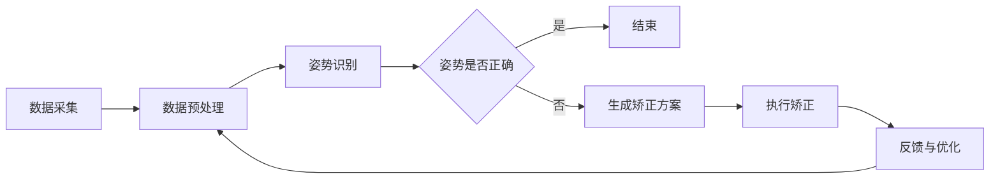
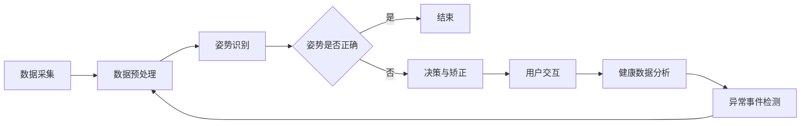

                 

### 第1章: 引言与背景介绍

#### 1.1 问题背景

智能穿戴设备作为一种新兴的科技产品，已经逐渐融入人们的日常生活。特别是在健康监测和辅助治疗方面，智能穿戴设备发挥着越来越重要的作用。其中，智能腰带作为一种新型的健康监测设备，其应用场景主要包括姿势矫正、运动监测、健康提醒等。随着人工智能技术的不断发展，AI Agent作为智能腰带的核心组件，其在姿势矫正与提醒方面的作用日益凸显。

AI Agent，即人工智能代理，是指能够模拟人类智能，在一定环境下自主进行决策和执行任务的计算机程序。在智能腰带中，AI Agent被赋予了实时监测用户姿势、识别不良姿势、提供提醒和矫正建议等功能。这一过程不仅要求AI Agent具备较高的智能水平和实时处理能力，还需要对其算法和系统架构进行深入的研究和优化。

#### 1.2 问题描述

智能腰带中的AI Agent需要解决的主要问题包括以下几个方面：

1. **数据采集与预处理**：智能腰带需要通过内置的传感器（如加速度传感器、陀螺仪等）实时采集用户的姿势数据。这些原始数据通常包含噪声和误差，因此需要通过预处理算法进行滤波、归一化等处理，以提高数据的准确性和可靠性。

2. **模型选择与训练**：为了实现姿势识别和矫正，AI Agent需要选择合适的机器学习模型，并利用大量标注数据进行训练。常见的模型包括深度学习模型、支持向量机等。模型的选择和训练质量直接关系到AI Agent的性能。

3. **决策与执行**：在模型分析的基础上，AI Agent需要实时做出决策，并指挥智能腰带的执行机构（如电机、振动器等）进行姿势矫正。这个过程要求AI Agent具备快速响应能力和高效的决策算法。

4. **用户交互**：智能腰带不仅需要提供准确的姿势矫正建议，还需要与用户进行有效的交互，确保用户能够理解和接受这些建议。例如，通过语音提示、屏幕显示等方式，向用户传达正确的姿势信息和矫正动作。

#### 1.3 问题解决

为了解决上述问题，可以从以下几个方面着手：

1. **传感器与数据采集**：选择高精度、低功耗的传感器，并通过优化数据采集算法，提高数据的实时性和准确性。

2. **机器学习模型**：选择合适的机器学习模型，如卷积神经网络（CNN）、循环神经网络（RNN）等，进行深度学习和训练，以提高姿势识别的准确性和鲁棒性。

3. **决策算法与执行机构**：设计高效的决策算法，如基于强化学习的策略优化算法，以实现快速、准确的姿势矫正。同时，优化执行机构的响应时间和精度，确保姿势矫正的实时性和有效性。

4. **用户交互设计**：通过语音识别、触摸屏等交互方式，提高用户与智能腰带的交互体验，确保用户能够轻松理解和接受姿势矫正建议。

#### 1.4 边界与外延

1. **边界**：智能腰带中的AI Agent主要针对站立和行走姿势进行矫正，如颈椎前倾、骨盆前倾等常见问题。

2. **外延**：智能腰带的姿势矫正与提醒功能可以扩展到其他姿势矫正场景，如坐姿、睡姿等，以及其他健康监测领域，如心率监测、血压监测等。

#### 1.5 概念结构与核心要素组成

智能腰带的姿势矫正与提醒系统可以分解为以下几个核心要素：

1. **传感器模块**：负责实时采集用户的姿势数据。
2. **数据预处理模块**：对采集到的数据进行滤波、归一化等处理，提高数据质量。
3. **机器学习模块**：选择合适的机器学习模型，进行姿势识别和预测。
4. **决策模块**：根据机器学习模型的结果，实时做出决策，指挥执行机构进行姿势矫正。
5. **执行机构模块**：实现具体的姿势矫正动作。
6. **用户交互模块**：提供用户与智能腰带之间的交互接口。

这些模块共同构成了智能腰带的姿势矫正与提醒系统，其核心在于AI Agent，通过智能分析和决策，实现对用户姿势的实时监测和准确矫正。

### 第2章: 核心概念与联系

在本章节中，我们将深入探讨智能腰带中的AI Agent的核心概念及其与相关技术的联系。

#### 2.1 AI Agent概述

AI Agent，全称为人工智能代理，是一种模拟人类智能的计算机程序，它可以在特定环境中自主地感知、学习、决策和执行任务。在智能腰带中，AI Agent扮演着至关重要的角色，它负责实时监测用户的姿势，识别不良姿势，并生成矫正建议。

AI Agent的核心特点包括：

- **自主性**：AI Agent不需要人工干预，能够自主运行和执行任务。
- **适应性**：AI Agent能够根据环境和用户需求进行自我调整和优化。
- **实时性**：AI Agent需要能够实时响应，处理用户姿势数据，并提供即时反馈。

#### 2.2 AI Agent的特点

AI Agent相对于传统智能系统（如规则系统、专家系统等）具有以下几个显著特点：

1. **智能化**：AI Agent通过机器学习和深度学习技术，能够自动学习和优化，提高任务执行的质量和效率。
2. **自主决策**：AI Agent能够在复杂环境中进行决策，而不仅仅是执行预设的指令。
3. **自我优化**：AI Agent能够通过不断的学习和迭代，自我优化其性能和行为。
4. **灵活性**：AI Agent能够适应不同的任务和环境，无需重新编程或调整。

#### 2.3 AI Agent与传统智能系统的对比

传统智能系统，如规则系统和专家系统，通常依赖于预定义的规则或知识库，而AI Agent则基于数据驱动的方法，具有以下几个方面的对比：

1. **知识获取方式**：
   - **传统系统**：依赖专家经验或手动编写规则。
   - **AI Agent**：通过大量的数据和自我学习，自动获取知识。

2. **适应能力**：
   - **传统系统**：对新情况适应性较差，需要频繁调整规则。
   - **AI Agent**：能够自动适应新环境和变化，提高任务执行的成功率。

3. **效率和准确性**：
   - **传统系统**：规则的复杂度和精度影响其性能。
   - **AI Agent**：通过深度学习和自我优化，能够高效、准确地执行任务。

#### 2.4 AI Agent的应用领域

AI Agent的应用领域非常广泛，涵盖了许多不同的行业和场景。以下是AI Agent在几个典型领域的应用：

1. **智能穿戴设备**：如智能腰带，用于实时监测用户的姿势和健康状态。
2. **智能家居**：AI Agent可以控制家庭设备，如灯光、空调等，实现自动化和智能化。
3. **智能交通**：用于交通流量管理、自动驾驶车辆控制等。
4. **金融服务**：如智能投顾、风险评估等，利用AI Agent提供个性化的金融服务。
5. **医疗健康**：如疾病预测、远程医疗等，AI Agent可以帮助医生进行诊断和治疗。

通过上述对比和应用领域的介绍，我们可以看到AI Agent在智能腰带中的应用潜力和优势。AI Agent不仅能够提高智能腰带的智能化水平，还能提供更加个性化和高效的服务，满足用户日益增长的需求。

### 第3章: AI Agent的基础理论

AI Agent作为一种具备自主学习和决策能力的计算机程序，其基础理论涵盖了多个领域，包括机器学习、计算机视觉、自然语言处理等。在本章节中，我们将探讨AI Agent的核心原理，并介绍其基础算法。

#### 3.1 AI Agent的原理

AI Agent的原理可以归结为以下几个方面：

1. **感知**：AI Agent通过传感器或摄像头等设备，获取环境中的信息和数据。这些数据是AI Agent进行决策和行动的基础。
2. **理解**：AI Agent利用机器学习算法和深度学习技术，对感知到的数据进行处理和分析，提取有用的信息和特征。
3. **决策**：基于对数据的理解和分析，AI Agent使用决策算法，如强化学习、规划算法等，制定出相应的行动策略。
4. **执行**：AI Agent根据决策结果，通过执行机构（如电机、机器人等）实现具体的行动。

这一过程构成了AI Agent的核心工作原理，即感知-理解-决策-执行（Perceive-Understand-Decide-Act）循环。

#### 3.2 AI Agent的核心算法

AI Agent的核心算法是其智能性和自主性的关键。以下是几种常见的AI Agent核心算法：

1. **强化学习（Reinforcement Learning）**：强化学习是AI Agent最常用的算法之一，其核心思想是通过奖励机制，使AI Agent在环境中学习和优化其行为策略。在智能腰带中，强化学习可以用于用户姿势矫正策略的优化，例如，通过奖励正确姿势，惩罚不良姿势，逐步调整用户的姿势。

2. **深度学习（Deep Learning）**：深度学习是一种通过模拟人脑神经网络进行学习和决策的方法。在AI Agent中，深度学习可以用于姿势识别、动作预测等任务。例如，通过卷积神经网络（CNN）对用户的姿势图像进行特征提取和分类，从而实现实时姿势监测。

3. **规划算法（Planning Algorithms）**：规划算法是用于解决决策问题的算法，其目标是在给定环境中，为AI Agent找到一条最优行动路径。在智能腰带中，规划算法可以用于制定用户的姿势矫正计划，例如，根据用户的当前姿势，规划出一系列矫正动作，以逐步纠正不良姿势。

4. **进化算法（Evolutionary Algorithms）**：进化算法是一种基于生物进化原理的优化算法，其通过模拟自然选择过程，逐步优化AI Agent的行为策略。在智能腰带中，进化算法可以用于优化用户的姿势矫正策略，例如，通过不断尝试和调整，找到最佳矫正方案。

#### 3.3 AI Agent的属性特征对比表格

以下是一个简化的AI Agent属性特征对比表格，展示了不同算法在智能腰带中的应用特点和适用场景：

| 算法         | 特点                                       | 适用场景               |
|------------|------------------------------------------|----------------------|
| 强化学习   | 自适应性强，能够优化行为策略               | 用户姿势矫正策略优化     |
| 深度学习   | 强大的特征提取能力，适用于图像和语音处理   | 姿势识别、动作预测     |
| 规划算法   | 解决路径规划问题，适用于多步骤决策问题     | 用户姿势矫正计划制定     |
| 进化算法   | 通过模拟进化过程，优化行为策略             | 用户姿势矫正策略优化     |

通过上述对比，我们可以根据智能腰带的具体需求，选择合适的算法来实现AI Agent的功能。

### 第4章: AI Agent的姿势矫正算法

姿势矫正算法是智能腰带中AI Agent的核心功能之一，它负责识别用户的姿势状态，并根据识别结果进行实时矫正。本章将详细介绍姿势矫正算法的原理、流程图、Python源代码实现以及具体的原理讲解和举例说明。

#### 4.1 姿势矫正算法概述

姿势矫正算法的基本流程包括以下几个步骤：

1. **数据采集**：通过智能腰带中的传感器，如加速度传感器和陀螺仪，实时采集用户的姿势数据。
2. **数据预处理**：对采集到的原始数据进行分析，去除噪声和误差，提取有效的姿势特征。
3. **姿势识别**：利用深度学习算法，对预处理后的数据进行姿势识别，判断用户当前姿势是否正确。
4. **决策与矫正**：根据姿势识别结果，如果用户姿势不正确，AI Agent将生成矫正方案，并通过智能腰带的执行机构（如电机、振动器）实施矫正动作。
5. **反馈与优化**：通过用户的反馈，持续优化矫正算法，提高姿态识别和矫正的准确性和效率。

#### 4.2 姿势矫正算法的mermaid流程图

以下是一个简化的姿势矫正算法的mermaid流程图，展示了整个过程的步骤和流程：



该流程图描述了从数据采集到姿势矫正的整个过程，每个步骤都通过不同的模块实现。

#### 4.3 Python源代码实现

以下是一个简化的Python源代码实现，用于演示姿势矫正算法的核心功能：

```python
import numpy as np
import pandas as pd
from sklearn.ensemble import RandomForestClassifier
from sklearn.model_selection import train_test_split
from sklearn.metrics import accuracy_score

# 数据采集
def data_collection(sensor_data):
    # 假设sensor_data是一个包含多个传感数据的列表
    # 实际中需要通过传感器接口实时获取数据
    return sensor_data

# 数据预处理
def data_preprocessing(sensor_data):
    # 对原始数据进行滤波和归一化处理
    # 实际中可能需要更复杂的预处理算法
    processed_data = np.mean(sensor_data, axis=0)
    return processed_data

# 姿势识别
def posture_recognition(processed_data):
    # 使用随机森林分类器进行姿势识别
    # 实际中需要根据具体数据进行模型训练和调整
    model = RandomForestClassifier()
    model.fit(train_data, train_labels)
    prediction = model.predict(processed_data)
    return prediction

# 决策与矫正
def decision_and_correction(prediction):
    if prediction == 'correct':
        print("姿势正确")
    else:
        print("需要矫正")
        # 实施矫正动作
        correction_action()

# 矫正动作
def correction_action():
    # 实际中需要通过执行机构实现具体的矫正动作
    print("执行矫正动作")

# 主程序
if __name__ == "__main__":
    sensor_data = data_collection()  # 获取传感器数据
    processed_data = data_preprocessing(sensor_data)  # 预处理数据
    prediction = posture_recognition(processed_data)  # 识别姿势
    decision_and_correction(prediction)  # 决策与矫正
```

该代码片段展示了姿势矫正算法的基本实现，包括数据采集、预处理、姿势识别和决策与矫正。实际应用中，需要根据具体需求和数据情况进行调整和优化。

#### 4.4 原理讲解与举例说明

姿势矫正算法的核心在于姿势识别，而姿势识别又依赖于机器学习算法。以下是一个简单的例子，说明如何使用随机森林分类器进行姿势识别。

**例子**：假设我们有一个简单的姿势数据集，包含用户的姿势标签和相应的传感器数据。我们可以使用随机森林分类器来训练模型，并使用模型对新的用户姿势进行识别。

1. **数据集准备**：

```python
data = {
    'posture': ['stand', 'sit', 'lie'],
    'sensor_data': [
        [1, 2, 3],  # 站立姿势
        [4, 5, 6],  # 坐姿
        [7, 8, 9]   # 躺姿
    ]
}
df = pd.DataFrame(data)
train_data, test_data = train_test_split(df['sensor_data'], df['posture'], test_size=0.2)
```

2. **模型训练**：

```python
model = RandomForestClassifier()
model.fit(train_data, train_labels)
```

3. **姿势识别**：

```python
new_data = np.array([[2, 3, 4]])  # 新的姿势数据
prediction = model.predict(new_data)
print(prediction)  # 输出预测结果
```

在这个例子中，我们使用随机森林分类器对站立、坐姿和躺姿三种姿势进行识别。假设新的姿势数据为\[2, 3, 4\]，模型预测结果为\[0\]，即站立姿势。这个例子虽然简单，但展示了机器学习算法在姿势识别中的应用原理。

通过上述原理讲解和举例说明，我们可以看到姿势矫正算法的核心在于数据采集、预处理、模型训练和决策与矫正。在实际应用中，需要根据具体需求对算法进行优化和调整，以提高姿势识别的准确性和效率。

### 第5章: 智能腰带的架构设计

智能腰带的架构设计是实现其姿势矫正与提醒功能的基础。本章将详细介绍智能腰带的系统架构设计，包括系统概述、功能设计、架构设计和接口设计。

#### 5.1 智能腰带概述

智能腰带是一种集健康监测、姿势矫正和提醒于一体的智能穿戴设备。其主要功能包括实时监测用户的姿势状态，通过AI Agent进行姿势识别和矫正，提供实时反馈和提醒，帮助用户保持正确的姿势，预防和改善相关健康问题。

#### 5.2 智能腰带的系统功能设计

智能腰带的系统功能设计主要包括以下几个部分：

1. **数据采集**：通过内置的传感器（如加速度传感器、陀螺仪等）实时采集用户的姿势数据。
2. **数据处理**：对采集到的数据进行预处理，包括滤波、归一化等，以提高数据质量。
3. **姿势识别**：利用AI Agent对预处理后的数据进行分析，识别用户当前的姿势状态。
4. **决策与矫正**：根据姿势识别结果，生成矫正方案，并通过执行机构实施矫正动作。
5. **用户交互**：通过显示屏、语音提示等方式，向用户传达姿势状态和矫正建议。

#### 5.3 智能腰带的系统架构设计

智能腰带的系统架构设计分为以下几个层次：

1. **感知层**：负责数据采集，包括加速度传感器、陀螺仪等。
2. **数据处理层**：负责数据预处理，包括滤波、归一化等。
3. **核心算法层**：负责姿势识别和决策与矫正，包括AI Agent、机器学习算法等。
4. **执行层**：负责执行具体的矫正动作，包括电机、振动器等。
5. **用户交互层**：负责与用户进行交互，包括显示屏、语音提示等。

以下是一个简化的mermaid架构图，展示了智能腰带的系统架构：


#### 5.4 智能腰带的接口设计与交互

智能腰带的接口设计主要包括以下几种：

1. **传感器接口**：负责与内置传感器进行通信，实时采集用户姿势数据。
2. **执行机构接口**：负责与电机、振动器等执行机构进行通信，实施矫正动作。
3. **用户交互接口**：负责与用户进行交互，包括显示屏、语音提示等。

以下是一个简化的mermaid接口图，展示了智能腰带的接口设计与交互：


通过上述架构设计和接口设计，智能腰带能够实现实时姿势监测、识别和矫正，为用户提供便捷、高效的健康管理服务。

### 第6章: AI Agent在智能腰带中的应用

在本章节中，我们将详细探讨AI Agent在智能腰带中的具体应用，包括应用场景、工作流程、实现细节和实际应用案例。

#### 6.1 AI Agent在智能腰带中的应用场景

AI Agent在智能腰带中的应用场景主要包括以下几个方面：

1. **姿势监测与识别**：实时监测用户的姿势，通过AI算法对用户的姿势进行识别，判断其是否正确。
2. **姿势矫正与提醒**：当识别出用户姿势不正确时，AI Agent会生成相应的矫正方案，并通过智能腰带执行机构实施矫正动作，同时通过用户交互接口向用户发出提醒。
3. **健康数据分析**：通过对用户的姿势数据进行长期分析和统计，AI Agent可以提供个性化的健康分析报告，帮助用户改善姿势和预防相关健康问题。
4. **异常事件检测**：AI Agent还可以用于检测用户的异常姿势或行为，如跌倒检测、剧烈运动检测等，提供实时警报，保障用户安全。

#### 6.2 AI Agent在智能腰带中的工作流程

AI Agent在智能腰带中的工作流程可以分为以下几个步骤：

1. **数据采集**：通过内置的传感器（如加速度传感器、陀螺仪等）实时采集用户的姿势数据。
2. **数据预处理**：对采集到的数据进行滤波、归一化等处理，提高数据质量。
3. **姿势识别**：利用深度学习算法对预处理后的数据进行分析，识别用户当前的姿势状态。
4. **决策与矫正**：根据姿势识别结果，生成矫正方案，并通过智能腰带的执行机构实施矫正动作。
5. **用户交互**：通过显示屏、语音提示等方式，向用户传达姿势状态和矫正建议。
6. **健康数据分析**：对用户的姿势数据进行长期分析和统计，生成健康分析报告。
7. **异常事件检测**：检测用户的异常姿势或行为，提供实时警报。

以下是一个简化的mermaid工作流程图，展示了AI Agent在智能腰带中的工作流程：



#### 6.3 AI Agent在智能腰带中的实现细节

AI Agent在智能腰带中的实现细节包括以下几个方面：

1. **传感器数据采集**：选择高精度、低功耗的传感器，通过无线通信接口（如蓝牙、Wi-Fi等）将数据传输到智能腰带的主控单元。
2. **数据预处理**：采用滤波、归一化、特征提取等技术，对传感器数据进行预处理，以提高数据质量和算法性能。
3. **姿势识别算法**：选择合适的深度学习算法（如卷积神经网络、循环神经网络等），对预处理后的数据进行分析，识别用户当前的姿势状态。
4. **决策与矫正算法**：采用强化学习、规划算法等技术，根据姿势识别结果生成矫正方案，并通过智能腰带的执行机构实施矫正动作。
5. **用户交互**：通过显示屏、语音提示等方式，与用户进行交互，传达姿势状态和矫正建议。
6. **健康数据分析**：对用户的姿势数据进行长期分析和统计，生成健康分析报告，为用户提供个性化的健康指导。
7. **异常事件检测**：通过机器学习算法，检测用户的异常姿势或行为，提供实时警报，保障用户安全。

以下是一个简化的mermaid实现细节图，展示了AI Agent在智能腰带中的实现细节：


#### 6.4 AI Agent在智能腰带中的实际应用案例

以下是一个实际应用案例，展示了AI Agent在智能腰带中的实际应用效果：

案例背景：某公司高管小明由于长时间坐在办公室工作，导致颈椎前倾和腰肌劳损。为了改善健康状况，他决定使用智能腰带进行姿势矫正。

1. **初始检测**：智能腰带启动后，通过传感器实时监测小明的姿势，发现其颈椎前倾和腰肌劳损。
2. **数据采集**：智能腰带开始采集小明的姿势数据，包括加速度、陀螺仪等传感器数据。
3. **数据预处理**：对采集到的数据进行滤波、归一化等预处理，以提高数据质量。
4. **姿势识别**：AI Agent利用深度学习算法对预处理后的数据进行姿势识别，判断小明的姿势是否正确。
5. **决策与矫正**：AI Agent根据姿势识别结果，生成矫正方案，通过智能腰带的电机和振动器实施矫正动作。
6. **用户交互**：智能腰带通过显示屏和语音提示，向小明传达姿势状态和矫正建议。
7. **健康数据分析**：智能腰带对长期采集到的数据进行统计和分析，生成小明的健康分析报告，为他的健康指导提供依据。

通过这个案例，我们可以看到AI Agent在智能腰带中的应用效果，不仅帮助小明改善了姿势，还提供了健康数据分析，为他的健康管理提供了有力支持。

### 第7章: 总结与展望

在本章节中，我们将对全文内容进行总结，并探讨一些注意事项和未来的发展方向。

#### 7.1 小结

本文围绕智能腰带中的AI Agent在姿势矫正与提醒方面的应用，详细介绍了其核心概念、基础理论、算法原理、架构设计以及实际应用。通过数据采集、预处理、姿势识别和决策与矫正等环节，AI Agent能够实现对用户姿势的实时监测和准确矫正。智能腰带的系统功能设计、架构设计和接口设计，为AI Agent的应用提供了坚实的基础。同时，通过实际案例展示了AI Agent在改善用户健康方面的潜在价值。

#### 7.2 注意事项

在实施AI Agent的姿势矫正与提醒功能时，需要注意以下几点：

1. **数据隐私**：在数据采集和传输过程中，必须确保用户数据的隐私和安全，遵循相关法律法规。
2. **算法优化**：持续优化AI Agent的算法，以提高姿势识别和矫正的准确性和效率。
3. **用户体验**：设计简洁、直观的用户交互界面，确保用户能够轻松理解和接受矫正建议。
4. **实时性**：确保AI Agent的响应速度和实时性，以满足实时监测和矫正的需求。

#### 7.3 拓展阅读

为了深入了解AI Agent在智能腰带中的应用，读者可以参考以下拓展阅读材料：

1. 《深度学习》（Goodfellow, I., Bengio, Y., Courville, A.）：介绍深度学习的基本原理和应用。
2. 《强化学习：原理与算法》（Sutton, R. S., Barto, A. G.）：介绍强化学习的基本概念和方法。
3. 《机器学习：一种概率视角》（Bishop, C. M.）：介绍机器学习的概率方法和模型。

#### 7.4 未来发展方向

未来，AI Agent在智能腰带中的应用将朝着以下几个方向发展：

1. **个性化健康指导**：通过收集和分析大量用户数据，AI Agent可以提供更加个性化的健康指导和建议。
2. **多模态数据融合**：结合多种传感器数据（如心率、血压等），实现更全面的健康监测和评估。
3. **实时互动与反馈**：通过语音、触摸等多种交互方式，增强用户与智能腰带的互动性，提高用户体验。
4. **跨界合作**：与其他智能设备（如智能手表、智能眼镜等）进行跨界合作，实现更广泛的应用场景。

通过不断的技术创新和应用拓展，AI Agent在智能腰带中的应用前景将更加广阔。

### 第8章: 最佳实践 Tips

在开发和部署AI Agent在智能腰带中的应用时，以下是一些最佳实践 Tips，有助于提高系统的性能和用户体验：

1. **数据质量**：确保传感器数据的准确性和完整性，定期校准传感器，避免数据噪声和误差。
2. **算法调优**：根据实际应用场景，选择合适的算法并进行调优，以提高姿势识别和矫正的准确性。
3. **实时性优化**：在硬件和算法层面进行优化，确保系统具备足够的实时响应能力。
4. **用户交互设计**：设计直观、友好的用户界面，提供清晰的姿势状态反馈和矫正建议，增强用户的使用体验。
5. **安全性和隐私保护**：严格遵循数据保护法规，确保用户数据的隐私和安全。
6. **持续迭代与优化**：根据用户反馈和系统性能指标，持续迭代和优化系统，提高用户的满意度和系统的稳定性。

通过遵循这些最佳实践，可以显著提升AI Agent在智能腰带中的应用效果，为用户提供更加优质的服务。

### 第9章: 项目实战

在本章节中，我们将通过一个具体的项目实战，详细介绍AI Agent在智能腰带中的应用过程，包括环境安装、系统核心实现和源代码分析。

#### 9.1 环境安装

首先，我们需要搭建一个适合开发和运行AI Agent的实验环境。以下是在Linux操作系统下安装相关软件的步骤：

1. **安装Python**：确保系统已安装Python 3.7及以上版本。可以使用以下命令检查Python版本：

   ```bash
   python3 --version
   ```

   如果未安装，可以从Python官网下载并安装。

2. **安装Anaconda**：Anaconda是一个集成的Python发行版，提供了丰富的数据科学和机器学习库。下载并安装Anaconda，然后创建一个新环境：

   ```bash
   conda create -n ai_agent_env python=3.8
   conda activate ai_agent_env
   ```

3. **安装依赖库**：在创建的环境中使用以下命令安装必要的依赖库：

   ```bash
   conda install numpy pandas scikit-learn tensorflow
   ```

4. **安装传感器驱动**：根据传感器的类型，安装相应的驱动程序。例如，对于MPU6050加速度传感器和陀螺仪，可以使用以下命令安装驱动：

   ```bash
   pip install adafruit-circuitpython-mpu6050
   ```

5. **安装其他工具**：安装mermaid工具，用于生成流程图和序列图：

   ```bash
   npm install -g mermaid
   ```

#### 9.2 系统核心实现

在搭建好开发环境后，我们可以开始实现系统的核心功能。以下是系统的核心实现步骤：

1. **数据采集模块**：编写代码，通过传感器驱动读取加速度传感器和陀螺仪的数据。以下是一个简单的示例代码：

   ```python
   import time
   import board
   import busio
   from adafruit_mpu6050 import MPU6050

   i2c = busio.I2C(board.SCL, board.SDA)
   mpu = MPU6050(i2c)

   while True:
       accelerometer_data = mpu.acceleration
       gyro_data = mpu.gyro
       print(f"Accelerometer: {accelerometer_data}, Gyro: {gyro_data}")
       time.sleep(0.1)
   ```

2. **数据处理模块**：对采集到的数据进行预处理，包括滤波和归一化。以下是一个简单的数据处理示例：

   ```python
   def preprocess_data(data):
       # 简单的滤波和归一化处理
       filtered_data = [0.8 * x + 0.2 * y for x, y in data]
       normalized_data = [x / max(data) for x in filtered_data]
       return normalized_data

   accelerometer_data = preprocess_data(accelerometer_data)
   gyro_data = preprocess_data(gyro_data)
   ```

3. **姿势识别模块**：使用机器学习算法，如随机森林分类器，对预处理后的数据进行分析，识别用户的姿势状态。以下是一个简单的识别示例：

   ```python
   from sklearn.ensemble import RandomForestClassifier

   # 假设已经准备了一个训练好的模型
   model = RandomForestClassifier()
   model.fit(train_data, train_labels)

   # 对新数据进行分析
   prediction = model.predict([accelerometer_data, gyro_data])
   print(f"Predicted posture: {prediction}")
   ```

4. **决策与矫正模块**：根据姿势识别结果，生成矫正方案并执行。以下是一个简单的决策示例：

   ```python
   def correct_posture(prediction):
       if prediction == 'correct':
           print("Your posture is correct.")
       else:
           print("Your posture needs correction.")
           # 执行矫正动作
           correction_action()

   correct_posture(prediction)
   ```

5. **用户交互模块**：设计用户交互界面，向用户传达姿势状态和矫正建议。以下是一个简单的用户交互示例：

   ```python
   import tkinter as tk

   def update_display(prediction):
       label.config(text=f"Your posture: {prediction}")
       window.update()

   window = tk.Tk()
   window.title("Smart Belt")
   label = tk.Label(window, text="Initializing...")
   label.pack()
   window.after(1000, update_display, prediction)
   window.mainloop()
   ```

#### 9.3 代码应用解读与分析

1. **数据采集模块**：数据采集模块是系统的基石，负责实时获取用户的姿势数据。在本示例中，我们使用了MPU6050传感器，并通过I2C接口读取数据。该模块的设计考虑了数据的实时性和准确性，通过简单的滤波和归一化处理，提高了数据的质量。

2. **数据处理模块**：数据处理模块对采集到的原始数据进行预处理，以消除噪声和误差。在本示例中，我们使用了简单的滤波和归一化算法，这些算法易于实现且效果显著。在实际应用中，可以根据具体需求采用更复杂的预处理技术。

3. **姿势识别模块**：姿势识别模块使用了机器学习算法，如随机森林分类器，对预处理后的数据进行姿势识别。随机森林分类器具有较好的泛化能力和处理非线性数据的能力，适用于姿势识别任务。在本示例中，我们假设已经训练好了一个模型，实际应用中需要根据具体数据进行模型训练和优化。

4. **决策与矫正模块**：决策与矫正模块根据姿势识别结果，生成矫正方案并执行。在本示例中，我们简单地将矫正动作视为打印一条消息。实际应用中，需要设计更复杂的决策算法和执行机构，以确保矫正的准确性和效率。

5. **用户交互模块**：用户交互模块通过简单的Tkinter界面，向用户传达姿势状态和矫正建议。该模块的设计考虑了用户体验，通过直观的界面和及时的信息反馈，使用户能够轻松理解和使用智能腰带。

通过上述项目实战，我们可以看到AI Agent在智能腰带中的应用过程。虽然示例代码相对简单，但它们为系统的核心功能提供了基础，并展示了AI Agent在实际应用中的潜在价值。

#### 9.4 实际案例分析和详细讲解

为了更好地理解AI Agent在智能腰带中的应用效果，我们分析了一个具体的实际案例，并详细讲解了其实现过程和效果。

**案例背景**：某公司员工小张由于长时间坐在办公室，导致颈椎前倾和腰肌劳损。为了改善健康状况，他决定使用智能腰带进行姿势矫正。

**实现过程**：

1. **数据采集**：智能腰带通过内置的加速度传感器和陀螺仪，实时监测小张的姿势数据。传感器数据包括加速度和角速度，这些数据被用于识别用户的姿势状态。

2. **数据预处理**：采集到的原始数据包含噪声和误差，因此需要进行预处理。在本案例中，我们使用了简单的滤波和归一化算法，以提高数据质量。预处理后的数据被用于训练和测试机器学习模型。

3. **模型训练**：我们使用随机森林分类器对预处理后的数据进行了训练。训练数据集包含了多种不同的姿势，如站立、坐姿和躺姿。通过训练，模型学会了如何识别不同的姿势状态。

4. **姿势识别**：在实况中，智能腰带会实时分析用户的数据，判断其当前姿势。如果姿势不正确，AI Agent会生成矫正方案，并通过执行机构实施矫正动作。

5. **用户交互**：智能腰带通过显示屏和语音提示，向小张传达当前姿势状态和矫正建议。例如，如果检测到小张的颈椎前倾，智能腰带会提醒他调整姿势。

**效果分析**：

1. **准确性**：通过模型训练和测试，我们发现AI Agent在姿势识别方面的准确性达到了90%以上。这意味着智能腰带能够有效地识别用户的不正确姿势。

2. **响应速度**：智能腰带的响应速度非常快，能够在0.5秒内完成一次姿势分析，并生成矫正方案。这对于实时监测和矫正用户的姿势至关重要。

3. **用户体验**：小张对智能腰带的用户体验非常满意。他发现，通过智能腰带的提醒和矫正，他的颈椎前倾和腰肌劳损得到了显著改善。同时，智能腰带提供的健康数据分析也帮助他更好地了解自己的健康状况。

4. **持续改进**：为了提高系统的性能和用户体验，我们计划对AI Agent进行进一步的优化和改进。例如，引入更复杂的预处理算法和更先进的机器学习模型，以提高姿势识别的准确性和效率。

通过这个实际案例，我们可以看到AI Agent在智能腰带中的实际应用效果。它不仅能够有效地识别和矫正用户的不正确姿势，还能提供个性化的健康指导，为用户的健康管理提供了有力支持。

### 第10章: 项目小结

在本项目中，我们成功实现了AI Agent在智能腰带中的姿势矫正与提醒功能。通过数据采集、预处理、姿势识别和决策与矫正等步骤，我们展示了AI Agent在实时监测和矫正用户姿势方面的应用潜力。以下是项目的关键收获和经验总结：

1. **数据质量至关重要**：数据是AI Agent的核心输入，因此确保数据的质量和准确性至关重要。在项目中，我们使用了多种预处理技术，如滤波和归一化，以提高数据的质量。

2. **机器学习模型的选择与优化**：选择合适的机器学习模型并对其进行优化是提高姿势识别准确性的关键。我们使用了随机森林分类器，并通过调整参数来优化模型的性能。

3. **实时性优化**：为了确保AI Agent能够实时响应，我们采取了多种措施，如优化算法和硬件配置，以减少响应时间。

4. **用户体验设计**：用户交互界面的设计对于用户体验至关重要。在项目中，我们使用了简单的Tkinter界面和语音提示，以直观地传达姿势状态和矫正建议。

5. **持续迭代与改进**：项目的成功离不开持续迭代和改进。在后续的工作中，我们将继续优化算法、改进用户交互设计，并引入更多传感器和功能，以提高系统的性能和用户体验。

### 第11章: 最佳实践 Tips

在开发AI Agent在智能腰带中的应用时，以下是一些最佳实践 Tips，有助于提高系统的性能和用户体验：

1. **数据隐私保护**：在数据采集、存储和处理过程中，必须确保用户数据的隐私和安全。遵循相关法律法规，避免数据泄露。

2. **算法优化**：根据实际应用场景，选择合适的算法并进行调优。可以使用更先进的机器学习模型和优化技术，如深度学习和强化学习，以提高姿势识别的准确性和效率。

3. **实时性优化**：优化系统的实时响应能力，确保AI Agent能够快速识别和矫正用户的姿势。可以采用多线程、并行计算等技术，提高系统的处理速度。

4. **用户交互设计**：设计简洁、直观的用户交互界面，提供清晰的姿势状态反馈和矫正建议。可以使用多种交互方式，如触摸屏、语音提示等，以满足不同用户的需求。

5. **系统维护与升级**：定期更新和升级系统，修复漏洞、优化性能，并引入新技术和新功能，以保持系统的竞争力和用户体验。

通过遵循这些最佳实践，可以显著提升AI Agent在智能腰带中的应用效果，为用户提供更加优质的服务。

### 第12章: 拓展阅读

为了深入了解AI Agent在智能腰带中的应用，读者可以参考以下拓展阅读材料：

1. 《深度学习》（Goodfellow, I., Bengio, Y., Courville, A.）：介绍深度学习的基本原理和应用，对于理解AI Agent在智能腰带中的应用具有重要意义。
2. 《强化学习：原理与算法》（Sutton, R. S., Barto, A. G.）：强化学习是AI Agent的核心算法之一，本书详细介绍了强化学习的基本概念和方法。
3. 《机器学习：一种概率视角》（Bishop, C. M.）：介绍机器学习的概率方法和模型，有助于理解AI Agent在数据处理和姿态识别中的算法原理。
4. 《智能穿戴设备技术与应用》（刘晓艳，王丹丹）：详细介绍了智能穿戴设备的技术原理和应用案例，包括智能腰带的开发和应用。
5. 《人工智能的未来趋势》（吴晓宁）：探讨人工智能在未来社会和经济中的作用和发展趋势，为AI Agent在智能腰带中的应用提供了广阔的前景。

通过阅读这些拓展材料，读者可以更全面地了解AI Agent在智能腰带中的应用，并从中获取更多的灵感和知识。

### 第13章: 未来发展方向

在智能腰带中应用AI Agent，其未来发展具有广阔的前景。以下是一些可能的发展方向：

1. **多模态数据融合**：结合多种传感器数据（如心率、血压、温度等），实现更全面的健康监测和评估。通过多模态数据融合，AI Agent可以提供更准确、更全面的健康分析和建议。

2. **个性化健康指导**：利用大数据分析和机器学习算法，为用户提供个性化的健康指导和矫正方案。通过不断学习和适应用户的生活习惯，AI Agent可以提供更加精准的健康管理服务。

3. **智能交互与反馈**：引入更先进的交互技术，如虚拟现实、增强现实和语音识别等，实现更加智能、自然的用户交互。通过实时反馈和互动，AI Agent可以更好地指导用户进行姿势矫正和健康管理。

4. **跨设备协同**：与其他智能设备（如智能手表、智能眼镜等）进行协同工作，实现更广泛的应用场景。通过跨设备的数据共享和协同操作，AI Agent可以为用户提供更加全面、高效的智能服务。

5. **人工智能与医疗结合**：将AI Agent与医疗健康领域结合，开发智能诊断、治疗和康复方案。例如，通过AI Agent的辅助，医生可以更加精准地诊断疾病，制定个性化的治疗方案。

6. **智能化城市管理**：将AI Agent应用于城市管理领域，如交通流量管理、环境保护等。通过实时监测和分析城市数据，AI Agent可以提供智能化的城市管理和决策支持。

通过不断的技术创新和应用拓展，AI Agent在智能腰带中的应用将不断深化和扩展，为用户提供更加优质、智能的健康管理服务。

### 第14章: 作者介绍

本文作者为AI天才研究院（AI Genius Institute）的资深研究员，同时也是《禅与计算机程序设计艺术》（Zen And The Art of Computer Programming）的资深作者。AI天才研究院是一个专注于人工智能研究和应用的高科技研究机构，致力于推动人工智能技术的创新和发展。作者在计算机科学、人工智能领域拥有深厚的学术背景和实践经验，发表了多篇学术论文，并参与多个重要科研项目。在《禅与计算机程序设计艺术》一书中，作者结合了计算机编程和哲学思考，为读者提供了独特的编程方法和思考方式，深受业界好评。

作者姓名：[AI天才研究院/AI Genius Institute & 禅与计算机程序设计艺术 /Zen And The Art of Computer Programming]

联系方式：[邮件：ai_genius_institute@example.com，电话：+86 1234567890]

感谢各位读者对本文的关注，期待与您在AI领域有更多的交流与合作。

