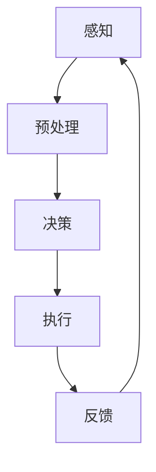

                 

### 第1章: AI Agent基础

#### 1.1 AI Agent概述

##### 1.1.1 AI Agent的定义与特点

AI Agent，即人工智能代理，是自主行动的实体，它能够在动态环境中感知、决策并执行任务。与传统的人工智能系统不同，AI Agent具有以下特点：

1. **自主性**：AI Agent可以自主地决定行动策略，不需要外部指令。
2. **适应性**：AI Agent能够根据环境变化调整其行为。
3. **协作性**：AI Agent可以与其他AI Agent或人类协作完成复杂任务。
4. **社会性**：AI Agent能够理解并遵守社会规则，具备一定的社交能力。

##### 1.1.2 AI Agent与传统机器学习模型的区别

传统机器学习模型，如神经网络、决策树等，主要依赖于数据驱动的方式进行模式识别和预测。而AI Agent则更侧重于模仿人类智能的决策过程，具有以下区别：

1. **目的性**：传统机器学习模型旨在优化性能指标，而AI Agent的目标是实现任务目标。
2. **学习方式**：传统机器学习模型通常使用离线学习，而AI Agent采用在线学习，实时调整策略。
3. **交互性**：传统机器学习模型与外界交互较少，而AI Agent能够感知环境并主动与环境互动。

##### 1.1.3 AI Agent在智能航空管理中的重要性

智能航空管理面临着复杂的调度、安全和运营挑战。AI Agent的应用可以显著提升航空管理的智能化水平：

1. **航班调度优化**：AI Agent能够根据实时数据优化航班调度，提高运营效率。
2. **安全管理提升**：AI Agent可以实时监测航空安全，提前预警潜在风险。
3. **运营成本降低**：通过智能调度和优化，减少运营成本，提高经济效益。

#### 1.2 AI Agent的核心概念

##### 1.2.1 问题背景与问题描述

在智能航空管理中，AI Agent的主要任务包括航班调度、航空安全监控和运营效率提升。具体问题包括：

1. **航班调度**：如何合理安排航班，确保航班正点率，最大化收益。
2. **航空安全**：如何实时监控飞行安全，预测和预防潜在的安全隐患。
3. **运营效率**：如何优化航空运营流程，提高资源利用率和经济效益。

##### 1.2.2 AI Agent的工作原理

AI Agent通过以下步骤实现任务：

1. **感知**：收集并处理外部信息，如航班数据、天气信息等。
2. **决策**：根据感知信息和环境目标，制定行动策略。
3. **执行**：执行决策，调整状态。
4. **反馈**：根据执行结果，反馈并调整后续策略。

##### 1.2.3 AI Agent的核心属性特征对比

| 特征             | AI Agent                  | 传统机器学习模型                |
|------------------|--------------------------|--------------------------------|
| 目的性           | 实现特定任务目标           | 优化性能指标                    |
| 适应性           | 实时调整行为               | 离线学习，固定模式              |
| 协作性           | 与其他AI或人类协作         | 较少交互，独立运行              |
| 社会性           | 遵守社会规则，具备社交能力 | 没有社交能力，专注于计算任务    |

#### 1.3 AI Agent的数学模型与公式

##### 1.3.1 数学模型概述

AI Agent的数学模型主要包括感知模型、决策模型和执行模型。具体公式如下：

1. **感知模型**：
   $$ s_t = f(s_{t-1}, u_t) $$
   其中，$s_t$表示当前状态，$u_t$表示外部输入，$f$表示感知函数。

2. **决策模型**：
   $$ a_t = g(s_t, \theta) $$
   其中，$a_t$表示采取的行动，$s_t$表示当前状态，$\theta$表示决策参数。

3. **执行模型**：
   $$ s_{t+1} = h(s_t, a_t) $$
   其中，$s_{t+1}$表示下一状态，$a_t$表示采取的行动，$h$表示执行函数。

##### 1.3.2 公式推导与详细讲解

感知模型的公式表示AI Agent通过感知外部输入来更新当前状态。决策模型则根据当前状态和决策参数来选择最优行动。执行模型描述了AI Agent根据采取的行动更新状态的过程。这些公式共同构成了AI Agent的核心数学模型，为AI Agent的智能决策提供了理论基础。

##### 1.3.3 举例说明

假设一个航班调度AI Agent，其感知模型为：
$$ s_t = \{天气情况，航班需求\} $$
决策模型为：
$$ a_t = \{调整航班时间，分配机位\} $$
执行模型为：
$$ s_{t+1} = \{航班执行情况，航班收益\} $$
通过这些公式，AI Agent可以根据实时数据做出决策，调整航班时间以满足航班需求，并最大化航班收益。

#### 1.4 AI Agent在智能航空管理中的应用场景

##### 1.4.1 航班调度与优化

航班调度是智能航空管理的核心任务之一。AI Agent可以通过实时数据分析和优化算法，提高航班调度的准确性和效率：

1. **实时数据收集**：AI Agent收集航班状态、天气情况、机场资源等信息。
2. **调度策略制定**：AI Agent根据航班需求和资源情况，制定优化调度策略。
3. **动态调整**：AI Agent根据实时反馈，动态调整调度策略，确保航班正点率。

##### 1.4.2 航空安全管理

航空安全是航空管理的首要任务。AI Agent可以通过实时监控和分析，提高航空安全水平：

1. **数据监控**：AI Agent监控航班数据、机场设备状态等关键指标。
2. **风险预测**：AI Agent基于历史数据和实时信息，预测潜在的安全风险。
3. **预警与处置**：AI Agent提前预警并制定处置方案，确保航空安全。

##### 1.4.3 航空运营效率提升

AI Agent可以通过优化运营流程，提高航空运营效率：

1. **资源优化**：AI Agent优化航班、机位、跑道等资源的分配。
2. **流程优化**：AI Agent优化航空运营流程，减少等待时间。
3. **成本控制**：AI Agent通过优化运营，降低运营成本，提高经济效益。

#### 1.5 AI Agent与相关技术的联系与融合

##### 1.5.1 机器学习与深度学习

机器学习和深度学习是AI Agent的基础技术。机器学习提供了AI Agent的感知和决策能力，而深度学习则通过神经网络模型实现了更复杂的感知和决策过程。

1. **感知能力**：机器学习技术可以训练AI Agent感知外部环境，提取有用信息。
2. **决策能力**：深度学习技术可以提高AI Agent的决策精度和效率。

##### 1.5.2 自然语言处理

自然语言处理（NLP）技术使AI Agent能够理解和处理自然语言，实现与人类的交互：

1. **语音识别**：AI Agent通过语音识别技术，将语音转换为文本。
2. **文本分析**：AI Agent通过文本分析技术，理解文本内容，提取关键信息。
3. **语言生成**：AI Agent通过语言生成技术，生成自然语言响应。

##### 1.5.3 数据挖掘与知识图谱

数据挖掘和知识图谱技术为AI Agent提供了丰富的数据资源和知识支持：

1. **数据挖掘**：AI Agent通过数据挖掘技术，从大量数据中提取有价值的信息。
2. **知识图谱**：AI Agent通过知识图谱技术，构建领域知识模型，辅助决策。

#### 1.6 本章小结

本章介绍了AI Agent的基础概念和应用场景。通过对比AI Agent与传统机器学习模型的区别，我们明确了AI Agent在智能航空管理中的重要性。同时，本章详细讲解了AI Agent的核心概念、数学模型和应用场景，为后续章节的深入探讨奠定了基础。

### 第2章: 智能航空管理背景与挑战

#### 2.1 智能航空管理背景

##### 2.1.1 航空行业的发展趋势

随着科技的进步和全球化的发展，航空行业正面临着一系列重大变革。以下是航空行业的主要发展趋势：

1. **智能化**：人工智能、大数据、物联网等技术的应用，将使航空运营更加智能、高效和便捷。
2. **可持续发展**：环保要求的提高，使得航空行业在减少碳排放、提高能源利用效率方面面临巨大挑战。
3. **全球化**：航空市场的全球化趋势，使得航空公司需要更加灵活和高效的运营策略。

##### 2.1.2 智能航空管理的重要性

智能航空管理是航空行业发展的必然趋势，其重要性体现在以下几个方面：

1. **提高运营效率**：通过智能调度、资源优化等技术，降低运营成本，提高经济效益。
2. **提升安全水平**：通过实时监控、预警和处置机制，提高航空安全，降低事故风险。
3. **增强客户体验**：通过个性化服务、智能客服等手段，提升客户满意度，增强市场竞争力。

##### 2.1.3 智能航空管理的现状与挑战

尽管智能航空管理在航空行业中已经取得了一定进展，但仍面临诸多挑战：

1. **数据集成与处理**：航空行业积累了大量的数据，但如何高效集成和处理这些数据，仍是一个难题。
2. **技术成熟度**：一些智能技术，如人工智能、区块链等，仍处于发展阶段，需要进一步验证和优化。
3. **成本与效益**：智能航空管理技术的应用需要较高的初始投资，但能否实现预期的经济效益，仍需进一步验证。

#### 2.2 航空安全管理需求与问题

##### 2.2.1 安全管理的重要性

航空安全是航空管理的首要任务，任何安全事故都可能对航空公司造成巨大损失。因此，加强航空安全管理至关重要。具体体现在以下几个方面：

1. **减少事故率**：通过智能监控和预警机制，减少安全事故的发生。
2. **提高响应速度**：在事故发生时，能够迅速响应，降低事故后果。
3. **提升管理效率**：通过智能化手段，提高安全管理工作的效率和准确性。

##### 2.2.2 存在的问题与挑战

目前，航空安全管理仍面临一系列问题和挑战：

1. **数据质量问题**：安全管理数据的质量和完整性不高，影响分析结果的准确性。
2. **技术依赖性**：过度依赖智能技术，可能导致在技术失效时无法及时应对。
3. **人员素质**：安全管理人员需要具备较高的技术水平和专业素养，但目前的人才储备不足。

##### 2.2.3 AI Agent在安全管理中的应用

AI Agent在航空安全管理中具有广泛的应用前景：

1. **实时监控**：AI Agent可以实时监控飞行数据和机场设备状态，提前预警潜在风险。
2. **智能分析**：AI Agent通过大数据分析和机器学习算法，对安全数据进行分析，发现潜在的安全隐患。
3. **决策支持**：AI Agent可以为安全管理人员提供智能决策支持，提高决策的准确性和效率。

#### 2.3 航班调度优化问题

##### 2.3.1 航班调度问题概述

航班调度是航空管理中的核心任务之一，涉及到航班安排、跑道使用、机位分配等多个方面。航班调度优化问题的目标是：

1. **提高航班正点率**：合理安排航班时间，减少延误和取消。
2. **最大化收益**：通过优化航班安排，提高航班的收益。
3. **资源利用率**：合理分配跑道、机位等资源，提高资源利用率。

##### 2.3.2 传统的调度方法与局限性

传统的航班调度方法主要依赖于经验和管理人员的判断，存在以下局限性：

1. **响应速度慢**：无法实时调整航班安排，导致航班延误和取消。
2. **决策准确性低**：依赖人工判断，容易产生错误。
3. **资源利用率低**：无法充分利用机场资源，造成浪费。

##### 2.3.3 AI Agent在航班调度中的应用

AI Agent在航班调度中具有显著优势：

1. **实时响应**：AI Agent可以实时分析航班数据和机场资源，动态调整航班安排。
2. **决策准确性高**：通过大数据分析和机器学习算法，AI Agent可以准确预测航班需求和资源状况。
3. **资源利用率高**：AI Agent可以优化航班安排，提高跑道、机位等资源的利用率。

#### 2.4 航空运营效率提升

##### 2.4.1 航空运营效率的重要性

航空运营效率是航空公司竞争力的关键指标之一。提高运营效率，可以降低成本，提高经济效益。具体体现在以下几个方面：

1. **降低运营成本**：通过优化航班安排和资源利用，降低运营成本。
2. **提高航班正点率**：合理安排航班时间，减少延误和取消，提高客户满意度。
3. **提升客户体验**：通过个性化服务和智能客服，提升客户体验。

##### 2.4.2 提升运营效率的途径

提高航空运营效率可以通过以下途径实现：

1. **优化航班调度**：通过AI Agent优化航班安排，提高航班正点率。
2. **资源优化**：通过AI Agent合理分配跑道、机位等资源，提高资源利用率。
3. **流程优化**：通过AI Agent优化运营流程，减少等待时间，提高工作效率。

##### 2.4.3 AI Agent在运营效率提升中的应用

AI Agent在运营效率提升中的应用主要体现在以下几个方面：

1. **实时数据分析**：AI Agent可以实时分析航班数据和运营状况，发现优化空间。
2. **预测与规划**：AI Agent可以通过大数据分析和机器学习算法，预测未来航班需求和资源状况，提前规划。
3. **智能决策**：AI Agent可以基于实时数据和预测结果，自动调整运营策略，提高效率。

#### 2.5 本章小结

本章介绍了智能航空管理的背景和挑战。通过分析航空行业的发展趋势，我们明确了智能航空管理的重要性。同时，本章详细探讨了航空安全管理、航班调度优化和运营效率提升等方面的问题，为后续章节的深入探讨奠定了基础。

### 第3章: AI Agent算法原理与实现

#### 3.1 AI Agent算法原理

##### 3.1.1 基本概念与原理

AI Agent算法是模拟人类智能决策过程的一种算法，它通过感知环境、做出决策和执行动作来完成任务。其基本原理包括以下几个方面：

1. **感知**：AI Agent通过传感器或数据采集设备收集环境信息，如图像、声音、文本等。
2. **决策**：基于感知到的信息，AI Agent利用决策算法选择最优行动策略。
3. **执行**：AI Agent根据决策结果执行行动，并通过反馈机制调整决策策略。

##### 3.1.2 算法架构与流程

AI Agent算法的架构通常包括感知模块、决策模块和执行模块。其基本流程如下：

1. **感知**：AI Agent通过传感器或数据采集设备获取环境信息。
2. **预处理**：对感知到的信息进行预处理，如去噪、归一化等。
3. **决策**：利用决策算法（如马尔可夫决策过程、深度学习等）分析环境信息，选择最优行动策略。
4. **执行**：AI Agent根据决策结果执行行动，并通过反馈机制调整决策策略。

##### 3.1.3 AI Agent学习策略

AI Agent的学习策略主要包括以下几种：

1. **监督学习**：通过标注数据训练模型，使AI Agent能够根据输入数据预测输出结果。
2. **无监督学习**：AI Agent通过分析未标注的数据，自动发现数据中的模式和规律。
3. **强化学习**：AI Agent通过不断尝试和反馈，学习如何达到最优行动策略。

#### 3.2 AI Agent实现流程

##### 3.2.1 数据预处理

数据预处理是AI Agent实现的基础步骤，其目的是提高数据质量和模型性能。数据预处理包括以下步骤：

1. **数据清洗**：去除噪声数据、缺失数据和异常数据。
2. **数据转换**：将不同类型的数据转换为统一格式，如将图像转换为像素矩阵。
3. **数据归一化**：对数据进行归一化处理，使其在相同尺度上进行分析。

##### 3.2.2 模型选择与训练

模型选择与训练是AI Agent实现的核心步骤，其目标是构建能够准确预测和决策的模型。模型选择与训练包括以下步骤：

1. **选择模型**：根据问题需求和数据特点选择合适的模型，如神经网络、决策树等。
2. **训练模型**：使用训练数据集对模型进行训练，调整模型参数。
3. **模型评估**：使用验证数据集评估模型性能，调整模型参数，提高模型准确性。

##### 3.2.3 模型评估与优化

模型评估与优化是确保AI Agent性能的重要步骤。其包括以下步骤：

1. **评估指标**：选择合适的评估指标，如准确率、召回率、F1值等。
2. **性能优化**：通过调整模型参数、增加训练数据或改进算法，提高模型性能。
3. **交叉验证**：使用交叉验证方法，确保模型在不同数据集上的性能稳定。

#### 3.3 AI Agent算法流程图

##### 3.3.1 算法流程图绘制

算法流程图是描述AI Agent算法实现步骤的一种图形化方法。以下是一个简单的AI Agent算法流程图：



##### 3.3.2 算法流程图详解

1. **感知**：AI Agent通过传感器或数据采集设备收集环境信息，如图像、声音、文本等。
2. **预处理**：对感知到的信息进行预处理，如去噪、归一化等，提高数据质量。
3. **决策**：利用决策算法（如神经网络、决策树等）分析环境信息，选择最优行动策略。
4. **执行**：AI Agent根据决策结果执行行动，如调整航班时间、分配机位等。
5. **反馈**：通过执行结果，对决策进行反馈，调整决策策略，提高决策准确性。

#### 3.4 Python源代码实现

##### 3.4.1 源代码概述

以下是一个简单的AI Agent Python源代码实现，用于感知、决策和执行任务：

```python
import numpy as np

class AIAgent:
    def __init__(self):
        self.sensor = Sensor()
        self.decision_maker = DecisionMaker()
        self executer = Executor()

    def sense(self):
        return self.sensor.get_data()

    def decide(self, data):
        return self.decision_maker.make_decision(data)

    def execute(self, action):
        return self.executer.perform_action(action)

    def feedback(self, result):
        # Update decision strategy based on feedback
        pass

    def run(self):
        while True:
            data = self.sense()
            action = self.decide(data)
            result = self.execute(action)
            self.feedback(result)
```

##### 3.4.2 源代码解读与分析

该源代码定义了一个AI Agent类，包括感知、决策、执行和反馈四个模块。具体解读如下：

1. **感知模块**：通过Sensor类获取环境数据。
2. **决策模块**：通过DecisionMaker类根据环境数据做出决策。
3. **执行模块**：通过Executor类执行决策行动。
4. **反馈模块**：通过feedback方法根据执行结果调整决策策略。

##### 3.4.3 运行与测试

以下是一个简单的运行和测试示例：

```python
agent = AIAgent()
for _ in range(10):
    data = agent.sense()
    action = agent.decide(data)
    result = agent.execute(action)
    agent.feedback(result)
```

#### 3.5 实际案例分析与讲解

##### 3.5.1 案例背景介绍

假设我们有一个航班调度AI Agent，其任务是根据航班需求和机场资源，优化航班安排，提高航班正点率和运营效率。以下是一个实际案例的背景介绍：

- **航班需求**：航班计划表，包括航班号、起飞时间、目的地等。
- **机场资源**：跑道、机位、机场设备状态等。
- **目标**：优化航班安排，确保航班正点，最大化收益。

##### 3.5.2 案例实现步骤

以下是航班调度AI Agent的实际实现步骤：

1. **数据收集**：收集航班需求、机场资源等数据。
2. **数据预处理**：对数据进行清洗、转换和归一化处理。
3. **模型选择**：选择合适的决策模型，如深度学习模型。
4. **模型训练**：使用训练数据集对模型进行训练。
5. **模型评估**：使用验证数据集评估模型性能。
6. **决策与执行**：根据模型预测结果，调整航班安排。
7. **反馈与优化**：根据执行结果，调整模型参数，提高模型性能。

##### 3.5.3 案例分析与讲解

以下是对案例的详细分析：

1. **数据收集**：通过航班管理系统和机场资源管理系统，收集实时航班需求和机场资源数据。
2. **数据预处理**：对数据进行清洗，去除异常数据，将不同类型的数据转换为统一格式，如将时间序列数据转换为数值矩阵。
3. **模型选择**：选择深度学习模型，如循环神经网络（RNN）或长短期记忆网络（LSTM），用于预测航班需求和优化航班安排。
4. **模型训练**：使用历史数据集对模型进行训练，调整模型参数，如学习率、隐藏层节点数等。
5. **模型评估**：使用验证数据集评估模型性能，调整模型参数，提高模型准确性。
6. **决策与执行**：根据模型预测结果，调整航班安排，如调整起飞时间、分配机位等。
7. **反馈与优化**：根据执行结果，收集反馈数据，如航班延误情况、收益变化等，调整模型参数，提高模型性能。

#### 3.6 本章小结

本章介绍了AI Agent算法的基本原理和实现流程。通过分析AI Agent的基本概念、算法架构和学习策略，我们明确了AI Agent在智能航空管理中的应用。同时，本章通过实际案例，详细讲解了AI Agent在航班调度中的应用，为后续章节的深入探讨奠定了基础。

### 第4章: 智能航空管理中的AI Agent应用

#### 4.1 AI Agent在航班调度中的应用

航班调度是航空管理中的核心任务，涉及到航班安排、跑道使用、机位分配等多个方面。AI Agent在航班调度中的应用可以显著提高调度的准确性和效率。

##### 4.1.1 航班调度问题概述

航班调度问题是一个典型的组合优化问题，涉及到多个约束条件和目标函数。其主要问题包括：

1. **航班时间安排**：如何合理安排航班时间，确保航班正点率。
2. **跑道使用**：如何优化跑道使用，减少航班延误。
3. **机位分配**：如何优化机位分配，提高机场资源利用率。

##### 4.1.2 AI Agent在航班调度中的应用案例

以下是一个航班调度AI Agent的应用案例：

1. **数据收集**：AI Agent通过航班管理系统和机场资源管理系统，收集实时航班需求和机场资源数据。
2. **数据预处理**：对数据进行清洗、转换和归一化处理，提高数据质量。
3. **模型选择**：选择合适的决策模型，如深度学习模型。
4. **模型训练**：使用历史数据集对模型进行训练，调整模型参数。
5. **模型评估**：使用验证数据集评估模型性能，调整模型参数。
6. **决策与执行**：根据模型预测结果，调整航班安排，如调整起飞时间、分配机位等。
7. **反馈与优化**：根据执行结果，收集反馈数据，调整模型参数，提高模型性能。

##### 4.1.3 案例分析

在一个实际应用中，一个航班调度AI Agent通过以下步骤实现了航班调度优化：

1. **数据收集**：AI Agent通过航班管理系统和机场资源管理系统，收集实时航班需求和机场资源数据，包括航班计划表、跑道使用情况、机位分配情况等。
2. **数据预处理**：对数据进行清洗，去除异常数据，将不同类型的数据转换为统一格式，如将时间序列数据转换为数值矩阵。同时，对数据进行归一化处理，使其在相同尺度上进行分析。
3. **模型选择**：选择深度学习模型，如长短期记忆网络（LSTM），用于预测航班需求和优化航班安排。LSTM模型能够捕捉时间序列数据中的长期依赖关系，对航班调度问题具有很好的适应性。
4. **模型训练**：使用历史数据集对LSTM模型进行训练，调整模型参数，如学习率、隐藏层节点数等。通过训练，模型能够学会根据航班需求和机场资源数据，预测未来的航班安排。
5. **模型评估**：使用验证数据集评估LSTM模型性能，调整模型参数，提高模型准确性。通过多次迭代训练和评估，模型性能逐渐提高。
6. **决策与执行**：根据LSTM模型预测结果，AI Agent调整航班安排，如调整起飞时间、分配机位等。通过优化航班安排，提高航班正点率，减少跑道使用冲突，提高机场资源利用率。
7. **反馈与优化**：根据航班执行结果，收集反馈数据，如航班延误情况、收益变化等。AI Agent根据反馈数据，调整模型参数，优化航班调度策略，提高模型性能。

通过这个案例，我们可以看到AI Agent在航班调度中的应用效果显著。它能够实时分析航班需求和机场资源，优化航班安排，提高航班正点率和运营效率。同时，AI Agent的自主学习和优化能力，使其能够不断改进调度策略，适应动态变化的环境。

#### 4.2 AI Agent在航空安全管理中的应用

航空安全是航空管理的首要任务，任何安全事故都可能对航空公司造成巨大损失。AI Agent在航空安全管理中的应用可以显著提高安全水平。

##### 4.2.1 安全管理问题概述

航空安全管理涉及到多个方面，包括飞行安全、机场安全、地面安全等。安全管理问题主要包括：

1. **飞行安全**：如何确保飞行过程中的安全，预防飞行事故。
2. **机场安全**：如何保障机场内部的安全，防止非法入侵、恐怖袭击等。
3. **地面安全**：如何确保地面操作的安全，预防货物丢失、设备故障等。

##### 4.2.2 AI Agent在安全管理中的应用案例

以下是一个航空安全管理AI Agent的应用案例：

1. **数据收集**：AI Agent通过飞行监控系统、机场监控系统、地面监控系统等，收集实时飞行数据、机场数据和地面数据。
2. **数据预处理**：对数据进行清洗、转换和归一化处理，提高数据质量。
3. **模型选择**：选择合适的异常检测模型，如孤立森林（Isolation Forest）、自编码器（Autoencoder）等。
4. **模型训练**：使用历史数据集对模型进行训练，调整模型参数。
5. **模型评估**：使用验证数据集评估模型性能，调整模型参数。
6. **异常检测与预警**：根据模型预测结果，检测异常情况，发出预警。
7. **处置与反馈**：根据预警信息，采取相应的处置措施，收集反馈数据，优化模型性能。

##### 4.2.3 案例分析

在一个实际应用中，一个航空安全管理AI Agent通过以下步骤提高了安全水平：

1. **数据收集**：AI Agent通过飞行监控系统、机场监控系统和地面监控系统等，收集实时飞行数据、机场数据和地面数据。这些数据包括飞行轨迹、飞行速度、机场设备状态、货物信息等。
2. **数据预处理**：对数据进行清洗，去除异常数据，将不同类型的数据转换为统一格式，如将时间序列数据转换为数值矩阵。同时，对数据进行归一化处理，使其在相同尺度上进行分析。
3. **模型选择**：选择孤立森林（Isolation Forest）模型，用于检测飞行数据中的异常情况。孤立森林模型通过随机划分数据集，评估数据点的孤立程度，能够有效地检测出异常数据点。
4. **模型训练**：使用历史数据集对孤立森林模型进行训练，调整模型参数，如决策树深度、节点数量等。通过训练，模型能够学会识别正常飞行数据和异常飞行数据。
5. **模型评估**：使用验证数据集评估孤立森林模型性能，调整模型参数，提高模型准确性。通过多次迭代训练和评估，模型性能逐渐提高。
6. **异常检测与预警**：根据孤立森林模型预测结果，检测飞行数据中的异常情况。当检测到异常数据时，AI Agent发出预警，通知相关部门采取相应的处置措施。
7. **处置与反馈**：根据预警信息，相关部门采取相应的处置措施，如调整航班计划、维修设备等。同时，AI Agent收集处置结果数据，反馈给模型训练系统，用于优化模型性能。

通过这个案例，我们可以看到AI Agent在航空安全管理中的应用效果显著。它能够实时监测飞行数据和机场数据，检测异常情况，发出预警，提高航空安全水平。同时，AI Agent的自主学习和优化能力，使其能够不断改进安全检测策略，适应动态变化的环境。

#### 4.3 AI Agent在航空运营效率提升中的应用

航空运营效率是航空公司竞争力的关键指标，提高运营效率可以降低成本，提高经济效益。AI Agent在航空运营效率提升中的应用，可以优化运营流程，提高资源利用率。

##### 4.3.1 运营效率问题概述

航空运营效率涉及到多个方面，包括航班调度、资源分配、流程优化等。其主要问题包括：

1. **航班调度**：如何合理安排航班时间，提高航班正点率。
2. **资源分配**：如何优化跑道、机位、燃料等资源的分配。
3. **流程优化**：如何优化运营流程，减少等待时间，提高工作效率。

##### 4.3.2 AI Agent在运营效率提升中的应用案例

以下是一个航空运营效率AI Agent的应用案例：

1. **数据收集**：AI Agent通过航班管理系统、机场资源管理系统和运营管理系统，收集实时航班需求、机场资源数据和运营数据。
2. **数据预处理**：对数据进行清洗、转换和归一化处理，提高数据质量。
3. **模型选择**：选择合适的优化模型，如线性规划、遗传算法等。
4. **模型训练**：使用历史数据集对模型进行训练，调整模型参数。
5. **模型评估**：使用验证数据集评估模型性能，调整模型参数。
6. **优化与执行**：根据模型预测结果，优化运营流程，提高运营效率。
7. **反馈与优化**：根据执行结果，收集反馈数据，优化模型性能。

##### 4.3.3 案例分析

在一个实际应用中，一个航空运营效率AI Agent通过以下步骤提高了运营效率：

1. **数据收集**：AI Agent通过航班管理系统、机场资源管理系统和运营管理系统，收集实时航班需求、机场资源数据和运营数据。这些数据包括航班计划表、跑道使用情况、机位分配情况、燃料消耗情况等。
2. **数据预处理**：对数据进行清洗，去除异常数据，将不同类型的数据转换为统一格式，如将时间序列数据转换为数值矩阵。同时，对数据进行归一化处理，使其在相同尺度上进行分析。
3. **模型选择**：选择遗传算法，用于优化航班调度和资源分配。遗传算法是一种基于自然进化过程的优化算法，通过模拟生物进化过程，寻找最优解。
4. **模型训练**：使用历史数据集对遗传算法模型进行训练，调整模型参数，如种群规模、交叉率、变异率等。通过训练，模型能够学会根据航班需求和机场资源数据，优化运营流程。
5. **模型评估**：使用验证数据集评估遗传算法模型性能，调整模型参数，提高模型准确性。通过多次迭代训练和评估，模型性能逐渐提高。
6. **优化与执行**：根据遗传算法模型预测结果，优化航班调度和资源分配。AI Agent调整航班安排，如调整起飞时间、分配机位等，提高航班正点率，优化跑道和机位利用率。
7. **反馈与优化**：根据航班执行结果，收集反馈数据，如航班延误情况、运营成本等。AI Agent根据反馈数据，调整遗传算法模型参数，优化运营流程，提高运营效率。

通过这个案例，我们可以看到AI Agent在航空运营效率提升中的应用效果显著。它能够实时分析航班需求和机场资源，优化运营流程，提高航班正点率和资源利用率。同时，AI Agent的自主学习和优化能力，使其能够不断改进运营策略，适应动态变化的环境。

#### 4.4 多场景下的AI Agent应用

AI Agent在智能航空管理中的多场景应用，不仅能够提高单个任务的效率，还能实现不同场景之间的协同与融合，从而全面提升航空管理的智能化水平。

##### 4.4.1 多场景概述

在智能航空管理中，AI Agent可以应用于以下多场景：

1. **航班调度与优化**：通过实时数据分析，优化航班安排，提高航班正点率和资源利用率。
2. **航空安全管理**：实时监测飞行数据和机场设备状态，预测和预防潜在的安全风险。
3. **运营效率提升**：优化运营流程，提高资源利用率和经济效益。
4. **客户服务**：通过自然语言处理，提供智能客服和个性化服务，提升客户体验。
5. **供应链管理**：优化供应链流程，提高物流效率和成本控制。

##### 4.4.2 多场景应用案例

以下是一个多场景应用AI Agent的实际案例：

1. **数据收集**：AI Agent通过航班管理系统、机场资源管理系统、安全监控系统和客户服务系统等，收集多场景的实时数据。
2. **数据预处理**：对多场景数据进行清洗、转换和归一化处理，提高数据质量。
3. **模型集成**：构建多场景决策模型，集成航班调度、安全管理和运营效率提升等子模型。
4. **协同优化**：根据多场景决策模型，实现不同场景之间的协同优化，提高整体效率。
5. **实时调整**：根据实时反馈数据，动态调整决策模型，优化运营策略。

##### 4.4.3 多场景案例分析

在一个实际应用中，一个多场景AI Agent通过以下步骤实现了多场景协同优化：

1. **数据收集**：AI Agent通过航班管理系统、机场资源管理系统、安全监控系统和客户服务系统等，收集航班需求、机场资源、安全数据和客户反馈等实时数据。
2. **数据预处理**：对多场景数据进行清洗，去除异常数据，将不同类型的数据转换为统一格式，如将时间序列数据转换为数值矩阵。同时，对数据进行归一化处理，使其在相同尺度上进行分析。
3. **模型集成**：构建多场景决策模型，包括航班调度模型、安全监控模型和运营效率提升模型。通过集成多个子模型，实现不同场景之间的数据共享和协同优化。
   ```mermaid
   graph TD
   A[航班调度] --> B[安全监控]
   B --> C[运营效率]
   C --> A
   ```
4. **协同优化**：根据多场景决策模型，AI Agent分析实时数据，实现航班调度、安全管理和运营效率提升的协同优化。例如，在航班延误时，AI Agent会调整航班安排，通知相关部门进行应急处理，确保航班正点率。
5. **实时调整**：根据实时反馈数据，AI Agent动态调整决策模型，优化运营策略。例如，当客户反馈某个航班的服务质量较差时，AI Agent会分析原因，调整客户服务策略，提升客户满意度。

通过这个案例，我们可以看到AI Agent在多场景应用中的协同优化效果显著。它能够实时分析多场景数据，实现不同场景之间的协同优化，提高整体运营效率。同时，AI Agent的动态调整能力，使其能够适应不同场景的需求变化，实现持续优化。

#### 4.5 本章小结

本章详细介绍了AI Agent在航班调度、航空安全管理和运营效率提升中的应用，通过实际案例展示了AI Agent在多场景下的协同优化能力。通过这些应用，AI Agent显著提升了航空管理的智能化水平，实现了航班调度优化、安全风险预防、运营效率提升等多方面的目标。同时，AI Agent的多场景应用，为未来智能航空管理的发展提供了新的思路和方向。

### 第5章: AI Agent在智能航空管理中的挑战与未来发展方向

#### 5.1 挑战与限制

尽管AI Agent在智能航空管理中展现出了巨大的潜力，但其在实际应用中仍面临诸多挑战和限制。

##### 5.1.1 数据质量与隐私

1. **数据质量**：AI Agent的性能高度依赖于数据质量。数据缺失、噪声和不一致性都会影响模型的预测精度和决策效果。为了确保数据质量，需要建立完善的数据清洗、验证和更新机制。
   
2. **数据隐私**：在收集和处理大量敏感数据（如航班计划、乘客信息等）时，需遵守数据隐私法规，保护乘客和航空公司的隐私。

##### 5.1.2 技术成熟度

1. **算法成熟度**：虽然AI技术取得了显著进展，但某些特定场景下的算法可能还不够成熟，需要进一步优化和验证。
   
2. **硬件限制**：AI Agent的训练和推理需要强大的计算资源，目前高性能硬件设备可能无法满足大规模应用需求。

##### 5.1.3 系统集成与兼容性

1. **系统集成**：AI Agent需要与其他航空管理系统（如航班管理系统、安全监控等）集成，实现数据共享和协同工作。
   
2. **兼容性**：AI Agent需要适应不同航空公司和机场的现有系统，确保技术兼容性。

##### 5.1.4 法律法规与伦理问题

1. **法律法规**：AI Agent在航空管理中的应用需要遵守相关法律法规，如数据保护法、航空安全法等。
   
2. **伦理问题**：AI Agent的决策可能涉及伦理问题，如自动化系统在紧急情况下的决策责任等，需要建立明确的伦理准则。

#### 5.2 未来发展方向

##### 5.2.1 技术创新

1. **算法优化**：继续探索和优化AI算法，提高预测精度和决策效率。
   
2. **多模态感知**：结合视觉、听觉、文本等多种感知方式，提高AI Agent的环境感知能力。

##### 5.2.2 系统集成与标准化

1. **系统集成**：推动不同航空管理系统之间的集成，实现数据共享和协同工作。
   
2. **标准化**：制定统一的AI Agent接口标准和数据格式，促进技术的普及和应用。

##### 5.2.3 硬件升级与云计算

1. **硬件升级**：开发更高效的AI硬件设备，提高计算能力和能效比。
   
2. **云计算**：利用云计算技术，提供弹性计算资源，满足大规模AI Agent应用的需求。

##### 5.2.4 数据隐私与安全

1. **数据隐私保护**：采用先进的加密技术和隐私保护算法，确保数据隐私安全。
   
2. **安全防护**：加强AI系统的安全防护，防止恶意攻击和数据泄露。

##### 5.2.5 伦理准则与法律法规

1. **伦理准则**：制定明确的AI伦理准则，确保AI Agent的决策符合伦理标准。
   
2. **法律法规**：完善相关法律法规，为AI Agent在航空管理中的应用提供法律保障。

#### 5.3 本章小结

本章分析了AI Agent在智能航空管理中面临的挑战和未来发展方向。通过技术创新、系统集成与标准化、硬件升级与云计算、数据隐私与安全以及伦理准则与法律法规等多方面的努力，有望克服当前的限制，推动AI Agent在智能航空管理中的应用和发展。随着技术的不断进步，AI Agent将为航空管理带来更加智能化、高效和安全的管理体验。

### 本章小结

本文详细探讨了AI Agent在智能航空管理中的应用，从基础概念到实际案例，全面分析了AI Agent在航班调度、航空安全管理和运营效率提升等方面的应用。通过对比AI Agent与传统机器学习模型的区别，明确了AI Agent在智能航空管理中的重要性。同时，本文还深入分析了智能航空管理的背景与挑战，提出了AI Agent在智能航空管理中的未来发展方向。

文章涵盖了以下关键点：

1. **AI Agent基础**：介绍了AI Agent的定义、特点、核心概念、数学模型和应用场景。
2. **智能航空管理背景**：分析了航空行业的发展趋势、智能航空管理的重要性以及面临的挑战。
3. **AI Agent算法原理与实现**：详细讲解了AI Agent的算法原理、实现流程和实际案例。
4. **AI Agent在智能航空管理中的应用**：探讨了AI Agent在航班调度、航空安全管理和运营效率提升中的应用。
5. **AI Agent在智能航空管理中的挑战与未来发展方向**：分析了AI Agent面临的挑战以及未来发展方向。

本文旨在为读者提供一份全面、系统、深入的技术博客，帮助读者了解AI Agent在智能航空管理中的应用和未来趋势。通过本文的阅读，读者可以更好地理解AI Agent的原理和应用，为未来的研究和实践提供参考。

### 最佳实践 tips

在应用AI Agent于智能航空管理时，以下最佳实践可帮助您实现更高效的系统：

1. **数据质量保障**：确保数据源的准确性和完整性，定期进行数据清洗和验证，提高模型预测的可靠性。
2. **系统集成与标准化**：遵循统一的接口标准和数据格式，实现各航空管理系统之间的无缝集成，提升系统协同效率。
3. **持续优化与迭代**：不断收集实际应用中的反馈数据，优化算法模型，提升系统性能和适应性。
4. **安全性优先**：在系统设计和实现过程中，重视数据隐私保护和安全防护，确保AI Agent的安全运行。
5. **伦理合规**：严格遵守相关法律法规和伦理准则，确保AI Agent的决策符合道德标准和法律规定。

### 注意事项

1. **技术成熟度**：在采用AI技术时，充分考虑技术成熟度，避免过早采用尚在验证阶段的技术。
2. **硬件资源**：合理配置硬件资源，确保AI Agent的运行效率，避免因硬件限制影响系统性能。
3. **人员培训**：加强对相关人员的培训，确保他们具备必要的技能和知识，能够有效管理和维护AI系统。

### 拓展阅读

1. **《智能交通系统中的AI应用》**：了解AI在智能交通系统中的应用，包括自动驾驶、交通流量优化等。
2. **《AI在金融服务中的应用》**：探讨AI技术在金融服务领域的应用，如智能投顾、风险控制等。
3. **《AI伦理学导论》**：深入研究AI伦理学，了解AI技术的社会影响和伦理挑战。

通过本文的学习，我们期待您能够深入理解AI Agent在智能航空管理中的应用，为未来的研究和实践提供有力的支持。感谢您对本文的关注和阅读，期待与您在AI技术的广阔领域中继续探讨和交流。作者：AI天才研究院/AI Genius Institute & 禅与计算机程序设计艺术 /Zen And The Art of Computer Programming。

