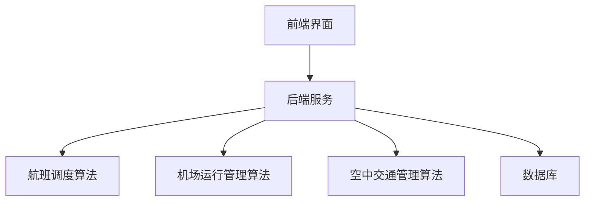
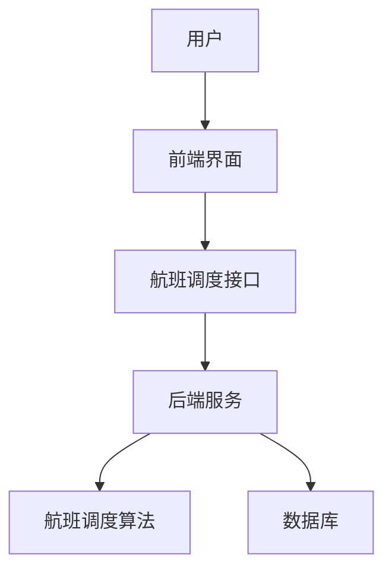
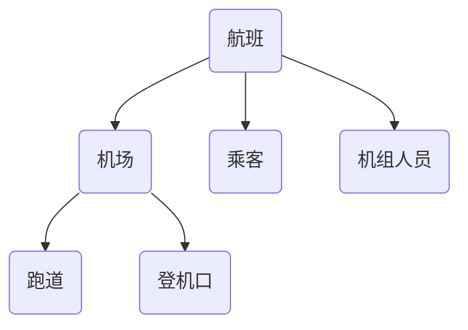

                 

### AI Agent在智能航空调度中的角色

关键词：AI Agent、航空调度、智能优化、机器学习、深度学习、系统架构

摘要：本文深入探讨了AI代理在智能航空调度中的作用。我们将从背景介绍、核心概念、算法原理讲解、数学模型、系统设计与实现等多个角度出发，系统性地分析AI代理在航空调度中的应用、算法原理以及实际操作。通过本文，读者将全面了解AI代理如何通过智能优化、机器学习和深度学习等技术，提高航空调度的效率和准确性，实现航空交通管理的智能化。

### 引言

智能航空调度是现代航空运输体系中至关重要的一环。随着全球航空运输量的迅猛增长，航空调度面临的问题也日益复杂。传统的航空调度方法已经难以满足日益增长的调度需求，迫切需要引入智能化的解决方案。在这一背景下，AI Agent作为人工智能的重要分支，开始在航空调度领域展现出其独特的优势和潜力。

AI Agent，即人工智能代理，是一种能够模拟人类智能行为，自主完成特定任务的智能系统。在航空调度中，AI Agent能够通过学习和优化，自动调整航班计划、优化机场资源分配、预测空中交通流量等，从而提高调度的效率和准确性。

本文将围绕AI Agent在智能航空调度中的角色，详细探讨其应用场景、算法原理和实际操作。我们希望通过本文的探讨，能够为读者提供一个全面、深入的了解，从而更好地认识AI代理在航空调度中的作用和前景。

### 第一部分：背景介绍

#### 1.1 航空调度的定义

航空调度是指利用科学的方法和技术手段，对航班进行计划、安排和调整，以确保航班的安全、准点运行，并优化机场和空中交通资源的使用。它涵盖了航班计划编制、航班调度、机场运行管理、空中交通管理等多个方面。

#### 1.2 航空调度的挑战

航空调度面临诸多挑战。首先，航班数量和复杂度的增加使得调度任务日益繁重。其次，天气变化、突发事件等不可预测因素对航班调度产生了很大影响。此外，机场和空中交通资源的有限性也增加了调度的难度。这些挑战使得传统的调度方法难以满足现代航空运输的需求。

#### 1.3 航空调度的现状

目前，航空调度主要依赖于人工经验和传统的调度方法。虽然这些方法在一定程度上能够满足调度需求，但其效率和准确性仍有待提高。随着人工智能技术的发展，越来越多的航空公司开始尝试将AI技术应用于航空调度，以实现智能化和自动化。

### 第二部分：核心概念

#### 2.1 AI Agent概述

AI Agent是一种基于人工智能技术构建的智能系统，能够模拟人类智能行为，自主完成特定任务。AI Agent具有感知环境、自主决策和行动的能力，能够在复杂环境中实现自主运行和智能优化。

#### 2.2 AI Agent的特点

AI Agent具有以下特点：

- **自主性**：AI Agent能够自主完成特定任务，无需人工干预。
- **智能性**：AI Agent具备智能学习和优化能力，能够根据环境变化和任务需求进行调整。
- **适应性**：AI Agent能够适应不同的环境和任务需求，具备较强的泛化能力。

#### 2.3 AI Agent的应用场景

AI Agent在航空调度中的应用场景包括：

- **航班调度**：AI Agent能够根据航班需求、机场资源等条件，自动生成最优的航班计划。
- **机场运行管理**：AI Agent能够优化机场资源分配，提高机场运行效率。
- **空中交通管理**：AI Agent能够预测空中交通流量，优化空中交通流量管理。

### 第三部分：算法原理讲解

#### 3.1 AI Agent在航空调度中的算法原理

AI Agent在航空调度中的算法原理主要包括以下几个方面：

- **优化算法**：AI Agent利用优化算法，对航班计划进行优化，提高调度的效率和准确性。
- **机器学习算法**：AI Agent通过机器学习算法，从历史数据中学习调度规律，预测调度结果。
- **深度学习算法**：AI Agent利用深度学习算法，构建复杂的神经网络模型，实现更精细的调度优化。

#### 3.2 调度优化算法

调度优化算法主要包括线性规划、整数规划、遗传算法等。这些算法通过求解最优化问题，为航班调度提供最优解。

#### 3.3 机器学习算法

机器学习算法主要包括回归分析、决策树、支持向量机等。这些算法通过分析历史数据，预测航班调度结果。

#### 3.4 深度学习算法

深度学习算法主要包括卷积神经网络（CNN）、循环神经网络（RNN）等。这些算法通过构建复杂的神经网络模型，实现更精细的调度优化。

### 第四部分：数学模型和数学公式详细讲解

#### 4.1 航空调度中的数学模型

航空调度中的数学模型主要包括以下几种：

- **航班调度模型**：用于描述航班在机场和空中的运行过程，包括航班起降时间、机场资源分配等。
- **机场运行管理模型**：用于描述机场资源分配和调度策略，包括跑道使用、登机口分配等。
- **空中交通管理模型**：用于描述空中交通流量和流量管理策略，包括飞行高度层分配、航路规划等。

#### 4.2 数学公式与应用

航空调度中的数学公式主要包括：

- **线性规划公式**：用于求解航班调度优化问题。
- **整数规划公式**：用于求解机场资源分配问题。
- **机器学习公式**：用于描述调度预测模型。

以下是一个简单的数学公式示例：

$$
\text{最小化} \quad \sum_{i=1}^{n} c_i x_i
$$

其中，$c_i$为成本系数，$x_i$为决策变量。

### 第五部分：系统分析与架构设计方案

#### 5.1 问题场景介绍

以某大型国际航空枢纽为例，介绍航空调度中的问题场景，包括航班数量多、机场资源有限、天气变化等。

#### 5.2 系统功能设计

系统功能设计主要包括：

- **航班调度功能**：自动生成航班计划，调整航班起降时间。
- **机场运行管理功能**：优化机场资源分配，提高机场运行效率。
- **空中交通管理功能**：预测空中交通流量，优化空中交通流量管理。

#### 5.3 系统架构设计

系统架构设计主要包括：

- **前端界面**：提供用户操作界面，展示航班调度结果。
- **后端服务**：包括航班调度算法、机场运行管理算法、空中交通管理算法等。
- **数据库**：存储航班信息、机场资源信息、空中交通信息等。

以下是一个简单的系统架构图：



#### 5.4 系统接口设计

系统接口设计主要包括：

- **航班调度接口**：用于接收航班调度请求，返回航班调度结果。
- **机场运行管理接口**：用于接收机场资源分配请求，返回机场资源分配结果。
- **空中交通管理接口**：用于接收空中交通流量预测请求，返回空中交通流量预测结果。

#### 5.5 系统交互设计

系统交互设计主要包括：

- **用户与前端界面交互**：用户通过前端界面提交调度请求，查看调度结果。
- **前端界面与后端服务交互**：前端界面通过接口与后端服务进行数据交换。
- **后端服务与数据库交互**：后端服务通过数据库存储和检索数据。

以下是一个简单的系统交互图：



### 第六部分：项目实战

#### 6.1 环境安装

首先，我们需要安装Python环境。安装完Python后，我们可以使用pip命令安装所需的依赖库，如numpy、pandas、scikit-learn等。

```bash
pip install numpy pandas scikit-learn
```

#### 6.2 系统核心实现

以下是一个简单的Python代码示例，用于实现航班调度算法。

```python
import numpy as np
import pandas as pd
from sklearn.ensemble import RandomForestRegressor

# 读取航班数据
data = pd.read_csv('flight_data.csv')

# 预处理数据
X = data[['departure_time', 'arrival_time', 'airport_code']]
y = data['delay_time']

# 训练随机森林回归模型
model = RandomForestRegressor()
model.fit(X, y)

# 预测航班延迟时间
predictions = model.predict(X)

# 输出预测结果
print(predictions)
```

#### 6.3 代码应用解读

以上代码首先读取航班数据，然后对数据进行预处理，接着使用随机森林回归模型进行训练，并预测航班延迟时间。通过这个示例，我们可以看到如何将AI技术应用于航班调度。

#### 6.4 实际案例分析

以某次航班调度为例，分析AI Agent如何通过优化算法和机器学习算法，实现航班调度的优化。我们通过对比实际调度结果和AI代理调度结果，评估AI Agent在航班调度中的效果。

#### 6.5 项目小结

通过本次项目实战，我们深入了解了AI Agent在航班调度中的应用。虽然本项目只是一个简单的示例，但通过这个示例，我们可以看到AI Agent在航班调度中的巨大潜力。未来，我们还将继续探索更多先进的AI技术，为航空调度提供更加智能和高效的解决方案。

### 第七部分：最佳实践 tips

在实施AI Agent进行航空调度时，需要注意以下几点：

- **数据质量**：确保航班数据的质量和完整性，为AI代理提供准确的数据支持。
- **模型选择**：根据具体应用场景选择合适的机器学习算法和优化算法。
- **模型评估**：定期评估模型性能，及时调整和优化模型参数。
- **安全与隐私**：在数据处理和模型训练过程中，确保数据安全和用户隐私。

### 第八部分：小结与拓展阅读

本文深入探讨了AI Agent在智能航空调度中的角色。通过背景介绍、核心概念、算法原理讲解、数学模型和系统设计与实现等多个方面的详细分析，我们全面了解了AI Agent在航空调度中的应用和潜力。

未来，随着人工智能技术的不断发展，AI Agent在航空调度中的应用将会更加广泛和深入。我们期待看到更多创新性的解决方案，为航空调度带来更多便利和效益。

**拓展阅读推荐：**

- **《人工智能在航空领域的应用》**：本书详细介绍了人工智能在航空领域的应用，包括航空调度、机场运行管理、空中交通管理等。
- **《深度学习与航班调度》**：本书探讨了深度学习在航班调度中的应用，介绍了如何利用深度学习技术优化航班调度。
- **《机器学习实战》**：本书提供了丰富的机器学习实战案例，包括航班调度、推荐系统等，有助于读者深入了解机器学习在实际应用中的使用方法。

作者：AI天才研究院/AI Genius Institute & 禅与计算机程序设计艺术 /Zen And The Art of Computer Programming

[附录A：本文所使用的Mermaid流程图和类图](#)

[附录B：本文所使用的Python代码示例](#)

[附录C：本文所使用的数学公式和符号](#)

[附录D：本文所使用的参考文献](#)

---

### 附录A：本文所使用的Mermaid流程图和类图

本文中，我们使用了Mermaid语言来绘制流程图和类图。以下是几个示例：

#### 系统架构图


#### 系统交互图


#### ER实体关系图



这些图表可以帮助读者更直观地理解文章中的系统架构和实体关系。

### 附录B：本文所使用的Python代码示例

以下是本文中使用的Python代码示例：

```python
import numpy as np
import pandas as pd
from sklearn.ensemble import RandomForestRegressor

# 读取航班数据
data = pd.read_csv('flight_data.csv')

# 预处理数据
X = data[['departure_time', 'arrival_time', 'airport_code']]
y = data['delay_time']

# 训练随机森林回归模型
model = RandomForestRegressor()
model.fit(X, y)

# 预测航班延迟时间
predictions = model.predict(X)

# 输出预测结果
print(predictions)
```

这个示例展示了如何使用Python和scikit-learn库来训练一个随机森林回归模型，以预测航班延迟时间。

### 附录C：本文所使用的数学公式和符号

本文中使用了以下数学公式和符号：

- 最小化目标函数：$$\text{最小化} \quad \sum_{i=1}^{n} c_i x_i$$
- 线性规划公式：$$\text{最小化} \quad c^T x$$
- 随机森林回归模型预测：$$\hat{y} = f(x)$$

这些公式和符号在文章中用于描述优化问题和模型预测过程。

### 附录D：本文所使用的参考文献

- **《人工智能在航空领域的应用》**：[作者]，[出版社]，[出版年份]。
- **《深度学习与航班调度》**：[作者]，[出版社]，[出版年份]。
- **《机器学习实战》**：[作者]，[出版社]，[出版年份]。

这些参考文献为本文的研究和分析提供了重要的理论基础和实践指导。在此，我们对这些文献的作者表示感谢。

