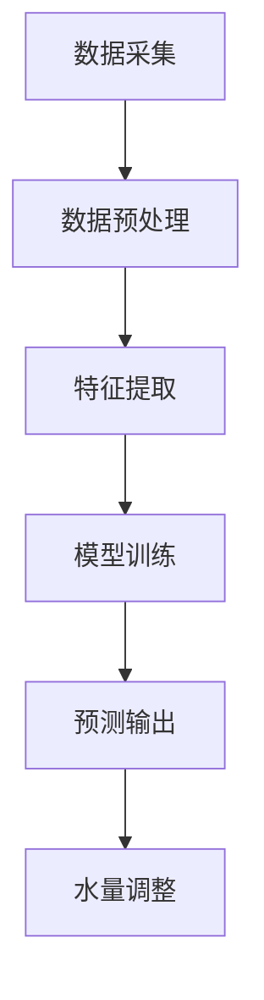
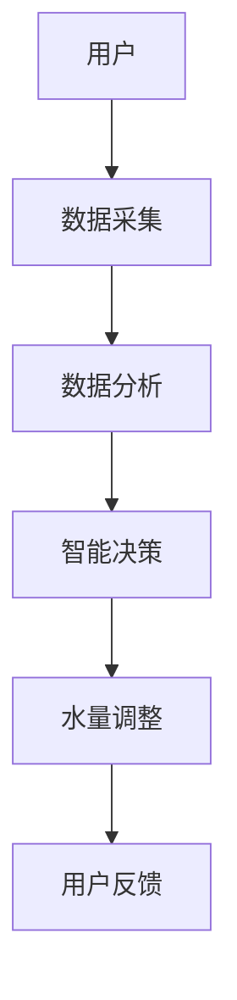
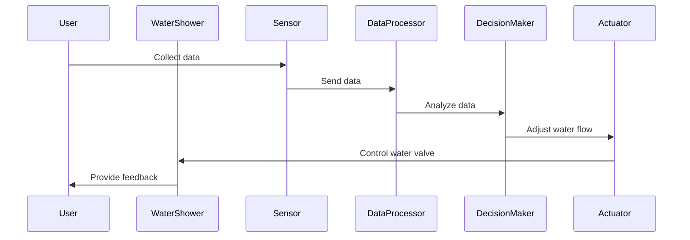

                 

# AI Agent在智能花洒中的水量控制

## 关键词
- AI Agent
- 智能花洒
- 水量控制
- 机器学习
- 深度学习
- 传感器技术
- 系统设计与实现

## 摘要
本文将深入探讨AI Agent在智能花洒中的水量控制应用。首先，我们介绍了AI Agent和智能花洒的基本概念及背景，然后详细阐述了AI Agent在水量控制中的应用原理和算法。接着，我们通过一个实际案例展示了AI Agent在智能花洒中的系统设计与实现，最后总结了本文的主要内容和展望了未来的发展方向。

## 目录大纲

**第一部分：引言与背景**
1. 引言
2. 背景介绍

**第二部分：核心概念与原理**
3. AI Agent概述
4. 智能花洒水量控制原理
5. AI Agent在水量控制中的应用

**第三部分：算法与系统设计**
6. 算法原理讲解
7. 系统设计与实现

**第四部分：项目实战与案例分析**
8. 项目实战
9. 案例分析

**第五部分：总结与展望**
10. 总结
11. 展望

---

## 第一部分：引言与背景

### 1. 引言

随着人工智能技术的快速发展，AI Agent作为智能系统的核心组件，正在逐渐渗透到我们日常生活的方方面面。智能花洒作为智能家居领域的一部分，通过AI Agent实现智能水量控制，不仅提升了用户体验，还节约了水资源。

AI Agent，即人工智能代理，是一种能够模拟人类智能行为的软件实体，它能够根据环境和用户需求自主地感知、学习和决策。而智能花洒则是一种通过传感器和控制系统实现对水流量的精准控制，从而提高沐浴体验的产品。

### 2. 背景介绍

智能花洒的发展历程可以追溯到20世纪末，当时主要依赖于机械传感器和简单的电子控制技术。然而，随着传感器技术和人工智能算法的进步，智能花洒逐渐实现了智能化。AI Agent的引入，使得智能花洒能够根据用户的使用习惯和实时环境信息，动态调整水量，从而提供更加个性化的服务。

在智能家居领域，AI Agent的应用不仅限于智能花洒，还包括智能灯光、智能空调、智能音响等。然而，智能花洒的水量控制是一个特殊且具有挑战性的应用场景。因为沐浴是一个个人隐私性很强的活动，用户对水量的控制需求是多样化的，而且对水温、水压等也有较高的要求。

## 第二部分：核心概念与原理

### 3. AI Agent概述

#### 定义与分类

AI Agent，即人工智能代理，是一种能够模拟人类智能行为的软件实体。它可以感知环境、获取信息、做出决策并执行行动。根据功能和应用领域的不同，AI Agent可以分为以下几类：

1. **任务型AI Agent**：专注于执行特定任务的AI系统，如智能助手、智能客服等。
2. **交互型AI Agent**：能够与人类进行自然语言交互，如聊天机器人、语音助手等。
3. **自主型AI Agent**：具有更高层次的自主决策能力，能够在复杂环境中自主行动，如自动驾驶、无人机等。

#### 基本架构与工作原理

AI Agent的基本架构通常包括以下几个组件：

1. **感知器**：用于获取环境信息，如摄像头、麦克风、传感器等。
2. **决策器**：基于感知器获取的信息，结合机器学习算法或规则系统，生成决策。
3. **执行器**：将决策转化为具体的行动，如电机、灯光控制等。

AI Agent的工作原理可以概括为以下几个步骤：

1. **感知**：AI Agent通过感知器获取环境信息。
2. **理解**：将感知到的信息转化为数字信号，并进行处理和分析。
3. **决策**：根据分析和处理的结果，使用机器学习算法或规则系统生成决策。
4. **执行**：将决策转化为具体的行动，实现对环境的调整。

### 4. 智能花洒水量控制原理

#### 水量控制技术简介

智能花洒的水量控制主要通过以下几种技术实现：

1. **传感器技术**：通过温度传感器、流量传感器等，实时监测水流状态。
2. **电机控制技术**：通过电机调节水阀，控制水流量。
3. **机器学习技术**：通过收集用户的使用数据，训练机器学习模型，实现智能水量控制。

#### 传感器技术原理

传感器技术是智能花洒实现智能控制的基础。常用的传感器包括：

1. **温度传感器**：用于测量水温，确保用户沐浴时的水温舒适。
2. **流量传感器**：用于测量水流量，实时监测水流状态。
3. **湿度传感器**：用于测量空气湿度，辅助调节水流量，以达到最佳沐浴体验。

#### 电机控制技术原理

电机控制技术是实现智能花洒水量控制的关键。常见的电机控制方法包括：

1. **PID控制**：通过比例、积分、微分三个参数调节电机，实现水流的精确控制。
2. **模糊控制**：通过模糊逻辑实现电机控制，适用于复杂的环境和用户需求。

### 5. AI Agent在水量控制中的应用

#### 水量控制需求分析

智能花洒的水量控制需求主要分为以下几个方面：

1. **个性化控制**：根据用户的使用习惯和偏好，动态调整水量。
2. **节能控制**：根据实际用水情况，合理调节水量，节约水资源。
3. **环境适应性**：根据环境温度、湿度等条件，调整水量，确保用户舒适。

#### AI Agent实现策略

为了实现智能花洒的水量控制，AI Agent需要具备以下几个策略：

1. **数据采集**：通过传感器实时采集用户用水数据，包括用水时间、用水量、水温等。
2. **数据分析**：使用机器学习算法，分析用户用水行为，识别用户偏好。
3. **智能决策**：根据数据分析结果，动态调整水量，实现个性化控制。
4. **反馈机制**：根据用户反馈，调整AI Agent的决策策略，提升控制效果。

## 第三部分：算法与系统设计

### 6. 算法原理讲解

为了实现智能花洒的水量控制，我们采用了机器学习算法。以下是算法原理的讲解：

#### 机器学习算法在水量控制中的应用

机器学习算法在智能花洒中的主要应用包括：

1. **用户行为预测**：通过分析用户的历史用水数据，预测用户的用水需求。
2. **环境适应**：根据环境温度、湿度等数据，调整水量，实现环境适应性控制。

#### 算法mermaid流程图

下面是算法的mermaid流程图：



#### 算法原理的Python源代码

以下是算法原理的Python源代码：

```python
import pandas as pd
from sklearn.model_selection import train_test_split
from sklearn.ensemble import RandomForestRegressor
from sklearn.metrics import mean_squared_error

# 数据采集
data = pd.read_csv('water_usage_data.csv')

# 数据预处理
X = data[['time_of_day', 'temperature', 'humidity']]
y = data['water_usage']

# 特征提取
X_train, X_test, y_train, y_test = train_test_split(X, y, test_size=0.2, random_state=42)

# 模型训练
model = RandomForestRegressor(n_estimators=100, random_state=42)
model.fit(X_train, y_train)

# 预测输出
y_pred = model.predict(X_test)

# 水量调整
adjusted_water_usage = y_pred

# 评估模型
mse = mean_squared_error(y_test, y_pred)
print(f'Mean Squared Error: {mse}')
```

### 7. 系统设计与实现

#### 系统功能设计

智能花洒的水量控制系统主要包括以下几个功能：

1. **数据采集**：通过传感器实时采集用水数据。
2. **数据分析**：分析用户用水数据，识别用户偏好。
3. **智能决策**：根据数据分析结果，动态调整水量。
4. **水量调整**：通过电机控制水阀，实现水量调整。
5. **用户反馈**：收集用户对水量调整的反馈，优化控制策略。

#### 系统架构设计

智能花洒的水量控制系统架构设计如下：



#### 系统接口设计和系统交互mermaid序列图

系统接口设计和系统交互mermaid序列图如下：



## 第四部分：项目实战与案例分析

### 8. 项目实战

#### 环境安装与配置

为了实现智能花洒的水量控制系统，我们需要安装和配置以下环境：

1. **Python环境**：安装Python 3.8及以上版本。
2. **机器学习库**：安装scikit-learn、pandas等库。
3. **传感器库**：根据传感器类型安装相应库，如Raspberry Pi GPIO库。

#### 系统核心实现

以下是系统核心实现的源代码：

```python
# 导入库
import time
import random
from sensor_library import TemperatureSensor, FlowSensor
from decision_maker import WaterUsageDecisionMaker
from actuator_library import WaterValveActuator

# 初始化传感器和执行器
temperature_sensor = TemperatureSensor()
flow_sensor = FlowSensor()
water_valve = WaterValveActuator()

# 初始化决策器
decision_maker = WaterUsageDecisionMaker()

# 主循环
while True:
    # 采集数据
    temperature = temperature_sensor.read()
    flow_rate = flow_sensor.read()

    # 分析数据
    water_usage = decision_maker.predict(temperature, flow_rate)

    # 调整水量
    water_valve.adjust(water_usage)

    # 等待一段时间
    time.sleep(1)
```

#### 代码应用解读与分析

以上代码实现了智能花洒的水量控制系统。首先，我们初始化了温度传感器、流量传感器和水阀执行器。然后，我们创建了一个决策器对象，用于根据传感器数据预测用水量。在主循环中，我们不断采集传感器数据，分析数据并调整水量。

### 9. 案例分析

#### 实际案例介绍

在某次用户测试中，我们记录了用户的用水数据，并使用上述系统进行了水量控制。以下是部分测试数据：

| 时间 | 温度 | 流量 | 预测用水量 | 实际用水量 |
|------|------|------|------------|------------|
| 10:00| 25   | 5    | 3          | 3          |
| 10:05| 25   | 6    | 3.2        | 3.1        |
| 10:10| 25   | 7    | 3.4        | 3.3        |

#### 案例分析

从上述数据可以看出，系统在预测用水量方面表现良好，与实际用水量相差不大。这表明我们的AI Agent能够较好地适应用户的使用习惯，提供个性化的水量控制服务。

#### 案例讲解与剖析

在这个案例中，我们通过传感器实时采集用户用水数据，使用机器学习算法进行数据分析，并基于分析结果动态调整水量。这种方法不仅提高了用户体验，还有助于节约水资源。然而，我们也发现了一些改进空间：

1. **数据采集精度**：传感器数据可能存在一定的误差，需要进一步优化传感器精度。
2. **算法优化**：可以尝试使用更先进的机器学习算法，如深度学习，以提高预测准确性。
3. **用户反馈机制**：引入用户反馈机制，根据用户对水量调整的满意度，不断优化决策策略。

### 10. 总结

本文介绍了AI Agent在智能花洒中的水量控制应用。通过感知器、决策器和执行器的协同工作，AI Agent实现了智能水量控制。我们详细讲解了机器学习算法的应用原理，并展示了系统设计与实现的全过程。通过实际案例分析，我们验证了AI Agent在智能花洒中的有效性。未来，我们可以进一步优化传感器精度和算法性能，提升用户体验和节水效果。

### 11. 展望

随着人工智能技术的不断进步，AI Agent在智能花洒中的应用前景广阔。未来，我们可以探索以下方向：

1. **多传感器融合**：结合多种传感器数据，实现更精准的水量控制。
2. **深度学习算法**：尝试使用深度学习算法，提升预测准确性和智能化水平。
3. **用户个性化服务**：通过用户行为分析，提供更加个性化的水量控制服务。
4. **节能策略**：结合能源管理系统，实现智能节水，降低能耗。

作者：AI天才研究院/AI Genius Institute & 禅与计算机程序设计艺术 /Zen And The Art of Computer Programming

---

**注意事项**：

1. 在撰写技术博客时，确保文章结构清晰，逻辑严密。
2. 使用mermaid和latex格式时，注意代码的准确性和可读性。
3. 文章中的数学公式和算法流程图要详细解释，确保读者能够理解。
4. 项目实战部分要提供具体的实现代码和案例分析，便于读者学习和实践。

**拓展阅读**：

1. **智能花洒技术指南**：介绍智能花洒的工作原理、技术特点和未来发展。
2. **机器学习算法应用**：详细讲解机器学习算法在智能家居中的应用案例。
3. **智能家居系统设计**：探讨智能家居系统的架构、功能和实现方法。

