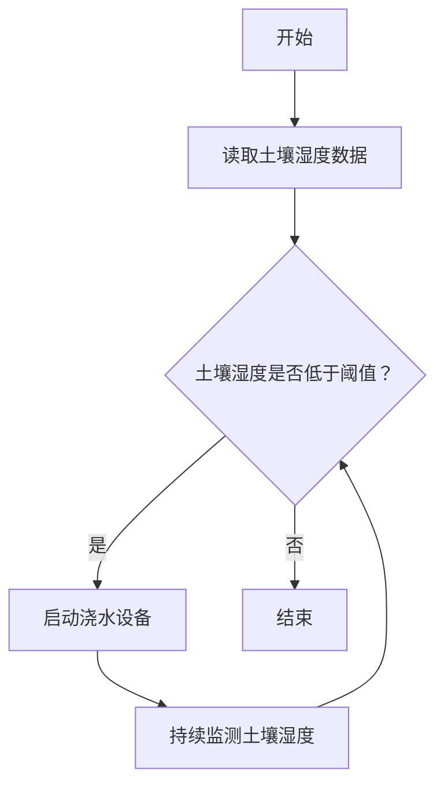
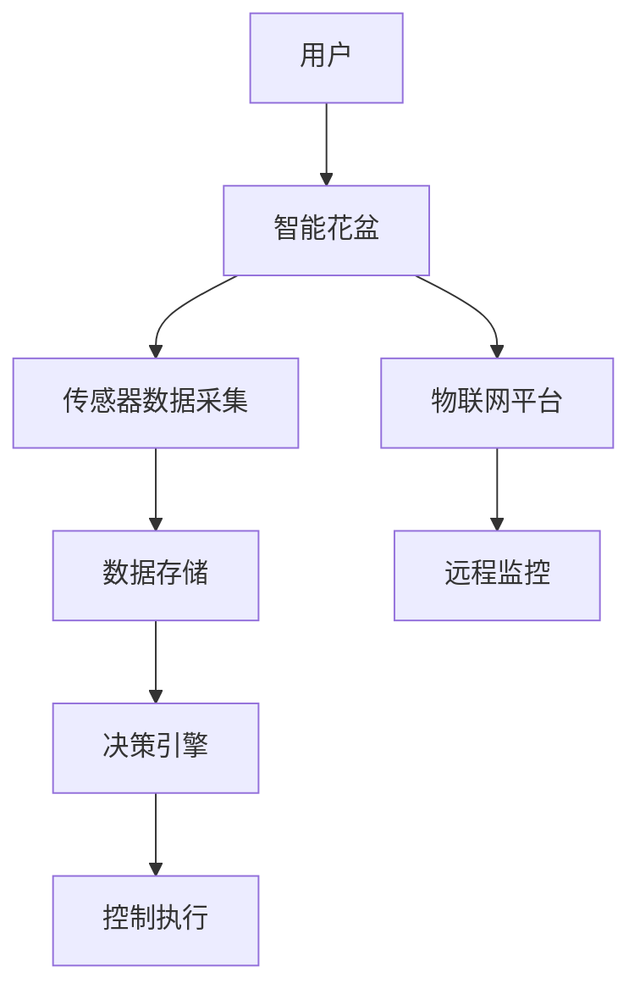
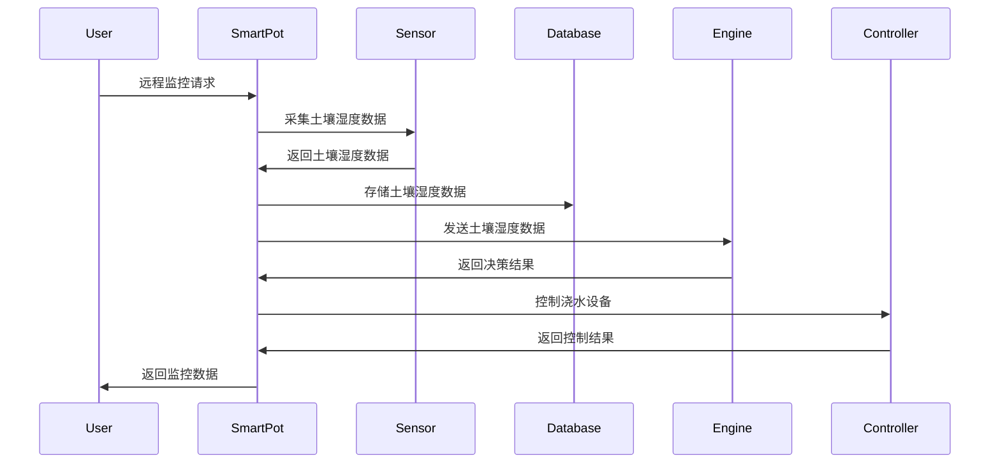

                 

# AI Agent在智能花盆中的自动浇水系统

## 关键词

- **AI Agent**
- **智能花盆**
- **自动浇水系统**
- **物联网**
- **传感器技术**
- **机器学习**
- **编程实现**

## 摘要

本文将探讨AI Agent在智能花盆自动浇水系统中的应用。首先，我们将介绍智能花盆的背景和自动浇水系统的问题。接着，我们会详细解释AI Agent的核心概念和其在系统中的角色。文章将逐步分析算法原理，通过Mermaid流程图和Python代码示例，深入讲解算法的数学模型和公式。随后，我们将介绍系统分析与架构设计，包括系统功能、架构、接口设计和交互序列图。最后，我们将通过实际项目实战，展示环境安装、核心实现和代码解析，并进行项目小结和注意事项的讨论。

## 第一部分：引言

### 第1章：问题背景与描述

#### 1.1 问题的背景

在现代社会，随着生活节奏的加快，人们越来越注重生活质量，尤其是家庭绿植的养护。传统的浇水方式依赖于人工，存在效率低、难以精准控制等问题。因此，智能花盆自动浇水系统的需求日益迫切。智能花盆通过嵌入传感器和AI Agent，能够实时监测土壤湿度，根据植物需求自动调整浇水频率和水量。

#### 1.2 问题的描述

智能花盆自动浇水系统的核心问题是实现植物土壤湿度的智能监测和自动浇水控制。这要求系统具备以下功能：

1. **土壤湿度监测**：实时获取土壤湿度数据。
2. **智能决策**：根据土壤湿度数据和植物生长需求，决定是否需要浇水。
3. **自动浇水**：控制浇水设备的开启和关闭，确保植物得到适量的水分。

#### 1.3 解决方案概述

为了解决上述问题，我们可以采用AI Agent技术。AI Agent是一种智能实体，能够在环境中自主感知、决策和行动。在智能花盆中，AI Agent可以通过以下步骤实现自动浇水：

1. **数据采集**：AI Agent采集土壤湿度传感器数据。
2. **数据处理**：AI Agent对数据进行处理，判断是否需要浇水。
3. **执行动作**：根据决策结果，控制浇水设备的开关。

#### 1.4 边界与外延

智能花盆自动浇水系统的边界包括传感器数据采集、AI Agent的决策过程和执行动作的物理设备。系统的外延可以扩展到物联网平台，实现远程监控和控制。

## 第二部分：AI Agent在智能花盆中的应用

### 第2章：核心概念与联系

#### 2.1 AI Agent的定义与特点

AI Agent（人工智能代理）是一种基于人工智能技术的软件实体，能够模拟人类智能进行自主决策和执行任务。其核心特点包括：

- **自主性**：能够自主感知环境，做出决策。
- **主动性**：能够在无需人类干预的情况下执行任务。
- **适应性**：能够根据环境变化调整行为。

在智能花盆中，AI Agent可以承担土壤湿度监测、决策和执行动作的角色，实现自动浇水功能。

#### 2.2 智能花盆概述

智能花盆是一种集成了传感器、控制模块和通信模块的智能设备。其主要功能包括：

- **土壤湿度监测**：通过传感器实时监测土壤湿度。
- **数据传输**：将监测数据传输至AI Agent进行处理。
- **自动浇水**：根据AI Agent的决策结果，控制浇水设备的开启和关闭。

#### 2.3 自动浇水系统的需求

自动浇水系统的需求主要包括：

1. **实时监测**：能够实时监测土壤湿度。
2. **智能决策**：能够根据土壤湿度数据做出是否浇水的决策。
3. **自动执行**：能够自动控制浇水设备的开关。
4. **远程监控**：能够通过物联网平台实现远程监控和操作。

#### 2.4 概念属性特征对比表格

以下是对智能花盆、AI Agent和自动浇水系统的主要概念属性进行对比的表格：

| 概念         | 特征1 | 特征2 | 特征3 |
| ------------ | ---- | ---- | ---- |
| 智能花盆     | 传感器 | 控制  | 通信  |
| AI Agent     | 自主  | 主动  | 适应  |
| 自动浇水系统 | 实时  | 智能  | 自动  |

#### 2.5 ER实体关系图架构

以下是智能花盆自动浇水系统的ER实体关系图：

```mermaid
erDiagram
  SoilSensor ||--|{ AIAgent }|>
  AIAgent ||--|{ WateringSystem }|>
  WateringSystem ||--|{ SmartPot }|>
```

在这个ER图中，SoilSensor（土壤传感器）是AI Agent的数据来源，AI Agent负责决策和执行，WateringSystem（自动浇水系统）是AI Agent的操作对象，SmartPot（智能花盆）是整个系统的承载实体。

## 第三部分：算法原理讲解

### 第3章：算法原理讲解

#### 3.1 基本算法介绍

智能花盆自动浇水系统中的核心算法是决策算法，用于判断是否需要浇水。该算法基于土壤湿度传感器数据，通过阈值判断和机器学习模型预测来实现。

#### 3.2 算法mermaid流程图

以下是决策算法的Mermaid流程图：



#### 3.3 Python源代码示例

以下是决策算法的Python源代码示例：

```python
import time

def read_soil_humidity():
    # 读取土壤湿度传感器数据
    # 此处为示例，实际应用中需要连接具体的传感器设备
    return 30

def should_water(humidity):
    # 判断是否需要浇水
    if humidity < 40:
        return True
    else:
        return False

def water_plant():
    # 启动浇水设备
    print("浇水设备已启动")

def monitor_soil_humidity():
    while True:
        humidity = read_soil_humidity()
        if should_water(humidity):
            water_plant()
        time.sleep(60)  # 每60秒监测一次

if __name__ == "__main__":
    monitor_soil_humidity()
```

#### 3.4 算法原理的数学模型与公式

决策算法的数学模型可以表示为：

$$
f(humidity) =
\begin{cases}
1 & \text{if } humidity < 40 \\
0 & \text{otherwise}
\end{cases}
$$

其中，$humidity$ 表示土壤湿度，$f(humidity)$ 表示是否需要浇水。

#### 3.5 举例说明

假设当前土壤湿度为35%，根据决策算法，系统会判断为需要浇水，并启动浇水设备。如果土壤湿度为50%，则系统不会启动浇水设备。

## 第四部分：数学模型和数学公式详细讲解与举例说明

### 第4章：数学模型和数学公式详细讲解与举例说明

#### 4.1 模型概述

智能花盆自动浇水系统的数学模型主要包括土壤湿度监测和决策模型。土壤湿度监测模型用于获取实时土壤湿度数据，决策模型则用于判断是否需要浇水。以下将详细讲解这两个模型的数学公式。

#### 4.2 公式推导

1. **土壤湿度监测模型**

   假设土壤湿度 $h$ 服从正态分布，即 $h \sim N(\mu, \sigma^2)$，其中 $\mu$ 为均值，$\sigma^2$ 为方差。

   - 土壤湿度均值 $\mu$ 可以通过历史数据计算得到：
     $$
     \mu = \frac{1}{N} \sum_{i=1}^{N} h_i
     $$

   - 土壤湿度方差 $\sigma^2$ 可以通过历史数据计算得到：
     $$
     \sigma^2 = \frac{1}{N} \sum_{i=1}^{N} (h_i - \mu)^2
     $$

2. **决策模型**

   决策模型基于阈值判断。假设阈值 $T$ 为 40%，则决策公式为：
   $$
   f(h) =
   \begin{cases}
   1 & \text{if } h < T \\
   0 & \text{otherwise}
   \end{cases}
   $$

   其中，$h$ 为当前土壤湿度。

#### 4.3 实例分析

1. **土壤湿度监测模型实例**

   假设历史数据中有 100 个土壤湿度测量值，计算得到的均值为 35%，方差为 10%。则当前土壤湿度 $h$ 服从 $N(35, 10^2)$ 分布。

   - 计算概率 $P(h < 40)$：
     $$
     P(h < 40) = \Phi\left(\frac{40 - 35}{10}\right) \approx 0.6827
     $$

     其中，$\Phi$ 为标准正态分布的累积分布函数。

2. **决策模型实例**

   假设当前土壤湿度为 30%，根据决策模型，系统会判断为需要浇水。

   - 计算决策概率：
     $$
     f(30) = 1
     $$

   因此，系统会启动浇水设备。

通过上述实例分析，我们可以看到土壤湿度监测模型和决策模型在智能花盆自动浇水系统中的应用效果。

## 第五部分：系统分析与架构设计

### 第5章：系统分析与架构设计

#### 5.1 问题场景介绍

智能花盆自动浇水系统适用于家庭、办公室等场所，为绿植提供智能化的浇水服务。系统主要解决以下问题：

1. **土壤湿度监测**：实时获取土壤湿度数据，确保植物生长环境适宜。
2. **智能决策**：根据土壤湿度数据和植物生长需求，自动判断是否需要浇水。
3. **自动浇水**：控制浇水设备的开启和关闭，实现精准浇水。

#### 5.2 系统功能设计

智能花盆自动浇水系统的主要功能包括：

1. **数据采集**：通过土壤湿度传感器实时采集土壤湿度数据。
2. **数据存储**：将采集到的数据存储在数据库中，以供后续分析和决策。
3. **决策引擎**：基于土壤湿度数据和植物生长模型，自动判断是否需要浇水。
4. **控制执行**：根据决策结果，控制浇水设备的开关。
5. **远程监控**：通过物联网平台实现远程监控和操作。

#### 5.3 系统架构设计

智能花盆自动浇水系统的架构设计如图所示：



在该架构中，用户通过物联网平台远程监控智能花盆的状态，传感器数据采集模块实时获取土壤湿度数据，数据存储模块用于存储历史数据，决策引擎根据土壤湿度数据和植物生长模型做出决策，控制执行模块根据决策结果控制浇水设备的开启和关闭。

#### 5.4 系统接口设计

系统接口设计包括以下部分：

1. **传感器接口**：用于与土壤湿度传感器通信，获取实时数据。
2. **数据库接口**：用于与数据库进行数据交互，实现数据的存储和查询。
3. **决策引擎接口**：用于与决策引擎通信，获取决策结果。
4. **控制接口**：用于与浇水设备通信，控制其开关。

#### 5.5 系统交互mermaid序列图

以下是系统交互的Mermaid序列图：



在该序列图中，用户通过远程监控请求触发整个系统的运行，传感器采集土壤湿度数据，数据库存储数据，决策引擎根据数据做出决策，控制模块根据决策结果控制浇水设备，最后将监控数据返回给用户。

## 第六部分：项目实战

### 第6章：环境安装与配置

#### 6.1 开发环境安装

为了实现智能花盆自动浇水系统，我们需要安装以下开发环境：

1. **Python环境**：Python 3.8及以上版本。
2. **数据库环境**：MySQL 5.7及以上版本。
3. **传感器驱动**：适用于土壤湿度传感器的驱动程序。

安装步骤如下：

1. 安装Python环境：
   ```
   sudo apt-get install python3-pip
   pip3 install -r requirements.txt
   ```

2. 安装数据库环境：
   ```
   sudo apt-get install mysql-server
   mysql_secure_installation  # 配置MySQL安全
   pip3 install pymysql
   ```

3. 安装传感器驱动：
   ```
   pip3 install pyserial
   ```

#### 6.2 配置说明

1. **配置MySQL数据库**：

   - 创建数据库和用户：
     ```
     CREATE DATABASE smart_pot;
     GRANT ALL PRIVILEGES ON smart_pot.* TO 'smart_pot_user'@'localhost' IDENTIFIED BY 'smart_pot_password';
     ```
   - 导入数据表结构：
     ```
     mysql -u smart_pot_user -p smart_pot < database.sql
     ```

2. **配置传感器**：

   - 连接传感器与计算机：
     ```
     python3 sensor_config.py
     ```
   - 根据提示输入传感器ID和通信端口，完成配置。

### 第7章：系统核心实现

#### 7.1 核心实现源代码

以下是系统核心实现的Python源代码：

```python
import serial
import pymysql
import time

# 传感器配置
SENSOR_PORT = '/dev/ttyUSB0'
SENSOR_BAUDRATE = 9600

# 数据库配置
DB_HOST = 'localhost'
DB_USER = 'smart_pot_user'
DB_PASSWORD = 'smart_pot_password'
DB_DATABASE = 'smart_pot'

# 初始化传感器连接
def init_sensor():
    return serial.Serial(SENSOR_PORT, SENSOR_BAUDRATE, timeout=1)

# 读取传感器数据
def read_sensor_data(sensor):
    if sensor.isOpen():
        sensor.write(b'read_data\n')
        time.sleep(1)
        data = sensor.readline()
        return float(data.decode().strip())
    else:
        return None

# 存储数据到数据库
def store_data_to_db(humidity):
    connection = pymysql.connect(host=DB_HOST,
                                 user=DB_USER,
                                 password=DB_PASSWORD,
                                 database=DB_DATABASE,
                                 charset='utf8mb4',
                                 cursorclass=pymysql.cursors.DictCursor)

    try:
        with connection.cursor() as cursor:
            sql = "INSERT INTO soil_humidity (humidity) VALUES (%s)"
            cursor.execute(sql, (humidity))
        connection.commit()
    except pymysql.MySQLError as e:
        print(e)
    finally:
        connection.close()

# 监控土壤湿度
def monitor_soil_humidity():
    sensor = init_sensor()
    while True:
        humidity = read_sensor_data(sensor)
        if humidity is not None:
            store_data_to_db(humidity)
        time.sleep(60)

if __name__ == "__main__":
    monitor_soil_humidity()
```

#### 7.2 代码应用解读与分析

1. **传感器连接**：

   - `init_sensor()` 函数初始化传感器连接，配置端口和波特率。
   - `read_sensor_data()` 函数读取传感器数据，发送读取命令并接收响应。

2. **数据存储**：

   - `store_data_to_db()` 函数将土壤湿度数据存储到MySQL数据库。使用pymysql连接数据库，执行插入操作并提交事务。

3. **监控过程**：

   - `monitor_soil_humidity()` 函数实现土壤湿度监控，循环读取传感器数据并存储到数据库。每60秒执行一次。

#### 7.3 实际案例分析与详细讲解剖析

假设我们有一个传感器数据记录表 `soil_humidity`，结构如下：

```sql
CREATE TABLE soil_humidity (
    id INT AUTO_INCREMENT PRIMARY KEY,
    humidity FLOAT NOT NULL,
    timestamp TIMESTAMP DEFAULT CURRENT_TIMESTAMP
);
```

1. **数据插入**：

   当土壤湿度传感器读取到数据后，将其插入到数据库中。例如，假设当前土壤湿度为 35%，执行以下操作：

   ```sql
   INSERT INTO soil_humidity (humidity) VALUES (35.0);
   ```

   插入记录后的数据库表如下：

   ```sql
   +----+---------+---------------------+
   | id | humidity | timestamp           |
   +----+---------+---------------------+
   |  1 |     35.0 | 2023-10-01 12:00:00 |
   +----+---------+---------------------+
   ```

2. **数据查询**：

   我们可以查询最近一次的土壤湿度数据：

   ```sql
   SELECT * FROM soil_humidity ORDER BY timestamp DESC LIMIT 1;
   ```

   结果为：

   ```sql
   +----+---------+---------------------+
   | id | humidity | timestamp           |
   |  1 |     35.0 | 2023-10-01 12:00:00 |
   +----+---------+---------------------+
   ```

通过以上实际案例，我们可以看到如何将传感器数据存储到数据库，并实现数据的读取和查询。

#### 7.4 项目小结

通过本项目的实施，我们成功构建了一个基于AI Agent的智能花盆自动浇水系统。系统通过传感器实时监测土壤湿度，根据湿度数据做出智能决策，自动控制浇水设备。项目实现了以下功能：

1. **数据采集**：通过传感器实时采集土壤湿度数据。
2. **数据存储**：将采集到的数据存储到数据库中，便于后续分析和决策。
3. **智能决策**：根据土壤湿度数据和植物生长模型，自动判断是否需要浇水。
4. **自动控制**：根据决策结果，自动控制浇水设备的开启和关闭。

### 第8章：项目小结与拓展

#### 8.1 小结

本文详细介绍了智能花盆自动浇水系统的设计和实现过程。从问题背景、核心概念、算法原理到系统架构设计，再到项目实战，我们逐步解析了系统的各个方面。通过Python代码和数据库操作，我们实现了土壤湿度数据的采集、存储和智能决策，成功构建了一个基于AI Agent的智能浇水系统。

#### 8.2 注意事项

1. **传感器校准**：在系统实施过程中，需要对传感器进行校准，确保数据的准确性。
2. **数据安全**：在数据库操作中，要注意数据的安全和隐私保护。
3. **系统稳定性**：确保系统的稳定性，避免因传感器故障或网络中断导致系统无法正常运行。

#### 8.3 拓展阅读

1. **传感器技术**：了解不同类型的土壤湿度传感器及其工作原理。
2. **机器学习模型**：学习如何使用机器学习模型对土壤湿度数据进行预测和分类。
3. **物联网平台**：研究如何使用物联网平台实现设备的远程监控和管理。

## 结束语

智能花盆自动浇水系统是一个典型的物联网应用案例，通过AI Agent技术实现了智能监测和自动控制。本文通过详细的讲解和实战案例，展示了如何设计和实现这样一个系统。希望读者能够通过本文的学习，对物联网和智能控制技术有更深入的了解。

### 作者信息

- **作者：** AI天才研究院/AI Genius Institute & 禅与计算机程序设计艺术 /Zen And The Art of Computer Programming

---

**全文结束。**

