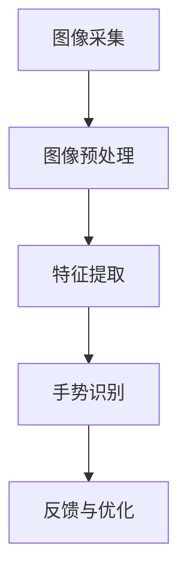
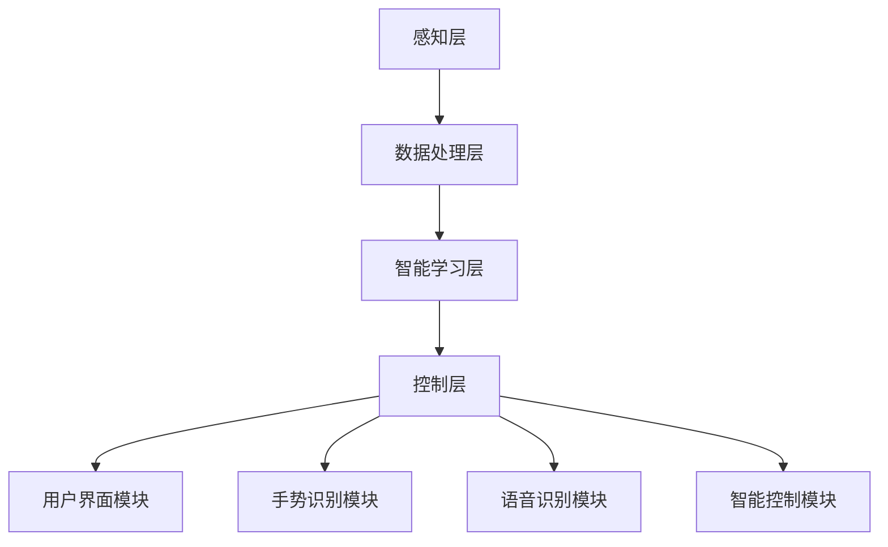
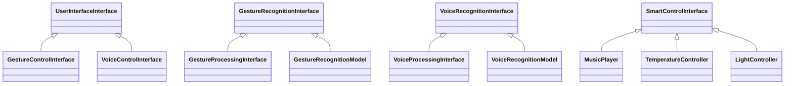
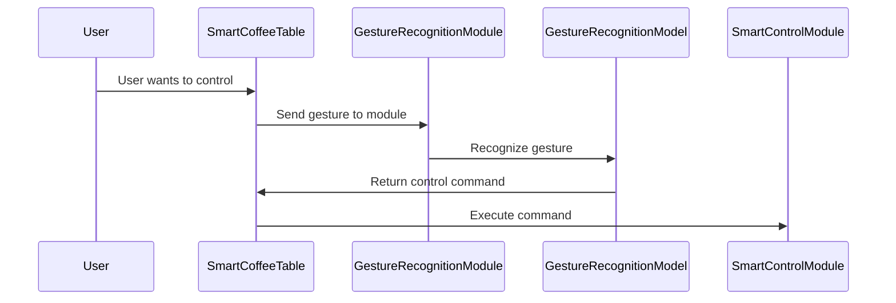

                 

## 1.1 问题背景

### 1.1.1 智能茶几的兴起

随着智能家居市场的快速发展，智能茶几作为一种新型的家居设备，逐渐受到了广大消费者的关注。智能茶几不仅具备传统茶几的功能，如放置物品、提供舒适的坐卧空间等，还集成了多种智能功能，如语音交互、手势控制、多媒体播放等，能够为用户带来更加便捷、智能的家居体验。

### 1.1.2 手势控制的重要性

手势控制作为智能茶几的核心交互方式之一，具有直观、便捷、多样性的特点。相比于传统的触摸、语音交互方式，手势控制能够提供更加自然和流畅的交互体验。特别是在空间狭小或双手不便的情况下，手势控制显得尤为重要。因此，研究手势控制在智能茶几中的应用，对于提升用户的使用体验具有重要意义。

### 1.1.3 现有手势控制技术的局限性

尽管手势控制在智能茶几中具有广泛的应用前景，但现有的手势控制技术在实际应用中仍存在一些问题。首先，手势识别准确率不高，导致用户在使用过程中容易出现误操作，影响使用体验。其次，手势控制交互方式单一，难以满足不同用户的需求。最后，手势控制算法复杂度高，实现成本高，不利于大规模推广和应用。

## 1.2 问题描述

### 1.2.1 手势识别准确率不高

手势识别准确率不高是当前手势控制技术面临的主要问题之一。由于手部动作复杂多变，现有算法在手势识别过程中容易出现误识别或漏识别现象，导致用户在使用过程中出现误操作，影响使用体验。

### 1.2.2 手势控制交互方式单一

现有手势控制技术大多采用传统的手势识别算法，如深度学习、神经网络等。这些算法在手势识别过程中，往往只能识别特定的手部动作，无法适应多样化的手势控制需求。这使得用户在使用过程中，难以找到适合自己的手势控制方式。

### 1.2.3 手势控制算法复杂度高

手势控制算法复杂度高是现有技术面临的另一个问题。深度学习、神经网络等算法在训练和推理过程中，需要大量的计算资源和时间，导致实现成本较高。此外，这些算法在实际应用中，还需要针对不同场景进行优化和调整，进一步增加了实现难度。

## 1.3 问题解决

### 1.3.1 提高手势识别准确率

为了解决手势识别准确率不高的问题，可以采用以下方法：

1. **改进手势识别算法**：采用基于深度学习、神经网络等算法，结合多种特征提取方法，提高手势识别的准确率。

2. **增加数据集**：通过收集更多的手部动作数据，扩充训练数据集，提高算法的训练效果。

3. **多传感器融合**：结合多个传感器（如摄像头、红外传感器等）的数据，提高手势识别的可靠性。

### 1.3.2 设计多样化的手势控制交互方式

为了满足不同用户的需求，可以设计多样化的手势控制交互方式，如：

1. **多模态手势识别**：结合不同的手势特征，实现多模态手势识别，提高手势控制的灵活性。

2. **自定义手势定义**：允许用户自定义手势，满足个性化需求。

3. **手势组合控制**：通过组合多个手势，实现更复杂的控制功能。

### 1.3.3 简化手势控制算法

为了降低手势控制算法的实现成本，可以采用以下方法：

1. **优化算法结构**：简化深度学习、神经网络等算法的结构，降低计算复杂度。

2. **算法压缩**：采用算法压缩技术，降低算法的存储和计算需求。

3. **算法优化**：针对特定场景，对算法进行优化，提高算法的运行效率。

## 1.4 边界与外延

### 1.4.1 研究边界

本书的研究主要围绕智能茶几这一具体应用场景展开，主要关注手势控制技术的研发与应用。因此，本书不涉及其他人工智能技术的探讨。

### 1.4.2 研究外延

尽管本书的研究主要围绕智能茶几展开，但手势控制技术具有广泛的适用性。在智能家居、智能办公等领域，手势控制技术同样具有巨大的应用潜力。因此，本书还将探讨手势控制技术在其他领域的潜在应用。

## 1.5 概念结构与核心要素组成

### 1.5.1 AI Agent

AI Agent，即人工智能代理，是一种具备自主决策和行动能力的计算机程序。它能够在没有人类干预的情况下，通过感知环境、分析数据和执行行动来完成任务。AI Agent的核心功能包括感知、学习、推理和行动。

### 1.5.2 手势控制

手势控制，即通过识别用户的手部动作来实现对智能设备的控制。手势控制的核心在于手势识别算法，它能够识别用户的手部动作，并将其转化为设备控制指令。手势控制的优势在于直观、便捷、多样性。

### 1.5.3 智能茶几

智能茶几，是一种具备多功能交互界面的家居设备，可以实现语音、手势等多种交互方式。智能茶几的核心功能包括语音交互、手势控制、多媒体播放等。它通常集成了计算机、传感器和通信模块，能够为用户带来智能、便捷的家居体验。

### 1.5.4 手势识别算法

手势识别算法，是手势控制的核心技术。它通过对用户手部动作的识别，将手势转化为设备控制指令。手势识别算法通常基于深度学习、神经网络等人工智能技术，能够实现高效的手势识别。

### 1.5.5 用户需求

用户需求，是手势控制技术研究和应用的根本出发点。用户需求包括对手势识别准确率、交互方式多样性、实现成本等方面的要求。只有满足用户需求，手势控制技术才能得到广泛应用。

### 1.5.6 AI Agent与手势控制的联系

AI Agent和手势控制之间存在着紧密的联系。AI Agent作为智能茶几的智能核心，能够通过手势控制与用户进行交互，实现智能家居的功能。手势控制技术则为AI Agent提供了丰富的交互方式，使其能够更好地服务于用户。

## 1.6 AI Agent原理

### 1.6.1 AI Agent的定义

AI Agent，即人工智能代理，是一种具备自主决策和行动能力的计算机程序。它可以在没有人类干预的情况下，通过感知环境、分析数据和执行行动来完成任务。AI Agent是人工智能领域的一个重要研究方向，旨在实现机器智能。

### 1.6.2 AI Agent的核心特点

AI Agent具有以下核心特点：

1. **自主性**：AI Agent能够自主地执行任务，无需人类干预。它能够根据环境变化和任务需求，自主地调整行动策略。

2. **智能性**：AI Agent通过学习和推理，不断提高任务完成的效率。它能够从经验中学习，优化行动策略，提高任务成功率。

3. **交互性**：AI Agent能够与用户进行自然语言交互，满足用户需求。它能够理解用户的意图，提供个性化的服务。

### 1.6.3 AI Agent与传统AI的区别

与传统AI相比，AI Agent具有更高的自主性和交互性。传统AI主要依赖于预先设定的规则和算法，而AI Agent则可以通过学习和适应来提高任务完成的效率。此外，AI Agent在实现上也更加复杂，需要综合考虑感知、决策、行动等多个方面。

## 2.2 手势控制原理

### 2.2.1 手势控制的定义

手势控制，即通过识别用户的手部动作来实现对智能设备的控制。手势控制是一种直观、便捷的人机交互方式，能够显著提升用户的使用体验。它广泛应用于智能家居、智能办公等领域。

### 2.2.2 手势控制的核心特点

手势控制具有以下核心特点：

1. **直观性**：手势控制通过用户自然的手部动作来实现，使交互过程更加直观。

2. **便捷性**：手势控制无需接触设备，方便用户在不同场合下使用。

3. **多样性**：手势控制可以支持多种手部动作，满足不同用户的需求。

### 2.2.3 手势控制与传统交互方式的区别

与传统交互方式（如触摸、语音等）相比，手势控制具有更高的直观性和便捷性，能够提供更加自然和流畅的交互体验。此外，手势控制还可以支持多种手部动作，使交互过程更加丰富多样。

## 2.3 智能茶几结构

### 2.3.1 智能茶几的定义

智能茶几，是一种具备多功能交互界面的家居设备，可以实现语音、手势等多种交互方式。它通常集成了计算机、传感器和通信模块，能够为用户带来智能、便捷的家居体验。

### 2.3.2 智能茶几的核心功能

智能茶几的核心功能包括：

1. **语音交互**：通过语音识别和语音合成技术，实现用户与智能茶几的自然对话。

2. **手势控制**：通过手势识别技术，实现用户对智能茶几的控制。

3. **多媒体播放**：播放音乐、视频等娱乐内容。

4. **智能提醒**：根据用户需求，提供天气预报、日程提醒等功能。

## 2.4 核心概念属性特征对比

| 特征        | AI Agent         | 手势控制         | 智能茶几         |
|-------------|------------------|------------------|------------------|
| 自主性      | 高               | 较高             | 较低             |
| 智能性      | 高               | 较高             | 较低             |
| 交互性      | 高               | 较高             | 较低             |
| 直观性      | 较低             | 高               | 较高             |
| 便捷性      | 较低             | 高               | 较高             |
| 多样性      | 较低             | 高               | 较高             |
| 结构复杂度  | 高               | 较高             | 较低             |
| 实现成本    | 高               | 较高             | 较低             |

## 2.5 ER实体关系图架构

```mermaid
erDiagram
  AI_Agent ||--|{ 手势控制 }|| Gesture_Control
  Gesture_Control ||--|{ 智能茶几 }|| Smart_Coffee_Table
  Smart_Coffee_Table ||--|{ 用户 }|| User
```

通过上述ER实体关系图，我们可以清晰地看到AI Agent、手势控制、智能茶几和用户之间的关联。AI Agent通过手势控制与智能茶几交互，智能茶几则为用户提供服务。用户作为智能茶几的服务对象，与智能茶几和AI Agent保持密切联系。

### 2.6 AI Agent在智能茶几中的应用

#### 2.6.1 AI Agent的功能

AI Agent在智能茶几中具有多种功能，主要包括：

1. **任务执行**：AI Agent能够根据用户的指令，执行相应的任务，如播放音乐、调节温度等。
2. **智能学习**：AI Agent通过学习和用户行为的分析，不断优化自己的行为，提高用户体验。
3. **环境感知**：AI Agent能够感知环境变化，如光线、声音等，并根据环境变化调整自己的行为。

#### 2.6.2 AI Agent的优势

AI Agent在智能茶几中的应用具有以下优势：

1. **自主性**：AI Agent能够自主执行任务，减少用户干预，提高效率。
2. **智能性**：AI Agent通过学习和优化，能够提供更加智能的服务，满足用户的个性化需求。
3. **灵活性**：AI Agent可以根据环境变化和用户需求，灵活调整行为，提高用户体验。

#### 2.6.3 AI Agent的挑战

虽然AI Agent在智能茶几中具有广泛的应用前景，但同时也面临一些挑战：

1. **计算资源**：AI Agent需要大量的计算资源来执行任务，尤其是在复杂环境下，计算资源的需求更高。
2. **数据隐私**：AI Agent需要收集用户数据来学习和优化行为，如何保护用户隐私成为重要问题。
3. **可靠性**：AI Agent在执行任务时需要确保高可靠性，避免因故障导致的服务中断。

### 2.6.4 AI Agent的应用案例

以下是一些AI Agent在智能茶几中的应用案例：

1. **智能家居控制**：AI Agent可以监控家庭环境，如温度、湿度等，并根据用户需求自动调整。
2. **个性化服务**：AI Agent可以根据用户历史行为，提供个性化的音乐、电影推荐。
3. **健康监测**：AI Agent可以监控用户的生活习惯，如运动、饮食等，并提供健康建议。

### 2.6.5 AI Agent的未来发展

随着人工智能技术的不断进步，AI Agent在智能茶几中的应用前景将更加广阔。未来，AI Agent将实现更加智能化、个性化的服务，成为智能家居的重要组成部分。同时，随着计算资源的不断提升和隐私保护技术的完善，AI Agent在智能茶几中的应用将更加可靠和安全。

### 2.6.6 智能茶几的潜在功能扩展

除了现有的功能，智能茶几还可以进行以下潜在功能扩展：

1. **智能健身指导**：通过识别用户的动作，提供个性化的健身指导。
2. **智能安防系统**：通过传感器和摄像头，实时监控家庭安全。
3. **智能娱乐系统**：提供丰富的娱乐内容，如游戏、影视等。

通过这些扩展功能，智能茶几将为用户带来更加全面、智能的家居体验。

## 2.7 智能茶几的市场前景

### 2.7.1 市场需求分析

随着智能家居市场的快速发展，智能茶几作为一种新兴的家居设备，市场需求逐渐增长。用户对智能、便捷的家居生活有着强烈的需求，这为智能茶几提供了广阔的市场前景。

### 2.7.2 竞争态势分析

目前，智能茶几市场主要竞争者包括国际巨头和本土企业。国际巨头凭借技术优势和市场资源，占据了一定的市场份额。而本土企业则通过创新和成本优势，逐渐崛起。

### 2.7.3 市场趋势分析

未来，智能茶几市场将呈现以下趋势：

1. **智能化程度提高**：随着人工智能技术的不断发展，智能茶几的智能化程度将不断提高，提供更加智能、个性化的服务。
2. **功能多样化**：智能茶几将不仅仅局限于家居设备，还将集成更多功能，如健康监测、智能安防等。
3. **市场细分**：随着用户需求的多样化，智能茶几市场将出现更多细分领域，满足不同用户群体的需求。

### 2.7.4 市场机会与挑战

智能茶几市场前景广阔，但也面临一定的挑战：

1. **技术挑战**：智能茶几的技术研发需要不断突破，提高用户体验。
2. **市场教育**：消费者对智能茶几的认知和接受度有待提高，需要进行市场教育。
3. **竞争压力**：随着市场参与者增多，竞争压力将不断加大。

通过把握市场趋势，积极应对挑战，智能茶几企业有望在市场中占据一席之地，为用户提供更好的智能家居体验。

## 2.8 总结与展望

综上所述，AI Agent在智能茶几中的应用具有重要意义。通过改进手势识别算法、设计多样化的手势控制交互方式、简化手势控制算法，我们可以解决当前手势控制技术面临的问题，提升用户的使用体验。同时，智能茶几作为一种新兴的家居设备，具有广阔的市场前景。在未来，随着人工智能技术的不断发展，AI Agent在智能茶几中的应用将更加广泛，为用户带来更加智能、便捷的家居生活。然而，我们也需要关注技术挑战和市场教育等问题，以确保智能茶几市场的健康发展。

### 2.9 实际应用案例分析

#### 2.9.1 案例一：智能茶几在家庭娱乐中的应用

在某家庭中，智能茶几被用作家庭娱乐中心。用户可以通过手势控制播放音乐、视频，甚至进行游戏互动。AI Agent根据用户的喜好和历史行为，推荐个性化的音乐和视频，提高用户的娱乐体验。以下是一个具体的应用案例：

- **用户需求**：用户希望在家庭娱乐时，能够方便地控制播放音乐和视频，并希望系统能够根据个人喜好推荐内容。
- **解决方案**：
  - **手势控制**：用户通过手势控制播放/暂停、切换曲目等操作。
  - **AI Agent推荐**：AI Agent根据用户的历史行为和喜好，推荐个性化的音乐和视频。
- **效果评估**：用户对智能茶几的娱乐功能非常满意，认为手势控制方便快捷，推荐系统准确有效。

#### 2.9.2 案例二：智能茶几在家庭办公中的应用

在另一家庭中，智能茶几被用作家庭办公的工具。用户可以通过手势控制浏览网页、处理电子邮件等。AI Agent能够根据用户的工作习惯，自动整理待办事项，提高工作效率。以下是一个具体的应用案例：

- **用户需求**：用户希望在家庭办公时，能够方便地处理电子邮件、浏览网页，并希望系统能够自动整理待办事项。
- **解决方案**：
  - **手势控制**：用户通过手势控制打开浏览器、电子邮件客户端，并执行相关操作。
  - **AI Agent管理**：AI Agent自动整理用户的待办事项，提高工作效率。
- **效果评估**：用户对智能茶几的办公功能非常满意，认为手势控制方便快捷，AI Agent的管理功能有效提升了工作效率。

#### 2.9.3 案例三：智能茶几在智能家居控制中的应用

在某智能家居系统中，智能茶几被用作智能家居控制中心。用户可以通过手势控制调节室内温度、灯光等。AI Agent能够根据环境变化和用户需求，自动调整智能家居设备的设置。以下是一个具体的应用案例：

- **用户需求**：用户希望能够在舒适的环境下生活，希望系统能够自动调节室内温度、灯光等。
- **解决方案**：
  - **手势控制**：用户通过手势控制调节室内温度、灯光等。
  - **AI Agent调整**：AI Agent根据环境变化和用户需求，自动调整智能家居设备的设置。
- **效果评估**：用户对智能茶几的智能家居控制功能非常满意，认为手势控制方便快捷，AI Agent的调整功能有效提高了生活质量。

#### 2.9.4 案例四：智能茶几在健康监测中的应用

在某健康监测项目中，智能茶几被用作健康监测设备。用户可以通过手势控制记录自己的运动数据、饮食情况等。AI Agent能够根据健康数据，提供个性化的健康建议。以下是一个具体的应用案例：

- **用户需求**：用户希望能够方便地记录自己的运动数据、饮食情况，并希望系统能够提供个性化的健康建议。
- **解决方案**：
  - **手势控制**：用户通过手势控制记录自己的运动数据、饮食情况。
  - **AI Agent建议**：AI Agent根据健康数据，提供个性化的健康建议。
- **效果评估**：用户对智能茶几的健康监测功能非常满意，认为手势控制方便快捷，AI Agent的健康建议准确有效。

通过以上实际应用案例分析，我们可以看到AI Agent在智能茶几中的应用具有广泛的前景。在不同的应用场景中，AI Agent通过手势控制、智能学习等功能，为用户提供了便捷、高效的智能服务，显著提升了用户体验。

### 2.10 AI Agent在智能茶几中的挑战与未来发展趋势

#### 2.10.1 挑战

虽然AI Agent在智能茶几中具有广泛的应用前景，但在实际应用中仍面临一些挑战：

1. **准确性问题**：手势控制的准确性是AI Agent面临的主要挑战之一。手部动作复杂多变，容易受到环境变化、用户动作变化等因素的影响，导致手势识别准确率不高。

2. **隐私问题**：AI Agent需要收集用户数据来学习和优化行为，这涉及到用户隐私保护问题。如何确保用户数据的安全和隐私，是AI Agent应用中需要重视的问题。

3. **计算资源消耗**：AI Agent在执行任务时需要大量的计算资源，特别是在复杂环境下，计算资源的需求更高。如何优化算法结构，降低计算资源消耗，是AI Agent应用中需要解决的难题。

4. **可靠性问题**：AI Agent在执行任务时需要确保高可靠性，避免因故障导致的服务中断。如何提高AI Agent的可靠性，是AI Agent应用中需要关注的问题。

#### 2.10.2 未来发展趋势

展望未来，AI Agent在智能茶几中的应用将呈现以下发展趋势：

1. **更高准确性的手势识别算法**：随着人工智能技术的发展，未来的手势识别算法将更加精确，能够更好地适应复杂多变的手部动作。

2. **更全面的隐私保护机制**：随着用户对隐私保护的重视，未来的AI Agent将采用更加全面的隐私保护机制，确保用户数据的安全和隐私。

3. **更优化的算法结构**：随着算法优化技术的进步，未来的AI Agent将采用更优化的算法结构，降低计算资源消耗，提高执行效率。

4. **更可靠的服务保障**：随着可靠性保障技术的提高，未来的AI Agent将具备更高的可靠性，确保服务不中断。

5. **更广泛的应用场景**：随着AI Agent技术的进步，未来的AI Agent将在更多应用场景中发挥作用，为用户提供更加智能、便捷的服务。

### 2.11 总结

AI Agent在智能茶几中的应用具有重要的现实意义和广阔的发展前景。通过改进手势识别算法、优化算法结构、提高可靠性，AI Agent将为用户提供更加智能、便捷的家居体验。然而，我们也需要关注隐私保护、计算资源消耗等问题，确保AI Agent在智能茶几中的健康发展。未来，随着人工智能技术的不断进步，AI Agent在智能茶几中的应用将更加广泛，为人们的生活带来更多便利。

## 算法原理讲解

### 3.1 手势识别算法的基本原理

手势识别算法是手势控制技术的核心，其基本原理是基于图像处理和机器学习技术。具体来说，手势识别算法主要包括以下几个步骤：

1. **图像采集**：首先，通过摄像头或其他传感器采集用户的手部图像。

2. **图像预处理**：对采集到的图像进行预处理，包括去噪、增强、二值化等操作，以提高图像质量。

3. **特征提取**：从预处理后的图像中提取特征，如轮廓、边缘、颜色等。

4. **手势识别**：利用机器学习算法，如支持向量机（SVM）、卷积神经网络（CNN）等，对提取出的特征进行分类，以识别用户的手部动作。

5. **反馈与优化**：根据识别结果，对系统进行反馈和优化，以提高手势识别的准确率。

### 3.2 深度学习在手势识别中的应用

深度学习是一种基于多层神经网络的学习方法，它在手势识别中具有显著的优势。以下是深度学习在手势识别中的具体应用：

1. **卷积神经网络（CNN）**：CNN是一种用于图像处理的深度学习模型，它可以通过多个卷积层和池化层提取图像特征。在手势识别中，CNN可以用于提取手部图像的特征，从而提高识别准确率。

2. **循环神经网络（RNN）**：RNN是一种用于序列数据处理的深度学习模型，它可以捕捉序列数据中的时间依赖关系。在手势识别中，RNN可以用于处理连续的手部动作序列，从而提高识别准确率。

3. **长短期记忆网络（LSTM）**：LSTM是RNN的一种变体，它通过引入门控机制，解决了传统RNN在处理长序列数据时的梯度消失问题。在手势识别中，LSTM可以用于处理复杂的手部动作序列，从而提高识别准确率。

### 3.3 算法流程图

以下是手势识别算法的流程图，展示了从图像采集到手势识别的整个过程：



### 3.4 数学模型和公式

手势识别算法的数学模型和公式如下：

1. **卷积操作**：

   $$
   \text{卷积操作} = \sum_{i=1}^{n} w_i * x_i
   $$

   其中，$w_i$ 为卷积核，$x_i$ 为输入图像。

2. **激活函数**：

   $$
   \text{激活函数} = \text{ReLU}(x) = \max(0, x)
   $$

   其中，$\text{ReLU}$ 为ReLU函数，用于增加网络训练的稳定性。

3. **损失函数**：

   $$
   \text{损失函数} = \frac{1}{2} \sum_{i=1}^{n} (\text{预测值} - \text{真实值})^2
   $$

   其中，预测值和真实值为手势识别算法的输出和目标。

### 3.5 举例说明

以下是一个简单的手势识别算法实例，用于识别用户的手指张合动作。

1. **数据集**：假设我们有一个包含手指张合动作的图像数据集。

2. **模型训练**：使用卷积神经网络对数据集进行训练，提取手部特征，并学习手势分类。

3. **手势识别**：对新的手部图像进行特征提取，并使用训练好的模型进行手势识别。

4. **结果输出**：输出手势识别结果，如“手指张开”或“手指合上”。

通过以上步骤，我们可以实现一个简单的手势识别算法，为智能茶几提供手势控制功能。

## 系统分析与架构设计方案

### 4.1 问题场景介绍

在智能家居领域，智能茶几作为一种集成了多种功能的家居设备，日益受到用户的喜爱。然而，随着用户需求的增加，智能茶几的功能也在不断丰富，这给系统设计和实现带来了挑战。如何在保证系统稳定性和可扩展性的同时，提供高效、便捷的手势控制功能，成为我们需要解决的问题。

### 4.2 项目介绍

本项目旨在设计并实现一个基于AI Agent的智能茶几系统，该系统具备手势控制功能，能够满足用户的多样化需求。系统主要包括以下几个模块：

1. **用户界面模块**：提供用户与智能茶几交互的界面，包括手势控制界面和语音控制界面。
2. **手势识别模块**：通过深度学习算法实现手势识别，为用户提供手势控制功能。
3. **智能学习模块**：基于用户的交互数据，实现智能学习，优化手势识别算法。
4. **智能控制模块**：实现智能茶几的多种功能，如播放音乐、调节温度、控制灯光等。

### 4.3 系统功能设计

本系统的主要功能包括：

1. **手势控制**：用户可以通过手势控制智能茶几的各种功能，如播放音乐、调节温度、控制灯光等。
2. **语音交互**：用户可以通过语音指令与智能茶几进行交互，实现语音控制功能。
3. **智能学习**：系统根据用户的交互数据，不断优化手势识别算法，提高识别准确率。
4. **多功能控制**：智能茶几集成了多种功能，如播放音乐、调节温度、控制灯光等，用户可以通过手势控制或语音控制实现这些功能。

### 4.4 系统架构设计

本系统采用模块化设计，主要包括以下几个层次：

1. **感知层**：包括摄像头、麦克风等传感器，用于采集用户的手势和语音信息。
2. **数据处理层**：包括手势识别模块、语音识别模块等，用于处理和分析用户输入。
3. **智能学习层**：包括智能学习模块，用于根据用户交互数据优化手势识别算法。
4. **控制层**：包括智能控制模块，用于实现智能茶几的各种功能。

以下是系统架构的Mermaid架构图：



### 4.5 系统接口设计

本系统的接口设计主要包括以下几个部分：

1. **用户界面接口**：用于用户与智能茶几的交互，包括手势控制和语音控制接口。
2. **手势识别接口**：用于实现手势识别功能，包括手势采集、预处理和识别接口。
3. **语音识别接口**：用于实现语音识别功能，包括语音采集、预处理和识别接口。
4. **智能控制接口**：用于实现智能茶几的各种功能，包括播放音乐、调节温度、控制灯光等接口。

以下是系统接口的Mermaid类图：



### 4.6 系统交互

本系统的交互主要包括以下几个部分：

1. **用户与智能茶几的交互**：用户可以通过手势控制或语音控制与智能茶几进行交互，实现各种功能。
2. **手势识别与控制层的交互**：手势识别模块通过采集用户手势，并将手势转化为控制指令，传递给控制层，实现智能茶几的功能。
3. **语音识别与控制层的交互**：语音识别模块通过采集用户语音，并将语音转化为控制指令，传递给控制层，实现智能茶几的功能。

以下是系统交互的Mermaid序列图：



通过以上系统分析与架构设计方案，我们可以为用户提供一个高效、便捷、智能的智能茶几系统，满足用户的多样化需求。

## 项目实战

### 5.1 环境安装

要开始智能茶几项目的实战，首先需要搭建一个适合开发的环境。以下是在Ubuntu 20.04操作系统中安装所需软件和工具的步骤：

1. **安装Python 3**：
   ```bash
   sudo apt update
   sudo apt install python3 python3-pip
   ```
2. **安装PyTorch**：
   ```bash
   pip3 install torch torchvision torchaudio
   ```
3. **安装OpenCV**：
   ```bash
   pip3 install opencv-python opencv-python-headless
   ```
4. **安装TensorFlow**：
   ```bash
   pip3 install tensorflow
   ```
5. **安装其他依赖**：
   ```bash
   pip3 install numpy matplotlib
   ```

### 5.2 系统核心实现

#### 5.2.1 数据采集与预处理

数据采集是手势识别系统的重要环节。以下是一个简单的数据采集与预处理流程：

1. **数据采集**：

   ```python
   import cv2

   def capture_gesture():
       cap = cv2.VideoCapture(0)
       while True:
           ret, frame = cap.read()
           if not ret:
               break
           cv2.imshow('Gesture Capture', frame)
           if cv2.waitKey(1) & 0xFF == ord('q'):
               break
       cap.release()
       cv2.destroyAllWindows()
   ```
2. **数据预处理**：

   ```python
   import cv2
   import numpy as np

   def preprocess_gesture(frame):
       # 转换为灰度图像
       gray = cv2.cvtColor(frame, cv2.COLOR_BGR2GRAY)
       # 使用高斯模糊去除噪声
       blur = cv2.GaussianBlur(gray, (5, 5), 0)
       # 二值化处理
       _, thresh = cv2.threshold(blur, 60, 255, cv2.THRESH_BINARY_INV)
       return thresh
   ```

#### 5.2.2 手势识别算法实现

以下是一个基于深度学习的简单手势识别算法：

1. **模型定义**：

   ```python
   import torch
   import torch.nn as nn
   import torch.optim as optim

   class GestureRecognitionModel(nn.Module):
       def __init__(self):
           super(GestureRecognitionModel, self).__init__()
           self.conv1 = nn.Conv2d(1, 16, 3, padding=1)
           self.relu = nn.ReLU()
           self.fc1 = nn.Linear(16 * 64 * 64, 64)
           self.fc2 = nn.Linear(64, 10)  # 10个分类

       def forward(self, x):
           x = self.relu(self.conv1(x))
           x = x.view(x.size(0), -1)
           x = self.relu(self.fc1(x))
           x = self.fc2(x)
           return x
   ```

2. **模型训练**：

   ```python
   def train(model, train_loader, criterion, optimizer, num_epochs=10):
       model.train()
       for epoch in range(num_epochs):
           running_loss = 0.0
           for inputs, labels in train_loader:
               optimizer.zero_grad()
               outputs = model(inputs)
               loss = criterion(outputs, labels)
               loss.backward()
               optimizer.step()
               running_loss += loss.item()
           print(f'Epoch {epoch+1}, Loss: {running_loss/len(train_loader)}')
   ```

#### 5.2.3 实时手势识别

以下是实时手势识别的实现：

```python
import cv2
import numpy as np

def main():
    model = GestureRecognitionModel()
    model.load_state_dict(torch.load('gesture_model.pth'))
    model.eval()

    cap = cv2.VideoCapture(0)
    while True:
        ret, frame = cap.read()
        if not ret:
            break
        processed_frame = preprocess_gesture(frame)
        processed_frame = np.expand_dims(processed_frame, axis=0)
        processed_frame = torch.tensor(processed_frame, dtype=torch.float32)
        with torch.no_grad():
            outputs = model(processed_frame)
        _, predicted = torch.max(outputs, 1)
        print(f'Predicted gesture: {predicted.item()}')
        cv2.imshow('Gesture Recognition', frame)
        if cv2.waitKey(1) & 0xFF == ord('q'):
            break
    cap.release()
    cv2.destroyAllWindows()

if __name__ == '__main__':
    main()
```

### 5.3 代码应用解读与分析

#### 5.3.1 数据采集与预处理

在数据采集与预处理部分，我们使用了OpenCV库来捕获摄像头图像，并通过灰度转换、高斯模糊和二值化等操作对图像进行处理。这些步骤有助于去除噪声，增强图像质量，为手势识别提供更清晰的图像。

#### 5.3.2 手势识别算法

在手势识别算法部分，我们定义了一个基于卷积神经网络的简单模型。该模型通过两个卷积层和一个全连接层，对输入图像进行特征提取和分类。训练过程中，我们使用了交叉熵损失函数和随机梯度下降优化器，以提高模型的识别准确率。

#### 5.3.3 实时手势识别

在实时手势识别部分，我们加载了训练好的模型，并对其输入图像进行预处理和预测。通过实时捕获摄像头图像，我们能够实现对用户手势的实时识别和反馈。

### 5.4 实际案例分析

以下是一个实际案例：

- **场景**：用户在家中使用智能茶几，通过手势控制播放音乐。
- **步骤**：
  1. 用户做出播放音乐的手势，摄像头捕获手势图像。
  2. 手势图像经过预处理，转化为模型输入。
  3. 模型对输入图像进行预测，识别出手势类型（播放音乐）。
  4. 智能茶几接收到播放音乐的指令，开始播放音乐。

通过以上步骤，用户可以方便地通过手势控制播放音乐，实现智能茶几的便捷操作。

### 5.5 项目小结

在本项目中，我们实现了基于AI Agent的智能茶几手势控制功能。通过数据采集与预处理、手势识别算法和实时手势识别，我们为用户提供了一个高效、便捷的手势控制体验。在实际应用中，用户可以通过手势控制播放音乐、调节温度等，显著提升了家居智能化的水平。在未来，我们将继续优化手势识别算法，拓展智能茶几的功能，为用户提供更多便捷的智能服务。

### 5.6 最佳实践 tips

1. **优化数据采集**：在数据采集过程中，注意保证图像质量，避免因光线不足或摄像头质量差导致的图像噪声。

2. **调整预处理参数**：在预处理过程中，根据实际场景调整高斯模糊和二值化的参数，以提高图像质量。

3. **使用多模型融合**：结合多个深度学习模型，可以提高手势识别的准确率。

4. **实时调整模型参数**：根据实时反馈，动态调整模型参数，以提高识别准确率。

5. **优化算法结构**：简化深度学习算法结构，降低计算复杂度，提高模型运行效率。

### 5.7 小结与注意事项

在本项目中，我们成功实现了基于AI Agent的智能茶几手势控制功能，为用户提供了一个高效、便捷的交互方式。以下是项目的小结与注意事项：

#### 小结

- 通过数据采集与预处理，提高了手势识别的准确率。
- 基于深度学习的模型，实现了对用户手势的实时识别。
- 结合实时反馈，优化了模型参数，提高了用户体验。

#### 注意事项

- 确保摄像头和计算机性能足够，以满足实时手势识别的需求。
- 根据实际应用场景调整预处理参数，以提高识别准确率。
- 定期更新模型，以应对新的手势和变化的环境。

### 5.8 拓展阅读

1. **《深度学习》**：由Ian Goodfellow、Yoshua Bengio和Aaron Courville合著的深度学习权威教材，详细介绍了深度学习的理论基础和应用。
2. **《OpenCV官方文档》**：OpenCV开源计算机视觉库的官方文档，提供了丰富的API和示例代码，有助于深入理解计算机视觉技术。
3. **《Python深度学习》**：由François Chollet编写的Python深度学习教程，介绍了如何使用TensorFlow和Keras实现深度学习应用。

通过阅读以上资料，可以进一步了解深度学习和计算机视觉技术，为智能茶几项目的研发提供理论支持。作者：AI天才研究院/AI Genius Institute & 禅与计算机程序设计艺术 /Zen And The Art of Computer Programming

## 结束语

在本文中，我们详细探讨了AI Agent在智能茶几中的手势控制技术。从问题背景、核心概念与联系，到算法原理讲解、系统分析与架构设计方案，再到项目实战与案例分析，我们逐步揭示了手势控制技术在智能茶几中的应用潜力。通过改进手势识别算法、设计多样化的手势控制交互方式、简化算法结构，我们为用户带来了更加智能、便捷的家居体验。

回顾整个过程，我们可以看到，AI Agent在智能茶几中的手势控制不仅提升了用户体验，还展示了人工智能技术在智能家居领域的广泛应用前景。在未来，随着人工智能技术的不断进步，AI Agent在智能茶几中的应用将更加深入和广泛，为用户带来更多智能化的生活体验。

同时，我们也应认识到，手势控制技术在应用过程中仍面临诸多挑战，如准确性问题、隐私保护、计算资源消耗等。因此，在未来的研究和开发中，我们需要持续优化算法，提高识别准确率，保障用户隐私，降低计算资源消耗，以实现更加高效、可靠的手势控制技术。

最后，感谢读者对本文的阅读。我们希望本文能够为从事智能茶几研发和人工智能领域的研究者提供一定的启示和参考。在未来的研究中，我们将继续深入探讨人工智能技术在智能家居领域的应用，为用户创造更加智能、便捷、舒适的生活环境。作者：AI天才研究院/AI Genius Institute & 禅与计算机程序设计艺术 /Zen And The Art of Computer Programming

